# 🚩 (2026-08-18) Scholar Inbox 추천 논문 

# 📚 Adding Voice Cloning to Text-to-Audio-Video Models with a Single Zero-Initialised Layer

🚀 URL: https://arxiv.org/html/2608.15690

## 🌏 Abstract (원문)
Text-to-audio-video (T2AV) generation models produce a video and its soundtrack from a textual description, but offer no control overwhose voicespeaks in the output. We show that a base T2AV model can be turned into a voice-cloning model by adding asingle zero-initialized linear layeron top of its audio backbone, fine-tuning for a comparatively short training schedule, and conditioning on a short reference recording at inference time. The reference is injected through two complementary signals: its diffusion latents areprependedto the audio stream, and a global speaker embedding modulates token of the target audio. On a benchmark of674674speaker–text pairs spanning3030speakers we compare against five strong voice-cloning text-to-speech baselines: our enhanced 5B model attains the highest speaker-encoder cosine similarity (SECS) across three independent verification networks (ECAPA-TDNN, WavLM-SV, Resemblyzer), statistically significantly outperforming every baseline. A side product of the architecture is that the audio path can be evaluated without the video path at inference time, yielding a~\sim30×\timesspeed-up over the full audio-video diffusion loop while preserving the voice-cloning behaviour.
## 🌏 Abstract (번역)
텍스트-오디오-비디오(T2AV) 생성 모델은 텍스트 설명으로부터 비디오와 사운드트랙을 생성하지만, 출력에서 어떤 목소리가 말하는지에 대한 제어 기능을 제공하지 않습니다. 본 연구에서는 기본 T2AV 모델의 오디오 백본 위에 단일 영(zero)으로 초기화된 선형 레이어를 추가하고, 비교적 짧은 훈련 일정으로 미세 조정하며, 추론 시 짧은 참조 녹음에 조건을 부여함으로써 음성 클로닝 모델로 전환할 수 있음을 보여줍니다. 참조는 두 가지 상호 보완적인 신호를 통해 주입됩니다: 확산 잠재 벡터는 오디오 스트림에 선행 추가되고, 전역 화자 임베딩은 대상 오디오의 토큰을 변조합니다. 30명의 화자에 걸쳐 674개의 화자-텍스트 쌍으로 구성된 벤치마크에서 5개의 강력한 음성 클로닝 텍스트-음성 변환(TTS) 기준 모델과 비교한 결과, 본 연구의 향상된 5B 모델은 세 가지 독립적인 검증 네트워크(ECAPA-TDNN, WavLM-SV, Resemblyzer)에서 가장 높은 화자-인코더 코사인 유사도(SECS)를 달성하여 모든 기준 모델을 통계적으로 유의미하게 능가했습니다. 이 아키텍처의 부산물로, 추론 시 비디오 경로 없이 오디오 경로만 평가할 수 있어 전체 오디오-비디오 확산 루프에 비해 약 30배의 속도 향상을 제공하면서도 음성 클로닝 동작을 유지합니다.

## 🔍 Methods & Results
- 핵심 아키텍처는 CrossDiT(Kandinsky 5.0) 기반의 비대칭 오디오-비디오 확산 트랜스포머(AV-DiT)로, 교차 모달 어텐션을 통해 연결된 별도의 비디오(1792차원) 및 오디오(896차원) 스트림을 특징으로 합니다.
- 기존 T2AV 모델을 음성 클로닝 모델로 전환하기 위해 오디오 백본 위에 단일 영(zero)으로 초기화된 선형 레이어를 추가하고 미세 조정했습니다.
- 참조 음성 정보는 두 가지 상호 보완적인 신호를 통해 주입됩니다: 1) 짧은 참조 녹음의 확산 잠재 벡터가 오디오 스트림에 선행 추가되고, 2) 고정된 Qwen3-TTS 화자 인코더에서 얻은 전역 화자 임베딩이 FiLM을 사용하여 대상 오디오 토큰을 변조합니다.
- 훈련 전략으로, 새로운 선형 레이어를 포함한 전체 모델은 음성 인식 단계에서 미세 조정됩니다. 텍스트 및 참조 신호를 훈련 중 독립적으로 드롭하여 분류기 없는 안내(classifier-free guidance)를 구현함으로써 추론 시 텍스트 충실도와 화자 충실도 간의 유연한 균형 조절이 가능합니다.
- 향상된 5B 모델은 세 가지 독립적인 검증 네트워크(ECAPA-TDNN, WavLM-SV, Resemblyzer)에서 가장 높은 화자-인코더 코사인 유사도(SECS)를 달성하여 5개의 강력한 음성 클로닝 텍스트-음성 변환 기준 모델을 통계적으로 유의미하게 능가했습니다.
- 이 아키텍처는 오디오 전용 추론을 가능하게 하여 전체 오디오-비디오 확산 루프에 비해 약 30배의 속도 향상을 제공하면서도 음성 클로닝 기능을 유지합니다.

## 🖼 Figures
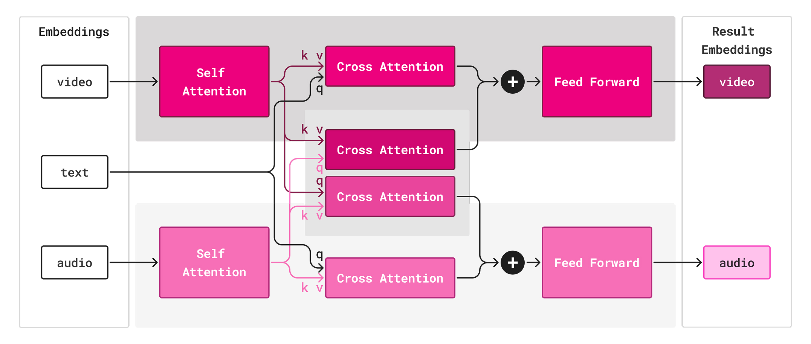
*Figure 1:Decoder transformer block for our AV-DiT architecture. Audio and video streams are fused using cross-attention. Each stream is based on the CrossDiT architecture (1).*

---
**Usage Info**: 4383 tokens used.
**Generated at**: 2026-08-18 14:36:21

---

# 📚 SPEAKER-NORMALIZED SEMANTIC SPEECH TOKENS VIA ITERATIVE S2U–T2U REFINEMENT

🚀 URL: https://arxiv.org/html/2608.16235

## 🌏 Abstract (원문)
Semantic speech tokens should preserve linguistic content while suppressing speaker- and duration-dependent variation inherited from acoustic inputs. We propose Iterative Semantic Token Purification (ISTP), an alternating speech-to-unit (S2U) and text-to-unit (T2U) training procedure guided by text predictability. Starting from an initial S2U tokenizer, each iteration trains a T2U model on its deduplicated token sequences. The decoded T2U predictions then serve as connectionist temporal classification targets for a newly initialized S2U model, whose outputs supervise the next T2U model. This cycle progressively aligns the two token generators and biases the token space toward information recoverable from text. Experiments on Mandarin and English show substantially improved S2U–T2U agreement. Independently trained de-tokenizers further show that the refined S2U and T2U tokens retain sufficient content for high-intelligibility voice conversion and text-to-speech synthesis. In voice conversion, the generated speaking rate follows the reference more closely. The refined tokens also exhibit substantially improved cross-speaker consistency and reduced probe-recoverable speaker information.
## 🌏 Abstract (번역)
의미론적 음성 토큰은 음향 입력으로부터 상속된 화자 및 지속 시간 의존적 변동을 억제하면서 언어적 내용을 보존해야 합니다. 우리는 텍스트 예측 가능성에 의해 안내되는 교대 음성-단위(S2U) 및 텍스트-단위(T2U) 훈련 절차인 반복 의미 토큰 정화(ISTP)를 제안합니다. 초기 S2U 토크나이저에서 시작하여, 각 반복은 중복 제거된 토큰 시퀀스에 대해 T2U 모델을 훈련합니다. 디코딩된 T2U 예측은 새로 초기화된 S2U 모델의 연결주의 시간 분류(CTC) 목표로 사용되며, 이 S2U 모델의 출력은 다음 T2U 모델을 감독합니다. 이 주기는 두 토큰 생성기를 점진적으로 정렬하고 토큰 공간을 텍스트에서 복구 가능한 정보 쪽으로 편향시킵니다. 만다린어와 영어에 대한 실험은 S2U-T2U 일치도가 상당히 향상되었음을 보여줍니다. 독립적으로 훈련된 디토크나이저는 정제된 S2U 및 T2U 토큰이 고음질 음성 변환 및 텍스트-음성 합성(TTS)을 위한 충분한 내용을 유지함을 추가로 보여줍니다. 음성 변환에서 생성된 발화 속도는 참조를 더 가깝게 따릅니다. 정제된 토큰은 또한 화자 간 일관성이 상당히 향상되었고, 프로브로 복구 가능한 화자 정보가 감소했습니다.

## 🔍 Methods & Results
- ISTP(Iterative Semantic Token Purification)는 텍스트 예측 가능성에 기반하여 S2U(음성-단위) 토크나이저와 T2U(텍스트-단위) 모델을 교대로 훈련하는 절차를 제안합니다.
- 초기 S2U 토크나이저(S0)는 HuBERT 인코더와 FSQ(4,096개 이산 단위)를 사용하여 음성 표현을 양자화하며, 초기 훈련 시 보조 음소 CTC 디코더로 언어적 내용 보존을 유도합니다.
- 각 반복에서 T2U 모델(Tk)은 현재 S2U 시퀀스에서 중복을 제거(deduplication)한 후, G2P 변환된 음소 시퀀스를 입력으로 받아 해당 시퀀스를 예측하도록 BART 인코더-디코더를 훈련합니다.
- 이후 새로 초기화된 S2U 모델(Sk+1)은 Tk가 텍스트로부터 디코딩한 의사(pseudo) 목표 시퀀스를 사용하여 CTC 분류기로 훈련되며, 이 과정은 텍스트에서 복구 가능한 정보로 토큰 공간을 편향시킵니다.
- 이 반복적인 훈련 주기는 S2U와 T2U 토큰 생성기를 점진적으로 정렬하고, 화자 및 지속 시간 의존적 변동을 억제하여 언어적 내용에 집중된 토큰 공간을 형성하는 것을 목표로 합니다.
- 만다린어와 영어에 대한 실험 결과, S2U-T2U 일치도가 크게 향상되었음을 확인했습니다.
- 정제된 S2U 및 T2U 토큰은 고음질 음성 변환(VC) 및 텍스트-음성 합성(TTS)에 충분한 내용을 유지하며, VC에서 생성된 발화 속도가 참조에 더 가깝게 따릅니다.
- 정제된 토큰은 화자 간 일관성이 크게 향상되었고, 프로브로 복구 가능한 화자 정보가 감소했습니다.

## 🖼 Figures

*Figure 1:Overview of the proposed framework. (a) ISTP alternates T2U training on deduplicated S2U sequences and S2U reinitialization using text-conditioned pseudo-targets. (b) The token-conditioned de-tokenizer synthesizes speech from either S2U or T2U tokens.*

---
**Usage Info**: 4193 tokens used.
**Generated at**: 2026-08-18 14:36:34

---

# 📚 Iterative Self-Learning for Expressive Text-to-Speech Synthesis

🚀 URL: https://arxiv.org/html/2608.15910

## 🌏 Abstract (원문)
Expressive text-to-speech (TTS) systems that use explicit conditioning labels provide direct and interpretable control over expressive attributes, in contrast to reference-based or prompting-based approaches, but require labeled data. Obtaining these labels at scale is costly and time-consuming, yet no prior semi-supervised framework addresses this specific bottleneck. Existing semi-supervised TTS methods instead target scarcity of paired speech-text data or transcriptions. To address the scarcity of expressive labels, we propose an Iterative Self-Learning (ISL) framework for expressive TTS, built on Invert-Classify, a classifier-free method that recovers discrete expressive labels by inverting a frozen generative model. The framework iteratively pseudo-labels unlabeled speech using the current model, retrains on the combined labeled and pseudo-labeled data, and repeats, progressively refining label quality and synthesis. We validate on two expressive tasks, word-level prominence and utterance-level emotion, across multiple low-resource data splits. We find that iterative refinement can improve pseudo-label accuracy over single-pass baselines. Furthermore, we observe that these improvements in pseudo-labeling of expressivity translate to gains in expressive label adherence and synthesis quality, confirmed by objective metrics and human listening tests. In the most data-scarce conditions, ISL-trained models outperform single-pass pseudo-labeling and further approach fully supervised performance, demonstrating that gradient-based ISL is an effective solution to expressive label scarcity in low-resource TTS.
## 🌏 Abstract (번역)
명시적 조건화 레이블을 사용하는 표현적인 텍스트-음성 변환(TTS) 시스템은 참조 기반 또는 프롬프트 기반 접근 방식과 달리 표현 속성에 대한 직접적이고 해석 가능한 제어를 제공하지만, 레이블이 지정된 데이터를 필요로 합니다. 대규모로 이러한 레이블을 얻는 것은 비용이 많이 들고 시간이 소요되지만, 기존의 어떤 준지도 학습 프레임워크도 이 특정 병목 현상을 다루지 못했습니다. 기존의 준지도 학습 TTS 방법들은 대신 쌍을 이룬 음성-텍스트 데이터 또는 전사(transcription)의 부족을 목표로 합니다. 표현 레이블의 부족을 해결하기 위해, 우리는 고정된 생성 모델을 역전시킴으로써 이산적인 표현 레이블을 복구하는 분류기 없는 방법인 Invert-Classify를 기반으로 하는 표현적인 TTS를 위한 반복적 자가 학습(ISL) 프레임워크를 제안합니다. 이 프레임워크는 현재 모델을 사용하여 레이블이 없는 음성에 반복적으로 의사 레이블을 지정하고, 레이블이 지정된 데이터와 의사 레이블이 지정된 데이터를 결합하여 재학습하며, 이를 반복하여 레이블 품질과 합성을 점진적으로 개선합니다. 우리는 여러 저자원 데이터 분할에 걸쳐 단어 수준의 강조(prominence)와 발화 수준의 감정이라는 두 가지 표현 작업에 대해 검증합니다. 반복적인 개선이 단일 패스 기준선보다 의사 레이블 정확도를 향상시킬 수 있음을 발견했습니다. 또한, 표현성의 의사 레이블링 개선이 표현 레이블 준수 및 합성 품질 향상으로 이어진다는 것을 객관적인 측정 지표와 인간 청취 테스트를 통해 확인했습니다. 가장 데이터가 부족한 조건에서, ISL 훈련 모델은 단일 패스 의사 레이블링을 능가하고 완전 지도 학습 성능에 더 가까워지며, 이는 기울기 기반 ISL이 저자원 TTS에서 표현 레이블 부족에 대한 효과적인 해결책임을 보여줍니다.

## 🔍 Methods & Results
- 표현 레이블 부족 문제를 해결하기 위해 Invert-Classify 기반의 반복적 자가 학습(ISL) 프레임워크를 제안했습니다.
- ISL 프레임워크는 현재 모델을 사용하여 레이블 없는 음성에 의사 레이블을 지정하고, 레이블이 지정된 데이터와 의사 레이블이 지정된 데이터를 결합하여 재학습하는 과정을 반복하여 레이블 품질과 합성 성능을 점진적으로 개선합니다.
- 백본 음향 모델로 Matcha-TTS를 활용했으며, 이는 경량성, 재현성, 내부 정렬(MAS), 그리고 흐름 매칭(OT-CFM) 특성 때문에 선택되었습니다.
- 단어 수준 강조(prominence)와 발화 수준 감정(emotion)이라는 두 가지 표현 작업에 대해 프레임워크를 검증했습니다.
- Invert-Classify는 고정된 생성 모델을 역전시켜 이산적인 표현 레이블을 복구하는 분류기 없는 의사 레이블링 방법입니다.
- 흐름 매칭 모델에 대한 역전(inversion)을 가능하게 하기 위해, 고정된 타임스텝(t=0.9)과 단일 고정 노이즈 텐서를 사용하여 결정론적 환경을 조성했습니다.
- 반복적 의사 레이블링의 오류 강화 문제를 해결하기 위해, 검증 세트에서 가장 높은 의사 레이블 정확도를 달성한 반복(i*)을 선택하고 해당 시점의 데이터셋으로 모델을 처음부터 재학습하는 '선택 및 재학습(Select and Retrain)' 전략을 사용했습니다.
- 실험 결과, 반복적인 개선이 단일 패스 기준선보다 의사 레이블 정확도를 향상시키고, 표현 레이블 준수 및 합성 품질 향상으로 이어짐을 확인했습니다.
- 가장 데이터가 부족한 조건에서 ISL 훈련 모델이 단일 패스 의사 레이블링을 능가하고 완전 지도 학습 성능에 근접함을 입증했습니다.

## 🖼 Figures

*(a)0.5% Data Split*

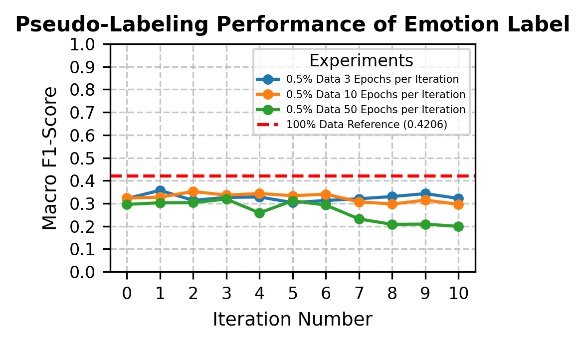
*(a)0.5% Data Split*

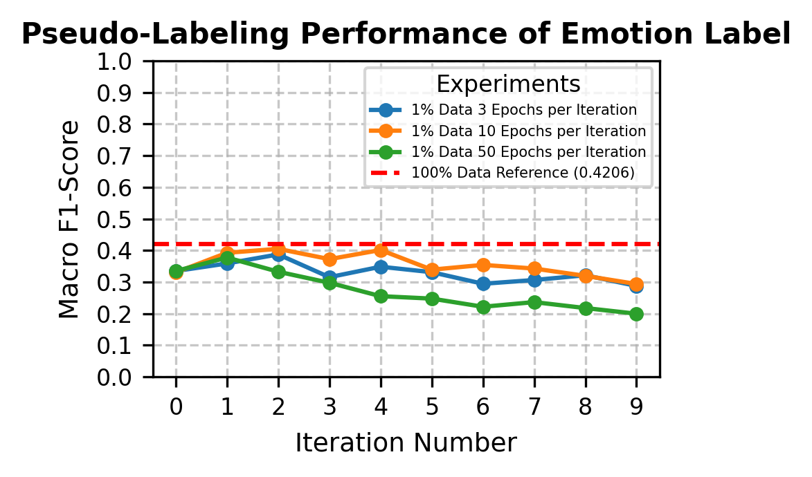
*(b)1% Data Split*

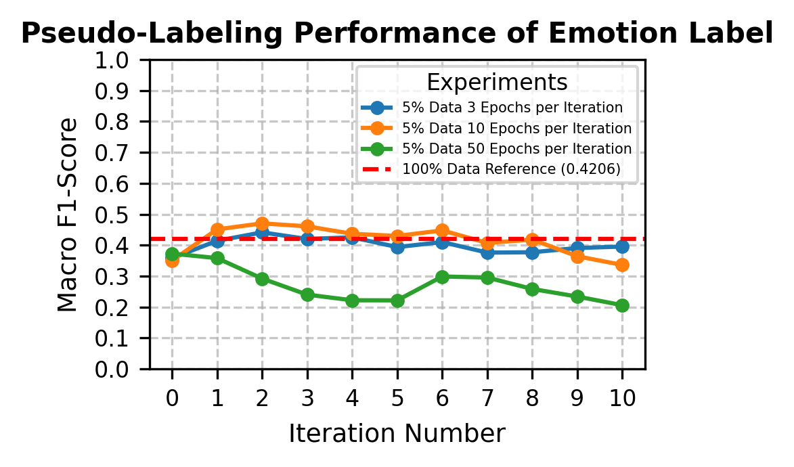
*(c)5% Data Split*

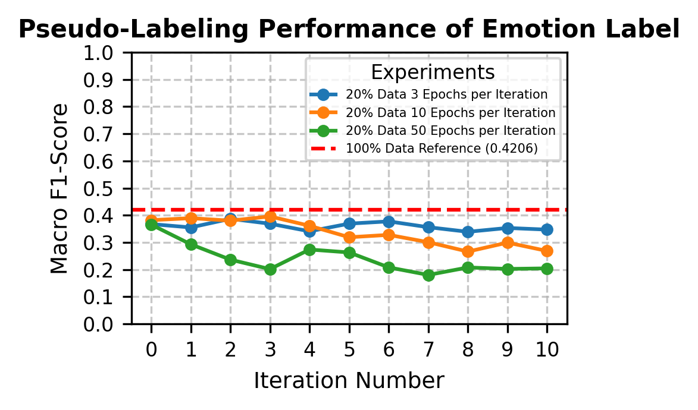
*(d)20% Data Split*

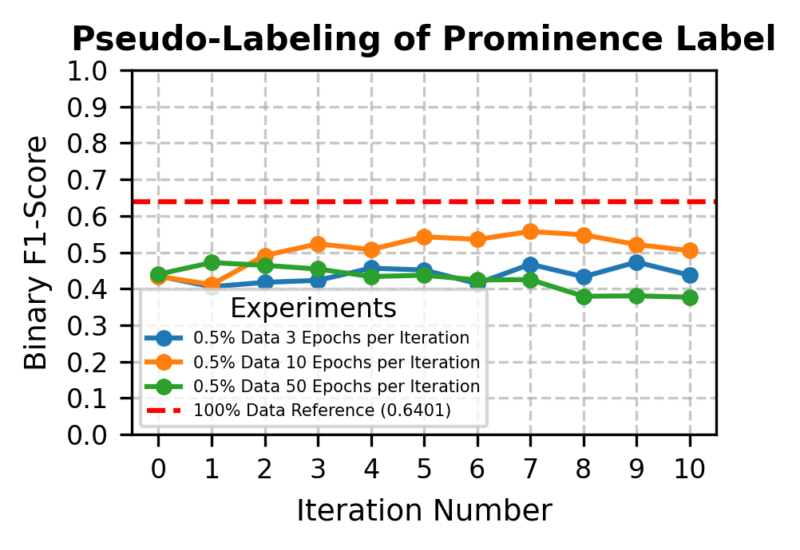
*(a)0.5% Data Split*

*(a)0.5% Data Split*

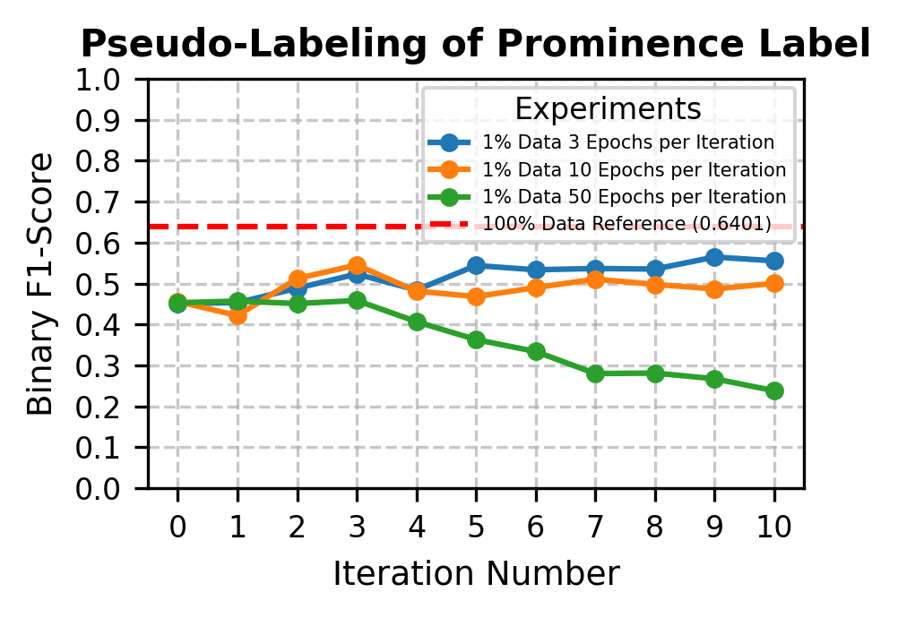
*(b)1% Data Split*

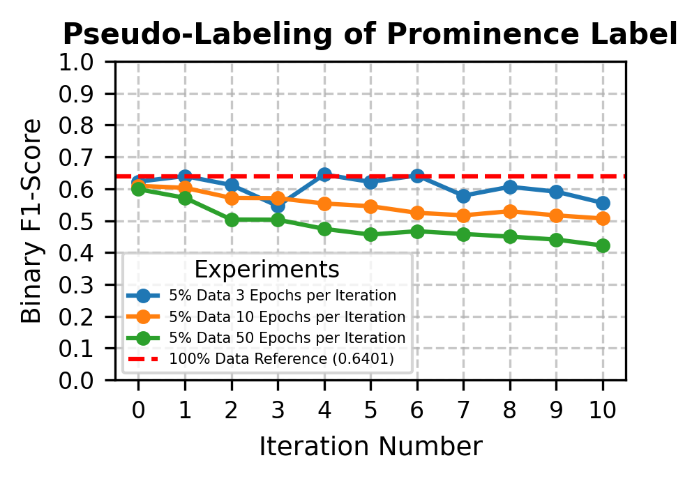
*(c)5% Data Split*

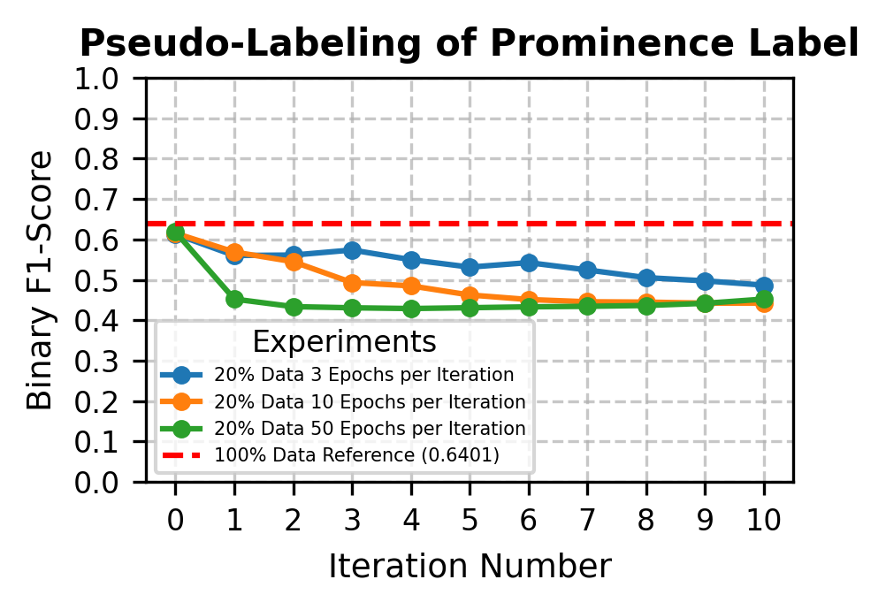
*(d)20% Data Split*

---
**Usage Info**: 5633 tokens used.
**Generated at**: 2026-08-18 14:36:51

---

# 📚 DuplexGen: Decoupling Content, Timing, and Acoustics for Synthetic Dialogue Speech

🚀 URL: https://arxiv.org/html/2608.16053

## 🌏 Abstract (원문)
Synthetic conversational speech has become an important resource for developing and evaluating conversational speech systems. However, existing dialogue synthesis pipelines typically generate dialogue content first and then insert interruptions, overlap, and backchannels using handcrafted markers or timing rules, making conversational timing prescribed rather than interaction-driven. We present DuplexGen, a dialogue synthesis framework that explicitly decouplescontent,timing, andacoustics. An LLM first generates the dialogue script, and then two full-duplex conversational models perform the script while listening to each other in real time. This allows conversational timing to emerge naturally while preserving the scripted content. Finally, a high-fidelity text-to-speech model re-renders the interaction without altering its timing. As a demonstration of the proposed framework, we construct a patient–clinician conversational speech corpus with construction-time annotations, including word timestamps, speaker activity, overlap regions, and interaction events. Experimental results show that the proposed framework produces conversational dynamics closer to the real-dialogue reference distribution than the stitching baselines evaluated in this study.
## 🌏 Abstract (번역)
합성 대화 음성은 대화 음성 시스템을 개발하고 평가하는 데 중요한 자원이 되었습니다. 그러나 기존의 대화 합성 파이프라인은 일반적으로 대화 내용을 먼저 생성한 다음 수작업으로 만든 마커나 타이밍 규칙을 사용하여 끼어들기, 겹침, 맞장구를 삽입하여 대화 타이밍이 상호작용 기반이 아닌 미리 정해진 방식이었습니다. 본 연구에서는 내용, 타이밍, 음향을 명시적으로 분리하는 대화 합성 프레임워크인 DuplexGen을 제시합니다. LLM이 먼저 대화 스크립트를 생성한 다음, 두 개의 전이중(full-duplex) 대화 모델이 실시간으로 서로의 말을 들으면서 스크립트를 수행합니다. 이를 통해 스크립트 내용을 보존하면서 대화 타이밍이 자연스럽게 나타나도록 합니다. 마지막으로, 고음질 TTS(Text-to-Speech) 모델이 타이밍을 변경하지 않고 상호작용을 다시 렌더링합니다. 제안된 프레임워크의 시연으로, 단어 타임스탬프, 화자 활동, 겹침 영역 및 상호작용 이벤트를 포함한 구성 시점 주석이 있는 환자-임상의 대화 음성 코퍼스를 구축했습니다. 실험 결과는 제안된 프레임워크가 본 연구에서 평가된 스티칭(stitching) 기준선보다 실제 대화 참조 분포에 더 가까운 대화 역학을 생성함을 보여줍니다.

## 🔍 Methods & Results
- DuplexGen은 대화 생성을 내용(content), 타이밍(timing), 음향(acoustics)의 세 가지 독립적인 단계로 분리하며, 각 단계는 서로의 결정에 영향을 주지 않습니다.
- 첫 번째 단계에서 LLM(대규모 언어 모델)이 대화 스크립트(내용)를 생성하여 대화의 어휘적 출력을 고정합니다.
- 두 번째 단계에서 두 개의 전이중(full-duplex) 대화 모델이 실시간으로 서로의 오디오를 들으면서 스크립트를 수행하여 대화 타이밍을 생성합니다. 이 모델은 다음 스크립트 토큰을 발화할지 또는 침묵할지 결정하며, 발화할 단어는 스크립트 또는 미리 정의된 맞장구 목록으로 제한됩니다.
- 대화 타이밍은 핸드오프 창(Wh), 최대 패딩(Pmax), 맞장구 불응 기간(Rbc)의 세 가지 제어 매개변수에 의해 조절되어 상호작용 이벤트의 빈도를 관리합니다.
- 세 번째 단계에서 고음질 TTS(Text-to-Speech) 시스템(CosyVoice)이 전이중 모델이 생성한 상징적 상호작용 점수(화자 활동, 턴 경계, 겹침 영역, 맞장구 위치 포함)를 사용하여 대화를 다시 렌더링하며, 타이밍은 상대적 위치를 통해 보존됩니다.
- 렌더링 품질 향상을 위해 슬라이딩 프롬프트, 물리적으로 잘린 음성 및 크로스페이드, 독립적으로 합성된 맞장구 혼합 등의 구현 세부 사항이 적용됩니다.
- 합성 과정에서 단어 타임스탬프, 화자 활동, 겹침, 끼어들기, 공백, 맞장구 레이블 등 모든 주석이 자동으로 생성됩니다.
- 제안된 프레임워크의 시연으로, 단어 타임스탬프, 화자 활동, 겹침 영역 및 상호작용 이벤트를 포함한 구성 시점 주석이 있는 환자-임상의 대화 음성 코퍼스가 구축되었습니다.
- 실험 결과, DuplexGen은 기존의 스티칭(stitching) 기준선보다 실제 대화 참조 분포에 더 가까운 대화 역학을 생성하는 것으로 나타났습니다.

## 🖼 Figures

*Fig. 1:Overview of the proposed dialogue synthesis framework. An LLM first generates the dialogue script (content). Two full-duplex conversational models then perform the script through real-time interaction, allowing conversational dynamics to emerge naturally. Finally, a high-fidelity TTS system re-renders the interaction while preserving the generated dynamics.*

---
**Usage Info**: 3124 tokens used.
**Generated at**: 2026-08-18 14:37:00

---

# 📚 AnyTalk: Speech Animation for Arbitrary Characters Leveraging a Video Generation Model

🚀 URL: https://arxiv.org/html/2608.16143

## 🌏 Abstract (원문)
We present AnyTalk, a novel method for generating 3D speech animations for arbitrary characters without requiring any animation data. While existing audio-driven 3D speech animation methods rely on character-specific training data or laborious rigging/re-meshing, AnyTalk circumvents these limitations by leveraging recent video diffusion models trained on extensive video datasets. We first adapt a pre-trained video diffusion model to a target character through our Character-specific Fine-tuning (CsF) technique. By fine-tuning on rendered images of the 3D character paired with zeroed-out audio embeddings (representing “no motion”), we eliminate the need for animation data while preserving the motion prior of large-scale video diffusion model. We then uplift the resulting talking-head video into a 3D speech animation by estimating blendshape parameters through a proposed optimization process. AnyTalk enables lip-synced animations across diverse face meshes and blendshape configurations, significantly reducing manual effort and data requirements. We further enhance usability by distilling AnyTalk into a streamlined network,AnyTalkR	T, thereby enabling real-time performance. By leveraging talking-head video generation, our method broadens access to audio-driven speech animation technology for arbitrary characters. The code is publicly available atAnyTalk.
## 🌏 Abstract (번역)
저희는 어떠한 애니메이션 데이터도 필요로 하지 않고 임의의 캐릭터에 대한 3D 음성 애니메이션을 생성하는 새로운 방법인 AnyTalk를 소개합니다. 기존의 오디오 기반 3D 음성 애니메이션 방법들은 캐릭터별 훈련 데이터나 번거로운 리깅/리메싱에 의존하는 반면, AnyTalk는 광범위한 비디오 데이터셋으로 훈련된 최신 비디오 확산 모델을 활용하여 이러한 한계를 극복합니다. 저희는 먼저 Character-specific Fine-tuning (CsF) 기술을 통해 사전 훈련된 비디오 확산 모델을 대상 캐릭터에 맞게 조정합니다. 3D 캐릭터의 렌더링된 이미지와 (움직임 없음을 나타내는) 제로화된 오디오 임베딩을 짝지어 미세 조정함으로써, 대규모 비디오 확산 모델의 움직임 사전 지식을 보존하면서 애니메이션 데이터의 필요성을 없앱니다. 그런 다음 제안된 최적화 과정을 통해 블렌드셰이프 파라미터를 추정하여 결과적인 토킹 헤드 비디오를 3D 음성 애니메이션으로 변환합니다. AnyTalk는 다양한 얼굴 메시와 블렌드셰이프 구성에 걸쳐 립싱크 애니메이션을 가능하게 하여 수동 작업과 데이터 요구 사항을 크게 줄입니다. 저희는 AnyTalk를 간소화된 네트워크인 AnyTalkRT로 증류하여 실시간 성능을 가능하게 함으로써 사용성을 더욱 향상시킵니다. 토킹 헤드 비디오 생성을 활용함으로써, 저희 방법은 임의의 캐릭터를 위한 오디오 기반 음성 애니메이션 기술에 대한 접근성을 확대합니다. 코드는 AnyTalk에서 공개적으로 이용 가능합니다.

## 🔍 Methods & Results
- AnyTalk는 애니메이션 데이터 없이 임의의 캐릭터에 대한 3D 음성 애니메이션을 생성하는 새로운 방법론을 제시한다.
- 기존 오디오 기반 3D 음성 애니메이션 방법의 한계(캐릭터별 훈련 데이터, 번거로운 리깅/리메싱)를 대규모 비디오 데이터셋으로 훈련된 최신 비디오 확산 모델을 활용하여 극복한다.
- 방법론은 크게 두 단계로 구성된다: 1) 오디오 기반 비디오 확산 모델을 사용한 비디오 생성, 2) 생성된 비디오 프레임에서 블렌드셰이프 파라미터 추정.
- **Character-specific Fine-tuning (CsF)** 기술을 도입하여 사전 훈련된 비디오 확산 모델(Hallo)을 대상 캐릭터에 맞게 조정한다.
- CsF는 3D 캐릭터의 렌더링된 이미지와 '움직임 없음'을 나타내는 제로화된 오디오 임베딩을 사용하여 미세 조정함으로써 애니메이션 데이터의 필요성을 없애고 대규모 비디오 확산 모델의 움직임 사전 지식을 보존한다.
- CsF 훈련 시 모든 어텐션 레이어를 고정하고 공간 잔차 네트워크만 훈련하며, 추론 시에는 동적인 입술 움직임과 정적인 머리 자세를 위해 어텐션 가중치(w_pose=0, w_exp=1, w_lip=2)를 재조정한다.
- 블렌드셰이프 파라미터 추정 단계에서는 토크 랜드마크 손실, 비대칭 입 벌림 손실, 정규화 손실을 포함하는 최적화 과정을 사용한다.
- 토크 랜드마크 손실은 3D 캐릭터의 랜드마크가 생성된 2D 비디오와 정확히 일치하도록 하며, 머리 움직임으로 인한 얼굴 정렬 변화를 보정하기 위해 이미지 호모그래피를 적용한다.
- 비대칭 입 벌림 손실은 고주파 움직임 부족 문제를 해결하고 3D 캐릭터의 입 벌림 범위가 비디오와 일치하도록 한다.
- AnyTalk는 다양한 얼굴 메시와 블렌드셰이프 구성에 걸쳐 립싱크 애니메이션을 가능하게 하여 수동 작업과 데이터 요구 사항을 크게 줄인다.
- AnyTalk를 간소화된 네트워크인 AnyTalkRT로 증류하여 실시간 성능을 제공한다.

## 🖼 Figures

*Figure 2:Overview of baseline audio-driven video diffusion model 
𝐷
𝑠
​
𝑟
​
𝑐
. Because 
𝐷
𝑠
​
𝑟
​
𝑐
 adopts 
𝑤
𝑝
​
𝑜
​
𝑠
​
𝑒
, 
𝑤
𝑒
​
𝑥
​
𝑝
, and 
𝑤
𝑙
​
𝑖
​
𝑝
 to control the degree of motion, AnyTalk is capable of generating dynamic lip movements while maintaining minimal head rotation.*

![Figure 3:Domain gap between generated and rendered images. From an input image (left), a video is generated using existing talking-head generation models [62, 75, 30, 4] (middle). A clear mismatch can be observed between their appearances and the rendered images (right).](../images/2026-08-18/2608.16143/2608.16143_fig1.png)
*Figure 3:Domain gap between generated and rendered images. From an input image (left), a video is generated using existing talking-head generation models [62, 75, 30, 4] (middle). A clear mismatch can be observed between their appearances and the rendered images (right).*

*Figure 4:Finetuning process of 
𝐷
𝐶
​
𝑠
​
𝐹
. The rendered images of the target 3D character and the zero condition 
𝐶
𝑧
​
𝑒
​
𝑟
​
𝑜
 are used to form a pair for fine-tuning the model. To preserve the motion prior, only the spatial residual network of denoising UNet is trained (flame icon), while the other layers remain frozen.*

*Figure 5: Inference of 
𝐷
𝐶
​
𝑠
​
𝐹
 . Non-zero speech passes through the audio encoder to provide motion information, while the latent representations 
𝑎
𝑝
​
𝑜
​
𝑠
​
𝑒
, 
𝑎
𝑒
​
𝑥
​
𝑝
, and 
𝑎
𝑙
​
𝑖
​
𝑝
 are scaled by the corresponding factors 
𝑤
𝑝
​
𝑜
​
𝑠
​
𝑒
, 
𝑤
𝑒
​
𝑥
​
𝑝
, and 
𝑤
𝑙
​
𝑖
​
𝑝
 to achieve dynamic lip motion and a stable head pose.*

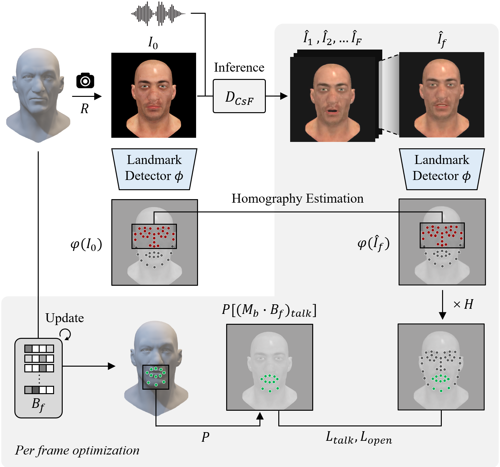
*Figure 6:Optimization process. Blendshape parameters are optimized so that the target 3D character accurately follows the generated video when rendered.*

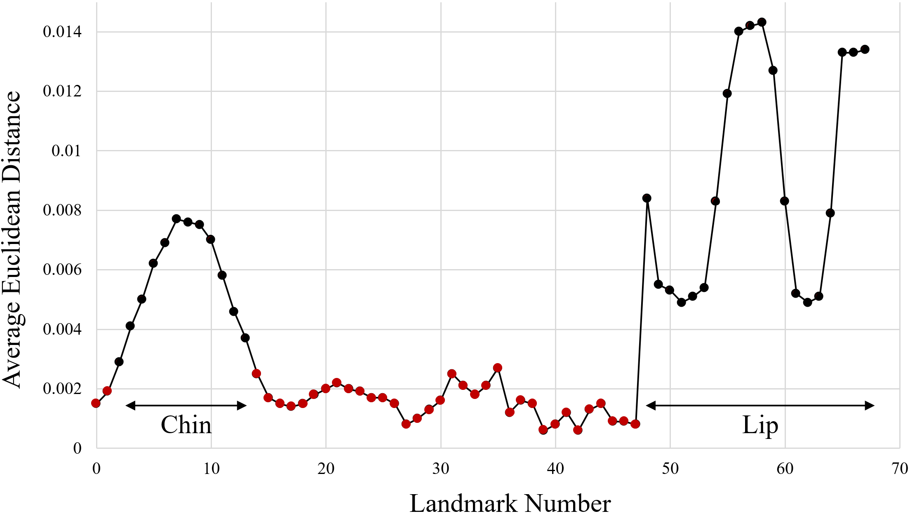
*Figure 7:Lip and chin landmarks exhibit the high average displacement, suboptimal for robust homography estimation.*

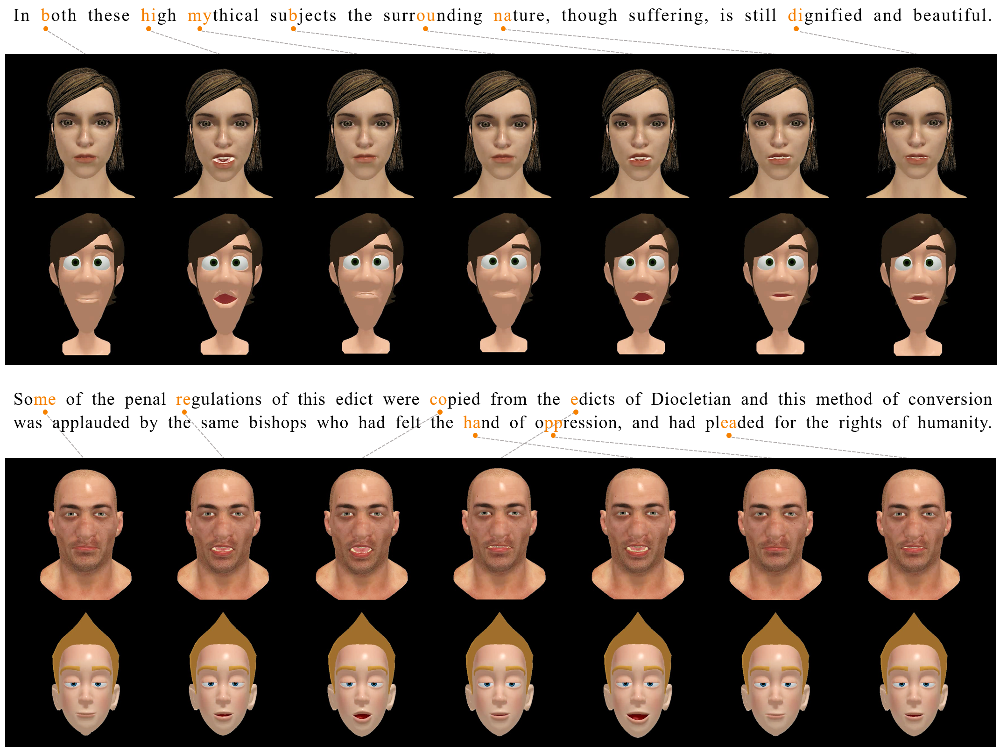
*Figure 8:Qualitative results of AnyTalk using two different audio sources. The top two rows shows results of Emily and Malcolm, while bottom two rows shows result of Victor and Morphy.*

*Figure 9:From input image (left) and audio, 2D video is generated using 
𝐷
𝐶
​
𝑠
​
𝐹
 (middle). From this video, final 3D speech animation is optimized (right).*

*Figure 10:Comparison with baselines on Morphy. Each phoneme and its corresponding frame are presented for comparison. Ours best follows the given audio with wider mouth opening and precise lip closure, while ScanTalk, DiffSpeaker + NFR, and CodeTalker + NFR exhibit only subtle movement.*

*Figure 11:Visual results of generated video. Ours correctly generated the lip shape without artifacts. On the other hand, w/o 
𝐶
​
𝑠
​
𝐹
 made double chin, pinched eye, which does not match with the source character. Variants w/o 
𝐶
𝑧
​
𝑒
​
𝑟
​
𝑜
 and w/o freezing module produced small and subtle lip motion.*

*Figure 12:Results of the ablation study on 3D speech animation. Words corresponding to the rendered images of Malcolm and VMan are presented on the left. While our method correctly produced the lip movements corresponing to the given words, the alternatives produced either only subtle lip movements or artifacts.*

*Figure 13:Quantitative results for head pose weights. Lip-sync performance degrades as 
𝑤
𝑝
​
𝑜
​
𝑠
​
𝑒
 increase.*

*Figure 14:Network architecture for 
AnyTalk
𝑅
​
𝑇
.*

*Figure 15:Distillation process from AnyTalk to 
AnyTalk
𝑅
​
𝑇
. Audio2Feat extracts features from the input audio, while Feat2BS predicts blendshape parameters from the extracted features.*

*Figure 16:Results of AnyTalk and 
AnyTalk
𝑅
​
𝑇
, correctly following the phoneme of the given audio and depicting similar speech motion.*

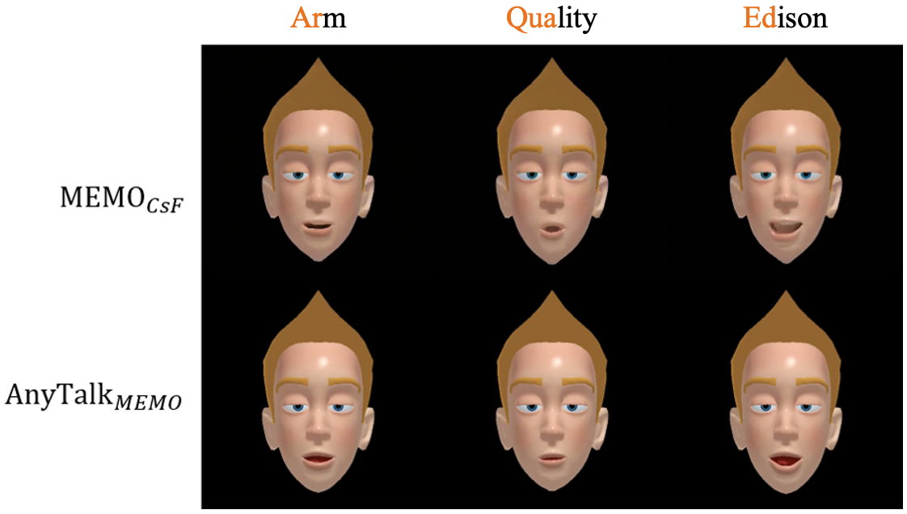
*Figure 17:Qualitative results of MEMOCsF and AnyTalkMEMO, showing the generalability of AnyTalk Framework.*

*Figure 17*

*Figure 18*

*Figure 19*

*Figure 20*

*Figure 21*

*Figure 22*

---
**Usage Info**: 6092 tokens used.
**Generated at**: 2026-08-18 14:37:17

---

# 📚 CineDub: Scaling End-to-End Video Dubbing to Multi-Speaker Dialogues with Coherent Sound Effects

🚀 URL: https://arxiv.org/html/2608.15734

## 🌏 Abstract (원문)
Automatic video dubbing in the wild remains fundamentally limited by two competing constraints: hierarchical methods depend on brittle, multi-stage preprocessing pipelines that severely restrict data scalability and practical deployment, while holistic approaches operating on uncropped video suffer from weak temporal alignment and speaker-utterance ambiguity in multi-speaker settings. To overcome these limitations, we proposeCineDub, a unified diffusion-based model that achieves precise multi-speaker dialogue dubbing directly from uncropped videos, without face cropping or speaker diarization. Central to our approach is the Implicitly-Coupled Holistic Conditioning(ICHC)paradigm, where holistic visual representations and a semantic-bundled transcription format are encoded independently, yet implicitly coupled through cross-modal training to resolve speaker ambiguity and enable precise multi-speaker multi-turn dialogue dubbing. Building on the unified temporal cues captured by holistic visual features, we further extend CineDub to joint speech and audio generation. We introduce an Ambient-to-Linguistic Curriculum Learning(ALC)to mitigate sub-task degradation, and a decoupled textual branch control mechanism to resolve cross-prompt interference during simultaneous generation. We also release two in-the-wild benchmarks,CineDub-Multifor multi-speaker dialogue dubbing andCineDub-SAfor video-to-speech-and-audio (V2SA) generation, to enable evaluation under realistic conditions. Experiments show that CineDub achieves state-of-the-art results on established single-speaker dubbing and video-to-audio benchmarks while excelling in multi-speaker dialogue dubbing and acoustically coherent joint generation.
## 🌏 Abstract (번역)
야생 환경에서의 자동 비디오 더빙은 두 가지 상충하는 제약으로 인해 근본적으로 제한됩니다. 계층적 방법은 데이터 확장성과 실제 배포를 심각하게 제한하는 취약하고 다단계적인 전처리 파이프라인에 의존하는 반면, 자르지 않은 비디오에서 작동하는 전체론적 접근 방식은 다중 화자 설정에서 약한 시간 정렬과 화자-발화 모호성으로 어려움을 겪습니다. 이러한 한계를 극복하기 위해 우리는 얼굴 자르기나 화자 분리 없이 자르지 않은 비디오에서 직접 정확한 다중 화자 대화 더빙을 달성하는 통합 확산 기반 모델인 CineDub을 제안합니다. 우리 접근 방식의 핵심은 암묵적으로 결합된 전체론적 조건화(ICHC) 패러다임입니다. 여기서 전체론적 시각적 표현과 의미론적으로 묶인 전사 형식은 독립적으로 인코딩되지만, 화자 모호성을 해결하고 정확한 다중 화자 다중 턴 대화 더빙을 가능하게 하기 위해 교차 모달 훈련을 통해 암묵적으로 결합됩니다. 전체론적 시각적 특징이 포착하는 통합된 시간적 단서를 기반으로, 우리는 CineDub을 공동 음성 및 오디오 생성으로 더욱 확장합니다. 우리는 하위 작업 저하를 완화하기 위한 주변-언어 커리큘럼 학습(ALC)과 동시 생성 중 교차 프롬프트 간섭을 해결하기 위한 분리된 텍스트 브랜치 제어 메커니즘을 도입합니다. 또한 현실적인 조건에서 평가를 가능하게 하기 위해 다중 화자 대화 더빙을 위한 CineDub-Multi와 비디오-음성-오디오(V2SA) 생성을 위한 CineDub-SA라는 두 가지 야생 환경 벤치마크를 공개합니다. 실험 결과 CineDub은 기존 단일 화자 더빙 및 비디오-오디오 벤치마크에서 최첨단 결과를 달성하는 동시에 다중 화자 대화 더빙 및 음향적으로 일관된 공동 생성에서 뛰어난 성능을 보였습니다.

## 🔍 Methods & Results
- CineDub은 오디오를 연속 잠재 표현으로 압축하는 VAE와 노이즈 제거를 위한 Diffusion Transformer(DiT)를 사용하는 잠재 확산 프레임워크를 기반으로 한다.
- **Implicitly-Coupled Holistic Conditioning (ICHC)** 패러다임을 도입하여, SynchFormer에서 추출한 전체론적 시각적 특징(cv)과 화자 식별 및 발화 내용을 결합한 의미론적으로 묶인 전사 형식(ct)을 교차 모달 훈련을 통해 암묵적으로 결합하여 화자 모호성을 해결한다.
- SynchFormer의 시각적 인코더는 일반적인 오디오-시각 동기화 목표로 훈련되었음에도 불구하고, 화자의 입술 영역에 주의를 집중하고 활성 화자를 암묵적으로 추적하여 더빙에 필요한 미세한 정렬 단서를 제공한다.
- 의미론적으로 묶인 전사 형식은 각 발화 세그먼트에 대해 화자의 시각적/음성적 특징 설명(dk)과 해당 전사(uk)를 결합하여, DiT가 올바른 얼굴에 주의를 기울이고 화자-발화 대응을 확립하도록 돕는다.
- CineDub은 공동 음성 및 오디오 생성을 위해 확장되었으며, 프레임 수준 CLIP 특징 또는 Flan-T5 인코딩 자연어 오디오 프롬프트에서 파생된 선택적 전역 의미 조건(ca)을 도입한다.
- **Ambient-to-Linguistic Curriculum Learning (ALC)**을 제안하여, 공동 훈련 시 하위 작업 성능 저하를 완화한다. 이는 오디오 생성(더 넓은 작업)부터 시작하여 음성 생성(더 좁은 작업)으로 점진적으로 훈련하는 방식이다.
- **분리된 텍스트 브랜치 제어 메커니즘**을 사용하여, 공동 생성 시 주의 분산을 해결한다. 이는 언어적 조건(ct)과 음향적 조건(ca)을 독립적인 병렬 교차 주의 브랜치를 통해 처리한다.
- 단일 작업 추론 시 교차 작업 간섭을 억제하기 위해, 부재하는 조건에 대한 구조화된 플레이스홀더로 학습 가능한 메타 토큰(mt, ma)을 도입한다.
- 다중 화자 대화 더빙을 위한 **CineDub-Multi**와 비디오-음성-오디오(V2SA) 생성을 위한 **CineDub-SA**라는 두 가지 새로운 야생 환경 벤치마크를 공개했다.
- 실험 결과, CineDub은 기존 단일 화자 더빙 및 비디오-오디오 벤치마크에서 최첨단 결과를 달성했으며, 다중 화자 대화 더빙 및 음향적으로 일관된 공동 생성에서 뛰어난 성능을 보였다.

## 🖼 Figures
![Figure 1:(a) Existing dialogue dubbing methods rely on complex preprocessing to provide active cropped speaker regions with corresponding timestamps and transcripts, limiting scalability and practicality. (b) Generating accompanying sound effects requires a separate V2A model, which inevitably introduces ghost speech and acoustic incoherence with the dubbed speech. (c) CineDub jointly generates multi-speaker dialogue with coherent audio through a unified end-to-end model, requiring only an uncropped video and an MLLM-generated semantic-bundled transcription.](../images/2026-08-18/2608.15734/2608.15734_fig0.png)
*Figure 1:(a) Existing dialogue dubbing methods rely on complex preprocessing to provide active cropped speaker regions with corresponding timestamps and transcripts, limiting scalability and practicality. (b) Generating accompanying sound effects requires a separate V2A model, which inevitably introduces ghost speech and acoustic incoherence with the dubbed speech. (c) CineDub jointly generates multi-speaker dialogue with coherent audio through a unified end-to-end model, requiring only an uncropped video and an MLLM-generated semantic-bundled transcription.*

*Figure 2:Visualization of SynchFormer self-attention maps (magenta: active speaker; white: inactive speaker). (a) Single-speaker setting: attention concentrates on the lip region. (b) Two-speaker setting: attention dynamically shifts to the active speaker across turns. (c) Failure cases: attention drifts to a non-speaking face during overlapping speech or becomes ambiguous at shot boundaries.*

![Figure 3:Overview of CineDub under the ICHC paradigm. The holistic visual condition 
𝐜
𝑣
 (left), extracted by SynchFormer (Sec. 3.2.1), encodes both event-level audio-visual correspondences and fine-grained lip-sync alignment. To address the speaker assignment ambiguity in 
𝐜
𝑣
, the semantic-bundled transcription 
𝐜
𝑡
 (right) provides per-segment speaker-utterance grounding cues, implicitly coupling with 
𝐜
𝑣
 via multi-conditional training (Sec. 3.2.2). CineDub adopts a unified DiT backbone that supports both joint video-to-speech-and-audio generation and each subtask. 
𝐜
𝑡
 and 
𝐜
𝑎
 are routed through decoupled textual branches to prevent cross-prompt interference, with learnable meta-tokens replacing inactive branches during single-task inference (Sec. 3.3.2).](../images/2026-08-18/2608.15734/2608.15734_fig2.png)
*Figure 3:Overview of CineDub under the ICHC paradigm. The holistic visual condition 
𝐜
𝑣
 (left), extracted by SynchFormer (Sec. 3.2.1), encodes both event-level audio-visual correspondences and fine-grained lip-sync alignment. To address the speaker assignment ambiguity in 
𝐜
𝑣
, the semantic-bundled transcription 
𝐜
𝑡
 (right) provides per-segment speaker-utterance grounding cues, implicitly coupling with 
𝐜
𝑣
 via multi-conditional training (Sec. 3.2.2). CineDub adopts a unified DiT backbone that supports both joint video-to-speech-and-audio generation and each subtask. 
𝐜
𝑡
 and 
𝐜
𝑎
 are routed through decoupled textual branches to prevent cross-prompt interference, with learnable meta-tokens replacing inactive branches during single-task inference (Sec. 3.3.2).*

---
**Usage Info**: 7141 tokens used.
**Generated at**: 2026-08-18 14:37:33

---

# 📚 Prototype-Rectified Iterative Self-supervised Manifold Denoising under Severe Acoustic Shift

🚀 URL: https://arxiv.org/html/2608.15037

## 🌏 Abstract (원문)
Audio-Text Foundation Models (ATMs) fail catastrophically under severe acoustic noise, yet existing adaptation strategies either rely on gradient-based Test-Time Adaptation (TTA), which reinforces noise rather than signal, or on prompt tuning that requires privileged noise annotations unavailable at inference. We address these failures withPRISM (Prototype-Rectified Iterative Self-supervised Manifold Denoising), a training-free, source-free TTA framework grounded in theAffine Noise Hypothesis: severe acoustic noise induces a low-rank affine shift in the multimodal latent space, with more than 90% of distortion energy confined to the leading 60 principal components. PRISM estimates and reverses this distortion from an unlabeled target batch using frozen text prototypes as geometric anchors via three closed-form geometric corrections compiled into a single static projection matrix by Affine Bias Regression. In inference, adaptation reduces to one matrix-vector multiplication in9×10−49\times 10^{-4}ms, making it substantially faster than gradient-based TTA while requiring no additional training. On UrbanSound8K, PRISM improves over the zero-shot baseline by+12.94+12.94pp and surpasses an oracle-assisted TTA baseline by+9.41+9.41pp, which requires privileged augmented noise prompts PRISM never sees. We further identify thePolyphonic Trap, a principled failure mode of subspace deflation for broadband classes, and resolve it via Confidence-Aware Regression (CAR), recovering up to 8.16 pp for the worst-affected class. The code is available athttps://github.com/Ashish-1108/PRISM.
## 🌏 Abstract (번역)
오디오-텍스트 파운데이션 모델(ATMs)은 심각한 음향 잡음 하에서 치명적으로 실패하지만, 기존의 적응 전략은 신호보다 잡음을 강화하는 경사 기반 테스트-시간 적응(TTA)에 의존하거나, 추론 시 사용할 수 없는 특권적인 잡음 주석이 필요한 프롬프트 튜닝에 의존합니다. 우리는 이러한 실패를 PRISM(Prototype-Rectified Iterative Self-supervised Manifold Denoising)으로 해결합니다. PRISM은 '어파인 잡음 가설(Affine Noise Hypothesis)'에 기반한 훈련-무료, 소스-무료 TTA 프레임워크입니다. 이 가설은 심각한 음향 잡음이 다중 모달 잠재 공간에서 저랭크 어파인 변환을 유발하며, 왜곡 에너지의 90% 이상이 상위 60개 주성분에 국한된다는 것입니다. PRISM은 고정된 텍스트 프로토타입을 기하학적 앵커로 사용하여 레이블이 없는 타겟 배치로부터 이러한 왜곡을 추정하고 역변환합니다. 이는 Affine Bias Regression을 통해 단일 정적 투영 행렬로 통합된 세 가지 폐쇄형 기하학적 보정을 통해 이루어집니다. 추론 시 적응은 9×10−4ms 내에 단일 행렬-벡터 곱셈으로 줄어들어, 경사 기반 TTA보다 훨씬 빠르면서도 추가 훈련이 필요 없습니다. UrbanSound8K에서 PRISM은 제로샷 기준선 대비 +12.94%p 향상되었고, PRISM이 접하지 않는 특권적인 증강 잡음 프롬프트가 필요한 오라클 지원 TTA 기준선보다 +9.41%p 뛰어났습니다. 우리는 또한 광대역 클래스에 대한 부분 공간 축소의 원칙적인 실패 모드인 '다성음 함정(Polyphonic Trap)'을 식별하고, Confidence-Aware Regression(CAR)을 통해 이를 해결하여 가장 큰 영향을 받은 클래스에서 최대 8.16%p를 회복했습니다. 코드는 https://github.com/Ashish-1108/PRISM에서 확인할 수 있습니다.

## 🔍 Methods & Results
- PRISM은 음향 잡음이 심한 환경에서 오디오-텍스트 파운데이션 모델(ATMs)의 성능 저하를 해결하기 위한 훈련-무료, 소스-무료 테스트-시간 적응(TTA) 프레임워크이다.
- 이 프레임워크는 '어파인 잡음 가설(Affine Noise Hypothesis)'에 기반하며, 심각한 음향 잡음이 다중 모달 잠재 공간에서 저랭크 어파인 변환을 유발한다고 가정한다.
- PRISM은 고정된 텍스트 프로토타입을 기하학적 앵커로 사용하여 레이블이 없는 타겟 배치로부터 이러한 왜곡을 추정하고 역변환한다.
- 세 가지 폐쇄형 기하학적 보정(Orthogonal Procrustes Cross-modal Alignment (OPCA), Class-Conditioned Variance Deflation (CCVD), Per-Class Residual Translation)을 포함하며, 이들은 Affine Bias Regression (ABR)을 통해 단일 정적 투영 행렬로 통합된다.
- 적응 과정은 3회 반복되며, 추론 시에는 단일 행렬-벡터 곱셈(9×10−4ms)으로 이루어져 기존 경사 기반 TTA보다 훨씬 빠르며 추가 훈련이나 배치 통계가 필요 없다.
- UrbanSound8K 데이터셋에서 PRISM은 제로샷 기준선 대비 +12.94%p, 오라클 지원 TTA 기준선 대비 +9.41%p 성능 향상을 달성했다.
- '다성음 함정(Polyphonic Trap)'이라는 실패 모드를 식별하고, Confidence-Aware Regression (CAR)을 통해 이를 해결하여 가장 큰 영향을 받은 클래스에서 최대 8.16%p의 성능을 회복했다.

## 🖼 Figures

*Figure 1. Overview of PRISM. (a) ContextDA (top-left) requires privileged oracle prompts, whereas PRISM (bottom-left) compiles geometric corrections into a static projection matrix 
𝐖
 for fully blind adaptation. (b) Top-right: PRISM satisfies all key desiderata for edge inference. (c) Bottom-right: PRISM achieves higher accuracy with substantially lower inference latency than the strongest-performing baseline.*

*Figure 5.Diagnostic Analysis of PRISM. Left: Per-class accuracy vs. zero-shot CLAP. Spectrally sparse classes gain substantially, confirming CCVD separates noise from signal for impulsive classes. Right: Cross-environment heatmap (
Δ
 Acc = PRISM 
−
 ZS). Consistent improvement across 8 classes validates the Affine Noise Hypothesis.*

---
**Usage Info**: 6128 tokens used.
**Generated at**: 2026-08-18 14:37:47

---

# 📚 AudioTQ: A Data-Oblivious 6-Bit CPU Audio Codec via Randomized Hadamard Rotation and Lloyd-Max Quantization

🚀 URL: https://arxiv.org/html/2608.15369

## 🌏 Abstract (원문)
Lossy audio compression algorithms traditionally rely on psychoacoustic modeling and frequency-domain representations (e.g., MP3, AAC, and Opus) to discard information that is imperceptible to the human auditory system. While highly effective, these approaches are computationally complex and domain-specific. In this paper, we present the design and mathematical formulation ofAudioTQ, a data-oblivious lossy audio codec that operates directly in the time domain. Inspired by Large Language Model (LLM) weight quantization techniques (specifically theTurboQuantframework), AudioTQ uniformizes volatile time-domain amplitudes into a predictable standard normal distribution using an orthonormal, randomized Fast Walsh-Hadamard Transform (FWHT) rotation. This enables coordinate-wise scalar quantization using an offline-trained, MSE-optimal 6-bit Lloyd-Max quantizer, augmented by a 1-bit Quantized Joint Least-Squares (QJL) residual correction layer. The resulting 7-bit virtual indices are packed into native 8-bit containers, aligning with standard CPU register boundaries to ensure real-time single-threaded execution without hardware parallel accelerators. We detail the bitwise reconstruction of 24-bit studio stems, analyze the butterfly network of the FWHT, derive the mathematical failure modes under sparse inputs, and present benchmarks showing up to 74.4% physical size reduction alongside a Signal-to-Quantization-Noise Ratio (SQNR) of 30 dB.
## 🌏 Abstract (번역)
손실 오디오 압축 알고리즘은 전통적으로 인간 청각 시스템에 인지되지 않는 정보를 버리기 위해 심리음향 모델링과 주파수 도메인 표현(예: MP3, AAC, Opus)에 의존합니다. 이러한 접근 방식은 매우 효과적이지만 계산적으로 복잡하고 도메인에 특화되어 있습니다. 본 논문에서는 시간 도메인에서 직접 작동하는 데이터 불가지론적 손실 오디오 코덱인 AudioTQ의 설계 및 수학적 공식을 제시합니다. 대규모 언어 모델(LLM) 가중치 양자화 기술(특히 TurboQuant 프레임워크)에서 영감을 받은 AudioTQ는 직교 정규화된 무작위 고속 월시-아다마르 변환(FWHT) 회전을 사용하여 변동성이 큰 시간 도메인 진폭을 예측 가능한 표준 정규 분포로 균일화합니다. 이를 통해 오프라인으로 훈련된 MSE 최적의 6비트 로이드-맥스 양자화기와 1비트 양자화된 조인트 최소 제곱(QJL) 잔차 보정 계층으로 보강된 좌표별 스칼라 양자화가 가능해집니다. 결과적으로 생성된 7비트 가상 인덱스는 표준 CPU 레지스터 경계에 맞춰 네이티브 8비트 컨테이너에 패킹되어 하드웨어 병렬 가속기 없이 실시간 단일 스레드 실행을 보장합니다. 우리는 24비트 스튜디오 스템의 비트 단위 재구성을 상세히 설명하고, FWHT의 버터플라이 네트워크를 분석하며, 희소 입력 하에서의 수학적 실패 모드를 도출하고, 최대 74.4%의 물리적 크기 감소와 30dB의 신호 대 양자화 잡음비(SQNR)를 보여주는 벤치마크를 제시합니다.

## 🔍 Methods & Results
- AudioTQ는 시간 도메인에서 직접 작동하는 데이터 불가지론적 손실 오디오 코덱으로, 기존의 심리음향 및 주파수 도메인 기반 압축 방식의 계산 복잡성과 도메인 특수성을 해결합니다.
- 대규모 언어 모델(LLM)의 TurboQuant 가중치 양자화 기술에서 영감을 받아, 직교 정규화된 무작위 고속 월시-아다마르 변환(FWHT) 회전을 사용하여 시간 도메인 진폭을 표준 정규 분포로 균일화합니다.
- 균일화된 데이터는 오프라인으로 훈련된 MSE 최적의 6비트 로이드-맥스(Lloyd-Max) 양자화기를 사용하여 좌표별 스칼라 양자화를 수행합니다.
- 1비트 양자화된 조인트 최소 제곱(QJL) 잔차 보정 계층을 추가하여 양자화 정확도를 향상시킵니다.
- 최종 7비트 가상 인덱스는 표준 CPU 레지스터 경계에 맞춰 8비트 컨테이너에 패킹되어 하드웨어 가속기 없이 실시간 단일 스레드 실행을 가능하게 합니다.
- 24비트 스튜디오 스템의 비트 단위 재구성, FWHT의 버터플라이 네트워크 분석, 희소 입력 하에서의 수학적 실패 모드 도출이 이루어졌습니다.
- 벤치마크 결과, 최대 74.4%의 물리적 크기 감소와 30dB의 신호 대 양자화 잡음비(SQNR)를 달성했습니다.

---
**Usage Info**: 1652 tokens used.
**Generated at**: 2026-08-18 14:37:54

---

