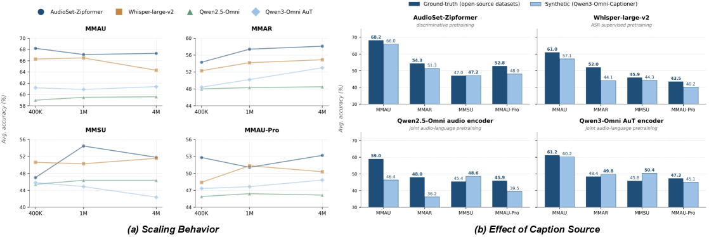
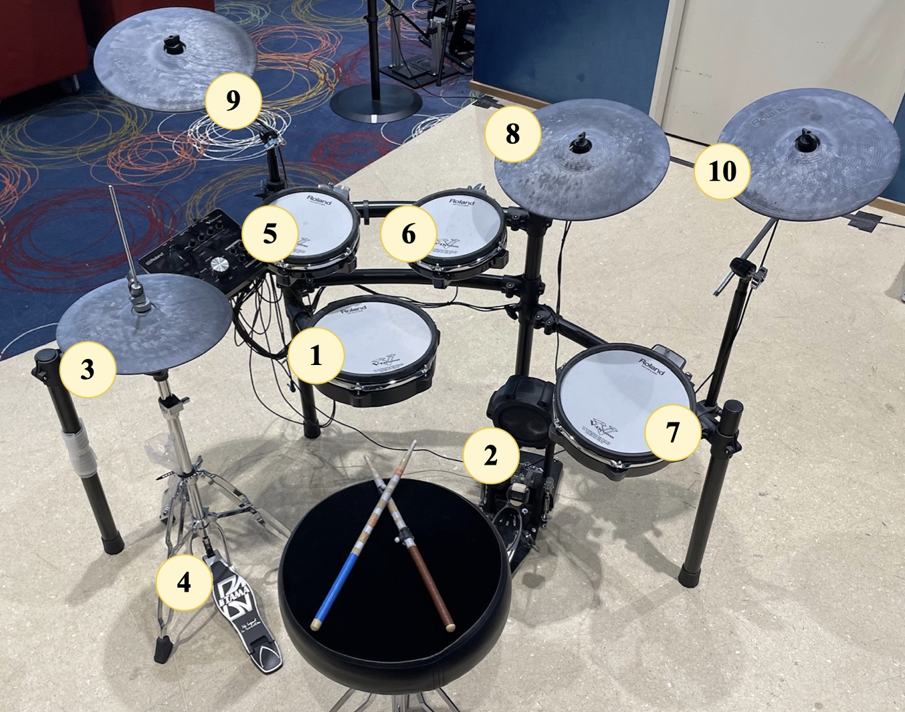
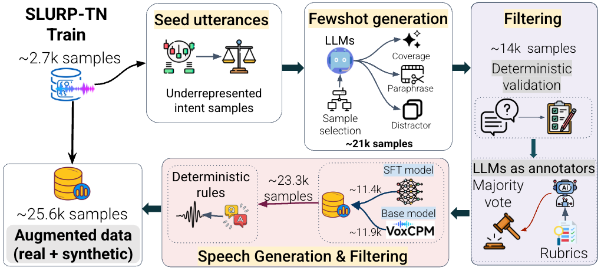
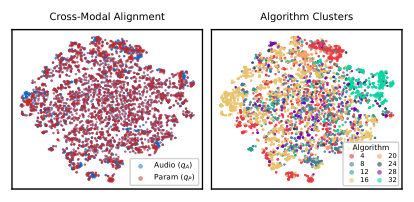

# 🚩 (2026-08-20) Scholar Inbox 추천 논문 

# 📚 X2Streaming-TTS: Causal Token-Level Text-to-Speech from Streaming Text with Speech-State Inheritance

🚀 URL: https://arxiv.org/html/2608.18661

## 🌏 Abstract (원문)
Streaming text-to-speech is essential for low-latency spoken dialogue systems, yet many systems wait for sentence-level text and are therefore only pseudo-streaming. True token-level synthesis must generate speech from uncertain prefixes while maintaining perceptual continuity over an unbounded stream with bounded context. We present X2Streaming-TTS, a causal TTS framework that consumes asynchronously arriving text tokens and emits speech without accessing future input. To handle uncertain prefixes, we introduce causal commitment, which keeps ambiguous expressions provisional through uncertainty-aware buffering and performs capacity-adaptive, punctuation-aware segmentation. To preserve acoustic continuity, we further introduce causal speech-state inheritance, which carries the complete Code2Wav state and selected historical Talker states across segment boundaries. Together with an attention prior constraint, it blocks access to future positions while retaining bounded acoustic context. Experiments show that X2Streaming-TTS outperforms existing pseudo-streaming models on most subjective and objective metrics. Further analysis shows that causal commitment stabilizes online segmentation and reduces failures caused by insufficient context, while speech-state inheritance improves boundary continuity without degrading naturalness or speaker identity. X2Streaming-TTS thus achieves strict token-level synthesis with quality comparable to the evaluated offline baselines, a median time to first audio token (TTFT) of 15.8
ms for a single request, and a median TTFT of 260.8
ms at 128 concurrent requests. Our implementation is publicly available athttps://github.com/X-Square-Robot/X2Streaming-TTS.
## 🌏 Abstract (번역)
스트리밍 음성 합성(TTS)은 저지연 음성 대화 시스템에 필수적이지만, 많은 시스템은 문장 단위 텍스트를 기다리므로 사실상 의사 스트리밍에 불과합니다. 진정한 토큰 단위 합성은 불확실한 접두사로부터 음성을 생성해야 하며, 동시에 무한한 스트림에서 제한된 컨텍스트를 유지하면서 지각적 연속성을 유지해야 합니다. 본 논문에서는 비동기적으로 도착하는 텍스트 토큰을 소비하고 미래 입력에 접근하지 않고 음성을 방출하는 인과적 TTS 프레임워크인 X2Streaming-TTS를 제시합니다. 불확실한 접두사를 처리하기 위해, 우리는 불확실성 인식 버퍼링을 통해 모호한 표현을 잠정적으로 유지하고 용량 적응형, 구두점 인식 분할을 수행하는 인과적 커밋먼트(causal commitment)를 도입합니다. 음향적 연속성을 보존하기 위해, 우리는 세그먼트 경계를 넘어 완전한 Code2Wav 상태와 선택된 과거 Talker 상태를 전달하는 인과적 음성 상태 상속(causal speech-state inheritance)을 추가로 도입합니다. 이는 어텐션 사전 제약과 함께 미래 위치에 대한 접근을 차단하면서 제한된 음향 컨텍스트를 유지합니다. 실험 결과 X2Streaming-TTS는 대부분의 주관적 및 객관적 지표에서 기존 의사 스트리밍 모델보다 우수한 성능을 보였습니다. 추가 분석에 따르면 인과적 커밋먼트는 온라인 분할을 안정화하고 불충분한 컨텍스트로 인한 실패를 줄이며, 음성 상태 상속은 자연스러움이나 화자 정체성을 저하시키지 않으면서 경계 연속성을 향상시킵니다. 따라서 X2Streaming-TTS는 평가된 오프라인 기준선과 유사한 품질로 엄격한 토큰 단위 합성을 달성하며, 단일 요청에 대한 첫 오디오 토큰까지의 중간 시간(TTFT)은 15.8ms, 128개 동시 요청 시 중간 TTFT는 260.8ms입니다. 구현 코드는 https://github.com/X-Square-Robot/X2Streaming-TTS에서 공개적으로 이용 가능합니다.

## 🔍 Methods & Results
- X2Streaming-TTS는 비동기적으로 도착하는 텍스트 토큰을 소비하고 미래 입력에 접근하지 않고 음성을 방출하는 인과적 TTS 프레임워크입니다.
- 불확실한 접두사를 처리하기 위해 불확실성 인식 버퍼링을 통해 모호한 표현을 잠정적으로 유지하고 용량 적응형, 구두점 인식 분할을 수행하는 '인과적 커밋먼트(causal commitment)'를 도입했습니다.
- 음향적 연속성을 보존하기 위해 세그먼트 경계를 넘어 완전한 Code2Wav 상태와 선택된 과거 Talker 상태를 전달하는 '인과적 음성 상태 상속(causal speech-state inheritance)'을 도입했으며, 이는 어텐션 사전 제약과 함께 미래 위치에 대한 접근을 차단하면서 제한된 음향 컨텍스트를 유지합니다.
- X2Streaming-TTS는 대부분의 주관적 및 객관적 지표에서 기존 의사 스트리밍 모델보다 우수한 성능을 보였습니다.
- 인과적 커밋먼트는 온라인 분할을 안정화하고 불충분한 컨텍스트로 인한 실패를 줄이는 효과를 보였습니다.
- 음성 상태 상속은 자연스러움이나 화자 정체성을 저하시키지 않으면서 경계 연속성을 향상시키는 것으로 나타났습니다.
- X2Streaming-TTS는 평가된 오프라인 기준선과 유사한 품질로 엄격한 토큰 단위 합성을 달성했습니다.
- 단일 요청에 대한 첫 오디오 토큰까지의 중간 시간(TTFT)은 15.8ms, 128개 동시 요청 시 중간 TTFT는 260.8ms를 기록했습니다.

## 🖼 Figures
![Figure 1:Left: Streaming pipeline under token-level arrival. The frontend releases only TTS-ready text (PAD when nothing is ready; ambiguous spans such as 3 in He finished 3 are held until pronunciation is resolved), the Talker emits acoustic tokens, and Code2Wav streams waveform for immediate playback. Right: Three challenges and the corresponding mechanisms—(1) first-audio latency via token-level rather than chunk-level start; (2) irreversible early commitment via uncertainty-aware buffering; (3) cross-segment discontinuity via speech-state inheritance.](../images/2026-08-20/2608.18661/2608.18661_fig0.png)
*Figure 1:Left: Streaming pipeline under token-level arrival. The frontend releases only TTS-ready text (PAD when nothing is ready; ambiguous spans such as 3 in He finished 3 are held until pronunciation is resolved), the Talker emits acoustic tokens, and Code2Wav streams waveform for immediate playback. Right: Three challenges and the corresponding mechanisms—(1) first-audio latency via token-level rather than chunk-level start; (2) irreversible early commitment via uncertainty-aware buffering; (3) cross-segment discontinuity via speech-state inheritance.*

*Figure 2:Speech-state inheritance across a segment boundary. After a health check on 
𝑆
𝑘
−
1
, its Code2Wav state warm-starts 
𝑆
𝑘
, while its trailing Talker states provide bounded historical context through causal-prior attention and a gated residual.*

---
**Usage Info**: 2217 tokens used.
**Generated at**: 2026-08-20 14:32:39

---

# 📚 Alignment Is All You Need: Instruction-Free Training for General Audio-Language Models

🚀 URL: https://arxiv.org/html/2608.18132

## 🌏 Abstract (원문)
Multimodal large language models (MLLMs) are typically built through a multi-stage pipeline consisting of cross-modal alignment, supervised fine-tuning (SFT), and preference optimization. This pipeline assumes that adapting an LLM to a new modality requires extensive task-specific supervision. However, pretrained LLMs already possess strong reasoning and instruction-following abilities. As LLMs evolve rapidly, an important question remains: can we efficiently transfer these capabilities to a new modality with minimal intervention, and is alignment alone sufficient for building a multimodal model? We introduce anInstruction-Free Alignment-Onlylarge audio-language model (LALM) that keeps both the audio encoder and the LLM fully frozen, learning only a lightweight projector. Borrowing insights from AZeroS[72], we train on(audio, response)pairs from Self-Generated Data Construction, where an LLM expands captions into free-form responses without explicit task instructions. Across MMAU, MMAR, MMSU, and MMAU-Pro, our approach matches or surpasses heavily post-trained baselines using substantially less data. By keeping the LLM frozen, our model preserves its native instruction-following competence and can port seamlessly across model generations. Our results suggest that competitive MLLM can emerge from alignment alone, reducing multimodal extension to a lightweight projector-training problem that generalizes across modalities and adapts rapidly to each new LLM release.
## 🌏 Abstract (번역)
다중 모달 대규모 언어 모델(MLLM)은 일반적으로 교차 모달 정렬, 지도 미세 조정(SFT), 선호도 최적화로 구성된 다단계 파이프라인을 통해 구축됩니다. 이 파이프라인은 LLM을 새로운 모달리티에 적응시키려면 광범위한 작업별 감독이 필요하다고 가정합니다. 그러나 사전 훈련된 LLM은 이미 강력한 추론 및 지시 따르기 능력을 가지고 있습니다. LLM이 빠르게 발전함에 따라 중요한 질문이 남아 있습니다. 최소한의 개입으로 이러한 기능을 새로운 모달리티로 효율적으로 전송할 수 있는가? 그리고 정렬만으로 다중 모달 모델을 구축하기에 충분한가? 우리는 오디오 인코더와 LLM을 모두 완전히 고정하고 경량 프로젝터만 학습하는 '지시 없는 정렬 전용(Instruction-Free Alignment-Only)' 대규모 오디오-언어 모델(LALM)을 소개합니다. AZeroS[72]의 통찰력을 빌려, LLM이 명시적인 작업 지시 없이 캡션을 자유 형식 응답으로 확장하는 '자가 생성 데이터 구성(Self-Generated Data Construction)'에서 (오디오, 응답) 쌍으로 훈련합니다. MMAU, MMAR, MMSU 및 MMAU-Pro 전반에 걸쳐 우리의 접근 방식은 훨씬 적은 데이터를 사용하여 대규모로 후처리된 기준선과 일치하거나 이를 능가합니다. LLM을 고정함으로써 우리 모델은 고유한 지시 따르기 능력을 보존하고 모델 세대 간에 원활하게 이식될 수 있습니다. 우리의 결과는 경쟁력 있는 MLLM이 정렬만으로도 나타날 수 있음을 시사하며, 다중 모달 확장을 모달리티 전반에 걸쳐 일반화되고 각 새로운 LLM 릴리스에 빠르게 적응하는 경량 프로젝터 훈련 문제로 축소합니다.

## 🔍 Methods & Results
- 기존 MLLM 파이프라인은 교차 모달 정렬, 지도 미세 조정(SFT), 선호도 최적화를 포함하며, LLM의 보편적 디코더 동작을 침해할 수 있습니다.
- 본 연구에서는 오디오 인코더와 LLM을 모두 고정하고, 오디오를 LLM의 입력 임베딩 공간으로 매핑하는 경량 프로젝터만 학습시킵니다.
- LALM은 고정된 오디오 인코더(E), 고정된 자기회귀 LLM(L), 학습 가능한 프로젝터(Pθ)로 구성되며, Pθ의 파라미터(θ)만이 훈련 대상입니다.
- 훈련은 LLM이 명시적인 작업 지시 없이 캡션을 자유 형식 응답으로 확장하는 '자가 생성 데이터 구성'에서 얻은 (오디오, 응답) 쌍을 사용합니다.
- 훈련 데이터셋(D_align)은 캡션 소스(S)가 오디오(x)에 대한 자연어 설명(c)을 제공하고, LLM 확장기(g)가 캡션(c)을 텍스트 프록시로 사용하여 유창한 응답(r=g(c))을 생성하는 방식으로 자율적으로 구축됩니다.
- 캡션 소스로는 오픈 소스 데이터셋의 실제 텍스트 쌍과 Qwen3-Omni-Captioner를 통한 합성 캡션 생성을 탐색합니다.
- 훈련은 응답 토큰에 대한 인과적 언어 모델링 손실을 최소화하며, 기울기는 프로젝터 파라미터(θ)에만 흐르고 인코더(E)와 LLM(L)은 고정됩니다.
- 이 '지시 없는 훈련' 방식은 오디오 접두사만으로 원하는 응답을 유도하여 최적화 압력을 전적으로 프로젝터에 집중시킵니다.
- 인코더와 LLM을 고정함으로써 사전 훈련된 지식을 보존하고 LLM의 보편적 디코딩 능력이 침해되는 것을 방지하여 광범위한 일반화를 유지합니다.
- 이 접근 방식은 현대 LLM이 보편적 디코더이며, 다중 모달 적응의 목표는 LLM이 오디오를 텍스트처럼 명확하게 인식하도록 하는 전역 입력 정렬을 달성하는 것이라는 가설에 기반합니다.
- 결과적으로, MMAU, MMAR, MMSU, MMAU-Pro 벤치마크에서 훨씬 적은 데이터를 사용하여 대규모로 후처리된 기준선과 동등하거나 능가하는 성능을 달성했습니다.
- LLM을 고정함으로써 모델은 고유한 지시 따르기 능력을 유지하며, 모델 세대 간에 원활하게 이식될 수 있습니다.

## 🖼 Figures
![Figure 1:Overview of the pipeline. Left: Self-Generated Data Construction. The dashed line separates two views: on the left, the real listening process, where a human hears audio 
𝑥
 and responds; on the right, our generation surrogate. Instead of collecting human responses, we feed the paired caption 
𝑐
 into the frozen LLM without any instruction to obtain 
𝑟
=
𝑔
​
(
𝑐
)
. The caption thus serves as a semantic surrogate for the audio, and 
𝑟
 becomes the training target. Right: Instruction-Free Alignment-Only training. Audio 
𝑥
 passes through a frozen encoder and a trainable projector into the same frozen LLM, again without instructions. The LLM here is identical to the one used on the left. This consistency ensures that 
𝑟
 matches what this LLM would produce given the caption surrogate. Training the projector with cross-entropy against 
𝑟
 therefore aligns audio representations to the LLM’s own caption-conditioned response distribution, not to external annotation.](../images/2026-08-20/2608.18132/2608.18132_fig0.png)
*Figure 1:Overview of the pipeline. Left: Self-Generated Data Construction. The dashed line separates two views: on the left, the real listening process, where a human hears audio 
𝑥
 and responds; on the right, our generation surrogate. Instead of collecting human responses, we feed the paired caption 
𝑐
 into the frozen LLM without any instruction to obtain 
𝑟
=
𝑔
​
(
𝑐
)
. The caption thus serves as a semantic surrogate for the audio, and 
𝑟
 becomes the training target. Right: Instruction-Free Alignment-Only training. Audio 
𝑥
 passes through a frozen encoder and a trainable projector into the same frozen LLM, again without instructions. The LLM here is identical to the one used on the left. This consistency ensures that 
𝑟
 matches what this LLM would produce given the caption surrogate. Training the projector with cross-entropy against 
𝑟
 therefore aligns audio representations to the LLM’s own caption-conditioned response distribution, not to external annotation.*

*Figure 2:(a) Scaling behavior of four audio encoders across increasing dataset sizes on four benchmarks. (b) Effect of caption source: comparison between ground-truth and synthetic captions.*

---
**Usage Info**: 4720 tokens used.
**Generated at**: 2026-08-20 14:32:51

---

# 📚 Generalized Audio-Driven Synthesis of Precise Drummer Motion

🚀 URL: https://arxiv.org/html/2608.19055

## 🌏 Abstract (원문)
Music-driven character animation enables and enhances transformative applications in entertainment and interactive education. However, synthesizing realistic drumming motion from audio remains challenging due to the inherent tension between high-acceleration dynamics and the need for extreme spatial-temporal precision. Existing approaches, often reliant on motion matching or MIDI input, struggle with generalizing to diverse real-world audio. Moreover, the field lacks standardized evaluation metrics capable of distinguishing precise drumming from noisy motion. In this paper, we introduce a generative diffusion framework featuring a dual-objective loss function that decouples skeletal integrity from drumstick precision, thus enabling centimeter-level stick precision without sacrificing natural body dynamics. Additionally, leveraging our own dataset and data augmentation strategy, the model generalizes to non-curated, in-the-wild audio. To rigorously evaluate performance, we propose two novel metrics: an impact-to-target distance to quantify spatial precision and an audio-motion correlation score to assess temporal alignment. Our quantitative analysis and user studies demonstrate that our system generates high-quality motion that is often indistinguishable from ground-truth performances.
## 🌏 Abstract (번역)
음악 기반 캐릭터 애니메이션은 엔터테인먼트 및 인터랙티브 교육 분야에서 혁신적인 애플리케이션을 가능하게 하고 향상시킵니다. 그러나 오디오로부터 사실적인 드럼 연주 동작을 합성하는 것은 높은 가속도 역학과 극도의 시공간적 정밀도 요구 사항 사이의 내재된 긴장으로 인해 여전히 어렵습니다. 기존 접근 방식은 종종 모션 매칭이나 MIDI 입력에 의존하여 다양한 실제 오디오에 대한 일반화에 어려움을 겪습니다. 더욱이, 이 분야는 정확한 드럼 연주와 노이즈가 많은 동작을 구별할 수 있는 표준화된 평가 지표가 부족합니다. 본 논문에서는 골격의 무결성을 드럼 스틱의 정밀도와 분리하는 이중 목적 손실 함수를 특징으로 하는 생성 확산 프레임워크를 소개하여 자연스러운 신체 역학을 희생하지 않고도 센티미터 수준의 스틱 정밀도를 가능하게 합니다. 또한, 자체 데이터셋과 데이터 증강 전략을 활용하여 모델은 큐레이션되지 않은 실제 오디오에도 일반화됩니다. 성능을 엄격하게 평가하기 위해 우리는 공간 정밀도를 정량화하는 충격-대상 거리와 시간적 정렬을 평가하는 오디오-모션 상관 점수라는 두 가지 새로운 지표를 제안합니다. 우리의 정량적 분석과 사용자 연구는 우리 시스템이 실제 연주와 구별하기 어려운 고품질 동작을 생성함을 보여줍니다.

## 🔍 Methods & Results
- 드럼 연주 동작은 120Hz의 프레임 속도로 샘플링된 포즈 시퀀스로 표현되며, 27개의 신체 관절(6D 회전)과 2개의 드럼 스틱(6D 회전 및 3D 스틱 끝 위치)을 포함합니다. 특히 스틱 끝의 3D 위치는 타격 정확도에 중요합니다.
- 기존 데이터셋의 한계를 극복하기 위해, 9대의 OptiTrack 카메라를 사용하여 120Hz로 전문 재즈 드러머의 3시간 30분 53초 분량의 고품질 광학 모션 캡처 데이터셋을 직접 구축했습니다. 이 데이터셋은 기본기, 그루브, 곡 연주를 포함합니다.
- 모델의 일반화 능력을 향상시키기 위해 2단계 데이터 증강 전략을 사용합니다. 각 오디오-모션 샘플에 대해 MIDI 신호에서 무작위로 선택된 드럼 키트를 사용하여 오디오를 합성하고, 13가지 무작위 오디오 효과를 적용하여 50가지 오디오 변형을 생성합니다.
- 오디오 신호에서 의미 있는 특징을 추출하기 위해, 온셋 감지, 비트 트래킹, 진폭 엔벨로프, 스펙트럼 중심, 40차원 MFCCs 등 타악기 오디오에 특화된 44차원 수제작 특징 추출기를 사용합니다. 다성 오디오의 경우 드럼 스템 분리 후 특징을 추출합니다.
- 생성 모델은 오디오 조건부 댄스 생성을 위해 설계된 EDGE 아키텍처(트랜스포머 기반 확산 모델)를 채택하며, 교차 어텐션 메커니즘을 통해 오디오 컨디셔닝을 통합합니다.
- 드럼 연주의 고유한 정밀도 요구 사항을 해결하기 위해, 골격의 무결성(신체 회전)과 드럼 스틱의 정밀도(스틱 끝의 카르테시안 공간 위치)를 분리하는 이중 목적 손실 함수를 도입하여 자연스러운 신체 역학을 유지하면서 센티미터 수준의 스틱 정밀도를 달성합니다.
- 모델은 1초 길이(120프레임) 시퀀스로 훈련되며, 25,000개 이상의 모션 시퀀스와 각 시퀀스당 50개의 오디오 변형을 사용합니다. Adam 옵티마이저, 학습률 3e-4, 배치 크기 128로 6000 에포크 동안 훈련했습니다.
- 장시간 연주 동작 합성을 위해 50% 오버랩되는 슬라이딩 윈도우 접근 방식과 구형 선형 보간법(회전) 및 선형 보간법(위치)을 사용한 블렌딩 기법을 적용하여 시간적 일관성을 유지합니다.
- 생성된 드럼 연주 동작의 품질을 엄격하게 평가하기 위해 공간 정밀도를 정량화하는 '충격-대상 거리'와 시간적 정렬을 평가하는 '오디오-모션 상관 점수'라는 두 가지 새로운 평가 지표를 제안합니다.
- 정량적 분석 및 사용자 연구 결과, 제안된 시스템은 실제 연주와 구별하기 어려운 고품질 동작을 생성하며, 큐레이션되지 않은 실제 오디오에 대해서도 강력한 일반화 성능을 보여주었습니다.

## 🖼 Figures
![Figure 1: Overview. We augment the audio in our dataset resulting in motion sequences aligned with multiple audio variations to ensure generalization. Raw audio is then processed into explainable features to condition a diffusion-based Transformer Decoder. We employ a hybrid pose representation, using joint rotations for the body and Cartesian positions for drumsticks. The model is trained via a dual-objective loss to balance natural body dynamics with high-precision stick impacts. Finally, performance is evaluated using Impact Point Deviations and Percussive Alignment Scores to assess spatial and temporal fidelity.](../images/2026-08-20/2608.19055/2608.19055_fig0.png)
*Figure 1: Overview. We augment the audio in our dataset resulting in motion sequences aligned with multiple audio variations to ensure generalization. Raw audio is then processed into explainable features to condition a diffusion-based Transformer Decoder. We employ a hybrid pose representation, using joint rotations for the body and Cartesian positions for drumsticks. The model is trained via a dual-objective loss to balance natural body dynamics with high-precision stick impacts. Finally, performance is evaluated using Impact Point Deviations and Percussive Alignment Scores to assess spatial and temporal fidelity.*

*Figure 2: Standard 10-component drum kit used in our data collection. (1) Snare, (2) bass/kick drum, (3) hi-hat, (4) hi-hat pedal, (5-6) high toms, (7) floor tom, (8) ride cymbal, (9-10) crash cymbals.*

*Figure 3: Dual-objective loss achieves superior spatial precision. Stick-tip trajectories during a snare roll. Ground truth (left), rotations-only model (center), and our dual-objective model (right). Tight clustering on the drum surface demonstrates consistent impact points.*

*Figure 7: Emergent gain modulation. Motion generated by our dual-objective model with input audio at a normal volume (0 dB, pink) and a low volume (-15 dB, green). Loud audio produces with larger arcs, while softer audio produces gentle trajectories with smaller arcs. This behavior is learnt from our dataset’s intensity diversity.*

*Figure 8: Our clustering algorithm filters out noise to find the impact points for each drum component. Candidate impact points (top) and filtered impact points (bottom). Cluster centroids indicated as a black marker. Data corresponding to our ground-truth test set.*

![Figure 11: Qualitative comparison of drum transcription performance. The visualization displays the ground-truth (GT) audio waveform and the corresponding GT MIDI events. Each drum component is played twice, sequentially: kick (black), hi-hat pedal (light olive), hi-hat (dark olive), ride (blue purple), snare (yellow), tom 1 (blue), tom 2 (green), crash 1 (purple), floor tom (red), and crash 2 (aquamarine). The SOTA drum transcription [ZAB23] exhibits some classification errors, such as identifying the incorrect drum and failing to differentiate between various toms. In contrast, our transcription, generated via the audio-to-motion and motion-to-MIDI pipeline, demonstrates high alignment with the ground truth across the entire instrument set.](../images/2026-08-20/2608.19055/2608.19055_fig10.png)
*Figure 11: Qualitative comparison of drum transcription performance. The visualization displays the ground-truth (GT) audio waveform and the corresponding GT MIDI events. Each drum component is played twice, sequentially: kick (black), hi-hat pedal (light olive), hi-hat (dark olive), ride (blue purple), snare (yellow), tom 1 (blue), tom 2 (green), crash 1 (purple), floor tom (red), and crash 2 (aquamarine). The SOTA drum transcription [ZAB23] exhibits some classification errors, such as identifying the incorrect drum and failing to differentiate between various toms. In contrast, our transcription, generated via the audio-to-motion and motion-to-MIDI pipeline, demonstrates high alignment with the ground truth across the entire instrument set.*

---
**Usage Info**: 5287 tokens used.
**Generated at**: 2026-08-20 14:33:04

---

# 📚 Aslema at NADI 2026: Augmentation through Fewshot for SLU

🚀 URL: https://arxiv.org/html/2608.18689

## 🌏 Abstract (원문)
We presentAslema, our system for NADI 2026 Shared Task 5, which consists of two subtasks:intent recognitionandslot filling. We evaluate four omni LLMs in a zero-shot setting and compare them with fine-tuned models. Our results show that fine-tuning consistently outperforms zero-shot inference. We further explore synthetic data augmentation by using an LLM to generate culturally grounded Tunisian Derja utterances, followed by voice cloning to generate synthetic speech. Incorporating this synthetic data improves performance on both tasks. Our final submitted system, based on Qwen3-Omni-30B and trained with a mixture of original and synthetic data, achieves 86.8% intent accuracy and 34.7 WER on the devtest split. On the official test set it ranks1st in slot filling(59.5 CoER) and4th among 8 teams in intent recognition(66.1% accuracy). We release our experimental scripts111https://github.com/hunzed/aslema_nadi2026and will soon share the synthetic dataset to support further research in this area.
## 🌏 Abstract (번역)
저희는 NADI 2026 Shared Task 5를 위한 시스템인 Aslema를 소개합니다. 이 태스크는 의도 인식과 슬롯 채우기라는 두 가지 하위 태스크로 구성됩니다. 저희는 네 가지 옴니 LLM을 제로샷 설정에서 평가하고 미세 조정된 모델과 비교했습니다. 저희 결과는 미세 조정이 제로샷 추론보다 지속적으로 우수한 성능을 보임을 보여줍니다. 또한, LLM을 사용하여 문화적으로 튀니지 데르자 발화를 생성하고 음성 복제를 통해 합성 음성을 생성함으로써 합성 데이터 증강을 탐색했습니다. 이 합성 데이터를 통합하면 두 태스크 모두에서 성능이 향상됩니다. Qwen3-Omni-30B를 기반으로 하고 원본 및 합성 데이터 혼합으로 훈련된 저희의 최종 제출 시스템은 devtest 분할에서 86.8%의 의도 정확도와 34.7 WER을 달성했습니다. 공식 테스트 세트에서는 슬롯 채우기에서 1위(59.5 CoER)를, 의도 인식에서 8개 팀 중 4위(66.1% 정확도)를 차지했습니다. 저희는 실험 스크립트(https://github.com/hunzed/aslema_nadi2026)를 공개하며, 이 분야의 추가 연구를 지원하기 위해 곧 합성 데이터셋을 공유할 예정입니다.

## 🔍 Methods & Results
- NADI 2026 Shared Task 5의 두 가지 하위 태스크(의도 인식 및 슬롯 채우기)를 위해 Aslema 시스템을 개발했습니다.
- Qwen2.5-Omni-3B, Qwen2.5-Omni-7B, Qwen3-Omni-30B-A3B-Instruct, gemma-4-E4B-it 등 네 가지 지시 튜닝된 오디오 LLM을 제로샷 설정에서 평가했습니다.
- Whisper-small 모델을 소형 모델 기준선으로 훈련했습니다.
- LoRA 미세 조정을 사용하여 각 모델을 SLURP-TN 훈련 분할 데이터에 대해 미세 조정했으며, 오디오 인코더와 오디오-텍스트 정렬기는 고정했습니다. 두 하위 태스크의 데이터를 공동으로 사용하여 단일 LoRA 어댑터를 훈련했습니다.
- LLM을 사용하여 문화적으로 튀니지 데르자 발화를 생성하고 음성 복제를 통해 합성 음성을 생성하여 합성 데이터 증강을 수행했습니다.
- 미세 조정이 제로샷 추론보다 지속적으로 우수한 성능을 보였으며, 합성 데이터 통합이 두 태스크 모두에서 성능을 향상시켰습니다.
- 최종 제출 시스템은 Qwen3-Omni-30B-A3B를 기반으로 하며, 실제 데이터와 합성 데이터를 혼합하여 두 에포크 동안 미세 조정했습니다.
- 최종 시스템은 devtest 분할에서 86.8%의 의도 정확도와 34.7 WER을 달성했습니다.
- 공식 테스트 세트에서 슬롯 채우기 부문 1위(59.5 CoER)와 의도 인식 부문 4위(66.1% 정확도)를 차지했습니다.

## 🖼 Figures

*Figure 1:Overview of the data augmentation pipeline.*

---
**Usage Info**: 2140 tokens used.
**Generated at**: 2026-08-20 14:33:12

---

# 📚 FM Synthesizer Audio-Parameter Shared Embeddings

🚀 URL: https://arxiv.org/html/2608.18226

## 🌏 Abstract (원문)
Given a target sound, finding the synthesizer preset that best reproduces it remains a core problem in sound design. Existing methods treat synthesis parameters as flat vectors, discarding the signal routing and parameter interactions that produce audio. We make two contributions. First, to learn a representation of parameters including their signal routing, we design a graph neural network whose message passing structure imitates FM signal processing. Second, we adapt the multimodal objective from SLAP to learn joint embeddings of audio and FM synthesizer parameters, enabling preset retrieval from a gallery. We focus on the Yamaha DX7, where six identical sinusoid operators interact according to one of 32 routing topologies. Our graph encoder’s message passing weights are shared across all nodes and layers, enabling processing of arbitrary topologies of any size. When every topology is seen during training, the DX7-GNN and two baselines achieve strong audio-to-preset retrieval. When some topologies are held out for testing, the DX7-GNN substantially outperforms both baselines despite having the fewest parameters. Our ablations further support the claim that imitating FM signal flow in a parameter encoder improves generalization to unseen topologies.
## 🌏 Abstract (번역)
특정 사운드가 주어졌을 때, 이를 가장 잘 재현하는 신시사이저 프리셋을 찾는 것은 사운드 디자인의 핵심 문제로 남아 있습니다. 기존 방법들은 신시사이저 파라미터를 평면적인 벡터로 취급하여, 오디오를 생성하는 신호 라우팅 및 파라미터 상호작용을 무시합니다. 우리는 두 가지 기여를 합니다. 첫째, 신호 라우팅을 포함한 파라미터 표현을 학습하기 위해, FM 신호 처리를 모방하는 메시지 전달 구조를 가진 그래프 신경망을 설계했습니다. 둘째, 오디오와 FM 신시사이저 파라미터의 공동 임베딩을 학습하기 위해 SLAP의 다중 모달 목표를 적용하여, 갤러리에서 프리셋 검색을 가능하게 했습니다. 우리는 야마하 DX7에 초점을 맞추는데, 여기서는 6개의 동일한 사인파 오퍼레이터가 32가지 라우팅 토폴로지 중 하나에 따라 상호작용합니다. 우리의 그래프 인코더의 메시지 전달 가중치는 모든 노드와 레이어에 걸쳐 공유되어, 어떤 크기의 임의의 토폴로지도 처리할 수 있습니다. 모든 토폴로지가 훈련 중에 관찰될 때, DX7-GNN과 두 가지 기준선은 강력한 오디오-프리셋 검색 성능을 달성합니다. 일부 토폴로지가 테스트를 위해 보류될 때, DX7-GNN은 가장 적은 파라미터를 가짐에도 불구하고 두 가지 기준선보다 훨씬 뛰어난 성능을 보입니다. 우리의 어블레이션 연구는 파라미터 인코더에서 FM 신호 흐름을 모방하는 것이 보지 못한 토폴로지에 대한 일반화 성능을 향상시킨다는 주장을 더욱 뒷받침합니다.

## 🔍 Methods & Results
- FM-SynAPSE는 FM 신시사이저 파라미터와 오디오의 공동 임베딩을 학습하여 프리셋 검색을 수행합니다.
- 파라미터 인코더인 DX7-GNN은 FM 합성의 메시지 전달 신경망 구조를 모방하여 설계되었습니다.
- SLAP의 다중 모달 목표를 채택하여 오디오와 DX7 프리셋 파라미터 간의 공동 임베딩 공간을 학습하며, 온라인 및 타겟 브랜치와 코사인 거리 손실을 사용하여 표현 붕괴를 방지합니다.
- 야마하 DX7에 초점을 맞추며, 6개의 오퍼레이터와 32가지 라우팅 토폴로지(알고리즘)를 그래프 구조로 변환합니다.
- 각 오퍼레이터 노드는 47차원 특징 벡터를 가지며, 알고리즘은 그래프 구조를 결정하고, 피드백 레벨은 엣지 가중치에 영향을 미치며, 출력 레벨은 노드 특징을 스케일링하는 등 파라미터가 특별히 처리됩니다.
- 메시지 전달 계층은 FM 합성을 모방하여, 메시지는 변조 신호에 해당하고, 집계는 들어오는 변조를 결합하며, FiLM 기반 업데이트는 집계된 변조에 따라 각 오퍼레이터의 처리를 조절합니다.
- 출력 레벨이 0인 오퍼레이터는 메시지 전달 과정에서 신호를 전달하지 않도록 아키텍처적으로 강제하여, 실제 FM 합성의 동작을 반영합니다.
- 모든 노드와 레이어에 걸쳐 메시지 전달 가중치를 공유하여, 훈련 없이도 임의의 FM 토폴로지를 처리할 수 있도록 일반화 능력을 확보합니다.
- 훈련 시 모든 토폴로지를 볼 경우 DX7-GNN과 두 가지 기준선 모두 강력한 오디오-프리셋 검색 성능을 달성하며, 일부 토폴로지를 테스트용으로 보류할 경우 DX7-GNN이 가장 적은 파라미터에도 불구하고 기준선보다 훨씬 뛰어난 성능을 보입니다.
- 파라미터 인코더에서 FM 신호 흐름을 모방하는 것이 보지 못한 토폴로지에 대한 일반화 성능을 향상시킨다는 어블레이션 연구 결과가 있습니다.

## 🖼 Figures

*Figure 1: SLAP architecture for FM-SynAPSE: Online encoders (
ℰ
𝐴
, 
ℰ
𝑃
) receive gradients; Target encoders (
ℰ
¯
𝐴
, 
ℰ
¯
𝑃
) are updated via exponential moving average (EMA). Predictor networks (
𝒫
𝐴
,
𝒫
𝑃
) map online projections to predictions of target projections. Four cosine similarity losses combine intermodal (
ℒ
𝐴
→
𝑃
, 
ℒ
𝑃
→
𝐴
) and intramodal (
ℒ
𝐴
, 
ℒ
𝑃
) alignment. Dotted lines indicate how loss gradients backpropagate towards predictions, not target projections.*

*Figure 6: t-SNE visualization of held out algorithm embeddings. (Left) Audio and parameter embeddings by color. (Right) Embeddings from both modalities colored by algorithm.*

---
**Usage Info**: 6609 tokens used.
**Generated at**: 2026-08-20 14:33:28

---

