# 🚩 (2026-08-21) Scholar Inbox 추천 논문 

# 📚 Fourier is Frontier: Frequency-Aware Autoencoding for High-Fidelity Music Reconstruction

🚀 URL: https://arxiv.org/html/2608.19843

## 🌏 Abstract (원문)
Continuous-latent audio autoencoders form the backbone of latent music generators, andtheir reconstruction fidelity limits the acoustic detail available to downstream generators. At thecompression rates these pipelines require, decoders commonly exhibit three recurring failuremodes: high-frequency loss, phase incoherence, and stereo-image collapse.These shortcomings in high-fidelity generation share a structural root: waveform autoencoders, previously regarded as the frontier design, lack an explicit frequency axis, leaving no handle for targeted per-band correction. Among five matched-budgetrepresentations in our controlled study, the complex STFT achieves the lowest full-band and high-frequency spectraldistances, providing direct access to magnitude and phase at every frequency bin.Building on this finding, we presentε\varepsilonar-VAE2, a complex-spectral autoencoder that exploits the explicit frequency structure and introduces cross-channel interaction between the left and right channels. First, Spec-SnakeBeta exploits the additional capacity of the frequency-domain representation by learning a periodic activation for each frequency bin, with frequency-dependent initialization in log-parameter space. This design overall outperforms the other activation variants in our controlled ablation,while using fewer parameters than the fully independent variant. Second, Duplex-Aware Refiner applies band-specific corrections to magnitude and phase. Its band allocationfollows duplex theory of sound localization and corrects the decoder’s reconstruction error.On the 546-track Song Describer Dataset,ε\varepsilonar-VAE2achieves the best point estimates on five of seven reconstruction metrics and matches the best stereo-coherence score.Adding the Duplex-Aware Refiner module further reduces Mel Distance by 19.4%, and its duplex band allocation uses≈45%{\approx}45\%fewerresidual-output dimensions than the Unconstrained Refiner version. Beyond this efficiency, the banded allocation also lowers spectral distances and targeted spatial-cue error metrics, and it receives higher mean paired ratings fromprofessional mixing and mastering engineers. The downstream generator usingε\varepsilonar-VAE2latents achieves better point estimates on all 12 automatic downstream metrics.Demo page is available athttps://eps-acoustic-revolution-lab.github.io/EAR_VAE2/.
## 🌏 Abstract (번역)
연속 잠재 오디오 오토인코더는 잠재 음악 생성기의 핵심을 형성하며, 이들의 재구성 충실도는 다운스트림 생성기에 사용할 수 있는 음향 세부 사항을 제한합니다. 이러한 파이프라인이 요구하는 압축률에서 디코더는 일반적으로 고주파 손실, 위상 비일관성, 스테레오 이미지 붕괴라는 세 가지 반복적인 실패 모드를 보입니다. 고충실도 생성의 이러한 단점은 구조적 근원을 공유합니다. 이전에 최첨단 설계로 간주되었던 파형 오토인코더는 명시적인 주파수 축이 없어 특정 대역별 보정을 위한 수단이 없습니다. 통제된 연구에서 5가지 일치된 예산 표현 중 복소수 STFT는 가장 낮은 전체 대역 및 고주파 스펙트럼 거리를 달성하여 모든 주파수 빈에서 크기와 위상에 직접 접근할 수 있게 합니다. 이 발견을 바탕으로, 우리는 명시적인 주파수 구조를 활용하고 좌우 채널 간의 교차 채널 상호작용을 도입하는 복소수 스펙트럼 오토인코더인 εar-VAE2를 제시합니다. 첫째, Spec-SnakeBeta는 각 주파수 빈에 대해 주기적인 활성화 함수를 학습하고 로그-파라미터 공간에서 주파수 의존적 초기화를 통해 주파수 도메인 표현의 추가 용량을 활용합니다. 이 설계는 통제된 제거 연구에서 다른 활성화 변형보다 전반적으로 우수하며, 완전히 독립적인 변형보다 적은 수의 파라미터를 사용합니다. 둘째, Duplex-Aware Refiner는 크기와 위상에 대역별 보정을 적용합니다. 이 대역 할당은 소리 위치 파악의 이중 이론(duplex theory)을 따르며 디코더의 재구성 오류를 수정합니다. 546개 트랙의 Song Describer 데이터셋에서 εar-VAE2는 7가지 재구성 지표 중 5가지에서 최고의 점 추정치를 달성하고 최고의 스테레오 일관성 점수와 일치합니다. Duplex-Aware Refiner 모듈을 추가하면 Mel Distance가 19.4% 더 감소하며, 이 이중 대역 할당은 Unconstrained Refiner 버전보다 약 45% 적은 잔여 출력 차원을 사용합니다. 이러한 효율성 외에도, 대역별 할당은 스펙트럼 거리와 목표 공간 단서 오류 지표를 낮추고, 전문 믹싱 및 마스터링 엔지니어로부터 더 높은 평균 쌍별 평가를 받습니다. εar-VAE2 잠재 변수를 사용하는 다운스트림 생성기는 12가지 자동 다운스트림 지표 모두에서 더 나은 점 추정치를 달성합니다. 데모 페이지는 https://eps-acoustic-revolution-lab.github.io/EAR_VAE2/에서 확인할 수 있습니다.

## 🔍 Methods & Results
- εar-VAE2는 명시적인 스테레오 모델링을 갖춘 스펙트럼 도메인 VAE-GAN으로, 복소수 STFT 인코더-디코더를 통해 연속 잠재 변수와 거친 재구성을 생성합니다.
- 주파수 축은 Spec-SnakeBeta (내부 비선형 응답을 주파수별로 조정)와 Duplex-Aware Refiner (주파수 의존적 출력 보정 적용)의 두 가지 상호 보완적인 수준에서 활용됩니다.
- Spec-SnakeBeta는 각 주파수 위치에 대해 하나의 파라미터 쌍(α, β)을 학습하고 이를 특징 채널 간에 공유하며, 로그 공간에서 주파수에 비례하는 초기화를 통해 저주파에서는 항등 함수와 유사하고 고주파로 갈수록 더 진동하는 활성화 함수를 만듭니다.
- Duplex-Aware Refiner는 소리 위치 파악의 이중 이론(duplex theory)에 기반하여 디코더의 잔여 재구성 오류를 수정하며, 저주파(<1.5kHz)에서는 위상만, 중주파(1.5-4kHz)에서는 크기 및 위상 모두, 고주파(>4kHz)에서는 크기만 보정하는 대역별 할당을 적용합니다.
- 훈련은 재구성 사전 훈련(Stage 1), 파형 적대적 훈련(Stage 2, STFT 및 CQT 판별자 사용), 리파이너 전용 훈련(Stage 3, 백본 고정, STFT 및 IF/GD 손실, 파형 판별자, 스펙트럼 판별자 사용)의 세 단계로 진행됩니다.
- 손실 함수는 다중 해상도 STFT 손실, IF/GD 위상 손실, LSGAN 및 특징 매칭을 포함하는 적대적 손실, KL 정규화로 구성되며, K-가중치, MSLR 스테레오 분해, 적응형 로그-크기 정규화 등 지각적 기술을 통합합니다.
- εar-VAE2는 546개 트랙의 Song Describer 데이터셋에서 7가지 재구성 지표 중 5가지에서 최고의 점 추정치를 달성하고 최고의 스테레오 일관성 점수를 기록했습니다.
- Duplex-Aware Refiner 모듈을 추가하면 Mel Distance가 19.4% 감소하고, Unconstrained Refiner 버전보다 약 45% 적은 잔여 출력 차원을 사용하며, 스펙트럼 거리와 공간 단서 오류 지표를 낮추고 전문 엔지니어로부터 더 높은 평가를 받았습니다.

## 🖼 Figures
![Figure 1:Architecture of 
𝜀
ar-VAE2. Stereo audio is transformed via STFT into a complex spectrogram; a Spec Encoder compresses it to a 25 Hz continuous latent and a Spec Decoder reconstructs a coarse complex spectrogram; the highest-frequency (Nyquist) STFT bin is removed to facilitate frequency downsampling. The Duplex-Aware Refiner subsequently applies band-specific complex corrections and restores the Nyquist bin to produce the full-bin spectrogram, which the iSTFT resynthesizes into a waveform.](../images/2026-08-21/2608.19843/2608.19843_fig0.png)
*Figure 1:Architecture of 
𝜀
ar-VAE2. Stereo audio is transformed via STFT into a complex spectrogram; a Spec Encoder compresses it to a 25 Hz continuous latent and a Spec Decoder reconstructs a coarse complex spectrogram; the highest-frequency (Nyquist) STFT bin is removed to facilitate frequency downsampling. The Duplex-Aware Refiner subsequently applies band-specific complex corrections and restores the Nyquist bin to produce the full-bin spectrogram, which the iSTFT resynthesizes into a waveform.*

*Figure 3:Frequency-resolved diagnosis of the trained encoder–decoder before refinement. (a) Learned frequency-indexed 
𝛽
~
𝑓
 per encoder layer; since 
𝛽
~
𝑓
 is initialized to zero, the values also represent displacements from initialization. (b) Per-frequency magnitude error. (c) Weighted angular error; the horizontal line marks the 
𝜋
/
2
 random-phase baseline. Vertical lines mark the refiner band boundaries, and the shaded region spans 0.5–5 kHz.*

*Figure 4:Reconstruction spectrograms from the matched-budget representation study (48 kHz, 
𝑛
fft
=
2048
, hop
=
128
). (A) complex STFT; (B) waveform patch; (C) magnitude-only; (D) waveform Conv1D; (E) patch Transformer; and (GT) ground truth. Complex STFT and waveform patch share the same Conv2D backbone.*

*Figure 5:Encoder gradient 
ℓ
2
-norm (left) and magnitude reconstruction loss (right) over training, recorded during the same 100k-step runs under the shared protocol.*

*Figure 10:Latent temporal-frequency probe for one track (Track 1004034; temporal split at 0.5). Rows (top to bottom): ground-truth audio; full reconstruction; low-temporal-frequency latent half decoded; high-temporal-frequency latent half decoded. Columns (left to right): 
𝜀
ar-VAE2, LeVo 2, SAME-L, 
𝜀
ar-VAE, and Stable Audio Open. For 
𝜀
ar-VAE2, the rapidly varying (high) latent half decodes to audio with a lower spectral centroid, matching Table 12.*

---
**Usage Info**: 6776 tokens used.
**Generated at**: 2026-08-21 14:32:05

---

# 📚 Continuous Adversarial MeanFlow Transfer

🚀 URL: https://arxiv.org/html/2608.19540

## 🌏 Abstract (원문)
Training fast generators on new domains with limited data remains challenging for two reasons. First, adapting a pretrained diffusion or flow model to a new domain leaves its costly multi-step sampling unaddressed, and existing acceleration methods are tied to the source parameterization–ϵ\epsilon,xx,vv, oruu–leaving heterogeneous pretrained models with no common acceleration target. Second, while adversarial refinement is proven effective for few-step quality, it is formulated only for instantaneous-velocity flows, not for the finite-interval average velocities that MeanFlow (MF) models predict. We address both problems. We proposeMeanFlow-Transfer (MF-T), which maps heterogeneous source outputs into a shared velocity representation, uses it to initialize an MF generator from the source weights, and optimizes an MF objective on the target domain. This unifies adaptation and acceleration in a single training loop across a broad range of pretrained models. We then introduceContinuous Adversarial MeanFlow (CAMF), a post-training stage that extends continuous adversarial flow models from instantaneous velocities to MF’s finite-interval average velocities.CAMFcontrasts changes in a learned potential between real and predicted interval endpoints, recovering fine detail that MF regression averages away, and reduces to the instantaneous criterion in the vanishing-interval limit. Adapting four ImageNet-based source models–DiT (ϵ\epsilon), SiT (vv), JiT (xx), iMF (uu)–to five target domains,MF-TwithCAMFmatches or exceeds the fine-tuned teacher in FID and FDD at up to125×125\timesfewer Neural Function Evaluations (NFEs), whileCAMFimprovesMF-T’s few-step FID by29%29\%on average111Project page:https://yasaman-dt.github.io/CAMFT/.
## 🌏 Abstract (번역)
제한된 데이터로 새로운 도메인에서 빠른 생성기를 훈련하는 것은 두 가지 이유로 여전히 어렵습니다. 첫째, 사전 훈련된 확산 또는 플로우 모델을 새로운 도메인에 적용하는 것은 비용이 많이 드는 다단계 샘플링 문제를 해결하지 못하며, 기존 가속 방법은 소스 파라미터화(ϵ, x, v 또는 u)에 묶여 있어 이질적인 사전 훈련 모델에는 공통 가속 목표가 없습니다. 둘째, 적대적 정제가 소수 단계 품질에 효과적임이 입증되었지만, 이는 MeanFlow(MF) 모델이 예측하는 유한 간격 평균 속도가 아닌 순간 속도 플로우에 대해서만 공식화되어 있습니다. 우리는 이 두 가지 문제를 모두 해결합니다. 우리는 이질적인 소스 출력을 공유 속도 표현으로 매핑하고, 이를 사용하여 소스 가중치로부터 MF 생성기를 초기화하며, 대상 도메인에서 MF 목표를 최적화하는 MeanFlow-Transfer(MF-T)를 제안합니다. 이는 광범위한 사전 훈련 모델에 걸쳐 단일 훈련 루프에서 적응과 가속을 통합합니다. 다음으로, 우리는 순간 속도에서 MF의 유한 간격 평균 속도로 연속 적대적 플로우 모델을 확장하는 훈련 후 단계인 Continuous Adversarial MeanFlow(CAMF)를 소개합니다. CAMF는 학습된 잠재력의 변화를 실제 및 예측된 간격 끝점 간에 대조하여 MF 회귀가 평균화하여 놓치는 미세한 세부 사항을 복구하며, 간격이 사라지는 극한에서는 순간 기준과 동일해집니다. 네 가지 ImageNet 기반 소스 모델(DiT (ϵ), SiT (v), JiT (x), iMF (u))을 다섯 가지 대상 도메인에 적용한 결과, MF-T와 CAMF는 최대 125배 적은 신경 함수 평가(NFE)에서 미세 조정된 교사 모델과 FID 및 FDD에서 일치하거나 능가했으며, CAMF는 MF-T의 소수 단계 FID를 평균 29% 향상시켰습니다.

## 🔍 Methods & Results
- 제한된 데이터로 새로운 도메인에 사전 훈련된 이질적인 생성 모델을 빠르고 소수 단계로 적응시키는 것을 목표로 합니다.
- 제안된 프레임워크는 두 단계로 구성됩니다: MeanFlow-Transfer (MF-T)는 적응 및 가속을 담당하고, Continuous Adversarial MeanFlow (CAMF)는 생성기를 정제합니다.
- MeanFlow-Transfer (MF-T)는 이질적인 소스 파라미터화(x, ϵ, v, u 예측기)를 공유 속도 공간으로 매핑하고, 소스 가중치에서 MF 생성기를 초기화하며, 대상 도메인에서 iMF 목표를 최적화합니다.
- MF-T는 단일 훈련 루프에서 광범위한 사전 훈련 모델에 걸쳐 적응과 가속을 통합하며, 스케줄 정렬 대신 속도 매핑을 사용하여 도메인 이동 및 낮은 NFE 환경에서 더 나은 일반화 성능을 보였습니다.
- Continuous Adversarial MeanFlow (CAMF)는 MF 생성기의 훈련 후 단계로, MF의 유한 간격 평균 속도에 대해 연속 적대적 플로우 모델을 확장합니다.
- CAMF는 학습된 잠재력의 변화를 실제 및 모델 예측 간격 끝점 간에 대조하여 MF 회귀가 평균화하여 놓치는 미세한 세부 사항을 복구하며, 간격이 사라지는 극한에서는 CAFM 게임과 동일해지는 엄격한 일반화를 제공합니다.
- CAMF는 CAFM의 잠재력 기반 공식을 계승하여 그래디언트 페널티, 판별자 증강 또는 재설정 없이 훈련되며, 샘플링 시에는 판별자가 사용되지 않아 MF와 동일한 샘플링 방식을 유지합니다.
- 네 가지 ImageNet 기반 소스 모델(DiT (ϵ), SiT (v), JiT (x), iMF (u))을 다섯 가지 대상 도메인에 적용한 실험에서, MF-T와 CAMF는 미세 조정된 교사 모델과 FID 및 FDD에서 일치하거나 능가하는 성능을 보였으며, 이는 최대 125배 적은 신경 함수 평가(NFE)로 달성되었습니다.
- CAMF는 MF-T의 소수 단계 FID를 평균 29% 향상시키는 결과를 보였습니다.

## 🖼 Figures

*Figure 1:MF-T + CAMF adapts a source-domain diffusion or flow model with any output parameterization into a high-quality few-step MeanFlow (MF) generator in a target domain with 
NFE
trg
​
≪
NFE
src
 (
NFE
trg
∼
NFE
src
 if source model is MF). Source and target domains: ImageNet (8) and Birds (43).*

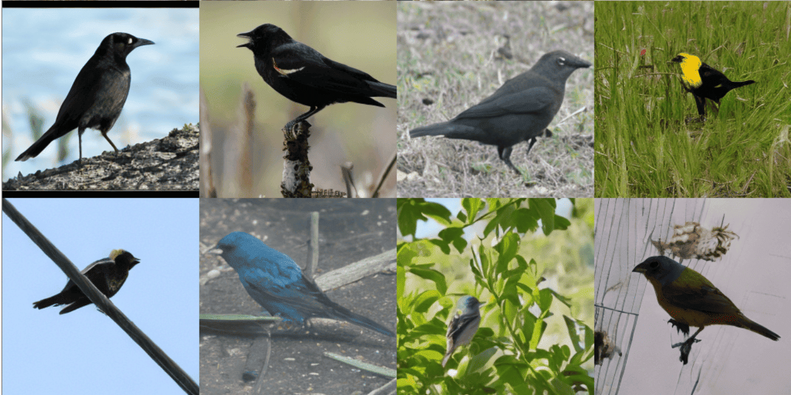
*Figure 2:Target-domain generated images using MF-T+CAMF initialized from different source models. Images are uncurated.*

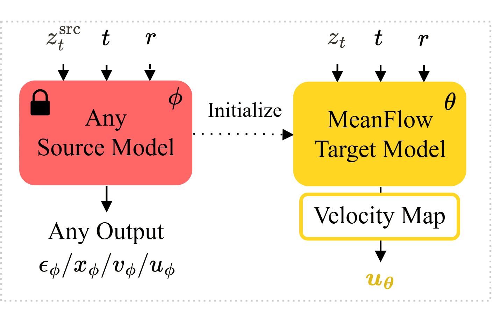
*(a)MeanFlow-Transfer (MF-T)*

*(a)MeanFlow-Transfer (MF-T)*

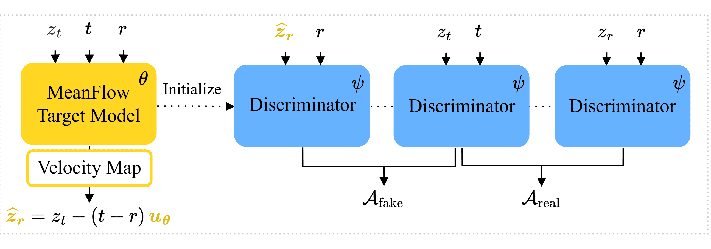
*(b)Continuous Adversarial MeanFlow (CAMF)*

*(a)Source-domain FID.*

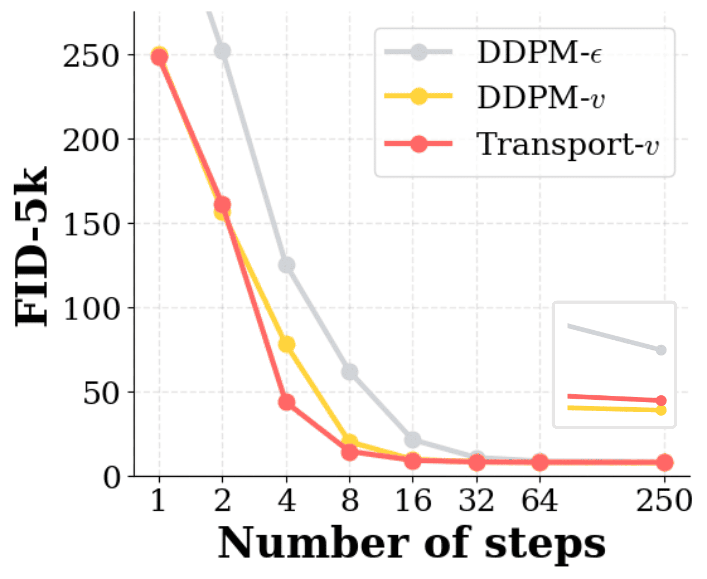
*(a)Source-domain FID.*

*Figure 5:Target-domain generated images using MF-T+CAMF initialized from different source models. Images are uncurated.*

---
**Usage Info**: 6322 tokens used.
**Generated at**: 2026-08-21 14:32:45

---

# 📚 Listening Forward: Next Patch Embedding Prediction Enables Scalable Audio Learners

🚀 URL: https://arxiv.org/html/2608.19863

## 🌏 Abstract (원문)
Self-supervised learning (SSL) has driven substantial progress in audio representation learning, though existing methods have increasingly relied on elaborate pre-training recipes to reach competitive performance. A markedly different pre-training philosophy underpins the most influential progress in language modeling and, more recently, in visual representation learning: rather than train encoders as static feature extractors, models are trained to predict the next element, a discrete token or a continuous embedding, from the preceding context. Autoregressive prediction thereby provides a unified pre-training interface that transfers across modalities, compelling the model to learn the underlying data distribution. We ask whether such a simple causal paradigm can yield strong audio learners, given that audio’s temporal structure makes autoregressive prediction of patch embeddings a natural fit. We introduce NAPE (Next-Audio-Patch-Embedding prediction), a self-supervised framework in which a causal Transformer predicts each next patch embedding of a log-mel spectrogram from the previous ones, using causal masking and stop-gradient as its sole training signal. The design is intentionally minimalist, avoiding reconstruction decoders, acoustic tokenizers, student-teacher setups, and auxiliary regularization losses. Across six audio and speech benchmarks, NAPE achieves state-of-the-art fine-tuning performance on several tasks, scales consistently across encoder sizes, and yields strong linear-probing results. NAPE also produces structured attention patterns without explicit supervision.
## 🌏 Abstract (번역)
자기 지도 학습(SSL)은 오디오 표현 학습에서 상당한 발전을 이끌었지만, 기존 방법들은 경쟁력 있는 성능에 도달하기 위해 점점 더 정교한 사전 학습 레시피에 의존해왔습니다. 언어 모델링과 최근 시각 표현 학습에서 가장 영향력 있는 발전의 기반이 되는 사전 학습 철학은 현저히 다릅니다. 인코더를 정적 특징 추출기로 훈련하기보다는, 모델이 이전 컨텍스트로부터 다음 요소(이산 토큰 또는 연속 임베딩)를 예측하도록 훈련됩니다. 이로써 자기회귀 예측은 양식 간에 전이되는 통합된 사전 학습 인터페이스를 제공하여 모델이 기본 데이터 분포를 학습하도록 만듭니다. 우리는 오디오의 시간적 구조가 패치 임베딩의 자기회귀 예측에 자연스럽게 적합하다는 점을 고려할 때, 이러한 간단한 인과 패러다임이 강력한 오디오 학습기를 생성할 수 있는지 질문합니다. 우리는 NAPE(Next-Audio-Patch-Embedding prediction)를 소개합니다. 이는 인과적 트랜스포머가 인과 마스킹과 스톱-그레이디언트를 유일한 훈련 신호로 사용하여 이전 로그-멜 스펙트로그램의 각 다음 패치 임베딩을 예측하는 자기 지도 프레임워크입니다. 이 설계는 재구성 디코더, 음향 토크나이저, 학생-교사 설정 및 보조 정규화 손실을 피하는 의도적으로 미니멀리스트적입니다. 6개의 오디오 및 음성 벤치마크에서 NAPE는 여러 작업에서 최첨단 미세 조정 성능을 달성하고, 인코더 크기에 걸쳐 일관되게 확장되며, 강력한 선형 프로빙 결과를 산출합니다. NAPE는 또한 명시적인 감독 없이 구조화된 어텐션 패턴을 생성합니다.

## 🔍 Methods & Results
- 기존 오디오 SSL 방법들의 복잡한 사전 학습 레시피 의존성 문제를 제기하고, 언어 및 시각 모델링의 자기회귀 예측 패러다임을 오디오에 적용하는 것을 목표로 함.
- NAPE(Next-Audio-Patch-Embedding prediction)라는 자기 지도 프레임워크를 제안함.
- NAPE는 인과적 트랜스포머를 사용하여 로그-멜 스펙트로그램의 이전 패치 임베딩으로부터 다음 패치 임베딩을 예측하며, 인과 마스킹과 스톱-그레이디언트를 유일한 훈련 신호로 사용함.
- 재구성 디코더, 음향 토크나이저, 학생-교사 설정, 보조 정규화 손실 등을 배제한 미니멀리스트 디자인을 채택함.
- 6개의 오디오 및 음성 벤치마크에서 여러 작업에 걸쳐 최첨단 미세 조정(fine-tuning) 성능을 달성함.
- 인코더 크기에 따라 일관되게 성능이 확장됨을 입증함.
- 강력한 선형 프로빙(linear-probing) 결과를 보임.
- 명시적인 감독 없이도 구조화된 어텐션 패턴을 생성하는 능력을 확인함.

## 🖼 Figures
![Figure 1:Left: NAPE’s overview. The input spectrogram is split into patches and embedded into a sequence of embeddings. At each step, the model predicts the embedding of the next patch (red border) using only the embeddings of the preceding patches; patches at future positions are hidden by the causal attention mask. Middle: The NAPE pipeline: patch embeddings 
𝑧
 are processed by the causal encoder 
ℎ
 and predictor 
𝑔
 to produce predictions 
𝑧
^
, which are compared against the targets 
𝑧
 under stop-gradient using a similarity function 
𝒟
 (i.e., negative cosine similarity). Right: Encoder architecture (
ℎ
): multiple stacked Transformer layers with pre-norm design, causal self-attention, LayerScale, and query-key normalization.](../images/2026-08-21/2608.19863/2608.19863_fig0.png)
*Figure 1:Left: NAPE’s overview. The input spectrogram is split into patches and embedded into a sequence of embeddings. At each step, the model predicts the embedding of the next patch (red border) using only the embeddings of the preceding patches; patches at future positions are hidden by the causal attention mask. Middle: The NAPE pipeline: patch embeddings 
𝑧
 are processed by the causal encoder 
ℎ
 and predictor 
𝑔
 to produce predictions 
𝑧
^
, which are compared against the targets 
𝑧
 under stop-gradient using a similarity function 
𝒟
 (i.e., negative cosine similarity). Right: Encoder architecture (
ℎ
): multiple stacked Transformer layers with pre-norm design, causal self-attention, LayerScale, and query-key normalization.*

![Figure 7:Top: Prediction Quality Analysis. We report the cosine similarity between the predicted and true patch embeddings, averaged over 
500
 audio clips (left) and for two individual clips (middle, right). Bottom: Attention/Embedding Analyses. Left: selected query patch; middle: attention map showing the patches NAPE attends to when predicting the next patch; right: embedding-similarity map between the predicted next-patch embedding 
𝑧
^
𝑡
+
1
 and every actual patch embedding in the spectrogram.](../images/2026-08-21/2608.19863/2608.19863_fig7.png)
*Figure 7:Top: Prediction Quality Analysis. We report the cosine similarity between the predicted and true patch embeddings, averaged over 
500
 audio clips (left) and for two individual clips (middle, right). Bottom: Attention/Embedding Analyses. Left: selected query patch; middle: attention map showing the patches NAPE attends to when predicting the next patch; right: embedding-similarity map between the predicted next-patch embedding 
𝑧
^
𝑡
+
1
 and every actual patch embedding in the spectrogram.*

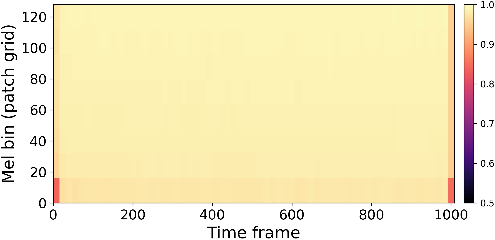
*Figure 9*

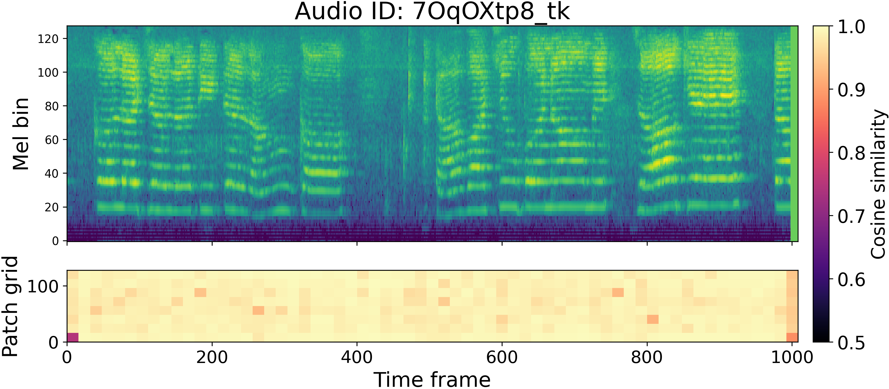
*Figure 10*

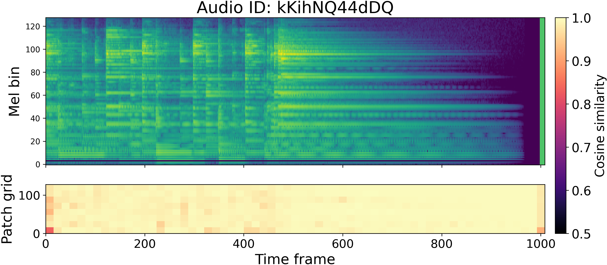
*Figure 11*

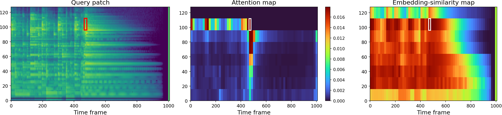
*Figure 12*

*Figure 11:Additional qualitative results for NAPE-L with raster order.*

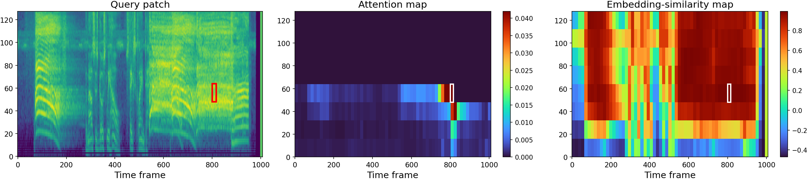
*Figure 25*

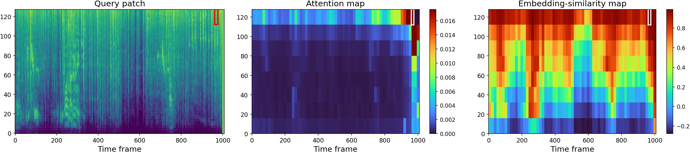
*Figure 26*

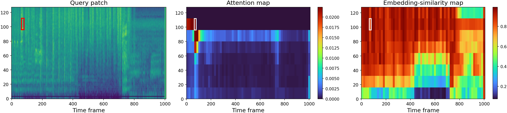
*Figure 27*

*Figure 12:Additional qualitative results for NAPE-L with diagonal order.*

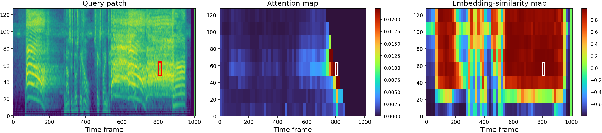
*Figure 29*

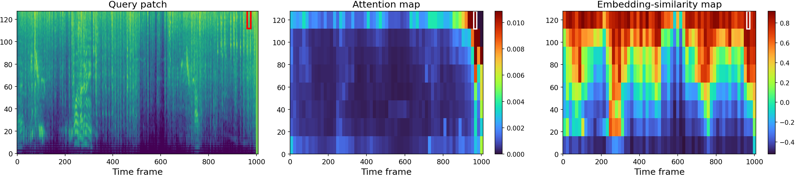
*Figure 30*

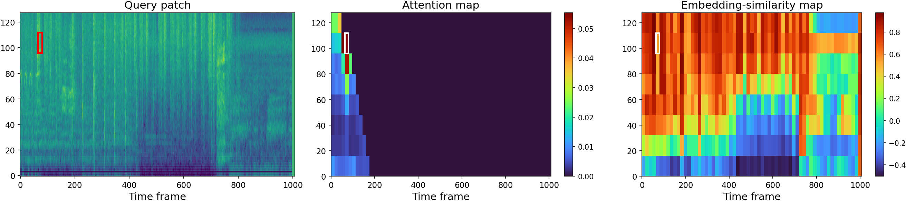
*Figure 31*

---
**Usage Info**: 1849 tokens used.
**Generated at**: 2026-08-21 14:33:06

---

# 📚 Tracking the Trend in How Speech Synthesizers Deceive People

🚀 URL: https://arxiv.org/html/2608.19959

## 🌏 Abstract (원문)
Advances in speech synthesis have made deepfake audio highly realistic. Earlier studies reported 70–80% human detection accuracy, but relied primarily on older synthesizers. We compare human detection for three selected voice synthesis tools released in 2019, 2022, and 2024 with 82 IT professionals, and benchmark humans against six pretrained detectors on the same material. For fully synthetic speech (full spoofs), the F1 score drops from about 90% for RTVC and YourTTS to 48% for ElevenLabs, although listeners were explicitly warned that deepfakes were present. For partial spoofing, where only one sentence of an utterance is altered, strict accuracy falls to 9%, and listeners classify the synthetic sentence as bona fide 77% of the time. Humans and detectors fail in complementary ways, and neither reliably localizes short manipulations. Additionally, listeners increasingly mislabel bona fide speech as fake, eroding trust in unmanipulated audio. These findings show that human perception alone is unreliable for the selected modern and partial-spoof conditions and motivate procedural verification, provenance, watermarking, and segment-level detection.
## 🌏 Abstract (번역)
음성 합성 기술의 발전으로 딥페이크 오디오는 매우 사실적으로 변했습니다. 이전 연구에서는 인간의 탐지 정확도가 70~80%라고 보고했지만, 주로 구형 합성기에 의존했습니다. 본 연구에서는 2019년, 2022년, 2024년에 출시된 세 가지 음성 합성 도구에 대한 인간의 탐지 능력을 82명의 IT 전문가를 대상으로 비교하고, 동일한 자료에 대해 6개의 사전 훈련된 탐지기와 인간의 성능을 벤치마킹했습니다. 완전히 합성된 음성(전체 스푸핑)의 경우, 청취자에게 딥페이크가 존재한다고 명시적으로 경고했음에도 불구하고 RTVC 및 YourTTS의 F1 점수는 약 90%에서 ElevenLabs의 경우 48%로 떨어졌습니다. 발화 중 한 문장만 변경된 부분 스푸핑의 경우, 엄격한 정확도는 9%로 떨어졌고, 청취자들은 합성된 문장을 77%의 확률로 진짜 음성으로 분류했습니다. 인간과 탐지기는 상호 보완적인 방식으로 실패하며, 둘 다 짧은 조작을 안정적으로 찾아내지 못했습니다. 또한, 청취자들은 진짜 음성을 가짜로 오인하는 경향이 증가하여 조작되지 않은 오디오에 대한 신뢰를 약화시켰습니다. 이러한 결과는 선택된 최신 및 부분 스푸핑 조건에서 인간의 인식만으로는 신뢰할 수 없음을 보여주며, 절차적 검증, 출처 확인, 워터마킹, 그리고 세그먼트 수준 탐지의 필요성을 제기합니다.

## 🔍 Methods & Results
- 실험은 전체 합성 녹음(전체 스푸핑)을 사용하는 1부와 발화 중 한 문장만 변경된 부분 합성 녹음(부분 스푸핑)을 사용하는 2부로 구성된 설문 기반 조사로 진행되었습니다.
- 인간의 판단은 동일한 자료에 대해 6개의 사전 훈련된 딥페이크 음성 탐지기(XLS-R, WavLM 프런트엔드와 AASIST, MHFA 백엔드 조합)와 벤치마킹되었습니다.
- 실험에는 Real-Time Voice Cloning(RTVC, 2019), YourTTS(2022), ElevenLabs(2024)의 세 가지 음성 합성 도구가 사용되었으며, ElevenLabs는 유일한 상업용 시스템입니다.
- 딥페이크 음성 생성에는 유명인(아델, 마일리 사이러스 등 9명)의 유튜브 인터뷰 오디오가 사용되었고, 모든 도구는 제로샷 방식으로 사전 훈련된 가중치를 사용하여 녹음을 생성했습니다.
- ChatGPT-4를 사용하여 전체 스푸핑 및 부분 스푸핑 녹음의 대화형 콘텐츠를 생성했으며, 부분 스푸핑의 경우 원본 대본을 수정하여 한 문장을 변경했습니다.
- 각 참가자는 9개의 스피커 테스트 세트를 평가했으며, 각 세트에는 진짜 녹음 1개, 전체 스푸핑 녹음 3개, 부분 스푸핑 녹음 3개가 포함되어 총 7개의 녹음이 있었습니다.
- 참가자들은 각 스피커 테스트 세트 시작 시 진짜 음성 참조 비디오를 시청한 후, 각 녹음의 4개 문장 수준 세그먼트를 개별적으로 평가하여 진짜, 합성 또는 불확실로 분류했습니다.
- 평가 지표로는 F1 점수, All OK(모든 4개 문장이 정확해야 함), Over 50 Percent(4개 중 3개 이상 정확해야 함)가 사용되었으며, 불확실한 답변은 분석에서 제외되었습니다.
- 82명의 IT 전문가를 대상으로 한 실험 결과, 전체 스푸핑의 경우 RTVC 및 YourTTS에 대한 인간의 F1 점수는 약 90%였으나, ElevenLabs에 대해서는 48%로 크게 감소했습니다.
- 부분 스푸핑(한 문장만 변경)의 경우, 엄격한 정확도는 9%로 떨어졌고, 청취자들은 합성된 문장을 77%의 확률로 진짜 음성으로 오인했습니다.
- 인간과 자동 탐지기는 상호 보완적인 방식으로 실패하며, 짧은 조작을 안정적으로 찾아내지 못했고, 청취자들은 진짜 음성을 가짜로 오인하는 경향이 증가하여 조작되지 않은 오디오에 대한 신뢰를 약화시켰습니다.

## 🖼 Figures
![Figure 3:Human detection per speaker for (a,b) full-spoof and (c,d) partial-spoof recordings (the prefix “mix” marks one synthetically replaced sentence). Rows: recording source (bona fide Original, RTVC 2019, YourTTS 2022, ElevenLabs 2024); columns: speaker initials (AD = Adele, CB = Cate Blanchett, JB = Jeff Bridges, JA = Jennifer Aniston, MC = Miley Cyrus, MF = Morgan Freeman, SG = Selena Gomez, TH = Tom Holland, LN = Liam Neeson), with the final Mean column. Green = reliably detected, red = deceptive. Lower scores on the Original row reflect false positives (bona fide speech judged synthetic); the mixElevenLabs rows (c,d) show the partial-spoof collapse.](../images/2026-08-21/2608.19959/2608.19959_fig2.png)
*Figure 3:Human detection per speaker for (a,b) full-spoof and (c,d) partial-spoof recordings (the prefix “mix” marks one synthetically replaced sentence). Rows: recording source (bona fide Original, RTVC 2019, YourTTS 2022, ElevenLabs 2024); columns: speaker initials (AD = Adele, CB = Cate Blanchett, JB = Jeff Bridges, JA = Jennifer Aniston, MC = Miley Cyrus, MF = Morgan Freeman, SG = Selena Gomez, TH = Tom Holland, LN = Liam Neeson), with the final Mean column. Green = reliably detected, red = deceptive. Lower scores on the Original row reflect false positives (bona fide speech judged synthetic); the mixElevenLabs rows (c,d) show the partial-spoof collapse.*

---
**Usage Info**: 4985 tokens used.
**Generated at**: 2026-08-21 14:33:51

---

