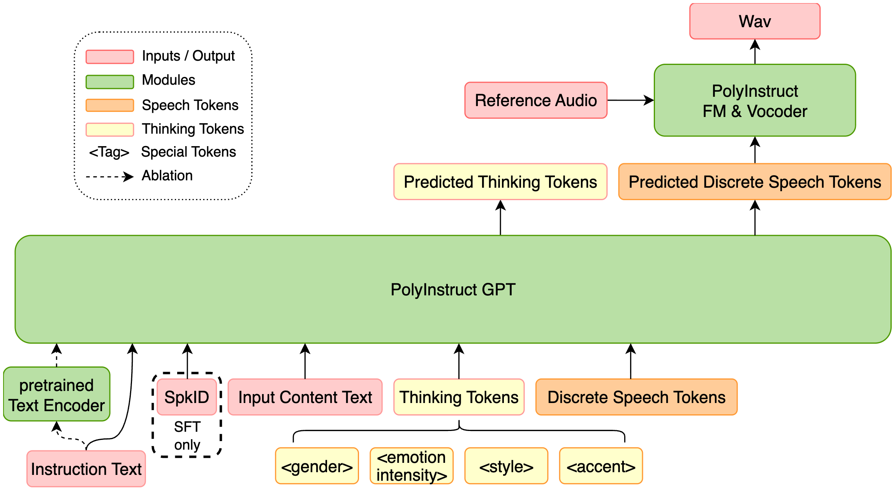
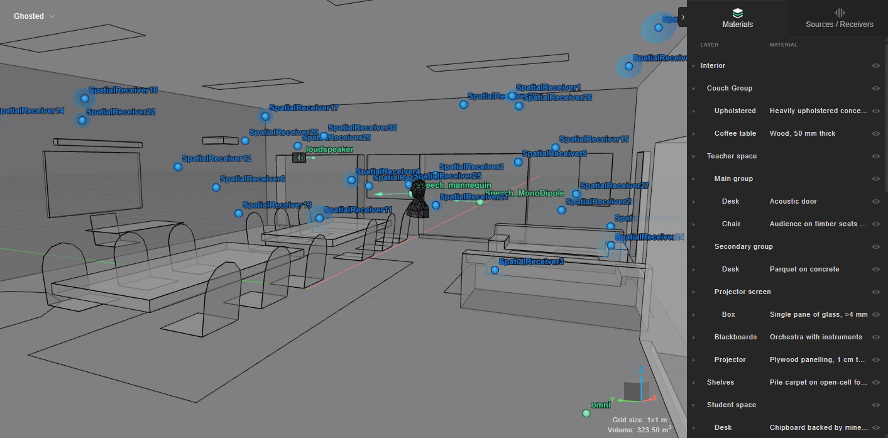

# 🚩 (2026-08-24) Scholar Inbox 추천 논문 

# 📚 Poly-InstructTTS: Learning In-the-Wild Expressive Speech Synthesis from Open-Ended Instructions

🚀 URL: https://arxiv.org/html/2608.20387

## 🌏 Abstract (원문)
While recent text-to-speech (TTS) models achieve high naturalness, controlling fine-grained expression via natural-language instructions remains challenging. We introducePoly-InstructTTS, which learns expressive speech from open-ended instructions using in-the-wild audiovisual data. We build a scalable multi-modal pipeline to construct a 1,000-hour instruction-annotated corpus covering 1,000+ fine-grained emotions and styles. The framework uses a prompt-free GPT with attribute-based thinking tokens, followed by a flow-matching module that injects timbre from a reference audio. We also present a speaker fine-tuning procedure to transfer instruction control to specific speakers while preserving persona. We further extend InstructTTSEval with broader tasks. Experiments show that Poly-InstructTTS delivers strong performance in instruction adherence and expressiveness. Audio demos and the expanded testset are available on our project page111https://zhangjh915.github.io/PolyInstructTTS-demo/.
## 🌏 Abstract (번역)
최근 텍스트 음성 변환(TTS) 모델이 높은 자연스러움을 달성했지만, 자연어 지침을 통해 미세한 표현을 제어하는 것은 여전히 어렵습니다. 본 논문에서는 야생의 시청각 데이터를 사용하여 개방형 지침으로부터 표현력이 풍부한 음성을 학습하는 Poly-InstructTTS를 소개합니다. 우리는 1,000개 이상의 미세한 감정과 스타일을 포함하는 1,000시간 분량의 지침 주석 코퍼스를 구축하기 위한 확장 가능한 다중 모달 파이프라인을 구축합니다. 이 프레임워크는 속성 기반 사고 토큰을 사용하는 프롬프트 없는 GPT와 참조 오디오에서 음색을 주입하는 플로우 매칭 모듈을 사용합니다. 또한 특정 화자의 개성을 보존하면서 지침 제어를 해당 화자에게 전이시키는 화자 미세 조정 절차를 제시합니다. 우리는 InstructTTSEval을 더 넓은 작업으로 확장합니다. 실험 결과 Poly-InstructTTS는 지침 준수 및 표현력에서 강력한 성능을 제공함을 보여줍니다. 오디오 데모와 확장된 테스트 세트는 프로젝트 페이지(https://zhangjh915.github.io/PolyInstructTTS-demo/)에서 확인할 수 있습니다.

## 🔍 Methods & Results
- 영화 및 TV 시청각 미디어에서 1,000시간 분량의 '야생' 데이터를 수집하여 풍부한 감정과 비언어적 행동을 포착했습니다.
- 데이터 처리 파이프라인은 비디오 분할, 오디오 노이즈 제거(Demucs, ClearerVoice), ElevenLabs API를 통한 ASR, 화자 분리 및 비언어적 태깅을 포함하며, 자막과의 퍼지 매칭을 통해 텍스트 정확도를 높였습니다.
- Gemini 2.5 Pro API를 활용한 3단계 파이프라인으로 자연어 지침을 생성했습니다: 1단계 콘텐츠 요약, 2단계 전사 분석(성별, 억양, 감정, 스타일 등 다차원 속성 주석), 3단계 지침 생성.
- Poly-InstructTTS는 GPT-FM 아키텍처를 따르며, GPT는 지침과 텍스트를 음성 토큰으로 변환하고, FM 모듈은 이 토큰을 멜-스펙트로그램으로 변환하며, HiFi-Net은 오디오 파형을 재구성합니다.
- GPT는 대규모 음성 코퍼스(Emilia, MLS)로 사전 학습된 후, 지침 데이터셋에서 `<Instruct> <Text> <Thinking Tokens> <Speech Tokens>` 형식으로 후속 학습됩니다.
- LLM 생성 텍스트 토큰 대신 성별, 감정 강도, 스타일, 억양을 포함하는 속성 기반 '사고 토큰'을 사용하여 최적화 부담을 줄이고 콘텐츠 이해 능력을 보존했습니다.
- 특정 화자의 개성을 유지하면서 지침 제어 능력을 전이하기 위한 '지침 조건부 화자 미세 조정(SFT)' 방식을 제안했으며, 화자 ID 태그를 사용하여 이를 구현했습니다.
- 실험 결과 Poly-InstructTTS는 지침 준수 및 표현력 측면에서 강력한 성능을 보였습니다.

## 🖼 Figures
![(a)Proposed data pipeline. * ASR: Automatic Speech Recognition, SD: Speaker Diarization, PL: Paralinguistic Tagging via 11Labs API[20]](../images/2026-08-24/2608.20387/2608.20387_fig0.png)
*(a)Proposed data pipeline. * ASR: Automatic Speech Recognition, SD: Speaker Diarization, PL: Paralinguistic Tagging via 11Labs API[20]*

![(a)Proposed data pipeline. * ASR: Automatic Speech Recognition, SD: Speaker Diarization, PL: Paralinguistic Tagging via 11Labs API[20]](../images/2026-08-24/2608.20387/2608.20387_fig1.png)
*(a)Proposed data pipeline. * ASR: Automatic Speech Recognition, SD: Speaker Diarization, PL: Paralinguistic Tagging via 11Labs API[20]*

*(b)Proposed Poly-InstructTTS architecture.*

---
**Usage Info**: 3147 tokens used.
**Generated at**: 2026-08-24 14:40:55

---

# 📚 A Factorial Ablation of a Speech-to-SFT Pipeline: Differential Effects on Data Quality and Downstream Transfer

🚀 URL: https://arxiv.org/html/2608.20394

## 🌏 Abstract (원문)
Industry pipelines that turn speech into supervised fine-tuning (SFT) data via multi-stage refinement are increasingly adopted but, to our knowledge, have not been publicly ablated stage-by-stage, leaving each stage’s marginal value unknown. We design a production-ready speech-to-SFT pipeline in which transcript refinement (Phase
0) and SFT data quality refinement (Phase
2) are independently toggleable, yielding a2×22\times 2factorial design. For each condition, we generate QA-form SFT data from Korean medical and finance conference recordings and fine-tune 9 models (5 LLM families, 2.4B–70B); we evaluate with four cross-provider LLM judges, a blind six-expert human evaluation, and 3 downstream MCQA benchmarks. Our central finding: under a fixed, standard SFT recipe, improvements in QA data quality do not transfer uniformly into downstream MCQA gains. 4-judge quality rises consistently, yet the cross-model mean MCQA gain is not significant; positive transfer concentrates on family↔\leftrightarrowdomain aligned pairs. This differential pattern is consistent with a format mismatch: Phase
2 shifts SFT-data composition toward explanatory items, while MCQA primarily probes factoid recall. All six human raters report higher full-pipeline quality, confirming the LLM-judge direction. An STT-engine swap to Whisper-medium confirms pipeline robustness. A non-hallucination audit shows the two frontier LLMs admit unknown on∼8%{\sim}8\%}of QA on average; we release samples, prompts, code, and all SFT checkpoints.
## 🌏 Abstract (번역)
음성을 다단계 정제를 통해 지도 미세 조정(SFT) 데이터로 변환하는 산업 파이프라인이 점점 더 많이 채택되고 있지만, 각 단계의 한계 가치가 알려지지 않은 채 단계별로 공개적으로 제거된 적은 없는 것으로 알고 있습니다. 우리는 전사 정제(Phase 0)와 SFT 데이터 품질 정제(Phase 2)를 독립적으로 전환할 수 있는 프로덕션 준비된 음성-SFT 파이프라인을 설계하여 2x2 요인 설계를 도출했습니다. 각 조건에 대해 한국 의료 및 금융 컨퍼런스 녹음에서 QA 형식 SFT 데이터를 생성하고 9개의 모델(5개 LLM 계열, 2.4B–70B)을 미세 조정했습니다. 우리는 4개의 교차 공급자 LLM 심사위원, 6명의 전문가 블라인드 인간 평가, 3개의 다운스트림 MCQA 벤치마크로 평가했습니다. 우리의 핵심 발견은 다음과 같습니다: 고정된 표준 SFT 레시피 하에서 QA 데이터 품질 개선이 다운스트림 MCQA 이득으로 균일하게 전이되지 않습니다. 4명의 심사위원 품질은 일관되게 상승하지만, 교차 모델 평균 MCQA 이득은 유의미하지 않습니다. 긍정적인 전이는 계열-도메인 정렬된 쌍에 집중됩니다. 이러한 차등 패턴은 형식 불일치와 일치합니다: Phase 2는 SFT 데이터 구성을 설명 항목으로 전환하는 반면, MCQA는 주로 사실적 회상을 탐색합니다. 6명의 모든 인간 평가자는 전체 파이프라인 품질이 더 높다고 보고하여 LLM 심사위원의 방향을 확인했습니다. STT 엔진을 Whisper-medium으로 교체하여 파이프라인 견고성을 확인했습니다. 비환각 감사 결과, 두 개의 최첨단 LLM은 평균적으로 QA의 약 8%에 대해 알 수 없음을 인정하는 것으로 나타났습니다. 우리는 샘플, 프롬프트, 코드 및 모든 SFT 체크포인트를 공개합니다.

## 🔍 Methods & Results
- 전사 정제(Phase 0)와 SFT 데이터 품질 정제(Phase 2)를 독립적으로 전환할 수 있는 프로덕션 준비된 음성-SFT 파이프라인을 설계하여 2x2 요인 설계를 구현했습니다.
- 각 조건에 대해 한국 의료 및 금융 컨퍼런스 녹음에서 QA 형식 SFT 데이터를 생성하고, 5개 LLM 계열(2.4B–70B)의 9개 모델을 미세 조정했습니다.
- 평가는 4개의 교차 공급자 LLM 심사위원, 6명의 전문가 블라인드 인간 평가, 3개의 다운스트림 MCQA 벤치마크를 통해 수행되었습니다.
- 주요 결과: 고정된 표준 SFT 레시피 하에서 QA 데이터 품질 개선이 다운스트림 MCQA 이득으로 균일하게 전이되지 않았습니다.
- 4명의 LLM 심사위원 평가에서 품질은 일관되게 상승했지만, 교차 모델 평균 MCQA 이득은 유의미하지 않았으며, 긍정적인 전이는 계열-도메인 정렬된 쌍에 집중되었습니다.
- 이러한 차등 패턴은 Phase 2가 SFT 데이터 구성을 설명 항목으로 전환하고 MCQA는 주로 사실적 회상을 탐색하는 형식 불일치와 일치합니다.
- 6명의 모든 인간 평가자는 전체 파이프라인 품질이 더 높다고 보고하여 LLM 심사위원의 평가 방향을 확인했습니다.
- STT 엔진을 Whisper-medium으로 교체하여 파이프라인의 견고성을 확인했습니다.
- 비환각 감사 결과, 두 개의 최첨단 LLM은 평균적으로 QA의 약 8%에 대해 '알 수 없음'을 인정하는 것으로 나타났습니다.

## 🖼 Figures

*Figure 1:Three-phase speech-to-SFT pipeline. Phase 0 and Phase 2 are independently toggled, yielding the 
2
×
2
 factorial; Phase 1 is shared. Phase 0’s multi-STT cross-validation re-invokes secondary STT providers on the source audio, normalizing in-house STT differences whenever Phase 0 is active (used in §5.3).*

*Figure 2:(a) 4-judge progression on the 200-QA public sample (per-judge means; 4-judge mean overlaid, 
Δ
2
−
0
=
+
0.18
). (b) 
Δ
2
−
0
 on the domain-aligned KMMLU subset, 18 cells sorted; shaded band is the per-cell noise bound 
𝜎
KMMLU
≤
2.87
 pp.*

---
**Usage Info**: 2241 tokens used.
**Generated at**: 2026-08-24 14:41:05

---

# 📚 TRAINING DEEPFILTERNET WITH ACCURATE ROOM ACOUSTIC SIMULATIONS IMPROVES SINGLE-CHANNEL SPEECH ENHANCEMENT

🚀 URL: https://arxiv.org/html/2608.20971

## 🌏 Abstract (원문)
We investigate how the realism of synthetic room impulse response (RIR) datasets affects the training of DeepFilterNet3 for single-channel speech enhancement. We compare a DNS4 image-source-method (ISM) RIR dataset with a higher-acoustic-fidelity dataset generated using hybrid wave-based and geometrical acoustics simulation. Rather than isolating individual simulation factors, we compare complete RIR generation pipelines while keeping the enhancement model unchanged. Models are evaluated on unseen measured RIRs using objective speech enhancement metrics and downstream automatic speech recognition (ASR). Training with the higher-fidelity dataset consistently yields modest improvements in objective metrics and substantially lower ASR word error rates than the ISM dataset. Although the experiments do not attribute these gains to individual modelling components, they show that increasing the overall realism of synthetic acoustic training data improves the generalization of DeepFilterNet3 to unseen measured environments.
## 🌏 Abstract (번역)
본 연구는 합성된 실내 임펄스 응답(RIR) 데이터셋의 현실성이 단일 채널 음성 향상을 위한 DeepFilterNet3 훈련에 어떻게 영향을 미치는지 조사합니다. 우리는 DNS4 이미지-소스-방법(ISM) RIR 데이터셋과 하이브리드 파동 기반 및 기하학적 음향 시뮬레이션을 사용하여 생성된 더 높은 음향 충실도 데이터셋을 비교합니다. 개별 시뮬레이션 요소를 분리하기보다는, 향상 모델을 변경하지 않고 완전한 RIR 생성 파이프라인을 비교합니다. 모델은 객관적인 음성 향상 지표와 후속 자동 음성 인식(ASR)을 사용하여 이전에 보지 못한 측정된 RIR에 대해 평가됩니다. 더 높은 충실도의 데이터셋으로 훈련하면 ISM 데이터셋보다 객관적인 지표에서 꾸준히 약간의 개선을 보였고, ASR 단어 오류율은 상당히 낮아졌습니다. 비록 실험이 이러한 개선을 개별 모델링 구성 요소에 귀속시키지는 않지만, 합성 음향 훈련 데이터의 전반적인 현실성을 높이는 것이 DeepFilterNet3의 이전에 보지 못한 측정 환경에 대한 일반화 능력을 향상시킨다는 것을 보여줍니다.

## 🔍 Methods & Results
- DeepFilterNet3의 단일 채널 음성 향상 훈련에 합성 RIR 데이터셋의 현실성이 미치는 영향을 조사했습니다.
- DNS4 이미지-소스-방법(ISM) RIR 데이터셋과 하이브리드 파동 기반 및 기하학적 음향 시뮬레이션으로 생성된 고음향 충실도 데이터셋을 비교했습니다.
- 향상 모델을 고정한 채 완전한 RIR 생성 파이프라인을 비교했으며, 개별 시뮬레이션 요소를 분리하지 않았습니다.
- 모델 평가는 이전에 보지 못한 측정된 RIR에 대해 객관적인 음성 향상 지표와 후속 ASR(자동 음성 인식)을 사용하여 수행되었습니다.
- 고충실도 데이터셋으로 훈련했을 때 ISM 데이터셋보다 객관적인 지표에서 꾸준히 소폭 개선되었고, ASR 단어 오류율은 상당히 낮아졌습니다.
- 실험 결과는 합성 음향 훈련 데이터의 전반적인 현실성을 높이는 것이 DeepFilterNet3의 이전에 보지 못한 측정 환경에 대한 일반화 능력을 향상시킨다는 것을 보여줍니다.

## 🖼 Figures

*Fig. 2:Level of detail for one of the rooms simulated in the Hybrid dataset*

---
**Usage Info**: 1336 tokens used.
**Generated at**: 2026-08-24 14:41:10

---

# 📚 Difficulty-Calibrated Interpolation Paths for Conditional Flow Matching

🚀 URL: https://arxiv.org/html/2608.21286

## 🌏 Abstract (원문)
Conditional Flow Matching trains generative models by regressing a network onto the velocity of a prescribed noise-to-data interpolation path. The interpolation schedule that shapes this path is known to affect convergence and sample quality, yet it is invariably fixed in advance, independent of both the data and the model. We show that the regression difficulty of Conditional Flow Matching varies systematically along the path, and we propose Difficulty-Calibrated Flow Matching, which derives the schedule from the model itself: a short pilot run with the linear path records the per-time loss, and the schedule is set to the quantile function of this difficulty profile, so the trajectory lingers where the velocity is hardest to learn. The method has a single hyperparameter, leaves the training objective and its gradient equivalence intact, composes with classifier-free guidance, and adds about two percent training overhead. In controlled experiments on CIFAR-10, MNIST, and Fashion-MNIST with an identical compact U-Net, the calibrated path attains the best FID on CIFAR-10 at full sampling budget and clearly outperforms all fixed schedules in the large-batch, few-update regime, precisely the setting where compute is scarcest.
## 🌏 Abstract (번역)
조건부 플로우 매칭(Conditional Flow Matching)은 네트워크를 미리 정해진 노이즈-데이터 보간 경로의 속도에 회귀시켜 생성 모델을 훈련합니다. 이 경로를 형성하는 보간 스케줄은 수렴 및 샘플 품질에 영향을 미치는 것으로 알려져 있지만, 데이터와 모델 모두와 독립적으로 항상 미리 고정됩니다. 우리는 조건부 플로우 매칭의 회귀 난이도가 경로를 따라 체계적으로 변화함을 보이며, 모델 자체에서 스케줄을 도출하는 난이도 보정 플로우 매칭(Difficulty-Calibrated Flow Matching)을 제안합니다. 이 방법은 선형 경로를 사용한 짧은 예비 실행을 통해 시간별 손실을 기록하고, 이 난이도 프로파일의 분위수 함수로 스케줄을 설정하여 속도를 학습하기 가장 어려운 지점에서 궤적이 머무르도록 합니다. 이 방법은 단일 하이퍼파라미터를 가지며, 훈련 목표와 그 기울기 등가성을 그대로 유지하고, 분류기 없는 안내(classifier-free guidance)와 결합할 수 있으며, 약 2%의 훈련 오버헤드를 추가합니다. CIFAR-10, MNIST, Fashion-MNIST에 대한 동일한 소형 U-Net을 사용한 통제된 실험에서, 보정된 경로(calibrated path)는 전체 샘플링 예산에서 CIFAR-10에서 최고의 FID를 달성했으며, 컴퓨팅 자원이 가장 부족한 대규모 배치, 적은 업데이트 환경에서 모든 고정 스케줄을 명확히 능가했습니다.

## 🔍 Methods & Results
- 조건부 플로우 매칭(CFM)은 노이즈-데이터 보간 경로의 속도에 네트워크를 회귀시켜 생성 모델을 훈련한다.
- 기존 CFM의 보간 스케줄은 수렴 및 샘플 품질에 영향을 미치지만, 데이터와 모델과 독립적으로 미리 고정되어 있었다.
- CFM의 회귀 난이도가 경로를 따라 체계적으로 변화함을 발견했다.
- 난이도 보정 플로우 매칭(Difficulty-Calibrated Flow Matching)을 제안한다. 이는 모델 자체에서 스케줄을 도출하는 방법이다.
- 제안된 방법은 선형 경로를 사용한 짧은 예비 실행으로 시간별 손실을 기록하고, 이 난이도 프로파일의 분위수 함수로 스케줄을 설정하여 학습하기 어려운 지점에서 궤적이 더 오래 머무르도록 한다.
- 난이도 보정 플로우 매칭은 단일 하이퍼파라미터를 가지며, 훈련 목표와 기울기 등가성을 유지하고, 분류기 없는 안내와 결합 가능하며, 약 2%의 훈련 오버헤드를 추가한다.
- CIFAR-10, MNIST, Fashion-MNIST에 대한 실험에서, 보정된 경로(calibrated path)는 전체 샘플링 예산에서 CIFAR-10에서 최고의 FID를 달성했다.
- 특히 컴퓨팅 자원이 부족한 대규모 배치, 적은 업데이트 환경에서 모든 고정 스케줄보다 명확히 우수한 성능을 보였다.

## 🖼 Figures
![Fig. 2:Overview of Difficulty-Calibrated Flow Matching (DC-FM). (a) Standard CFM pipeline: an interpolant mixes a data sample 
𝑥
1
 and noise 
𝑥
0
, a U-Net regresses the target velocity under the flow-matching loss, and samples are drawn by integrating the ODE at inference. (b) The interpolation schedule 
𝛼
⁡
(
𝑡
)
 for linear, cosine, sigmoid, and our calibrated path; only 
𝛼
⁡
(
𝑡
)
 changes across the controlled comparison. (c) DC-FM measures per-time difficulty 
𝑤
⁡
(
𝑡
)
 in a linear pilot and sets the schedule to the quantile function of 
𝑤
𝛾
, so the trajectory slows through hard regions of the path and moves quickly through easy ones.](../images/2026-08-24/2608.21286/2608.21286_fig1.png)
*Fig. 2:Overview of Difficulty-Calibrated Flow Matching (DC-FM). (a) Standard CFM pipeline: an interpolant mixes a data sample 
𝑥
1
 and noise 
𝑥
0
, a U-Net regresses the target velocity under the flow-matching loss, and samples are drawn by integrating the ODE at inference. (b) The interpolation schedule 
𝛼
⁡
(
𝑡
)
 for linear, cosine, sigmoid, and our calibrated path; only 
𝛼
⁡
(
𝑡
)
 changes across the controlled comparison. (c) DC-FM measures per-time difficulty 
𝑤
⁡
(
𝑡
)
 in a linear pilot and sets the schedule to the quantile function of 
𝑤
𝛾
, so the trajectory slows through hard regions of the path and moves quickly through easy ones.*

*Fig. 3:Interpolation . schedule 
𝛼
⁡
(
𝑡
)
 (left), its speed 
𝛼
′
​
(
𝑡
)
 (middle), and the pilot difficulty 
𝑤
⁡
(
𝑡
)
 (right) on CIFAR-10 (top), Fashion-MNIST (middle), and MNIST (bottom). DC-FM slows down (
𝛼
′
 small) exactly where 
𝑤
⁡
(
𝑡
)
 is large.*

*Fig. 4:Uncurated DC-FM samples (NFE
=
100
) on CIFAR-10 (top) and Fashion-MNIST (bottom).*

---
**Usage Info**: 1748 tokens used.
**Generated at**: 2026-08-24 14:41:18

---

# 📚 µNet: Ultra-Low-Memory and Low-Complexity Speech Enhancement for Embedded Digital Signal Processors

🚀 URL: https://arxiv.org/html/2608.21155

## 🌏 Abstract (원문)
Speech enhancement on embedded digital signal processors (DSPs) imposes strict constraints on memory footprint, computational complexity, latency, and support for integer operations. Although recent DNN-based approaches have addressed these challenges individually, no unified framework in the literature simultaneously addresses all these requirements for practical deployment. In this work, we propose µNet, an ultra-low-memory, low-complexity, and low-latency end-to-end DNN model. The proposed method requires only9090KB of static memory and2828MMACs, while supporting an algorithmic latency as low as44ms with performance comparable to state-of-the-art methods of similar complexity. Our experiments demonstrate that µNet is compatible with neural accelerators and supports full integer-arithmetic operations on consumer DSP platforms such as Cadence Tensilica HiFi 4/5.
## 🌏 Abstract (번역)
임베디드 디지털 신호 처리기(DSP)에서의 음성 향상은 메모리 사용량, 계산 복잡도, 지연 시간, 정수 연산 지원에 대한 엄격한 제약을 부과합니다. 최근 DNN 기반 접근 방식들이 이러한 문제들을 개별적으로 해결해왔지만, 실제 배포를 위한 모든 요구 사항을 동시에 충족하는 통합 프레임워크는 문헌에 없습니다. 본 연구에서는 초저메모리, 저복잡도, 저지연 종단간 DNN 모델인 µNet을 제안합니다. 제안된 방법은 단 90KB의 정적 메모리와 28MMACs만을 필요로 하며, 유사한 복잡도를 가진 최신 방법들과 비교할 만한 성능을 유지하면서 4ms의 낮은 알고리즘 지연 시간을 지원합니다. 우리의 실험은 µNet이 신경 가속기와 호환되며 Cadence Tensilica HiFi 4/5와 같은 소비자 DSP 플랫폼에서 완전한 정수 연산을 지원함을 보여줍니다.

## 🔍 Methods & Results
- µNet은 ULCNet 아키텍처에서 영감을 받은 2단계 백본을 활용하며, 첫 번째 단계에서 크기 마스크를 추정하고 두 번째 단계에서 복합 비율 마스크(CRM)를 추정합니다.
- 입력 특징은 노이즈 신호의 수정된 거듭제곱 법칙 압축된 실수 및 허수 부분에서 계산된 크기 및 위상 특징입니다.
- 채널별 특징 재정렬은 C-SubFR과 C-SamFR을 결합한 하이브리드 접근 방식을 사용하여 지역 및 전역 스펙트럼 종속성을 포착합니다.
- 컨볼루션 및 순환 처리는 4개의 컨볼루션 레이어와 공유 GRU를 포함하며, 임베디드 하드웨어 최적화 및 양자화 지원을 위해 깊이별 분리 컨볼루션 대신 표준 컨볼루션을 사용합니다.
- 공유 선형 투영 블록은 128차원 잠재 특징을 처리하여 중간 실수 크기 마스크를 추정하며, 매개변수 수를 줄이기 위해 공유 가중치 메커니즘을 사용합니다.
- 두 번째 단계에서는 추정된 크기 마스크와 노이즈 위상을 결합하여 중간 특징을 계산한 후, CNN 블록을 통해 깨끗한 음성을 추정하고 CRM 곱셈 및 거듭제곱 법칙 압축 해제를 적용합니다.
- 손실 함수로는 Mean Squared Error (L_MSE), Multi-Scale (L_MS), Multi-Target (L_MT)이 사용되며, L_MT는 크기 비교 외에 위상 구성 요소를 도입합니다.
- 사용자 정의 가능한 NAL(Noise Attenuation Level) 제어를 위한 후처리 방법이 적용되어 음성 품질과의 균형을 조절합니다.
- µNet은 90KB의 정적 메모리, 28MMACs, 4ms의 알고리즘 지연 시간을 요구하며, 최신 방법과 유사한 성능을 제공합니다.
- µNet은 신경 가속기와 호환되며 Cadence Tensilica HiFi 4/5와 같은 소비자 DSP 플랫폼에서 완전한 정수 연산을 지원합니다.

## 🖼 Figures

*Figure 2:Spectrograms of (a) a clean speech signal and (b) noisy signal, enhanced by our proposed 
µNet
MSE
 with different power-law factor: (c)-(f).*

*Figure 3:Multi-stimuli listening test results with the float32 models at 
16
 ms latency. The 
95
%
 confidence interval is shown as red whiskers.*

*Figure 4:Relationship between different PF (
𝛼
) and 
NAL
dB
 using µNet
MSE
 model.*

*Figure 5: Multi-stimulus listening test results for float32 (F) and int8-quantized (Q) µNet
MSE
 models. Subscripts indicate algorithmic latencies; ”F” and ”Q” represent 32-bit floating-point and 8-bit integer quantization, respectively*

---
**Usage Info**: 3889 tokens used.
**Generated at**: 2026-08-24 14:41:27

---

