# 🚩 (2026-08-25) Scholar Inbox 추천 논문 

# 📚 AudioNoisePrints: Model-free audio watermarking using spatial correlation in flow matching TTS

🚀 URL: https://arxiv.org/html/2608.22186

## 🌏 Abstract (원문)
We presentAudioNoisePrints, atraining-freewatermarking pipeline for flow matching and diffusion TTS models, which requires minimal extra computation during inference and does not require retraining the TTS model or reducing the generation quality. We exploited the fact that there are strong correlations between the initial Gaussian noises and the generated outputs in diffusion and flow matching models, such that a simple cosine correlation between the initial noise and the generated output can be used to perform watermaking. Moreover, we train a lightweight detector on top for more aggressive augmentations.Our method outperformsAudioSeal, a strong baseline for audio watermarking under strong augmentations. We experimented onF5TTSand other TTS and vocoder models, and concluded that they all exhibit similarspatial correlationproperties, suggesting our watermarking scheme can be used for more flow-matching TTS models and even vocoders in the future.
## 🌏 Abstract (번역)
우리는 흐름 매칭 및 확산 TTS 모델을 위한 훈련 없는 워터마킹 파이프라인인 AudioNoisePrints를 제시합니다. 이는 추론 시 최소한의 추가 계산만을 요구하며, TTS 모델을 재훈련하거나 생성 품질을 저하시키지 않습니다. 우리는 확산 및 흐름 매칭 모델에서 초기 가우시안 노이즈와 생성된 출력 사이에 강한 상관관계가 있다는 사실을 활용했습니다. 이를 통해 초기 노이즈와 생성된 출력 간의 간단한 코사인 상관관계를 사용하여 워터마킹을 수행할 수 있습니다. 또한, 우리는 더 공격적인 증강에 대비하여 경량 탐지기를 추가로 훈련시킵니다. 우리의 방법은 강력한 증강 하에서 오디오 워터마킹의 강력한 기준선인 AudioSeal보다 우수한 성능을 보입니다. 우리는 F5TTS 및 다른 TTS 및 보코더 모델에 대해 실험했으며, 이들 모두 유사한 공간 상관 특성을 보인다는 결론을 내렸습니다. 이는 우리의 워터마킹 방식이 향후 더 많은 흐름 매칭 TTS 모델 및 심지어 보코더에도 사용될 수 있음을 시사합니다.

## 🔍 Methods & Results
- AudioNoisePrints는 이미지 도메인의 NoisePrints를 오디오 도메인으로 적용한 훈련 없는 워터마킹 파이프라인으로, 초기 가우시안 노이즈와 생성된 오디오/멜-스펙트로그램 간의 코사인 유사도를 기반으로 워터마킹을 수행합니다.
- 워터마크 탐지는 고정된 임계값 대신, 생성된 오디오와 원본 노이즈 간의 거리(d_org)를 500개의 무작위 노이즈로 생성된 오디오와의 거리(d_rand)와 비교하여 경험적 p-값을 계산하고, 이 p-값에 대한 임계값(τ_p)을 설정하여 이루어집니다.
- 공격적인 증강에 대한 강건성을 높이기 위해, 특정 초기 노이즈(`x_init`)로부터 생성되었는지 여부를 이진 분류하는 경량 컨볼루션 신경망(CNN) 기반의 외부 탐지기(`Detector approach`)를 훈련시킵니다. 이 탐지기는 MP3/AAC 코덱을 포함한 데이터 증강을 적용하며, 크롭핑과 같은 공격에 대응하기 위해 `x_init`을 멜-스펙트로그램 공간에서 100프레임 고정 길이로 주기적으로 샘플링하여 사용합니다.
- 이 방법은 TTS 모델을 재훈련할 필요가 없어 생성 품질 저하를 방지하며, 탐지기는 추론 속도 향상 및 복잡성 감소를 위해 사용됩니다.
- F5-TTS (Vocos 보코더 사용) 및 MatchaTTS 모델을 사용하여 LibriTTS 및 LJSpeech 데이터셋에서 실험을 수행했으며, 탐지기 훈련을 위해 추가 감정 감지 텍스트 데이터셋을 활용했습니다.
- 4계층 Conv2D ResNet 기반의 AudioNoisePrints 탐지기를 AudioSeal(강력한 오디오 워터마킹 기준선)과 비교한 결과, AudioNoisePrints가 강력한 증강 하에서 AudioSeal보다 우수한 성능을 보였습니다.
- F5TTS 및 다른 TTS, 보코더 모델들이 유사한 공간 상관 특성을 보임을 확인하여, 제안된 워터마킹 방식이 향후 더 많은 흐름 매칭 TTS 모델 및 보코더에 적용될 수 있음을 시사합니다.

## 🖼 Figures
![Figure 1:General overview of our approach (AudioNoisePrints) comparing to the commonly used post-hoc watermarking schemes. As shown above, the post-hoc watermarking model required altering the audio after it is generated, which creates computation overhead and alters the quality of the audio. Our method simply changes the initial noise 
x
^
𝑖
​
𝑛
​
𝑖
​
𝑡
 during generation (without altering the quality of the generated audio), and uses either the model-free option (calculating the cosine similarity of the audio-Mel-spectrogram and the initial noise) or the more robust detector option to determine if the audio is in fact watermarked.](../images/2026-08-25/2608.22186/2608.22186_fig0.png)
*Figure 1:General overview of our approach (AudioNoisePrints) comparing to the commonly used post-hoc watermarking schemes. As shown above, the post-hoc watermarking model required altering the audio after it is generated, which creates computation overhead and alters the quality of the audio. Our method simply changes the initial noise 
x
^
𝑖
​
𝑛
​
𝑖
​
𝑡
 during generation (without altering the quality of the generated audio), and uses either the model-free option (calculating the cosine similarity of the audio-Mel-spectrogram and the initial noise) or the more robust detector option to determine if the audio is in fact watermarked.*

*Figure 2:Accuracy comparing the AudioSeal and our approaches. While AudioSeal has a higher top-end score (1.0 accuracy), under strong augmentation, our method (using either the model-free Cosine similarity approach or the Detector approach) significantly outperforms the post-hoc watermark baseline. Especially in the speed augmentation, where AudioSeal fails even witha 1 percent change in stretching.*

---
**Usage Info**: 4237 tokens used.
**Generated at**: 2026-08-25 14:48:01

---

# 📚 saanoTTS: The Smallest Real-Time Neural TTS on a General-Purpose Microcontroller

🚀 URL: https://arxiv.org/html/2608.21378

## 🌏 Abstract (원문)
This paper describes an audited neural text-to-speech stack that runs from phoneme IDs to 22.05-kHz PCM on general-purpose microcontrollers. Its deployed graph has 567,008 parameters, and its two int8 blobs occupy 679,832 bytes. On an ESP32-S3, the complete duration–acoustic–inverse-STFT path generates 4.54 s of speech in 1.02 s (0.22×0.22\timesreal time) without a neural accelerator. The same portable C core runs offline at5.72×5.72\timesreal time on an FPU-less ESP32-C3. To our knowledge, this is the smallest complete phoneme-to-waveform neural TTS graph demonstrated in real time on a general-purpose microcontroller without a neural accelerator. We derive the students from the conditional-VAE objective of their Piper/VITS teachers and state the duration, latent-interface, waveform, adversarial, and joint-distillation losses used in training. The size and speed come with an audible cost: on unseen text, the embedded stack distilled fromen_US-kristin-mediumscores 2.54 SCOREQ and 2.80 UTMOS, compared with 4.68 and 4.42 for its teacher. A separate English quality package uses the strongeren_US-amy-mediumteacher. Its 1,454,284-parameter Pareto point scores 4.13 SCOREQ and 4.10 UTMOS; a 1,834,380-parameter variant scores 4.16 SCOREQ. A controlled capacity study with Kristin identifies the decoder, rather than the output representation, as the main constraint. Two evaluation failures also affected the work: a narrow, templated test set overstated one early student’s SCOREQ by 1.35, and aggregate quality predictors missed a sibilant failure that was evident in listening and in a phoneme-resolved spectral probe. Checksums cover the reported model blobs, runtime ports, and golden vectors.
## 🌏 Abstract (번역)
본 논문은 범용 마이크로컨트롤러에서 음소 ID부터 22.05-kHz PCM까지 실행되는 감사된 신경망 텍스트-음성 변환(TTS) 스택에 대해 설명합니다. 배포된 그래프는 567,008개의 파라미터를 가지며, 두 개의 int8 블롭은 679,832바이트를 차지합니다. ESP32-S3에서 완전한 지속 시간-음향-역 STFT 경로는 신경망 가속기 없이 1.02초 만에 4.54초 분량의 음성을 생성합니다(실시간의 0.22배). 동일한 휴대용 C 코어는 FPU가 없는 ESP32-C3에서 오프라인으로 실시간의 5.72배 속도로 실행됩니다. 저희가 아는 한, 이는 신경망 가속기 없이 범용 마이크로컨트롤러에서 실시간으로 시연된 가장 작은 완전한 음소-파형 신경망 TTS 그래프입니다. 우리는 Piper/VITS 교사의 조건부-VAE 목표에서 학생 모델을 도출했으며, 훈련에 사용된 지속 시간, 잠재 인터페이스, 파형, 적대적, 그리고 공동 증류 손실을 명시합니다. 크기와 속도는 청각적 비용을 수반합니다: 보지 못한 텍스트에서 en_US-kristin-medium에서 증류된 임베디드 스택은 2.54 SCOREQ와 2.80 UTMOS를 기록했으며, 이는 교사 모델의 4.68과 4.42에 비해 낮은 수치입니다. 별도의 영어 품질 패키지는 더 강력한 en_US-amy-medium 교사 모델을 사용합니다. 이 모델의 1,454,284개 파라미터 파레토 지점은 4.13 SCOREQ와 4.10 UTMOS를 기록했으며, 1,834,380개 파라미터 변형은 4.16 SCOREQ를 기록했습니다. Kristin을 사용한 통제된 용량 연구는 출력 표현보다는 디코더가 주요 제약임을 확인했습니다. 두 가지 평가 실패도 작업에 영향을 미쳤습니다: 좁고 템플릿화된 테스트 세트가 초기 학생 모델의 SCOREQ를 1.35 과대평가했으며, 종합 품질 예측기는 청취 및 음소 분해 스펙트럼 탐침에서 명백했던 치찰음 실패를 놓쳤습니다. 체크섬은 보고된 모델 블롭, 런타임 포트 및 골든 벡터를 포함합니다.

## 🔍 Methods & Results
- 범용 마이크로컨트롤러에서 음소 ID부터 22.05-kHz PCM까지 실행되는 감사된 신경망 텍스트-음성 변환(TTS) 스택을 개발했습니다.
- 배포된 그래프는 567,008개의 파라미터와 679,832바이트를 차지하는 두 개의 int8 블롭으로 구성됩니다.
- ESP32-S3에서 신경망 가속기 없이 1.02초 만에 4.54초 분량의 음성을 생성하여 실시간의 0.22배 속도를 달성했습니다.
- FPU가 없는 ESP32-C3에서 동일한 C 코어가 오프라인으로 실시간의 5.72배 속도로 실행됩니다.
- 신경망 가속기 없이 범용 마이크로컨트롤러에서 실시간으로 시연된 가장 작은 완전한 음소-파형 신경망 TTS 그래프로 알려져 있습니다.
- Piper/VITS 교사의 조건부-VAE 목표에서 학생 모델을 도출했으며, 훈련에 지속 시간, 잠재 인터페이스, 파형, 적대적, 공동 증류 손실을 사용했습니다.
- en_US-kristin-medium에서 증류된 임베디드 스택은 보지 못한 텍스트에서 2.54 SCOREQ와 2.80 UTMOS를 기록했습니다 (교사 모델은 4.68 SCOREQ, 4.42 UTMOS).
- 더 강력한 en_US-amy-medium 교사 모델을 사용한 영어 품질 패키지는 1,454,284개 파라미터 모델에서 4.13 SCOREQ와 4.10 UTMOS를, 1,834,380개 파라미터 모델에서 4.16 SCOREQ를 기록했습니다.
- 용량 연구 결과, 출력 표현보다는 디코더가 주요 제약으로 확인되었습니다.
- 평가 과정에서 좁은 테스트 세트가 초기 학생 모델의 SCOREQ를 과대평가하고, 종합 품질 예측기가 치찰음 실패를 놓치는 등의 문제가 발생했습니다.

---
**Usage Info**: 2767 tokens used.
**Generated at**: 2026-08-25 14:48:12

---

# 📚 Improving Few-Step Language Flows withUntied Self-Conditioning

🚀 URL: https://arxiv.org/html/2608.22244

## 🌏 Abstract (원문)
Flow-matching language models refine all token positions in parallel and can trade sampling steps for latency, yet generation quality still degrades sharply with few sampling steps. We trace a source of this degradation to a train–inference mismatch in previous-prediction self-conditioning: during training, the self-conditioning input is computed from the current noisy state with no intervening solver step; during sampling, the solver folds the previous prediction into the latent before that same prediction reappears as the explicit self-conditioning input. This coupling, absent during training, creates redundancy that grows with step width. We show that the mismatch degrades both the self-conditioning input and the solver update, and derive a correction for each from the model’s own structure. From the frozen projection weights we identify directions along which the self-conditioning input is redundant with the latent and dampen them; from the solver’s integration structure we derive that a step-average prediction is needed and approximate it from prediction history, with scale set by offline trajectory statistics. The resulting sampler, Untied Self-Conditioning, requires no retraining and uses one evaluation per step. At 8 sampling steps on LangFlow, it reduces OpenWebText generative perplexity from531531to6262(8.6×8.6\times); under an adapted Arena-Hard-Auto v2 protocol, its outputs are preferred in96%96\%of pairwise comparisons. On ELF-B it reduces generative perplexity from7171to4343. Improvements hold from 8 to 256 sampling steps.
## 🌏 Abstract (번역)
플로우 매칭 언어 모델은 모든 토큰 위치를 병렬로 정제하며 샘플링 단계를 지연 시간과 교환할 수 있지만, 적은 샘플링 단계에서는 생성 품질이 급격히 저하됩니다. 우리는 이러한 저하의 원인을 이전 예측 자기 조건화(previous-prediction self-conditioning)에서의 훈련-추론 불일치에서 찾았습니다. 훈련 중에는 자기 조건화 입력이 중간 솔버 단계 없이 현재 노이즈 상태에서 계산됩니다. 반면 샘플링 중에는 솔버가 이전 예측을 잠재 공간에 통합한 후 동일한 예측이 명시적인 자기 조건화 입력으로 다시 나타납니다. 훈련 중에는 존재하지 않는 이 결합은 단계 폭에 따라 증가하는 중복성을 생성합니다. 우리는 이 불일치가 자기 조건화 입력과 솔버 업데이트를 모두 저하시키며, 모델 자체 구조에서 각각에 대한 수정 사항을 도출했습니다. 고정된 투영 가중치로부터 자기 조건화 입력이 잠재 공간과 중복되는 방향을 식별하고 이를 약화시켰습니다. 솔버의 통합 구조로부터 단계 평균 예측이 필요함을 도출하고, 오프라인 궤적 통계에 의해 설정된 스케일로 예측 기록으로부터 이를 근사화했습니다. 그 결과로 나온 샘플러인 Untied Self-Conditioning은 재훈련이 필요 없으며 단계당 한 번의 평가를 사용합니다. LangFlow에서 8개의 샘플링 단계에서 OpenWebText 생성 혼란도(perplexity)를 531에서 62로 (8.6배) 감소시켰습니다. 조정된 Arena-Hard-Auto v2 프로토콜에서는 쌍대 비교에서 96%의 선호도를 얻었습니다. ELF-B에서는 생성 혼란도를 71에서 43으로 감소시켰습니다. 이러한 개선은 8단계에서 256단계까지 유지됩니다.

## 🔍 Methods & Results
- 플로우 매칭 언어 모델의 적은 샘플링 단계에서의 생성 품질 저하 원인을 이전 예측 자기 조건화(previous-prediction self-conditioning)의 훈련-추론 불일치로 규명했습니다.
- 훈련 중에는 자기 조건화 입력이 노이즈 상태에서 직접 계산되지만, 샘플링 중에는 솔버가 이전 예측을 잠재 공간에 통합한 후 자기 조건화 입력으로 재사용되어 중복성이 발생함을 확인했습니다.
- 모델 구조로부터 자기 조건화 입력과 솔버 업데이트의 저하를 수정하는 방법을 도출했습니다.
- 고정된 투영 가중치에서 자기 조건화 입력이 잠재 공간과 중복되는 방향을 식별하고 이를 약화시키는 방법을 제안했습니다.
- 솔버의 통합 구조로부터 단계 평균 예측이 필요함을 도출하고, 오프라인 궤적 통계를 기반으로 예측 기록에서 이를 근사화하는 방법을 사용했습니다.
- 제안된 샘플러 'Untied Self-Conditioning'은 재훈련이 필요 없으며 단계당 한 번의 평가만 수행합니다.
- LangFlow에서 8개의 샘플링 단계에서 OpenWebText 생성 혼란도를 531에서 62로 (8.6배) 크게 감소시켰습니다.
- 조정된 Arena-Hard-Auto v2 프로토콜에서 Untied Self-Conditioning의 출력은 쌍대 비교에서 96%의 높은 선호도를 보였습니다.
- ELF-B에서 생성 혼란도를 71에서 43으로 감소시키는 성능을 달성했습니다.
- 성능 개선은 8단계부터 256단계까지 넓은 범위의 샘플링 단계에서 일관되게 유지되었습니다.

---
**Usage Info**: 2039 tokens used.
**Generated at**: 2026-08-25 14:48:32

---

# 📚 FlowSep 2: Self-Supervised Flow Matching for Language-Queried Audio Source Separation

🚀 URL: https://arxiv.org/html/2608.22111

## 🌏 Abstract (원문)
Language-queried audio source separation (LASS) aims to extract target sources from audio mixtures according to natural language descriptions, offering a flexible and scalable interface for audio source separation. However, most existing LASS methods rely on discriminative, mask-based models, which estimate masks from the input mixture. These methods often over-suppress target sounds or fail to fully separate them, especially when multiple sound events strongly overlap in complex acoustic scenes. In this work, we propose FlowSep2, a text-conditioned flow-matching generative model for LASS. Instead of directly predicting a separation mask, FlowSep2 learns to generate the target source representation from Gaussian noise in a latent space, conditioned on both the mixture representation and the text query. Specifically, we employ rectified flow matching with a Diffusion Transformer backbone. We further incorporate Self-Flow, a self-supervised flow-matching paradigm, into our LASS framework. By encouraging semantically structured latent representations under the generative objective, Self-Flow improves the model’s ability to separate target sources according to text queries. Experiments on multiple LASS benchmarks show that FlowSep2 achieves state-of-the-art performance and demonstrates enhanced sound separation results in challenging scenarios with overlapping sound events.
## 🌏 Abstract (번역)
언어 질의 오디오 소스 분리(LASS)는 자연어 설명을 기반으로 오디오 혼합물에서 목표 소스를 추출하는 것을 목표로 하며, 오디오 소스 분리를 위한 유연하고 확장 가능한 인터페이스를 제공합니다. 그러나 대부분의 기존 LASS 방법은 입력 혼합물에서 마스크를 추정하는 판별적, 마스크 기반 모델에 의존합니다. 이러한 방법들은 특히 복잡한 음향 환경에서 여러 음향 이벤트가 강하게 중첩될 때 목표 소리를 과도하게 억제하거나 완전히 분리하지 못하는 경우가 많습니다. 본 연구에서는 LASS를 위한 텍스트 조건부 플로우 매칭 생성 모델인 FlowSep2를 제안합니다. FlowSep2는 분리 마스크를 직접 예측하는 대신, 혼합 표현과 텍스트 쿼리 모두에 조건화되어 잠재 공간에서 가우시안 노이즈로부터 목표 소스 표현을 생성하는 방법을 학습합니다. 특히, 우리는 Diffusion Transformer 백본과 함께 정류 플로우 매칭을 사용합니다. 또한, 우리는 자체 지도 플로우 매칭 패러다임인 Self-Flow를 LASS 프레임워크에 통합합니다. 생성 목표 하에서 의미론적으로 구조화된 잠재 표현을 장려함으로써, Self-Flow는 텍스트 쿼리에 따라 목표 소스를 분리하는 모델의 능력을 향상시킵니다. 여러 LASS 벤치마크에 대한 실험 결과, FlowSep2는 최첨단 성능을 달성했으며, 중첩된 음향 이벤트가 있는 어려운 시나리오에서 향상된 음향 분리 결과를 보여주었습니다.

## 🔍 Methods & Results
- FlowSep2는 텍스트 인코더(FLAN-T5), 오디오 인코더(Stable-Audio VAE 인코더), Self-Flow 기반의 특징 생성기, 그리고 목표 오디오 재구성을 위한 VAE 디코더로 구성됩니다.
- 텍스트 쿼리 임베딩을 위해 FLAN-T5를 텍스트 인코더로 사용하여 CLIP이나 CLAP과 같은 대조 학습 모델보다 향상된 의미 정보 추출 성능을 보입니다.
- 오디오 임베딩을 위해 Stable-Audio의 사전 학습된 VAE를 사용하여 파형 신호를 압축된 잠재 공간으로 매핑하며, 추론 시 VAE 디코더를 통해 파형 공간으로 재구성합니다.
- 기존 확산 모델과 달리, FlowSep2는 정류 플로우 매칭(RFM)을 사용하여 가우시안 노이즈와 데이터 분포 사이의 변환을 학습하며, 이산적인 시간 단계에서 노이즈를 예측하는 대신 속도 필드를 직접 학습합니다.
- RFM은 가우시안 노이즈 잠재 표현과 목표 잠재 표현 사이의 선형 변환 경로를 모델링하며, 중간 노이즈 표현은 연속적인 플로우 변수(λ)를 통해 정의됩니다.
- 혼합 잠재 표현(z_m)은 중간 잠재 표현(z_λ)과 채널 차원으로 연결된 후 Diffusion Transformer(DiT) 생성기에 입력되며, 텍스트 쿼리 임베딩(E)이 언어 조건으로 사용됩니다.
- Self-Flow는 플로우 학습 중 의미론적 표현 학습을 강화하기 위해 도입되었으며, 서로 다른 노이즈 손상 수준을 가진 동일한 목표 잠재 표현의 두 가지 뷰(학생 네트워크는 노이즈가 있는 뷰, 교사 네트워크는 균일하고 깨끗한 뷰)를 구성합니다.
- 학생 네트워크는 교사 네트워크(학생 네트워크의 EMA로 업데이트됨)가 생성한 중간 표현과 일치하도록 훈련되며, 이를 통해 생성 목표 하에서 의미론적으로 구조화된 잠재 표현을 장려합니다.
- Self-Flow의 손실 함수는 표준 정류 플로우 매칭 손실과 교사-학생 네트워크의 중간 특징 간의 코사인 유사도를 최소화하는 표현 학습 손실을 결합하여 구성됩니다.
- 실험 결과, FlowSep2는 여러 LASS 벤치마크에서 최첨단 성능을 달성했으며, 특히 음향 이벤트가 중첩되는 어려운 시나리오에서 향상된 음향 분리 결과를 보여주었습니다.

## 🖼 Figures
![Fig. 1:The overall architecture of FlowSep2. Here, 
𝐳
𝑚
 denotes the mixture latent, 
𝐳
0
 denotes the Gaussian noise, 
𝐳
1
 denotes the target latent, and 
𝐳
𝜆
 represents the intermediate latent along the flow trajectory. During training, the mixture latent 
𝐳
𝑚
 is concatenated with the intermediate latent before being fed into the DiT flow module and the teacher receives a cleaner intermediate latent 
𝐳
𝜆
​
𝑐
 to provide representation-level supervision. The teacher network is updated using EMA and the student network is optimized using both the flow matching loss 
ℒ
RFM
 and the representation loss 
ℒ
rep
.](../images/2026-08-25/2608.22111/2608.22111_fig0.png)
*Fig. 1:The overall architecture of FlowSep2. Here, 
𝐳
𝑚
 denotes the mixture latent, 
𝐳
0
 denotes the Gaussian noise, 
𝐳
1
 denotes the target latent, and 
𝐳
𝜆
 represents the intermediate latent along the flow trajectory. During training, the mixture latent 
𝐳
𝑚
 is concatenated with the intermediate latent before being fed into the DiT flow module and the teacher receives a cleaner intermediate latent 
𝐳
𝜆
​
𝑐
 to provide representation-level supervision. The teacher network is updated using EMA and the student network is optimized using both the flow matching loss 
ℒ
RFM
 and the representation loss 
ℒ
rep
.*

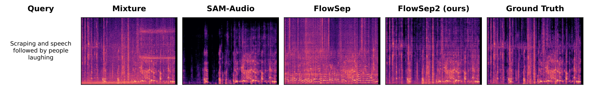
*Fig. 3:A case study comparing separation results from different methods with the ground truth on the AudioCaps test set.*

---
**Usage Info**: 3764 tokens used.
**Generated at**: 2026-08-25 14:48:55

---

# 📚 Do Spoken Language Models Hear Speech as They Read Text? Bridging Structural Gaps Between Speech and Text

🚀 URL: https://arxiv.org/html/2608.22908

## 🌏 Abstract (원문)
Spoken Language Models (SLMs) generate textual responses directly from speech, offering an alternative to cascaded systems. Despite recent advances, existing SLMs still exhibit weaker instruction-following behavior and limited generalization across diverse tasks compared to text-based language models. Our analysis shows that speech and text representations in current SLMs remain weakly aligned despite strong downstream performance, indicating that structural differences between continuous, temporally varying speech and discrete text remain insufficiently addressed. To address this, we propose a simple framework that decouples length mismatch from semantic alignment and encourages closer correspondence between speech and text representations. Experiments across multiple benchmarks demonstrate competitive performance against strong baselines, underscoring the importance of explicitly addressing structural differences between speech and text in SLM training. Our code is publicly available athttps://github.com/jaykim9870/Do_SLMs_Hear_Speech_as_They_Read_Text.
## 🌏 Abstract (번역)
음성 언어 모델(SLM)은 음성으로부터 직접 텍스트 응답을 생성하여 계단식 시스템의 대안을 제공합니다. 최근 발전에도 불구하고, 기존 SLM은 텍스트 기반 언어 모델에 비해 지시 따르기 행동이 약하고 다양한 작업에 대한 일반화 능력이 제한적입니다. 우리의 분석에 따르면 현재 SLM에서 음성 및 텍스트 표현은 강력한 다운스트림 성능에도 불구하고 여전히 약하게 정렬되어 있으며, 이는 연속적이고 시간적으로 변하는 음성과 이산적인 텍스트 간의 구조적 차이가 충분히 다루어지지 않았음을 나타냅니다. 이를 해결하기 위해 우리는 길이 불일치를 의미론적 정렬로부터 분리하고 음성 및 텍스트 표현 간의 더 긴밀한 대응을 장려하는 간단한 프레임워크를 제안합니다. 여러 벤치마크에 걸친 실험은 강력한 기준선에 대해 경쟁력 있는 성능을 보여주며, SLM 훈련에서 음성과 텍스트 간의 구조적 차이를 명시적으로 다루는 것의 중요성을 강조합니다. 우리의 코드는 https://github.com/jaykim9870/Do_SLMs_Hear_Speech_as_They_Read_Text에서 공개적으로 이용 가능합니다.

## 🔍 Methods & Results
- 기존 음성 언어 모델(SLM)은 텍스트 기반 언어 모델에 비해 지시 따르기 능력이 약하고 다양한 작업에 대한 일반화가 제한적이며, 이는 음성 및 텍스트 표현 간의 약한 정렬과 연속적인 음성 및 이산적인 텍스트 간의 구조적 차이(특히 길이 불일치) 때문임을 분석을 통해 확인했습니다.
- 기존 SLM은 낮은 CKA 점수와 토큰별 유사성 맵에서 약하거나 일관성 없는 대각선 패턴을 보여, 음성과 텍스트 표현 간의 구조적 유사성이 제한적임을 시사합니다. 기존의 길이 압축 방식은 정보 손실을 초래하거나 시간적 변화에 민감할 수 있습니다.
- 이러한 문제를 해결하기 위해 길이 불일치를 의미론적 정렬로부터 분리하고 음성 및 텍스트 표현 간의 더 긴밀한 대응을 장려하는 간단한 프레임워크를 제안합니다.
- 제안하는 모달리티 어댑터는 윈도우드 Q-former 기반이며, 훈련 시에는 동적 쿼리 할당 전략을 사용하여 목표 텍스트 임베딩의 길이에 맞춰 매핑된 음성 특징의 길이를 명시적으로 제어합니다. 추론 시에는 경량 음성 속도 예측기를 사용하여 목표 토큰 길이를 추정합니다.
- 훈련 목표는 행동 정렬 손실(behavior alignment loss)을 통해 음성 입력으로부터 텍스트 설명과 동일한 LLM 응답을 생성하도록 모델을 훈련하고, 토큰 수준 내부 정렬 손실(token-level internal alignment loss)을 통해 길이가 일치된 음성 및 텍스트 표현 간에 LLM의 선택된 은닉 상태에서 코사인 유사도 손실을 적용하여 미세한 정렬을 장려합니다.
- 여러 벤치마크에 걸친 실험을 통해 강력한 기준선 대비 경쟁력 있는 성능을 달성했으며, SLM 훈련에서 음성과 텍스트 간의 구조적 차이를 명시적으로 다루는 것의 중요성을 입증했습니다.

## 🖼 Figures

*Figure 1:Token-wise similarity maps between 
𝑍
𝑠
 and 
𝑍
𝑡
 on LibriTTS 64 test-clean for BLSP-emo 51, Qwen2-Audio-Instruct 8, and our models. Existing SLMs show weak diagonal patterns, whereas our model exhibits a clear diagonal trend by addressing structural difference between speech and text. Non-diagonal activations correspond to identical text tokens appearing at different positions.*

![Figure 2: Model architecture. Given a speech input, a frozen speech encoder extracts frame-level features, which are mapped into the LLM input space with a windowed Q-former adapter. To explicitly resolve length mismatch, the adapter dynamically allocates the number of query tokens to match the target text length during training, decoupling length alignment problem from semantic alignment. The model is trained with behavior alignment, together with an token-level internal alignment which encourages fine-grained correspondence between speech and text.](../images/2026-08-25/2608.22908/2608.22908_fig1.png)
*Figure 2: Model architecture. Given a speech input, a frozen speech encoder extracts frame-level features, which are mapped into the LLM input space with a windowed Q-former adapter. To explicitly resolve length mismatch, the adapter dynamically allocates the number of query tokens to match the target text length during training, decoupling length alignment problem from semantic alignment. The model is trained with behavior alignment, together with an token-level internal alignment which encourages fine-grained correspondence between speech and text.*

*Figure 3: Trade-off between representation similarity and task performance across different values of 
𝜆
.*

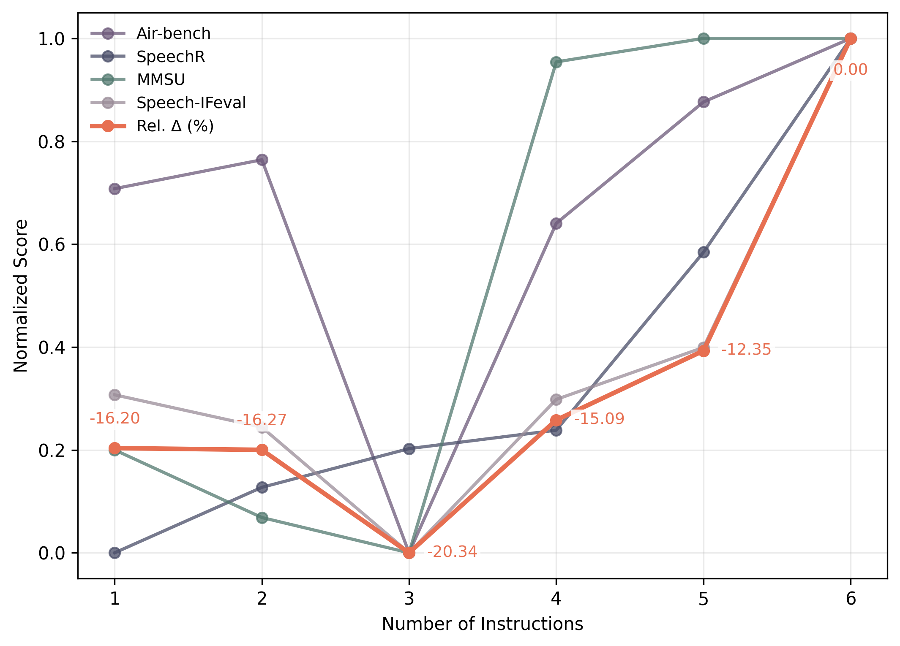
*Figure 4: Effect of the number of instructions on model performance.*

*Figure 5: Attention analysis on IEMOCAP across real speech, neutralized cloned speech generated by Qwen3-TTS 18, and text. Brighter colors indicate higher attention weights from the input representations to the corresponding emotion label. Our model shows clear activations around regions associated with emotional expression in real speech.*

---
**Usage Info**: 4658 tokens used.
**Generated at**: 2026-08-25 14:49:20

---

# 📚 DiaScriber: A Speech LLM for Joint Diarization and Transcription in Multi-Speaker Scenarios

🚀 URL: https://arxiv.org/html/2608.22796

## 🌏 Abstract (원문)
Multi-speaker automatic speech recognition (MSASR) aims to jointly predict content transcriptions, speaker identities, and timestamps, thereby addressing the key question of ”who spoke what and when” and holds substantial practical value in real-world multi-speaker scenarios. However, MSASR still encounters considerable challenges in the presence of fast turn transitions, overlapping speech, and complex, diverse multi-speaker scenarios. In this work, we propose DiaScriber, an end-to-end multi-speaker diarization and transcription model built on a speech large language model. We first construct diverse data pipelines to cover a wide variety of multi-speaker scenarios and their complexities, including validation and refinement, turn-transition and overlapping-speech simulation, and multimodal annotation. Furthermore, DiaScriber is developed based on the pretrained version of Qwen3.5-Omni through a three-stage training strategy involving continual pretraining, supervised fine-tuning, and reinforcement learning. Experiments show that DiaScriber achieves superior performance over comparison methods across extensive multi-speaker scenario test sets and demonstrates outstanding generalization ability in unseen multi-speaker scenarios.
## 🌏 Abstract (번역)
다중 화자 자동 음성 인식(MSASR)은 내용 전사, 화자 신원, 타임스탬프를 공동으로 예측하여 "누가 언제 무엇을 말했는지"라는 핵심 질문을 해결하며 실제 다중 화자 시나리오에서 상당한 실용적 가치를 지닙니다. 그러나 MSASR은 빠른 발화 전환, 겹치는 음성, 복잡하고 다양한 다중 화자 시나리오에서 여전히 상당한 어려움에 직면합니다. 본 연구에서는 음성 대규모 언어 모델을 기반으로 구축된 종단 간 다중 화자 분리 및 전사 모델인 DiaScriber를 제안합니다. 우리는 먼저 검증 및 개선, 발화 전환 및 겹치는 음성 시뮬레이션, 다중 모드 주석을 포함하여 광범위한 다중 화자 시나리오와 그 복잡성을 다루기 위한 다양한 데이터 파이프라인을 구축합니다. 또한 DiaScriber는 지속적인 사전 학습, 지도 미세 조정, 강화 학습을 포함하는 3단계 훈련 전략을 통해 Qwen3.5-Omni의 사전 학습된 버전을 기반으로 개발되었습니다. 실험 결과 DiaScriber는 광범위한 다중 화자 시나리오 테스트 세트에서 비교 방법보다 우수한 성능을 달성했으며, 이전에 보지 못한 다중 화자 시나리오에서도 뛰어난 일반화 능력을 보여주었습니다.

## 🔍 Methods & Results
- DiaScriber는 음성 대규모 언어 모델을 기반으로 하는 종단 간 다중 화자 분리 및 전사 모델로 제안되었다.
- 다양한 다중 화자 시나리오(검증 및 개선, 발화 전환 및 겹치는 음성 시뮬레이션, 다중 모드 주석 포함)를 포괄하기 위한 데이터 파이프라인이 구축되었다.
- DiaScriber는 Qwen3.5-Omni의 사전 학습된 버전을 기반으로 하며, 지속적인 사전 학습, 지도 미세 조정, 강화 학습의 3단계 훈련 전략을 사용한다.
- 실험 결과, DiaScriber는 광범위한 다중 화자 시나리오 테스트 세트에서 기존 방법들보다 우수한 성능을 달성했다.
- DiaScriber는 이전에 보지 못한 다중 화자 시나리오에서도 뛰어난 일반화 능력을 입증했다.

---
**Usage Info**: 1504 tokens used.
**Generated at**: 2026-08-25 14:49:26

---

# 📚 AT-ADD: A Benchmark and Challenge for Robust and All-Type Audio Deepfake Detection

🚀 URL: https://arxiv.org/html/2608.23437

## 🌏 Abstract (원문)
Recent audio generation models can synthesize high-fidelity speech, environmental sound, singing voice, and music, creating new risks for multimedia trust. Existing audio deepfake detection (ADD) benchmarks remain predominantly speech-centric and often underrepresent realistic channel variation and diverse audio types. This paper presents AT-ADD, a large-scale benchmark and challenge designed to evaluate both robust speech deepfake detection and all-type audio deepfake detection. Track 1 evaluates binary speech detection under unseen generators, diverse recording conditions, signal perturbations, and replay effects. Track 2 evaluates type-agnostic real/fake detection over speech, sound, singing, and music when the audio type is unknown at test time. We detail the dataset construction, evaluation protocol, and reproducible baselines, and analyze the final systems submitted to the ACM Multimedia 2026 Grand Challenge. The strongest official baseline obtains 76.73% and 79.47% Macro-F1 on the Track 1 and Track 2 evaluation sets, respectively, whereas the winning challenge systems reach 90.71% and 96.10%. Beyond aggregate rankings, sample-level analysis of the top five submissions examines generator- and type-level difficulty, cross-system error complementarity, and ranking stability. The results show that large-scale self-supervised representations, condition-aware augmentation, multi-crop inference, and structured fusion or routing are central to generalization, while generator-specific robustness and consistent performance across diverse audio types remain unresolved.
## 🌏 Abstract (번역)
최근 오디오 생성 모델들은 고품질의 음성, 환경음, 노래 음성, 음악을 합성할 수 있어 멀티미디어 신뢰에 새로운 위험을 초래합니다. 기존 오디오 딥페이크 탐지(ADD) 벤치마크는 주로 음성 중심적이며, 현실적인 채널 변화와 다양한 오디오 유형을 제대로 반영하지 못하는 경우가 많습니다. 본 논문은 견고한 음성 딥페이크 탐지 및 모든 유형의 오디오 딥페이크 탐지를 평가하도록 설계된 대규모 벤치마크이자 챌린지인 AT-ADD를 소개합니다. 트랙 1은 미지의 생성기, 다양한 녹음 조건, 신호 교란 및 재생 효과 하에서의 이진 음성 탐지를 평가합니다. 트랙 2는 테스트 시 오디오 유형을 알 수 없을 때 음성, 소리, 노래, 음악에 대한 유형 불가지론적 실제/가짜 탐지를 평가합니다. 저희는 데이터셋 구성, 평가 프로토콜, 재현 가능한 기준선에 대해 상세히 설명하고, ACM 멀티미디어 2026 그랜드 챌린지에 제출된 최종 시스템들을 분석합니다. 가장 강력한 공식 기준선은 트랙 1 및 트랙 2 평가 세트에서 각각 76.73% 및 79.47%의 Macro-F1 점수를 얻었으며, 우승 챌린지 시스템은 90.71% 및 96.10%에 도달했습니다. 종합 순위 외에도, 상위 5개 제출작에 대한 샘플 수준 분석은 생성기 및 유형 수준의 난이도, 시스템 간 오류 상보성, 순위 안정성을 조사합니다. 결과는 대규모 자기 지도 학습 표현, 조건 인식 증강, 멀티 크롭 추론, 구조화된 융합 또는 라우팅이 일반화에 중요하며, 생성기별 견고성과 다양한 오디오 유형에 걸친 일관된 성능은 여전히 해결되지 않은 과제로 남아 있음을 보여줍니다.

## 🔍 Methods & Results
- AT-ADD는 견고한 음성 딥페이크 탐지(트랙 1)와 모든 유형의 오디오 딥페이크 탐지(트랙 2)를 위한 대규모 벤치마크 및 챌린지입니다.
- 트랙 1(음성 딥페이크 탐지)의 우승 시스템인 T1-Top1 (WaveShield)은 세 가지 W2V-BERT 2.0 시스템을 앙상블하고 LoRA/어댑터 최적화, 공동/대규모 마진 미세 조정, 다양성 균형 샘플링을 통해 90.71% Macro-F1을 달성했습니다.
- 트랙 1의 상위 시스템들은 강력한 음성 자기 지도 학습(SSL) 표현을 활용했으며, 채널 및 생성기 불일치 제어와 세그먼트 수준 증거를 파일 수준 결정으로 변환하는 방식에서 차이를 보였습니다.
- 트랙 2(유형 불가지론적 오디오 딥페이크 탐지)의 우승 시스템인 T2-Top1 (starfire)은 BEATs 오디오 유형 라우터와 세 가지 전문 탐지기(음성용 XLSR-AASIST, 소리/음악 및 노래용 EAT-AASIST)를 결합하여 96.10% Macro-F1을 달성했습니다.
- 트랙 2의 선두 시스템들은 명시적 라우팅, 통합 표현 융합 또는 훈련 시간 전문가 감독을 통해 숨겨진 유형 조건을 처리했습니다.
- 전반적인 결과는 대규모 자기 지도 학습 표현, 조건 인식 증강, 멀티 크롭 추론, 구조화된 융합 또는 라우팅이 일반화에 중요하며, 생성기별 견고성과 다양한 오디오 유형에 걸친 일관된 성능은 여전히 해결되지 않은 과제임을 보여줍니다.

## 🖼 Figures

*(a)*

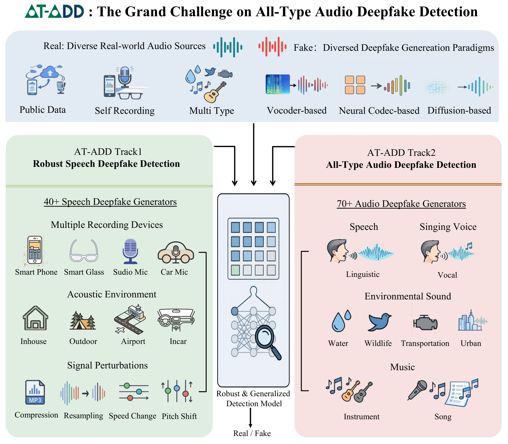
*(a)*

*Fig. 6:Submission-level diagnostics. (a) Track 2 type-wise Macro-F1. (b) Pairwise Jaccard similarity of Track 1 error sets; the diagonal is omitted. (c) Official winner, hard-decision majority voting, and non-deployable oracle upper bounds. (d) Stratified-bootstrap 95% confidence intervals from 5,000 resamples.*

---
**Usage Info**: 5752 tokens used.
**Generated at**: 2026-08-25 14:49:42

---

# 📚 WnW: Waxing-and-Waning KV Cache for Long-Form Speech LLMs

🚀 URL: https://arxiv.org/html/2608.22704

## 🌏 Abstract (원문)
Long-form audio inputs make the KV cache the dominant memory cost of speech LLMs. Prefill-only KV compression methods permanently discard audio KV positions once evicted, with no pathway to recover them during decoding. We show this is fragile on long-form audio: prefill attention concentrates near the audio start (an attention-sink effect), while decode-time attention distributes broadly, and the two rankings overlap weakly. We proposeWnW (Waxing-and-Waning KV cache), which classifies KV-heads intoanchor,tidal, andfixedroles via offline calibration. Anchor heads remain on GPU and serve as a decode-time importance observer; tidal heads keep a CPU-resident complement that is recalled chunk-by-chunk based on aggregated anchor-head scores; fixed heads keep only an on-GPU subset, with the rest permanently discarded. On LibriSpeech-Long with two 3B backbones (Voxtral-mini-3b and Qwen2.5-Omni-3B), WnW preserves near-Full-Cache accuracy while keeping only20%20%of audio tokens on GPU, where prefill-only baselines fail to terminate. Results generalize across language, task, and domain shifts, and CPU–GPU recall adds little decode-time overhead in our measurements.
## 🌏 Abstract (번역)
장문 오디오 입력은 음성 LLM의 KV 캐시를 지배적인 메모리 비용으로 만듭니다. 사전 채우기(prefill) 전용 KV 압축 방법은 오디오 KV 위치가 일단 제거되면 영구적으로 폐기하며, 디코딩 중에는 이를 복구할 방법이 없습니다. 우리는 이것이 장문 오디오에서 취약하다는 것을 보여줍니다. 사전 채우기 어텐션은 오디오 시작 부분에 집중되는 반면(어텐션 싱크 효과), 디코딩 시 어텐션은 광범위하게 분포하며, 두 순위는 약하게 겹칩니다. 우리는 오프라인 캘리브레이션을 통해 KV 헤드를 앵커(anchor), 타이달(tidal), 고정(fixed) 역할로 분류하는 WnW(Waxing-and-Waning KV cache)를 제안합니다. 앵커 헤드는 GPU에 남아 디코딩 시 중요도 관찰자 역할을 하며, 타이달 헤드는 집계된 앵커 헤드 점수를 기반으로 청크 단위로 호출되는 CPU 상주 보완 부분을 유지합니다. 고정 헤드는 GPU에 있는 하위 집합만 유지하고 나머지는 영구적으로 폐기합니다. 두 개의 3B 백본(Voxtral-mini-3b 및 Qwen2.5-Omni-3B)을 사용한 LibriSpeech-Long에서 WnW는 전체 캐시와 거의 동일한 정확도를 유지하면서 오디오 토큰의 20%만 GPU에 유지하며, 사전 채우기 전용 기준선은 종료에 실패합니다. 결과는 언어, 작업 및 도메인 변화 전반에 걸쳐 일반화되며, CPU-GPU 호출은 측정에서 디코딩 시간 오버헤드를 거의 추가하지 않습니다.

## 🔍 Methods & Results
- WnW(Waxing-and-Waning KV cache)는 오프라인 헤드 분류(offline head triage)와 온라인 호출 가능 청크 스왑(online recallable chunk swap)의 두 가지 메커니즘을 통해 오디오 KV 캐시를 압축합니다.
- KV 헤드는 보유된 데이터셋에서 음성 점수(Voice Score, VS)와 헤드 민감도(Head Sensitivity, HS)를 측정하여 앵커(anchor), 타이달(tidal), 고정(fixed) 세 가지 역할로 분류됩니다.
- 앵커 헤드는 모든 오디오 KV를 GPU에 유지하고 단계별 중요도 신호에 기여하며, 타이달 헤드는 일부를 GPU에, 나머지는 CPU에 오프로드하여 앵커 헤드 지침에 따라 필요할 때 세그먼트를 호출하고, 고정 헤드는 GPU에 정적 사전 채우기 시점의 상위 k개만 유지하고 호출 경로가 없습니다.
- 기존 사전 채우기 전용 압축 방법은 장문 오디오에서 취약하며, 사전 채우기 어텐션은 오디오 시작 부분에 집중되는 반면 디코딩 시 어텐션은 광범위하게 분포하고, 두 순위의 Jaccard 유사도는 K=100에서 0.187로 약하게 겹칩니다.
- 음성 점수(VS)는 현재 응답 토큰의 단어 정렬 시간 범위 내에 있는 상위 어텐션 오디오 위치의 비율로 측정되어 오디오 콘텐츠에 대한 어텐션 접지도를 포착합니다.
- 헤드 민감도(HS)는 각 헤드의 오디오 키 벡터에 대한 응답 토큰 손실 기울기의 L2-norm으로 측정되어 손실 영향도를 포착합니다.
- VS와 HS를 결합한 중요도 점수(VS × HS)를 기반으로 상위 n_voice 헤드를 '음성 헤드'로 지정하고, 그 중 상위 n_anchor=5개를 '앵커 헤드'로 지정합니다.
- 비앵커 KV 헤드의 사전 채우기 시 압축은 집계된 텍스트-오디오 어텐션에 따라 오디오 위치를 순위화하고, 각 n_s 토큰 세그먼트 내에서 상위 ⌊retention_l,k ⋅ n_s⌋ 위치를 유지하여 균일한 시간적 커버리지를 보장합니다.
- 오디오 위치는 W_c=4초 청크와 W_s=2초 스트라이드로 분할되며, 각 디코딩 단계에서 앵커 Q-헤드의 소프트맥스 가중치를 집계하여 위치별 점수 A_τ(s)를 생성합니다.
- 매 디코딩 단계 후, 상위 k=3개의 청크가 선택되고, 타이달 헤드의 경우 선택된 청크에 속하지만 GPU에 없는 세그먼트는 CPU에서 GPU로 호출되며, δ=3단계 동안 선택되지 않은 세그먼트는 GPU에서 해제됩니다.
- LibriSpeech-Long 데이터셋과 Voxtral-mini-3b 및 Qwen2.5-Omni-3B 두 가지 3B 백본 모델을 사용하여 WnW는 전체 캐시와 거의 동일한 정확도를 유지하면서 오디오 토큰의 20%만 GPU에 유지했으며, 사전 채우기 전용 기준선은 종료에 실패했습니다.
- WnW의 결과는 언어, 작업 및 도메인 변화 전반에 걸쳐 일반화되며, CPU-GPU 호출은 디코딩 시간 오버헤드를 거의 추가하지 않습니다.

## 🖼 Figures
![Figure 2:Overview of WnW. Left (Prefill): KV-heads are partitioned into three roles via offline VS
×
HS calibration — anchor heads retain all audio KV on GPU; tidal heads offload their unselected complement to CPU; fixed heads discard the unselected portion permanently. Right (Decode): anchor-head attention identifies the top-
𝑘
 audio chunks at each step; tidal heads recall the corresponding segments from CPU on demand and release segments unselected for 
𝛿
 consecutive steps (the CPU copy persists).](../images/2026-08-25/2608.22704/2608.22704_fig1.png)
*Figure 2:Overview of WnW. Left (Prefill): KV-heads are partitioned into three roles via offline VS
×
HS calibration — anchor heads retain all audio KV on GPU; tidal heads offload their unselected complement to CPU; fixed heads discard the unselected portion permanently. Right (Decode): anchor-head attention identifies the top-
𝑘
 audio chunks at each step; tidal heads recall the corresponding segments from CPU on demand and release segments unselected for 
𝛿
 consecutive steps (the CPU copy persists).*

---
**Usage Info**: 5652 tokens used.
**Generated at**: 2026-08-25 14:49:55

---

# 📚 ConvergeFlow: Language Flow with Provable Convergence to Token Embeddings

🚀 URL: https://arxiv.org/html/2608.23551

## 🌏 Abstract (원문)
Recent advances in continuous diffusion and flow-based language models (LMs) have achieved performance competitive with discrete LMs. However, existing continuous frameworks still rely on decoders supervised with cross entropy (CE) because the flow trajectories are not guaranteed to terminate at valid token embeddings. Motivated by this limitation, we introduceConvergeFlow, an embedding-space flow-based LM, which constrains the data predictor to the convex hull of token embeddings and trains it solely with the mean squared error objective induced by flow matching. Under suitable regularity conditions, we prove that the resulting flow converges to valid token embeddings despite errors in the data predictor, enabling direct token prediction without a CE-supervised decoder. We further develop three sampling mechanisms for controlling the trade-off between the generative perplexity and entropy. Experiments on OpenWebText demonstrate that ConvergeFlow achieves performance competitive with existing continuous and discrete diffusion LMs. These findings demonstrate the potential of the flow-based paradigm for language modeling. Our code is available athttps://github.com/Na-Li66/ConvergeFlow.
## 🌏 Abstract (번역)
연속 확산 및 흐름 기반 언어 모델(LM)의 최근 발전은 이산 LM과 경쟁할 만한 성능을 달성했습니다. 그러나 기존의 연속 프레임워크는 흐름 궤적이 유효한 토큰 임베딩에서 종료된다는 보장이 없기 때문에 교차 엔트로피(CE)로 감독되는 디코더에 여전히 의존합니다. 이러한 한계에 동기를 부여받아, 우리는 데이터 예측기를 토큰 임베딩의 볼록 껍질로 제한하고 흐름 매칭에 의해 유도된 평균 제곱 오차(MSE) 목표만으로 훈련하는 임베딩 공간 흐름 기반 LM인 ConvergeFlow를 소개합니다. 적절한 정규성 조건 하에서, 우리는 데이터 예측기의 오류에도 불구하고 결과 흐름이 유효한 토큰 임베딩으로 수렴하여 CE 감독 디코더 없이 직접 토큰 예측이 가능함을 증명합니다. 우리는 또한 생성 퍼플렉시티와 엔트로피 사이의 균형을 제어하기 위한 세 가지 샘플링 메커니즘을 개발합니다. OpenWebText에 대한 실험은 ConvergeFlow가 기존의 연속 및 이산 확산 LM과 경쟁할 만한 성능을 달성함을 보여줍니다. 이러한 결과는 언어 모델링을 위한 흐름 기반 패러다임의 잠재력을 입증합니다. 우리의 코드는 https://github.com/Na-Li66/ConvergeFlow에서 확인할 수 있습니다.

## 🔍 Methods & Results
- 기존 연속 언어 모델의 한계점인 CE-감독 디코더 의존성을 해결하기 위해 ConvergeFlow를 제안했습니다.
- ConvergeFlow는 데이터 예측기를 토큰 임베딩의 볼록 껍질로 제한하고 흐름 매칭에 의해 유도된 MSE 목표만으로 훈련하는 임베딩 공간 흐름 기반 언어 모델입니다.
- 적절한 조건 하에서, 데이터 예측기 오류에도 불구하고 흐름이 유효한 토큰 임베딩으로 수렴하여 CE-감독 디코더 없이 직접 토큰 예측이 가능함을 이론적으로 증명했습니다.
- 생성 퍼플렉시티와 엔트로피 간의 균형을 제어하기 위한 세 가지 샘플링 메커니즘을 개발했습니다.
- OpenWebText 데이터셋에 대한 실험 결과, ConvergeFlow는 기존의 연속 및 이산 확산 언어 모델과 경쟁할 만한 성능을 달성했습니다.

---
**Usage Info**: 1496 tokens used.
**Generated at**: 2026-08-25 14:50:02

---

# 📚 Cross-Subject Generalization in Decoding Perceived Speech from Non-Invasive Brain Recordings

🚀 URL: https://arxiv.org/html/2608.22420

## 🌏 Abstract (원문)
Decoding perceived speech from non-invasive brain recordings has garnered significant attention in recent years due to its wide range of potential applications. However, existing methods face considerable challenges in cross-subject decoding, primarily due to limited generalizability and the absence of explicit mechanisms for extracting subject-consistent information. These limitations result in high training costs and suboptimal decoding performance. To address these challenges, we propose an innovative Cross-Subject Perceived Speech Decoding (CPSD) framework, which comprises two training stages: source model pre-training and personal specialization. In the source model pre-training stage, contrastive learning is employed to capture shared representations across multiple source subjects. Subsequently, personal specialization initializes the model for the target subject by extracting consistent components from the source model and fine-tuning it using target subject data. Additionally, we introduce the Positional Encoding-based Spatial Attention (PESA) module, which remaps MEG/EEG data into a standardized reference space, thereby enhancing cross-subject consistency and facilitating model training. We evaluate the proposed CPSD framework on three perceived speech neural datasets encompassing different modalities and languages. The results demonstrate that our framework outperforms baseline methods by more than 6.8%, 15.4%, and 15.8% in Top-10 accuracy on the Armeni 2022, PKUEEG 2025, and Broderick 2018 datasets, respectively. Further analyses confirm the effectiveness, efficiency, and robustness of the proposed approach.
## 🌏 Abstract (번역)
비침습적 뇌 기록으로부터 인지된 음성을 디코딩하는 것은 광범위한 잠재적 응용 분야로 인해 최근 몇 년간 상당한 주목을 받았습니다. 그러나 기존 방법들은 주로 제한된 일반화 가능성과 피험자 일관성 정보를 추출하기 위한 명시적 메커니즘의 부재로 인해 교차 피험자 디코딩에서 상당한 어려움에 직면해 있습니다. 이러한 한계는 높은 훈련 비용과 최적화되지 않은 디코딩 성능을 초래합니다. 이러한 문제들을 해결하기 위해, 우리는 소스 모델 사전 훈련과 개인 특화의 두 가지 훈련 단계로 구성된 혁신적인 교차 피험자 인지 음성 디코딩(CPSD) 프레임워크를 제안합니다. 소스 모델 사전 훈련 단계에서는 대조 학습을 사용하여 여러 소스 피험자 간의 공유 표현을 포착합니다. 이어서, 개인 특화는 소스 모델에서 일관된 구성 요소를 추출하고 대상 피험자 데이터를 사용하여 미세 조정함으로써 대상 피험자를 위한 모델을 초기화합니다. 또한, 우리는 MEG/EEG 데이터를 표준화된 참조 공간으로 재매핑하여 교차 피험자 일관성을 향상시키고 모델 훈련을 용이하게 하는 위치 인코딩 기반 공간 주의(PESA) 모듈을 도입합니다. 우리는 제안된 CPSD 프레임워크를 다양한 양식과 언어를 포함하는 세 가지 인지 음성 신경 데이터셋에서 평가합니다. 결과는 우리 프레임워크가 Armeni 2022, PKUEEG 2025, Broderick 2018 데이터셋에서 Top-10 정확도에서 각각 6.8%, 15.4%, 15.8% 이상으로 기준 방법보다 우수한 성능을 보임을 입증합니다. 추가 분석은 제안된 접근 방식의 효과성, 효율성 및 견고성을 확인합니다.

## 🔍 Methods & Results
- CPSD 프레임워크는 소스 모델 사전 훈련과 개인 특화의 두 단계 훈련 프로세스를 포함하며, 목표는 사전 훈련된 모델을 대상 데이터에 효율적으로 미세 조정하여 높은 성능의 매치-불일치 분류를 달성하는 것입니다.
- 모델 아키텍처는 PESA 모듈을 사용하여 입력 데이터를 표준화된 참조 공간으로 매핑한 후 1x1 컨볼루션 레이어, 피험자 레이어, 그리고 뇌 인코더로 구성됩니다.
- PESA(Positional Encoding-based Spatial Attention) 모듈은 MEG/EEG 데이터를 표준화된 참조 공간으로 재매핑하며, 고차원 공간의 D=270개 지점을 참조로 사용하고, 위치 인코딩 및 MLP를 활용하여 채널별 가중치 계수를 얻습니다.
- 뇌 인코더는 Brainmagic 아키텍처를 기반으로 하며, 5개의 잔차 블록과 컨볼루션 레이어를 통해 수용 필드를 확장하고, 최종적으로 wav2vec 표현과 일치하도록 차원을 조정합니다.
- 소스 모델 사전 훈련 단계에서는 I-1개 소스 피험자 데이터, 센서 위치, 피험자 ID를 사용하여 모델을 사전 훈련하고, 출력은 해당 자극에서 추출된 wav2vec 표현과 정렬됩니다.
- 개인 특화 단계에서는 CorrCA 알고리즘을 사용하여 소스 피험자 레이어에서 일관된 구성 요소를 추출하여 대상 피험자 레이어를 초기화하고, 모델 출력을 wav2vec 표현과 재정렬하여 대상 피험자에 맞게 모델을 조정합니다.
- 두 훈련 단계 모두에서 CLIP 손실 함수를 사용하여 신경 표현과 해당 음성 특징 간의 유사성을 최대화하고 음성 쌍 간의 유사성을 최소화합니다.
- 제안된 CPSD 프레임워크는 Armeni 2022, PKUEEG 2025, Broderick 2018 데이터셋에서 Top-10 정확도에서 기준 방법보다 각각 6.8%, 15.4%, 15.8% 이상 우수한 성능을 보였습니다.
- 추가 분석을 통해 제안된 접근 방식의 효과성, 효율성 및 견고성이 확인되었습니다.

## 🖼 Figures

*Fig. 1:Different settings for perceived speech decoding include: (a) intra-subject decoding, which involves decoding exclusively within the target subject; multi-subject decoding, where the model is trained on data from all subjects simultaneously and then evaluated on the target subject; and (b) cross-subject decoding, which entails pre-training the model on source subjects followed by generalization and evaluation on the target subject.*

*Fig. 2:Illustration of the CPSD framework. (a) During the source model pre-training stage, the model output is aligned with the wav2vec representation. (b) In the personal specialization stage, the subject layer for the target subject is first initialized, and then the representation from the MEG/EEG data of the target subject is realigned with the corresponding wav2vec representation.*

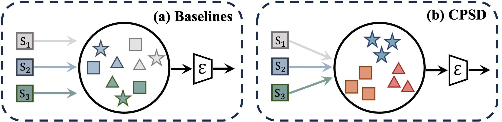
*Fig. 3:Motivation for the PESA module. Different shapes within the large circle represent the MEG/EEG features of subjects under various stimuli.*

*Fig. 4:The correlation between model performance and neural representation consistency (
𝑐
​
𝑜
​
𝑟
​
𝑟
=
0.66
, 
𝑝
<
0.001
).*

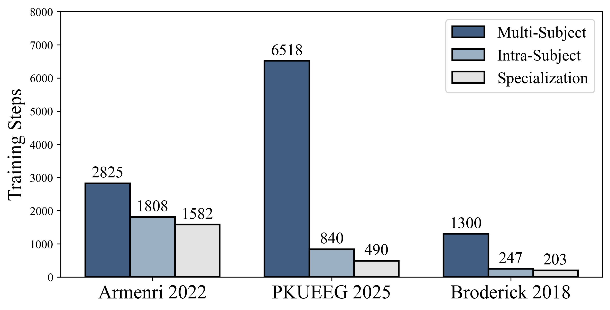
*Fig. 5:Training times under different settings.*

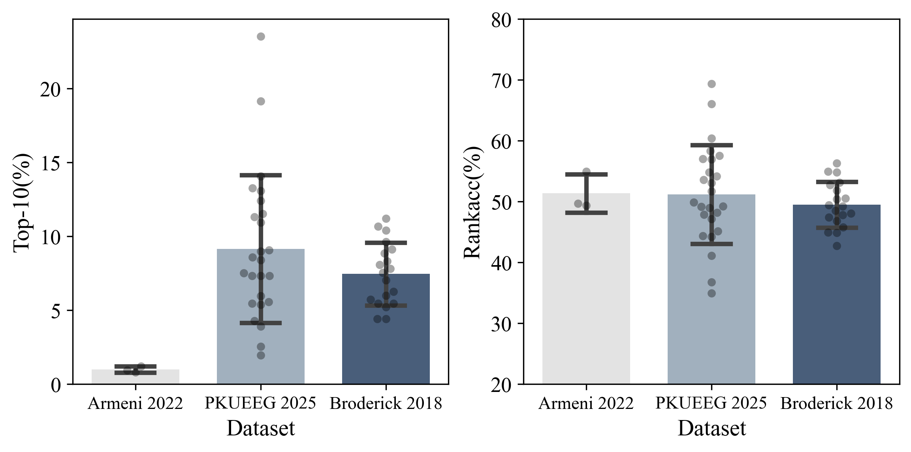
*Fig. 6:Zero-shot decoding performance across various perceived speech datasets.*

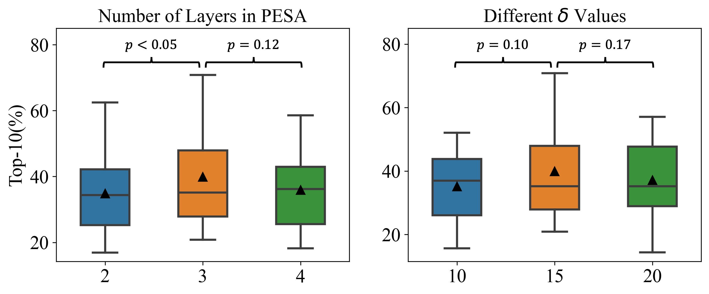
*Fig. 7:Decoding results using various hyperparameters on the Broderick 2018 dataset. The triangles in the box plot indicate the mean values.*

*Fig. 8:Verification of the validity of sensor locations as input. The performance improvement of CPSD compared to the Shuffle setting in both figures is statistically significant (
𝑝
<
0.01
).*

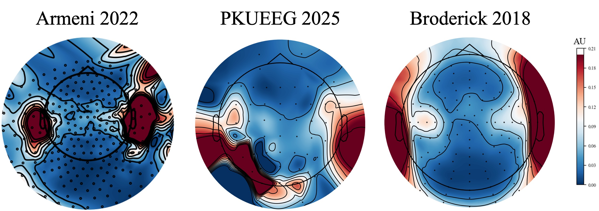
*Fig. 9:Visualization of channel weights from the PESA module across various datasets.*

---
**Usage Info**: 4292 tokens used.
**Generated at**: 2026-08-25 14:51:25

---

# 📚 Unsupervised Speech Recognition at the Syllable Level

🚀 URL: https://arxiv.org/html/2608.22907

## 🌏 Abstract (원문)
Training speech recognizers with unpaired speech and text -- known as unsupervised speech recognition (UASR) -- is a crucial step toward extending ASR to low-resource languages in the long-tail distribution and enabling multimodal learning from non-parallel data. However, existing approaches based on phones often rely on costly resources such as grapheme-to-phoneme converters (G2Ps) and struggle to generalize to languages with ambiguous phoneme boundaries due to training instability. In this paper, we address both challenges by introducing a syllable-level UASR framework based on masked language modeling, which avoids the need for G2P and the instability of GAN-based methods. Our approach achieves up to a 40% relative reduction in character error rate (CER) on LibriSpeech and generalizes effectively to low-resource languages that have remained particularly difficult for prior methods. Code is publicly available111https://github.com/cactuswiththoughts/SylCipher.
## 🌏 Abstract (번역)
짝을 이루지 않는 음성 및 텍스트로 음성 인식기를 훈련하는 것(비지도 음성 인식(UASR)으로 알려짐)은 ASR을 롱테일 분포의 저자원 언어로 확장하고 비병렬 데이터로부터 다중 모달 학습을 가능하게 하는 중요한 단계입니다. 그러나 음소 기반의 기존 접근 방식은 종종 G2P(음소-음소 변환기)와 같은 비용이 많이 드는 리소스에 의존하며, 훈련 불안정성으로 인해 모호한 음소 경계를 가진 언어에 일반화하는 데 어려움을 겪습니다. 본 논문에서는 마스크드 언어 모델링 기반의 음절 수준 UASR 프레임워크를 도입하여 G2P의 필요성과 GAN 기반 방법의 불안정성을 피함으로써 이 두 가지 문제를 모두 해결합니다. 우리의 접근 방식은 LibriSpeech에서 문자 오류율(CER)을 최대 40% 상대적으로 감소시키고, 이전 방법으로는 특히 어려웠던 저자원 언어에 효과적으로 일반화됩니다. 코드는 공개적으로 이용 가능합니다(https://github.com/cactuswiththoughts/SylCipher).

## 🔍 Methods & Results
- SylCipher는 마스크드 언어 모델링 기반의 음절 수준 비지도 음성 인식(UASR) 프레임워크로, G2P(음소-음소 변환기)의 필요성과 GAN 기반 방법의 불안정성을 해결합니다.
- 이 모델은 연속 음성을 음절과 유사한 단위로 변환한 후, 음성과 텍스트를 동일한 인코더로 처리하는 공유 표현 공간을 학습합니다.
- 음성 음절화기는 미분 가능한 소프트 풀러(학습 가능한 경계 감지기 사용)와 미분 가능한 K-평균 벡터 양자화기를 통해 프레임 수준 음향 특징을 음절 수준 시퀀스로 변환합니다.
- 훈련은 단일 모달 음성 및 텍스트 분포 간의 Kullback–Leibler (KL) 발산 최소화와 공유 표현의 용량 제한을 목표로 합니다.
- 훈련은 가중 마스크드 언어 모델링(wMLM), 경계 감지기를 공동으로 업데이트하는 종단 간(JE2E) 훈련, 그리고 명시적 분포 매칭을 위한 위치 유니그램 및 스킵그램 매칭(PUSM)의 세 가지 구성 요소를 포함합니다.
- LibriSpeech에서 문자 오류율(CER)을 최대 40% 상대적으로 감소시켰으며, 이전 방법으로 어려웠던 저자원 언어에 효과적으로 일반화됩니다.
- 추론 시 <OOV> 토큰을 두 번째로 가능성 있는 예측으로 대체하여 CER을 약 1% 상대적으로 추가 감소시켰습니다.

## 🖼 Figures
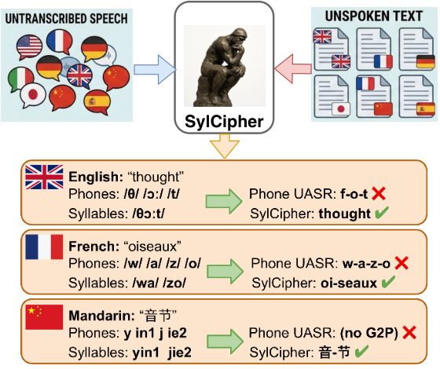
*Figure 1:Syllable-level speech-text decipherment.*

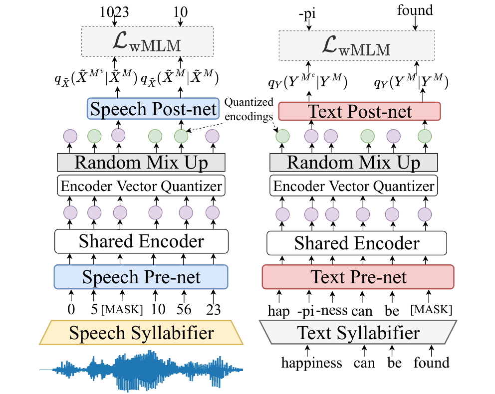
*(a)MLM-based stages*

*(a)MLM-based stages*

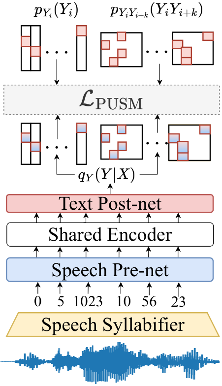
*(b)PUSM stage*

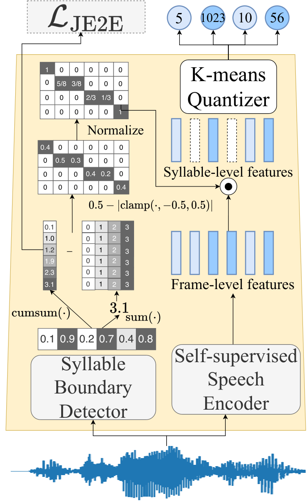
*(c)Speech syllabifier*

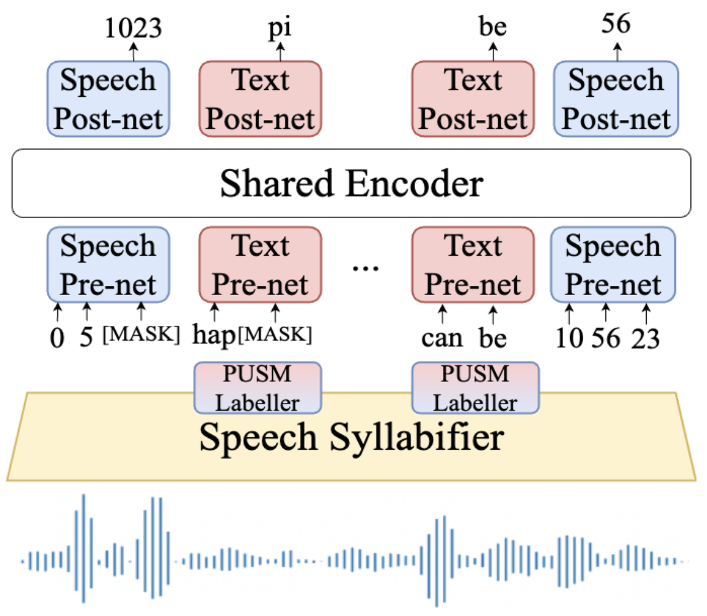
*Figure 7:Initialization of SylCipher using interleaving speech tokens and PUSM-predicted text tokens to stabilize training for extreme low-resource scenario.*

*(a)Reference transcript: “Wealth and rent chap-ter sev-en wealth”.*

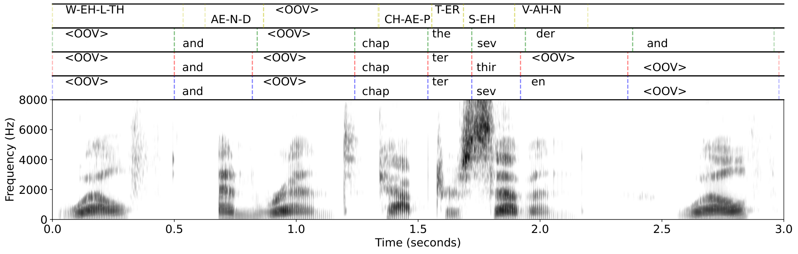
*(a)Reference transcript: “Wealth and rent chap-ter sev-en wealth”.*

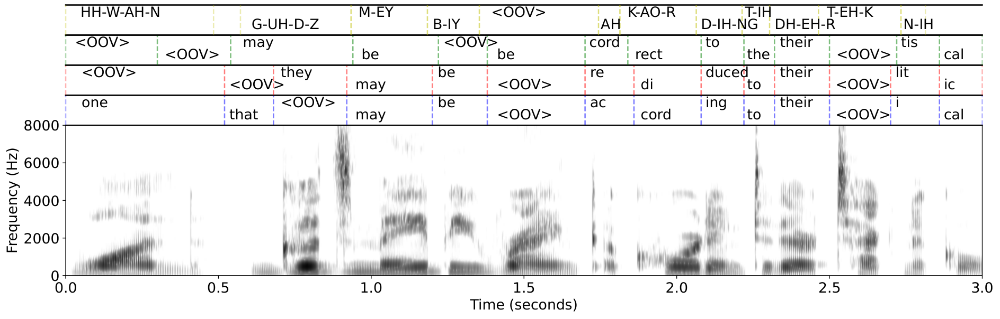
*(b)Reference transcript: “One goods may be ranked ac-cord-ing to their tech-ni-cal”.*

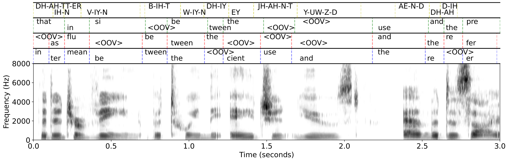
*(c)Reference transcript: “That in-ter-vene be-tween the a-gent used and the de-sired”*

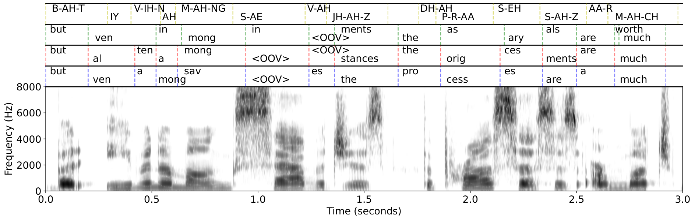
*(d)Reference transcript: “But e-ven a-mong sav-ages the pro-cess-es are much”*

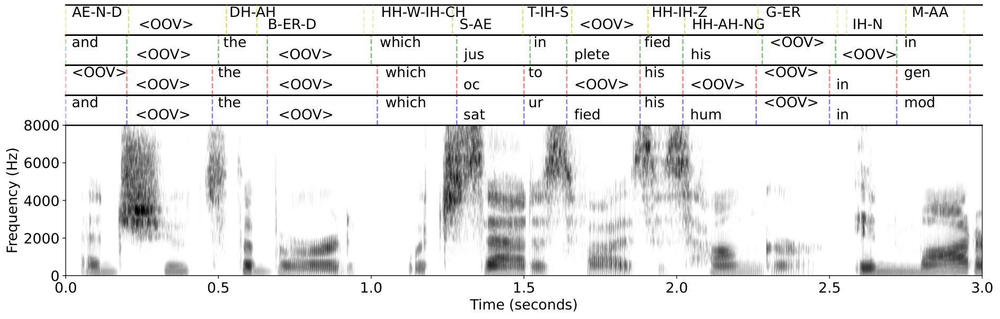
*(a)Reference transcript: “And shoots the bird which sat-is-flies his hun-ger”.*

*(a)Reference transcript: “And shoots the bird which sat-is-flies his hun-ger”.*

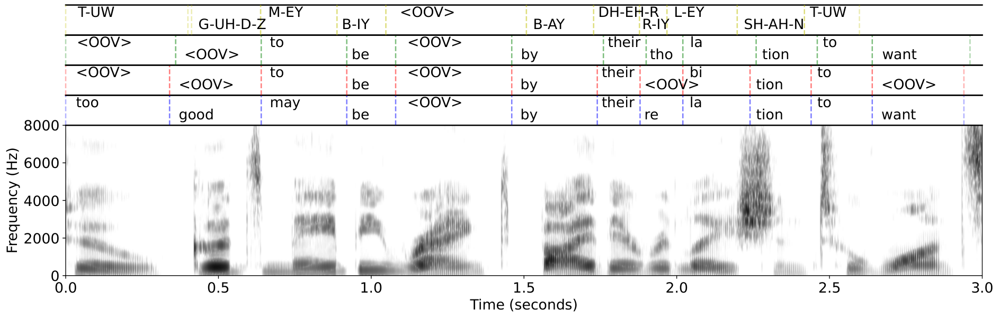
*(b)Reference transcript: “two goods may be ranked by their re-la-tion to wants”.*

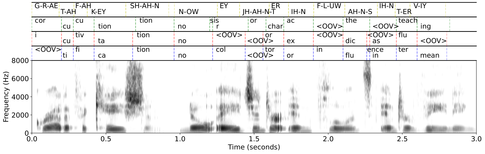
*(c)Reference transcript: “Grat-i-fi-ca-tion no a-gent or in-flu-ence in-ter-ven-ing”.*

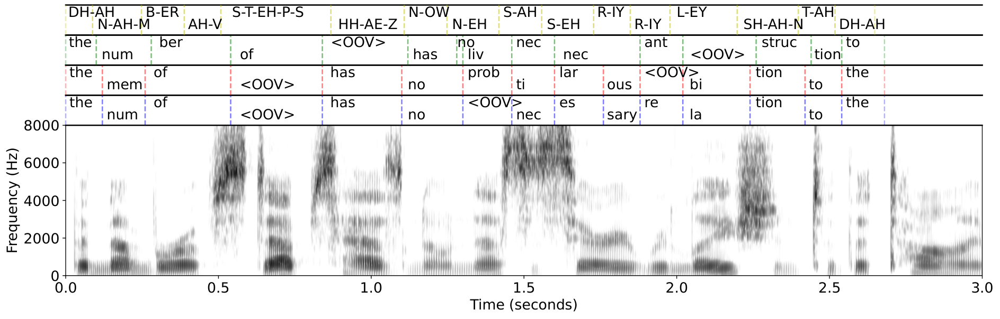
*(d)Reference transcript: “The num-ber of steps has no nec-es-sary re-la-tion to the”.*

---
**Usage Info**: 4101 tokens used.
**Generated at**: 2026-08-25 14:51:38

---

# 📚 Long-Horizon Audio-Visual Generation for Persistent Stories and Interactive Worlds

🚀 URL: https://arxiv.org/html/2608.23383

## 🌏 Abstract (원문)
Video generation is progressing beyond isolated clips toward long-form narratives and interactive worlds, requiring models to preserve identities, follow user controls, and remain stable over extended rollouts. We presentJoyAI-Echo-1.5, a unified audio-visual generation system with two purpose-built variants. The long-video variant introduces composable cross-shot memory that aggregates visual evidence across multiple prior shots and speaker cues derived from speech-filtered full-shot audio, enabling persistent character appearance and voice identity across flexible combinations of text, image, and memory conditioning. The world-model variant converts heterogeneous navigation inputs into calibrated metric 6-DoF camera trajectories and injects them through a geometry-aware conditioning pathway, enabling controller-agnostic interaction across flexible viewpoints. To support efficient long-horizon generation, we transform a bidirectional audio-visual backbone into a causal few-step generator using progressive teacher forcing and short- and long-horizon Self-Gradient Forcing on self-generated rollouts. Experiments demonstrate strong performance in both settings. JoyAI-Echo-1.5 achieves improvements over existing long-video baselines in cross-shot consistency, visual quality, text alignment, and speech fidelity. Its world-model variant ranksfirston WBench, with an average score of 81.7, and achieves leading visual quality and long-horizon persistence on SANA-WM-Bench. Together, these results indicate that memory, geometric control, and rollout-aware training provide a practical foundation for generating coherent stories and continuously evolving interactive worlds. Project page:https://echo-team-joy-future-academy-jd.github.io/Echo-1.5-Page/.
## 🌏 Abstract (번역)
비디오 생성은 개별 클립을 넘어 장편 서사 및 인터랙티브 세계로 발전하고 있으며, 모델이 정체성을 보존하고, 사용자 제어를 따르며, 장기간의 롤아웃 동안 안정성을 유지해야 합니다. 우리는 두 가지 목적에 맞게 구축된 변형을 가진 통합 오디오-비주얼 생성 시스템인 JoyAI-Echo-1.5를 소개합니다. 장편 비디오 변형은 여러 이전 샷에서 시각적 증거를 집계하고 음성 필터링된 전체 샷 오디오에서 파생된 화자 단서를 통합하는 구성 가능한 크로스-샷 메모리를 도입하여 텍스트, 이미지 및 메모리 컨디셔닝의 유연한 조합 전반에 걸쳐 지속적인 캐릭터 외모 및 음성 정체성을 가능하게 합니다. 월드 모델 변형은 이질적인 내비게이션 입력을 보정된 미터법 6-DoF 카메라 궤적으로 변환하고, 이를 기하학 인식 컨디셔닝 경로를 통해 주입하여 유연한 시점에서 컨트롤러에 구애받지 않는 상호작용을 가능하게 합니다. 효율적인 장기 생성(long-horizon generation)을 지원하기 위해, 우리는 양방향 오디오-비주얼 백본을 점진적 티처 포싱(progressive teacher forcing)과 자체 생성된 롤아웃에 대한 단기 및 장기 Self-Gradient Forcing을 사용하여 인과적 소수 단계 생성기로 변환합니다. 실험은 두 설정 모두에서 강력한 성능을 보여줍니다. JoyAI-Echo-1.5는 크로스-샷 일관성, 시각적 품질, 텍스트 정렬 및 음성 충실도에서 기존 장편 비디오 기준선보다 향상된 성능을 달성합니다. 월드 모델 변형은 WBench에서 평균 81.7점으로 1위를 차지했으며, SANA-WM-Bench에서 선도적인 시각적 품질과 장기 지속성을 달성했습니다. 이러한 결과들은 메모리, 기하학적 제어 및 롤아웃 인식 훈련이 일관된 스토리와 지속적으로 진화하는 인터랙티브 세계를 생성하기 위한 실용적인 기반을 제공함을 나타냅니다. 프로젝트 페이지: https://echo-team-joy-future-academy-jd.github.io/Echo-1.5-Page/.

## 🔍 Methods & Results
- JoyAI-Echo-1.5의 월드 모델 변형은 사용자 지정 카메라 의도에 따라 동기화된 비디오 및 오디오를 생성하는 것을 목표로 합니다.
- 이 시스템은 오디오-비주얼 백본(θ)과 병렬 상대 궤적 컨디셔닝 경로(φ)를 활용합니다.
- 사용자 내비게이션 입력은 시간 색인화된 미터법 6-DoF 카메라 궤적 이벤트 스트림으로 변환됩니다.
- 이질적인 컨트롤러별 액션 공간 및 상대 모션 진폭의 스케일 불일치 문제를 해결하기 위해, 임의의 내비게이션 입력을 통일된 6-DoF 궤적으로 매핑하고 상대 변환을 견고한 전역 스케일로 보정합니다.
- 궤적 기하학은 Unified Camera Positional Encoding (UCPE)을 통해 주입되어, 전역 좌표 이동에 불변하면서도 보정된 상대 변환 크기를 유지합니다.
- 훈련은 세 단계의 커리큘럼을 따릅니다: 1) 오디오-비주얼 사전 획득: 궤적 컨디셔닝 없이 AV-rich 데이터로 백본을 훈련하여 텍스트-AV, 이미지-AV, 시간적 연속성 기능을 확립합니다. 2) 제어 정렬: 백본을 고정하고 제어-클린 데이터에서 시각 전용 노이즈 제거 목표를 사용하여 경량 UCPE 카메라 경로만 훈련하여 카메라 궤적 추종에 집중합니다. 3) 공동 통합: 백본과 궤적 경로를 모두 해제하고 균형 잡힌 고품질 혼합 데이터에서 종단 간 공동 적응을 수행하며, 환경 소리 및 음성 필드를 복원하고 학습률을 낮춥니다.

## 🖼 Figures
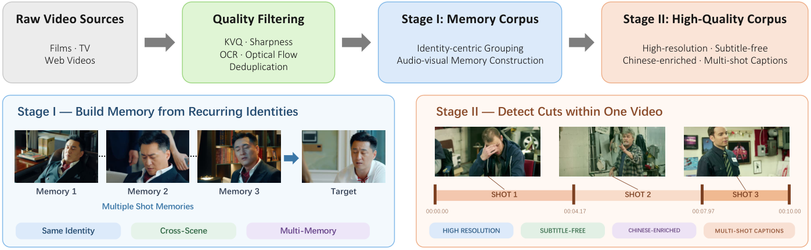
*Figure 1:Two-stage data construction pipeline of JoyAI-Echo-1.5. Raw videos are quality-filtered and organized into an identity-centric Memory corpus and a high-quality corpus with broader resolution, language, and multi-shot coverage.*

*Figure 2:Overview of memory-conditioned long-form generation and few-step acceleration in JoyAI-Echo-1.5. Top: unified conditioning with single-frame visual memories, speech-filtered audio memories, and separated RoPE coordinates supports multiple audio-visual generation tasks. Bottom: memory-robust joint DMD combines asymmetric video–audio optimization with audio-specific adversarial and energy constraints.*

*Figure 3: Illustration of the causal attention masks used in streaming post-training. (a) Audio-visual teacher forcing, where each noisy chunk attends to its preceding clean history and the current noisy chunk, while the clean target and future chunks are masked out. (b) Long-horizon SGF Forward 2, where the causal context is further restricted by the sink-plus-FIFO KV cache.*

*Figure 4:Overview of the Director Agent workflow. Given a user request and optional reference, the agent performs shot planning and prompt enhancement (PE), and supports both single-shot short-video generation and iterative long-video generation through memory retrieval, shot-level review and revision, and memory admission.*

![Figure 5:Qualitative effect of the SR stage on generator outputs, concentrated on the two content types that degrade first at the generator’s native resolution: small text and small faces. Smeared strokes on distant storefront signage become legible glyphs, and faces only a few dozen pixels across—including under motion—recover defined features rather than the coarse blobs the generator produces. Each cell shows the generator output with the inspected region boxed (left), followed by that region magnified before and after the SR stage.](../images/2026-08-25/2608.23383/2608.23383_fig4.png)
*Figure 5:Qualitative effect of the SR stage on generator outputs, concentrated on the two content types that degrade first at the generator’s native resolution: small text and small faces. Smeared strokes on distant storefront signage become legible glyphs, and faces only a few dozen pixels across—including under motion—recover defined features rather than the coarse blobs the generator produces. Each cell shows the generator output with the inspected region boxed (left), followed by that region magnified before and after the SR stage.*

![Figure 6:Qualitative visualization of a 10-minute long audio-visual sequence generated under the Director Agent. The 10-minute example follows a wartime evacuation story set in a neutral port city. A radio operator helps two civilians escape as military control tightens and the city gradually descends into chaos. Their escape becomes increasingly entangled with checkpoints, shifting alliances, and the growing danger faced by civilians left behind. The radio operator eventually turns his broadcast network into a broader evacuation effort, connecting scattered groups and helping them find a route out of the city.](../images/2026-08-25/2608.23383/2608.23383_fig5.png)
*Figure 6:Qualitative visualization of a 10-minute long audio-visual sequence generated under the Director Agent. The 10-minute example follows a wartime evacuation story set in a neutral port city. A radio operator helps two civilians escape as military control tightens and the city gradually descends into chaos. Their escape becomes increasingly entangled with checkpoints, shifting alliances, and the growing danger faced by civilians left behind. The radio operator eventually turns his broadcast network into a broader evacuation effort, connecting scattered groups and helping them find a route out of the city.*

*Figure 7:Qualitative comparison between JoyAI-Echo-1.5 and JoyAI-Echo-1.0 under the same long-form story. Frames sampled from temporally separated shots demonstrate the improved character consistency, scene stability, and visual rendering of JoyAI-Echo-1.5.*

*Figure 8: Qualitative comparison of the undistilled bidirectional multi-step JoyAI-Echo-1.5 on representative WBench Navigation cases across diverse visual domains. Given the same initial observation and navigation condition, our model better preserves scene identity and structure while producing more coherent viewpoint evolution over successive interaction steps.*

![Figure 9: Multi-turn comparison of JoyAI-Echo-1.5-Causal against representative few-step autoregressive world models on WBench Navigation. All models start from the same initial observation and follow the prescribed multi-turn action sequence. The three cases use (1) A 
→
 A 
→
 A 
→
 A, (2) Left 
→
 Left 
→
 Right 
→
 Right, and (3) Left 
→
 W 
→
 Right. Here, Left, Right, Up, and Down denote camera rotations, while W, S, A, and D denote camera translations. JoyAI-Echo-1.5-Causal exhibits stronger action adherence and better preserves scene style, subject identity, and world structure across successive turns, with less accumulated autoregressive drift.](../images/2026-08-25/2608.23383/2608.23383_fig8.png)
*Figure 9: Multi-turn comparison of JoyAI-Echo-1.5-Causal against representative few-step autoregressive world models on WBench Navigation. All models start from the same initial observation and follow the prescribed multi-turn action sequence. The three cases use (1) A 
→
 A 
→
 A 
→
 A, (2) Left 
→
 Left 
→
 Right 
→
 Right, and (3) Left 
→
 W 
→
 Right. Here, Left, Right, Up, and Down denote camera rotations, while W, S, A, and D denote camera translations. JoyAI-Echo-1.5-Causal exhibits stronger action adherence and better preserves scene style, subject identity, and world structure across successive turns, with less accumulated autoregressive drift.*

*Figure 10: Causal long-horizon generation of JoyAI-Echo-1.5-Causal on representative cases. Each row shows a 60-second causal rollout sampled at different timestamps. Despite prolonged autoregressive generation, the distilled four-step causal model remains responsive to navigation controls while preserving scene identity, subject appearance, visual style, and major spatial structure, demonstrating robustness to long-horizon error accumulation.*

![Figure 12: Qualitative comparison of 961-frame (60-second at 16 FPS) causal rollouts on representative SANA-WM-Bench trajectories. We compare JoyAI-Echo-1.5-Causal with LingBot-World-v2 (LBW-V2), SANA-WM with and without Causal Refiner, and Evoke. Frames are sampled every 12 seconds from the same initial observation and camera-trajectory condition. Across the extended rollout, JoyAI-Echo-1.5-Causal exhibits less accumulated autoregressive drift, more consistent trajectory following, and stronger preservation of scene identity, visual style, and spatial structure.](../images/2026-08-25/2608.23383/2608.23383_fig11.png)
*Figure 12: Qualitative comparison of 961-frame (60-second at 16 FPS) causal rollouts on representative SANA-WM-Bench trajectories. We compare JoyAI-Echo-1.5-Causal with LingBot-World-v2 (LBW-V2), SANA-WM with and without Causal Refiner, and Evoke. Frames are sampled every 12 seconds from the same initial observation and camera-trajectory condition. Across the extended rollout, JoyAI-Echo-1.5-Causal exhibits less accumulated autoregressive drift, more consistent trajectory following, and stronger preservation of scene identity, visual style, and spatial structure.*

---
**Usage Info**: 5519 tokens used.
**Generated at**: 2026-08-25 14:51:56

---

