# 🚩 (2026-08-26) Scholar Inbox 추천 논문 

# 📚 FireRedAudio: A General-Purpose Audio Language Model with Decoupled Continuous Representations for Understanding and Generation

🚀 URL: https://arxiv.org/html/2608.24168

## 🌏 Abstract (원문)
A unified audio model must recognize and understand linguistic, paralinguistic, and environmental information while supporting speech synthesis and editing. A key challenge is representation: understanding favors compact features suited to long-context modeling, whereas speech generation requires reconstructible features that preserve fine-grained acoustic detail. We introduce FireRedAudio, a general-purpose audio language model with a shared 9B-parameter LLM. To the best of our knowledge, it is the first publicly disclosed unified audio-language model to provide separate continuous input representations for understanding and generation within a single trainable autoregressive LLM. Audio to be recognized or analyzed is processed by a dedicated Audio Encoder, while speech inputs for generation use a RedAE-based pathway. The LLM directly generates text or conditions a flow-matching DiT to produce continuous acoustic latents. Through progressive multitask training, FireRedAudio supports ASR and audio understanding, with the latter extending to recordings of up to one hour, as well as zero-shot TTS, Instruct TTS, and semantic and acoustic speech editing. Its structured organization of long-form audio achieves second-level timestamp accuracy. Across comprehensive evaluations, FireRedAudio achieves competitive or leading performance in audio understanding and multilingual ASR, strong content accuracy and speaker preservation in zero-shot TTS, leading instruction following in Instruct TTS, and substantial improvements over Ming-UniAudio-Edit in both semantic and acoustic speech editing. These results demonstrate the viability of decoupled continuous input representations for unifying audio understanding and continuous-latent speech generation in a model of moderate scale. Our code is available athttps://github.com/FireRedTeam/FireRedAudio.
## 🌏 Abstract (번역)
통합 오디오 모델은 언어적, 준언어적, 환경적 정보를 인식하고 이해하는 동시에 음성 합성 및 편집을 지원해야 합니다. 주요 과제는 표현 방식입니다. 이해는 긴 컨텍스트 모델링에 적합한 압축된 특징을 선호하는 반면, 음성 생성은 미세한 음향 디테일을 보존하는 재구성 가능한 특징을 필요로 합니다. 우리는 공유 90억 매개변수 LLM을 가진 범용 오디오 언어 모델인 FireRedAudio를 소개합니다. 우리가 아는 한, FireRedAudio는 단일 학습 가능한 자기회귀 LLM 내에서 이해와 생성을 위한 별도의 연속 입력 표현을 제공하는 최초의 공개된 통합 오디오-언어 모델입니다. 인식 또는 분석될 오디오는 전용 오디오 인코더에 의해 처리되며, 생성을 위한 음성 입력은 RedAE 기반 경로를 사용합니다. LLM은 텍스트를 직접 생성하거나 플로우 매칭 DiT를 조건화하여 연속적인 음향 잠재 변수를 생성합니다. 점진적인 다중 작업 훈련을 통해 FireRedAudio는 ASR 및 오디오 이해를 지원하며, 후자는 최대 1시간 길이의 녹음까지 확장됩니다. 또한 제로샷 TTS, 지시 기반 TTS, 의미론적 및 음향적 음성 편집도 지원합니다. 긴 형식 오디오의 구조화된 구성은 초 단위 타임스탬프 정확도를 달성합니다. 포괄적인 평가에서 FireRedAudio는 오디오 이해 및 다국어 ASR에서 경쟁력 있거나 선도적인 성능을 달성했으며, 제로샷 TTS에서 강력한 내용 정확도와 화자 보존을 보였고, 지시 기반 TTS에서 선도적인 지시 따르기 능력을 보였으며, 의미론적 및 음향적 음성 편집 모두에서 Ming-UniAudio-Edit에 비해 상당한 개선을 이루었습니다. 이러한 결과는 중간 규모 모델에서 오디오 이해와 연속 잠재 변수 음성 생성을 통합하기 위한 분리된 연속 입력 표현의 실현 가능성을 보여줍니다. 우리의 코드는 https://github.com/FireRedTeam/FireRedAudio에서 확인할 수 있습니다.

## 🔍 Methods & Results
- FireRedAudio는 언어적, 준언어적, 비언어적 음향 정보를 이해 및 생성에 활용하기 위해 공유 90억 매개변수 LLM 백본과 두 개의 분리된 연속 입력 경로를 도입합니다.
- 이해 경로는 Whisper-large-v3 인코더로 초기화된 오디오 인코더와 오디오 어댑터를 사용하여 오디오를 12.5Hz의 압축된 지각 표현으로 처리하며, 긴 오디오를 위해 30초 창 분할 및 시간 압축을 수행합니다.
- 생성 경로는 RedAE 인코더를 통해 음성 입력을 25Hz의 재구성 가능한 RedAE 잠재 프레임으로 인코딩하고, 패치 인코더가 이를 6.25Hz의 RedAE-Patch 표현으로 집계하여 LLM에 제공합니다.
- RedAE는 파형을 연속 잠재 변수로 직접 매핑하는 결정론적 오디오 오토인코더로, 재구성 손실과 함께 이해 작업에 훈련된 교사 오디오 인코더의 고수준 특징과 잠재 변수를 정렬하는 증류 손실을 사용하여 사전 훈련됩니다.
- LLM은 ASR 및 오디오 이해 작업에서는 텍스트 응답을 생성하고, 음성 생성 작업에서는 오디오 시작/단계/종료 토큰을 예측하며, 각 오디오 단계의 은닉 상태는 DiT를 조건화하여 4개의 RedAE 잠재 프레임을 생성합니다.
- DiT는 플로우 매칭을 사용하여 가우시안 노이즈에서 대상 RedAE 잠재 변수로의 조건부 속도 필드를 학습하며, LLM 은닉 상태(현재 + 이전 2단계)와 음향 이력(이전 2단계의 8개 RedAE 프레임)을 조건으로 사용합니다.
- FireRedAudio는 자기회귀 토큰 목표(L_text)와 연속 플로우 매칭 목표(L_flow)를 공동으로 최적화하며, 오디오 단계 토큰에는 낮은 가중치(0.01)를 부여하여 긴 음성 시퀀스의 비용을 관리합니다.
- 이 모델은 ASR, 최대 1시간 길이의 오디오 이해(초 단위 타임스탬프 정확도), 제로샷 TTS, 지시 기반 TTS, 의미론적 및 음향적 음성 편집을 지원합니다.
- 종합 평가 결과, FireRedAudio는 오디오 이해 및 다국어 ASR에서 경쟁력 있거나 선도적인 성능을 보였고, 제로샷 TTS에서 강력한 내용 정확도와 화자 보존을 달성했으며, 지시 기반 TTS에서 선도적인 지시 따르기 능력을 보였고, 음성 편집에서 Ming-UniAudio-Edit 대비 상당한 개선을 이루었습니다.

## 🖼 Figures

*Figure 1:Overview of FireRedAudio. Decoupled continuous pathways encode inputs for understanding and generation. The shared LLM produces text or conditions a DiT to generate RedAE latents, which are decoded into waveforms. The inset illustrates the DiT conditioning for one audio step.*

*Figure 2:Architecture and pretraining of RedAE. A frozen teacher Audio Encoder provides high-level supervision, while the trainable autoencoder compresses 
50
​
Hz
 audio frames into 
25
​
Hz
 latents and reconstructs the waveform through an iSTFT head. Snowflakes and flames denote frozen and trainable modules, respectively.*

---
**Usage Info**: 5708 tokens used.
**Generated at**: 2026-08-26 14:42:05

---

# 📚 EmoTra-TTS: Smooth Intra-Utterance Emotion Transitions for Speech Synthesis

🚀 URL: https://arxiv.org/html/2608.23791

## 🌏 Abstract (원문)
Psychological research on emotion dynamics has established that human affect is a continuous, evolving process: emotions rise, decay, and transition within seconds. Current emotional text-to-speech (TTS) systems, however, condition on a single discrete label or static embedding per utterance, fundamentally misaligning with the temporal nature of affect. While recent LLM-based TTS systems may implicitly vary prosody through text understanding, such variation is neither explicitly controllable nor precise enough for targeted intra-utterance transitions. We address three challenges: (1) amulti-pass flow blendingpipeline synthesizes frame-aligned transition audio, circumventing the scarcity of natural intra-utterance transitions; (2)dual-stage Valence–Arousal–Dominance (VAD) conditioningguides prosodic planning in the LLM and acoustic realization in the flow decoder via frame-level VAD embeddings; (3)direction–magnitude decoupled injectionstructurally separates emotion direction from injection magnitude, preventing content degradation.EmoTra-TTS111Demo page:https://liu-tianchi.github.io/EmoTra_DemoPage/; The complete code, including data synthesis and training pipelines:https://github.com/Liu-Tianchi/EmoTra-TTSadds only+0.43%+0.43\%parameters with no latency overhead, achieves30%–87%relative improvement on emotion transition quality, corroborated by64.4%–79.5%overall win rates in pairwise preference tests against four SOTA baselines and two commercial systems.
## 🌏 Abstract (번역)
감정 역학에 대한 심리학 연구는 인간의 감정이 연속적이고 진화하는 과정임을 확립했습니다. 즉, 감정은 몇 초 안에 발생하고, 소멸하며, 전환됩니다. 그러나 현재의 감정 텍스트-음성 변환(TTS) 시스템은 발화당 단일 이산 레이블 또는 정적 임베딩에 의존하여 감정의 시간적 특성과 근본적으로 불일치합니다. 최근 LLM 기반 TTS 시스템이 텍스트 이해를 통해 암묵적으로 운율을 변화시킬 수 있지만, 이러한 변화는 명시적으로 제어할 수 없으며 발화 내 전환을 목표로 하기에는 충분히 정밀하지 않습니다. 우리는 세 가지 과제를 해결합니다: (1) 다중 패스 플로우 블렌딩 파이프라인은 프레임 정렬된 전환 오디오를 합성하여 자연스러운 발화 내 전환의 희소성을 우회합니다; (2) 이중 단계 VAD(Valence–Arousal–Dominance) 조건화는 프레임 수준 VAD 임베딩을 통해 LLM의 운율 계획과 플로우 디코더의 음향 실현을 안내합니다; (3) 방향-크기 분리 주입은 감정 방향을 주입 크기에서 구조적으로 분리하여 콘텐츠 저하를 방지합니다. EmoTra-TTS는 단 +0.43%의 매개변수만 추가하며 지연 시간 오버헤드가 없고, 감정 전환 품질에서 30%–87%의 상대적 개선을 달성했으며, 4개의 최신 기준선 및 2개의 상용 시스템과의 쌍별 선호도 테스트에서 64.4%–79.5%의 전반적인 승률로 입증되었습니다.

## 🔍 Methods & Results
- 기존 감정 TTS 시스템은 단일 감정 레이블 또는 정적 임베딩에 의존하여 감정의 시간적 변화를 모델링하는 데 한계가 있으며, LLM 기반 시스템은 발화 내 감정 전환을 명시적으로 제어하기 어렵습니다.
- 본 연구는 감정 역학을 모델링하기 위해 VAD(Valence–Arousal–Dominance) 차원 모델을 채택하여 연속적인 감정 공간에서 부드러운 전환을 지원하고 음향적 상관관계를 활용합니다.
- 자연스러운 발화 내 감정 전환 데이터의 희소성을 해결하기 위해, 사전 훈련된 제로샷 TTS 시스템을 활용한 다중 패스 플로우 블렌딩 파이프라인을 통해 합성 감정 전환 데이터를 생성합니다.
- 데이터 생성 파이프라인은 LLM을 통한 공유 토큰 생성, 3개의 독립적인 플로우 패스를 통한 감정별 멜 스펙트로그램 디코딩, 시그모이드 크로스페이드 블렌딩, 그리고 Whisper ASR을 통한 품질 필터링으로 구성됩니다.
- VAD 조건화를 위해, 사전 훈련된 wav2vec2 기반 음성 감정 인식 모델로 VAD 값을 얻고, 이를 LLM 임베딩 공간에 매핑하는 투영 네트워크를 사용합니다.
- 연속적인 VAD 전환을 인코딩하기 위해 초기 및 결과 VAD 사이의 중간 지점을 균일하게 샘플링하여 텍스트 토큰 앞에 추가하며, 보조 은닉 상태 재구성 손실을 통해 지각적 기반을 제공합니다.
- 플로우 디코더에서는 감정을 화자 채널을 통해 주입하며, 프레임 수준 VAD는 구간별 선형 보간법으로 구성됩니다.
- 감정 방향과 주입 강도를 분리하기 위해 LayerNorm과 비학습 가능한 스칼라 ϵ을 사용하여 방향-크기 분리 주입 방식을 적용하여 콘텐츠 저하를 방지합니다.
- EmoTra-TTS는 기존 시스템에 비해 단 0.43%의 추가 매개변수와 지연 시간 오버헤드 없이 감정 전환 품질에서 30%–87%의 상대적 개선을 달성했습니다.
- 4개의 최신 기준선 및 2개의 상용 시스템과의 쌍별 선호도 테스트에서 64.4%–79.5%의 전반적인 승률을 기록하며 우수성을 입증했습니다.

## 🖼 Figures
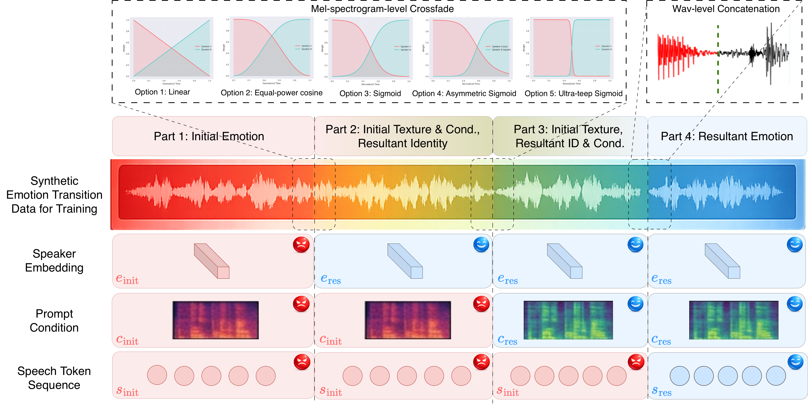
*Figure 1:Synthetic emotion transition data generation pipeline. Samples are available on the demo page.*

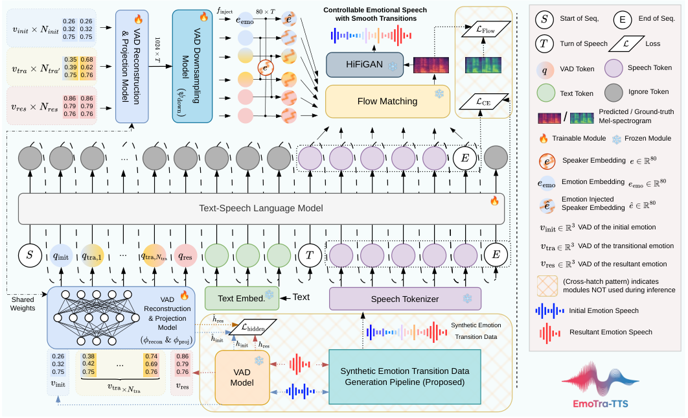
*Figure 2:Overview of the EmoTra-TTS. Lower part: LLM stage with temporal VAD tokens (§3.3). Upper part: Flow decoder with frame-level emotion injection via direction–magnitude decoupled injection (§3.4).*

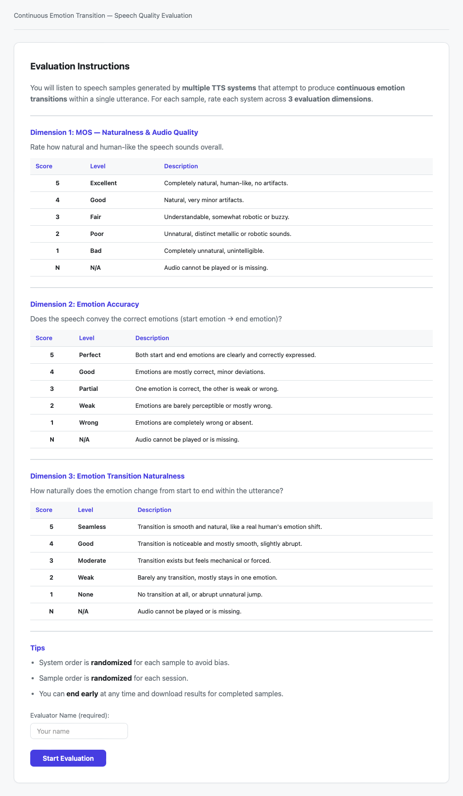
*Figure 4:Rating criteria for ‘Naturalness & Audio Quality’ (MOS-Qua), ‘Emotion Accuracy’ (MOS-Emo), and ‘Emotion Transition Naturalness’ (MOS-Tra).*

*Figure 5:The blind test evaluation interface. Evaluators listen to each sample and rate ‘MOS Naturalness’ (MOS-Qua), ‘Emotion Accuracy’ (MOS-Emo), and ‘Emotion Transition Naturalness’ (MOS-Tra) on 1–5 Likert scales. System identities are hidden, and the system order is randomly shuffled for each sample.*

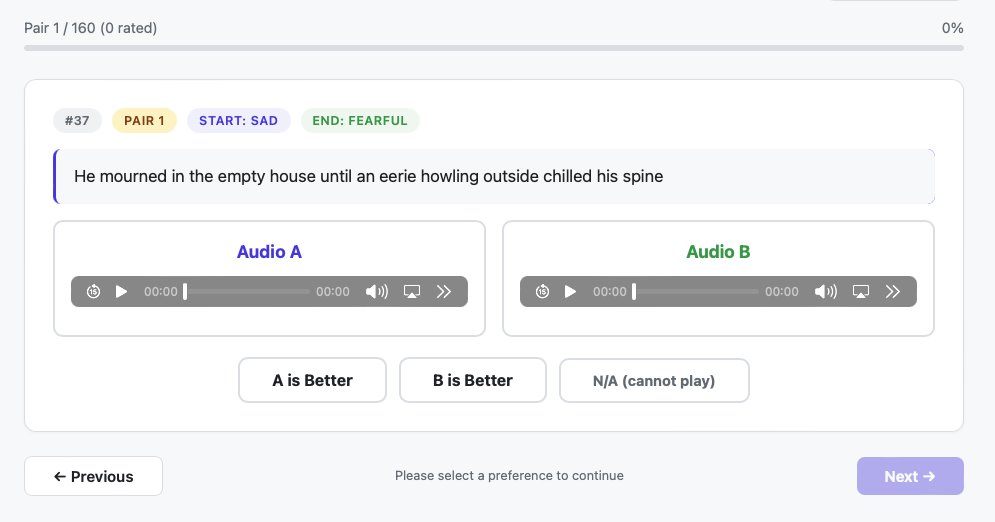
*Figure 6:Screenshot of the paired preference evaluation interface. System identities are hidden, and the system order is randomly shuffled for each sample.*

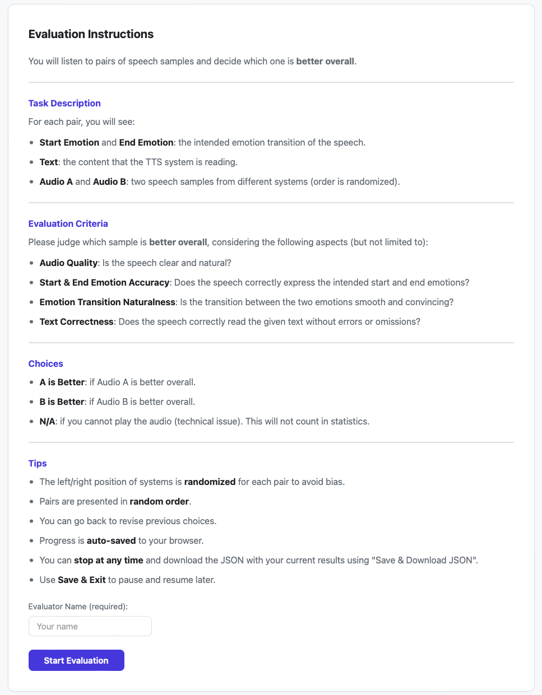
*Figure 7:Rating criteria for the paired evaluation.*

![Figure 8:ElevenLabs v3 inference interface used in our comparison, showing the manually inserted discrete audio tags (e.g., [sad], [angry]) and the “Stability” control set to “Creative”.](../images/2026-08-26/2608.23791/2608.23791_fig7.png)
*Figure 8:ElevenLabs v3 inference interface used in our comparison, showing the manually inserted discrete audio tags (e.g., [sad], [angry]) and the “Stability” control set to “Creative”.*

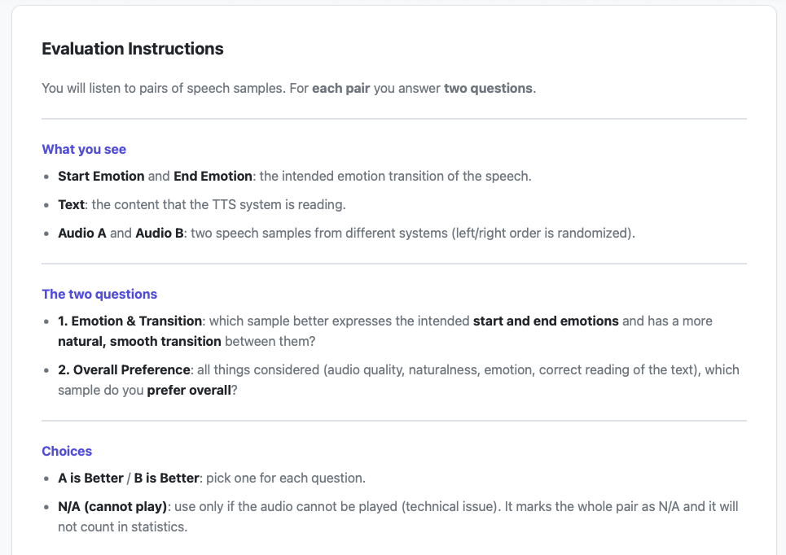
*Figure 9:Rating criteria for the comparison with commercial systems.*

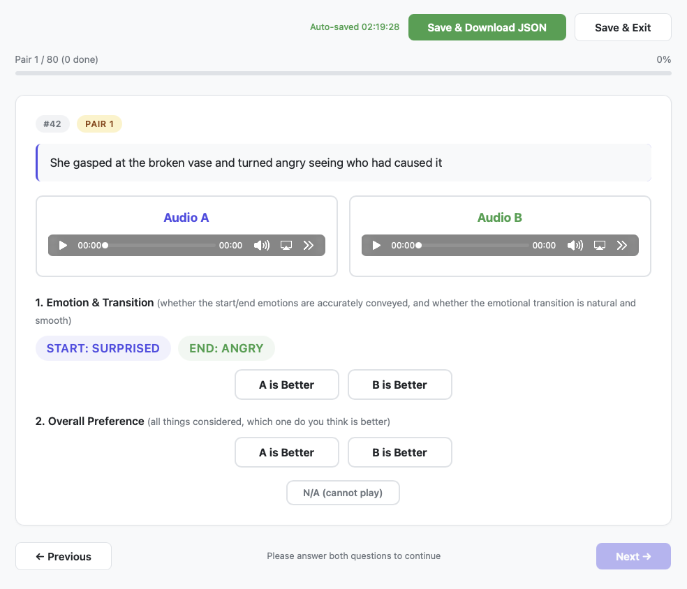
*Figure 10:Screenshot of the paired preference evaluation interface. System identities are hidden, and the system order is randomly shuffled for each sample.*

---
**Usage Info**: 5538 tokens used.
**Generated at**: 2026-08-26 14:42:17

---

# 📚 TurboT2VA: Fast Large-Scale Text-to-Video-Audio Generation via Score-Regularized Consistency Distillation

🚀 URL: https://arxiv.org/html/2608.24674

## 🌏 Abstract (원문)
Joint text-to-video-audio generation produces synchronized visual and acoustic content, but the long sampling trajectories and heterogeneous multimodal computation of large models make inference prohibitively expensive. We present TurboT2VA, a distillation and inference framework for accelerating a 19B-parameter joint video-audio model. Large-scale T2VA distillation is challenged by modality-imbalanced optimization, the difficulty of continuous-time consistency training at scale, and the quality–diversity trade-off. TurboT2VA addresses these issues with per-modality normalization and a progressive curriculum comprising discrete consistency warm-up, continuous consistency refinement, and joint consistency–distribution matching. The curriculum first establishes a stable, diverse generation trajectory and only then introduces distribution-level refinement. On LTX-2, four-step distillation reduces generator latency from 50.52s to 2.51s at the standard evaluation resolution of 512×768, achieving a 20.1×speedup while maintaining strong visual quality, audio fidelity, diversity, and video-audio synchronization. We further develop an architecture-aware inference stack that combines guarded W8A8 and fused operators, padded-text compaction, and modality-aware sparse attention while preserving dense cross-modal and text-conditioning paths. Under the high-resolution deployment setting at 1024×1792, the complete stack reduces generator latency from 318.74s to 5.83s on one NVIDIA H20, achieving a 54.67×generator-only speedup. Inference code and generation demos are available athttps://github.com/thu-ml/TurboDiffusion/tree/main/turbot2va.
## 🌏 Abstract (번역)
텍스트-비디오-오디오 동시 생성은 동기화된 시각 및 청각 콘텐츠를 생성하지만, 대규모 모델의 긴 샘플링 궤적과 이질적인 다중 모달 계산으로 인해 추론 비용이 엄청나게 비쌉니다. 우리는 190억 매개변수 규모의 텍스트-비디오-오디오 동시 모델 가속화를 위한 증류 및 추론 프레임워크인 TurboT2VA를 제시합니다. 대규모 T2VA 증류는 모달리티 불균형 최적화, 대규모 연속 시간 일관성 훈련의 어려움, 그리고 품질-다양성 트레이드오프라는 문제에 직면합니다. TurboT2VA는 모달리티별 정규화와 이산 일관성 웜업, 연속 일관성 개선, 그리고 동시 일관성-분포 매칭으로 구성된 점진적 커리큘럼을 통해 이러한 문제들을 해결합니다. 이 커리큘럼은 먼저 안정적이고 다양한 생성 궤적을 확립한 다음 분포 수준의 개선을 도입합니다. LTX-2에서 4단계 증류는 표준 평가 해상도인 512x768에서 생성기 지연 시간을 50.52초에서 2.51초로 줄여 20.1배의 속도 향상을 달성하면서도 강력한 시각적 품질, 오디오 충실도, 다양성, 비디오-오디오 동기화를 유지합니다. 우리는 또한 보호된 W8A8 및 융합된 연산자, 패딩된 텍스트 압축, 모달리티 인식 희소 어텐션을 결합하면서도 밀집된 교차 모달 및 텍스트 조건화 경로를 보존하는 아키텍처 인식 추론 스택을 개발했습니다. 1024x1792의 고해상도 배포 설정에서 전체 스택은 NVIDIA H20 한 대에서 생성기 지연 시간을 318.74초에서 5.83초로 줄여 생성기만으로 54.67배의 속도 향상을 달성합니다. 추론 코드 및 생성 데모는 https://github.com/thu-ml/TurboDiffusion/tree/main/turbot2va에서 확인할 수 있습니다.

## 🔍 Methods & Results
- TurboT2VA는 190억 매개변수 규모의 텍스트-비디오-오디오 동시 모델 가속화를 위한 증류 및 추론 프레임워크를 제시한다.
- 모달리티 불균형 최적화, 대규모 연속 시간 일관성 훈련의 어려움, 품질-다양성 트레이드오프 문제를 해결하기 위해 모달리티별 정규화와 점진적 커리큘럼(이산 일관성 웜업, 연속 일관성 개선, 동시 일관성-분포 매칭)을 사용한다.
- 표준 해상도(512x768)에서 4단계 증류를 통해 생성기 지연 시간을 50.52초에서 2.51초로 20.1배 단축하며, 시각적 품질, 오디오 충실도, 다양성, 비디오-오디오 동기화를 유지한다.
- 고해상도(1024x1792)에서 아키텍처 인식 추론 스택(보호된 W8A8 및 융합된 연산자, 패딩된 텍스트 압축, 모달리티 인식 희소 어텐션)을 통해 생성기 지연 시간을 318.74초에서 5.83초로 54.67배 단축한다.
- 아키텍처 인식 추론 스택은 LTX-2에 특화된 모달리티 인식 SageSLA 디스패치, 형상 인식 후처리 W8A8 선형 연산자, 융합된 다중 모달 트랜스포머 연산을 포함하며, 증류 후 재훈련 없이 적용된다.
- 모달리티 인식 희소 어텐션(SageSLA)은 마스크되지 않은 비디오 및 오디오 자체 어텐션 경로에만 적용되며, 교차 모달 및 텍스트 조건화 경로는 밀집 상태를 유지하여 명시적인 비디오-오디오 교환 및 텍스트 조건화를 보존한다.
- 피드포워드 네트워크 및 어텐션 투영을 위해 정적 채널별 가중치 양자화와 동적 행별 활성화 양자화를 사용하는 후처리 W8A8 연산자를 사용하며, TileLang 커널은 INT8 곱셈을 INT32로 누적한 후 스케일과 바이어스를 한 번 적용한다.
- 메모리 바운드 연산을 최적화하기 위해 RMSNorm 및 LayerNorm을 모듈 수준에서 교체하고, 변조된 RMS 정규화, 적응형 스케일-시프트 변조, 게이트형 잔차 업데이트 등 반복되는 기능 패턴을 융합한다.
- 배치 크기 1 추론 시 텍스트 조건화 경로에서 패딩된 텍스트 압축을 통해 중복 계산을 제거하여 유효 토큰 세트에 임베딩을 압축하고 교차 어텐션 전에 패딩 마스크를 제거한다.

## 🖼 Figures
![Fig. 1: Overview of TurboT2VA. A joint video-audio Transformer is distilled from a 40-step teacher into a four-step student through a progressive dCM
→
sCM
→
sCM+DMD curriculum, improving the quality–diversity trade-off for synchronized video-audio generation. The distilled student is further accelerated by an architecture-aware inference stack consisting of modality-aware sparse attention dispatch, guarded W8A8 linear operators, and fused Transformer kernels, yielding a 54.67
×
 generator-only speedup under the 1024
×
1792 high-resolution deployment setting on one NVIDIA H20.](../images/2026-08-26/2608.24674/2608.24674_fig0.png)
*Fig. 1: Overview of TurboT2VA. A joint video-audio Transformer is distilled from a 40-step teacher into a four-step student through a progressive dCM
→
sCM
→
sCM+DMD curriculum, improving the quality–diversity trade-off for synchronized video-audio generation. The distilled student is further accelerated by an architecture-aware inference stack consisting of modality-aware sparse attention dispatch, guarded W8A8 linear operators, and fused Transformer kernels, yielding a 54.67
×
 generator-only speedup under the 1024
×
1792 high-resolution deployment setting on one NVIDIA H20.*

*Fig. 2: Overview of the proposed Dual-Divergence Distillation framework for T2VA acceleration. The left panel illustrates forward consistency distillation for video and audio modalities, the middle shows the T2VA backbone with cross-modal interaction, and the right panel depicts reverse divergence (distribution matching) refinement.*

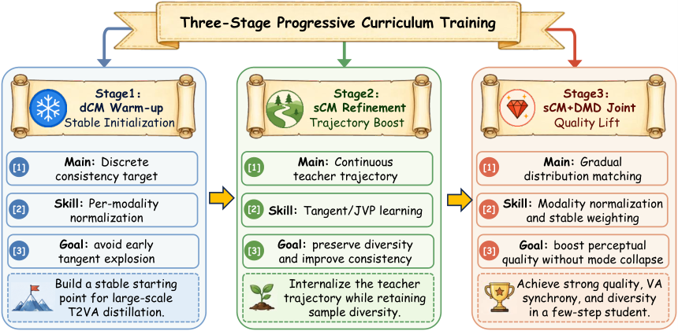
*Fig. 3: Overview of the proposed curriculum distillation paradigm. The student is progressively trained through dCM warm-up, sCM refinement, and sCM+DMD joint optimization.*

*Fig. 4: Qualitative video-audio examples. Each block compares the 40-step teacher and the 4-step TurboT2VA student under the same prompt, showing early, middle, and late video frames together with the corresponding waveform and mel spectrogram. The student preserves coherent subjects, scene layout, temporal appearance, and audio structure while reducing the sampling trajectory to four steps.*

*Fig. 5: Quality–diversity comparison under matched prompts and random seeds. Rows show sCM-only, Ours (staged), and DMD-only, while columns show different random seeds. sCM-only provides broad variation but weaker prompt fidelity, DMD-only gives polished yet more repetitive compositions, and Ours maintains both coherent cat–robot interactions and meaningful cross-seed variation.*

*Fig. 7:Training-curve ablations through 7,500 global steps. (a) Staged dCM→sCM→sCM+DMD training overtakes direct sCM+DMD optimization after entering the joint stage and maintains stronger late-training performance. (b) Starting from the same dCM+sCM prefix, staged sCM+DMD optimization achieves stronger late-training Javis scores than DMD refinement or sCM-only continuation. Dashed vertical lines denote the stage boundaries.*

---
**Usage Info**: 5512 tokens used.
**Generated at**: 2026-08-26 14:42:36

---

# 📚 Visually-Guided Spatial Audio Generation for 360∘ In-the-Wild Speech Scenes

🚀 URL: https://arxiv.org/html/2608.24579

## 🌏 Abstract (원문)
Spatial audio is a key component of immersive360∘360^{\circ}media, yet high-quality spatial capture remains limited in real-world speech-dominant scenes. We study visually guided First-Order Ambisonics (FOA) speech spatialization in the wild: given aligned360∘360^{\circ}video and an omnidirectional audio track, we recover the missing directional FOA components. To support this task, we introduce YT-SPEECH, a speech-oriented360∘360^{\circ}video-FOA dataset curated from YouTube. We propose a two-stage Localizer-Renderer framework, where an audio-visual segmentation backbone provides frame-wise spatial heatmaps and a conditional complex-domain U-Net reconstructs directional FOA signals from the omnidirectional channel. A confidence-based gating strategy stabilizes conditioning under ambiguous acoustic conditions. Experiments show improved reconstruction fidelity, spatial accuracy, and perceptual speech quality relative to ablated variants and prior approaches.
## 🌏 Abstract (번역)
공간 오디오는 몰입형 360도 미디어의 핵심 구성 요소이지만, 실제 음성 위주 장면에서 고품질 공간 캡처는 여전히 제한적입니다. 우리는 시각적으로 안내되는 1차 앰비소닉스(FOA) 음성 공간화에 대해 연구합니다. 정렬된 360도 비디오와 무지향성 오디오 트랙이 주어졌을 때, 누락된 방향성 FOA 구성 요소를 복구합니다. 이 작업을 지원하기 위해 YouTube에서 선별된 음성 중심의 360도 비디오-FOA 데이터셋인 YT-SPEECH를 소개합니다. 우리는 오디오-시각 분할 백본이 프레임별 공간 히트맵을 제공하고, 조건부 복소수 도메인 U-Net이 무지향성 채널에서 방향성 FOA 신호를 재구성하는 2단계 Localizer-Renderer 프레임워크를 제안합니다. 신뢰도 기반 게이팅 전략은 모호한 음향 조건에서 조건화를 안정화합니다. 실험 결과, 제거된 변형 및 이전 접근 방식에 비해 재구성 충실도, 공간 정확도 및 지각적 음성 품질이 향상되었음을 보여줍니다.

## 🔍 Methods & Results
- 정렬된 360도 비디오와 무지향성 FOA 채널(W)을 사용하여 누락된 방향성 FOA 구성 요소(Y, Z, X)를 복소수 STFT 도메인에서 재구성하는 것을 목표로 한다.
- 오디오-시각 분할 백본이 프레임별 공간 히트맵을 제공하는 Localizer와 조건부 복소수 도메인 U-Net이 방향성 FOA 신호를 재구성하는 Renderer로 구성된 2단계 Localizer-Renderer 프레임워크를 제안한다.
- Localizer는 AVS를 백본으로 사용하여 360도 시야에 대한 조밀한 공간 활성화(공간 사전 P_t)를 생성하며, ERP(Equirectangular Projection) 공간의 수평 랩어라운드 연속성을 위해 원형 패딩을 적용한다.
- Renderer는 Localizer가 생성한 공간 사전 P_t에 기반하여 무지향성 스펙트럼(ΦW)으로부터 방향성 스펙트럼(Φ^Y, Φ^Z, Φ^X)을 합성한다.
- Renderer는 복소수 STFT 도메인에서 작동하는 U-Net 스타일 백본을 사용하며, FOA 렌더링에 필요한 위상 민감 스펙트럼 변환 및 교차 채널 일관성을 가능하게 한다.
- 공간 사전의 집중도와 불확실성을 포착하는 피크 기반 및 엔트로피 기반 측정값을 결합하여 스칼라 신뢰도 게이트 g(t)를 계산하는 신뢰도 기반 게이팅 전략을 사용한다.
- 신뢰도 게이트 g(t)는 FiLM(feature-wise linear modulation)을 통해 Renderer U-Net의 디코더 블록에 적용되어, 공간 사전의 신뢰도에 따라 시각적 안내와 오디오 증거의 균형을 적응적으로 조절한다.
- Renderer는 무지향성 스펙트럼(ΦW)에 요소별로 적용되는 복소수 마스크(M_i)를 예측하여 각 방향성 스펙트럼(Φ^i)을 얻는다.
- 다중 해상도 STFT 손실, 크기 일관성 손실, 파형 수준 L2 손실을 포함하는 신뢰도 가중 조합의 손실 함수를 최적화한다.
- 실험 결과, 제안된 방법은 제거된 변형 모델 및 이전 접근 방식에 비해 재구성 충실도, 공간 정확도 및 지각적 음성 품질을 향상시켰다.

## 🖼 Figures
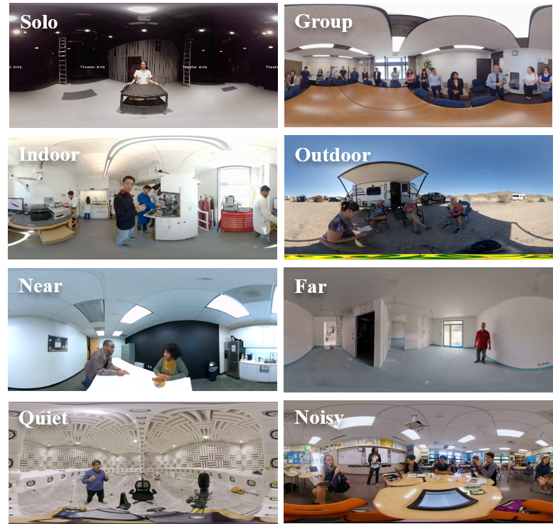
*Figure 1:Sample scenes from the proposed YT-SPEECH.*

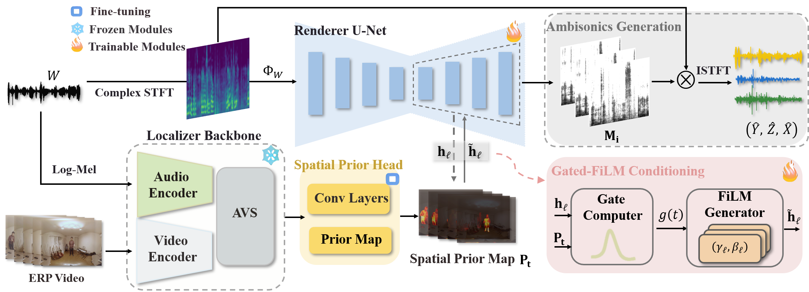
*Figure 2:Overview of the proposed Localizer–Renderer framework for visually guided FOA spatial reconstruction.*

*Figure 3:Qualitative results. Rows I–III show outdoor, group, and noisy scenes. Ground truth and our prediction are overlaid on the 
360
∘
 frames in (a, c, e) and (b, d, f), respectively.*

---
**Usage Info**: 4644 tokens used.
**Generated at**: 2026-08-26 14:42:50

---

# 📚 Array-Agnostic Ambisonics Encoding via Diffusion Posterior Sampling

🚀 URL: https://arxiv.org/html/2608.24558

## 🌏 Abstract (원문)
Spatial audio enhances user immersion by reproducing 3D sound fields, with Ambisonics being a widely adopted representation. While Ambisonics is theoretically independent of the recording setup, practical microphone arrays introduce hardware-dependent encoding artifacts. Moreover, existing data-driven solutions lack flexibility, as they are typically restricted to fixed array geometries. To overcome these limitations, we proposeadeps(adeps), a generative framework that explicitly embeds the physical acquisition model into the inference process. By leveraging this formulation,adepseffectively compensates for array-specific distortions while enabling zero-shot encoding across arbitrary array topologies. We train the underlying generative prior in an unsupervised manner solely on target Ambisonic representations. Extensive evaluations across diverse simulated and real microphone arrays demonstrate thatadepsconsistently outperforms both traditional linear and parametric baselines in spatial fidelity and spectral quality.
## 🌏 Abstract (번역)
공간 오디오는 3D 음장을 재현하여 사용자 몰입도를 높이며, Ambisonics는 널리 채택된 표현 방식입니다. Ambisonics는 이론적으로 녹음 설정과 독립적이지만, 실제 마이크 배열은 하드웨어에 의존하는 인코딩 아티팩트를 발생시킵니다. 더욱이, 기존의 데이터 기반 솔루션은 일반적으로 고정된 배열 형상에 제한되어 유연성이 부족합니다. 이러한 한계를 극복하기 위해, 우리는 물리적 획득 모델을 추론 과정에 명시적으로 내장하는 생성 프레임워크인 adeps를 제안합니다. 이 공식을 활용함으로써 adeps는 배열 특정 왜곡을 효과적으로 보상하는 동시에 임의의 배열 토폴로지에 걸쳐 제로샷 인코딩을 가능하게 합니다. 우리는 기저의 생성 사전(generative prior)을 오직 목표 Ambisonic 표현만을 사용하여 비지도 방식으로 훈련합니다. 다양하게 시뮬레이션된 실제 마이크 배열에 대한 광범위한 평가는 adeps가 공간 충실도와 스펙트럼 품질 면에서 전통적인 선형 및 파라메트릭 기준선보다 지속적으로 우수한 성능을 보임을 입증합니다.

## 🔍 Methods & Results
- Ambisonics 인코딩은 마이크 배열 신호로부터 Ambisonics 계수를 재구성하는 것을 목표로 하며, 저주파 노이즈 증폭, 불균일한 마이크 감도, 고주파 공간 에일리어싱, 그리고 배열 불변성(array-invariance) 요구사항과 같은 여러 문제에 직면합니다.
- 전통적인 선형 Ambisonics 인코딩은 Tikhonov-정규화된 유사 역행렬을 사용하지만, 노이즈, 불균일성, 에일리어싱에 민감하며, 마이크 수에 따라 고정된 인코딩 차수를 요구합니다.
- 제안된 adeps 프레임워크는 물리적 획득 모델을 생성 추론 과정에 명시적으로 내장함으로써 이러한 한계를 극복합니다.
- adeps는 연속 시간 확산 모델을 사용하여 사후 분포에서 샘플링하기 위한 스코어 함수를 근사화하는 스코어 기반 생성 역문제(score-based generative inverse problems)를 활용합니다.
- adeps는 기저의 생성 사전(generative prior)을 오직 목표 Ambisonic 표현만을 사용하여 비지도 방식으로 훈련합니다.
- 실험 결과에 따르면 adeps는 다양한 시뮬레이션 및 실제 마이크 배열에서 공간 충실도와 스펙트럼 품질 면에서 전통적인 선형 및 파라메트릭 기준선보다 지속적으로 우수한 성능을 보였습니다.
- adeps의 핵심 기능은 배열 특정 왜곡을 보상하고 임의의 배열 토폴로지에 걸쳐 제로샷 인코딩을 가능하게 하는 것입니다.

## 🖼 Figures
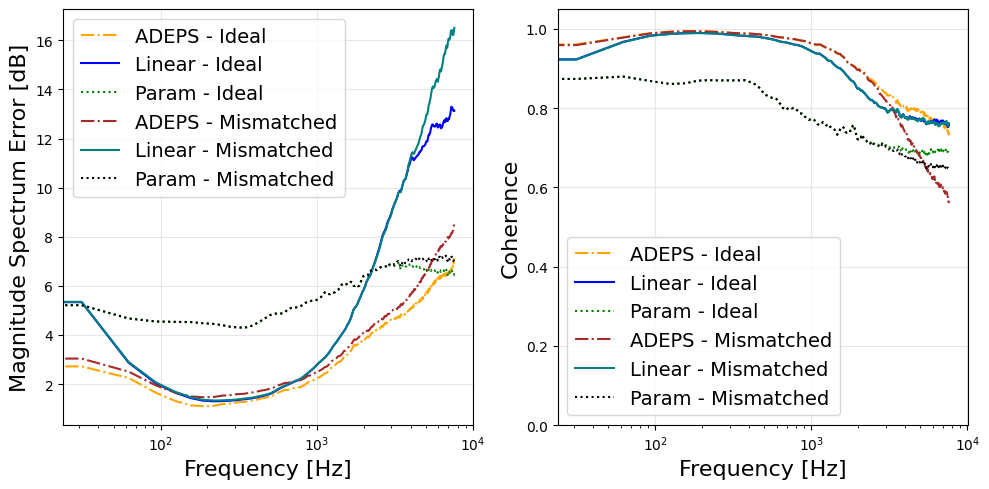
*Figure 1:Coherence and mean spectrum error of both ideal and mismatched scenarios over the frequency spectrum*

---
**Usage Info**: 4489 tokens used.
**Generated at**: 2026-08-26 14:43:01

---

# 📚 The ISCSLP 2026 Real-World Audio-Visual Speech Enhancement Challenge

🚀 URL: https://arxiv.org/html/2608.23759

## 🌏 Abstract (원문)
Audio-visual speech enhancement (AVSE) uses visual-speech cues from a target speaker to recover that speaker’s speech from noisy or overlapping speech. Many widely used protocols construct mixed signals from separately recorded audio sources and assume reliable video, leaving their performance under natural overlap and visual failure insufficiently characterized. The Real-World AVSE Challenge evaluates two related settings. Track 1 comprises two scenarios: real-world mixtures recorded with two speakers speaking simultaneously, without a corresponding clean reference signal, and synthetic remixes obtained by manually mixing the separately recorded speech of two speakers, with a clean reference signal available; Track 2 reuses audio but pairs it with a degraded target video and contains additional 3-m far-field recordings. The speakers in the development and test sets are disjoint. Evaluation metrics include clean-waveform fidelity, learned quality estimates, transcription accuracy, and speaker identification. In the remix task on the development set, the baseline model achieved an SI-SDR of−4.069-4.069dB and an STOI of0.3880.388on Track 1, and an SI-SDR of−2.851-2.851dB and an STOI of0.4700.470on Track 2. We release the AV-ConvTasNet checkpoints, the offline evaluator, and the official baseline results on the development and test sets.
## 🌏 Abstract (번역)
오디오-시각 음성 향상(AVSE)은 대상 화자의 시각적 음성 단서를 사용하여 시끄럽거나 겹치는 음성에서 해당 화자의 음성을 복구합니다. 널리 사용되는 많은 프로토콜은 개별적으로 녹음된 오디오 소스에서 혼합 신호를 구성하고 신뢰할 수 있는 비디오를 가정하여, 자연스러운 중첩 및 시각적 실패 상황에서의 성능이 충분히 특성화되지 않았습니다. Real-World AVSE Challenge는 두 가지 관련 설정을 평가합니다. 트랙 1은 두 가지 시나리오로 구성됩니다: 해당 클린 참조 신호 없이 두 화자가 동시에 말하는 것을 녹음한 실제 혼합 신호, 그리고 두 화자의 개별적으로 녹음된 음성을 수동으로 혼합하여 얻은 합성 리믹스 신호(클린 참조 신호 사용 가능); 트랙 2는 오디오를 재사용하지만 손상된 대상 비디오와 페어링하고 추가 3미터 원거리 녹음을 포함합니다. 개발 및 테스트 세트의 화자는 서로 다릅니다. 평가 지표에는 클린 파형 충실도, 학습된 품질 추정치, 전사 정확도 및 화자 식별이 포함됩니다. 개발 세트의 리믹스 작업에서, 기준 모델은 트랙 1에서 SI-SDR -4.069dB 및 STOI 0.388을 달성했으며, 트랙 2에서는 SI-SDR -2.851dB 및 STOI 0.470을 달성했습니다. 우리는 AV-ConvTasNet 체크포인트, 오프라인 평가기, 그리고 개발 및 테스트 세트의 공식 기준선 결과를 공개합니다.

## 🔍 Methods & Results
- Real-World AVSE Challenge는 두 가지 설정을 평가한다: 트랙 1은 실제 혼합 및 합성 리믹스 시나리오를 포함하며, 트랙 2는 손상된 비디오 및 3미터 원거리 녹음을 추가한다.
- 평가 지표는 클린 파형 충실도, 학습된 품질 추정치, 전사 정확도, 화자 식별을 포함한다.
- 개발 세트의 리믹스 작업에서 기준 모델은 트랙 1에서 SI-SDR -4.069dB, STOI 0.388을 달성했다.
- 개발 세트의 리믹스 작업에서 기준 모델은 트랙 2에서 SI-SDR -2.851dB, STOI 0.470을 달성했다.
- AV-ConvTasNet 체크포인트, 오프라인 평가기, 개발 및 테스트 세트의 공식 기준선 결과가 공개되었다.

## 🖼 Figures
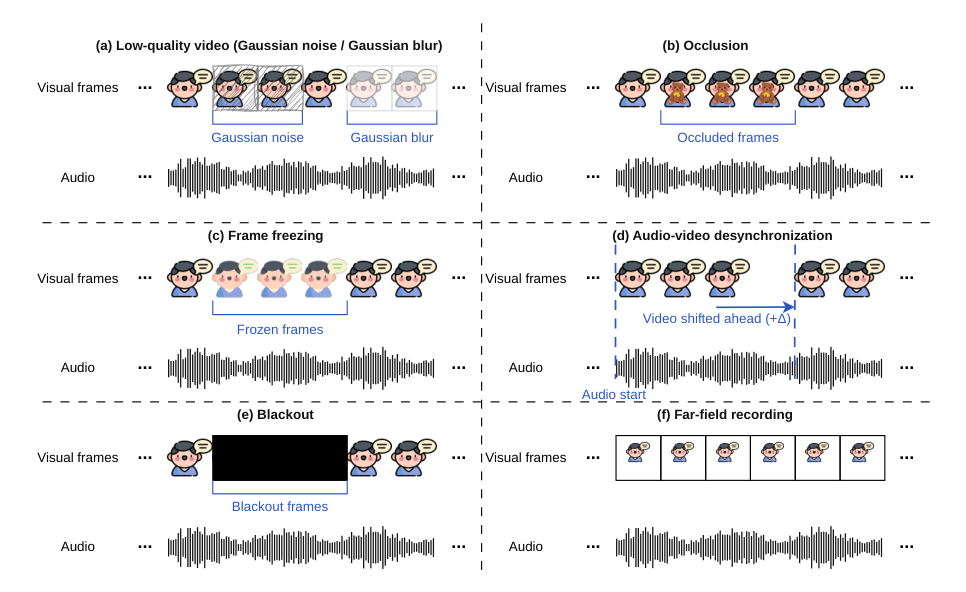
*Figure 1:Official examples of low quality (a), occlusion (b), frame freezing (c), audio-video desynchronization (d), blackout (e), and far-field recording (f). Desynchronization changes timing and is not visible in a single frame.*

---
**Usage Info**: 1714 tokens used.
**Generated at**: 2026-08-26 14:43:08

---

