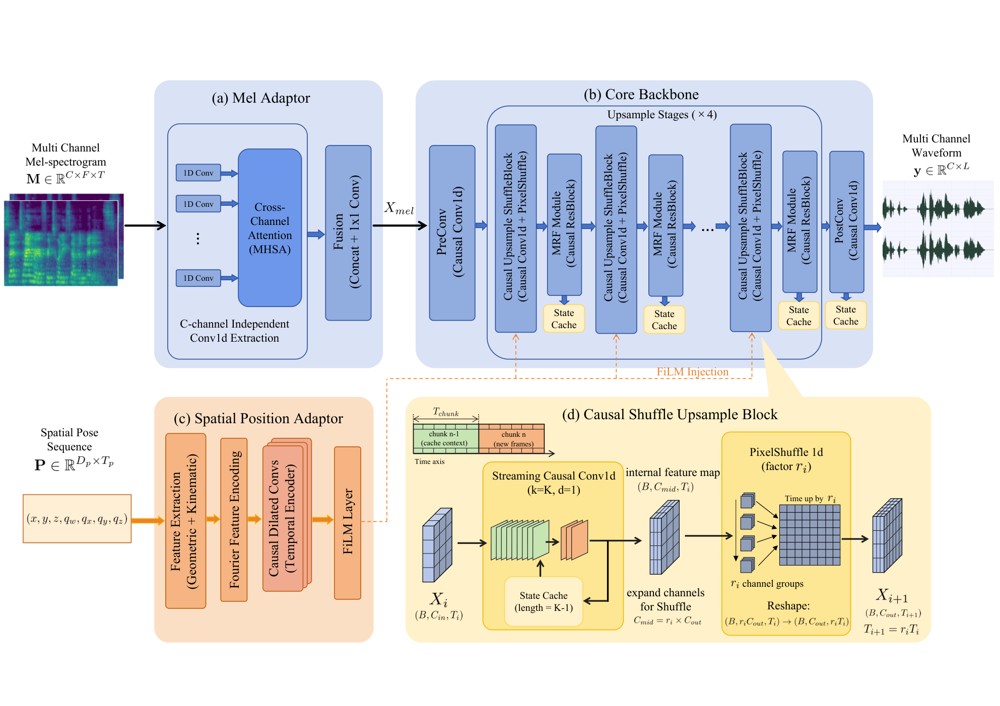
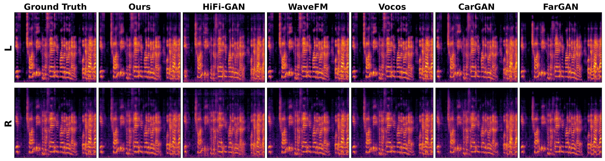
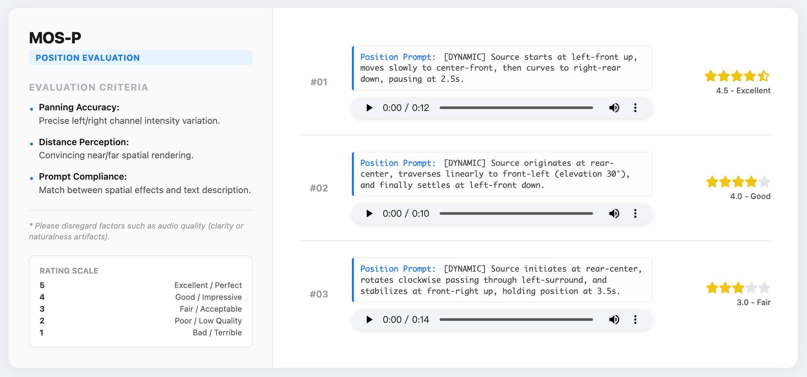
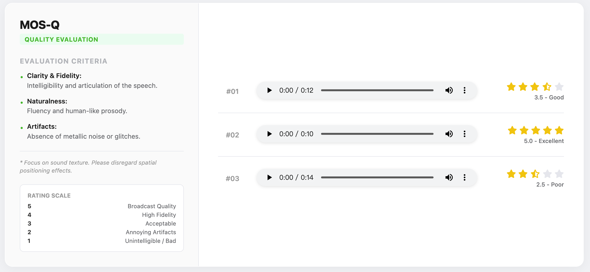
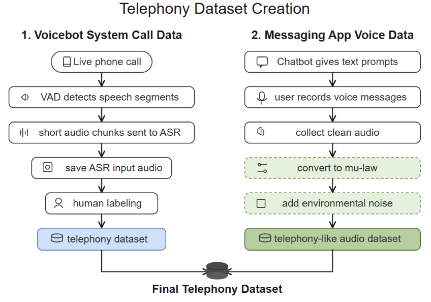
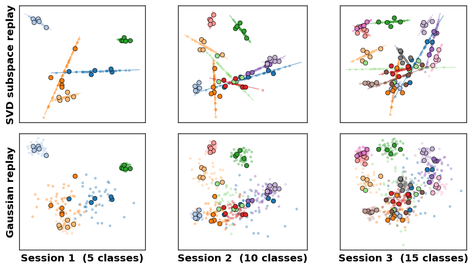

# 🚩 (2026-08-27) Scholar Inbox 추천 논문 

# 📚 CSAVocoder: A Causal Spatial Audio VocoderTowards Real-Time Spatial Audio Generation

🚀 URL: https://arxiv.org/html/2608.25404

## 🌏 Abstract (원문)
Spatial audio vocoders are able to convert mel-spectrograms produced by generative models into spatial audio waveforms. Most neural vocoders are designed for monaural audio, and direct extensions to spatial audio can degrade spatial quality by ignoring inter-channel cues. We present CSAVocoder, a causal GAN-based spatial audio vocoder that jointly optimizes waveform fidelity and spatial rendering. Our framework introduces a Spatial Adaptor that fuses multi-channel mel-spectrograms with dynamic source-listener pose information, together with a spatial consistency discriminator that supervises inter-channel cues. To meet real-time requirements, we design a strictly causal, stateful generator that supports efficient streaming inference with constant memory overhead. Experiments on large-scale spatial audio datasets show that CSAVocoder improves spatial fidelity at competitive audio quality and real-time performance.
## 🌏 Abstract (번역)
공간 오디오 보코더는 생성 모델이 생성한 멜-스펙트로그램을 공간 오디오 파형으로 변환할 수 있습니다. 대부분의 신경 보코더는 모노 오디오용으로 설계되었으며, 공간 오디오로 직접 확장할 경우 채널 간 단서를 무시하여 공간 품질을 저하시킬 수 있습니다. 본 논문에서는 파형 충실도와 공간 렌더링을 동시에 최적화하는 인과적 GAN 기반 공간 오디오 보코더인 CSAVocoder를 제안합니다. 저희 프레임워크는 다중 채널 멜-스펙트로그램을 동적 소스-청취자 자세 정보와 융합하는 공간 어댑터와 채널 간 단서를 감독하는 공간 일관성 판별자를 도입합니다. 실시간 요구 사항을 충족하기 위해, 우리는 일정한 메모리 오버헤드로 효율적인 스트리밍 추론을 지원하는 엄격하게 인과적이며 상태 저장형 생성기를 설계했습니다. 대규모 공간 오디오 데이터셋에 대한 실험 결과, CSAVocoder는 경쟁력 있는 오디오 품질과 실시간 성능을 유지하면서 공간 충실도를 향상시키는 것으로 나타났습니다.

## 🔍 Methods & Results
- CSAVocoder는 다중 채널 멜-스펙트로그램과 공간 자세 시퀀스로부터 다중 채널 공간 오디오 파형을 합성하는 것을 목표로 한다.
- HiFi-GAN 보코더를 기반으로 하며, 공간 조건화 및 엄격한 인과적 스트리밍 합성을 지원하도록 생성기와 판별자를 확장한다.
- 생성기는 엄격하게 인과적이며 상태 저장형 아키텍처로, ShuffleUpsampleBlock 및 StreamingResBlock과 같은 재설계된 핵심 빌딩 블록을 사용하여 효율적인 스트리밍 추론과 아티팩트 없는 업샘플링을 지원한다.
- Spatial Adaptor는 다중 채널 멜-스펙트로그램을 단일 스트림 표현으로 융합하며, 채널 축을 따라 Multi-Head Self-Attention을 사용하여 채널 간 비선형 의존성을 포착한다.
- Position Adaptor는 원시 자세 시퀀스를 푸리에 특징 인코딩 및 인과적 합성곱을 통해 물리적으로 의미 있는 조건화 정보로 변환하고, FiLM을 통해 생성기에 주입한다.
- 판별자 스택은 HiFi-GAN 및 BigVGAN의 표준 판별자와 함께, 채널 간 단서 및 공간 구조를 명시적으로 감독하는 Spatial Consistency Discriminator (SCD)를 도입한다.
- 손실 함수는 표준 GAN 손실, 특징 매칭 손실, 다중 해상도 스펙트럼 재구성 손실 외에, 바이노럴 오디오(IPD, ILD) 및 FOA 오디오(음장 기술자)에 대한 물리적 속성을 명시적으로 감독하는 형식 인식 공간 손실(Format-aware Spatial Loss)을 포함한다.
- CSAVocoder는 채널 수에 관계없이 동일한 업샘플링을 수행하는 채널 프리(channel-free) 생성기 설계를 통해 다양한 공간 오디오 형식(예: 바이노럴, FOA)을 지원한다.
- 대규모 공간 오디오 데이터셋 실험 결과, CSAVocoder는 경쟁력 있는 오디오 품질과 실시간 성능을 유지하면서 공간 충실도를 향상시키는 것으로 나타났다.

## 🖼 Figures

*Figure 1:Overview of our model architecture.*

*Figure 2:Continuous streaming inference pipeline. Starting from a multi-channel mel-spectrogram, the Mel Adaptor and Position Adaptor compute mel and pose embeddings. The embeddings are passed to the convolutional backbone, which generates waveform chunks through causal upsampling and residual blocks. Each streaming block keeps its own cache in the cache bank, so computation follows the causal constraint and never recomputes past activations.*

*Figure 3:Qualitative comparison of spectrograms. The first column shows the ground truth, the second column shows our model, and the remaining columns show baselines.*

*Figure 4:Screenshot of the MOS-P test interface.*

*Figure 5:Screenshot of the MOS-Q test interface.*

---
**Usage Info**: 6145 tokens used.
**Generated at**: 2026-08-27 23:31:46

---

# 📚 Domain-Adaptive ASR for Telephony AI Agents: Fine-tuning Canary Flash Models for Enterprise Contact Center Applications

🚀 URL: https://arxiv.org/html/2608.24916

## 🌏 Abstract (원문)
This technical report describes Botnoi Group’s methodology and results for rapidly fine-tuning the open-source NVIDIA Canary 180M Flash and NVIDIA Canary 1B Flash multitask models for speech-to-text tasks using the NVIDIA NeMo framework, with a focus on telephony-grade audio. To support this adaptation, we construct a telephony-oriented fine-tuning dataset from live voicebot system recordings and prompted speech with telephony-oriented augmentation. We evaluate four targeted experiments—language adaptation (Thai), telephony robustness, domain-specific jargon (names and addresses), and latency—using character error rate (CER) for accuracy and real-time factor (RTFx) for inference speed. Results show that fine-tuning substantially improves recognition in noisy telephony environments, reducing CER from 23.31% to 9.04% on BOTNOI telephony data, and further improves business-critical names and addresses from 16.98% to 3.78% CER through domain-specific adaptation. Overall, our results show that domain-adaptive fine-tuning enhances business-critical terminology while preserving real-time responsiveness for production voicebot deployments, and the BOTNOI ASR telephony benchmark is publicly available athttps://github.com/OHM-Songpol/Botnoi_ASR_telephony.
## 🌏 Abstract (번역)
이 기술 보고서는 Botnoi 그룹이 NVIDIA NeMo 프레임워크를 사용하여 오픈 소스 NVIDIA Canary 180M Flash 및 NVIDIA Canary 1B Flash 다중 작업 모델을 음성-텍스트 작업(특히 전화 통화 품질 오디오에 중점)을 위해 신속하게 미세 조정하는 방법론과 결과를 설명합니다. 이러한 적응을 지원하기 위해, 우리는 라이브 음성 봇 시스템 녹음과 전화 통화 지향 증강이 적용된 프롬프트 음성으로부터 전화 통화 지향 미세 조정 데이터셋을 구축했습니다. 우리는 정확도를 위해 문자 오류율(CER)을, 추론 속도를 위해 실시간 계수(RTFx)를 사용하여 언어 적응(태국어), 전화 통화 강건성, 도메인 특정 용어(이름 및 주소), 지연 시간이라는 네 가지 목표 실험을 평가했습니다. 결과는 미세 조정이 시끄러운 전화 통화 환경에서 인식률을 크게 향상시켜 BOTNOI 전화 통화 데이터에서 CER을 23.31%에서 9.04%로 감소시켰으며, 도메인 특정 적응을 통해 비즈니스에 중요한 이름과 주소의 CER을 16.98%에서 3.78%로 추가로 개선했음을 보여줍니다. 전반적으로, 우리의 결과는 도메인 적응형 미세 조정이 비즈니스에 중요한 용어를 향상시키면서도 프로덕션 음성 봇 배포를 위한 실시간 응답성을 유지함을 보여주며, BOTNOI ASR 전화 통화 벤치마크는 https://github.com/OHM-Songpol/Botnoi_ASR_telephony에서 공개적으로 이용 가능합니다.

## 🔍 Methods & Results
- NVIDIA NeMo 프레임워크를 사용하여 오픈 소스 NVIDIA Canary 180M Flash 및 1B Flash 다중 작업 모델을 전화 통화 품질 음성-텍스트 작업에 미세 조정했습니다.
- 전화 통화 지향 미세 조정 데이터셋은 라이브 음성 봇 시스템 녹음(25시간)과 전화 통화 지향 증강이 적용된 프롬프트 음성(메시징 앱 수집 후 mu-law 변환 및 환경 노이즈 추가)을 결합하여 총 52시간으로 구성되었습니다.
- Canary 모델은 FastConformer 인코더와 Transformer 디코더 아키텍처를 활용하며, FastConformer는 8배 서브샘플링과 선형 확장 가능한 어텐션을 통해 2.8배 빠른 추론 속도를 제공합니다.
- NeMo 프레임워크의 모듈형 구성 요소, SpecAugment와 같은 내장 데이터 증강, 혼합 정밀도 및 분산 멀티 GPU 실행을 포함한 훈련 최적화를 활용했습니다.
- 훈련은 단일 NVIDIA A100 GPU(40GB VRAM)에서 AdamW 옵티마이저, 역제곱근 어닐링 학습률 스케줄, 혼합 정밀도(fp16)를 사용하여 1백만 훈련 스텝 동안 수행되었습니다.
- 미세 조정을 통해 시끄러운 전화 통화 환경에서 인식률이 크게 향상되어 BOTNOI 전화 통화 데이터에서 문자 오류율(CER)이 23.31%에서 9.04%로 감소했습니다.
- 도메인 특정 적응을 통해 비즈니스에 중요한 이름과 주소의 CER이 16.98%에서 3.78%로 추가로 개선되었습니다.
- 전반적으로, 도메인 적응형 미세 조정은 프로덕션 음성 봇 배포를 위한 실시간 응답성을 유지하면서 비즈니스 핵심 용어의 인식률을 향상시키는 것으로 나타났습니다.

## 🖼 Figures

*Figure 1: Overview of the telephony data collection pipeline, combining voicebot system call audio, prompted messaging-app recordings, and telephony-oriented augmentation.*

---
**Usage Info**: 5030 tokens used.
**Generated at**: 2026-08-27 23:32:00

---

# 📚 InteractGesture: Progressive Chunk Guidance for Continuous Streaming Co-Speech Gesture Control

🚀 URL: https://arxiv.org/html/2608.25734

## 🌏 Abstract (원문)
Co-speech gesture generation has made significant progress toward realistic full-body motion from speaker audio, yet existing models lack fine-grained spatial controllability of individual joints. To address this, we introduceInteractGesture, a model-agnostic, inference-time method for spatially controllable gesture generation.InteractGestureguides target latent estimates of a diffusion sampler through a differentiable RVQ-VAE decoder, backpropagating spatial control gradients to adjust motion latents during sampling. A primary challenge in streaming co-speech generation is chunk-wise dependency: standard sequential inference freezes prior chunks, preventing spatial constraints in future chunks from adjusting preceding trajectories and causing boundary inconsistencies. To overcome this limitation, we proposeProgressive Chunk Guidance, a chunk-window strategy that maintains an active set of editable chunk latents with staggered delays, enabling spatial constraints to propagate gradients backward across chunk boundaries during streaming generation. Experiments on the BEAT2 dataset show thatInteractGestureimproves multi-joint spatial control while preserving overall gesture quality. Furthermore, our approach supports diverse applications, including sparse joint positioning, dense joint trajectory control, and directional pointing. Our project page is available athttps://exitudio.github.io/interactgesture-page.
## 🌏 Abstract (번역)
음성 동반 제스처 생성은 화자 오디오로부터 사실적인 전신 움직임을 생성하는 데 상당한 진전을 이루었지만, 기존 모델들은 개별 관절에 대한 미세한 공간 제어 가능성이 부족합니다. 이를 해결하기 위해 우리는 공간적으로 제어 가능한 제스처 생성을 위한 모델 불가지론적 추론 시간 방법인 InteractGesture를 소개합니다. InteractGesture는 미분 가능한 RVQ-VAE 디코더를 통해 확산 샘플러의 목표 잠재 추정치를 안내하여 샘플링 중에 모션 잠재 변수를 조정하기 위해 공간 제어 기울기를 역전파합니다. 스트리밍 음성 동반 생성의 주요 과제는 청크 단위 의존성입니다. 표준 순차적 추론은 이전 청크를 고정하여 미래 청크의 공간 제약이 선행 궤적을 조정하는 것을 방지하고 경계 불일치를 유발합니다. 이 한계를 극복하기 위해 우리는 점진적 청크 안내(Progressive Chunk Guidance)를 제안합니다. 이는 지연된 지연을 가진 편집 가능한 청크 잠재 변수의 활성 세트를 유지하는 청크-창 전략으로, 스트리밍 생성 중에 공간 제약이 청크 경계를 넘어 기울기를 역전파할 수 있도록 합니다. BEAT2 데이터셋에 대한 실험은 InteractGesture가 전반적인 제스처 품질을 유지하면서 다중 관절 공간 제어를 개선함을 보여줍니다. 또한, 우리의 접근 방식은 희소 관절 위치 지정, 밀집 관절 궤적 제어, 방향 지시를 포함한 다양한 응용 프로그램을 지원합니다. 프로젝트 페이지는 https://exitudio.github.io/interactgesture-page에서 확인할 수 있습니다.

## 🔍 Methods & Results
- InteractGesture는 오디오에 조건화된 사전 학습된 청크 수준 잠재 샘플러를 공간 제어 사양(H, M, Φ)으로 보강하여 음성에 동기화된 전신 제스처를 생성합니다.
- 기저 생성기를 블랙박스로 취급하며, 제어 기울기를 목표 잠재 추정치(z_hat)에만 역전파하고 모델 파라미터는 변경하지 않습니다.
- RVQ-VAE 디코더와 SMPL-X 레이어를 포함하는 완전히 미분 가능한 디코딩 경로를 통해 3D 관절 공간에서 잠재 추정치로 공간 제어 손실 기울기를 직접 역전파할 수 있습니다.
- 공간 제어는 목표 위치 텐서(H)와 해당 이진 마스크 텐서(M)를 사용하여 지정되며, 희소 관절 키프레임부터 연속적인 다중 관절 궤적까지 다양한 시공간 제약 구성을 지원합니다.
- Adam 옵티마이저를 사용하여 목표 잠재 추정치(x_hat_0)를 최적화하며, 활성 제약 조건 수에 따라 학습률을 정규화합니다.
- 역 샘플링 단계에 따라 잠재 최적화 반복 횟수(K(i))를 스케줄링하여, 관절 디코딩이 가장 신뢰할 수 있는 샘플링 후반 단계에 공간 안내를 집중시킵니다.
- 스트리밍 생성 중 청크 간 의존성 문제를 해결하기 위해 '점진적 청크 안내(Progressive Chunk Guidance)'를 제안합니다.
- 점진적 청크 안내는 지연된 오프셋을 가진 후속 청크를 도입하고, 이전 청크의 최신 안내된 추정치로부터 컨텍스트 프레임을 지속적으로 새로 고침으로써 양방향 제어 캐스케이드를 생성합니다.
- 이 양방향 전파는 미래의 공간 제약이 이전 팔 궤적을 조정하고 청크 간의 부드러운 모션 연속성을 보장하도록 합니다.
- InteractGesture는 관절 위치 제어, 밀집 궤적 제어, 방향 지시 제어의 세 가지 주요 편집 모드를 지원합니다.
- BEAT2 데이터셋에 대한 실험 결과, InteractGesture는 전반적인 제스처 품질을 유지하면서 다중 관절 공간 제어 능력을 향상시켰습니다.
- 이 접근 방식은 희소 관절 위치 지정, 밀집 관절 궤적 제어, 방향 지시와 같은 다양한 응용 분야에 활용될 수 있음을 입증했습니다.

## 🖼 Figures

*Figure 1:InteractGesture enables spatial gesture control for a speech-conditioned gesture generation model. (a) Speech Condition Only. (b) Joint Position Control: directs specified joints to point at described objects at designated frames. (c) Dense Joint Trajectory Control: guides joints along a continuous path for sophisticated gesture control. (d) Pointing Direction Control: orients the arm toward a target direction.*

![Figure 3: InteractGesture adds spatial control guidance to a pretrained co-speech gesture generation model at inference time. At every selected sampling step, the predicted target latent estimate is decoded into SMPL-X joints, a masked joint loss is minimized, and the edited target latent estimate is converted back into the sampler update used by the generator. The same mechanism supports absolute 3D targets, root-relative targets, and Progressive Chunk Guidance for continuous streaming generation from overlapping latent chunks.](../images/2026-08-27/2608.25734/2608.25734_fig2.png)
*Figure 3: InteractGesture adds spatial control guidance to a pretrained co-speech gesture generation model at inference time. At every selected sampling step, the predicted target latent estimate is decoded into SMPL-X joints, a masked joint loss is minimized, and the edited target latent estimate is converted back into the sampler update used by the generator. The same mechanism supports absolute 3D targets, root-relative targets, and Progressive Chunk Guidance for continuous streaming generation from overlapping latent chunks.*

*Figure 4: Main qualitative result. InteractGesture uses spatial controls to steer co-speech gestures toward target hand and arm positions while preserving the speech-conditioned gesture prior. The visualization shows the guided generations alongside target positions, demonstrating whether the generated wrists and elbows adhere to the requested spatial constraints.*

---
**Usage Info**: 4382 tokens used.
**Generated at**: 2026-08-27 23:32:10

---

# 📚 SPECTRA: Subspace-Preserving Embedding Calibration, Transport, and Replay for Fully Few-Shot Class-Incremental Audio Classification

🚀 URL: https://arxiv.org/html/2608.25054

## 🌏 Abstract (원문)
Fully few-shot class-incremental audio classification (FFCAC) requires recognizing new sound classes from only a handful of labeled examples per session, without forgetting previously learned classes and without any large base dataset. Existing methods typically freeze a pre-trained audio–language encoder and classify with point prototypes, but they suffer from significant performance degradation throughout the sessions due to generic feature representations. We propose SPECTRA, a framework built on a frozen encoder which adds three components. (i) a lightweight trainable adapter that calibrates the generic embeddings to the task; (ii) subspace feature replay, an exemplar-free anti-forgetting scheme that replays old classes by sampling from the low-rank subspace of their stored features; and (iii) a transductive optimal-transport refinement of prototypes at test time. Our central finding is that the subspace structure of the replay diminishes forgetting and outperforms naive Gaussian replay of equal variance. On three FFCAC benchmarks (NSynth-100, FSC-89, LS-100), SPECTRA improves average accuracy and reduces forgetting over current state-of-the-art methods, and our ablations statistically validate each component.
## 🌏 Abstract (번역)
완전 소수샷 클래스 증분 오디오 분류(FFCAC)는 세션당 소수의 레이블링된 예제만으로 새로운 사운드 클래스를 인식하고, 이전에 학습한 클래스를 잊지 않으며, 대규모 기본 데이터셋 없이 수행되어야 합니다. 기존 방법들은 일반적으로 사전 학습된 오디오-언어 인코더를 고정하고 포인트 프로토타입으로 분류하지만, 일반적인 특징 표현으로 인해 세션 전반에 걸쳐 상당한 성능 저하를 겪습니다. 우리는 고정된 인코더를 기반으로 세 가지 구성 요소를 추가한 프레임워크인 SPECTRA를 제안합니다. (i) 일반적인 임베딩을 작업에 맞게 보정하는 경량의 학습 가능한 어댑터; (ii) 저장된 특징의 저랭크 부분 공간에서 샘플링하여 이전 클래스를 재생하는 예제 없는 망각 방지 스키마인 부분 공간 특징 재생; 그리고 (iii) 테스트 시 프로토타입의 변환적 최적 수송 정제. 우리의 핵심 발견은 재생의 부분 공간 구조가 망각을 줄이고 동일 분산의 단순 가우시안 재생보다 우수하다는 것입니다. 세 가지 FFCAC 벤치마크(NSynth-100, FSC-89, LS-100)에서 SPECTRA는 현재 최첨단 방법보다 평균 정확도를 향상시키고 망각을 줄이며, 우리의 제거 연구는 각 구성 요소를 통계적으로 검증합니다.

## 🔍 Methods & Results
- FFCAC(Fully Few-Shot Class-Incremental Audio Classification) 설정에서, 오디오-언어 모델(ALM) 인코더 `f`는 오디오 클립을 `d`차원 임베딩 `x`로 매핑하며, 각 클래스는 `K`개의 지원 예제로 관찰되고 이전 세션의 샘플은 사용할 수 없습니다.
- 각 클래스 `c`에 대해 지원 특징 집합 `M_c`와 프로토타입 `μ_c`를 유지하며, TAPE의 Task-Transform을 사용하여 프로토타입을 직교 메트릭 공간으로 투영합니다.
- SPECTRA 프레임워크는 세 가지 상호 보완적인 구성 요소로 구성됩니다: (1) 고정된 ALM 특징을 대상 작업에 맞게 보정하는 경량 임베딩 어댑터, (2) 저차원 부분 공간으로 각 클래스를 모델링하여 이전 지식을 보존하는 부분 공간 특징 재생, (3) 레이블 없는 테스트 배치에 대한 변환적 최적 수송을 사용하여 추론 중 클래스 프로토타입을 정제합니다.
- 임베딩 어댑터는 고정된 백본의 안정성을 유지하면서 임베딩 공간을 보정하는 경량 잔차 어댑터(LayerScale이 있는 트랜스포머 스타일 피드포워드 잔차 블록)이며, 프레임워크의 유일한 실질적인 학습 가능한 구성 요소로 분류기와 함께 엔드투엔드로 최적화됩니다.
- 부분 공간 특징 재생은 각 클래스를 프로토타입뿐만 아니라 고유한 특징 변화를 포착하는 압축된 저차원 부분 공간으로 표현하여, 이전 클래스를 위한 대표적인 특징 임베딩을 합성하고 지속적인 학습 동안 재생할 수 있도록 합니다.
- 부분 공간 특징 재생은 클래스의 중심에서 평균을 뺀 지원 임베딩의 SVD를 통해 상위 `k`개의 특이 벡터로 주성분 방향을 정의하고, 이 부분 공간 내에서 샘플링하여 `n`개의 의사 임베딩을 생성합니다.
- 훈련 목표는 현재 세션에 대한 표준 교차 엔트로피 손실과 합성된 임베딩에 대한 재생 손실을 결합하며, 이 접근 방식은 등방성 가우시안 재생과 달리 각 클래스 내의 주요 변동 방향을 보존하여 훨씬 더 대표적인 재생 샘플을 생성합니다.
- 변환적 최적 수송 정제는 `K`개의 지원 예제에서 추정된 불완전한 프로토타입을 개선하기 위해 레이블 없는 테스트 배치의 집단적 구조를 활용합니다.
- 코사인 거리 비용 `M_jc`를 기반으로 Sinkhorn 반복을 통해 소프트 수송 계획 `R`을 계산하고, 각 프로토타입은 지원 임베딩과 소프트하게 할당된 쿼리 임베딩을 사용하여 업데이트됩니다. 이 정제는 최종 예측 전에 `T`번 반복됩니다.
- 훈련 시에는 어댑터 `g`, 학습된 프로토타입 및 참조 앵커만 업데이트되며, 인코더 `f`는 고정되고 변환 `P_t`는 닫힌 형식입니다. 유일한 훈련 목표는 새로운 클래스 지원 특징과 합성 재생 특징에 대한 교차 엔트로피입니다.
- 추론 시에는 기울기 계산 없이 변환적 최적 수송 단계가 적용되어 레이블 없는 쿼리로부터 프로토타입을 정제하며, 이 단계에서는 어떤 매개변수도 업데이트되지 않습니다.
- SPECTRA는 세 가지 FFCAC 벤치마크(NSynth-100, FSC-89, LS-100)에서 현재 최첨단 방법보다 평균 정확도를 향상시키고 망각을 줄이는 성능을 보였습니다.
- 제거 연구를 통해 SPECTRA의 각 구성 요소가 통계적으로 유효함이 입증되었습니다.

## 🖼 Figures
![Figure 1:(a) The FFCAC setting: sessions arrive over time, each introducing 
5
 new classes with 
𝐾
=
5
 shots and no base session; the model is evaluated on all classes seen so far (cumulative test set growing 
→
25
). (b) SPECTRA. An audio clip is embedded by a frozen audio–language encoder (PENGI 
𝑓
), calibrated by a trainable residual-MLP adapter 
𝑔
, and mapped by TAPE’s closed-form orthogonalising transform 
𝐏
𝑡
 before a prototypical classifier. Green (training only): each class’s stored support features 
ℳ
𝑐
 give a low-rank SVD subspace from which synthetic old-class features 
𝐱
~
𝑐
 are sampled and passed through the same head, a rehearsal that counters forgetting without storing audio. Purple, dashed (inference only): a transductive Sinkhorn step refines the prototypes from the unlabelled query batch.](../images/2026-08-27/2608.25054/2608.25054_fig0.png)
*Figure 1:(a) The FFCAC setting: sessions arrive over time, each introducing 
5
 new classes with 
𝐾
=
5
 shots and no base session; the model is evaluated on all classes seen so far (cumulative test set growing 
→
25
). (b) SPECTRA. An audio clip is embedded by a frozen audio–language encoder (PENGI 
𝑓
), calibrated by a trainable residual-MLP adapter 
𝑔
, and mapped by TAPE’s closed-form orthogonalising transform 
𝐏
𝑡
 before a prototypical classifier. Green (training only): each class’s stored support features 
ℳ
𝑐
 give a low-rank SVD subspace from which synthetic old-class features 
𝐱
~
𝑐
 are sampled and passed through the same head, a rehearsal that counters forgetting without storing audio. Purple, dashed (inference only): a transductive Sinkhorn step refines the prototypes from the unlabelled query batch.*

*Figure 2:Replay geometry across sessions. As more classes are added, low-rank subspace replay remains class-aligned, whereas Gaussian replay produces overlapping clouds.*

---
**Usage Info**: 4162 tokens used.
**Generated at**: 2026-08-27 23:32:21

---

# 📚 Physics-Guided Generative Surrogates for Parametric Rarefied Flows with Neural-Field Auto-Decoders: A Pipeline-Level Study of Flow Matching and Diffusion

🚀 URL: https://arxiv.org/html/2608.25454

## 🌏 Abstract (원문)
We present a conditional latent generative framework for parametric rarefied flows that separates neural-field representation, latent transport, and frozen physics adaptation. Neural-field auto-decoders compress discrete-velocity cavity solutions and direct simulation Monte Carlo cylinder solutions into shared coordinate decoders. Train-only principal-component charts support conditional flow matching (FM) and diffusion without a deterministic condition-to-latent backbone, and structured low-rank adapters correct selected decoder outputs while the upstream pipeline remains frozen. On two steady benchmarks, the frozen pipelines interpolate out-of-sample conditions with cavity kinetic relativeL1L_{1}errors at the10−510^{-5}level and cylinder per-field area-weighted RMSEs of 0.038 (density), 0.041 (temperature), and below0.010.01(velocities). For the cavity, physics adaptation reduces the matched-grid Bhatnagar–Gross–Krook diagnostic by 28.65% while preserving field accuracy; for the cylinder, the analytic wall map enforces no-penetration exactly and, jointly with the learned FM adapter, reduces the inlet violation to 0.277 and the global mass-balance ratio to 0.963 of the frozen values with negligible field-error change. A five-seed controlled comparison with deterministic condition-to-chart multilayer perceptrons shows that, although the generative pipelines do not surpass the compact MLP in point accuracy on these single-valued steady problems, the results validate sampling-based conditional transport on the shared representation as an effective steady surrogate, with a natural route to multivalued or stochastic solution families.
## 🌏 Abstract (번역)
본 논문은 신경장 표현, 잠재 수송, 고정된 물리 적응을 분리하는 파라메트릭 희박 유동을 위한 조건부 잠재 생성 프레임워크를 제시합니다. 신경장 오토디코더는 이산 속도 공동(cavity) 해와 직접 시뮬레이션 몬테카를로 실린더 해를 공유 좌표 디코더로 압축합니다. 훈련 전용 주성분 차트는 결정론적 조건-잠재 백본 없이 조건부 유동 매칭(FM) 및 확산을 지원하며, 구조화된 저랭크 어댑터는 업스트림 파이프라인이 고정된 상태에서 선택된 디코더 출력을 보정합니다. 두 가지 정상 상태 벤치마크에서, 고정된 파이프라인은 공동 운동학적 상대 L1 오류가 10^-5 수준이고 실린더 필드별 면적 가중 RMSE가 0.038(밀도), 0.041(온도), 0.01 미만(속도)인 샘플 외 조건을 보간합니다. 공동의 경우, 물리 적응은 필드 정확도를 유지하면서 매칭된 그리드 Bhatnagar–Gross–Krook 진단을 28.65% 감소시킵니다. 실린더의 경우, 해석적 벽 지도는 비침투를 정확하게 강제하며, 학습된 FM 어댑터와 함께 입구 위반을 0.277로, 전역 질량 균형 비율을 고정 값의 0.963으로 줄이면서 필드 오류 변화는 무시할 만합니다. 결정론적 조건-차트 다층 퍼셉트론과의 5개 시드 제어 비교는 생성 파이프라인이 이러한 단일 값 정상 문제에서 컴팩트 MLP의 점 정확도를 능가하지는 못하지만, 공유 표현에 기반한 샘플링 기반 조건부 수송이 다중 값 또는 확률적 해군으로의 자연스러운 경로를 가진 효과적인 정상 대리 모델임을 검증합니다.

## 🔍 Methods & Results
- 모델 선택은 개발 파티션과 LOCO(leave-one-condition-out) 재피팅을 사용했으며, 공동(cavity)에 대해서는 상대 L1 오류를, 실린더에 대해서는 면적 가중 표준화 RMSE를 평가 지표로 사용했습니다.
- 공동 유동 매칭(FM)의 경우, 피처의 단순 연결(plain concatenation) 방식이 FiLM 조건화보다 70.8% 더 정확했습니다. 물리 적응은 Bhatnagar–Gross–Krook(BGK) 진단을 28.65% 감소시키면서 필드 정확도를 유지했습니다.
- 공동 확산(Diffusion)의 경우, FP32 정밀도가 BF16 대비 v-예측 평균을 37.5% 개선했으며, DPM-Solver++(2M)-35가 DDIM보다 우수했습니다. 물리 적응은 운동학적 정확도를 유지하면서 평균 물리 감소율 19.21%를 달성했습니다.
- 실린더 유동 매칭(FM)의 경우, 곡선형 FM 모델은 LOCO 평균/최악 오류를 각각 16.66%/22.22% 감소시켰습니다. 물리 적응은 해석적 벽 지도와 결합하여 입구 위반을 0.277로, 전역 질량 균형 비율을 0.963으로 줄였습니다.
- 실린더 확산(Diffusion)의 경우, x-예측이 가장 작은 LOCO 평균 오류를 보였습니다. 물리 적응은 벽 비율 5.14e-11, 전역 질량 균형 비율 0.9602를 포함한 네 가지 물리 진단을 모두 감소시켰습니다.
- 물리 제약 FM 모델은 물리 제약 확산 모델보다 35.31% 낮은 평균 오류를 보여, 실린더의 주요 모델로 선정되었습니다.
- 생성 파이프라인은 단일 값 정상 문제에서 컴팩트 MLP의 점 정확도를 능가하지는 못했지만, 샘플링 기반 조건부 수송이 다중 값 또는 확률적 해군으로 확장될 수 있는 효과적인 정상 대리 모델임을 검증했습니다.

## 🖼 Figures

*Figure 2:Dimensionless cavity fields at 
Kn
=
0.23
 from DVM and the four generative models. Columnwise color limits are shared across rows.*

*Figure 3:Direct dimensionless errors at 
Kn
=
0.23
. Each column uses 99th-percentile upper clipping.*

*Figure 4:Dimensionless cavity fields at 
Kn
=
0.73
 from DVM and the four generative models. Columnwise color limits are shared across rows.*

*Figure 5:Direct dimensionless errors at 
Kn
=
0.73
. Each column uses 99th-percentile upper clipping.*

*Figure 7:Dimensionless cavity fields for lower-side extrapolation at 
Kn
=
0.03
. Columnwise color limits are shared across rows.*

*Figure 8:Direct dimensionless errors for lower-side cavity extrapolation at 
Kn
=
0.03
, using 99th-percentile upper clipping.*

*Figure 9:Dimensionless cavity fields for upper-side extrapolation at 
Kn
=
1.00
. Columnwise color limits are shared across rows.*

*Figure 10:Direct dimensionless errors for upper-side cavity extrapolation at 
Kn
=
1.00
, using 99th-percentile upper clipping.*

![Figure 11:Dimensionless cylinder fields at 
(
Kn
,
Ma
)
=
(
0.12
,
2.3
)
. Columnwise color limits are shared across rows and set independently for this condition. All cylinder panels in Figs. 10–15 show the window 
𝑥
/
𝐷
∈
[
−
3
,
5
]
, 
𝑦
/
𝐷
∈
[
−
3
,
3
]
 of the domain defined in Eq. 13, with the cylinder centered at the origin.](../images/2026-08-27/2608.25454/2608.25454_fig10.png)
*Figure 11:Dimensionless cylinder fields at 
(
Kn
,
Ma
)
=
(
0.12
,
2.3
)
. Columnwise color limits are shared across rows and set independently for this condition. All cylinder panels in Figs. 10–15 show the window 
𝑥
/
𝐷
∈
[
−
3
,
5
]
, 
𝑦
/
𝐷
∈
[
−
3
,
3
]
 of the domain defined in Eq. 13, with the cylinder centered at the origin.*

*Figure 12:Direct dimensionless cylinder errors at 
(
Kn
,
Ma
)
=
(
0.12
,
2.3
)
, using 99th-percentile upper clipping.*

*Figure 13:Dimensionless cylinder fields at 
(
Kn
,
Ma
)
=
(
0.38
,
3.7
)
. Columnwise color limits are shared across rows and set independently for this condition.*

*Figure 14:Direct dimensionless cylinder errors at 
(
Kn
,
Ma
)
=
(
0.38
,
3.7
)
, using 99th-percentile upper clipping.*

*Figure 15:Dimensionless cylinder fields at 
(
Kn
,
Ma
)
=
(
0.76
,
4.5
)
. Columnwise color limits are shared across rows and set independently for this condition.*

*Figure 16:Direct dimensionless cylinder errors at 
(
Kn
,
Ma
)
=
(
0.76
,
4.5
)
, using 99th-percentile upper clipping.*

---
**Usage Info**: 8789 tokens used.
**Generated at**: 2026-08-27 23:32:40

---

