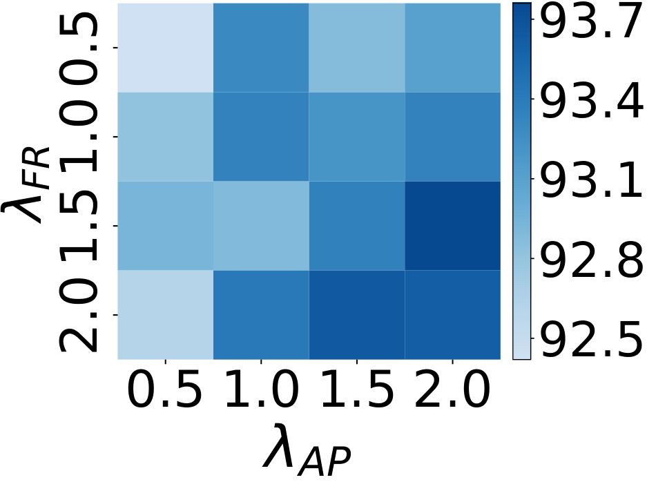

# 🚩 (2026-08-28) Scholar Inbox 추천 논문 

# 📚 SCALING PHONEME-BASED TTS AUGMENTATION FOR ASR: A UNIFIED PIPELINE AND CONTROLLED STUDY

🚀 URL: https://arxiv.org/html/2608.26697

## 🌏 Abstract (원문)
Synthetic speech provides scalable supervision for automatic speech recognition (ASR), but its benefit depends on the selected texts, reference speech, and amount of synthesized data. We present a unified phoneme-based TTS-to-ASR augmentation pipeline built around a multilingual TTS model trained from scratch using the F5-TTS architecture with language-ID conditioning. The pipeline combines language-specific grapheme-to-phoneme conversion, reference-speech filtering, candidate-text selection, synthesis, and matched ASR continuation. We further propose phoneme-frequency-guided selection (PFGS), which ranks candidate sentences using phoneme frequencies estimated from real ASR training labels. Experiments with separate monolingual ASR systems for Arabic, French, Italian, and Portuguese span 13 test sets. Across the synthesis-scale sweep, random augmentation improves over matched real-only continuation on 11 test sets. Under a nominal 60% synthesis budget, PFGS improves over real-only training on 12 test sets and over random selection on 9. Its largest relative word error rate (WER) reduction against random selection is 19.3%. With target texts and synthesis counts fixed, reference-speech filtering reduces absolute WER by 0.29 and 0.59 points on Italian and French Common Voice, respectively. These results identify synthesis scale, candidate-text content, and reference quality as important control variables in TTS-based ASR augmentation.
## 🌏 Abstract (번역)
합성 음성은 자동 음성 인식(ASR)을 위한 확장 가능한 감독을 제공하지만, 그 이점은 선택된 텍스트, 참조 음성 및 합성된 데이터 양에 따라 달라집니다. 우리는 언어 ID 조건화를 사용하여 F5-TTS 아키텍처로 처음부터 훈련된 다국어 TTS 모델을 중심으로 구축된 통합된 음소 기반 TTS-ASR 증강 파이프라인을 제시합니다. 이 파이프라인은 언어별 문자-음소 변환, 참조 음성 필터링, 후보 텍스트 선택, 합성 및 일치하는 ASR 연속을 결합합니다. 우리는 실제 ASR 훈련 레이블에서 추정된 음소 빈도를 사용하여 후보 문장의 순위를 매기는 음소 빈도 기반 선택(PFGS)을 추가로 제안합니다. 아랍어, 프랑스어, 이탈리아어, 포르투갈어에 대한 별도의 단일 언어 ASR 시스템을 사용한 실험은 13개의 테스트 세트에 걸쳐 진행되었습니다. 합성 규모 전체에서 무작위 증강은 11개 테스트 세트에서 일치하는 실제 데이터만 사용한 연속보다 개선을 보였습니다. 명목상 60%의 합성 예산에서 PFGS는 12개 테스트 세트에서 실제 데이터만 사용한 훈련보다, 9개 테스트 세트에서 무작위 선택보다 개선을 보였습니다. 무작위 선택 대비 가장 큰 상대적 단어 오류율(WER) 감소는 19.3%였습니다. 목표 텍스트와 합성 횟수가 고정된 상태에서 참조 음성 필터링은 이탈리아어와 프랑스어 Common Voice에서 절대 WER을 각각 0.29 및 0.59 포인트 감소시켰습니다. 이러한 결과는 합성 규모, 후보 텍스트 내용 및 참조 품질이 TTS 기반 ASR 증강에서 중요한 제어 변수임을 밝혀냈습니다.

## 🔍 Methods & Results
- ASR 증강을 위한 5단계 통합 음소 기반 TTS 파이프라인을 제시함: 데이터 준비, 음소 기반 TTS 훈련, 참조 음성 품질 제어, 합성 코퍼스 제어, ASR 훈련 및 평가.
- F5-TTS 아키텍처와 언어 ID 조건화를 사용하여 아랍어, 프랑스어, 이탈리아어, 포르투갈어 자연 음성으로 다국어 TTS 모델을 처음부터 훈련함.
- 언어별 G2P 변환(아랍어, 프랑스어, 이탈리아어는 eSpeak, 포르투갈어는 gruut) 및 32차원 학습 가능한 언어 임베딩을 TTS 모델에 통합함.
- 참조 음성 필터링 기준을 적용하여 3-12초 길이, 최소 3단어, 3-25자/초 발화 속도 및 Faster-Whisper large-v3 모델을 통한 전사 일관성 검사를 수행함.
- 실제 ASR 훈련 레이블에서 추정된 음소 빈도를 사용하여 후보 문장의 순위를 매기는 음소 빈도 기반 선택(PFGS) 방법을 제안하여, 실제 데이터에 잘 나타나는 음소로 구성된 문장을 선호하도록 함.
- 합성 규모 실험에서 무작위 증강은 11개 테스트 세트에서 실제 데이터만 사용한 연속보다 성능을 향상시켰음.
- 명목상 60% 합성 예산에서 PFGS는 12개 테스트 세트에서 실제 데이터만 사용한 훈련보다, 9개 테스트 세트에서 무작위 선택보다 개선을 보였으며, 무작위 선택 대비 최대 19.3%의 상대적 WER 감소를 달성함.
- 참조 음성 필터링은 이탈리아어와 프랑스어 Common Voice에서 절대 WER을 각각 0.29 및 0.59 포인트 감소시켰음.
- 합성 규모, 후보 텍스트 내용, 참조 품질이 TTS 기반 ASR 증강의 중요한 제어 변수임을 확인.

---
**Usage Info**: 4378 tokens used.
**Generated at**: 2026-08-28 23:24:26

---

# 📚 Your Voice Cloning System is Secretly a Voice Anonymizer

🚀 URL: https://arxiv.org/html/2608.27360

## 🌏 Abstract (원문)
Speaker anonymization suppresses speaker-identifying attributes from speech while preserving linguistic content and quality. We propose repurposing XTTSv2, a multilingual voice cloning model trained on 27k hours of speech, for speaker anonymization without retraining. Our key insight is that XTTSv2’s voice cloning capabilities preserve prosodic structure independently of speaker identity, enabling voice conversion by conditioning on a pseudo-speaker. We introduce an iterative refinement strategy that balances privacy and utility by maximizing a harmonic mean of speaker dissimilarity and intelligibility. Evaluated on seven European languages across CommonVoice and Multilingual LibriSpeech, our system achieves near-optimal privacy (EER≈0.49), competitive intelligibility, and substantially better speech quality than dedicated anonymization baselines, while requiring no language-specific training. We release the code herehttps://github.com/rm00cr/coqui-tts.
## 🌏 Abstract (번역)
화자 익명화는 언어적 내용과 품질을 보존하면서 음성에서 화자를 식별하는 속성을 억제합니다. 우리는 27,000시간의 음성으로 훈련된 다국어 음성 복제 모델인 XTTSv2를 재훈련 없이 화자 익명화를 위해 재활용하는 것을 제안합니다. 우리의 핵심 통찰은 XTTSv2의 음성 복제 기능이 화자 신원과 독립적으로 운율 구조를 보존하여, 가상 화자에 조건을 부여함으로써 음성 변환을 가능하게 한다는 것입니다. 우리는 화자 비유사성과 명료도의 조화 평균을 최대화하여 프라이버시와 유용성의 균형을 맞추는 반복적인 개선 전략을 소개합니다. CommonVoice 및 Multilingual LibriSpeech의 7개 유럽 언어에 대해 평가한 결과, 우리 시스템은 전용 익명화 기준선보다 거의 최적의 프라이버시(EER≈0.49), 경쟁력 있는 명료도, 그리고 상당히 더 나은 음성 품질을 달성했으며, 언어별 훈련이 필요하지 않습니다. 코드는 https://github.com/rm00cr/coqui-tts에서 공개합니다.

## 🔍 Methods & Results
- XTTSv2, 27,000시간의 음성으로 훈련된 다국어 음성 복제 모델을 재훈련 없이 화자 익명화를 위해 재활용하는 방법을 제안하며, 이는 화자 신원과 독립적으로 운율 구조를 보존하는 XTTSv2의 능력을 활용합니다.
- 익명화 시스템은 XTTSv2의 VQ-VAE를 사용하여 원본 음성의 운율 구조를 추출하고, Perceiver Conditioner를 통해 대상 화자의 특성을 압축하며, GPT-2 Backbone을 사용하여 가상 화자, 텍스트, 원본 운율에 조건을 부여하여 음성 변환을 수행합니다.
- 전체 파이프라인은 ASR(Whisper-Large-V3)을 통한 전사, VQ-VAE를 통한 코드북 추출, ECAPA2 임베딩 계산을 포함하는 특징 추출 단계로 시작합니다.
- 가상 화자는 화자의 성별을 분류한 후, 원본 화자의 ECAPA2 임베딩과 가장 낮은 코사인 유사도를 가진 발화를 가진 10명의 참조 화자 풀에서 구성됩니다. 이 발화들은 Perceiver Conditioner를 통해 복합적인 가상 화자 표현으로 변환됩니다.
- 음성 변환은 Perceiver Conditioner, 텍스트 토큰, 원본 코드북 표현에서 얻은 임베딩을 GPT-2 Backbone에 연결하여 가상 화자 신원에 맞춰진 새로운 코드북 시퀀스를 생성하고, HiFi-GAN Vocoder가 변환된 코드북과 가상 화자 임베딩으로부터 익명화된 파형을 합성합니다.
- 프라이버시와 유용성의 균형을 맞추기 위해 반복적인 개선 전략이 도입되었으며, 이는 화자 비유사성(Sim_orig)과 명료도(WER)의 조화 평균을 최대화하는 방식으로 파이프라인을 자체 출력에 반복적으로 적용합니다.
- 참조 화자 풀(MLS에서 언어 및 성별당 10명)은 익명화된 음성의 화자 비유사성(ECAPA2 코사인 거리)과 명료도(WER) 사이의 최상의 균형을 기준으로 신중하게 선택됩니다.
- 이 시스템은 CommonVoice 및 Multilingual LibriSpeech의 7개 유럽 언어에 대해 평가되었으며, 언어별 훈련 없이도 전용 익명화 기준선보다 거의 최적의 프라이버시(EER≈0.49), 경쟁력 있는 명료도, 그리고 상당히 더 나은 음성 품질을 달성했습니다.

## 🖼 Figures

*Figure 1:Speaker anonymization pipeline using XTTSv2. The original speech is encoded into a codebook representation via VQ-VAE, preserving prosody. The GPT-2 backbone transforms this representation to match the pseudo-speaker identity provided by the Perceiver conditioner.*

---
**Usage Info**: 3803 tokens used.
**Generated at**: 2026-08-28 23:24:39

---

# 📚 Vāgdhenu: A Vṛtta (Meter) Aware Śloka-to-Chant (TTS) System for Sanskrit

🚀 URL: https://arxiv.org/html/2608.26146

## 🌏 Abstract (원문)
We present Vāgdhenu, a vṛtta (meter) aware śloka-to-chant system for Sanskrit, that is, a text-to-speech system that maps a metrical verse to its chanted parāyaṇa recitation at high fidelity, together with the two large deployments that exercised it end to end. The system is an experience report rather than a new architecture: it takes an off-the-shelf flow-matching text-to-speech backbone(Chenet al.,2024; AI4Bharat,2024)and a large-scale neural vocoder(Leeet al.,2023), and adds the components that a faithful Sanskrit chant pipeline actually needs. These are a script-aware frontend that routes Sanskrit through Kannada orthography to avoid the Hindi-style schwa deletion that Devanagari triggers in Indic models; a frontend that obeys subtle Sanskrit phonological rules, namely visarga sandhi including the jihvāmūlīya and upadhmānīya allophones, the aspiration contrast of alpaprāṇa and mahāprāṇa, the three sibilants dantya s, mūrdhanya ṣ, and tālavya ś kept distinct, and homorganic (parasavarṇa) realization of anusvāra; a vṛtta-aware mechanism that detects the meter and selects an exactly matched reference under what we call the half-reference rule; and a quality-control stack built around source validation rather than forced alignment. We report a clean negative result that shaped the whole system: in a self-infilling flow-matching backbone, a text-side prosody conditioner is architecturally inert, because the model recovers pitch from the context mel and the conditioning embedding receives no gradient. The reference clip and a voice-steering retrain are the only working prosody levers. We also report a comparative lineage across four architecture families (StyleTTS2, VITS2, Matcha-TTS, and the flow-matching backbone), where each earlier family hit a ceiling on conjunct rendering or prosody that a five hour clone on the flow-matching backbone cleared at an expert mean opinion score of about 4.6. The system shipped two deployments: a 32 chapter, 5,183 verse video corpus of the Mahābhārata Tātparya Nirṇaya (about 17.5 hours), and an audio mobile application covering the Śrīmad Bhāgavatam (about 18,000 verses across 12 books). We release the frontend, inference and training code, model weights, a single-speaker chant dataset, and an interactive demonstration. Code, weights, data, and demo are public.111Code:https://github.com/prathoshap/vagdhenu. Weights and dataset:https://huggingface.co/prathoshap. Demo:https://huggingface.co/spaces/prathoshap/vagdhenu-demo.
## 🌏 Abstract (번역)
저희는 산스크리트어를 위한 운율(vṛtta) 인식 슬로카(śloka)-찬트 시스템인 Vāgdhenu를 소개합니다. 이 시스템은 운율이 있는 구절을 높은 충실도로 암송되는 파라야나(parāyaṇa) 찬트로 매핑하는 텍스트-음성 변환 시스템이며, 이를 처음부터 끝까지 활용한 두 가지 대규모 배포 사례와 함께 제시됩니다. 이 시스템은 새로운 아키텍처라기보다는 경험 보고서에 가깝습니다. 즉, 상용 플로우 매칭 텍스트-음성 변환 백본(Chen et al., 2024; AI4Bharat, 2024)과 대규모 신경 보코더(Lee et al., 2023)를 사용하며, 충실한 산스크리트 찬트 파이프라인에 실제로 필요한 구성 요소를 추가합니다. 이러한 구성 요소는 다음과 같습니다: 데바나가리(Devanagari)가 인도 모델에서 유발하는 힌디어식 슈와(schwa) 삭제를 피하기 위해 산스크리트어를 칸나다어(Kannada) 정서법을 통해 라우팅하는 스크립트 인식 프런트엔드; 미묘한 산스크리트어 음운 규칙을 따르는 프런트엔드(jihvāmūlīya 및 upadhmānīya 이음(allophone)을 포함한 비사르가 산디(visarga sandhi), 알프라프라나(alpaprāṇa)와 마하프라나(mahāprāṇa)의 기식 대조, 단티아(dantya) s, 무르단야(mūrdhanya) ṣ, 탈라비아(tālavya) ś 세 개의 치찰음을 명확히 구분, 아누스와라(anusvāra)의 동음(parasavarṇa) 실현); 운율을 감지하고 '하프-레퍼런스 규칙'이라고 부르는 방식에 따라 정확히 일치하는 참조를 선택하는 운율 인식 메커니즘; 강제 정렬 대신 소스 검증을 중심으로 구축된 품질 관리 스택. 우리는 전체 시스템을 형성한 명확한 부정적 결과를 보고합니다: 자체 충전 플로우 매칭 백본에서 텍스트 측 운율 조절기는 아키텍처적으로 비활성입니다. 모델이 컨텍스트 멜(mel)에서 피치를 복구하고 조절 임베딩이 기울기를 받지 않기 때문입니다. 참조 클립과 음성 조향 재훈련만이 작동하는 운율 레버입니다. 또한 StyleTTS2, VITS2, Matcha-TTS, 플로우 매칭 백본의 네 가지 아키텍처 계열에 걸친 비교 계보를 보고하는데, 각 이전 계열은 연음 렌더링 또는 운율에서 한계에 부딪혔지만, 플로우 매칭 백본에서 5시간 클론으로 전문가 평균 의견 점수 약 4.6점을 달성하여 이 한계를 극복했습니다. 이 시스템은 두 가지 배포를 수행했습니다: 마하바라타 타트파르야 니르나야(Mahābhārata Tātparya Nirṇaya)의 32개 장, 5,183개 구절 비디오 코퍼스(약 17.5시간)와 스리마드 바가바탐(Śrīmad Bhāgavatam)을 다루는 오디오 모바일 애플리케이션(12권에 걸쳐 약 18,000개 구절). 우리는 프런트엔드, 추론 및 훈련 코드, 모델 가중치, 단일 화자 찬트 데이터셋, 그리고 대화형 데모를 공개합니다. 코드, 가중치, 데이터, 데모는 공개되어 있습니다. 코드: https://github.com/prathoshap/vagdhenu. 가중치 및 데이터셋: https://huggingface.co/prathoshap. 데모: https://huggingface.co/spaces/prathoshap/vagdhenu-demo.

## 🔍 Methods & Results
- Vāgdhenu 시스템은 네 가지 아키텍처 계열을 거쳐 개발되었으며, 초기 세 가지 아키텍처(Li et al. 2023b 포크, Kong et al. 2023)는 연음 렌더링 또는 운율에서 한계에 도달했습니다.
- 플로우 매칭 음향 모델(Mehta et al. 2024)과 대규모 보코더(Lee et al. 2023)를 사용하여 연음 렌더링을 크게 개선하고 특정 보코더가 험(hum) 및 레파(repha) 문제를 해결함을 확인했습니다.
- 최종 프로덕션 시스템은 인컨텍스트 클로닝을 위해 훈련된 확산 트랜스포머 플로우 매칭 백본(Chen et al. 2024; AI4Bharat, 2024)과 대규모 신경 보코더(Lee et al. 2023)를 사용합니다.
- 5시간의 파인튜닝을 통해 플로우 매칭 백본은 산스크리트어 찬트의 모든 연음 클래스를 전문가 평균 의견 점수(MOS) 약 4.6으로 성공적으로 처리했습니다.
- 시스템은 데바나가리 입력에서 발생하는 슈와 삭제를 피하기 위해 산스크리트어를 칸나다어 정서법을 통해 라우팅하는 스크립트 인식 프런트엔드를 포함합니다.
- 백본에 내장된 지속 시간 또는 피치 헤드가 없으므로, 참조 클립이 음성, 멜로디 윤곽, 속도를 전달하며, 참조 선택은 운율 인식 컨디셔닝 경로의 핵심입니다.
- 참조는 구절의 운율에 따라 정확한 라구(laghu) 및 구루(guru) 일치, 깨끗한 하모닉스-대-노이즈 비율, 깨끗한 단다(daṇḍa) 끝을 기준으로 선택됩니다.
- 텍스트 측 운율 조절기는 아키텍처적으로 비활성임이 밝혀졌으며, 참조 클립과 음성 조향 재훈련만이 작동하는 운율 레버입니다.
- 프로소디 품질 향상을 위해 '하프-레퍼런스 규칙'을 적용하여, 약 7초 길이의 깨끗한 반구절 참조가 전체 15초 슬로카보다 우수하며, 반구절 참조를 세 번 반복(약 20초)하면 멜로디 윤곽이 크게 개선됩니다.
- 시스템은 마하바라타 타트파르야 니르나야(32개 장, 5,183개 구절, 약 17.5시간)의 비디오 코퍼스와 스리마드 바가바탐(12권에 걸쳐 약 18,000개 구절)의 오디오 모바일 애플리케이션으로 배포되었습니다.
- 프런트엔드, 추론 및 훈련 코드, 모델 가중치, 단일 화자 찬트 데이터셋, 대화형 데모가 공개되었습니다.

---
**Usage Info**: 4585 tokens used.
**Generated at**: 2026-08-28 23:24:53

---

# 📚 Benchmarking Fast Domain Adaptation for Unsupervised Speech Units

🚀 URL: https://arxiv.org/html/2608.26992

## 🌏 Abstract (원문)
Representation learning has attracted great attention and managed to reach good performances as a pretraining method for downstream tasks or as a first step towards unsupervised speech modeling. Yet, little is known about how such methods deal with out-of-domain speech and how could they be adapted in a few shot to new domains. This is important especially for accented speech where one observes a long tail of accents that diverge from the standard ones. We introduce ABX-Accent, a benchmark based on the AESRC dataset that features 10 different accents of English. It includes a small (<<10 hours) unlabelled training set in each of the accents and adaptations of the Zero Resources Challenge ABX evaluation metrics to each of the accents. We illustrate this benchmark with a baseline model that uses adaptive domain normalization to fine tune a pretrained Contrastive Predictive Coding model on the accents. This method is first developed on LibriSpeech using a male/female split. When applied to the new benchmark, the proposed method yields a relative improvement of 23.6% on across-speaker ABX scores on average compared to non adapted models. The data and metrics will be open sourced upon paper acceptance.
## 🌏 Abstract (번역)
표현 학습은 다운스트림 작업을 위한 사전 학습 방법 또는 비지도 음성 모델링을 향한 첫 단계로서 큰 주목을 받으며 좋은 성능을 달성했습니다. 그러나 이러한 방법들이 도메인 외부 음성을 어떻게 처리하는지, 그리고 새로운 도메인에 소수 샷으로 어떻게 적응될 수 있는지에 대해서는 거의 알려져 있지 않습니다. 이는 표준 발음과 다른 긴 꼬리 발음들이 관찰되는 악센트 음성에서 특히 중요합니다. 우리는 10가지 다른 영어 악센트를 특징으로 하는 AESRC 데이터셋 기반의 벤치마크인 ABX-Accent를 소개합니다. 이 벤치마크는 각 악센트별로 소규모(10시간 미만)의 레이블 없는 훈련 세트와 Zero Resources Challenge ABX 평가 지표를 각 악센트에 맞게 조정한 것을 포함합니다. 우리는 사전 학습된 대조 예측 코딩(CPC) 모델을 악센트에 맞게 미세 조정하기 위해 적응형 도메인 정규화를 사용하는 기준 모델로 이 벤치마크를 설명합니다. 이 방법은 먼저 남성/여성 분할을 사용하여 LibriSpeech에서 개발되었습니다. 새로운 벤치마크에 적용했을 때, 제안된 방법은 비적응 모델에 비해 화자 간 ABX 점수에서 평균 23.6%의 상대적 개선을 보였습니다. 데이터와 지표는 논문 채택 시 공개될 예정입니다.

## 🔍 Methods & Results
- 도메인 외부 및 악센트 음성 적응 문제를 다루기 위해 10가지 영어 악센트를 포함하는 AESRC 데이터셋 기반의 ABX-Accent 벤치마크를 도입했습니다. 이 벤치마크는 각 악센트별로 10시간 미만의 레이블 없는 훈련 세트와 ABX 평가 지표를 제공합니다.
- 기준 모델로 사전 학습된 Contrastive Predictive Coding (CPC) 모델에 적응형 도메인 정규화를 적용하여 악센트에 맞게 미세 조정하는 방법을 사용했습니다.
- 제안된 방법은 LibriSpeech의 남성/여성 분할 데이터에서 먼저 개발되었습니다.
- ABX-Accent 벤치마크에 적용한 결과, 제안된 방법은 비적응 모델 대비 화자 간 ABX 점수에서 평균 23.6%의 상대적 성능 향상을 달성했습니다.
- 관련 데이터와 지표는 논문 채택 시 공개될 예정입니다.

## 🖼 Figures

*Fig. 1:Structure of the ABX-Accent benchmkark. Each of the K accent has a training set, a dev and a test set, each containing different speakers (K=10 accents). To allow for speaker adaptation, the dev and test set provide for each speaker a 2min adaptation set.*

---
**Usage Info**: 2497 tokens used.
**Generated at**: 2026-08-28 23:25:02

---

# 📚 StreamAV-Bench: A Comprehensive Benchmark for Streaming Audio-Video Generation

🚀 URL: https://arxiv.org/html/2608.26336

## 🌏 Abstract (원문)
Recent advancements in generative models are pushing video generation toward unbounded streaming audio-video generation for real-time interactive worlds. However, existing benchmarks primarily evaluate completed sequences and struggle to capture streaming properties. To bridge this gap, we introduce StreamAV-Bench, the first comprehensive benchmark tailored for streaming audio-video generation. StreamAV-Bench establishes a unified evaluation framework, including the progressive track for instruction adherence and long-horizon stability, and the interactive track for interactive response and state retention and reuse. With expert-verified evaluation cases across 32 fine-grained dimensions, we conduct an extensive evaluation of 13 representative systems. Our analysis reveals that current models suffer from temporal drift in progressive generation and responsiveness bottlenecks during interactive control. Based on a comprehensive failure analysis, we share insights to advance the development of native joint audio-video streaming models.
## 🌏 Abstract (번역)
생성 모델의 최근 발전은 실시간 상호작용 세계를 위한 무한 스트리밍 오디오-비디오 생성으로 비디오 생성을 이끌고 있습니다. 그러나 기존 벤치마크는 주로 완료된 시퀀스를 평가하며 스트리밍 속성을 포착하는 데 어려움을 겪습니다. 이러한 격차를 해소하기 위해 우리는 스트리밍 오디오-비디오 생성에 맞춰진 최초의 포괄적인 벤치마크인 StreamAV-Bench를 소개합니다. StreamAV-Bench는 지시 준수 및 장기적인 안정성을 위한 점진적 트랙과 상호작용 응답 및 상태 유지 및 재사용을 위한 상호작용 트랙을 포함하는 통합 평가 프레임워크를 구축합니다. 32개의 세분화된 차원에 걸쳐 전문가가 검증한 평가 사례를 통해 13개의 대표적인 시스템에 대한 광범위한 평가를 수행했습니다. 우리의 분석에 따르면 현재 모델은 점진적 생성에서 시간적 드리프트와 상호작용 제어 중 응답성 병목 현상을 겪고 있습니다. 포괄적인 실패 분석을 기반으로, 우리는 네이티브 공동 오디오-비디오 스트리밍 모델 개발을 발전시키기 위한 통찰력을 공유합니다.

## 🔍 Methods & Results
- 스트리밍 오디오-비디오 생성을 위한 최초의 포괄적인 벤치마크인 StreamAV-Bench를 도입했습니다.
- StreamAV-Bench는 지시 준수 및 장기 안정성을 위한 '점진적 트랙'과 상호작용 응답 및 상태 유지/재사용을 위한 '상호작용 트랙'을 포함하는 통합 평가 프레임워크를 구축했습니다.
- 32개의 세분화된 차원에 걸쳐 전문가가 검증한 평가 사례를 사용하여 13개의 대표적인 시스템에 대한 광범위한 평가를 수행했습니다.
- 분석 결과, 현재 모델은 점진적 생성에서 시간적 드리프트(temporal drift) 문제와 상호작용 제어 시 응답성 병목 현상을 겪는 것으로 나타났습니다.
- 포괄적인 실패 분석을 바탕으로, 네이티브 공동 오디오-비디오 스트리밍 모델 개발을 위한 통찰력을 제시했습니다.

## 🖼 Figures
![Figure 1:We present StreamAV-Bench, a comprehensive benchmark for streaming audio-video generation. (a) The benchmark includes a progressive track to assess instruction adherence and long-horizon stability, and an interactive track to measure interactive response alongside state retention and reuse. (b) The benchmark covers content complexity in both tracks and update complexity in the interactive track, with 320 expert-verified scenarios that span 8 scene domains, 5 audio domains, 5 subject categories, and 4 visual styles. (c) The evaluation is driven by a unified framework of 32 fine-grained dimensions, computed with expert models, MLLMs, and corresponding checklists.](../images/2026-08-28/2608.26336/2608.26336_fig0.png)
*Figure 1:We present StreamAV-Bench, a comprehensive benchmark for streaming audio-video generation. (a) The benchmark includes a progressive track to assess instruction adherence and long-horizon stability, and an interactive track to measure interactive response alongside state retention and reuse. (b) The benchmark covers content complexity in both tracks and update complexity in the interactive track, with 320 expert-verified scenarios that span 8 scene domains, 5 audio domains, 5 subject categories, and 4 visual styles. (c) The evaluation is driven by a unified framework of 32 fine-grained dimensions, computed with expert models, MLLMs, and corresponding checklists.*

![Figure 2:Overview of the data construction pipeline for StreamAV-Bench. (a) Domain experts define scene and audio domains, subject categories, and visual styles, and allocate cases for the two tracks, ensuring complexity balance. (b) Annotators script each case with annotations: the progressive track defines the entire sequence, while the interactive track specifies an interval sequence for dynamic state updates. (c) GPT-5.4 converts these annotations into a single global prompt per case for the progressive track, and an initial prompt followed by five runtime updates for the interactive track. (d) These prompts are used to derive verifiable checklists, evaluating case-level instruction adherence and stability, and interval-level interactive response, state retention, and reuse. (e) Two experts independently review the prompts and checklists, with disagreements adjudicated by a third expert, producing 320 curated scenarios.](../images/2026-08-28/2608.26336/2608.26336_fig1.png)
*Figure 2:Overview of the data construction pipeline for StreamAV-Bench. (a) Domain experts define scene and audio domains, subject categories, and visual styles, and allocate cases for the two tracks, ensuring complexity balance. (b) Annotators script each case with annotations: the progressive track defines the entire sequence, while the interactive track specifies an interval sequence for dynamic state updates. (c) GPT-5.4 converts these annotations into a single global prompt per case for the progressive track, and an initial prompt followed by five runtime updates for the interactive track. (d) These prompts are used to derive verifiable checklists, evaluating case-level instruction adherence and stability, and interval-level interactive response, state retention, and reuse. (e) Two experts independently review the prompts and checklists, with disagreements adjudicated by a third expert, producing 320 curated scenarios.*

*Figure 3:Detailed data statistics and the evaluation framework of StreamAV-Bench. (a)–(d) Distributions across 8 scene domains, 5 audio domains, 5 subject categories, and 4 visual styles. (e)–(f) Content and update complexity factors, respectively. (g) Overview of the evaluation framework, categorizing 32 fine-grained evaluation dimensions.*

*Figure 5:Qualitative failure cases. Common failure modes in representative streaming generation models.*

---
**Usage Info**: 1327 tokens used.
**Generated at**: 2026-08-28 23:25:08

---

# 📚 GAN-based Joint Dereverberation and Directional Filtering

🚀 URL: https://arxiv.org/html/2608.26403

## 🌏 Abstract (원문)
Recently, neural directional filtering (NDF) enables reconstruction of a virtual directional microphone (VDM) with a desired directivity pattern, accurately rendering multi-source scenes by preserving spatial cues. In strongly reverberant environments, spatial cues become perceptually difficult to distinguish, limiting NDF-based spatial sound capture. This paper addresses this limitation with three contributions: First, we propose a neural dereverberation and directional filtering (NDDF) approach to reconstruct dereverberated VDM signals. Second, NDDF is implemented with discriminatively trained and generative adversarial network (GAN)-based models, compared with cascaded dereverberation and directional-filtering baselines. Experimental results indicate that the NDDF consistently surpasses the cascaded baselines. Additionally, the GAN-based NDDF outperforms the discriminative variant when addressing a high-order VDM target. Third, we introduce a method for directivity pattern estimation that relies solely on the input and output signals. This method is suitable for signal-mapping-based spatial filtering, which synthesizes the output signal directly without explicit filtering or masking.
## 🌏 Abstract (번역)
최근 신경 방향 필터링(NDF)은 원하는 지향성 패턴을 가진 가상 지향성 마이크(VDM)를 재구성하여 공간 단서를 보존함으로써 다중 소스 장면을 정확하게 렌더링할 수 있게 합니다. 강한 잔향 환경에서는 공간 단서를 지각적으로 구별하기 어려워 NDF 기반 공간 음향 캡처가 제한됩니다. 본 논문은 세 가지 기여를 통해 이러한 한계를 해결합니다. 첫째, 잔향 제거된 VDM 신호를 재구성하기 위한 신경 잔향 제거 및 방향 필터링(NDDF) 접근 방식을 제안합니다. 둘째, NDDF는 판별적으로 훈련된 모델과 생성적 적대 신경망(GAN) 기반 모델로 구현되며, 계단식 잔향 제거 및 방향 필터링 기준선과 비교됩니다. 실험 결과는 NDDF가 계단식 기준선을 일관되게 능가함을 보여줍니다. 또한, GAN 기반 NDDF는 고차 VDM 목표를 다룰 때 판별적 변형보다 우수한 성능을 보입니다. 셋째, 입력 및 출력 신호에만 의존하는 지향성 패턴 추정 방법을 소개합니다. 이 방법은 명시적인 필터링이나 마스킹 없이 출력 신호를 직접 합성하는 신호 매핑 기반 공간 필터링에 적합합니다.

## 🔍 Methods & Results
- 본 연구는 잔향이 있는 방에서 Q개의 무지향성 마이크로 N개의 음원을 포착하는 시나리오를 고려하며, 혼합 신호 Yq(f,t)는 음원 신호 Xq,n(f,t)와 공간적으로 상관 없는 센서 노이즈 Vq(f,t)를 포함합니다.
- NDF는 DNN을 사용하여 지정된 지향성 패턴 Λ(θ,ϕ)에 따라 음향 장면을 포착하는 VDM 신호 Zvdm(f,t)를 재구성합니다.
- 잔향의 영향을 최소화하기 위해, 제안하는 신경 접근 방식은 잔향 제거된 VDM 신호를 재구성하며, Hvdm,n(f,Λ)를 공간적으로 일관된 구성 요소 Hcoh,n(f,Λ)와 확산 구성 요소 Hdiff,n(f,Λ)로 분해합니다.
- GAN 기반 아키텍처는 시간-주파수 도메인에서 UNet과 유사한 구조를 가진 SEANet 기반 생성기를 사용하며, 대칭형 인코더-디코더 네트워크와 스킵 연결을 특징으로 합니다.
- 입력은 Q개 마이크의 STFT 신호에 대한 크기-위상 표현을 연결한 [B, 3Q, F, T] 크기이며, 인코더는 초기 컨볼루션과 8단계 다운샘플링으로 구성되고, 디코더는 인코더의 미러 구조로 전치 2D 컨볼루션을 사용합니다.
- 시간 모델링은 잔여 스킵 연결이 있는 2계층 LSTM 네트워크로 수행됩니다.
- 생성기의 출력은 직접 잔향 제거된 VDM 추정(신호 기반 UNet)을 위한 [B, 3, F, T] 또는 복소 마스크 추정(마스크 기반 UNet)을 위한 [B, 2, F, T]입니다.
- 손실 함수는 파형의 L1 손실(L_temp), 멜 및 크기 스펙트럼의 L1 및 Frobenius 거리(L_spec), 힌지 기반 적대적 손실(L_adv), 그리고 판별자의 중간 특징 맵 간의 L1 거리(L_feat)의 가중 조합으로 최적화됩니다.
- 목표 지향성 패턴으로 1차 및 6차 카디오이드가 선택되었으며, 널 위치에서의 최대 감쇠는 -30dB로 설정되었습니다.
- 훈련 데이터는 잔향이 있는 방에서 최대 3개의 동시 음원을 가진 무작위 음원-배열 설정을 시뮬레이션하여 생성되었으며, 훈련 목표 Hcoh,n(f,Λ)는 Hvdm,n(f,Λ)의 RIR에 윈도우를 적용하여 근사화됩니다.
- 실험 결과, NDDF는 계단식 기준선보다 일관되게 우수한 성능을 보였습니다.
- GAN 기반 NDDF는 고차 VDM 목표를 처리할 때 판별적 변형보다 더 나은 성능을 나타냈습니다.
- 입력 및 출력 신호에만 의존하는 지향성 패턴 추정 방법이 도입되었으며, 이는 명시적인 필터링이나 마스킹 없이 출력 신호를 직접 합성하는 신호 매핑 기반 공간 필터링에 적합합니다.

## 🖼 Figures

*Fig. 4:Scatter plots of 
𝐶
50
 versus CDR for NDDF, evaluated at 
RT
60
∈
{
0.2
,
 0.4
,
 0.6
,
 0.8
}
 s. “GAN (Signal)” denotes the GAN-based variant with a signal-based UNet.*

---
**Usage Info**: 4472 tokens used.
**Generated at**: 2026-08-28 23:25:19

---

# 📚 SpeechGym: An Audio-Native Gym for Training Voice Agents via Reinforcement Learning

🚀 URL: https://arxiv.org/html/2608.26432

## 🌏 Abstract (원문)
Voice agents must call tools and hold multi-turn dialogue entirely through speech, yet the dominant paradigm trains them in text. Existing frameworks either cascade TTS and ASR around a proprietary voice API, where gradients cannot flow and per-call cost makes on-policy reinforcement learning prohibitive, or stay in text: they measure voice agents but cannot improve them. We present SpeechGym, an audio-native agentic environment in which two omni-modal models converse in native audio, with no external ASR or TTS and no API boundary, over the unmodified tasks, tools and success check of an established text agentic benchmark, so that the interaction modality is the only variable and the loop stays local and trainable end to end. Audio agentic capability does not follow from audio understanding. The failures speech introduces are perceptual rather than reasoning deficits: the agent picks the right tool and the right argument slot but fills it with a value misheard from the waveform, and that single error cascades into a failed call, a retry of the same call, and a wasted step budget. A second failure is behavioural: under an insistent caller the agent performs an unauthorised write and ends the episode believing it helped. Both are trainable, because the environment labels them for free: a call with a misheard argument fails against the database while a correct one succeeds. The obstacle is sparsity, not signal. Outcome-only GRPO is gradient-starved here, since almost every rollout group fails identically, while a per-turn process reward crediting each successful tool call restores variance to nearly every group. Trained this way, the agent transfers with no further tuning to an independently implemented voice benchmark, more than doubling task success and carrying an open-weights model from last place to second on that leaderboard, while using fewer turns and tokens than before training.
## 🌏 Abstract (번역)
음성 에이전트는 도구를 호출하고 다중 턴 대화를 전적으로 음성을 통해 수행해야 하지만, 지배적인 패러다임은 텍스트로 에이전트를 훈련합니다. 기존 프레임워크는 TTS와 ASR을 독점 음성 API 주변에 계단식으로 연결하여 그래디언트 흐름이 불가능하고 호출당 비용으로 인해 온-정책 강화 학습이 금지되거나, 텍스트에 머물러 음성 에이전트를 측정만 할 뿐 개선할 수 없습니다. 우리는 SpeechGym을 제시합니다. 이는 두 개의 옴니모달 모델이 외부 ASR이나 TTS, API 경계 없이 원시 오디오로 대화하는 오디오-네이티브 에이전트 환경입니다. 이 환경은 기존 텍스트 에이전트 벤치마크의 수정되지 않은 태스크, 도구 및 성공 검사를 사용하여 상호작용 양식만이 유일한 변수가 되도록 하고, 루프가 로컬에서 엔드투엔드로 훈련 가능하도록 합니다. 오디오 에이전트 능력은 오디오 이해에서 직접적으로 파생되지 않습니다. 음성이 도입하는 실패는 추론 결함이라기보다는 지각적입니다. 에이전트는 올바른 도구와 올바른 인자 슬롯을 선택하지만, 파형에서 잘못 들은 값으로 채우고, 이 단일 오류가 호출 실패, 동일한 호출 재시도, 그리고 단계 예산 낭비로 이어집니다. 두 번째 실패는 행동적입니다. 끈질긴 발신자 아래에서 에이전트가 무단 쓰기를 수행하고 자신이 도움이 되었다고 믿으며 에피소드를 종료합니다. 두 가지 모두 훈련 가능합니다. 환경이 이들을 무료로 레이블링하기 때문입니다. 잘못 들은 인자를 가진 호출은 데이터베이스에 대해 실패하는 반면, 올바른 호출은 성공합니다. 장애물은 신호가 아니라 희소성입니다. 거의 모든 롤아웃 그룹이 동일하게 실패하므로 결과 기반 GRPO는 여기에서 그래디언트가 부족하지만, 각 성공적인 도구 호출에 보상을 주는 턴별 프로세스 보상은 거의 모든 그룹에 분산을 회복시킵니다. 이러한 방식으로 훈련된 에이전트는 추가 튜닝 없이 독립적으로 구현된 음성 벤치마크로 전이되어 태스크 성공률을 두 배 이상 높였고, 오픈 웨이트 모델을 해당 리더보드에서 최하위에서 2위로 끌어올렸으며, 훈련 전보다 적은 턴과 토큰을 사용했습니다.

## 🔍 Methods & Results
- SpeechGym이라는 오디오-네이티브 에이전트 환경을 제안하며, 외부 ASR/TTS나 API 경계 없이 두 옴니모달 모델이 원시 오디오로 대화할 수 있게 한다.
- 기존 텍스트 에이전트 벤치마크의 태스크, 도구, 성공 검사를 수정 없이 사용하여 상호작용 양식만 변수로 유지하고 엔드투엔드 학습이 가능하게 한다.
- 음성 에이전트의 실패 원인을 지각적 오류(예: 잘못 들은 값으로 인한 도구 호출 실패)와 행동적 오류(예: 무단 쓰기)로 식별하며, 환경이 이러한 오류를 자동으로 레이블링한다.
- 희소성 문제를 해결하기 위해, 결과 기반 GRPO 대신 각 성공적인 도구 호출에 대한 턴별 프로세스 보상을 사용하여 학습한다.
- 이러한 방식으로 훈련된 에이전트는 독립적으로 구현된 음성 벤치마크에 추가 튜닝 없이 전이되어 태스크 성공률을 두 배 이상 높였다.
- 오픈 웨이트 모델을 해당 리더보드에서 최하위에서 2위로 끌어올렸으며, 훈련 전보다 적은 턴과 토큰을 사용했다.

---
**Usage Info**: 2518 tokens used.
**Generated at**: 2026-08-28 23:25:29

---

# 📚 LLaVAFlow: Preserving Latent Alignment Flow for Parameter-Efficient Multimodal Fine-Tuning

🚀 URL: https://arxiv.org/html/2608.26820

## 🌏 Abstract (원문)
While Multimodal Large Language Models (MLLMs) exhibit strong generalization, visual instruction tuning for downstream tasks inevitably causes catastrophic forgetting, impairing overall generalization.While existing methods regulate weight updates to reduce forgetting, they overlook the fundamental cross-modal alignment in MLLMs.Based on prior work and our observations, we argue that cross-modal alignment is implicitly captured in the information-compression trajectory.To preserve the alignment flow embedded in the trajectory, we propose LLaVAFlow, an information-theoretic distillation framework.First, we compress the mutual information between the extracted relations and MLLM embeddings, encouraging a learnable module to produce a refined alignment flow that benefits downstream tasks.Second, we maximize the mutual information between the extracted alignment flows of the pretrained and fine-tuned MLLMs, enabling the transfer of compact alignment information.Extensive experiments show that LLaVAFlow is an effective plug-and-play framework that preserves alignment flow and enhances both downstream performance and generalization.
## 🌏 Abstract (번역)
다중 모달 대규모 언어 모델(MLLM)은 강력한 일반화 능력을 보이지만, 다운스트림 작업을 위한 시각적 지시 튜닝은 필연적으로 치명적인 망각을 야기하여 전반적인 일반화 능력을 손상시킨다. 기존 방법들은 망각을 줄이기 위해 가중치 업데이트를 조절하지만, MLLM의 근본적인 교차 모달 정렬을 간과한다. 이전 연구와 우리의 관찰을 바탕으로, 우리는 교차 모달 정렬이 정보 압축 궤적에 암묵적으로 포착된다고 주장한다. 궤적에 내재된 정렬 흐름을 보존하기 위해, 우리는 정보 이론적 증류 프레임워크인 LLaVAFlow를 제안한다. 첫째, 우리는 추출된 관계와 MLLM 임베딩 간의 상호 정보를 압축하여, 학습 가능한 모듈이 다운스트림 작업에 도움이 되는 정제된 정렬 흐름을 생성하도록 장려한다. 둘째, 사전 학습된 MLLM과 미세 조정된 MLLM의 추출된 정렬 흐름 간의 상호 정보를 최대화하여, 압축된 정렬 정보를 전송할 수 있도록 한다. 광범위한 실험은 LLaVAFlow가 정렬 흐름을 보존하고 다운스트림 성능과 일반화 능력을 모두 향상시키는 효과적인 플러그 앤 플레이 프레임워크임을 보여준다.

## 🔍 Methods & Results
- LLaVAFlow는 사전 학습된 MLLM(교사)과 파라미터 효율적으로 미세 조정된 MLLM(학생)을 사용하는 증류 패러다임으로, Alignment Flow Module (AFM)과 Information Bottleneck Distillation (IBD)으로 구성된다.
- AFM은 LLM 백본의 첫 레이어 이전 임베딩(h0)과 마지막 레이어 이후 임베딩(hL)을 입력으로 받아 교차 모달 정렬 흐름(Fa)을 추출하며, 이는 데이터 처리 부등식(DPI)에 기반하여 계산 비용을 크게 줄인다.
- AFM은 h0와 hL 간의 관계를 유사성 항과 적응형 어텐션 메커니즘을 통해 모델링하여 정렬 흐름 내의 핵심 정렬 정보를 포착한다.
- IBD는 두 가지 손실로 구성된다: Flow Refinement Loss (L_FR)는 교사 모델의 정렬 흐름(FaT)과 백본 임베딩 간의 상호 정보를 최소화하여 노이즈를 억제하고 핵심 교차 모달 정렬 구조를 압축한다.
- Alignment Preservation Loss (L_AP)는 사전 학습된 모델(교사)과 미세 조정된 모델(학생)의 정렬 흐름 간의 상호 정보를 최대화하여 정렬 지식을 전이하고 미세 조정 중 정렬 저하를 방지한다.
- 전체 학습 목표는 다운스트림 작업 손실과 L_FR, L_AP를 결합하여 최적화되며, 이는 정보 병목 원리에 따라 관련 정렬 흐름을 선택적으로 보존하고 견고한 정렬 전이를 가능하게 한다.
- 광범위한 실험을 통해 LLaVAFlow가 정렬 흐름을 보존하고 다운스트림 성능과 일반화 능력을 모두 향상시키는 효과적인 플러그 앤 플레이 프레임워크임이 입증되었다.

## 🖼 Figures

*Figure 1.Motivation. We map visual tokens to semantic words along the forward pass using Logit Lens (Nostalgebraist, 2020). Existing methods (Liang et al., 2025) disrupt the alignment within the feature flow, leading to incorrect predictions. By preserving the alignment flow, we effectively mitigate forgetting.*

![Figure 2.Overview of LLaVAFlow. LLaVAFlow is a distillation framework that effectively transfers alignment flow from a pretrained MLLM to its fine-tuned counterpart from an information-theoretic perspective. The framework comprises an Alignment Flow Module (AFM) and an Information Bottleneck Distillation (IBD) objective that jointly regulate MLLM fine-tuning: the Flow Refinement Loss drives the AFM to capture refined alignment flow, while the Alignment Preservation Loss effectively transfers it to the student. The T-MLLM (teacher) and S-MLLM (student) share the same AFM parameters.](../images/2026-08-28/2608.26820/2608.26820_fig1.png)
*Figure 2.Overview of LLaVAFlow. LLaVAFlow is a distillation framework that effectively transfers alignment flow from a pretrained MLLM to its fine-tuned counterpart from an information-theoretic perspective. The framework comprises an Alignment Flow Module (AFM) and an Information Bottleneck Distillation (IBD) objective that jointly regulate MLLM fine-tuning: the Flow Refinement Loss drives the AFM to capture refined alignment flow, while the Alignment Preservation Loss effectively transfers it to the student. The T-MLLM (teacher) and S-MLLM (student) share the same AFM parameters.*

*Figure 4.Comparison of semantic trajectories across models, obtained via Logit Lens (Nostalgebraist, 2020). Existing methods, such as LoRASculpt, fail to preserve alignment within the feature flow, leading to incorrect predictions. In contrast, our method retains most of the trajectory of the pre-trained LLaVA, effectively mitigating catastrophic forgetting. The trajectory is derived from the image patch indicated by the red box. Full trajectories are provided in Appendix B.1.*

*(a)LoRA, VQA*

*(a)LoRA, VQA*

*(b)LLaVAKD, VQA*

*(c)LoRA, Cap.*

*(d)LLaVAKD, Cap.*

---
**Usage Info**: 5443 tokens used.
**Generated at**: 2026-08-28 23:25:42

---

# 📚 SimCast-S2S: An Efficient Generative Model for Subseasonal Precipitation Forecasting via Transfer Learning from Climate Simulations

🚀 URL: https://arxiv.org/html/2608.26594

## 🌏 Abstract (원문)
Subseasonal-to-seasonal (S2S) precipitation forecasting has substantial financial and societal impact, yet remains challenging because of weak predictive signals, high associated uncertainty, and the computational cost of operational systems, which constrains simulation fidelity. We introduce SimCast-S2S, a generative latent-diffusion framework for probabilistic S2S precipitation forecasting that addresses three major bottlenecks in data-driven prediction. First, because S2S prediction requires uncertainty quantification rather than only deterministic point forecasts, SimCast-S2S is the first data-driven system that uses a diffusion-based generative pipeline for S2S prediction, enabling effective sampling from the underlying conditional distribution. Second, since generating large probabilistic ensembles is computationally costly in physical space, SimCast-S2S instead operates in a compact latent space learned by variational autoencoders, enabling efficient large-ensemble generation. Third, diffusion models typically require large training datasets; SimCast-S2S overcomes this via transfer learning with low-rank adaptation (LoRA), pretraining on large ensembles of climate simulations before fine-tuning on limited reanalysis data. On reanalysis data, SimCast-S2S outperforms deep learning baselines, including convolutional neural networks and U-Net architectures. Notably, despite using only a subset of atmospheric input variables and no post-processing, bias correction, or calibration, SimCast-S2S remains competitive with, and in many cases outperforms, state-of-the-art operational systems such as the ECMWF-S2S baseline. These results indicate that latent generative modeling combined with simulation-to-reanalysis transfer learning offers an efficient and scalable path toward data-driven probabilistic S2S precipitation forecasting.
## 🌏 Abstract (번역)
계절 내 예측(S2S) 강수량 예측은 상당한 재정적 및 사회적 영향을 미치지만, 예측 신호가 약하고 관련 불확실성이 높으며 운영 시스템의 계산 비용이 시뮬레이션 충실도를 제한하기 때문에 여전히 어렵습니다. 본 연구에서는 데이터 기반 예측의 세 가지 주요 병목 현상을 해결하는 확률적 S2S 강수량 예측을 위한 생성형 잠재 확산 프레임워크인 SimCast-S2S를 소개합니다. 첫째, S2S 예측은 결정론적 점 예측뿐만 아니라 불확실성 정량화가 필요하므로, SimCast-S2S는 S2S 예측을 위해 확산 기반 생성 파이프라인을 사용하는 최초의 데이터 기반 시스템으로, 기본 조건부 분포에서 효과적인 샘플링을 가능하게 합니다. 둘째, 대규모 확률적 앙상블을 물리 공간에서 생성하는 것은 계산 비용이 많이 들기 때문에, SimCast-S2S는 대신 변이형 오토인코더(VAE)에 의해 학습된 압축된 잠재 공간에서 작동하여 효율적인 대규모 앙상블 생성을 가능하게 합니다. 셋째, 확산 모델은 일반적으로 대규모 훈련 데이터셋을 필요로 합니다. SimCast-S2S는 저랭크 적응(LoRA)을 사용한 전이 학습을 통해 이를 극복하며, 제한된 재분석 데이터에 미세 조정하기 전에 대규모 기후 시뮬레이션 앙상블에서 사전 훈련을 수행합니다. 재분석 데이터에서 SimCast-S2S는 컨볼루션 신경망 및 U-Net 아키텍처를 포함한 딥러닝 기준 모델보다 뛰어난 성능을 보입니다. 특히, 대기 입력 변수의 일부만 사용하고 후처리, 편향 보정 또는 보정 없이도 SimCast-S2S는 ECMWF-S2S 기준과 같은 최첨단 운영 시스템과 경쟁하며, 많은 경우 더 나은 성능을 보입니다. 이러한 결과는 잠재 생성 모델링과 시뮬레이션-재분석 전이 학습의 결합이 데이터 기반 확률적 S2S 강수량 예측을 향한 효율적이고 확장 가능한 경로를 제공함을 시사합니다.

## 🔍 Methods & Results
- SimCast-S2S는 CESM2 기후 모델 시뮬레이션의 대규모 앙상블에서 사전 훈련된 후, ERA5 재분석 데이터에 미세 조정됩니다. 입력 변수는 두 데이터셋 간에 물리적으로 일관되게 정의되며, 850hPa, 500hPa, 200hPa의 세 가지 압력 수준과 표면 온도, 해수면 기압, 외향 장파 복사, 총 강수 가능 수분, 강수량과 같은 단일 수준 변수를 포함합니다.
- 모든 입력 및 목표 변수는 모델 훈련 전에 표준화된 이상값으로 변환됩니다. 이는 계절 주기, 공간적으로 변화하는 기후학, 느린 장기 추세와 같은 기후 시스템의 강력한 배경 구조로부터 계절 내 변동성을 분리하기 위함입니다.
- SimCast-S2S는 고차원 물리 공간을 압축된 확률적 잠재 공간으로 매핑하기 위해 변이형 오토인코더(VAE)를 사용하며, 이는 효율적인 대규모 앙상블 생성을 가능하게 합니다. VAE는 인코더와 디코더 모두 표준 컨볼루션 아키텍처를 사용합니다.
- SimCast-S2S는 잠재 확산 모델로, 가우시안 노이즈를 점진적으로 추가하여 목표 잠재 벡터를 완전히 손상시킨 다음, 신경망이 과거 대기 상태의 잠재 표현을 조건으로 노이즈를 점진적으로 제거하여 원래의 목표 잠재 표현을 복구하도록 훈련됩니다.
- 확산 모델의 훈련 안정성을 위해 `epsilon`-예측 대신 `v`-예측 공식이 사용됩니다. 이는 `epsilon`-예측의 역-SNR 불균형 문제를 해결하여 시간 경과에 따른 단계별 기울기 크기를 안정적으로 유지합니다.
- 전이 학습 전략으로 저랭크 적응(LoRA)이 적용되어, CESM2 사전 훈련 후 ERA5 미세 조정 시 전체 가중치 행렬 대신 저랭크 업데이트만 학습하여 계산 효율성을 높이고 과적합을 방지합니다.
- 신경망 `f_theta`는 컨볼루션 및 트랜스포머 레이어를 결합한 인코더-디코더 구조를 가지며, 교차 어텐션을 통해 조건화 이력과 예측 목표 간의 시간적 정보 교환을 처리합니다.
- SimCast-S2S는 재분석 데이터에서 CNN 및 U-Net과 같은 딥러닝 기준 모델보다 뛰어난 성능을 보입니다.
- SimCast-S2S는 대기 입력 변수의 일부만 사용하고 후처리, 편향 보정 또는 보정 없이도 ECMWF-S2S와 같은 최첨단 운영 시스템과 경쟁하며, 많은 경우 더 나은 성능을 보입니다.
- 평가는 MAE, ACC와 같은 결정론적 지표와 RPSS, CRPSS, BSS와 같은 확률론적 지표를 사용하여 이루어졌으며, PIT 히스토그램, 확산-RMSE 관계, MIS를 통해 불확실성 정량화를 평가했습니다.
- 생성된 강수 이상 필드의 현실적인 공간 구조를 평가하기 위해 공간 자동 상관 관계를 분석했으며, SimCast-S2S는 관측된 공간 자동 상관 관계의 감소를 재현하는 능력을 보여주었습니다.

## 🖼 Figures
![Figure 1:An ensemble of precipitation-anomaly forecasts generated by SimCast-S2S for 2-week period from February 12, 2021 to February 25, 2021 (ERA5 dataset), conditioned on the atmospheric inputs from January 01, 2021 to January 28, 2021. The ensemble mean and the corresponding ERA5 reanalysis are also provided. All fields are expressed in units of standard deviation. This example shows stronger ensemble agreement in the tropics, especially along the equatorial Pacific, and larger member-to-member variability over the extratropics. However, coherent extratropical signals remain visible over the North Pacific, the North Atlantic, and much of the Southern Hemisphere storm-track region. These areas of high consensus are also consistent with the ERA5 target.](../images/2026-08-28/2608.26594/2608.26594_fig0.png)
*Figure 1:An ensemble of precipitation-anomaly forecasts generated by SimCast-S2S for 2-week period from February 12, 2021 to February 25, 2021 (ERA5 dataset), conditioned on the atmospheric inputs from January 01, 2021 to January 28, 2021. The ensemble mean and the corresponding ERA5 reanalysis are also provided. All fields are expressed in units of standard deviation. This example shows stronger ensemble agreement in the tropics, especially along the equatorial Pacific, and larger member-to-member variability over the extratropics. However, coherent extratropical signals remain visible over the North Pacific, the North Atlantic, and much of the Southern Hemisphere storm-track region. These areas of high consensus are also consistent with the ERA5 target.*

*Figure 2: Validation anomaly correlation coefficient (ACC) for SimCast-S2S under different sampling parameters 
𝜂
 and for ECMWF-S2S. ACC is calculated using the ensemble mean forecast. Dark bars show unweighted ACC, and light bars show latitude-weighted ACC. Red outlines indicate cases where SimCast-S2S has significantly higher ACC than ECMWF-S2S under a one-sided bootstrap test at the 
2.5
%
 significance level.*

![Figure 3: Probabilistic forecast skill of ECMWF-S2S and SimCast-S2S for precipitation anomalies. Top row: Spatial distribution of tercile-based Ranked Probability Skill Score (RPSS). Bottom row: Continuous Ranked Probability Skill Score (CRPSS). For each metric, the left and middle columns show the skill scores of ECMWF-S2S and SimCast-S2S, respectively, while the right column shows the difference between SimCast-S2S and ECMWF-S2S. Positive values in the left and middle columns indicate skill above the climatological baseline, whereas negative values indicate performance below it. Positive values in the right column indicate higher skill for SimCast-S2S relative to ECMWF-S2S. Dots indicate regions where the corresponding positive skill score, or positive difference in skill score, is statistically significant at the 
2.5
%
 level based on 1,000 bootstrap resamples.](../images/2026-08-28/2608.26594/2608.26594_fig2.png)
*Figure 3: Probabilistic forecast skill of ECMWF-S2S and SimCast-S2S for precipitation anomalies. Top row: Spatial distribution of tercile-based Ranked Probability Skill Score (RPSS). Bottom row: Continuous Ranked Probability Skill Score (CRPSS). For each metric, the left and middle columns show the skill scores of ECMWF-S2S and SimCast-S2S, respectively, while the right column shows the difference between SimCast-S2S and ECMWF-S2S. Positive values in the left and middle columns indicate skill above the climatological baseline, whereas negative values indicate performance below it. Positive values in the right column indicate higher skill for SimCast-S2S relative to ECMWF-S2S. Dots indicate regions where the corresponding positive skill score, or positive difference in skill score, is statistically significant at the 
2.5
%
 level based on 1,000 bootstrap resamples.*

*Figure 4: Seasonal CRPSS for SimCast-S2S and ECMWF-S2S precipitation forecasts during the 2021–2025 test period over the global, tropical, and extratropical domains. Seasons are defined as winter (December–February), spring (March–May), summer (June–August), and fall (September–November). Positive CRPSS indicates better probabilistic skill than the climatological baseline. Higher values indicate better performance.*

*Figure 5:Probability integral transform (PIT) histograms for SimCast-S2S and ECMWF-S2S precipitation forecasts. The red dashed line indicates the uniform distribution expected under perfect calibration. Both models show U-shaped histograms, indicating underdispersive ensemble forecasts. SimCast-S2S shows nearly constant 
𝜒
2
 distance across regions, whereas ECMWF-S2S shows better extratropical calibration but larger tropical deviation from uniform behavior.*

![Figure 6:Spread–error and interval-score diagnostics for SimCast-S2S and ECMWF-S2S precipitation forecasts over global, tropical, and extratropical domains. The top row compares mean ensemble spread with the RMSE of the ensemble mean. Both models are above the ideal one-to-one dashed line, indicating forecast errors are larger than ensemble spread. Spread–error correlations are high. This suggests that larger spread is still associated with larger error and the ensemble spread truly reflects useful uncertainty information. The bottom row shows mean interval scores for different central interval coverages, where lower values indicate better probabilistic forecasts. SimCast-S2S consistently exhibits better score, particularly in tropical regions.](../images/2026-08-28/2608.26594/2608.26594_fig5.png)
*Figure 6:Spread–error and interval-score diagnostics for SimCast-S2S and ECMWF-S2S precipitation forecasts over global, tropical, and extratropical domains. The top row compares mean ensemble spread with the RMSE of the ensemble mean. Both models are above the ideal one-to-one dashed line, indicating forecast errors are larger than ensemble spread. Spread–error correlations are high. This suggests that larger spread is still associated with larger error and the ensemble spread truly reflects useful uncertainty information. The bottom row shows mean interval scores for different central interval coverages, where lower values indicate better probabilistic forecasts. SimCast-S2S consistently exhibits better score, particularly in tropical regions.*

![Figure 7:Spatial autocorrelation of ERA5, SimCast-S2S, and ECMWF-S2S precipitation fields along zonal (west–east), meridional (south–north), main-diagonal (northwest–southeast), and anti-diagonal (southwest–northeast) directions. The x-axis shows spatial lag, and the y-axis shows autocorrelation. Smaller differences from the ERA5 distributions indicate better agreement with the ground truth regarding spatial structure of precipitation. SimCast-S2S better follows the true meridional and diagonal autocorrelation, especially at smaller spatial lags where fine-scale precipitation structure remains meaningful and most impactful.](../images/2026-08-28/2608.26594/2608.26594_fig6.png)
*Figure 7:Spatial autocorrelation of ERA5, SimCast-S2S, and ECMWF-S2S precipitation fields along zonal (west–east), meridional (south–north), main-diagonal (northwest–southeast), and anti-diagonal (southwest–northeast) directions. The x-axis shows spatial lag, and the y-axis shows autocorrelation. Smaller differences from the ERA5 distributions indicate better agreement with the ground truth regarding spatial structure of precipitation. SimCast-S2S better follows the true meridional and diagonal autocorrelation, especially at smaller spatial lags where fine-scale precipitation structure remains meaningful and most impactful.*

*Figure 8:Computational efficiency and scalability of SimCast-S2S ensemble generation. Panel (a) shows wall-clock inference time as a function of number of GPUs, GPU types and ensemble sizes. Panel (b) compares measured A100 runtimes with ideal linear scaling; closer agreement with the dashed lines indicates better multi-GPU scalability.*

![Figure 9:Schematic illustration of the VAE mapping between the high-dimensional physical space and the low-dimensional latent space for variable group 
𝑔
. The encoder 
ℰ
𝑔
 maps a anomaly field 
𝐱
𝑔
 to a Gaussian latent distribution 
𝐳
𝑔
∼
𝒩
⁡
(
𝝁
𝑔
,
𝝈
𝑔
2
)
. Sampling from this distribution introduces stochasticity in latent space, and the decoder 
𝒟
𝑔
 maps the sampled latent representation back to a reconstructed physical field 
𝐱
^
𝑔
. The latent space has a much lower dimension than the physical space, and stochastic sampling introduces a small perturbation between 
𝐱
^
𝑔
 and 
𝐱
𝑔
.](../images/2026-08-28/2608.26594/2608.26594_fig8.png)
*Figure 9:Schematic illustration of the VAE mapping between the high-dimensional physical space and the low-dimensional latent space for variable group 
𝑔
. The encoder 
ℰ
𝑔
 maps a anomaly field 
𝐱
𝑔
 to a Gaussian latent distribution 
𝐳
𝑔
∼
𝒩
⁡
(
𝝁
𝑔
,
𝝈
𝑔
2
)
. Sampling from this distribution introduces stochasticity in latent space, and the decoder 
𝒟
𝑔
 maps the sampled latent representation back to a reconstructed physical field 
𝐱
^
𝑔
. The latent space has a much lower dimension than the physical space, and stochastic sampling introduces a small perturbation between 
𝐱
^
𝑔
 and 
𝐱
𝑔
.*

*Figure 10: VAE architecture used to map physical-space anomaly fields into a compact latent representation and reconstruct them back to physical space. The encoder 
ℰ
 progressively compresses the input field 
𝐱
 through ConvStack and DownSampling blocks to obtain the latent vector 
𝐳
. The decoder 
𝒟
 mirrors this process using UpSampling and ConvStack blocks to reconstruct the field 
𝐱
^
.*

![Figure 11: Schematic illustration of the SimCast-S2S latent diffusion framework. Historical atmospheric fields are first separated into five physical groups: wind, thermal, mass, hydro, and precipitation, as described in Table 3. Each group is encoded by its pretrained VAE encoder into a low-dimensional latent space. The resulting conditioning latents are concatenated to form 
𝐙
cond
. Starting from a random Gaussian latent 
𝐳
^
𝐾
∼
𝒩
⁡
(
𝟎
,
𝐈
)
, the neural network iteratively denoises the latent state, conditioned on 
𝐙
cond
, the denoising step 
𝑘
, and seasonal information 
𝑡
, until it produces the target precipitation latent 
𝐳
^
0
. The pretrained precipitation decoder 
𝒟
precip
 then maps 
𝐳
^
0
 back to physical space to obtain the subseasonal precipitation-anomaly forecast field 
𝐲
^
.](../images/2026-08-28/2608.26594/2608.26594_fig10.png)
*Figure 11: Schematic illustration of the SimCast-S2S latent diffusion framework. Historical atmospheric fields are first separated into five physical groups: wind, thermal, mass, hydro, and precipitation, as described in Table 3. Each group is encoded by its pretrained VAE encoder into a low-dimensional latent space. The resulting conditioning latents are concatenated to form 
𝐙
cond
. Starting from a random Gaussian latent 
𝐳
^
𝐾
∼
𝒩
⁡
(
𝟎
,
𝐈
)
, the neural network iteratively denoises the latent state, conditioned on 
𝐙
cond
, the denoising step 
𝑘
, and seasonal information 
𝑡
, until it produces the target precipitation latent 
𝐳
^
0
. The pretrained precipitation decoder 
𝒟
precip
 then maps 
𝐳
^
0
 back to physical space to obtain the subseasonal precipitation-anomaly forecast field 
𝐲
^
.*

![Figure 13: Architecture of the SimCast-S2S denoiser. At step 
𝑘
, the noisy target precipitation latent 
𝐳
^
𝑘
 is passed through a sequence of ConvStack and Transformer blocks to predict the velocity 
𝐯
^
𝑘
. Although the denoiser is trained to predict 
𝐯
^
𝑘
, the next denoised latent state 
𝐳
^
𝑘
−
1
 is obtained using Eqs. 31a–31b and Eq. 24. The conditioning information is formed by concatenating the latent representations of the five physical groups, 
𝐳
wind
, 
𝐳
mass
, 
𝐳
thermal
, 
𝐳
hydro
, and 
𝐳
precip
, into 
𝐙
cond
, which is injected into the Transformer blocks through cross-attention. The diffusion step 
𝑘
 and seasonal information 
𝑡
 are encoded using separate sinusoidal embedding layers and injected into the ConvStack blocks. This denoising operation is repeated for 
𝐾
 reverse steps, transforming an initial Gaussian latent sample 
𝐳
^
𝐾
∼
𝒩
⁡
(
𝟎
,
𝐈
)
 into the generated target precipitation latent 
𝐳
^
0
.](../images/2026-08-28/2608.26594/2608.26594_fig12.png)
*Figure 13: Architecture of the SimCast-S2S denoiser. At step 
𝑘
, the noisy target precipitation latent 
𝐳
^
𝑘
 is passed through a sequence of ConvStack and Transformer blocks to predict the velocity 
𝐯
^
𝑘
. Although the denoiser is trained to predict 
𝐯
^
𝑘
, the next denoised latent state 
𝐳
^
𝑘
−
1
 is obtained using Eqs. 31a–31b and Eq. 24. The conditioning information is formed by concatenating the latent representations of the five physical groups, 
𝐳
wind
, 
𝐳
mass
, 
𝐳
thermal
, 
𝐳
hydro
, and 
𝐳
precip
, into 
𝐙
cond
, which is injected into the Transformer blocks through cross-attention. The diffusion step 
𝑘
 and seasonal information 
𝑡
 are encoded using separate sinusoidal embedding layers and injected into the ConvStack blocks. This denoising operation is repeated for 
𝐾
 reverse steps, transforming an initial Gaussian latent sample 
𝐳
^
𝐾
∼
𝒩
⁡
(
𝟎
,
𝐈
)
 into the generated target precipitation latent 
𝐳
^
0
.*

---
**Usage Info**: 15692 tokens used.
**Generated at**: 2026-08-28 23:25:58

---

