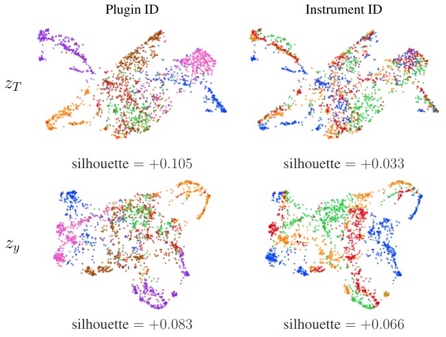

# 🚩 (2026-08-31) Scholar Inbox 추천 논문 

# 📚 Evaluating Loss Functions in Differentiable Out-of-Domain Sound-Matching with Partial Parameter Distance

🚀 URL: https://arxiv.org/html/2608.27698

## 🌏 Abstract (원문)
Inout-of-domain(OOD) sound-matching, a synthesizer is optimized to mimic a sound it did not generate. OOD evaluation of loss functions is underexplored in part because the standard “parameter loss” metric requires a shared parameter space between target and imitator, which OOD settings lack. We introduce Partial Parameter Distance (PPD), which applies parameter loss only to the critical parameters that mismatched synthesizers share (e.g., filter cutoffs), enabling automatically evaluated OOD experiments; we verify its results with blinded listening tests. Across seven scenarios involving band-pass filtering, amplitude modulation, and pitch-bending, we evaluate four differentiable loss functions (SIMSE_Spec,L1_Spec,JTFS,DTW_Envelope). Loss-function effectiveness remains tightly coupled to the method of synthesis:SIMSE_Specexcels at filter-cutoff recovery,DTW_Envelopeat amplitude-modulation recovery, andJTFSat smooth pitch trajectories. Parameter-based evaluation agrees with listening tests on the top-ranked loss function in five of seven scenarios, demonstrating its utility as a diagnostic tool.
## 🌏 Abstract (번역)
도메인 외(OOD) 사운드 매칭에서, 신시사이저는 자신이 생성하지 않은 사운드를 모방하도록 최적화됩니다. 손실 함수의 OOD 평가는 표준 "파라미터 손실" 측정항목이 타겟과 모방자 사이에 공유된 파라미터 공간을 요구하는데, OOD 설정에서는 이러한 공간이 부족하기 때문에 충분히 탐구되지 않았습니다. 우리는 불일치하는 신시사이저가 공유하는 핵심 파라미터(예: 필터 컷오프)에만 파라미터 손실을 적용하는 부분 파라미터 거리(PPD)를 도입하여, 자동으로 평가되는 OOD 실험을 가능하게 합니다. 우리는 맹검 청취 테스트를 통해 그 결과를 검증합니다. 밴드패스 필터링, 진폭 변조, 피치 벤딩을 포함하는 7가지 시나리오에 걸쳐 4가지 미분 가능한 손실 함수(SIMSE_Spec, L1_Spec, JTFS, DTW_Envelope)를 평가했습니다. 손실 함수의 효과는 합성 방법에 밀접하게 연결되어 있습니다: SIMSE_Spec은 필터 컷오프 복구에 탁월하고, DTW_Envelope는 진폭 변조 복구에, JTFS는 부드러운 피치 궤적에 탁월합니다. 파라미터 기반 평가는 7가지 시나리오 중 5가지에서 최고 순위 손실 함수에 대해 청취 테스트와 일치하여, 진단 도구로서의 유용성을 입증합니다.

## 🔍 Methods & Results
- 본 연구는 7가지 시나리오(6개 OOD, 1개 인-도메인)에서 4가지 미분 가능한 손실 함수(L1_Spec, SIMSE_Spec, JTFS, DTW_Envelope)를 평가했으며, 각 시나리오당 최소 300회의 독립적인 실험을 수행했습니다.
- L1_Spec은 로그-크기 STFT 스펙트로그램 간의 L1 거리, SIMSE_Spec은 로그-크기 STFT 스펙트로그램에 스케일 불변 평균 제곱 오차(SIMSE)를 적용하여 전역 레벨 차이에 덜 민감하게 만들었습니다.
- JTFS는 1D Joint Time-Frequency Scattering 변환에 L2 거리를 적용하여 웨이블릿 기반 시간-주파수 구조를 포착하며, DTW_Envelope는 진폭 엔벨로프(STFT의 모든 주파수 빈 합산) 간의 소프트-DTW 거리를 계산합니다.
- OOD 설정에서 전체 파라미터 비교가 불가능한 문제를 해결하기 위해, 타겟과 모방자 신시사이저 간의 핵심 지각적 대응 파라미터에만 파라미터 손실을 적용하는 부분 파라미터 거리(PPD)를 도입했습니다.
- PPD는 최적화 후 계산되며, 각 시나리오에 특화된 평가 절차로 사용되었고, 맹검 청취 테스트를 통해 PPD 결과의 유효성을 검증했습니다.
- 청취 테스트는 각 시나리오 및 손실 함수당 40쌍의 오디오를 4명의 평가자가 5점 리커트 척도로 평가하여 주된 진실값으로 사용되었습니다.
- 손실 함수의 효과는 합성 방법에 밀접하게 연관되어 있었으며, SIMSE_Spec은 필터 컷오프 복구에, DTW_Envelope는 진폭 변조 복구에, JTFS는 부드러운 피치 궤적 복구에 가장 뛰어난 성능을 보였습니다.
- 파라미터 기반 평가(PPD)는 7가지 시나리오 중 5가지에서 최고 순위 손실 함수에 대해 청취 테스트 결과와 일치하여, PPD가 진단 도구로서 유용함을 입증했습니다.

---
**Usage Info**: 3448 tokens used.
**Generated at**: 2026-08-31 19:50:09

---

# 📚 AUDITING GENERATIVE AUDIO CALLS FOR KNOWN-TASK AUDIO-LLM EVALUATION

🚀 URL: https://arxiv.org/html/2608.27817

## 🌏 Abstract (원문)
Speech and audio LLMs are often evaluated by asking whether a waveform prompt beats an automatic speech recognition (ASR) transcript. For known closed-set tasks, that comparison conflates two factors: access to acoustic evidence and the need to call a generative audio model. We evaluate this distinction as a controlled call-decision problem. For each example, a policy chooses among keeping a transcript label, using encoder evidence from Contrastive Language–Audio Pretraining (CLAP), Audio Spectrogram Transformer (AST), or WavLM, and calling Qwen2-Audio, Qwen2.5-Omni, or MOSS-Audio; the decisive ablation removes all generative actions while keeping the selector and development protocol fixed. On VocalSound, transcripts reach 0.296 accuracy, so waveform information is needed. Yet supervised CLAP and WavLM controls reach 0.850 and 0.854 with no generative audio calls. A selector with generative actions reaches 0.925 accuracy using 12.5% calls, compared with 0.921 for the matched no-call selector (paired difference 0.004; 95% CI[−0.025,0.033][-0.025,0.033]). Agreement and stacking features improve weaker selectors but do not beat the strongest no-call control. For known-task endpoint claims, the relevant quantity is the marginal value of the generative call after transcript and encoder evidence have already been used.
## 🌏 Abstract (번역)
음성 및 오디오 LLM은 종종 파형 프롬프트가 자동 음성 인식(ASR) 전사본보다 우수한지 여부를 질문함으로써 평가됩니다. 알려진 폐쇄형 작업의 경우, 이러한 비교는 음향 증거에 대한 접근과 생성형 오디오 모델 호출의 필요성이라는 두 가지 요소를 혼동합니다. 우리는 이 구분을 통제된 호출 결정 문제로 평가합니다. 각 예시에서 정책은 전사본 레이블 유지, CLAP(Contrastive Language–Audio Pretraining), AST(Audio Spectrogram Transformer) 또는 WavLM의 인코더 증거 사용, 그리고 Qwen2-Audio, Qwen2.5-Omni 또는 MOSS-Audio 호출 중에서 선택합니다. 결정적인 제거 실험은 선택기와 개발 프로토콜을 고정한 채 모든 생성형 동작을 제거합니다. VocalSound 데이터셋에서 전사본은 0.296의 정확도를 달성하여 파형 정보가 필요함을 보여줍니다. 하지만 지도 학습된 CLAP 및 WavLM 제어 모델은 생성형 오디오 호출 없이도 각각 0.850 및 0.854의 정확도를 달성합니다. 생성형 동작을 포함하는 선택기는 12.5%의 호출을 사용하여 0.925의 정확도를 달성했으며, 이는 일치하는 비호출 선택기의 0.921과 비교됩니다 (쌍별 차이 0.004; 95% 신뢰 구간 [-0.025,0.033]). 일치 및 스태킹 기능은 약한 선택기를 개선하지만, 가장 강력한 비호출 제어 모델을 능가하지는 못합니다. 알려진 작업의 최종 지점 주장에 있어, 관련 있는 양은 전사본 및 인코더 증거가 이미 사용된 후 생성형 호출의 한계 가치입니다.

## 🔍 Methods & Results
- 음성 및 오디오 LLM 평가 시 파형 프롬프트와 ASR 전사본 비교가 음향 증거 접근과 생성형 오디오 모델 호출 필요성이라는 두 요소를 혼동한다는 점을 지적했습니다.
- 이 구분을 통제된 호출 결정 문제로 평가했으며, 정책은 전사본 유지, CLAP, AST, WavLM과 같은 인코더 증거 사용, 또는 Qwen2-Audio, Qwen2.5-Omni, MOSS-Audio와 같은 생성형 모델 호출 중에서 선택합니다.
- 결정적인 제거 실험에서는 선택기와 개발 프로토콜을 고정한 채 모든 생성형 동작을 제거하여 생성형 모델의 한계 가치를 평가했습니다.
- VocalSound 데이터셋에서 전사본은 0.296의 낮은 정확도를 보여 파형 정보의 필요성을 확인했습니다.
- 지도 학습된 CLAP 및 WavLM 제어 모델은 생성형 오디오 호출 없이도 각각 0.850 및 0.854의 높은 정확도를 달성했습니다.
- 생성형 동작을 포함하는 선택기는 12.5%의 호출을 사용하여 0.925의 정확도를 달성했으며, 이는 일치하는 비호출 선택기의 0.921과 비교하여 0.004의 미미한 쌍별 차이를 보였습니다 (95% 신뢰 구간 [-0.025,0.033]).
- 일치 및 스태킹 기능은 약한 선택기를 개선했지만, 가장 강력한 비호출 제어 모델을 능가하지는 못했습니다.
- 결론적으로, 알려진 작업의 최종 지점 주장에 있어 중요한 것은 전사본 및 인코더 증거가 이미 사용된 후 생성형 호출이 가지는 한계 가치임을 밝혔습니다.

---
**Usage Info**: 3361 tokens used.
**Generated at**: 2026-08-31 19:50:23

---

# 📚 Is Prosody Lost in Translation?Fine-Grained Cross-Lingual Prosody Similarity Across Languages

🚀 URL: https://arxiv.org/html/2608.27848

## 🌏 Abstract (원문)
Prosody plays an important role in speech translation, conveying information such as emphasis, emotion, and intent beyond lexical content. However, despite recent progress in expressive speech-to-speech translation (S2ST), little is known about how prosodic patterns are similar/different across languages. Understanding these cross-lingual similarities and differences is crucial for effectively incorporating prosody into expressive S2ST systems. In this work, we present the first fine-grained cross-lingual analysis of prosody using multilingual dubbing data across English-German, English-Spanish, and English-French language pairs. We analyze the similarity of pitch, energy, and temporal feature patterns between source and target speech and investigate the linguistic and alignment-related factors affecting this similarity. Our analysis reveals inherent cross-lingual correlations in prosodic structure between certain languages. The findings provide important insights into the transferability of prosody across languages and offer empirical guidance for future expressive speech-to-speech translation systems.
## 🌏 Abstract (번역)
운율은 음성 번역에서 중요한 역할을 하며, 어휘적 내용을 넘어 강조, 감정, 의도와 같은 정보를 전달합니다. 그러나 표현력이 풍부한 음성 대 음성 번역(S2ST)의 최근 발전에도 불구하고, 운율 패턴이 언어마다 어떻게 유사하거나 다른지에 대해서는 거의 알려져 있지 않습니다. 이러한 교차 언어적 유사점과 차이점을 이해하는 것은 표현력이 풍부한 S2ST 시스템에 운율을 효과적으로 통합하는 데 중요합니다. 본 연구에서는 영어-독일어, 영어-스페인어, 영어-프랑스어 언어 쌍에 걸쳐 다국어 더빙 데이터를 사용하여 운율에 대한 최초의 세밀한 교차 언어 분석을 제시합니다. 우리는 원본 음성과 목표 음성 간의 피치, 에너지 및 시간적 특징 패턴의 유사성을 분석하고, 이 유사성에 영향을 미치는 언어적 및 정렬 관련 요인을 조사합니다. 우리의 분석은 특정 언어 간의 운율 구조에서 내재적인 교차 언어 상관관계를 밝혀냅니다. 이 연구 결과는 언어 간 운율의 전이 가능성에 대한 중요한 통찰력을 제공하고, 미래의 표현력이 풍부한 음성 대 음성 번역 시스템을 위한 실증적인 지침을 제공합니다.

## 🔍 Methods & Results
- 영어-독일어, 영어-스페인어, 영어-프랑스어 언어 쌍에 걸쳐 다국어 더빙 데이터를 활용하여 운율에 대한 최초의 세밀한 교차 언어 분석을 수행했습니다.
- 원본 음성과 목표 음성 간의 피치, 에너지 및 시간적 특징 패턴의 유사성을 분석했습니다.
- 운율 유사성에 영향을 미치는 언어적 및 정렬 관련 요인을 조사했습니다.
- 분석 결과, 특정 언어 간의 운율 구조에서 내재적인 교차 언어 상관관계가 있음을 밝혀냈습니다.
- 이 연구는 언어 간 운율의 전이 가능성에 대한 중요한 통찰력을 제공하고, 미래의 표현력이 풍부한 음성 대 음성 번역 시스템을 위한 실증적인 지침을 제시합니다.

---
**Usage Info**: 1403 tokens used.
**Generated at**: 2026-08-31 19:50:29

---

# 📚 Exploring the Design Space of Representation Learning for Audio Transformations

🚀 URL: https://arxiv.org/html/2608.28127

## 🌏 Abstract (원문)
Neural audio representation learning has enabled a range of content-oriented applications, but the resulting features remain limited for tasks involving audio processing. Furthermore, it is not obvious what processing-aware representations should capture: the processing itself, abstracted away from source content, or the processed audio that retains it. Existing approaches implicitly commit to one or the other and also differ in their models, data, and evaluation, obscuring which design choices drive their behavior. We address both questions within a unified framework of three objectives: processing consistency, description alignment, and equivariance via forward prediction. We compare all combinations of the objectives under a controlled setup and reveal their relative strengths and interactions. Our framework produces both a transformation embedding and a processed-audio embedding, and we find that the two play complementary roles: distance-based tasks favor the former, while probe-based tasks favor the latter. Combined with improvements in network architecture and training pipeline, our representations outperform prior baselines across retrieval, probe-based evaluation, and style transfer.
## 🌏 Abstract (번역)
신경망 오디오 표현 학습은 다양한 콘텐츠 지향 애플리케이션을 가능하게 했지만, 결과로 생성된 특징들은 오디오 처리와 관련된 작업에는 여전히 한계가 있습니다. 더욱이, 처리 인식 표현이 무엇을 포착해야 하는지는 명확하지 않습니다. 즉, 원본 콘텐츠와 추상화된 처리 자체를 포착해야 하는지, 아니면 원본 콘텐츠를 유지하는 처리된 오디오를 포착해야 하는지 불분명합니다. 기존 접근 방식들은 암묵적으로 둘 중 하나를 선택하며, 모델, 데이터 및 평가 방식도 달라 어떤 설계 선택이 그들의 행동을 이끄는지 불분명하게 만듭니다. 우리는 처리 일관성, 설명 정렬, 그리고 전방 예측을 통한 등변성이라는 세 가지 목표를 가진 통합 프레임워크 내에서 두 가지 질문을 모두 다룹니다. 우리는 통제된 환경에서 목표들의 모든 조합을 비교하고 그들의 상대적인 강점과 상호작용을 밝혀냅니다. 우리의 프레임워크는 변환 임베딩과 처리된 오디오 임베딩을 모두 생성하며, 이 둘이 상호 보완적인 역할을 한다는 것을 발견했습니다. 즉, 거리 기반 작업은 전자를 선호하고, 프로브 기반 작업은 후자를 선호합니다. 네트워크 아키텍처 및 훈련 파이프라인 개선과 결합하여, 우리의 표현은 검색, 프로브 기반 평가 및 스타일 전송 전반에 걸쳐 이전 기준선보다 뛰어난 성능을 보입니다.

## 🔍 Methods & Results
- 처리 일관성, 설명 정렬, 전방 예측을 통한 등변성이라는 세 가지 목표를 가진 통합 프레임워크를 제안하여 오디오 처리 인식 표현에 대한 질문을 해결했습니다.
- 통제된 환경에서 세 가지 목표의 모든 조합을 비교하여 각 목표의 상대적 강점과 상호작용을 분석했습니다.
- 제안된 프레임워크는 변환 임베딩(transformation embedding)과 처리된 오디오 임베딩(processed-audio embedding)을 모두 생성합니다.
- 변환 임베딩은 거리 기반 작업에 유리하고, 처리된 오디오 임베딩은 프로브 기반 작업에 유리하여 상호 보완적인 역할을 수행함을 발견했습니다.
- 개선된 네트워크 아키텍처 및 훈련 파이프라인과 결합하여, 우리의 표현은 검색, 프로브 기반 평가 및 스타일 전송에서 기존 기준선보다 우수한 성능을 달성했습니다.

## 🖼 Figures

*Figure 3:UMAP visualizations of embeddings.*

---
**Usage Info**: 1384 tokens used.
**Generated at**: 2026-08-31 19:50:35

---

# 📚 Multirate State Space Models for End-to-End Processing of Pulse Density Modulated Speech Signals

🚀 URL: https://arxiv.org/html/2608.28472

## 🌏 Abstract (원문)
Deep neural networks (DNNs) based on state-space models (SSMs) are increasingly applied to speech processing, but typically operate on pulse-code-modulated (PCM) audio. This constrains deployment on low-power, always-on edge devices, which commonly use single-bit pulse-density-modulated (PDM) micro-electromechanical (MEMS) microphones for their noise robustness, low cost, and variable sampling rates that enable low-power operation. In fact, converting PDM to PCM requires low-pass filtering and decimation, imposing costly overhead on resource-constrained hardware. While prior works have attempted to process PDM signals directly, they require long training times and generalize poorly across sampling rates. In this paper, we show that the SSM has two key properties that remediate these issues: its continuous-time parametrization allows it to produce a consistent representation of the input audio signal, regardless of the modulation strategy and sampling rate, and its long-term memory enables this representation to be aggressively downsampled without needing any anti-aliasing operations. We then propose a novel end-to-end PDM speech processing architecture that uses an SSM to encode the input audio signal into a modulation- and sampling-rate-invariant latent representation. We show that our proposed architecture achieves robust speech classification and enhancement gains at low-power sampling-rates (512kHz512\text{\,}\mathrm{kHz}) and similar performance to state-of-the-art algorithms operating on PCM data when tested on standard PDM sampling-rates of2MHz2\text{\,}\mathrm{MHz}. Moreover, we show that the SSM’s output can be downsampled by more than 65,000 times, thus significantly reducing the number of processing timesteps in downstream layers.
## 🌏 Abstract (번역)
심층 신경망(DNN) 기반의 상태 공간 모델(SSM)은 음성 처리에 점차 많이 적용되고 있지만, 일반적으로 펄스 코드 변조(PCM) 오디오에서 작동합니다. 이는 저전력 상시 작동 에지 장치에 배포하는 데 제약을 가하는데, 이러한 장치는 노이즈 강건성, 저비용 및 저전력 작동을 가능하게 하는 가변 샘플링 속도 때문에 일반적으로 단일 비트 펄스 밀도 변조(PDM) MEMS 마이크를 사용합니다. 실제로 PDM을 PCM으로 변환하려면 저역 통과 필터링 및 데시메이션이 필요하며, 이는 자원 제약이 있는 하드웨어에 비용이 많이 드는 오버헤드를 부과합니다. 이전 연구들은 PDM 신호를 직접 처리하려고 시도했지만, 긴 훈련 시간이 필요하고 샘플링 속도 전반에 걸쳐 일반화가 잘 되지 않았습니다. 본 논문에서는 SSM이 이러한 문제를 해결하는 두 가지 핵심 속성을 가지고 있음을 보여줍니다. 첫째, 연속 시간 매개변수화는 변조 전략 및 샘플링 속도에 관계없이 입력 오디오 신호의 일관된 표현을 생성할 수 있게 하며, 둘째, 장기 기억은 이 표현을 안티앨리어싱 작업 없이도 공격적으로 다운샘플링할 수 있게 합니다. 이어서, SSM을 사용하여 입력 오디오 신호를 변조 및 샘플링 속도 불변 잠재 표현으로 인코딩하는 새로운 종단 간 PDM 음성 처리 아키텍처를 제안합니다. 제안된 아키텍처가 저전력 샘플링 속도(512kHz)에서 강건한 음성 분류 및 향상 이득을 달성하고, 표준 PDM 샘플링 속도(2MHz)에서 테스트했을 때 PCM 데이터에서 작동하는 최첨단 알고리즘과 유사한 성능을 보임을 보여줍니다. 또한, SSM의 출력이 65,000배 이상 다운샘플링될 수 있어 하위 계층의 처리 시간 단계를 크게 줄일 수 있음을 보여줍니다.

## 🔍 Methods & Results
- PDM 데이터를 직접 처리하고 다양한 OSR(OverSampling Ratio)에서 PCM 데이터로 훈련된 모델이 최소한의 성능 손실로 작동할 수 있는 아키텍처를 제안한다.
- SSM 인코더 계층을 사용하여 변조 형식 및 샘플링 속도에 불변하는 표현을 생성하여, 하위 네트워크가 단일 통합 표현으로만 작동하도록 한다.
- SSM(FouT, LegT)은 PCM Nyquist 주파수 이하의 주파수를 주로 인코딩하여 PDM 및 PCM 입력에 대해 유사한 응답을 보인다.
- SSM의 연속 시간(CT) 메모리 윈도우를 활용하여 PDM 계수 시퀀스를 PCM 계수 시퀀스와 동일한 속도로 다운샘플링할 수 있으며, 이때 안티앨리어싱 작업이 필요 없다 (K_PDM = OSR).
- PCM 계수 시퀀스도 Nyquist 속도 이하로 다운샘플링하여 하위 모듈의 연산 수를 추가로 줄일 수 있으며, PDM 계수는 K_PDM = K_PCM × OSR 비율로 다운샘플링하여 인코더 출력 속도를 일관되게 유지한다.
- 제안된 아키텍처는 SSM 인코더가 입력 음성 신호를 SSM 계수 시퀀스로 매핑하며, 이를 키워드 스포팅을 위한 분류기 또는 음성 향상을 위한 DNN으로 전달한다.
- 음성 향상 시, DNN은 깨끗한 음성 SSM 계수를 예측하고, 이를 PCM 속도로 샘플링된 SSM 기저 함수에 투영하여 시간 도메인 프레임을 생성한 후 중첩-추가(OLA) 방식으로 전체 파형을 재구성한다.
- 제안된 아키텍처는 저전력 샘플링 속도(512kHz)에서 강건한 음성 분류 및 향상 성능을 달성하며, 표준 PDM 샘플링 속도(2MHz)에서는 최첨단 PCM 기반 알고리즘과 유사한 성능을 보인다.
- SSM의 출력을 65,000배 이상 다운샘플링할 수 있어 하위 계층의 처리 시간 단계를 크게 줄일 수 있음을 입증했다.

## 🖼 Figures

*Fig. 1:Comparison of a PCM encoded signal (top) and the same PDM encoded signal (middle and bottom). The orange overlay on the PDM data represents the low-pass-filtered PDM and demonstrates that the PCM baseband is preserved in the low-frequency range of the PDM. The low-pass was created using a 128-tap FIR filter with a cutoff frequency of 
7.5
 
kHz
. The bottom plot shows a 
200
 
µ
​
𝑠
 zoom of the PDM encoded signal.*

*Fig. 2:Comparison of the PDM and PCM power spectral densities (PSD) for a 1-second speech segment. The black dotted line represents the PCM Nyquist frequency of 
8
 
kHz
, i.e., the maximum frequency present in the signal. The pink line represents the PCM PSD.*

![Fig. 3:Demonstration of the basis functions and the memory windows of the FouT, LegT, and LegS SSMs. The SSMs all have a state dimension 
𝐻
 of 1024 and a discretization step 
Δ
 of 0.001 (
16
 
kHz
 sampling rate). The FouT and the LegT SSMs have a memory window size 
𝜃
 of 
250
 
ms
 (4000 samples at 
16
 
kHz
). a) The first 4 basis functions used by FouT, LegT, and LegS. b) The reconstruction capabilities of the three initializations. The memory window length is denoted by the green overlay, and the original and reconstructed signals are represented by the blue and orange lines, respectively. The original signal is a 
16
 
kHz
 speech signal lowpassed using a 1024-tap FIR filter with a cutoff frequency of 
100
 
Hz
 for visualization purposes.](../images/2026-08-31/2608.28472/2608.28472_fig2.png)
*Fig. 3:Demonstration of the basis functions and the memory windows of the FouT, LegT, and LegS SSMs. The SSMs all have a state dimension 
𝐻
 of 1024 and a discretization step 
Δ
 of 0.001 (
16
 
kHz
 sampling rate). The FouT and the LegT SSMs have a memory window size 
𝜃
 of 
250
 
ms
 (4000 samples at 
16
 
kHz
). a) The first 4 basis functions used by FouT, LegT, and LegS. b) The reconstruction capabilities of the three initializations. The memory window length is denoted by the green overlay, and the original and reconstructed signals are represented by the blue and orange lines, respectively. The original signal is a 
16
 
kHz
 speech signal lowpassed using a 1024-tap FIR filter with a cutoff frequency of 
100
 
Hz
 for visualization purposes.*

*Fig. 4:Our proposed SSM encoder layer. The SSM is responsible for creating a modulation- and sampling-rate-invariant representation of the input signal. To do so, it encodes the input data as a sequence of SSM coefficient vectors, then downsamples them from the variable-OSR PDM rate to a fixed rate by retaining one coefficient vector every 
𝐾
=
𝑂
​
𝑆
​
𝑅
 time steps.*

*Fig. 5:The frequency spectra of the FouT (a) and LegT (b) basis-functions for an SSM with 
𝜃
=
 
2
 
ms
, 
𝐻
=
32
. The black dotted line represents the 
16
 
kHz
 PCM Nyquist frequency. For each SSM, the frequency spectrum was obtained by sampling each basis function at 1,000,000 uniformly distributed points over its domain and performing a 2,000,000-point DT Fourier transform.*

![Fig. 6:Comparison of the magnitude of the FouT coefficients SSM for a PCM and PDM input with 
𝑂
​
𝑆
​
𝑅
=
64
. The FouT SSM used a state dimension 
𝐻
 of 128 and a memory window size 
𝜃
 of 
8
 
ms
. The discretization step was set to 
Δ
=
1
/
16,000
 and 
Δ
=
1
/
1,024,000
 for the PCM and PDM inputs respectively. a) The SSM coefficients sampled at the PCM rate, b) The SSM coefficients sampled at the PDM rate, and c) the SSM coefficients sampled at the PDM rate, then downsampled to the PCM rate by keeping only each 64th coefficient vector.](../images/2026-08-31/2608.28472/2608.28472_fig5.png)
*Fig. 6:Comparison of the magnitude of the FouT coefficients SSM for a PCM and PDM input with 
𝑂
​
𝑆
​
𝑅
=
64
. The FouT SSM used a state dimension 
𝐻
 of 128 and a memory window size 
𝜃
 of 
8
 
ms
. The discretization step was set to 
Δ
=
1
/
16,000
 and 
Δ
=
1
/
1,024,000
 for the PCM and PDM inputs respectively. a) The SSM coefficients sampled at the PCM rate, b) The SSM coefficients sampled at the PDM rate, and c) the SSM coefficients sampled at the PDM rate, then downsampled to the PCM rate by keeping only each 64th coefficient vector.*

*Fig. 7:Our proposed PDM processing architecture. The SSM encoder layer is responsible for creating a modulation- and sampling-rate-invariant representation of the input signal. This representation can then be sent to a downstream DNN, which can be either a classifier for the keyword spotting task or a speech enhancement DNN. In the speech enhancement task, the predicted coefficients are used to reconstruct a clean time-domain PCM waveform.*

*Fig. 8:Effect of 
𝐻
 and 
𝜃
 on the classification results on the Google Speech Commands test set encoded using a single-bit second-order 
Σ
​
Δ
 modulator with an OSR of 128 (
2
 
MHz
). For both SSM families, the decimation factor 
𝐾
𝑃
​
𝐷
​
𝑀
 was fixed at a value of 128, the window size 
𝜃
 was varied from 
2
 
−
32
 
ms
, and the state dimension 
𝐻
 was varied from 32 to 512.*

*Fig. 9:Effect of 
𝐾
𝑃
​
𝐷
​
𝑀
 and 
𝜃
¯
𝑃
​
𝐷
​
𝑀
 on the classification results on the Google Speech Commands test set encoded using a single-bit second-order 
Σ
​
Δ
 modulator with an OSR of 128 (
2
 
MHz
). For both SSM families, the decimation factor was varied from 128-65536, and the window size 
𝜃
¯
𝑃
​
𝐷
​
𝑀
 was varied from 4,096-65,536 (
2
 
−
32
 
ms
). The state dimension 
𝐻
 was fixed at 128.*

*Fig. 10:The performance of the LegT SSM with 
𝜃
=
 
2
 
ms
 and 
𝐻
=
32
 on the Google Speech Commands test set encoded using a single-bit second-order 
Σ
​
Δ
 modulator with OSRs varying from 8-128 (
128
 
kHz
-
2
 
MHz
). The horizontal dotted line indicates the test-time accuracy of 93.53%, which was obtained on the PCM data.*

![Fig. 11:Effect of 
𝜃
 and 
𝐻
 on speech enhancement performance on the VoiceBank+DEMAND test set. For both SSM families, the decimation factor 
𝐾
𝑃
​
𝐷
​
𝑀
 was fixed at 128, the window size 
𝜃
 was varied from 
2
 
ms
 to 
32
 
ms
, and the state dimension H was varied from 32 to 512. The number at the top represents the PESQ score for a given combination, and the number at the bottom represents the STOI score. a) The results obtained on the test set encoded using a single-bit second-order 
Σ
​
Δ
 modulator with an OSR of 128 (
2
 
MHz
). b) The results obtained on test set encoded using 
16
 
kHz
 PCM.](../images/2026-08-31/2608.28472/2608.28472_fig10.png)
*Fig. 11:Effect of 
𝜃
 and 
𝐻
 on speech enhancement performance on the VoiceBank+DEMAND test set. For both SSM families, the decimation factor 
𝐾
𝑃
​
𝐷
​
𝑀
 was fixed at 128, the window size 
𝜃
 was varied from 
2
 
ms
 to 
32
 
ms
, and the state dimension H was varied from 32 to 512. The number at the top represents the PESQ score for a given combination, and the number at the bottom represents the STOI score. a) The results obtained on the test set encoded using a single-bit second-order 
Σ
​
Δ
 modulator with an OSR of 128 (
2
 
MHz
). b) The results obtained on test set encoded using 
16
 
kHz
 PCM.*

*Fig. 12:The frequency spectra of the basis vectors for both the FouT (left) and LegT (right) SSMs with 
𝐻
=
32
 and using window lengths of 
2
 
ms
 (top), 
8
 
ms
 (middle), and 
32
 
ms
 (bottom). The black dotted line represents the PCM Nyquist frequency of 
8
 
kHz
.*

*Fig. 13:Effect of the overlap and the memory window length 
𝜃
¯
𝑃
​
𝐷
​
𝑀
 on speech enhancement performance on the VoiceBank+DEMAND test set encoded using a single-bit second-order 
Σ
​
Δ
 modulator with an OSR of 128 (
2
 
MHz
). For both SSM families, the overlap was varied from 0-87.5% and 
𝜃
¯
𝑃
​
𝐷
​
𝑀
 was varied from 4,096 to 65,536.*

*Fig. 14:The performance of the FouT SSM with a 
2
 
ms
 window size, a state dimension of 32, and an overlap of 75% on the VoiceBank+DEMAND test set encoded using a single-bit second-order 
Σ
​
Δ
 modulator with a OSRs varying from 8-128 (
128
 
kHz
-
2
 
MHz
). The black dotted lines represent the PESQ/STOI scores of 2.0 and 0.92 obtained by comparing the noisy speech versus the clean speech on the same test set.*

---
**Usage Info**: 3463 tokens used.
**Generated at**: 2026-08-31 19:50:48

---

