# 🚩 (2026-09-02) Scholar Inbox 추천 논문 

# 📚 TUTTI: Toward generalizable audio-to-score transcription via fully synthesized data

🚀 URL: https://arxiv.org/html/2609.00640

## 🌏 Abstract (원문)
Generalizable Audio-to-Score (A2S) transcription is fundamentally constrained by the severe scarcity of high-quality, real-world paired data. Relying solely on existing human-annotated datasets often restricts the generalization of A2S models, limiting their efficacy primarily to single-instrumentation domains. To break this dependency on scarce real-world data, we introduceTUTTI(Transformer forUnified audio-To-scoreTranscription trained on Synthetic multi-Instrumentation Data), a pre-training paradigm driven by a purely synthetic, large-scale dataset. Rather than using human-composed scores, we leverage a symbolic music generation model to generate a massive, highly scalable multi-instrumentation corpus and create audio-score pairs with expressive acoustic characteristics. Capitalizing on the generated data, we employ a standard Transformer encoder-decoder architecture. We empirically demonstrate that pre-training a unified attention-based model on generated, multi-instrumentation data yields a consistently stronger foundational representation than single-instrumentation training. When fine-tuned with downstream real-world datasets, TUTTI outperforms previous approaches, establishing new overall state-of-the-art results across various A2S baselines. Notably, TUTTI shows remarkable cross-instrument transferability, effectively adapting to unseen instruments with highly competitive performance. The source code and the TuttiCorpus dataset will be made publicly available athttps://github.com/a-musiclover/TUTTI.
## 🌏 Abstract (번역)
일반화 가능한 오디오-악보(A2S) 전사는 고품질의 실제 페어링 데이터가 극히 부족하다는 근본적인 제약이 있습니다. 기존의 사람이 주석을 단 데이터셋에만 의존하는 것은 A2S 모델의 일반화를 제한하여, 주로 단일 악기 영역으로 그 효과를 한정시킵니다. 부족한 실제 데이터에 대한 이러한 의존성을 깨기 위해, 우리는 순수하게 합성된 대규모 데이터셋에 의해 구동되는 사전 학습 패러다임인 TUTTI(Transformer for Unified audio-To-score Transcription trained on Synthetic multi-Instrumentation Data)를 소개합니다. 사람이 작곡한 악보를 사용하는 대신, 우리는 심볼릭 음악 생성 모델을 활용하여 방대한 양의 확장 가능한 다중 악기 코퍼스를 생성하고, 표현력이 풍부한 음향 특성을 가진 오디오-악보 쌍을 만듭니다. 생성된 데이터를 활용하여, 우리는 표준 트랜스포머 인코더-디코더 아키텍처를 사용합니다. 우리는 생성된 다중 악기 데이터로 통합된 어텐션 기반 모델을 사전 학습하는 것이 단일 악기 학습보다 일관되게 더 강력한 기초 표현을 생성한다는 것을 경험적으로 입증합니다. 실제 다운스트림 데이터셋으로 미세 조정했을 때, TUTTI는 이전 접근 방식들을 능가하며 다양한 A2S 기준에서 새로운 전반적인 최첨단 결과를 확립합니다. 특히, TUTTI는 뛰어난 악기 간 전이성을 보여주며, 보지 못했던 악기에도 매우 경쟁력 있는 성능으로 효과적으로 적응합니다. 소스 코드와 TuttiCorpus 데이터셋은 https://github.com/a-musiclover/TUTTI에서 공개될 예정입니다.

## 🔍 Methods & Results
- TUTTI는 고품질의 실제 데이터 부족 문제를 해결하기 위해 순수하게 합성된 대규모 다중 악기 데이터셋을 활용하는 사전 학습 패러다임을 제안합니다.
- 사람이 작곡한 악보 대신 심볼릭 음악 생성 모델을 사용하여 방대하고 확장 가능한 다중 악기 코퍼스를 생성하고, 표현력이 풍부한 오디오-악보 쌍을 만듭니다.
- A2S 전사를 위해 트랜스포머 네트워크 기반의 인코더-디코더 아키텍처를 사용하며, 계층적 바-스트림 패치 전략과 ABC 표기법을 채택하여 구조화되고 효율적인 심볼릭 음악 표현을 구현합니다.
- 모델은 원시 오디오를 스펙트로그램으로 변환한 후, 음향 어댑터를 통해 512차원의 연속 임베딩으로 선형 투영하여 트랜스포머 인코더의 입력으로 사용합니다.
- 음향 수준 인코더는 연속 임베딩 시퀀스에서 고수준의 음향 및 화성적 맥락을 추출합니다.
- 교차 모달 패치 수준 디코더는 계층적 디코딩 전략을 사용하여 음악 악보의 구조를 처리하고, 인코딩된 음향 특징 임베딩을 입력으로 받아 다음 예측될 마디에 대한 밀집된 맥락적 표현을 출력합니다.
- 문자 수준 디코더는 패치 수준 디코더의 맥락적 표현을 조건 벡터로 사용하여, 해당 패치 내의 특정 음악 토큰(문자)을 자동 회귀적으로 디코딩하여 ABC 표기법으로 최종 변환합니다.
- 이 계층적 설계는 전역적인 오디오-마디 정렬과 지역적인 마디-문자 생성을 효과적으로 분리하여 구조적 일관성과 구문적 정확성을 보장합니다.
- 생성된 다중 악기 데이터로 통합된 어텐션 기반 모델을 사전 학습하는 것이 단일 악기 학습보다 일관되게 더 강력한 기초 표현을 생성함을 경험적으로 입증했습니다.
- 실제 다운스트림 데이터셋으로 미세 조정했을 때, TUTTI는 이전 접근 방식들을 능가하며 다양한 A2S 기준에서 새로운 최첨단 결과를 달성했습니다.
- TUTTI는 뛰어난 악기 간 전이성을 보여주며, 보지 못했던 악기에도 매우 경쟁력 있는 성능으로 효과적으로 적응합니다.

## 🖼 Figures
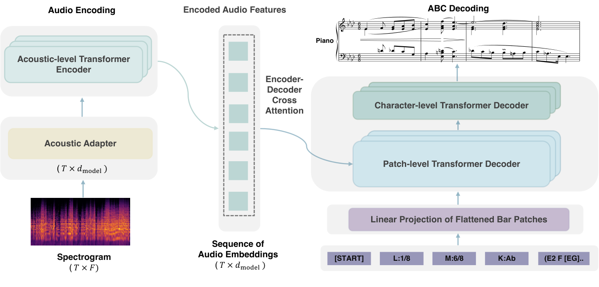
*Figure 1:Architectural overview of TUTTI. The model bridges the gap between continuous audio spectrograms and discrete symbolic scores through a Transformer encoder and a hierarchical decoder.*

---
**Usage Info**: 4360 tokens used.
**Generated at**: 2026-09-02 17:35:20

---

# 📚 Ready to Speak: Aligning LLMs for TTS-Friendly Text Generation

🚀 URL: https://arxiv.org/html/2609.01246

## 🌏 Abstract (원문)
Current Large Language Models (LLMs) are primarily optimized for written text, often producing outputs that are grammatically correct and helpful yet poorly suited for spoken delivery via Text-to-Speech (TTS). In this work, we study how to make LLMs natively generate TTS-friendly text, which we frame as a preference alignment problem: instead of relying on downstream rewriting modules, we directly align LLMs to generate text optimized for spoken delivery. We introduce two preference datasets spanning different target domains, CORA and Recipe, which contain paired TTS-friendly and TTS-unfriendly responses. We further propose an evaluation suite combining a pattern-based heuristic metric, a TTS→ASR evaluation pipeline, and a MUSHRA listening study with human judges. Our experiments compare the recently proposed Feature-aware Sampling and Tuning (FaST) framework – leveraging interpretable features instead of a black-box reward model – against an array of alignment baselines on the TTS-friendly generation task. Notably, we found that FaST achieves the best overall tradeoff between TTS-friendliness and helpfulness across various settings. We also identified a strong correlation between our different metrics, highlighting the ability to reliably assess TTS-friendliness via an efficient heuristic.
## 🌏 Abstract (번역)
현재 대규모 언어 모델(LLM)은 주로 서면 텍스트에 최적화되어 있으며, 문법적으로 정확하고 유용하지만 텍스트 음성 변환(TTS)을 통한 음성 전달에는 적합하지 않은 출력을 생성하는 경우가 많습니다. 본 연구에서는 LLM이 TTS 친화적인 텍스트를 자체적으로 생성하도록 하는 방법을 연구하며, 이를 선호도 정렬 문제로 정의합니다. 즉, 후속 재작성 모듈에 의존하는 대신, LLM을 음성 전달에 최적화된 텍스트를 생성하도록 직접 정렬합니다. 우리는 CORA와 Recipe라는 두 가지 다른 대상 도메인에 걸쳐 TTS 친화적 및 TTS 비친화적 응답 쌍을 포함하는 두 가지 선호도 데이터셋을 소개합니다. 또한, 패턴 기반 휴리스틱 측정, TTS→ASR 평가 파이프라인, 그리고 인간 평가자가 참여하는 MUSHRA 청취 연구를 결합한 평가 스위트를 제안합니다. 우리의 실험은 최근 제안된 Feature-aware Sampling and Tuning (FaST) 프레임워크(블랙박스 보상 모델 대신 해석 가능한 특징을 활용)를 TTS 친화적 생성 작업에서 다양한 정렬 기준선과 비교합니다. 특히, FaST가 다양한 설정에서 TTS 친화성과 유용성 사이에서 전반적으로 최고의 절충점을 달성한다는 것을 발견했습니다. 또한, 우리는 다양한 측정 지표들 간의 강한 상관관계를 확인했으며, 이는 효율적인 휴리스틱을 통해 TTS 친화성을 안정적으로 평가할 수 있는 능력을 강조합니다.

## 🔍 Methods & Results
- TTS 친화적 텍스트 생성을 선호도 정렬 문제로 정의하고, LLM이 TTS 시스템을 위한 음성 전달에 최적화된 응답을 생성하며 유용성을 유지하도록 목표를 설정했습니다.
- 전통적인 보상 모델 대신, 해석 가능한 고수준 특징과 경량 보상 공식을 활용하는 Feature-aware Sampling and Tuning (FaST) 프레임워크를 채택했습니다.
- FaST 채택의 동기는 TTS 친화성에 영향을 미치는 속성들이 명시적 특징으로 설명 가능하고, TTS 친화성이 다목적이며, 대규모 선호도 데이터셋 확보가 어렵다는 점에 있습니다.
- FaST는 (i) 특징 발견, (ii) 특징별 응답 점수화, (iii) 특징 가중치 학습, (iv) 샘플링 및 튜닝 정렬의 네 단계로 작동합니다.
- 특징 발견 단계에서는 LLM 프롬프팅을 통해 선호도 데이터셋에서 고수준 특징을 자동 발견하여 텍스트의 스타일 및 구조적 특성을 포착합니다.
- 특징별 응답 점수화 단계에서는 LLM 기반 특징 함수를 사용하여 각 응답을 각 특징 차원별로 1~5점 척도로 독립적으로 점수화하며, 이 함수는 고정되어 학습이 필요 없습니다.
- 특징 가중치 학습 단계에서는 Feature-aware Reward Model (FaRM)을 특징 함수의 선형 조합으로 정의하고, 선호도 주석에서 특징 가중치를 학습하여 선호되는 응답에 더 높은 보상을 할당합니다. FaRM은 적은 수의 학습 파라미터와 높은 해석 가능성을 가집니다.
- 샘플링 및 튜닝 정렬 단계에서는 LLM이 고보상 출력을 생성하도록 미세 조정합니다. 모델이 여러 후보 응답을 샘플링하고, FaRM으로 순위를 매긴 후, 가장 높은 순위의 응답을 사용하여 DPO 또는 RFT를 통해 생성 모델을 미세 조정합니다.
- 기준선으로 Zeroshot, Prompting, SFT, DPO, GRPO-RM, RFT-RM을 비교했으며, Oracle은 달성 가능한 성능의 상한선으로 사용되었습니다.
- 실험 결과, FaST가 다양한 설정에서 TTS 친화성과 유용성 사이에서 전반적으로 최고의 절충점을 달성했으며, 다양한 측정 지표들 간의 강한 상관관계를 통해 효율적인 휴리스틱으로 TTS 친화성을 안정적으로 평가할 수 있음을 확인했습니다.

## 🖼 Figures
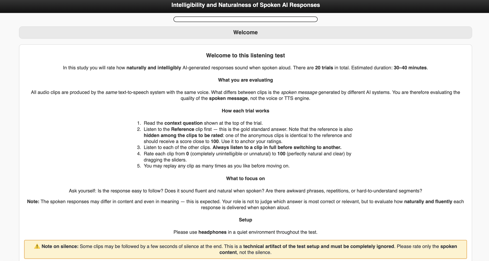
*Figure 3:Welcome and instructions page shown to participants at the start of the MUSHRA listening test.*

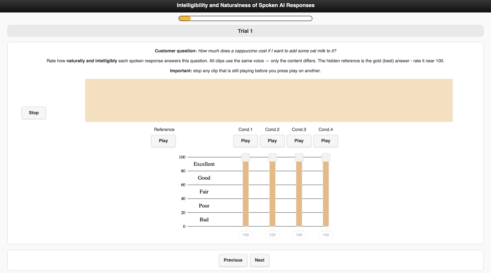
*Figure 4:Example MUSHRA trial. The question from CORA is shown at the top; the labeled Reference (Oracle) clip is on the left; the four anonymous, shuffled conditions (Prompting, DPO, FaST, and hidden Oracle) are rated on 0–100 sliders.*

*Figure 5:Per-trial Heuristic (rescaled to 0–100) and Human MUSHRA mean score across the 20 utterances of the listening study, one panel per system. The Spearman 
𝜌
 between the two series is reported in each panel; dotted lines show the per-system means across the 20 trials.*

*Figure 6:Comparison of generation approaches on the tradeoff between TTS-Friendliness and Helpfulness (top-right is better). The base model used is SmolLM3-3B. To improve readability, the x-axis and y-axis have been adjusted for each plot based on visible data points; they are not identical across the full-set and 10-sample settings.*

*Figure 11*

*Figure 12*

*Figure 13*

*Figure 14*

---
**Usage Info**: 4540 tokens used.
**Generated at**: 2026-09-02 17:35:33

---

# 📚 Decoupled Latent Flow Matching for Few-Step Joint Vocal-Accompaniment Separation

🚀 URL: https://arxiv.org/html/2608.30913

## 🌏 Abstract (원문)
Generative modeling provides a flexible way to model mixture-conditioned source distributions, but iterative diffusion and flow matching models are costly for long music signals. This paper studies joint vocal-accompaniment separation through latent flow matching, where a pretrained variational autoencoder (VAE) maps mixtures and sources into a compact latent space and a flow matching model generates vocal and accompaniment latents jointly. The proposed framework decouples semantic separation from acoustic velocity prediction through a Separation Encoder and a Velocity Decoder. To reduce sampling cost, we further apply latent adversarial post-training inspired by Flow2GAN for few-step generation. Experiments show that latent adversarial refinement can improve perceptual and separation metrics under a reduced sampling budget.
## 🌏 Abstract (번역)
생성 모델링은 혼합 조건부 소스 분포를 모델링하는 유연한 방법을 제공하지만, 반복적인 확산 및 플로우 매칭 모델은 긴 음악 신호에 대해 비용이 많이 듭니다. 본 논문은 잠재 플로우 매칭을 통한 보컬-반주 동시 분리를 연구하며, 여기서 사전 학습된 변분 오토인코더(VAE)는 혼합 신호와 소스를 압축된 잠재 공간으로 매핑하고, 플로우 매칭 모델은 보컬 및 반주 잠재 표현을 동시에 생성합니다. 제안된 프레임워크는 분리 인코더(Separation Encoder)와 속도 디코더(Velocity Decoder)를 통해 의미론적 분리를 음향 속도 예측과 분리합니다. 샘플링 비용을 줄이기 위해, 우리는 Flow2GAN에서 영감을 받은 잠재 적대적 사후 훈련을 소수 단계 생성에 적용합니다. 실험 결과, 잠재 적대적 개선이 감소된 샘플링 예산 하에서 지각 및 분리 지표를 향상시킬 수 있음을 보여줍니다.

## 🔍 Methods & Results
- 제안된 프레임워크는 잠재 인코딩, 공동 소스-잠재 생성, 의미-음향 디커플링, 잠재 적대적 사후 훈련을 포함합니다.
- 사전 학습된 VAE의 잠재 공간에서 소스 분리를 공동 생성 모델링으로 공식화하며, 혼합 신호와 소스를 압축된 잠재 표현(Z_mix, Z_s)으로 매핑합니다.
- 가우시안 노이즈(Z_0)에서 목표 소스 잠재 표현(Z_1)으로의 변환을 모델링하는 공동 플로우를 학습하며, 혼합 잠재 표현(Z_mix)에 조건화되고 플로우 매칭 목적 함수(L_FM)를 사용합니다.
- DiT 기반 플로우 매칭 모델을 분리 인코더(소스별 표현 추출)와 속도 디코더(음향 속도 필드 예측)로 분해하여 의미론적 분리와 음향 속도 예측을 분리합니다.
- 분리 인코더가 보컬 관련 의미 정보를 포착하도록, 사전 학습된 MERT 모델의 프레임 수준 임베딩(12번째 레이어)과 분리 인코더의 숨겨진 표현을 정렬하는 표현 정렬(REPA) 기법을 사용하며, 정렬 손실(L_REPA)을 정의합니다.
- 최종 훈련 목적 함수는 플로우 매칭과 표현 정렬 목적 함수를 결합합니다: L = L_FM + λ_REPA * L_REPA.
- 적은 단계 생성의 품질을 향상시키고 샘플링 비용을 줄이기 위해 Flow2GAN 스타일의 잠재 적대적 사후 훈련을 적용합니다.
- 보컬 및 반주 소스 잠재 표현 모두에 대해 단일 공유 1D 컨볼루션 판별자(D_phi)를 사용하며, LSGAN 목적 함수(L_D)로 훈련합니다.
- 생성기는 적대적 손실(L_G_adv)과 잠재 재구성 제약(L_l1)을 사용하여 훈련되며, 전체 생성기 목적 함수는 L_G = L_G_adv + λ_l1 * L_l1 입니다.
- 각 목표 샘플링 단계 N에 대해 N-단계 생성기(G_theta^N)를 훈련하여, 중간 상태와 최종 출력을 모두 종단 간 최적화하여 생성 품질과 샘플링 효율성 간의 균형을 맞춥니다.
- 실험 결과, 잠재 적대적 개선이 감소된 샘플링 예산 하에서 지각 및 분리 지표를 향상시킬 수 있음을 보여주었습니다.

## 🖼 Figures
![Figure 1:Overview of the proposed framework. (A) A frozen VAE encodes the mixture and target sources into 
𝒁
mix
 and the joint source latent 
𝒁
1
. (B) The Separation Encoder extracts source-specific conditioning 
𝒄
 and is aligned, via 
ℒ
REPA
, with frozen MERT embeddings of the isolated vocal stem. The Velocity Decoder predicts the joint vocal-accompaniment velocity 
𝒖
𝜃
 on the interpolated latent 
𝒁
𝑡
 under 
ℒ
FM
. (C) An 
𝑁
-step sampler 
𝐺
𝜃
𝑁
 generates source latents, which a shared latent discriminator 
𝐷
𝜙
 refines with 
ℒ
𝐺
. (D) A frozen VAE decoder maps the generated latents to vocal and accompaniment waveforms.](../images/2026-09-02/2608.30913/2608.30913_fig0.png)
*Figure 1:Overview of the proposed framework. (A) A frozen VAE encodes the mixture and target sources into 
𝒁
mix
 and the joint source latent 
𝒁
1
. (B) The Separation Encoder extracts source-specific conditioning 
𝒄
 and is aligned, via 
ℒ
REPA
, with frozen MERT embeddings of the isolated vocal stem. The Velocity Decoder predicts the joint vocal-accompaniment velocity 
𝒖
𝜃
 on the interpolated latent 
𝒁
𝑡
 under 
ℒ
FM
. (C) An 
𝑁
-step sampler 
𝐺
𝜃
𝑁
 generates source latents, which a shared latent discriminator 
𝐷
𝜙
 refines with 
ℒ
𝐺
. (D) A frozen VAE decoder maps the generated latents to vocal and accompaniment waveforms.*

---
**Usage Info**: 3929 tokens used.
**Generated at**: 2026-09-02 17:35:43

---

# 📚 U-PAST: A Phase-Aware Audio Spectrogram Transformer-U-Net for Single-Channel Speech Enhancement

🚀 URL: https://arxiv.org/html/2609.00431

## 🌏 Abstract (원문)
Convolutional neural networks (CNNs), used widely and successfully in audio enhancement, capture long-range time-frequency dependencies only indirectly, through successive convolution and pooling. Here, we present U-PAST, a hybrid transformer-U-Net architecture that addresses this limitation through self-attention dependency-modeling in the complex spectrogram domain. U-PAST tokenizes a complex STFT representation, similarly to the magnitude spectrogram tokenization of the Audio Spectrogram Transformer (AST), applies a multi-layer transformer encoder, and reconstructs the enhanced complex spectrogram with a U-Net-style decoder. We evaluate four architectural variants with between 1.17M and 2.40M parameters on the DNS Challenge, VoiceBank-DEMAND, and LibriMix corpora under matched, acoustic mismatch, and two-dataset mismatch conditions. U-PAST attains the best SI-SDR of any evaluated model under acoustic mismatch and closely trails substantially larger convolutional and time-domain baselines by 0.26 dB to 0.63 dB SI-SDR under the remaining three conditions while achieving the strongest perceptual (DNSMOS) quality under dataset mismatch. The largest evaluated configuration, U-PAST-H (2.40M parameters), is consistently the strongest variant of the family, offering an attractive performance-to-cost trade-off at a small parameter footprint.
## 🌏 Abstract (번역)
오디오 향상에 널리 성공적으로 사용되는 컨볼루션 신경망(CNN)은 연속적인 컨볼루션과 풀링을 통해 장거리 시간-주파수 의존성을 간접적으로만 포착합니다. 본 논문에서는 복소수 스펙트로그램 도메인에서 자기-어텐션 의존성 모델링을 통해 이러한 한계를 해결하는 하이브리드 트랜스포머-U-Net 아키텍처인 U-PAST를 제시합니다. U-PAST는 오디오 스펙트로그램 트랜스포머(AST)의 크기 스펙트로그램 토큰화와 유사하게 복소수 STFT 표현을 토큰화하고, 다층 트랜스포머 인코더를 적용하며, U-Net 스타일 디코더로 향상된 복소수 스펙트로그램을 재구성합니다. 우리는 DNS 챌린지, VoiceBank-DEMAND, LibriMix 코퍼스에서 일치, 음향 불일치, 두 데이터셋 불일치 조건 하에 1.17M에서 2.40M 사이의 파라미터를 가진 네 가지 아키텍처 변형을 평가했습니다. U-PAST는 음향 불일치 조건에서 평가된 모든 모델 중 최고의 SI-SDR을 달성했으며, 나머지 세 가지 조건에서는 상당히 큰 컨볼루션 및 시간 도메인 기준 모델에 비해 0.26dB에서 0.63dB SI-SDR로 근소하게 뒤처졌지만, 데이터셋 불일치 조건에서는 가장 강력한 지각적(DNSMOS) 품질을 달성했습니다. 가장 큰 평가 구성인 U-PAST-H(2.40M 파라미터)는 이 계열에서 일관되게 가장 강력한 변형으로, 적은 파라미터 수로 매력적인 성능-비용 절충점을 제공합니다.

## 🔍 Methods & Results
- U-PAST는 AST 기반 인코더와 U-Net 스타일 디코더를 결합한 하이브리드 트랜스포머-U-Net 아키텍처로, 복소수 스펙트로그램 도메인에서 자기-어텐션 의존성 모델링을 통해 오디오 향상을 수행합니다.
- 인코더는 2x256x256 크기의 복소수 STFT 특징 맵을 16x16 패치로 분할하고, 각 패치를 임베딩 공간으로 투영하여 256개의 토큰을 생성한 후 위치 인코딩을 추가합니다.
- 디코더는 4개의 U-Net 스타일 복소수 업샘플링 레이어로 구성되며, 각 블록은 2x2 전치 컨볼루션과 두 개의 3x3 컨볼루션 블록(잔여 연결 포함), 복소수 컨볼루션, CPReLU 활성화, 복소수 배치 정규화, 드롭아웃(0.2)을 사용합니다.
- 트랜스포머 인코더와 U-Net 디코더 간의 차원 불일치를 해결하기 위해 투영 함수와 2x2 복소수 전치 투영 컨볼루션을 사용하여 스킵 연결을 구현합니다.
- 모델은 U-PAST-S (1층), U-PAST-B (4층), U-PAST-L (8층), U-PAST-H (12층)의 4가지 변형으로 구성되며, 파라미터 수는 1.17M에서 2.40M 사이입니다.
- 훈련 목표는 재구성된 파형 손실(L_Wave), 다중 해상도 STFT 손실(L_MR-STFT), SI-SDR 손실(L_SI-SDR)의 가중치 합으로 구성됩니다.
- DNS Challenge, VoiceBank-DEMAND, LibriMix 코퍼스에서 일치, 음향 불일치, 두 데이터셋 불일치 조건 하에 평가되었습니다.
- U-PAST는 음향 불일치 조건에서 평가된 모델 중 최고의 SI-SDR을 달성했으며, 데이터셋 불일치 조건에서 가장 강력한 지각적(DNSMOS) 품질을 보였습니다.
- 가장 큰 구성인 U-PAST-H (2.40M 파라미터)는 일관되게 가장 강력한 성능을 보이며, 적은 파라미터 수로 매력적인 성능-비용 절충점을 제공합니다.

## 🖼 Figures

*Figure 1:Hybrid U-PAST Architecture. The transformer module (left, depicted in the four layer configuration) encodes STFT magnitude and phase into token sequences. Green and orange blocks represent the CUNet decoder with hierarchical upsampling. Purple blocks denote feature projection layers that connect transformer outputs to the decoder. The yellow block is the prediction head for output feature reconstruction.*

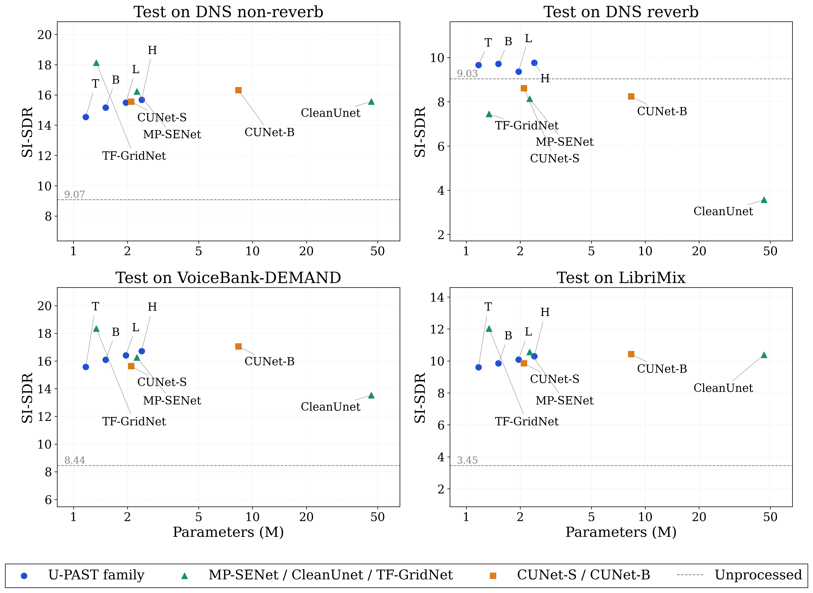
*Figure 2:Speech-enhancement SI-SDR performance versus model size on four test conditions.*

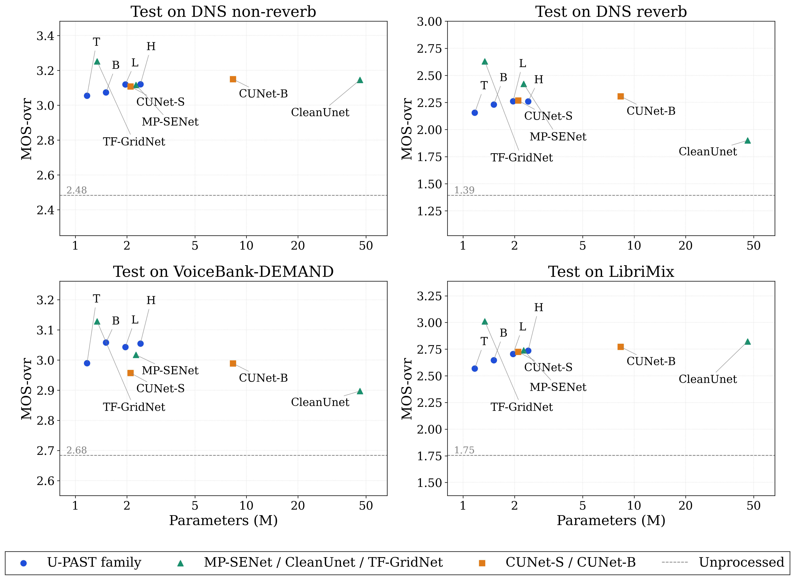
*Figure 3:Speech-enhancement MOS-ovr performance versus model size on four test conditions.*

---
**Usage Info**: 3885 tokens used.
**Generated at**: 2026-09-02 17:35:53

---

# 📚 TimeSteer: Inference-Time Speech Scheduling in Joint Audio-Visual Diffusion Models

🚀 URL: https://arxiv.org/html/2609.01277

## 🌏 Abstract (원문)
Although pretrained joint audio-visual diffusion models offer rich control overwhatto generate, they provide no explicit control overwhenan utterance should occur. To address this, we studyinference-time speech scheduling, a novel task that places coupled speech and visual articulation within user-specified begin–end intervals without finetuning the backbone model.We uncover two intrinsic properties of the denoising process that enable this task. First, a timing-sensitive text-to-audio cross-attention head exposes each utterance’s model-implied source span along the latent timeline. Second, the predicted clean latent already organizes coupled speech and visual articulation, allowing their temporal placement to be edited without regenerating the content. Building on these discoveries, we proposeTimeSteer, a training-free framework that localizes each utterance’s source span throughSource Span Localizationand transfers the associated audio-visual latent content from the source interval to the specified target interval throughRegion-Aware Latent Remapping. We further introduceSpeechShift, the first benchmark for interval-level speech scheduling in joint audio-visual generation. Experiments across two representative backbones show that TimeSteer substantially improves interval controllability over training-free baselines while maintaining competitive overall generation quality.
## 🌏 Abstract (번역)
사전 훈련된 오디오-시각 공동 확산 모델은 무엇을 생성할지에 대한 풍부한 제어 기능을 제공하지만, 발화가 언제 발생해야 하는지에 대한 명시적인 제어는 제공하지 않습니다. 이를 해결하기 위해 우리는 백본 모델을 미세 조정하지 않고도 사용자 지정 시작-종료 간격 내에 결합된 음성 및 시각적 조음을 배치하는 새로운 작업인 추론 시간 음성 스케줄링을 연구합니다. 우리는 이 작업을 가능하게 하는 디노이징 프로세스의 두 가지 본질적인 속성을 발견했습니다. 첫째, 시간 민감형 텍스트-오디오 교차-어텐션 헤드는 잠재 시간 축을 따라 각 발화의 모델 암시적 소스 스팬을 노출합니다. 둘째, 예측된 깨끗한 잠재 공간은 이미 결합된 음성 및 시각적 조음을 구성하므로 콘텐츠를 재생성하지 않고도 시간적 배치를 편집할 수 있습니다. 이러한 발견을 바탕으로 우리는 Source Span Localization을 통해 각 발화의 소스 스팬을 지역화하고 Region-Aware Latent Remapping을 통해 관련 오디오-시각 잠재 콘텐츠를 소스 간격에서 지정된 대상 간격으로 전송하는 훈련 없는 프레임워크인 TimeSteer를 제안합니다. 또한 우리는 공동 오디오-시각 생성에서 간격 수준 음성 스케줄링을 위한 최초의 벤치마크인 SpeechShift를 소개합니다. 두 가지 대표적인 백본에 대한 실험 결과, TimeSteer는 훈련 없는 기준선에 비해 간격 제어 가능성을 크게 향상시키면서 경쟁력 있는 전반적인 생성 품질을 유지함을 보여줍니다.

## 🔍 Methods & Results
- 본 연구는 사전 훈련된 오디오-시각 확산 모델의 백본을 미세 조정하지 않고 사용자 지정 시작-종료 간격 내에 음성 및 시각적 조음을 배치하는 '추론 시간 음성 스케줄링'이라는 새로운 작업을 다룹니다.
- TimeSteer는 추론 시간 음성 스케줄링을 위한 훈련 없는 프레임워크로, 디노이징 과정 전반에 걸쳐 예측된 깨끗한 잠재 공간에 개입하여 정밀한 시간 제어를 가능하게 합니다.
- TimeSteer는 두 가지 단계로 구성됩니다: 1) Source Span Localization은 교차-어텐션 맵에서 각 발화의 소스 스팬을 식별합니다. 2) Region-Aware Latent Remapping은 대상 잠재 시간 축에서 소스 잠재 시간 축으로 읽기 맵을 구성하여 각 발화를 대상 간격으로 재배치합니다.
- Source Span Localization은 고정된 DiT 모델의 시간 민감형 텍스트-오디오 교차-어텐션 헤드가 각 발화에 대해 시간적으로 지역화된 응답을 생성한다는 관찰을 기반으로 합니다. 이는 발화의 모델 암시적 소스 스팬을 오디오 잠재 시간 축을 따라 추적합니다.
- Region-Aware Latent Remapping은 예측된 깨끗한 잠재 콘텐츠를 재생성하지 않고 재배치하며, 음성 간격 내에서는 'Minimal-Distortion Remapping'을 사용하여 아핀 맵을 적용하고, 비음성 간격에서는 'Curvature Bridging'을 사용하여 읽기 맵을 부드럽게 보간합니다.
- SpeechShift는 텍스트-오디오-시각 생성에서 간격 수준 음성 스케줄링을 위한 최초의 벤치마크로, 102개 장면, 400개 프롬프트, 600개 발화 수준 목표를 포함하며, 발화자 및 발화 수, 음향 및 시각적 조건에 따라 균형 있게 구성됩니다.
- 평가는 간격 제어 가능성(절대 시작/종료 오류, IoU, 적중률)과 생성 품질(WER, PQ, MUSIQ, LSE-C)의 두 가지 목표를 측정합니다.
- 실험 결과, TimeSteer는 훈련 없는 기준선에 비해 간격 제어 가능성을 크게 향상시키면서 전반적인 생성 품질을 경쟁력 있게 유지함을 입증했습니다.

## 🖼 Figures
![Figure 1:Qualitative speech scheduling. Without TimeSteer, a timing instruction of the form “from [start] to [end]” is appended to the original prompt, yet the speech remains near the video onset. TimeSteer places the utterance within any user-specified target interval while preserving generation quality and text alignment. Shading marks the target intervals; frames are sampled at 1 fps with aligned mel-spectrograms below.](../images/2026-09-02/2609.01277/2609.01277_fig0.png)
*Figure 1:Qualitative speech scheduling. Without TimeSteer, a timing instruction of the form “from [start] to [end]” is appended to the original prompt, yet the speech remains near the video onset. TimeSteer places the utterance within any user-specified target interval while preserving generation quality and text alignment. Shading marks the target intervals; frames are sampled at 1 fps with aligned mel-spectrograms below.*

*Figure 2:Overview of TimeSteer. (a) Given target intervals, TimeSteer localizes each utterance’s source span and relocates its predicted audio-visual content. (b) Source Span Localization estimates source spans from text-to-audio cross-attention. (c) Region-Aware Latent Remapping relocates the content through its read map.*

*Figure 5:Sample-level Spearman correlations among HR0.2, IoU, and WER for TimeSteer across five seeds. Positive HR0.2–IoU correlations indicate agreement between the temporal metrics, while negative correlations with WER indicate that better temporal control tends to coincide with lower transcription error.*

*Figure 9:Layer selection using LTX-2 text-to-audio attention on the predicted clean latent at denoise step index 5. The left panel averages text-to-audio attention over all layers and heads; the right panel averages the heads within each layer. Layer 25 is retained for head-level inspection.*

*Figure 10:Layer selection using daVinci-MagiHuman text-to-audio attention on the predicted clean latent at denoise step index 5. The left panel averages text-to-audio attention over all layers and heads; the right panel averages the heads within each layer. Layers 29, 31, 34, and 35 are retained for head-level inspection.*

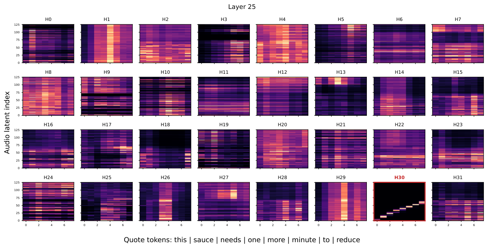
*Figure 11:Head-level text-to-audio attention on the predicted clean latent in LTX-2 layer 25. The selected head 30 is outlined and labeled in red.*

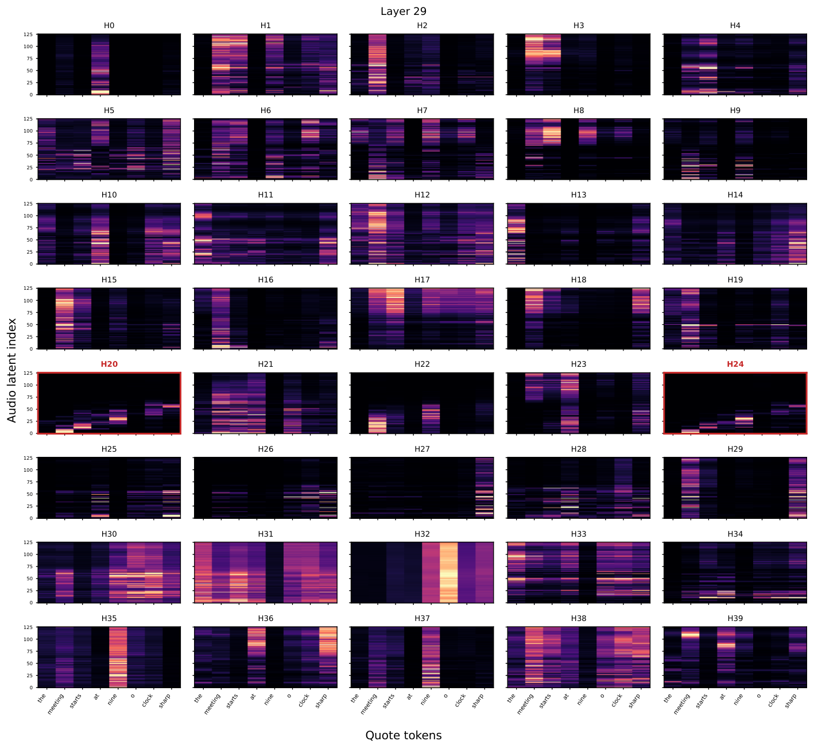
*Figure 12:Head-level text-to-audio attention on the predicted clean latent in daVinci-MagiHuman layer 29. Selected heads 20 and 24 are outlined and labeled in red.*

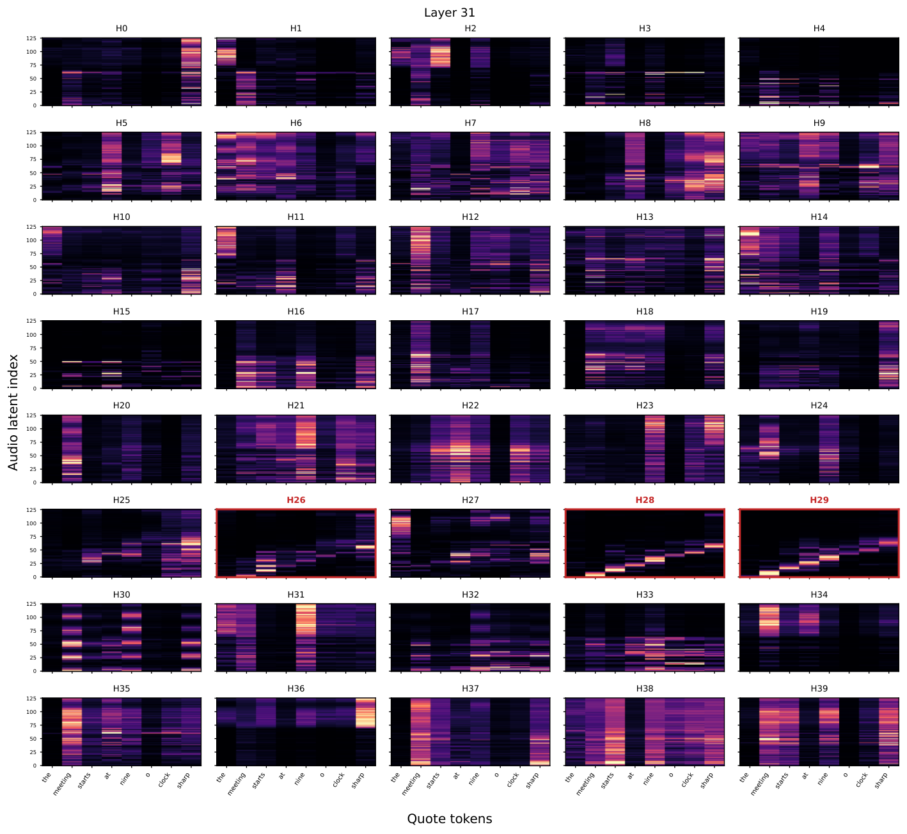
*Figure 13:Head-level text-to-audio attention on the predicted clean latent in daVinci-MagiHuman layer 31. Selected heads 26, 28, and 29 are outlined and labeled in red.*

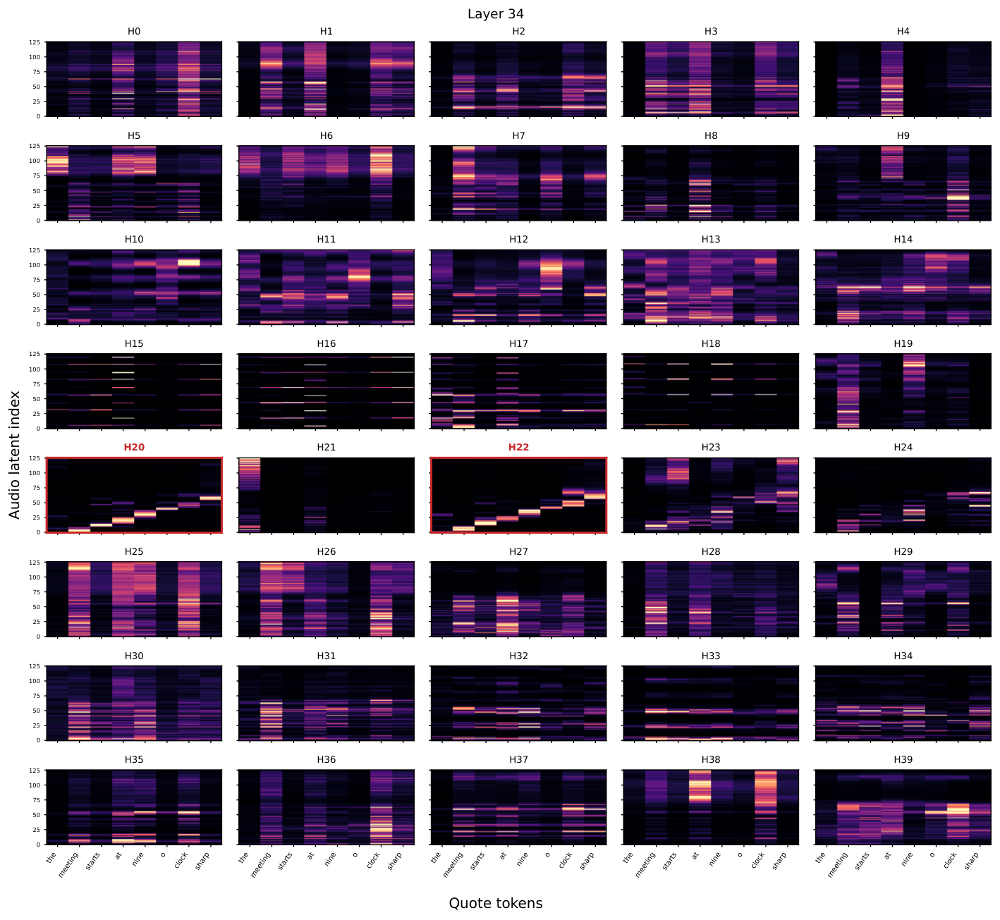
*Figure 14:Head-level text-to-audio attention on the predicted clean latent in daVinci-MagiHuman layer 34. Selected heads 20 and 22 are outlined and labeled in red.*

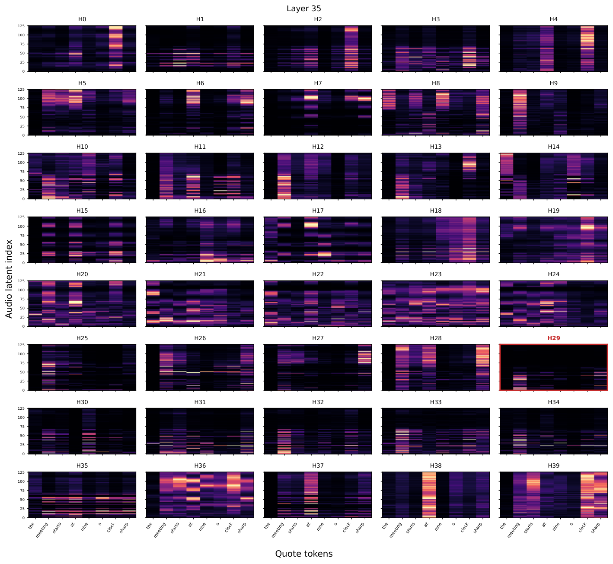
*Figure 15:Head-level text-to-audio attention on the predicted clean latent in daVinci-MagiHuman layer 35. Selected head 29 is outlined and labeled in red.*

![Figure 16:A sample generated by LTX-2. The prompt is "On a rainforest boardwalk trail with dense foliage, a male host sits upright addressing the viewer and says: ‘keep your voice down please’. Traffic noise and honking continue outside the window." The target interval is [1.9s, 3.2s].](../images/2026-09-02/2609.01277/2609.01277_fig15.png)
*Figure 16:A sample generated by LTX-2. The prompt is "On a rainforest boardwalk trail with dense foliage, a male host sits upright addressing the viewer and says: ‘keep your voice down please’. Traffic noise and honking continue outside the window." The target interval is [1.9s, 3.2s].*

![Figure 17:A sample generated by LTX-2. The prompt is "In a retro arcade with flashing game cabinets, a male cashier faces the camera and says: ‘the weather looks clear this morning’. Following a noticeable pause, he says: ‘we should start hiking before noon’. The room stays quiet afterward." The target intervals are [0.2s, 1.8s] and [2.9s, 4.5s].](../images/2026-09-02/2609.01277/2609.01277_fig16.png)
*Figure 17:A sample generated by LTX-2. The prompt is "In a retro arcade with flashing game cabinets, a male cashier faces the camera and says: ‘the weather looks clear this morning’. Following a noticeable pause, he says: ‘we should start hiking before noon’. The room stays quiet afterward." The target intervals are [0.2s, 1.8s] and [2.9s, 4.5s].*

![Figure 18:A sample generated by daVinci-MagiHuman. The prompt is "During the afternoon at the bus terminal, a young female station attendant in a charcoal blazer speaks with an older female transportation worker in a neatly pressed uniform. The first person asks: ‘what should we do with the bus terminal’. The second responds: ‘leave it untouched until this supervisor arrives’. Elsewhere around the bus terminal, only faint room tone remains after the line." The target intervals are [0.2s, 2.6s] and [2.9s, 4.8s].](../images/2026-09-02/2609.01277/2609.01277_fig17.png)
*Figure 18:A sample generated by daVinci-MagiHuman. The prompt is "During the afternoon at the bus terminal, a young female station attendant in a charcoal blazer speaks with an older female transportation worker in a neatly pressed uniform. The first person asks: ‘what should we do with the bus terminal’. The second responds: ‘leave it untouched until this supervisor arrives’. Elsewhere around the bus terminal, only faint room tone remains after the line." The target intervals are [0.2s, 2.6s] and [2.9s, 4.8s].*

![Figure 19:A sample generated by daVinci-MagiHuman. The prompt is "Alongside the pharmacy, a middle-aged female clinic receptionist in a neatly pressed uniform speaks with a middle-aged male dental assistant with a small shoulder bag. The first person asks: ’could you show me the pharmacy’. The second responds: ’of course follow me through this entrance’. Elsewhere around the pharmacy, two staff members discuss a patient quietly behind the speaker." The target intervals are [0.2s, 1.8s] and [2.6s, 4.5s].](../images/2026-09-02/2609.01277/2609.01277_fig18.png)
*Figure 19:A sample generated by daVinci-MagiHuman. The prompt is "Alongside the pharmacy, a middle-aged female clinic receptionist in a neatly pressed uniform speaks with a middle-aged male dental assistant with a small shoulder bag. The first person asks: ’could you show me the pharmacy’. The second responds: ’of course follow me through this entrance’. Elsewhere around the pharmacy, two staff members discuss a patient quietly behind the speaker." The target intervals are [0.2s, 1.8s] and [2.6s, 4.5s].*

---
**Usage Info**: 4646 tokens used.
**Generated at**: 2026-09-02 17:36:03

---

# 📚 DreamX-Creator 1.0: Democratizing Native Audio-Video Generation at 2K Resolution

🚀 URL: https://arxiv.org/html/2608.31106

## 🌏 Abstract (원문)
Generative video has advanced rapidly in visual fidelity, motion quality, and duration, but audio is still often omitted[59,60]or synthesized in a separate stage. Directional pipelines have achieved strong video-to-audio generation[45,87,9]and audio-driven human animation[61,35,16]. However, these formulations treat one modality as a fixed condition and the other as the generated output, limiting reciprocal interaction when visual dynamics and acoustic events are jointly determined. Examples include speech and mouth motion, visible impacts and their associated sounds, and scene-level relationships among ambience, music, and camera motion. Joint audio-video generation instead models both modalities inside the generative process. Early work coupled audio and video denoisers within joint diffusion models[53,70,67,39]. More recent native generators retain modality-specialized representations while exchanging information through dual-stream backbones, expert-based architectures, or unified multimodal transformers[44,19,65,25,57,10,42,85]. Together, these systems show that synchronized sound and video need not be produced as a post-hoc cascade. This progress exposes four unresolved challenges.First, raw audio-video data require reliable clip segmentation, modality-specific quality filtering, synchronization assessment, and joint multimodal annotation. Shot transitions and unrelated background audio can otherwise introduce spurious cross-modal correlations.Second, cross-modal interaction must be introduced without overwhelming modality-specific representations. Its required strength varies across layers, attention heads, tokens, and samples, while different content exhibits different directional dependencies between audio and video.Third, likelihood- or flow-based training does not directly optimize perceptual quality, prompt adherence, cross-modal semantic consistency, or fine-grained audio-video synchronization.Fourth, joint latent generation and 2K refinement impose different computational requirements: the former benefits from a practical latent resolution, whereas the latter must recover spatial detail while maintaining the generated content, motion, and audio-synchronized timing. Model scale and availability remain practical barriers to research on native audio-video generation. Many existing systems use tens of billions of parameters, provide only hosted access, or are difficult to reproduce. We therefore introduce DreamX-Creator 1.0, a compact native joint audio-video system centered on a 7B generator and accompanied by an autoregressive 1-step 2K Refiner. We publicly release both components to support reproducible evaluation and downstream adaptation. The comparison intable1isolates three system-level properties relevant to research accessibility and deployment scope: downloadable model weights, native joint audio-video generation, and an officially supported output path at 2K resolution or above. Among the listed systems with a disclosed total backbone size, DreamX-Creator 1.0 is the smallest model that combines all three properties. Availability is based on publicly documented capabilities as of August 27, 2026. “Open” denotes downloadable model parameters and does not imply an OSI-approved license; “Base only” indicates that only the base-generation checkpoint is downloadable. In the≥
2K column, “Local” denotes an officially supported local generation, refinement, or upscaling path; “Online only” denotes availability exclusively through an official web service, cloud platform, or API; and “Not available” indicates that no official support was identified. MiniMax H3 releases H3-Base for local 768p generation, whereas H3-Context-IR and H3-Regenerate-2K remain online-only. LTX-2.3 releases both its generation checkpoints and x2 latent spatial upscaler weights, with official support for local output up to 4K. Parameter counts refer to the generation backbone; active parameters are additionally reported for sparse models. N/D: not disclosed; A/V: audio-video. At the core of DreamX-Creator 1.0 is a native joint generator with modality-specialized audio and video streams. The first half of the network processes the two streams independently, while the latter half introduces paired audio-to-video (A2V) and video-to-audio (V2A) paths through Gated Cross-Modal Attention. The paths operate on positions mapped to a shared temporal coordinate system, with temporal rotary position encoding applied to their cross-modal queries and keys. Following the output-gating design studied in gated attention[50], each enabled path uses a token- and head-wise sigmoid output gate conditioned on both the target hidden state and the cross-modal attention output. A per-sample direction mask selects the active path or paths, whereas the gate scales each attention-head output before head concatenation, output projection, and residual addition. The complete DreamX-Creator 1.0 system is supported by a unified Audio-Video Data System. The base generator is trained with Progressive Joint Training, comprising two audio-video pre-training stages followed by High-Quality Finetuning. The internal A2V, V2A, and Joint conditioning configurations are mixed throughout training and do not define separate inference tasks. Audio-Video Reinforcement Learning then post-trains the generator using Modality-Aware Multimodal Feedback that routes video-, audio-, and cross-modal advantages to the corresponding streams. Finally, 2K Refiner adapts a bidirectional multi-step teacher into an autoregressive multi-step refiner and distills it into an autoregressive 1-step student. At inference, it enhances the low-resolution video to 2K with one denoising evaluation per temporal chunk while leaving the audio stream unchanged. Audio-Video Data System.We build a unified pipeline for clip construction and filtering, structured multimodal annotation, and capability-oriented data organization to support targeted audio-video training. Native Joint Audio-Video Generation.We develop a native joint generator with Gated Cross-Modal Attention and Progressive Joint Training, followed by Audio-Video Reinforcement Learning with Modality-Aware Multimodal Feedback. Autoregressive 1-Step 2K Refinement.We adapt a bidirectional multi-step teacher into an autoregressive multi-step refiner and distill it into a 1-step student that requires one denoising evaluation per temporal chunk. A Compact 7B Open-Weight Model.We publicly release our 7B native joint audio-video generator and 2K Refiner. The generator is the smallest open-weight native joint model by disclosed total backbone size intable1and achieves top-tier benchmark performance.
## 🌏 Abstract (번역)
생성형 비디오는 시각적 충실도, 움직임 품질 및 지속 시간 면에서 빠르게 발전했지만, 오디오는 여전히 종종 생략되거나 별도의 단계에서 합성됩니다. 지향성 파이프라인은 강력한 비디오-오디오 생성 및 오디오 기반 인간 애니메이션을 달성했습니다. 그러나 이러한 공식은 한 가지 양식을 고정된 조건으로, 다른 양식을 생성된 출력으로 취급하여 시각적 역학과 음향 이벤트가 공동으로 결정될 때 상호 작용을 제한합니다. 예를 들어, 음성과 입 움직임, 보이는 충격과 관련 소리, 분위기, 음악, 카메라 움직임 간의 장면 수준 관계 등이 있습니다. 대신, 공동 오디오-비디오 생성은 생성 프로세스 내에서 두 가지 양식을 모두 모델링합니다. 초기 작업은 공동 확산 모델 내에서 오디오 및 비디오 디노이저를 결합했습니다. 최근의 네이티브 생성기는 양식별 표현을 유지하면서 듀얼 스트림 백본, 전문가 기반 아키텍처 또는 통합 멀티모달 트랜스포머를 통해 정보를 교환합니다. 이러한 시스템들은 동기화된 사운드와 비디오가 사후 캐스케이드로 생성될 필요가 없음을 보여줍니다. 이러한 발전은 네 가지 미해결 과제를 드러냅니다. 첫째, 원시 오디오-비디오 데이터는 신뢰할 수 있는 클립 분할, 양식별 품질 필터링, 동기화 평가 및 공동 멀티모달 주석을 필요로 합니다. 그렇지 않으면 샷 전환 및 관련 없는 배경 오디오가 잘못된 교차 모달 상관 관계를 유발할 수 있습니다. 둘째, 양식별 표현을 압도하지 않으면서 교차 모달 상호 작용을 도입해야 합니다. 필요한 강도는 레이어, 어텐션 헤드, 토큰 및 샘플에 따라 달라지며, 다른 콘텐츠는 오디오와 비디오 간에 다른 방향성 종속성을 나타냅니다. 셋째, 가능도 또는 흐름 기반 훈련은 지각 품질, 프롬프트 준수, 교차 모달 의미 일관성 또는 미세한 오디오-비디오 동기화를 직접적으로 최적화하지 않습니다. 넷째, 공동 잠재 생성 및 2K 정제는 다른 계산 요구 사항을 부과합니다. 전자는 실용적인 잠재 해상도에서 이점을 얻는 반면, 후자는 생성된 콘텐츠, 움직임 및 오디오 동기화 타이밍을 유지하면서 공간 세부 정보를 복구해야 합니다. 모델 규모와 가용성은 네이티브 오디오-비디오 생성 연구에 대한 실질적인 장벽으로 남아 있습니다. 많은 기존 시스템은 수십억 개의 매개변수를 사용하거나 호스팅된 액세스만 제공하거나 재현하기 어렵습니다. 따라서 우리는 7B 생성기를 중심으로 하는 소형 네이티브 공동 오디오-비디오 시스템인 DreamX-Creator 1.0을 소개하며, 자동 회귀 1단계 2K 정제기가 함께 제공됩니다. 우리는 재현 가능한 평가 및 다운스트림 적응을 지원하기 위해 두 구성 요소를 모두 공개적으로 출시합니다. 표 1의 비교는 연구 접근성 및 배포 범위와 관련된 세 가지 시스템 수준 속성을 분리합니다: 다운로드 가능한 모델 가중치, 네이티브 공동 오디오-비디오 생성, 그리고 2K 해상도 이상에서 공식적으로 지원되는 출력 경로. 공개된 총 백본 크기를 가진 나열된 시스템 중에서 DreamX-Creator 1.0은 이 세 가지 속성을 모두 결합한 가장 작은 모델입니다. 가용성은 2026년 8월 27일 현재 공개적으로 문서화된 기능을 기반으로 합니다. '오픈'은 다운로드 가능한 모델 매개변수를 의미하며 OSI 승인 라이선스를 의미하지 않습니다. '기본만'은 기본 생성 체크포인트만 다운로드 가능하다는 것을 나타냅니다. 2K 이상 열에서 '로컬'은 공식적으로 지원되는 로컬 생성, 정제 또는 업스케일링 경로를 의미합니다. '온라인 전용'은 공식 웹 서비스, 클라우드 플랫폼 또는 API를 통해서만 가용함을 의미합니다. '사용 불가'는 공식 지원이 확인되지 않았음을 나타냅니다. MiniMax H3는 로컬 768p 생성을 위해 H3-Base를 출시하는 반면, H3-Context-IR 및 H3-Regenerate-2K는 온라인 전용으로 유지됩니다. LTX-2.3은 생성 체크포인트와 x2 잠재 공간 업스케일러 가중치를 모두 출시하며, 최대 4K의 로컬 출력을 공식적으로 지원합니다. 매개변수 수는 생성 백본을 나타냅니다. 희소 모델의 경우 활성 매개변수가 추가로 보고됩니다. N/D: 공개되지 않음; A/V: 오디오-비디오. DreamX-Creator 1.0의 핵심은 양식별 오디오 및 비디오 스트림을 갖춘 네이티브 공동 생성기입니다. 네트워크의 전반부는 두 스트림을 독립적으로 처리하는 반면, 후반부는 Gated Cross-Modal Attention을 통해 쌍을 이루는 오디오-비디오(A2V) 및 비디오-오디오(V2A) 경로를 도입합니다. 이 경로는 공유 시간 좌표계에 매핑된 위치에서 작동하며, 교차 모달 쿼리 및 키에 시간 회전 위치 인코딩이 적용됩니다. Gated Attention에서 연구된 출력 게이팅 설계에 따라, 각 활성화된 경로는 대상 은닉 상태와 교차 모달 어텐션 출력 모두에 조건화된 토큰 및 헤드별 시그모이드 출력 게이트를 사용합니다. 샘플당 방향 마스크는 활성 경로를 선택하는 반면, 게이트는 헤드 연결, 출력 투영 및 잔차 추가 전에 각 어텐션 헤드 출력을 스케일링합니다. 완전한 DreamX-Creator 1.0 시스템은 통합 오디오-비디오 데이터 시스템에 의해 지원됩니다. 기본 생성기는 두 가지 오디오-비디오 사전 훈련 단계와 고품질 미세 조정으로 구성된 점진적 공동 훈련으로 훈련됩니다. 내부 A2V, V2A 및 공동 조건화 구성은 훈련 전반에 걸쳐 혼합되며 별도의 추론 작업을 정의하지 않습니다. 오디오-비디오 강화 학습은 비디오, 오디오 및 교차 모달 이점을 해당 스트림으로 라우팅하는 양식 인식 멀티모달 피드백을 사용하여 생성기를 사후 훈련합니다. 마지막으로, 2K 정제기는 양방향 다단계 교사를 자동 회귀 다단계 정제기로 적응시키고 이를 자동 회귀 1단계 학생으로 증류합니다. 추론 시, 이는 오디오 스트림을 변경하지 않고 시간 청크당 한 번의 디노이징 평가로 저해상도 비디오를 2K로 향상시킵니다. 오디오-비디오 데이터 시스템. 우리는 클립 구성 및 필터링, 구조화된 멀티모달 주석, 그리고 목표 지향적인 오디오-비디오 훈련을 지원하기 위한 기능 지향적 데이터 구성을 위한 통합 파이프라인을 구축합니다. 네이티브 공동 오디오-비디오 생성. 우리는 Gated Cross-Modal Attention 및 점진적 공동 훈련을 갖춘 네이티브 공동 생성기를 개발했으며, 이어서 양식 인식 멀티모달 피드백을 사용한 오디오-비디오 강화 학습을 수행합니다. 자동 회귀 1단계 2K 정제. 우리는 양방향 다단계 교사를 자동 회귀 다단계 정제기로 적응시키고 이를 시간 청크당 한 번의 디노이징 평가가 필요한 1단계 학생으로 증류합니다. 소형 7B 공개 가중치 모델. 우리는 7B 네이티브 공동 오디오-비디오 생성기 및 2K 정제기를 공개적으로 출시합니다. 이 생성기는 표 1에 공개된 총 백본 크기 기준으로 가장 작은 공개 가중치 네이티브 공동 모델이며, 최고 수준의 벤치마크 성능을 달성합니다.

## 🔍 Methods & Results
- DreamX-Creator 1.0은 7B 생성기와 자동 회귀 1단계 2K 정제기를 중심으로 하는 소형 네이티브 공동 오디오-비디오 시스템으로, 재현 가능한 평가 및 적응을 위해 두 구성 요소가 모두 공개적으로 출시되었습니다.
- DreamX-Creator 1.0은 다운로드 가능한 모델 가중치, 네이티브 공동 오디오-비디오 생성, 2K 이상 해상도의 공식 지원 출력 경로를 모두 제공하는 가장 작은 공개 가중치 모델입니다.
- 핵심 생성기는 양식별 오디오 및 비디오 스트림을 사용하며, Gated Cross-Modal Attention을 통해 오디오-비디오(A2V) 및 비디오-오디오(V2A) 경로를 도입하여 교차 모달 상호 작용을 가능하게 합니다.
- 훈련은 두 단계의 오디오-비디오 사전 훈련과 고품질 미세 조정을 포함하는 점진적 공동 훈련(Progressive Joint Training)과 양식 인식 멀티모달 피드백(Modality-Aware Multimodal Feedback)을 사용하는 오디오-비디오 강화 학습(Audio-Video Reinforcement Learning)으로 구성됩니다.
- 2K 정제기는 양방향 다단계 교사를 자동 회귀 1단계 학생으로 증류하여, 추론 시 저해상도 비디오를 2K로 향상시키며 오디오 스트림은 변경하지 않습니다.
- 통합 오디오-비디오 데이터 시스템은 고품질, 신뢰할 수 있는 교차 모달 대응 및 다양한 오디오-시각적 상호 작용을 가진 코퍼스를 구축하기 위해 개발되었습니다.
- 데이터 시스템은 PySceneDetect를 사용한 장면 경계 분할, 오디오 RMS 에너지 기반 무음 구간 제거, 유효하지 않거나 저해상도 샘플 제거를 포함한 전처리 단계를 거칩니다.
- 시각적 품질(Q-Align), 움직임(UniMatch 기반 광학 흐름), 오디오 품질(Audiobox Aesthetics) 및 교차 모달 동기화(Synchformer, 음성용 SyncNet)를 평가하기 위한 단계별 필터링 파이프라인이 적용됩니다.
- Qwen3-Omni-30B-A3B-Instruct를 사용하여 비디오 및 오디오 스트림을 공동으로 분석하고, Qwen3-ASR-1.7B로 음성을 전사한 후, Qwen3.6-27B가 이를 통합하여 일관되고 유창한 캡션을 생성합니다.
- 주석이 달린 클립은 Qwen3.6-27B에 의해 추론된 교차 모달 종속성 패턴에 따라 네 가지 기능 지향적 풀로 구성되어, 다양한 생성 능력의 목표 지향적 학습을 지원합니다.
- 훈련 데이터의 내용 분포는 음성 45.0%, 이벤트 사운드 33.4%(인간 행동, 객체 상호 작용, 운송 등), 나머지 음악, 자연음 및 혼합 콘텐츠로 구성되어 일반 오디오-시각 생성에 대한 광범위한 감독을 제공합니다.

## 🖼 Figures
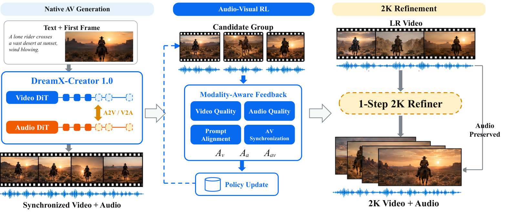
*Figure 2:The DreamX-Creator 1.0 pipeline, comprising native joint audio-video generation, Audio-Video Reinforcement Learning post-training, and Autoregressive 1-Step 2K Refinement.*

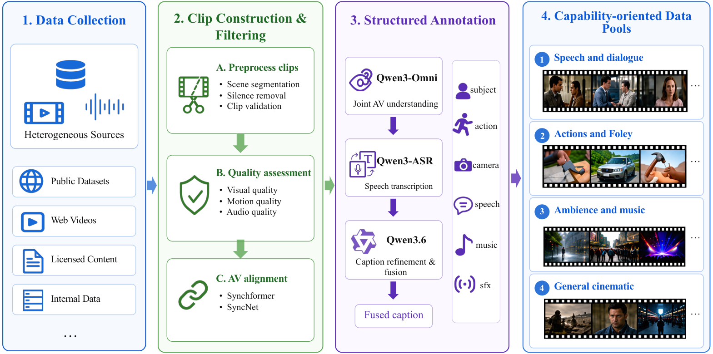
*Figure 3:Overview of the data system for DreamX-Creator 1.0, including heterogeneous data collection, clip construction and filtering, structured multimodal annotation, and capability-oriented data organization.*

*Figure 6:Modality-aware reinforcement learning for joint audio-video generation. Video- and audio-specific rewards are routed to their corresponding streams, while the shared audio-visual synchronization reward jointly optimizes both streams and their cross-modal interactions.*

---
**Usage Info**: 7233 tokens used.
**Generated at**: 2026-09-02 17:36:24

---

# 📚 Heard but Not Heeded: Paralinguistic Information Encoding and Loss in Audio-Language Models

🚀 URL: https://arxiv.org/html/2609.00727

## 🌏 Abstract (원문)
Audio language models are designed to understand speech, yet it remains unclear whether they capture how something is said beyond what is said. We present a mechanistic analysis of paralinguistic information in four open source models, Whisper-large-v2, Qwen2-Audio-7B Instruct, Qwen2.5-Omni-7B, and Chroma-4B, using the Expresso dataset with controlled speaking styles. We combine centered kernel alignment, linear probing with leave one speaker out evaluation, open ended tone prediction, and a content prosody leakage metric to trace how style information moves from the audio encoder to the final output. All models strongly encode speaking style in the late encoder, that is, the top third of the audio encoder’s layers, but this information is consistently degraded before reaching the output. The projector reshapes representation geometry without removing information, while decoders differ in how much style they preserve depending on architecture and training objective. At the output level, models fall into two behaviors. Some are content driven, where predictions depend mainly on text. Others are acoustic driven, where predictions vary with speaking style. The leakage metric quantifies this difference, and qualitative results confirm it. Overall, we identify a gap between what models encode and what they use, highlighting a key limitation in current audio language models.
## 🌏 Abstract (번역)
오디오 언어 모델은 음성을 이해하도록 설계되었지만, 모델이 '무엇을 말하는지'를 넘어 '어떻게 말하는지'를 포착하는지는 불분명합니다. 본 연구에서는 통제된 말하기 스타일을 포함하는 Expresso 데이터셋을 사용하여 Whisper-large-v2, Qwen2-Audio-7B Instruct, Qwen2.5-Omni-7B, Chroma-4B의 네 가지 오픈 소스 모델에서 준언어적 정보에 대한 기계론적 분석을 제시합니다. 우리는 중심 커널 정렬(CKA), 화자 제외 선형 프로빙 평가, 개방형 톤 예측, 그리고 내용 운율 누출 측정법을 결합하여 스타일 정보가 오디오 인코더에서 최종 출력으로 어떻게 이동하는지 추적합니다. 모든 모델은 오디오 인코더의 후기 인코더, 즉 상위 3분의 1 계층에서 말하기 스타일을 강력하게 인코딩하지만, 이 정보는 출력에 도달하기 전에 지속적으로 저하됩니다. 프로젝터는 정보를 제거하지 않고 표현 기하학을 재구성하는 반면, 디코더는 아키텍처 및 훈련 목표에 따라 스타일을 보존하는 정도가 다릅니다. 출력 수준에서 모델은 두 가지 행동을 보입니다. 일부는 예측이 주로 텍스트에 의존하는 내용 중심적이며, 다른 일부는 예측이 말하기 스타일에 따라 달라지는 음향 중심적입니다. 누출 측정법은 이러한 차이를 정량화하며, 정성적 결과는 이를 확인합니다. 전반적으로, 우리는 모델이 인코딩하는 것과 사용하는 것 사이의 간극을 확인했으며, 이는 현재 오디오 언어 모델의 주요 한계를 강조합니다.

## 🔍 Methods & Results
- Whisper-large-v2, Qwen2-Audio-7B Instruct, Qwen2.5-Omni-7B, Chroma-4B 등 4가지 오픈 소스 오디오 언어 모델을 분석했습니다.
- 통제된 말하기 스타일을 포함하는 Expresso 데이터셋을 사용하여 준언어적 정보(paralinguistic information)를 조사했습니다.
- 중심 커널 정렬(CKA), 화자 제외 선형 프로빙 평가, 개방형 톤 예측, 내용 운율 누출 측정법을 결합하여 스타일 정보의 흐름을 추적했습니다.
- 모든 모델은 오디오 인코더의 후기 계층(상위 3분의 1)에서 말하기 스타일을 강력하게 인코딩하지만, 이 정보는 출력에 도달하기 전에 지속적으로 저하되는 것을 발견했습니다.
- 프로젝터는 표현 기하학을 재구성하지만 정보를 제거하지 않으며, 디코더는 아키텍처와 훈련 목표에 따라 스타일 보존 정도가 다름을 확인했습니다.
- 모델 출력은 내용 중심적(예측이 텍스트에 의존) 또는 음향 중심적(예측이 말하기 스타일에 따라 변동)의 두 가지 행동 양상을 보였습니다.
- 내용 운율 누출 측정법을 통해 이러한 차이를 정량화하고 정성적 결과로 이를 확인했습니다.
- 모델이 인코딩하는 정보와 실제로 사용하는 정보 사이에 간극이 존재하며, 이는 현재 오디오 언어 모델의 주요 한계임을 시사합니다.

## 🖼 Figures
![Figure 1:Linear probe accuracy (LOSO, 7-class) across all four models on normalized layer depth (0 = first encoder layer, 1 = final decoder layer; see Appendix E for the encoder/projector/decoder boundaries per model). All models peak in the late audio encoder (
∼
82–85%). Qwen2-Audio (orange) maintains flat decoder accuracy. Qwen2.5-Omni (blue) declines gradually. Chroma (green) drops sharply at the backbone boundary then partially recovers. Whisper (gray) rises monotonically. Chance = 14.3% (dashed).](../images/2026-09-02/2609.00727/2609.00727_fig0.png)
*Figure 1:Linear probe accuracy (LOSO, 7-class) across all four models on normalized layer depth (0 = first encoder layer, 1 = final decoder layer; see Appendix E for the encoder/projector/decoder boundaries per model). All models peak in the late audio encoder (
∼
82–85%). Qwen2-Audio (orange) maintains flat decoder accuracy. Qwen2.5-Omni (blue) declines gradually. Chroma (green) drops sharply at the backbone boundary then partially recovers. Whisper (gray) rises monotonically. Chance = 14.3% (dashed).*

*(a)Qwen2-Audio-7B (67 layers)*

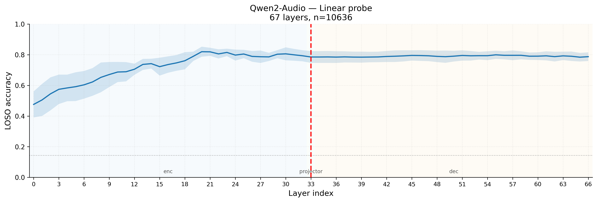
*(a)Qwen2-Audio-7B (67 layers)*

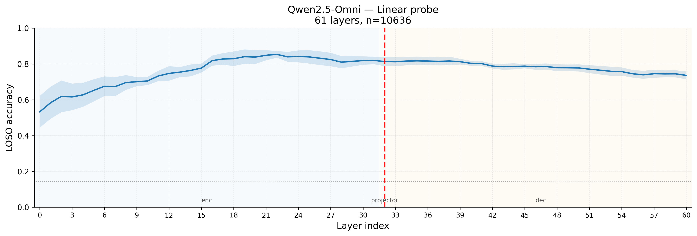
*(b)Qwen2.5-Omni-7B (61 layers)*

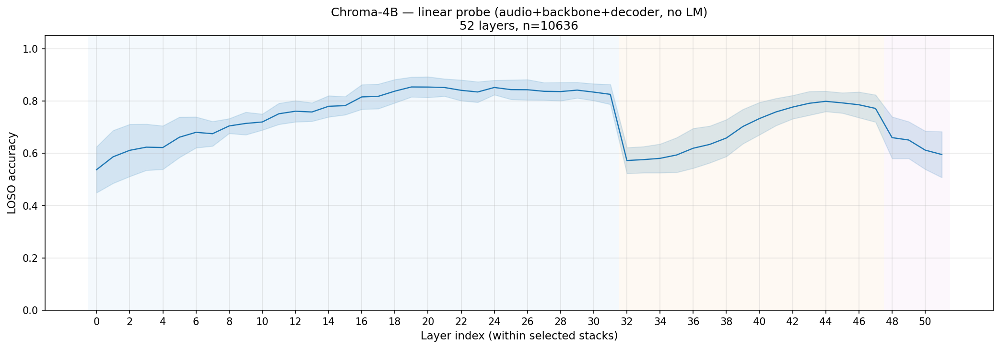
*(c)Chroma-4B (52 layers, no thinker LM)*

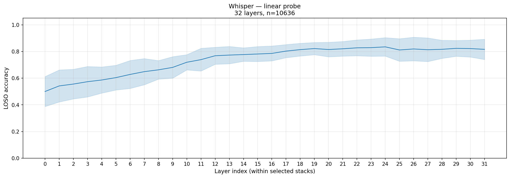
*(d)Whisper-large-v2 (32 layers)*

*Figure 3:Per-style tone perception accuracy across all three models. Omni (blue) dominates on acoustically extreme styles (whisper, laughing). Qwen2-Audio (orange) performs best on clarity styles (default, enunciated). Chroma (green) partially recovers on laughing but fails on subtle styles. Chance = 14.3% (dotted).*

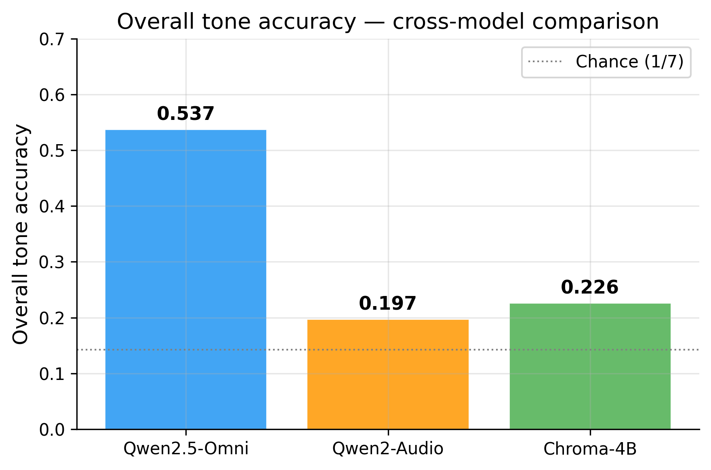
*Figure 4:Overall tone perception accuracy. Omni (53.7%) substantially outperforms Qwen2-Audio (19.7%) and Chroma (22.6%), all above chance (14.3%).*

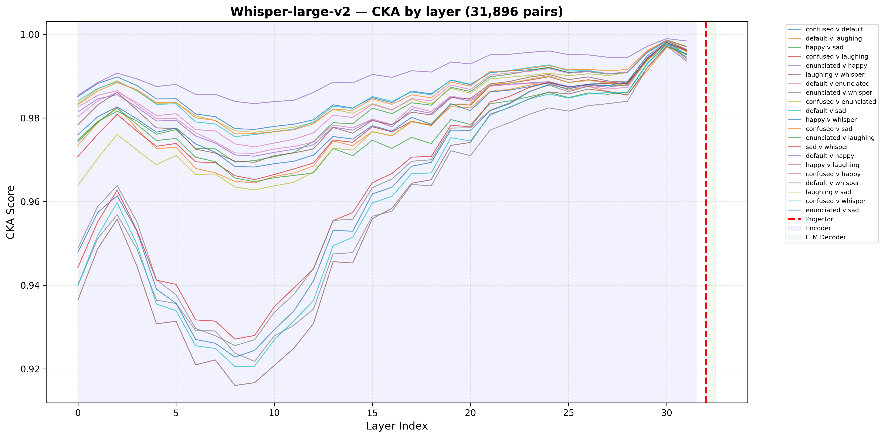
*(a)Whisper-large-v2*

*(a)Whisper-large-v2*

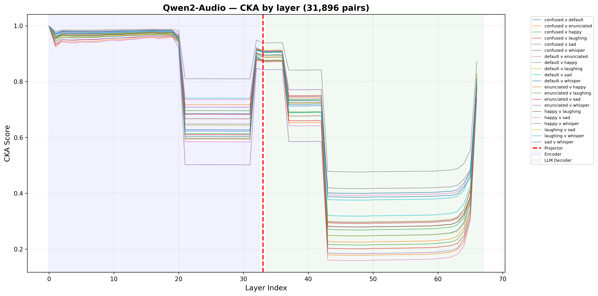
*(b)Qwen2-Audio-7B-Instruct*

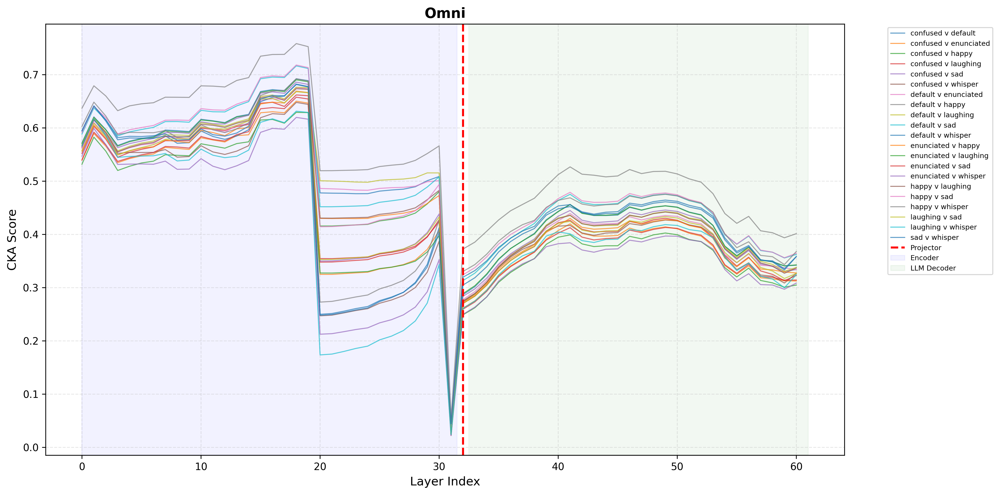
*(c)Qwen2.5-Omni-7B*

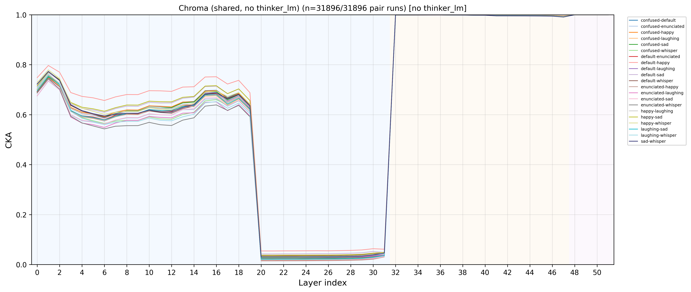
*(d)Chroma-4B*

---
**Usage Info**: 1821 tokens used.
**Generated at**: 2026-09-02 17:36:32

---

# 📚 Phrase-Localized Language-Contrastive Guidance: Training-Free Localized Accent Control for Code-Switching Text-to-Speech

🚀 URL: https://arxiv.org/html/2609.01016

## 🌏 Abstract (원문)
Current speech synthesis struggles with code-switching, which mixes a foreign language phrase into a primary language utterance, causing the phrase to be spoken with the primary language’s accent rather than its native one. We propose Phrase-Localized Language-Contrastive Guidance (LCG), a training-free inference framework that restores a native accent to code-switched phrases in cross-lingual text-to-speech. LCG replaces the single language guidance applied across the whole utterance with a separate guidance for each region, so each part is guided by its own language. To choose where to apply this localized guidance, we propose a self-attention probing technique that finds the phrase boundaries without external alignments. Together, these components generate speech in which each region carries the accent of its own language, requiring no fine-tuning or auxiliary models. Across diverse language pairs, LCG robustly increases the nativeness of the code-switched phrase while suppressing accent leakage, and preserving overall speaker identity and naturalness.***https://saga1214.github.io/PhraseLocalizedLCG/
## 🌏 Abstract (번역)
현재 음성 합성 기술은 코드 스위칭(주요 언어 발화에 외국어 구절을 혼합하는 것)에 어려움을 겪고 있으며, 이로 인해 해당 구절이 원어민 악센트가 아닌 주요 언어의 악센트로 발음됩니다. 우리는 교차 언어 텍스트 음성 변환에서 코드 스위칭 구절에 원어민 악센트를 복원하는 훈련 없는 추론 프레임워크인 구절 지역화 언어 대비 안내(Phrase-Localized Language-Contrastive Guidance, LCG)를 제안합니다. LCG는 전체 발화에 적용되는 단일 언어 안내를 각 영역에 대한 별도의 안내로 대체하여 각 부분이 자체 언어에 의해 안내되도록 합니다. 이 지역화된 안내를 어디에 적용할지 선택하기 위해, 외부 정렬 없이 구절 경계를 찾는 자기 주의 프로빙 기술을 제안합니다. 이러한 구성 요소들은 함께 각 영역이 자체 언어의 악센트를 가지는 음성을 생성하며, 미세 조정이나 보조 모델이 필요하지 않습니다. 다양한 언어 쌍에 걸쳐 LCG는 악센트 누출을 억제하고 전반적인 화자 정체성과 자연스러움을 보존하면서 코드 스위칭 구절의 원어민성을 강력하게 증가시킵니다.

## 🔍 Methods & Results
- LCG는 사전 훈련된 이산 확산 언어 모델(DLM)의 로짓을 안내하여 교차 언어 악센트를 제어하는 훈련 없는 추론 프레임워크이다.
- 프레임워크는 (a) 자기 주의 프로빙을 통한 프레임 수준 마스크 추출, (b) 비대칭 경계 확장, (c) 독립적인 언어 대비 조향을 통한 지역화된 스케일 조정의 세 가지 순차적 단계로 구성된다.
- OmniVoice(Zhu et al., 2026)는 600개 이상의 언어를 합성할 수 있는 이산 DLM 기반 텍스트 음성 변환(TTS) 프레임워크를 사용한다.
- 기존의 Classifier-Free Guidance(CFG)는 단일 언어 태그에 조건화될 때 코드 스위칭 구절의 악센트를 주 언어 악센트로 평탄화하는 문제가 있다.
- LCG는 이러한 한계를 극복하기 위해 세 번째 병렬 구절 언어 조건부 로짓(c_phr)을 도입하여 독립적인 악센트 조향을 가능하게 한다.
- 지역화된 외국어 제어를 위해 디코더 레이어 내의 자기 주의 가중치를 모니터링하여 프레임 수준 이진 마스크(m)를 동적으로 추출하며, 외부 정렬 모델이 필요 없다.
- 마스크 추출을 위한 최적의 레이어는 중간 디코더 레이어이며, 특히 {L8, L12}의 다중 레이어 앙상블과 헤드별 최대 풀링이 경계 재현율을 극대화한다.
- 마스크 정제는 비대칭 정렬 오류 허용 오차(오탐은 치명적, 오긍은 양성)에 따라 재현율을 우선시하며, 이중 태그 결합(m_src와 m_phr)과 대칭 등급 확장(k=4, ±10 프레임 창)을 포함한다.
- 직관적인 기준선인 'Swap' 프레임워크는 마스크된 음향 영역 내에서 구절 조건부 로짓(c_phr)을 할당하고 외부에서는 주 언어 조건부 로짓(c_src)을 사용한다.
- Swap은 언어 대비 주입의 크기를 전역 텍스트 안내 스케일과 고정적으로 연결하지만, LCG는 독립적인 제어 매개변수 λ를 도입하여 이 결합을 분리하고 마스크된 프레임에 대한 음성 조향 강도를 직접 조절한다.
- LCG는 전역 주 언어의 자연스러움을 불안정하게 만들지 않으면서 마스크된 프레임을 내장된 구절 언어의 실제 원어민 발음으로 유도하는 훨씬 강력하고 독립적인 안내 효과를 제공한다.

## 🖼 Figures

*Figure 1:Conceptual illustration of cross-lingual accent leakage and localized control. (Left) The unguided Baseline flattens the foreign embedded phrase into the matrix carrier language accent, causing mispronunciation and acoustic distortion around the embedded segment. (Right) Our proposed LCG framework applies localized guidance over the self-derived phrase boundaries, enforcing authentic native pronunciation while preserving the surrounding matrix carrier quality and speaker identity.*

![Figure 2:Overall architecture of the proposed training-free localized guidance framework. An intra-utterance code-switching script mixing an English matrix carrier (“I love”) with an embedded Korean phrase (“매콤한 김치”, meaning “spicy kimchi”) illustrates the pipeline. (a) Internal Attention Probing: Audio-to-text frame alignments are extracted from decoder layers (
𝐿
8
,
𝐿
12
) under language-conditioned source (
𝑚
src
) and foreign phrase (
𝑚
phr
) prefixes to derive the raw phrase mask 
𝑚
. (b) Mask Refinement: Resolves alignment shifts via a dual-tag mask union (
𝑚
src
∨
𝑚
phr
) followed by a symmetric margin dilation (
𝑘
=
4
) to maximize boundary recall. (c) Phrase-Localized Language-Contrastive Guidance: Synthesizes the final logits 
𝑙
~
LCG
 by utilizing 
𝑚
 as a localized gating switch, decoupling the independent language-steering scale (
𝜆
) from the global text guidance scale (
𝛾
).](../images/2026-09-02/2609.01016/2609.01016_fig1.png)
*Figure 2:Overall architecture of the proposed training-free localized guidance framework. An intra-utterance code-switching script mixing an English matrix carrier (“I love”) with an embedded Korean phrase (“매콤한 김치”, meaning “spicy kimchi”) illustrates the pipeline. (a) Internal Attention Probing: Audio-to-text frame alignments are extracted from decoder layers (
𝐿
8
,
𝐿
12
) under language-conditioned source (
𝑚
src
) and foreign phrase (
𝑚
phr
) prefixes to derive the raw phrase mask 
𝑚
. (b) Mask Refinement: Resolves alignment shifts via a dual-tag mask union (
𝑚
src
∨
𝑚
phr
) followed by a symmetric margin dilation (
𝑘
=
4
) to maximize boundary recall. (c) Phrase-Localized Language-Contrastive Guidance: Synthesizes the final logits 
𝑙
~
LCG
 by utilizing 
𝑚
 as a localized gating switch, decoupling the independent language-steering scale (
𝜆
) from the global text guidance scale (
𝛾
).*

![Figure 5:Worker-facing instructions for the two human evaluation tasks. (Top) Phrase Nativeness AB test: raters compare two isolated segments of the same English phrase and choose which sounds more native, with an explicit instruction to judge pronunciation rather than content. (Bottom) Global Quality MOS test: raters hear four full-utterance renditions of the same code-switched prompt and score each on a 5-point scale, with three labeled reference clips provided to anchor the scale. Each task embeds its own quality check: a pair containing one clearly non-English clip in the AB test, and a deliberately corrupted rendition among the four versions in the MOS test.](../images/2026-09-02/2609.01016/2609.01016_fig4.png)
*Figure 5:Worker-facing instructions for the two human evaluation tasks. (Top) Phrase Nativeness AB test: raters compare two isolated segments of the same English phrase and choose which sounds more native, with an explicit instruction to judge pronunciation rather than content. (Bottom) Global Quality MOS test: raters hear four full-utterance renditions of the same code-switched prompt and score each on a 5-point scale, with three labeled reference clips provided to anchor the scale. Each task embeds its own quality check: a pair containing one clearly non-English clip in the AB test, and a deliberately corrupted rendition among the four versions in the MOS test.*

---
**Usage Info**: 3931 tokens used.
**Generated at**: 2026-09-02 17:36:41

---

# 📚 TOWARDS BALANCED SPECTRAL RECONSTRUCTION: SPECTRALLY ADAPTIVE LOSS FOR STREAMING SPEECH ENHANCEMENT

🚀 URL: https://arxiv.org/html/2608.30739

## 🌏 Abstract (원문)
This paper proposes two spectrally weighted STFT loss functions for lightweight streaming speech enhancement, addressing the magnitude over-attenuation in mid-to-high frequency regions caused by the magnitude-phase compensation effect. The proposed sigmoid-weighted loss applies a smooth frequency-dependent modulation to the phase-aware contribution, while the signal-dependent spectrally adaptive loss further conditions the modulation on the ground-truth log-magnitude spectrogram. To evaluate the proposed objectives, we additionally design HyST-Net, a lightweight and competitive backbone with hybrid MHA-GRU spectral-temporal modelling for low-latency streaming scenarios. Experimental results exhibit consistent improvements in high-frequency spectral reconstruction for both losses. The spectrally adaptive loss further enhances the mid-frequency region, resulting in a more balanced spectral reconstruction across the full frequency range.
## 🌏 Abstract (번역)
본 논문은 경량 스트리밍 음성 향상을 위한 두 가지 스펙트럼 가중 STFT 손실 함수를 제안하며, 이는 크기-위상 보상 효과로 인해 발생하는 중고주파수 영역에서의 크기 과도 감쇠 문제를 해결합니다. 제안된 시그모이드 가중 손실은 위상 인식 기여도에 부드러운 주파수 의존적 변조를 적용하며, 신호 의존적 스펙트럼 적응 손실은 지면 진실 로그-크기 스펙트로그램에 따라 변조를 추가로 조절합니다. 제안된 목표를 평가하기 위해, 우리는 또한 낮은 지연 시간 스트리밍 시나리오를 위한 하이브리드 MHA-GRU 스펙트럼-시간 모델링을 갖춘 경량의 경쟁력 있는 백본인 HyST-Net을 설계했습니다. 실험 결과는 두 손실 모두에서 고주파수 스펙트럼 재구성에 일관된 개선을 보여줍니다. 스펙트럼 적응 손실은 중주파수 영역을 더욱 향상시켜 전체 주파수 범위에 걸쳐 보다 균형 잡힌 스펙트럼 재구성을 가능하게 합니다.

## 🔍 Methods & Results
- 기존 위상 인식 압축 손실에서 발생하는 중고주파수 영역의 크기 과도 감쇠 문제를 해결하기 위해 두 가지 스펙트럼 가중 STFT 손실 함수를 제안한다.
- 첫 번째 제안된 손실인 시그모이드 가중 손실(ℒSig)은 위상 인식 구성 요소에 주파수 의존적 가중치를 적용하여 중고주파수 영역에서 위상 인식 기여도를 억제하고 스펙트럼 밴딩 아티팩트를 방지한다.
- 두 번째 제안된 손실인 신호 의존적 스펙트럼 적응 손실(ℒAdp)은 지면 진실 로그-크기 스펙트로그램을 사용하여 위상 인식 손실 기여도를 조절하는 스펙트럼 적응 가중치를 도출한다.
- 제안된 목표를 평가하기 위해, 하이브리드 MHA-GRU 스펙트럼-시간 모델링을 특징으로 하는 경량의 경쟁력 있는 백본인 HyST-Net을 설계했다.
- HyST-Net은 U-Net 아키텍처를 기반으로 하며, 스펙트럼 모델링에는 MHA(Multi-Head Attention)를, 시간 모델링에는 GRU(Gated Recurrent Units)를 사용하여 각 차원의 상보적인 강점을 활용한다.
- 실험 결과, 시그모이드 가중 손실과 스펙트럼 적응 손실 모두 고주파수 스펙트럼 재구성에서 일관된 개선을 보였다.
- 스펙트럼 적응 손실은 중주파수 영역을 추가로 향상시켜 전체 주파수 범위에 걸쳐 보다 균형 잡힌 스펙트럼 재구성을 달성했다.

## 🖼 Figures

*Fig. 1:Illustrative spectrograms of enhanced speech under varying phase-aware loss weights 
𝜆
∈
{
0
,
0.3
,
1
}
. A larger 
𝜆
 improves noise suppression but causes over-attenuation in mid-to-high frequencies due to the compensation effect.*

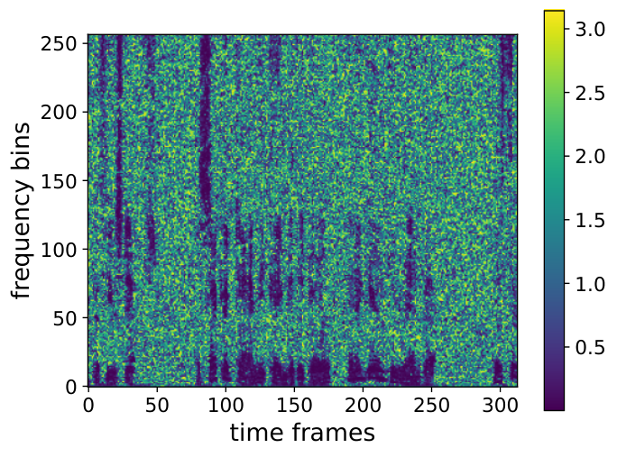
*Fig. 2:Phase estimation error and corresponding ground truth log-magnitude spectrogram of an example utterance. A notable correlation is observed between the two.*

*Fig. 4:Enhanced spectrograms of an example utterance under different loss functions. 
ℒ
MR
​
_
​
Adp
 reconstructs more energy in mid-to-high frequency regions while maintaining effective noise suppression at low frequencies.*

---
**Usage Info**: 2969 tokens used.
**Generated at**: 2026-09-02 17:36:49

---

# 📚 BiMTokenizer: Preserving Semantic-Acoustic Balance in Low-Bitrate Speech Tokenization via Bidirectional State-Space Modeling

🚀 URL: https://arxiv.org/html/2609.00562

## 🌏 Abstract (원문)
Speech codecs serve as bridges between continuous speech signals and large language models, yet face an inherent conflict between acoustic fidelity and semantic preservation. To mitigate this conflict, recent works increasingly adopt dual-tower architectures to decouple semantic and acoustic modeling with separate encoders. However, these dual-tower designs incur substantial architectural overhead. To avoid such complexity, we revisit the single-tower paradigm and proposeBiMTokenizer, a low-bitrate speech codec (around 1.1 kbps) combining abidirectional state-space backbonewithResidual Spherical Leech Quantization (RSLQ). The bidirectional backbone strengthens temporal modeling, while RSLQ offers a fixed, well-separated lattice bottleneck for robust semantic and acoustic tokenization without learned-codebook collapse. Experiments show that BiMTokenizer achieves superior acoustic reconstruction and the lowest WER among low-bitrate codec baselines across both clean and noisy environments, while using less than half the parameters of recent dual-tower baselines. Furthermore, its robust semantic representations yield strong performance on downstream speech understanding tasks, confirming that a well-designed single-tower codec can preserve the semantic–acoustic balance at low bitrates. The code and model weights are available athttps://github.com/ZhangXinWhut/BiMTokenizer.
## 🌏 Abstract (번역)
음성 코덱은 연속적인 음성 신호와 대규모 언어 모델 사이의 다리 역할을 하지만, 음향 충실도와 의미 보존 사이에 내재된 충돌에 직면합니다. 이 충돌을 완화하기 위해 최근 연구들은 의미 및 음향 모델링을 별도의 인코더로 분리하기 위해 이중 타워 아키텍처를 점점 더 많이 채택하고 있습니다. 그러나 이러한 이중 타워 설계는 상당한 아키텍처 오버헤드를 발생시킵니다. 이러한 복잡성을 피하기 위해 우리는 단일 타워 패러다임을 재검토하고 양방향 상태 공간 백본과 잔여 구형 리치 양자화(RSLQ)를 결합한 저비트레이트 음성 코덱(약 1.1 kbps)인 BiMTokenizer를 제안합니다. 양방향 백본은 시간 모델링을 강화하는 반면, RSLQ는 학습된 코드북 붕괴 없이 견고한 의미 및 음향 토큰화를 위한 고정되고 잘 분리된 격자 병목 현상을 제공합니다. 실험 결과 BiMTokenizer는 깨끗한 환경과 노이즈 환경 모두에서 저비트레이트 코덱 기준선 중 우수한 음향 재구성 및 가장 낮은 WER을 달성했으며, 최근 이중 타워 기준선의 절반 미만의 파라미터를 사용했습니다. 또한, 그 견고한 의미 표현은 다운스트림 음성 이해 작업에서 강력한 성능을 보여주며, 잘 설계된 단일 타워 코덱이 낮은 비트레이트에서도 의미-음향 균형을 유지할 수 있음을 확인시켜 줍니다. 코드와 모델 가중치는 https://github.com/ZhangXinWhut/BiMTokenizer에서 확인할 수 있습니다.

## 🔍 Methods & Results
- 음향 충실도와 의미 보존 간의 충돌을 해결하기 위해, 이중 타워 아키텍처의 높은 오버헤드를 피하고 단일 타워 패러다임을 재검토하여 BiMTokenizer를 제안했습니다.
- BiMTokenizer는 약 1.1 kbps의 저비트레이트 음성 코덱으로, 양방향 상태 공간 백본과 잔여 구형 리치 양자화(RSLQ)를 결합합니다.
- 양방향 상태 공간 백본은 시간 모델링을 강화하며, RSLQ는 학습된 코드북 붕괴 없이 견고한 의미 및 음향 토큰화를 위한 고정되고 잘 분리된 격자 병목 현상을 제공합니다.
- BiMTokenizer는 깨끗한 환경과 노이즈 환경 모두에서 저비트레이트 코덱 기준선 중 가장 우수한 음향 재구성 성능과 가장 낮은 WER(단어 오류율)을 달성했습니다.
- BiMTokenizer는 최근 이중 타워 기준선에 비해 절반 미만의 파라미터를 사용하면서도 우수한 성능을 보였습니다.
- BiMTokenizer의 견고한 의미 표현은 다운스트림 음성 이해 작업에서 강력한 성능을 보여주어, 잘 설계된 단일 타워 코덱이 낮은 비트레이트에서도 의미-음향 균형을 유지할 수 있음을 입증했습니다.

## 🖼 Figures

*Figure 2:Overview of BiMTokenizer. The encoder and decoder use stacked bidirectional Mamba blocks, while the bottleneck is replaced by RSLQ. A frozen semantic teacher, instantiated as Whisper-small or SenseVoice-small, provides training-only semantic supervision and reconstruction alignment.*

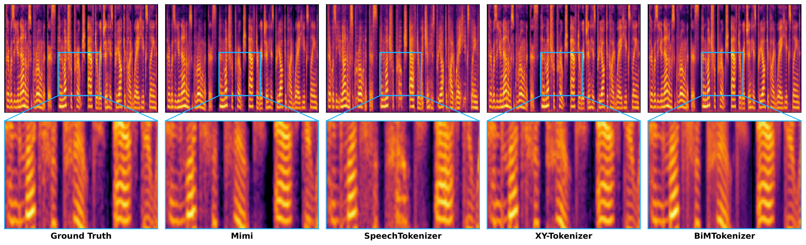
*Figure 3:Mel-spectrogram reconstructions. The zoomed regions show that BiMTokenizer preserves local harmonic and spectral structure more faithfully than prior low-bitrate codecs.*

---
**Usage Info**: 1933 tokens used.
**Generated at**: 2026-09-02 17:36:57

---

# 📚 Playability-Aware Audio-to-Tablature Guitar Transcription via Diffusion Models

🚀 URL: https://arxiv.org/html/2608.30854

## 🌏 Abstract (원문)
Guitar tablature transcription requires not only accurate pitch detection but also assigning each note to a specific string-fret position, as the same pitch can be played at multiple fretboard positions. Existing approaches treat this as a standard classification problem, ignoring the musical and physical constraints that govern playable fingering sequences. We propose Noise2Fret, a diffusion model for audio-to-tablature transcription that generates tablature through a continuous latent representation of discrete fret and string targets, conditioned on spectral and audio features. To bridge the gap between pitch accuracy and physical playability, we introduce five auxiliary losses encoding Pitch-Class Distance, Positional Distance, Circle-of-Fifths Distance, String Similarity, and Hand-Span Feasibility directly into the training objective. Experiments on GuitarSet and GOAT datasets demonstrate that the model outperforms baselines while remaining computationally more efficient, and that the auxiliary losses yield consistent gains over the standard training objective.
## 🌏 Abstract (번역)
기타 태블러처(tablature) 전사는 정확한 음정 감지뿐만 아니라 각 음을 특정 현-프렛 위치에 할당하는 것을 요구합니다. 이는 동일한 음정이 여러 프렛보드 위치에서 연주될 수 있기 때문입니다. 기존 접근 방식은 이를 표준 분류 문제로 취급하여 연주 가능한 운지법 시퀀스를 지배하는 음악적, 물리적 제약을 무시합니다. 우리는 스펙트럼 및 오디오 특징에 조건화된 이산 프렛 및 현 목표의 연속적인 잠재 표현을 통해 태블러처를 생성하는 오디오-태블러처 전사용 확산 모델인 Noise2Fret을 제안합니다. 음정 정확도와 물리적 연주 가능성 사이의 간극을 메우기 위해, 우리는 음정 클래스 거리, 위치 거리, 5도권 거리, 현 유사성, 손가락 벌림 가능성을 직접 훈련 목표에 인코딩하는 다섯 가지 보조 손실을 도입합니다. GuitarSet 및 GOAT 데이터셋에 대한 실험은 모델이 기준선보다 뛰어난 성능을 보이며 계산적으로 더 효율적이고, 보조 손실이 표준 훈련 목표에 비해 일관된 이득을 제공함을 입증합니다.

## 🔍 Methods & Results
- Noise2Fret은 원시 오디오, 스펙트럼 크기, 스펙트럼 플럭스, 밝기에 조건화된 1D 컨볼루션 U-Net 기반의 확산 모델로, 입력 태블러처를 연속 공간에 임베딩하고 가우시안 노이즈로 손상시킨 후 디노이징하여 태블러처를 생성합니다.
- 모델은 v-prediction 매개변수화를 따르는 연속 확산 프레임워크를 사용하며, 오디오 특징(STFT, SF, B, 원시 오디오) 및 확산 타임스텝(σt)에 조건화되어 디노이징 프로세스를 안내합니다.
- 음정 정확도와 물리적 연주 가능성을 향상시키기 위해, 음정 클래스 거리, 5도권 거리, 위치 거리, 현 유사성, 손가락 벌림 가능성 등 음악적 및 물리적 제약을 인코딩하는 다섯 가지 보조 손실 함수를 도입했습니다.
- 보조 손실은 프렛 또는 음정 클래스 선택에 대한 확률 분포와 같은 '소프트 예측'에 작동하여 미분 가능성을 유지합니다.
- 성능 평가는 표준 AMT 태블러처 지표(PP, PR, PF, TP, TR, TF, TDR)와 함께 False Negative Rate (FNR) 및 False Positive Rate (FPR)를 사용하여 이루어졌습니다.
- GuitarSet 및 GOAT 데이터셋에 대한 실험 결과, Noise2Fret 모델은 TabCNN 및 FretNet과 같은 기존 기준선 모델보다 우수한 성능을 보였으며, 계산적으로도 더 효율적임을 입증했습니다.
- 또한, 도입된 보조 손실들이 표준 훈련 목표에 비해 일관된 성능 향상을 가져왔음을 확인했습니다.

## 🖼 Figures
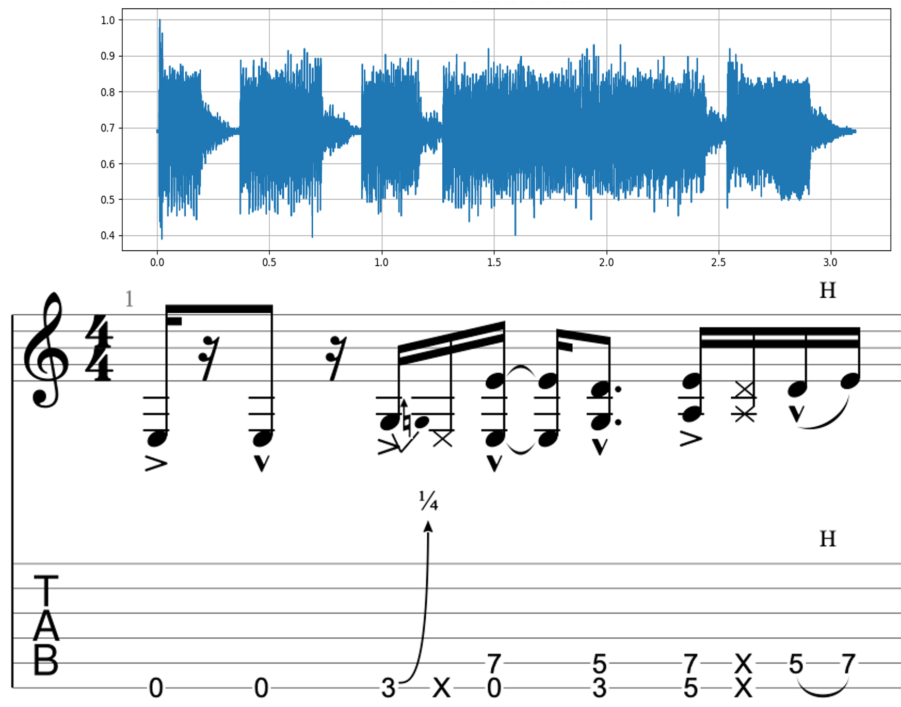
*Figure 1:A guitar tablature (bottom) and its equivalent standard notation (top). The third note should be performed with a bend and the last two with an hammer-on.*

![Figure 2:Overview of the proposed Noise2Fret architecture at inference time. Starting from a Gaussian noise tensor in the continuous embedding space (
𝑇
×
𝑆
​
𝐸
), the model iteratively denoises the representation through a 1D convolutional U-Net comprising four encoder stages, a self-attention bottleneck, and a symmetric decoder with skip connections. Audio, spectral features, and timestep are injected as conditioning signals at each resolution level. The final denoised embedding is projected back to per-string class logits over 
𝐹
 fret states, yielding the predicted tablature tensor (
𝑇
×
𝑆
×
𝐹
).](../images/2026-09-02/2608.30854/2608.30854_fig1.png)
*Figure 2:Overview of the proposed Noise2Fret architecture at inference time. Starting from a Gaussian noise tensor in the continuous embedding space (
𝑇
×
𝑆
​
𝐸
), the model iteratively denoises the representation through a 1D convolutional U-Net comprising four encoder stages, a self-attention bottleneck, and a symmetric decoder with skip connections. Audio, spectral features, and timestep are injected as conditioning signals at each resolution level. The final denoised embedding is projected back to per-string class logits over 
𝐹
 fret states, yielding the predicted tablature tensor (
𝑇
×
𝑆
×
𝐹
).*

*Figure 3:Example from the GOAT test set. Ground-truth tablature (left) and Noise2Fret prediction (right), with red markers indicating incorrect string-fret assignments. This example also illustrates a case where the ground-truth tablature lacks Let Ring annotations, added in orange for reference.*

---
**Usage Info**: 3858 tokens used.
**Generated at**: 2026-09-02 17:37:04

---

