# 🚩 (2026-09-03) Scholar Inbox 추천 논문 

# 📚 Scalable Direction-Following TTS via Voice Impression-Guided Pseudo Triplet Construction

🚀 URL: https://arxiv.org/html/2609.02623

## 🌏 Abstract (원문)
Voice actors often re-read the same script while modifying their delivery in response to performance directions. We study this setting as direction-following TTS, where a system generates a new utterance that reflects a given direction relative to a reference utterance while preserving speaker identity and linguistic content. A key challenge is the lack of training data capturing such relative modifications. To address this, we propose a scalable pseudo-triplet construction pipeline that generates (reference utterance, direction text, modified utterance) triplets. It generates controlled style variations using an impression-controllable TTS model and uses an LLM to produce natural language directions from estimated impression differences. Experimental results demonstrate that pseudo-triplets alone enable stable speaker-preserving modification, and that combining pseudo and recorded data further improves direction alignment while maintaining speaker similarity.
## 🌏 Abstract (번역)
성우들은 연기 지시에 따라 대사를 수정하며 같은 대본을 여러 번 다시 읽는 경우가 많습니다. 본 연구는 이러한 상황을 '지시-추종 TTS'로 다루며, 시스템이 화자 정체성과 언어적 내용을 보존하면서 참조 발화에 대한 주어진 지시를 반영하는 새로운 발화를 생성합니다. 주요 과제는 이러한 상대적 수정을 포착하는 훈련 데이터의 부족입니다. 이를 해결하기 위해, 우리는 (참조 발화, 지시 텍스트, 수정된 발화) 삼중항을 생성하는 확장 가능한 의사 삼중항(pseudo-triplet) 구축 파이프라인을 제안합니다. 이 파이프라인은 인상 제어 가능한 TTS 모델을 사용하여 제어된 스타일 변형을 생성하고, 추정된 인상 차이로부터 자연어 지시를 생성하기 위해 LLM을 사용합니다. 실험 결과는 의사 삼중항만으로도 안정적인 화자 보존 수정이 가능하며, 의사 데이터와 녹음된 데이터를 결합하면 화자 유사성을 유지하면서 지시 정렬이 더욱 향상됨을 보여줍니다.

## 🔍 Methods & Results
- 본 연구는 지시-추종 TTS(direction-following TTS)를 위해 TTS로 생성된 의사 데이터(pseudo data)와 상호작용 녹음에서 얻은 녹음 데이터(recorded data)의 두 가지 보완적인 데이터 소스를 활용한다.
- 의사 삼중항(pseudo-triplet) 구축 파이프라인은 화자 정체성을 보존하면서 미세한 스타일 제어가 가능한 인상 제어형 제로샷 TTS 방법론을 사용한다.
- 각 스크립트와 참조 발화에 대해, 기준 발화(pre-mod)와 스타일이 수정된 발화(post-mod)를 합성한다.
- 인상 제어는 13개의 연속적인 차원(기존 11개 인상 축 + 유창함-망설임, 감정적-중립적 2개 축)으로 구성된 저차원 인상 벡터를 통해 이루어진다.
- 화자 이탈이 심하거나 비정상적인 발화 속도 차이가 있는 쌍, 또는 거의 동일한 화자 임베딩을 가진 쌍은 필터링하여 제외한다.
- pre-mod 및 post-mod 발화에 대해 13차원 인상 벡터(I_pre, I_post)를 추정하고, 인상 차이(ΔI = I_post - I_pre)를 계산한다.
- LLM은 추정된 인상 벡터와 그 차이(ΔI)를 기반으로 자연어 성능 지시를 생성하며, 이는 두 발화 간의 상대적 차이에 조건화되어 변환을 설명한다.
- LLM은 음성 감독자 역할을 하여 인상 변화를 설명하는 그럴듯한 지시를 추론하며, 이는 명시적인 축 수준 설명에 국한되지 않고 복합적이거나 맥락 의존적인 연기 지시를 포함할 수 있다.
- 최종적으로 (pre-mod 발화, 의사 지시, post-mod 발화) 형태의 의사 훈련 샘플 삼중항이 생성된다.

## 🖼 Figures
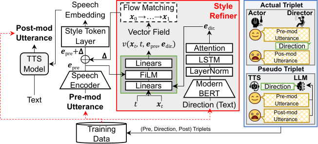
*Figure 1:Overview of refinement with direction and actual and pseudo training data.*

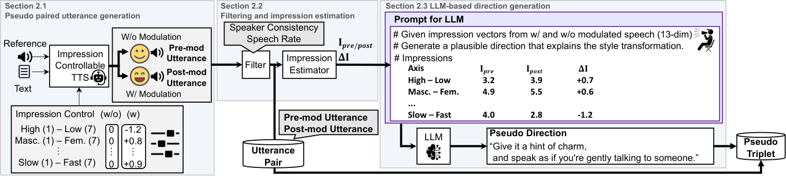
*Figure 2:Overview of pseudo data generation.*

---
**Usage Info**: 2410 tokens used.
**Generated at**: 2026-09-03 17:29:28

---

# 📚 Hearing the Whispers: Black-Box Membership Inference Attacks on Finetuned TTS Models

🚀 URL: https://arxiv.org/html/2609.01723

## 🌏 Abstract (원문)
Text-to-Speech (TTS) foundation models are increasingly fine-tuned on private datasets to synthesize highly personalized voices, introducing severe privacy risks by exposing both biometric identities and sensitive speech content. Existing black-box membership inference attacks (MIAs) follow a two-stage pipeline of query generation and representation engineering, both of which face unique challenges when adapted to TTS. For query generation, dual conditioning on synthesis text and reference speech creates a large and underexplored query design space with no established criterion for identifying an effective query. For representation engineering, the multi-level speech characteristics and temporal variability of speech make low-level representations and direct comparisons inadequate for capturing membership signals. To address these challenges, we present the first black-box MIA framework explicitly tailored to TTS models at both the speaker and record levels. For query generation, we characterize the feasible query space and establish two criteria, scorable extent and memorization elicitation, for evaluating five representative queries, identifying recitation as the strongest. For representation engineering, we obtain multi-level speech representations from high-fidelity embedding models and temporally align the generated and target audio for fine-grained comparison. Evaluations across three state-of-the-art TTS models (CosyVoice2, F5-TTS, and XTTS-v2) fine-tuned on two benchmark datasets (VCTK and British Dialect) reveal severe privacy leakage: speaker-level AUC remains above 0.80 and approaches 1.0 in the strongest settings, while record-level AUC ranges from 0.80 to 0.90 and remains effective even in challenging scenarios where both members and non-members are of the same speakers. We further identify speech characteristics associated with disproportionate vulnerability to memorization.
## 🌏 Abstract (번역)
텍스트 음성 변환(TTS) 파운데이션 모델은 고도로 개인화된 음성을 합성하기 위해 개인 데이터셋에 점점 더 많이 미세 조정되고 있으며, 이는 생체 인식 신원과 민감한 음성 콘텐츠를 모두 노출하여 심각한 개인 정보 보호 위험을 초래합니다. 기존의 블랙박스 멤버십 추론 공격(MIA)은 쿼리 생성과 표현 엔지니어링이라는 두 단계 파이프라인을 따르는데, 이 두 단계 모두 TTS에 적용될 때 고유한 과제에 직면합니다. 쿼리 생성의 경우, 합성 텍스트와 참조 음성에 대한 이중 조건 부여는 효과적인 쿼리를 식별하기 위한 확립된 기준이 없는 크고 탐색되지 않은 쿼리 설계 공간을 만듭니다. 표현 엔지니어링의 경우, 다단계 음성 특성과 음성의 시간적 가변성으로 인해 낮은 수준의 표현과 직접적인 비교는 멤버십 신호를 포착하기에 부적절합니다. 이러한 과제를 해결하기 위해, 우리는 화자 및 기록 수준 모두에서 TTS 모델에 명시적으로 맞춤화된 최초의 블랙박스 MIA 프레임워크를 제시합니다. 쿼리 생성의 경우, 우리는 가능한 쿼리 공간을 특성화하고 다섯 가지 대표 쿼리를 평가하기 위한 두 가지 기준인 '점수화 가능 범위(scorable extent)'와 '기억 유도(memorization elicitation)'를 설정하여, 낭독(recitation)이 가장 강력하다는 것을 확인했습니다. 표현 엔지니어링의 경우, 우리는 고충실도 임베딩 모델에서 다단계 음성 표현을 얻고 생성된 오디오와 대상 오디오를 시간적으로 정렬하여 세밀한 비교를 수행합니다. 세 가지 최첨단 TTS 모델(CosyVoice2, F5-TTS, XTTS-v2)을 두 가지 벤치마크 데이터셋(VCTK 및 British Dialect)에 미세 조정하여 평가한 결과 심각한 개인 정보 유출이 드러났습니다. 화자 수준 AUC는 0.80 이상을 유지하며 가장 강력한 설정에서는 1.0에 근접했고, 기록 수준 AUC는 0.80에서 0.90 사이였으며 멤버와 비멤버가 동일한 화자인 어려운 시나리오에서도 효과적이었습니다. 우리는 또한 기억에 대한 불균형적인 취약성과 관련된 음성 특성을 추가로 식별합니다.

## 🔍 Methods & Results
- 제안된 블랙박스 MIA 프레임워크는 TTS 모델의 쿼리 생성 및 표현 엔지니어링 단계에서 발생하는 고유한 과제를 해결합니다.
- 쿼리 생성 단계에서는 TTS의 이중 조건부 특성으로 인한 넓은 쿼리 공간 문제를 해결하기 위해 '점수화 가능 범위'와 '기억 유도'라는 두 가지 평가 기준을 설정하고, 다섯 가지 대표 쿼리 중 '낭독(Recitation)'이 가장 강력함을 확인했습니다.
- 화자 수준 MIA를 위해서는 사전 훈련된 화자 검증(SV) 모델(WavLM + ECAPA-TDNN)을 사용하여 안정적인 전역 신원 벡터를 추출하고 코사인 유사도로 비교했습니다.
- 기록 수준 MIA를 위해서는 자체 지도 학습된 WavLM 인코더의 풀링되지 않은 은닉 상태를 사용하여 미세 음향 특징을 포착하고, 수정된 동적 시간 왜곡(DTW)을 통해 시간 정렬 후 LSTM 네트워크로 멤버십 점수를 산출했습니다.
- 세 가지 최첨단 TTS 모델(CosyVoice2, F5-TTS, XTTS-v2)과 두 가지 벤치마크 데이터셋(VCTK, British Dialect)에 대한 평가에서 심각한 개인 정보 유출이 드러났습니다.
- 화자 수준 MIA의 AUC는 0.80 이상이었고 가장 강력한 설정에서는 1.0에 근접했으며, 기록 수준 MIA의 AUC는 0.80에서 0.90 사이로, 멤버와 비멤버가 동일 화자인 경우에도 효과적이었습니다.
- 기억에 대한 불균형적인 취약성과 관련된 음성 특성도 추가로 식별되었습니다.

## 🖼 Figures

*(a)Target speech.*

*(a)Target speech.*

*(b)Generated speech.*

*(c)Aligned speech.*

*(a)Speaker MIA on VCTK.*

*(a)Speaker MIA on VCTK.*

*(b)Speaker MIA on British Dialect.*

*(c)Record MIA on VCTK.*

*(d)Record MIA on British Dialect.*

*Fig. 3:Record-level MIA maintains comparable low-FPR performance even when non-members are drawn from seen speakers, confirming that the attack captures record-specific memorization beyond speaker identity.*

*(a)Speaker-Level MIA.*

*(a)Speaker-Level MIA.*

*(b)Record-Level MIA.*

*(a)Speaker-Level MIA.*

*(a)Speaker-Level MIA.*

*(b)Record-Level MIA.*

*(a)XTTS-v2.*

*(a)XTTS-v2.*

*(b)CosyVoice2.*

*(a)MIA performance with each individual WavLM layer feature; lower layers are generally more discriminative than upper layers.*

*(a)MIA performance with each individual WavLM layer feature; lower layers are generally more discriminative than upper layers.*

*(b)Aggregating more top-ranked layers improves MIA performance monotonically, making full-hierarchy aggregation the best default.*

*Fig. 8:DTW substantially outperforms alternative alignment methods for record-level MIA, showing that fine-grained local alignment is important.*

*(a)Speaker-Level MIA.*

*(a)Speaker-Level MIA.*

*(b)Record-Level MIA.*

*Fig. 10:Speaker-Level MIA performance improves with the number of attacker utterances and converges at around 7–9 recordings.*

*(a)Speaker-Level MIA.*

*(a)Speaker-Level MIA.*

*(b)Record-Level MIA.*

*Fig. 12:Male speakers are more vulnerable to speaker-level MIA than female speakers, possibly due to greater within-group acoustic variability in female speech.*

*Fig. 13:Spectrograms of a target speech (left) and its reconstructions under the recitation query by a model that was trained on the recording (middle, member) and by a model trained with the same recipe but without it (right, non-member). The member reconstruction reproduces the harmonic and formant structure closely, whereas the non-member reconstruction renders the same content with a smoother, generic pattern that lacks detail.*

*Fig. 14:Reconstruction scores of members and non-members when the synthesis text is fixed to 
𝑡
∗
 and the reference speech is either the full 
𝑠
∗
 (left) or a random window covering half of it (right). Dashed lines mark the mean of each population and 
Δ
 denotes the gap between the two means.*

*(a)Speaker-level MIA.*

*(a)Speaker-level MIA.*

*(b)Record-level MIA.*

---
**Usage Info**: 9265 tokens used.
**Generated at**: 2026-09-03 17:29:51

---

# 📚 VibeVoice-ASR-Streaming Technical Report

🚀 URL: https://arxiv.org/html/2609.02812

## 🌏 Abstract (원문)
Traditional speaker-attributed ASR systems treated ASR and speaker diarization as two separate tasks. Recently, end-to-end models such as VibeVoice-ASR have unified the two tasks within a single model. However, existing unified models still mainly support offline recognition, making it difficult to meet the low-latency requirements of real-time voice assistants and agents. To tackle this issue, we presentVibeVoice-ASR-Streaming, one of the first LLM-based end-to-end approaches to streaming speaker-attributed ASR. It interleaves fixed-size audio chunks, a small amount of lookahead audio and previous text. This allows the model to produce “who said what” as speech arrives, without a separate diarization stage. For transcription accuracy, our 7B model achieves the lowest average WER/CER across five evaluation sets. For speaker attribution, it achieves the best or tied-best on 12 of 13 evaluation settings. We release the 1.5B and 7B model weights together with inference code.
## 🌏 Abstract (번역)
기존의 화자 귀속 ASR 시스템은 ASR과 화자 분리(diarization)를 두 개의 별도 작업으로 처리했습니다. 최근 VibeVoice-ASR과 같은 종단 간(end-to-end) 모델은 두 작업을 단일 모델 내에서 통합했습니다. 그러나 기존의 통합 모델은 여전히 주로 오프라인 인식을 지원하여 실시간 음성 비서 및 에이전트의 낮은 지연 시간 요구 사항을 충족하기 어렵습니다. 이 문제를 해결하기 위해 우리는 스트리밍 화자 귀속 ASR을 위한 최초의 LLM 기반 종단 간 접근 방식 중 하나인 VibeVoice-ASR-Streaming을 제시합니다. 이 모델은 고정 크기 오디오 청크, 소량의 미리보기 오디오(lookahead audio) 및 이전 텍스트를 인터리브(interleave)합니다. 이를 통해 모델은 별도의 화자 분리 단계 없이 음성이 도착하는 대로 “누가 무엇을 말했는지”를 생성할 수 있습니다. 전사 정확도 측면에서, 우리의 7B 모델은 5개의 평가 세트에서 가장 낮은 평균 WER/CER을 달성합니다. 화자 귀속 측면에서는 13개 평가 설정 중 12개에서 최고 또는 공동 최고 성능을 달성합니다. 우리는 1.5B 및 7B 모델 가중치와 추론 코드를 공개합니다.

## 🔍 Methods & Results
- VibeVoice-ASR-Streaming은 기존의 분리된 ASR 및 화자 분리 작업을 LLM 기반의 단일 종단 간 스트리밍 시스템으로 통합하여 실시간 음성 비서 및 에이전트의 낮은 지연 시간 요구 사항을 충족합니다.
- 이 모델은 고정 크기 오디오 청크, 소량의 미리보기 오디오(lookahead audio), 그리고 이전 텍스트를 인터리브하여 음성이 도착하는 즉시 '누가 무엇을 말했는지'를 별도의 화자 분리 단계 없이 생성합니다.
- VibeVoice-ASR을 기반으로 하며, VibeVoice의 사전 학습된 이중 토크나이저(음향 및 의미 토크나이저)를 사용하여 스펙트럼 세부 정보와 언어 콘텐츠를 공통 시간 그리드에서 제공합니다.
- 토크나이저의 표현은 Qwen2.5 LLM 백본의 임베딩 공간으로 연결 및 투영되어 화자 귀속 ASR을 수행합니다.
- 들어오는 음성과 생성된 텍스트를 인터리브된 시퀀스(Xk, Yk)로 구성하며, 이전 음성 및 생성된 텍스트는 LLM 컨텍스트에 유지되어 각 청크가 대화 기록에 따라 디코딩됩니다.
- 청크 경계 근처에서 제한된 미래 음향 증거를 제공하기 위해 고정된 미리보기(L=4 잠재 프레임)를 도입하며, 15 잠재 프레임(2.0초) 및 22 잠재 프레임(2.9초)의 두 가지 청크 구성으로 평가되었습니다.
- ASR 및 화자 귀속을 단일 자동 회귀 생성 작업으로 공식화하여 '누가 무엇을 말했는지'를 직접 생성하며, 텍스트 생성은 음성-종료 토큰(<|object_ref_end|>)으로 오디오 스팬이 닫히면 시작됩니다.
- 각 Yk는 <|text_chunk_end|> 토큰으로 끝나며, 모델은 이 토큰을 언제 방출할지 결정하여 오디오 스트림으로 제어권을 넘깁니다.
- VibeVoice-ASR-Streaming은 VibeVoice-ASR의 문맥 프롬프트 기능을 유지하여 이름, 기술 용어, 약어 등 선택적 컨텍스트를 디코딩 전에 제공할 수 있습니다.
- 화자는 첫 등장 순서대로 할당된 서수 레이블로 식별되며, 이 레이블은 해당 화자가 다시 인식될 때마다 재사용됩니다. 동시 발화는 병렬 스트림이 아닌 연속적인 레이블이 지정된 세그먼트로 출력됩니다.
- 훈련 데이터는 50,884개의 녹음, 총 4,519.6시간의 증강된 다중 화자 음성(실제 및 합성)으로 구성되며, 다중 화자 음향 조건 및 전문 어휘에 대한 견고성을 향상시키기 위해 합성 데이터가 포함됩니다.
- 훈련은 세 단계로 진행됩니다: 1단계는 오프라인 화자 귀속 설정에서 기본 능력을 확립하고, 2단계는 인터리브된 스트리밍 형식에 적응하며, 3단계는 사용자 경험(전사 규칙, 일관된 화자 레이블링, 핫워드 추종)을 미세 조정합니다.
- 7B 모델은 전사 정확도에서 5개 평가 세트에서 가장 낮은 평균 WER/CER을 달성했으며, 화자 귀속에서는 13개 평가 설정 중 12개에서 최고 또는 공동 최고 성능을 달성했습니다.
- 1.5B 및 7B 모델 가중치와 추론 코드가 공개되었습니다.

## 🖼 Figures

*Figure 2: Architecture of VibeVoice-ASR-Streaming. Speech chunks 
𝑋
𝑘
 and speaker-attributed text chunks 
𝑌
𝑘
 are interleaved in a single autoregressive context, and each chunk is followed by a fixed 
𝐿
=
4
-frame (0.5 s) lookahead before its text is generated.*

---
**Usage Info**: 4014 tokens used.
**Generated at**: 2026-09-03 17:30:01

---

# 📚 VoRTeC: Taming Foundation Flow for One-step Real time Video Compression

🚀 URL: https://arxiv.org/html/2609.02291

## 🌏 Abstract (원문)
Ultra-low bitrate video compression still faces critical challenges: traditional neural video compression inevitably introduces blurring artifacts, while diffusion-based generative video compression suffers from excessive decoding latency and poor temporal consistency. To address these issues, we propose𝚅𝚘𝚁𝚃ｅ𝙲\mathtt{VoRTeC}, a Video Compression framework built upon a foundational flow model (Wan2.1). By compactly encoding latent video representations, predicting the positions of compressed representations along flow trajectories, and integrating multi-scale priors,𝚅𝚘𝚁𝚃ｅ𝙲\mathtt{VoRTeC}enables the compressor to harness generative video flow priors effectively. Without accessing the parameters or gradients of flow matching networks, our framework achieves one-step decoding and reconstructions with high perceptual fidelity. Meanwhile, we maintain consistency across frame groups via tail-frame reuse and prior caching. Extensive experiments demonstrate that our method reduces bit consumption by 58% compared to prior diffusion-based approaches, with decoding speed boosted by 3 to 197 times:𝚅𝚘𝚁𝚃ｅ𝙲\mathtt{VoRTeC}achieves a decoding speed of 13 FPS at 720p and 32 FPS at 480p.Project page: https://darc8-sun.github.io/VoRTec_compress/.
## 🌏 Abstract (번역)
초저비트레이트 비디오 압축은 여전히 중요한 과제에 직면해 있습니다. 기존의 신경망 기반 비디오 압축은 필연적으로 블러링 아티팩트를 유발하는 반면, 확산 기반 생성형 비디오 압축은 과도한 디코딩 지연 시간과 낮은 시간적 일관성으로 어려움을 겪습니다. 이러한 문제들을 해결하기 위해 우리는 기초 플로우 모델(Wan2.1)을 기반으로 구축된 비디오 압축 프레임워크인 VoRTeC를 제안합니다. VoRTeC는 잠재 비디오 표현을 압축적으로 인코딩하고, 플로우 궤적을 따라 압축된 표현의 위치를 예측하며, 다중 스케일 프라이어를 통합함으로써 압축기가 생성형 비디오 플로우 프라이어를 효과적으로 활용할 수 있도록 합니다. 플로우 매칭 네트워크의 파라미터나 기울기에 접근하지 않고도, 우리 프레임워크는 높은 지각적 충실도를 가진 원스텝 디코딩 및 재구성을 달성합니다. 동시에, 우리는 꼬리 프레임 재사용과 프라이어 캐싱을 통해 프레임 그룹 전반에 걸쳐 일관성을 유지합니다. 광범위한 실험은 우리 방법이 이전 확산 기반 접근 방식에 비해 비트 소비를 58% 감소시키고, 디코딩 속도를 3배에서 197배까지 향상시킴을 보여줍니다. VoRTeC는 720p에서 13 FPS, 480p에서 32 FPS의 디코딩 속도를 달성합니다. 프로젝트 페이지: https://darc8-sun.github.io/VoRTec_compress/.

## 🔍 Methods & Results
- VoRTeC는 3D 분석 인코더를 사용하여 입력 프레임 그룹을 압축된 시공간 잠재 표현으로 변환하며, 첫 프레임은 I-잠재로, 이후 프레임은 P-잠재로 인코딩하여 그룹 내 시공간 일관성을 확보합니다.
- 전체 비디오 시퀀스를 키 그룹(I-그룹)과 예측 그룹(P-그룹)으로 분할하고, 캐시된 이전 잠재 및 I-잠재를 그룹 전체 컨텍스트로 활용하여 잠재 단위 컨텍스트 모델링을 수행합니다.
- 압축된 표현의 플로우 궤적 상의 대략적인 위치를 추정하고, 이 정보를 디코더로 전송하여 FlowDIT가 플로우 매칭 노이즈 제거를 수행하도록 합니다.
- 플로우 프라이어 재구성(z^0g)은 압축된 표현(zcg) 및 캐시된 프라이어 컨텍스트(zctx)와 함께 프라이어 융합 네트워크(F())에 입력되어 추가 정제를 거치며, 결과는 다음 P-그룹 재구성을 돕기 위해 프라이어 캐시에 저장됩니다.
- 그룹 간 일관성을 위해 비침습적 캐싱 메커니즘을 설계하여, I-그룹의 마지막 프레임을 P-그룹의 첫 프레임으로 사용하고, I-그룹의 재구성된 비디오 마지막 프레임을 잠재 캐시에 재인코딩하여 다음 그룹의 컨텍스트로 활용합니다.
- 압축된 표현을 플로우 경로 상의 상태로 간주하고, Wasserstein 거리를 사용하여 최적의 시간 단계(t*)를 계산한 후 반올림된 정수 값을 전송하여 플로우 매칭 노이즈 제거에 활용합니다.
- FlowPriorMultiFusion (FPMF)이라는 Transformer 기반의 프라이어 보정 및 정렬 네트워크를 통해 시간 추정 오류와 압축된 표현 분포의 불일치로 인한 재구성 품질 저하를 개선합니다.
- FPMF는 현재 및 이전 그룹의 플로우 프라이어 재구성(고주파 세부 정보)과 압축된 표현(저주파 비지역적 특징)을 각각 세밀하고 거친 패치로 분할하여 입력받아 융합하며, 이를 통해 재구성 성능 향상 및 비트레이트 감소를 달성합니다.
- VoRTeC는 속도 손실(rate loss)과 재구성 손실(latent domain, image domain, adversarial loss)을 포함하는 엔드투엔드 훈련을 통해 최적화됩니다.
- 실험 결과, 기존 확산 기반 방식 대비 비트 소비를 58% 절감하고, 디코딩 속도를 3배에서 197배까지 향상시켰으며, 720p에서 13 FPS, 480p에서 32 FPS의 디코딩 속도를 달성했습니다.

## 🖼 Figures

*Figure 1:Left: Comparison of rate-perception performance and decoding efficiency. 
𝚅𝚘𝚁𝚃𝚎𝙲
 (Ours) delivers a better rate–perception trade-off than prior diffusion-based video codecs and enables real-time decoding, running up to 
3
×
 faster than existing diffusion-based methods. Right: Qualitative comparison between baseline and our proposed approach. 
𝚅𝚘𝚁𝚃𝚎𝙲
 (Ours) is capable of reconstructing complex textures with realism, even at extremely low bit rates. Best viewed when zoomed in.*

*Figure 2:Overall pipeline of 
𝚅𝚘𝚁𝚃𝚎𝙲
. 
ℰ
 and 
𝒟
 denote the pre-trained 3D video en/decoder (Wang et al., 2025), and FlowDIT adopts the flow-matching network from Wan2.1 (1.3B) Wang et al. (2025).*

*Figure 3:Architecture of the Flow Prior Multi-Fusion (FPMF) module. By adopting patchify strategies with different granularities, FPMF achieves precise alignment between prior texture and structural features of compressed latent, facilitating more compact encoding and high-fidelity reconstruction.*

*Figure 4:Visualizations of the modules and selected methods. (a) Coarse-grained patchify drives compressed tokens to capture structural information, while fine-grained patchify distributes attention over latent space. (b) Overestimated or underestimated predictions cause the denoising network to either skip denoising entirely or render the image excessively smooth. Flow-State Estimation (FSE) precisely calculates the temporal state with high accuracy.*

*Figure 6:Quantitative experiments for verifying inter-frame continuity/consistency. (a) FloLPIPS metrics of various methods tested on the UVG dataset. Our proposed method consistently outperforms the baselines. (b) 
𝐸
𝑤
​
𝑎
​
𝑟
​
𝑝
 metrics and corresponding bpp values of various methods tested on the HEVC-ClassB dataset. 
𝚅𝚘𝚁𝚃𝚎𝙲
 achieves the minimal 
𝐸
𝑤
​
𝑎
​
𝑟
​
𝑝
 even at the lowest bpp, indicating superior inter-frame continuity.*

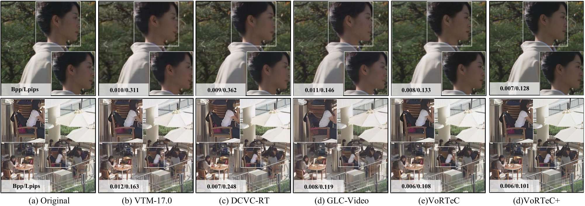
*Figure 7:Qualitative illustrations of various methods. Best viewed when zoomed in.*

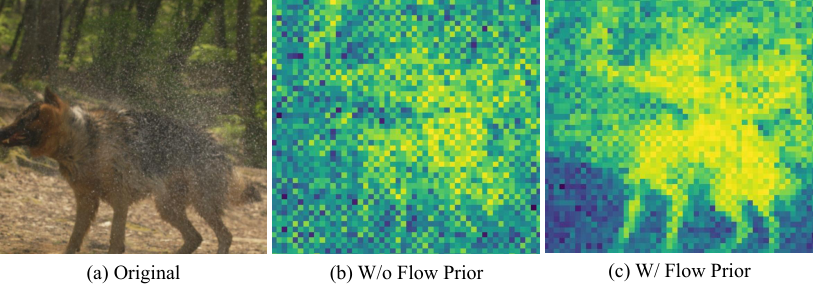
*Figure 11:Investigate the impact of the flow prior on learning the codec bit-rate distribution. Incorporating the flow prior enables the codec to learn more compact and rational bit allocation during end-to-end training.*

*Figure 12:We achieve a certain range of bit-rate scaling by adjusting the number of Pgroups within one Meta-group. Each color indicates the scalable bit-rate range supported by our single model, and the red star marks the number of Pgroups adopted in our main experiments. This further demonstrates the scalability and flexibility of 
𝚅𝚘𝚁𝚃𝚎𝙲
.*

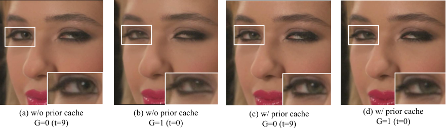
*Figure 13:The impact of prior caching on inter-group consistency is investigated. When prior caching is disabled, learning inter-group contextual information becomes difficult, resulting in abrupt changes to details including colors and contours.*

---
**Usage Info**: 5210 tokens used.
**Generated at**: 2026-09-03 17:30:16

---

# 📚 CAT-Flow: Curvature-Adaptive sTeps for Flow Matching

🚀 URL: https://arxiv.org/html/2609.01746

## 🌏 Abstract (원문)
Flow Matching has emerged as a leading framework for generative modeling, powering state-of-the-art systems such as FLUX and Stable Diffusion 3.5. However, the iterative nature of its ODE-based sampling process creates a fundamental efficiency bottleneck: the quality of generated samples is highly sensitive to the choice of step-sizes, and current models typically require 20 to 30 steps for good quality. In this work, we propose two lightweight, training-free algorithms, CAT-OV and CAT-OT that adapt step-sizes at inference time based on a novel connection between Flow Matching sampling and gradient flow. Our algorithms are computed efficiently by not requiring additional neural function evaluations. Specifically, CAT-OT estimates curvature over time via a finite-difference approximation of the time-derivative of the vector field, while CAT-OV approximates curvature over the state space via a gradient of the vector field. Under suitable conditions, both methods have truncation error bounds of constant order. Empirically, CAT-OV and CAT-OT outperform existing step-size heuristics in image quality metrics across four text-to-image Flow Matching models, reducing the number of generation steps required to reach comparable quality by up to 40%.
## 🌏 Abstract (번역)
Flow Matching은 FLUX 및 Stable Diffusion 3.5와 같은 최첨단 시스템을 구동하는 생성 모델링의 선도적인 프레임워크로 부상했습니다. 그러나 ODE 기반 샘플링 프로세스의 반복적인 특성은 근본적인 효율성 병목 현상을 야기합니다. 생성된 샘플의 품질은 스텝 사이즈 선택에 매우 민감하며, 현재 모델은 일반적으로 좋은 품질을 위해 20~30단계가 필요합니다. 본 연구에서는 Flow Matching 샘플링과 그래디언트 플로우 간의 새로운 연결을 기반으로 추론 시 스텝 사이즈를 조정하는 두 가지 경량의 학습 없는 알고리즘인 CAT-OV와 CAT-OT를 제안합니다. 우리 알고리즘은 추가적인 신경 함수 평가를 요구하지 않아 효율적으로 계산됩니다. 구체적으로, CAT-OT는 벡터 필드의 시간 미분(time-derivative)의 유한 차분 근사를 통해 시간에 따른 곡률을 추정하는 반면, CAT-OV는 벡터 필드의 그래디언트를 통해 상태 공간에 따른 곡률을 근사합니다. 적절한 조건 하에서 두 방법 모두 상수 차수의 절단 오차 경계를 가집니다. 경험적으로, CAT-OV와 CAT-OT는 4개의 텍스트-이미지 Flow Matching 모델에서 기존 스텝 사이즈 휴리스틱보다 이미지 품질 지표에서 우수한 성능을 보였으며, 유사한 품질에 도달하는 데 필요한 생성 단계 수를 최대 40%까지 줄였습니다.

## 🔍 Methods & Results
- Flow Matching 샘플링과 그래디언트 플로우 간의 새로운 연결을 확립하여, Flow Matching 솔루션을 손실 함수를 최소화하는 것으로 해석하고 적응형 스텝 사이즈 ODE 솔버 설계의 기반을 마련했습니다.
- ODE 솔루션의 곡률(벡터 필드의 변화)에 따라 스텝 사이즈를 동적으로 조정하는 방법을 제안합니다. 곡률이 클 때는 스텝 사이즈를 줄이고, 작을 때는 늘려 효율성을 높입니다.
- CAT-OT는 벡터 필드의 시간 미분(time-derivative)의 유한 차분 근사를 통해 시간에 따른 벡터 필드의 변화(곡률)를 측정하여 스텝 사이즈를 조정합니다.
- CAT-OV는 RMSProp에서 영감을 받아 벡터 필드의 값 변화(상태 공간에 따른 곡률)를 측정하며, `(1-t_k)u(x_k, t_k; θ)` 항을 사용하여 솔루션 궤적을 따른 그래디언트를 근사합니다.
- CAT-OT는 이전 시간 단계에 대한 벡터 필드의 변화를 고려하는 반면, CAT-OV는 할인된 방식으로 전체 과거 이력에 걸친 값의 변화를 고려합니다.
- 두 방법 모두 적절한 조건 하에서 상수 차수의 절단 오차 경계를 가지며, 추가적인 신경 함수 평가 없이 효율적으로 계산됩니다.
- 실험적으로, CAT-OV와 CAT-OT는 4개의 텍스트-이미지 Flow Matching 모델에서 기존 스텝 사이즈 휴리스틱보다 이미지 품질 지표에서 우수한 성능을 보였고, 유사한 품질에 도달하는 데 필요한 생성 단계를 최대 40%까지 줄였습니다.

## 🖼 Figures

*(a)male king arthur and his squirrel wife, photo, man wearing crown*

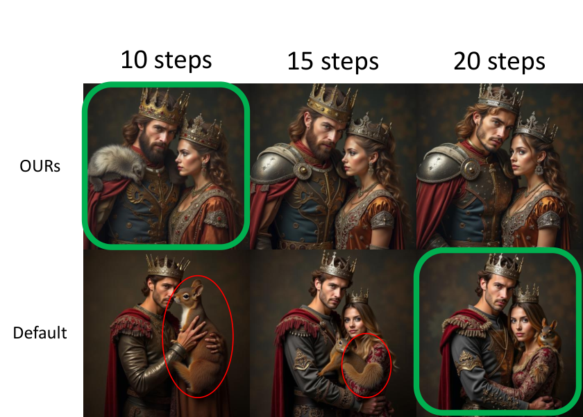
*(a)male king arthur and his squirrel wife, photo, man wearing crown*

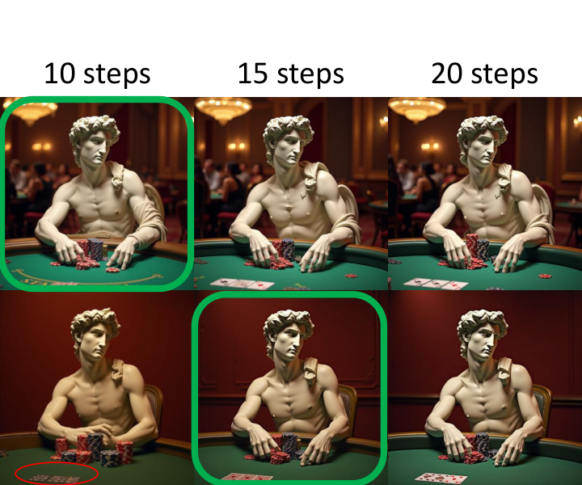
*(b)the statue david from michelangelo sitting at a poker table with many chips*

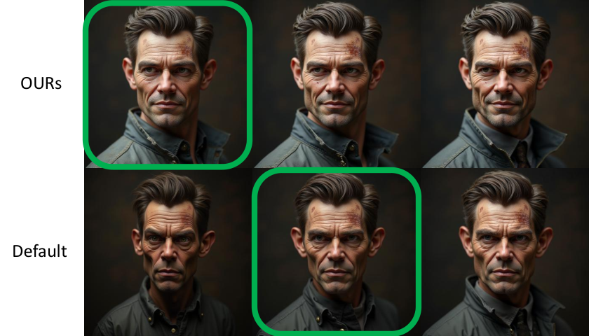
*(c)photo taken of an epic intricate exquisitely weathered animatronic man, creature created by weta workshop*

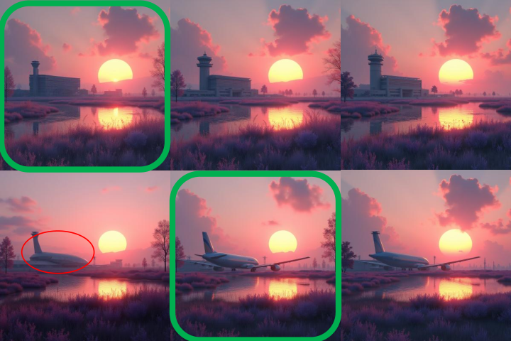
*(d)a rendering of building airport by john howe, flowers morning sun reclaimed by nature cgsociety sunset infrared nightvision lake thermal imaging myst made of glass*

*Figure 2:Performance comparison across different total numbers of generation steps. CAT-OV (red) outperforms baselines in both efficiency (reach of saturation dashed line) and metric scores (AES, HPSv3) in nearly all numbers of steps and across all models. CAT-OT (green) outperforms baselines for FLUX-1-dev and SD-3.5 models in both efficiency and metric scores. Each point is the average score across 100 prompts.*

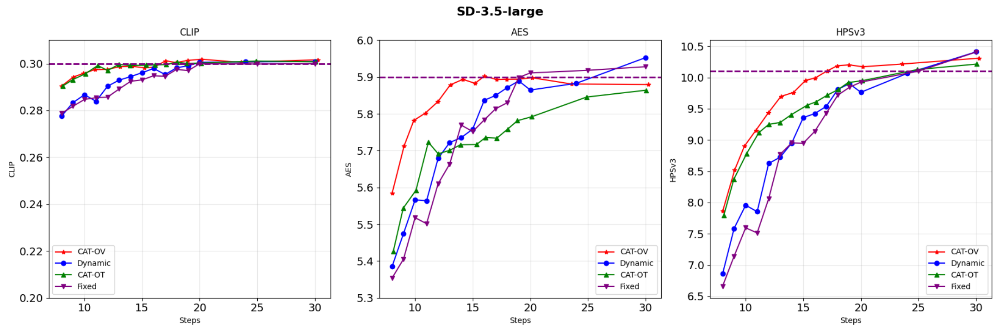
*Figure 8*

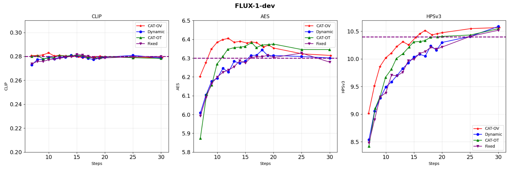
*Figure 9*

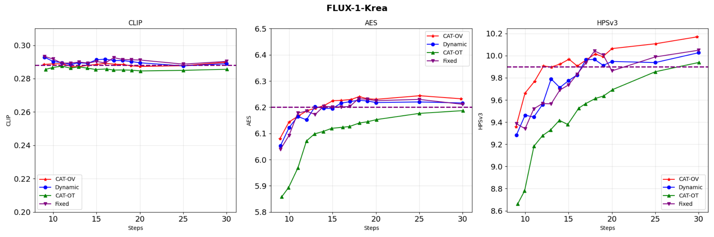
*Figure 10*

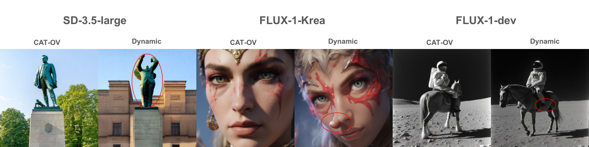
*Figure 3:Images generated with 10 generation steps. All models with Dynamic induce different levels of artifacts as highlighted, whereas CAT-OV has no significant observed artifacts.*

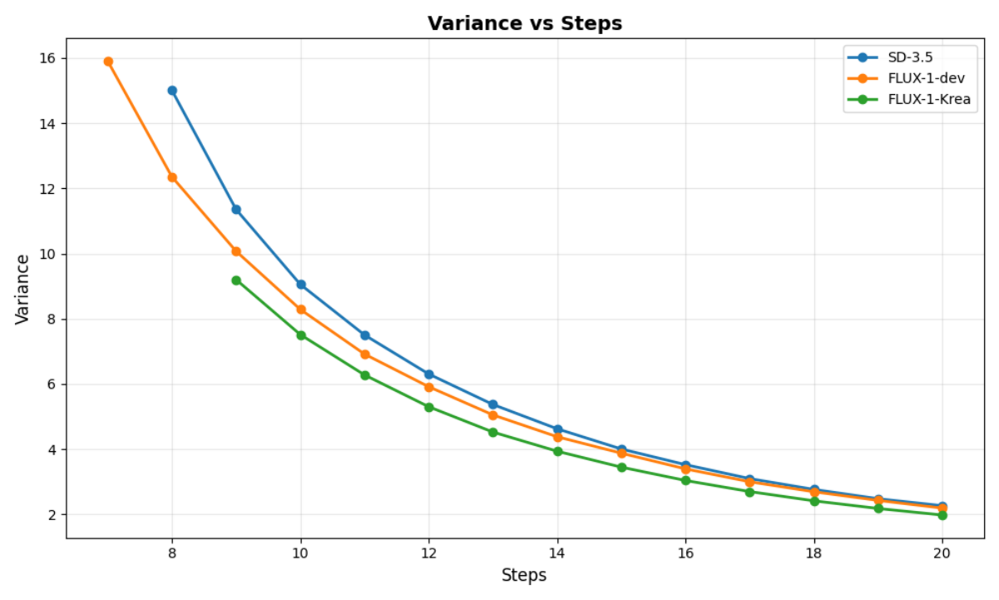
*Figure 4:Changes on empirical variance for different models and total number of generative steps.*

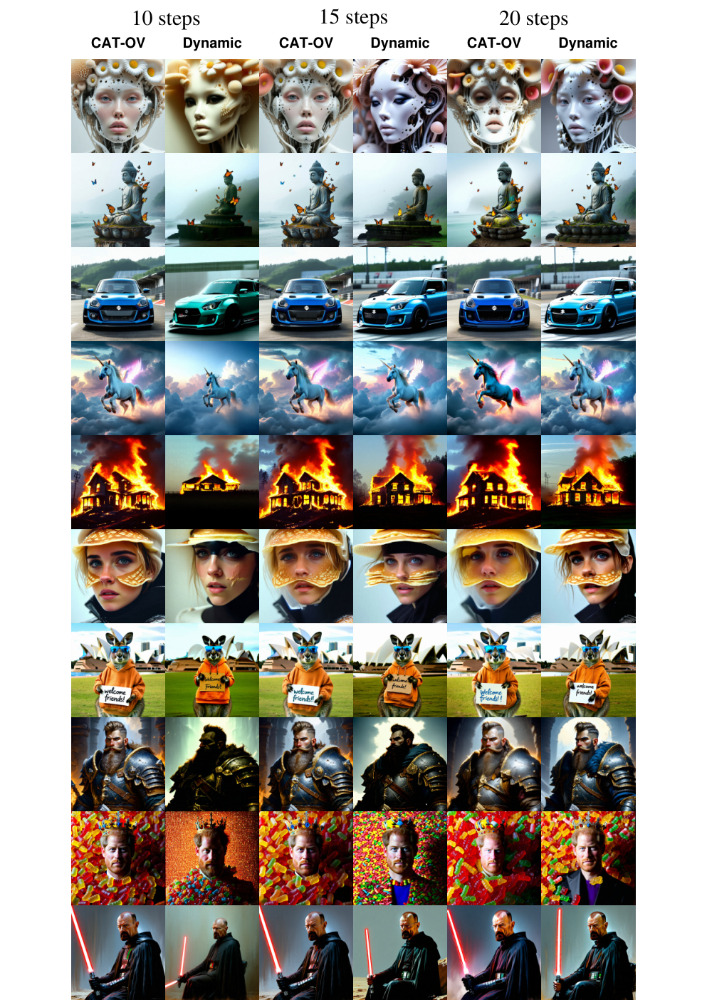
*Figure 5:Additional qualitative results from SD-3.5-large.*

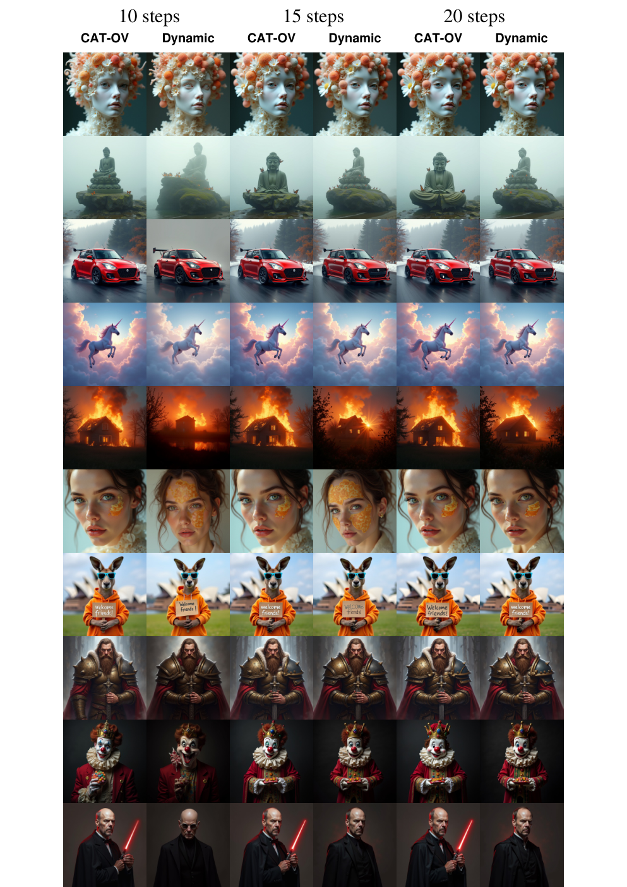
*Figure 6:Additional qualitative results from FLUX-1-dev.*

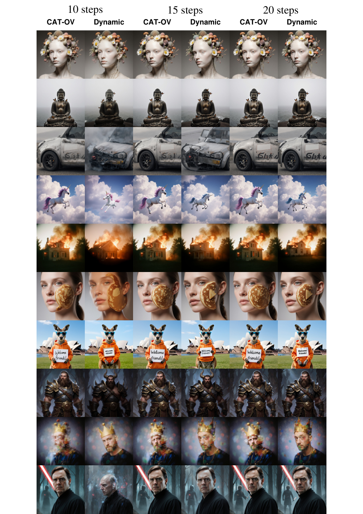
*Figure 7:Additional qualitative results from FLUX-1-Krea.*

---
**Usage Info**: 4649 tokens used.
**Generated at**: 2026-09-03 17:30:32

---

