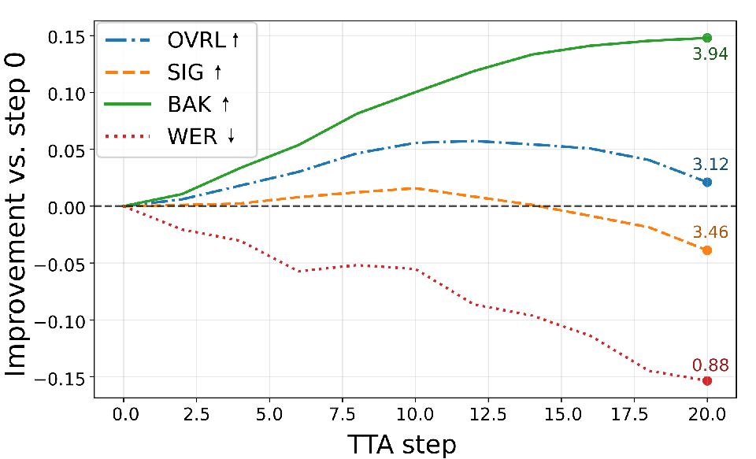
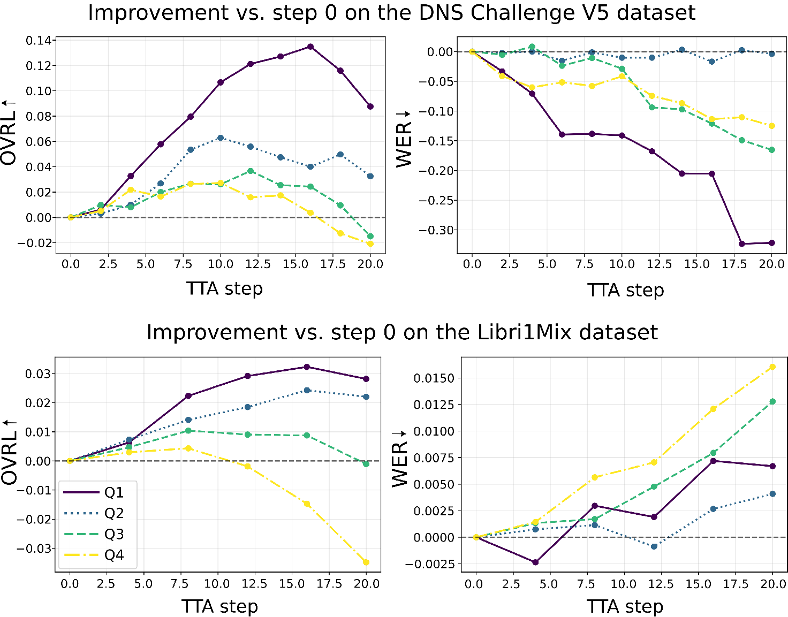
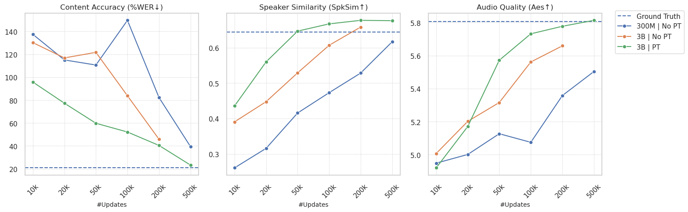
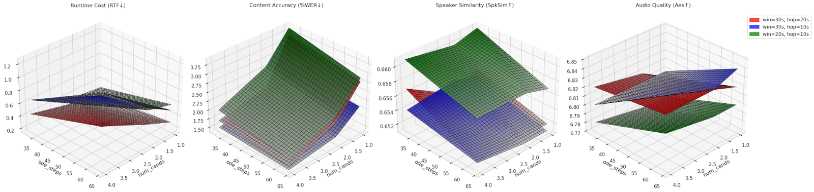
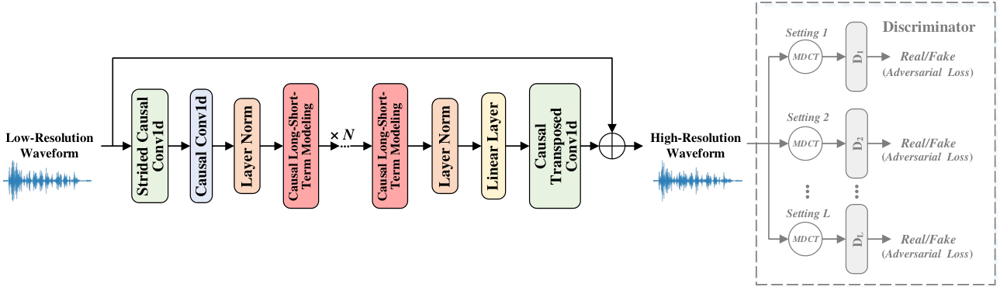
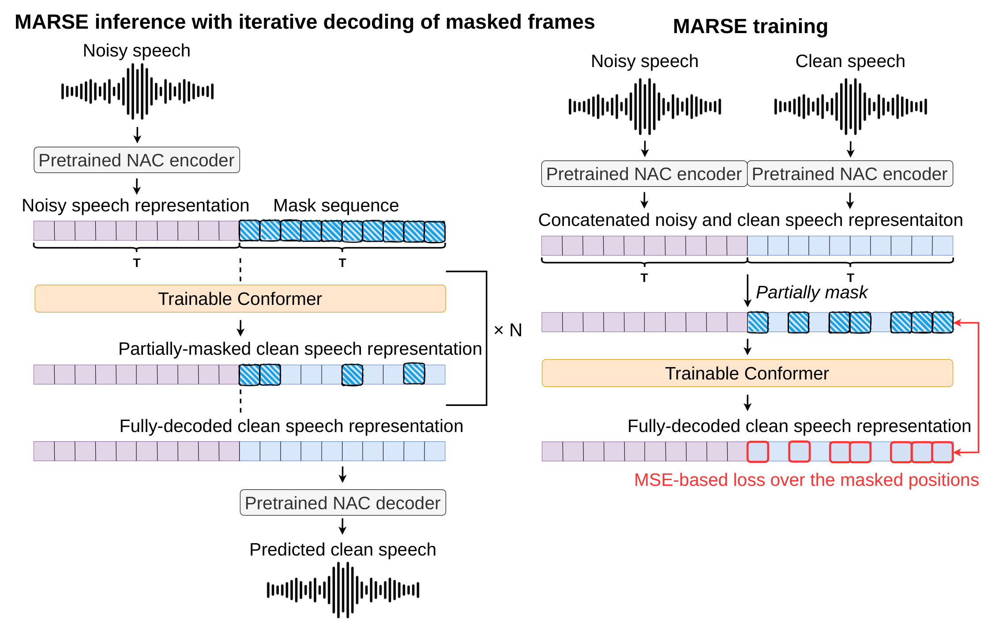
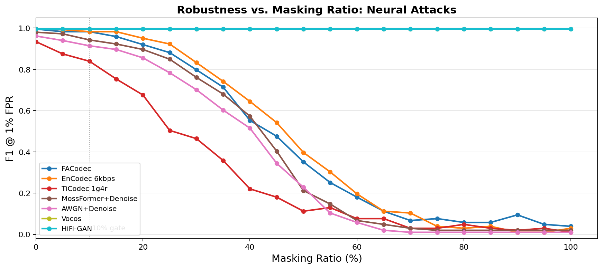
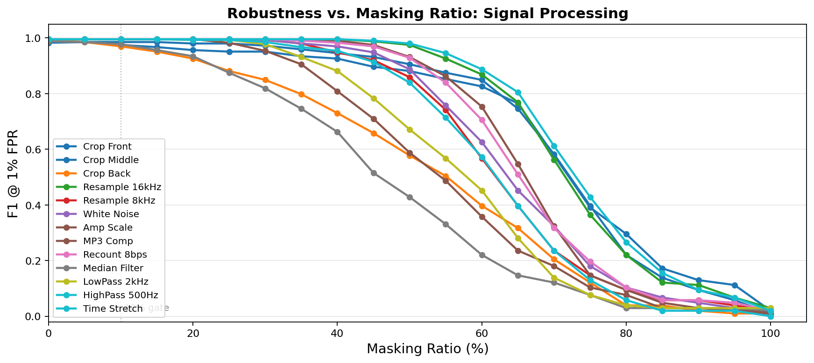

# 🚩 (2026-09-05) Scholar Inbox 추천 논문 

# 📚 Test-time adaptation for speech enhancement with an autoregressive speech prior

🚀 URL: https://arxiv.org/html/2609.03622

## 🌏 Abstract (원문)
Test-time adaptation (TTA) offers a promising direction for improving speech enhancement models under mismatched acoustic conditions, without requiring access to labeled target data. In this work, we propose a single-utterance TTA method that regularizes a pretrained speech enhancement model using an autoregressive prior trained on clean speech latent representations extracted from a neural audio codec. Adaptation is performed by minimizing the Kullback-Leibler divergence between the enhanced speech distribution and the clean speech prior. Experiments across multiple noisy speech datasets show consistent improvements in speech quality, particularly under training-testing noise mismatch conditions. Code and audio examples are available online.111https://sofienekammoun.github.io/TAAP-SE/This research was partly supported by the ANR project ANR-23-CE23-0009.
## 🌏 Abstract (번역)
테스트 시간 적응(TTA)은 레이블이 지정된 타겟 데이터에 대한 접근 없이, 불일치하는 음향 조건에서 음성 향상 모델을 개선하기 위한 유망한 방향을 제시합니다. 본 연구에서는 신경 오디오 코덱에서 추출된 깨끗한 음성 잠재 표현으로 훈련된 자기회귀 사전(autoregressive prior)을 사용하여 사전 훈련된 음성 향상 모델을 정규화하는 단일 발화 TTA 방법을 제안합니다. 적응은 향상된 음성 분포와 깨끗한 음성 사전 간의 쿨백-라이블러 발산(Kullback-Leibler divergence)을 최소화함으로써 수행됩니다. 여러 잡음이 있는 음성 데이터셋에 걸친 실험 결과, 특히 훈련-테스트 잡음 불일치 조건에서 음성 품질의 일관된 개선을 보여주었습니다. 코드와 오디오 예시는 온라인에서 확인할 수 있습니다. 본 연구는 ANR 프로젝트 ANR-23-CE23-0009의 부분적인 지원을 받았습니다.

## 🔍 Methods & Results
- 사전 훈련된 신경 오디오 코덱(NAC)의 잠재 공간에서 작동하는 지도 학습 기반 음성 향상(SE) 시스템을 기반으로 하며, 훈련-테스트 조건 불일치 시 기존 지도 학습 SE 모델의 일반화 성능 저하 문제를 해결하고자 한다.
- 깨끗한 음성 잠재 표현으로 훈련된 자기회귀 가우시안 사전(autoregressive Gaussian prior) p_theta(x)를 도입하여, NAC 잠재 공간에서 깨끗한 음성의 통계적 특성을 모델링한다. 이 사전은 전역 직교 행렬 W와 시간 가변 평균/분산 벡터를 사용하여 전체 공분산 모델을 효율적으로 처리한다.
- 테스트 시, 단일 발화 TTA(Test-Time Adaptation) 방법을 사용하여, 향상된 음성 분포와 깨끗한 음성 사전 간의 쿨백-라이블러 발산(KL divergence)을 최소화함으로써 SE 모델의 파라미터 phi를 최적화한다.
- 적응 알고리즘은 각 테스트 샘플에 대해 독립적으로 수행되며, 1초 길이의 잡음이 있는 음성 세그먼트를 사용하여 SE 모델을 새로운 음향 잡음 특성에 맞게 보정한다. 모델 파라미터 phi는 각 새로운 잡음 음성 신호 처리 전에 사전 훈련된 값으로 재초기화되어 모델이 입력과 무관하게 사전으로 수렴하는 것을 방지한다.
- 여러 잡음이 있는 음성 데이터셋에 대한 실험 결과, 특히 훈련-테스트 잡음 불일치 조건에서 음성 품질이 일관되게 향상됨을 확인했다.

## 🖼 Figures
![Fig. 1: Visualization of the clean‑speech prior log‑density and its role in TTA. Top: Spectrograms of a noisy input signal, the output of the pretrained SE model before and after adaptation, and the clean reference speech. Bottom: Normalized histogram of log‑density values for the pretrained prior evaluated on clean and noisy speech datasets. Vertical lines indicate the log-density values for the examples shown on top. The proposed TTA method pushes the enhanced output toward higher prior log-density values and closer to the clean reference.](../images/2026-09-05/2609.03622/2609.03622_fig0.png)
*Fig. 1: Visualization of the clean‑speech prior log‑density and its role in TTA. Top: Spectrograms of a noisy input signal, the output of the pretrained SE model before and after adaptation, and the clean reference speech. Bottom: Normalized histogram of log‑density values for the pretrained prior evaluated on clean and noisy speech datasets. Vertical lines indicate the log-density values for the examples shown on top. The proposed TTA method pushes the enhanced output toward higher prior log-density values and closer to the clean reference.*

*Fig. 2:Relative improvement of the metrics along TTA iterations, computed on the DNS Challenge V5 dev‑test set.*

*Fig. 3:OVRL and WER relative improvements over TTA steps and per initial prior log-density quartile, for the DNS Challenge V5 and Libri1Mix datasets.*

---
**Usage Info**: 4677 tokens used.
**Generated at**: 2026-09-05 16:31:57

---

# 📚 Building and Evaluating Fixed-Voice Thai TTS from Synthetic Speech

🚀 URL: https://arxiv.org/html/2609.03502

## 🌏 Abstract (원문)
In low-resource settings, deploying TTS typically requires choosing between a large voice-cloning model with costly inference or a compact fixed-voice system that requires a speaker-specific corpus. We study a third route: using a large voice-cloning model as a programmable data source to turn a short voice reference (e.g., 15 seconds) into a compact fixed-voice student trained entirely on synthetic speech. This setting makes pipeline design consequential: teacher errors become training targets, while filtering failed generations can reduce coverage of difficult texts. Thai further introduces challenges from ambiguous word boundaries, lexical tone, names and loanwords, numeric verbalization, and Thai–English code-switching. We study how text preparation, synthetic generation, quality filtering, rejection sampling, and frontend choices affect the resulting student, and where teacher limitations remain. We evaluate CER, Challenge-Set Keyword Accuracy, Prosody Pause Accuracy, speaker similarity, and speaking rate. The resulting 82M-parameter model,Wayu-Paxa-TTS-Edge, enables on-device Thai TTS without reference audio. It achieves 68.2% Challenge-Set Keyword Accuracy (85.5% of Gemini 3.1) and 91.4% pause precision, outperforming its OmniVoice teacher11footnotemark:1(89.9%) and reaching 94.8% of Gemini 3.1. It also achieves the lowest pause-placement error and intra-word pause rates among the three systems, and 3.7% and 1.1% CER on Thai and English, respectively. We open-source the model and evaluation framework for Thai TTS development.
## 🌏 Abstract (번역)
저자원 환경에서 TTS를 배포하려면 일반적으로 추론 비용이 많이 드는 대규모 음성 복제 모델과 화자별 코퍼스가 필요한 소형 고정 음성 시스템 중 하나를 선택해야 합니다. 본 연구는 세 번째 경로를 탐구합니다: 대규모 음성 복제 모델을 프로그래밍 가능한 데이터 소스로 사용하여 짧은 음성 참조(예: 15초)를 완전히 합성된 음성으로 훈련된 소형 고정 음성 학생 모델로 전환하는 것입니다. 이 설정은 파이프라인 설계의 중요성을 부각시킵니다. 즉, 교사 모델의 오류가 훈련 목표가 되고, 실패한 생성물을 필터링하면 어려운 텍스트의 커버리지가 줄어들 수 있습니다. 태국어는 모호한 단어 경계, 어휘적 성조, 이름 및 외래어, 숫자 발음, 태국어-영어 코드 스위칭과 같은 추가적인 과제를 제시합니다. 본 연구는 텍스트 준비, 합성 생성, 품질 필터링, 거부 샘플링 및 프론트엔드 선택이 결과 학생 모델에 미치는 영향과 교사 모델의 한계가 남아있는 부분을 조사합니다. 우리는 CER, 챌린지 세트 키워드 정확도, 운율 일시정지 정확도, 화자 유사성 및 발화 속도를 평가합니다. 그 결과로 나온 82M 매개변수 모델인 Wayu-Paxa-TTS-Edge는 참조 오디오 없이 온디바이스 태국어 TTS를 가능하게 합니다. 이 모델은 68.2%의 챌린지 세트 키워드 정확도(Gemini 3.1의 85.5%)와 91.4%의 일시정지 정밀도를 달성하여 교사 모델인 OmniVoice(89.9%)를 능가하고 Gemini 3.1의 94.8%에 도달합니다. 또한 세 시스템 중 가장 낮은 일시정지 배치 오류율과 단어 내 일시정지율을 달성했으며, 태국어와 영어에서 각각 3.7%와 1.1%의 CER을 기록했습니다. 우리는 태국어 TTS 개발을 위해 모델과 평가 프레임워크를 오픈 소스로 공개합니다.

## 🔍 Methods & Results
- 최종 모델 구축을 위해 코퍼스 구성 결정을 평가했으며, 교사 모델 출력의 과표본 추출 후 필터링 또는 샘플링을 통해 유효한 예제를 유지하는 일치 샘플링 예산을 사용했습니다.
- 일시정지 필터링은 키워드 정확도를 67.5%에서 69.6%로, 평균 CER을 4.0%에서 3.5%로 개선하고, 일시정지 정밀도를 81.3%에서 88.4%로 향상시켰습니다.
- 이중 언어 프론트엔드는 라틴어 구간을 원본 형태로 유지하게 하여 구문 경계 동작을 보존했지만, 평균 CER은 3.5%에서 4.1%로 증가했습니다.
- 코퍼스 크기를 17.63시간에서 40.58시간으로 확장하고 콘텐츠 필터를 적용했을 때, CER은 약간 개선되었으나 키워드 정확도(68.7%에서 67.2%로 감소)와 일시정지 정밀도(88.2%에서 85.4%로 감소)는 하락했습니다.
- 거부된 후보를 재샘플링하는 것은 이러한 트레이드오프를 역전시켜 키워드 정확도를 2.0포인트 개선하고, 평균 CER을 0.5포인트 감소시키며, 모든 일시정지 측정치를 개선하고, 발화 속도 편차를 줄였습니다. 이는 Wayu-Paxa-TTS-Edge 모델 훈련에 사용된 최종 방법입니다.
- 사전 훈련된 초기화(Kokoro 및 StyleTTS2 구성 요소 사용)는 스크래치부터 훈련하는 것보다 CER, 키워드 정확도 및 일시정지 배치에서 일관되게 더 나은 성능을 보였습니다.
- 추론 시 개입으로 LLM 기반 발음화(0.3%p 개선)와 확장된 G2P 처리(0.8%p 개선)를 통해 챌린지 세트 키워드 정확도를 향상시킬 수 있음을 확인했습니다. 이는 음향 모델 재훈련 없이도 프론트엔드 변경으로 정확도를 개선할 수 있음을 시사합니다.
- Wayu-Paxa-TTS-Edge(82M 매개변수)는 OmniVoice 교사 모델 및 Gemini 3.1 Flash TTS와 비교했을 때, 대부분의 태국어 합성 동작을 보존하며, 태국어 CER을 개선하고 가장 낮은 일시정지 오류율을 보였습니다.
- 영어 추가(태국어 코퍼스 기간의 30%)는 영어 CER을 4.4%에서 1.1%로 감소시켰으며, 챌린지 세트 키워드 정확도와 일시정지 정밀도에서 약간의 감소가 있었지만, 태국어 합성을 크게 저하시키지 않으면서 강력한 영어 기능을 추가했습니다.
- 15초 이산어 악센트 참조를 사용하여 새로운 고정 음성을 지정할 수 있음을 입증했습니다. 학생 모델은 교사 모델과 유사한 화자 유사성을 보였고, 이산어 테스트 세트에서 더 낮은 CER(5.5% vs 6.6%)을 달성했습니다.

---
**Usage Info**: 5105 tokens used.
**Generated at**: 2026-09-05 16:32:09

---

# 📚 Alignment-Free Text-Audiobox for Voice Dubbing and Full-Duplex Dialogue Synthesis

🚀 URL: https://arxiv.org/html/2609.03992

## 🌏 Abstract (원문)
We presentAlignment-Free Text-Audiobox(Text-AB), a unified framework for high-quality voice dubbing and full-duplex dialogue synthesis.Building on a Diffusion Transformer backbone trained with a flow-matching objective, Text-AB departs from prior Audiobox system along three key dimensions.First, it operates in a latent diffusion framework using DAC-VAE features that encode 48 kHz waveforms into a 25 Hz low-rate latent sequence, providing over 10x higher compression than previous EnCodec representations while improving resynthesis quality.Second, Text-AB isalignment-free: it consumes raw text via an off-the-shelf text encoder and learns text–speech alignment through cross-attention, removing the need for forced alignment and explicit duration prediction.Third, we scale the model and data substantially, pretraining a 3B-parameter model on 480k hours of monolingual speech, followed by supervised fine-tuning on three downstream tasks—cross-lingual voice dubbing,full-duplex dialogue synthesis, andemotional full-duplex dialogue synthesis.At inference time, Text-AB supports both one-shot generation for up to ~1 min speech and arbitrarily long-form generation via a multi-diffusion scheme.We further incorporate amulti-stage reranking strategyto effectively enhance generation quality based on automated metrics.On a real-world dubbing benchmark, Text-AB delivers a step-change improvement over the latest internal dubbing system, with large gains in prosody similarity, voice similarity, naturalness, and shareability.For full-duplex dialogue synthesis, Text-AB approaches human recordings on short-form conversations and substantially outperforms the latest internal model on long-form human-likeness and expressivity, while natively modeling turn-taking, back-channeling, and emotional dynamics.For emotional dialogue synthesis, Text-AB with emotion conditioning significantly improves emotion alignment and emotional interaction quality over the baseline without emotion conditioning.
## 🌏 Abstract (번역)
저희는 고품질 음성 더빙 및 전이중 대화 합성을 위한 통합 프레임워크인 Alignment-Free Text-Audiobox(Text-AB)를 소개합니다. 흐름 일치(flow-matching) 목표로 훈련된 Diffusion Transformer 백본을 기반으로 하는 Text-AB는 세 가지 주요 측면에서 이전 Audiobox 시스템과 차별화됩니다. 첫째, 48kHz 파형을 25Hz 저속 잠재 시퀀스로 인코딩하는 DAC-VAE 특징을 사용하는 잠재 확산 프레임워크에서 작동하여 이전 EnCodec 표현보다 10배 이상 높은 압축률을 제공하면서 재합성 품질을 향상시킵니다. 둘째, Text-AB는 정렬이 필요 없습니다(alignment-free): 상용 텍스트 인코더를 통해 원시 텍스트를 소비하고 교차 어텐션을 통해 텍스트-음성 정렬을 학습하여 강제 정렬 및 명시적 지속 시간 예측의 필요성을 제거합니다. 셋째, 모델과 데이터를 대폭 확장하여 48만 시간의 단일 언어 음성 데이터로 30억 개 매개변수 모델을 사전 훈련한 후, 교차 언어 음성 더빙, 전이중 대화 합성, 감정적 전이중 대화 합성의 세 가지 다운스트림 작업에 대해 지도 미세 조정을 수행했습니다. 추론 시 Text-AB는 최대 약 1분 길이의 음성에 대한 원샷 생성과 다중 확산(multi-diffusion) 방식을 통한 임의의 장문 생성을 모두 지원합니다. 또한 자동화된 측정 기준을 기반으로 생성 품질을 효과적으로 향상시키기 위해 다단계 재순위화(multi-stage reranking) 전략을 통합했습니다. 실제 더빙 벤치마크에서 Text-AB는 최신 내부 더빙 시스템에 비해 운율 유사성, 음성 유사성, 자연스러움 및 공유 가능성에서 큰 폭의 개선을 보여주며 획기적인 발전을 이루었습니다. 전이중 대화 합성의 경우, Text-AB는 짧은 대화에서 사람의 녹음과 유사한 수준에 도달했으며, 긴 대화에서 인간과 같은 자연스러움과 표현력 면에서 최신 내부 모델을 크게 능가하며, 턴-테이킹, 백채널링 및 감정적 역학을 기본적으로 모델링합니다. 감정 대화 합성의 경우, 감정 조건화가 적용된 Text-AB는 감정 조건화가 없는 기준선에 비해 감정 정렬 및 감정 상호작용 품질을 크게 향상시킵니다.

## 🔍 Methods & Results
- Text-AB는 흐름 일치(flow-matching) 목표로 훈련된 Diffusion Transformer 백본을 기반으로 하는 고품질 음성 더빙 및 전이중 대화 합성을 위한 통합 프레임워크입니다.
- DAC-VAE 특징을 사용하는 잠재 확산 프레임워크에서 작동하며, 48kHz 파형을 25Hz 저속 잠재 시퀀스로 인코딩하여 이전 EnCodec보다 10배 높은 압축률과 향상된 재합성 품질을 제공합니다.
- 정렬이 필요 없는(alignment-free) 방식으로, 상용 텍스트 인코더를 통해 원시 텍스트를 처리하고 교차 어텐션을 통해 텍스트-음성 정렬을 학습하여 강제 정렬 및 명시적 지속 시간 예측이 필요 없습니다.
- 48만 시간의 단일 언어 음성 데이터로 30억 개 매개변수 모델을 사전 훈련한 후, 교차 언어 음성 더빙, 전이중 대화 합성, 감정적 전이중 대화 합성의 세 가지 다운스트림 작업에 대해 지도 미세 조정을 수행했습니다.
- 추론 시 최대 약 1분 길이의 음성에 대한 원샷 생성과 다중 확산(multi-diffusion) 방식을 통한 임의의 장문 생성을 모두 지원합니다.
- 자동화된 측정 기준을 기반으로 생성 품질을 향상시키기 위해 다단계 재순위화(multi-stage reranking) 전략을 통합했습니다.
- 실제 더빙 벤치마크에서 최신 내부 더빙 시스템 대비 운율 유사성, 음성 유사성, 자연스러움 및 공유 가능성에서 큰 폭의 개선을 달성했습니다.
- 전이중 대화 합성에서 짧은 대화는 사람의 녹음과 유사한 수준에 도달했으며, 긴 대화에서는 최신 내부 모델을 크게 능가하며 턴-테이킹, 백채널링 및 감정적 역학을 모델링합니다.
- 감정 대화 합성에서 감정 조건화가 적용된 Text-AB는 감정 조건화가 없는 기준선에 비해 감정 정렬 및 감정 상호작용 품질을 크게 향상시켰습니다.

## 🖼 Figures

*Figure 5:Ablation on model size, training steps, and initialization for full-duplex dialogue synthesis.*

*Figure 6:Ablation on multi-diffusion configurations (chunk size, overlap size, number of candidates, and ODE steps) for full-duplex dialogue synthesis.*

---
**Usage Info**: 2689 tokens used.
**Generated at**: 2026-09-05 16:32:20

---

# 📚 StreamWSR: Streamable and Lightweight Waveform-Domain Neural Speech Super-Resolution

🚀 URL: https://arxiv.org/html/2609.03381

## 🌏 Abstract (원문)
This paper proposesStreamWSR, aStreamable neuralWaveform-domain model for speechSuper-Resolution (SR).
By adopting a fully causal architecture with compact frame-level waveform representation, the proposed StreamWSR supports zero-look-ahead streaming inference while avoiding vocoder-based reconstruction and explicit phase prediction.
Specifically, StreamWSR downsamples the input waveform into a compact frame-level representation using strided causal convolutions.
Then, a lightweight causal long-short-term modeling backbone is employed to capture both local waveform structures and long-range historical dependencies under causal constraints.
Finally, the modeled output is converted back to the waveform domain through a causal transposed-convolution and combined with the input waveform via a residual connection to generate the final high-resolution speech.
Experimental results on 16 kHz speech SR show that StreamWSR achieves competitive or superior speech quality and intelligibility compared with representative waveform- and spectrum-based baselines, while maintaining a zero-look-ahead streaming advantage with only 9M parameters and 2G FLOPs.
## 🌏 Abstract (번역)
본 논문은 음성 초해상도(SR)를 위한 스트리밍 가능한 신경 파형 도메인 모델인 StreamWSR을 제안합니다. 컴팩트한 프레임 레벨 파형 표현을 갖춘 완전 인과적 아키텍처를 채택함으로써, 제안된 StreamWSR은 보코더 기반 재구성 및 명시적인 위상 예측을 피하면서 제로-룩어헤드 스트리밍 추론을 지원합니다. 구체적으로, StreamWSR은 스트라이드 인과적 컨볼루션을 사용하여 입력 파형을 컴팩트한 프레임 레벨 표현으로 다운샘플링합니다. 그런 다음, 경량의 인과적 장단기 모델링 백본이 인과적 제약 하에 지역 파형 구조와 장거리 과거 의존성을 모두 포착하는 데 사용됩니다. 마지막으로, 모델링된 출력은 인과적 전치 컨볼루션을 통해 파형 도메인으로 다시 변환되고 잔여 연결을 통해 입력 파형과 결합되어 최종 고해상도 음성을 생성합니다. 16kHz 음성 SR에 대한 실험 결과는 StreamWSR이 대표적인 파형 및 스펙트럼 기반 기준선과 비교하여 경쟁력 있거나 우수한 음성 품질 및 명료도를 달성하며, 단 9M개의 파라미터와 2G FLOPs로 제로-룩어헤드 스트리밍 이점을 유지함을 보여줍니다.

## 🔍 Methods & Results
- StreamWSR은 저해상도 파형을 입력으로 받아 고해상도 파형을 시간 도메인에서 직접 예측하는 종단 간 파형 도메인 음성 SR 프레임워크입니다.
- 입력 저해상도 파형은 sinc 보간법을 사용하여 목표 샘플링 속도로 업샘플링된 후, StreamWSR은 누락된 고주파수 구성 요소를 실시간 제약 하에 복구합니다.
- StreamWSR은 스트라이드 인과적 컨볼루션과 표준 인과적 컨볼루션을 사용하여 업샘플링된 파형을 컴팩트한 프레임 레벨 표현으로 변환합니다.
- 이후 시퀀스는 ConvNeXt 및 어텐션 메커니즘에서 영감을 받은 스택형 인과적 장단기 모델링 블록에 의해 처리되며, 각 블록은 인과적 방식으로 지역 및 장거리 과거 의존성을 모델링합니다.
- 지역 모델링을 위해 인과적 확장 컨볼루션과 SnakeBeta 활성화가 사용되며, 장거리 모델링을 위해 마스크된 멀티 헤드 셀프 어텐션이 사용됩니다.
- 백본 후, 선형 레이어가 특징 차원을 변환하고, 결과 표현은 인과적 전치 컨볼루션을 통해 파형 도메인 잔여값으로 변환됩니다.
- 예측된 잔여값은 업샘플링된 저해상도 파형에 추가되어 고해상도 파형을 생성하며, 모든 연산이 인과적이므로 제로-룩어헤드 스트리밍 추론을 지원합니다.
- StreamWSR은 생성적 적대 신경망(GAN) 기반의 스펙트럼 가이드 적대적 프레임워크로 훈련되며, 다중 해상도 스펙트럼 판별자는 여러 MDCT 구성을 사용하여 MDCT 스펙트럼을 추출합니다.
- 손실 함수는 힌지 적대적 목적 함수, 특징 매칭 손실(L_FM), 주파수 가중 MDCT 스펙트럼 손실(L_FW-MDCT), 멜-스펙트로그램 손실(L_Mel)을 포함합니다.
- 16kHz 음성 SR 실험 결과, StreamWSR은 대표적인 기준선 대비 경쟁력 있거나 우수한 음성 품질(LSD 1.03, ViSQOL 3.81) 및 명료도(WER 39.33, CER 27.49, STOI 87.14)를 달성했습니다.
- StreamWSR은 9M개의 파라미터와 2G FLOPs로 제로-룩어헤드 스트리밍 이점을 유지합니다.

## 🖼 Figures

*Figure 1:The overall structure of the proposed StreamWSR. The gray regions are appeared only during training. Here, Conv1d represents the 1D convolution.*

---
**Usage Info**: 3452 tokens used.
**Generated at**: 2026-09-05 16:32:30

---

# 📚 Compressing Streaming Neural Audio Encoders via Latent-Space Distillation

🚀 URL: https://arxiv.org/html/2609.04102

## 🌏 Abstract (원문)
System-wide Dictation on Apple devices runs entirely on-device, and the speech it transcribes reaches the foundation model through a tokenizer: an encoder that maps short windows of waveform onto the representation the language model reads. Because that model is sparsely activated under Instruction-Following Pruning, only a small subset of its experts occupies DRAM at any time, so the always-on tokenizer competes for the same memory, and its parameter count bears directly on power and latency. In this work we study how to compress such a tokenizer by distillation, taking as the supervision target neither the discrete token nor the output distribution but the pre-quantizer latent the model actually consumes—the last representation the two token interfaces share. We train only the student encoder to regress the teacher’s per-frame latent under a squared-error objective, with a single affine layer absorbing the teacher–student width mismatch. Because the target precedes both the quantizer and the language-model bridge, one recipe covers both token interfaces we support, and applies both to a tokenizer pretrained alone and to one jointly trained with a language model. At2.8×2.8\timescompression the distilled student stays within1.9%1.9\%relative WER of its teacher on five of six teacher–student pairs without any fine-tuning, and improves on an independently trained tokenizer of identical capacity by3.9%3.9\%relative.
## 🌏 Abstract (번역)
Apple 기기의 시스템 전체 받아쓰기는 전적으로 기기 내에서 실행되며, 받아쓰기된 음성은 토크나이저(짧은 파형 구간을 언어 모델이 읽는 표현으로 매핑하는 인코더)를 통해 기반 모델에 도달합니다. 이 모델은 Instruction-Following Pruning 하에서 희소하게 활성화되므로, 언제든지 전문가의 작은 부분 집합만이 DRAM을 차지하며, 따라서 항상 켜져 있는 토크나이저는 동일한 메모리를 놓고 경쟁하고, 그 파라미터 수는 전력 및 지연 시간에 직접적인 영향을 미칩니다. 본 연구에서는 이러한 토크나이저를 증류(distillation)를 통해 압축하는 방법을 연구하며, 지도 학습의 목표로 이산 토큰이나 출력 분포가 아닌 모델이 실제로 소비하는 전-양자화기 잠재(pre-quantizer latent)—두 토큰 인터페이스가 공유하는 마지막 표현—를 사용합니다. 우리는 학생 인코더만을 훈련하여 제곱 오차 목표 하에 교사 모델의 프레임별 잠재를 회귀하도록 하며, 단일 아핀 계층이 교사-학생 너비 불일치를 흡수합니다. 목표가 양자화기와 언어 모델 브리지 모두에 선행하기 때문에, 하나의 레시피로 우리가 지원하는 두 토큰 인터페이스를 모두 커버하며, 단독으로 사전 훈련된 토크나이저와 언어 모델과 함께 공동 훈련된 토크나이저 모두에 적용됩니다. 2.8배 압축 시, 증류된 학생 모델은 6쌍의 교사-학생 쌍 중 5쌍에서 미세 조정 없이 교사 모델의 상대 WER 1.9% 이내를 유지하며, 동일한 용량의 독립적으로 훈련된 토크나이저보다 상대적으로 3.9% 향상됩니다.

## 🔍 Methods & Results
- Apple 기기 내 시스템 전체 받아쓰기에서 토크나이저가 언어 모델과 메모리를 경쟁하며 전력 및 지연 시간에 영향을 미치는 문제를 해결하기 위해 토크나이저 압축을 목표로 함.
- 증류(distillation) 방법을 사용하여 토크나이저를 압축했으며, 지도 학습 목표로 이산 토큰이나 출력 분포 대신 모델이 소비하는 전-양자화기 잠재(pre-quantizer latent)를 사용함.
- 학생 인코더만을 훈련하여 교사 모델의 프레임별 잠재를 제곱 오차 목표 하에 회귀하도록 했으며, 단일 아핀 계층으로 교사-학생 너비 불일치를 처리함.
- 제안된 방법은 두 가지 토큰 인터페이스 모두에 적용 가능하며, 단독 사전 훈련된 토크나이저와 언어 모델과 공동 훈련된 토크나이저 모두에 적용됨.
- 2.8배 압축 시, 증류된 학생 모델은 6쌍의 교사-학생 쌍 중 5쌍에서 미세 조정 없이 교사 모델의 상대 WER(단어 오류율) 1.9% 이내를 유지함.
- 동일한 용량의 독립적으로 훈련된 토크나이저보다 상대 WER에서 3.9% 향상된 성능을 보임.

---
**Usage Info**: 1863 tokens used.
**Generated at**: 2026-09-05 16:32:38

---

# 📚 VoxReason: Listener-Free Evaluation of Source-Grounded Speech Planning Before Synthesis

🚀 URL: https://arxiv.org/html/2609.03203

## 🌏 Abstract (원문)
Expressive speech systems make a decision before any waveform is rendered: how an utterance is delivered. In dialogue agents, narration, and role-conditioned TTS, that hidden planning step sets affect, pitch, energy, rate, pause, emphasis, and stance, yet downstream audio scores rarely reveal whether those choices were licensed by the source record, a source-use failure that occurs before any waveform exists. VoxReason makes that pre-synthesis decision measurable as a listener-free task for source-grounded speech planning. Before synthesis, VoxReason measures whether delivery choices are grounded in cited source records. Systems output a source-cited speaking-plan with evidence citations, and a deterministic verifier checks citation legality, slot agreement, unsupported state, schema validity, and one-cue counterfactual locality. On 1,440 checked source-label cases, shortcut controls show why slot accuracy alone is unsafe: a key-lookup oracle reaches 1.000 plan-slot accuracy on seen keys, while an emotion prior still reaches 0.958 slot accuracy on source-key-disjoint cases without citing intensity or identity. In a separate 100-case learned source-key-disjoint comparison, a 7B locality SFT+CF repair improves plan-slot accuracy/locality from 0.684/0.141 to 0.919/1.000, and removing source records lowers citation-required grounded score by 0.488. Rendered waveform quality remains outside the present evaluation.
## 🌏 Abstract (번역)
표현적인 음성 시스템은 파형이 렌더링되기 전에 발화가 어떻게 전달될지에 대한 결정을 내립니다. 대화 에이전트, 내레이션, 역할 기반 TTS에서 이러한 숨겨진 계획 단계는 감정, 피치, 에너지, 속도, 일시 정지, 강조 및 태도를 설정하지만, 다운스트림 오디오 점수는 이러한 선택이 원본 기록에 의해 허가되었는지 거의 드러내지 않습니다. 이는 파형이 존재하기 전에 발생하는 원본 사용 실패입니다. VoxReason은 이러한 합성 전 결정을 원본 기반 음성 계획을 위한 청취자 없는 작업으로 측정 가능하게 만듭니다. 합성 전에 VoxReason은 전달 선택이 인용된 원본 기록에 기반을 두는지 측정합니다. 시스템은 증거 인용과 함께 원본이 인용된 발화 계획을 출력하며, 결정론적 검증기는 인용의 합법성, 슬롯 일치, 지원되지 않는 상태, 스키마 유효성 및 단일 단서 반사실적 지역성을 확인합니다. 1,440개의 확인된 원본 레이블 사례에서, 단축키 제어는 슬롯 정확도만으로는 안전하지 않은 이유를 보여줍니다. 즉, 키 조회 오라클은 이미 본 키에 대해 1.000의 계획 슬롯 정확도에 도달하는 반면, 감정 사전은 강도나 정체성을 인용하지 않고도 원본 키와 분리된 사례에서 0.958의 슬롯 정확도에 도달합니다. 별도의 100개 사례 학습된 원본 키 분리 비교에서, 7B 지역성 SFT+CF 복구는 계획 슬롯 정확도/지역성을 0.684/0.141에서 0.919/1.000으로 향상시키며, 원본 기록을 제거하면 인용 필수 기반 점수가 0.488 감소합니다. 렌더링된 파형 품질은 현재 평가 범위 외입니다.

## 🔍 Methods & Results
- VoxReason은 문장-전달 결정을 오디오 렌더링 전에 명시적인 예측으로 다루는 것을 핵심 설계로 한다.
- 방법론은 세 가지 계층으로 구성된다: 증거가 인용된 발화 계획(예측 객체), 결정론적 검증기(허용 필터), 고정된 엔드포인트 계층(검증된 출력 비교).
- 플래너는 전사 컨텍스트, 허가된 음향 특징, 역할 메타데이터, 목표 발화를 입력받아 감정, 의도, 피치, 에너지, 속도, 일시 정지, 강조, 태도에 대한 발화 계획 슬롯과 증거 인용을 포함하는 JSON을 반환한다.
- 평가 작업은 `xi=(ci,ai,ri,ui)`(컨텍스트, 오디오, 역할, 발화)를 입력으로 받아 `E^i`(인용된 증거)와 `y^i`(계획)를 출력하며, 예측의 충실도는 인용된 증거가 주석과 일치하고, 계획이 골드 플랜과 일치하며, 반사실적 단서 편집이 예상 슬롯만 변경할 때 달성된다.
- 학습된 플래너는 지도 학습된 계획 가능성과 프로세스 보상(증거 정밀도/재현율, 슬롯 수준 계획 일치, 지역 반사실적 일관성)을 결합하여 훈련된다.
- 주요 자동 측정 지표는 증거 F1, 계획 슬롯 정확도, 환각 증거율, 기반 점수, 인용 필수 기반 점수, 반사실적 일관성이다.
- VoxReason의 핵심 주장은 음성 플래너가 인용된 원본 단서가 변경을 허가할 때만 전달 필드를 변경해야 한다는 것이며, 원본 분리 분할 및 반사실적 지역성 검사는 증거 사용 주장의 전제 조건이다.
- 검증기는 인용된 모든 원본이 존재하고, 모든 점수 매겨진 슬롯이 해당 원본에 의해 허가된 레이블과 일치하며, 지원되지 않는 원본이 없고, 단일 단서 편집이 편집된 단서와 연결된 슬롯만 변경하는 네 가지 사실을 확립한다.
- 측정 지표는 이 검증기 정의를 상속하며, 기반 점수와 인용 필수 기반 점수는 검증 조건을 통과한 예측을 요약하고, 반사실적 일관성은 인용된 단서 변경이 올바른 지역 계획 변경을 생성하는지 테스트한다.
- 렌더링된 파형 품질은 현재 평가 범위에 포함되지 않는다.

---
**Usage Info**: 4650 tokens used.
**Generated at**: 2026-09-05 16:32:52

---

# 📚 Masked Autoregressive Speech Enhancement with Continuous Neural Audio Codec Representations

🚀 URL: https://arxiv.org/html/2609.03940

## 🌏 Abstract (원문)
Most previous work on speech enhancement (SE) based on masked generative modeling relied on discrete token representations of audio signals, obtained using neural audio codecs (NACs). However, a recent study has shown that continuous latent representations of NACs can be advantageous for SE in terms of speech quality and intelligibility. In this work, we propose masked autoregressive SE (MARSE), a method for SE based on iterative decoding of masked clean speech frames using continuous NAC representations of speech. In particular, we investigate a set of different decoding policies,ceteris paribus, that is, using the same DNN (a Conformer model), the same NAC (the DAC codec) and the same training setup. The results show that MARSE enables a flexible trade-off between SE performance and computational cost. Audio examples and code are available online.111https://yotofujita.github.io/marse. This research was supported by ANR projects ANR-24-CE23-2229 and ANR-23-CE23-0009.
## 🌏 Abstract (번역)
마스크된 생성 모델링 기반의 음성 향상(SE)에 대한 대부분의 이전 연구는 신경 오디오 코덱(NAC)을 사용하여 얻은 오디오 신호의 이산 토큰 표현에 의존했습니다. 그러나 최근 연구에 따르면 NAC의 연속 잠재 표현이 음성 품질 및 명료도 측면에서 SE에 유리할 수 있음이 밝혀졌습니다. 본 연구에서는 음성의 연속 NAC 표현을 사용하여 마스크된 깨끗한 음성 프레임을 반복적으로 디코딩하는 방식의 SE 방법인 마스크된 자기회귀 음성 향상(MARSE)을 제안합니다. 특히, 우리는 동일한 DNN(Conformer 모델), 동일한 NAC(DAC 코덱) 및 동일한 훈련 설정을 사용하여 다양한 디코딩 정책들을 비교 연구합니다. 결과는 MARSE가 SE 성능과 계산 비용 간의 유연한 균형을 가능하게 함을 보여줍니다. 오디오 예시와 코드는 온라인에서 확인할 수 있습니다. 이 연구는 ANR 프로젝트 ANR-24-CE23-2229 및 ANR-23-CE23-0009의 지원을 받았습니다.

## 🔍 Methods & Results
- MARSE는 사전 훈련된 신경 오디오 코덱(NAC)의 연속 잠재 표현을 사용하여 마스크된 깨끗한 음성 프레임을 반복적으로 디코딩하는 음성 향상(SE) 방법이다.
- 모델은 Conformer 기반 신경망(fθ)을 사용하여 노이즈가 있는 음성과 이전에 디코딩된 깨끗한 음성 프레임을 입력받아 마스크된 프레임을 예측한다.
- 디코딩 정책은 프레임 블록의 순서와 크기를 정의하며, 이는 음성 프레임 간의 시간적 의존성을 모델링한다.
- 다양한 디코딩 정책이 탐구되었는데, 이는 인과적(블록 단위, 프레임 단위) 및 비인과적(오라클 인덱스 선택, 무작위 인덱스 선택) 방식을 포함한다.
- 인과적 디코딩은 모든 프레임을 한 번에 디코딩하는 비자기회귀 방식(N=1)부터 프레임별로 순차적으로 디코딩하는 가장 표현력이 높은 방식(N=T)까지 다양하다.
- 비인과적 디코딩은 미래 프레임에 조건화하여 마스크된 프레임을 디코딩할 수 있으며, 오라클 선택은 성능 상한을 제공하고 무작위 선택은 무작위 블록 분할을 따른다.
- 훈련은 MSE 기반 손실 함수를 최소화하여 수행되며, 추론 시에는 예측된 프레임을 다음 반복에 재주입한다.
- 훈련과 추론 간의 노출 편향(exposure bias)을 완화하기 위해, 가시 프레임은 NAC 양자화기를 사용하여 양자화된 후 모델에 입력된다.
- MARSE는 SE 성능과 계산 비용 간의 유연한 균형을 제공한다.

## 🖼 Figures

*Fig. 1:Overview of the proposed MARSE method applied on a continuous NAC representation (left: inference; right: training).*

---
**Usage Info**: 6248 tokens used.
**Generated at**: 2026-09-05 16:33:05

---

# 📚 CRAW: Codec Robust Audio Watermarking

🚀 URL: https://arxiv.org/html/2609.03107

## 🌏 Abstract (원문)
Recent advances in generative speech models have made it increasingly difficult to distinguish authentic from synthetic audio, enabling new forms of fraud and misinformation. Audio watermarking offers a promising defense by embedding an imperceptible signal into generated speech that can later be detected to verify its provenance. However, recent studies have shown that existing post-hoc watermarking methods fail under neural codecs and denoisers, transformations routinely applied during real-world storage, transmission, and processing, severely limiting their practical utility. Here we introduce CRAW, a codec-robust audio watermarking framework that jointly improves robustness against neural re-synthesis while maintaining high perceptual quality. CRAW combines distortion-aware training with an attention-based pooling mechanism, inference-time perceptual masking, and an error-correcting code to recover the fidelity lost during robust training. Experiments demonstrate that CRAW achieves state-of-the-art robustness against neural codecs, denoisers, and vocoders while maintaining perceptual quality comparable to existing post-hoc watermarking methods. The code is available athttps://github.com/DavidC1212/craw.
## 🌏 Abstract (번역)
최근 생성형 음성 모델의 발전으로 인해 실제 음성과 합성 음성을 구별하기가 점점 더 어려워졌으며, 이는 새로운 형태의 사기 및 허위 정보를 가능하게 합니다. 오디오 워터마킹은 생성된 음성에 감지할 수 없는 신호를 삽입하여 나중에 그 출처를 확인할 수 있도록 함으로써 유망한 방어책을 제공합니다. 그러나 최근 연구에 따르면 기존의 사후 워터마킹 방법은 실제 저장, 전송 및 처리 과정에서 일상적으로 적용되는 변환인 신경 코덱 및 노이즈 제거기 하에서 실패하여 실용적인 유용성이 심각하게 제한됩니다. 본 논문에서는 신경 재합성에 대한 강건성을 공동으로 개선하면서 높은 지각 품질을 유지하는 코덱 강건 오디오 워터마킹 프레임워크인 CRAW를 소개합니다. CRAW는 왜곡 인식 훈련과 어텐션 기반 풀링 메커니즘, 추론 시간 지각 마스킹, 그리고 강건한 훈련 중에 손실된 충실도를 복구하기 위한 오류 정정 코드(ECC)를 결합합니다. 실험 결과 CRAW는 신경 코덱, 노이즈 제거기 및 보코더에 대해 최첨단 강건성을 달성하며, 기존 사후 워터마킹 방법과 유사한 지각 품질을 유지하는 것으로 나타났습니다. 코드는 https://github.com/DavidC1212/craw에서 확인할 수 있습니다.

## 🔍 Methods & Results
- CRAW는 코덱 강건성과 지각 품질을 동시에 개선하기 위해 왜곡 계층 확장, Q-Former 풀링, 추론 시간 지각 마스킹, 오류 정정 코드(ECC)의 네 가지 핵심 구성 요소를 도입한다.
- **왜곡 계층 확장**: 기존의 음성 복제 스타일 보코더 재합성 외에 FACodec과 같은 신경 코덱 재합성 및 고전적인 신호 처리 교란을 포함하도록 왜곡 계층을 확장하여 코덱 강건성을 향상시켰으나, 이로 인해 충실도 손실이 발생했다.
- **Q-Former 풀링**: 단순한 시간 평균 풀링 대신 Q-Former에서 영감을 받은 메커니즘을 사용하여, 학습 가능한 쿼리가 프레임에 교차 어텐션을 적용하여 손상된 프레임의 가중치를 줄이고 임베딩 추출 시점을 선택함으로써 충실도 손실을 크게 복구한다.
- **추론 시간 지각 마스킹**: 임베더가 워터마크된 오디오를 생성한 후 적용되며, PESQ 손실의 기울기를 사용하여 지각적 저하에 가장 큰 영향을 미치는 스펙트로그램 영역(상위 k%)을 식별하고 해당 영역에서 워터마크 신호를 제거하여 추가적인 충실도 복구를 달성한다. 이 과정은 훈련에 영향을 주지 않고 추론 시에만 수행된다.
- **오류 정정 코드(ECC)**: 마스킹 작업으로 인해 저하된 강건성을 복구하기 위해 도입되었으며, 메시지를 더 긴 코드워드로 인코딩하여 중복성을 추가한다. 워터마크 인코더는 이 코드워드를 기반으로 훈련되며, 추론 시 ECC 디코더가 디코딩된 코드워드로부터 원본 메시지를 복구한다.
- **훈련 및 결과**: 임베더, 디텍터, Q-Former, ECC는 공동으로 훈련되며, 마스킹은 추론 시에만 적용된다. CRAW는 신경 코덱, 노이즈 제거기, 보코더에 대해 최첨단 강건성을 달성하면서 기존 사후 워터마킹 방법과 유사한 지각 품질을 유지한다.

## 🖼 Figures

*Figure 1:CRAW training pipeline. The embedder encodes message 
𝐦
 via ECC and embeds it into carrier speech 
𝐱
. The distortion layer simulates attacks during training. The detector recovers 
𝐦
^
 via Q-Former pooling and ECC decoding.*

*Figure 2:Masking on a real clip from the test set (
𝑘
=
10
%
). Left to right: the clean spectrogram 
𝑆
, the binary mask 
𝑀
 (teal pixels are kept clean; dark pixels carry the watermark), the watermarked spectrogram 
𝑆
𝑤
 before masking, and the final spectrogram 
𝑆
𝑤
′
. Insets zoom into a harmonic burst: the mask protects the loud region and pushes the watermark into the quieter gaps between bursts.*

*Figure S1:Robustness (F1@1%FPR) vs. masking ratio under neural attacks. Robustness degrades steadily with masking.*

*Figure S2:Robustness (F1@1%FPR) vs. masking ratio under signal-processing attacks.*

*Figure S3:Fidelity as a function of the PESQ-gradient masking threshold, comparing dynamic masking (top-
𝑘
%
 gated by PESQ gradient) against random masking. The PESQ-gradient mask recovers substantially more fidelity than random masks at equivalent 
𝑘
.*

---
**Usage Info**: 4568 tokens used.
**Generated at**: 2026-09-05 16:33:20

---

# 📚 Neural Music Enhancement with Dual Time-Frequency Spectral Representations for Prediction and Discrimination

🚀 URL: https://arxiv.org/html/2609.03357

## 🌏 Abstract (원문)
Non-professional music recordings shared online often suffer from background noise and reverberation, degrading perceived quality and limiting reuse. This paper proposes DSME, a music enhancement model based on dual time-frequency spectral representations. Within a generative adversarial framework, DSME uses short-time Fourier transform (STFT) spectra for generation and constant-Q transform (CQT) spectra for discrimination. Leveraging STFT’s fixed window, invertibility, and predictability, the generator estimates clean amplitude-phase spectra from degraded inputs and reconstructs waveforms via inverse STFT. Exploiting CQT’s log-frequency, variable-window structure aligned with musical octaves, we design an octave-segmented CQT discriminator. We also introduce a chroma-spectrum loss to emphasize pitch and harmonic consistency. Experiments show DSME outperforms baselines in objective and subjective tests, validating the effectiveness of the dual-spectrum approach.
## 🌏 Abstract (번역)
온라인에서 공유되는 비전문적인 음악 녹음은 종종 배경 소음과 잔향으로 인해 인지되는 품질이 저하되고 재사용이 제한됩니다. 본 논문은 이중 시간-주파수 스펙트럼 표현을 기반으로 하는 음악 향상 모델인 DSME를 제안합니다. 생성적 적대 프레임워크 내에서 DSME는 생성을 위해 단시간 푸리에 변환(STFT) 스펙트럼을 사용하고, 판별을 위해 상수-Q 변환(CQT) 스펙트럼을 사용합니다. STFT의 고정된 윈도우, 가역성 및 예측 가능성을 활용하여 생성기는 손상된 입력으로부터 깨끗한 진폭-위상 스펙트럼을 추정하고 역 STFT를 통해 파형을 재구성합니다. 음악적 옥타브에 맞춰진 CQT의 로그-주파수, 가변-윈도우 구조를 활용하여 옥타브 분할 CQT 판별기를 설계합니다. 또한 피치 및 고조파 일관성을 강조하기 위해 크로마 스펙트럼 손실을 도입합니다. 실험 결과 DSME는 객관적 및 주관적 테스트에서 기준선보다 우수한 성능을 보여 이중 스펙트럼 접근 방식의 효과를 검증했습니다.

## 🔍 Methods & Results
- DSME는 생성적 적대 신경망(GAN) 프레임워크 내에서 작동하는 음악 향상 모델로, 생성기는 깨끗한 진폭-위상 스펙트럼을 예측하고 판별기는 CQT 스펙트럼을 사용합니다.
- 생성기는 왜곡된 음악 파형을 STFT 진폭 및 위상 스펙트럼으로 변환한 후, Dilated DenseNet 기반의 진폭-위상 프로세서와 4개의 시간-주파수(TF) 트랜스포머를 통해 처리합니다.
- 생성기는 별도의 진폭 및 위상 예측기를 사용하여 깨끗한 진폭 및 위상 스펙트럼을 추정하고, 역 STFT를 통해 향상된 음악 파형을 재구성합니다.
- 판별기는 음악적 옥타브에 맞춰진 로그-주파수, 가변-윈도우 구조를 가진 옥타브 분할 CQT 스펙트럼을 계산하고, 이를 실수부와 허수부를 연결하여 실수 값 표현으로 변환합니다.
- 판별기는 옥타브별로 다른 시간 해상도를 가진 CQT 스펙트럼을 업샘플링하여 해상도를 일치시킨 후, 여러 컨볼루션 블록과 완전 연결 분류기를 통해 실제 또는 생성된 스펙트럼인지 판별합니다.
- 모델 훈련에는 힌지 기반 생성적 적대 손실, 특징 매칭 손실, 그리고 STFT 도메인 스펙트럼 손실(진폭 손실, 크로마 손실, 위상 손실)이 사용됩니다.
- 크로마 손실은 진폭 스펙트럼에서 12개의 피치 클래스로 압축된 크로마 스펙트럼 간의 MSE를 계산하여 피치 및 고조파 일관성을 강조하고 음악적 구조를 보존하도록 돕습니다.
- 실험 결과, DSME는 객관적 및 주관적 테스트 모두에서 기존 기준 모델들보다 우수한 성능을 보였으며, 이중 스펙트럼 접근 방식의 효과를 입증했습니다.

---
**Usage Info**: 4474 tokens used.
**Generated at**: 2026-09-05 16:33:29

---

# 📚 Beyond Straightness: Non-Crossing Flow Matching via Quantile AlignTree Coupling

🚀 URL: https://arxiv.org/html/2609.03443

## 🌏 Abstract (원문)
The performance of Flow Matching largely depends on the quality of the coupling between the source and target distributions. However, independent coupling often leads to path crossings and local velocity ambiguity, while OT-based couplings typically incur high construction costs. To address this challenge, we proposeQuantile AlignTree Flow Matching (QAT-FM), an efficient structured coupling strategy that constructs a hierarchical coupling between a Gaussian prior and the target data distribution via a quantile-aligned tree structure. QAT-FM constructs the coupling in𝒪⁡(N​d​log⁡N)\mathcal{O}(Nd\log N)time and supports per-pair source sampling with𝒪⁡(d)\mathcal{O}(d)complexity, enabling scalable training for large-scale high-dimensional generative tasks. Theoretically, we prove that the QAT coupling satisfies marginal consistency, induces non-crossing linear interpolation paths, and consistently improves path separation at intermediate times compared with independent coupling, thereby alleviating local velocity ambiguity. QAT-FM further extends naturally to conditional generation, enabling structured conditional coupling while preserving global Gaussian alignment. Experiments across diverse benchmark datasets demonstrate that QAT-FM achieves competitive generative performance while substantially reducing coupling construction cost.
## 🌏 Abstract (번역)
플로우 매칭(Flow Matching)의 성능은 소스 분포와 타겟 분포 간의 결합 품질에 크게 좌우됩니다. 그러나 독립적인 결합은 종종 경로 교차 및 지역 속도 모호성을 유발하며, 최적 수송(OT) 기반 결합은 일반적으로 높은 구성 비용을 발생시킵니다. 이러한 문제를 해결하기 위해, 우리는 분위수 정렬 트리 플로우 매칭(Quantile AlignTree Flow Matching, QAT-FM)을 제안합니다. 이는 분위수 정렬 트리 구조를 통해 가우시안 사전 분포와 타겟 데이터 분포 사이에 계층적 결합을 구성하는 효율적인 구조화된 결합 전략입니다. QAT-FM은 O(Nd log N) 시간에 결합을 구성하며, O(d) 복잡도로 쌍별 소스 샘플링을 지원하여 대규모 고차원 생성 작업에 대한 확장 가능한 학습을 가능하게 합니다. 이론적으로, 우리는 QAT 결합이 주변 일관성을 만족하고, 교차하지 않는 선형 보간 경로를 유도하며, 독립적인 결합에 비해 중간 시간에서 경로 분리를 일관되게 개선하여 지역 속도 모호성을 완화함을 증명합니다. QAT-FM은 또한 조건부 생성으로 자연스럽게 확장되어 전역 가우시안 정렬을 유지하면서 구조화된 조건부 결합을 가능하게 합니다. 다양한 벤치마크 데이터셋에 걸친 실험은 QAT-FM이 경쟁력 있는 생성 성능을 달성하면서 결합 구성 비용을 크게 줄임을 보여줍니다.

## 🔍 Methods & Results
- 플로우 매칭의 성능은 소스-타겟 분포 결합 품질에 의존하며, 기존 독립 결합의 경로 교차 및 지역 속도 모호성, OT 기반 결합의 높은 비용 문제를 해결하고자 함.
- 분위수 정렬 트리 플로우 매칭(QAT-FM)을 제안하여 가우시안 사전 분포와 타겟 데이터 분포 간의 계층적 결합을 구성하는 효율적인 구조화된 결합 전략을 사용함.
- QAT-FM은 O(Nd log N) 시간에 결합을 구성하고, O(d) 복잡도로 쌍별 소스 샘플링을 지원하여 대규모 고차원 생성 작업에 대한 확장 가능한 학습을 가능하게 함.
- QAT 결합은 주변 일관성을 만족하고, 교차하지 않는 선형 보간 경로를 유도하며, 독립 결합 대비 중간 시간에서 경로 분리를 개선하여 지역 속도 모호성을 완화함을 이론적으로 증명함.
- 조건부 생성으로 자연스럽게 확장되어 전역 가우시안 정렬을 유지하면서 구조화된 조건부 결합을 가능하게 함.
- 다양한 벤치마크 데이터셋 실험 결과, QAT-FM은 경쟁력 있는 생성 성능을 달성하면서 결합 구성 비용을 크게 절감함.

## 🖼 Figures
![Figure 1:Overview of the QAT coupling and sampling procedure. (Left) QAT builds a binary partition tree over the data using feature-based or condition-aware splits, and transfers the same tree topology to the Gaussian source by quantile alignment, yielding the structured coupling 
𝜋
QAT
. (Right) each data leaf is paired with an aligned Gaussian source region. Since these source regions are axis-aligned hyperrectangles, sampling from the corresponding QAT source conditional reduces to parallel per-coordinate truncated normal sampling.](../images/2026-09-05/2609.03443/2609.03443_fig0.png)
*Figure 1:Overview of the QAT coupling and sampling procedure. (Left) QAT builds a binary partition tree over the data using feature-based or condition-aware splits, and transfers the same tree topology to the Gaussian source by quantile alignment, yielding the structured coupling 
𝜋
QAT
. (Right) each data leaf is paired with an aligned Gaussian source region. Since these source regions are axis-aligned hyperrectangles, sampling from the corresponding QAT source conditional reduces to parallel per-coordinate truncated normal sampling.*

*Figure 2:2D checkerboard results. (Left) sample evolution induced by different coupling methods from 
𝑡
=
0
 to 
𝑡
=
1
. (Right) generated samples with varying numbers of function evaluations (NFE).*

*Figure 4:Text-conditional generation results on CelebA-
64
×
64
. (a) Quantitative comparison in terms of FID and CLIP score under different solvers. (b) Qualitative samples generated by Euler-2 and Euler-100 using the caption: “The full face of this female is beamed with happiness. This person looks very young and has no bangs. There is not any glasses on her face.”*

*Figure 5:Qualitative comparison between I-FM and QAT-FM on ImageNet-
256
×
256
 class-conditional generation using Euler-250 sampling. Each column uses the same input condition.*

*Figure 7:Additional generated samples for unconditional CIFAR-10 generation. Rows correspond to I-FM, OT-FM, SD-FM, and QAT-FM; columns compare three sampling configurations: Euler-2, Euler-100, and dopri5. All images are randomly generated without cherry-picking.*

*Figure 8:Additional generated samples for class-conditional ImageNet-
32
×
32
 generation. The four row blocks correspond to I-FM, OT-FM, C2OT, and QAT-FM, respectively. The three column blocks correspond to macaw, sports car, and pizza class conditions. Within each class block, the eight columns show samples generated with Euler-1, Euler-2, Euler-5, Euler-10, Euler-20, Euler-50, Euler-100, and Dopri5, respectively. All images are randomly generated without cherry-picking.*

*Figure 9:Additional generated samples for text-conditional CelebA-
64
×
64
 generation. Each horizontal block corresponds to one CelebA-Dialog text condition; the three columns show results under Euler-2, Euler-100, and Dopri5; within each block, the four rows correspond to I-FM, OT-FM, C2OT and QAT-FM. All images are randomly generated without cherry-picking.*

*Figure 10:Additional generated samples for class-conditional latent-space generation on ImageNet-
256
×
256
. The top and bottom groups show samples from I-FM and QAT-FM, respectively, generated under the same random seed and class conditions. All images are randomly generated without cherry-picking.*

---
**Usage Info**: 1650 tokens used.
**Generated at**: 2026-09-05 16:33:37

---

# 📚 PACodec: A Low-bitrate Neural Speech Codec with Parallel Additive Vector Quantization

🚀 URL: https://arxiv.org/html/2609.03363

## 🌏 Abstract (원문)
This paper proposes PACodec, a novel low-bitrate neural speech codec based on parallel additive vector quantization (PAVQ). Unlike the mainstream residual vector quantization (RVQ) used in most neural speech codecs, where vector quantizers (VQs) are sequentially dependent, the PAVQ strategy adopted in PACodec aggregates parallel quantization results to optimize bitrate usage. Specifically, the PAVQ adopts a “global–local–global” (GLG) design: the global encoded features are quantized in parallel by multiple independent VQs, each attending to a local component of the representation, and their outputs are aggregated through addition to yield the final global quantization result for decoding. Experimental results show that PACodec, as each VQ focuses only on local information, supports smaller codebooks and reduces bitrate by 30% compared with baselines at the same decoding quality, with only minor model complexity. Further analysis shows that, owing to the GLG framework of PAVQ, the proposed PACodec is disentanglement-friendly, and each independent VQ captures different aspects of speech, e.g., content, timbre, and acoustic details, suggesting potential for application to downstream tasks such as voice conversion.
## 🌏 Abstract (번역)
본 논문은 병렬 가산 벡터 양자화(PAVQ) 기반의 새로운 저비트레이트 신경 음성 코덱인 PACodec을 제안한다. 대부분의 신경 음성 코덱에서 사용되는 주류 잔차 벡터 양자화(RVQ)와 달리, RVQ에서는 벡터 양자화기(VQ)가 순차적으로 의존적인 반면, PACodec에 채택된 PAVQ 전략은 병렬 양자화 결과를 집계하여 비트레이트 사용을 최적화한다. 특히, PAVQ는 “전역-지역-전역”(GLG) 설계를 채택한다: 전역 인코딩된 특징은 여러 독립적인 VQ에 의해 병렬로 양자화되며, 각 VQ는 표현의 지역적 구성 요소에 집중하고, 이들의 출력은 덧셈을 통해 집계되어 디코딩을 위한 최종 전역 양자화 결과를 생성한다. 실험 결과에 따르면, PACodec은 각 VQ가 지역 정보에만 집중하므로 더 작은 코드북을 지원하고, 동일한 디코딩 품질에서 기존 방식 대비 비트레이트를 30% 감소시키며, 모델 복잡성은 미미하다. 추가 분석에 따르면, PAVQ의 GLG 프레임워크 덕분에 제안된 PACodec은 분리 친화적이며, 각 독립적인 VQ는 내용, 음색, 음향 세부 사항과 같은 음성의 다양한 측면을 포착하여 음성 변환과 같은 다운스트림 작업에 적용될 잠재력을 시사한다.

## 🔍 Methods & Results
- PACodec은 스펙트럼 인코더, PAVQ(Parallel Additive Vector Quantization), 스펙트럼 디코더로 구성된다.
- PAVQ는 'global-local-global'(GLG) 설계를 기반으로 N개의 병렬 VQ로 구성되며, 각 VQ는 음성의 다른 로컬 측면을 양자화한다.
- 각 VQ는 동일한 전역 인코딩된 특징을 입력으로 받아들이고, 최소 유클리드 거리 원칙에 따라 양자화 벡터를 선택하며, 모든 VQ에서 생성된 로컬 양자화 특징은 덧셈을 통해 집계되어 최종 전역 양자화 특징을 형성한다.
- 스펙트럼 인코더와 디코더는 MDCT 스펙트럼을 코딩 대상으로 사용하며, 1D ConvNeXt v2 네트워크와 1D 컨볼루션을 활용하여 대칭적인 구조를 가진다.
- 훈련 중 PACodec은 양자화 오류를 최소화하기 위한 PAVQ 손실과 디코딩된 음성과 원본 음성 간의 차이를 줄이기 위한 재구성 손실을 포함하는 결합 손실 함수로 최적화된다.
- PAVQ 손실은 모든 VQ의 입력과 출력 간의 MSE 합으로 정의되며, 재구성 손실은 적대적 손실(다중 해상도 MDCT 기반 판별자 사용)과 스펙트럼 재구성 손실(MDCT 스펙트럼 및 멜 스펙트로그램 도메인에서 MSE 및 MAE 사용)로 구성된다.
- 실험 결과, PACodec은 각 VQ가 로컬 정보에만 집중하여 더 작은 코드북을 지원하며, 동일한 디코딩 품질에서 기존 방식 대비 비트레이트를 30% 감소시킨다.
- PAVQ의 GLG 프레임워크 덕분에 PACodec은 음성의 내용, 음색, 음향 세부 사항 등 다양한 측면을 포착하여 음성 변환과 같은 다운스트림 작업에 적용 가능성이 있음을 시사한다.

---
**Usage Info**: 4033 tokens used.
**Generated at**: 2026-09-05 16:33:47

---

