# 🚩 (2026-09-10) Scholar Inbox 추천 논문 

# 📚 NOPE-HYPE: A Structured Simulation Workflow for Robust Speech-to-Text Across Diverse Acoustic Environments

🚀 URL: https://arxiv.org/html/2609.10058

## 🌏 Abstract (원문)
Robust speech-to-text translation systems should perform reliably across diverse acoustic conditions, yet practical pipelines lack controllable tools for systematic environment exploration. Large speech models remain sensitive to unseen acoustic conditions, as training data rarely cover the full range of real environments. We presentNOPE-HYPE, a structured training workflow that combines a controllable environment simulator, coverage-optimal environment reduction on Power Spectral Density (PSD) templates, and a small, interpretable hyperparameter search over simulator knobs. We show that simulator-generated noise achieves performance comparable to balanced real-noise training across Whisper and SeamlessM4T models, provide principled environment prototype sets, and identify practical default simulator configurations from a structured 27-run hyperparameter sweep.
## 🌏 Abstract (번역)
강력한 음성-텍스트 번역 시스템은 다양한 음향 조건에서 안정적으로 작동해야 하지만, 실제 파이프라인에는 체계적인 환경 탐색을 위한 제어 가능한 도구가 부족합니다. 대규모 음성 모델은 훈련 데이터가 실제 환경의 전체 범위를 거의 다루지 않기 때문에 보지 못한 음향 조건에 여전히 민감합니다. 우리는 제어 가능한 환경 시뮬레이터, 전력 스펙트럼 밀도(PSD) 템플릿에 대한 커버리지 최적 환경 축소, 그리고 시뮬레이터 노브에 대한 작고 해석 가능한 하이퍼파라미터 탐색을 결합한 구조화된 훈련 워크플로우인 NOPE-HYPE를 제시합니다. 우리는 시뮬레이터에서 생성된 노이즈가 Whisper 및 SeamlessM4T 모델 전반에 걸쳐 균형 잡힌 실제 노이즈 훈련과 유사한 성능을 달성함을 보여주고, 원칙적인 환경 프로토타입 세트를 제공하며, 구조화된 27회 하이퍼파라미터 스윕을 통해 실용적인 기본 시뮬레이터 구성을 식별합니다.

## 🔍 Methods & Results
- NOPE-HYPE는 제어 가능한 환경 시뮬레이터, 전력 스펙트럼 밀도(PSD) 템플릿 기반 커버리지 최적 환경 축소, 시뮬레이터 노브에 대한 하이퍼파라미터 탐색을 결합한 구조화된 훈련 워크플로우입니다.
- 시뮬레이터에서 생성된 노이즈는 Whisper 및 SeamlessM4T 모델에서 균형 잡힌 실제 노이즈 훈련과 유사한 성능을 달성했습니다.
- NOPE-HYPE는 원칙적인 환경 프로토타입 세트를 제공하며, 27회 하이퍼파라미터 스윕을 통해 실용적인 기본 시뮬레이터 구성을 식별했습니다.

## 🖼 Figures
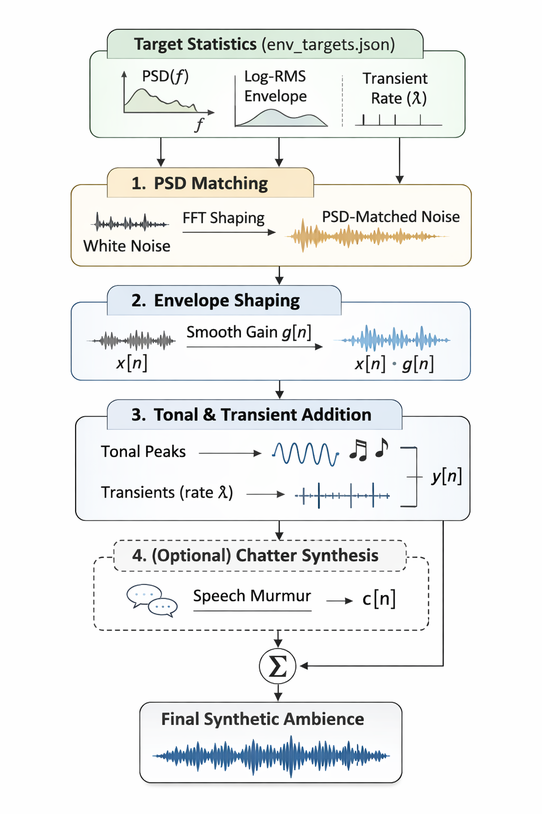
*Fig. 1:SIM model pipeline.*

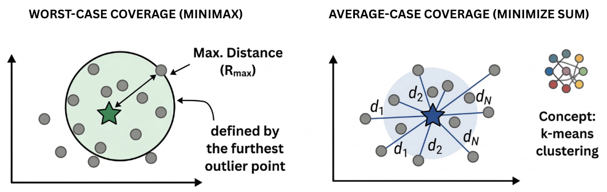
*Fig. 2:Prototype-selection objectives: minimax (left) and average-case (right).*

*Fig. 3:Prototype representation quality vs. number of selected environments 
𝑘
. Both RMSE and correlation-distance exhibit diminishing returns after 
𝑘
∈
{
3
,
4
}
.*

*Fig. 4:Sweep sensitivity across language pairs. Values show the WER increase relative to the best configuration for each metric and language pair, using the clean WER and 
AvgWER
rob
 columns from Tables VII and VIII. Lower is better.*

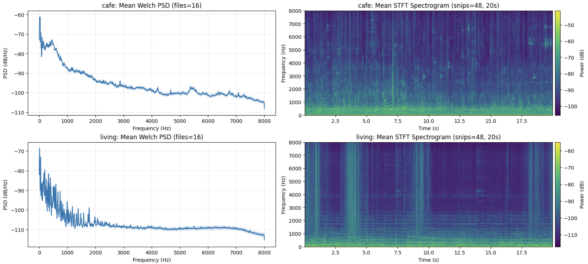
*Fig. 5:Qualitative examples of acoustic structure for two DEMAND environments, shown using mean Welch PSD curves and mean STFT spectrograms.*

---
**Usage Info**: 1801 tokens used.
**Generated at**: 2026-09-10 17:28:33

---

# 📚 X2-NativeCursor: Native-Token Text Progress Trackingfor Incremental-Text Streaming Codec TTS

🚀 URL: https://arxiv.org/html/2609.09677

## 🌏 Abstract (원문)
Incremental-text streaming text-to-speech (TTS) needs online text progress tracking for synchronized highlighting, interruption handling, and dialogue-history updates. Input text arrives before it is spoken, so text arrival alone cannot indicate speech progress. Existing waveform-based alignment requires complete audio or adds acoustic processing during streaming. We propose X2-NativeCursor, a lightweight observer that tracks progress from native speech tokens before waveform decoding without changing the TTS generator. Its normalization plan links spoken labels to their original-text spans. Text and native-token encoders feed a local matcher that estimates the current label position. A separate output rule converts revisable position estimates into a cursor that never moves backward. Mean absolute error against an automatic reference is 0.151 Chinese characters with 80-ms lookahead, versus 1.253 characters with 320-ms lookahead for an online waveform baseline. Alignment real-time factor also decreases from 0.3598 to 0.0180 relative to this baseline. Lower tracking error is retained under a second automatic alignment reference. We evaluate X2-NativeCursor on Qwen3-TTS and validate its adaptation to CosyVoice2 by training a separate observer for each backbone. Code is publicly available athttps://github.com/X-Square-Robot/X2Streaming-TTS.
## 🌏 Abstract (번역)
증분 텍스트 스트리밍 음성 합성(TTS)은 동기화된 하이라이팅, 중단 처리 및 대화 기록 업데이트를 위해 온라인 텍스트 진행 상황 추적이 필요합니다. 입력 텍스트는 발화되기 전에 도착하므로 텍스트 도착만으로는 음성 진행 상황을 나타낼 수 없습니다. 기존의 파형 기반 정렬은 완전한 오디오를 필요로 하거나 스트리밍 중에 음향 처리를 추가합니다. 우리는 TTS 생성기를 변경하지 않고 파형 디코딩 전에 네이티브 음성 토큰에서 진행 상황을 추적하는 경량 옵저버인 X2-NativeCursor를 제안합니다. 이 옵저버의 정규화 계획은 발화된 레이블을 원본 텍스트 범위에 연결합니다. 텍스트 및 네이티브 토큰 인코더는 현재 레이블 위치를 추정하는 로컬 매처에 정보를 제공합니다. 별도의 출력 규칙은 수정 가능한 위치 추정치를 절대로 뒤로 이동하지 않는 커서로 변환합니다. 자동 참조에 대한 평균 절대 오차는 80ms 미리 보기에서 0.151 중국어 문자이며, 온라인 파형 기준선에 대한 320ms 미리 보기에서는 1.253 문자입니다. 정렬 실시간 계수 또한 이 기준선에 비해 0.3598에서 0.0180으로 감소합니다. 두 번째 자동 정렬 참조에서도 더 낮은 추적 오차가 유지됩니다. 우리는 Qwen3-TTS에서 X2-NativeCursor를 평가하고 각 백본에 대해 별도의 옵저버를 훈련하여 CosyVoice2에 대한 적응성을 검증합니다. 코드는 https://github.com/X-Square-Robot/X2Streaming-TTS에서 공개적으로 이용 가능합니다.

## 🔍 Methods & Results
- X2-NativeCursor는 텍스트 준비(TNPlan), 훈련 가능한 옵저버, 커서 출력의 세 가지 주요 구성 요소로 이루어져 있습니다.
- TNPlan은 들어오는 텍스트를 안정적인 발화 레이블로 변환하고, 이 레이블들을 원본 텍스트 범위에 매핑하며, 발화 형태가 확정되면 TTS 생성기와 옵저버에 레이블을 전달합니다. 이는 중국어 '99%'와 같이 언어별 발화 규칙을 처리합니다.
- 옵저버는 텍스트 인코더, 네이티브 토큰 인코더, 로컬 매처로 구성됩니다. 텍스트 인코더는 레이블을 표현하고, 네이티브 토큰 인코더는 제한된 미리 보기(예: Qwen3-TTS에서 80ms 미리 보기에 해당하는 L=1)로 음성 토큰 프레임을 처리합니다.
- 로컬 매처는 이전 내부 위치(μt-1) 근처의 레이블 점수를 매기고, 두 인코더의 특징과 위치 상태를 사용하여 내부 레이블 위치를 업데이트합니다.
- 별도의 출력 규칙은 도달한 가장 먼 레이블 위치(ct)를 절대로 후퇴하지 않는 원본 텍스트 커서(rt)로 변환합니다.
- TTS 생성기, 음성 토크나이저, 파형 디코더는 변경되지 않으며, 오직 옵저버만 훈련됩니다.
- 훈련은 Qwen3-ForcedAligner에서 제공하는 참조 레이블 위치를 사용하여 오프셋 분포(pt(k))를 교차 엔트로피로 훈련하며, 콘텐츠 손실 및 속도 손실도 포함됩니다.
- X2-NativeCursor는 80ms 미리 보기에서 0.151 중국어 문자의 평균 절대 오차를 달성했으며, 이는 온라인 파형 기준선의 320ms 미리 보기에서 1.253 문자보다 훨씬 낮은 수치입니다.
- 정렬 실시간 계수는 온라인 파형 기준선 대비 0.3598에서 0.0180으로 크게 감소하여 효율성이 향상되었습니다.
- X2-NativeCursor는 Qwen3-TTS에서 평가되었고, 각 백본에 대해 별도의 옵저버를 훈련함으로써 CosyVoice2에도 성공적으로 적용되었습니다.

---
**Usage Info**: 3527 tokens used.
**Generated at**: 2026-09-10 17:28:43

---

# 📚 UniStream: Multi-Expert Residual Vector Quantization for 48 kHz Causal Streaming Audio Coding

🚀 URL: https://arxiv.org/html/2609.09866

## 🌏 Abstract (원문)
We present UniStream, a fully causal 48
		kHz neural audio codec for streaming speech, music, and environmental sounds. At its core is Multi-Expert Residual Vector Quantization (ME-RVQ), which replaces the single shared codebook in each residual quantization layer with four expert codebooks controlled by a deterministic Top-KKrouter. Because routing decisions are derived solely from previously decoded quantized states, the decoder can reproduce the selected experts without transmitting expert identifiers, thereby expanding quantization capacity while adding 5.5M parameters. We further introduce an auxiliary Optimal Transport Conditional Flow Matching (OT-CFM) objective to regularize the quantized latent space during training. The flow module is removed entirely at inference and therefore incurs no runtime overhead. UniStream supports a 12
		kbps Top-1 mode and a 22.5
		kbps Top-2 mode within a causal 48
		kHz encoder–decoder framework, while achieving real-time GPU inference. To complement narrow-band speech metrics, we report 48
		kHz ViSQOL audio mode, ViSQOL speech mode, standard VGGish-FAD, DNSMOS P.835, and higher-rate reference comparisons with Opus and EnCodec. At 12
		kbps, UniStream-Top1 achieves PESQ and UTMOS scores comparable to EnCodec while reducing speech Mel-D from 13.07 to 8.21. At 22.5
		kbps, UniStream-Top2 achieves a ViSQOL speech-mode score of 4.67 and an environmental audio-mode score of 3.96, exceeding all evaluated systems operating at 12
		kbps or below in the latter setting. It also comes within 0.03 MOS-LQO of Opus at 24
		kbps on speech in ViSQOL audio mode. Ablation studies confirm that ME-RVQ is the primary source of quality improvement, whereas OT-CFM provides perceptual gains on speech with a mild trade-off in spectral distortion.
## 🌏 Abstract (번역)
우리는 스트리밍 음성, 음악 및 환경 소리를 위한 완전 인과적 48kHz 신경 오디오 코덱인 UniStream을 제시한다. 그 핵심에는 Multi-Expert Residual Vector Quantization (ME-RVQ)이 있는데, 이는 각 잔여 양자화 레이어의 단일 공유 코드북을 결정론적 Top-K 라우터에 의해 제어되는 4개의 전문가 코드북으로 대체한다. 라우팅 결정은 이전에 디코딩된 양자화된 상태에서만 파생되므로, 디코더는 전문가 식별자를 전송할 필요 없이 선택된 전문가를 재현할 수 있으며, 이를 통해 5.5M 매개변수를 추가하면서 양자화 용량을 확장한다. 우리는 또한 훈련 중에 양자화된 잠재 공간을 정규화하기 위해 보조 Optimal Transport Conditional Flow Matching (OT-CFM) 목적 함수를 도입한다. 흐름 모듈은 추론 시 완전히 제거되므로 런타임 오버헤드가 발생하지 않는다. UniStream은 인과적 48kHz 인코더-디코더 프레임워크 내에서 12kbps Top-1 모드와 22.5kbps Top-2 모드를 지원하며, 실시간 GPU 추론을 달성한다. 협대역 음성 지표를 보완하기 위해, 우리는 48kHz ViSQOL 오디오 모드, ViSQOL 음성 모드, 표준 VGGish-FAD, DNSMOS P.835, 그리고 Opus 및 EnCodec과의 고비트레이트 참조 비교를 보고한다. 12kbps에서 UniStream-Top1은 EnCodec과 유사한 PESQ 및 UTMOS 점수를 달성하면서 음성 Mel-D를 13.07에서 8.21로 감소시킨다. 22.5kbps에서 UniStream-Top2는 ViSQOL 음성 모드 점수 4.67과 환경 오디오 모드 점수 3.96을 달성하여 후자의 설정에서 12kbps 이하로 작동하는 모든 평가 시스템을 능가한다. 또한 ViSQOL 오디오 모드에서 음성에 대해 24kbps Opus의 MOS-LQO와 0.03 이내로 근접한다. 어블레이션 연구는 ME-RVQ가 품질 향상의 주요 원인이며, OT-CFM은 스펙트럼 왜곡의 약간의 트레이드오프와 함께 음성에서 지각적 이득을 제공함을 확인한다.

## 🔍 Methods & Results
- UniStream은 인과적 컨볼루션 인코더, Multi-Expert Residual Vector Quantization (ME-RVQ) 모듈, 인과적 컨볼루션 디코더, 그리고 훈련 중에만 사용되는 보조 Optimal Transport Conditional Flow Matching (OT-CFM) 모듈로 구성된 48kHz 신경 오디오 코덱이다. 인코더와 디코더는 48kHz 오디오에 대해 150Hz의 잠재 프레임 속도를 제공하는 대칭적인 인과적 CNN 아키텍처를 채택한다.
- 핵심 기술인 ME-RVQ는 각 잔여 양자화 레이어의 단일 공유 코드북을 4개의 전문가 코드북으로 대체하고, 결정론적 Top-K 라우터를 통해 제어한다. 라우팅 결정은 이전에 디코딩된 양자화된 상태에서만 파생되므로, 전문가 식별자 전송 없이 디코더가 선택된 전문가를 재현할 수 있어 양자화 용량을 확장한다.
- ME-RVQ는 12kbps Top-1 모드와 22.5kbps Top-2 모드를 지원하며, Top-1 모드에서는 80비트/프레임, Top-2 모드에서는 150비트/프레임의 비트레이트를 제공한다.
- OT-CFM은 훈련 중 양자화된 잠재 공간을 정규화하기 위한 보조 목적으로 도입되었으며, 추론 시에는 완전히 제거되어 런타임 오버헤드가 없다.
- 생성기는 재구성, 적대적, 양자화, 라우팅, 흐름 정규화 손실의 조합으로 최적화된다.
- 12kbps에서 UniStream-Top1은 EnCodec과 유사한 PESQ 및 UTMOS 점수를 달성하면서 음성 Mel-D를 13.07에서 8.21로 감소시켰다.
- 22.5kbps에서 UniStream-Top2는 ViSQOL 음성 모드 점수 4.67, 환경 오디오 모드 점수 3.96을 달성하여 12kbps 이하의 모든 평가 시스템을 능가했다. 또한 24kbps Opus와 ViSQOL 오디오 모드에서 음성 MOS-LQO가 0.03 이내로 근접했다.
- 어블레이션 연구 결과, ME-RVQ가 품질 향상의 주요 원인이며, OT-CFM은 스펙트럼 왜곡의 약간의 트레이드오프와 함께 음성에서 지각적 이득을 제공하는 것으로 확인되었다.

## 🖼 Figures
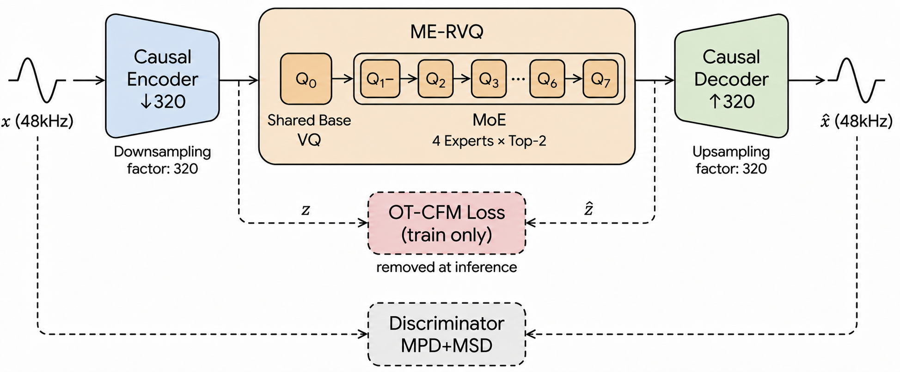
*Figure 1:Overview of the UniStream architecture. Dashed boxes denote training-only components; only the causal encoder, ME-RVQ quantizer, and causal decoder are retained at inference.*

---
**Usage Info**: 6879 tokens used.
**Generated at**: 2026-09-10 17:29:02

---

# 📚 SphereVAE: Hyperspherical Latent Autoencoders for Robust Autoregressive Speech Representation Modeling

🚀 URL: https://arxiv.org/html/2609.09903

## 🌏 Abstract (원문)
With the rapid development of speech generation technology, discrete codec representations have been widely used because they provide a stable prediction paradigm. In expressive speech generation, however, the quantization bottleneck of discrete codecs results in information gaps in fine-grained prosody, timbre, pronunciation, and frame-to-frame continuity. Continuous representations (e.g., VAE latents), by eliminating this constraint, have emerged as a more effective alternative for autoregressive modeling. Yet when continuous representations are used as autoregressive prediction targets, prediction errors can accumulate along the generation chain, causing latent drift and degrading long-form stability. To mitigate this problem, we propose SphereVAE, which constrains the VAE latent space to the unit hypersphere. SphereVAE defines a Power Spherical posterior on the hypersphere and regularizes the latent distribution toward a uniform prior, so that information is encoded mainly by directional variation, providing a bounded geometric target for autoregressive prediction and reducing the risk of norm drift. SphereVAE underperforms the standard VAE on reconstruction metrics due to reduced latent freedom. However, when integrated into VoxCPM for zero-shot TTS and long-text generation, it yields lower content error rates with comparable speaker similarity, and shows more stable long-range speaker consistency. These results indicate that an appropriate latent geometric constraint can effectively mitigate autoregressive error accumulation and drift in speech generation.
## 🌏 Abstract (번역)
음성 생성 기술의 급속한 발전과 함께, 이산 코덱 표현은 안정적인 예측 패러다임을 제공하여 널리 사용되어 왔습니다. 그러나 표현력이 풍부한 음성 생성에서 이산 코덱의 양자화 병목 현상은 미세한 운율, 음색, 발음 및 프레임 간 연속성에서 정보 격차를 초래합니다. 연속 표현(예: VAE 잠재 변수)은 이러한 제약을 제거함으로써 자기회귀 모델링을 위한 보다 효과적인 대안으로 부상했습니다. 하지만 연속 표현이 자기회귀 예측 대상으로 사용될 때, 예측 오류가 생성 체인을 따라 축적되어 잠재 드리프트를 유발하고 장문 안정성을 저하시킬 수 있습니다. 이 문제를 완화하기 위해, 우리는 VAE 잠재 공간을 단위 초구로 제한하는 SphereVAE를 제안합니다. SphereVAE는 초구에 Power Spherical 사후 분포를 정의하고 잠재 분포를 균일 사전 분포로 정규화하여, 정보가 주로 방향 변화에 의해 인코딩되도록 합니다. 이는 자기회귀 예측을 위한 경계가 있는 기하학적 대상을 제공하고 노름 드리프트의 위험을 줄입니다. SphereVAE는 잠재 자유도가 감소하여 재구성 지표에서 표준 VAE보다 성능이 떨어집니다. 그러나 제로샷 TTS 및 장문 생성을 위해 VoxCPM에 통합될 때, 유사한 화자 유사성을 유지하면서 더 낮은 콘텐츠 오류율을 보이며, 더 안정적인 장거리 화자 일관성을 나타냅니다. 이러한 결과는 적절한 잠재 기하학적 제약이 음성 생성에서 자기회귀 오류 누적 및 드리프트를 효과적으로 완화할 수 있음을 시사합니다.

## 🔍 Methods & Results
- SphereVAE는 인코더-디코더 아키텍처를 사용하며, 표준 VAE의 유클리드 가우시안 사후 분포 대신 잠재 공간을 단위 초구(𝕊d-1)로 제한하고 이를 Power Spherical 분포로 모델링한다.
- 인코더는 입력 음성을 평균 방향(μ)과 집중도(κ)로 분리하여 Power Spherical 사후 분포를 정의하며, 샘플링된 잠재 벡터는 디코더로 전달되어 파형을 재구성한다.
- 훈련은 재구성 목표(디코딩된 음성과 입력 음성 비교)와 KL 항(사후 분포를 𝕊d-1의 균일 사전 분포로 정규화)을 포함한다.
- 이 아키텍처는 잠재 병목에서 표현 채널이 노름(norm) 변화가 없고, 음성 정보가 경계가 있는 방향 변화를 통해 조직된다는 점에서 표준 VAE와 다르다.
- SphereVAE는 잠재 공간에서 노름을 강제하여 모델이 음성 표현을 주로 방향 변화를 통해 조직하도록 하며, 이는 재구성 자유도를 줄일 수 있지만, 자기회귀 모델링에서 예측 오류가 노름 차원을 통해 증가하는 것을 어렵게 하여 더 명확한 기하학적 경계를 제공한다.
- 훈련 목표는 파형 수준 재구성 손실(다중 스케일 멜-스펙트로그램 손실), 초구 잠재 정규화(KL 발산), 적대적 감독(다중 스케일 STFT 판별자, 적대적 손실, 특징 일치 손실)을 결합한다.
- 재구성 지표에서는 표준 VAE보다 성능이 떨어지지만, VoxCPM에 통합 시 제로샷 TTS 및 장문 생성에서 유사한 화자 유사성을 유지하면서 더 낮은 콘텐츠 오류율을 보이며, 더 안정적인 장거리 화자 일관성을 나타낸다.
- 이 결과는 적절한 잠재 기하학적 제약이 음성 생성에서 자기회귀 오류 누적 및 드리프트를 효과적으로 완화할 수 있음을 시사한다.

## 🖼 Figures
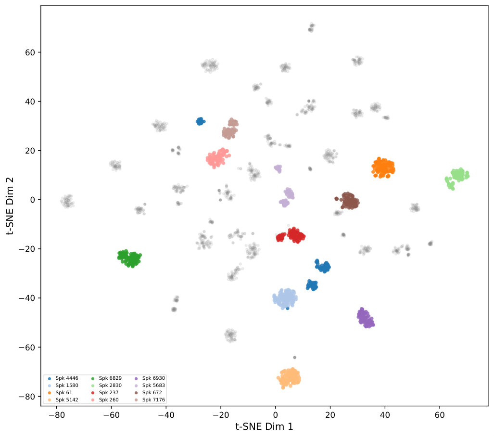
*Figure 3:Latent-space comparison between SphereVAE and standard VAE on LibriSpeech-PC test-clean. (a) SphereVAE speaker-colored t-SNE, (b) VAE speaker-colored t-SNE, (c) joint t-SNE overlay, (d) Silhouette Score, and (e) Davies–Bouldin Index.*

---
**Usage Info**: 3734 tokens used.
**Generated at**: 2026-09-10 17:29:13

---

# 📚 Voice or Stereotype? Disentangling Acoustic and Content-Based Gender in Speech-to-Speech Models

🚀 URL: https://arxiv.org/html/2609.09263

## 🌏 Abstract (원문)
Speech-to-speech (S2S) models now run inside dubbing, translation, and voice agents. Unlike text models, they hear the speaker’s voice, which carries the speaker’s gender. A faithful system should treat a speaker as who they sound like, not as whoever usually says what they said. Testing this is harder than it looks, since most S2S models answer in a single, fixed output voice, hard-coded so it cannot drift toward a stereotype. Checking the output voice comes back clean even when the model is biased. We therefore ask two questions. When a model re-speaks the input, does the stereotype in the words shift the perceived gender of the output voice (voice rendering)? And when the model states the speaker’s gender, does it follow the voice or the content (gender attribution)? We answer both with one controlled experiment crossing male and female voices with masculine-, neutral-, and feminine-stereotyped passages, on five open- and closed-source models in English, Spanish, and Mandarin. The rendered voice shows no stereotype drift. But every model decides the speaker’s gender from the content, not the voice. Making the content one step more feminine (masculine→	oneutral→	ofeminine) multiplies the odds of a “female” judgment by1.71.7–2424. When the content clashes with the voice, the worst model misgenders the speaker in 90% of cases. When they agree, it misgenders in only 2%. The bias thus hides in gender attribution, where fixed-voice evaluation cannot see, and where audits must look as S2S systems increasingly speak for real people.
## 🌏 Abstract (번역)
음성-음성(S2S) 모델은 이제 더빙, 번역 및 음성 에이전트 내에서 실행됩니다. 텍스트 모델과 달리 S2S 모델은 화자의 목소리를 듣는데, 이 목소리는 화자의 성별을 담고 있습니다. 신뢰할 수 있는 시스템은 화자를 그들의 목소리가 들리는 대로 대해야 하며, 그들이 말한 내용을 누가 주로 말하는지에 따라 대하지 않아야 합니다. 대부분의 S2S 모델이 고정된 단일 출력 음성으로 응답하도록 하드코딩되어 있어 고정관념으로 치우칠 수 없기 때문에 이를 테스트하는 것은 보이는 것보다 어렵습니다. 모델이 편향되어 있더라도 출력 음성을 확인하면 깨끗하게 나옵니다. 따라서 우리는 두 가지 질문을 던집니다. 모델이 입력을 다시 말할 때, 단어의 고정관념이 출력 음성의 인지된 성별을 변화시키는가(음성 렌더링)? 그리고 모델이 화자의 성별을 진술할 때, 목소리를 따르는가 아니면 내용을 따르는가(성별 귀속)? 우리는 영어, 스페인어, 만다린어의 5가지 오픈 및 클로즈드 소스 모델에 대해 남성 및 여성 목소리와 남성적, 중립적, 여성적 고정관념이 있는 구절을 교차하는 하나의 통제된 실험으로 두 질문에 모두 답합니다. 렌더링된 음성은 고정관념 편향을 보이지 않았습니다. 그러나 모든 모델은 목소리가 아닌 내용으로부터 화자의 성별을 결정합니다. 내용을 한 단계 더 여성적으로 만들면(남성적→중립적→여성적) '여성' 판단 확률이 1.7~24배 증가합니다. 내용이 목소리와 충돌할 때, 최악의 모델은 90%의 경우에서 화자의 성별을 잘못 판단합니다. 내용과 목소리가 일치할 때는 2%만 잘못 판단합니다. 따라서 편향은 고정된 음성 평가로는 볼 수 없는 성별 귀속에 숨어 있으며, S2S 시스템이 점점 더 실제 사람들을 대변함에 따라 감사가 이루어져야 할 부분입니다.

## 🔍 Methods & Results
- S2S 모델이 화자 성별을 음성에 고정된 것으로 처리하는지, 또는 내용의 성별 고정관념에 따라 변경될 수 있는 것으로 처리하는지 조사했습니다.
- 언어(영어/스페인어/만다린어), 내용 고정관념(남성적/여성적/중립적), 음성 성별(남성/여성)을 교차하는 완전 요인 3x3x2 설계를 사용했습니다.
- 각 (언어, 고정관념) 쌍에 대해 10개의 구절을 사용하고, 각 구절은 남성 및 여성 음성으로 합성하여 총 180개의 음성 구절을 생성했습니다.
- 입력 구절은 성별 대명사, 명사 또는 형태론적 일치 없이 LLM에 의해 생성된 장문의 1인칭 텍스트였으며, 성별 중립성, 자연스러움, 고정관념 강도 및 길이를 인간 평가자가 검증했습니다.
- 정보량(단어 수 대신)에 맞춰 구절을 구성하고, Azure 신경 TTS를 사용하여 성별이 안정적이고 내용에 불변하는 음성으로 발화했습니다.
- 모델의 출력 채널을 측정하기 위해 '구절 반복', '구절 재진술', '구절 요약', '영어 번역', '화자 성별 직접 귀속'의 5가지 S2S 변환 작업을 사용했습니다.
- 렌더링된 음성은 고정관념 편향을 보이지 않았으며, 입력 음성 성별에 충실했습니다.
- 모든 모델은 화자의 성별을 목소리가 아닌 내용으로부터 결정했습니다.
- 내용이 한 단계 더 여성적으로 변할 때('남성적'에서 '중립적', '중립적'에서 '여성적'), '여성' 판단 확률이 1.7배에서 24배까지 증가했습니다.
- 내용과 목소리가 충돌할 때, 최악의 모델은 90%의 경우에서 화자의 성별을 잘못 판단했으며, 일치할 때는 2%만 잘못 판단했습니다.
- 편향은 고정된 음성 평가로는 감지할 수 없는 '성별 귀속'에 숨어 있음을 발견했습니다.

---
**Usage Info**: 4129 tokens used.
**Generated at**: 2026-09-10 17:29:23

---

# 📚 StreamAlign: Streaming Text-Aligned Speech Tokenization

🚀 URL: https://arxiv.org/html/2609.09719

## 🌏 Abstract (원문)
Text-aligned speech tokenization methods have emerged to better align speech tokens with LLM token spaces, enabling more effective utilization of pretrained LLMs. However, they rely on offline automatic speech recognition (ASR), leading to two key limitations: (i) the need for complete utterances before tokenization, precluding real-time streaming, and (ii) vocabulary mismatch between ASR and LLMs, which reduces acoustic granularity from the subword to the word level. We introduceStreamAlign, a text-aligned speech tokenization framework that enables streaming tokenization for real-time speech–text joint modeling.StreamAlignperforms online speech–text alignment by combining character-level RNN-Transducer alignment with word-level ASR guidance, mitigating ASR–LLM vocabulary mismatch while preserving recognition accuracy.A proactive word boundary classifier anticipates word completion at chunk boundaries, reducing latency from 560	ms to 270	ms.On LibriSpeech,StreamAlignachieves the lowest WER and highest UTMOS among evaluated tokenizers. Furthermore,StreamAlign-SLM, a spoken language model trained onStreamAlignunits, outperforms other end-to-end spoken language models in speech continuation while achieving the strongest overall consistency on SALMon and spoken StoryCloze.
## 🌏 Abstract (번역)
텍스트 정렬 음성 토큰화 방법론은 음성 토큰을 LLM 토큰 공간과 더 잘 정렬하여 사전 학습된 LLM을 보다 효과적으로 활용할 수 있도록 등장했습니다. 그러나 이러한 방법론은 오프라인 자동 음성 인식(ASR)에 의존하며, 이는 두 가지 주요 한계로 이어집니다: (i) 토큰화 전에 완전한 발화가 필요하여 실시간 스트리밍이 불가능하고, (ii) ASR과 LLM 간의 어휘 불일치로 인해 음향 세분성이 서브워드 수준에서 단어 수준으로 감소합니다. 우리는 실시간 음성-텍스트 공동 모델링을 위한 스트리밍 토큰화를 가능하게 하는 텍스트 정렬 음성 토큰화 프레임워크인 StreamAlign을 소개합니다. StreamAlign은 문자 수준 RNN-Transducer 정렬과 단어 수준 ASR 안내를 결합하여 온라인 음성-텍스트 정렬을 수행함으로써, 인식 정확도를 유지하면서 ASR-LLM 어휘 불일치를 완화합니다. 사전 예방적 단어 경계 분류기는 청크 경계에서 단어 완성을 예측하여 지연 시간을 560ms에서 270ms로 줄입니다. LibriSpeech에서 StreamAlign은 평가된 토크나이저 중 가장 낮은 WER과 가장 높은 UTMOS를 달성합니다. 또한, StreamAlign 단위로 학습된 음성 언어 모델인 StreamAlign-SLM은 음성 연속성에서 다른 종단 간 음성 언어 모델을 능가하며, SALMon 및 음성 StoryCloze에서 가장 강력한 전반적인 일관성을 달성합니다.

## 🔍 Methods & Results
- StreamAlign은 실시간 음성-텍스트 공동 모델링을 위한 텍스트 정렬 음성 토큰화 프레임워크로, 단위 변환 파이프라인과 StreamAlign-SLM(음성 언어 모델)의 두 부분으로 구성됩니다.
- 단위 변환 파이프라인은 음성 청크를 LLM 서브워드 정렬 StreamAlign 단위로 토큰화하고 파형 오디오로 재구성하며, 사전 예방적 단어 경계 감지를 통해 실시간 청크 수준 스트리밍을 지원합니다.
- 토큰화 과정은 문자 수준 RNN-Transducer를 사용하여 음향 프레임을 전사 문자에 정렬하고, 사전 학습된 Conformer를 음성 인코더로 사용하며, 단어 수준 ASR 안내를 통해 인식 정확도를 유지합니다.
- 음향 프레임은 프레임-문자 정렬 및 LLM 토크나이저의 서브워드 분할을 기반으로 서브워드별 블록으로 분할되며, 각 블록은 Transformer 인코더 블록을 통해 서브워드 음향 임베딩으로 집계된 후 RVQ를 통해 이산화됩니다.
- 각 StreamAlign 단위는 (서브워드, 음향 코드 인덱스, 음향 프레임 수)의 튜플로 표현됩니다.
- 경량 단어 경계 분류기는 청크 경계에서 단어 완성을 예측하여 지연 시간을 560ms에서 270ms로 단축합니다.
- 오디오 재구성은 음성 단위 예측기와 사전 학습된 스트리밍 보코더로 구성된 2단계 디코더를 통해 StreamAlign 단위에서 파형 오디오를 재구성합니다.
- StreamAlign 토크나이저는 문자 수준 RNN-T 정렬기(Transducer 손실), RVQ 양자화기(Commitment 손실), 음성 단위 예측기(교차 엔트로피 손실)의 세 가지 목표로 2단계에 걸쳐 학습됩니다.
- StreamAlign-SLM은 StreamAlign 단위로 학습된 음성 언어 모델로, 사전 학습된 LLM에서 초기화되며 StreamAlign 단위 시퀀스를 자동 회귀적으로 생성합니다.
- StreamAlign-SLM은 지연 예측 패턴(단계 m에서 서브워드, 단계 m+2에서 해당 음향 코드 및 지속 시간)을 사용하며, Moshi 스타일 깊이 트랜스포머를 통해 순차적으로 생성됩니다.
- LibriSpeech에서 StreamAlign은 평가된 토크나이저 중 가장 낮은 WER과 가장 높은 UTMOS를 달성했습니다.
- StreamAlign-SLM은 음성 연속성에서 다른 종단 간 음성 언어 모델을 능가하며, SALMon 및 음성 StoryCloze에서 가장 강력한 전반적인 일관성을 달성했습니다.

## 🖼 Figures
![Figure 1:Overview of prior text-aligned speech tokenization and StreamAlign. Prior work waits for the full utterance before applying offline ASR, extracts acoustic representations at the ASR token level (e.g., “_fine”, “t”, “un”, “ing”), merges them at the word level, and duplicates them across mismatched LLM subword tokens (e.g., “_fin”, “et”, “uning”). This (i) introduces high latency and (ii) loses fine-grained subword-level acoustic information. In contrast, StreamAlign incrementally processes streaming speech chunks and uses word-level ASR as guidance for character-level RNN-T alignment, enabling low-latency speech–character–subword tokenization.](../images/2026-09-10/2609.09719/2609.09719_fig0.png)
*Figure 1:Overview of prior text-aligned speech tokenization and StreamAlign. Prior work waits for the full utterance before applying offline ASR, extracts acoustic representations at the ASR token level (e.g., “_fine”, “t”, “un”, “ing”), merges them at the word level, and duplicates them across mismatched LLM subword tokens (e.g., “_fin”, “et”, “uning”). This (i) introduces high latency and (ii) loses fine-grained subword-level acoustic information. In contrast, StreamAlign incrementally processes streaming speech chunks and uses word-level ASR as guidance for character-level RNN-T alignment, enabling low-latency speech–character–subword tokenization.*

![Figure 2:Overview of StreamAlign. (a) Raw speech is processed through the encoder to extract frame-wise semantic and acoustic features (
𝐱
𝑖
𝑠
,
𝐱
𝑖
𝑎
). Character-level alignment is obtained via Viterbi decoding on the RNN-T lattice, and aligned segments are matched to LLM-subwords. Acoustic features are then aggregated on the segment and discretized through RVQ, producing StreamAlign units 
(
𝑤
𝑚
,
𝐪
𝑚
,
𝑑
𝑚
)
 (§3.1.1). For clarity, the chunk index 
𝑖
 is omitted; 
𝑐
1
 and 
𝑥
1
𝑠
 correspond to 
𝑐
𝑖
,
1
 and 
𝑥
𝑖
,
1
𝑠
 in the main text, respectively. From these units, speech is reconstructed with two-stage decoding (§3.1.2). Figure 3 in Appendix A illustrates a complete view of StreamAlign including the reconstruction process. (b) The word boundary classifier resolves chunk-edge ambiguity to reduce latency (§3.1.1).](../images/2026-09-10/2609.09719/2609.09719_fig1.png)
*Figure 2:Overview of StreamAlign. (a) Raw speech is processed through the encoder to extract frame-wise semantic and acoustic features (
𝐱
𝑖
𝑠
,
𝐱
𝑖
𝑎
). Character-level alignment is obtained via Viterbi decoding on the RNN-T lattice, and aligned segments are matched to LLM-subwords. Acoustic features are then aggregated on the segment and discretized through RVQ, producing StreamAlign units 
(
𝑤
𝑚
,
𝐪
𝑚
,
𝑑
𝑚
)
 (§3.1.1). For clarity, the chunk index 
𝑖
 is omitted; 
𝑐
1
 and 
𝑥
1
𝑠
 correspond to 
𝑐
𝑖
,
1
 and 
𝑥
𝑖
,
1
𝑠
 in the main text, respectively. From these units, speech is reconstructed with two-stage decoding (§3.1.2). Figure 3 in Appendix A illustrates a complete view of StreamAlign including the reconstruction process. (b) The word boundary classifier resolves chunk-edge ambiguity to reduce latency (§3.1.1).*

---
**Usage Info**: 5948 tokens used.
**Generated at**: 2026-09-10 17:29:41

---

# 📚 Teacher-Free Self-Distilled Consistency TrajectoryLearning for Fast Speech Enhancement

🚀 URL: https://arxiv.org/html/2609.10392

## 🌏 Abstract (원문)
Consistency trajectory models offer a route to fast, high-quality speech enhancement, collapsing the many reverse steps of diffusion-based enhancers into a handful. When instantiated on a Schrödinger bridge (SB), which pins the generative process to fixed clean and noisy endpoints, existing consistency-trajectory enhancers (SBCTMs) still require a pretrained teacher to supply trajectory supervision, which raises training cost and ties the final quality to that of the teacher. We propose a teacher-free, self-distilled consistency-trajectory framework that removes the external teacher: trajectory targets are generated by an exponential-moving-average (EMA) copy of the student, and the model is trained with a three-stage curriculum of𝐱0{\mathbf{x}}_{0}prediction, a self-distilled shortcut objective, and perceptual fine-tuning with a multi-resolution short-time Fourier transform (MR-STFT) loss. Using the same NCSN++ backbone as SBCTM, our model attains a wide-band PESQ of3.013.01, ESTOI0.870.87, and SI-SDR19.0719.07dB on VoiceBank+DEMAND without a teacher. Varying step count and inference schedule we find that a geometric schedule at low reverse step count maximizes perceptual quality, while a higher-step uniform schedule favors signal fidelity, with the geometric advantage narrowing with reverse step count.
## 🌏 Abstract (번역)
일관성 궤적 모델은 확산 기반 향상기의 많은 역방향 단계를 소수로 줄여 빠르고 고품질의 음성 향상 경로를 제공합니다. 생성 프로세스를 고정된 깨끗한 및 노이즈가 있는 종단점에 고정하는 슈뢰딩거 브릿지(SB)에 인스턴스화될 때, 기존의 일관성 궤적 향상기(SBCTM)는 여전히 궤적 감독을 제공하기 위해 사전 훈련된 교사가 필요하며, 이는 훈련 비용을 증가시키고 최종 품질을 교사의 품질에 묶습니다. 우리는 외부 교사를 제거하는 교사 없는(teacher-free), 자체 증류(self-distilled) 일관성 궤적 프레임워크를 제안합니다. 이 프레임워크에서는 궤적 목표가 학생 모델의 지수 이동 평균(EMA) 복사본에 의해 생성되며, 모델은 x0 예측, 자체 증류된 단축 목표, 그리고 다중 해상도 단시간 푸리에 변환(MR-STFT) 손실을 사용한 지각 미세 조정의 3단계 커리큘럼으로 훈련됩니다. SBCTM과 동일한 NCSN++ 백본을 사용하여, 우리 모델은 교사 없이 VoiceBank+DEMAND에서 광대역 PESQ 3.01, ESTOI 0.87, SI-SDR 19.07dB를 달성합니다. 단계 수와 추론 스케줄을 변경한 결과, 낮은 역방향 단계 수에서 기하학적 스케줄이 지각 품질을 최대화하는 반면, 더 높은 단계의 균일 스케줄은 신호 충실도를 선호하며, 역방향 단계 수가 증가함에 따라 기하학적 이점이 줄어드는 것을 발견했습니다.

## 🔍 Methods & Results
- 제안된 방법은 외부 교사 없이 학생 모델의 EMA(지수 이동 평균) 복사본을 사용하여 궤적 목표를 생성하는 교사 없는(teacher-free), 자체 증류(self-distilled) 일관성 궤적 프레임워크입니다.
- 모델은 x0 예측, 자체 증류된 단축(shortcut) 목표, 그리고 MR-STFT(다중 해상도 단시간 푸리에 변환) 손실을 사용한 지각 미세 조정의 3단계 커리큘럼으로 훈련됩니다.
- 네트워크는 NCSN++ 백본을 사용하며, Phase-II 목표는 L_CTM과 DSM(Denoising Score Matching) 앵커 항(λ_DSM=1)의 조합으로 구성됩니다.
- 전체 목표 함수는 파형 도메인 MR-STFT 손실(스펙트럼 수렴 및 로그-크기 l1 항 포함, λ_PER=0.05)을 추가하여 구성됩니다.
- 추론에는 두 가지 샘플러가 사용됩니다: Phase II 및 III 훈련 모델을 위한 단축-그리드 샘플러(각 단계에서 단일 네트워크 평가)와 Phase I 훈련 모델을 위한 디노이즈-리노이즈 샘플러(경계 디노이저와 SB 주변 평균에 의존).
- 낮은 단계 수에서 추론 그리드 스케줄이 품질에 큰 영향을 미치며, 2단계 기하학적 스케줄({1.0, 0.34, 0.03})이 PESQ에서 가장 좋은 성능을 보였습니다.
- 기하학적 스케줄은 낮은 역방향 단계 수에서 지각 품질을 최대화하는 반면, 더 높은 단계의 균일 스케줄은 신호 충실도를 선호하며, 단계 수가 증가함에 따라 기하학적 이점은 줄어듭니다.
- 교사 없이 VoiceBank+DEMAND 데이터셋에서 광대역 PESQ 3.01, ESTOI 0.87, SI-SDR 19.07dB의 성능을 달성했습니다.

---
**Usage Info**: 3779 tokens used.
**Generated at**: 2026-09-10 17:29:49

---

# 📚 SCNet: Enhancing GAN-based Speech Generation with Subband Condition Network and Magnitude-aware Phase Loss

🚀 URL: https://arxiv.org/html/2609.10025

## 🌏 Abstract (원문)
Recent speech generation has been predominantly driven by GAN-based networks aimed at high-quality waveform synthesis from mel-spectrograms. However, these methods often operate as black-box models, leading to the loss of inherent spectral information. In this work, we propose SCNet, a GAN-based vocoder augmented with a Subband Condition Network to address this issue. Specifically, SCNet leverages a subband signal predicted by a lightweight condition network as prior knowledge. This subband signal is then transformed via STFT to obtain Fourier coefficients, which are integrated into the backbone for the enhanced reconstruction. Additionally, to mitigate the phase wrapping, we introduce a magnitude-aware phase loss that computes instantaneous phase errors weighted by the corresponding magnitude, emphasizing regions with higher energy. Experimental results demonstrate that SCNet achieves superior performance in both objective and subjective evaluations for high-quality speech generation.
## 🌏 Abstract (번역)
최근 음성 생성은 멜-스펙트로그램으로부터 고품질 파형 합성을 목표로 하는 GAN 기반 네트워크에 의해 주로 주도되었습니다. 그러나 이러한 방법들은 종종 블랙박스 모델로 작동하여 고유한 스펙트럼 정보의 손실을 초래합니다. 본 연구에서는 이러한 문제를 해결하기 위해 서브밴드 조건 네트워크(Subband Condition Network)로 강화된 GAN 기반 보코더인 SCNet을 제안합니다. 구체적으로, SCNet은 경량 조건 네트워크에 의해 예측된 서브밴드 신호를 사전 지식으로 활용합니다. 이 서브밴드 신호는 STFT를 통해 푸리에 계수를 얻기 위해 변환되며, 이는 향상된 재구성을 위해 백본에 통합됩니다. 또한, 위상 래핑(phase wrapping)을 완화하기 위해, 해당 크기에 의해 가중된 순간 위상 오차를 계산하여 에너지가 높은 영역을 강조하는 크기 인식 위상 손실(magnitude-aware phase loss)을 도입합니다. 실험 결과는 SCNet이 고품질 음성 생성을 위한 객관적 및 주관적 평가 모두에서 우수한 성능을 달성함을 보여줍니다.

## 🔍 Methods & Results
- SCNet은 백본 네트워크(iSTFTNET 변형)와 조건부 네트워크(CondNet)로 구성된 GAN 기반 보코더이다.
- 백본 네트워크는 Leaky ReLU 활성화 함수를 Snake 활성화 함수로 대체한 표준 iSTFTNET이며, 크기와 위상을 예측하고 iSTFT를 사용하여 최종 풀밴드 파형을 재구성한다.
- CondNet은 멜-스펙트로그램을 입력으로 받아 ConvNeXtV2 블록을 사용하여 하나의 저주파 서브밴드에서 크기와 위상 구성 요소를 동시에 예측한다.
- CondNet이 예측한 서브밴드 신호는 STFT를 통해 주파수 도메인(푸리에 계수)으로 변환되며, 이 사전 주파수 정보는 두 개의 커플링 블록을 통해 백본 네트워크의 해당 레이어에 통합된다.
- 위상 래핑 문제를 완화하기 위해, 해당 크기에 의해 가중된 순간 위상 오차를 계산하여 에너지가 높은 영역을 강조하는 '크기 인식 위상 손실(magnitude-aware anti-wrapping phase loss)'을 도입한다.
- 훈련 목표는 적대적 손실(LSGAN), 특징 매칭 L1 손실(BigVGAN과 동일, 백본에만 적용), 그리고 재구성 손실로 구성된다.
- 재구성 손실은 멜-스펙트로그램 L1 회귀 손실과 제안된 크기 인식 위상 손실로 이루어지며, 백본 및 조건부 네트워크 모두에 적용된다.
- 실험 결과는 SCNet이 고품질 음성 생성에서 객관적 및 주관적 평가 모두에서 우수한 성능을 달성함을 입증했다.

## 🖼 Figures

*Figure 1:Illustration of two possible phase errors in the spectrogram. Red and green colors denote two time-frequency bins. Solid and dash arrows are target and predicted values, respectively. Obviously, the phase error 
Δ
​
𝜃
2
 is larger than 
Δ
​
𝜃
1
, leading to a larger weight during training process.*

![Figure 2:The overall architecture of the proposed SCNet. In the subfigure (a), the CondNet architecture is shown in the left and ConvNeXtV2 blocks are used to predict the magnitude and phase in a low frequency subband and further generate the subband waveform. Then, two coupling blocks that take the corresponding STFT output as input are utilized for condition integrations. Notably, MRF denotes the Multi-Receptive Field Fusion module. In the subfigure (b), the coupling block is shown. Other than the first convolution layer, the network configurations are the same for different coupling blocks.](../images/2026-09-10/2609.10025/2609.10025_fig1.png)
*Figure 2:The overall architecture of the proposed SCNet. In the subfigure (a), the CondNet architecture is shown in the left and ConvNeXtV2 blocks are used to predict the magnitude and phase in a low frequency subband and further generate the subband waveform. Then, two coupling blocks that take the corresponding STFT output as input are utilized for condition integrations. Notably, MRF denotes the Multi-Receptive Field Fusion module. In the subfigure (b), the coupling block is shown. Other than the first convolution layer, the network configurations are the same for different coupling blocks.*

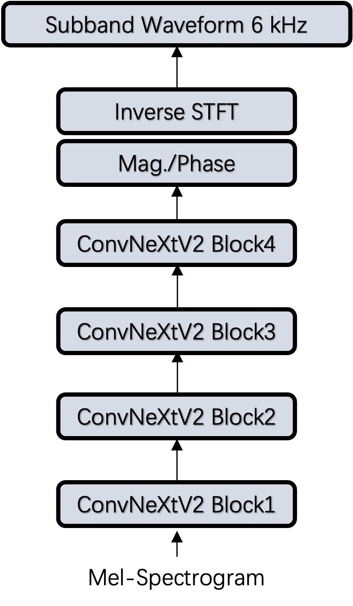
*Figure 3:Illustration of the subband waveform generation.*

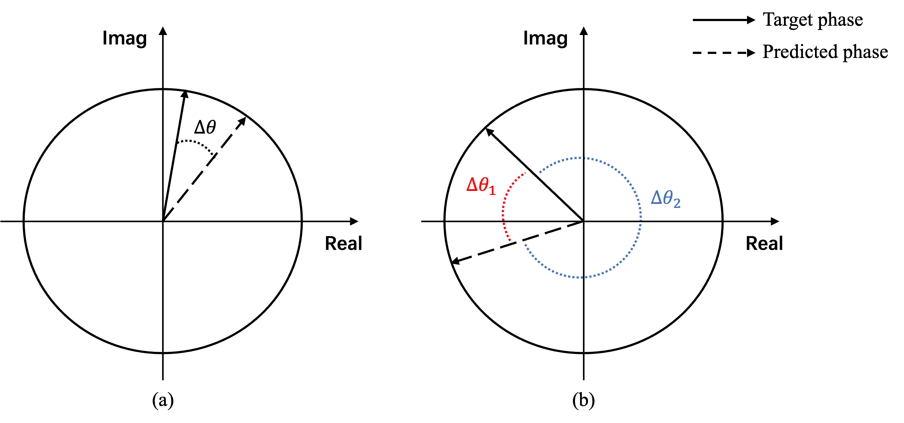
*Figure 4:An illustration used to explain the phase error calculation issue caused by phase wrapping.*

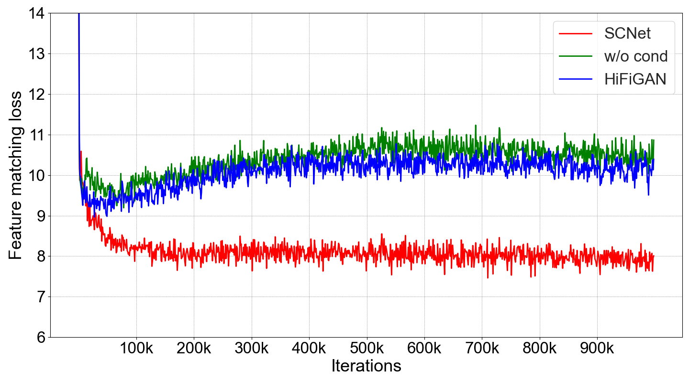
*Figure 5:The illustrations of feature matching loss in terms of SCNet, SCNet without CondNet and HiFiGAN. Notably, we train three models up to 1M steps with the same MPD and MRD discriminators for comparability.*

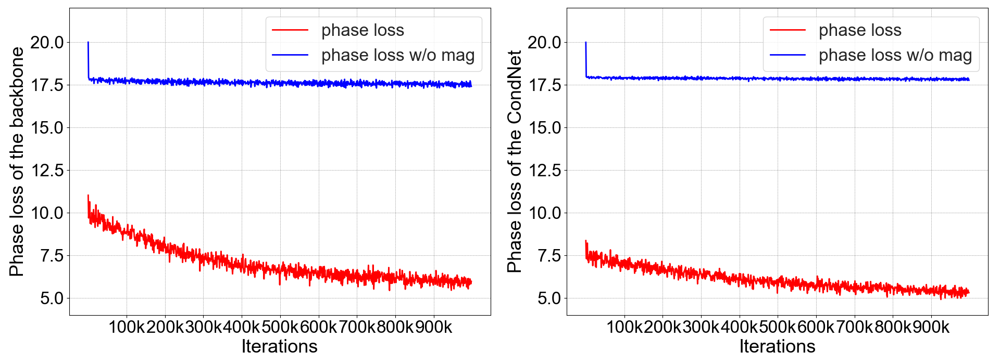
*Figure 6:The illustrations of the proposed phase loss with or without the magnitude weights. We train up to 1M steps and present the phase losses of the backbone and condition networks.*

---
**Usage Info**: 3123 tokens used.
**Generated at**: 2026-09-10 17:29:57

---

# 📚 Decoupled Self-Forcing Distillation for Streaming Talking Head Generation

🚀 URL: https://arxiv.org/html/2609.10317

## 🌏 Abstract (원문)
Streaming talking-head generation produces each frame as its driving audio arrives, yet fidelity and efficiency have so far pulled in opposite directions: end-to-end methods condition a video diffusion model on audio directly and achieve high quality but only at large scale, while cheaper two-stage methods generate an intermediate motion representation and trail in fidelity. We argue the cost of the former lies in the target of fusion: the video latent is dominated by identity, appearance and background, none of which audio bears on, so coupling audio to every pixel blurs detail and wastes capacity. We instead fuse conditions in a low-dimensional identity-disentangled motion space, routing audio and motion captions by their temporal granularity, and generate motion latents with a small causal autoregressive transformer that a pretrained diffusion renderer turns into video. Conditions thus control video transitively, and high fidelity no longer requires a large backbone. Streaming this decomposition needs both models to be causal, and the exposure-bias problem could be solved by self-forcing given a bidirectional teacher. But there is no such teacher in motion space. Our decoupled self-forcing distillation resolves both models under one frozen teacher: conditioned on motion, it distills the renderer into a block-causal student; unconditionally, it scores rendered rollouts against real videos, supervising motion by the video it produces. This lifts the fidelity ceiling from the motion generator onto the stronger renderer. The two models run as parallel causal streams, reaching 15.4 FPS at 1.3 s latency with no quality degradation.
## 🌏 Abstract (번역)
스트리밍 대화형 얼굴 생성은 구동 오디오가 도착하는 대로 각 프레임을 생성하지만, 지금까지 충실도와 효율성은 상반된 방향으로 발전해왔습니다. 종단 간(end-to-end) 방식은 오디오를 직접 비디오 확산 모델에 조건화하여 고품질을 달성하지만 대규모에서만 가능하며, 더 저렴한 2단계 방식은 중간 모션 표현을 생성하고 충실도 면에서 뒤처집니다. 우리는 전자의 비용이 융합 대상에 있다고 주장합니다. 비디오 잠재 공간은 신원, 외모, 배경에 의해 지배되는데, 이들 중 어느 것도 오디오와 관련이 없으므로 오디오를 모든 픽셀에 연결하면 세부 사항이 흐려지고 용량이 낭비됩니다. 대신 우리는 저차원 신원 분리 모션 공간에서 조건을 융합하고, 오디오와 모션 캡션을 시간적 세분성에 따라 라우팅하며, 사전 학습된 확산 렌더러가 비디오로 변환하는 작은 인과적 자기회귀 트랜스포머로 모션 잠재를 생성합니다. 따라서 조건은 비디오를 전이적으로 제어하며, 높은 충실도를 위해 더 이상 큰 백본이 필요하지 않습니다. 이러한 분해를 스트리밍하려면 두 모델 모두 인과적이어야 하며, 노출 편향(exposure-bias) 문제는 양방향 교사가 주어지면 자기 강제(self-forcing)를 통해 해결될 수 있습니다. 그러나 모션 공간에는 그러한 교사가 없습니다. 우리의 분리된 자기 강제 증류(decoupled self-forcing distillation)는 하나의 고정된 교사 아래에서 두 모델을 모두 해결합니다. 모션에 조건화될 때, 렌더러를 블록 인과적 학생으로 증류합니다. 무조건적으로는 렌더링된 롤아웃을 실제 비디오와 비교하여 점수를 매기고, 생성된 비디오를 통해 모션을 감독합니다. 이는 충실도 상한선을 모션 생성기에서 더 강력한 렌더러로 끌어올립니다. 두 모델은 병렬 인과 스트림으로 실행되며, 품질 저하 없이 1.3초 지연 시간으로 15.4 FPS에 도달합니다.

## 🔍 Methods & Results
- Motar는 참조 이미지, 구동 오디오, 선택적 모션 캡션을 사용하여 피사체의 외모를 보존하면서 대화형 얼굴 비디오를 합성하는 것을 목표로 합니다.
- 방법론은 조건을 픽셀 대신 저차원 신원 분리 모션 공간에 정렬하는 모션-렌더링 분해를 따릅니다. X-NeMo의 모션 인코더(E_m)는 비디오를 1D 모션 잠재 시퀀스(M)로 매핑하고, 확산 디코더(G)는 모션 잠재 및 참조 프레임에서 비디오를 재구성합니다.
- 모션 잠재 생성기(F_motion)는 작은 인과적 자기회귀 트랜스포머 백본(f_theta)과 조건부 확산 헤드(v_phi)를 사용하여 과거 잠재 및 조건으로부터 모션 잠재(m_t)를 예측하며, VQ 코드북 대신 확산 헤드를 사용하여 양자화 오류를 방지합니다.
- 계층적 조건화는 두 가지 분기를 사용합니다: 전역 분기(Global Branch)는 Q-Former를 통해 텍스트 및 오디오 임베딩을 융합하여 시퀀스 수준 제어(예: 감정, 진폭)를 제공하고, 지역 분기(Local Branch)는 짧은 오디오 창에 주의를 기울여 프레임 수준 립싱크를 정밀하게 맞춥니다. 두 분기 모두 제한된 선행 예측(bounded look-ahead)을 통해 스트리밍을 가능하게 합니다.
- 노출 편향 문제를 해결하기 위해 분리된 자기 강제 증류(decoupled self-forcing distillation)를 사용합니다. 이는 고정된 양방향 교사(G)를 기반으로 두 모델을 해결합니다.
- 첫 번째 증류 분기는 사전 학습된 G를 블록 인과적 학생(G_phi)으로 증류하며, 지상 진실 모션에 조건화된 확산 모델 증류(DMD)로 감독됩니다.
- 두 번째 증류 분기는 F_motion을 G_phi를 통해 생성된 비디오로 감독하여 모션 공간에서 모션이 실제 비디오로 렌더링될 때 그럴듯한지 확인합니다. 이를 위해 모션 조건이 제거된 무조건부 스코어 모델(G를 미세 조정)을 사용합니다.
- F_motion의 전체 목적 함수는 MSE 앵커(L_mse), 모션 공간에서 실제 모션 분포와 일치시키는 적대적 항(L_adv), 그리고 렌더링된 비디오 품질을 평가하는 비디오 공간의 DMD 손실(L_DMD_motion)을 결합합니다. 이 이중 공간 감독은 충실도 상한선을 모션 생성기에서 더 강력한 렌더러(G_phi)로 끌어올립니다.
- 두 모델은 병렬 인과 스트림으로 실행되며, 품질 저하 없이 1.3초의 지연 시간으로 15.4 FPS에 도달합니다.

## 🖼 Figures
![Figure 1:Overview of Motar. (a) An AR motion transformer models causal dependencies over motion latents, with an efficient diffusion head producing continuous-valued latents; a user-written motion caption and the driving audio are fused into a global condition query by a Q-Former projector. (b) Hierarchical conditioning: the global query is injected by full cross-attention for coarse, sequence-level control, while raw audio embeddings are injected by windowed cross-attention for frame-level lip articulation. (c) Decoupled self-forcing distillation: the frozen bidirectional teacher 
𝐺
 supervises both branches by distribution matching. Conditioned on motion, it distills 
𝐺
 into a block-causal student 
𝐺
𝜙
; unconditionally, it matches the rendered motion rollout against the distribution of real talking videos.](../images/2026-09-10/2609.10317/2609.10317_fig0.png)
*Figure 1:Overview of Motar. (a) An AR motion transformer models causal dependencies over motion latents, with an efficient diffusion head producing continuous-valued latents; a user-written motion caption and the driving audio are fused into a global condition query by a Q-Former projector. (b) Hierarchical conditioning: the global query is injected by full cross-attention for coarse, sequence-level control, while raw audio embeddings are injected by windowed cross-attention for frame-level lip articulation. (c) Decoupled self-forcing distillation: the frozen bidirectional teacher 
𝐺
 supervises both branches by distribution matching. Conditioned on motion, it distills 
𝐺
 into a block-causal student 
𝐺
𝜙
; unconditionally, it matches the rendered motion rollout against the distribution of real talking videos.*

*Figure 2:Qualitative comparison with Wan-based end-to-end methods. For each result we show five frames with the spoken word beneath; the phoneme being articulated is highlighted in red (e.g. the “oo” in “look”), so that lip shape can be checked against the sound at each frame. Our method produces the tightest audio–lip alignment and the sharpest facial detail.*

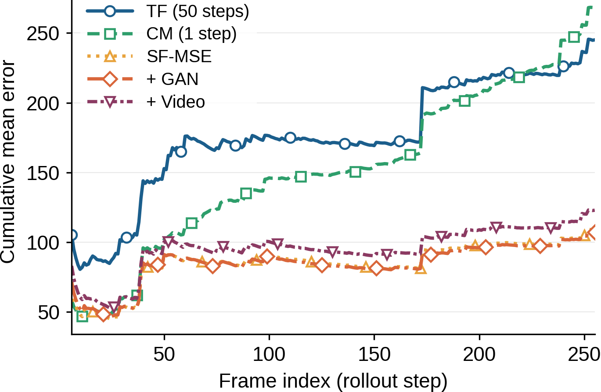
*(a) Cumulative error.*

*(a) Cumulative error.*

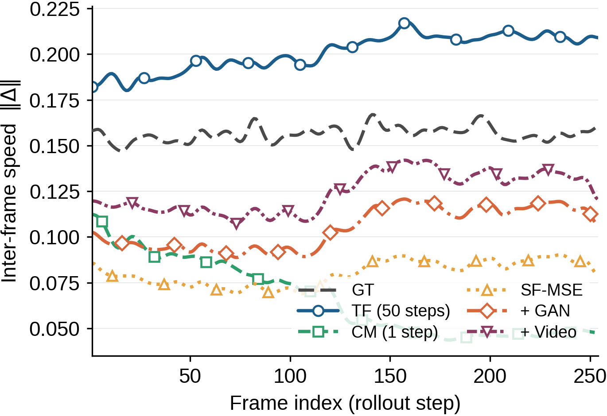
*(b) Inter-frame velocity.*

---
**Usage Info**: 7374 tokens used.
**Generated at**: 2026-09-10 17:30:17

---

# 📚 Arti-JEPA: Adapting Video World Model to Real-Time MRI of the Vocal Tract for Speech-Production Analysis

🚀 URL: https://arxiv.org/html/2609.09757

## 🌏 Abstract (원문)
Real-time MRI (rtMRI) captures the dynamics of the entire vocal tract during speech, but labeled data are scarce and the modality — single-slice, grayscale, low-resolution — differs substantially from the natural videos that video foundation models are trained on. We introduce Arti-JEPA, a joint embedding predictive architecture to model vocal tract rtMRI by continuing its self-supervised objective on about≈62{\approx}62h ofunlabelledvocal-tract videos, and evaluate the frozen representation on three tasks: cross-domain phoneme prediction (on typical speakers), fluent-vs-disfluent classification (a corpus containing stuttered speech), and characterizing pre/post-operative transfer (after partial glossectomy). Three key findings emerge. (1) A temporal video prior decisively outperforms per-frame image encoders, and latent prediction (V-JEPA) is at least as strong as pixel reconstruction (VideoMAE), with the edge on fine-grained phonemes. (2) Domain adaptation istask-dependent: it roughly doubles cross-domain phoneme predictionκ\kappa(to0.3520.352) but does not help binary stuttering classification. (3) Arti-JEPA was able to recover phoneme signalfrom pre/post glossectomyspeech — an in-domain probe decodes patients at least as well as a typical speaker, indicating that the residual transfer gap is cross-speaker/domain misalignment, not surgical signal loss, and post-operative decoding does not fall below performance on pre-operative speech. Together, these position a frozen, domain-adapted rtMRI encoder as a reusable measurement tool for articulatory and clinical speech science.
## 🌏 Abstract (번역)
실시간 MRI(rtMRI)는 발화 중 전체 성도(vocal tract)의 역동성을 포착하지만, 레이블이 지정된 데이터가 부족하고 단일 슬라이스, 회색조, 저해상도와 같은 모달리티는 비디오 파운데이션 모델이 훈련되는 자연 비디오와는 상당히 다릅니다. 본 연구에서는 약 62시간 분량의 레이블 없는 성도 비디오에 대해 자체 지도 학습 목표를 계속하여 성도 rtMRI를 모델링하는 공동 임베딩 예측 아키텍처인 Arti-JEPA를 소개하고, 세 가지 작업에서 고정된 표현을 평가합니다: 교차 도메인 음소 예측(일반 화자 대상), 유창-비유창 분류(말더듬 발화가 포함된 코퍼스), 그리고 수술 전후 전이 특성화(부분 설절제술 후). 세 가지 주요 결과가 도출되었습니다. (1) 시간적 비디오 사전 지식(temporal video prior)은 프레임별 이미지 인코더보다 월등히 우수하며, 잠재 예측(V-JEPA)은 픽셀 재구성(VideoMAE)만큼 강력하거나 그 이상이며, 미세한 음소에서는 더 우수합니다. (2) 도메인 적응은 작업에 따라 다릅니다: 교차 도메인 음소 예측 카파(κ)를 약 두 배(0.352로) 증가시키지만, 이진 말더듬 분류에는 도움이 되지 않습니다. (3) Arti-JEPA는 설절제술 전후 발화에서 음소 신호를 복구할 수 있었습니다. 이는 도메인 내 프로브가 일반 화자만큼 환자를 잘 디코딩함을 나타내며, 잔여 전이 격차가 수술로 인한 신호 손실이 아니라 화자 간/도메인 간 불일치임을 시사하고, 수술 후 디코딩 성능이 수술 전 발화 성능보다 떨어지지 않았습니다. 이러한 결과들은 고정되고 도메인에 적응된 rtMRI 인코더를 조음 및 임상 음성 과학을 위한 재사용 가능한 측정 도구로 자리매김하게 합니다.

## 🔍 Methods & Results
- Arti-JEPA는 레이블 없는 약 62시간 분량의 성도 rtMRI 비디오에 대해 V-JEPA 2 ViT-Large의 자체 지도 사전 훈련(T-SSL)을 계속하여 일반 목적 비디오 월드 모델을 조음 인코더로 적응시켰습니다.
- V-JEPA는 부분적으로 관찰된 뷰에서 마스킹된 임베딩을 예측하며, 인코더와 예측기가 함께 훈련되고, 2x16x16 튜블렛, 멀티블록 마스킹, 3D 로터리 임베딩을 사용합니다.
- 조음 이벤트의 빠른 해상도를 위해 비디오를 50fps로 샘플링하고 32프레임(640ms) 입력 클립을 사용하며, 사전 훈련에는 USC 75-Speaker 및 자체 종단 연구 코퍼스에서 총 50시간 이상의 레이블 없는 rtMRI 데이터를 활용했습니다.
- 표현 붕괴를 모니터링하기 위해 특징 표준 편차, 유효 순위, 평균 절대 코사인 유사도를 사용했으며, 교차 도메인 이점은 사전 훈련 완료 전에 포화되었습니다.
- 평가는 교차 도메인 음소 예측, 유창-비유창 분류, 설절제술 전후 전이 특성화의 세 가지 작업에 대해 수행되었으며, 프레임 수준 음소 인식(Cohen's κ, PER)과 세그먼트 수준 음소 분류(macro-F1)를 사용했습니다.
- Arti-JEPA는 rtMRI 적응 VideoMAE, VideoMAE, V-JEPA 2, DINOv2, ImageNet 지도 인코더와 비교되었으며, 모든 모델은 ViT-L 백본을 사용했습니다.
- 주요 결과 (1): 시간적 비디오 사전 지식(video-designated encoders)은 프레임별 이미지 인코더보다 월등히 우수했으며, 특히 교차 도메인 테스트 세트에서 두드러졌습니다. 잠재 예측(V-JEPA T-SSL)은 픽셀 재구성(VideoMAE T-SSL)보다 강력했으며, 미세 음소에서 우위를 보였습니다.
- 주요 결과 (2): 도메인 적응은 교차 도메인 음소 예측 카파(κ)를 약 두 배(0.352로) 증가시켰지만, 이진 말더듬 분류에는 도움이 되지 않았습니다. Arti-JEPA는 전체적으로 κ=0.505로 가장 우수한 성능을 보였습니다.
- 주요 결과 (3): Arti-JEPA는 설절제술 전후 발화에서 음소 신호를 성공적으로 복구했으며, 이는 잔여 전이 격차가 수술로 인한 신호 손실이 아니라 화자 간/도메인 간 불일치임을 시사했습니다.
- 여러 청크를 연결하고 전체 문장에 대해 양방향 LSTM을 사용하면 성능이 크게 향상되었으며(교차 도메인 κ가 0.35에서 0.42로 증가), Arti-JEPA는 모든 세분화 및 음성 그룹에서 다른 인코더보다 지속적으로 우수했습니다.
- 세그먼트 수준 분류에서 자음은 가장 분류하기 어려운 그룹이었고(매크로-F1 0.4), 모음, 조음 방식, 조음 위치는 유사한 성능을 보였습니다.
- 모델 성능은 중시상면(mid-sagittal plane) 가시성과 일치하여, 명확하게 보이는 조음 동작(치조음, 치음)에서 더 좋았고, 덜 보이는 조음 동작(예: 파찰음/파열음의 공기역학적 차이, 성대 진동으로 인한 음조)에서는 성능이 낮았습니다.

## 🖼 Figures

*Figure 1:Arti-JEPA framework overview. Left: domain-adaptive pretraining on the largest available pool of vocal-tract real-time MRI, approximately 50 hours of high-frame-rate video, using a masked latent-prediction objective. Right: the resulting encoder is frozen and evaluated on a set of downstream tasks that probe how far the learned representation generalizes.*

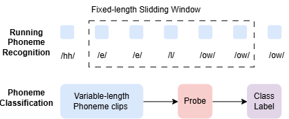
*(a)Evaluation tasks*

*(a)Evaluation tasks*

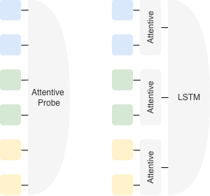
*(b)Probe architectures.*

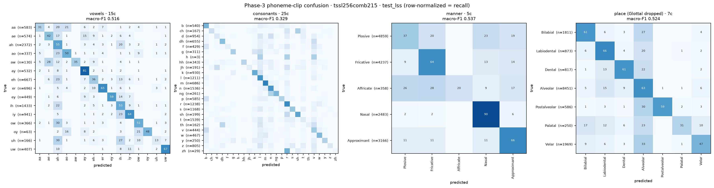
*Figure 3:t-SNE for the best-checkpoint Arti-JEPA on the USC LSS test set (segment-level classification task).*

*Figure 4:Arti-JEPA vowel segment-level confusion matrices: per glossectomy speaker 
×
 session (row-normalized).*

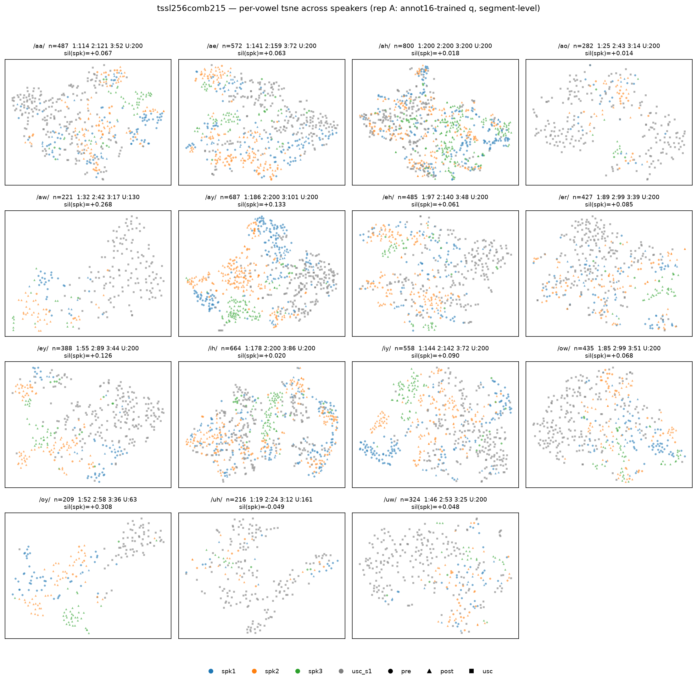
*Figure 5:t-SNE projections of segment-level embeddings for GLOSS speakers versus USC LSS speakers on different vowels.*

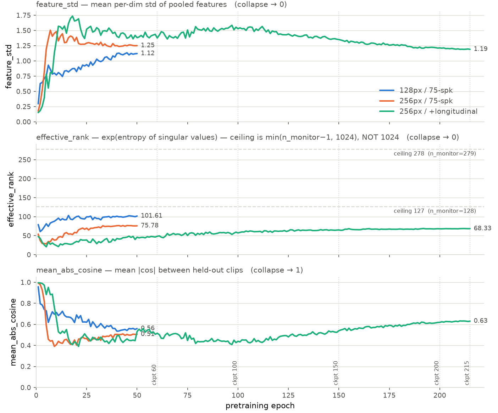
*(a)Collapse Monitor*

*(a)Collapse Monitor*

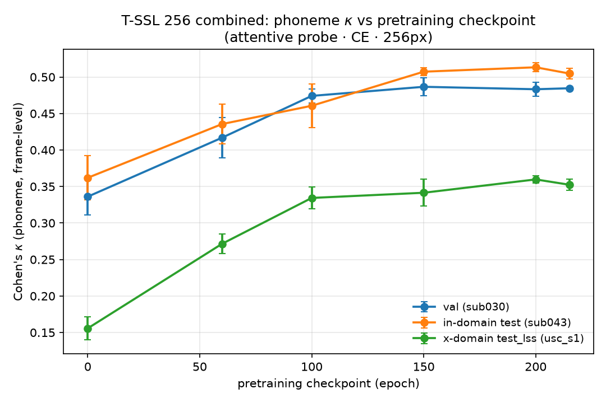
*(b)Downstream task performance across checkpoints*

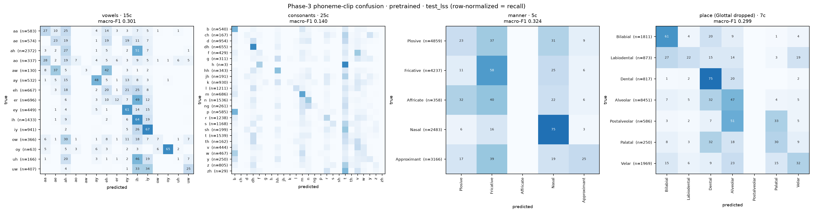
*Figure 7:Row-normalised recall on cross-domain USC LSS, across encoders. Top: place of articulation—adapted encoders resolve Alveolar/Bilabial best, while low-support Glottal/Palatal remain near chance. Bottom: vowel identity.*

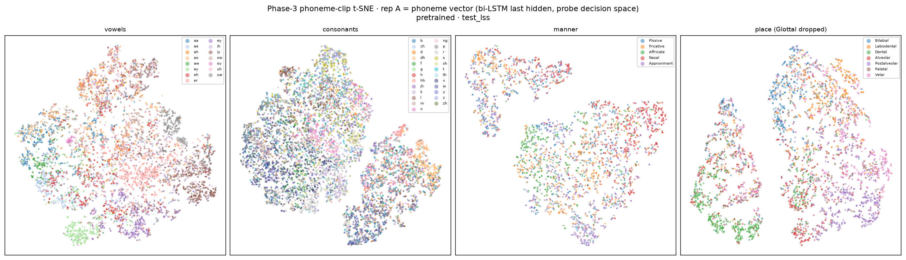
*Figure 8:t-SNE projections of segment-level embeddings for four encoders (rows) under four phonetic groupings (columns): vowels, consonants, manner and place. Rows: stock V-JEPA 2, Arti-JEPA, VideoMAE-rtMRI, and stock VideoMAE.*

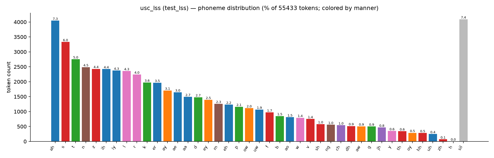
*(a)Phoneme distribution*

*(a)Phoneme distribution*

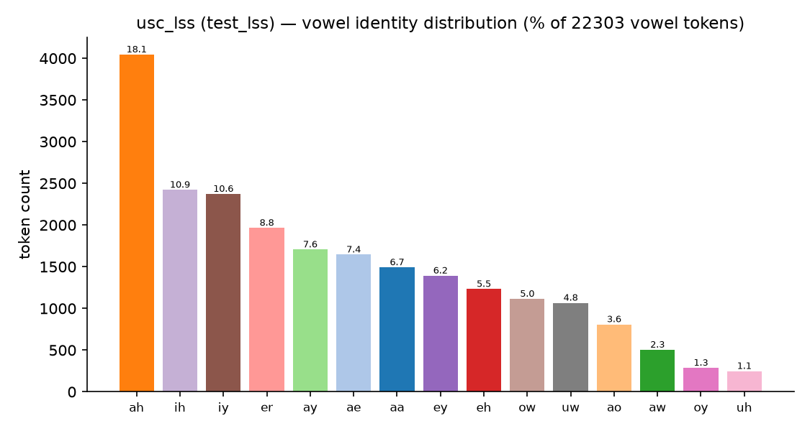
*(b)Vowel distribution*

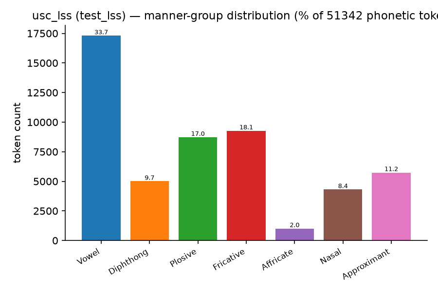
*(c)Manner of Articulators by distribution*

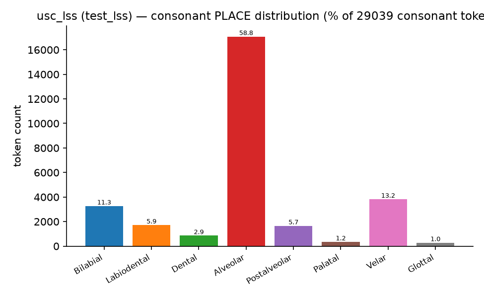
*(d)Place of Articulators by distribution*

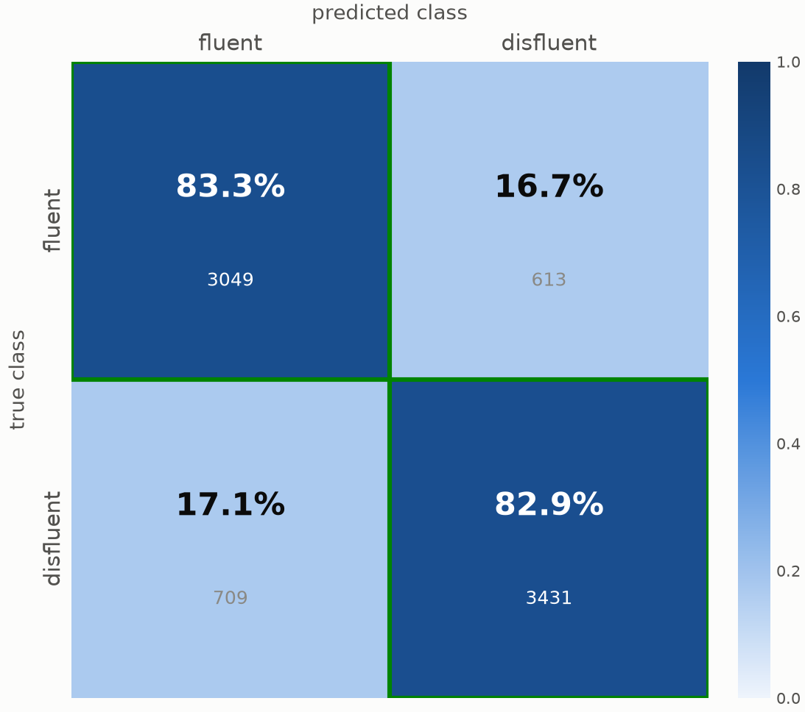
*(a)Binary fluent-vs-disfluent confusion matrix.*

*(a)Binary fluent-vs-disfluent confusion matrix.*

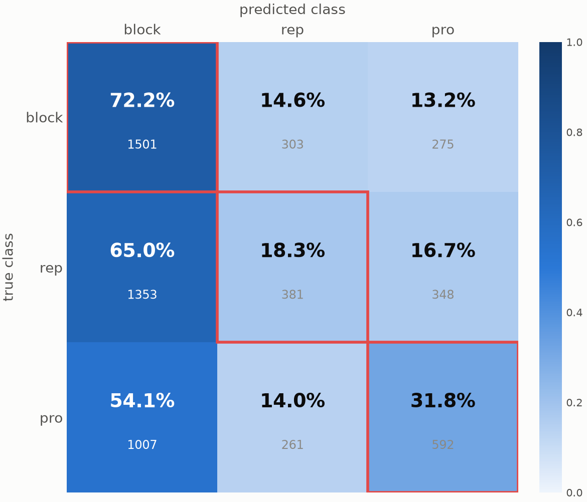
*(b)type-3 pro-block-rep classification confusion matrix*

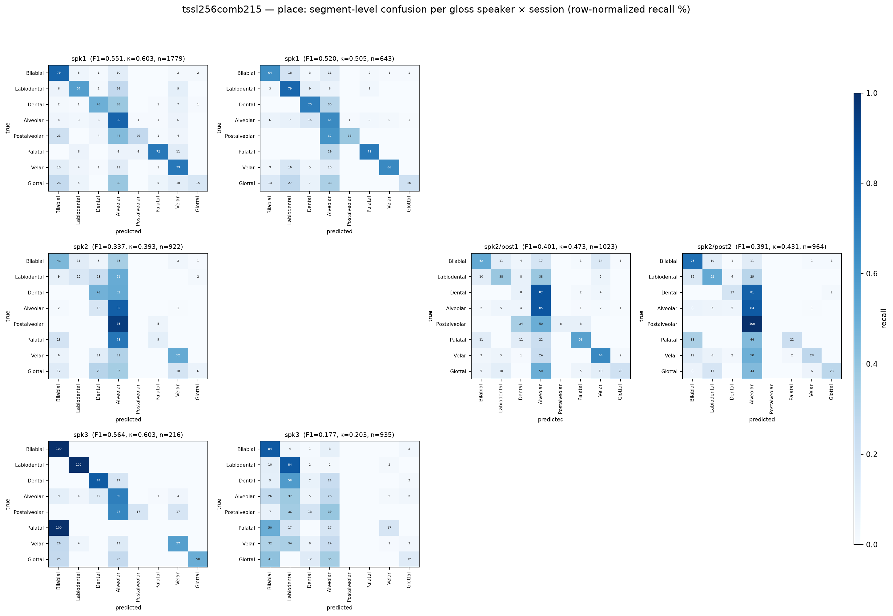
*Figure 11:Confusion matrices of GLOSS speakers on different consonant groups*

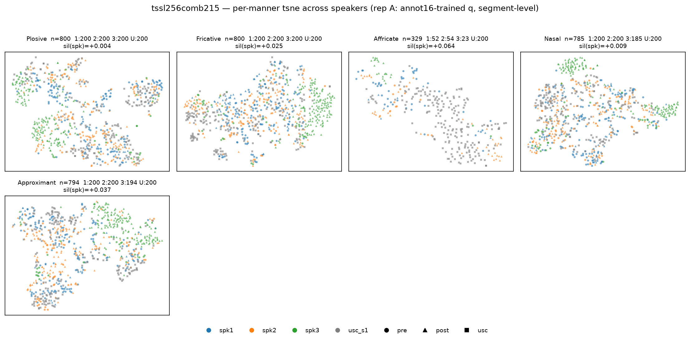
*Figure 12:t-SNE projections of segment-level embeddings for GLOSS speakers versus USC LSS speakers on different manner (top) and place (bottom).*

---
**Usage Info**: 8417 tokens used.
**Generated at**: 2026-09-10 17:30:35

---

