# 🚩 (2026-09-12) Scholar Inbox 추천 논문 

# 📚 Post-Training Zero-Shot TTS for Fine-Grained Emotion and Duration Control via Natural Language

🚀 URL: https://arxiv.org/html/2609.11523

## 🌏 Abstract (원문)
Audiobook narration, conversational agents, and audiovisual dubbing require speech that conveys changing emotions and adapts its pacing within a single utterance. But most existing TTS systems typically rely on utterance-level style conditioning, making such fine-grained control difficult to achieve. In light of this, and inspired by the success of post-training in large language models, we propose a unified post-training framework that equips pretrained text-to-speech models with natural-language control over segment-level emotion and duration. Supervised fine-tuning establishes instruction-conditioned speech generation, while reinforcement learning with group relative policy optimization refines control accuracy using emotion and duration rewards alongside content and speaker preservation objectives. By reusing the pretrained architecture, our approach avoids additional inference-time control modules. Experiments demonstrate significantly improved fine-grained controllability while maintaining speech intelligibility and speaker identity, highlighting post-training as a practical approach to extending existing speech synthesis models.
## 🌏 Abstract (번역)
오디오북 내레이션, 대화형 에이전트, 시청각 더빙은 단일 발화 내에서 변화하는 감정을 전달하고 속도를 조절하는 음성을 필요로 합니다. 그러나 대부분의 기존 TTS 시스템은 일반적으로 발화 수준의 스타일 조건화에 의존하여 이러한 미세한 제어를 달성하기 어렵습니다. 이에 따라, 대규모 언어 모델의 후속 훈련(post-training) 성공에 영감을 받아, 사전 훈련된 텍스트-음성 변환 모델에 세그먼트 수준의 감정과 길이에 대한 자연어 제어 기능을 부여하는 통합 후속 훈련 프레임워크를 제안합니다. 지도 미세 조정(supervised fine-tuning)은 지시어 조건부 음성 생성을 확립하고, 그룹 상대 정책 최적화(group relative policy optimization)를 사용한 강화 학습은 내용 및 화자 보존 목표와 함께 감정 및 길이 보상을 사용하여 제어 정확도를 개선합니다. 사전 훈련된 아키텍처를 재사용함으로써, 우리의 접근 방식은 추가적인 추론 시간 제어 모듈을 피합니다. 실험은 음성 명료도와 화자 정체성을 유지하면서 미세한 제어 가능성이 크게 향상되었음을 보여주며, 후속 훈련이 기존 음성 합성 모델을 확장하는 실용적인 접근 방식임을 강조합니다.

## 🔍 Methods & Results
- 사전 훈련된 Cosyvoice2의 음성 언어 모델을 훈련하여, 단일 발화 내에서 세그먼트 수준의 감정 및 길이 제어를 자연어로 수행하며, 내용 및 화자 정체성을 보존하는 것을 목표로 합니다.
- 감정 데이터는 MED-TTS의 5가지 감정 범주를 IndexTTS2로 합성하고, Seed-TTS의 화자 참조와 ESD의 감정 참조(수동 및 MERaLiON-SER-v1 분류를 통해 선별)를 사용하여 구성했습니다.
- 길이 및 공동 제어 데이터는 LibriTTS-R 녹음에서 생성되었으며, PSOLA를 사용하여 음성 세그먼트를 늘리거나 압축하여 정확한 길이 및 상대 속도 지시어를 만들었고, 이는 중국어 평가 세트에도 일반화되었습니다.
- 지도 미세 조정(SFT)을 통해 모델이 지역 감정 지시어를 음성으로 매핑하는 방법을 학습하도록 초기화했습니다.
- 감정 중심 GRPO(Group Relative Policy Optimization)를 사용하여 감정 제어를 추가로 최적화했으며, Qwen3-ForcedAligner로 정렬하고 MERaLiON-SER-v1로 감정을 예측하여 감정 신뢰도, 세그먼트/발화 수준 정확도, ASR 기반 내용 일관성, 화자 유사성을 결합한 보상을 사용했습니다.
- 길이 SFT는 감정 정제 모델을 길이 제어 데이터에 미세 조정했으며, 음성 토큰 예측과 세그먼트 토큰 길이 및 상대 경계에 대한 보조 감독(smooth-L1 손실)을 결합했습니다.
- 길이 중심 GRPO는 Qwen3-ForcedAligner로 세그먼트 길이를 측정하고, 정확한 길이 및 상대 속도 요청에 대한 점수를 매겨, 소프트 점수, 세그먼트/발화 수준 정확도, 누적 경계 일치도를 결합한 보상을 사용했습니다.
- 공동 정제 단계에서는 감정 전용, 길이 전용, 공동 제어 예제를 혼합하여 각 작업에 특화된 보상을 적용하여 감정 제어를 회복하고 타이밍 준수를 통합했습니다.
- 지시어 등가 증류(Instruction-equivalence Distillation)를 통해 지시어 표현의 견고성을 향상시켰으며, 정규 지시어와 유사한 의미의 다른 표현을 짝지어 사용하고, 동결된 GRPO 모델을 교사로 활용하여 학생 모델을 최적화했습니다.
- 마지막으로, 증류된 모델에서 짧은 GRPO 단계를 적용하여 혼합된 감정, 길이 및 공동 제어 예제에 대한 제어 정확도를 회복하고 추가로 개선했습니다.

---
**Usage Info**: 3390 tokens used.
**Generated at**: 2026-09-12 16:44:02

---

# 📚 Continuous-Time Acoustic Modelling with Neural Controlled Differential Equations

🚀 URL: https://arxiv.org/html/2609.11725

## 🌏 Abstract (원문)
Text-to-speech (TTS) models commonly address text–speech alignment by expanding phone-level encoder states to frame-level decoder inputs using predicted durations. While this length-regulation step resolves alignment structurally, this use of duration typically changes only where and how often latent states appear, not the values of the states themselves. This paper proposes a continuous-time mechanism for duration-aware acoustic modelling in TTS using neural controlled differential equations (CDEs). We formulate the phone representation as a temporally parameterised control path and use a neural acoustic vector field to produce a continuous-time hidden state whose values evolve with phonetic content and duration-derived timing. The resulting trajectory can be sampled at discrete points and integrated into a standard acoustic decoder pipeline. Objective results contrast CDEs and typical recurrent models. Subjective results suggest that CDE-based models evaluating one phone per step can improve rank-order agreement between synthesised and reference emotion intensity while maintaining comparable emotion-expression quality to a strong baseline. Additional experiments with half-phone step-sizes suggest that temporal resolution changes the trade-off between style tracking and absolute calibration. These results position CDEs as a promising design space for continuous-time and duration-aware style-sensitive TTS.
## 🌏 Abstract (번역)
텍스트 음성 변환(TTS) 모델은 일반적으로 예측된 지속 시간을 사용하여 음소 수준 인코더 상태를 프레임 수준 디코더 입력으로 확장함으로써 텍스트-음성 정렬을 처리합니다. 이러한 길이 조절 단계는 구조적으로 정렬을 해결하지만, 지속 시간의 사용은 잠재 상태가 나타나는 위치와 빈도만 변경할 뿐, 상태 자체의 값은 변경하지 않습니다. 본 논문은 신경 제어 미분 방정식(CDE)을 사용하여 TTS에서 지속 시간 인식 음향 모델링을 위한 연속 시간 메커니즘을 제안합니다. 우리는 음소 표현을 시간적으로 매개변수화된 제어 경로로 공식화하고, 신경 음향 벡터 필드를 사용하여 음성 내용과 지속 시간에서 파생된 타이밍에 따라 값이 진화하는 연속 시간 은닉 상태를 생성합니다. 결과 궤적은 이산 지점에서 샘플링되어 표준 음향 디코더 파이프라인에 통합될 수 있습니다. 객관적인 결과는 CDE와 일반적인 순환 모델을 대조합니다. 주관적인 결과는 단계당 하나의 음소를 평가하는 CDE 기반 모델이 강력한 기준선과 유사한 감정 표현 품질을 유지하면서 합성된 감정 강도와 참조 감정 강도 간의 순위 일치도를 향상시킬 수 있음을 시사합니다. 반음소 단계 크기를 사용한 추가 실험은 시간 해상도가 스타일 추적과 절대 보정 간의 균형을 변화시킨다는 것을 보여줍니다. 이러한 결과는 CDE를 연속 시간 및 지속 시간 인식 스타일 민감 TTS를 위한 유망한 설계 공간으로 자리매김합니다.

## 🔍 Methods & Results
- 기존 TTS 모델은 음소 임베딩 반복을 통한 길이 조절로 텍스트-음성 정렬을 수행하지만, 이는 잠재 상태의 출현 위치와 빈도만 변경하고 값 자체는 변경하지 않아 지속 시간 정보를 충분히 활용하지 못합니다.
- 본 논문은 신경 제어 미분 방정식(CDE)을 활용하여 지속 시간 인식 음향 모델링을 위한 연속 시간 메커니즘을 제안합니다.
- 음소 표현은 시간적으로 매개변수화된 제어 경로로 공식화되며, 신경 음향 벡터 필드는 음성 내용과 지속 시간에서 파생된 타이밍에 따라 값이 진화하는 연속 시간 은닉 상태를 생성합니다.
- 디코더 상태는 CDE의 해로 매개변수화되며, 이는 조건화 시퀀스(텍스트 임베딩)와 지속 시간 파생 시간 채널 모두에 반응하여 은닉 궤적이 진화하도록 합니다.
- CDE는 정렬에서 파생된 시간 채널로 음소 임베딩을 보강하여, 반복 기반 길이 조절과 달리 지속 시간 정보를 디코더에 연속적으로 통합합니다.
- CDE는 고정 단계 크기 솔버(예: Euler 방법)를 사용하여 해결되며, 단계 크기 `h`를 조절하여 시간 해상도를 변경할 수 있습니다 (예: `h=1`은 음소당 한 단계, `h=0.5`는 음소 내 중간 평가).
- 결과 은닉 상태는 프레임 수준 또는 음소 수준에서 샘플링되어 표준 음향 디코더 파이프라인에 통합될 수 있습니다.
- 여러 CDE 레이어는 CDE의 연쇄 법칙을 사용하여 효율적으로 스택될 수 있으며, 중간 궤적을 명시적으로 구체화하고 재보간할 필요 없이 증강된 상태의 공동 통합을 가능하게 합니다.
- 객관적인 결과는 CDE가 기존 순환 모델과 대조되며, 주관적인 결과는 CDE 기반 모델이 합성된 감정 강도와 참조 감정 강도 간의 순위 일치도를 향상시키면서 강력한 기준선과 유사한 감정 표현 품질을 유지함을 보여줍니다.
- 반음소 단계 크기를 사용한 추가 실험은 시간 해상도가 스타일 추적과 절대 보정 간의 균형을 변화시킨다는 것을 시사하며, CDE가 연속 시간 및 지속 시간 인식 스타일 민감 TTS를 위한 유망한 설계 공간임을 입증합니다.

---
**Usage Info**: 4238 tokens used.
**Generated at**: 2026-09-12 16:44:12

---

# 📚 Learned Continuous Synthesis ofQuadratic Difference Tone Spectra

🚀 URL: https://arxiv.org/html/2609.10913

## 🌏 Abstract (원문)
Quadratic difference tones (QDTs) are a species of auditory distortion product in which a “phantom” pure tone, absent from the acoustic signal, is clearly audible to listeners. Exploiting this phenomenon, one can synthesize harmonically rich tones for musical purposes, a technique called Quadratic Difference Tone Spectrum (QDTS) synthesis. Previous works have introduced numerical methods to synthesize QDTS based on the distortion function, which links a target QDTS and an overtone-structured carrier signal. While accurate, these methods were stochastic and discontinuous, making them difficult to control for musical purposes and effectively limiting them to stationary signals. This paper proposes a neural network-based approach that learns an approximate inverse of the distortion mapping in an autoencoder-like configuration, producing a continuous approximation that addresses prior limitations. Experimental results show that, although slightly less numerically precise, the method is sufficient for perceptual and musical applications. We also implement a real-time version in Max and evaluate its performance. Various sound examples demonstrate its expressive and musical potential. The source code, audio examples, tutorials, and software accompanying this work are available athttps://cordutie.github.io/projects/qdts.html.
## 🌏 Abstract (번역)
2차 차이음(QDT)은 음향 신호에는 존재하지 않지만 청취자에게는 명확하게 들리는 '환상' 순음의 일종인 청각 왜곡 산물입니다. 이 현상을 활용하여 음악적 목적으로 배음이 풍부한 음색을 합성할 수 있는데, 이를 2차 차이음 스펙트럼(QDTS) 합성이라고 합니다. 이전 연구에서는 목표 QDTS와 배음 구조의 캐리어 신호를 연결하는 왜곡 함수를 기반으로 QDTS를 합성하는 수치적 방법을 제시했습니다. 이러한 방법들은 정확했지만 확률적이고 불연속적이어서 음악적 목적으로 제어하기 어렵고 정지 신호에만 효과적으로 제한되었습니다. 본 논문은 오토인코더와 유사한 구성으로 왜곡 매핑의 근사 역함수를 학습하는 신경망 기반 접근 방식을 제안하며, 이전의 한계를 해결하는 연속적인 근사치를 생성합니다. 실험 결과에 따르면, 이 방법은 수치적으로는 약간 덜 정확하지만 지각 및 음악적 응용에 충분합니다. 또한 Max에서 실시간 버전을 구현하고 성능을 평가했습니다. 다양한 사운드 예시는 이 방법의 표현력과 음악적 잠재력을 보여줍니다. 본 연구에 수반되는 소스 코드, 오디오 예시, 튜토리얼 및 소프트웨어는 https://cordutie.github.io/projects/qdts.html에서 확인할 수 있습니다.

## 🔍 Methods & Results
- 기존 QDTS 합성의 수치적 방법은 확률적이고 불연속적이며, 음악적 제어가 어렵고 정지 신호에만 제한되는 한계가 있었습니다.
- 본 논문은 오토인코더와 유사한 구성으로 왜곡 매핑의 근사 역함수를 학습하는 신경망 기반 접근 방식을 제안하여, 기존 방법의 한계를 해결하는 연속적인 근사치를 생성합니다.
- 실험 결과, 제안된 신경망 기반 방법은 수치적 정밀도는 약간 떨어지지만, 지각 및 음악적 응용에 충분함을 입증했습니다.
- Max에서 실시간 버전이 구현 및 평가되었으며, 다양한 사운드 예시를 통해 이 방법의 표현력과 음악적 잠재력이 시연되었습니다.

## 🖼 Figures
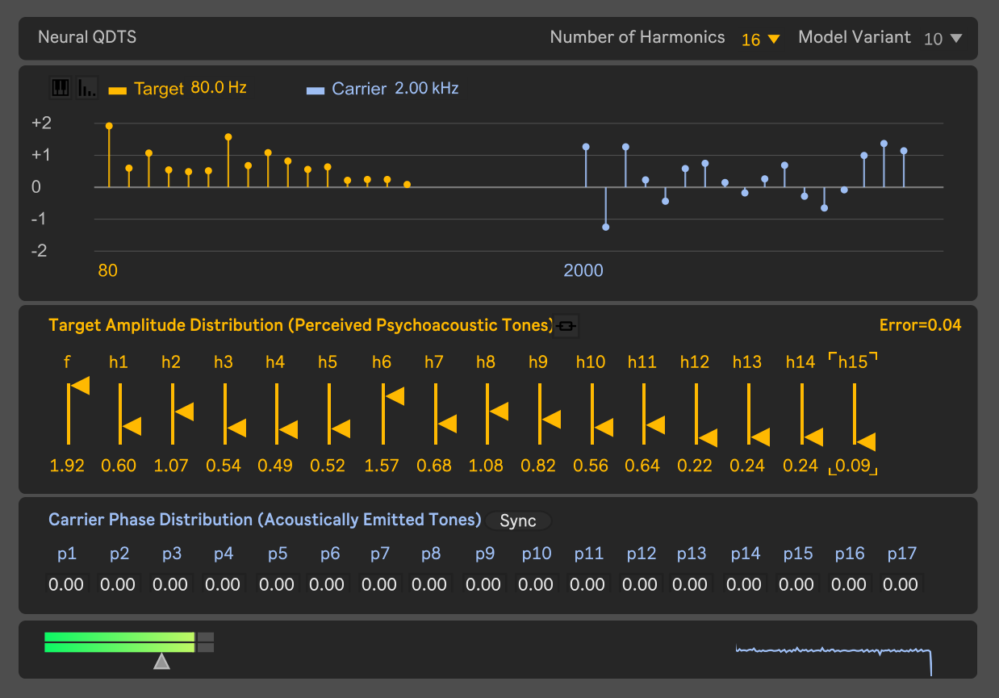
*Figure 3:A snapshot of the developed Max patch to allow for easy interaction with the qdts.solver_nn external employing the trained models.*

---
**Usage Info**: 1507 tokens used.
**Generated at**: 2026-09-12 16:44:18

---

# 📚 ZipCodec: Ultra-Low-Frame-Rate Streaming Speech Coding

🚀 URL: https://arxiv.org/html/2609.11642

## 🌏 Abstract (원문)
Neural audio codecs are a fundamental component of modern speech generation systems. While recent codecs achieve increasingly low bitrates, reducing frame rate remains challenging, as each token must preserve more information while maintaining reconstruction quality. We present ZipCodec, a streaming neural speech codec operating at 6.25 Hz and 0.80 kbps with a theoretical latency of 160 ms. Our approach combines large-scale WavLM distillation with a redesigned transformer-based architecture, a scalar spherical quantizer, and a latency-aware streaming decoder. Experiments show that ZipCodec substantially outperforms existing streaming codecs at comparable bitrates in both reconstruction and downstream tasks, while operating at a significantly lower frame rate. Despite its 842M parameters, ZipCodec achieves real-time single-stream inference on a consumer-grade CPU. Demo samples, code and checkpoints are available athttps://lucadellalib.github.io/zipcodec-web/.
## 🌏 Abstract (번역)
신경망 오디오 코덱은 현대 음성 생성 시스템의 근본적인 구성 요소입니다. 최근 코덱들이 점점 더 낮은 비트레이트를 달성하고 있지만, 프레임 레이트를 줄이는 것은 여전히 어렵습니다. 이는 각 토큰이 재구성 품질을 유지하면서 더 많은 정보를 보존해야 하기 때문입니다. 본 논문에서는 6.25Hz 및 0.80kbps로 작동하며 이론적 지연 시간이 160ms인 스트리밍 신경망 음성 코덱인 ZipCodec을 소개합니다. 우리의 접근 방식은 대규모 WavLM 증류와 재설계된 트랜스포머 기반 아키텍처, 스칼라 구형 양자화기, 그리고 지연 시간 인식 스트리밍 디코더를 결합합니다. 실험 결과 ZipCodec은 유사한 비트레이트에서 기존 스트리밍 코덱보다 재구성 및 다운스트림 작업 모두에서 훨씬 뛰어난 성능을 보였으며, 훨씬 낮은 프레임 레이트에서 작동합니다. 8억 4천 2백만 개의 매개변수에도 불구하고 ZipCodec은 소비자용 CPU에서 실시간 단일 스트림 추론을 달성합니다. 데모 샘플, 코드 및 체크포인트는 https://lucadellalib.github.io/zipcodec-web/에서 확인할 수 있습니다.

## 🔍 Methods & Results
- ZipCodec은 6.25Hz 및 0.80kbps로 작동하며 이론적 지연 시간은 160ms입니다.
- 대규모 WavLM 증류, 재설계된 트랜스포머 기반 아키텍처, 스칼라 구형 양자화기, 그리고 지연 시간 인식 스트리밍 디코더를 결합한 접근 방식을 사용합니다.
- 유사한 비트레이트에서 기존 스트리밍 코덱보다 재구성 및 다운스트림 작업 모두에서 훨씬 뛰어난 성능을 보였습니다.
- 상당히 낮은 프레임 레이트에서 작동합니다.
- 8억 4천 2백만 개의 매개변수에도 불구하고 소비자용 CPU에서 실시간 단일 스트림 추론을 달성합니다.

## 🖼 Figures

*Figure 1:ZipCodec architecture. The encoder extracts features containing both acoustic and semantic information. These features are then mapped to a low-dimensional space by the compressor, quantized, and projected back by the decompressor. The decoder resynthesizes the waveform from these features. All these modules are causal, while a non-causal teacher is used for distillation to align causal features with their non-causal counterparts.*

---
**Usage Info**: 1283 tokens used.
**Generated at**: 2026-09-12 16:44:24

---

# 📚 Flexible and Interpretable Accent Distance Measurements

🚀 URL: https://arxiv.org/html/2609.11458

## 🌏 Abstract (원문)
Determining the differences between two speakers’ accents is a fundamental task in linguistics and speech technology research. The methodology used to measure these differences depends on the specific research area. A phonetics researcher may demonstrate accent variation by comparing vowel formants in paired recordings of individual words. These results will be interpretable, but the recordings will be time-consuming to collect and may not be representative of connected speech. Accented Text-to-Speech (TTS) research has pushed towards using accent embeddings derived from accent classification tasks. These embeddings can be produced from any speech recording, but are not readily interpretable. In this paper, we demonstrate that articulatory representations created through articulatory inversion can be used as an interpretable basis for accent comparison and that optimal transport provides a framework for accent comparison across arbitrary recording types.
## 🌏 Abstract (번역)
두 화자의 악센트 차이를 결정하는 것은 언어학 및 음성 기술 연구의 근본적인 과제입니다. 이러한 차이를 측정하는 데 사용되는 방법론은 특정 연구 분야에 따라 달라집니다. 음성학 연구자는 개별 단어의 짝을 이룬 녹음에서 모음 포먼트를 비교하여 악센트 변이를 보여줄 수 있습니다. 이러한 결과는 해석 가능하지만, 녹음 수집에 시간이 많이 걸리고 연결된 음성을 대표하지 못할 수 있습니다. 악센트 음성 합성(TTS) 연구는 악센트 분류 작업에서 파생된 악센트 임베딩을 사용하는 방향으로 나아가고 있습니다. 이러한 임베딩은 모든 음성 녹음에서 생성될 수 있지만, 쉽게 해석할 수는 없습니다. 본 논문에서는 조음 역변환을 통해 생성된 조음 표현이 악센트 비교를 위한 해석 가능한 기반으로 사용될 수 있으며, 최적 수송(optimal transport)이 임의의 녹음 유형에 걸쳐 악센트 비교를 위한 프레임워크를 제공함을 보여줍니다.

## 🔍 Methods & Results
- 조음 역변환(articulatory inversion)을 통해 생성된 조음 표현(articulatory representations)을 악센트 비교를 위한 해석 가능한 기반으로 활용하는 방법을 제시했습니다.
- 최적 수송(optimal transport)이 임의의 녹음 유형에 걸쳐 악센트 비교를 위한 프레임워크를 제공함을 입증했습니다.

## 🖼 Figures
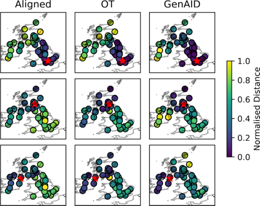
*Figure 1:Normalised distances between the target speaker (red star) and all other speakers according to alignment and OT with articulatory features (Left, Middle) and GenAID embedding distance.*

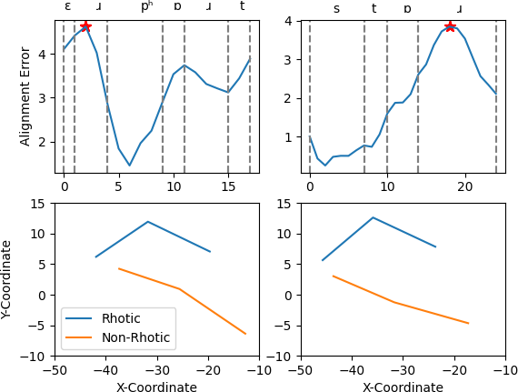
*Figure 2:Tongue position for Rhotic and Non-Rhotic speakers at maximum alignment error in the word ‘airport’ (Left) and ‘store’ (Right).*

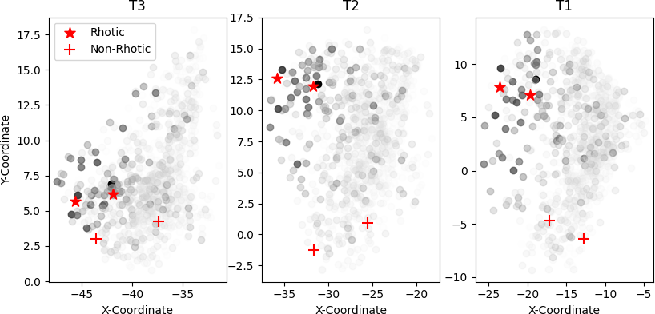
*Figure 3:Rhotic (star) and non-rhotic (cross) tongue positions for ‘airport’ and ‘store’ compared with articulatory clusters coloured by intensity according to OT distance.*

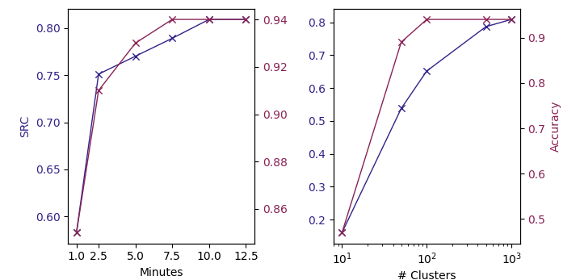
*Figure 4:Effect of cluster size and number of minutes input on alignment distance SRC and classification accuracy.*

---
**Usage Info**: 1049 tokens used.
**Generated at**: 2026-09-12 16:44:29

---

# 📚 Preference Optimization with LALM Feedback for Continuous Autoregressive Non-Verbal Vocalization Generation

🚀 URL: https://arxiv.org/html/2609.11260

## 🌏 Abstract (원문)
We propose a preference optimization framework with Large Audio-Language Model (LALM) feedback for controllable non-verbal vocalization (NVV) generation in continuous autoregressive speech models. To construct preference data without human preference annotation, we build a bilingual prompt corpus by combining NVV-injected real transcripts with LLM-generated semantically aligned prompts, perform stochastic model rollouts, and use a LALM to rank candidate utterances and form same-prompt chosen–rejected pairs. We then adopt a two-stage optimization strategy: Rejection Sampling Fine-Tuning (RSFT) first adapts the model to LALM-selected high-scoring samples, followed by Anchored Flow-DPO, which formulates pairwise preference optimization using utterance-level flow-matching loss and retains the chosen-sample flow-matching objective as an SFT anchor. This design enables DPO-style preference learning without explicit sequence likelihoods while preserving direct supervision on preferred realizations. On the official 1,600-utterance NVVSpeech Challenge Track	2 test set, our method achieves a Final Track2Score of75.80(79.39 ZH / 72.21 EN), outperforming the VoxCPM2 baseline by+1.84. The improvements are mainly driven by higher NVV Accuracy and NVV Perceptual Effect, while Overall Quality remains stable. Speech samples are available††Demo:https://hujingbin1.github.io/NVV-TTS-Demo-Page/.
## 🌏 Abstract (번역)
본 논문은 연속적인 자기회귀 음성 모델에서 제어 가능한 비언어적 발성(NVV) 생성을 위한 대규모 오디오-언어 모델(LALM) 피드백 기반 선호도 최적화 프레임워크를 제안합니다. 사람의 선호도 주석 없이 선호도 데이터를 구축하기 위해, NVV가 주입된 실제 전사본과 LLM이 생성한 의미론적으로 정렬된 프롬프트를 결합하여 이중 언어 프롬프트 코퍼스를 구축하고, 확률적 모델 롤아웃을 수행하며, LALM을 사용하여 후보 발화를 순위 매기고 동일 프롬프트의 선택-거부 쌍을 형성합니다. 그 다음 두 단계 최적화 전략을 채택합니다: 먼저 LALM이 선택한 고득점 샘플에 모델을 적응시키는 거부 샘플링 미세 조정(RSFT)을 수행하고, 이어서 발화 수준 흐름 매칭 손실을 사용하여 쌍별 선호도 최적화를 공식화하고 선택된 샘플의 흐름 매칭 목표를 SFT 앵커로 유지하는 Anchored Flow-DPO를 적용합니다. 이 설계는 명시적인 시퀀스 가능도 없이 DPO 스타일의 선호도 학습을 가능하게 하면서 선호되는 구현에 대한 직접적인 감독을 유지합니다. 공식 1,600개 발화 NVVSpeech Challenge Track 2 테스트 세트에서, 우리의 방법은 최종 Track2Score 75.80(중국어 79.39 / 영어 72.21)을 달성하여 VoxCPM2 기준선보다 +1.84 높은 성능을 보였습니다. 개선 사항은 주로 더 높은 NVV 정확도와 NVV 지각 효과에 의해 주도되었으며, 전반적인 품질은 안정적으로 유지되었습니다. 음성 샘플은 다음 데모 페이지에서 확인할 수 있습니다: https://hujingbin1.github.io/NVV-TTS-Demo-Page/.

## 🔍 Methods & Results
- 제어 가능한 NVV 생성을 위해 LALM 피드백을 활용하는 선호도 최적화 프레임워크를 제안하며, 이는 연속적인 자기회귀 음성 모델에 적용됩니다.
- 선호도 데이터는 이중 소스 프롬프트 구성(NVV가 주입된 실제 전사본과 LLM 생성 의미 정렬 프롬프트), 확률적 롤아웃(프롬프트당 10개의 후보 발화), LALM 기반 평가(Qwen3.5-Omni-Plus를 사용하여 5가지 차원 평가 후 최고/최저 점수 발화로 선택-거부 쌍 형성)를 통해 구축됩니다.
- 최적화는 두 단계로 진행됩니다: 1단계는 LALM이 선택한 고득점 샘플에 대한 거부 샘플링 미세 조정(RSFT)을 통해 선호도 인식 초기화를 수행합니다.
- 2단계는 Anchored Flow-DPO를 수행하며, 이는 발화 수준 흐름 매칭 손실을 사용하여 쌍별 선호도 최적화를 공식화하고, 선택된 샘플에 대한 직접적인 감독을 유지하기 위해 SFT 앵커(선택된 샘플 흐름 매칭 목표)를 포함합니다.
- 기존 DPO가 요구하는 명시적인 시퀀스 로그-가능도가 흐름 매칭 디코더에서 제공되지 않으므로, 발화 수준 흐름 매칭 손실을 대리 선호도 신호로 사용합니다.
- NVVSpeech Challenge Track 2 테스트 세트에서 최종 Track2Score 75.80(중국어 79.39 / 영어 72.21)을 달성하여 VoxCPM2 기준선(73.96)보다 +1.84 높은 성능을 보였습니다.
- 제안된 방법(RSFT + Flow-DPO w/ SFT anchor)은 RSFT (75.00), Flow-DPO (w/o SFT anchor) (75.43), RSFT + Flow-DPO (w/o SFT anchor) (75.69) 등 다른 변형보다 높은 점수를 기록했습니다.
- 성능 개선은 주로 NVV 정확도와 NVV 지각 효과의 향상에 기인하며, 전반적인 품질은 안정적으로 유지되었습니다.

## 🖼 Figures
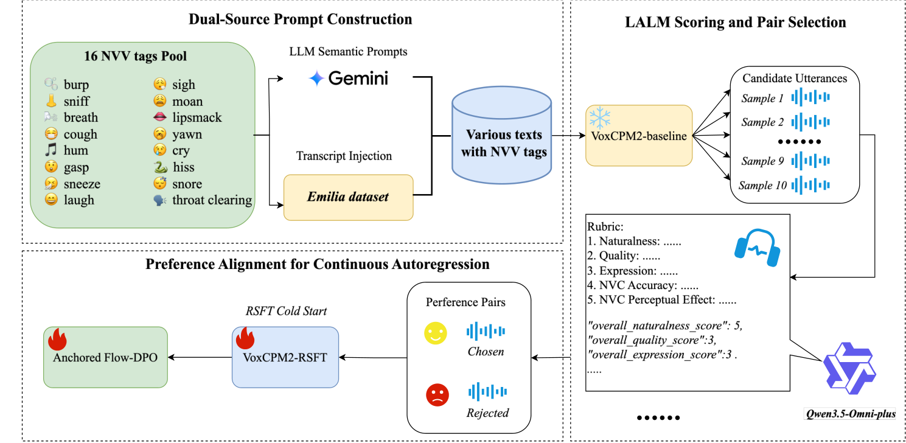
*Figure 1:Overview of the proposed LALM-based preference data construction and two-stage preference optimization framework with RSFT and Anchored Flow-DPO.*

---
**Usage Info**: 4816 tokens used.
**Generated at**: 2026-09-12 16:44:39

---

# 📚 Not All Attacks Are Learned Equally in Speech Deepfake Detection

🚀 URL: https://arxiv.org/html/2609.11763

## 🌏 Abstract (원문)
Speech deepfake detection (SDD) models are trained on multi-attack datasets containing diverse spoofing systems, such as text-to-speech (TTS) and voice conversion (VC). In standard classifier training on multi-attack datasets, all attacks are treated as one spoofed class, and performance is reported using overall Equal Error Rate (EER). This aggregate view obscures how individual attacks shape learning and generalization. To better understand this attack-level behavior, we first balance TTS and VC exposure using sample and attack omission. We then measure attack-wise EER at inference and analyze attack-wise training loss and predictive entropy to characterize optimization. Results show that attacks contribute unequally: some attacks have high EER sensitivity and concentrated entropy with low loss, indicating strong influence on the decision boundary. We define these ashigh-impact attacks. To reduce uneven generalization across attacks, we propose a replay-regularized, attack-aware curriculum that steps exposure based on measured attack influence. Experiments on ASVspoof 2019, 2021, ASVspoof 5, and Fake-or-Real show improved overall robustness and reduced attack-level imbalance compared with standard multi-attack training.
## 🌏 Abstract (번역)
음성 딥페이크 탐지(SDD) 모델은 텍스트-음성 변환(TTS) 및 음성 변환(VC)과 같은 다양한 스푸핑 시스템을 포함하는 다중 공격 데이터셋으로 훈련됩니다. 다중 공격 데이터셋에 대한 표준 분류기 훈련에서는 모든 공격이 하나의 스푸핑된 클래스로 취급되며, 성능은 전체 등오류율(EER)을 사용하여 보고됩니다. 이러한 집계된 관점은 개별 공격이 학습 및 일반화에 어떻게 영향을 미치는지 가립니다. 이러한 공격 수준의 동작을 더 잘 이해하기 위해, 우리는 먼저 샘플 및 공격 생략을 사용하여 TTS 및 VC 노출의 균형을 맞춥니다. 그런 다음 추론 시 공격별 EER을 측정하고, 최적화를 특성화하기 위해 공격별 훈련 손실 및 예측 엔트로피를 분석합니다. 결과는 공격들이 불균등하게 기여한다는 것을 보여줍니다: 일부 공격은 높은 EER 민감도와 낮은 손실로 집중된 엔트로피를 가지며, 이는 결정 경계에 강한 영향을 미친다는 것을 나타냅니다. 우리는 이러한 공격을 고영향 공격으로 정의합니다. 공격 전반에 걸친 불균등한 일반화를 줄이기 위해, 우리는 측정된 공격 영향에 기반하여 노출을 단계화하는 재생-정규화된, 공격 인식 커리큘럼을 제안합니다. ASVspoof 2019, 2021, ASVspoof 5 및 Fake-or-Real에 대한 실험은 표준 다중 공격 훈련과 비교하여 전반적인 견고성 향상 및 공격 수준 불균형 감소를 보여줍니다.

## 🔍 Methods & Results
- TTS 및 VC 노출의 균형을 맞추기 위해 샘플 및 공격 생략 기법을 사용했습니다.
- 추론 시 공격별 EER을 측정하고, 최적화 특성화를 위해 공격별 훈련 손실 및 예측 엔트로피를 분석했습니다.
- 분석 결과, 공격들이 불균등하게 기여하며, 일부 공격(고영향 공격)은 높은 EER 민감도와 낮은 손실로 집중된 엔트로피를 보여 결정 경계에 강한 영향을 미친다는 것을 발견했습니다.
- 공격 전반의 불균등한 일반화를 줄이기 위해, 측정된 공격 영향에 기반하여 노출을 단계화하는 재생-정규화된, 공격 인식 커리큘럼을 제안했습니다.
- ASVspoof 2019, 2021, ASVspoof 5 및 Fake-or-Real 데이터셋에 대한 실험 결과, 제안된 방법이 표준 다중 공격 훈련에 비해 전반적인 견고성을 향상시키고 공격 수준의 불균형을 감소시켰습니다.

## 🖼 Figures
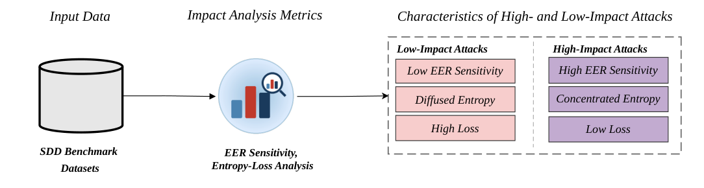
*Fig. 1:Overview of the attack-level impact analysis. Omission-induced EER sensitivity and entropy–loss dynamics are used to characterize low-impact and high-impact attacks in SDD benchmark datasets.*

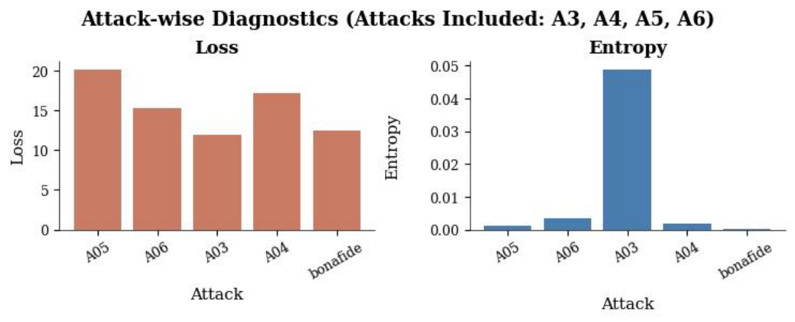
*(a)Attacks Included: A3, A4, A5, A6*

*(a)Attacks Included: A3, A4, A5, A6*

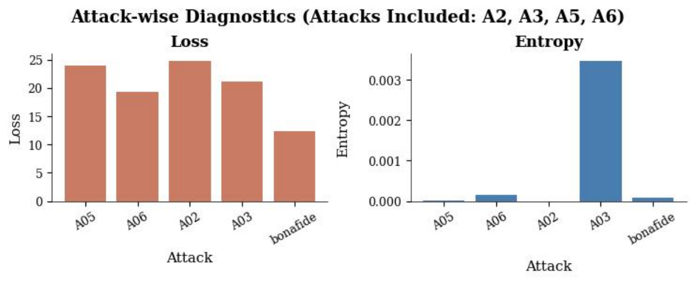
*(b)Attacks Included: A2, A3, A5, A6*

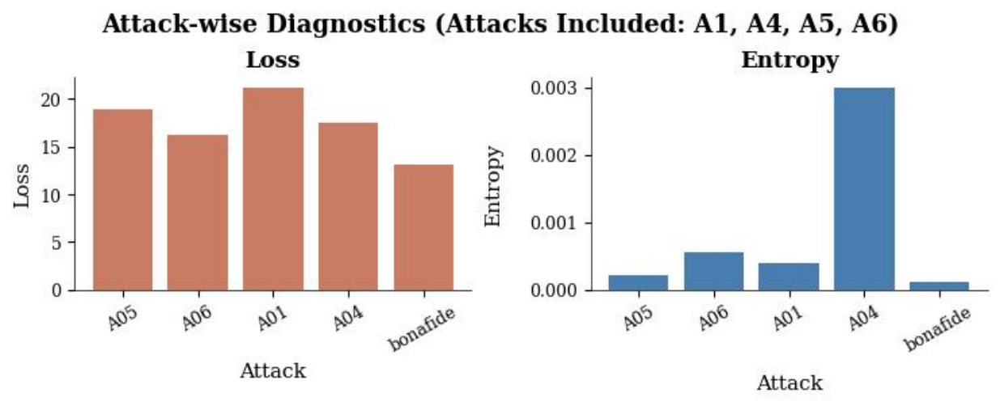
*(c)Attacks Included: A1, A4, A5, A6*

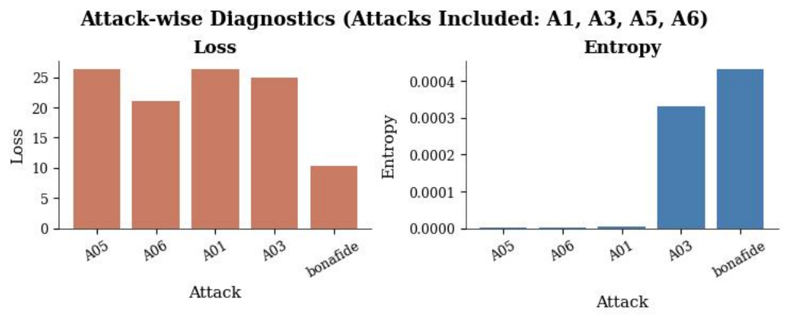
*(d)Attacks Included: A1, A3, A5, A6*

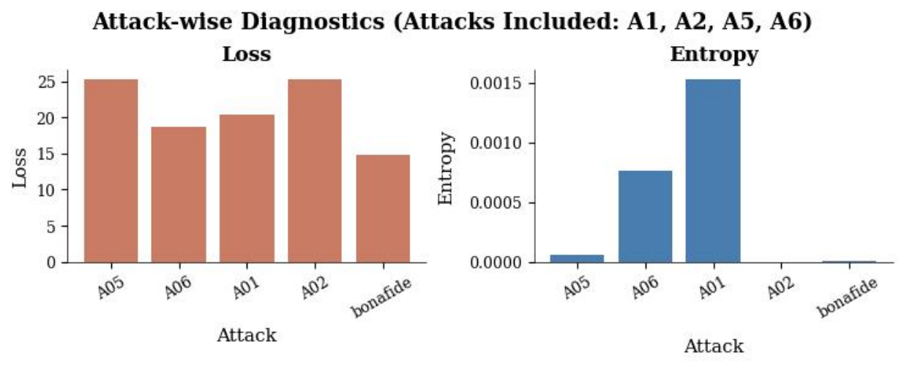
*(e)Attacks Included: A1, A2, A5, A6*

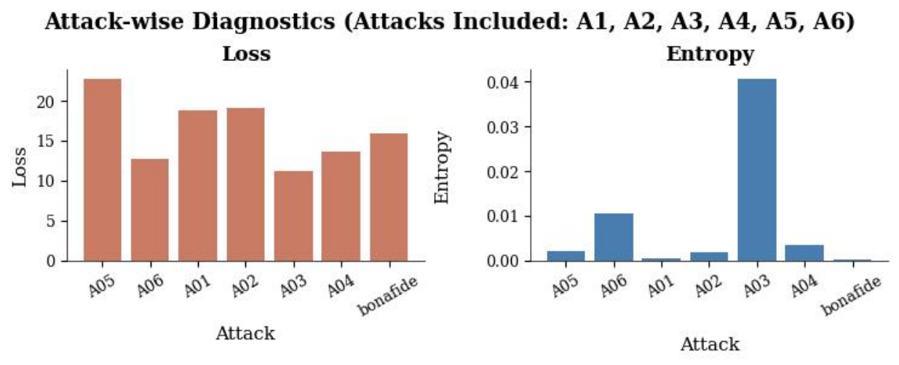
*(f)Balanced Dataset: Unequal Attacks, Equal Number of Samples*

*Fig. 3:Replay-regularized attack-aware curriculum for reducing high-impact attack dominance. Step 1 trains the model on 60% of the low-impact data. Step 2 initializes from the best Step-1 checkpoint and adapts to all high-impact attacks, while replaying the remaining 40% low-impact subset with teacher–student regularization.*

---
**Usage Info**: 2643 tokens used.
**Generated at**: 2026-09-12 16:44:50

---

# 📚 X-AuT: Progressive Audio-Encoder Compression for Speech LLMs with Cross-Scale Distillation

🚀 URL: https://arxiv.org/html/2609.11412

## 🌏 Abstract (원문)
Reducing audio-encoder depth lowers the inference cost of speech large language models, but removing complete blocks perturbs the embeddings consumed by the decoder and can cause deletion and premature end-of-sequence errors. We introduce X-AuT, a progressive framework that selects layer combinations through short behavioral probes and restores the pruned model through representation alignment, cross-scale distillation, scheduled student-policy supervision, and LoRA finetuning. The language-model backbone remains frozen, while attention LoRA adapters and the tied output embedding adapt during distillation. Training uses the highest-agreement tier from a transcript-consistency pipeline, followed by source reweighting during finetuning. On ten public Chinese–English benchmarks, compressing Qwen3-ASR-0.6B from 18 to 16 audio-encoder layers reduces macro-average error from 5.61% to 5.27%. The 14-layer model reaches 5.75% with 20.7% fewer audio-tower parameters. Under the matched recipe, the 1.7B teacher yields 5.55% mean error, compared with 8.45% for self-distillation, and progressive 18→14 pruning outperforms direct pruning (5.75% vs. 6.73%). These single-run results establish two practical operating points and show that the accuracy effects vary across benchmarks. Project website:https://xpeng-ai.github.io/x-aut.
## 🌏 Abstract (번역)
오디오 인코더 깊이를 줄이면 음성 대규모 언어 모델의 추론 비용이 낮아지지만, 전체 블록을 제거하면 디코더가 사용하는 임베딩이 교란되어 삭제 및 조기 시퀀스 종료 오류가 발생할 수 있습니다. 본 논문에서는 짧은 행동 프로브를 통해 레이어 조합을 선택하고, 표현 정렬, 교차 스케일 증류, 스케줄링된 학생 정책 감독 및 LoRA 미세 조정을 통해 가지치기된 모델을 복원하는 점진적 프레임워크인 X-AuT를 소개합니다. 언어 모델 백본은 고정된 상태를 유지하며, 어텐션 LoRA 어댑터와 연결된 출력 임베딩은 증류 과정에서 적응합니다. 훈련은 전사 일관성 파이프라인에서 가장 높은 일치도를 보이는 계층을 사용하며, 이후 미세 조정 중에는 소스 재가중치를 적용합니다. 10개의 공개 중국어-영어 벤치마크에서 Qwen3-ASR-0.6B를 18개에서 16개 오디오 인코더 레이어로 압축했을 때 매크로 평균 오류가 5.61%에서 5.27%로 감소했습니다. 14개 레이어 모델은 20.7% 더 적은 오디오 타워 매개변수로 5.75%의 오류율을 달성했습니다. 동일한 레시피에서 1.7B 교사 모델은 5.55%의 평균 오류를 보였고, 이는 자체 증류의 8.45%와 비교됩니다. 또한 점진적인 18→14 가지치기는 직접 가지치기(5.75% 대 6.73%)보다 우수한 성능을 보였습니다. 이러한 단일 실행 결과는 두 가지 실용적인 작동 지점을 설정하며, 정확도 효과가 벤치마크마다 다르게 나타남을 보여줍니다.

## 🔍 Methods & Results
- X-AuT는 전사 일치도를 기준으로 훈련 예제를 필터링하고, 짧은 행동 프로브를 통해 복구 가능한 레이어 조합을 식별하며, 3단계 훈련 스케줄로 가지치기된 모델을 복원합니다.
- Qwen3-ASR 모델은 N-레이어 오디오 인코더와 브릿지를 통해 오디오 임베딩을 생성하고, 이를 토큰 임베딩 시퀀스의 오디오 플레이스홀더 위치에 배치하여 인과적 언어 모델 디코더가 전사 토큰을 예측합니다.
- 가지치기 작업은 오디오 인코더 블록의 순서 있는 부분집합을 유지하며, 목표 깊이에서 총 텍스트 오류율(TER)을 최소화하는 복구 가능한 부분집합과 매개변수를 찾습니다.
- 사전 훈련된 디코더(`Dψ`) 가중치는 고정되며, LoRA 어댑터와 연결된 출력 임베딩(`Hω`)은 훈련 가능합니다.
- 복구 목표는 중간 및 브릿지 표현을 정렬한 다음, 교사 강제 및 학생 생성 접두사 하에서 토큰 분포를 적응시키는 것입니다.
- 훈련 데이터는 두 개의 강력한 ASR 시스템 가설과 원본 전사 간의 편집률(중국어는 CER, 영어는 WER)을 계산하여 9단계의 일치도 계층으로 분류하며, 증류 단계에서는 가장 높은 일치도 계층(클래스 1)을 사용합니다.
- 가지치기는 18→16→14의 두 단계로 진행되며, 각 단계에서 후보 레이어 조합은 고정된 5개 벤치마크 개발 스위트에서 가장 낮은 총 TER을 기준으로 선택됩니다.
- 학생 모델은 가지치기된 Qwen3-ASR-0.6B이고, 교사 모델은 24개 레이어 오디오 인코더를 가진 Qwen3-ASR-1.7B이며, 교사 매개변수는 추론 시 고정 및 폐기됩니다.
- 1단계(Stage 0)는 증류 에포크의 처음 5%를 차지하며, 중간 레이어, 브릿지, 로짓 및 전사 손실을 결합합니다. 교사 및 학생 특징을 정렬하기 위해 MLP를 사용하고, 로짓 KD는 온도 스케일링된 KL 발산을 사용합니다.
- 2단계(Stage 1)는 중간 레이어 손실을 비활성화하고 브릿지 정렬, 교사 강제 로짓 KD 및 골드 전사 CE를 사용합니다. Stage 1의 20% 경과 후, 5번째 옵티마이저 스텝마다 학생 정책 감독을 스케줄링하여 학생이 생성한 접두사에 대해 모델 분포를 비교합니다.
- 3단계(Stage 2)는 Stage 1의 최적 체크포인트로 초기화되며, 한 에포크 동안 골드 전사 CE를 최적화합니다. 오디오 인코더, 브릿지, 디코더 LoRA 어댑터는 훈련 가능하며, 데이터는 목표 도메인 소스에 가중치를 부여합니다.
- Qwen3-ASR-0.6B를 18개에서 16개 오디오 인코더 레이어로 압축했을 때 10개 벤치마크에서 매크로 평균 오류가 5.61%에서 5.27%로 감소했습니다.
- 14개 레이어 모델은 20.7% 더 적은 오디오 타워 매개변수로 5.75%의 오류율을 달성했습니다.
- 1.7B 교사 모델은 5.55%의 평균 오류를 보였고, 이는 자체 증류의 8.45%보다 우수합니다.
- 점진적인 18→14 가지치기(5.75%)는 직접 가지치기(6.73%)보다 우수한 성능을 보였습니다.
- 이러한 결과는 두 가지 실용적인 작동 지점을 확립하며, 정확도 효과가 벤치마크마다 다르게 나타남을 보여줍니다.

## 🖼 Figures
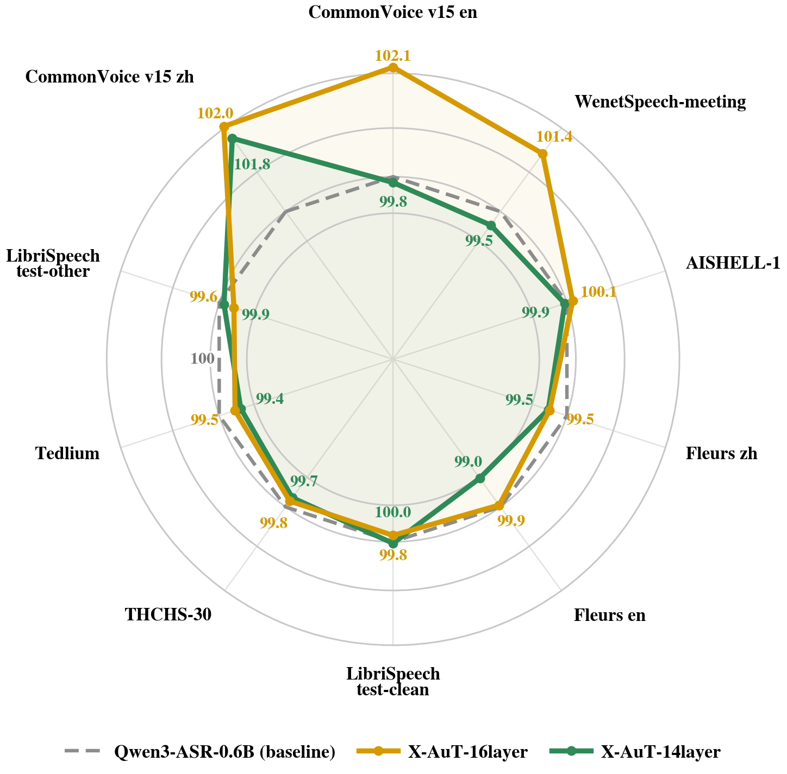
*Figure 1:Per-benchmark accuracy preservation of the Stage 2 X-AuT models relative to unpruned Qwen3-ASR-0.6B. The dashed contour marks the baseline (100); higher values indicate better accuracy retention.*

![Figure 2:Overview of X-AuT. Transcript-consistency filtering constructs the class 1 training pool, matched short-budget probes select recoverable layer combinations, and two pruning hops reduce the audio tower from 18 to 14 layers. Each pruned student is recovered through representation alignment, cross-scale distillation with teacher-forced and scheduled student-policy contexts, and LoRA finetuning while the decoder backbone remains frozen. Evaluation aggregates CER/WER over ten benchmarks; Secs. 4.2 and 3.4 provide the full configuration.](../images/2026-09-12/2609.11412/2609.11412_fig1.png)
*Figure 2:Overview of X-AuT. Transcript-consistency filtering constructs the class 1 training pool, matched short-budget probes select recoverable layer combinations, and two pruning hops reduce the audio tower from 18 to 14 layers. Each pruned student is recovered through representation alignment, cross-scale distillation with teacher-forced and scheduled student-policy contexts, and LoRA finetuning while the decoder backbone remains frozen. Evaluation aggregates CER/WER over ten benchmarks; Secs. 4.2 and 3.4 provide the full configuration.*

*Figure 3:Four-step data pipeline: corpus unification and normalization, dual-system transcription, pairwise CER/WER and consistency voting, and quality-ranked label selection. The rightmost panel reports the WenetSpeech audit summary; audit percentages describe label-selection behavior and are not used as training weights.*

*Figure 4:Selection-suite TER during 16-layer recovery. (a) Stage 0/1 distillation, with the transition near step 4000. (b) Stage 2 finetuning from the best Stage 1 checkpoint; the dashed line marks 5.76%. The displayed trends summarize checkpoint evaluations and are not uncertainty estimates.*

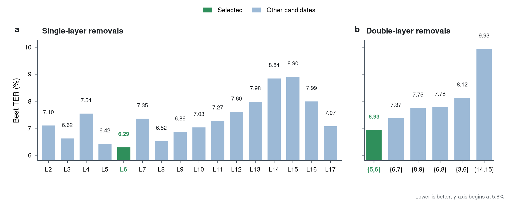
*Figure 5:Layer-screening results for single- and double-layer removals after the same 0.3-epoch warm-up. Lower TER is better; green marks the candidate selected for progressive pruning.*

*Figure 6:Premature-EOS ablation on prune-16. A disables both mitigations, B trains the tied head, C applies minimum-token gating, and D combines them. (a) Development TER. (b) Empty-rollout ratio (dashed) and mean rollout length (solid). All runs start from the same Stage 0 checkpoint.*

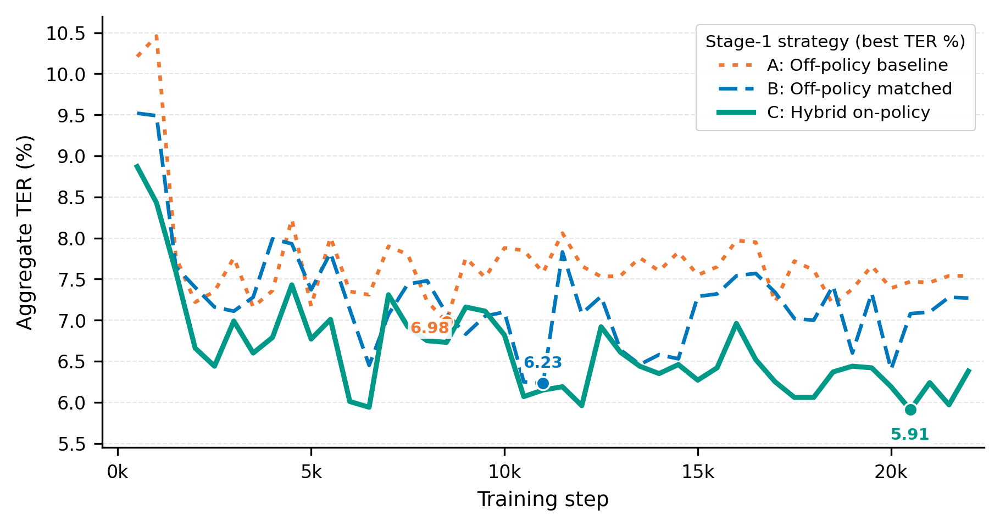
*Figure 7:Stage 1 strategy dashboard for plain off-policy, matched off-policy, and hybrid on-policy training; lower TER is better. Exact best and final values in the accompanying text are taken from the archived checkpoint logs.*

---
**Usage Info**: 4341 tokens used.
**Generated at**: 2026-09-12 16:45:04

---

# 📚 Flow Duality and Source Geometry for Categorical Generation

🚀 URL: https://arxiv.org/html/2609.10863

## 🌏 Abstract (원문)
Continuous and discrete flow matching are usually treated as separate constructions. This paper identifies a duality between them: projecting continuous convex-interpolant paths with one-hot targets through a position-wise argmax yields discrete convex-interpolant paths. The result requires source laws with appropriate coordinate symmetry and boundary regularity, and it makes the continuous source distribution an explicit design choice for categorical generation. We derive the induced discrete interpolation behavior for Gaussian, bounded-uniform, and centered negative-exponential sources, showing that different source geometries lead to qualitatively different transition timing and vocabulary-size dependence. Small visual diagnostics and a short language-modeling pilot suggest that these source-design effects can also appear in learned transports and early generative quality.
## 🌏 Abstract (번역)
연속 및 이산 흐름 매칭은 일반적으로 별개의 구성으로 취급됩니다. 본 논문은 이들 사이의 이중성을 밝혀냅니다: 원-핫 타겟을 가진 연속 볼록 보간 경로를 위치별 argmax를 통해 투영하면 이산 볼록 보간 경로가 생성됩니다. 이 결과는 적절한 좌표 대칭성과 경계 규칙성을 가진 소스 법칙을 필요로 하며, 연속 소스 분포를 범주형 생성에 대한 명시적인 설계 선택으로 만듭니다. 우리는 가우시안, 경계-균일, 중심 음수-지수 소스에 대해 유도된 이산 보간 동작을 도출하여, 다른 소스 기하학이 질적으로 다른 전환 타이밍과 어휘 크기 의존성을 초래함을 보여줍니다. 작은 시각적 진단과 짧은 언어 모델링 파일럿은 이러한 소스 설계 효과가 학습된 전송 및 초기 생성 품질에서도 나타날 수 있음을 시사합니다.

## 🔍 Methods & Results
- 연속 볼록 보간 경로를 원-핫 타겟과 위치별 argmax를 통해 투영하여 이산 볼록 보간 경로를 생성하는 이중성을 발견했습니다.
- 이 방법은 적절한 좌표 대칭성과 경계 규칙성을 가진 소스 법칙을 필요로 하며, 연속 소스 분포를 범주형 생성의 명시적인 설계 선택으로 활용합니다.
- 가우시안, 경계-균일, 중심 음수-지수 소스에 대한 유도된 이산 보간 동작을 도출하여, 소스 기하학이 전환 타이밍과 어휘 크기 의존성에 질적으로 다른 영향을 미침을 보였습니다.
- 작은 시각적 진단과 언어 모델링 파일럿 실험을 통해 이러한 소스 설계 효과가 학습된 전송 및 초기 생성 품질에도 나타날 수 있음을 확인했습니다.

## 🖼 Figures

*Figure 1:Induced coefficient 
𝑘
𝑡
 for Gaussian, bounded uniform with 
𝜖
=
1
, and centered negative-exponential with 
𝛽
=
1
 under the linear interpolant 
𝑘
~
𝑡
=
𝑡
 and vocabulary size 
𝑉
=
50,257
.*

*Figure 2:Vocabulary-size dependence of the Gaussian induced coefficient under the linear interpolant 
𝑘
~
𝑡
=
𝑡
. Larger vocabularies shift the effective transition later in time.*

*(a)Shifted bounded uniform source.*

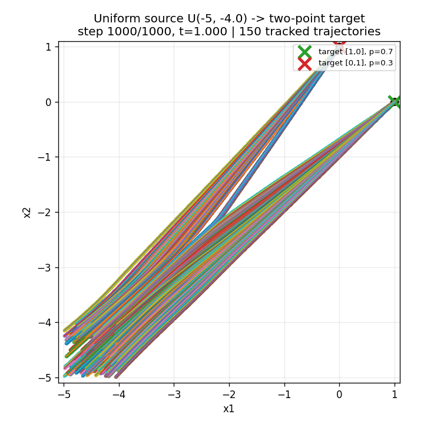
*(a)Shifted bounded uniform source.*

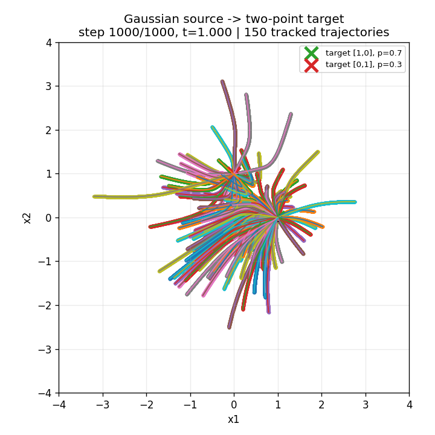
*(b)Gaussian source.*

---
**Usage Info**: 1234 tokens used.
**Generated at**: 2026-09-12 16:45:10

---

