# 🚩 (2026-09-17) Scholar Inbox 추천 논문 

# 📚 GrainSpeech: Less Context, More Detail for Compact Speech Synthesis

🚀 URL: https://arxiv.org/html/2609.18856

## 🌏 Abstract (원문)
Compact acoustic models face a challenging quality–capacity trade-off. We investigate two factors in this regime: encoder context and Mel-spectrogram supervision. A receptive-field-scaling study shows that expanding self-attention beyond 15 phonemes provides no consistent gains in pitch, energy, or duration prediction. Guided by this finding, we introduce a fixed-receptive-field convolutional encoder that reduces the respective prediction errors by 36.0%, 17.3%, and 3.4%. We further show that directly transferring image-domain gradient-variance supervision restores fine-scale variation but degrades predicted quality, motivating a Mel-specific formulation with axis-specific gradients, overlapping local statistics, and log-domain variance matching. GrainSpeech contains only 264.8K parameters and achieves 17.9×real-time Mel generation on a microcontroller (MCU), while attaining UTMOS scores comparable to substantially larger models with less than 1.5% of their parameters. Source code and demos are available athttps://github.com/lab-emi/GrainSpeech.
## 🌏 Abstract (번역)
소형 음향 모델은 품질-용량 간의 어려운 절충 문제에 직면합니다. 본 연구에서는 인코더 컨텍스트와 멜 스펙트로그램 감독이라는 두 가지 요소를 조사합니다. 수용장 스케일링 연구에 따르면, 자기 주의(self-attention)를 15개 음소 이상으로 확장하는 것은 피치, 에너지 또는 지속 시간 예측에서 일관된 이득을 제공하지 않는 것으로 나타났습니다. 이 발견에 따라, 우리는 고정 수용장 컨볼루션 인코더를 도입하여 각각의 예측 오류를 피치 36.0%, 에너지 17.3%, 지속 시간 3.4% 감소시켰습니다. 또한, 이미지 도메인 기울기 분산 감독을 직접 전이하는 것이 미세 스케일 변화를 복원하지만 예측 품질을 저하시킨다는 것을 보여주며, 축별 기울기, 중첩된 지역 통계, 로그 도메인 분산 매칭을 포함하는 멜 스펙트로그램 특정 공식화의 필요성을 제기합니다. GrainSpeech는 단 264.8K개의 파라미터만을 포함하며 마이크로컨트롤러(MCU)에서 17.9배 실시간 멜 생성 속도를 달성하는 동시에, 훨씬 더 큰 모델들의 1.5% 미만의 파라미터로도 유사한 UTMOS 점수를 얻습니다. 소스 코드와 데모는 https://github.com/lab-emi/GrainSpeech에서 확인할 수 있습니다.

## 🔍 Methods & Results
- GrainSpeech는 고정 수용장 컨볼루션 인코더를 사용하여 음소 시퀀스로부터 피치, 에너지, 지속 시간을 예측합니다.
- 예측된 특징은 임베딩되고, 인코더 출력과 연결되며, 지속 시간에 따라 업샘플링된 후 확장된 시간 혼합(dilated temporal mixing) 및 채널 혼합 병목 MLP를 통해 멜 스펙트로그램을 생성합니다.
- 인코더 수용장의 역할을 조사하기 위해, EfficientSpeech 기반의 단일 블록 자기 주의 인코더를 구성하고 대칭 주의 마스크를 사용하여 인코더 수용장(W)을 제어했습니다.
- 자기 주의 인코더의 수용장 스케일링 연구 결과, 15개 음소 이상으로 확장해도 피치, 에너지, 지속 시간 예측에서 일관된 성능 향상이 없음을 확인했습니다.
- 이러한 발견에 기반하여, 고정 수용장 컨볼루션 인코더를 도입했으며, 이는 음소 임베딩 레이어와 스택형 잔여 컨볼루션 블록으로 구성되며, LayerNorm 대신 DynamicTanh를 사용합니다.
- 멜 스펙트로그램의 과도한 평활화(oversmoothing)를 방지하고 미세한 음향 변화를 명시적으로 감독하기 위해, 이미지 초해상도에서 제안된 기울기 분산(GVar) 목적 함수를 멜 스펙트로그램에 맞게 조정했습니다.
- 멜 스펙트로그램에 대한 GVar 목적 함수는 (1) Sobel 필터링 대신 축별 1차 차분, (2) 비중첩 패치 대신 슬라이딩 11x5 이웃, (3) 원본 도메인 L2 매칭 대신 로그 도메인 L1 매칭을 사용하도록 수정되었습니다.
- 최종 멜 목적 함수는 L_Mel = L_1 + L_SSIM + λL_MelGVar로 정의됩니다.
- 제안된 고정 수용장 컨볼루션 인코더는 피치 예측 오류를 36.0%, 에너지 예측 오류를 17.3%, 지속 시간 예측 오류를 3.4% 감소시켰습니다.
- GrainSpeech는 264.8K개의 파라미터만을 가지며 마이크로컨트롤러(MCU)에서 17.9배 실시간 멜 생성을 달성하고, 훨씬 더 큰 모델들의 1.5% 미만의 파라미터로도 유사한 UTMOS 점수를 얻었습니다.

## 🖼 Figures
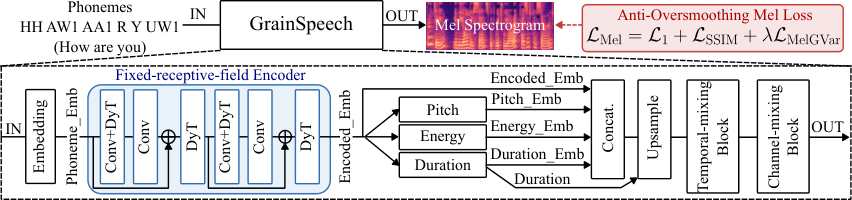
*Figure 1:GrainSpeech architecture with a fixed-receptive-field encoder, and an anti-oversmoothing Mel loss.*

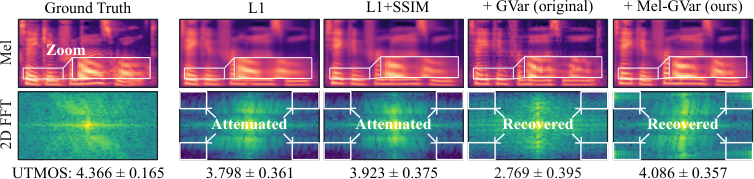
*Figure 3:Mel spectrograms and normalized 2D Fourier spectra for GrainSpeech under different Mel losses. Values are mean ± std over 128 evaluation utterances.*

---
**Usage Info**: 2813 tokens used.
**Generated at**: 2026-09-17 17:55:26

---

# 📚 CPR: COMBINING GLOBAL COMPOSING, LOCAL PERFORMING AND FULL-SEQUENCE REFINING IN PIANO RENDERING WITH CONTINUOUS AUTOREGRESSIVE MODELLING

🚀 URL: https://arxiv.org/html/2609.18216

## 🌏 Abstract (원문)
Prompt-conditioned piano MIDI-to-Music rendering aims to faithfully render target notes while reproducing the timbre of a reference recording. Existing approaches primarily follow two paradigms: autoregressive (AR) modeling and flow matching (or diffusion). Discrete-codec AR models provide causal temporal modeling, but quantization can discard acoustic detail. Flow matching better preserves acoustic structure in the cost of full-sequence attention costs and worse semantic structure. Continuous autoregressive models operate directly on continuous representations. It not only combines the condition-following ability of AR models and distribution-modeling capacity of flow matching but also bypasses the quantization bottleneck with lower computational costs. Building on this principle, we presentComposer–Performer–Refiner (CPR) framework. Composer autoregressively predicts continuous hidden states, Performer generates 24kHz acoustic latents through local flow matching and Refiner then upsamples the waveform to 48 kHz. We further introduce Bottlenecked Representation Alignment (BREPA) and Modality–Time RoPE (MT-RoPE) to strengthen musical semantic structure in Composer hidden states and temporal alignments across modalities. Codes are available at https://github.com/FEAfeatherTHER/CPR_official.
## 🌏 Abstract (번역)
프롬프트 조건부 피아노 MIDI-음악 렌더링은 참조 녹음의 음색을 재현하면서 목표 음표를 충실하게 렌더링하는 것을 목표로 합니다. 기존 접근 방식은 주로 두 가지 패러다임을 따릅니다: 자기회귀(AR) 모델링과 플로우 매칭(또는 확산). 이산 코덱 AR 모델은 인과적 시간 모델링을 제공하지만, 양자화는 음향 세부 정보를 버릴 수 있습니다. 플로우 매칭은 전체 시퀀스 어텐션 비용과 더 나쁜 의미론적 구조를 대가로 음향 구조를 더 잘 보존합니다. 연속 자기회귀 모델은 연속 표현에 직접 작동합니다. 이는 AR 모델의 조건 추종 능력과 플로우 매칭의 분포 모델링 능력을 결합할 뿐만 아니라 더 낮은 계산 비용으로 양자화 병목 현상을 우회합니다. 이 원칙을 바탕으로, 우리는 작곡가-연주자-정제자 (CPR) 프레임워크를 제시합니다. 작곡가는 연속 은닉 상태를 자기회귀적으로 예측하고, 연주자는 로컬 플로우 매칭을 통해 24kHz 음향 잠재 변수를 생성하며, 정제자는 파형을 48kHz로 업샘플링합니다. 우리는 또한 작곡가 은닉 상태의 음악적 의미 구조와 모달리티 간의 시간적 정렬을 강화하기 위해 병목 표현 정렬 (BREPA) 및 모달리티-시간 RoPE (MT-RoPE)를 도입합니다. 코드는 https://github.com/FEAfeatherTHER/CPR_official에서 확인할 수 있습니다.

## 🔍 Methods & Results
- CPR은 작곡가(Composer), 연주자(Performer), 정제자(Refiner)로 구성된 2단계 연속 자기회귀 시스템이다.
- 작곡가는 인과적 트랜스포머로, 음향 패치(5개의 20ms 멜 프레임으로 구성된 100ms 패치)의 연속 은닉 상태를 자기회귀적으로 예측한다.
- 연주자는 로컬 양방향 플로우 매칭 트랜스포머로, CLAP 임베딩, 작곡가 은닉 상태 및 문맥 내 학습을 통한 이력 정보를 조건으로 다음 음향 패치(24kHz 음향 잠재 변수)를 생성한다.
- 정제자는 Vocos 기반 아키텍처(전치 컨볼루션 레이어, ConvNeXt 백본, STFT 예측 헤드)를 사용하여 생성된 24kHz 파형을 48kHz로 업샘플링하여 고주파 고조파 구성 요소를 보상한다.
- Modality–Time RoPE (MT-RoPE)는 회전 위치 임베딩의 2축 변형으로, 모달리티 간 시간 정렬을 강화하며, MIDI(25Hz)와 오디오(10Hz)를 공통 물리적 시간 축에 독립적으로 인덱싱한다.
- Performer의 플로우 매칭은 CLAP 임베딩, 작곡가 은닉 상태, 멜 스펙트로그램을 조건으로 데이터 분포를 모델링하며, 계층적 조건 드롭아웃을 통해 음색 복제를 장려한다.
- Bottlenecked Representation Alignment (BREPA)는 훈련 중 정렬 브랜치에서 작동하며, 작곡가 은닉 상태를 병목(1024→768)을 통해 10Hz에서 25Hz로 업샘플링하고 MuQ 특징과 코사인 유사도 손실로 정렬하여 의미 구조를 강화하고 음향 세부 정보를 보존한다.

## 🖼 Figures

*Figure 1:Overview of CPR: (a) training, including the Performer architecture, and (b) autoregressive inference. Composer and Performer are jointly trained with flow matching and BREPA loss. Performer conditions each 5-frame patch on two clean historical patches, concatenating Composer hidden states and repeated prompt CLAP embeddings with mel frames along the feature dimension. The separately trained Vocos-based Refiner maps generated 24 kHz audio to 48 kHz.*

---
**Usage Info**: 4147 tokens used.
**Generated at**: 2026-09-17 17:55:40

---

# 📚 Align, Integrate, and Fire: Efficient Token-Level Alignment for Zero-Shot SpeechLLMs

🚀 URL: https://arxiv.org/html/2609.18516

## 🌏 Abstract (원문)
While Large Language Models excel in natural language processing, efficiently extending their capabilities to spoken input remains a significant challenge. Existing methods for building SpeechLLMs often rely on computationally expensive full-model fine-tuning, or employ parameter-efficient projectors that suffer from inefficient token sequence lengths and costly full-model supervision. In this paper, we introduce Aligned Continuous Integrate-and-Fire, a highly efficient framework for zero-shot speech processing. Our method dynamically compresses continuous acoustic frames into the exact discrete token length of the target text utilizing explicit Dynamic Time Warping alignments. This allows our initial training stage to establish a robust acoustic-to-semantic bridge using lightweight distance metrics, entirely bypassing the computationally expensive LLM forward pass. For subsequent fine-tuning, we propose a memory-efficient knowledge distillation objective that targets a single LLM layer, performing competitively with full-model cross-entropy training at a fraction of the computational cost. Through extensive evaluations on Automatic Speech Recognition and Speech Translation, we demonstrate that our method achieves superior performance compared to prior parameter-efficient baselines.111Our code:https://github.com/issam9/ACIF
## 🌏 Abstract (번역)
대규모 언어 모델(LLM)은 자연어 처리에서 뛰어난 성능을 보이지만, 음성 입력으로 그 기능을 효율적으로 확장하는 것은 여전히 중요한 과제입니다. 기존의 SpeechLLM 구축 방법은 계산 비용이 많이 드는 전체 모델 미세 조정에 의존하거나, 비효율적인 토큰 시퀀스 길이와 비용이 많이 드는 전체 모델 감독으로 인해 어려움을 겪는 파라미터 효율적인 프로젝터를 사용합니다. 본 논문에서는 제로샷 음성 처리를 위한 고효율 프레임워크인 Aligned Continuous Integrate-and-Fire(ACIF)를 소개합니다. 저희 방법은 명시적인 동적 시간 왜곡(DTW) 정렬을 활용하여 연속적인 음향 프레임을 대상 텍스트의 정확한 이산 토큰 길이로 동적으로 압축합니다. 이를 통해 초기 훈련 단계에서 경량 거리 측정법을 사용하여 강력한 음향-의미론적 연결을 구축할 수 있으며, 계산 비용이 많이 드는 LLM 순방향 전달 과정을 완전히 우회합니다. 이후 미세 조정을 위해, 단일 LLM 레이어를 대상으로 하는 메모리 효율적인 지식 증류(KD) 목표를 제안하며, 이는 전체 모델 교차 엔트로피 훈련과 비교하여 경쟁력 있는 성능을 훨씬 적은 계산 비용으로 달성합니다. 자동 음성 인식(ASR) 및 음성 번역(ST)에 대한 광범위한 평가를 통해, 저희 방법이 이전의 파라미터 효율적인 기준선보다 우수한 성능을 달성함을 입증합니다.

## 🔍 Methods & Results
- ACIF(Aligned Continuous Integrate-and-Fire) 프로젝터는 사전 훈련된 음성 인코더와 고정된 LLM을 연결하는 경량 아키텍처로, 1D CNN 및 6개 레이어 인코더를 통해 음향 특징을 LLM 임베딩 차원으로 매핑하고 시간적 다운샘플링 및 의미론적 정렬을 수행합니다.
- 훈련 시, 동적 시간 왜곡(DTW-Align)을 사용하여 중간 음성 프레임과 대상 텍스트 토큰 임베딩 간의 최적 정렬 경로를 계산하며, 예측된 스칼라 가중치를 활용한 가중 평균 방식으로 토큰 수준 통합을 수행하여 LLM 순방향 전달 없이 토큰 압축을 정규화합니다.
- 프로젝터는 정규화된 MSE, 평균 중심 코사인 거리, 그리고 수량 손실(quantity loss)을 포함하는 결합 목표 함수로 최적화되며, 이는 임베딩 안정성, 의미론적 신호 민감도, 그리고 정확한 시퀀스 길이 매칭을 보장합니다.
- 메모리 효율적인 미세 조정을 위해, 전체 LLM 순방향 전달이 필요한 교차 엔트로피 손실 대신, 단일 LLM 레이어를 대상으로 하는 지식 증류(KD) 목표를 제안합니다. 이는 로그잇 렌즈(logit lens) 기술을 활용하여 중간 음성 표현이 텍스트 임베딩의 예측 궤적을 반영하도록 유도하여 계산 비용을 크게 절감합니다.
- 추론 시, CIF 모듈은 가변 길이 음성 프레임 시퀀스를 이산 토큰 표현으로 동적으로 압축합니다. 예측된 스칼라 가중치로 스케일링된 프레임 임베딩을 순차적으로 통합하여 미리 정의된 발화 임계값(1)에 도달하면 의미론적 토큰을 생성하며, 잔여 음향 정보도 처리하여 정보 손실을 방지합니다.
- 자동 음성 인식(ASR) 및 음성 번역(ST)에 대한 광범위한 평가에서, ACIF 방법은 기존의 파라미터 효율적인 기준선보다 우수한 성능을 달성했습니다.

## 🖼 Figures
![Figure 1:Overview of the ACIF architecture. The proposed projector consists of two convolutional layers, a 6-layer Transformer encoder, and a two-layer feed-forward network. The projected speech frames 
𝐹
 are aligned with the target text embeddings 
𝐸
 using DTW. An additional layer predicts continuous weights 
𝛼
𝑖
 to integrate each frame 
𝑓
𝑖
 into its corresponding aligned token (Eq. 1). The resulting token-level speech embeddings 
𝑍
 are optimized using normalized MSE (
ℒ
MSE
, Eq. 2) and mean-centered cosine distance (
ℒ
cos
, Eq. 3). Simultaneously, the 
𝛼
𝑖
 values are supervised via a quantity loss (
ℒ
qua
, Eq. 4) to ensure they sum to 1 over each text token’s segment. During the fine-tuning stage, we incorporate either a standard cross-entropy loss (
ℒ
CE
) or a knowledge distillation loss (
ℒ
KD
), the latter being computed between the intermediate hidden states of the text and speech embeddings extracted at layer 
𝐿
 of the truncated LLM.](../images/2026-09-17/2609.18516/2609.18516_fig0.png)
*Figure 1:Overview of the ACIF architecture. The proposed projector consists of two convolutional layers, a 6-layer Transformer encoder, and a two-layer feed-forward network. The projected speech frames 
𝐹
 are aligned with the target text embeddings 
𝐸
 using DTW. An additional layer predicts continuous weights 
𝛼
𝑖
 to integrate each frame 
𝑓
𝑖
 into its corresponding aligned token (Eq. 1). The resulting token-level speech embeddings 
𝑍
 are optimized using normalized MSE (
ℒ
MSE
, Eq. 2) and mean-centered cosine distance (
ℒ
cos
, Eq. 3). Simultaneously, the 
𝛼
𝑖
 values are supervised via a quantity loss (
ℒ
qua
, Eq. 4) to ensure they sum to 1 over each text token’s segment. During the fine-tuning stage, we incorporate either a standard cross-entropy loss (
ℒ
CE
) or a knowledge distillation loss (
ℒ
KD
), the latter being computed between the intermediate hidden states of the text and speech embeddings extracted at layer 
𝐿
 of the truncated LLM.*

---
**Usage Info**: 5298 tokens used.
**Generated at**: 2026-09-17 17:55:55

---

# 📚 VibeAvatar: Aligning Phonetic Kinematics and Human Aesthetics for High-Fidelity Talking Avatar Synthesis

🚀 URL: https://arxiv.org/html/2609.18632

## 🌏 Abstract (원문)
Multi-modal talking avatar synthesis aims to generate realistic talking videos from a reference portrait and speech. Despite rapid progress in diffusion-based methods, existing approaches still struggle to jointly achieve accurate lip articulation, human-preferred motion aesthetics, and efficient inference. We observe that phonetic accuracy and motion aesthetics arise from fundamentally different sources and should be addressed at complementary stages rather than learned implicitly by a single generator. Based on this insight, we propose VibeAvatar, which disentangles these two objectives through a Phonetic Kinematics Adapter (PKA) that converts recognition-oriented speech features into phonetic-kinematic conditions at the conditioning stage, and an Aesthetic Motion Policy (AMP) that optimizes a flow-consistent stochastic sampling policy via Group Relative Policy Optimization (GRPO) at the post-training stage. With a lightweight flow-based motion generator operating in a compact 1D warp-based latent motion space, VibeAvatar achieves state-of-the-art results in articulation, aesthetics, and efficiency on both objective metrics and user studies, while generating a 10-second 512
px video in under 10 seconds with only

sim3
GB VRAM.
## 🌏 Abstract (번역)
다중 모달 토킹 아바타 합성은 참조 인물 사진과 음성으로부터 사실적인 토킹 비디오를 생성하는 것을 목표로 합니다. 확산 기반 방법론의 빠른 발전에도 불구하고, 기존 접근 방식들은 정확한 입술 움직임, 인간이 선호하는 움직임 미학, 그리고 효율적인 추론을 동시에 달성하는 데 여전히 어려움을 겪습니다. 우리는 음성학적 정확성과 움직임 미학이 근본적으로 다른 원천에서 발생하며, 단일 생성기에 의해 암묵적으로 학습되기보다는 상호 보완적인 단계에서 다루어져야 한다고 관찰했습니다. 이러한 통찰력을 바탕으로, 우리는 VibeAvatar를 제안합니다. VibeAvatar는 인식 지향적인 음성 특징을 컨디셔닝 단계에서 음성-운동학적 조건으로 변환하는 음성 운동학 어댑터(PKA)와, 후속 학습 단계에서 그룹 상대 정책 최적화(GRPO)를 통해 흐름 일관성 있는 확률적 샘플링 정책을 최적화하는 미학적 움직임 정책(AMP)을 통해 이 두 가지 목표를 분리합니다. 컴팩트한 1D 워프 기반 잠재 움직임 공간에서 작동하는 경량 흐름 기반 움직임 생성기를 통해, VibeAvatar는 객관적인 지표와 사용자 연구 모두에서 발음, 미학, 효율성 면에서 최첨단 결과를 달성했으며, 10초 길이의 512px 비디오를 10초 이내에 단 3GB VRAM으로 생성합니다.

## 🔍 Methods & Results
- VibeAvatar는 참조 이미지와 오디오 클립을 사용하여 정확한 입술 움직임, 인간 친화적인 움직임 미학, 효율적인 추론을 갖춘 토킹 아바타 비디오를 합성합니다.
- 프레임워크는 세 가지 주요 구성 요소로 이루어져 있습니다: 1) 컴팩트한 잠재 공간에서 효율적으로 움직임을 예측하는 흐름 기반 움직임 생성기, 2) 원시 음성 특징을 입술 움직임을 위한 음성-운동학적 조건으로 변환하는 음성 운동학 어댑터(PKA), 3) 흐름 기반 샘플링을 확률적 정책으로 재구성하고 GRPO를 통해 인간이 선호하는 동역학으로 최적화하는 미학적 움직임 정책(AMP).
- 흐름 기반 움직임 생성기는 LIA의 잠재 워프 공간에서 얼굴 동역학을 1D 움직임 표현으로 나타내어 신원을 보존하고 경량 생성을 가능하게 합니다. 또한, L개의 연속 프레임의 움직임 잠재를 공동으로 예측하여 안정적인 움직임 궤적을 제공하며, AdaLN을 통해 프레임 단위 컨디셔닝을 주입하여 정밀한 움직임 제어를 가능하게 합니다.
- PKA는 Wav2Vec과 같은 인식 지향적인 음성 특징과 얼굴 운동학 간의 불일치를 해결하기 위해, 계층적 시프트 어텐션(Hierarchical Shifted Attention)과 학습 가능한 운동학 게이트(Learnable Kinematic Gate)를 도입합니다. 계층적 시프트 어텐션은 청크 크기를 점진적으로 확대하고 시프트 윈도우를 교대로 적용하여 국소적 음소 전환에서 광범위한 음성 맥락으로 수용 영역을 확장하며, 학습 가능한 운동학 게이트는 움직임과 관련 없는 의미를 필터링하고 조음 관련 변화를 증폭시킵니다.
- AMP는 표준 흐름 매칭 샘플러의 결정론적 특성으로 인한 탐색 공간 부족 문제를 해결하기 위해 흐름 기반 샘플링을 확률적 정책으로 재구성합니다. 이는 흐름 일관성 있는 확률적 업데이트를 통해 제어된 탐색을 도입하며, 초기 단계에서 다양한 움직임 가설을 제안하고 후기 단계에서는 신원, 조음, 시간적 안정성을 보존합니다.
- 시간 단계 절단 미학적 정렬(Timestep-Truncated Aesthetic Alignment)은 AMP를 GRPO와 함께 초기 단계(t ≥ t_thresh)에만 적용하여 전역적인 움직임 속성을 탐색하고, 미세한 입술 움직임은 이전 학습 단계에서 학습된 강력한 조음 사전 지식을 보존합니다.
- VibeAvatar는 두 단계로 훈련됩니다. 1단계에서는 PKA 컨디셔닝 하에 조음 인식 흐름 사전 지식을 학습하고, 2단계에서는 PKA를 고정하고 GRPO를 통해 AMP를 인간의 미학적 선호도에 맞춰 정렬합니다. 2단계에서는 HPS-v2 및 VideoReward의 시각적 품질 및 움직임 품질 헤드로 구성된 보상 앙상블을 사용하여 후보 움직임 궤적을 평가합니다.
- 결과적으로 VibeAvatar는 조음, 미학, 효율성 측면에서 최첨단 성능을 달성했으며, 객관적 지표와 사용자 연구 모두에서 우수한 결과를 보였습니다. 10초 길이의 512px 비디오를 10초 이내에 약 3GB VRAM만 사용하여 생성할 수 있습니다.

## 🖼 Figures
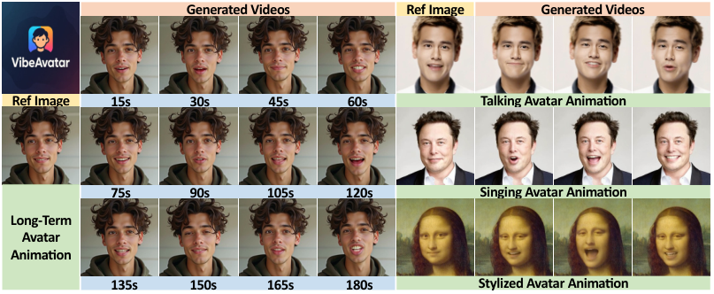
*Figure 1.VibeAvatar synthesizes high-fidelity talking avatars with accurate lip articulation, human-preferred motion aesthetics, and efficient inference. It preserves stable identity and natural facial dynamics across speech and singing scenarios.*

![Figure 3. Overview of VibeAvatar. (a) The framework integrates a lightweight flow-based motion generator, a Phonetic Kinematics Adapter (PKA), and an Aesthetic Motion Policy (AMP) to improve lip articulation, motion aesthetics, and inference efficiency. (b) PKA transforms generic speech features into phonetic-kinematic conditions through hierarchical shifted attention, enabling local bidirectional interaction, causal aggregation, and a progressively enlarged receptive field for accurate lip articulation.](../images/2026-09-17/2609.18632/2609.18632_fig2.png)
*Figure 3. Overview of VibeAvatar. (a) The framework integrates a lightweight flow-based motion generator, a Phonetic Kinematics Adapter (PKA), and an Aesthetic Motion Policy (AMP) to improve lip articulation, motion aesthetics, and inference efficiency. (b) PKA transforms generic speech features into phonetic-kinematic conditions through hierarchical shifted attention, enabling local bidirectional interaction, causal aggregation, and a progressively enlarged receptive field for accurate lip articulation.*

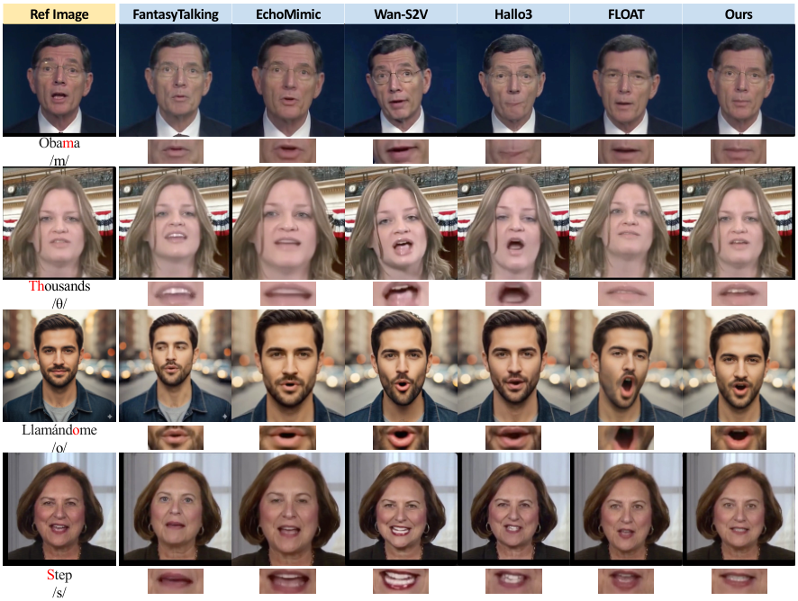
*Figure 5. Lip-articulation comparison on challenging phonemes. VibeAvatar produces more accurate lip shapes.*

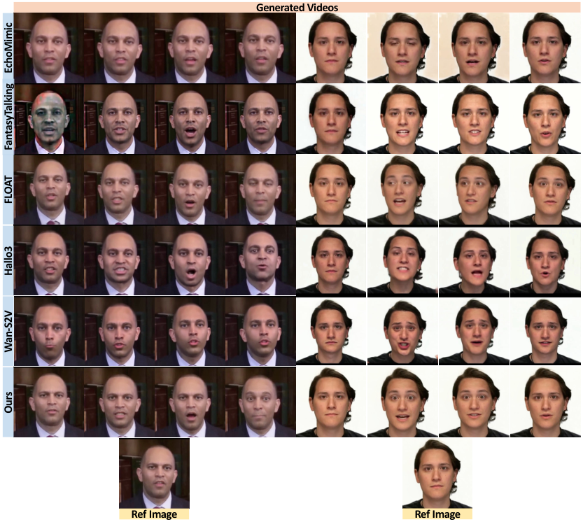
*Figure 6. Multi-frame qualitative comparisons.*

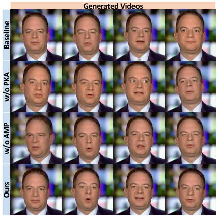
*Figure 8. Qualitative ablation on the core components.*

---
**Usage Info**: 6024 tokens used.
**Generated at**: 2026-09-17 17:56:09

---

# 📚 T-SANDHI: Tone Sandhi-aware Adaptive Network with Decoupled Hybrid Injection for Low-resource Taiwanese Hokkien Speech Recognition

🚀 URL: https://arxiv.org/html/2609.18194

## 🌏 Abstract (원문)
In Taiwanese Hokkien automatic speech recognition (ASR), prior studies often treat tone sandhi as a major challenge under the assumption that models fail to process implicit phonological variations. However, our experiments on Taiwanese Hokkien reveal that speech foundation models actually handle tone sandhi variations effectively, and the real performance bottleneck stems from a localized confusion between these variations and retained citation tones. To address this, we propose T-SANDHI to explicitly decouple surface acoustics from underlying lexical intent on top of a frozen Whisper backbone. Using a lexicon-guided multi-task learning structure driven by text-derived pseudo labels, our lightweight hybrid injection module integrates independent citation and sandhi phonetic streams via dynamic gating. Extensive evaluation on the TAT-MOE corpus and two blind test sets demonstrates that this explicit disentanglement effectively resolves tonal mapping confusion, outperforming baselines with strict parameter efficiency.
## 🌏 Abstract (번역)
대만어(Taiwanese Hokkien) 자동 음성 인식(ASR)에서 이전 연구들은 모델이 암묵적인 음운론적 변이를 처리하지 못한다는 가정하에 성조 변화(tone sandhi)를 주요 과제로 다루는 경우가 많았습니다. 그러나 대만어에 대한 우리의 실험은 음성 기반 모델이 실제로 성조 변화 변이를 효과적으로 처리하며, 실제 성능 병목 현상은 이러한 변이와 유지된 인용 성조(citation tones) 간의 국지적인 혼동에서 비롯된다는 것을 밝혀냈습니다. 이를 해결하기 위해 우리는 고정된 Whisper 백본 위에 표면 음향과 기저 어휘 의도(underlying lexical intent)를 명시적으로 분리하는 T-SANDHI를 제안합니다. 텍스트에서 파생된 의사 레이블(pseudo labels)에 의해 구동되는 어휘 기반 다중 작업 학습 구조를 사용하여, 우리의 경량 하이브리드 주입 모듈은 동적 게이팅(dynamic gating)을 통해 독립적인 인용 및 성조 변화 음성 스트림을 통합합니다. TAT-MOE 코퍼스와 두 개의 블라인드 테스트 세트에 대한 광범위한 평가는 이러한 명시적 분리가 성조 매핑 혼동을 효과적으로 해결하며, 엄격한 파라미터 효율성으로 기준선 모델들을 능가함을 보여줍니다.

## 🔍 Methods & Results
- T-SANDHI는 대만어 ASR에서 성조 변화(tone sandhi)와 인용 성조(citation tones) 간의 복잡한 매핑으로 인한 성능 병목 현상을 해결하기 위해 표면 음향과 기저 어휘 의도를 명시적으로 분리하는 방법론을 제안한다.
- 이 모델은 고정된 Whisper 인코더-디코더 백본 위에 구축되며, 파라미터 효율성을 위해 AdaLoRA를 적용한다.
- 핵심은 인코더 위에 'Decoupled Hybrid Injection module'을 도입하여 인용 음절(기저 어휘 의도)과 성조 변화(실제 표면 성조)를 모델링하는 두 개의 독립적인 보조 스트림을 명시적으로 생성하는 것이다.
- 이 스트림들은 Whisper 인코더의 음향 은닉 상태를 간단한 선형 투영을 통해 CTC 헤드로 전달하여 로짓을 얻고, 이를 음성 임베딩으로 변환한다.
- '동적 게이팅 메커니즘'을 사용하여 원본 음향 상태와 투영된 음성 임베딩을 융합하며, 게이트는 문맥에 따라 기저 의도와 표면 실현 간의 주의를 동적으로 할당한다.
- 훈련은 최종 대만어 한자 전사를 위한 표준 시퀀스-투-시퀀스 교차 엔트로피 손실과 인용 음절 및 성조 변화 추적을 위한 보조 CTC 손실을 공동으로 최적화한다.
- TAT-MOE 코퍼스와 두 개의 블라인드 테스트 세트에 대한 광범위한 평가 결과, T-SANDHI는 성조 매핑 혼동을 효과적으로 해결하고 엄격한 파라미터 효율성으로 기준선 모델들을 능가하는 성능을 보였다.

## 🖼 Figures

*Fig. 1: Illustration of the acoustic-to-label discrepancy in Taiwanese Hokkien continuous speech. Due to the tone sandhi system, the actual surface tone (sandhi tone, highlighted in orange) frequently shifts away from its dictionary pronunciation (citation tone). For example, in the phrase “Today where do you want to go”, the pronoun “lí” shifts from Tone 2 to Tone 1, whereas only the sentence-final syllable retains its original citation tone (highlighted in blue).*

*Fig. 2: Quantitative analysis of tonal distribution and phonetic variations across TAT-MOE corpus. (a) Overall distribution of syllables categorized by their citation forms (blue bars) and sandhi forms (orange bars). (b) Tone transition matrix detailing the absolute counts of syllables mapping from their citation tone to their realized tone.*

*Fig. 3: Architecture of T-SANDHI. To explicitly decouple lexical intent from surface acoustics, a decoupled hybrid injection module augments the frozen Whisper encoder. It projects features into independent citation and sandhi streams, dynamically fusing them into 
𝐇
𝑓
​
𝑢
​
𝑠
​
𝑒
​
𝑑
 via a gate generator. Lightweight linear heads provide CTC supervision during training and supply decoupled representations during inference with negligible overhead.*

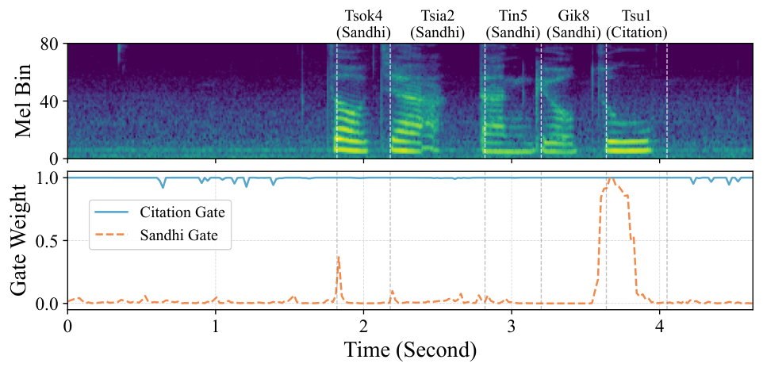
*Fig. 5: Frame-level visualization of the dynamic gate.*

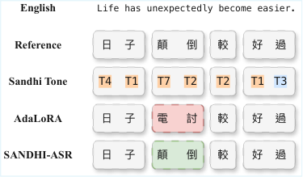
*Fig. 6: Qualitative comparison of error resolution.*

---
**Usage Info**: 4571 tokens used.
**Generated at**: 2026-09-17 17:56:24

---

# 📚 Encoder Awakening via Adapters: Effective Domain-Adaptive Fine-tuning of Speech-LLMs

🚀 URL: https://arxiv.org/html/2609.17981

## 🌏 Abstract (원문)
Speech Large Language Models (Speech-LLMs), typically built from a pre-trained speech encoder, a modality projector, and an LLM fine-tuned with Low-Rank Adapters (LoRA), have shown strong Automatic Speech Recognition (ASR) performance on general-domain speech. However, adapting them to domain-shifted speech, such as child or dialectal speech, remains challenging under limited target-domain data. Given the dominant role of the LLM in Speech-LLMs, with cross-entropy loss applied only at the LLM output, the speech encoder may receive insufficient adaptation to new acoustic conditions. In this paper, we propose Encoder Awakening via Adapters (EAVA), a simple yet effective domain-adaptive fine-tuning method for Speech-LLM-based ASR. First, lightweight adapters are inserted into each encoder layer and trained exclusively, enabling target-domain acoustic knowledge to be incorporated into the encoder while preserving its pre-trained knowledge. Second, the full model is jointly fine-tuned on the target domain with LoRA applied to the LLM. Experiments on three domain-shifted ASR datasets, covering child and dialectal speech, show that EAVA consistently outperforms vanilla fine-tuning and other baselines, achieving new state-of-the-art performance.111Code is available athttps://github.com/morganshi/EAVA
## 🌏 Abstract (번역)
사전 훈련된 음성 인코더, 양식 프로젝터, 그리고 LoRA(Low-Rank Adapters)로 미세 조정된 LLM으로 구성되는 음성 대규모 언어 모델(Speech-LLM)은 일반 도메인 음성에서 강력한 자동 음성 인식(ASR) 성능을 보여주었습니다. 그러나 아동 음성이나 방언 음성과 같이 도메인이 전환된 음성에 제한된 타겟 도메인 데이터로 이들을 적용하는 것은 여전히 어렵습니다. Speech-LLM에서 LLM의 지배적인 역할과 LLM 출력에만 교차 엔트로피 손실이 적용된다는 점을 고려할 때, 음성 인코더는 새로운 음향 조건에 대한 적응이 불충분할 수 있습니다. 본 논문에서는 Speech-LLM 기반 ASR을 위한 간단하면서도 효과적인 도메인 적응형 미세 조정 방법인 EAVA(Encoder Awakening via Adapters)를 제안합니다. 첫째, 경량 어댑터가 각 인코더 레이어에 삽입되어 독점적으로 훈련되며, 이를 통해 사전 훈련된 지식을 보존하면서 타겟 도메인 음향 지식을 인코더에 통합할 수 있습니다. 둘째, 전체 모델은 LLM에 LoRA를 적용하여 타겟 도메인에서 공동으로 미세 조정됩니다. 아동 및 방언 음성을 포함하는 세 가지 도메인 전환 ASR 데이터셋에 대한 실험 결과, EAVA는 일반적인 미세 조정 및 다른 기준선보다 일관되게 우수한 성능을 보여 새로운 최첨단 성능을 달성했습니다. 코드는 https://github.com/morganshi/EAVA 에서 확인할 수 있습니다.

## 🔍 Methods & Results
- Speech-LLM의 효과적인 도메인 적응형 미세 조정 전략의 부족을 해결하기 위해 EAVA(Encoder Awakening via Adapters)라는 2단계 방법을 제안합니다.
- 1단계(인코더 각성 단계): 사전 훈련된 Speech-LLM의 각 인코더 레이어에 무작위로 초기화된 경량 어댑터(예: Residual Adapters)를 삽입하고, 표준 LLM CE 손실을 사용하여 타겟 도메인 훈련 데이터셋에서 *오직 이 어댑터만* 훈련합니다.
- 1단계의 목적은 사전 훈련된 인코더의 지식을 보존하면서 어댑터를 통해 타겟 도메인 지식을 인코더에 효과적으로 주입하는 것입니다.
- 2단계(공동 미세 조정 단계): 인코더 각성 단계 후, 인코더 어댑터, 사전 훈련된 인코더 매개변수, 프로젝터 및 LLM LoRA 모듈을 동일한 CE 손실을 사용하여 타겟 도메인에서 공동으로 미세 조정합니다.
- 2단계의 목적은 전체 Speech-LLM을 타겟 도메인에 추가로 적응시켜 인코더, 프로젝터 및 LLM LoRA 모듈이 동일한 ASR 목표 하에 일관되게 업데이트되도록 하는 것입니다.
- 이러한 2단계 설계는 직접적인 공동 미세 조정보다 더 목표 지향적인 적응을 가능하게 합니다.
- 실험 결과, EAVA는 아동 및 방언 음성을 포함하는 세 가지 도메인 전환 ASR 데이터셋에서 일반적인 미세 조정 및 다른 기준선보다 일관되게 우수한 성능을 보여 새로운 최첨단 성능을 달성했습니다.

## 🖼 Figures
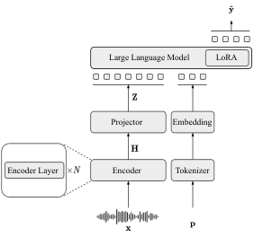
*Fig. 1:Illustration of a standard well-trained Speech-LLM for ASR. LLM autoregressively generates the transcription conditioned on embedded speech representation and the embedded prompt.*

![Fig. 2:Overview of the proposed EAVA method for domain-adaptive fine-tuning of a well-trained Speech-LLM. A Speech-LLM trained on large-scale general-domain speech is used as the parameter initialization and adapted to target-domain speech, such as child or dialectal speech. In Stage 1 (Encoder Awakening), lightweight adapters are inserted into each encoder layer and only the adapter parameters are trained, while all other components remain frozen. In Stage 2 (Continual Fine-tuning), the encoder adapters, the pre-trained encoder parameters, the projector, and the LLM LoRA modules are jointly fine-tuned.](../images/2026-09-17/2609.17981/2609.17981_fig1.png)
*Fig. 2:Overview of the proposed EAVA method for domain-adaptive fine-tuning of a well-trained Speech-LLM. A Speech-LLM trained on large-scale general-domain speech is used as the parameter initialization and adapted to target-domain speech, such as child or dialectal speech. In Stage 1 (Encoder Awakening), lightweight adapters are inserted into each encoder layer and only the adapter parameters are trained, while all other components remain frozen. In Stage 2 (Continual Fine-tuning), the encoder adapters, the pre-trained encoder parameters, the projector, and the LLM LoRA modules are jointly fine-tuned.*

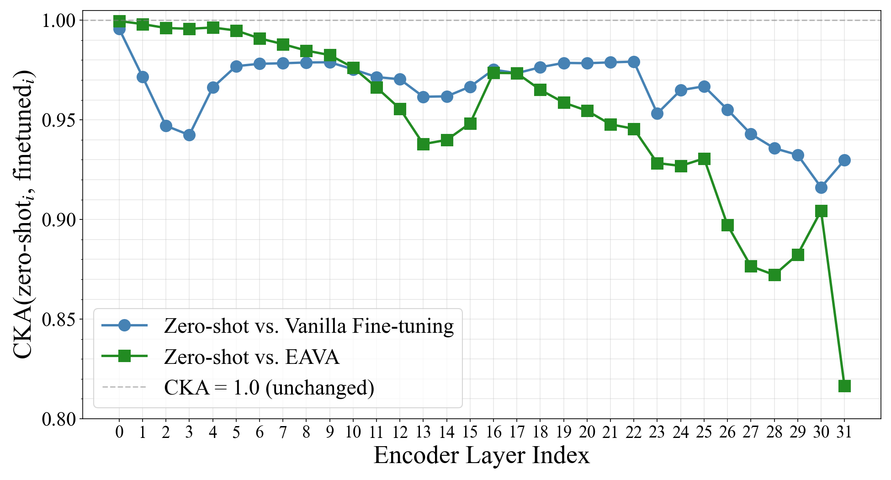
*Fig. 3:Layer-wise CKA similarity between the zero-shot and fine-tuned encoder representations on the OGI test set. Lower CKA indicates greater representational change relative to the zero-shot encoder.*

---
**Usage Info**: 2503 tokens used.
**Generated at**: 2026-09-17 17:56:32

---

# 📚 Variable-Rate Harmonic-Percussive Time-Scale Modification with Real-Time Playback in Python

🚀 URL: https://arxiv.org/html/2609.18999

## 🌏 Abstract (원문)
Time-scale modification (TSM) has a number of open-source implementations, but these are designed almost exclusively for offline use, in which a recording is processed at a fixed rate and written out ahead of time. Applications such as automatic musical accompaniment require a different setting, which we call variable-rate playback: the recording to be stretched is known in advance, but the playback rate is not, and must change continuously in response to a live performer. The few implementations that generate output in real time are written in C++ and optimized for speed rather than for ease of modification, experimentation, and integration with the primarily Python-based research ecosystem. This paper describes a Python implementation of the widely used harmonic-percussive TSM method for the variable-rate playback setting. Harmonic-percussive separation is performed offline as a preprocessing step on the known input recording, while synthesis and playback are carried out in real time with a time-scale factor that may change at every frame. We further propose a family of variants that reduce runtime by replacing the phase vocoder’s analysis-stage FFT and instantaneous frequency calculations with lookups into precomputed tables. Subjective listening tests with 24 participants (1114 pairwise ratings) show that these approximations become perceptually indistinguishable from the exact implementation once the precomputed hop size is sufficiently small, while reducing total runtime by roughly half. We characterize the resulting tradeoffs among precomputation, runtime, memory, and perceptual quality to guide algorithm selection, and we release our implementation as an open-source package.
## 🌏 Abstract (번역)
시간 스케일 수정(TSM)에는 여러 오픈 소스 구현이 있지만, 이들은 거의 전적으로 오프라인 사용을 위해 설계되어 녹음된 파일을 고정된 속도로 미리 처리하여 출력합니다. 자동 음악 반주와 같은 애플리케이션은 가변 속도 재생이라는 다른 설정을 요구합니다. 이는 늘릴 녹음 파일은 미리 알려져 있지만 재생 속도는 그렇지 않으며, 라이브 연주자에 반응하여 지속적으로 변경되어야 합니다. 실시간으로 출력을 생성하는 몇 안 되는 구현은 C++로 작성되었으며, 주로 Python 기반 연구 생태계와의 수정, 실험 및 통합 용이성보다는 속도에 최적화되어 있습니다. 본 논문은 가변 속도 재생 설정을 위한 널리 사용되는 고조파-타악기 TSM 방법의 Python 구현을 설명합니다. 고조파-타악기 분리는 알려진 입력 녹음 파일에 대한 전처리 단계로 오프라인에서 수행되며, 합성 및 재생은 매 프레임마다 변경될 수 있는 시간 스케일 계수를 사용하여 실시간으로 수행됩니다. 우리는 또한 위상 보코더의 분석 단계 FFT 및 순간 주파수 계산을 미리 계산된 테이블 조회로 대체하여 런타임을 줄이는 일련의 변형을 제안합니다. 24명의 참가자(1114쌍의 평가)를 대상으로 한 주관적인 청취 테스트 결과, 미리 계산된 홉 크기가 충분히 작으면 이러한 근사치가 정확한 구현과 지각적으로 구별할 수 없게 되면서 전체 런타임을 약 절반으로 줄이는 것으로 나타났습니다. 우리는 알고리즘 선택을 안내하기 위해 사전 계산, 런타임, 메모리 및 지각 품질 간의 결과적인 절충점을 특성화하고, 우리의 구현을 오픈 소스 패키지로 공개합니다.

## 🔍 Methods & Results
- 실시간 TSM 알고리즘인 'HPS-TSM-Realtime'은 고조파-타악기 분리(HPS)를 기반으로 하며, 오프라인 전처리 단계에서 입력 파형을 고조파(xh) 및 타악기(xp) 구성 요소로 분리한다.
- HPS-TSM-Realtime은 세 단계로 구성된다: 1) 오프라인 HPS 분리(스펙트로그램의 중간 필터링 기반), 2) 고조파 구성 요소는 위상 보코더(PV)로, 타악기 구성 요소는 중첩-덧셈(OLA) 방법으로 실시간 처리, 3) 두 TSM 절차의 출력을 혼합하여 스피커로 전송한다.
- PV 구성 요소는 동적으로 변하는 TSM 계수(αt)를 사용하여 실시간으로 적용되며, 분석 프레임 위치 결정, STFT 계수 계산, 순간 주파수 추정치를 사용한 위상 구성 요소 수정, 역 FFT를 통한 합성 프레임 계산, 그리고 중첩 합성 프레임 추가의 5단계로 이루어진다.
- OLA 구성 요소는 PV보다 작은 윈도우 크기(L=256)를 사용하며, PV 프레임당 4개의 OLA 프레임을 처리하고, 각 OLA 합성 프레임을 계산한 후 오디오 버퍼에 추가하여 출력을 재구성한다.
- 오디오 버퍼(N=2048)는 PV 및 OLA 프레임으로 업데이트되며, 버퍼의 첫 512샘플을 스피커로 플러시하고 나머지 데이터를 이동시킨다.
- 런타임 감소를 위해 'HPS-TSM-Approx'라는 근사 변형을 제안하며, 이는 PV 구성 요소(총 런타임의 93% 차지)의 FFT 및 순간 주파수 계산을 미리 계산된 테이블 조회로 대체한다.
- HPS-TSM-Approx의 오프라인 전처리 단계에서는 고조파 구성 요소(xh)의 STFT 및 순간 주파수 추정치를 고정된 홉 크기(Ha,pre)로 미리 계산하여 조회 테이블로 저장한다.
- 온라인 단계에서는 현재 분석 프레임에 대해 STFT 크기 및 순간 주파수 추정치를 미리 계산된 테이블에서 가장 가까운 이웃 또는 하한 프레임 인덱스를 통해 조회한다.
- 24명의 참가자를 대상으로 한 주관적인 청취 테스트(1114쌍의 평가) 결과, 미리 계산된 홉 크기(Ha,pre)가 충분히 작을 때 HPS-TSM-Approx가 HPS-TSM-Realtime과 지각적으로 구별할 수 없게 되며, 전체 런타임을 약 절반으로 줄이는 것으로 나타났다.
- 알고리즘 선택을 돕기 위해 사전 계산, 런타임, 메모리 및 지각 품질 간의 절충점을 특성화했으며, 구현은 오픈 소스 패키지로 공개되었다.

## 🖼 Figures
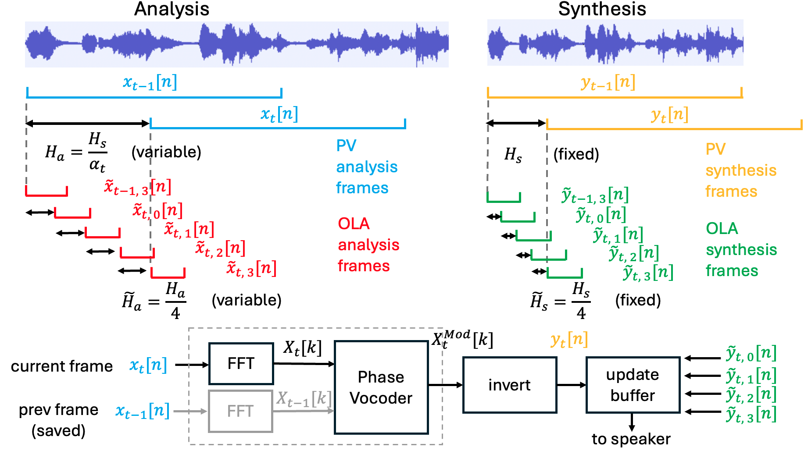
*Figure 1: Overview of real-time implementation of the widely used (offline) TSM method based on harmonic-percussive separation. We explore ways to approximate the gray dotted box with table lookups in order to reduce computation.*

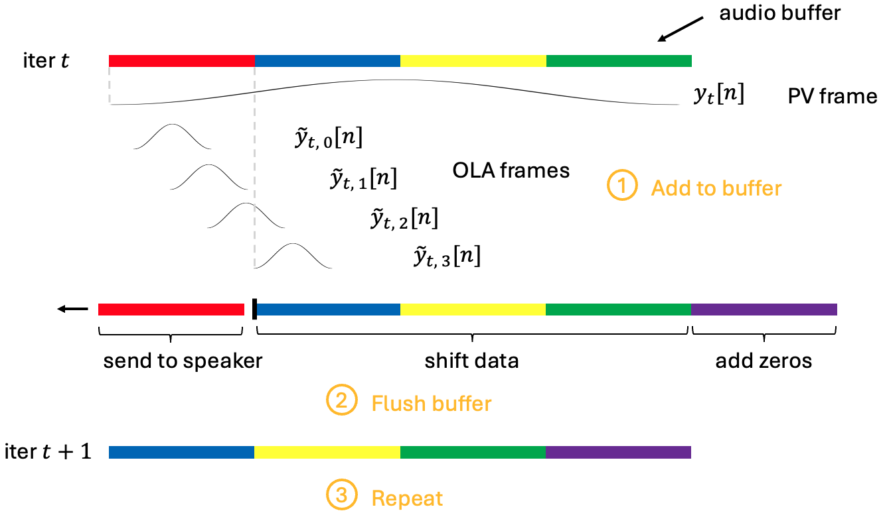
*Figure 2: Updating the audio buffer by adding in both PV and OLA synthesis frames.*

*Figure 3: Runtime of various real-time TSM algorithms. Runtimes are separated into PV and OLA components, and are reported as TSM runtime (in milliseconds) per second of generated audio. Vertical black bars show one standard deviation above and below the mean.*

---
**Usage Info**: 6208 tokens used.
**Generated at**: 2026-09-17 17:56:44

---

# 📚 TTM-Bench: A Framework for Text-to-Music System Performance Benchmarking

🚀 URL: https://arxiv.org/html/2609.18585

## 🌏 Abstract (원문)
Text-to-music (TTM) systems are increasingly used to generate musical audio from natural-language descriptions. Robust evaluation is therefore essential, yet reliable performance comparison remains challenging. This difficulty stems from differences in system architecture, supported conditioning information, and access mode, as well as heterogeneous and fragmented metrics that cannot be applied uniformly across systems. To address these challenges, we introduceTTM-Bench, a framework that defines a common protocol for systematic, reproducible performance benchmarking of contemporary TTM systems. It evaluates performance along two dimensions:musical-content alignment, quantified by interpretable semantic, genre, and musical-descriptor agreement scores against a common musical specification and summarized by an aggregate score; andcomputational efficiency, characterized by generation latency and real-time factor, alongside resource use for local models and cost for hosted services. We demonstrate the framework through a preliminary comparative case study, illustrating the complementary evidence captured by these dimensions. The results show that higher musical-content alignment does not systematically coincide with lower computational demands, highlighting the importance of assessing TTM performance through distinct, interpretable measures rather than a reductive overall indicator.
## 🌏 Abstract (번역)
텍스트-음악(TTM) 시스템은 자연어 설명을 통해 음악 오디오를 생성하는 데 점점 더 많이 사용되고 있습니다. 따라서 견고한 평가는 필수적이지만, 신뢰할 수 있는 성능 비교는 여전히 어렵습니다. 이러한 어려움은 시스템 아키텍처, 지원되는 조건화 정보, 접근 방식의 차이뿐만 아니라 시스템 전반에 걸쳐 균일하게 적용될 수 없는 이질적이고 파편화된 측정 지표에서 비롯됩니다. 이러한 문제들을 해결하기 위해 우리는 현대 TTM 시스템의 체계적이고 재현 가능한 성능 벤치마킹을 위한 공통 프로토콜을 정의하는 프레임워크인 TTM-Bench를 소개합니다. 이 프레임워크는 두 가지 차원에서 성능을 평가합니다: 공통 음악 사양에 대한 해석 가능한 의미론적, 장르, 음악적 서술자 일치 점수를 통해 정량화되고 집계 점수로 요약되는 음악 콘텐츠 정렬; 그리고 로컬 모델의 생성 지연 시간 및 실시간 계수, 리소스 사용량, 호스팅 서비스의 비용으로 특징지어지는 계산 효율성입니다. 우리는 이러한 차원들이 포착하는 상호 보완적인 증거를 보여주기 위해 예비 비교 사례 연구를 통해 이 프레임워크를 시연합니다. 결과는 더 높은 음악 콘텐츠 정렬이 더 낮은 계산 요구 사항과 체계적으로 일치하지 않는다는 것을 보여주며, 환원적인 전체 지표보다는 개별적이고 해석 가능한 측정치를 통해 TTM 성능을 평가하는 것의 중요성을 강조합니다.

## 🔍 Methods & Results
- TTM-Bench는 TTM 시스템의 성능 벤치마킹을 위한 두 가지 주요 워크플로우(음악 콘텐츠 정렬 및 계산 효율성)로 구성됩니다.
- 음악 콘텐츠 정렬(Musical-Content Alignment) 워크플로우는 생성된 트랙이 참조 음악 사양과 얼마나 잘 일치하는지 평가하며, 의미론적 정렬(SA), 장르 정렬(GA), 서술자 정렬(DA)의 세 가지 차원으로 구성됩니다.
- SA는 조건화 텍스트와 생성된 오디오 간의 LAION-CLAP 코사인 유사도를 측정하고, GA는 장르 세트 중복도(Discogs 분류기)와 분류기 점수 유사도(Discogs 및 MTG-Jamendo 분류기)를 결합하여 측정하며, DA는 음색 범주, BPM, 템포 레이블 유사도를 결합하여 측정합니다.
- 음악 콘텐츠 정렬 점수(MCAS)는 SA, GA, DA의 선형 조합으로 계산되며, TTM 시스템의 전반적인 성능 지표가 아닌 개별 구성 요소의 보완적인 증거를 제공합니다.
- 계산 효율성(Computational Efficiency) 워크플로우는 생성 시간, 리소스 사용량, 비용을 측정하며, 지연 시간(Latency)과 실시간 계수(Real-time Factor, RTF)를 주요 지표로 사용합니다.
- 로컬 실행 시 지연 시간, RTF, 메모리 사용량, GPU 활용률, GPU 에너지 소비량을 측정하고, 호스팅 서비스의 경우 클라이언트 관찰 지연 시간, RTF, API 비용을 제공합니다.
- 예비 사례 연구에서는 13개의 TTM 시스템(9개 오픈소스, 4개 상용 API)을 평가하기 위해 100개의 상업적으로 출시된 참조 트랙을 사용했습니다.
- Llama 3.1 8B를 사용하여 각 참조-시스템 쌍에 대해 10개의 프롬프트 변형을 생성하고, LAION-CLAP 유사도가 가장 높은 5개를 선택하여 총 26,000개의 30초 트랙을 생성했습니다.
- 각 생성된 트랙에 대해 SA, GA, DA, MCAS를 계산하고 시스템 수준 점수를 얻기 위해 평균을 냈으며, 참조 세트 구성에 대한 견고성은 부트스트랩 재샘플링을 통해 평가했습니다.
- 주요 결과는 더 높은 음악 콘텐츠 정렬이 더 낮은 계산 요구 사항과 체계적으로 일치하지 않는다는 것을 보여주며, TTM 성능 평가에 있어 환원적인 전체 지표보다는 개별적이고 해석 가능한 측정치의 중요성을 강조합니다.

## 🖼 Figures
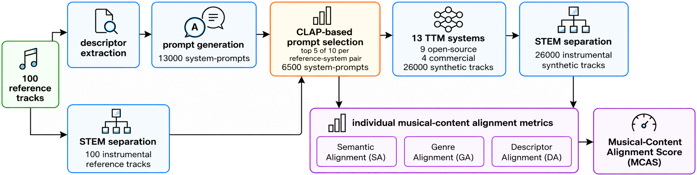
*Figure 1:Musical-content alignment benchmarking workflow.*

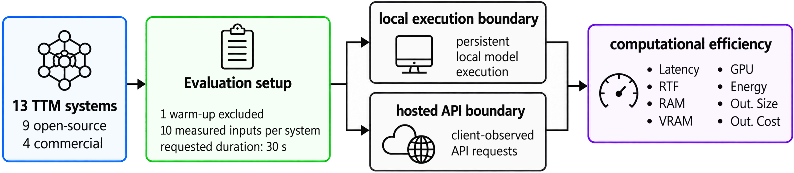
*Figure 2:Computational efficiency benchmarking workflow.*

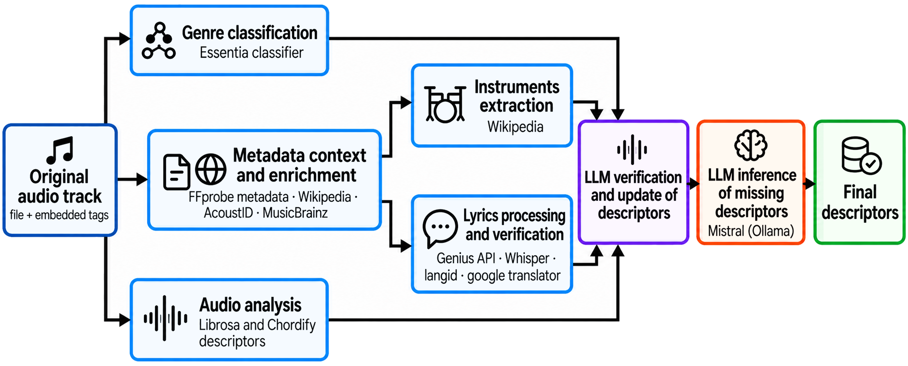
*Figure 3:Descriptor-extraction pipeline.*

---
**Usage Info**: 5041 tokens used.
**Generated at**: 2026-09-17 17:57:00

---

# 📚 Beyond Random Couplings: Contrastive Noise Alignment in Generative Flows

🚀 URL: https://arxiv.org/html/2609.18488

## 🌏 Abstract (원문)
Diffusion and flow-matching models are typically trained by corrupting data through independently sampled Gaussian noise. While simple and scalable, this forward process induces arbitrary data-noise couplings, forcing the network to learn high-curvature transports between unrelated endpoints. Existing optimal-transport methods reduce this burden by reassigning fixed noise samples to data, but the source noise distribution itself remains passive. To address this, we introduce Contrastive Noise Alignment (CNA), a training-time method that creates dynamic, contrastive couplings by optimizing the noise representations directly. By modeling the noise batch as an interacting particle system, CNA employs a cross-modal InfoNCE objective to align noise particles with their paired data targets. To prevent spatial collapse, this alignment is regularized using an angular entropy term and a radial norm penalty. We show theoretically that this equilibrium asymptotically preserves Gaussian structures, maintaining tractability during inference. Empirically, CNA improves the alignment between noise and data, reduces flow curvature, and provides better generation quality with fewer required sampling steps. For few-step, pixel-space generation (2-4 NFEs), CNA reduces FID by over 50% compared to standard rectified flow, and by at least 24% against Optimal Transport baselines.
## 🌏 Abstract (번역)
확산 및 플로우 매칭 모델은 일반적으로 독립적으로 샘플링된 가우시안 노이즈를 통해 데이터를 손상시켜 훈련됩니다. 이는 간단하고 확장 가능하지만, 이 순방향 프로세스는 임의의 데이터-노이즈 결합을 유도하여 네트워크가 관련 없는 종점 간에 높은 곡률의 전송을 학습하도록 강제합니다. 기존의 최적 수송(optimal-transport) 방법은 고정된 노이즈 샘플을 데이터에 재할당하여 이러한 부담을 줄이지만, 소스 노이즈 분포 자체는 수동적으로 유지됩니다. 이를 해결하기 위해 우리는 노이즈 표현을 직접 최적화하여 동적이고 대조적인 결합을 생성하는 훈련 시간 방법인 Contrastive Noise Alignment (CNA)를 소개합니다. CNA는 노이즈 배치를 상호 작용하는 입자 시스템으로 모델링하여, 교차 모달 InfoNCE 목표를 사용하여 노이즈 입자를 해당 데이터 타겟과 정렬합니다. 공간적 붕괴를 방지하기 위해 이 정렬은 각도 엔트로피 항과 방사형 노름 페널티를 사용하여 정규화됩니다. 우리는 이 평형이 점근적으로 가우시안 구조를 보존하여 추론 중 처리 가능성을 유지함을 이론적으로 보여줍니다. 경험적으로 CNA는 노이즈와 데이터 간의 정렬을 개선하고, 플로우 곡률을 줄이며, 더 적은 샘플링 단계로 더 나은 생성 품질을 제공합니다. 적은 단계의 픽셀 공간 생성(2-4 NFEs)의 경우, CNA는 표준 정류 플로우(rectified flow)에 비해 FID를 50% 이상, 최적 수송(Optimal Transport) 기준선에 비해 최소 24% 감소시킵니다.

## 🔍 Methods & Results
- CNA는 표준 확산 및 플로우 매칭 모델의 고곡률 전송 문제를 해결하기 위해, 고정된 가우시안 사전(prior) 대신 적응형 소스 분포(μ~0)를 허용하는 '완화된 사전 결합(relaxed prior couplings)' 개념을 도입합니다.
- 제안된 방법은 의미론적 정렬과 사전 처리 가능성 간의 균형을 맞추기 위해 발산-정규화된 수송 목표를 공식화합니다.
- CNA는 노이즈 배치를 상호 작용하는 입자 시스템으로 모델링하여, 노이즈 배치의 기하학적 구조를 타겟 데이터의 의미론적 토폴로지에 맞게 능동적으로 최적화합니다.
- CNA의 목표 함수는 세 가지 기하학적 힘의 균형으로 구성됩니다: 할당된 타겟으로 노이즈를 당기는 교차 모달 정렬 힘(InfoNCE 손실), 방향 다양성을 최대화하는 각도 엔트로피 힘(노이즈-노이즈 반발 손실), 그리고 벡터를 원점에 고정시키는 방사형 중력 힘(L2 노름 페널티).
- 이론적으로, CNA는 Maxwell-Poincaré 구형 중심 극한 정리와 InfoNCE 목표의 인구 통계적 특성에 기반하여, 고차원에서 노이즈 입자가 표준 정규 분포로 수렴하도록 유도함을 보여줍니다.
- 실험 결과, CNA는 노이즈와 데이터 간의 정렬을 개선하고, 플로우 곡률을 줄이며, 더 적은 샘플링 단계(2-4 NFEs)로 더 나은 생성 품질을 제공합니다.
- 특히, 픽셀 공간 생성에서 CNA는 표준 정류 플로우 대비 FID를 50% 이상, 최적 수송(Optimal Transport) 기준선 대비 최소 24% 감소시키는 성능 향상을 달성했습니다.

## 🖼 Figures

*(a)CIFAR-10*

*(a)CIFAR-10*

*(b)ImageNet32*

*Figure 7:Visual comparison of original CIFAR-10 data (top), standard initial Gaussian noise (middle), and the corresponding optimized noise (bottom). The cosine similarity 
𝑟
 between the original image and the noise is reported below each sample.*

*(a)CIFAR-10*

*(a)CIFAR-10*

*(b)ImageNet32*

*Figure 9:Uncurated 32
×
32 samples on CIFAR-10 (
𝛽
=
5
).*

*Figure 10:Uncurated 32
×
32 samples on ImageNet32 (
𝛽
=
30
)*

---
**Usage Info**: 4904 tokens used.
**Generated at**: 2026-09-17 17:57:12

---

# 📚 Multi-Teacher Distillation for Cross-Domain Streaming Electrolaryngeal Speech Encoding

🚀 URL: https://arxiv.org/html/2609.18686

## 🌏 Abstract (원문)
Self-supervised learning (SSL) has improved speech representations, yet performance degrades in pathological domains such as electrolaryngeal (EL) speech, and the computational footprint of SSL models limits their applicability in real-time, on-device deployment. We propose a multi-teacher knowledge distillation framework to train a lightweight, streaming content encoder that generalizes across healthy (HE) and EL speech. Two teachers are distilled progressively: a frozen SSL model providing discrete phonetic cluster targets from HE speech, and an EL-fine-tuned speech recognition model supplying continuous bottleneck feature targets. Evaluated via downstream speech recognition, our approach reduces the EL word error rate to 21.2%, compared to 39.3% for the strongest zero-shot SSL baseline. Among causal convolutional, Transformer, Conformer, and Mamba-based student architectures, a Mel-Conformer achieves the best combination of EL accuracy and computational efficiency. The final encoder contains 21.9
M parameters and runs at a real-time factor of 0.30 under ONNX Runtime on a single CPU core.
## 🌏 Abstract (번역)
자기 지도 학습(SSL)은 음성 표현을 개선했지만, 인공후두(EL) 음성과 같은 병리학적 도메인에서는 성능이 저하되며, SSL 모델의 계산 부담은 실시간 온디바이스 배포에 적용하는 데 한계를 가집니다. 본 연구에서는 건강한(HE) 음성과 EL 음성 전반에 걸쳐 일반화되는 경량 스트리밍 콘텐츠 인코더를 훈련하기 위한 다중 교사 지식 증류 프레임워크를 제안합니다. 두 명의 교사가 점진적으로 증류됩니다: HE 음성에서 이산 음성 클러스터 대상을 제공하는 고정된 SSL 모델과 연속 병목 특징 대상을 제공하는 EL 미세 조정 음성 인식 모델입니다. 다운스트림 음성 인식을 통해 평가한 결과, 우리의 접근 방식은 가장 강력한 제로샷 SSL 기준선인 39.3%에 비해 EL 단어 오류율을 21.2%로 줄였습니다. 인과 컨볼루션, 트랜스포머, 컨포머 및 맘바 기반 학생 아키텍처 중에서 멜-컨포머가 EL 정확도와 계산 효율성의 최상의 조합을 달성했습니다. 최종 인코더는 21.9M개의 매개변수를 포함하며 단일 CPU 코어에서 ONNX 런타임으로 0.30의 실시간 계수(RTF)로 실행됩니다.

## 🔍 Methods & Results
- 건강한(HE) 음성과 인공후두(EL) 음성 간의 도메인 격차를 해소하기 위해, 3단계 점진적 훈련 접근 방식을 통해 경량 스트리밍 학생 인코더를 최적화하는 다중 교사 지식 증류 패러다임을 제안합니다.
- 1단계(건강한 음성 교사): 고정된 사전 훈련된 SSL 모델(mHuBERT-147 레이어 10)을 HE 교사로 사용하여 HE 음성에서 이산 음성 클러스터 대상(k-means, K=100)을 제공하고, 학생은 교차 엔트로피 손실(L_CE)을 통해 HE 데이터셋으로만 훈련됩니다.
- 2단계(병리학적 음성 교사): 1단계 수렴 후, EL 미세 조정 음성 인식 모델(mHuBERT-147-BNF-CTC)을 EL 교사로 도입하여 100차원 연속 병목 특징(BNF) 대상을 제공하고, 학생은 L1-cos 손실을 통해 HE 및 EL 오디오의 혼합 배치로 훈련됩니다.
- 3단계(교차 도메인 정렬): 학생이 두 도메인에 대해 음성학적으로 구조화된 표현을 생성할 수 있게 된 후, 병렬 EL-HE 쌍에서 Whisper-large-v3 인코더 표현을 사용하여 동적 시간 워핑(DTW) 경로를 계산하고 L1(DTW) 손실을 적용하여 음향적으로 다르지만 음성학적으로 동일한 프레임을 더 가깝게 정렬합니다. 이 단계에서는 EL 브랜치를 통해서만 그래디언트가 흐릅니다.
- 훈련 중에는 무작위 이득, 배경 소음 추가, 피치 시프트, 색상 노이즈와 같은 확률적 온라인 데이터 증강이 모든 오디오 샘플에 적용됩니다.
- 전체 훈련은 최대 약 100만 스텝까지 단일 점진적 실행으로 진행되며, 각 단계 전환은 검증 손실 수렴에 따라 트리거됩니다. 총 손실은 L_CE, L1-cos, L1(DTW)의 가중 합으로 구성됩니다.
- 학생 아키텍처로는 완전 컨볼루션 기반(AudioDec, SoundStream), 하이브리드 시퀀스 모델(CNN-Transformer, CNN-Conformer, CNN-Mamba), 그리고 결정론적 멜-스펙트로그램 프론트엔드를 사용하는 멜-컨포머가 평가되었습니다.
- 제안된 접근 방식은 EL 단어 오류율(WER)을 가장 강력한 제로샷 SSL 기준선인 39.3%에서 21.2%로 크게 감소시켰습니다.
- 멜-컨포머 아키텍처가 EL 정확도와 계산 효율성 면에서 최상의 조합을 달성했으며, 최종 인코더는 21.9M개의 매개변수를 가지며 단일 CPU 코어에서 ONNX 런타임으로 0.30의 실시간 계수(RTF)로 실행됩니다.

## 🖼 Figures

*Fig. 1:Multi-teacher distillation training paradigm. 
ℒ
CE
: Cross-entropy on HE discrete targets; 
ℒ
L1
–
cos
: EL bottleneck regression; 
ℒ
L1
​
(
DTW
)
: DTW-guided EL–HE alignment.*

*Fig. 2:Generalized architecture of the student encoders. (a) Hybrid variants (CNN-Transformer, CNN-Conformer, CNN-Mamba). (b) The Mel-Conformer (Deterministic). Specific configurations for the shared frontend and the interchangeable sequence core are detailed in Table II.*

*Fig. 4:UMAP projections of the CNN-Transformer student encoder output (64-dim). Color: Speaker pair; marker: Modality (
∙
 EL, 
▲
 HE); lines connect matched EL–HE centroids. (a) Phase 1, (b) Phase 2, (c) Phase 3. Each panel is fitted independently.*

---
**Usage Info**: 5154 tokens used.
**Generated at**: 2026-09-17 17:57:23

---

# 📚 Correlation-Guided Encoder Selection for Multi-Encoder Large Audio-Language Models

🚀 URL: https://arxiv.org/html/2609.18041

## 🌏 Abstract (원문)
Multi-encoder fusion extends Large Audio-Language Models (LALMs) beyond speech-centric recognition, but selecting encoders via intuition or exhaustive search often introduces redundant representations and inflates an already constrained compute budget. We propose CUES (Correlation-gUided Encoder Selection), a lightweight heuristic that estimates complementarity through task- and category-level Pearson correlations between encoders’ performance profiles, scoring a candidate set from single-encoder evaluations alone—without fusion training during selection. Evaluated on the XARES-LLM benchmark with a frozen SmolLM2-135M backbone (LoRA-adapted) via five-fold cross-validation, CUES consistently identifies the same configuration per track from held-out development splits alone, without using test data for selection. For the broad Track A suite, CUES selects a cross-family trio (Whisper-medium, mHuBERT-147, and Dasheng-base), achieving a 4.3% relative gain over Whisper-medium (0.771 vs. 0.739). For Track B text generation, it re-anchors on a focused, speech-only pair (mHuBERT-147 and WavLM-base-plus) and actively abstains from adding a divergent encoder, outperforming mHuBERT-147 by 6.3% (0.589 vs. 0.554). Rather than a failure to scale, this divergence is consistent with a diversity–interference trade-off that CUES navigates per track from correlation signals alone: across the evaluated pool, added cross-family diversity tends toward an inverted-U on broad audio tasks but toward steady degradation on text generation, which favors a focused, speech-anchored set.
## 🌏 Abstract (번역)
다중 인코더 융합은 대규모 오디오-언어 모델(LALMs)을 음성 중심 인식 이상으로 확장하지만, 직관이나 철저한 탐색을 통해 인코더를 선택하는 것은 종종 중복된 표현을 도입하고 이미 제한된 컴퓨팅 예산을 증가시킨다. 우리는 CUES(Correlation-gUided Encoder Selection)를 제안한다. 이는 인코더의 성능 프로필 간의 작업 및 범주 수준 피어슨 상관관계를 통해 상보성을 추정하는 경량 휴리스틱으로, 선택 과정에서 융합 훈련 없이 단일 인코더 평가만으로 후보 세트의 점수를 매긴다. 고정된 SmolLM2-135M 백본(LoRA 적용)을 사용한 XARES-LLM 벤치마크에서 5겹 교차 검증을 통해 평가한 결과, CUES는 테스트 데이터를 선택에 사용하지 않고도 보류된 개발 분할만으로 트랙별로 동일한 구성을 일관되게 식별한다. 광범위한 Track A 스위트의 경우, CUES는 교차 계열 트리오(Whisper-medium, mHuBERT-147, Dasheng-base)를 선택하여 Whisper-medium 대비 4.3%의 상대적 성능 향상(0.771 대 0.739)을 달성했다. Track B 텍스트 생성의 경우, CUES는 집중된 음성 전용 쌍(mHuBERT-147 및 WavLM-base-plus)에 다시 고정하고 발산 인코더 추가를 적극적으로 자제하여 mHuBERT-147보다 6.3% 더 나은 성능(0.589 대 0.554)을 보였다. 이는 스케일링 실패라기보다는 CUES가 상관 신호만으로 트랙별로 탐색하는 다양성-간섭 트레이드오프와 일치한다. 평가된 풀에서 추가된 교차 계열 다양성은 광범위한 오디오 작업에서는 역U자형 경향을 보이지만, 텍스트 생성에서는 꾸준한 성능 저하 경향을 보여 집중된 음성 기반 세트를 선호한다.

## 🔍 Methods & Results
- CUES(Correlation-gUided Encoder Selection)는 단일 GPU 메모리 예산 내에서 고정된 경량 LLM을 위한 보완적인 인코더 세트를 선택하는 경량 휴리스틱이다.
- 시스템은 고정된 백엔드(LoRA 적용된 고정 SmolLM2-135M 백본)와 구성 가능한 오디오 프론트엔드로 구성된다.
- 프론트엔드는 두세 개의 병렬, 고정 인코더를 사용하며, CUES에 의해 트랙별로 역할이 할당된다: 앵커(최고 성능의 독립형 인코더), 보완(앵커의 클러스터 내에서 가장 중복이 적은 강력한 모델), 발산(조건부 포함, 비상관적이지만 작업 관련 변형 도입).
- CUES는 인코더의 성능 프로필 간의 작업 및 범주 수준 피어슨 상관관계(ρc, ρt)를 통해 상보성을 추정하여 인코더 세트를 선택한다.
- 범주 수준 상관관계(ρc)는 광범위한 능력 중복 및 클러스터 멤버십을 결정하는 게이트 역할을 하며, 작업 수준 상관관계(ρt)는 클러스터 내에서 미세한 성능 차이를 해결하여 중복성을 순위화한다.
- CUES는 XARES-LLM 벤치마크에서 5겹 교차 검증을 통해 평가되었으며, 테스트 데이터를 선택에 사용하지 않고도 개발 분할만으로 트랙별로 동일한 구성을 일관되게 식별했다.
- Track A(광범위한 스위트)의 경우, CUES는 Whisper-medium, mHuBERT-147, Dasheng-base 트리오를 선택하여 Whisper-medium 대비 4.3%의 상대적 성능 향상(0.771 대 0.739)을 달성했다.
- Track B(텍스트 생성)의 경우, CUES는 mHuBERT-147 및 WavLM-base-plus 쌍을 선택하고 발산 인코더 추가를 자제하여 mHuBERT-147보다 6.3% 더 나은 성능(0.589 대 0.554)을 보였다.
- CUES는 상관 신호만으로 트랙별 다양성-간섭 트레이드오프를 관리하며, 광범위한 오디오 작업에서는 교차 계열 다양성이 역U자형 경향을 보이지만 텍스트 생성에서는 꾸준한 성능 저하 경향을 보여 집중된 음성 기반 세트를 선호한다.
- 특징 융합을 위해, 표준화된 어댑터는 각 인코더의 특징 스트림을 앵커의 속도에 맞춰 선형 보간법으로 리샘플링한 후 임베딩 차원을 따라 연결하고 MLP 어댑터를 통해 투영한다.

## 🖼 Figures

*Fig. 1:Overview of the multi-encoder LALM framework, built on the standardized XARES-LLM architecture. Features from the selected encoders—an anchor, a complement, and an optional divergent—are fused through a learnable adapter and passed to a fixed SmolLM2-135M backbone with LoRA fine-tuning.*

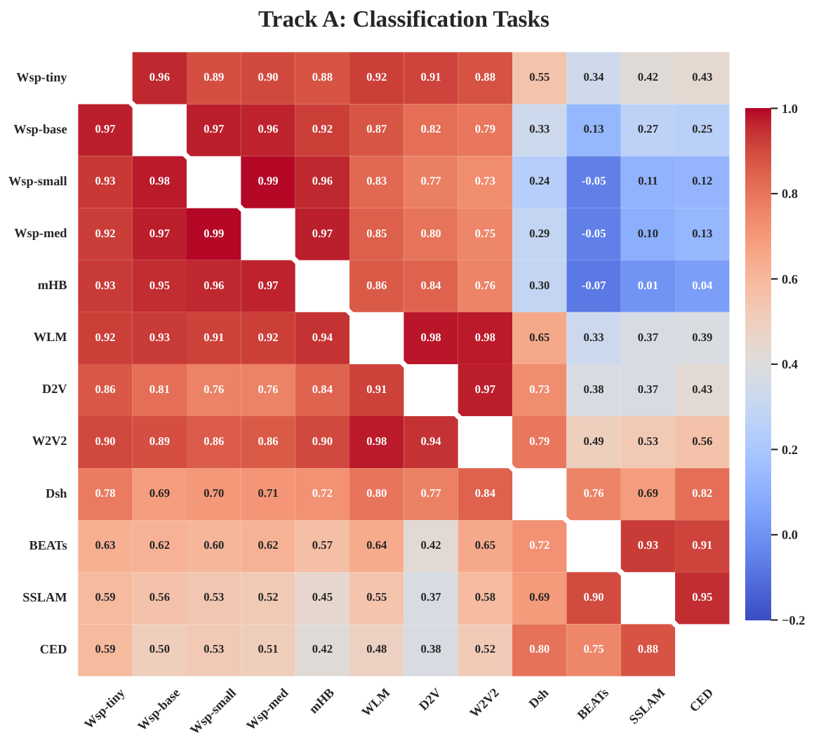
*Fig. 4:Pearson correlation coefficients among encoder performance profiles for Track A (left) and Track B (right). In both matrices, the lower triangle reports task-level correlations and the upper triangle reports category-level correlations.*

---
**Usage Info**: 5569 tokens used.
**Generated at**: 2026-09-17 17:57:39

---

