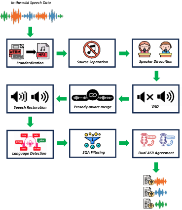
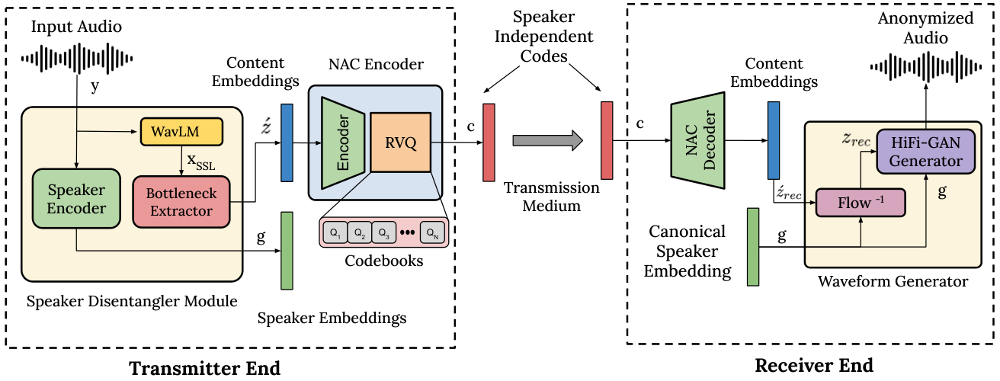
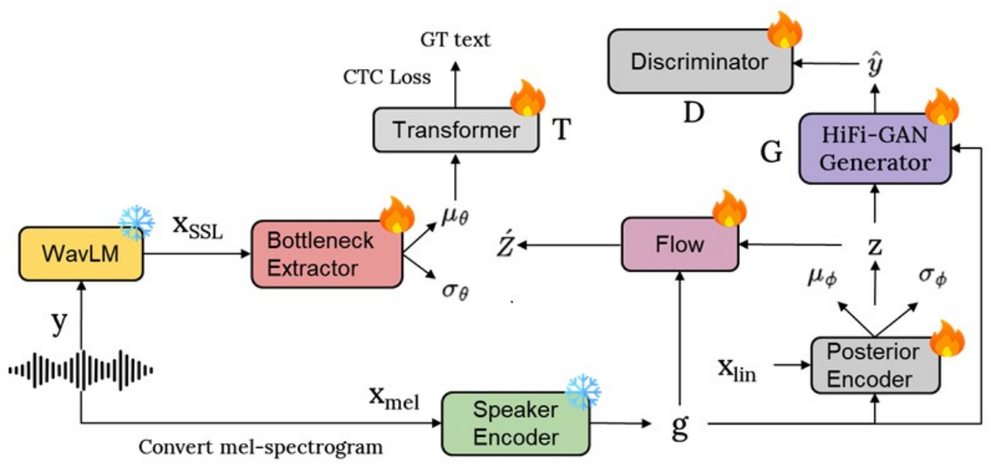

# 🚩 (2026-09-19) Scholar Inbox 추천 논문 

# 📚 PersianVox: A Prosody-Aware Approach for Speech Dataset Generation from In-the-Wild Data

🚀 URL: https://arxiv.org/html/2609.19324

## 🌏 Abstract (원문)
Advancement of zero-shot text-to-speech synthesis is currently hindered for low-resource languages by the scarcity of large-scale, high-fidelity speech datasets. Traditional alignment-based methods require rare verbatim transcripts, while standard in-the-wild pipelines often rely on single-model automatic speech recognition and silence-based segmentation, leading to transcription errors and truncated prosody. To address these challenges for the Persian language, this paper introduces PersianVox, a fully automated pipeline designed to generate high-quality speech corpora from unlabeled web data. Our approach integrates a novel prosody-aware segmentation strategy that utilizes acoustic turn-detection to preserve linguistic completeness and optimize utterance duration for long-context modeling. Furthermore, we employ a dual-model agreement mechanism, leveraging two distinct model architectures to filter unreliable transcriptions without ground truth. This pipeline yields a 2,400-hour multi-speaker dataset, the largest open-source speech resource available for Persian to date. Additionally, we provide the first comparative benchmark of speech quality assessment methods for Persian, releasing a human-annotated subset to facilitate future research.
## 🌏 Abstract (번역)
저자원 언어의 제로샷 음성 합성(text-to-speech synthesis) 발전은 현재 대규모 고음질 음성 데이터셋의 부족으로 인해 저해되고 있습니다. 전통적인 정렬 기반 방법은 희귀한 축어적 전사를 필요로 하며, 표준적인 'in-the-wild' 파이프라인은 종종 단일 모델 자동 음성 인식과 침묵 기반 분할에 의존하여 전사 오류와 잘린 운율을 초래합니다. 페르시아어에 대한 이러한 문제를 해결하기 위해, 본 논문은 레이블이 없는 웹 데이터로부터 고품질 음성 코퍼스를 생성하도록 설계된 완전 자동화된 파이프라인인 PersianVox를 소개합니다. 우리의 접근 방식은 언어적 완전성을 보존하고 긴 문맥 모델링을 위한 발화 길이를 최적화하기 위해 음향 턴 감지를 활용하는 새로운 운율 인식 분할 전략을 통합합니다. 또한, 우리는 지상 진실(ground truth) 없이 신뢰할 수 없는 전사를 필터링하기 위해 두 가지 고유한 모델 아키텍처를 활용하는 이중 모델 합의 메커니즘을 사용합니다. 이 파이프라인은 현재까지 페르시아어에 사용할 수 있는 가장 큰 오픈 소스 음성 자원인 2,400시간 분량의 다중 화자 데이터셋을 생성합니다. 또한, 우리는 페르시아어에 대한 음성 품질 평가 방법의 첫 번째 비교 벤치마크를 제공하며, 향후 연구를 용이하게 하기 위해 인간이 주석을 단 하위 집합을 공개합니다.

## 🔍 Methods & Results
- PersianVox는 레이블이 없는 웹 오디오를 고품질 데이터셋으로 변환하는 다단계 파이프라인으로, 초기 단계 오류 전파를 완화하기 위해 입력 표준화, 신뢰도 기반 필터링, 경계 확인, 이중 ASR 합의 등의 방법을 사용합니다.
- 전처리 단계에서는 오디오를 모노, 16비트 PCM WAV, 24kHz로 표준화하고, -20dBFS로 정규화하며, UVR-MDX-Net Inst 33 모델을 사용하여 배경 음악을 제거합니다.
- 초기 언어 필터링은 Whisper Large v3를 사용하여 10개의 무작위 음성 세그먼트에서 평균 페르시아어 확률이 90%를 초과하는 녹음만 유지하여 페르시아어 중심의 기본 데이터셋을 구축합니다.
- 발화 분할은 PyAnnote를 사용한 화자 분할과 Pyannote Segmentation 3.0 및 Smart Turn v3.1을 활용한 운율 인식 분할로 구성됩니다. 이는 언어적 완전성을 보존하고 발화 길이를 최적화(평균 12초, 표준편차 4초, 최대 30초)하여 긴 문맥 모델링에 적합하게 만듭니다.
- 음성 복원 단계에서는 SIDON 모델을 사용하여 저하된 음성을 스튜디오 품질 오디오로 변환하여 잔여 아티팩트를 제거합니다.
- 발화 필터링은 Whisper Large v3를 통한 언어 식별(확률 > 0.95)과 SCOREQ를 통한 음향 품질 필터링을 포함하여 고품질 페르시아어 발화만 포함되도록 합니다.
- 이중 ASR 합의 메커니즘은 114M 파라미터 FastConformer Hybrid (CTC)와 600M 파라미터 Parakeet RNN-T 두 가지 독점 모델을 사용하여 전사 오류 패턴의 상보성을 활용합니다.
- 이중 ASR 합의는 CER < 12.5% 및 WER < 15%의 엄격한 일관성 임계값을 만족하는 발화만 유지하고, 경계 정밀도를 위해 'edge CER'이 높은 세그먼트는 폐기하며, Parakeet 모델의 전사를 최종 레이블로 선택합니다.
- PersianVox 데이터셋은 2,400시간 분량의 다중 화자 데이터셋으로, 페르시아어에 대한 가장 큰 오픈 소스 음성 자원입니다.
- PersianVox 검증을 위해 LinaSpeech를 Vevo의 flow-matching acoustic decoder로 개조하여 TTS 모델을 훈련했습니다. 이 모델은 WER, CER, 화자 임베딩 코사인 유사도(SECS), 객관적 MOS (SCOREQ 사용) 평가에서 강력한 명료도, 화자 유사성 및 자연스러움을 보여 PersianVox가 효과적인 TTS 훈련 자원임을 입증했습니다.

## 🖼 Figures

*Fig. 1:Overall pipeline structure.*

---
**Usage Info**: 3858 tokens used.
**Generated at**: 2026-09-19 17:00:26

---

# 📚 MULTI-DIMENSIONAL PROSODY JUDGMENT FOR LIVE STREAMING SPEECH SYNTHESIS

🚀 URL: https://arxiv.org/html/2609.20124

## 🌏 Abstract (원문)
Evaluating live streaming speech synthesis (TTS) requires assessing fine-grained, highly expressive prosody—such as emotion, intonation, and energy—which traditional MOS predictors fail to capture. While proprietary Large Language Models (LLMs) like Gemini can evaluate these aspects, they are too costly for massive inference and reinforcement learning feedback. To address this, we first introduce Live-ProsodyJudge (LPJ), a cost-effective pairwise evaluator distilled from Gemini into Qwen3-Omni. However, we identify a critical flaw in standard multi-dimensional evaluation: verdict coupling. The judge tends to lazily align all individual dimension scores with its overall preference, collapsing a rich multi-dimensional rubric into a single preference bit. To resolve this, we further propose Decoupled-Live-ProsodyJudge (D-LPJ). D-LPJ eliminates the overall verdict target to prevent blind following, masks uncertain pair-dimensions during Supervised Fine-Tuning (SFT), and introduces a novel span-local GRPO strategy that applies normalized advantages strictly to their corresponding rationale spans. Evaluated on highly curated human-annotated test sets, 10-sample balanced-order LPJ achieves higher point accuracy than a single Gemini call, while D-LPJ successfully produces independent, decoupled dimension judgments. Furthermore, in a Best-of-8 TTS candidate selection tournament, the LPJ-selected utterance falls within the human top-3 in 85.29% of high-confidence cases, demonstrating its efficacy for fine-grained TTS preference optimization.
## 🌏 Abstract (번역)
라이브 스트리밍 음성 합성(TTS)을 평가하려면 감정, 억양, 에너지와 같은 미세하고 표현력이 풍부한 운율을 평가해야 하는데, 이는 기존의 MOS 예측기가 포착하지 못합니다. Gemini와 같은 독점적인 대규모 언어 모델(LLM)은 이러한 측면을 평가할 수 있지만, 대규모 추론 및 강화 학습 피드백에는 너무 비용이 많이 듭니다. 이를 해결하기 위해, 우리는 먼저 Gemini로부터 Qwen3-Omni로 증류된 비용 효율적인 쌍별 평가기인 Live-ProsodyJudge (LPJ)를 소개합니다. 그러나 우리는 표준 다차원 평가에서 중요한 결함인 '판결 결합(verdict coupling)'을 발견했습니다. 평가자는 모든 개별 차원 점수를 전체적인 선호도에 게으르게 맞춰, 풍부한 다차원 평가 기준을 단일 선호 비트로 축소하는 경향이 있습니다. 이를 해결하기 위해, 우리는 Decoupled-Live-ProsodyJudge (D-LPJ)를 추가로 제안합니다. D-LPJ는 맹목적인 추종을 방지하기 위해 전체 판결 목표를 제거하고, 지도 미세 조정(SFT) 중 불확실한 쌍-차원을 마스킹하며, 정규화된 이점을 해당 근거 스팬에 엄격하게 적용하는 새로운 스팬-로컬 GRPO 전략을 도입합니다. 고도로 선별된 인간 주석 테스트 세트에서 평가한 결과, 10개 샘플 균형 순서 LPJ는 단일 Gemini 호출보다 더 높은 지점 정확도를 달성했으며, D-LPJ는 독립적이고 분리된 차원 판단을 성공적으로 생성했습니다. 또한, 8개 중 최고 TTS 후보 선택 토너먼트에서 LPJ가 선택한 발화는 높은 신뢰도 사례의 85.29%에서 인간 상위 3위 안에 들었으며, 이는 미세한 TTS 선호도 최적화에 대한 그 효과를 입증합니다.

## 🔍 Methods & Results
- Gemini로부터 Qwen3-Omni로 증류된 비용 효율적인 쌍별 평가기 Live-ProsodyJudge (LPJ)를 개발했습니다. LPJ는 Gemini의 4-0 평가 결과만 활용하며, Qwen3-Omni 어텐션 프로젝션에 rank-32 LoRA를 적용하여 SFT를 수행합니다.
- 표준 다차원 평가의 '판결 결합(verdict coupling)' 문제를 해결하기 위해 Decoupled-Live-ProsodyJudge (D-LPJ)를 제안했습니다. D-LPJ는 전체 판결 목표를 제거하고, SFT 중 불확실한 쌍-차원을 마스킹하며, 정규화된 이점을 해당 근거 스팬에 엄격하게 적용하는 스팬-로컬 GRPO 전략을 도입합니다.
- D-LPJ의 SFT는 rank-64 QLoRA와 학습률 5e-5를 사용하여 8 및 14 에포크 동안 진행됩니다. 스팬-로컬 GRPO는 각 신뢰할 수 있는 차원에 대해 독립적으로 정규화된 이점을 정의하고, 각 차원의 보상을 해당 근거 스팬에만 할당하여 차원별 기여도 할당을 장려합니다.
- 고도로 선별된 인간 주석 테스트 세트에서 10개 샘플 균형 순서 LPJ는 단일 Gemini 호출보다 더 높은 지점 정확도를 달성했습니다.
- D-LPJ는 독립적이고 분리된 차원 판단을 성공적으로 생성하여 차원 간 결합을 줄였습니다.
- Best-of-8 TTS 후보 선택 토너먼트에서 LPJ가 선택한 발화는 높은 신뢰도 사례의 85.29%에서 인간 상위 3위 안에 들어, 미세한 TTS 선호도 최적화에 대한 효과를 입증했습니다.

---
**Usage Info**: 5344 tokens used.
**Generated at**: 2026-09-19 17:00:45

---

# 📚 Alignment-Path Distillation from Non-streaming ASR-LLMs for Streaming Speech Recognition

🚀 URL: https://arxiv.org/html/2609.20121

## 🌏 Abstract (원문)
In this paper, we propose an alignment-path distillation framework for streaming automatic speech recognition (ASR) with large language models (LLMs). Interleaved streaming ASR-LLMs use forced alignments (FA) from alignment models, such as those trained with connectionist temporal classification (CTC), to construct speech–text training sequences. However, alignments obtained from a separate acoustic model may be inconsistent with those learned by LLM-based ASR. This motivates us to transfer alignment information from a non-streaming ASR-LLM to improve streaming recognition. Specifically, we extract monotonic alignment paths from a non-streaming teacher’s soft text–audio attention and use them to construct interleaved training sequences. The framework also includes logit and hidden-state distillation to learn from the teacher’s output distributions and internal representations. Experimental results show that, without logit or hidden-state distillation, training with teacher-derived alignment paths achieves a 5.2% relative error rate reduction compared with training using forced alignments. When both models use logit and hidden-state distillation, teacher-derived alignments yield a 3.9% relative error rate reduction, with similar mean emission latency but higher flicker. The complete framework achieves a 16.6% relative error rate reduction compared with training using forced alignments without logit or hidden-state distillation.
## 🌏 Abstract (번역)
본 논문에서는 대규모 언어 모델(LLM)을 활용한 스트리밍 자동 음성 인식(ASR)을 위한 정렬 경로 증류 프레임워크를 제안합니다. 인터리브드 스트리밍 ASR-LLM은 CTC(Connectionist Temporal Classification)로 훈련된 모델과 같은 정렬 모델에서 얻은 강제 정렬(FA)을 사용하여 음성-텍스트 훈련 시퀀스를 구성합니다. 그러나 별도의 음향 모델에서 얻은 정렬은 LLM 기반 ASR이 학습한 정렬과 일치하지 않을 수 있습니다. 이는 스트리밍 인식 개선을 위해 비스트리밍 ASR-LLM에서 정렬 정보를 전이하는 동기가 됩니다. 구체적으로, 우리는 비스트리밍 교사 모델의 소프트 텍스트-오디오 어텐션에서 단조 정렬 경로를 추출하고 이를 사용하여 인터리브드 훈련 시퀀스를 구성합니다. 이 프레임워크는 또한 교사 모델의 출력 분포 및 내부 표현을 학습하기 위한 로짓 및 은닉 상태 증류를 포함합니다. 실험 결과에 따르면, 로짓 또는 은닉 상태 증류 없이 교사 모델에서 파생된 정렬 경로로 훈련하는 것이 강제 정렬을 사용하는 훈련에 비해 5.2%의 상대적 오류율 감소를 달성했습니다. 두 모델 모두 로짓 및 은닉 상태 증류를 사용할 때, 교사 모델에서 파생된 정렬은 3.9%의 상대적 오류율 감소를 보였으며, 평균 방출 지연 시간은 유사했지만 플리커 현상은 더 높았습니다. 완전한 프레임워크는 로짓 또는 은닉 상태 증류 없이 강제 정렬을 사용하는 훈련에 비해 16.6%의 상대적 오류율 감소를 달성했습니다.

## 🔍 Methods & Results
- 인터리브드 ASR-LLM은 음성 인코더, 프로젝터, LLM으로 구성되며, LLM은 연속적인 오디오 청크를 처리하고 이전 오디오 및 텍스트를 컨텍스트로 유지합니다.
- Uni-ASR 패러다임을 따라 음성을 고정된 길이의 청크로 나누고 참조 스크립트를 토큰 정렬 타임스탬프에 따라 분할하여 각 오디오 청크 뒤에 해당 참조 텍스트가 오도록 인터리브드 훈련 시퀀스를 구성합니다.
- 디코딩 시, 각 들어오는 오디오 청크의 임베딩은 인코딩 및 투영 후 각 빔 가설의 오디오-텍스트 히스토리에 추가되며, LLM은 빔 검색을 사용하여 가설을 자동 회귀적으로 확장합니다.
- 비스트리밍 교사 모델은 고정된 상태로 유지되며, 교사 모델에서 파생된 정렬 경로는 학생 모델의 인터리브드 훈련 시퀀스를 구성하는 데 사용되며, 로짓 및 은닉 상태 손실이 추가적인 감독을 제공합니다.
- 어텐션 추출은 비스트리밍 ASR-LLM 교사 모델의 최종 LLM 레이어에서 텍스트 토큰의 오디오 임베딩에 대한 어텐션 점수를 추출하고, 오디오 위치에 소프트맥스를 적용하여 정렬 행렬 A를 생성합니다.
- 신뢰도 기반 FA 폴백은 텍스트 토큰 i에 대한 오디오 위치의 최대 어텐션 확률 s_i가 임계값 θ_FA 미만일 경우, 해당 어텐션 분포를 FA 분포로 대체합니다.
- 전역 단조 앵커 검색은 업데이트된 정렬 행렬 A~를 사용하여 모든 앵커를 공동으로 최적화하며, Glow-TTS에서 영감을 받아 O(UF) 시간 복잡도로 최적의 앵커 시퀀스를 찾습니다.
- 로짓 감독은 교사와 학생 모델의 온도 스케일링된 소프트맥스 분포 간의 L_logit 손실을 최소화하여 교사 모델의 출력 분포를 학습합니다.
- 은닉 상태 감독은 선택된 LLM 레이어에 보조 디코더 블록 g_l을 사용하여 해당 타겟 토큰 예측 위치에서 내부 표현을 제약하는 L_hidden 손실을 계산합니다.
- 전체 훈련 목표는 L_total = L_CE + L_logit + L_hidden이며, 교사 모델과 보조 블록은 훈련 중에만 사용되고 추론에는 학생 모델만 사용됩니다.
- 실험 결과, 로짓 또는 은닉 상태 증류 없이 교사 파생 정렬 경로만으로 훈련 시 강제 정렬 대비 5.2%의 상대적 오류율 감소를 달성했습니다.
- 로짓 및 은닉 상태 증류를 모두 사용할 경우, 교사 파생 정렬은 3.9%의 상대적 오류율 감소를 보였으며, 평균 방출 지연 시간은 유사했으나 플리커 현상은 더 높았습니다.
- 완전한 프레임워크(정렬 경로 + 로짓 + 은닉 상태 증류)는 로짓 또는 은닉 상태 증류 없는 강제 정렬 훈련 대비 16.6%의 상대적 오류율 감소를 달성했습니다.

---
**Usage Info**: 3543 tokens used.
**Generated at**: 2026-09-19 17:00:55

---

# 📚 A FRONTEND-BACKEND ARCHITECTURE FOR TOOL CALLS IN FULL-DUPLEX SPEECH MODELS

🚀 URL: https://arxiv.org/html/2609.19334

## 🌏 Abstract (원문)
Full-duplex speech-to-speech (S2S) models provide natural, low-latency conversational interaction and would benefit from the ability to use external tools and complete voice-agent tasks. We propose a frontend-backend architecture where a duplex speech-to-text frontend learns to emit a delegation token and forwards streaming ASR transcripts to a text-based backend LLM for tool calls. Tool-call results from the backend are injected back into the frontend through a lightweightprefill-and-repeatmechanism and then synthesized using streaming TTS to the user. Our approach largely preserves regular duplex turn-taking, interruption handling, and low-latency interaction as it requires minimal modifications to the frontend model. In a single-turn tool-call evaluation, our system achieves 92-97% tool-call recall, competitive tool-call prediction performance, and 81.2% accuracy in rejecting irrelevant calls. When equipped with a larger backend (e.g., Qwen3-235B-A22B), our system achieves competitive results on Full-Duplex-Bench-V3 compared to open and closed source models, and significantly outperforms GPT-realtime-mini and Qwen3-Omni-30B-A3B-Instruct on EVA-Bench. These results demonstrate that backend delegation is an effective and modular approach for combining natural duplex speech interaction with strong agentic tool-call capabilities.
## 🌏 Abstract (번역)
전이중 음성-음성(S2S) 모델은 자연스럽고 낮은 지연 시간의 대화형 상호작용을 제공하며, 외부 도구를 사용하고 음성 에이전트 작업을 완료하는 능력으로부터 이점을 얻을 수 있습니다. 우리는 전이중 음성-텍스트 프론트엔드가 위임 토큰을 발행하도록 학습하고 스트리밍 ASR 전사본을 텍스트 기반 백엔드 LLM으로 전달하여 도구 호출을 수행하는 프론트엔드-백엔드 아키텍처를 제안합니다. 백엔드로부터의 도구 호출 결과는 경량의 사전 채우기 및 반복 메커니즘을 통해 프론트엔드로 다시 주입된 다음, 스트리밍 TTS를 사용하여 사용자에게 합성됩니다. 우리의 접근 방식은 프론트엔드 모델에 최소한의 수정만 필요하므로 일반적인 전이중 턴-테이킹, 중단 처리 및 낮은 지연 시간 상호작용을 크게 보존합니다. 단일 턴 도구 호출 평가에서 우리 시스템은 92-97%의 도구 호출 재현율, 경쟁력 있는 도구 호출 예측 성능, 그리고 관련 없는 호출을 거부하는 데 81.2%의 정확도를 달성했습니다. 더 큰 백엔드(예: Qwen3-235B-A22B)를 장착했을 때, 우리 시스템은 오픈 소스 및 클로즈드 소스 모델과 비교하여 Full-Duplex-Bench-V3에서 경쟁력 있는 결과를 달성했으며, EVA-Bench에서는 GPT-realtime-mini 및 Qwen3-Omni-30B-A3B-Instruct를 크게 능가했습니다. 이러한 결과는 백엔드 위임이 자연스러운 전이중 음성 상호작용과 강력한 에이전트 도구 호출 기능을 결합하는 효과적이고 모듈식 접근 방식임을 보여줍니다.

## 🔍 Methods & Results
- 제안된 아키텍처는 스트리밍 음성 인코더와 LLM 백본으로 구성된 전이중 음성-텍스트(STT) 프론트엔드와 LangGraph 기반의 도구 증강 ReAct 에이전트 백엔드로 구성된다.
- 프론트엔드 모델은 600M 파라미터 Parakeet 스트리밍 음성 인코더와 NVIDIA Nemotron-Nano-9B-v2-Base LLM 백본을 사용하며, 사용자 음성, 사용자 전사본, 에이전트 텍스트 세 가지 입력 스트림을 처리하여 사용자 및 에이전트 텍스트를 동시에 생성한다.
- 도구 호출 위임을 위해 프론트엔드 모델은 사용자 음성이 도구 호출을 필요로 할 때 에이전트 텍스트 채널에 '<tc_bos>' 토큰을 발행하고, 짧은 필러와 '<tc_eos>' 토큰을 생성하도록 훈련된다.
- 추론 시, '<tc_eos>'가 발생하면 스트리밍 ASR 전사본이 백엔드로 전송되어 도구 호출이 실행되고, 백엔드는 자연어 텍스트를 프론트엔드로 반환하여 사전 채우기(prefill)된다.
- 프론트엔드는 VoiceChat-TTS에 연결되어 에이전트 음성을 생성하며, 명시적인 턴 시작 및 중단 제어 토큰을 받아 코덱 기반 음성 토큰을 점진적으로 생성한다.
- 백엔드는 LangGraph를 사용하여 메시지 목록에 대한 상태 머신으로 작동하며, 명령을 따르는 LLM을 사용하는 에이전트 노드와 모델의 도구 호출을 실행하는 도구 노드로 구성된다.
- 백엔드는 다중 턴 컨텍스트를 자동으로 유지하며, 사용자 쿼리가 도구 호출을 필요로 할 때 에이전트가 도구를 호출하여 응답한다.
- 단일 턴 도구 호출 평가에서 시스템은 92-97%의 도구 호출 재현율, 경쟁력 있는 도구 호출 예측 성능, 그리고 관련 없는 호출을 거부하는 데 81.2%의 정확도를 달성했다.
- 더 큰 백엔드(예: Qwen3-235B-A22B)를 사용했을 때, 시스템은 Full-Duplex-Bench-V3에서 경쟁력 있는 결과를 보였고, EVA-Bench에서는 GPT-realtime-mini 및 Qwen3-Omni-30B-A3B-Instruct를 크게 능가했다.

---
**Usage Info**: 2990 tokens used.
**Generated at**: 2026-09-19 17:01:05

---

# 📚 DECAF: A Privacy Preserving Speech Codec Using Speaker Disentanglement and Canonical Voice Conversion

🚀 URL: https://arxiv.org/html/2609.19304

## 🌏 Abstract (원문)
We present DECAF, a privacy-preserving neural speech codec that obfuscates a speaker’s voice while preserving linguistic content while maintaining automatic speech recognition (ASR) performance at very low bitrates, inspired by decaffeination. At the transmitter end, speech is encoded into speaker-independent content embeddings, which are compressed using residual vector quantization and transmitted without any speaker-related information. At the receiver, a canonical speaker embedding, shared a priori between endpoints, is used for waveform reconstruction, enabling deterministic and consistent obfuscation of a speaker’s voice. The proposed framework leverages an information bottleneck applied to self-supervised representations, along with a separate speaker embedding branch, to achieve effective speaker–content disentanglement. We further incorporate a CTC-based auxiliary objective, encouraging content representations that are well aligned with downstream ASR tasks. We show that DECAF operating at a bit rate of 0.5 kbps achieves an Equal Error Rate (EER) of up to 43.5% for a speaker verification system, while maintaining competitive ASR performance, yielding a relative reduction in word error rate of 33.2% compared to a state of the art method.
## 🌏 Abstract (번역)
본 논문에서는 디카페인화에서 영감을 받아, 화자의 음성을 모호하게 만들면서도 언어적 내용을 보존하고 매우 낮은 비트레이트에서도 자동 음성 인식(ASR) 성능을 유지하는 개인 정보 보호 신경 음성 코덱인 DECAF를 소개합니다. 송신기에서는 음성이 화자 독립적인 내용 임베딩으로 인코딩되며, 이는 잔여 벡터 양자화를 사용하여 압축되고 화자 관련 정보 없이 전송됩니다. 수신기에서는 종단점 간에 사전에 공유된 정규 화자 임베딩이 파형 재구성에 사용되어 화자의 음성을 결정론적이고 일관되게 모호하게 만듭니다. 제안된 프레임워크는 자기 지도 표현에 적용된 정보 병목 현상과 별도의 화자 임베딩 분기를 활용하여 효과적인 화자-내용 분리를 달성합니다. 또한, 다운스트림 ASR 작업과 잘 정렬된 내용 표현을 장려하는 CTC 기반 보조 목표를 통합합니다. 0.5kbps의 비트레이트에서 작동하는 DECAF가 화자 확인 시스템에서 최대 43.5%의 등가 오류율(EER)을 달성하면서도 경쟁력 있는 ASR 성능을 유지하며, 최신 기술과 비교하여 단어 오류율을 33.2% 상대적으로 감소시켰음을 보여줍니다.

## 🔍 Methods & Results
- DECAF는 화자 음성을 모호하게 하면서 언어 내용을 보존하고 낮은 비트레이트에서 ASR 성능을 유지하는 개인 정보 보호 신경 음성 코덱이다.
- 송신기에서 음성은 화자 독립적인 내용 임베딩으로 인코딩되며, 잔여 벡터 양자화를 통해 압축되어 화자 정보 없이 전송된다.
- 수신기에서는 사전에 공유된 정규 화자 임베딩을 사용하여 파형을 재구성하여 화자 음성을 결정론적이고 일관되게 모호하게 만든다.
- 자기 지도 표현에 정보 병목 현상을 적용하고 별도의 화자 임베딩 분기를 활용하여 화자-내용 분리를 달성한다.
- CTC 기반 보조 목표를 통합하여 내용 표현이 다운스트림 ASR 작업과 잘 정렬되도록 유도한다.
- 0.5kbps 비트레이트에서 DECAF는 화자 확인 시스템에서 최대 43.5%의 등가 오류율(EER)을 달성했다.
- DECAF는 경쟁력 있는 ASR 성능을 유지하며, 최신 기술 대비 단어 오류율을 33.2% 상대적으로 감소시켰다.

## 🖼 Figures

*Figure 1:The proposed DECAF system. Since a canonical speaker embedding is used at the receiver end, the speaker encoder can be disabled altogether and a speaker embedding does not need to be transmitted. It is only needed during training.*

*Figure 2:Training Process of Speaker Disentangle module.*

---
**Usage Info**: 1555 tokens used.
**Generated at**: 2026-09-19 17:01:11

---

# 📚 Model-Agnostic and Language-Agnostic Voice Pipeline Improvement for the Agriculture Domain

🚀 URL: https://arxiv.org/html/2609.20504

## 🌏 Abstract (원문)
FarmerChat is Digital Green’s AI-powered agricultural advisory assistant for smallholder farmers, who reach it in their own language through text, voice, or photographs, whichever is most convenient; it has answered millions of questions for hundreds of thousands of farmers across several countries[1]. Voice is a critical channel for this population, because many users have limited literacy or limited comfort typing in their own script, so a large share of questions arrive as field recordings made on low-end phones, often over farm machinery such as a tractor or pump, a television or radio playing nearby, or a second person helping them use the app. General-purpose automatic speech recognition (ASR) transcribes this audio poorly. Field noise, extra speakers, and dense agricultural vocabulary each degrade the transcript, and the errors that matter most fall on the crop, pest, chemical and quantity terms that carry the meaning of the question. This paper reports how Digital Green is addressing these failures in its own voice advisory service. We build a modular pipeline that wraps an unmodified ASR model and targets each failure mode with a dedicated stage: audio analysis with gated enhancement, speaker diarization with target-speaker selection, the ASR call itself, domain-aware correction against a weighted agricultural lexicon, and a quality gate that catches failed transcripts before they reach the downstream advisory model, whose design is specified here and whose measurement is future work. The pipeline improves transcription without fine-tuning the ASR model, replacing the provider, or adding a large agentic system. We evaluate it on human-annotated FarmerChat recordings in Hindi, Telugu and Odia, scoring each stage with word error rate and a domain-weighted error rate that penalizes agricultural-term mistakes more heavily, rather than word error rate alone. The gain concentrates on multi-speaker audio: once the diarizer isolates the farmer’s own speech, competing voices stop entering the transcript, and this effect holds across ASR models from different model families, which is what makes the improvement model-agnostic. Because a general-purpose diarizer does not transfer cleanly across these languages, the segmenter is the one component we fine-tune; every other stage uses an off-the-shelf model behind a common interface. The design targets incremental deployment, with each stage configurable and independently replaceable, and enhancement and correction applied conditionally, where the evidence supports them. On the full corpus the pipeline lowers word error rate by a relative 16% to 23% on three cloud ASR models and 5% on an on-device model, and by 32% to 42% on multi-speaker audio, 16% on the on-device model. Every drop is statistically significant on all four. Section7reports the stage-by-stage results.
## 🌏 Abstract (번역)
FarmerChat은 Digital Green의 AI 기반 농업 자문 지원 서비스로, 소규모 농부들이 텍스트, 음성 또는 사진 등 가장 편리한 방식으로 자신의 언어로 이용할 수 있습니다. 이 서비스는 여러 국가에서 수십만 명의 농부들에게 수백만 건의 질문에 답변했습니다[1]. 많은 사용자가 문해력이 낮거나 자신의 문자로 타이핑하는 데 익숙하지 않기 때문에 음성은 이 인구에게 중요한 채널이며, 따라서 질문의 상당 부분은 저가형 휴대폰으로 녹음된 현장 녹음 파일로 도착합니다. 이러한 녹음 파일은 종종 트랙터나 펌프와 같은 농기계 소리, 근처에서 재생되는 텔레비전이나 라디오 소리, 또는 앱 사용을 돕는 다른 사람의 목소리가 섞여 있습니다. 범용 자동 음성 인식(ASR)은 이러한 오디오를 제대로 전사하지 못합니다. 현장 소음, 추가 화자, 밀도 높은 농업 어휘는 각각 전사 품질을 저하시키며, 가장 중요한 오류는 질문의 의미를 담고 있는 작물, 해충, 화학 물질 및 수량 용어에서 발생합니다. 이 논문은 Digital Green이 자체 음성 자문 서비스에서 이러한 실패를 어떻게 해결하고 있는지 보고합니다. 우리는 수정되지 않은 ASR 모델을 감싸는 모듈형 파이프라인을 구축하고, 각 실패 모드를 전용 단계로 처리합니다: 게이트형 향상 기능을 갖춘 오디오 분석, 대상 화자 선택 기능을 갖춘 화자 분리, ASR 호출 자체, 가중 농업 어휘에 대한 도메인 인식 교정, 그리고 하위 자문 모델에 도달하기 전에 실패한 전사를 포착하는 품질 게이트입니다. 이 자문 모델의 설계는 여기서 명시되며, 측정은 향후 연구입니다. 이 파이프라인은 ASR 모델을 미세 조정하거나, 공급자를 교체하거나, 대규모 에이전트 시스템을 추가하지 않고도 전사 품질을 향상시킵니다. 우리는 힌디어, 텔루구어, 오디아어로 된 사람이 주석을 단 FarmerChat 녹음 파일에 대해 이 파이프라인을 평가하며, 각 단계를 단어 오류율과 농업 용어 오류에 더 큰 페널티를 주는 도메인 가중 오류율로 평가합니다. 개선 효과는 다중 화자 오디오에서 집중됩니다: 화자 분리기가 농부 자신의 음성을 분리하면, 경쟁하는 목소리가 전사에 들어가지 않게 되며, 이 효과는 다른 모델 계열의 ASR 모델 전반에 걸쳐 유지되므로 개선이 모델에 구애받지 않습니다. 범용 화자 분리기가 이러한 언어 전반에 걸쳐 깔끔하게 전이되지 않기 때문에, 분할기는 우리가 미세 조정하는 유일한 구성 요소입니다; 다른 모든 단계는 공통 인터페이스 뒤에 상용 모델을 사용합니다. 이 설계는 증분 배포를 목표로 하며, 각 단계는 구성 가능하고 독립적으로 교체 가능하며, 증강 및 교정은 증거가 뒷받침하는 경우에만 조건부로 적용됩니다. 전체 코퍼스에서 이 파이프라인은 세 가지 클라우드 ASR 모델에서 단어 오류율을 상대적으로 16%에서 23%까지, 온디바이스 모델에서는 5% 감소시켰으며, 다중 화자 오디오에서는 32%에서 42%까지, 온디바이스 모델에서는 16% 감소시켰습니다. 모든 감소는 네 가지 모델 모두에서 통계적으로 유의미합니다. 섹션 7에서는 단계별 결과를 보고합니다.

## 🔍 Methods & Results
- FarmerChat의 기존 ASR 시스템은 현장 소음, 추가 화자, 밀도 높은 농업 어휘로 인해 전사 품질이 저하되며, 특히 작물, 해충, 화학 물질, 수량 용어와 같은 핵심 농업 용어에서 오류가 발생합니다.
- Digital Green은 수정되지 않은 ASR 모델을 활용하는 모듈형 파이프라인을 제안합니다. 이 파이프라인은 오디오 분석(게이트형 향상), 화자 분리(대상 화자 선택), ASR 호출, 도메인 인식 교정(가중 농업 어휘), 품질 게이트의 5단계로 구성됩니다.
- 파이프라인의 설계 원칙은 '전문가 활용', '최소한의 재훈련'(화자 분리 세그먼터만 미세 조정), '모든 단계 구성 가능', '문자열 일치보다 질문 의미 평가', '정확도와 비용 동시 고려'입니다.
- ASR 모델 미세 조정이나 대규모 언어 모델/에이전트 시스템 사용과 같은 대안은 높은 비용, 신뢰할 수 없는 수동 전사, 공급자 종속성, 제어 부족 등의 문제로 인해 주요 계획에서 제외되었습니다.
- 평가는 힌디어, 텔루구어, 오디아어로 된 사람이 주석을 단 FarmerChat 녹음 데이터를 사용하며, 단어 오류율(WER)과 농업 용어 오류에 더 큰 가중치를 부여하는 농업 가중 단어 오류율(AWWER)을 주요 지표로 사용합니다.
- 파이프라인은 세 가지 클라우드 ASR 모델(Gemini 3.7 Flash, Sarvam saaras:v3, Azure Speech)과 하나의 온디바이스 모델(IndicConformer 600M)에 대해 테스트되었습니다.
- 전체 코퍼스에서 파이프라인은 클라우드 ASR 모델에서 WER을 상대적으로 16%~23%, 온디바이스 모델에서 5% 감소시켰습니다.
- 특히 다중 화자 오디오에서 WER은 클라우드 모델에서 32%~42%, 온디바이스 모델에서 16% 감소했으며, 이는 화자 분리기가 농부의 음성을 효과적으로 분리하여 달성된 모델 불가지론적 개선입니다.
- 화자 분리 세그먼터는 언어 간 전이를 위해 유일하게 미세 조정된 구성 요소이며, 다른 모든 단계는 상용 모델을 사용합니다.
- 사용된 도구로는 DeepFilterNet(오디오 클리닝), pyannote, ECAPA-TDNN, NeMo MSDD, Sortformer, DiariZen(화자 분리), Silero(음성 활동 감지) 등이 있습니다. 교정 단계는 철자 거리, 소리 유사성, 고정된 후보 목록을 활용합니다.

---
**Usage Info**: 7236 tokens used.
**Generated at**: 2026-09-19 17:01:27

---

# 📚 Dictionary-Constrained Grapheme-to-Phoneme for Unsegmented Languages from LLM-Annotated Data

🚀 URL: https://arxiv.org/html/2609.19805

## 🌏 Abstract (원문)
Grapheme-to-phoneme (G2P) conversion turns raw text into its phonemic form and is an essential part of both text-to-speech (TTS) and automatic speech recognition (ASR) systems. It is required to be fast, stable and context-aware. For unsegmented languages such as Japanese, G2P additionally couples word segmentation with highly context-dependent polyphone disambiguation, and the scarcity of accurately annotated data remains a bottleneck. In this paper, we present a context-aware neural G2P method that scores paths of a discriminative conditional random field (CRF) over a word lattice constructed from dictionaries. To tackle data scarcity, we utilize large language models (LLMs) to generate more than 2 million sentences. Experimental results demonstrate that our method strongly outperforms conventional morphological analyzer-based methods and neural sequence models. On the Joyo-Kanji-Yomi benchmark, our method reaches 99.62% target word reading accuracy, 0.32% target word phoneme error rate (PER) and 0.14% sentence PER.
## 🌏 Abstract (번역)
Grapheme-to-phoneme (G2P) 변환은 원시 텍스트를 음소 형태로 바꾸는 것으로, TTS(Text-to-Speech) 및 ASR(Automatic Speech Recognition) 시스템 모두의 필수적인 부분입니다. 이는 빠르고 안정적이며 문맥을 인지해야 합니다. 일본어와 같이 분할되지 않은 언어의 경우, G2P는 단어 분할과 고도로 문맥 의존적인 다의어 해소를 추가로 결합하며, 정확하게 주석이 달린 데이터의 부족이 병목 현상으로 남아 있습니다. 본 논문에서는 사전에서 구성된 단어 래티스(word lattice) 상에서 판별적 조건부 무작위장(CRF)의 경로에 점수를 매기는 문맥 인지 신경 G2P 방법을 제시합니다. 데이터 부족 문제를 해결하기 위해, 우리는 대규모 언어 모델(LLM)을 활용하여 2백만 개 이상의 문장을 생성했습니다. 실험 결과는 우리의 방법이 기존의 형태소 분석기 기반 방법과 신경 시퀀스 모델을 강력하게 능가함을 보여줍니다. Joyo-Kanji-Yomi 벤치마크에서 우리의 방법은 99.62%의 목표 단어 읽기 정확도, 0.32%의 목표 단어 음소 오류율(PER), 그리고 0.14%의 문장 PER을 달성했습니다.

## 🔍 Methods & Results
- 기존 G2P 방법은 형태소 분석기와 사전을 결합하여 단어 래티스를 구성하고 최저 비용 경로를 탐색하지만, 분할 오류 전파 및 제한된 지역 문맥으로 인한 다의어 해소의 어려움이 있습니다.
- 제안된 방법은 분할을 완화하고, 전체 문장 읽기에 의해 감독되는 공동 분할-읽기 가설 공간을 모델링하여, 올바른 목표 읽기 시퀀스를 생성하는 모든 경로를 유효하게 간주합니다. 이는 LLM 주석을 위한 데이터 준비를 단순화합니다.
- MLM(Masked Language Model)을 기반으로 구축된 신경 노드 스코어러는 올바른 읽기를 생성하는 노드를 식별합니다. 이는 문자 수준 텍스트 인코더(MLM으로 초기화됨)를 사용하여 문맥 표현을 얻고, 이를 읽기 표현(가타카나)과 트랜스포머 인코더/디코더 블록을 통해 결합하여 각 노드에 대한 스칼라 점수를 계산합니다.
- 학습 시, 노드 점수는 래티스 DAG(Directed Acyclic Graph) 상의 CRF(Conditional Random Field)로 공식화됩니다. 손실은 목표 읽기의 음의 로그-주변-가능도이며, 단어 분할은 주변화됩니다. 신경 스코어러가 문맥 의존성을 포착하므로 명시적인 인접 노드 간의 전이 특징은 생략됩니다.
- 동일한 표면 스팬에 대한 경쟁 읽기를 구별하기 위해 유효 노드와 경쟁 노드 쌍에 대한 마진 손실이 도입되며, 총 목표 함수는 CRF 손실과 마진 손실을 결합합니다.
- 데이터 부족 문제를 해결하기 위해 대규모 언어 모델(LLM)을 사용하여 2백만 개 이상의 문장을 생성했습니다.
- 추론 시에는 래티스 DAG에서 Viterbi 탐색을 통해 가장 높은 점수를 얻는 경로를 디코딩하고 해당 읽기 시퀀스를 추출합니다.
- Joyo-Kanji-Yomi 벤치마크에서 실험 결과, 제안된 방법은 99.62%의 목표 단어 읽기 정확도, 0.32%의 목표 단어 음소 오류율(PER), 0.14%의 문장 PER을 달성하여 기존 형태소 분석기 기반 방법 및 신경 시퀀스 모델보다 우수한 성능을 보였습니다.

## 🖼 Figures
![Figure 1:An example of a word lattice (adapted from [17]).](../images/2026-09-19/2609.19805/2609.19805_fig0.png)
*Figure 1:An example of a word lattice (adapted from [17]).*

---
**Usage Info**: 3388 tokens used.
**Generated at**: 2026-09-19 17:01:38

---

