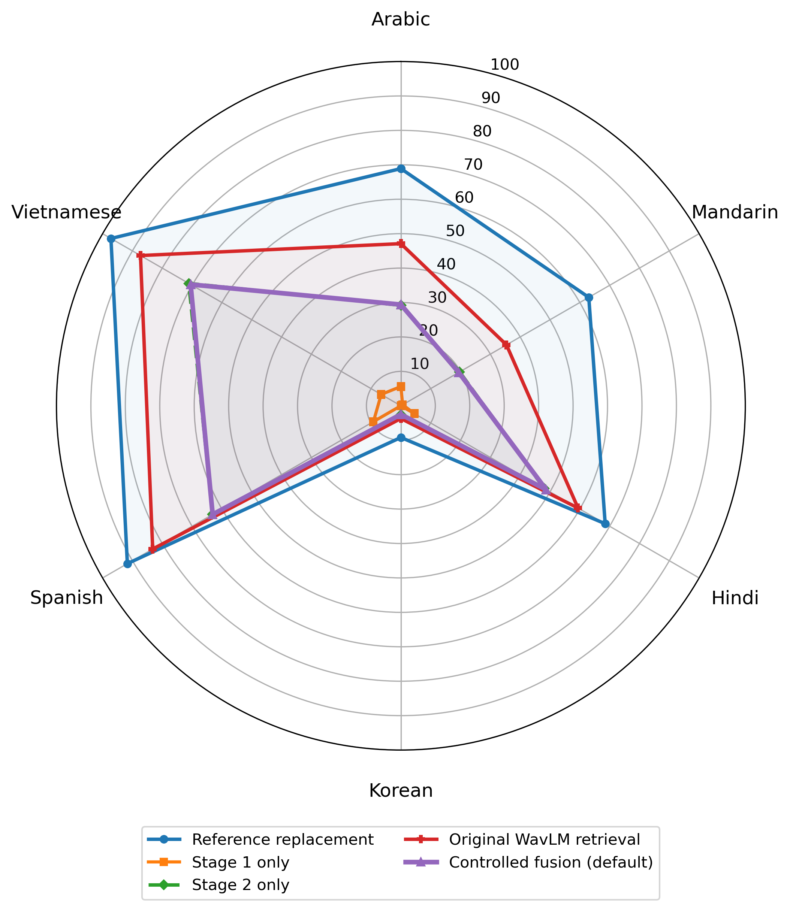
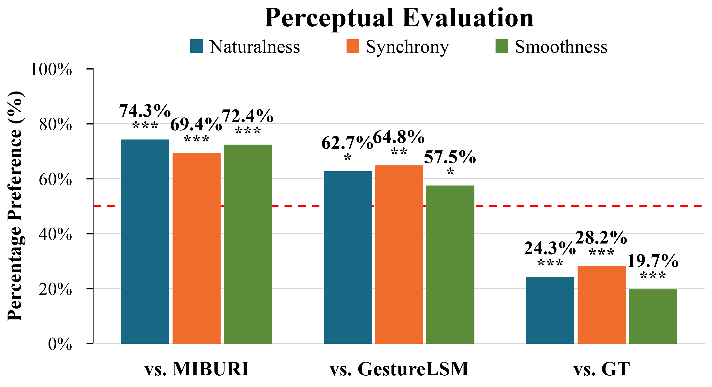
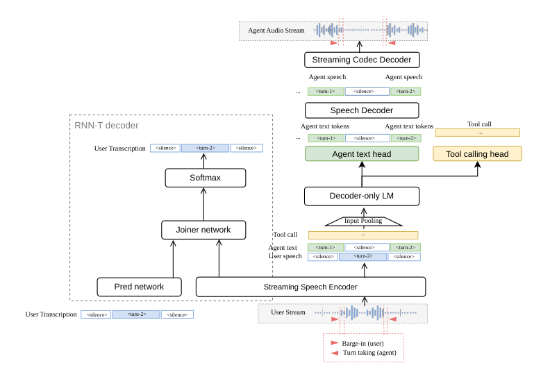
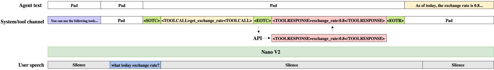
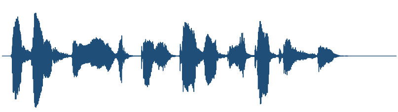
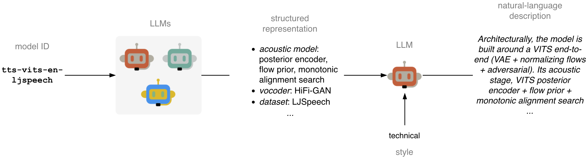

# 🚩 (2026-09-21) Scholar Inbox 추천 논문 

# 📚 BLINC: BLIND CALIBRATION FOR TRAINING-FREE SPEECH ENHANCEMENT ADAPTATION

🚀 URL: https://arxiv.org/html/2609.21898

## 🌏 Abstract (원문)
Speech enhancement (SE)models degrade under domain shifts and have to adapt to unseen target domains during deployment.Most existingtest-time adaptation (TTA)methods forSEdo so by adapting a subset of the model weights using a self-supervised loss, which requires backpropagation at test-time and permanently alters the model.We instead recalibrate the prediction itself and propose BLINC, a training-freeTTAmethod that remaps the predicted time-frequency mask onto a bimodal target distribution by histogram matching.At test-time, the target distribution is parameterized from blind features of the noisy recording, so neither a reference distribution from a classical algorithm nor online metric optimization is involved.BLINC improves the overall quality of both evaluatedSEmodels on almost every target condition and matches or exceeds the loss-basedTTAbaselines at minimal overhead.
## 🌏 Abstract (번역)
음성 향상(SE) 모델은 도메인 변화에 따라 성능이 저하되며, 배포 시 보이지 않는 대상 도메인에 적응해야 합니다. 대부분의 기존 SE용 테스트 시간 적응(TTA) 방법은 자기 지도 손실을 사용하여 모델 가중치의 일부를 적응시키는데, 이는 테스트 시간에 역전파를 필요로 하고 모델을 영구적으로 변경합니다. 우리는 대신 예측 자체를 재보정하고, 히스토그램 매칭을 통해 예측된 시간-주파수 마스크를 이봉형(bimodal) 대상 분포로 재매핑하는 훈련 없는 TTA 방법인 BLINC를 제안합니다. 테스트 시간에는 대상 분포가 잡음이 있는 녹음의 블라인드 특징으로부터 매개변수화되므로, 고전적인 알고리즘의 참조 분포나 온라인 메트릭 최적화가 필요하지 않습니다. BLINC는 평가된 두 SE 모델의 거의 모든 대상 조건에서 전반적인 품질을 향상시키며, 최소한의 오버헤드로 손실 기반 TTA 기준선과 동등하거나 그 이상을 달성합니다.

## 🔍 Methods & Results
- BLINC는 마스크 기반 음성 향상(SE) 모델의 도메인 변화로 인한 성능 저하 문제를 해결하기 위해 제안된 훈련 없는 테스트 시간 적응(TTA) 방법이다.
- 기존 TTA 방법과 달리, BLINC는 모델 가중치를 변경하지 않고 예측된 시간-주파수 마스크의 분포를 직접 재보정한다.
- 재보정은 히스토그램 매칭(확률 적분 변환, PIT)을 사용하여 수행되며, 예측 마스크의 경험적 누적 분포 함수(CDF)를 표준 균일 분포로 매핑한 후, 이봉형(bimodal) 대상 분포의 퀀타일 함수(Q_target)를 통해 재매핑한다. 이는 마스크 엔트리의 순위는 유지하되 값(분포)만 변경한다.
- 대상 이봉형 분포는 시그모이드 함수 Q_target(p) = c + (1-c) * σ(a(p-b))로 모델링되며, 여기서 c는 바닥, b는 잡음 모드에 할당된 빈의 비율(중간점), a는 날카로움을 제어한다.
- 테스트 시에는 각 입력 신호에 대해 잡음이 있는 신호에서 추출된 블라인드 특징(예: 음성 활동 비율 P_Sp)을 사용하여 대상 분포의 매개변수 (a, b, c)를 동적으로 결정한다.
- 매개변수 (a, b, c)는 P_Sp의 아핀 함수로 모델링되며, 이 아핀 함수의 계수는 검증 데이터셋에서 PESQ(음성 향상 품질 평가 지표)를 최대화하도록 오프라인에서 학습된다.
- BLINC는 평가된 SE 모델의 거의 모든 대상 조건에서 전반적인 품질을 향상시키며, 최소한의 오버헤드로 손실 기반 TTA 기준선과 동등하거나 그 이상의 성능을 달성한다.

## 🖼 Figures

*Figure 1:Loss-based TTA minimizes a loss 
ℒ
 at test-time, adjusting either the model weights 
𝜃
 or the prediction 
𝐗
^
. BLINC instead recalibrates the prediction of the frozen model in a single step without a loss.*

*Figure 2:Overview of BLINC. The frozen SE model predicts the mask 
𝐌
, which 
𝐹
pred
 and 
𝑄
target
 remap to 
𝐌
~
. 
𝑄
target
 is parameterized from blind features of 
𝐘
.*

*Figure 2:Overview of BLINC. The frozen SE model predicts the mask 
𝐌
, which 
𝐹
pred
 and 
𝑄
target
 remap to 
𝐌
~
. 
𝑄
target
 is parameterized from blind features of 
𝐘
.*

---
**Usage Info**: 4263 tokens used.
**Generated at**: 2026-09-21 19:03:25

---

# 📚 Time series generation with spectrally aligned latent flow matching

🚀 URL: https://arxiv.org/html/2609.21989

## 🌏 Abstract (원문)
Latent flow models have proven to be a reliable and cost-effective method for time series generation. However, the latent compression induces unwanted artefacts, such as a spectral mismatch with respect to the underlying dataset, thus hindering their use as training surrogates. In this article, we propose a spectrally-aligned latent-flow time series generator, where the latent space for flow matching is trained to preserve dynamical properties that are relevant for the suitability of synthetic samples. We find that incorporating fine-tuning losses based on canonical signal representations such as the Fourier, wavelet and signature transforms helps overcome these issues. The interpretability of these transformations allows us to ensure that the synthetic signals are aligned with the true ones in terms of relevant features, such as smoothness or targeted spectral content, as opposed to relying on pointwise reconstruction losses only. We compare the proposed aligned models against a base latent-flow model and the state of the art over real-world long-range univariate and multivariate benchmark datasets. Our quantitative results validate the superiority of the proposed method in terms of its performance on metrics reflecting signal realness and computational efficiency, while being aligned to the training set with respect to its local structure.
## 🌏 Abstract (번역)
잠재 흐름 모델은 시계열 생성에 있어 신뢰할 수 있고 비용 효율적인 방법임이 입증되었습니다. 그러나 잠재 압축은 기본 데이터셋과의 스펙트럼 불일치와 같은 원치 않는 인공물을 유발하여 훈련 대리자로서의 사용을 방해합니다. 본 논문에서는 스펙트럼 정렬 잠재 흐름 시계열 생성기를 제안합니다. 이 모델은 흐름 매칭을 위한 잠재 공간이 합성 샘플의 적합성에 관련된 동적 특성을 보존하도록 훈련됩니다. 우리는 푸리에, 웨이블릿 및 시그니처 변환과 같은 정규 신호 표현을 기반으로 하는 미세 조정 손실을 통합하는 것이 이러한 문제를 극복하는 데 도움이 된다는 것을 발견했습니다. 이러한 변환의 해석 가능성은 점별 재구성 손실에만 의존하는 것이 아니라, 부드러움 또는 목표 스펙트럼 내용과 같은 관련 특징 측면에서 합성 신호가 실제 신호와 정렬되도록 보장합니다. 우리는 제안된 정렬 모델을 기본 잠재 흐름 모델 및 최신 기술과 실제 장기 단변량 및 다변량 벤치마크 데이터셋에서 비교했습니다. 우리의 정량적 결과는 신호의 현실성 및 계산 효율성을 반영하는 지표에서 제안된 방법의 우수성을 입증하며, 동시에 훈련 세트의 로컬 구조와 정렬됩니다.

## 🔍 Methods & Results
- 스펙트럼 정렬 잠재 흐름 시계열 생성기(spectrally-aligned latent-flow time series generator)를 제안하며, 흐름 매칭을 위한 잠재 공간은 합성 샘플의 적합성에 중요한 동적 특성을 보존하도록 훈련됩니다.
- 푸리에(Fourier), 웨이블릿(wavelet), 시그니처(signature) 변환과 같은 정규 신호 표현을 기반으로 하는 미세 조정 손실(fine-tuning losses)을 통합하여 잠재 압축으로 인한 스펙트럼 불일치 문제를 해결합니다.
- 제안된 모델은 점별 재구성 손실 대신 변환의 해석 가능성을 활용하여 합성 신호가 부드러움이나 목표 스펙트럼 내용과 같은 관련 특징 측면에서 실제 신호와 정렬되도록 보장합니다.
- 제안된 정렬 모델을 기본 잠재 흐름 모델 및 최신 기술과 실제 장기 단변량 및 다변량 벤치마크 데이터셋에서 비교 평가했습니다.
- 정량적 결과는 제안된 방법이 신호의 현실성 및 계산 효율성 지표에서 우수하며, 훈련 세트의 로컬 구조와 정렬됨을 입증했습니다.

---
**Usage Info**: 1428 tokens used.
**Generated at**: 2026-09-21 19:03:33

---

# 📚 Partial Accent-Control Editing in Frozen Speech Representations for Accent Conversion

🚀 URL: https://arxiv.org/html/2609.22031

## 🌏 Abstract (원문)
Accent conversion is the task of modifying a speech recording so that it sounds closer to a target accent while preserving linguistic content and other speaker-related characteristics. Most accent conversion systems use trained, generative models. Although they can induce target-accented speech, the strength of accent modification is not controllable at inference time, making it difficult to analyse how the strength of accent conversion affects source preservation. We propose Partial Accent-Control Editing (PACE), an accent conversion framework based upon the editing of frozen WavLM representations without the training of an accent-conditioned generator. A constrained edit is first applied to source WavLM features, which are then fused with target-accent reference features retrieved from non-parallel accent examples. Fusion weights are used to control the trade-off between accent conversion strength and the degradation of other source attributes. Using a suite of five metrics, and with the cost of accent-entangled speaker similarity, we show that PACE is substantially superior to a pair of competitive baselines in terms of both accent conversion and source preservation.
## 🌏 Abstract (번역)
악센트 변환은 언어적 내용과 다른 화자 관련 특성을 보존하면서 음성 녹음이 목표 악센트에 더 가깝게 들리도록 수정하는 작업입니다. 대부분의 악센트 변환 시스템은 훈련된 생성 모델을 사용합니다. 이러한 모델은 목표 악센트가 적용된 음성을 생성할 수 있지만, 추론 시 악센트 수정 강도를 제어할 수 없어 악센트 변환 강도가 원본 보존에 미치는 영향을 분석하기 어렵습니다. 본 논문에서는 악센트 조건부 생성기를 훈련하지 않고 동결된 WavLM 표현을 편집하는 것에 기반한 악센트 변환 프레임워크인 PACE(Partial Accent-Control Editing)를 제안합니다. 먼저 원본 WavLM 특징에 제약된 편집을 적용한 다음, 비병렬 악센트 예제에서 검색된 목표 악센트 참조 특징과 융합합니다. 융합 가중치는 악센트 변환 강도와 다른 원본 속성의 저하 사이의 균형을 제어하는 데 사용됩니다. 5가지 측정 지표와 악센트와 얽힌 화자 유사성 비용을 사용하여, PACE가 악센트 변환 및 원본 보존 측면에서 두 경쟁 기준선보다 훨씬 우수함을 보여줍니다.

## 🔍 Methods & Results
- PACE(Partial Accent-Control Editing)는 악센트 조건부 생성기를 훈련하지 않고 동결된 WavLM 표현을 편집하여 악센트 변환을 수행하는 프레임워크입니다.
- 목표는 언어적 내용과 화자 특성을 보존하면서 원본 음성을 목표 악센트에 가깝게 변환하는 것입니다.
- 비병렬 설정에서, WavLM 공간에서 프레임 수준의 목표 악센트 참조 뱅크를 구축하여 짝을 이루는 목표 파형의 필요성을 피합니다.
- 변환 과정은 두 단계로 구성됩니다: 1단계는 악센트 예측 부분 공간에서 원본 측 업데이트를 적용하고, 2단계는 뱅크에서 목표 악센트 참조 특징을 검색하여 편집된 원본 특징과 융합합니다.
- 악센트 예측 부분 공간은 WavLM 특징과 원-핫 악센트 레이블 간의 부분 최소 제곱(PLS)을 통해 추정된 투영 행렬을 사용하여 정의됩니다.
- 1단계에서는 엔트로피 정규화된 불균형 최적 수송을 사용하여 투영된 원본 시퀀스와 목표 악센트 뱅크 간의 가중치 일치를 추정하고, 이를 통해 악센트 예측 부분 공간에서 목표 지향적 이동을 계산한 후 WavLM 공간으로 다시 매핑하여 원본 프레임을 업데이트합니다. 이때 업데이트 규모는 알파(α)로 제어됩니다.
- 2단계에서는 1단계에서 편집된 원본 시퀀스를 악센트 예측 부분 공간에 투영하고, 코사인 유사성을 사용하여 목표 악센트 뱅크에서 상위 k개의 가장 가까운 프레임을 검색합니다.
- 검색된 참조 특징(원래 WavLM 공간에서 가져옴)은 융합 가중치 감마(γ)를 사용하여 편집된 원본 프레임과 융합됩니다. 감마는 악센트 변환 강도와 원본 보존 간의 균형을 제어합니다.
- 최종 편집된 WavLM 시퀀스는 고정된 kNN-VC 합성 백엔드(멜 투영 및 HiFi-GAN 보코더)를 사용하여 파형으로 변환됩니다.
- 다섯 가지 측정 지표와 악센트와 얽힌 화자 유사성 비용을 사용하여, PACE가 악센트 변환 및 원본 보존 측면에서 경쟁 기준선보다 훨씬 우수함을 입증했습니다.

## 🖼 Figures
![Figure 1:Overview of PACE. Stage 1 performs an accent-predictive source update by estimating a transport-based target reference in the accent-predictive subspace and applying the resulting shift as an additive update to the source WavLM features. Stage 2 performs top-
𝑘
 retrieval in the accent-predictive subspace, uses the retrieved indices to fetch WavLM-space target-accent reference features from the bank, and fuses them with the edited source features using the fusion weight 
𝛾
. The final representation is synthesized with the fixed kNN-VC synthesis backend.](../images/2026-09-21/2609.22031/2609.22031_fig0.png)
*Figure 1:Overview of PACE. Stage 1 performs an accent-predictive source update by estimating a transport-based target reference in the accent-predictive subspace and applying the resulting shift as an additive update to the source WavLM features. Stage 2 performs top-
𝑘
 retrieval in the accent-predictive subspace, uses the retrieved indices to fetch WavLM-space target-accent reference features from the bank, and fuses them with the edited source features using the fusion weight 
𝛾
. The final representation is synthesized with the fixed kNN-VC synthesis backend.*

*Figure 2: Target-accent-specific classifier-based accuracy for the operating points in Table I. Accuracy is reported as a percentage for each intended target accent.*

---
**Usage Info**: 4038 tokens used.
**Generated at**: 2026-09-21 19:03:42

---

# 📚 GestureFAR: Streaming Co-Speech Gesture Generation with Flow Autoregression

🚀 URL: https://arxiv.org/html/2609.21576

## 🌏 Abstract (원문)
Generating natural co-speech gestures from streaming speech is essential for embodied conversational agents, where motion must be produced while a user is still speaking. Recent streaming gesture systems make online generation possible by autoregressing over discrete motion tokens, but this design compresses high-dimensional continuous motion into finite codebooks and can limit the realism and diversity of generated gestures. To preserve both causality and continuous expressiveness, we proposeGestureFAR, a flow-autoregressive framework for streaming co-speech gesture generation. First, GestureFAR autoregresses over causal continuous motion latents, using a transformer to model streaming audio-motion context and a per-token flow-matching head to sample the next latent from a continuous distribution. Second, we introduce a head-only flow distillation strategy that freezes the causal backbone and distills the multi-step per-token flow head into a single network evaluation using consistency and distribution-matching objectives. This keeps the model token-causal while removing the main latency bottleneck for live interaction. Experiments on BEAT2 show that GestureFAR significantly improves the quality–latency trade-off among streaming-capable methods, preserving strong gesture quality while enabling real-time token-causal generation. Project Page:https://andypinxinliu.github.io/GestureFAR
## 🌏 Abstract (번역)
사용자가 여전히 말하는 동안 동작이 생성되어야 하는 대화형 에이전트에게는 스트리밍 음성에서 자연스러운 동시 발화 제스처를 생성하는 것이 필수적입니다. 최근의 스트리밍 제스처 시스템은 이산 동작 토큰에 대해 자동 회귀함으로써 온라인 생성을 가능하게 하지만, 이러한 설계는 고차원 연속 동작을 유한한 코드북으로 압축하여 생성된 제스처의 사실성과 다양성을 제한할 수 있습니다. 인과성과 연속적인 표현력을 모두 보존하기 위해, 우리는 스트리밍 동시 발화 제스처 생성을 위한 흐름 자동 회귀 프레임워크인 GestureFAR을 제안합니다. 첫째, GestureFAR은 트랜스포머를 사용하여 스트리밍 오디오-모션 컨텍스트를 모델링하고 토큰당 흐름 일치 헤드를 사용하여 연속 분포에서 다음 잠재 변수를 샘플링함으로써 인과적 연속 모션 잠재 변수에 대해 자동 회귀합니다. 둘째, 우리는 인과적 백본을 고정하고 다단계 토큰당 흐름 헤드를 일관성 및 분포 일치 목표를 사용하여 단일 네트워크 평가로 증류하는 헤드 전용 흐름 증류 전략을 도입합니다. 이는 모델을 토큰 인과적으로 유지하면서 실시간 상호 작용을 위한 주요 지연 병목 현상을 제거합니다. BEAT2에 대한 실험은 GestureFAR이 스트리밍 가능한 방법들 중에서 품질-지연 절충점을 크게 개선하여 강력한 제스처 품질을 유지하면서 실시간 토큰 인과적 생성을 가능하게 함을 보여줍니다. 프로젝트 페이지: https://andypinxinliu.github.io/GestureFAR

## 🔍 Methods & Results
- GestureFAR은 연속적인 신체 움직임을 이산 코드북 예측으로 축소하지 않고 인과적으로 제스처를 생성하도록 설계된 흐름 자동 회귀 프레임워크입니다.
- 스트리밍 제스처 생성은 세 가지 요구사항을 충족합니다: 인과적 모션 표현, 각 토큰이 과거 모션 및 사용 가능한 음성에만 의존, 연속적이고 다중 모드인 토큰 분포.
- **인과적 모션 VAE**: 잠재 공간을 연속적으로 유지하고 미래 정보 유출을 방지하기 위해 1D 인과적 모션 VAE를 사용하여 인과적 표현을 처리합니다. 인코더와 디코더는 모두 인과적 컨볼루션을 사용합니다.
- **스트리밍 오디오-모션 트랜스포머**: 이전 모션과 현재 사용 가능한 음성을 조건 벡터로 요약하여 컨디셔닝을 처리합니다. 모션 잠재 변수에 대한 인과적 자기 주의와 음성 특징에 대한 인과적 교차 주의를 사용합니다.
- **연속 흐름 헤드**: 각 트랜스포머 조건에 경량 MLP 흐름 헤드를 연결하여 생성을 처리합니다. 흐름 일치를 사용하여 잠재 변수의 조건부 연속 분포를 모델링하며, 교사는 노이즈에서 데이터로 속도 필드를 통합하여 샘플링합니다.
- **헤드 전용 원스텝 증류**: 주요 가속화 전략으로, 토크나이저와 AR 트랜스포머를 고정하고 다단계 흐름 헤드만 단일 네트워크 평가로 증류합니다. 이는 모델의 토큰 인과성을 유지하면서 실시간 상호 작용의 지연 병목 현상을 제거합니다.
- 증류는 교사 솔버 엔드포인트로 학생을 초기화하고, 학생을 교사 궤적에 정렬하는 일관성 목표, 그리고 다중 모달리티를 보존하기 위한 분포 일치(DMD 스타일) 항을 포함합니다.
- **상태 저장 스트리밍 배포 루프**: 불규칙한 오디오 도착, GPU 실행 버스트, 고정 속도 렌더링 및 말하기 중단에 대응하기 위해 지속적인 상태(오디오 인코더 캐시, AR 트랜스포머 캐시, VAE 디코더 캐시, 신체 앵커)를 업데이트합니다.
- 짧은 모션 버퍼를 사용하여 생성과 디스플레이를 분리하여 청크 경계, GPU 스케줄링 및 렌더링 부하로 인한 변동을 흡수하고 낮은 지연 시간을 유지합니다.
- 말하기 및 듣기를 런타임 상태로 처리하며, 말하기 중에는 오디오 조건부 모션을 생성하고, 듣기 중에는 짧은 유휴 모션 클립을 루프하여 아바타가 살아있는 것처럼 보이게 합니다. 각 상태 전환은 모션 공간 블렌딩으로 부드럽게 처리됩니다.

## 🖼 Figures
![Figure 3: Overview of GestureFAR. GestureFAR generates co-speech gestures from streaming audio by autoregressing over continuous motion latents. A causal motion VAE maps full-body motion into a streamable latent representation. A streaming audio-motion transformer predicts the condition for each next latent using past motion and currently available audio. A lightweight per-token flow head samples the next continuous latent from this condition. For real-time deployment, we distill only the flow head into a one-step student while keeping the transformer frozen.](../images/2026-09-21/2609.21576/2609.21576_fig2.png)
*Figure 3: Overview of GestureFAR. GestureFAR generates co-speech gestures from streaming audio by autoregressing over continuous motion latents. A causal motion VAE maps full-body motion into a streamable latent representation. A streaming audio-motion transformer predicts the condition for each next latent using past motion and currently available audio. A lightweight per-token flow head samples the next continuous latent from this condition. For real-time deployment, we distill only the flow head into a one-step student while keeping the transformer frozen.*

*Figure 4:Stateful streaming deployment. GestureFAR is deployed with persistent model caches, body anchors, a short motion buffer, and motion-space blending. The caches make chunked generation incremental, body anchors prevent translation drift and re-centering artifacts, and the buffer decouples bursty backend generation from fixed-rate frontend playback. Blending smooths transitions between speaking, listening, and idle states, enabling stable live avatar rendering.*

*Figure 5:Qualitative comparison on BEAT2. We visualize generated full-body gestures from different methods under the same speech inputs, with the semantically salient words highlighted in red. Compared with prior methods, our model produces gestures that are more natural, diverse, and better aligned with the speech semantics.*

*Figure 6:Our GestureFAR have higher user ratings with a clear margin on Naturalness, Synchrony, and Smoothness.*

---
**Usage Info**: 3906 tokens used.
**Generated at**: 2026-09-21 19:03:53

---

# 📚 SCALING FORCED ALIGNMENT TO END-USER DEVICES

🚀 URL: https://arxiv.org/html/2609.21145

## 🌏 Abstract (원문)
The Viterbi algorithm has been previously used to perform forced alignment of audio to text to mine training data from online resources. However, many existing implementations have quadratic time and space complexity, scaling poorly to long input sequences. We propose two optimizations to address this issue. First, we apply the Hirschberg algorithm to perform the alignment in place using linear memory. Second, we model the alignment between speech and text as a constrained random walk, allowing us to prune the search space with arbitrary confidence while accounting for transcription errors. The Hirschberg optimization reduces memory usage from 140 GB to 5 MB for three-hour inputs while producing identical alignments in one-third the time of torchaudio when both run on a CPU. We achieve an additional 2x speedup with pruning on inputs longer than 20 minutes while preserving alignment accuracy in more than 98% of tested cases.
## 🌏 Abstract (번역)
비터비 알고리즘은 이전에 온라인 리소스에서 훈련 데이터를 추출하기 위해 오디오를 텍스트에 강제 정렬하는 데 사용되었습니다. 그러나 많은 기존 구현은 2차 시간 및 공간 복잡도를 가지며, 긴 입력 시퀀스에 대해 확장성이 좋지 않습니다. 우리는 이 문제를 해결하기 위해 두 가지 최적화를 제안합니다. 첫째, 선형 메모리를 사용하여 정렬을 제자리에서 수행하기 위해 히르쉬베르그 알고리즘을 적용합니다. 둘째, 음성과 텍스트 간의 정렬을 제약된 랜덤 워크로 모델링하여 전사 오류를 고려하면서 임의의 신뢰도로 검색 공간을 가지치기할 수 있도록 합니다. 히르쉬베르그 최적화는 3시간 입력에 대해 메모리 사용량을 140GB에서 5MB로 줄이는 동시에, 두 알고리즘 모두 CPU에서 실행될 때 torchaudio의 3분의 1 시간으로 동일한 정렬을 생성합니다. 우리는 20분보다 긴 입력에 대해 가지치기를 통해 추가적인 2배의 속도 향상을 달성했으며, 테스트된 경우의 98% 이상에서 정렬 정확도를 유지했습니다.

## 🔍 Methods & Results
- 첫 번째 최적화로, 강제 정렬(FA)을 위해 히르쉬베르그 알고리즘을 구현하여 O(n^2) 실행 시간과 O(n) 메모리 사용량을 달성했습니다. 이 알고리즘은 분할 정복 및 중간 지점 결합 원리를 사용하여 오디오의 중간 지점에서 최적의 정렬을 계산한 후 재귀적으로 처리합니다. 메모리 사용량을 제한하기 위해 점수는 제자리에서 추적되며, 하위 문제가 1KB 이내로 충분히 작아지면 재귀를 중단합니다.
- 히르쉬베르그 최적화는 3시간 입력에 대해 메모리 사용량을 140GB에서 5MB로 줄였으며, CPU에서 실행될 때 torchaudio의 3분의 1 시간으로 동일한 정렬을 생성했습니다.
- 두 번째 최적화로, 검색 공간을 대각선 주변의 창으로 제한하고, 창 너비가 입력 크기에 비례하여 확장되어야 한다고 제안했습니다. 정렬을 음소 지속 시간의 제약된 랜덤 워크로 모델링하여 사전 정보를 생성하고, 오디오 길이에 맞게 음소 지속 시간을 조정합니다.
- 문자 정렬 위치에 대한 정규 근사를 형성하고, 신뢰도를 위해 합집합 경계 보정(1 - δ/n)을 적용하며, 최소 창 크기는 15초로 설정했습니다. 전사 오류(정밀도/재현율) 및 침묵을 고려하여 가지치기 경계를 수정하고, 이러한 매개변수의 하한을 고려하여 최악의 경우 정렬을 추정합니다.
- 가지치기를 통해 20분보다 긴 입력에서 추가적인 2배의 속도 향상을 달성했으며, 테스트된 경우의 98% 이상에서 정렬 정확도를 유지했습니다. 예측된 창의 너비는 O(n^2ε)의 느슨한 시간 복잡도를 가집니다.

## 🖼 Figures

*Figure 1:Logarithmic heatmaps showing a random sample of alignments from the CJCLDS-GC dataset (left), and the alignment prior that we use to predict FA pruning bounds (right). This prior is created from the assumption that phoneme durations are randomly distributed and stationary.*

*Figure 5:The alignments in the EuroSpeech dataset after removing audio between labeled sentences. We color the heatmap using the CER of the transcription. Hue depicts CER, while color intensity indicates logarithmic frequency in the dataset. We note that alignments further from their expected position tend to have higher CER.*

*Figure 6:After removing labeled periods of silence from the Buckeye dataset, all transcription alignments were contained within their predicted pruning space. The lines on the right depict the pruning space for s2002a, one of the shorter recordings with a wider relative pruning space. Note that these depict the segmented interview labels available with dataset, not our reconstruction of the 40 interviews.*

---
**Usage Info**: 3641 tokens used.
**Generated at**: 2026-09-21 19:04:05

---

# 📚 NemotronLabs VoiceChat: An Open Full-duplex Speech-to-Speech Model with Tool Calling Capabilities

🚀 URL: https://arxiv.org/html/2609.21967

## 🌏 Abstract (원문)
Abstract.We introduce NemotronLabs VoiceChat, an open full-duplex speech-to-speech model with native tool-calling capabilities. NemotronLabs VoiceChat combines a streaming speech encoder and decoder-only language model with parallel specialized output streams for agent text and structured function calls, an auxiliary RNN-T branch for incremental user transcription, and a streaming TTS decoder. This design enables the model to listen, transcribe, reason, invoke tools, and speak within a unified streaming architecture while preserving the temporal behavior required for natural conversation. On Full-Duplex-Bench 1.0, NemotronLabs VoiceChat achieves the lowest pause-handling takeover rates among evaluated open-weight systems, 100% takeover following user interruptions, and a 4.33/5 post-interruption response-quality score. On Full-Duplex-Bench 1.5, it resumes its response after user backchannels in 93% of cases. NemotronLabs VoiceChat obtains a 55.1 normalized average on VoiceBench and, on Full-Duplex-Bench 3.0 (FDB 3.0), achieves 82.5% tool-selection F1, while argument accuracy and end-to-end tool execution remain areas for improvement. These results demonstrate that full-duplex interaction, speech recognition and generation, general language capabilities, and external tool use can be integrated in a single open speech-to-speech model without sacrificing real-time conversational behavior.
## 🌏 Abstract (번역)
초록. 우리는 네모트론랩스 보이스챗(NemotronLabs VoiceChat)을 소개합니다. 이는 네이티브 도구 호출 기능을 갖춘 개방형 전이중(full-duplex) 음성-음성 모델입니다. 네모트론랩스 보이스챗은 스트리밍 음성 인코더와 디코더 전용 언어 모델을 결합하며, 에이전트 텍스트 및 구조화된 함수 호출을 위한 병렬 특수 출력 스트림, 점진적인 사용자 전사를 위한 보조 RNN-T 브랜치, 그리고 스트리밍 TTS 디코더를 포함합니다. 이러한 설계는 모델이 자연스러운 대화에 필요한 시간적 행동을 유지하면서 통합된 스트리밍 아키텍처 내에서 듣고, 전사하고, 추론하고, 도구를 호출하고, 말할 수 있도록 합니다. Full-Duplex-Bench 1.0에서 네모트론랩스 보이스챗은 평가된 오픈 가중치 시스템 중 가장 낮은 일시 정지 처리 인수율을 달성했으며, 사용자 방해 후 100% 인수를 보였고, 방해 후 응답 품질 점수는 5점 만점에 4.33점을 기록했습니다. Full-Duplex-Bench 1.5에서는 사용자 백채널(backchannel) 후 93%의 경우에서 응답을 재개했습니다. 네모트론랩스 보이스챗은 VoiceBench에서 55.1의 정규화된 평균을 얻었으며, Full-Duplex-Bench 3.0(FDB 3.0)에서는 82.5%의 도구 선택 F1 점수를 달성했지만, 인자 정확도와 종단 간 도구 실행은 개선이 필요한 영역으로 남아 있습니다. 이러한 결과는 전이중 상호작용, 음성 인식 및 생성, 일반 언어 능력, 그리고 외부 도구 사용이 실시간 대화 동작을 희생하지 않고도 단일 개방형 음성-음성 모델에 통합될 수 있음을 보여줍니다.

## 🔍 Methods & Results
- NemotronLabs VoiceChat은 스트리밍 음성 인코더, 디코더 전용 언어 모델, 병렬 출력 스트림(에이전트 텍스트 및 함수 호출), 보조 RNN-T 사용자 전사 브랜치, 스트리밍 TTS 디코더를 통합한 전이중 음성-음성 아키텍처를 사용합니다.
- STT 구성 요소는 NVIDIA Nemotron-Nano-9B-v2-Base를 LLM 백본으로 사용하며, 600M 파라미터의 스트리밍 FastConformer 인코더와 24개 계층을 포함하는 지각 모듈을 통해 사용자 음성을 처리하고, 보조 RNN-T 브랜치로 사용자 전사를 생성합니다.
- 모델은 에이전트 응답 시작(BOS) 및 종료(EOS) 토큰을 사용하여 80ms 타임라인에 맞춰 응답 타이밍을 학습하며, 프레임 수준에서 턴-테이킹을 제어합니다.
- 도구 호출은 에이전트 텍스트 출력과 병렬로 전용 자동회귀 함수 채널을 통해 모델링되며, <SOTC>, <EOTC>, <EOTR>과 같은 특수 토큰과 JSON 형식의 페이로드를 사용하여 도구 호출 및 응답을 처리합니다.
- 음성 생성 구성 요소는 VoiceChat-TTS로, 778M 파라미터의 Gemma 3 기반 디코더와 199M 파라미터의 인과적 오디오 코덱을 결합하여 연속적이고 스트리밍 가능한 텍스트-음성 변환을 제공합니다.
- VoiceChat-TTS는 Character-Aware Subword Encoder를 사용하여 LLM 서브워드 임베딩의 문제를 해결하고, 3초 참조 오디오 프롬프트로 화자 조건을 부여하며, BOS 및 중단 임베딩으로 대화 경계를 명시적으로 신호합니다.
- Full-Duplex-Bench 1.0에서 NemotronLabs VoiceChat은 가장 낮은 일시 정지 처리 인수율을 달성하고, 사용자 방해 후 100% 인수를 보이며, 4.33/5의 방해 후 응답 품질 점수를 기록했습니다.
- Full-Duplex-Bench 1.5에서 사용자 백채널 후 93%의 경우에서 응답을 재개했으며, VoiceBench에서 55.1의 정규화된 평균을 얻었습니다.
- Full-Duplex-Bench 3.0(FDB 3.0)에서 82.5%의 도구 선택 F1 점수를 달성했으나, 인자 정확도와 종단 간 도구 실행은 개선이 필요한 영역으로 나타났습니다.

## 🖼 Figures

*Figure 1:NemotronLabs VoiceChat Architecture Overview.*

*Figure 2:Tool-calling channel. For space efficiency, we omit the tool and agent-text channels on the input side of the figure.*

---
**Usage Info**: 4307 tokens used.
**Generated at**: 2026-09-21 19:04:15

---

# 📚 Listen Before You Speak: Response Planning from Listener Facial Reactions for Conversational Speech Generation

🚀 URL: https://arxiv.org/html/2609.21683

## 🌏 Abstract (원문)
Conversational speech depends on dialogue context and the listener’s immediately preceding behavior. We propose ReACT-TTS, a two-stage framework that uses a one-second pre-response listener facial sequence to plan the next utterance’s emotion and prosody before speech realization. On a strict dyadic MELD protocol, Temporal conditioning yields higher mean macro-F1 and VAD concordance than Text-only across ten seeds, while accuracy remains essentially unchanged. Ablations show that temporal modeling performs best among the visual variants and that an explicit early-to-late difference is unnecessary; correct listener reactions also outperform cyclic mismatches on average. In a contextual-appropriateness study with 20 speech researchers, 76% of judgments prefer Temporal, 9% Text-only, and 15% report no preference. We further connect the predicted response style to a Grad-TTS backbone for end-to-end speech realization. Overall, the results support pre-response listener dynamics as complementary cues for conversational response planning. The source code is available atReACT-TTS.
## 🌏 Abstract (번역)
대화 음성은 대화 맥락과 청자의 직전 행동에 따라 달라진다. 우리는 ReACT-TTS를 제안한다. 이는 발화 실현 전에 다음 발화의 감정과 운율을 계획하기 위해 1초 길이의 응답 전 청자 얼굴 시퀀스를 사용하는 2단계 프레임워크이다. 엄격한 이인 MELD 프로토콜에서, 10개의 시드에 걸쳐 시간적 조건화는 텍스트 전용 방식보다 더 높은 평균 매크로-F1 및 VAD 일치도를 보였으며, 정확도는 본질적으로 변하지 않았다. 어블레이션(Ablation) 연구는 시각적 변형 중 시간 모델링이 가장 우수하며, 명시적인 초기-후기 차이가 불필요함을 보여준다. 또한, 올바른 청자 반응이 평균적으로 순환적 불일치보다 우수했다. 20명의 음성 연구원을 대상으로 한 맥락 적합성 연구에서, 76%의 판단이 시간적 방식을 선호했고, 9%는 텍스트 전용 방식을, 15%는 선호도 없음으로 보고했다. 우리는 예측된 응답 스타일을 Grad-TTS 백본에 연결하여 종단 간 음성 실현을 가능하게 했다. 전반적으로, 이 결과는 응답 전 청자 역학이 대화 응답 계획을 위한 보완적인 단서임을 지지한다. 소스 코드는 ReACT-TTS에서 이용 가능하다.

## 🔍 Methods & Results
- ReACT-TTS는 발화 실현 전 1초 길이의 응답 전 청자 얼굴 시퀀스를 사용하여 다음 발화의 감정과 운율을 계획하는 2단계 프레임워크를 제안한다.
- 응답 계획 단계(Stage A)에서는 대화 맥락(텍스트)과 청자의 시각적 행동(얼굴 시퀀스)을 융합하여 목표 응답의 감정, 연속적인 정서(VAD), 운율 속성을 예측하고 256차원 응답 스타일 임베딩을 생성한다.
- 시각적 입력은 ResNet-18 기반의 표정 지향 얼굴 백본과 Transformer 시간 인코더를 통해 처리되며, 텍스트 입력과 함께 목표 조건부 게이트를 통해 융합된다.
- 음성 실현 단계(Stage C)에서는 Stage A에서 예측된 응답 스타일 임베딩을 Grad-TTS 백본에 연결하여 종단 간 음성 합성을 수행한다.
- 엄격한 MELD 프로토콜에서, ReACT-TTS의 시간적 조건화 방식은 텍스트 전용 방식보다 더 높은 평균 매크로-F1 및 VAD 일치도를 달성했다.
- 어블레이션 연구 결과, 시각적 변형 중 시간 모델링이 가장 우수했으며, 명시적인 초기-후기 시각적 차이(early-to-late difference)는 추가적인 이점을 제공하지 않았다.
- 20명의 음성 연구원을 대상으로 한 맥락 적합성 연구에서, 76%의 평가자가 ReACT-TTS의 시간적 방식을 선호했다.

---
**Usage Info**: 4222 tokens used.
**Generated at**: 2026-09-21 19:04:29

---

# 📚 Towards Zero-Shot Attribution of Synthetic Speech via Audio-Text Contrastive Retrieval

🚀 URL: https://arxiv.org/html/2609.21581

## 🌏 Abstract (원문)
Audio deepfake forensics is moving beyond a simple real-or-fake verdict toward attribution: which system generated the audio clip? Most source-attribution methods cast this as closed-set classification, so they cannot name a generator that was absent from training, a gap that widens with every newly released text-to-speech (TTS) system. We instead frame attribution as cross-modal retrieval: each generator is described in natural language, and a clip is attributed by retrieving the description closest to it in a shared audio–text embedding space. Adding a new system then takes nothing more than writing its description, with no retraining and no new classifier head. Our model couples a frozen Wav2Vec2-BERT audio encoder with a frozen E5 text encoder and aligns them through small trainable projection heads, using a contrastive objective that combines a cross-modal supervised-contrastive loss with intra-modal terms. We evaluate on MLAAD v9 (140 TTS models, 51 languages) under 10-fold leave-models-out cross-validation. For generators it has never encountered before, the model reaches a model-level mean reciprocal rank (MRR) of 58.4%. Even when the correct model is not identified, the audio clip is often matched to systems that share the true generator’s vocoder, acoustic model, or architecture. Because the same embedding space also answers natural-language attribute queries, one set of descriptions covers both open-set attribution and attribute-level forensic profiling.
## 🌏 Abstract (번역)
오디오 딥페이크 포렌식은 단순한 진짜/가짜 판별을 넘어 '어떤 시스템이 오디오 클립을 생성했는가?'라는 출처 귀속(attribution)으로 나아가고 있습니다. 대부분의 출처 귀속 방법은 이를 폐쇄 집합 분류(closed-set classification)로 간주하므로, 훈련에 없었던 생성기를 식별할 수 없으며, 이는 새로운 TTS(Text-to-Speech) 시스템이 출시될 때마다 더욱 커지는 간극입니다. 우리는 대신 귀속을 교차 모달 검색(cross-modal retrieval)으로 구성합니다. 각 생성기는 자연어로 설명되며, 오디오 클립은 공유 오디오-텍스트 임베딩 공간에서 가장 가까운 설명을 검색하여 귀속됩니다. 새로운 시스템을 추가하는 것은 재훈련이나 새로운 분류기 헤드 없이 단순히 해당 시스템의 설명을 작성하는 것만으로 가능합니다. 우리 모델은 고정된 Wav2Vec2-BERT 오디오 인코더와 고정된 E5 텍스트 인코더를 결합하고, 교차 모달 지도-대조 손실(cross-modal supervised-contrastive loss)과 내부 모달 항(intra-modal terms)을 결합한 대조 목표(contrastive objective)를 사용하여 작은 학습 가능한 투영 헤드(projection heads)를 통해 이들을 정렬합니다. 우리는 10겹 모델 제외 교차 검증(10-fold leave-models-out cross-validation) 방식 하에 MLAAD v9 (140개 TTS 모델, 51개 언어) 데이터셋으로 평가합니다. 모델이 이전에 접하지 못했던 생성기에 대해, 모델은 모델 수준 평균 역순위(MRR) 58.4%를 달성합니다. 올바른 모델이 식별되지 않더라도, 오디오 클립은 종종 실제 생성기의 보코더, 음향 모델 또는 아키텍처를 공유하는 시스템과 일치합니다. 동일한 임베딩 공간이 자연어 속성 쿼리에도 응답하므로, 하나의 설명 세트로 개방 집합 귀속(open-set attribution)과 속성 수준 포렌식 프로파일링(attribute-level forensic profiling)을 모두 처리할 수 있습니다.

## 🔍 Methods & Results
- 오디오 샘플의 생성 시스템을 텍스트 설명과 매칭하여 출처를 귀속하는 모델을 개발했습니다. 이 모델은 오디오 인코더와 텍스트 인코더로 구성된 듀얼 인코더 아키텍처를 사용하며, 각 입력을 공유 임베딩 공간으로 매핑하고 코사인 유사도로 매칭 점수를 계산합니다.
- 오디오 인코더로는 고정된 Wav2Vec2-BERT를, 텍스트 인코더로는 고정된 E5 모델을 활용하며, 이들을 작은 학습 가능한 투영 헤드를 통해 256차원의 공통 임베딩 공간으로 정렬합니다.
- 훈련 목표는 교차 모달 및 내부 모달 대조 손실의 조합을 사용하여, 일치하는 오디오-텍스트 쌍은 가깝게, 일치하지 않는 쌍은 멀리 떨어뜨리도록 합니다. 최종 손실은 오디오-텍스트, 텍스트-오디오, 오디오 내부 모달, 텍스트 내부 모달의 네 가지 항을 통합합니다.
- 각 TTS 모델에 대한 설명은 LLM을 사용하여 두 단계로 생성됩니다. 첫째, 11가지 사전 정의된 속성(예: 아키텍처, 음향 모델, 보코더)에 대한 구조화된 표현을 생성하고, 둘째, 이 구조화된 표현을 5가지 스타일(기술적, 포렌식, 데이터셋/훈련, 기능/포지셔닝, 엔지니어-대-엔지니어)의 자유 형식 자연어 설명으로 렌더링합니다.
- 다국어 시스템을 위해 모델-언어 쌍을 귀속 단위로 사용하며, 각 설명에 언어 헤더를 추가합니다. 또한 문장 드롭아웃, 접두사 잘림, 속성별 프롬프트 등을 통해 설명의 다양성을 증강합니다.
- 추론 시, 새로운 시스템은 재훈련 없이 해당 설명을 갤러리에 추가하는 것만으로 귀속에 포함될 수 있습니다. 쿼리 오디오 클립에 대해 갤러리에서 가장 잘 일치하는 설명을 검색하여 귀속을 수행합니다.
- 동일한 모델을 사용하여 개별 시스템 속성(예: 보코더, 음향 모델)을 예측할 수 있습니다. 이는 전체 시스템 설명을 검색하여 속성 값을 추출하는 간접적인 접근 방식과 속성별 프롬프트를 직접 구성하여 가장 잘 일치하는 것을 검색하는 직접적인 접근 방식 모두 가능합니다.
- MLAAD v9 데이터셋(140개 TTS 모델, 51개 언어)에서 10겹 모델 제외 교차 검증을 통해 평가한 결과, 모델이 이전에 접하지 못한 생성기에 대해 58.4%의 모델 수준 평균 역순위(MRR)를 달성했습니다.
- 올바른 모델이 식별되지 않더라도, 오디오 클립은 종종 실제 생성기의 보코더, 음향 모델 또는 아키텍처를 공유하는 시스템과 일치하는 경향을 보였습니다.

## 🖼 Figures

*Fig. 1:We learn a common embedding space for audio samples and forensic descriptions. The space is learned by matching each audio sample with corresponding descriptions of the model that generated it (model denoted by color), while also clustering samples from the same model within each modality (audio: circles; textual descriptions: squares). Once learned, this space lets us retrieve a corresponding description for a query audio.*

*Fig. 2:Dual-encoder retrieval model. Blue: frozen; red: trainable. At inference the objective is dropped and audio is ranked against text anchors by cosine similarity.*

*Fig. 3:Generation process of natural-language descriptions for a model.*

---
**Usage Info**: 6662 tokens used.
**Generated at**: 2026-09-21 19:04:48

---

# 📚 Voice-Light: A Full-Duplex Cascaded Voice Agent withCausal Turn-Taking and Speculative Generation

🚀 URL: https://arxiv.org/html/2609.20995

## 🌏 Abstract (원문)
Natural spoken interaction requires more than streaming ASR, language generation, and speech synthesis: a system must react to overlap without canceling on every acknowledgment, prepare a response before a turn is certain, and ensure canceled audio cannot enter conversation history. We presentVoice-Light, a full-duplex cascaded voice agent that combines immediate acoustic onset, a causal adapter sharing a streaming ASR encoder, reversible playback control, and private speculative response generation. Structured tool calls execute concurrently with audible bridge speech, while browser acknowledgments make rendered audio authoritative for durable history. Locked evaluation on 1,673 real-conversation silence candidates found that an earlier learned completion checkpoint preserved a 2.70% false-cutoff rate but reached only 12.53% end-of-turn recall, compared with 95.60% for a Silero timing policy. The deployed system therefore retains a hybrid controller rather than claiming a learned-policy replacement. Across three unscripted operator-run microphone sessions, 36 measured response turns had a 758 ms median from final VAD endpoint to first server audio; 21 turns were below 800 ms. These sessions are an instrumented case study, not a controlled user evaluation. We release the synthetic data, model artifacts, evaluation code and summaries, source code, and deployment configuration supporting the result.
## 🌏 Abstract (번역)
자연스러운 음성 상호작용은 스트리밍 ASR, 언어 생성, 음성 합성 그 이상을 요구합니다: 시스템은 모든 확인 응답에서 취소하지 않고 오버랩에 반응해야 하며, 턴이 확실해지기 전에 응답을 준비해야 하고, 취소된 오디오가 대화 기록에 들어가지 않도록 해야 합니다. 우리는 즉각적인 음향 시작, 스트리밍 ASR 인코더를 공유하는 인과적 어댑터, 가역적인 재생 제어, 그리고 사적인 추측성 응답 생성을 결합한 전이중 캐스케이드 음성 에이전트인 Voice-Light를 소개합니다. 구조화된 도구 호출은 들리는 브릿지 음성과 동시에 실행되며, 브라우저 확인 응답은 렌더링된 오디오를 영구적인 기록을 위한 권위 있는 것으로 만듭니다. 1,673개의 실제 대화 침묵 후보에 대한 고정된 평가에서, 초기 학습된 완료 체크포인트는 2.70%의 오탐률을 유지했지만, Silero 타이밍 정책의 95.60%에 비해 12.53%의 턴 종료 재현율에 불과했습니다. 따라서 배포된 시스템은 학습된 정책 대체가 아닌 하이브리드 컨트롤러를 유지합니다. 세 번의 대본 없는 운영자 실행 마이크 세션에서, 36개의 측정된 응답 턴은 최종 VAD 엔드포인트부터 첫 번째 서버 오디오까지 758ms의 중앙값을 가졌으며, 21개의 턴은 800ms 미만이었습니다. 이 세션들은 통제된 사용자 평가가 아닌 계측된 사례 연구입니다. 우리는 결과를 뒷받침하는 합성 데이터, 모델 아티팩트, 평가 코드 및 요약, 소스 코드, 그리고 배포 구성을 공개합니다.

## 🔍 Methods & Results
- Voice-Light는 즉각적인 음향 시작, 스트리밍 ASR 인코더를 공유하는 인과적 어댑터, 가역적인 재생 제어, 사적인 추측성 응답 생성을 결합한 전이중 캐스케이드 음성 에이전트입니다.
- 시스템은 브라우저에서 16kHz 마이크 PCM을 스트리밍하고 렌더링된 오디오 범위를 확인하며, Silero는 가장 빠른 음향 시작 신호를 제공합니다.
- 지속적인 Nemotron 워커는 스트리밍 전사본을 생성하고 선택된 인코더 레이어를 인과적 어댑터에 노출하여 ASR과 턴 추론이 하나의 스트리밍 백본을 공유할 수 있도록 합니다.
- 컨트롤러는 음향 시작 신호, 전사본 수정, 재생 상태 및 보수적인 마감 기한을 결합하여 작동합니다.
- Qwen은 음성 및 유형화된 호출을 생성하고, Kyutai TTS는 컨트롤러가 승인한 텍스트만 합성합니다.
- 시스템은 네 가지 불변성을 가집니다: 모든 학습된 턴 기능은 인과적이며 ASR 스트림을 공유하고, 음성 시작은 즉시 재생을 중단하거나 일시 정지할 수 있지만, 더 강력한 어휘적, 학습된 또는 시간 초과 증거만이 취소를 확정하며, 추측성 텍스트 및 PCM은 승격될 때까지 비공개로 유지되고, 생성된 어시스턴트 텍스트는 브라우저 확인 응답을 통해 들렸을 때만 영구적인 대화 컨텍스트가 됩니다.
- 도구 사용 실험을 위해 Qwen/Qwen3-1.7B 모델을 BF16 rank-16 LoRA로 미세 조정했으며, 17.43백만 개의 파라미터를 47분 만에 훈련했습니다.
- 턴-테이킹 모델은 고정된 Nemotron Speech Streaming 0.6B 인코더에 약 183,000개의 훈련 가능한 파라미터를 연결합니다.
- 어댑터는 Nemotron 인코더 레이어 6, 12, 18, 24를 활용하며, 이들은 정규화, 투영, 융합된 후 잔여 인과적 깊이별 분리 컨볼루션과 GRU를 통해 처리됩니다.
- 합성 사전 훈련은 2,250단계에서 선택되었고, 인간 미세 조정은 1,884개의 인간 경계(1,038 HOLD, 846 EOT)를 사용하여 웜 스타트되었으며, 최종 750단계 체크포인트는 인간 검증을 통해 선택되었습니다.
- 1,673개의 실제 대화 침묵 후보에 대한 평가에서, 초기 학습된 완료 체크포인트는 2.70%의 오탐률과 12.53%의 턴 종료 재현율을 보였으나, Silero 타이밍 정책은 95.60%의 턴 종료 재현율을 달성했습니다.
- 배포된 시스템은 학습된 정책 대체 대신 하이브리드 컨트롤러를 유지합니다.
- 세 번의 대본 없는 마이크 세션에서, 36개의 측정된 응답 턴은 최종 VAD 엔드포인트부터 첫 번째 서버 오디오까지 758ms의 중앙값을 가졌으며, 21개의 턴은 800ms 미만이었습니다. (이는 통제된 사용자 평가가 아닌 계측된 사례 연구입니다.)

## 🖼 Figures

*Figure 4:Observable activity during a 20-second excerpt from an interactive microphone session. Green spans show detected user speech and gold spans show acknowledged assistant playback. The session exercised short backchannels and a floor-taking interruption, but the lanes intentionally do not assign semantic labels to individual overlaps.*

---
**Usage Info**: 4621 tokens used.
**Generated at**: 2026-09-21 19:05:04

---

