# 🚩 (2026-09-22) Scholar Inbox 추천 논문 

# 📚 CycleSpeech: Reciprocal Alignment for Instruction-Controlled Speech Synthesis and Paralinguistic Understanding

🚀 URL: https://arxiv.org/html/2609.24771

## 🌏 Abstract (원문)
Instruction-controlled speech synthesis and paralinguistic understanding are often trained independently, leaving reciprocal feedback between the two tasks underexplored. We introduceCycleSpeech, a framework that connects generation and understanding through a shared, structuredvoice profilethat serves as a common target for supervision and reciprocal feedback. The forward cycle assesses whether synthesized speech expresses the intended attributes by comparing recovered and target profiles. The backward cycle evaluates whether profiles inferred from real speech can guide reconstruction of the source speaking style. To support both directions, we construct a bilingual dataset of 20,046 examples pairing instructions, target speech, speaker references, and structured profiles. Building on joint supervised fine-tuning,CycleGRPOalternates policy updates using reciprocal rewards grounded in profile consistency and speaking-style reconstruction. Fixed target profiles anchor feedback from the evolving counterpart. This procedure requires neither human preference annotations nor an additional preference-trained reward model. Evaluations on Chinese and English benchmarks show improved instruction adherence and profile recovery while maintaining competitive synthesis quality. Compared with Step-Audio-2-mini, CycleSpeech improves instruction-match accuracy by 4.50 and 10.06 percentage points in Chinese and English, respectively. Controlled ablations further support the contribution of cycle feedback to generation control. These results support structured voice profiles as an interface for reciprocal training between speech generation and paralinguistic understanding. An online demo is available athttps://cyclespeech.github.io.
## 🌏 Abstract (번역)
지시어 제어 음성 합성 및 비언어적 이해는 종종 독립적으로 훈련되어, 두 작업 간의 상호 피드백이 충분히 탐구되지 않았습니다. 본 연구는 생성과 이해를 공유되고 구조화된 음성 프로필을 통해 연결하는 프레임워크인 CycleSpeech를 소개하며, 이 프로필은 감독 및 상호 피드백을 위한 공통 목표 역할을 합니다. 전방 순환은 합성된 음성이 의도된 속성을 표현하는지 복구된 프로필과 목표 프로필을 비교하여 평가합니다. 후방 순환은 실제 음성에서 추론된 프로필이 원본 화법 재구성을 안내할 수 있는지 평가합니다. 양방향을 지원하기 위해, 지시어, 목표 음성, 화자 참조 및 구조화된 프로필을 짝지은 20,046개의 이중 언어 데이터셋을 구축했습니다. 공동 지도 미세 조정(Joint supervised fine-tuning)을 기반으로, CycleGRPO는 프로필 일관성 및 화법 재구성에 기반한 상호 보상을 사용하여 정책 업데이트를 번갈아 수행합니다. 고정된 목표 프로필은 진화하는 대응물로부터의 피드백을 고정합니다. 이 절차는 인간 선호도 주석이나 추가적인 선호도 훈련 보상 모델을 필요로 하지 않습니다. 중국어 및 영어 벤치마크에 대한 평가는 경쟁력 있는 합성 품질을 유지하면서 지시어 준수 및 프로필 복구의 개선을 보여줍니다. Step-Audio-2-mini와 비교하여, CycleSpeech는 중국어에서 4.50%p, 영어에서 10.06%p의 지시어 일치 정확도를 향상시켰습니다. 제어된 어블레이션 연구는 순환 피드백이 생성 제어에 기여함을 추가로 뒷받침합니다. 이러한 결과는 음성 생성과 비언어적 이해 간의 상호 훈련을 위한 인터페이스로서 구조화된 음성 프로필의 유용성을 지지합니다. 온라인 데모는 https://cyclespeech.github.io에서 이용 가능합니다.

## 🔍 Methods & Results
- CycleSpeech는 지시어 제어 음성 생성(GEN)과 비언어적 이해(UND)를 구조화된 음성 프로필을 통해 연결하는 프레임워크이다.
- GEN과 UND는 Step-Audio-2-mini 백본 위에 LoRA 어댑터로 구현되며, 훈련은 Joint SFT(초기화)와 CycleGRPO(상호 정렬) 두 단계로 진행된다.
- 지시어, 목표 음성, 화자 참조 및 구조화된 프로필을 포함하는 20,046개의 이중 언어(중국어, 영어) 데이터셋을 구축했다.
- Joint SFT는 지시어 조건부 생성 및 음성-프로필 복구를 확립하며, GEN은 음성 토큰을 예측하고 UND는 생성된 음성에서 프로필을 복구한다.
- CycleGRPO는 상호 보상에 기반한 정책 업데이트를 번갈아 수행하며, 생성된 음성이 의도된 속성을 표현하는지(전방 주기)와 추론된 프로필이 화법 재구성을 안내할 수 있는지(후방 주기)를 평가한다.
- 전방 주기(GEN) 보상은 프로필 일관성(범주형 일치, 자유 텍스트 유사도), 내용(ASR 정확도), 음질(UTMOS)을 결합한다.
- 후방 주기(UND) 보상은 직접적인 프로필 감독과 재구성된 음성으로부터의 내용 및 스타일 피드백(ParaMETA 유사도)을 결합한다.
- 중국어 및 영어 벤치마크에서 CycleSpeech는 Step-Audio-2-mini 대비 지시어 일치 정확도를 중국어에서 4.50%p, 영어에서 10.06%p 향상시켰다.
- CycleSpeech는 향상된 지시어 준수 및 프로필 복구 성능을 보였으며, 경쟁력 있는 합성 품질을 유지했다.
- 제어된 어블레이션 연구를 통해 순환 피드백이 생성 제어에 기여함을 확인했다.

## 🖼 Figures

*Figure 1:Generation–understanding paradigms. (a) Separate models optimize generation and understanding independently. (b) A shared backbone supports both tasks but still receives one-way supervision. (c) CycleSpeech closes reciprocal profile–speech cycles, allowing generation and understanding to verify each other.*

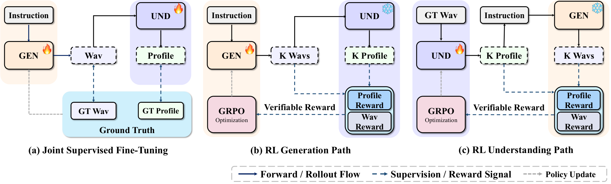
*Figure 2:CycleSpeech training framework. (a) Joint SFT initializes generation (GEN) and understanding (UND) with paired speech–profile supervision. (b,c) CycleGRPO alternately optimizes generation and understanding through reciprocal verifiable rewards.*

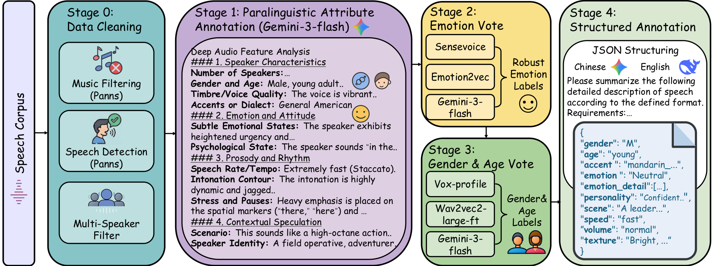
*Figure S1:Data annotation pipeline.*

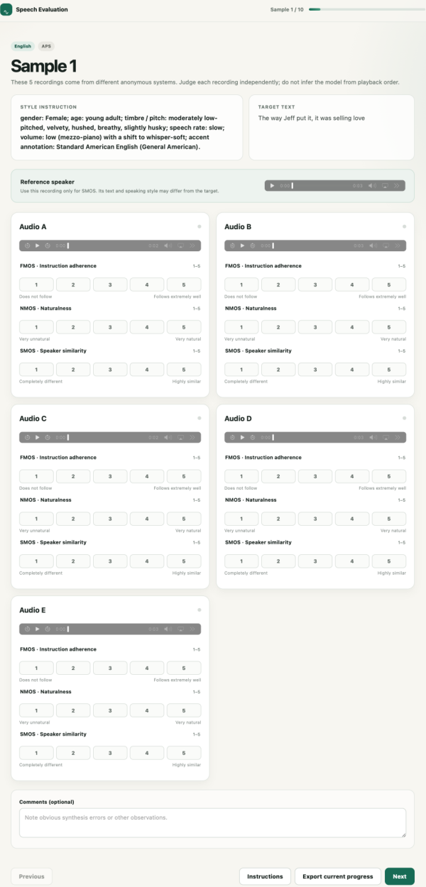
*Figure S2:Listening-test interface for rating instruction/style faithfulness, naturalness, and speaker similarity.*

---
**Usage Info**: 5180 tokens used.
**Generated at**: 2026-09-22 17:54:39

---

# 📚 P2Flow: Phoneme-aware Progressive Flow Matching for Extreme Speech Super-Resolution

🚀 URL: https://arxiv.org/html/2609.24138

## 🌏 Abstract (원문)
Generative models have recently demonstrated considerable promise in speech super-resolution (SSR). Nevertheless, the majority of existing work has concentrated on standard or versatile SSR configurations, leaving the extreme setting with severely limited spectral inputs largely unexplored. In this regime, current approaches exhibit marked performance degradation, underscoring the need for dedicated solutions. To bridge this gap, we introduce P2Flow, a phoneme-aware progressive flow matching (FM) framework designed for extreme SSR with three main strategies. First, our model leverages phonetic information to reconstruct missing spectral components. Furthermore, it employs a progressive architectural design that hierarchically restores distinct frequency regions. Finally, we incorporate post-training of the vocoder to enhance overall waveform fidelity. Extensive experiments are conducted on the TIMIT and VCTK datasets under both 1 kHz to 16 kHz and 2 kHz to 16 kHz settings, demonstrating that P2Flow yields state-of-the-art results across multiple evaluation metrics.
## 🌏 Abstract (번역)
생성 모델은 최근 음성 초해상도(SSR) 분야에서 상당한 가능성을 보여주었습니다. 그럼에도 불구하고, 기존 연구의 대부분은 표준 또는 다목적 SSR 구성에 집중되어 있었으며, 스펙트럼 입력이 심각하게 제한된 극한 환경은 거의 탐구되지 않았습니다. 이러한 환경에서 현재 접근 방식들은 현저한 성능 저하를 보이며, 전용 솔루션의 필요성을 강조합니다. 이러한 격차를 해소하기 위해, 우리는 세 가지 주요 전략을 가진 극한 SSR을 위해 설계된 음소 인식 점진적 플로우 매칭(FM) 프레임워크인 P2Flow를 소개합니다. 첫째, 우리 모델은 음성 정보를 활용하여 누락된 스펙트럼 구성 요소를 재구성합니다. 또한, 계층적으로 서로 다른 주파수 영역을 복원하는 점진적인 아키텍처 설계를 사용합니다. 마지막으로, 전체 파형 충실도를 향상시키기 위해 보코더의 후속 훈련을 통합합니다. TIMIT 및 VCTK 데이터셋에서 1 kHz에서 16 kHz 및 2 kHz에서 16 kHz 설정 모두에서 광범위한 실험이 수행되었으며, P2Flow가 여러 평가 지표에서 최첨단 결과를 산출함을 입증했습니다.

## 🔍 Methods & Results
- P2Flow는 극한 음성 초해상도(SSR)를 위한 세 가지 핵심 구성 요소로 이루어져 있습니다: 언어적 조건화를 위한 음소 인식 분류기, 광대역 재구성을 단순화하기 위한 FM의 점진적 계층적 설계, 멜-파형 재구성 오류를 줄이기 위한 보코더 후속 훈련.
- 음소 인식 분류기는 HuBERT 인코더와 선형 헤드로 구성되며, 고주파수 복원을 위한 언어적 안내를 제공하고 SSR 훈련 중에는 고정되어 프레임 수준 음소 후방 확률을 출력합니다.
- 점진적 계층적 플로우 매칭(FM)은 크게 누락된 주파수 범위를 재구성하는 문제를 해결하기 위해, 이 어려운 매핑을 점진적인 주파수 영역 모델링으로 분해합니다.
- FM 모델은 흐름 상태, 저해상도(LR) 조건, 음소 후방 확률을 연결하여 입력으로 사용하며, 세 개의 순차적 모듈(M1, M2, M3)로 구성된 몇 단계 FM을 기반으로 임베딩된 표현을 계층적으로 정제합니다.
- 각 FM 모듈 뒤에는 경량 속도 헤드(Hk)가 따라붙어 저주파수(0-2 kHz), 중주파수(2-4 kHz), 고주파수(4-8 kHz) 멜 영역에서 목표 속도를 예측합니다.
- 보코더 후속 훈련은 멜-파형 합성 시 발생하는 분포 불일치를 줄이고 파형 충실도를 향상시키기 위해, SpeechBrain HiFi-GAN 보코더를 고정된 멜 추정치에 대해 후속 훈련합니다.
- 보코더는 적대적 손실, 특징 매칭 손실, 다중 해상도 단시간 푸리에 변환(MR-STFT) 손실을 포함한 표준 GAN-보코더 목표를 사용하여 최적화됩니다.
- TIMIT 및 VCTK 데이터셋에서 1 kHz에서 16 kHz 및 2 kHz에서 16 kHz 설정으로 광범위한 실험을 수행했으며, P2Flow가 여러 평가 지표에서 최첨단 성능을 달성함을 입증했습니다.

## 🖼 Figures

*Figure 2:Overview of the proposed P2Flow framework for hr speech restoration from lr speech. Training follows three steps: (1) phoneme classifier training, (2) fm training with the other modules frozen, and (3) vocoder post-training using estimated mel-spectrograms.*

*Figure 3:Spectrogram comparison on TIMIT under the 2 kHz
→
16 kHz ssr setting. Colored boxes highlight noticeable spectral differences.*

---
**Usage Info**: 4906 tokens used.
**Generated at**: 2026-09-22 17:54:53

---

# 📚 StreamTN: A Low-Latency Streaming Chinese Text Normalization Model for Streaming TTS in Dialogue Systems

🚀 URL: https://arxiv.org/html/2609.24267

## 🌏 Abstract (원문)
Text-to-Speech (TTS) is an essential module that provides spoken responses in a spoken dialogue system (SDS) centered on a large language model (LLM). To ensure accurate TTS synthesis, responses generated by an LLM must be converted into TTS-readable formats via a Text Normalization (TN) module, imposing strict low-latency requirements in real-time SDS scenarios. Existing TN solutions are largely rule-based, rely on manual engineering, and generalize poorly to unseen patterns. Although an LLM itself can perform TN through prompt engineering, it faces key limitations: high first-token latency due to non-streaming processing, hallucination risks, and degraded intelligence or reasoning when the core LLM module is fine-tuned solely for TN. To address these challenges, we proposeStreamTN, a lightweight LLM-based Chinese streaming TN model. Built on Qwen3-0.6B, StreamTN employs a dual-track streaming framework in which input tokens and output tokens are processed on two parallel tracks, enabling low-latency real-time inference without complex prompting. Moreover, task-specific fine-tuning yields superior TN performance and fewer hallucinations than rule-based systems and general-purpose LLMs. We also introduce a TN benchmark that spans diverse text scenarios, providing a comprehensive evaluation standard for speech generation in spoken dialogue systems. Experiments demonstrate the effectiveness of StreamTN in accuracy and inference latency.
## 🌏 Abstract (번역)
텍스트 음성 변환(TTS)은 대규모 언어 모델(LLM) 중심의 음성 대화 시스템(SDS)에서 음성 응답을 제공하는 필수 모듈입니다. 정확한 TTS 합성을 보장하기 위해 LLM이 생성한 응답은 텍스트 정규화(TN) 모듈을 통해 TTS가 읽을 수 있는 형식으로 변환되어야 하며, 이는 실시간 SDS 시나리오에서 엄격한 낮은 지연 시간 요구 사항을 부과합니다. 기존 TN 솔루션은 대부분 규칙 기반이며 수동 엔지니어링에 의존하고, 보지 못한 패턴에 대한 일반화 성능이 좋지 않습니다. LLM 자체는 프롬프트 엔지니어링을 통해 TN을 수행할 수 있지만, 스트리밍 처리 방식이 아니어서 높은 첫 토큰 지연 시간, 환각 위험, 그리고 핵심 LLM 모듈이 TN만을 위해 미세 조정될 경우 지능 또는 추론 능력 저하와 같은 주요 한계에 직면합니다. 이러한 문제들을 해결하기 위해 우리는 경량 LLM 기반 중국어 스트리밍 TN 모델인 StreamTN을 제안합니다. Qwen3-0.6B를 기반으로 구축된 StreamTN은 입력 토큰과 출력 토큰이 두 개의 병렬 트랙에서 처리되는 듀얼 트랙 스트리밍 프레임워크를 사용하여 복잡한 프롬프트 없이 낮은 지연 시간의 실시간 추론을 가능하게 합니다. 또한, 작업별 미세 조정을 통해 규칙 기반 시스템 및 범용 LLM보다 우수한 TN 성능과 적은 환각을 달성합니다. 우리는 또한 음성 대화 시스템의 음성 생성을 위한 포괄적인 평가 표준을 제공하는 다양한 텍스트 시나리오를 포괄하는 TN 벤치마크를 소개합니다. 실험은 정확도 및 추론 지연 시간 측면에서 StreamTN의 효과를 입증합니다.

## 🔍 Methods & Results
- StreamTN은 계단식 음성 대화 시스템에서 상위 LLM 모듈과 하위 TTS 모듈 사이에 삽입되어 LLM 응답을 TTS가 읽을 수 있는 형식으로 변환한다.
- 기존 오프라인 TN과 달리, StreamTN은 LLM 응답을 점진적으로 처리하여 전체 응답이 완료되기 전에 정규화된 텍스트를 TTS 모듈로 전달하는 스트리밍 방식을 채택한다.
- StreamTN은 Qwen3-0.6B를 기반으로 구축되었으며, 입력 토큰과 출력 토큰이 두 개의 병렬 트랙에서 처리되는 듀얼 트랙 스트리밍 프레임워크를 사용하여 낮은 지연 시간의 실시간 추론을 가능하게 한다.
- 듀얼 트랙 구조는 원시 입력 트랙(LLM 출력)과 지연된 정규화된 텍스트 이력을 제공하는 출력 트랙으로 구성되며, 이들의 임베딩은 Transformer 백본에 공급되기 전에 요소별 덧셈으로 융합된다.
- 토큰 지연 매개변수 'd'는 지연 시간과 사용 가능한 입력 컨텍스트 간의 균형을 제어하며, 훈련 목표는 부분 입력 컨텍스트 하에서 정규화를 수행하도록 모델을 학습시키는 음의 로그 우도이다.
- 추론 시 StreamTN은 동일한 정렬을 따르며, 첫 'd'개의 원시 토큰을 받은 후 첫 번째 정규화된 토큰을 예측하고, 이후에는 이전 생성 토큰과 다음 원시 토큰을 결합하여 다음 토큰을 예측한다.
- 중국어 SDS를 위한 새로운 TN 벤치마크를 구축했으며, FlatTN의 분류를 10가지 통합 유형으로 통합하고 단순 화학 물질, 복잡한 화학 방정식, 단순 수학 공식, 복잡한 수학 방정식의 네 가지 과학 범주를 추가했다.
- 훈련 코퍼스는 DuReader의 공개 중국어 텍스트와 Qwen3-32B로 생성된 AI 샘플(과학 범주용)을 활용했으며, DeepSeek-R1-70B를 사용하여 정규화된 타겟을 생성했다.
- 훈련 데이터의 98.2%가 정의된 TN 가이드라인과 일치하는 것으로 수동 검증되었으며, 모든 1,262개의 테스트 참조는 수동으로 검사 및 수정되었다.
- 실험 결과, StreamTN은 정확도와 추론 지연 시간 측면에서 효과적임을 입증했다.

## 🖼 Figures
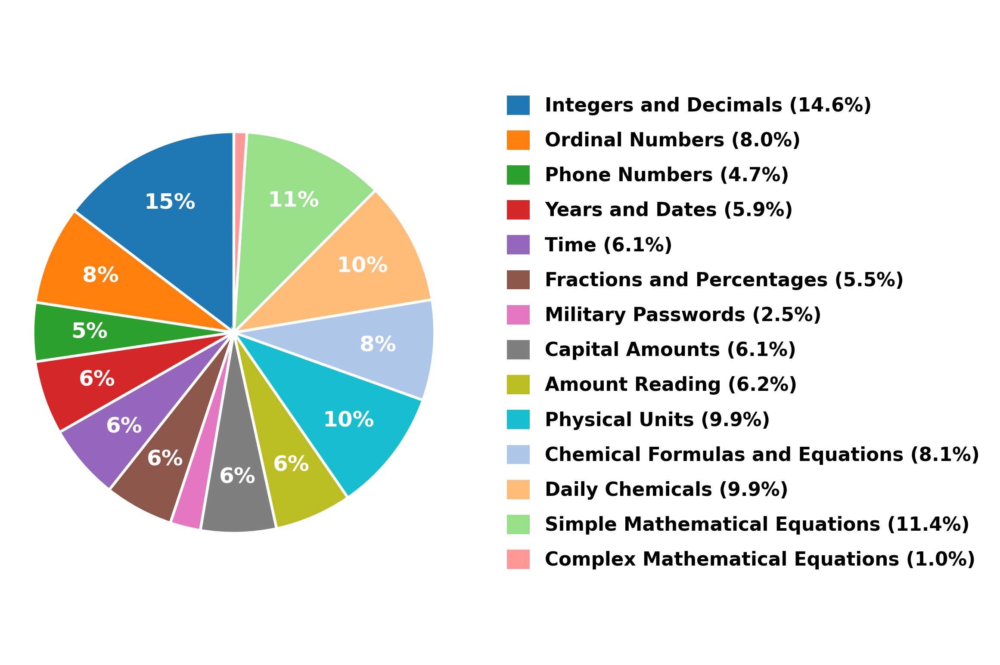
*Fig. 2:Data distribution of text normalization categories.*

---
**Usage Info**: 5003 tokens used.
**Generated at**: 2026-09-22 17:55:06

---

# 📚 Generative Learning for Ambisonic Upscaling

🚀 URL: https://arxiv.org/html/2609.23479

## 🌏 Abstract (원문)
au(au) aims to enhance the spatial resolution of sound fields by estimatinghoa(hoa) components from low-order observations. While deep learning and model-based strategies have been considered forau, both approaches exhibit significant performance degradation in realistic scenarios, where reverberant sound fields violate the directional sparsity inherent to discriminative mappings. In this work, we addressauas a generative task rather than a deterministic reconstruction, expanding generative modeling to specifically target the recovery of spatial information in reverberant speech. We investigate two dominant continuous-time generative paradigms, adapting bothsgmandfmto these complex acoustic settings. We provide an extensive numerical study comparing our methods against state-of-the-art baselines in various acoustic scenarios. Additionally, we conduct subjective listening tests to evaluate the perceived quality and spatial accuracy of the proposed generative framework across various reverberant scenarios. The studies reveal that Flow Matching consistently outperforms both its discriminative counterparts and Diffusion-based paradigms in all reverberant settings.
## 🌏 Abstract (번역)
au(Ambisonics Upscaling)는 저차 관측치로부터hoa(고차 Ambisonics) 구성 요소를 추정하여 음장의 공간 해상도를 향상시키는 것을 목표로 합니다. au를 위한 딥러닝 및 모델 기반 전략이 고려되었지만, 두 접근 방식 모두 잔향 음장이 판별 매핑에 내재된 방향성 희소성을 위반하는 현실적인 시나리오에서 상당한 성능 저하를 보입니다. 본 연구에서는 au를 결정론적 재구성이 아닌 생성 작업으로 다루며, 잔향 음성에서 공간 정보 복구를 특별히 목표로 하는 생성 모델링을 확장합니다. 우리는 두 가지 지배적인 연속 시간 생성 패러다임을 조사하고,sgm(스코어 기반 생성 모델)과fm(플로우 매칭)을 이러한 복잡한 음향 설정에 적용합니다. 우리는 다양한 음향 시나리오에서 최첨단 기준선과 우리의 방법을 비교하는 광범위한 수치 연구를 제공합니다. 또한, 다양한 잔향 시나리오에서 제안된 생성 프레임워크의 인지된 품질과 공간 정확도를 평가하기 위해 주관적인 청취 테스트를 수행합니다. 연구 결과, 플로우 매칭은 모든 잔향 설정에서 판별적 대응 모델과 확산 기반 패러다임 모두를 일관되게 능가하는 것으로 나타났습니다.

## 🔍 Methods & Results
- Ambisonics Upscaling (au)은 저차 관측치로부터 고차 HOA 표현을 재구성하는 것으로 정의되며, 이는 전통적인 방법이 '공간 흐림'을 유발하는 미결정 역 문제입니다.
- 본 논문은 au를 생성 작업으로 다루며, 특히 잔향 음성에서 공간 정보 복구를 위해 연속 시간 생성 모델(플로우 매칭 및 스코어 기반 생성 모델)을 적용하는 것을 제안합니다.
- 플로우 매칭(FM)은 시간 의존적인 벡터 필드를 가진 상미분 방정식(ODE)을 통해 분포 간의 변환을 모델링하고, 샘플 생성을 위해 이 필드를 근사화하는 DNN을 훈련합니다.
- 스코어 기반 생성 모델(SGM)은 생성 프로세스를 역시간 확률 미분 방정식(SDE)의 해로 구성하며, 샘플링을 위해 스코어 함수를 근사화하는 DNN을 훈련합니다.
- 잔향이 있는 단일 및 다중 화자 시나리오에서 제안된 FM 프레임워크를 결정론적(CTN) 및 모델 기반(PWD CS) 기준선과 비교하는 청취 테스트를 수행했습니다.
- 연구 결과, 플로우 매칭 방법은 모든 잔향 설정에서 판별적 대응 모델(CTN)과 확산 기반 패러다임(SGM) 모두를 일관되게 능가하는 것으로 나타났습니다.
- 주관적인 청취 테스트는 제안된 FM과 실제 HOA3 사이에 유의미한 지각적 차이가 없었지만(p=0.837), 경쟁 방법(CTN, PWD CS)은 눈에 띄는 아티팩트를 생성하고 현저히 낮은 점수를 받았습니다(예: PWD CS, p=0.013).

## 🖼 Figures
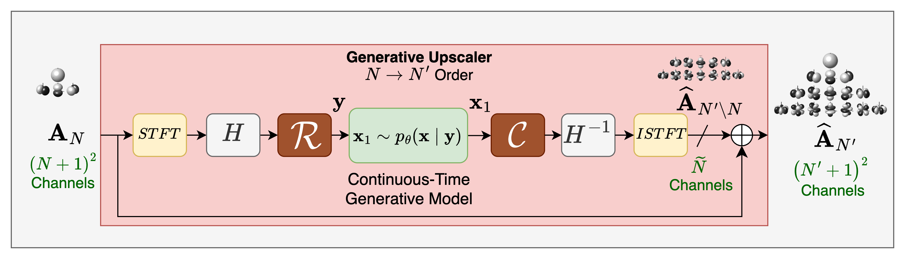
*Fig. 1:Schematic illustration of the overall architecture of the proposed generative Ambisonics upscaler.*

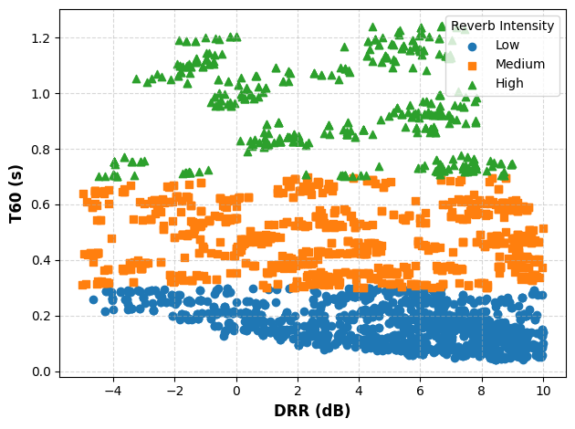
*Fig. 2:HARP evaluation data distribution*

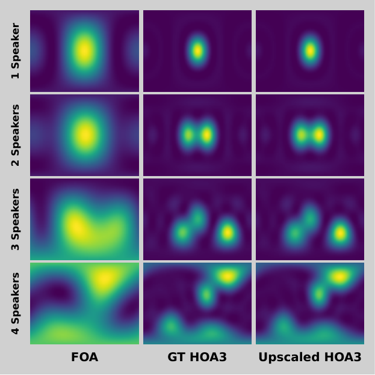
*Fig. 3:Directional energy plots over elevation (x-axis) and azimuth (y-axis). Columns: foa, ground truth hoa3 and fm upscaled hoa3. Rows correspond to the number of active sources.*

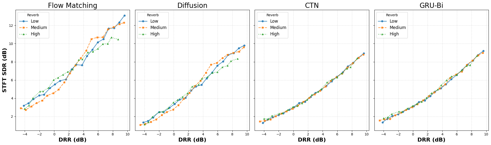
*Fig. 4:Comparative analysis of stft-sdr (dB) performance across models as a function of drr, categorized by rt levels.*

*Fig. 5:Average coherence 
𝛾
¯
𝑓
2
 versus frequency.*

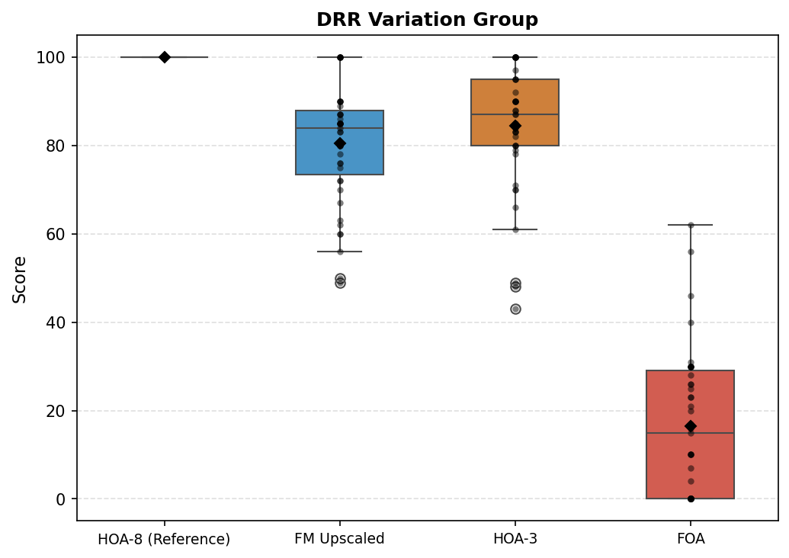
*(a)*

*(a)*

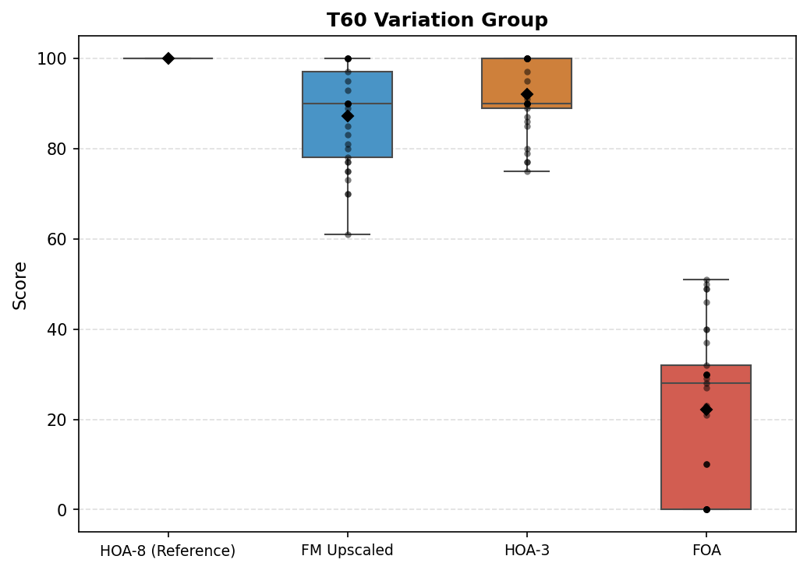
*(b)*

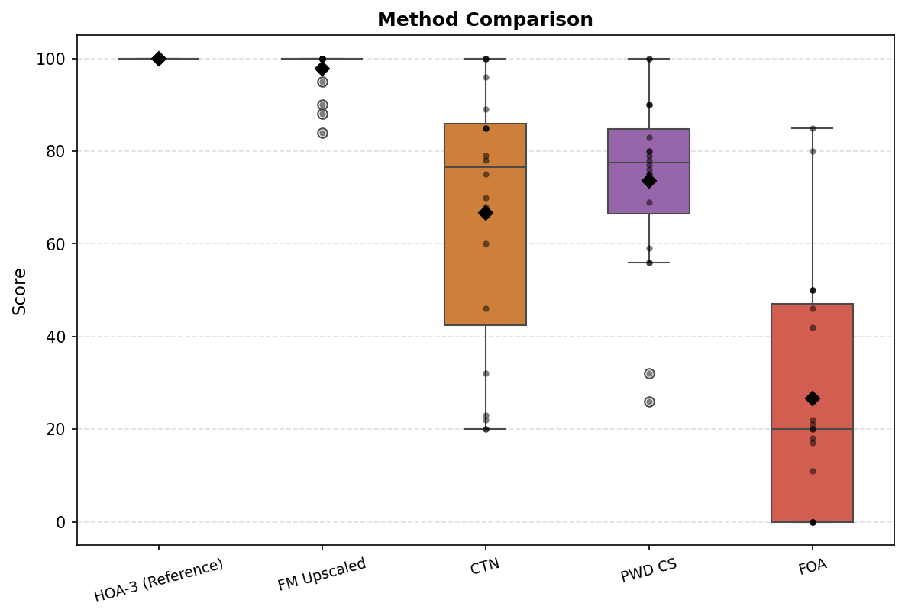
*Fig. 7:MUSHRA results for au method comparison*

---
**Usage Info**: 5764 tokens used.
**Generated at**: 2026-09-22 17:55:19

---

# 📚 Listen, Critique, and Refine: RL-Based Self-Refinement for Instruction-Following Speech Synthesis

🚀 URL: https://arxiv.org/html/2609.24163

## 🌏 Abstract (원문)
Large Audio Language Models (LALMs) can follow diverse instructions to synthesize speech in specified styles. However, complex instructions that require simultaneous control over pitch dynamics, speaking rate, and emotional tone often exceed what a single-pass generation can faithfully realize. While recent reasoning models have shown that intermediate ”thinking” tokens improve output quality, this paradigm has been confined to the text modality. In this work, we extend reasoning to the audio token space by training a LALM with reinforcement learning to reason over its own speech output. The model first generates a draft speech as a form of audio-token reasoning, critiques its own generation by reflecting on the acoustic realization in text, and then produces a refined version conditioned on both the first-pass speech and the critique, all within a single model. After RL training, the refined two-hop outputs achieve a relative improvement of 7.15% on the InstructTTSEval benchmark, demonstrating the model’s reflective ability.
## 🌏 Abstract (번역)
대규모 오디오 언어 모델(LALM)은 지정된 스타일로 음성을 합성하기 위해 다양한 지시를 따를 수 있습니다. 그러나 피치 다이내믹스, 말하기 속도 및 감정 톤에 대한 동시 제어를 요구하는 복잡한 지시는 단일 패스 생성으로는 충실하게 구현하기 어려운 경우가 많습니다. 최근 추론 모델이 중간 "사고" 토큰이 출력 품질을 향상시킨다는 것을 보여주었지만, 이 패러다임은 텍스트 양식에 국한되어 있었습니다. 본 연구에서는 LALM을 강화 학습으로 훈련시켜 자체 음성 출력에 대해 추론하도록 함으로써 추론을 오디오 토큰 공간으로 확장합니다. 모델은 먼저 오디오 토큰 추론의 한 형태로 초안 음성을 생성하고, 텍스트로 음향 실현을 반영하여 자체 생성을 비판한 다음, 첫 번째 패스 음성과 비판 모두를 조건으로 하여 개선된 버전을 단일 모델 내에서 생성합니다. RL 훈련 후, 개선된 2단계 출력은 InstructTTSEval 벤치마크에서 7.15%의 상대적 개선을 달성하여 모델의 반성적 능력을 입증합니다.

## 🔍 Methods & Results
- 본 연구는 LALM(Large Audio Language Model)을 활용하여 텍스트 내용과 자연어 스타일 지시에 따라 음성을 합성하는 2단계(two-hop) 프로세스를 제안한다.
- 2단계 프로세스는 '초안 생성(Pass 1)', '비판(Critique)', '개선(Refine)'으로 구성된다. 모델은 먼저 지시와 텍스트를 기반으로 초기 음성(v1)을 생성하고, 이를 '듣고' 음향적 불일치를 식별하는 텍스트 비판(c)을 생성한 다음, v1과 c를 조건으로 개선된 음성(v2)을 생성한다.
- 모든 세 단계는 단일 LALM에 의해 수행되며, 텍스트와 오디오를 통합된 토큰 스트림으로 처리하여 개선 단계에서 생성된 음성과 텍스트 비판 모두를 조건으로 할 수 있게 한다.
- 모델은 2단계 추론 능력을 향상시키기 위해 GRPO(Group-Relative Policy Optimization)를 사용한 강화 학습으로 훈련된다.
- 보상 함수는 개선된 음성(v2)의 스타일 준수(CLSP 점수 사용), 내용 정확도(WER 사용), 그리고 v1 대비 v2의 개선 정도(tanh 비선형성을 적용한 CLSP 점수 차이 사용)를 평가한다.
- RL 훈련 후, 개선된 2단계 출력은 InstructTTSEval 벤치마크에서 7.15%의 상대적 개선을 달성하여 모델의 반성적 능력을 입증했다.

## 🖼 Figures

*Fig. 1:Overview of the two-hop generate-critique-refine pipeline. A single LALM autoregressively generates the first-pass speech 
𝐯
1
, critiques its own output in text, and produces the refined speech 
𝐯
2
.*

---
**Usage Info**: 4664 tokens used.
**Generated at**: 2026-09-22 17:55:32

---

# 📚 Corrective Forcing: Unified Post-Training for Diffusions and Flowsin Generative Speech Enhancement

🚀 URL: https://arxiv.org/html/2609.24651

## 🌏 Abstract (원문)
Diffusion and flow models, as promising generative paradigms for speech enhancement, face a training–inference mismatch: training uses analytical path states, whereas inference recursively evaluates models on self-generated rollout states along discretized sampling trajectories. This mismatch causes prediction and discretization errors to accumulate. To address it, we introduce Corrective Forcing (CoF), a post-training paradigm that forces diffusion and flow models to learn from self-generated rollouts and correct their predictions. CoF corrects clean-speech predictions on rollout states toward the ground truth under dynamic sampling schedules, exposing the model to varying inference conditions. It further regularizes local evolution using locally corrected counterfactual transitions as references for factual transitions. By expressing model outputs through a shared clean-speech prediction parameterization, CoF applies the same post-training objective across diffusion and flow formulations. Experiments with SB-VE and OT-CFM demonstrate improvements in perceptual quality and reconstruction fidelity, together with robust performance across different numbers of sampling steps.
## 🌏 Abstract (번역)
확산 및 플로우 모델은 음성 향상을 위한 유망한 생성 패러다임으로서 훈련-추론 불일치에 직면한다: 훈련은 분석적 경로 상태를 사용하는 반면, 추론은 이산화된 샘플링 궤적을 따라 자체 생성된 롤아웃 상태에 대해 모델을 재귀적으로 평가한다. 이러한 불일치는 예측 및 이산화 오류가 축적되도록 한다. 이를 해결하기 위해 우리는 확산 및 플로우 모델이 자체 생성된 롤아웃으로부터 학습하고 예측을 수정하도록 강제하는 훈련 후 패러다임인 Corrective Forcing (CoF)을 소개한다. CoF는 동적 샘플링 스케줄 하에서 롤아웃 상태의 깨끗한 음성 예측을 실제 값(ground truth) 방향으로 수정하여 모델을 다양한 추론 조건에 노출시킨다. 또한, 사실적 전환에 대한 참조로서 국부적으로 수정된 반사실적 전환을 사용하여 국부적 진화를 정규화한다. 공유된 깨끗한 음성 예측 매개변수화를 통해 모델 출력을 표현함으로써, CoF는 확산 및 플로우 공식 전반에 걸쳐 동일한 훈련 후 목표를 적용한다. SB-VE 및 OT-CFM을 사용한 실험은 지각 품질 및 재구성 충실도 향상과 함께 다양한 샘플링 단계 수에 걸쳐 견고한 성능을 보여준다.

## 🔍 Methods & Results
- 훈련-추론 불일치 문제를 해결하기 위해 확산 및 플로우 모델을 위한 훈련 후 패러다임인 Corrective Forcing (CoF)을 제안하였다.
- CoF는 동적 샘플링 스케줄 하에서 자체 생성된 롤아웃 상태의 깨끗한 음성 예측을 실제 값으로 수정하여 다양한 추론 조건에 모델을 노출시킨다.
- CoF는 국부적으로 수정된 반사실적 전환을 사실적 전환의 참조로 사용하여 국부적 진화를 정규화한다.
- 공유된 깨끗한 음성 예측 매개변수화를 통해 CoF는 확산 및 플로우 공식 전반에 걸쳐 동일한 훈련 후 목표를 적용한다.
- SB-VE 및 OT-CFM을 사용한 실험 결과, 지각 품질 및 재구성 충실도에서 향상을 보였으며, 다양한 샘플링 단계 수에 걸쳐 견고한 성능을 입증하였다.

---
**Usage Info**: 2433 tokens used.
**Generated at**: 2026-09-22 17:55:43

---

# 📚 COT-TTS: Audio Context-Aware Text-to-Speech with Chain-of-Thought Reasoning

🚀 URL: https://arxiv.org/html/2609.22697

## 🌏 Abstract (원문)
Recently, text-to-speech systems have made significant progress in speech expressiveness and controllability. However, the speaking style of generated speech typically relies on clear user-specified instructions. In natural conversations, speaking style should be naturally inferred from the preceding conversational context. Therefore, we propose COT-TTS, a context-aware, reasoning-based text-to-speech task. Given historical conversation audio, target text, and a reference speech, the system should comprehend the conversational context, infer an explicit intermediate reasoning, and finally synthesize the target speech with the specified timbre. To support this task, we constructed a large-scale bilingual conversational speech dataset comprising 9 million training samples, including a high-quality subset of 1 million samples. We further constructed a source-disjoint benchmark with 800 human-verified samples and established strong task-specific baselines. Additionally, we developed end-to-end autoregressive models with parameter sizes of 0.6B and 1.7B, generating emotion-labeled transcripts, editable speech style inferences, and speech tokens. Experimental results show that the proposed model achieves performance comparable to large-scale baseline systems with significantly fewer parameters. At the same time, the model performs well in terms of duration consistency and emotional consistency, and can generate appropriate emotional, stress, and rhythmic variations based on the conversational context. To facilitate future research, we will publicly release the data construction pipeline, dataset, trained models, and related resources. The demo page and additional resources are available athttps://luckybian.github.io/COT-TTS.
## 🌏 Abstract (번역)
최근 텍스트 음성 변환(TTS) 시스템은 음성 표현력과 제어 가능성 면에서 상당한 발전을 이루었습니다. 그러나 생성된 음성의 말하기 스타일은 일반적으로 사용자가 명확하게 지정한 지침에 의존합니다. 자연스러운 대화에서는 선행 대화 맥락에서 말하기 스타일이 자연스럽게 추론되어야 합니다. 따라서 우리는 맥락 인지 및 추론 기반 텍스트 음성 변환(COT-TTS) 작업을 제안합니다. 이 시스템은 과거 대화 오디오, 목표 텍스트 및 참조 음성이 주어졌을 때, 대화 맥락을 이해하고, 명시적인 중간 추론을 도출하며, 최종적으로 지정된 음색으로 목표 음성을 합성해야 합니다. 이 작업을 지원하기 위해 우리는 100만 개의 고품질 샘플을 포함하여 900만 개의 훈련 샘플로 구성된 대규모 이중 언어 대화 음성 데이터셋을 구축했습니다. 또한 800개의 사람이 검증한 샘플로 구성된 소스 분리 벤치마크를 구축하고 강력한 작업별 기준선을 설정했습니다. 추가적으로, 우리는 0.6B 및 1.7B 매개변수 크기를 가진 종단 간 자기회귀 모델을 개발하여 감정 레이블이 지정된 전사, 편집 가능한 음성 스타일 추론 및 음성 토큰을 생성합니다. 실험 결과는 제안된 모델이 훨씬 적은 매개변수로 대규모 기준 시스템과 유사한 성능을 달성함을 보여줍니다. 동시에 이 모델은 지속 시간 일관성 및 감정 일관성 측면에서 우수한 성능을 보이며, 대화 맥락에 기반하여 적절한 감정, 강세 및 리듬 변화를 생성할 수 있습니다. 향후 연구를 촉진하기 위해 데이터 구축 파이프라인, 데이터셋, 훈련된 모델 및 관련 리소스를 공개할 예정입니다. 데모 페이지 및 추가 리소스는 https://luckybian.github.io/COT-TTS에서 확인할 수 있습니다.

## 🔍 Methods & Results
- COT-TTS는 오디오 맥락 인지 추론 TTS 작업으로 정의되며, 과거 대화 오디오, 목표 텍스트, 참조 음성을 입력으로 받아 감정 태그가 지정된 과거 전사, 추론 분석, 목표 음성을 생성합니다.
- 추론 분석(C^)은 언어 행위, 장면 의미론, 인지 및 동기, 예상되는 의사소통 결과, 감정 궤적의 다섯 가지 차원으로 구성되며, 명시적인 말하기 속성(지속 시간, 감정 표현 강도)도 포함합니다.
- 모델은 Qwen3 백본(0.6B 및 1.7B 매개변수)을 사용하여 구현되었으며, Spark-TTS의 BiCodec을 통해 음성을 고정 길이 전역 토큰 블록과 단일 시변 의미 토큰 시퀀스로 인코딩하여 통합 자기회귀 모델링을 가능하게 합니다.
- BiCodec은 화자 특성을 포함하는 32개의 전역 토큰과 언어적 내용을 나타내는 의미 토큰 시퀀스를 생성합니다. 과거 대화 오디오는 하나의 전역 토큰 블록과 모든 과거 발화의 의미 시퀀스를 연결하여 표현됩니다.
- 참조 음성(r^a)은 목표 화자 음색을 제공하기 위해 32개의 전역 토큰(g_r)만 사용되며, 목표 음성(x^a)은 전역 및 의미 토큰을 모두 자기회귀적으로 예측합니다.
- 최종 파형 재구성은 기본적으로 참조 음성에서 추출한 전역 토큰(g_r)과 예측된 목표 의미 토큰(s_x)을 결합하여 수행됩니다.
- 모델 훈련은 VeOmni 프레임워크를 사용하여 세 단계로 진행됩니다: 1단계는 ASR 및 TTS 작업을 통해 텍스트-음성 양식 정렬을 설정하고, 2단계는 900만 개의 훈련 샘플과 보조 작업을 사용하여 주요 COT-TTS 작업을 도입하며, 3단계는 100만 개의 고품질 COT-TTS 및 TTS 샘플을 사용하여 품질 지향적 정제를 수행합니다.
- 추론 시, 모델은 감정 태그가 지정된 과거 전사(T^)와 말하기 방식 추론(C^)을 먼저 생성하며, 추론은 음성 합성 전에 검사하거나 편집할 수 있습니다.
- 제안된 모델은 대규모 기준 시스템보다 훨씬 적은 매개변수로 유사한 성능을 달성하며, 지속 시간 및 감정 일관성 측면에서 우수하고, 대화 맥락에 기반하여 적절한 감정, 강세, 리듬 변화를 생성할 수 있습니다.
- 연구를 촉진하기 위해 대규모 이중 언어 대화 음성 데이터셋(900만 훈련 샘플, 100만 고품질 샘플), 소스 분리 벤치마크(800개 인간 검증 샘플), 데이터 구축 파이프라인, 훈련된 모델 및 관련 리소스를 공개할 예정입니다.

## 🖼 Figures
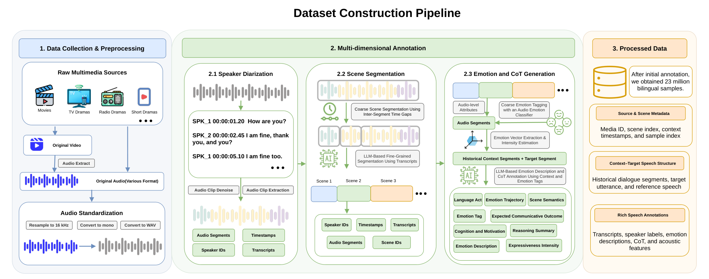
*Fig. 1:Overview of the COT-TTS data construction framework. The figure illustrates data collection and preprocessing, multi-dimensional annotation, and the resulting structured sample format for context-aware reasoning TTS.*

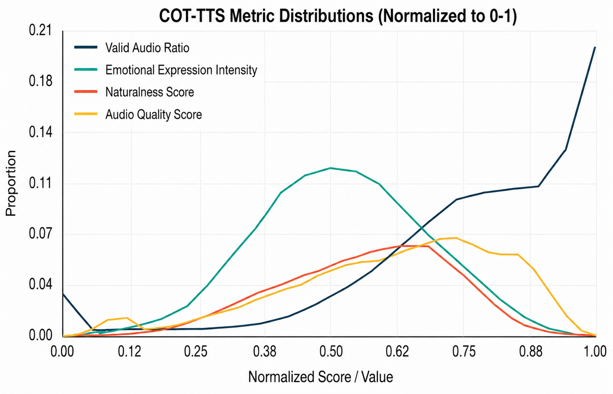
*Fig. 2:Distributions of the normalized audio quality score, naturalness score, target-audio effective-speech ratio, and emotional expression intensity over 50K randomly sampled examples.*

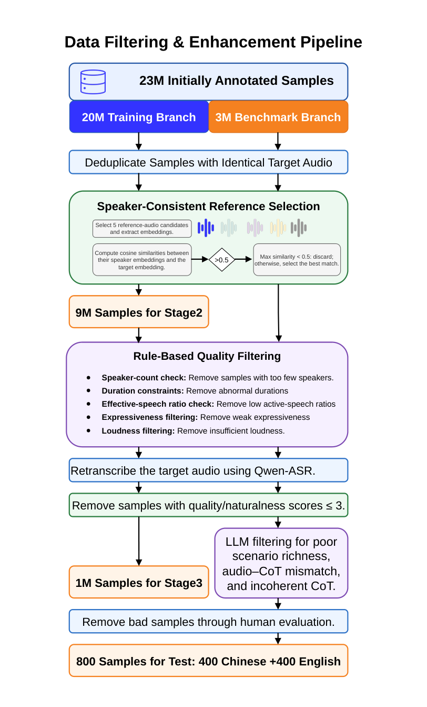
*Fig. 3:Overview of the COT-TTS data filtering and enhancement pipeline, including deduplication, reference selection, quality screening, ASR retranscription, LLM-based filtering, and human evaluation.*

![Fig. 4:Overview of the end-to-end CoT-guided autoregressive model. Historical dialogue audio, target text, and reference speech are encoded into a unified token sequence. The model sequentially generates an emotion-tagged historical transcript, multi-dimensional CoT reasoning, and target speech tokens. The intermediate CoT can be inspected and edited before speech synthesis. For waveform reconstruction, the predicted semantic tokens are combined with either the reference or predicted global tokens.](../images/2026-09-22/2609.22697/2609.22697_fig3.png)
*Fig. 4:Overview of the end-to-end CoT-guided autoregressive model. Historical dialogue audio, target text, and reference speech are encoded into a unified token sequence. The model sequentially generates an emotion-tagged historical transcript, multi-dimensional CoT reasoning, and target speech tokens. The intermediate CoT can be inspected and edited before speech synthesis. For waveform reconstruction, the predicted semantic tokens are combined with either the reference or predicted global tokens.*

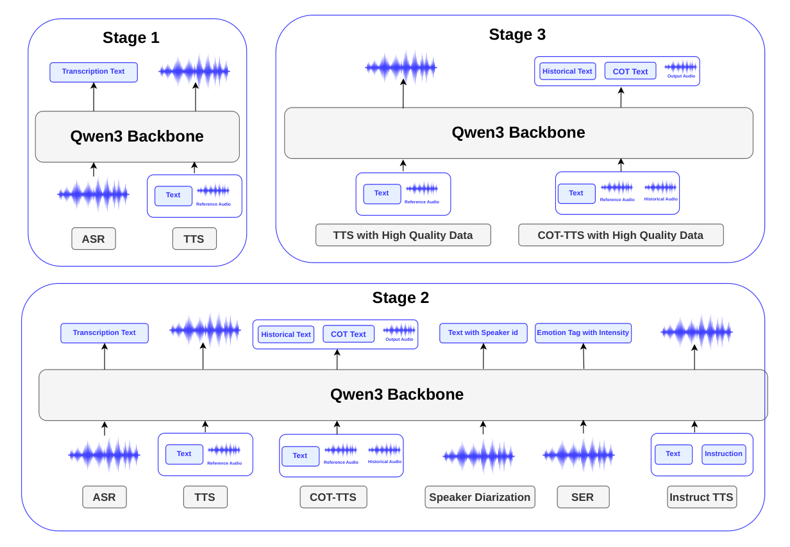
*Fig. 5:Overview of the three-stage training strategy for our end-to-end autoregressive models for COT-TTS. The figure summarizes the training data, model inputs, and outputs at each stage.*

![Fig. 6:Overview of the three cascaded baseline architectures. (a) The three-stage ASR/diarization–LLM–TTS pipeline first converts historical dialogue audio into text, then infers the speaking manner with an LLM, and finally synthesizes the target speech using a controllable TTS model. (b) The two-stage AudioLLM–TTS pipeline directly analyzes the historical audio with an AudioLLM and uses the inferred speaking manner to control downstream TTS. (c) The two-stage AudioLLM–VC pipeline directly generates an intermediate target speech with an AudioLLM and subsequently applies voice conversion to condition the output on the reference speaker.](../images/2026-09-22/2609.22697/2609.22697_fig5.png)
*Fig. 6:Overview of the three cascaded baseline architectures. (a) The three-stage ASR/diarization–LLM–TTS pipeline first converts historical dialogue audio into text, then infers the speaking manner with an LLM, and finally synthesizes the target speech using a controllable TTS model. (b) The two-stage AudioLLM–TTS pipeline directly analyzes the historical audio with an AudioLLM and uses the inferred speaking manner to control downstream TTS. (c) The two-stage AudioLLM–VC pipeline directly generates an intermediate target speech with an AudioLLM and subsequently applies voice conversion to condition the output on the reference speaker.*

---
**Usage Info**: 4964 tokens used.
**Generated at**: 2026-09-22 17:55:55

---

# 📚 HaikuS2S: A Cascaded System For Responding In Verse

🚀 URL: https://arxiv.org/html/2609.23951

## 🌏 Abstract (원문)
Neural TTS and prosody modeling have improved expressive speech synthesis, but generating structured poetic speech like haiku is still difficult. Standard TTS often fails to reproduce poetic rhythm, line breaks, or emotional nuances. Prosody transfer methods enable expressive speech via learned embeddings[16], and poetry TTS systems can capture verse intonation[7]. Emotion-aware models such as emotion2vec further enhance expressiveness[10]. Yet, existing approaches ignore haiku-specific constraints like the 5‑7‑5 syllable structure and line-ending pauses. We address this with HaikuS2S, a cascaded system that integrates ASR, LLM-based haiku generation, and TTS fine-tuning on prose and custom haiku datasets, aiming for accurate prosody, rhythm, and expressive naturalness.The motivation for focusing specifically on haiku generation stems from the inherent structure of haiku, which provides clear, enforceable guidelines for TTS systems. Unlike free-verse poetry, where rhythm and pauses are more abstract and subjective, haiku offers a concrete framework that can be directly modeled and learned. This makes haiku an ideal test case for exploring how well TTS can adapt to highly structured poetry. Moreover, a cascaded system gave us more fine-grained control to enforce these constraints versus an end-to-end system. The 5-7-5 format of a haiku provides an easy pattern for a TTS to identify; therefore, this work explores how varying domain specificity in training data impacts TTS performance on haiku pronunciation. This study investigates whether a generic poetry dataset is sufficient to capture haiku recitation. Our work builds on the intersection of expressive prosody control, cascaded systems, and domain-specific fine-tuning, offering a new approach to creating expressive and accurate synthetic speech for structured poetic forms. Our contributions also include making our final system model and training and testing data publicly available via HuggingFace111https://huggingface.co/HaikuS2S.For HaikuS2S to succeed in haiku performance, we want it to correctly capture the prosody of a given haiku. This includes pausing on line breaks and correctly pausing, stopping, or changing tone on different punctuation marks. We also ensure our LLM outputs a valid 5-7-5 haiku.
## 🌏 Abstract (번역)
신경망 TTS 및 운율 모델링은 표현력이 풍부한 음성 합성을 개선했지만, 하이쿠와 같은 구조화된 시적 음성을 생성하는 것은 여전히 어렵습니다. 표준 TTS는 시적 리듬, 행 구분 또는 감정적 뉘앙스를 재현하는 데 종종 실패합니다. 운율 전이 방법은 학습된 임베딩을 통해 표현력이 풍부한 음성을 가능하게 하며[16], 시 TTS 시스템은 운율 억양을 포착할 수 있습니다[7]. emotion2vec과 같은 감정 인식 모델은 표현력을 더욱 향상시킵니다[10]. 그러나 기존 접근 방식은 5-7-5 음절 구조 및 행 끝 일시 정지와 같은 하이쿠 고유의 제약 조건을 무시합니다. 우리는 ASR, LLM 기반 하이쿠 생성, 그리고 산문 및 맞춤형 하이쿠 데이터셋에 대한 TTS 미세 조정을 통합한 계단식 시스템인 HaikuS2S로 이 문제를 해결하며, 정확한 운율, 리듬 및 표현의 자연스러움을 목표로 합니다.하이쿠 생성에 특별히 초점을 맞추는 동기는 하이쿠의 본질적인 구조에서 비롯됩니다. 이는 TTS 시스템에 명확하고 강제 가능한 지침을 제공합니다. 리듬과 일시 정지가 더 추상적이고 주관적인 자유시와 달리, 하이쿠는 직접 모델링하고 학습할 수 있는 구체적인 프레임워크를 제공합니다. 이는 하이쿠를 TTS가 고도로 구조화된 시에 얼마나 잘 적응할 수 있는지 탐색하기 위한 이상적인 테스트 사례로 만듭니다. 또한, 계단식 시스템은 종단 간 시스템에 비해 이러한 제약 조건을 적용하는 데 더 세밀한 제어가 가능했습니다. 하이쿠의 5-7-5 형식은 TTS가 식별하기 쉬운 패턴을 제공하므로, 이 연구는 훈련 데이터의 도메인 특이성 변화가 하이쿠 발음의 TTS 성능에 미치는 영향을 탐구합니다. 이 연구는 일반적인 시 데이터셋이 하이쿠 낭송을 포착하기에 충분한지 조사합니다. 우리의 작업은 표현력이 풍부한 운율 제어, 계단식 시스템, 그리고 도메인별 미세 조정의 교차점에 기반을 두며, 구조화된 시적 형태를 위한 표현력이 풍부하고 정확한 합성 음성을 생성하는 새로운 접근 방식을 제공합니다. 우리의 기여에는 최종 시스템 모델과 훈련 및 테스트 데이터를 HuggingFace111https://huggingface.co/HaikuS2S를 통해 공개적으로 제공하는 것도 포함됩니다.HaikuS2S가 하이쿠 성능에서 성공하려면 주어진 하이쿠의 운율을 올바르게 포착해야 합니다. 여기에는 행 구분에서 일시 정지하고, 다양한 구두점에서 올바르게 일시 정지하거나 멈추거나 톤을 변경하는 것이 포함됩니다. 또한 LLM이 유효한 5-7-5 하이쿠를 출력하도록 보장합니다.

## 🔍 Methods & Results
- HaikuS2S는 단일 화자 계단식 시스템으로 설계되었으며, ASR 모델로 ESPnet/owsm_v4_base_10M, LLM으로 microsoft/Phi-3mini-4k-instruct, TTS 모델로 kan-bayashi/vctk_multi_spk_vits를 사용합니다.
- LLM 프롬프트는 사용자에게 5-7-5 음절 패턴의 세 줄 영어 하이쿠를 정확히 하나만 응답하도록 지시하며, 제목, 서문, 번호 매김 없이 사용자의 말에 반영하거나 응답하도록 합니다.
- TTS 미세 조정은 두 단계로 진행됩니다: 1단계는 `mythicinfinity/libritts_r` 데이터셋으로 일반적인 시 낭독의 운율, 억양, 자연스러움을 개선하는 '시 미세 조정'입니다.
- 2단계는 맞춤형 하이쿠 데이터셋으로 5-7-5 음절 구조 및 행 끝 일시 정지와 같은 하이쿠 특정 기능을 강화하는 '하이쿠 미세 조정'입니다.
- 2단계 하이쿠 미세 조정은 하이쿠 낭독의 정확성과 음조를 위한 초특정 미세 조정을 수행하며, 엄격한 시적 형식 강제와 운율 인식 TTS 미세 조정을 계단식 생성 파이프라인에 결합한 선행 연구와 차별화됩니다.
- HaikuS2S는 LLM과 TTS 단계 사이에 G2P(음소-음소 변환) 유효성 검사를 통해 올바른 5-7-5 하이쿠 형식을 보장하며, 유효하지 않은 경우 LLM이 하이쿠를 재생성하도록 프롬프트합니다.
- 1단계와 2단계(기준선 제외)에서 새로운 줄을 나타내는 특수 토큰 `[\n]`을 도입하여 더 나은 운율 제어와 자연스러운 낭송을 모방한 적절한 길이의 일시 정지를 학습하도록 합니다.
- 시스템은 Gradio를 사용하여 T4 GPU에 배포됩니다.

## 🖼 Figures
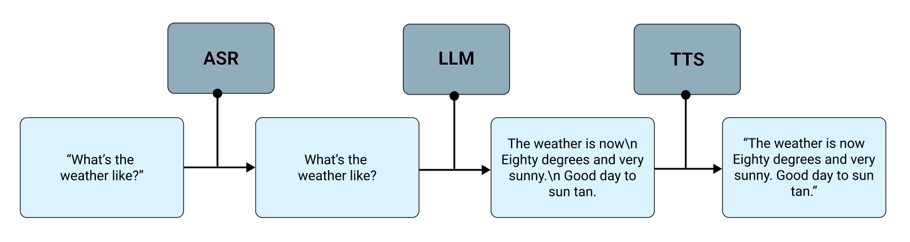
*Figure 1:Block diagram showing our cascaded haiku spoken dialog system deployed in ESPnet-SDS. Displays example user query and example haiku response.*

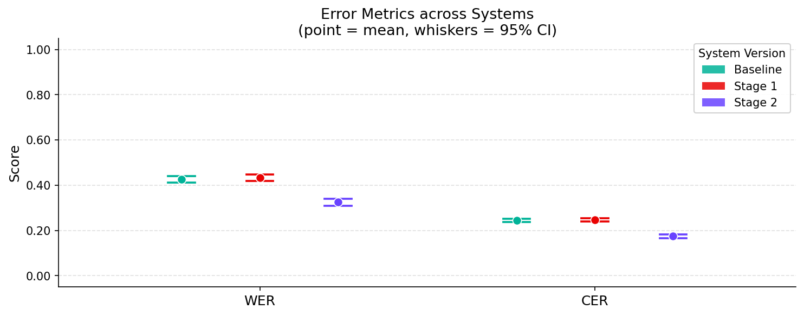
*Figure 2:Plots displaying word and character error rates across HaikuS2S stages. A lower score indicates greater correctness.*

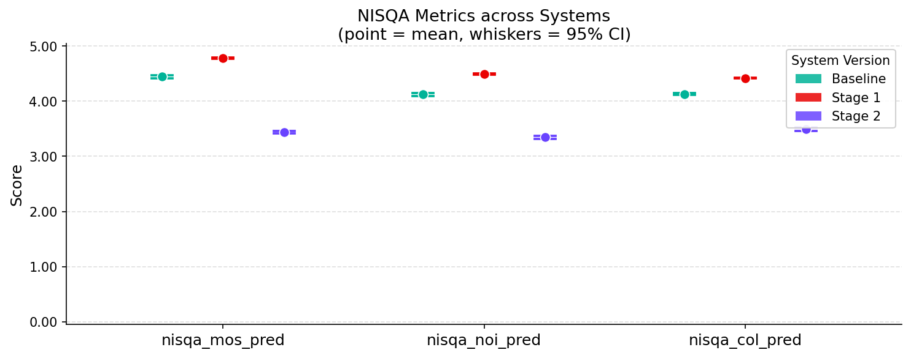
*Figure 3:Plots displaying NISQA metrics across HaikuS2S stages. A higher score indicates more natural-sounding speech.*

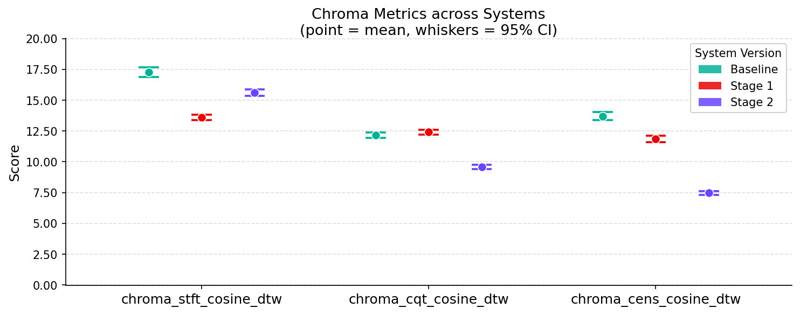
*Figure 4:Plots displaying chroma metrics across HaikuS2S stages. A lower score indicates more similarity with the golden audios.*

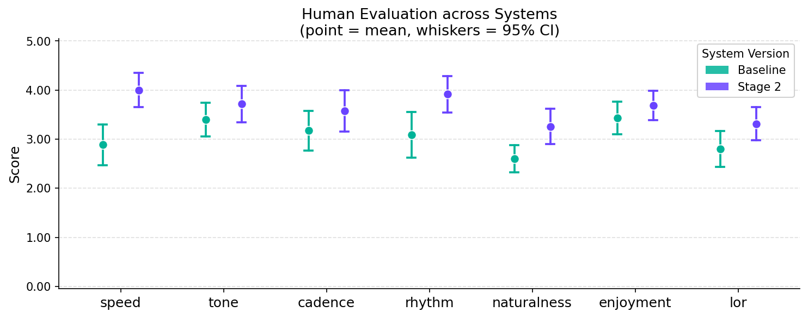
*Figure 5:Plots displaying human evaluation across HaikuS2S stages. A higher score indicates higher preference of system.*

---
**Usage Info**: 3383 tokens used.
**Generated at**: 2026-09-22 17:56:05

---

# 📚 MORPHO-VITS: VARIATIONAL INFERENCE WITH MORPHOLOGICAL MODELING FOR END-TO-END SPEECH SYNTHESIS OF A TONAL BANTU LANGUAGE

🚀 URL: https://arxiv.org/html/2609.24310

## 🌏 Abstract (원문)
Text-to-speech models for Bantu tonal languages are challenged by a tonal system that is rooted in both the lexis (i.e., the inventory of words, stems, and affixes) and the grammar (i.e., morpho-syntax). To complicate matters, the standard writing systems of these languages often omit tone markings and syllable duration information, which must be disambiguated by the reader based on context. Motivated by linguistic descriptions of Bantu language tone systems, we propose an end-to-end text-to-speech model that augments the text encoding mechanism with a morpho-syntactic prior. We replace the standard phoneme encoder in the VITS architecture with a morpheme sequence encoder and a phoneme-to-morpheme attention network. We posit that, by using this explicit morphological modeling, we can capture the information required to produce the correct tone. Experiments conducted on the Kinyarwanda language, a tonal and morphologically complex Bantu language, reveal substantial TTS improvement from this morphological modeling. Specifically, the proposed method significantly improves the naturalness, intonation, and intelligibility of the produced synthetic voices.
## 🌏 Abstract (번역)
반투어 계열 성조 언어의 텍스트 음성 변환(TTS) 모델은 어휘(즉, 단어, 어간, 접사의 목록)와 문법(즉, 형태-통사론) 모두에 뿌리를 둔 성조 체계로 인해 어려움을 겪습니다. 더욱이, 이들 언어의 표준 표기법은 종종 성조 표시와 음절 길이 정보를 생략하여 독자가 문맥에 따라 의미를 파악해야 합니다. 반투어 성조 체계에 대한 언어학적 설명을 바탕으로, 우리는 형태-통사적 사전 정보를 텍스트 인코딩 메커니즘에 추가하는 종단 간 텍스트 음성 변환 모델을 제안합니다. VITS 아키텍처의 표준 음소 인코더를 형태소 시퀀스 인코더와 음소-형태소 어텐션 네트워크로 대체합니다. 우리는 이러한 명시적인 형태학적 모델링을 통해 올바른 성조를 생성하는 데 필요한 정보를 포착할 수 있다고 가정합니다. 성조가 있고 형태학적으로 복잡한 반투어인 키냐르완다어에 대한 실험 결과, 이러한 형태학적 모델링을 통해 TTS 성능이 크게 향상됨을 확인했습니다. 특히, 제안된 방법은 합성 음성의 자연스러움, 억양 및 명료도를 현저히 개선합니다.

## 🔍 Methods & Results
- 제안된 모델은 VITS 아키텍처를 기반으로 하며, 조건부 변이형 오토인코더(CVAE)를 사용하여 음성 파형을 생성합니다.
- 기존 VITS의 음소 인코더를 형태소 시퀀스 인코더와 음소-형태소 교차 어텐션 네트워크로 대체하여 형태-통사적 정보를 통합합니다.
- 입력 텍스트는 음소 임베딩을 위해 음절 토크나이저로 처리되고, 단어의 형태학적 구조를 포착하기 위해 형태소 분석기를 통해 형태소 시퀀스로 분할됩니다.
- 양방향 음소-형태소 교차 인코더 레이어를 도입하여 음소와 형태소 간의 교차 어텐션을 계산하며, 이는 상대적 교차 위치 임베딩과 동일 토큰/단어 지표를 포함합니다.
- 키냐르완다어에 대한 실험 결과, 형태학적 모델링을 통해 합성 음성의 자연스러움, 억양, 명료도가 크게 향상되었습니다.

---
**Usage Info**: 3060 tokens used.
**Generated at**: 2026-09-22 17:56:13

---

# 📚 TTS-Guard: Black-Box Ownership Verification of Text-to-Speech Models via Adaptive Adversarial Speaker-Pair Fingerprints

🚀 URL: https://arxiv.org/html/2609.23729

## 🌏 Abstract (원문)
The rapid maturation of zero-shot Text-to-Speech (TTS) models has turned high-quality voice cloning into a widely available capability, raising acute concerns over unauthorised replication, fine-tuning and resale of proprietary speech models. Yet ownership verification for TTS remains largely open: speech is a continuous waveform whose perturbations are easily destroyed by routine signal processing, and the human auditory system imposes a much tighter perceptual budget than vision. We presentTTS-Guard, a black-box ownership verification framework for TTS models built onadversarial speaker-pair fingerprints. TTS-Guard(i) selects key speaker pairs in adualembedding space for architecture-agnostic stealth;(ii) optimises a perturbation through anadaptive curriculumof shadow models covering fine-tuning, pruning, quantisation and distillation; and (iii) aggregates black-box queries into a calibratedVerification Confidence Score. On five mainstream TTS systems, TTS-Guard reaches an average Fingerprint Success Rate of96.4%96.4\%at a False Positive Rate of5.8%5.8\%, while preserving intelligibility and naturalness. The fingerprint remains effective against ten audio attacks, six model modifications, and two state-of-the-art adversarial purifiers.
## 🌏 Abstract (번역)
제로샷 음성 합성(TTS) 모델의 급속한 발전은 고품질 음성 복제를 널리 사용 가능한 기능으로 만들었으며, 이는 독점 음성 모델의 무단 복제, 미세 조정 및 재판매에 대한 심각한 우려를 낳고 있습니다. 그러나 TTS에 대한 소유권 검증은 여전히 미해결 과제로 남아 있습니다. 음성은 연속적인 파형으로, 그 교란은 일상적인 신호 처리로 쉽게 파괴될 수 있으며, 인간의 청각 시스템은 시각보다 훨씬 더 엄격한 지각 예산을 요구합니다. 본 논문에서는 적대적 화자 쌍 지문을 기반으로 하는 TTS 모델을 위한 블랙박스 소유권 검증 프레임워크인 TTS-Guard를 제시합니다. TTS-Guard는 (i) 아키텍처에 구애받지 않는 스텔스를 위해 이중 임베딩 공간에서 핵심 화자 쌍을 선택하고, (ii) 미세 조정, 가지치기, 양자화 및 증류를 포함하는 섀도우 모델의 적응형 커리큘럼을 통해 교란을 최적화하며, (iii) 블랙박스 쿼리를 보정된 검증 신뢰도 점수로 집계합니다. 5가지 주류 TTS 시스템에서 TTS-Guard는 5.8%의 오탐률에서 평균 96.4%의 지문 성공률을 달성하며, 명료도와 자연스러움을 유지합니다. 이 지문은 10가지 오디오 공격, 6가지 모델 수정 및 2가지 최첨단 적대적 정화기에 대해서도 효과적입니다.

## 🔍 Methods & Results
- TTS-Guard는 무단 복제, 미세 조정 및 재판매로부터 TTS 모델의 소유권을 검증하기 위한 블랙박스 프레임워크를 제안한다.
- 방어자는 보호된 모델에 대한 화이트박스 접근 권한을 가지며, 의심스러운 시스템에는 블랙박스 API를 통해서만 상호작용할 수 있다.
- 이중 임베딩 공간(Resemblyzer 및 ECAPA)에서 핵심 화자 쌍을 선택하여 아키텍처에 구애받지 않는 스텔스를 달성하고, 유클리드 선택이 코사인 선택보다 높은 지문 성공률을 보였다.
- 미세 조정, 가지치기, 양자화, 증류를 포함하는 섀도우 모델의 적응형 커리큘럼을 통해 교란을 최적화하여 다양한 파생 모델에 대한 강건성을 확보한다.
- 공격 목표는 교란된 샘플을 섀도우 모델에서 목표 화자 임베딩으로 끌어당기고, 디코이 모델에서는 비목표 화자 임베딩에서 멀어지게 하는 두 가지 상보적인 항으로 구성된다.
- 지각 품질 유지를 위해 L2 크기 페널티, SNR 정규화 장치, 심리 음향 주파수 마스킹 항을 포함하는 품질 목표를 사용한다.
- 검증 신뢰도 점수(VCS)는 지문이 찍힌 클립과 무작위 텍스트 프롬프트를 사용하여 합성된 파형을 얻고, 이진 결과를 단측 이항 테스트로 집계하여 소유권을 선언한다.
- TTS-Guard는 5가지 주류 TTS 시스템에서 5.8%의 오탐률(False Positive Rate)에서 평균 96.4%의 지문 성공률(Fingerprint Success Rate)을 달성하며, 명료도와 자연스러움을 유지한다.
- 이 지문은 10가지 오디오 공격, 6가지 모델 수정 및 2가지 최첨단 적대적 정화기(De-AntiFake, SafeEar)에 대해서도 효과적인 것으로 입증되었다.

## 🖼 Figures
![Figure 1:TTS-Guard pipeline. (1) Dual-space KSP selection identifies a source/target speaker pair 
(
𝑆
𝑥
,
𝑆
𝑦
)
 that is acoustically close in both Resemblyzer and ECAPA spaces. (2) Adaptive Curriculum Shadow Optimisation generates the perturbation 
𝛿
𝑥
 under an evolving ensemble that progressively introduces LoRA, pruning, quantisation and distillation derivatives. (3) Black-box verification feeds 
𝑥
+
𝛿
𝑥
 into the suspect model, synthesises speech under a random text prompt, and aggregates VCS p-values across 
𝐾
 queries.](../images/2026-09-22/2609.23729/2609.23729_fig0.png)
*Figure 1:TTS-Guard pipeline. (1) Dual-space KSP selection identifies a source/target speaker pair 
(
𝑆
𝑥
,
𝑆
𝑦
)
 that is acoustically close in both Resemblyzer and ECAPA spaces. (2) Adaptive Curriculum Shadow Optimisation generates the perturbation 
𝛿
𝑥
 under an evolving ensemble that progressively introduces LoRA, pruning, quantisation and distillation derivatives. (3) Black-box verification feeds 
𝑥
+
𝛿
𝑥
 into the suspect model, synthesises speech under a random text prompt, and aggregates VCS p-values across 
𝐾
 queries.*

---
**Usage Info**: 4115 tokens used.
**Generated at**: 2026-09-22 17:56:22

---

