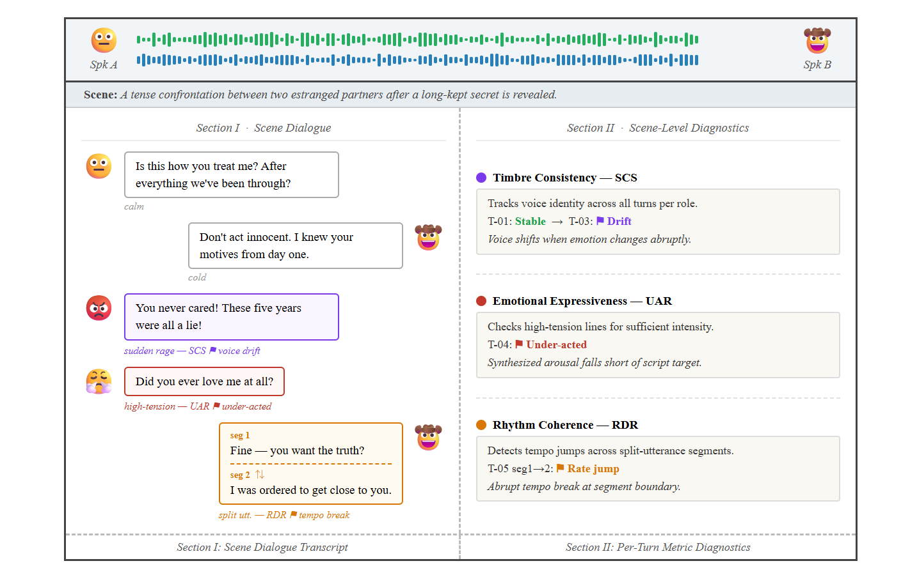
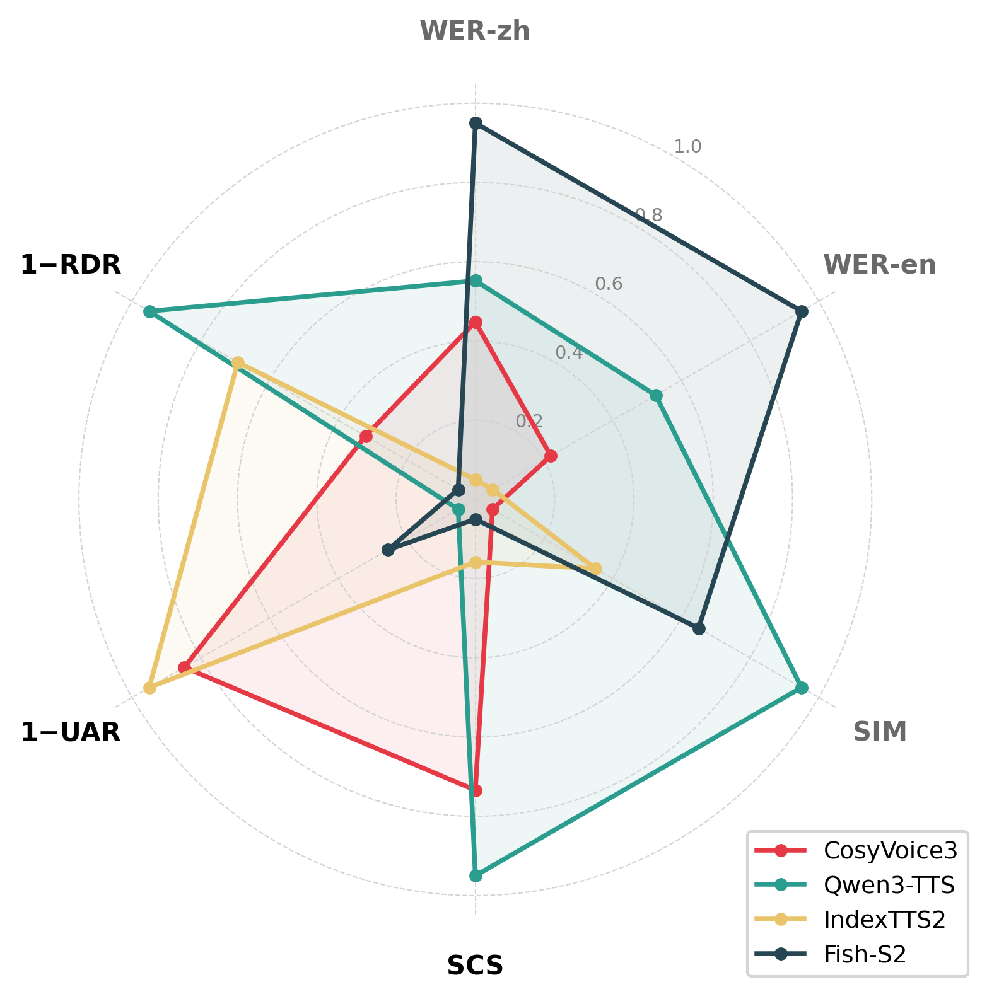
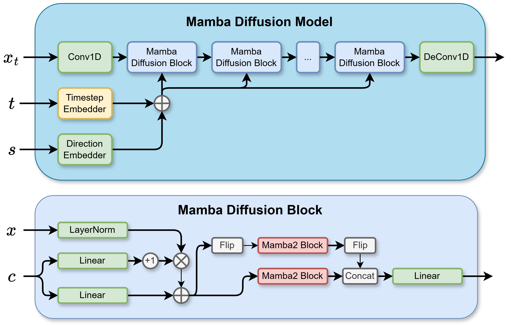
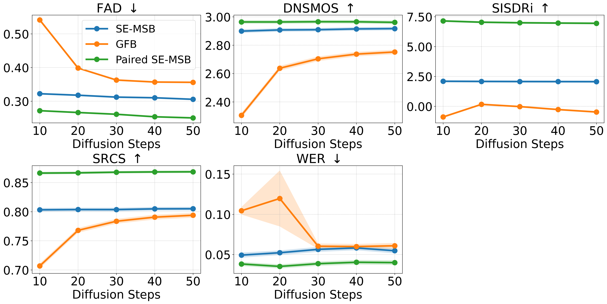
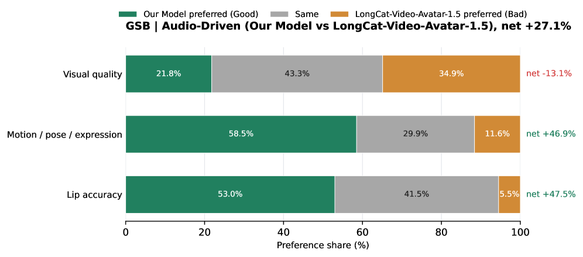
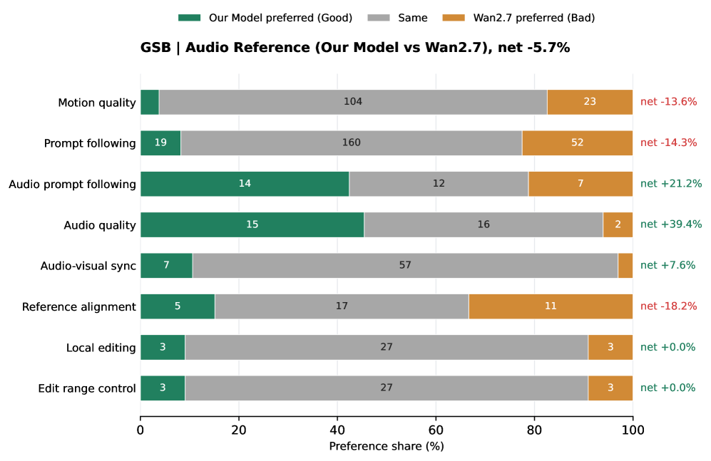
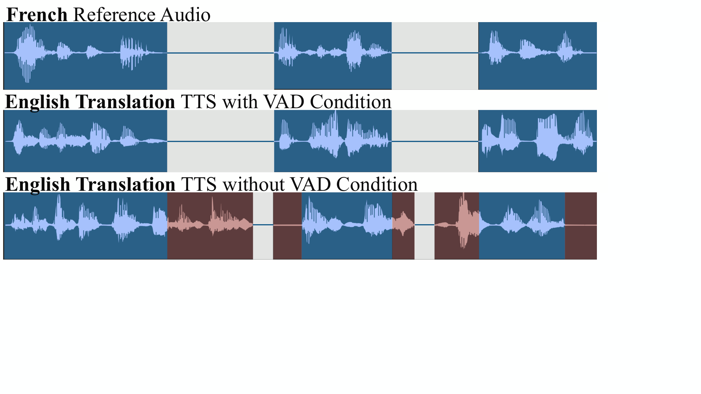
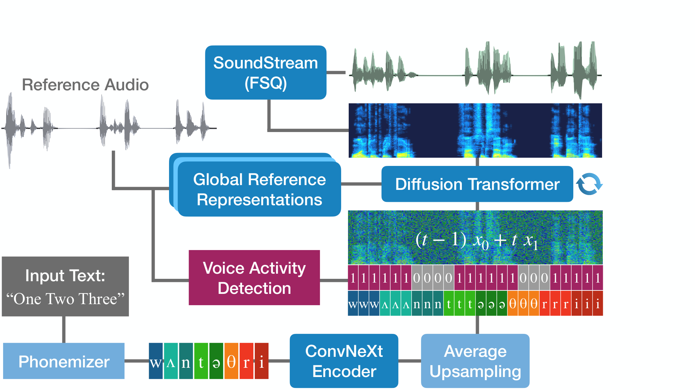

# 🚩 (2026-09-23) Scholar Inbox 추천 논문 

# 📚 From Reliable Text to Real Voices: Trust-Aware Progressive Adaptation for Low-Resource TTS

🚀 URL: https://arxiv.org/html/2609.25951

## 🌏 Abstract (원문)
Low-resource text-to-speech (TTS) adaptation is constrained by scarce paired data and costly manual transcription. Existing fixed-voice TTS systems can provide relatively accurate pronunciation, but their synthetic speech offers limited speaker diversity and may exhibit flat prosody. Real recordings provide natural prosody and diverse voices, yet their automatic speech recognition (ASR) pseudo-labels may contain transcription errors. We find that supervision order affects content accuracy and speaker similarity. We propose trust-aware progressive adaptation: synthetic-to-real adaptation first establishes text–speech correspondences, then restores reference-speaker control using real speech. Transcript-agreement weighting uses agreement between two fixed ASR systems as a proxy for pseudo-label reliability to limit noisy supervision. Experiments with FireRedTTS3 on Burmese and Lao and OmniVoice on Burmese show improved content accuracy with high naturalness and competitive speaker similarity. Jointly considering supervision order and pseudo-label reliability when combining synthetic and real speech offers a practical path to zero-shot voice cloning in low-resource languages with less manual transcription. Audio demos are available at https://insiderx-pro.github.io/S2R-Adaptation-TTS/.
## 🌏 Abstract (번역)
저자원 텍스트 음성 변환(TTS) 적응은 부족한 쌍 데이터와 비용이 많이 드는 수동 전사에 의해 제약을 받습니다. 기존의 고정 음성 TTS 시스템은 비교적 정확한 발음을 제공할 수 있지만, 합성 음성은 화자 다양성이 제한적이며 단조로운 운율을 보일 수 있습니다. 실제 녹음은 자연스러운 운율과 다양한 음성을 제공하지만, 자동 음성 인식(ASR) 의사 레이블에는 전사 오류가 포함될 수 있습니다. 우리는 감독 순서가 내용 정확도와 화자 유사성에 영향을 미친다는 것을 발견했습니다. 우리는 신뢰 인식 점진적 적응을 제안합니다: 합성-실제 적응은 먼저 텍스트-음성 대응을 설정한 다음, 실제 음성을 사용하여 참조 화자 제어를 복원합니다. 전사 일치 가중치는 두 개의 고정 ASR 시스템 간의 일치를 의사 레이블 신뢰도의 대리 지표로 사용하여 노이즈가 있는 감독을 제한합니다. 버마어 및 라오어에 대한 FireRedTTS3와 버마어에 대한 OmniVoice를 사용한 실험은 높은 자연스러움과 경쟁력 있는 화자 유사성을 가진 향상된 내용 정확도를 보여줍니다. 합성 음성과 실제 음성을 결합할 때 감독 순서와 의사 레이블 신뢰도를 함께 고려하는 것은 수동 전사가 적은 저자원 언어에서 제로샷 음성 복제를 위한 실용적인 경로를 제공합니다. 오디오 데모는 https://insiderx-pro.github.io/S2R-Adaptation-TTS/에서 확인할 수 있습니다.

## 🔍 Methods & Results
- 저자원 TTS 적응을 위해 합성 음성과 실제 음성을 결합하는 '신뢰 인식 점진적 적응(trust-aware progressive adaptation)' 방법론을 제안한다.
- 이 방법론은 합성 음성 감독(S)으로 텍스트-음성 대응을 먼저 확립한 후, 실제 음성 감독(R)을 통해 참조 화자 제어를 복원하는 S→R 순서로 진행된다.
- 실제 음성 감독 단계에서는 두 개의 고정 ASR 시스템(A1, A2) 간의 전사 일치도를 의사 레이블 신뢰도 지표로 활용하는 '전사 일치 가중치(transcript-agreement weighting)'를 적용하여 노이즈 있는 감독의 영향을 제한한다.
- 가중치는 정규화된 문자 불일치(d_i)에 기반한 큐빅 감쇠 함수(w_i = (1 - d_i)^3, w_min=0.10)를 사용하여 계산되며, 완벽한 일치 시 단위 가중치를 부여하고 불일치 시 영향을 줄인다.
- FireRedTTS3 (버마어, 라오어) 및 OmniVoice (버마어) 모델을 사용한 실험에서, 제안된 방법은 높은 자연스러움과 경쟁력 있는 화자 유사성을 유지하면서 내용 정확도를 향상시켰다.
- 감독 순서와 의사 레이블 신뢰도를 함께 고려함으로써, 수동 전사가 적은 저자원 언어에서 제로샷 음성 복제를 위한 실용적인 경로를 제시한다.

---
**Usage Info**: 4358 tokens used.
**Generated at**: 2026-09-23 18:13:04

---

# 📚 Learnable Classifier-Free Guidance Null Embeddings for Enhanced Controllable Speech Synthesis

🚀 URL: https://arxiv.org/html/2609.25411

## 🌏 Abstract (원문)
Classifier-free Guidance (CFG) is widely adopted in text-to-speech (TTS) systems to enhance generation quality and conditioning fidelity by interpolating between conditioned and unconditioned predictions. A common unconditional technique is to use an empty representation, in the form of a fixed null vector. In this work, we propose replacing this representation with a learnable unconditional embedding, optimized to represent a meaningful unconditional state. Objective and subjective evaluations demonstrate that learnable null embeddings consistently outperform fixed null embeddings across speaker similarity, speech stability, and expressiveness, while exhibiting greater robustness to larger guidance scales. We further show that learning a distinct unconditional embedding for each of the TTS conditioning modalities allows fine-grained control over speaker and text guidance, showcasing the trade-off between similarity and quality, and stability and expressiveness in the generated speech.111Blogpost article with TTS samples available inhttps://airtimemedia.github.io/IS2026-LearnableCFG/.
## 🌏 Abstract (번역)
분류기 없는 안내(CFG)는 조건부 및 비조건부 예측 간의 보간을 통해 생성 품질과 조건화 충실도를 향상시키기 위해 텍스트 음성 변환(TTS) 시스템에서 널리 채택되고 있습니다. 일반적인 비조건부 기술은 고정된 널 벡터 형태의 빈 표현을 사용하는 것입니다. 본 연구에서는 이 표현을 의미 있는 비조건부 상태를 나타내도록 최적화된 학습 가능한 비조건부 임베딩으로 대체할 것을 제안합니다. 객관적 및 주관적 평가는 학습 가능한 널 임베딩이 화자 유사성, 음성 안정성 및 표현력 전반에 걸쳐 고정된 널 임베딩보다 지속적으로 우수한 성능을 보이며, 더 큰 안내 스케일에 대해 더 큰 견고성을 나타냄을 입증합니다. 또한, TTS 조건화 양식 각각에 대해 별개의 비조건부 임베딩을 학습하는 것이 화자 및 텍스트 안내에 대한 미세한 제어를 가능하게 하여 생성된 음성에서 유사성과 품질, 안정성과 표현력 간의 균형을 보여줍니다. TTS 샘플이 포함된 블로그 게시물은 https://airtimemedia.github.io/IS2026-LearnableCFG/에서 확인할 수 있습니다.

## 🔍 Methods & Results
- TTS 모델은 AR GPT Qwen3 기반 0.6B 백본과 경량 확산 헤드, 그리고 음성을 저차원 64차원 잠재 벡터로 인코딩하고 고품질 오디오로 디코딩하는 인과적 트랜스포머 기반 VAE로 구성됩니다.
- GPT 백본은 화자 잠재 벡터(참조 멜-스펙트로그램 인코딩)와 BPE 압축 텍스트 토큰(합성할 텍스트)에 의해 조건화됩니다.
- 추론 시, CFG를 통해 조건화 신호에 대한 품질과 충실도를 향상시키며, 확산 헤드에서 조건부 예측을 비조건부 참조로부터 멀어지게 하는 조건부 기준 CFG 공식을 사용합니다.
- 표준 CFG에서는 비조건부 은닉 상태가 모든 조건화 신호를 제거하고 일반적으로 고정된 널 임베딩으로 대체하여 얻어집니다.
- 본 연구에서는 이 고정된 비조건부 표현을 각 조건화 양식(화자 및 텍스트)에 대해 학습 가능한 널 임베딩으로 대체할 것을 제안하며, 이는 훈련 중 고정된 확률로 조건화 신호를 대체하여 최적화됩니다.
- 각 조건화 양식이 별개의 음성 속성을 나타내므로, 이들의 안내 기여도를 분리하고 독립적으로 제어할 수 있도록 양식별 비조건부 은닉 상태를 정의하고, 이를 통해 화자 및 텍스트 안내 강도를 독립적으로 제어하는 확장된 CFG 공식을 적용합니다.
- 학습 가능한 널 임베딩은 화자 유사성, 음성 안정성, 표현력 측면에서 고정된 널 임베딩보다 지속적으로 우수한 성능을 보였으며, 더 큰 안내 스케일에서도 더 강력한 견고성을 나타냈습니다.
- 각 TTS 조건화 양식에 대해 별개의 비조건부 임베딩을 학습함으로써 화자 및 텍스트 안내에 대한 미세한 제어가 가능하며, 생성된 음성에서 유사성과 품질, 안정성과 표현력 간의 균형을 보여주었습니다.

## 🖼 Figures
![Figure 1:3D heatmaps illustrating the objective metric landscape as a function of speaker and text CFG weights, evaluated using learnable and fixed zero null embeddings. The diagonal curve traces the manifold corresponding to standard (non-disentangled) CFG, where speaker and text guidance are coupled and varied jointly (
𝑤
=
𝑤
𝑠
=
𝑤
𝑡
). The yellow star marks the custom hand picked decoupled values of CFG guidance that we report in our evaluations. Note that some axes are rotated for better visualization.](../images/2026-09-23/2609.25411/2609.25411_fig0.png)
*Figure 1:3D heatmaps illustrating the objective metric landscape as a function of speaker and text CFG weights, evaluated using learnable and fixed zero null embeddings. The diagonal curve traces the manifold corresponding to standard (non-disentangled) CFG, where speaker and text guidance are coupled and varied jointly (
𝑤
=
𝑤
𝑠
=
𝑤
𝑡
). The yellow star marks the custom hand picked decoupled values of CFG guidance that we report in our evaluations. Note that some axes are rotated for better visualization.*

---
**Usage Info**: 2411 tokens used.
**Generated at**: 2026-09-23 18:13:12

---

# 📚 Interactive TTS: Dynamic Speaking Style Adaptation for Expressive Speech Synthesis

🚀 URL: https://arxiv.org/html/2609.25707

## 🌏 Abstract (원문)
Dynamic speaking style adaptation in multi-turn multimodal interaction remains a major challenge for text-to-speech (TTS) systems. Existing context-aware TTS (CTTS) methods typically map dialogue context to speech in an end-to-end manner. Such implicit modeling makes contextual style decisions difficult to supervise, while the entanglement of style, timbre, and content often leads to weak instruction-following and severe timbre drift across turns. To overcome these limitations, we propose Interactive TTS, a dynamic, style-adaptive framework for contextually appropriate and speaker-consistent speech generation. Interactive TTS decouples the process by explicitly modeling contextual style decisions as executable instructions. To bridge the gap between style decisions and speech generation, we introduce Iterative Rejection Sampling Fine-Tuning (Iterative RSFT) and Context-Aware Direct Preference Optimization (CADPO), which significantly enhance instruction-following and align the generated speech with conversational contexts. Extensive experiments demonstrate that Interactive TTS outperforms state-of-the-art models on VStyle and SpeechParaling-Bench. Demo is available athttps://wjtian-wonderful.github.io/InteractiveTTS/
## 🌏 Abstract (번역)
다중 턴 멀티모달 상호작용에서 동적인 발화 스타일 적응은 텍스트 음성 변환(TTS) 시스템에 있어 여전히 주요 과제로 남아 있습니다. 기존의 문맥 인식 TTS(CTTS) 방법은 일반적으로 대화 문맥을 음성으로 종단 간 매핑합니다. 이러한 암묵적인 모델링은 문맥적 스타일 결정을 감독하기 어렵게 만들며, 스타일, 음색, 내용의 얽힘은 종종 지시 따르기 능력을 약화시키고 턴마다 심각한 음색 표류를 초래합니다. 이러한 한계를 극복하기 위해, 우리는 문맥에 적합하고 화자 일관성을 유지하는 음성 생성을 위한 동적이고 스타일 적응적인 프레임워크인 Interactive TTS를 제안합니다. Interactive TTS는 문맥적 스타일 결정을 실행 가능한 지시로 명시적으로 모델링하여 프로세스를 분리합니다. 스타일 결정과 음성 생성 사이의 간극을 메우기 위해, 우리는 반복적 거부 샘플링 미세 조정(Iterative RSFT)과 문맥 인식 직접 선호 최적화(CADPO)를 도입하여 지시 따르기 능력을 크게 향상시키고 생성된 음성을 대화 문맥과 정렬합니다. 광범위한 실험을 통해 Interactive TTS가 VStyle 및 SpeechParaling-Bench에서 최신 모델보다 우수한 성능을 보임을 입증했습니다. 데모는 https://wjtian-wonderful.github.io/InteractiveTTS/에서 확인할 수 있습니다.

## 🔍 Methods & Results
- Interactive TTS는 다중 턴 멀티모달 상호작용에서 동적인 발화 스타일 적응을 목표로 하며, 문맥적 스타일 결정과 음성 생성을 분리합니다.
- 시스템은 Context-to-Instruction (C2I) 모델과 Speech Generator로 구성됩니다.
- C2I 모델은 Qwen-2.5omni-7B 기반으로, 상호작용 문맥과 목표 텍스트를 인간이 읽을 수 있는 스타일 지시(예: '조금 더 빠르게, 중간 정도의 낮은 볼륨으로, 안심시키는 어조로 말하세요')로 변환합니다.
- C2I는 먼저 스타일 관련 증거를 집계하는 '근거(rationale)'를 생성한 다음, 실행 가능한 '지시(instruction)'를 생성하며, 훈련 시 Qwen-Omni-Plus로 생성된 추가 오디오-비주얼 캡션을 보조 정보로 활용하는 교사-학생 방식을 사용합니다.
- Speech Generator는 사전 훈련된 Qwen3-TTS-CustomVoice를 기반으로 하며, 지시와 참조 화자에 따라 목표 텍스트를 음성으로 실현합니다.
- 화자 일관성을 유지하기 위해 참조 화자 음성을 시스템 프롬프트에 지속적으로 제공하는 방식을 사용합니다.
- Iterative Rejection Sampling Fine-Tuning (RSFT)은 Gemini-2.5-Pro를 외부 멀티모달 심사관으로 사용하여 N개의 후보 음성 출력 중 지시 충실도와 화자 일관성이 가장 높은 샘플을 선택하고, 이를 통해 생성기를 5회 반복 미세 조정하여 지시 따르기 능력을 향상시킵니다.
- Context-Aware Direct Preference Optimization (CADPO)은 RSFT로 정렬된 생성기에서 생성된 후보들 중 원래 상호작용 문맥에 더 적합한 음성을 문맥 인식 비평가(critic)가 선별하여 생성기를 추가로 최적화합니다. 이 비평가는 훈련 시에만 사용됩니다.
- C2I 모듈 훈련을 위해 Seedance2.0, Qwen3-TTS, Gemini-3.1-Flash-TTS-Preview를 사용하여 22K 텍스트, 47K 오디오(149시간), 12K 비디오(32시간)로 구성된 새로운 멀티턴 멀티모달 대화 코퍼스를 구축했습니다.
- 생성기 정렬을 위해 Qwen3-TTS-12Hz-1.7B-CustomVoice를 기반으로, RSFT를 위해 약 2,000시간의 지시 따르기 합성 데이터를, CADPO를 위해 약 200시간의 문맥 인식 선호 데이터를 사용했습니다.
- 추론 시에는 C2I가 대화 기록 문맥과 목표 텍스트로부터 지시를 예측하고, 이 지시만이 생성기로 전달되어 참조 화자, 지시, 목표 텍스트에 따라 최종 음성을 합성합니다.
- Interactive TTS는 VStyle 및 SpeechParaling-Bench 벤치마크에서 최신 모델들보다 우수한 성능을 보였습니다.

## 🖼 Figures

*Figure 1:Comparison between existing context-aware TTS (CTTS) and the proposed Interactive TTS. CTTS implicitly maps dialogue history to speech, often yielding mismatched expression. Interactive TTS dynamically adapts speaking style, while producing contextually appropriate speech.*

![Figure 2:Architecture of the proposed Interactive TTS framework. 1. Dynamic Style Adaptation: The C2I model parses multimodal context into a compact, executable style instruction. 2. Context-Conditioned Generation: The TTS generator synthesizes speech conditioned on the target text, style instruction, and a reference speaker prompt. 3. Multi-Objective Training: The generator is aligned via Iterative RSFT for speaker consistency and instruction following, followed by CADPO to ensure contextual appropriateness.](../images/2026-09-23/2609.25707/2609.25707_fig1.png)
*Figure 2:Architecture of the proposed Interactive TTS framework. 1. Dynamic Style Adaptation: The C2I model parses multimodal context into a compact, executable style instruction. 2. Context-Conditioned Generation: The TTS generator synthesizes speech conditioned on the target text, style instruction, and a reference speaker prompt. 3. Multi-Objective Training: The generator is aligned via Iterative RSFT for speaker consistency and instruction following, followed by CADPO to ensure contextual appropriateness.*

---
**Usage Info**: 4766 tokens used.
**Generated at**: 2026-09-23 18:13:24

---

# 📚 SceneTTS-Bench: A Benchmark for Scene-Level TTS in Drama Dubbing

🚀 URL: https://arxiv.org/html/2609.26255

## 🌏 Abstract (원문)
Text-to-speech systems are increasingly used for drama dubbing, yet evaluation protocols remain sentence-level, leaving critical scene-level behaviors insufficiently measured. We present SceneTTS-Bench, a benchmark that evaluates TTS along three dimensions: timbre consistency across character turns, emotional expressiveness on high-tension utterances, and rhythm coherence under segmented long-form synthesis. The corpus comprises real-world and generated drama scripts totaling 160 bilingual scenes (∼\sim10,300 utterances), with real-world scripts serving as the primary source (100 scenes) and generated scripts as a supplementary source (60 scenes), demonstrating the framework’s extensibility through synthetic data augmentation. A backend-agnostic Canonical Intermediate Representation (Canonical IR) ensures fair cross-system comparison. Three automatic pipelines produce per-utterance diagnostics: Speaker Consistency Score (SCS) for timbre-drift detection, Under-Acting Ratio (UAR) for under-acting identification, and Rate Discontinuity Ratio (RDR) for rate-discontinuity quantification. Experiments on four TTS systems confirm that each system exhibits distinct weaknesses, and that scene-level rankings diverge substantially from sentence-level metrics. Benchmark resources are publicly available athttps://piedpiperg.github.io/scenetts-bench/.
## 🌏 Abstract (번역)
텍스트 음성 변환(TTS) 시스템은 드라마 더빙에 점점 더 많이 사용되고 있지만, 평가 프로토콜은 여전히 문장 수준에 머물러 있어 중요한 장면 수준의 동작을 충분히 측정하지 못하고 있습니다. 본 논문에서는 캐릭터 턴 간의 음색 일관성, 고조된 발화에서의 감정 표현력, 그리고 분할된 장문 합성에서의 리듬 일관성이라는 세 가지 차원에서 TTS를 평가하는 벤치마크인 SceneTTS-Bench를 제시합니다. 이 코퍼스는 실제 및 생성된 드라마 스크립트를 포함하여 총 160개의 이중 언어 장면(약 10,300개 발화)으로 구성되며, 실제 스크립트가 주요 소스(100개 장면)로, 생성된 스크립트가 보조 소스(60개 장면)로 사용되어 합성 데이터 증강을 통한 프레임워크의 확장성을 보여줍니다. 백엔드에 구애받지 않는 표준 중간 표현(Canonical IR)은 공정한 시스템 간 비교를 보장합니다. 세 가지 자동 파이프라인은 발화별 진단을 생성합니다: 음색 변화 감지를 위한 화자 일관성 점수(SCS), 감정 표현 부족 식별을 위한 과소 연기 비율(UAR), 그리고 속도 불연속성 정량화를 위한 속도 불연속성 비율(RDR). 네 가지 TTS 시스템에 대한 실험은 각 시스템이 뚜렷한 약점을 보이며, 장면 수준 순위가 문장 수준 측정 지표와 상당히 다르다는 것을 확인시켜 줍니다. 벤치마크 자료는 https://piedpiperg.github.io/scenetts-bench/에서 공개적으로 이용 가능합니다.

## 🔍 Methods & Results
- SceneTTS-Bench는 합성 표준화를 위한 실행 계층과 오디오 측정을 위한 평가 계층으로 구성되며, 입력 불일치 대신 모델 역량을 반영하도록 Canonical IR을 통해 드라마 스크립트를 표준화합니다.
- Canonical Intermediate Representation (Canonical IR)은 텍스트, 화자, 감정, 참조 오디오, 자연어 지침의 5개 필드로 구성된 고정 튜플로 정의되어 CosyVoice3, Qwen3-TTS, IndexTTS2, Fish-S2 등 다양한 TTS 시스템 간의 공정한 비교를 가능하게 합니다.
- 화자 일관성 점수(SCS)는 CAM++ 임베딩과 HDBSCAN 클러스터링을 사용하여 역할 수준에서 음색 일관성을 측정하며, 지배적인 음성 클러스터에서 벗어나는 발화에 대해 z-점수 기반 페널티를 적용합니다. 점수가 1에 가까울수록 일관성이 높음을 나타냅니다.
- 과소 연기 비율(UAR)은 스크립트의 고조된 발화(high_arousal, high_dominance)에 대한 감정 표현력을 평가하며, Wav2Vec 2.0 감정 모델을 사용하여 예측된 각성 및 지배력 값이 스크립트에서 요구하는 임계값 미만으로 떨어지는 빈도를 측정합니다.
- 속도 불연속성 비율(RDR)은 분할된 장문 합성에서 리듬 일관성을 평가합니다. ASR 토큰 수와 VAD 활성 음성 지속 시간을 사용하여 세그먼트 음성 속도를 계산하고, 동일한 발화에서 파생된 세그먼트 쌍 간의 속도 비율이 임계값을 초과할 때 속도 점프를 감지합니다.
- 네 가지 TTS 시스템(CosyVoice3, Qwen3-TTS, IndexTTS2, Fish-S2)에 대한 실험 결과, 각 시스템이 뚜렷한 약점을 보였으며, 장면 수준 순위가 문장 수준 측정 지표와 상당히 다르게 나타났습니다.
- 벤치마크 리소스는 공개적으로 이용 가능합니다.

## 🖼 Figures

*Figure 1.An example of SceneTTS-Bench evaluation showing scene-level diagnostics for a high-tension dialogue. The figure includes metrics for timbre consistency, emotional expressiveness, and rhythm coherence, as well as per-utterance diagnostics.*

*Figure 2.Overview of SceneTTS-Bench. Top: the backend-agnostic execution protocol converts drama scripts into a Canonical IR and dispatches to four TTS systems under identical conditions. Bottom: three evaluation pipelines assess timbre consistency (SCS), emotional expressiveness (UAR), and rhythm coherence (RDR), each producing per-utterance diagnostics.*

*Figure 3.Normalized sentence-level (grey labels) and scene-level (black labels) profiles; higher is better on every axis.*

---
**Usage Info**: 3777 tokens used.
**Generated at**: 2026-09-23 18:13:34

---

# 📚 Persistent Delivery Optimization for Streaming Speech-to-Text Translation with Revisions

🚀 URL: https://arxiv.org/html/2609.26427

## 🌏 Abstract (원문)
Revision-capable streaming speech-to-text translation (S2TT) can correct earlier drafts, but process rewards based on visible text may credit content later withdrawn. Persistent Delivery Optimization (PDO) assigns intermediate reward only to content that survives revisions while scoring final quality separately. With 7.49 h of task-specific FLEURS adaptation, PDO achieves the best BLEU on four of five directions and higher COMET than every external streaming baseline in all five directions. Relative to its History-SFT initialization, PDO reduces mean/P90 finalization-aware latency by 10.8%/11.3% and normalized erasure by 15.8%, while emitting at the first permitted 2-s update and improving macro BLEU. Zero-shot evaluation on Europarl-ST and CoVoST 2 confirms that these gains are not confined to the FLEURS training domain.111Training code and model weights:github.com/ggiggit/PDO_S2TT
## 🌏 Abstract (번역)
수정 가능한 스트리밍 음성-텍스트 번역(S2TT)은 이전 초안을 수정할 수 있지만, 가시적인 텍스트를 기반으로 한 프로세스 보상은 나중에 철회될 수 있는 콘텐츠에 크레딧을 부여할 수 있습니다. 영구 전달 최적화(PDO)는 수정 후에도 남아있는 콘텐츠에만 중간 보상을 할당하고 최종 품질은 별도로 평가합니다. 7.49시간의 작업별 FLEURS 적응을 통해 PDO는 5개 방향 중 4개에서 최고의 BLEU 점수를 달성했으며, 모든 5개 방향에서 모든 외부 스트리밍 기준선보다 높은 COMET 점수를 기록했습니다. History-SFT 초기화와 비교하여 PDO는 평균/P90 최종화 인식 지연 시간을 10.8%/11.3% 감소시키고, 정규화된 삭제율을 15.8% 감소시키면서, 허용된 첫 2초 업데이트 시점에 출력을 생성하고 매크로 BLEU를 개선했습니다. Europarl-ST 및 CoVoST 2에 대한 제로샷 평가를 통해 이러한 개선 사항이 FLEURS 훈련 도메인에만 국한되지 않음을 확인했습니다. 훈련 코드 및 모델 가중치: github.com/ggiggit/PDO_S2TT

## 🔍 Methods & Results
- Qwen3-ASR-1.7B를 히스토리 조건부 스트리밍 S2TT 정책으로 적용하고, PDO를 사용하여 영구 전달을 최적화했습니다.
- Qwen3-ASR-1.7B로 초기화하고 사전 훈련된 백본을 고정했으며, 추가 ASR 단계 없이 타겟 작업 LoRA(ϕ)와 히스토리 모듈(η)을 훈련했습니다.
- 지도 학습 적응은 텍스트 번역, 전체 오디오 S2TT, 소스 텍스트 조건화 감소 및 스트리밍 SFT 단계를 통해 진행되었습니다.
- 소스 텍스트 조건화 감소 단계에서는 훈련 스크립트에 대한 의존도를 줄이기 위해 전체, 손상된, 접두사, 빈 소스 텍스트 조건을 혼합하여 사용했습니다.
- 스트리밍 SFT는 Qwen3-ASR 강제 단어 시간을 사용하여 Hibiki 스타일의 문맥 정렬에서 얻은 누적 초안과 완전 번역 앵커를 결합했습니다.
- 히스토리 조건부 SFT는 훈련된 스트리밍 SFT 정책을 고정하고, 훈련 세트에 대한 폐쇄 루프 롤아웃을 수행하여 모델 생성 히스토리를 캐시하며, 이전 가시 초안을 히스토리로 사용하고 η만 훈련했습니다.
- PDO는 π_hist로 초기화하고 θ=(ϕ,η)를 업데이트하며, 히스토리는 제로 초기화된 게이트형 교차 어텐션을 통해 상위 디코더 레이어에 주입됩니다.
- 영구 전달 유틸리티 J_PD(τ)는 수정 후에도 남아있는 콘텐츠(p_t)에 대한 보상을 정의하며, 영구 접두사 어휘 범위(ROUGE-L recall)와 정규화된 유효 순서 문장 BLEU를 결합하여 최종 품질에 가중치를 부여합니다.
- 정책 업데이트는 PPO 스타일의 클립된 업데이트와 그룹 상대 표준화된 리턴을 사용하며, 각 라운드에서 현재 정책을 π_prox로 고정하고, 온도 조정된 행동 분포 π_b를 사용하여 K개의 새로운 폐쇄 루프 궤적을 샘플링합니다.
- PDO는 7.49시간의 FLEURS 적응을 통해 5개 방향 중 4개에서 최고의 BLEU 점수를 달성하고, 모든 5개 방향에서 외부 스트리밍 기준선보다 높은 COMET 점수를 기록했습니다.
- History-SFT 초기화 대비, PDO는 평균/P90 최종화 인식 지연 시간을 10.8%/11.3% 감소시키고, 정규화된 삭제율을 15.8% 감소시켰습니다.
- PDO는 허용된 첫 2초 업데이트 시점에 출력을 생성하고 매크로 BLEU를 개선했으며, Europarl-ST 및 CoVoST 2에 대한 제로샷 평가를 통해 이러한 성능 향상이 FLEURS 훈련 도메인에 국한되지 않음을 확인했습니다.

## 🖼 Figures

*Figure 1:FLEURS TEST persistent-delivery analysis. (a) Final-content fraction and change from History-SFT (ending at zero by construction). (b) Transient-credit gap versus age-weighted erasure (
𝜌
=
.927
).*

---
**Usage Info**: 4195 tokens used.
**Generated at**: 2026-09-23 18:13:45

---

# 📚 SE-MSB: End-to-End Unpaired Speech Enhancement using Mamba Schrödinger Bridges

🚀 URL: https://arxiv.org/html/2609.26000

## 🌏 Abstract (원문)
Speech enhancement (SE) models typically rely on supervised learning with paired data examples where clean speech is synthetically degraded. This paradigm limits performance in real-world scenarios where the target environment’s specific acoustic characteristics are unknown. We propose a fully unpaired SE framework that uses principled Diffusion Schrödinger Bridges (DSB) to learn a stochastic transport process between a clean and a degraded speech distribution. Algorithms for learning transport maps are computationally heavy since they require simulating differential equations during training, usually at each training step. Therefore, we propose using a high-efficiency Mamba Diffusion Model designed for end-to-end waveform processing. We compare against state-of-the-art methods for speech enhancement, both paired and unpaired, as well as a classical signal processing algorithm. Experimental results show that we are on par or better than the baselines while being orders of magnitude faster during inference. Furthermore, we show that the flexibility of the DSB formulation allows our model to generalize across SE tasks, offering a robust and efficient solution for real-world speech restoration.
## 🌏 Abstract (번역)
음성 향상(SE) 모델은 일반적으로 깨끗한 음성이 인위적으로 손상된 쌍으로 구성된 데이터 예제를 사용한 지도 학습에 의존합니다. 이러한 패러다임은 대상 환경의 특정 음향 특성을 알 수 없는 실제 시나리오에서 성능을 제한합니다. 우리는 깨끗한 음성 분포와 손상된 음성 분포 사이의 확률적 전송 프로세스를 학습하기 위해 원칙적인 확산 슈뢰딩거 브릿지(DSB)를 사용하는 완전 비쌍(unpaired) SE 프레임워크를 제안합니다. 전송 맵 학습 알고리즘은 훈련 중, 일반적으로 각 훈련 단계에서 미분 방정식을 시뮬레이션해야 하므로 계산 비용이 많이 듭니다. 따라서 우리는 종단 간 파형 처리를 위해 설계된 고효율 Mamba 확산 모델을 사용할 것을 제안합니다. 우리는 쌍으로 구성된 및 비쌍으로 구성된 최첨단 음성 향상 방법과 고전적인 신호 처리 알고리즘과 비교합니다. 실험 결과는 우리가 기준선과 동등하거나 더 우수하며 추론 시에는 몇 배 더 빠르다는 것을 보여줍니다. 또한, DSB 공식의 유연성이 우리 모델이 다양한 SE 작업에 걸쳐 일반화될 수 있도록 하여 실제 음성 복원을 위한 견고하고 효율적인 솔루션을 제공함을 보여줍니다.

## 🔍 Methods & Results
- 제안된 방법은 깨끗한 음성 분포(p_clean)와 손상된 음성 분포(p_noisy) 사이의 확률적 전송 프로세스를 학습하기 위해 Diffusion Schrödinger Bridge Matching (DSB) 알고리즘을 활용하는 완전 비쌍(unpaired) 음성 향상(SE) 프레임워크이다.
- 이 프레임워크는 순방향 및 역방향 확률 미분 방정식(SDE)의 드리프트 항을 단일 신경망 v(X_t, t, s)로 매개변수화하며, 훈련은 무작위 결합을 사용하는 사전 훈련 단계와 모델 매개변수를 사용하여 결합을 시뮬레이션하는 미세 조정 단계로 구성된다.
- 기존 스펙트로그램 기반 모델과 달리, 본 연구는 원시 오디오 파형에 대해 종단 간(end-to-end)으로 작동하는 고효율 Mamba 확산 모델 아키텍처를 사용한다.
- Mamba 확산 모델은 초기 1D 컨볼루션 레이어를 통해 잠재 표현을 학습하고, 확산 시간 단계 및 프로세스 방향 컨디셔닝을 주입하기 위해 Adaptive LayerNorm을 사용하는 Mamba 확산 블록으로 구성된다.
- 실험 결과, 제안된 모델은 최첨단 쌍 및 비쌍 기반 모델과 고전적인 신호 처리 알고리즘에 비해 동등하거나 더 우수한 성능을 보였으며, 추론 시에는 몇 배 더 빠른 속도를 달성했다.
- DSB 공식의 유연성 덕분에 모델은 다양한 SE 작업에 걸쳐 일반화될 수 있어 실제 음성 복원을 위한 견고하고 효율적인 솔루션을 제공한다.
- 알고리즘 효율성은 TFLOPS(tera floating-point operations)로 측정되었으며, Mamba 모델의 TFLOP 계산은 1D 컨볼루션 및 선택적 스캔 알고리즘에 중점을 두어 PyTorch의 'FlopCounterMode'와 수동 등록을 통해 이루어졌다.

## 🖼 Figures

*Figure 1:In traditional supervised speech enhancement (left), we assume access to a clean sample 
𝑥
0
 from the clean target distribution and a corresponding degraded sample from the degraded distribution to learn the optimal pairing (blue arrows). In contrast, our method (right) requires only independent samples from both distributions to learn the optimal pairing.*

![Figure 2:Total compute vs SISDRi (left) and FAD (right). The area of the points scales linearly with mean inference time, see table 3 and appendix D. Our model outperforms unpaired state-of-the-art models with the same compute budget. It is also seen that the model is robust to changes in the number of diffusion steps, performing almost the same no matter how many diffusion steps are taken. This is also shown in figure 4. The models with a dashed outline are trained on paired data. An Equivalent plot for the CHiME-6 dataset can be seen in appendix D.](../images/2026-09-23/2609.26000/2609.26000_fig1.png)
*Figure 2:Total compute vs SISDRi (left) and FAD (right). The area of the points scales linearly with mean inference time, see table 3 and appendix D. Our model outperforms unpaired state-of-the-art models with the same compute budget. It is also seen that the model is robust to changes in the number of diffusion steps, performing almost the same no matter how many diffusion steps are taken. This is also shown in figure 4. The models with a dashed outline are trained on paired data. An Equivalent plot for the CHiME-6 dataset can be seen in appendix D.*

*Figure 3:The Mamba Diffusion Model architecture proposed for SE-MSB. Each waveform is encoded using a 1D convolutional layer. The resulting representation is mixed with the conditional signal and processed by a stack of Mamba Diffusion Blocks.*

*Figure 4: Metrics as a function of the number of diffusion steps. The SE-MSB model is almost unaffected by the number of steps, showing that SE-MSB can do few-step generation.*

---
**Usage Info**: 5623 tokens used.
**Generated at**: 2026-09-23 18:13:59

---

# 📚 Vorch-Human: Unified Multi-Task Human-Centric Generation via Long-Horizon Continuation

🚀 URL: https://arxiv.org/html/2609.26117

## 🌏 Abstract (원문)
Human-centric audio-visual generation spans several closely related tasks: animating a person from driving speech, jointly generating speech and video from a voice reference, and synthesizing a scene from paired appearance and voice references. Existing systems commonly solve these tasks with separate models, even though they share the same target modalities and differ mainly in which observations are provided as conditions. We presentVorch-Human, a unified human-centric generation framework built on a dual-stream audio–video diffusion transformer. Vorch-Human augments the conventional noisy audio/noisy video interface with clean condition-audio and condition-video token groups. Per-token task embeddings, temporal position types, condition masks, and a shared multimodal prompt encoder allow driving speech, timbre examples, first frames, and subject images to be expressed within one model. To supply the supervision required by this interface, we develop a two-level data pipeline. Level
1 analyzes each clip with speech recognition, vocal separation, face detection and tracking, active-speaker and synchronization models, audio/visual speaker clustering, and multimodal caption correction; it produces subject-indexed speech, appearance, and timbre annotations. Level
2 links the same person across clips from a common source video and mines identity- and outfit-consistent reference images after face, body, quality, pose, and vision-language verification. Finally, we adapt Vorch-Human to long-form audio-driven generation by training with clean latent prefixes and using the same frozen-prefix recurrence at inference. Each segment contributes only its newly generated suffix, reducing boundary discontinuity and long-horizon identity drift. Experiments on short and five-minute generation demonstrate strong identity preservation, audio–visual synchronization, and temporal stability. Our project page is available athttps://vorch-project.github.io/Vorch-Human-Project/.
## 🌏 Abstract (번역)
인간 중심 오디오-비주얼 생성은 여러 밀접하게 관련된 작업을 포함합니다: 구동 음성으로부터 사람을 애니메이션화하는 것, 음성 참조로부터 음성과 비디오를 공동으로 생성하는 것, 그리고 쌍을 이루는 외모 및 음성 참조로부터 장면을 합성하는 것입니다. 기존 시스템들은 동일한 목표 모달리티를 공유하고 주로 조건으로 제공되는 관측치에서만 차이가 있음에도 불구하고, 이러한 작업들을 개별 모델로 해결하는 것이 일반적입니다. 우리는 듀얼 스트림 오디오-비디오 확산 트랜스포머를 기반으로 구축된 통합 인간 중심 생성 프레임워크인 Vorch-Human을 제시합니다. Vorch-Human은 기존의 노이즈가 있는 오디오/노이즈가 있는 비디오 인터페이스를 깨끗한 조건-오디오 및 조건-비디오 토큰 그룹으로 확장합니다. 토큰별 작업 임베딩, 시간적 위치 유형, 조건 마스크, 그리고 공유된 멀티모달 프롬프트 인코더는 구동 음성, 음색 예시, 첫 프레임, 그리고 대상 이미지를 하나의 모델 내에서 표현할 수 있도록 합니다. 이 인터페이스에 필요한 감독을 제공하기 위해, 우리는 두 단계의 데이터 파이프라인을 개발합니다. 레벨 1은 각 클립을 음성 인식, 보컬 분리, 얼굴 감지 및 추적, 활성 화자 및 동기화 모델, 오디오/비주얼 화자 클러스터링, 그리고 멀티모달 캡션 교정을 통해 분석합니다; 이는 주체별로 색인된 음성, 외모, 그리고 음색 주석을 생성합니다. 레벨 2는 공통 소스 비디오에서 클립 간에 동일한 사람을 연결하고, 얼굴, 신체, 품질, 자세, 그리고 시각-언어 검증 후 신원 및 의상 일관성이 있는 참조 이미지를 채굴합니다. 마지막으로, 우리는 깨끗한 잠재 접두사로 훈련하고 추론 시 동일한 고정-접두사 반복을 사용하여 Vorch-Human을 장편 오디오 구동 생성에 적용합니다. 각 세그먼트는 새로 생성된 접미사만 기여하여 경계 불연속성과 장기적인 신원 표류를 줄입니다. 짧은 및 5분 길이 생성에 대한 실험은 강력한 신원 보존, 오디오-비주얼 동기화, 그리고 시간적 안정성을 입증합니다. 저희 프로젝트 페이지는 https://vorch-project.github.io/Vorch-Human-Project/ 에서 확인할 수 있습니다.

## 🔍 Methods & Results
- Vorch-Human은 사전 훈련된 듀얼 스트림 오디오-비디오 확산 트랜스포머를 기반으로 하며, 비디오 및 오디오 VAE를 사용하여 목표 및 조건 신호를 각 잠재 공간에 매핑합니다.
- 기존의 노이즈가 있는 오디오/비디오 인터페이스를 깨끗한 조건-오디오 및 조건-비디오 토큰 그룹으로 확장하여, 구동 음성, 음색 예시, 첫 프레임, 대상 이미지를 하나의 모델 내에서 표현할 수 있도록 합니다.
- 토큰별 역할 ID, 시간적 위치 유형, 조건 마스크 및 공유된 멀티모달 프롬프트 인코더를 사용하여 다양한 태스크를 지원하며, 태스크는 별도의 모듈이 아닌 조건 그룹의 유무와 토큰 처리 방식에 따라 정의됩니다.
- 손실은 목표 토큰에 대해서만 평가되며, 조건 토큰은 깨끗하게 유지되고 재구성 목표가 아닌 어텐션에만 참여합니다.
- 오디오 구동 생성(비디오만)의 경우, 전체 구동 파형이 깨끗한 상태로 유지되어 A2V 어텐션을 통해 음성 내용, 리듬, 운율 등을 제공하며, 화자 세그먼트를 통해 오디오 구동 움직임을 지역화합니다.
- 음색 참조 오디오-비디오 생성의 경우, 텍스트가 '무엇을 말할지'를 결정하고 참조 음색이 '어떻게 들릴지'를 결정하며, 음색 참조 토큰은 비디오 쿼리로부터 직접 접근이 차단되어 비디오 움직임이 참조 음성 내용에 의해 구동되지 않도록 합니다.
- 장편 오디오 구동 생성을 위해 깨끗한 잠재 접두사로 훈련하고 추론 시 동일한 고정-접두사 반복을 사용하여 경계 불연속성과 장기적인 신원 표류를 줄입니다.
- 짧은 및 5분 길이 생성 실험에서 강력한 신원 보존, 오디오-비주얼 동기화 및 시간적 안정성을 입증했습니다.

## 🖼 Figures

*Figure 1: Overview of the unified human-centric audio–video generation capabilities of Vorch-Human. The examples cover single- and multi-person audio-driven animation, joint audio–video generation from appearance and voice references, multi-referenced generation, and long-horizon single- and multi-person audio driven animation.*

*Figure 2: Two-level human-centric data processing pipeline. Level 1 resolves speakers and produces a structured clip caption and per-subject appearance and voice assets. Level 2 links the same identity across clips from one source video and validates reference-image quality and outfit consistency. The final records support audio-driven, audio-clone, and paired image–audio reference training.*

*Figure 3: Role-aware unified human-centric architecture. Heterogeneous tasks differ only in their target/condition layout, role IDs, and masks. Relative to the original text/noisy-audio/noisy-video interface, the audio and video sequences each gain a clean condition region. A shared dual-stream DiT exchanges time-aligned information and produces video with optional generated audio.*

*Figure 4: Training and inference for long-video audio-driven generation. Training freezes a sampled latent prefix and applies flow loss only to the suffix. At inference, the previous tail is copied into the next segment and restored after every denoising update; duplicated overlap is removed before a single temporally tiled VAE decode.*

*Figure 5: Temporal stability over five-minute generation, evaluated in non-overlapping 15-second windows. Each metric occupies one row: (a) Face-Sim and (b) DINO-S. Curves show window means and shaded regions show 95% confidence intervals; Face-Sim uses 5–8 valid samples and DINO-S uses eight valid samples per method and window.*

*Figure 6: Raw GSB breakdown for LongCat-Video-Avatar-1.5. Numbers inside the bars are the reported percentages and the right side shows the net preference (Good minus Bad).*

*Figure 7: Raw GSB breakdown for Wan2.7. Bar widths are normalized by the number of judgments per dimension, while labels retain the original Good/Same/Bad judgment counts and the reported net scores.*

*Figure 8: Qualitative audio-driven human animation. The first column shows the input image or visual references, and the remaining columns show generated frames at different timestamps. The examples cover single-person talking, stylized character animation, multi-person conversation, long-form singing, and five-minute talking. The final two rows illustrate identity, appearance, and scene stability at timestamps up to 270 seconds.*

*Figure 9: Qualitative multi-reference audio–visual generation. The first column shows two or three subject appearance references; each subject is also paired with an independently provided voice reference that cannot be rendered in the static figure. The remaining columns show frames generated from the paired image–audio references and a text script. The examples cover human, animal, photorealistic, animated, and cross-style compositions.*

---
**Usage Info**: 5857 tokens used.
**Generated at**: 2026-09-23 18:14:18

---

# 📚 Not Quite My Tempo: Voice Activity-aware Speech Synthesis for Lip-Synchronous Dubbing

🚀 URL: https://arxiv.org/html/2609.26486

## 🌏 Abstract (원문)
Automatic lip-synchronous dubbing requires a speech synthesis model to generate alternating voice and silence patterns in the target language that match the timing of the source clip precisely to ensure an optimal viewing experience. Prior works address this problem by conditioning the speech synthesis process on lip movements extracted from the video signal. In this work, we condition the speech generation on a binary voice-activity signal, which has a lightweight representation and can be produced in multiple ways. We show that the model follows the voice-activity signal with high accuracy while maintaining natural prosody and semantically appropriate pause placement within sentences, as demonstrated through extensive objective and subjective evaluations. By randomly masking this condition during training, we make the feature entirely optional during inference, allowing editors to enforce or relax lip-sync constraints when desired.
## 🌏 Abstract (번역)
자동 립싱크 더빙은 최적의 시청 경험을 보장하기 위해 대상 언어로 된 음성 및 무음 패턴을 원본 클립의 타이밍과 정확히 일치하도록 생성하는 음성 합성 모델을 필요로 합니다. 이전 연구들은 비디오 신호에서 추출된 입술 움직임에 음성 합성 과정을 조건화하여 이 문제를 해결했습니다. 본 연구에서는 경량 표현을 가지며 여러 방식으로 생성될 수 있는 이진 음성 활동 신호에 음성 생성을 조건화합니다. 우리는 광범위한 객관적 및 주관적 평가를 통해 모델이 자연스러운 운율과 문장 내에서 의미론적으로 적절한 일시 정지 배치를 유지하면서 음성 활동 신호를 높은 정확도로 따른다는 것을 보여줍니다. 훈련 중에 이 조건을 무작위로 마스킹함으로써, 추론 시 이 기능을 완전히 선택 사항으로 만들어 편집자가 원할 때 립싱크 제약을 강제하거나 완화할 수 있도록 합니다.

## 🔍 Methods & Results
- 모델 아키텍처는 F5-TTS를 기반으로 하며, ZipVoice의 평균 업샘플링을 통해 시간 정렬을 강화하고, 명시적 화자 임베딩 및 Global Style Tokens(GST)를 사용하여 화자 및 스타일 전이를 개선했습니다.
- 사전 훈련된 수정된 SoundStream 보코더를 채택하여 48kHz 고음질 오디오 출력을 생성합니다.
- 핵심 방법론은 오디오 생성에 음성 활동(VAD) 마스크를 조건으로 도입하는 것입니다. 이 이진 신호는 인코더 표현에 임베딩되어 Diffusion Transformer (DiT) Flow Matching 디코더에 명시적인 시간적 음성 활동 단서를 제공합니다.
- 추론 시 음성 활동 준수 제어 가능성을 위해 훈련 중 실제 음성 활동 임베딩의 일부를 무작위로 마스킹합니다.
- 이 마스킹 전략은 VAD 조건화를 선택적으로 적용하거나 완전히 제거할 수 있게 하여, 엄격한 립싱크가 항상 필요하지 않거나 음성 품질을 저해할 수 있는 시나리오에 유연성을 제공합니다.

## 🖼 Figures

*Figure 1:Example of our proposed technique in action: The VAD condition encourages the model to use only the blue area as canvas for inpainting-TTS. Silences are aligned on the time axis, which is a requirement in lip-synchronous dubbing.*

*Figure 2:Overview of the proposed architecture with VAD conditioning. During training, VAD labels are randomly masked, enabling optional use of this feature at inference time.*

*Figure 5:Subjective evaluation results. There are 3840 individual ratings from 40 participants, split uniformly across all systems and conditions. Placement MOS (darker, left) and Prosody MOS (lighter, right) denote naturalness of pause locations and overall prosody, respectively. Rows contrast baseline (top) with VAD-conditioned (bottom) configurations.*

---
**Usage Info**: 2574 tokens used.
**Generated at**: 2026-09-23 18:14:28

---

# 📚 Transcribe, Translate, and Optimize: Joint Reward Learning for Speech Translation

🚀 URL: https://arxiv.org/html/2609.26536

## 🌏 Abstract (원문)
In LLM-based speech translation, transcription-based chain-of-thought (CoT) suffers from a mismatch between reference transcripts used in supervised fine-tuning (SFT) and model-generated transcripts at inference. To address this, we propose joint recognition and translation fine-tuning via group relative policy optimization (GRPO). We score both transcripts and translations, with translation conditioned on model-generated transcripts, and compare three token advantage strategies. Using Qwen2.5-Omni-3B across four languages, we evaluate CoT against direct speech translation (Direct ST) under SFT and GRPO, training on CoVoST 2 and testing on CoVoST 2 and FLEURS. CoT GRPO outperforms Direct ST GRPO by 1.77 and 0.83 average BLEU points on CoVoST 2 and FLEURS. Compared to CoT SFT, GRPO boosts BLEU by 0.82 and 0.67 points and reduces word error rate (WER) by 8.8% and 7.2% relatively. These results highlight reinforcement fine-tuning as an effective method to mitigate the training-inference mismatch, jointly improving recognition and translation.
## 🌏 Abstract (번역)
LLM 기반 음성 번역에서 전사 기반 CoT(Chain-of-Thought)는 지도 미세 조정(SFT)에 사용되는 참조 전사본과 추론 시 모델 생성 전사본 간의 불일치로 인해 어려움을 겪습니다. 이를 해결하기 위해 우리는 그룹 상대 정책 최적화(GRPO)를 통한 공동 인식 및 번역 미세 조정을 제안합니다. 우리는 모델 생성 전사본에 조건화된 번역과 함께 전사본과 번역 모두에 점수를 매기고, 세 가지 토큰 이점 전략을 비교합니다. Qwen2.5-Omni-3B를 사용하여 4개 언어에 걸쳐 CoVoST 2로 훈련하고 CoVoST 2 및 FLEURS로 테스트하여 SFT 및 GRPO 하에서 CoT를 직접 음성 번역(Direct ST)과 비교 평가합니다. CoT GRPO는 CoVoST 2 및 FLEURS에서 Direct ST GRPO보다 평균 BLEU 점수 1.77점 및 0.83점 더 우수합니다. CoT SFT와 비교하여 GRPO는 BLEU를 0.82점 및 0.67점 향상시키고, 단어 오류율(WER)을 상대적으로 8.8% 및 7.2% 감소시킵니다. 이러한 결과는 강화 미세 조정이 훈련-추론 불일치를 완화하고 인식 및 번역을 공동으로 개선하는 효과적인 방법임을 강조합니다.

## 🔍 Methods & Results
- LLM 기반 음성 번역의 훈련-추론 불일치 문제를 해결하기 위해 그룹 상대 정책 최적화(GRPO)를 통한 공동 인식 및 번역 미세 조정을 제안합니다.
- RL 미세 조정을 위해 두 가지 프로토콜을 비교합니다: 번역만 출력하는 Direct ST와 영어 전사본 다음에 번역을 출력하는 CoT ST.
- Direct ST의 보상은 문장 수준 BLEU 또는 chrF++(chrF++ 채택)를 기반으로 계산되며, CoT ST의 경우 ASR 보상(Whisper 정규화기를 사용한 WER)과 번역 보상이 모두 계산됩니다. 올바른 출력 구조를 위해 이진 형식 게이트를 사용합니다.
- 토큰 이점 할당을 위해 세 가지 전략(완전 결합, 비대칭, 분리)을 비교합니다: 완전 결합(모든 토큰이 공동 보상), 비대칭(전사 토큰은 공동 보상, 번역 토큰은 ST 보상), 분리(전사 토큰은 ASR 보상, 번역 토큰은 ST 보상).
- 참조 인식 훈련을 위해 각 정책 응답 그룹에 하나의 참조 응답을 추가하여 보상 정규화 및 클립된 목적 함수에 참여시킵니다.
- Qwen2.5-Omni-3B 모델을 4개 언어에 걸쳐 CoVoST 2로 훈련하고 CoVoST 2 및 FLEURS에서 테스트했습니다.
- CoT GRPO는 Direct ST GRPO보다 CoVoST 2에서 1.77점, FLEURS에서 0.83점 더 높은 평균 BLEU 점수를 달성하여 우수한 성능을 보였습니다.
- CoT SFT와 비교하여 GRPO는 BLEU를 0.82점 및 0.67점 향상시키고, 단어 오류율(WER)을 상대적으로 8.8% 및 7.2% 감소시켰습니다.
- 강화 미세 조정(GRPO)이 훈련-추론 불일치를 완화하고 인식 및 번역 성능을 공동으로 개선하는 효과적인 방법임을 입증했습니다.

---
**Usage Info**: 3659 tokens used.
**Generated at**: 2026-09-23 18:14:40

---

# 📚 Challenges of Multi-Speaker Extraction for Real Conversational Speech Enhancement

🚀 URL: https://arxiv.org/html/2609.25948

## 🌏 Abstract (원문)
Target-speaker and multi-speaker extraction are techniques for extracting speech from a desired speaker or desired speakers in the presence of other speakers and/or noise. Neural network approaches for this task are often trained and evaluated using simulated datasets, with balanced amounts of target speech and speaker enrolment samples which closely match the target speech. However, in real multi-party conversations, participants are often silent for more time than they are speaking, and their enrolment speech samples can differ substantially from the target speech in the conversation. These factors can impact the training and evaluation of these techniques on recordings of real conversations. This work proposes a new loss function, which helps mitigate the effect of excess silence in training, improving STOI from 0.55 to 0.60, and frequency-weighted segmental SNR from 4.35 to 5.12. Additionally, the impact of the mismatch between the enrolment speech and target speech is explored.
## 🌏 Abstract (번역)
타겟 화자 및 다중 화자 추출은 다른 화자 및/또는 노이즈가 있는 환경에서 원하는 화자 또는 원하는 화자들의 음성을 추출하는 기술입니다. 이 작업을 위한 신경망 접근 방식은 종종 시뮬레이션된 데이터셋을 사용하여 훈련되고 평가되며, 이 데이터셋은 타겟 음성과 밀접하게 일치하는 균형 잡힌 양의 타겟 음성 및 화자 등록 샘플을 포함합니다. 그러나 실제 다자간 대화에서는 참가자들이 말하는 시간보다 침묵하는 시간이 더 길고, 등록 음성 샘플이 대화 내 타겟 음성과 상당히 다를 수 있습니다. 이러한 요인들은 실제 대화 녹음에서 이러한 기술의 훈련 및 평가에 영향을 미칠 수 있습니다. 본 연구는 훈련 시 과도한 침묵의 영향을 완화하는 데 도움이 되는 새로운 손실 함수를 제안하며, 이를 통해 STOI를 0.55에서 0.60으로, 주파수 가중치 세그먼트 SNR을 4.35에서 5.12로 향상시킵니다. 또한, 등록 음성과 타겟 음성 간의 불일치가 미치는 영향도 탐구합니다.

## 🔍 Methods & Results
- 본 연구는 실제 4자 대화 녹음으로 구성된 ECHI 데이터셋을 사용하며, 이는 시뮬레이션된 노이즈 환경에서 수집되었고, HA 쉘(4채널) 및 Project Aria 스마트 안경(7채널) 마이크를 통해 오디오를 캡처합니다.
- 데이터셋은 48개의 대화 녹음 세션(훈련 30, 개발 10, 평가 8)으로 구성되며, 각 세트의 참가자는 서로 겹치지 않습니다.
- 모델은 타겟 화자 추출(TSX) 및 다중 화자 추출(MSX) 작업을 수행하며, 두 가지 주요 구성 요소(화자 인코더 네트워크 및 음성 향상 네트워크)로 이루어져 있습니다.
- 화자 인코더는 등록 음성 샘플(ECHI 데이터셋의 'rainbow passage' 녹음)을 기반으로 화자 임베딩을 생성하며, 공동 훈련 방식 또는 사전 훈련된 RawNet3 모델을 사용합니다.
- 음성 향상 네트워크는 TF-GridNet 아키텍처와 FiLM 레이어를 기반으로 하며, 낮은 지연 시간을 위해 단방향 LSTM 및 마스크된 셀프 어텐션 메커니즘을 사용합니다.
- 제안된 새로운 손실 함수는 스펙트럼 수렴 및 크기 스펙트로그램 거리의 선형 조합에 기반한 스펙트럼 손실입니다.
- 과도한 침묵의 영향을 완화하기 위해 VAD(Voice Activity Detection) 마스크를 사용하여 손실을 계산하는 `L_VAD`와, 각 배치에서 `L_VAD`와 `L_Spec`가 지정된 비율로 사용되도록 무작위 선택을 하는 `L_random_masked` 손실 함수를 제안합니다.
- 새로운 손실 함수는 STOI를 0.55에서 0.60으로, 주파수 가중치 세그먼트 SNR을 4.35에서 5.12로 향상시키는 결과를 보였습니다.

---
**Usage Info**: 3975 tokens used.
**Generated at**: 2026-09-23 18:14:49

---

