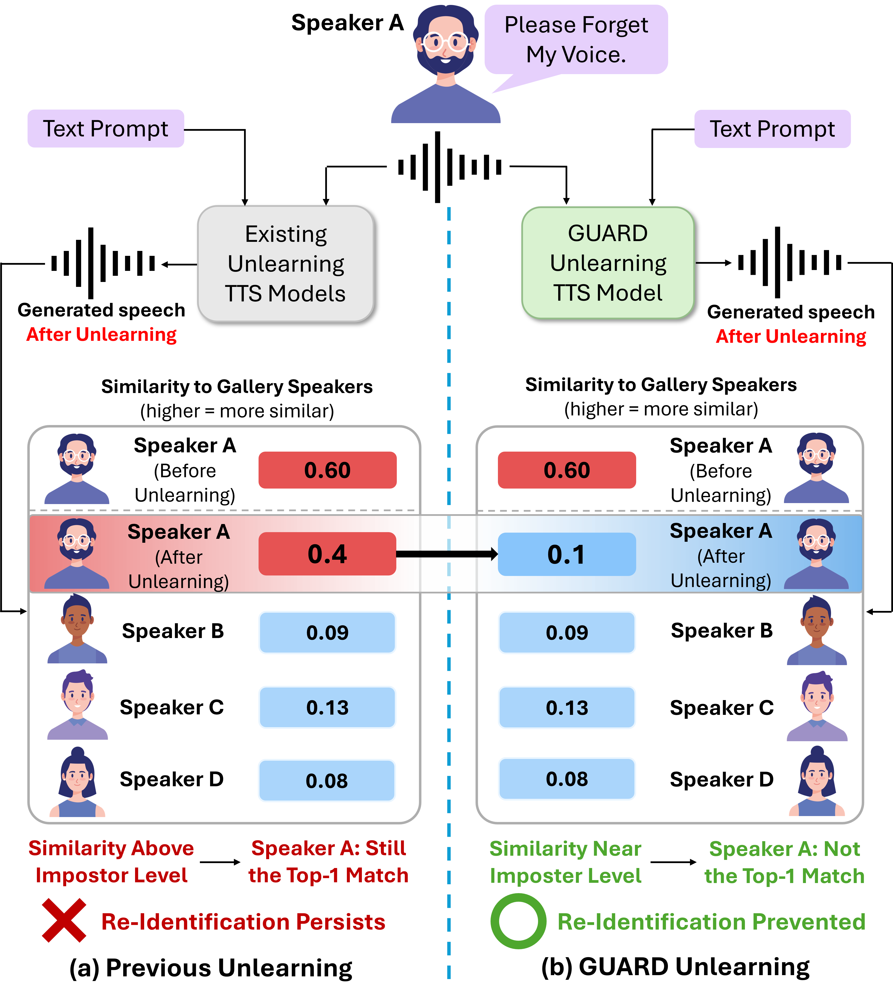
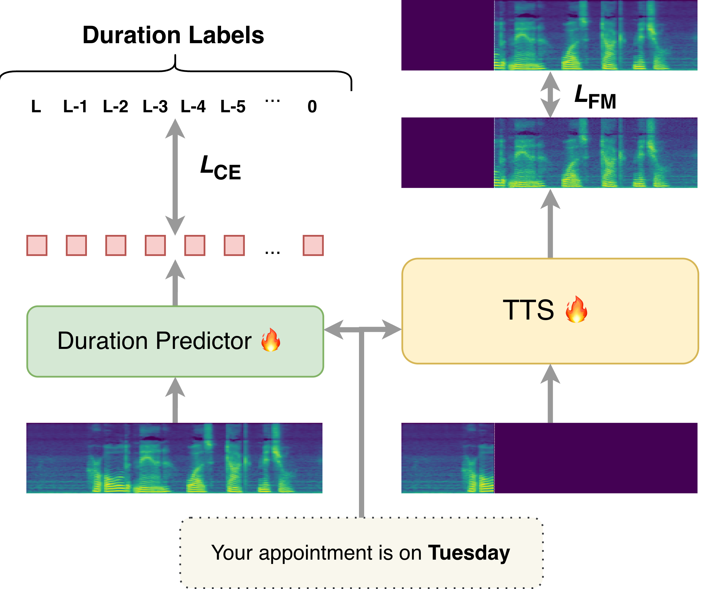
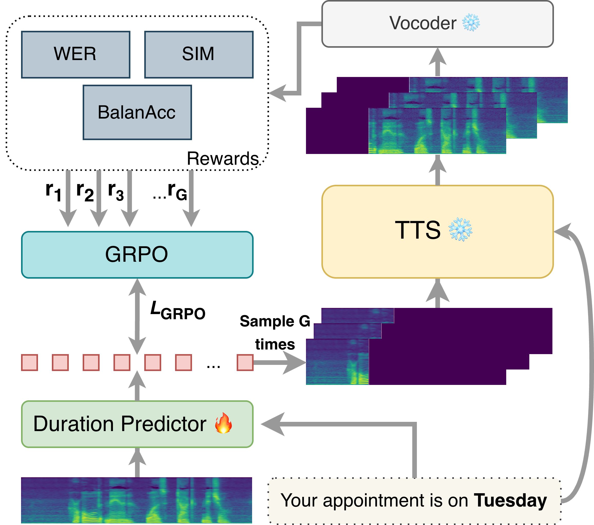
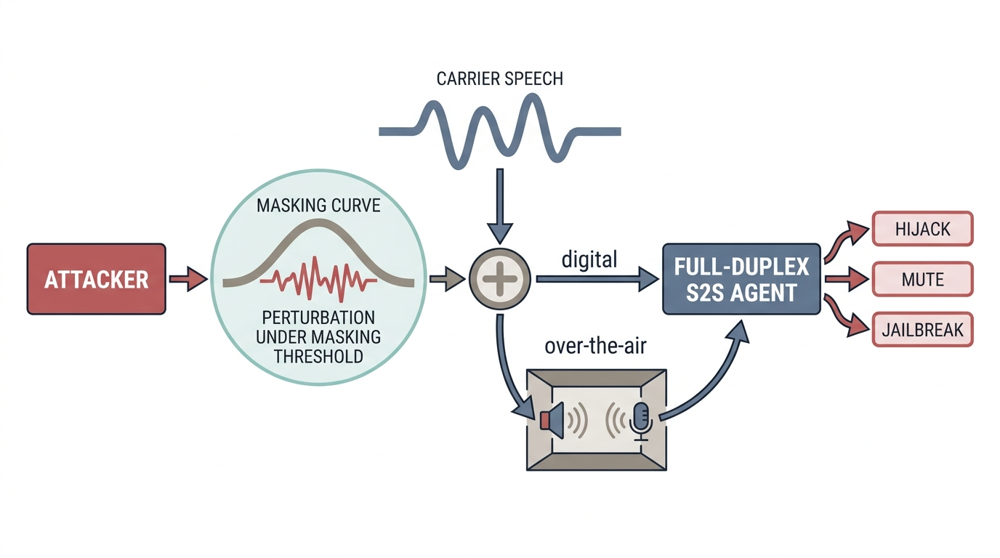

# 🚩 (2026-09-24) Scholar Inbox 추천 논문 

# 📚 UNITE-AUDIO: Joint Learning of Continuous Tokenization and Latent Flow Matching for Text-to-Audio Generation

🚀 URL: https://arxiv.org/html/2609.28206

## 🌏 Abstract (원문)
Text-to-audio (TTA) generation aims to synthesize realistic audio that faithfully reflects natural-language descriptions. Most TTA systems adopt a two-stage latent paradigm: an audio tokenizer is optimized for reconstruction and then frozen, after which a generative model is trained in the resulting latent space. However, reconstruction-oriented representations may be suboptimal for generation, motivating joint representation and generative learning. To this end, we introduceUnite-Audio, to our knowledge, is thefirstto jointly learn continuous audio representations and latent flow matching for TTA.By coupling reconstruction with self-supervised generative prediction,Unite-Audio allows the generative objective to directly shape the latent space rather than treating it as a fixed intermediate representation. We further employ Flow-GRPO post-training to improve text-conditioned generation.Experiments show competitive TTA performance with a compact latent flow model, while ablation studies confirm the benefit of jointly learning the audio representation and generative model. Audio samples are available athttps://runwushi.github.io/Unite-Audio/.
## 🌏 Abstract (번역)
텍스트-오디오(TTA) 생성은 자연어 설명을 충실히 반영하는 사실적인 오디오를 합성하는 것을 목표로 합니다. 대부분의 TTA 시스템은 2단계 잠재 패러다임을 채택합니다. 즉, 오디오 토크나이저가 재구성을 위해 최적화된 후 고정되고, 그 다음 생성 모델이 결과 잠재 공간에서 훈련됩니다. 그러나 재구성 지향적 표현은 생성에 최적이 아닐 수 있으며, 이는 공동 표현 및 생성 학습의 필요성을 제기합니다. 이를 위해 우리는 TTA를 위한 연속 오디오 표현과 잠재 흐름 매칭을 공동으로 학습하는 최초의 시스템인 Unite-Audio를 소개합니다. Unite-Audio는 재구성과 자기 지도 생성 예측을 결합함으로써, 생성 목표가 잠재 공간을 고정된 중간 표현으로 취급하는 대신 직접 형성할 수 있도록 합니다. 우리는 텍스트 조건부 생성을 개선하기 위해 Flow-GRPO 후처리 훈련을 추가로 사용합니다. 실험 결과, 컴팩트한 잠재 흐름 모델로 경쟁력 있는 TTA 성능을 보였으며, 제거 연구(ablation studies)는 오디오 표현과 생성 모델을 공동으로 학습하는 것의 이점을 확인시켜 주었습니다. 오디오 샘플은 https://runwushi.github.io/Unite-Audio/에서 확인할 수 있습니다.

## 🔍 Methods & Results
- 기존 TTA 시스템의 2단계 잠재 패러다임(재구성 최적화 후 고정된 오디오 토크나이저, 이후 잠재 공간에서 생성 모델 훈련)이 재구성 지향적 표현으로 인해 생성에 최적이지 않을 수 있다는 문제를 제기했습니다.
- Unite-Audio를 제안하여, TTA를 위한 연속 오디오 표현과 잠재 흐름 매칭을 공동으로 학습하는 최초의 시스템입니다.
- 재구성과 자기 지도 생성 예측을 결합하여, 생성 목표가 잠재 공간을 고정된 중간 표현이 아닌 직접 형성하도록 합니다.
- 텍스트 조건부 생성을 개선하기 위해 Flow-GRPO 후처리 훈련을 추가로 사용했습니다.
- 실험 결과, 컴팩트한 잠재 흐름 모델로 경쟁력 있는 TTA 성능을 달성했습니다.
- 제거 연구(ablation studies)를 통해 오디오 표현과 생성 모델을 공동으로 학습하는 것의 이점을 확인했습니다.

---
**Usage Info**: 1572 tokens used.
**Generated at**: 2026-09-24 18:23:48

---

# 📚 DriftAudio: Marginal Drifting for Distributional Post-Training of One-Step Text-to-Audio Generators

🚀 URL: https://arxiv.org/html/2609.27598

## 🌏 Abstract (원문)
Recent one-step text-to-audio (TTA) models substantially reduce inference cost, yet their generated distributions can still be improved through post-training. We proposeDriftAudio, a distributional post-training method that adapts Drifting to pretrained one-step TTA generators. Applying Drifting condition-wise is challenging under free-form text conditioning, where only one or a few real samples are typically available for a particular condition. DriftAudio instead performs Drifting on the marginal audio distribution while retaining text-conditioned generation. The drifting field is estimated in a frozen audio feature space using resampled real samples, a rolling bank of generated samples, and the current batch of generated samples. The resulting Drifting field provides a detached training target for updating only the generator, keeping the original one-step inference procedure. On AudioCaps, starting from MeanAudio, DriftAudio reduces FAD and FD by33.9%33.9%and17.6%17.6%, respectively, while also improving KL and CLAP. Starting from FdAudio, it further reduces FAD, FD, and KL, with trade-offs in IS and CLAP. These results demonstrate the effectiveness of marginal distributional post-training for one-step TTA generation.
## 🌏 Abstract (번역)
최근 원스텝 텍스트-오디오(TTA) 모델은 추론 비용을 크게 줄였지만, 생성된 분포는 후속 훈련을 통해 여전히 개선될 수 있습니다. 우리는 사전 훈련된 원스텝 TTA 생성기에 Drifting을 적용하는 분포 기반 후속 훈련 방법인 DriftAudio를 제안합니다. 자유 형식 텍스트 조건화에서는 특정 조건에 대해 일반적으로 하나 또는 소수의 실제 샘플만 사용할 수 있으므로, 조건별로 Drifting을 적용하는 것은 어렵습니다. 대신 DriftAudio는 텍스트 조건부 생성을 유지하면서 주변 오디오 분포에 Drifting을 수행합니다. Drifting 필드는 재샘플링된 실제 샘플, 생성된 샘플의 롤링 뱅크, 그리고 현재 배치에서 생성된 샘플을 사용하여 고정된 오디오 특징 공간에서 추정됩니다. 결과 Drifting 필드는 생성기만 업데이트하기 위한 분리된 훈련 목표를 제공하여, 원래의 원스텝 추론 절차를 유지합니다. AudioCaps에서 MeanAudio를 시작점으로 했을 때, DriftAudio는 FAD와 FD를 각각 33.9%와 17.6% 감소시켰으며, KL과 CLAP도 개선했습니다. FdAudio를 시작점으로 했을 때는 FAD, FD, KL을 추가로 감소시켰지만, IS와 CLAP에서는 트레이드오프가 있었습니다. 이러한 결과는 원스텝 TTA 생성을 위한 주변 분포 기반 후속 훈련의 효과를 입증합니다.

## 🔍 Methods & Results
- DriftAudio는 사전 훈련된 원스텝 텍스트-오디오(TTA) 생성기를 위한 분포 기반 후속 훈련 방법입니다.
- 자유 형식 텍스트 조건화에서 제한된 실제 샘플 문제를 해결하기 위해, 조건별 Drifting 대신 텍스트 조건부 생성을 유지하면서 주변 오디오 분포에 Drifting을 수행합니다.
- Drifting 필드는 재샘플링된 실제 샘플, 생성된 샘플의 롤링 뱅크, 현재 배치에서 생성된 샘플을 사용하여 고정된 오디오 특징 공간에서 추정됩니다.
- 결과 Drifting 필드는 생성기만 업데이트하는 분리된 훈련 목표를 제공하여, 원래의 원스텝 추론 절차를 유지합니다.
- AudioCaps 벤치마크에서 MeanAudio를 시작점으로 했을 때, DriftAudio는 FAD를 33.9%, FD를 17.6% 감소시켰으며 KL과 CLAP을 개선했습니다.
- FdAudio를 시작점으로 했을 때는 FAD, FD, KL을 추가로 감소시켰으나 IS 및 CLAP에서 트레이드오프가 있었습니다.
- 이러한 결과는 원스텝 TTA 생성을 위한 주변 분포 기반 후속 훈련의 효과를 입증합니다.

## 🖼 Figures

*Figure 1: Overview of DriftAudio. The one-step generator remains text-conditioned, while Drifting is performed on the marginal audio distribution in feature space. At each optimization step, real features are resampled from the training set, while generated reference features are maintained in a FIFO bank initialized with pre-generated samples and updated using the current generated samples.*

---
**Usage Info**: 2641 tokens used.
**Generated at**: 2026-09-24 18:23:59

---

# 📚 One-Step Voice Conversion by Learning kNN Transport in WavLM Space

🚀 URL: https://arxiv.org/html/2609.27230

## 🌏 Abstract (원문)
Voice conversion (VC) systems fall into two families: non-parametric embedding-space methods, which need no trained model but degrade on short target utterances, and spectrogram-based neural architectures, which achieve strong quality via multi-module pipelines with tens of millions of parameters. We proposekkNN-FM-VC, a single conditional flow-matching network that learns to approximate thekkNN-VC mapping between WavLM embedding distributions of source and target speakers, replacing explicit pointwisekkNN matching with a neural regressor trained onkkNN-generated pairs. The model is conditioned on the target speaker via cross-attention and FiLM, and trained under three Gaussian conditional paths (Schrödinger bridge, straight line, and constant-variance Gaussian tube), enabling few-step sampling. Unlike Phoneme Hallucinator, which uses an upsampling stage followed by kNN matching, our 13M-parameter model performs conversion with a single learned network and supports one-step inference. On LibriSpeech, the one-step Gaussian Bridge achieves lower WER and higher estimated speech quality than FreeVC and Phoneme Hallucinator. Relative tokkNN andkkDOT, it substantially reduces WER.
## 🌏 Abstract (번역)
음성 변환(VC) 시스템은 두 가지 유형으로 나뉩니다: 훈련된 모델이 필요 없지만 짧은 목표 발화에서 성능이 저하되는 비모수 임베딩 공간 방법과 수천만 개의 매개변수를 가진 다중 모듈 파이프라인을 통해 강력한 품질을 달성하는 스펙트로그램 기반 신경 아키텍처입니다. 우리는 kkNN-FM-VC를 제안합니다. 이는 소스 및 목표 화자의 WavLM 임베딩 분포 간의 kkNN-VC 매핑을 근사하도록 학습하는 단일 조건부 플로우 매칭 네트워크로, 명시적인 점별 kkNN 매칭을 kkNN 생성 쌍으로 훈련된 신경 회귀기로 대체합니다. 이 모델은 교차 어텐션과 FiLM을 통해 목표 화자에 조건화되며, 세 가지 가우시안 조건부 경로(슈뢰딩거 브리지, 직선, 상수 분산 가우시안 튜브) 하에서 훈련되어 적은 단계 샘플링을 가능하게 합니다. 업샘플링 단계 후 kNN 매칭을 사용하는 Phoneme Hallucinator와 달리, 우리의 1,300만 매개변수 모델은 단일 학습된 네트워크로 변환을 수행하며 원스텝 추론을 지원합니다. LibriSpeech에서 원스텝 가우시안 브리지는 FreeVC 및 Phoneme Hallucinator보다 낮은 WER과 더 높은 추정 음성 품질을 달성합니다. kkNN 및 kkDOT에 비해 WER을 크게 줄입니다.

## 🔍 Methods & Results
- kkNN-FM-VC는 WavLM 임베딩 분포 간의 kkNN-VC 매핑을 근사하도록 학습하는 단일 조건부 플로우 매칭 네트워크로, 명시적인 점별 kkNN 매칭을 kkNN 생성 쌍으로 훈련된 신경 회귀기로 대체합니다.
- 모델은 소스 시퀀스와 보조 목표 시퀀스 간의 교차 어텐션 및 전역 화자 표현과 시간을 주입하는 FiLM 레이어를 통해 목표 화자에 조건화됩니다.
- 훈련은 플로우 매칭 목적 함수와 화자 일관성 손실을 결합하여 수행되며, 슈뢰딩거 브리지, 직선, 상수 분산 가우시안 튜브의 세 가지 가우시안 조건부 경로를 사용합니다.
- 추론 시, 목표 발화가 조건 시퀀스를 제공하며, 학습된 벡터 필드를 수치적으로 통합하여 변환된 WavLM 표현을 얻고, 이를 HiFi-GAN 보코더로 파형으로 디코딩합니다. 원스텝 추론을 지원합니다.
- 1,300만 개의 매개변수를 가진 모델로, 단일 학습된 네트워크로 변환을 수행합니다.
- LibriSpeech 데이터셋에서 원스텝 가우시안 브리지 변형은 FreeVC 및 Phoneme Hallucinator보다 낮은 WER과 더 높은 추정 음성 품질을 달성했으며, kkNN 및 kkDOT에 비해 WER을 크게 줄였습니다.

## 🖼 Figures

*Figure 1:An overview of the core flow matching method. Flow matching transports source WavLM embeddings toward 
𝑘
NN-derived target embeddings while conditioning on target-speaker information.*

---
**Usage Info**: 4233 tokens used.
**Generated at**: 2026-09-24 18:24:11

---

# 📚 Phonemizing User-Generated Text: A Benchmark, Taxonomy, and Compositional Approach

🚀 URL: https://arxiv.org/html/2609.27205

## 🌏 Abstract (원문)
Text-to-speech systems increasingly process user-generated text (UGT) such aspplandimo, whose pronunciation must be inferred from the canonical rather than surface form.We introduceUGTPhon, the first grapheme-to-phoneme (G2P) benchmark for UGT in English, Vietnamese, and Korean, together with an inference-grounded taxonomy for fine-grained diagnosis.Existing G2P models and frontier LLMs exhibit a systematic canonical-to-non-canonical performance gap, reaching up to66.866.8PER points.As a benchmark baseline, we propose a simple compositional G2P approach that incorporates canonical-form evidence through exact-match lookup and staged decoding. Across matched ByT5 and Qwen2.5-0.5B backbones, explicit canonical-form modeling consistently reduces non-canonical G2P errors. The 0.5B variant also performs competitively with much larger few-shot frontier LLMs, highlighting the benefit of explicitly modeling canonical-form inference for UGT phonemization.
## 🌏 Abstract (번역)
텍스트 음성 변환 시스템은 점점 더 사용자 생성 텍스트(UGT)를 처리하고 있으며, 이 텍스트의 발음은 표면 형태가 아닌 정규 형태로부터 추론되어야 합니다. 우리는 영어, 베트남어, 한국어 UGT를 위한 최초의 음소 변환(G2P) 벤치마크인 UGTPhon을 소개하며, 세분화된 진단을 위한 추론 기반 분류 체계를 함께 제공합니다. 기존 G2P 모델과 최신 LLM은 정규-비정규 성능 격차를 체계적으로 보이며, 최대 66.8 PER 포인트에 달합니다. 벤치마크 기준선으로, 우리는 정확히 일치하는 조회 및 단계별 디코딩을 통해 정규 형태 증거를 통합하는 간단한 구성적 G2P 접근 방식을 제안합니다. ByT5 및 Qwen2.5-0.5B 백본에서 명시적인 정규 형태 모델링은 비정규 G2P 오류를 일관되게 줄입니다. 0.5B 변형은 훨씬 더 큰 소수샷 최신 LLM과 경쟁력 있는 성능을 보여주며, UGT 음소화에 대한 정규 형태 추론을 명시적으로 모델링하는 이점을 강조합니다.

## 🔍 Methods & Results
- 기존의 비정규 G2P 접근 방식(Vanilla G2P, Lexical normalization + G2P)은 정규화-음소화 구성에 대한 공동 감독이 부족하거나 정규 형태로 복구 가능한 표면 형태를 과도하게 교정하는 문제가 있습니다.
- 제안하는 방법은 단일 아키텍처 내에서 두 단계를 공동으로 감독하는 검색 증강 구성적 G2P 기준선입니다.
- 제안된 접근 방식은 세 가지 주요 구성 요소로 이루어져 있습니다: 문맥화된 입력 인코딩, 검색 증강 정규 형태 프롬프팅, 그리고 단계별 디코딩입니다.
- 문맥화된 입력 인코딩은 대상 단어를 문장 컨텍스트 내에서 언어 태그와 파이프 마커로 표시하여 입력 문자열을 구성하며, ByT5-small 및 Qwen 2.5-0.5B 백본에 적용 가능합니다.
- 검색 증강 정규 형태 프롬프팅은 훈련 데이터셋에서 파생된 데이터스토어에서 정확히 일치하는 조회를 통해 정규 형태 힌트(Gnc→Gc)를 제공하며, 조회 실패 시 <Miss> 마커를 사용하여 모델이 문장 컨텍스트에 의존하도록 유도합니다.
- 데이터스토어는 GPT-5.4-mini를 사용하여 추가 (Gnc, Gc) 후보를 생성하여 확장되었으며, 표준 단어와 일치하거나 정규화 신호가 없는 후보는 제외됩니다.
- 단계별 디코딩은 모델이 단일 자동회귀 궤적에서 음소 시퀀스(Pc) 이전에 정규화 출력(Gc)을 생성하도록 하여, 정규화 단계와 음소화 단계 모두에 명시적인 감독을 제공합니다.
- 정규 단어의 경우 모델은 정규화 단계를 건너뛰고 Pc를 직접 생성하며, 비정규 단어의 경우 학습된 중간 단계로 Gc를 생성한 후 Pc를 생성합니다.
- 모델은 전체 대상 시퀀스에 대한 교차 엔트로피 손실로 종단 간 훈련되며, 보조 목표나 추가 손실 항은 사용하지 않습니다.
- 이러한 구성 요소들을 통해 단일 G2P 아키텍처 내에서 정규 형태 모델링을 명시적으로 수행하여, 정규 토큰 정확도를 희생하지 않고 정규화 및 음소화를 감독합니다.
- ByT5 및 Qwen2.5-0.5B 백본에서 명시적인 정규 형태 모델링은 비정규 G2P 오류를 일관되게 줄이는 것으로 나타났습니다.
- 0.5B 변형 모델은 훨씬 더 큰 소수샷 최신 LLM과 경쟁력 있는 성능을 보여, UGT 음소화에 대한 정규 형태 추론을 명시적으로 모델링하는 이점을 입증했습니다.

## 🖼 Figures

*Figure 1:Conventional G2P models (red, left) read non-canonical words (ppl, luv, imo) letter by letter, producing letter names. Accurate phonemization (green, right) therefore requires recovering the canonical form (people, love, in my opinion) before generating phonemes.*

*Figure 2:Three approaches to non-canonical G2P. (A) Vanilla G2P reads words literally. (B) A lexical normalization model rewrites the input but overcorrects canonical words, propagating errors downstream. (C) Our retrieval-augmented compositional G2P baseline injects a 
𝐺
𝑛
​
𝑐
→
𝐺
𝑐
 canonical form hint and emits 
𝐺
𝑐
 as an intermediate before the phonemes.*

---
**Usage Info**: 3293 tokens used.
**Generated at**: 2026-09-24 18:24:21

---

# 📚 JASPER: Joint Audio and Speech Pre-trained Encoder Representations

🚀 URL: https://arxiv.org/html/2609.27260

## 🌏 Abstract (원문)
Self-supervised learning (SSL) for speech and audio has largely progressed along separate tracks: speech models emphasize time-domain prediction, whereas audio representation learning has focused on time–frequency patterns. This separation creates a compatibility gap, limiting cross-domain generalization. In this work, we introduceJASPER,JointAudio andSpeechPre-trainedEncoderRepresentations, a framework that augments speech-pretrained models with time–frequency objectives.Specifically, JASPER performs masked prediction of temporal and spectral targets over long audio segments, enabling spectro-temporal representation learning of speech and audio signals. The proposed method consistently outperforms multiple baselines and existing speech/audio encoders on diverse speech, audio, and music tasks, demonstrating the effectiveness of unified spectro-temporal modeling.
## 🌏 Abstract (번역)
음성 및 오디오를 위한 자기 지도 학습(SSL)은 주로 별개의 경로를 따라 발전해 왔습니다. 음성 모델은 시간 영역 예측을 강조하는 반면, 오디오 표현 학습은 시간-주파수 패턴에 중점을 두었습니다. 이러한 분리는 호환성 격차를 만들어 교차 도메인 일반화를 제한합니다. 본 연구에서는 음성 사전 학습 모델에 시간-주파수 목표를 추가하는 프레임워크인 JASPER(Joint Audio and Speech Pre-trained Encoder Representations)를 소개합니다. 구체적으로, JASPER는 긴 오디오 세그먼트에 걸쳐 시간적 및 스펙트럼적 목표에 대한 마스크 예측을 수행하여 음성 및 오디오 신호의 스펙트로-시간적 표현 학습을 가능하게 합니다. 제안된 방법은 다양한 음성, 오디오 및 음악 작업에서 여러 기준선 및 기존 음성/오디오 인코더보다 지속적으로 우수한 성능을 보여주며, 통합된 스펙트로-시간적 모델링의 효과를 입증합니다.

## 🔍 Methods & Results
- JASPER는 음성 사전 학습 모델에 시간-주파수 목표를 추가하여 음성 및 오디오를 위한 자기 지도 학습의 호환성 격차를 해소하는 프레임워크를 제안합니다.
- JASPER는 긴 오디오 세그먼트에 걸쳐 시간적 및 스펙트럼적 목표에 대한 마스크 예측을 수행하여 음성 및 오디오 신호의 스펙트로-시간적 표현 학습을 가능하게 합니다.
- 제안된 JASPER 방법은 다양한 음성, 오디오 및 음악 작업에서 여러 기준선 및 기존 음성/오디오 인코더보다 지속적으로 우수한 성능을 달성했습니다.
- 이 연구는 통합된 스펙트로-시간적 모델링이 교차 도메인 일반화에 효과적임을 입증했습니다.

## 🖼 Figures

*Fig. 1:Block schematic of the proposed JASPER framework for joint spectro-temporal modeling of audio data. (
𝑁
𝑡
 = 400, F = 800, 
𝑁
 = 50, 
𝑅
 = 8).*

---
**Usage Info**: 1196 tokens used.
**Generated at**: 2026-09-24 18:24:26

---

# 📚 Forget who you Forgot: Speaker Unlearning to Prevent Re-Identification in Zero-Shot Text-to-Speech

🚀 URL: https://arxiv.org/html/2609.27399

## 🌏 Abstract (원문)
Recent zero-shot text-to-speech (ZS-TTS) systems can reproduce a speaker’s voice with high fidelity from only a few seconds of reference speech, raising concerns over unauthorized voice cloning and impersonation. Speaker identity unlearning has recently emerged as an approach to selectively suppress this capability for speakers who opt out while preserving synthesis capability for other speakers. Although existing approaches reduce speaker similarity, preventing re-identification often faces severe degradation of speech quality. Motivated by this observation, we proposeGUARD, a lightweight speaker identity unlearning framework that combines a learned speaker gate with speaker-agnostic activation steering on a frozen TTS backbone. The steering vectors are optimized using group-relative reward optimization to shift outputs from forget speakers toward population-level impostor similarity while preserving intelligibility and speech naturalness. On CosyVoice2, GUARD reduces forget-speaker similarity from 0.541 to 0.103 and re-identification accuracy in a 150-speaker gallery from 73.5% to 0.5%, while preserving retain-speaker reproduction. The results demonstrate that similarity reduction alone may not fully characterize successful speaker identity unlearning and highlight re-identification as a complementary criterion for its evaluation.
## 🌏 Abstract (번역)
최근 제로샷 음성 합성(ZS-TTS) 시스템은 단 몇 초의 참조 음성만으로 화자의 목소리를 높은 충실도로 재현할 수 있어, 무단 음성 복제 및 사칭에 대한 우려를 낳고 있습니다. 화자 신원 망각(speaker identity unlearning)은 최근 이러한 기능을 선택적으로 억제하는 동시에 다른 화자에 대한 합성 능력은 유지하는 접근 방식으로 부상했습니다. 기존 접근 방식은 화자 유사성을 줄이지만, 재식별 방지는 종종 음성 품질의 심각한 저하를 초래합니다. 이러한 관찰에 동기 부여를 받아, 우리는 동결된 TTS 백본에서 학습된 화자 게이트와 화자 불가지론적 활성화 조향을 결합한 경량 화자 신원 망각 프레임워크인 GUARD를 제안합니다. 조향 벡터는 그룹 상대 보상 최적화를 사용하여 망각 화자의 출력을 모집단 수준의 사칭자 유사성으로 이동시키면서 명료도와 음성 자연스러움을 보존하도록 최적화됩니다. CosyVoice2에서 GUARD는 망각 화자 유사성을 0.541에서 0.103으로, 150명 화자 갤러리에서의 재식별 정확도를 73.5%에서 0.5%로 감소시키면서, 유지 화자 재현은 보존합니다. 이 결과는 유사성 감소만으로는 성공적인 화자 신원 망각을 완전히 특징짓지 못할 수 있음을 보여주며, 재식별이 평가를 위한 보완적인 기준임을 강조합니다.

## 🔍 Methods & Results
- GUARD는 사전 훈련된 제로샷 TTS 모델(CosyVoice2 백본)의 모든 파라미터를 동결한 상태에서, 망각 화자의 재식별을 억제하고 언어적 내용, 음성 자연스러움, 유지 화자 재현을 보존하는 것을 목표로 합니다.
- 화자 유사성을 최소화하는 대신, GUARD는 이를 관련 없는 화자 간의 유사성을 특징짓는 모집단 수준의 사칭자 유사성으로 유도합니다.
- GUARD는 흐름 디코더의 잔여 활성화를 계층별 조향 벡터를 사용하여 수정하며, 이 조향 벡터는 망각 화자들 간에 공유되고 GateNet이 예측하는 게이트 계수(g̃(e))에 의해 기여도가 제어됩니다.
- GateNet은 화자 임베딩으로부터 조향 계수를 예측하는 경량 MLP로, 망각 및 유지 화자 레이블을 사용하여 클래스 가중 이진 교차 엔트로피로 훈련됩니다.
- 계층별 조향 벡터는 익명성, 명료도, 음성 자연스러움에 대한 후처리 보상을 사용하여 최적화됩니다.
- 익명성 보상은 망각 화자 유사성이 모집단 수준의 사칭자 유사성에서 벗어나는 것을 페널티하고, 명료도 보상은 WER을 사용한 전사 오류를 페널티하며, 자연스러움 보상은 UTMOS 점수가 기준선보다 낮은 출력을 페널티합니다.
- CosyVoice2에서 GUARD는 망각 화자 유사성을 0.541에서 0.103으로 감소시키고, 150명 화자 갤러리에서 재식별 정확도를 73.5%에서 0.5%로 크게 낮추면서도 유지 화자의 음성 재현 능력은 보존했습니다.
- 연구 결과는 유사성 감소만으로는 성공적인 화자 신원 망각을 완전히 평가하기 어렵고, 재식별이 평가를 위한 보완적인 기준임을 시사합니다.

## 🖼 Figures

*Figure 1:Motivation for re-identification-aware speaker unlearning: GUARD shifts forget-speaker similarity toward population-level impostor similarity.*

*Figure 2:GUARD architecture. (a) Layer-wise steering vectors modify the residual activations of the decoder transformer blocks. (b) GateNet determines whether steering is applied to the input speaker. (c) Group-relative reward optimization learns the steering vectors from post-generation rewards.*

---
**Usage Info**: 2785 tokens used.
**Generated at**: 2026-09-24 18:24:35

---

# 📚 EmphTTS: An Emphasis-Control TTS with Reinforcement Learning

🚀 URL: https://arxiv.org/html/2609.27599

## 🌏 Abstract (원문)
Generating controllable and human-like emphasis remains an open challenge in text-to-speech, even when explicit emphasis control signals are provided in the text input, limiting the communicative accuracy of synthetic speech in real-world applications. Reinforcement learning has recently shown promise for post-training TTS systems to align with human preference, yet existing methods have not been applied to word-level prosodic control. We presentEmphTTS, a non-autoregressive TTS system that applies Group Relative Policy Optimization (GRPO) to the duration predictor with an emphasis localization reward, enabling direct optimization for word-level emphasis.
Evaluations show thatEmphTTSachieves the best emphasis controllability and performs the best in emphasis objective evaluation. In subjective preference tests,EmphTTSis significantly preferred over synthetic groundtruth and most baselines. Ablation studies show that GRPO improves emphasis realization beyond supervised-finetuning-based duration modeling and simple speaking-rate adjustment, while alleviating the mismatch between the independently trained duration predictor and TTS model.
## 🌏 Abstract (번역)
텍스트 입력에 명시적인 강조 제어 신호가 제공되더라도, 텍스트 음성 변환(TTS)에서 제어 가능하고 사람과 유사한 강조를 생성하는 것은 여전히 어려운 과제로 남아 있으며, 이는 실제 응용 분야에서 합성 음성의 의사소통 정확도를 제한합니다. 최근 강화 학습은 인간의 선호도에 맞춰 TTS 시스템을 후처리 훈련하는 데 유망함을 보여주었지만, 기존 방법들은 단어 수준의 운율 제어에는 적용되지 않았습니다. 우리는 강조 위치 보상(emphasis localization reward)과 함께 지속 시간 예측기(duration predictor)에 그룹 상대 정책 최적화(GRPO)를 적용하여 단어 수준 강조에 대한 직접적인 최적화를 가능하게 하는 비자기회귀 TTS 시스템인 EmphTTS를 제안합니다. 평가는 EmphTTS가 최고의 강조 제어 가능성을 달성하고 강조 객관적 평가에서 가장 우수한 성능을 보임을 보여줍니다. 주관적 선호도 테스트에서 EmphTTS는 합성된 그라운드 트루스(synthetic groundtruth) 및 대부분의 기준선(baselines)보다 훨씬 더 선호되었습니다. 제거 연구(ablation studies)는 GRPO가 지도 미세 조정 기반 지속 시간 모델링 및 단순한 발화 속도 조정을 넘어 강조 실현을 개선하며, 독립적으로 훈련된 지속 시간 예측기와 TTS 모델 간의 불일치를 완화함을 보여줍니다.

## 🔍 Methods & Results
- EmphTTS는 F5-TTS를 백본으로 사용하며, 표준 플로우 매칭 목표로 사전 훈련되어 기본 모델 M_TTS를 생성합니다.
- 지속 시간 예측기(M_DP)는 DiTTo-TTS의 인코더-디코더 아키텍처를 채택하여 각 타임스텝에서 남은 음성 길이를 범주형 분포로 예측하며, 카운트다운 목표로 훈련됩니다.
- M_TTS와 M_DP는 강조 레이블이 지정된 데이터로 개별적으로 미세 조정되어 M_TTS-SFT와 M_DP-SFT를 생성합니다.
- 독립적으로 훈련된 M_TTS-SFT와 M_DP-SFT 간의 불일치를 줄이기 위해, M_TTS-SFT를 고정한 채 M_DP-SFT를 그룹 상대 정책 최적화(GRPO)로 최적화합니다.
- GRPO 과정에서는 각 입력에 대해 G개의 후보 지속 시간을 샘플링하고, M_TTS-SFT를 사용하여 해당 음성을 합성합니다.
- 각 후보는 WER, 화자 유사성(SIM), 강조 위치 균형 정확도(BalanAcc)를 사용하여 평가되며, 보상 함수 `r_i = (1 - WER_i) + SIM_i + BalanAcc_i`가 사용됩니다.
- GRPO 손실은 M_DP-SFT에서 초기화된 `p_ref`를 사용하여 클립된 대리 목표(clipped surrogate objective)로 적용됩니다.
- 평가 결과, EmphTTS는 최고의 강조 제어 가능성과 강조 객관적 평가에서 가장 우수한 성능을 달성했습니다.
- 주관적 선호도 테스트에서 EmphTTS는 합성된 그라운드 트루스 및 대부분의 기준선보다 훨씬 더 선호되었습니다.
- 제거 연구를 통해 GRPO가 지도 미세 조정 기반 지속 시간 모델링 및 단순한 발화 속도 조정을 넘어 강조 실현을 개선하고, 독립적으로 훈련된 지속 시간 예측기와 TTS 모델 간의 불일치를 완화함을 확인했습니다.

## 🖼 Figures

*(a)Supervised fine-tuning (SFT) stage.*

*(a)Supervised fine-tuning (SFT) stage.*

*(b)Group Relative Policy Optimization (GRPO) stage.*

---
**Usage Info**: 4106 tokens used.
**Generated at**: 2026-09-24 18:24:49

---

# 📚 Psychoacoustically Aligned Latent Smoothing for Adversarial Robustness of Full-Duplex Speech-to-Speech Dialogue Models

🚀 URL: https://arxiv.org/html/2609.27378

## 🌏 Abstract (원문)
End-to-end speech-to-speech dialogue models listen and speak simultaneously, so a continuously open acoustic channel is exposed to adversarial manipulation. We formalize imperceptible attacks on full-duplex agents as optimization over additive perturbations confined beneath the psychoacoustic masking threshold of the carrier speech, under three goals: targeted semantic hijacking, response suppression, and policy jailbreaking. Against an undefended Moshi-style agent, white-box attacks succeed in up to 91.7% of trials. We then introduce psychoacoustically aligned latent smoothing (PALS), which injects anisotropic Gaussian noise shaped by local codebook covariance at the residual-vector-quantized latent interface, with input noise shaped by the masking threshold constraining the attacker and trained by a Kullback–Leibler consistency objective. Deployed with no inference-time cost, PALS reduces hijack to 8.3%, mute to 11.2%, and jailbreak to 9.1% at clean quality within 2.3%. A Monte Carlo-smoothed variant certifies an ellipsoidal latent radius up to 0.616, a guaranteed floor that the empirical robustness far exceeds.
## 🌏 Abstract (번역)
종단 간 음성-음성 대화 모델은 동시에 듣고 말하므로, 지속적으로 열려 있는 음향 채널이 적대적 조작에 노출됩니다. 우리는 전이중(full-duplex) 에이전트에 대한 지각 불가능한 공격을 캐리어 음성의 심리음향 마스킹 임계값 아래로 제한된 가산 섭동에 대한 최적화로 공식화하며, 세 가지 목표를 가집니다: 표적 의미 하이재킹, 응답 억제, 그리고 정책 탈옥. 방어되지 않은 Moshi 스타일 에이전트에 대해, 화이트박스 공격은 최대 91.7%의 시도에서 성공합니다. 우리는 이어서 심리음향적으로 정렬된 잠재 공간 스무딩(PALS)을 소개합니다. 이는 잔여 벡터 양자화된 잠재 인터페이스에서 지역 코드북 공분산에 의해 형성된 비등방성 가우시안 노이즈를 주입하며, 공격자를 제한하는 마스킹 임계값에 의해 형성된 입력 노이즈와 쿨백-라이블러 일관성 목표에 의해 훈련됩니다. 추론 시간 비용 없이 배포된 PALS는 하이재킹을 8.3%로, 음소거를 11.2%로, 탈옥을 9.1%로 줄이며, 2.3% 이내의 깨끗한 품질을 유지합니다. 몬테카를로 스무딩 변형은 최대 0.616의 타원형 잠재 반경을 보증하며, 이는 경험적 강건성이 훨씬 초과하는 보장된 하한선입니다.

## 🔍 Methods & Results
- 사용자 채널 파형(x)은 스트리밍 컨볼루션 인코더(Ec)에 의해 연속 잠재 프레임(z)으로 인코딩된 후, RVQ 양자화기(Q)에 의해 코드(z^)로 양자화됩니다.
- 공격은 캐리어 음성의 심리음향 마스킹 임계값(MPEG-1 심리음향 모델 1에 의해 계산됨) 아래로 제한된 지각 불가능한 섭동(delta)으로 공식화되며, 예산(Delta)은 dB로 보고됩니다.
- 공격자는 Ec, Q, 대화 모델(f_vartheta)에 대한 화이트박스 접근 권한과 방어에 대한 완전한 지식을 가지며, Adam 최적화기를 사용하여 섭동을 최적화합니다.
- 세 가지 공격 목표가 정의됩니다: 1) 표적 의미 하이재킹(공격자가 선택한 응답 강제), 2) 응답 억제(에이전트 스트림을 침묵 토큰으로 유도), 3) 정책 탈옥(유해한 요청에 대한 긍정적인 응답을 유도하는 재사용 가능한 접두사 최적화).
- 방어되지 않은 Moshi 스타일 에이전트에 대한 화이트박스 공격은 최대 91.7%의 성공률을 보였습니다.
- 심리음향적으로 정렬된 잠재 공간 스무딩(PALS) 방어가 도입되었습니다. 이는 잔여 벡터 양자화된 잠재 인터페이스에서 지역 코드북 공분산에 의해 형성된 비등방성 가우시안 노이즈를 주입하고, 공격자를 제한하는 마스킹 임계값에 의해 형성된 입력 노이즈를 사용하며, 쿨백-라이블러 일관성 목표에 의해 훈련됩니다.
- 추론 시간 비용 없이 배포된 PALS는 공격 성공률을 크게 감소시켰습니다: 하이재킹은 8.3%로, 음소거는 11.2%로, 탈옥은 9.1%로 줄었으며, 2.3% 이내의 깨끗한 음성 품질을 유지했습니다.
- 몬테카를로 스무딩 PALS 변형은 최대 0.616의 타원형 잠재 반경을 보증하며, 이는 경험적 강건성이 훨씬 초과하는 보장된 하한선입니다.

## 🖼 Figures

*Fig. 1:Threat model. The attacker optimizes a perturbation confined beneath the masking threshold of the carrier speech, delivers it digitally or over the air, and pursues hijack, mute, or jailbreak goals.*

*Fig. 2:The PALS post-training pipeline. The augmented path adds masking-shaped noise in the waveform domain and anisotropic codebook-covariance noise in the latent domain, re-quantizes through a straight-through estimator, and is tied to the clean path by a KL consistency term. One scalar 
𝜎
 governs both augmentations.*

---
**Usage Info**: 3721 tokens used.
**Generated at**: 2026-09-24 18:25:01

---

# 📚 WTF?!Simulation-Free Reinforcement Learning with Wasserstein-Tilted Flow Maps

🚀 URL: https://arxiv.org/html/2609.27033

## 🌏 Abstract (원문)
Reward fine-tuningaims to update a pre-trained flow-based generative model to improve the downstream reward of its generated samples.Existing methods typically formulate this problem as sampling from a reward-tilted distribution, the solution to a KL-regularized reward-maximization problem.Here, we introduce anoptimal transportregularizer built directly from the pre-trained drift.Unlike KL reward tilting, the resulting objective transports individual samples toward higher reward rather than reweighting the base distribution.We show that the resulting problem is equivalent to adeterministic optimal control problemon the flow.Given a pre-trained flow map, this equivalence yields a simulation-free reinforcement learning algorithm for fine-tuning generative flows.We call the resulting frameworkWasserstein-Tilted Flow Maps (WTF), the first end-to-end fine-tuning recipe native to flow maps.The output is a fine-tuned flow map that retains strong reward-aligned performance at few-step inference budgets without post-hoc distillation.Experiments on ImageNet-256 and text-to-image show that WTF achieves higher reward with comparable or higher diversity than baselines, while requiring up to280×280\timesless training compute.More broadly, we argue that accelerated samplers such as flow maps are essential infrastructure for efficient post-training, and that the dominant KL-regularized formulation is only one of many choices worth revisiting.
## 🌏 Abstract (번역)
보상 미세 조정은 사전 훈련된 흐름 기반 생성 모델을 업데이트하여 생성된 샘플의 다운스트림 보상을 개선하는 것을 목표로 합니다. 기존 방법은 일반적으로 이 문제를 KL 정규화된 보상 최대화 문제의 해인 보상 기울어진 분포에서 샘플링하는 것으로 공식화합니다. 본 연구에서는 사전 훈련된 드리프트에서 직접 구축된 최적 수송 정규화자를 도입합니다. KL 보상 기울기와 달리, 결과 목표는 기본 분포를 재가중치화하는 대신 개별 샘플을 더 높은 보상으로 수송합니다. 우리는 결과 문제가 흐름에 대한 결정론적 최적 제어 문제와 동일함을 보여줍니다. 사전 훈련된 흐름 맵이 주어지면, 이 등가성은 생성 흐름을 미세 조정하기 위한 시뮬레이션 없는 강화 학습 알고리즘을 제공합니다. 우리는 이 프레임워크를 Wasserstein-Tilted Flow Maps (WTF)라고 부르며, 흐름 맵에 고유한 최초의 종단 간 미세 조정 레시피입니다. 결과물은 사후 증류 없이 몇 단계 추론 예산에서 강력한 보상 정렬 성능을 유지하는 미세 조정된 흐름 맵입니다. ImageNet-256 및 텍스트-이미지 실험은 WTF가 기준선보다 더 높은 보상과 비슷하거나 더 높은 다양성을 달성하면서 최대 280배 적은 훈련 계산량을 요구함을 보여줍니다. 더 나아가, 우리는 흐름 맵과 같은 가속 샘플러가 효율적인 후처리 훈련을 위한 필수 인프라이며, 지배적인 KL 정규화 공식은 재검토할 가치가 있는 많은 선택지 중 하나일 뿐이라고 주장합니다.

## 🔍 Methods & Results
- 기존 보상 미세 조정 방법은 KL 정규화된 보상 최대화 문제로, 보상 기울어진 분포에서 샘플링하는 방식으로 접근합니다.
- 본 연구에서는 사전 훈련된 드리프트에서 직접 구축된 '최적 수송 정규화자'를 도입하여 Wasserstein-Tilted Flow Maps (WTF) 프레임워크를 제안합니다.
- WTF는 KL 보상 기울기와 달리 기본 분포를 재가중치화하는 대신 개별 샘플을 더 높은 보상으로 직접 수송합니다.
- 제안된 문제는 흐름에 대한 결정론적 최적 제어 문제와 동일하며, 이를 통해 사전 훈련된 흐름 맵을 미세 조정하기 위한 시뮬레이션 없는 강화 학습 알고리즘을 도출합니다.
- WTF는 흐름 맵에 고유한 최초의 종단 간 미세 조정 방법으로, 사후 증류 없이 적은 추론 단계 예산에서도 강력한 보상 정렬 성능을 유지하는 미세 조정된 흐름 맵을 생성합니다.
- ImageNet-256 및 텍스트-이미지 데이터셋에 대한 실험 결과, WTF는 기준선 대비 더 높은 보상과 비슷하거나 더 높은 다양성을 달성했습니다.
- WTF는 훈련 계산량 측면에서 기준선보다 최대 280배 적은 자원을 요구하여 효율성을 입증했습니다.

## 🖼 Figures
![Figure 1:Reward-aligned generation at few steps. Flow maps fine-tuned with WTF for HPSv2 [1], a learned human-preference reward. WTF at 
4
 steps (text-to-image, left) and 
1
 step (ImageNet-256, right) matches the quality of its own 
50
-step generation; the base model is shown at 
50
 steps. Prompts are given in Section I.2.](../images/2026-09-24/2609.27033/2609.27033_fig0.png)
*Figure 1:Reward-aligned generation at few steps. Flow maps fine-tuned with WTF for HPSv2 [1], a learned human-preference reward. WTF at 
4
 steps (text-to-image, left) and 
1
 step (ImageNet-256, right) matches the quality of its own 
50
-step generation; the base model is shown at 
50
 steps. Prompts are given in Section I.2.*

*Figure 11:Qualitative results on ImageNet. Samples at 250 NFE from the base model, adjoint matching, and WTF, with the initial latent fixed down each column. Adjoint matching stays close to the base sample. WTF changes composition and color while keeping the class.*

![Figure 15:Reward-aligned text-to-image samples across inference budgets (first set). Each column is one prompt and each row an inference budget, with the pre-trained model in the top row. Within a column every WTF row uses the same initial noise, so the sequence shows one sample refining as the budget grows rather than independent draws. Prompts, left to right: (a) “A zentangle pizza illustration with colorful ink. (b) “Cross section of an apple in a limited neutral palette with a beautiful graphic design and a painterly style. (c) “Scary African voodoo paintings by Jean-Michel Basquiat. (d) “A digital painting of the legendary water city of Atlantis, featuring a Greek temple, statues, and a red flag.” (e) “A pencil sketch of Danny Devito by Milt Kahl. (f) “The image features a surreal fox and skulls in highly detailed, liquid oilpaint style. (g) “An art piece by Wojciech Siudmak depicting an individual gazing at the vast cosmos. (h) “A cobblestone street with a tree over the sea at sunset, illuminated by sun rays.](../images/2026-09-24/2609.27033/2609.27033_fig7.png)
*Figure 15:Reward-aligned text-to-image samples across inference budgets (first set). Each column is one prompt and each row an inference budget, with the pre-trained model in the top row. Within a column every WTF row uses the same initial noise, so the sequence shows one sample refining as the budget grows rather than independent draws. Prompts, left to right: (a) “A zentangle pizza illustration with colorful ink. (b) “Cross section of an apple in a limited neutral palette with a beautiful graphic design and a painterly style. (c) “Scary African voodoo paintings by Jean-Michel Basquiat. (d) “A digital painting of the legendary water city of Atlantis, featuring a Greek temple, statues, and a red flag.” (e) “A pencil sketch of Danny Devito by Milt Kahl. (f) “The image features a surreal fox and skulls in highly detailed, liquid oilpaint style. (g) “An art piece by Wojciech Siudmak depicting an individual gazing at the vast cosmos. (h) “A cobblestone street with a tree over the sea at sunset, illuminated by sun rays.*

![Figure 16:Reward-aligned text-to-image samples across inference budgets (second set). Each column is one prompt and each row an inference budget, with the pre-trained model in the top row. Within a column every WTF row uses the same initial noise, so the sequence shows one sample refining as the budget grows rather than independent draws. Prompts, left to right: (a) “A painting of a firefall cascading over a high cliff. (b) “An image depicting the concept of yin and yang. (c) “Psytrance artwork by Lee Madgwick. (d) “Artwork depicting a futuristic car, created by Ed Roth. (e) “A night scene of a lavender field with a town and church in the background, reminiscent of Van Gogh. (f) “An image depicting the concept of yin and yang. (g) “Portrait of a creature with bat ears, a wolf snout and eagle features, wearing a poncho and helmet. (h) “The image is a drawing of a skeletal, frail figure driving a chariot pulled by two skeletal hounds.](../images/2026-09-24/2609.27033/2609.27033_fig8.png)
*Figure 16:Reward-aligned text-to-image samples across inference budgets (second set). Each column is one prompt and each row an inference budget, with the pre-trained model in the top row. Within a column every WTF row uses the same initial noise, so the sequence shows one sample refining as the budget grows rather than independent draws. Prompts, left to right: (a) “A painting of a firefall cascading over a high cliff. (b) “An image depicting the concept of yin and yang. (c) “Psytrance artwork by Lee Madgwick. (d) “Artwork depicting a futuristic car, created by Ed Roth. (e) “A night scene of a lavender field with a town and church in the background, reminiscent of Van Gogh. (f) “An image depicting the concept of yin and yang. (g) “Portrait of a creature with bat ears, a wolf snout and eagle features, wearing a poncho and helmet. (h) “The image is a drawing of a skeletal, frail figure driving a chariot pulled by two skeletal hounds.*

---
**Usage Info**: 1859 tokens used.
**Generated at**: 2026-09-24 18:25:10

---

# 📚 Mizar: A 159M-Parameter Audio-Language Model for Audio Understanding

🚀 URL: https://arxiv.org/html/2609.28344

## 🌏 Abstract (원문)
Audio-language models (ALMs) integrate acoustic perception with the knowledge encoded in language models, enabling contextual understanding of auditory events. Making these capabilities practical on devices with limited memory and computation motivates our focus on small ALMs with fewer than 200M parameters. We introduce a recipe that brings together architecture, data, and three-stage training to build Mizar, a 159.3M-parameter ALM. Its architecture connects a compact CED-Small audio encoder to SmolLM2-135M through a frequency-merging mapper. With supervision drawn from ReasonAQA, AudioMCQ, and AVQA, the model undergoes three training stages: audio–language alignment (Stage 1), audio-dependent fine-tuning (Stage 2), and post-training (Stage 3) aimed at strengthening weak skills while retaining learned capabilities. Across five random seeds, Mizar achieves mean accuracies of 52.92% on MMAU, 42.42% on MMAR, and 36.02% on ADQA-clean, surpassing the previous best-performing ALM below 200M parameters on all three benchmarks. It also supports local inference on a single CPU: on questions from the MMAU benchmark, the mean latency from opening the audio file to generating a complete answer is 1.09 seconds. Code and checkpoints are available athttps://github.com/KaiyangLi1992/Mizar_159M.
## 🌏 Abstract (번역)
오디오-언어 모델(ALM)은 음향 인식을 언어 모델에 인코딩된 지식과 통합하여 청각 이벤트에 대한 문맥적 이해를 가능하게 합니다. 제한된 메모리와 연산 능력을 가진 장치에서 이러한 기능을 실용적으로 구현하기 위해 2억 개 미만의 파라미터를 가진 소형 ALM에 중점을 두었습니다. 우리는 아키텍처, 데이터, 그리고 3단계 훈련을 결합하여 1억 5,930만 개의 파라미터를 가진 ALM인 Mizar를 구축하는 방법을 소개합니다. Mizar의 아키텍처는 소형 CED-Small 오디오 인코더를 주파수 병합 매퍼를 통해 SmolLM2-135M에 연결합니다. ReasonAQA, AudioMCQ, AVQA에서 얻은 감독 데이터를 사용하여 모델은 오디오-언어 정렬(1단계), 오디오 의존적 미세 조정(2단계), 그리고 학습된 능력을 유지하면서 약한 기술을 강화하는 것을 목표로 하는 후속 훈련(3단계)의 세 가지 훈련 단계를 거칩니다. 다섯 가지 무작위 시드에 걸쳐 Mizar는 MMAU에서 평균 52.92%, MMAR에서 42.42%, ADQA-clean에서 36.02%의 정확도를 달성하여 2억 개 미만의 파라미터를 가진 이전 최고의 ALM을 세 가지 벤치마크 모두에서 능가했습니다. 또한 단일 CPU에서 로컬 추론을 지원합니다. MMAU 벤치마크의 질문에 대해 오디오 파일을 열어 완전한 답변을 생성하는 데 걸리는 평균 지연 시간은 1.09초입니다. 코드와 체크포인트는 https://github.com/KaiyangLi1992/Mizar_159M에서 확인할 수 있습니다.

## 🔍 Methods & Results
- Mizar는 CED-Small 오디오 인코더(2,140만 파라미터, 고정), 오디오-언어 매퍼(337만 파라미터), SmolLM2-135M 언어 디코더로 구성되며 총 1억 5,930만 파라미터를 가집니다.
- CED-Small 인코더는 20초 오디오를 126x4x384 특징 그리드로 인코딩하며, 매퍼는 이 특징을 언어 디코더의 임베딩 공간에 정렬하고 전역 컨텍스트 및 위치 임베딩을 추가합니다.
- 훈련은 세 단계로 진행됩니다: 1단계(오디오 명령어 학습)에서는 ReasonAQA, AudioMCQ, CoT 예제(총 1,477,976개)를 사용하여 오디오와 언어를 정렬합니다.
- 2단계(오디오 의존적 미세 조정)에서는 strongAC와 AVQA 데이터셋(총 289,952개 중 57,984개 사용)을 사용하여 오디오 의존적 작업에 대한 성능을 향상시킵니다.
- 3단계(답변 위치 균형 조정 및 리허설을 통한 개선)에서는 2단계 데이터 풀에서 옵션 순서를 순환적으로 재배열하여 답변 위치 편향을 줄이고, 강한 교사 모델(Qwen2.5-Omni)과 Mizar 학생 모델의 정답 여부에 따라 데이터를 4분면 샘플링하여 약점을 보완하고 강점을 유지합니다(12,800개 예제 사용).
- Mizar는 MMAU에서 평균 52.92%, MMAR에서 42.42%, ADQA-clean에서 36.02%의 정확도를 달성하여 2억 개 미만 파라미터의 이전 최고 ALM을 모든 벤치마크에서 능가했습니다.
- 단일 CPU에서 로컬 추론을 지원하며, MMAU 벤치마크 질문에 대한 평균 응답 생성 지연 시간은 1.09초입니다.

---
**Usage Info**: 3942 tokens used.
**Generated at**: 2026-09-24 18:25:20

---

# 📚 A Stem-Agnostic Approach to Hybrid AI Music Detection

🚀 URL: https://arxiv.org/html/2609.26956

## 🌏 Abstract (원문)
The inclusion of generative audio in the music production process has led to an increase in hybrid music tracks that blend authentic human performances with AI-generated stems, challenging traditional AI music detectors which operate in a binary setting. In this work, we propose a stem-agnostic framework for identifying synthetic audio sources within hybrid musical mixtures. We introduce the inspectrogram, a novel time-frequency representation that maps localized probabilities of synthetic content across the audio spectrum. By combining the inspectrogram with a Wiener filter estimating target stem energy dominance, a single CNN model evaluates whether the specific stem is generated. Trained on rendered hybrid mixtures and evaluated across various stem classes, our model achieves strong performance on high-frequency sources such as vocals, drums, and guitar, but struggles on the low-frequency, narrow-band bass. We conclude that the quality of separation impacts the detection accuracy and identify source separation as a primary bottleneck and a crucial direction for future research.
## 🌏 Abstract (번역)
음악 제작 과정에 생성형 오디오가 포함되면서 실제 사람의 연주와 AI 생성 스템이 혼합된 하이브리드 음악 트랙이 증가하고 있으며, 이는 이진 설정에서 작동하는 기존 AI 음악 감지기에 도전 과제를 제시합니다. 본 연구에서는 하이브리드 음악 믹스 내에서 합성 오디오 소스를 식별하기 위한 스템 불가지론적 프레임워크를 제안합니다. 우리는 오디오 스펙트럼 전반에 걸쳐 합성 콘텐츠의 지역화된 확률을 매핑하는 새로운 시간-주파수 표현인 인스펙트로그램(inspectrogram)을 소개합니다. 인스펙트로그램을 목표 스템 에너지 지배력을 추정하는 위너 필터와 결합하여 단일 CNN 모델이 특정 스템이 생성되었는지 여부를 평가합니다. 렌더링된 하이브리드 믹스에서 훈련되고 다양한 스템 클래스에 걸쳐 평가된 우리 모델은 보컬, 드럼, 기타와 같은 고주파 소스에서 강력한 성능을 달성했지만, 저주파의 협대역 베이스에서는 어려움을 겪습니다. 우리는 분리 품질이 감지 정확도에 영향을 미치며, 소스 분리가 주요 병목 현상이자 향후 연구를 위한 중요한 방향임을 결론짓습니다.

## 🔍 Methods & Results
- A stem-level hybrid detection model is formulated as a binary classification task using a Convolutional Neural Network (CNN) architecture with a 5-layer convolutional encoder.
- The CNN takes a 2-channel input matrix consisting of a stacked inspectrogram (a novel time-frequency representation mapping localized probabilities of synthetic content) and an energy mask (estimated by a Wiener filter for target stem energy dominance).
- The model is stem-agnostic, meaning a single CNN can evaluate any stem in a mixture, provided the target stem's energy mask is available, unlike prior approaches requiring dedicated models for each stem type.
- Training is performed on the rendered hybrid MUSDB dataset using binary cross-entropy loss, with an 80/10/10 train/validation/test split and early stopping.
- The model achieves strong detection performance on high-frequency sources such as vocals, drums, and guitar.
- However, the model struggles significantly with low-frequency, narrow-band bass stems due to the degradation of the bass signal by the HTDemucs separation process, which filters out higher-order harmonics and note transients, leading to a loss of critical discriminative information.
- The quality of source separation, particularly for bass, is identified as a primary bottleneck impacting detection accuracy and a crucial direction for future research, leading to the exclusion of bass stems from the final training and evaluation target list.

## 🖼 Figures

*Figure 2:The inspectrogram (left) of a hybrid mix of “Angelsaint” by Triviul from MUSDB where the vocals are a generated stem. The energy masks of the oracle vocal stem (middle) and vocal stem separated by HTDemucs (right) demonstrate that when the vocals are active, the inspectrogram shows a high probability of synthetic content.*

---
**Usage Info**: 3459 tokens used.
**Generated at**: 2026-09-24 18:25:30

---

