# 🚩 (2026-09-26) Scholar Inbox 추천 논문 

# 📚 ReaFlow-TTS: Realization-Conditioned Flow Matching for High-Quality and Controllable Speech Synthesis

🚀 URL: https://arxiv.org/html/2609.28906

## 🌏 Abstract (원문)
In flow-matching text-to-speech (TTS), different speech realizations can induce different target velocities under the same generation conditions. A deterministic velocity field trained with squared error predicts their conditional mean, thereby marginalizing realization-dependent variation. Meanwhile, modeling such variation does not inherently provide a semantically interpretable interface for attribute manipulation. We propose ReaFlow-TTS, a realization-conditioned flow-matching framework that introduces an utterance-level stochastic realization latent and uses it to condition velocity prediction throughout the generation trajectory. We further impose valence–arousal–dominance (VAD) semantics on the realization space, enabling direct and graded attribute manipulation without target speech at inference. Experiments demonstrate improved synthesis quality over a matched full-mask baseline and reproducible latent-induced pitch, energy, and timing tendencies across initial-noise samples, providing behavioral evidence that the latent is used as a reusable realization condition. Subjective evaluation further demonstrates graded VAD manipulation across generation contexts with only modest changes in naturalness.
## 🌏 Abstract (번역)
플로우 매칭(flow-matching) 음성 합성(TTS)에서, 동일한 생성 조건 하에서도 다른 음성 실현(realization)은 다른 목표 속도를 유도할 수 있습니다. 제곱 오차로 훈련된 결정론적 속도 필드는 조건부 평균을 예측하여 실현 의존적 변동을 주변화합니다. 한편, 이러한 변동을 모델링하는 것은 속성 조작을 위한 의미론적으로 해석 가능한 인터페이스를 본질적으로 제공하지 않습니다. 우리는 발화 수준의 확률적 실현 잠재 변수를 도입하고 이를 생성 궤적 전반에 걸쳐 속도 예측을 조건화하는 데 사용하는 실현 조건부 플로우 매칭 프레임워크인 ReaFlow-TTS를 제안합니다. 우리는 또한 실현 공간에 VAD(valence–arousal–dominance) 의미론을 부여하여 추론 시 목표 음성 없이도 직접적이고 점진적인 속성 조작을 가능하게 합니다. 실험 결과, 일치하는 전체 마스크(full-mask) 기준선보다 향상된 합성 품질과 초기 노이즈 샘플 전반에 걸쳐 재현 가능한 잠재 변수 유도 피치, 에너지 및 타이밍 경향을 보여주었으며, 이는 잠재 변수가 재사용 가능한 실현 조건으로 사용된다는 행동적 증거를 제공합니다. 주관적 평가는 또한 자연스러움에 미미한 변화만을 주면서 생성 맥락 전반에 걸쳐 점진적인 VAD 조작이 가능함을 입증합니다.

## 🔍 Methods & Results
- ReaFlow-TTS는 발화 수준의 실현 잠재 변수 'z'를 도입하여 속도 필드를 실현 정보로 조건화하고, VAD(valence–arousal–dominance) 속성 조작을 위한 의미론적으로 구조화된 잠재 공간을 제공합니다.
- 훈련 중 'z'는 목표 음성에서 추론되며, 추론 시 직접 샘플링을 위해 표준 가우시안 사전 분포로 정규화됩니다.
- 속도 예측은 'v_theta(x_t, t, c, z)'를 통해 실현 변동에 명시적으로 조건화되며, 'z'는 AdaLN을 통해 DiT 블록을 변조하는 데 사용됩니다.
- VAD 의미론은 후속 평균 'mu'에서 VAD 속성을 예측하는 선형 매핑 'W'를 사용하여 실현 공간에 부여됩니다.
- 훈련 목적 함수는 플로우 매칭, KL 정규화, 그리고 절대 VAD 정렬('L_attr') 및 상대 VAD 거리('L_dist')를 위한 VAD 속성 손실을 포함합니다.
- 추론 시, 'z_base'는 사전 분포에서 직접 샘플링되어 ODE 통합 전반에 걸쳐 고정되며, 'W'의 정규화된 역행렬을 사용하여 원하는 VAD 속성 변화('Delta_alpha')에 따라 'z_base'를 조정함으로써 VAD 조작이 가능합니다.
- 실험 결과, ReaFlow-TTS는 기존 전체 마스크(full-mask) 기준선 대비 향상된 합성 품질을 보였습니다.
- 잠재 변수 'z'는 초기 노이즈 샘플에 걸쳐 재현 가능한 피치, 에너지, 타이밍 경향을 유도하여 재사용 가능한 실현 조건으로 활용됨을 입증했습니다.
- 주관적 평가를 통해 자연스러움의 큰 손실 없이 다양한 생성 맥락에서 점진적인 VAD 조작이 가능함을 확인했습니다.

## 🖼 Figures

*Figure 1:Illustration of realization-dependent velocity modeling in flow-matching TTS. (a) Different speech realizations can induce different target velocities under the same generation conditions, which are conditionally averaged by a deterministic velocity predictor. (b) ReaFlow-TTS introduces a realization latent 
𝑧
 to explicitly condition velocity prediction on realization information.*

*Figure 2:Overview of ReaFlow-TTS. The realization latent 
𝑧
 conditions velocity prediction throughout the flow trajectory, while VAD supervision structures the latent space for graded attribute manipulation. 
𝐶
 and 
+
 denote concatenation and addition, respectively.*

*Figure 3:Cross-noise comparison of three realization latents across nine matched initial-noise samples. Corresponding grid positions across the three latent conditions share the same 
𝑥
0
. Shared log-Mel scale: approximately 
−
8
 to 
0
.*

---
**Usage Info**: 3274 tokens used.
**Generated at**: 2026-09-26 17:37:21

---

# 📚 EditVoice: Variable-Length Non-Autoregressive Zero-Shot TTS and Speech Editing with Edit Flows

🚀 URL: https://arxiv.org/html/2609.29889

## 🌏 Abstract (원문)
Recent non-autoregressive (NAR) zero-shot text-to-speech (TTS) models generate in parallel but typically require the target sequence length to be specified before generation. We introduce EditVoice, to our knowledge the first variable-length NAR zero-shot TTS model, which uses Edit Flows to jointly update speech content and sequence length through insertions, deletions, and substitutions. EditVoice adopts speech-infilling training, which unifies zero-shot TTS and text-based speech editing and allows both prefix and suffix speech prompt placements at inference. We introduce Complementary Prompt Sampling (CPS) to leverage the complementary Edit Flow predictions induced by the two prompt placements. We further find that EditVoice can edit source and model-generated speech beyond its training sources. We use this generalization for end-to-end editing and training-free post-generation refinement. With the Edit Flow model trained on 10K h of GigaSpeech, EditVoice demonstrates competitive zero-shot TTS performance on Seed-TTS Eval EN and LibriSpeech-PC and speech editing performance on RealEdit. Audio samples are available athttps://dhy02.github.io/editvoice-demo/.
## 🌏 Abstract (번역)
최근의 비자기회귀(NAR) 제로샷 음성 합성(TTS) 모델은 병렬로 음성을 생성하지만, 일반적으로 생성 전에 목표 시퀀스 길이를 지정해야 합니다. 우리는 삽입, 삭제 및 대체 작업을 통해 음성 내용과 시퀀스 길이를 공동으로 업데이트하는 Edit Flows를 사용하는, 저희가 아는 한 최초의 가변 길이 NAR 제로샷 TTS 모델인 EditVoice를 소개합니다. EditVoice는 제로샷 TTS와 텍스트 기반 음성 편집을 통합하고 추론 시 접두사 및 접미사 음성 프롬프트 배치를 모두 허용하는 음성 채우기 훈련(speech-infilling training)을 채택합니다. 우리는 두 가지 프롬프트 배치에 의해 유도되는 상보적인 Edit Flow 예측을 활용하기 위해 상보적 프롬프트 샘플링(CPS)을 도입합니다. 또한 EditVoice가 훈련 소스를 넘어 원본 및 모델 생성 음성을 편집할 수 있음을 발견했습니다. 우리는 이 일반화 능력을 종단 간 편집 및 훈련 없는 생성 후 개선에 사용합니다. 10K 시간의 GigaSpeech로 훈련된 Edit Flow 모델을 통해 EditVoice는 Seed-TTS Eval EN 및 LibriSpeech-PC에서 경쟁력 있는 제로샷 TTS 성능을, RealEdit에서 음성 편집 성능을 보여줍니다. 오디오 샘플은 https://dhy02.github.io/editvoice-demo/에서 확인할 수 있습니다.

## 🔍 Methods & Results
- EditVoice는 삽입, 삭제, 대체를 통해 음성 내용과 시퀀스 길이를 동시에 업데이트하는 Edit Flows를 사용하는 최초의 가변 길이 비자기회귀(NAR) 제로샷 TTS 모델로 제안되었다.
- EditVoice는 제로샷 TTS와 텍스트 기반 음성 편집을 통합하고 추론 시 접두사 및 접미사 음성 프롬프트 배치를 모두 허용하는 음성 채우기 훈련(speech-infilling training) 방식을 채택한다.
- 두 가지 프롬프트 배치에서 유도되는 상보적인 Edit Flow 예측을 활용하기 위해 상보적 프롬프트 샘플링(CPS) 기법이 도입되었다.
- EditVoice는 훈련 소스를 넘어 원본 및 모델 생성 음성을 편집할 수 있는 일반화 능력을 보여주며, 이를 종단 간 편집 및 훈련 없는 생성 후 개선에 활용할 수 있다.
- 10K 시간의 GigaSpeech 데이터셋으로 훈련된 Edit Flow 모델을 기반으로, EditVoice는 Seed-TTS Eval EN 및 LibriSpeech-PC에서 경쟁력 있는 제로샷 TTS 성능을 달성했다.
- EditVoice는 RealEdit 벤치마크에서 우수한 음성 편집 성능을 입증했다.

---
**Usage Info**: 1475 tokens used.
**Generated at**: 2026-09-26 17:37:26

---

# 📚 ARIS: Low-Resource Glass-Box Neural Source–Filter Synthesisfor Phonetic Stimulus Manipulation

🚀 URL: https://arxiv.org/html/2609.29923

## 🌏 Abstract (원문)
Phoneticians often need to construct stimuli in which specific acoustic cues are precisely manipulated while preserving decent speech quality. Classical synthesis and modern neural methods sit along a trade-off between precise parametric control and high fidelity, and neural synthesis typically demands more data than phoneticians can easily obtain. We present ARIS (Analytic Resonant Interpretable Synthesis), a neural source–filter model that pairs neural parameter estimation with deterministic DSP synthesis. Every control is a coefficient of the synthesizer, soF0F_{0}, formants and the glottal source can be edited directly. On five small single-speaker corpora in three languages, ARIS resynthesizes speech with quality comparable to WORLD and edits single parameters more accurately than Praat KlattGrid, with negligible crosstalk between cues. Compared with HiFi-Glot, pre-trained on a large corpus and fine-tuned on the same data, ARIS scores slightly lower on predicted naturalness but reproduces the recordings more faithfully and manipulates them more precisely. Audio samples:https://n1r.github.io/ARIS_nsf/.
## 🌏 Abstract (번역)
음성학자들은 종종 특정 음향 단서들을 정밀하게 조작하면서도 적절한 음성 품질을 유지하는 자극을 구성해야 합니다. 고전적인 합성 방법과 현대 신경망 기반 방법은 정밀한 파라미터 제어와 높은 충실도 사이의 균형점에 있으며, 신경망 합성은 일반적으로 음성학자들이 쉽게 얻을 수 있는 것보다 더 많은 데이터를 요구합니다. 우리는 신경 파라미터 추정과 결정론적 DSP 합성을 결합한 신경 소스-필터 모델인 ARIS(Analytic Resonant Interpretable Synthesis)를 제시합니다. 모든 제어는 신시사이저의 계수이므로, F0, 포먼트 및 성문 소스를 직접 편집할 수 있습니다. 세 가지 언어로 된 다섯 개의 작은 단일 화자 코퍼스에서 ARIS는 WORLD와 유사한 품질로 음성을 재합성하고, Praat KlattGrid보다 단일 파라미터를 더 정확하게 편집하며, 단서 간의 혼선이 거의 없습니다. 대규모 코퍼스에서 사전 훈련되고 동일한 데이터로 미세 조정된 HiFi-Glot과 비교했을 때, ARIS는 예측된 자연스러움 점수는 약간 낮지만, 녹음을 더 충실하게 재현하고 더 정밀하게 조작합니다. 오디오 샘플은 https://n1r.github.io/ARIS_nsf/에서 확인할 수 있습니다.

## 🔍 Methods & Results
- ARIS는 신경 파라미터 추정(인코더)과 결정론적 DSP 합성(디코더)을 결합한 분석-합성 모델입니다.
- 인코더는 파형에서 프레임 수준 제어(F0, 보이스 등)를 추정하며, RMVPE를 사용하여 F0 및 보이스 정보를 얻습니다. 트랙트, 노이즈, 소스 브랜치에 대해 각각 64ms, 16ms 스펙트럼 및 고조파/노이즈 엔벨로프를 입력으로 받습니다.
- 6계층 Conformer가 입력을 융합하고, 각 디코더 구성 요소에 대한 출력 헤드가 결과를 10ms마다 Rd, 소스 기울기, 프레임 게인, Fi, Bi, 잔여 극/영점 파라미터, 노이즈 필터 크기 등의 경계 파라미터로 매핑합니다.
- 디코더는 학습 가능한 파라미터가 없으며, 결정론적으로 제어 신호를 음성으로 변환합니다.
- 주기적 여기(eh)는 Rd에 의해 인덱싱되고 F0 위상에서 샘플링되며 보이스에 의해 게이트되는 Liljencrants–Fant (LF) 성문 유량 미분 웨이브테이블에서 읽히고, 비주기적 여기(eν)는 시간 가변 영위상 FIR 필터에 의해 형성된 가우시안 노이즈입니다.
- 출력은 y = g * h * (eh + eν)이며, 보컬 트랙트 필터 h는 해석 가능한 섹션으로 분해됩니다. 각 포먼트 섹션 AFi(z)는 F1-F3에 대해 명시적으로 정의되며, F1은 [220, 1100]Hz, F2는 [700, 3400]Hz, F3는 [2200, 4800]Hz 범위에서 작동합니다.
- F1-F3를 넘어선 스펙트럼 세부 사항을 흡수하기 위해 8개의 잔여 극 쌍과 비강 반공명을 모델링하는 2개의 전환 가능한 게이트형 영점(총 22개의 극)이 사용됩니다. Fi를 편집하면 해당 섹션만 변경됩니다.
- 모델은 다중 해상도 STFT 손실(LMSS), 주기성 손실(LP), 그리고 Praat Burg 추정치를 사용하여 F1-F3 및 대역폭을 감독하는 포먼트 손실(LF)을 포함하는 손실 함수를 사용하여 엔드 투 엔드로 훈련됩니다.
- 훈련은 Adam 옵티마이저로 50k 스텝 동안 진행되며, 9.1M 파라미터와 2.1GB 피크 메모리를 사용하며 단일 소비자 GPU에서 약 2시간이 소요됩니다.
- ARIS는 WORLD와 유사한 음성 품질로 재합성하며, Praat KlattGrid보다 단일 파라미터를 더 정확하게 편집하고 단서 간의 혼선이 거의 없습니다.
- 대규모 코퍼스에서 사전 훈련된 HiFi-Glot과 비교했을 때, ARIS는 예측된 자연스러움 점수는 약간 낮지만, 녹음을 더 충실하게 재현하고 더 정밀하게 조작합니다.

---
**Usage Info**: 3258 tokens used.
**Generated at**: 2026-09-26 17:37:37

---

# 📚 Off-manifold robustness in synthesizer inversion with joint distribution flow matching

🚀 URL: https://arxiv.org/html/2609.29320

## 🌏 Abstract (원문)
Recent work on synthesizer inversion shows that generative models outperform deterministic approaches by explicitly modeling the ambiguity in mapping audio to parameters. Training such models, however, requires audio-parameter pairs, which are typically obtained by rendering sampled or preset parameters through the synthesizer itself. This creates a train-test mismatch that can degrade performance on off-manifold real-world recordings, for which ground-truth parameter annotations do not exist. To circumvent this obstacle, we propose to model thejointdistribution of audio and parameters with a multi-modal continuous normalizing flow using independent noise schedules for each modality. This formulation allows us to train joint and conditional densities with paired synthesizer data, while unpaired real recordings can train the audio marginal alone, exposing the model to off-manifold signals without requiring parameter labels. Further, because the model learns to map from audio to parameters at all noise levels, we find that partially noising the audio reference at inference improves real-audio reconstruction, consistent with reducing sensitivity to distribution-specific detail while preserving coarse structure. Evaluating onSurge XTandDexed, we find that modelling the joint distribution substantially improves both inversion of real-world and in-domain audio.
## 🌏 Abstract (번역)
최근 신시사이저 인버전 연구는 생성 모델이 오디오를 파라미터로 매핑하는 모호성을 명시적으로 모델링함으로써 결정론적 접근 방식보다 우수한 성능을 보임을 보여줍니다. 그러나 이러한 모델을 훈련하려면 오디오-파라미터 쌍이 필요하며, 이는 일반적으로 신시사이저 자체를 통해 샘플링되거나 사전 설정된 파라미터를 렌더링하여 얻습니다. 이는 실제 파라미터 주석이 존재하지 않는 오프-매니폴드(off-manifold) 실제 녹음에서 성능을 저하시킬 수 있는 훈련-테스트 불일치를 야기합니다. 이 장애물을 우회하기 위해, 우리는 각 모달리티에 대해 독립적인 노이즈 스케줄을 사용하는 다중 모달 연속 정규화 흐름(multi-modal continuous normalizing flow)으로 오디오와 파라미터의 결합 분포를 모델링할 것을 제안합니다. 이 공식화는 쌍을 이룬 신시사이저 데이터로 결합 및 조건부 밀도를 훈련할 수 있게 하며, 동시에 쌍을 이루지 않은 실제 녹음은 오디오 주변 분포만을 훈련하여 파라미터 레이블 없이도 모델을 오프-매니폴드 신호에 노출시킬 수 있습니다. 또한, 모델이 모든 노이즈 레벨에서 오디오에서 파라미터로 매핑하는 것을 학습하기 때문에, 추론 시 오디오 레퍼런스에 부분적으로 노이즈를 추가하는 것이 실제 오디오 재구성을 향상시킨다는 것을 발견했습니다. 이는 분포 특정 세부 사항에 대한 민감도를 줄이면서 거친 구조를 보존하는 것과 일치합니다. Surge XT 및 Dexed에 대한 평가에서, 결합 분포 모델링이 실제 및 도메인 내 오디오의 인버전 모두를 실질적으로 향상시킨다는 것을 발견했습니다.

## 🔍 Methods & Results
- 오디오를 파라미터로 매핑하는 모호성을 모델링하기 위해 생성 모델을 활용하는 신시사이저 인버전 접근 방식을 제안합니다.
- 오디오-파라미터 쌍 데이터의 훈련-테스트 불일치 문제를 해결하기 위해, 각 모달리티에 독립적인 노이즈 스케줄을 사용하는 다중 모달 연속 정규화 흐름(multi-modal continuous normalizing flow)으로 오디오와 파라미터의 결합 분포를 모델링합니다.
- 이 모델은 쌍을 이룬 신시사이저 데이터로 결합 및 조건부 밀도를 훈련할 수 있으며, 쌍을 이루지 않은 실제 녹음으로 오디오 주변 분포만을 훈련하여 파라미터 레이블 없이도 오프-매니폴드 신호에 노출될 수 있습니다.
- 추론 시 오디오 레퍼런스에 부분적으로 노이즈를 추가하는 것이 실제 오디오 재구성을 향상시키는 것으로 나타났습니다. 이는 분포 특정 세부 사항에 대한 민감도를 줄이고 거친 구조를 보존하는 효과를 가집니다.
- Surge XT 및 Dexed 신시사이저를 사용하여 평가한 결과, 결합 분포를 모델링하는 것이 실제 세계 오디오와 도메인 내 오디오 모두의 인버전 성능을 크게 향상시켰습니다.

## 🖼 Figures

*Figure 1:(a) An audio synthesizer 
𝑓
 maps from points in a parameter space 
𝒫
 to points on a manifold 
𝒮
 embedded in an ambient audio signal space 
𝒜
. (b) Multiple points in 
𝒫
 sometimes map to the same point on 
𝒮
. (c) Off-manifold points in 
𝒜
 can be optimally projected onto 
𝒮
 under some distance metric. (d) Sometimes one off-manifold point admits multiple optimal projections, and sometimes multiple off-manifold points share an optimal projection on 
𝒮
.*

*Figure 2:Left: Joint distribution flow matching for synthesizer inversion. Audio spectrogram patches and per-parameter tokens are concatenated and processed by a diffusion transformer (DiT) with per-modality time conditioning. Right: conditional distribution flow matching for synthesizer inversion.*

---
**Usage Info**: 1764 tokens used.
**Generated at**: 2026-09-26 17:37:44

---

# 📚 DEPTH THROUGH RECURRENCE:LOOPED TRANSFORMERS FOR FLOW-MATCHING TTS

🚀 URL: https://arxiv.org/html/2609.29768

## 🌏 Abstract (원문)
We study how to organize Transformer depth through recurrence in flow-matching text-to-speech, varying the amount, order, and placement of weight reuse. Seven layouts perform 18 block calls per network evaluation under a common training objective and sampler. On Seed-TTS and LibriSpeech-PC, SEQUENCE applies each of nine blocks twice consecutively, retaining competitive intelligibility, speaker similarity, and predicted speech quality at 32 sampling steps with 47.1% fewer parameters than the unshared baseline. Cycling six blocks three times further reduces model size but raises 32-step word error rates relative to cycling nine blocks twice. At matched parameter counts and executed depth, reuse order and sharing position produce different quality trade-offs. These comparisons depend on sampling budget: Prefix and Suffix have similar 32-step word error rates, but Suffix is worse by 3.44 and 5.97 percentage points at four steps on the two datasets, respectively. Only Middle ranks first or second in mean word error rate at 32 and four steps on both datasets. These results show that the organization of recurrent computation affects synthesis quality, and that reuse layouts should be selected for both the sampling budget and the quality dimensions of interest.
## 🌏 Abstract (번역)
우리는 플로우 매칭 텍스트-음성 변환에서 트랜스포머 깊이를 재귀를 통해 어떻게 구성할지, 즉 가중치 재사용의 양, 순서, 배치를 다양화하여 연구한다. 7가지 레이아웃은 공통 훈련 목표 및 샘플러 하에서 네트워크 평가당 18번의 블록 호출을 수행한다. Seed-TTS 및 LibriSpeech-PC에서 SEQUENCE는 9개의 각 블록을 연속적으로 두 번 적용하여, 비공유 기준선보다 47.1% 적은 파라미터로 32 샘플링 단계에서 경쟁력 있는 명료도, 화자 유사성 및 예측 음성 품질을 유지한다. 6개의 블록을 세 번 반복하는 것은 모델 크기를 더욱 줄이지만, 9개의 블록을 두 번 반복하는 것에 비해 32단계 단어 오류율을 증가시킨다. 동일한 파라미터 수와 실행 깊이에서 재사용 순서와 공유 위치는 다른 품질 절충점을 생성한다. 이러한 비교는 샘플링 예산에 따라 달라진다: Prefix와 Suffix는 32단계에서 유사한 단어 오류율을 보이지만, Suffix는 두 데이터셋에서 4단계에서 각각 3.44%p 및 5.97%p 더 나빴다. Middle만이 두 데이터셋 모두에서 32단계 및 4단계 평균 단어 오류율에서 1위 또는 2위를 차지했다. 이러한 결과는 재귀적 계산의 구성이 합성 품질에 영향을 미치며, 재사용 레이아웃은 샘플링 예산과 관심 있는 품질 차원을 모두 고려하여 선택되어야 함을 보여준다.

## 🔍 Methods & Results
- 플로우 매칭 텍스트-음성 변환에서 트랜스포머 깊이를 재귀를 통해 구성하는 방법을 연구했으며, 가중치 재사용의 양, 순서, 배치를 다양화했다.
- 7가지 레이아웃을 비교했으며, 각 레이아웃은 네트워크 평가당 18번의 블록 호출을 수행했다.
- Seed-TTS 및 LibriSpeech-PC에서 SEQUENCE 레이아웃(9개 블록을 연속 2회 적용)은 비공유 기준선보다 47.1% 적은 파라미터로 32 샘플링 단계에서 경쟁력 있는 명료도, 화자 유사성 및 음성 품질을 달성했다.
- 6개 블록을 3회 반복하는 것은 모델 크기를 줄였지만, 9개 블록을 2회 반복하는 것에 비해 32단계 단어 오류율을 증가시켰다.
- 동일한 파라미터 수와 실행 깊이에서 재사용 순서와 공유 위치는 다른 품질 절충점을 보였다.
- 샘플링 예산에 따라 결과가 달라졌으며, Suffix 레이아웃은 4단계에서 Prefix보다 두 데이터셋에서 각각 3.44%p, 5.97%p 더 높은 단어 오류율을 보였다.
- Middle 레이아웃만이 두 데이터셋 모두에서 32단계 및 4단계 평균 단어 오류율에서 1위 또는 2위를 차지하며 가장 일관된 성능을 보였다.
- 재귀적 계산의 구성이 합성 품질에 영향을 미치며, 재사용 레이아웃은 샘플링 예산과 관심 품질 차원을 모두 고려하여 선택되어야 함을 확인했다.

---
**Usage Info**: 2999 tokens used.
**Generated at**: 2026-09-26 17:37:56

---

# 📚 Accent Analogy Guidance: More Speaker Similarityat Equal Accent in Cross-Lingual Voice Cloning

🚀 URL: https://arxiv.org/html/2609.29123

## 🌏 Abstract (원문)
In cross-lingual zero-shot text-to-speech, the accent of the reference leaks into the target speech. We propose accent analogy guidance (AAG), a training-free sampler term that subtracts an accent direction estimated from the model’s own predictions for one synthetic voice rendered in both languages, so the voice cancels and only the accent remains. By a blind LLM accent judge on real dubbing data, reweighting classifier-free guidance between reference and text, and its variants, stay near one identity–accent trade-off curve; we score a method by its speaker similarity above that curve at equal accent (ΔSIM). Across four open TTS models AAG lies above the curve: on OmniVoice ΔSIM is +0.11 to +0.27 on three test sets (accent 3.51 to 4.28 on a 1–5 scale at speaker similarity 0.29, where reweighting keeps 0.02); MaskGCT and CosyVoice 2 also lie above their curves, and on F5-TTS it is more native than any reweighting setting. An LLM-free language-ID measure and a twelve-listener panel agree. A premise test and the reach of a model’s own curve indicate in advance whether and roughly how much AAG can gain, predicting the one model where it gains nothing (X-Voice).
## 🌏 Abstract (번역)
교차 언어 제로샷 텍스트 음성 변환에서 참조 음성의 억양이 목표 음성으로 유출됩니다. 우리는 억양 유추 가이던스(AAG)를 제안합니다. 이는 훈련 없이 작동하는 샘플러 항으로, 모델 자체 예측에서 추정된 억양 방향을 두 언어로 렌더링된 하나의 합성 음성에 대해 빼내어 음성은 상쇄되고 억양만 남도록 합니다. 실제 더빙 데이터에 대한 블라인드 LLM 억양 심사관을 통해, 참조와 텍스트 사이의 분류기 없는 가이던스 재가중치 및 그 변형들은 하나의 정체성-억양 트레이드오프 곡선 근처에 머무릅니다. 우리는 동일한 억양에서 해당 곡선 위에 있는 화자 유사성(ΔSIM)으로 방법을 평가합니다. 네 가지 공개 TTS 모델에서 AAG는 곡선 위에 위치합니다. OmniVoice에서는 세 가지 테스트 세트에서 ΔSIM이 +0.11에서 +0.27로 나타났습니다(화자 유사성 0.29에서 억양은 1-5 척도에서 3.51-4.28, 재가중치는 0.02를 유지). MaskGCT와 CosyVoice 2도 각 곡선 위에 위치했으며, F5-TTS에서는 어떤 재가중치 설정보다도 더 원어민에 가깝습니다. LLM 없는 언어 ID 측정과 12명의 청취자 패널도 이에 동의합니다. 전제 테스트와 모델 자체 곡선의 도달 범위는 AAG가 얼마나 이득을 얻을 수 있는지 미리 예측하며, 이득이 없는 유일한 모델(X-Voice)을 예측합니다.

## 🔍 Methods & Results
- Cross-lingual zero-shot text-to-speech faces the challenge of reference accent leakage into target speech.
- Proposed Accent Analogy Guidance (AAG), a training-free sampler term, to mitigate accent leakage.
- AAG works by subtracting an accent direction, estimated from the model's own predictions for a synthetic voice rendered in both languages, effectively isolating the accent.
- Evaluation was conducted using a blind LLM accent judge on real dubbing data, scoring methods by ΔSIM (speaker similarity above an identity-accent trade-off curve at equal accent).
- AAG consistently outperformed reweighting classifier-free guidance and its variants across four open TTS models.
- On OmniVoice, AAG achieved a ΔSIM of +0.11 to +0.27 across three test sets (accent 3.51-4.28 on a 1-5 scale at speaker similarity 0.29, compared to reweighting's 0.02).
- MaskGCT and CosyVoice 2 also showed AAG performing above their respective trade-off curves.
- For F5-TTS, AAG produced more native-like speech than any reweighting setting.
- These findings were corroborated by an LLM-free language-ID measure and a twelve-listener panel.
- A premise test and the reach of a model’s own curve can predict AAG's potential gain, accurately identifying models like X-Voice where it yields no improvement.

---
**Usage Info**: 3064 tokens used.
**Generated at**: 2026-09-26 17:38:07

---

# 📚 Transcript-Supervised Post-Training of Generative Speech Enhancement on Real Recordings via Reinforce Adjoint Matching

🚀 URL: https://arxiv.org/html/2609.29405

## 🌏 Abstract (원문)
We adapt Reinforce Adjoint Matching (RAM), a reward-based post-training method, to generative speech enhancement (SE). Starting from a pretrained SE model, RAM tilts the model’s conditional distribution toward outputs with higher reward. During training, the current model generates enhanced speech on-policy, evaluates each generated endpoint with a potentially non-differentiable reward, and analytically re-noises the endpoint to construct inputs for a reward-guided regression objective. This enables post-training directly on real recordings using weak supervision, such as text transcripts, without requiring paired clean speech targets or reward gradients. We investigate word error rate (WER)-based post-training and whether recognition performance can be improved without compromising perceptual speech quality. Experiments on real CHiME-4 recordings reduce WER by 5.08 percentage points relative to pretrained FlowSE without reducing any of the reported non-intrusive speech quality metrics. A subjective listening test at the default reward scale finds no statistically significant preference between the post-trained and pretrained models.
## 🌏 Abstract (번역)
저희는 보상 기반 후처리 훈련 방법인 Reinforce Adjoint Matching (RAM)을 생성형 음성 향상(SE)에 적용합니다. 사전 훈련된 SE 모델에서 시작하여, RAM은 모델의 조건부 분포를 더 높은 보상을 가진 출력 쪽으로 기울입니다. 훈련 중, 현재 모델은 온-정책(on-policy) 방식으로 향상된 음성을 생성하고, 각 생성된 결과물을 미분 불가능할 수 있는 보상으로 평가하며, 보상 기반 회귀 목표를 위한 입력을 구성하기 위해 결과물을 분석적으로 다시 노이즈 처리합니다. 이는 짝을 이루는 깨끗한 음성 목표나 보상 기울기 없이도 텍스트 전사본과 같은 약한 감독(weak supervision)을 사용하여 실제 녹음 데이터에 직접 후처리 훈련을 가능하게 합니다. 저희는 단어 오류율(WER) 기반 후처리 훈련과 지각적 음성 품질을 손상시키지 않으면서 인식 성능을 향상시킬 수 있는지 여부를 조사합니다. 실제 CHiME-4 녹음 데이터에 대한 실험 결과, 사전 훈련된 FlowSE 대비 WER을 5.08% 포인트 감소시켰으며, 보고된 비침습적 음성 품질 지표는 전혀 감소시키지 않았습니다. 기본 보상 스케일에서의 주관적 청취 테스트에서는 후처리 훈련된 모델과 사전 훈련된 모델 사이에 통계적으로 유의미한 선호도 차이를 발견하지 못했습니다.

## 🔍 Methods & Results
- 보상 기반 후처리 훈련 방법인 Reinforce Adjoint Matching (RAM)을 생성형 음성 향상(SE)에 적용했습니다.
- RAM은 사전 훈련된 SE 모델의 조건부 분포를 더 높은 보상을 가진 출력으로 유도합니다.
- 훈련 과정에서 모델은 온-정책 방식으로 향상된 음성을 생성하고, 미분 불가능할 수 있는 보상으로 평가하며, 보상 기반 회귀 목표를 위해 결과물을 분석적으로 재노이즈 처리합니다.
- 이 방법은 짝을 이루는 깨끗한 음성 목표나 보상 기울기 없이 텍스트 전사본과 같은 약한 감독을 사용하여 실제 녹음 데이터에 직접 후처리 훈련을 가능하게 합니다.
- 단어 오류율(WER) 기반 후처리 훈련을 통해 지각적 음성 품질을 저하시키지 않으면서 인식 성능을 개선할 수 있는지 연구했습니다.
- 실제 CHiME-4 녹음 데이터에 대한 실험에서 사전 훈련된 FlowSE 대비 WER을 5.08% 포인트 감소시켰습니다.
- 보고된 비침습적 음성 품질 지표는 전혀 감소하지 않았습니다.
- 기본 보상 스케일에서의 주관적 청취 테스트 결과, 후처리 훈련된 모델과 사전 훈련된 모델 간에 통계적으로 유의미한 선호도 차이는 없었습니다.

---
**Usage Info**: 1530 tokens used.
**Generated at**: 2026-09-26 17:38:13

---

# 📚 Same Bit Width, Different Outcomes:Post-Training Quantization of Text-to-Speech Across Architectures

🚀 URL: https://arxiv.org/html/2609.28974

## 🌏 Abstract (원문)
Post-training quantization (PTQ) reduces the cost of on-device text-to-speech (TTS), but published evaluations cover one system or method. We evaluate PTQ across TTS architectures under one protocol with three core models, weight and activation ablations of eight more, and two held-out models quantized blind. Four-bit per-channel weights reduce UTMOS, a predicted mean opinion score, by 2.8 on Supertonic and 0.07 on Kokoro, and per-tensor scaling can cause severe degradation even at 8 bits. The same bit width yields different outcomes, because the sensitive component is model-specific and not reliably predicted from the model class. A staged ablation procedure identifies it, and per-layer GPTQ can restore it to within 0.1 UTMOS. Real int8 and int4 kernels reproduce the simulated ordering at hardware-dependent cost. On a Mac mini, a 4-bit weight kernel runs Supertonic at 0.60×the fp32 latency while int8 is slower, so each configuration requires validation on the target runtime.
## 🌏 Abstract (번역)
사후 훈련 양자화(PTQ)는 온디바이스 텍스트 음성 변환(TTS)의 비용을 절감하지만, 발표된 평가는 하나의 시스템 또는 방법만을 다룹니다. 우리는 세 가지 핵심 모델, 여덟 가지 추가 모델의 가중치 및 활성화 제거 연구, 그리고 두 가지 블라인드 양자화된 보류 모델을 사용하여 하나의 프로토콜 하에 TTS 아키텍처 전반에 걸쳐 PTQ를 평가합니다. 4비트 채널별 가중치는 Supertonic에서 예측 평균 의견 점수(UTMOS)를 2.8, Kokoro에서 0.07 감소시키며, 텐서별 스케일링은 8비트에서도 심각한 성능 저하를 유발할 수 있습니다. 동일한 비트 너비가 다른 결과를 낳는 이유는 민감한 구성 요소가 모델별로 다르며 모델 클래스만으로는 신뢰할 수 있게 예측할 수 없기 때문입니다. 단계별 제거 절차를 통해 이를 식별할 수 있으며, 계층별 GPTQ는 UTMOS를 0.1 이내로 복원할 수 있습니다. 실제 int8 및 int4 커널은 하드웨어 종속적인 비용으로 시뮬레이션된 순서를 재현합니다. Mac mini에서 4비트 가중치 커널은 Supertonic을 fp32 지연 시간의 0.60배로 실행하는 반면 int8은 더 느리므로, 각 구성은 대상 런타임에서 검증이 필요합니다.

## 🔍 Methods & Results
- PTQ(사후 훈련 양자화)를 다양한 TTS 아키텍처에 걸쳐 단일 프로토콜 하에 평가했으며, 세 가지 핵심 모델, 여덟 가지 추가 모델의 가중치 및 활성화 제거 연구, 그리고 두 가지 블라인드 양자화된 보류 모델을 포함했습니다.
- 4비트 채널별 가중치는 Supertonic에서 UTMOS(예측 평균 의견 점수)를 2.8, Kokoro에서 0.07 감소시켰으며, 텐서별 스케일링은 8비트에서도 심각한 성능 저하를 유발할 수 있음을 발견했습니다.
- 동일한 비트 너비가 다른 결과를 낳는 것은 양자화에 민감한 구성 요소가 모델별로 다르며, 모델 클래스만으로는 신뢰할 수 있게 예측할 수 없기 때문입니다.
- 단계별 제거 절차를 통해 민감한 구성 요소를 식별할 수 있으며, 계층별 GPTQ는 UTMOS를 0.1 이내로 복원하여 성능 저하를 완화할 수 있습니다.
- 실제 int8 및 int4 커널은 시뮬레이션된 순서를 하드웨어 종속적인 비용으로 재현했습니다. Mac mini에서 4비트 가중치 커널은 Supertonic을 fp32 지연 시간의 0.60배로 실행했지만, int8은 더 느렸으며, 이는 각 구성이 대상 런타임에서 검증되어야 함을 시사합니다.

## 🖼 Figures

*Figure 1:Sensitivity map. Magnitude of the paired UTMOS loss at 4-bit weights against each model’s own fp baseline for the whole model under three scale granularities, for the most sensitive component alone at W4 per-channel (component, named in the row label), and for the rest of the model at W4 per-channel with that component at fp (rest). OmniVoice uses its CUDA fp16 baseline, and the last two rows are the held-out models of Sec. 4.7.*

---
**Usage Info**: 2578 tokens used.
**Generated at**: 2026-09-26 17:38:24

---

# 📚 Anatomy-Aware Cross-Speaker Adaptation of Complete Vocal-Tract Acoustic-to-Articulatory Inversion

🚀 URL: https://arxiv.org/html/2609.29766

## 🌏 Abstract (원문)
Cross-speaker acoustic-to-articulatory inversion requires accounting for anatomical differences between speakers. We propose a geometric adaptation framework that uses anatomical landmarks, primarily on vertebrae and dental structures, to transfer predictions from a fixed inversion model to unseen speakers. An affine transformation followed by thin-plate spline (TPS) deformation maps the predicted contours of 10 vocal-tract structures into each target speaker’s geometry without retraining. Landmarks are identified in one selected /u/ frame per speaker as a common phonetic reference without assuming identical articulatory configurations across speakers, and the resulting mapping is reused across recordings. We train the model on a single-speaker rt-MRI database and evaluate adaptation on eight speakers from a separate multi-speaker rt-MRI database. We compare affine and TPS configurations using 12 or 14 landmarks. Affine12+TPS14 achieves the lowest mean point-to-closest-point error of 3.19 mm. These results support the combined value of anatomical landmark information and nonrigid alignment.
## 🌏 Abstract (번역)
화자 간 음향-조음 역변환은 화자 간의 해부학적 차이를 고려해야 합니다. 본 연구에서는 고정된 역변환 모델의 예측값을 미지의 화자에게 전이하기 위해 척추와 치아 구조를 중심으로 해부학적 랜드마크를 사용하는 기하학적 적응 프레임워크를 제안합니다. 아핀 변환(affine transformation)과 얇은 판 스플라인(thin-plate spline, TPS) 변형을 통해 10개 성도 구조의 예측된 윤곽선을 재훈련 없이 각 목표 화자의 기하학적 구조에 매핑합니다. 랜드마크는 화자 간 동일한 조음 구성을 가정하지 않고 공통 음성학적 참조로 각 화자당 선택된 하나의 /u/ 프레임에서 식별되며, 결과 매핑은 모든 녹음에서 재사용됩니다. 우리는 단일 화자 실시간 MRI(rt-MRI) 데이터베이스에서 모델을 훈련하고, 별도의 다중 화자 rt-MRI 데이터베이스의 8명 화자에 대해 적응을 평가합니다. 12개 또는 14개 랜드마크를 사용하여 아핀 및 TPS 구성을 비교합니다. Affine12+TPS14가 3.19mm로 가장 낮은 평균 최근접점 간 거리(point-to-closest-point) 오차를 달성했습니다. 이러한 결과는 해부학적 랜드마크 정보와 비강체 정렬의 결합된 가치를 뒷받침합니다.

## 🔍 Methods & Results
- 음향-조음 역변환 모델은 두 개의 완전 연결 레이어와 각각 300개 유닛을 가진 두 개의 양방향 장단기 기억(Bi-LSTM) 레이어로 구성됩니다.
- 화자 간 해부학적 차이를 설명하기 위해 해부학적 랜드마크를 활용하는 기하학적 적응 프레임워크가 제안되었습니다.
- 랜드마크는 주로 척추와 치아 구조에 위치하며, 각 화자당 하나의 /u/ 프레임에서 식별되어 공통 음성학적 참조로 사용됩니다.
- 적응 과정은 아핀 변환(affine transformation)과 이어서 얇은 판 스플라인(Thin-Plate Spline, TPS) 변형을 포함하며, 이를 통해 10개 성도 구조의 예측된 윤곽선을 목표 화자의 기하학적 구조에 매핑합니다.
- 모델은 단일 화자 실시간 MRI(rt-MRI) 데이터베이스에서 훈련되었고, 별도의 다중 화자 rt-MRI 데이터베이스의 8명 화자에 대해 적응 성능이 평가되었습니다.
- 12개 랜드마크 구성은 상악 절치 및 경구개 윤곽의 5개 점, 경추(C1-C6) 중심 6개 점, 후방 랜드마크(P1) 1개로 이루어집니다.
- 14개 랜드마크 구성은 12개 랜드마크에 하악 절치 윤곽의 상단(M1) 및 하단(L6) 극점을 추가합니다.
- 평가 지표로는 평균 최근접점 간 거리(P2CPmean)가 사용되었으며, 예측 및 목표 윤곽은 20개 하위 구간을 가진 2차 B-스플라인으로 정규화된 후 50개 점으로 재샘플링되었습니다.
- 음향 입력은 13개의 MFCC와 그 1차 및 2차 미분값(총 39차원)으로 구성되며, 25ms 윈도우와 10ms 홉으로 추출되었습니다.
- Affine12+TPS14 구성(12개 랜드마크로 아핀 정렬 후 14개 랜드마크로 TPS 적용)이 3.19mm로 가장 낮은 평균 P2CP 오차를 달성했습니다.
- 이 결과는 해부학적 랜드마크 정보와 비강체 정렬의 결합된 가치가 교차 화자 음향-조음 역변환에 효과적임을 시사합니다.

## 🖼 Figures
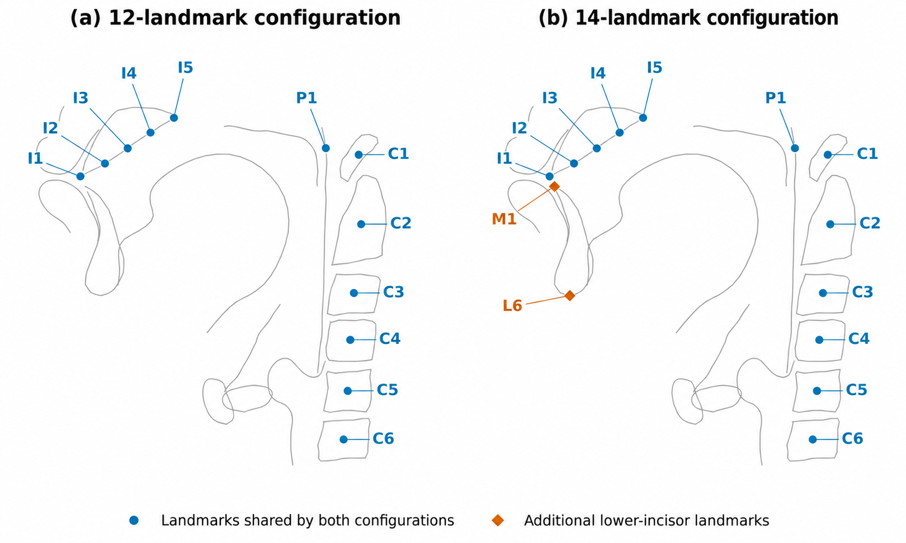
*Figure 1:Anatomical landmark configurations used for geometric adaptation. The 12-landmark set (in blue) is shown together with the two additional lower-incisor landmarks, M1 and L6 (in orange), used in the 14-landmark configuration.*

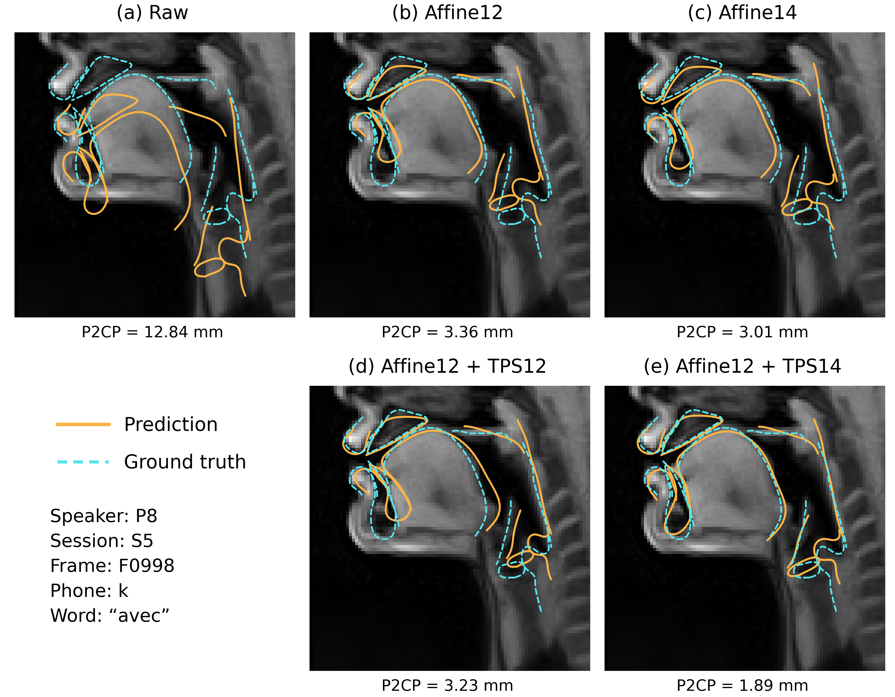
*Figure 2:Adaptation example for P8 containing /k/ in avec. Orange solid: predictions; cyan dashed: ground truth. Frame-level P2CP errors are shown below each panel.*

---
**Usage Info**: 4026 tokens used.
**Generated at**: 2026-09-26 17:38:33

---

# 📚 Few-Shot Calibration for Sim-to-Real Single-Channel Speaker Distance Estimation

🚀 URL: https://arxiv.org/html/2609.29203

## 🌏 Abstract (원문)
Speaker distance estimators are trained almost exclusively on simulated room acoustics, because real recordings annotated with the true talker-to-microphone distance are scarce. We show that models trained this way transfer poorly. On three real corpora we evaluate, simply predicting the average distance of the corpus is more accurate than any learned model. Then, we ask how few labelled real utterances are needed to make a frozen, synthetic-trained estimator useful, and study post-hoc calibration maps that rescale its output without gradients or retraining. An analysis of the achievable error shows that what the calibration is not limited by the absolute accuracy of the estimator, but how well it orders utterances by distance, since a constant bias or a wrong output scale is removed exactly by the calibration itself. Balancing this against the cost of estimating each coefficient from few samples yields a criterion that accounts for which map wins on which corpus and at which annotation budget, together with a shrinkage variant that requires no hard decision. Our findings suggest selecting synthetic checkpoints by linear correlation with true distances rather than by absolute error. Code, datasets, and analysis are available athttps://github.com/michaelneri/audio-distance-estimation.
## 🌏 Abstract (번역)
화자 거리 추정기는 실제 화자-마이크 거리로 주석이 달린 실제 녹음이 부족하기 때문에 거의 전적으로 시뮬레이션된 실내 음향으로 훈련됩니다. 우리는 이런 방식으로 훈련된 모델이 전이가 잘 되지 않음을 보여줍니다. 우리가 평가한 세 가지 실제 코퍼스에서, 단순히 코퍼스의 평균 거리를 예측하는 것이 어떤 학습된 모델보다도 더 정확했습니다. 그런 다음, 고정된 합성 훈련 추정기를 유용하게 만들기 위해 얼마나 적은 수의 레이블이 지정된 실제 발화가 필요한지 묻고, 기울기나 재훈련 없이 출력을 재조정하는 사후 보정 맵을 연구합니다. 달성 가능한 오류 분석은 보정이 추정기의 절대 정확도에 의해 제한되는 것이 아니라, 발화를 거리별로 얼마나 잘 정렬하는지에 의해 결정됨을 보여줍니다. 이는 상수 편향 또는 잘못된 출력 스케일이 보정 자체에 의해 정확히 제거되기 때문입니다. 이를 적은 샘플에서 각 계수를 추정하는 비용과 균형을 맞추면, 어떤 맵이 어떤 코퍼스에서 어떤 주석 예산으로 승리하는지를 설명하는 기준과, 어려운 결정이 필요 없는 축소 변형이 도출됩니다. 우리의 연구 결과는 절대 오류보다는 실제 거리와의 선형 상관관계를 통해 합성 체크포인트를 선택할 것을 제안합니다. 코드, 데이터셋 및 분석은 https://github.com/michaelneri/audio-distance-estimation에서 확인할 수 있습니다.

## 🔍 Methods & Results
- 화자 거리 추정기는 시뮬레이션된 데이터로 훈련될 경우 실제 녹음에서 성능이 저조하며, 실제 코퍼스에서는 학습된 모델보다 단순 평균 거리 예측이 더 정확함을 확인했습니다.
- 고정된 합성 훈련 추정기를 실제 데이터에 유용하게 만들기 위해 필요한 최소한의 레이블링된 실제 발화 수를 탐색했습니다.
- 기울기 계산이나 재훈련 없이 추정기 출력을 재조정하는 사후 보정 맵(post-hoc calibration maps)을 연구했습니다.
- 보정의 효과는 추정기의 절대 정확도보다는 발화를 거리별로 얼마나 잘 정렬하는지에 달려있음을 분석했습니다. 이는 보정이 상수 편향이나 잘못된 출력 스케일을 제거할 수 있기 때문입니다.
- 적은 샘플로 계수를 추정하는 비용과 보정 맵의 성능을 균형 있게 고려하는 기준을 개발했으며, 어려운 결정이 필요 없는 축소(shrinkage) 변형도 포함했습니다.
- 합성 데이터로 훈련된 모델의 체크포인트를 선택할 때 절대 오류보다는 실제 거리와의 선형 상관관계를 기준으로 삼을 것을 제안했습니다.

## 🖼 Figures

*Figure 1:Zero-shot predictions of the full-stack noise-trained model on the four real test conditions. The dashed line is the identity; colour encodes point density. Correlations are Pearson, as in Table 2 (
∗
∗
∗
𝑝
<
0.001
).*

---
**Usage Info**: 1480 tokens used.
**Generated at**: 2026-09-26 17:38:40

---

# 📚 A Harness for Synthesizing Diverse Naturalistic Full-duplex Conversations

🚀 URL: https://arxiv.org/html/2609.28806

## 🌏 Abstract (원문)
Full-duplex dialogue systems, which listen while speaking, must distinguish a completed turn from a pause within a turn and an interruption that requests a turn from a brief acknowledgment or speech addressed to a third party. Yet existing conversational corpora provide limited control over these events and limited labels for their intent. We present a pipeline for synthesizing intent-labeled, two-channel conversational speech from relational event lists. A large language model (LLM) authors each event’s speaker, text, conversational act, and attachment to an earlier event without predicting absolute timestamps. Events are synthesized independently, aligned with their source text to locate speech boundaries, and placed on a shared clock, so turn-taking landmarks are measured from the rendered signal while silence durations are specified or sampled from turn-taking distributions. The pipeline covers 42 phenomena across eight families in English and Mandarin, derives frame-level system actions from authored intent, and promotes diversity using small, diverse sets of prior examples and batch prompts that request alternatives with self-reported probabilities. Generation ablations show gains in the diversity dimensions targeted by each mechanism. On a four-action label space for taking, holding, releasing, and not holding the conversational floor (the right to continue a turn), a semantic voice-activity detector using only current and past audio reaches start-speaking and start-listening F1 scores of 0.819 and 0.802, respectively. When generating its own responses, the full-duplex speech model Moshi takes 0.85 of the reference turns after fine-tuning on the generated corpus, compared with 0.44 before fine-tuning. Its frame-level precision for predicting system-floor occupancy rises from 0.46 to 0.88. With reference conversational context supplied at each step, its frame-level floor F1 rises from 0.893 to 0.962. These results show that controlled synthesis can provide learnable and transferable supervision for full-duplex turn management.
## 🌏 Abstract (번역)
말하면서 듣는 전이중(full-duplex) 대화 시스템은 완료된 턴과 턴 내의 일시 정지, 그리고 턴을 요청하는 끼어들기를 짧은 인정 발언이나 제3자에게 하는 말과 구별해야 합니다. 그러나 기존의 대화 코퍼스는 이러한 이벤트에 대한 제어와 의도에 대한 레이블이 제한적입니다. 본 논문은 관계형 이벤트 목록으로부터 의도 레이블이 지정된 2채널 대화 음성을 합성하는 파이프라인을 제시합니다. 대규모 언어 모델(LLM)은 각 이벤트의 화자, 텍스트, 대화 행위 및 이전 이벤트와의 연결을 절대적인 타임스탬프를 예측하지 않고 작성합니다. 이벤트는 독립적으로 합성되고, 음성 경계를 찾기 위해 원본 텍스트와 정렬되며, 공유된 클록에 배치됩니다. 이를 통해 턴 전환 지표는 렌더링된 신호에서 측정되고, 침묵 지속 시간은 지정되거나 턴 전환 분포에서 샘플링됩니다. 이 파이프라인은 영어와 중국어에서 8개 계열에 걸쳐 42가지 현상을 다루며, 작성된 의도에서 프레임 수준의 시스템 동작을 도출하고, 작고 다양한 이전 예시 세트와 자체 보고된 확률로 대안을 요청하는 배치 프롬프트를 사용하여 다양성을 촉진합니다. 생성 제거 연구는 각 메커니즘이 목표로 하는 다양성 차원에서 이득을 보여줍니다. 대화 주도권(턴을 계속할 권리)을 잡고, 유지하고, 놓아주고, 유지하지 않는 네 가지 동작 레이블 공간에서, 현재 및 과거 오디오만을 사용하는 의미론적 음성 활동 감지기는 발화 시작 F1 점수 0.819, 청취 시작 F1 점수 0.802를 각각 달성합니다. 자체 응답을 생성할 때, 전이중 음성 모델 Moshi는 생성된 코퍼스로 미세 조정 후 참조 턴의 0.85를 차지했으며, 미세 조정 전 0.44와 비교됩니다. 시스템 주도권 점유를 예측하는 프레임 수준 정밀도는 0.46에서 0.88로 증가합니다. 각 단계에서 참조 대화 컨텍스트가 제공될 때, 프레임 수준 주도권 F1은 0.893에서 0.962로 증가합니다. 이러한 결과는 제어된 합성이 전이중 턴 관리를 위한 학습 가능하고 전이 가능한 감독을 제공할 수 있음을 보여줍니다.

## 🔍 Methods & Results
- 본 연구는 대화 작성(authoring)과 음향 구현(acoustic realization)을 분리하는 파이프라인을 제시하며, 작성 단계에서는 화자, 텍스트, 대화 행위 및 이벤트 간의 관계를 결정하고, 구현 단계에서는 TTS로 이벤트를 렌더링하고 강제 정렬기를 사용하여 단어 타이밍을 측정하여 공유 클록에 배치합니다.
- 파이프라인은 일반적인 턴 전환, 오버랩 및 끼어들기, 백채널, 비유창성 및 수정, 수신자 및 다자 행동, 작업 구조, 감정, 예외 사례 등 8개 계열에 걸쳐 42가지 대화 현상을 다룹니다.
- 대규모 언어 모델(LLM)인 DeepSeek-V4-Pro가 각 이벤트의 화자, 텍스트, 대화 행위 및 이전 이벤트와의 관계를 절대 타임스탬프 없이 작성하며, Qwen3.7-Plus LLM이 의미론적 일관성을 확인하는 심판 역할을 할 수 있습니다.
- 각 이벤트는 Qwen3-TTS로 독립적으로 합성되고, Qwen3-ForcedAligner를 사용하여 원본 텍스트와 강제 정렬되어 단어 타이밍을 측정합니다.
- 이벤트 조립은 참조된 이벤트, 큐 포인트, 삽입된 간격 및 오프셋을 사용하여 관계형 타이밍으로 각 이벤트를 해결하며, 성공적인 끼어들기(barge-in)는 중단된 이벤트를 단축하고 페이드 처리합니다.
- 침묵 지속 시간은 이벤트 유형에 따라 지정되거나 턴 양보 간격, 화자 내 일시 정지, 끼어들기 오프셋 분포에서 샘플링되며, 이러한 분포는 실제 대화의 모호성을 반영하기 위해 의도적으로 중첩됩니다.
- 작성된 의도에서 시스템 측 레이블(주도권 소유 또는 경쟁)을 도출하는 변환기를 사용하여 음성 활동만으로는 구별할 수 없는 영역을 구분합니다.
- 생성 다양성을 높이기 위해 구조적 허브(주도권 관리 패턴)와 의미론적 허브(주제 및 의미)를 사용하여 이전에 생성된 대화 중 다양성이 높은 소규모 코어셋을 '부정적 기억'으로 활용하여 모델이 반복을 피하도록 유도합니다.
- Verbalized Sampling 기법을 사용하여 단일 호출 내에서 모델이 여러 대안 대화를 자체 보고된 확률과 함께 생성하도록 요청하여 다양한 해석과 패턴을 탐색하도록 합니다.
- 음향 변형은 화자 참조 녹음(LibriSpeech, VCTK 등)을 샘플링하고, Kaldi Room Impulse Response 및 Noise 컬렉션(OpenSLR-28)의 노이즈를 사용자 채널에 혼합하여 적용할 수 있습니다.
- 4가지 동작 레이블 공간(주도권 잡기, 유지, 놓기, 유지 안 하기)에서, 의미론적 음성 활동 감지기는 발화 시작 F1 0.819, 청취 시작 F1 0.802를 달성했습니다.
- 전이중 음성 모델 Moshi는 생성된 코퍼스로 미세 조정 후 참조 턴의 0.85를 차지했으며, 미세 조정 전 0.44와 비교하여 성능이 크게 향상되었습니다.
- Moshi 모델의 시스템 주도권 점유 예측에 대한 프레임 수준 정밀도는 0.46에서 0.88로, 참조 대화 컨텍스트가 제공될 때 프레임 수준 주도권 F1은 0.893에서 0.962로 향상되었습니다.

## 🖼 Figures
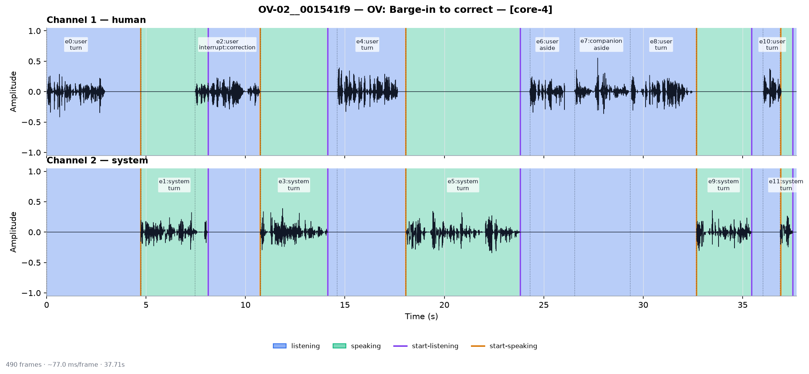
*Fig. 6:Three label granularities for OV-02, a correction barge-in. Each panel shows the same human and system waveforms while increasing the detail of the system-side label taxonomy.*

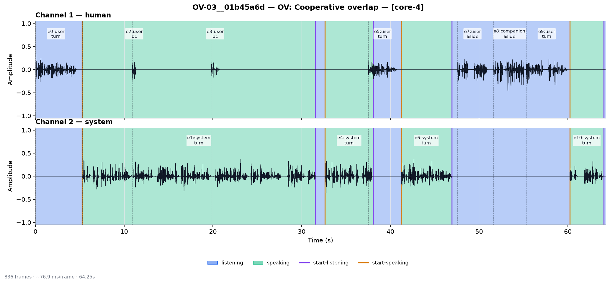
*Fig. 7:Three label granularities for OV-03, a cooperative-overlap conversation with backchannels. The finer views distinguish additional floor states that collapse into the four core actions.*

---
**Usage Info**: 6408 tokens used.
**Generated at**: 2026-09-26 17:38:53

---

# 📚 CONFIGURABLE-BANDWIDTH TIME–FREQUENCY MODELING FOR EFFICIENT FULL-BAND SPEECH ENHANCEMENT ACROSS SAMPLING RATES

🚀 URL: https://arxiv.org/html/2609.29463

## 🌏 Abstract (원문)
Speech enhancement systems are often developed for a fixed sampling rate, while time–frequency models become more expensive as the number of frequency bins increases. We proposeTF-Refiner, a sampling-frequency-independent model that decouples the deep analysis bandwidth from the full-band input and output. A deep encoder processes the band below a configurable cutoff, while a shallow decoder combines the encoded features with input-dependent high-band queries and predicts local complex filters applied to the original noisy STFT. A single parameter set trained at 16 and 48 kHz is evaluated at various sampling rates. On VoiceBank+DEMAND, theuniversalmodel outperforms the rate-specific counterparts in PESQ, STOI, and log-spectral distance across the evaluated rates, including rates unseen in training. Random-cutoff training enables inference-time selection of cost–quality operating points without retraining or changing the output bandwidth. These results support configurable analysis bandwidth as a practical design choice for multi-rate full-band enhancement.
## 🌏 Abstract (번역)
음성 향상 시스템은 종종 고정된 샘플링 속도에 맞춰 개발되며, 주파수 빈의 수가 증가함에 따라 시간-주파수 모델의 비용은 더 비싸집니다. 우리는 깊은 분석 대역폭을 전체 대역 입력 및 출력과 분리하는 샘플링 주파수 독립적인 모델인 TF-Refiner를 제안합니다. 깊은 인코더는 구성 가능한 차단 주파수 아래의 대역을 처리하고, 얕은 디코더는 인코딩된 특징을 입력 의존적인 고대역 쿼리와 결합하여 원래의 잡음이 있는 STFT에 적용되는 지역 복소 필터를 예측합니다. 16kHz와 48kHz에서 훈련된 단일 파라미터 세트는 다양한 샘플링 속도에서 평가됩니다. VoiceBank+DEMAND 데이터셋에서, 이 범용 모델은 훈련에서 보지 못한 속도를 포함하여 평가된 모든 속도에서 PESQ, STOI 및 로그 스펙트럼 거리 측면에서 속도별 모델보다 우수한 성능을 보였습니다. 무작위 차단 주파수 훈련은 재훈련이나 출력 대역폭 변경 없이 추론 시 비용-품질 작동 지점을 선택할 수 있게 합니다. 이러한 결과는 구성 가능한 분석 대역폭이 다중 속도 전체 대역 향상을 위한 실용적인 설계 선택임을 지지합니다.

## 🔍 Methods & Results
- TF-Refiner는 깊은 분석 대역폭을 전체 대역 입력 및 출력과 분리하여 샘플링 주파수에 독립적인 음성 향상 모델을 제안한다.
- 모델은 구성 가능한 차단 주파수 아래 대역을 처리하는 깊은 인코더와 인코딩된 특징을 고대역 쿼리와 결합하여 잡음이 있는 STFT에 적용될 지역 복소 필터를 예측하는 얕은 디코더로 구성된다.
- 16kHz와 48kHz에서 훈련된 단일 파라미터 세트를 사용하여 다양한 샘플링 속도에서 모델을 평가했다.
- VoiceBank+DEMAND 데이터셋에서, TF-Refiner는 훈련 시 보지 못한 속도를 포함하여 평가된 모든 샘플링 속도에서 PESQ, STOI, 로그 스펙트럼 거리 지표에서 속도별 모델보다 우수한 성능을 보였다.
- 무작위 차단 주파수 훈련(random-cutoff training)을 통해 재훈련이나 출력 대역폭 변경 없이 추론 시 비용-품질 작동 지점을 유연하게 선택할 수 있다.

## 🖼 Figures

*Figure 1:Overall flow of TF-Refiner: deep analysis of the band below 
𝑓
𝑐
, shallow full-band decoding with cross-attention to the encoder output, and filtering of the original noisy STFT.*

*Figure 2:Architecture of TF-Refiner. The 
𝐹
𝑙
 positions below 
𝑓
𝑐
 form 
𝐙
𝑙
 for the deep TF-Encoder and the remaining 
𝐹
ℎ
 positions form 
𝐙
ℎ
. Band Merge concatenates 
𝐙
ℎ
 with the encoder output 
𝐙
𝑒
 for the shallow TF-Decoder, which also attends to 
𝐙
𝑒
 as key/value.*

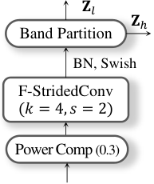
*Figure 3:Components outside the TF modules.*

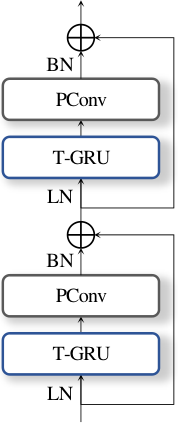
*Figure 4:Unit modules of TF-Refiner with the ConvEFN structure.*

---
**Usage Info**: 1397 tokens used.
**Generated at**: 2026-09-26 17:38:59

---

# 📚 Do Audio Language Models Hear and Read Distinctive Features Alike?

🚀 URL: https://arxiv.org/html/2609.30167

## 🌏 Abstract (원문)
Audio language models pass speech and text through a single decoder. We ask whether that decoder represents a distinctive feature in the same direction when a phoneme is heard and when it is read. For minimal pairs of phonemes differing in one feature, we take the offset between the two members’ mean representations. Averaging those offsets gives a direction for each stream, and we measure the cosine between the two. Because the two streams already agree about arbitrary phoneme pairs, we compare every measure against a reference built from random pairings rather than against zero. We apply this to 6 models, 7 features and 15 languages from 11 families. Only voicing in the two Qwen2.5-Omni models exceeds that reference after correction for multiple testing, and the reference varies by a factor of seven between models. In three of the six models, voicing has one direction in audio across the 14 languages with enough minimal pairs to measure it, and every language pair agrees in two of them. The model family, not the model size, predicts which stream represents a feature.
## 🌏 Abstract (번역)
오디오 언어 모델은 음성과 텍스트를 단일 디코더를 통해 처리합니다. 우리는 이 디코더가 음소가 들릴 때와 읽힐 때 동일한 방향으로 변별적 특징을 표현하는지 질문합니다. 하나의 특징에서 차이가 나는 최소 음소 쌍에 대해, 우리는 두 구성원의 평균 표현 간의 오프셋을 취합니다. 이 오프셋들을 평균화하면 각 스트림에 대한 방향이 주어지며, 우리는 이 두 방향 간의 코사인 유사도를 측정합니다. 두 스트림이 이미 임의의 음소 쌍에 대해 일치하기 때문에, 우리는 모든 측정값을 0이 아닌 무작위 페어링으로 구축된 참조값과 비교합니다. 우리는 이를 6개의 모델, 7개의 특징, 11개 어족의 15개 언어에 적용했습니다. 다중 검정 보정 후에는 두 Qwen2.5-Omni 모델의 유성음(voicing)만이 해당 참조값을 초과했으며, 참조값은 모델 간에 7배까지 차이가 났습니다. 6개 모델 중 3개 모델에서는 유성음이 측정에 충분한 최소 쌍을 가진 14개 언어 전체에서 오디오에서 하나의 방향을 가졌고, 그 중 두 모델에서는 모든 언어 쌍이 일치했습니다. 모델 크기가 아닌 모델 계열이 어떤 스트림이 특징을 표현하는지 예측합니다.

## 🔍 Methods & Results
- Language Documentation Reference Corpus에서 11개 어족의 15개 언어에 걸쳐 음소 데이터를 사용했으며, Qwen2-Audio, Qwen2.5-Omni (두 가지 크기), Gemma 4 (두 가지 크기), Audio-Flamingo 3 등 6가지 오디오 언어 모델을 분석했다.
- 음성 및 텍스트 스트림 모두에서 단일 디코더를 통해 음소의 변별적 특징(예: 유성음) 표현 방향을 비교하기 위해, 하나의 특징에서만 차이가 나는 최소 음소 쌍을 사용하여 각 스트림의 평균 표현 오프셋을 계산하고, 이 오프셋들의 평균을 통해 특징 방향을 도출했다.
- 오디오 스트림과 텍스트 스트림에서 동일한 특징의 방향 벡터 간의 코사인 유사도(c)를 주 측정값으로 사용했으며, 이 값은 무작위 페어링으로 구축된 참조 분포와 비교하여 통계적 유의성을 평가했다.
- 다중 검정 보정 후, 6개 모델 중 Qwen2.5-Omni 모델 두 가지에서만 유성음(voicing) 특징이 참조값보다 유의미하게 높은 방향 일치를 보였다.
- 6개 모델 중 3개 모델에서 유성음은 14개 언어에 걸쳐 오디오에서 일관된 하나의 방향을 가졌으며, 이 중 2개 모델에서는 모든 언어 쌍이 일치했다.
- 모델 크기보다는 모델 계열이 특징 표현 방향을 예측하는 데 더 중요함을 발견했다.

---
**Usage Info**: 4570 tokens used.
**Generated at**: 2026-09-26 17:39:11

---

# 📚 RESTORE: REal-time Steerable Music resTORation and bandwidth Extension via stem disentanglement

🚀 URL: https://arxiv.org/html/2609.28683

## 🌏 Abstract (원문)

## 🌏 Abstract (번역)

## 🔍 Methods & Results
- RESTORE는 HTDemucs 아키텍처를 기반으로 구축되었으며, 음악 소스 분리를 위해 시간 및 스펙트럼 도메인에서 작동하는 bi-U-Net 구조와 교차 도메인 트랜스포머 인코더를 사용합니다.
- 네트워크 출력은 기존 HTDemucs의 4개 스템에서 보컬, 음악, 광대역 노이즈, 과도 노이즈, 잔여, HFE(고주파 확장)의 6개 전문 스템으로 확장되었습니다.
- HFE 스템은 누락된 콘텐츠를 합성하는 생성적 작업이므로, 기존 신호를 분리하는 판별적 작업과 분리하여 학습 신호 충돌을 방지합니다.
- 노이즈 스템(광대역 노이즈, 과도 노이즈)은 HTDemucs의 사전 훈련된 드럼 가중치에 매핑되며, 초기화 시 과도 및 확장 헤드의 출력을 작게 유지하기 위해 감쇠를 적용합니다.
- 훈련 데이터는 깨끗한 풀밴드 오디오에 역사적 녹음의 열화를 온라인으로 시뮬레이션하여 생성됩니다. 시뮬레이션에는 주파수 도메인 필터링, 버터워스 저역 통과 필터, 그라모폰 레코드 노이즈 데이터셋의 노이즈 주입, 클릭 및 버스트 모델링이 포함됩니다.
- HFE 스템 합성을 위해 2단계 적대적 훈련 스케줄을 사용합니다. 1단계에서는 트랜스포머 병목을 고정하고 판별자 없이 훈련하며, 2단계에서는 트랜스포머를 해제하고 Multi-Period 및 Multi-Resolution Discriminator를 활성화하여 LSGAN 및 특징 매칭 손실로 생성자를 페널티화합니다. 판별자는 HFE 스템에만 적용됩니다.
- 손실 함수는 HTDemucs L1 파형 손실을 확장하여 모든 스템에 대한 L1 손실, 입력 혼합물과 5개 예측 스템(HFE 제외)의 합계 간 차이를 최소화하는 Lc, 잔여 스템의 에너지에 대한 가벼운 페널티 Lr, 그리고 HFE 스템에만 적용되는 적대적 페널티 La 및 Lf를 포함합니다.
- 로그-크기 스펙트럼 손실은 무음 대상에 불안정하므로, 활성 빈에는 로그-크기 페널티를, 거의 0인 빈에는 선형 L1 페널티(가중치 0.1)를 적용하여 무음 영역의 환각 노이즈를 방지합니다.

## 🖼 Figures

*Figure 1:System overview: a degraded historical mixture is processed by a dual-domain generator with a cross-domain transformer bottleneck, then decoded and split into six semantically targeted stems. All stems are supervised via L1 and STFT losses with a mixture consistency penalty enforcing the sum back to the input. A discriminator is applied only to the high-frequency extension stem. The restored waveform is reconstructed by summing desired stems with independent, user-defined gains.*

---
**Usage Info**: 3215 tokens used.
**Generated at**: 2026-09-26 17:39:20

---

# 📚 Exploring a Single Autoregressive LLM for Unified Target Speech Extraction across Synchronous and Asynchronous Cues

🚀 URL: https://arxiv.org/html/2609.29238

## 🌏 Abstract (원문)
Target speech extraction (TSE) typically trains a separate extractor per cue, and visual-cue systems often need corruption-matched training to remain robust under visual frame corruption. We show that one autoregressive LLM backbone, TSE-Omni, can serve both temporally synchronous cues (lip movements, co-speech gestures) and asynchronous cues (enrollment audio, text). TSE-Omni is driven by next-token prediction: each step predicts target speech semantic tokens from its own past outputs, which we term self-enrollment, forming a continuous target-speech context initialized by the enrollment cue (asynchronous audio or text, or a short visual prefix). This enables audio-visual compensation: the model uses synchronized visuals when intact and its token history when visual frames are missing. Under clean visuals, TSE-Omni matches strong discriminative and generative baselines (SpeechBERTScore 0.81 on VoxCeleb2 and 0.89 on LRS3 zero-shot) with higher DNSMOS. On the same VoxCeleb2 test set, after a 2	s clean visual start, removing the remaining visual frames leaves SpeechBERTScore at 0.81. It remains usable under sparse overlap and multi-speaker interference, and supports streaming inference. Project page:https://alexwxwu.github.io/tseomni-main/.
## 🌏 Abstract (번역)
표적 음성 추출(TSE)은 일반적으로 각 단서(cue)마다 별도의 추출기를 훈련하며, 시각 단서 시스템은 시각 프레임 손상 시에도 견고함을 유지하기 위해 손상에 맞춰 훈련해야 하는 경우가 많습니다. 본 논문에서는 하나의 자기회귀 LLM 백본인 TSE-Omni가 시간적으로 동기화된 단서(입술 움직임, 발화 제스처)와 비동기 단서(등록 오디오, 텍스트)를 모두 처리할 수 있음을 보여줍니다. TSE-Omni는 다음 토큰 예측에 의해 구동됩니다. 각 단계는 자체 과거 출력에서 표적 음성 의미 토큰을 예측하는데, 이를 자기 등록(self-enrollment)이라고 하며, 등록 단서(비동기 오디오 또는 텍스트, 또는 짧은 시각적 접두사)에 의해 초기화된 연속적인 표적 음성 컨텍스트를 형성합니다. 이를 통해 오디오-시각 보상(audio-visual compensation)이 가능해집니다. 즉, 모델은 시각 정보가 온전할 때는 동기화된 시각 정보를 사용하고, 시각 프레임이 누락될 때는 토큰 기록을 사용합니다. 깨끗한 시각 정보 조건에서 TSE-Omni는 강력한 판별 및 생성 기준선(VoxCeleb2에서 SpeechBERTScore 0.81, LRS3 제로샷에서 0.89)과 일치하며 더 높은 DNSMOS를 달성합니다. 동일한 VoxCeleb2 테스트 세트에서 2초간 깨끗한 시각 정보로 시작한 후 나머지 시각 프레임을 제거해도 SpeechBERTScore는 0.81을 유지합니다. 이 모델은 희소한 중첩 및 다중 화자 간섭 상황에서도 사용 가능하며, 스트리밍 추론을 지원합니다. 프로젝트 페이지: https://alexwxwu.github.io/tseomni-main/.

## 🔍 Methods & Results
- TSE-Omni는 기존의 독립적인 오디오/시각 단서 처리 방식과 달리, 단일 자기회귀 LLM 백본을 사용하여 오디오 및 시각 단서를 통합합니다.
- 모델은 표적 음성 의미 토큰을 예측하는 자기회귀(AR) 단계와 파형을 생성하는 비자기회귀(NAR) 단계로 구성됩니다.
- AR 단계는 혼합 임베딩, 단서 임베딩, 그리고 이전에 예측된 음성 토큰을 컨텍스트로 사용하여 다음 토큰을 예측하며, 자기 등록(self-enrollment) 및 교차 모달리티 보상 메커니즘을 포함합니다.
- 다양한 모달리티(오디오, 입술 움직임, 발화 제스처, 텍스트)별 인코더를 통해 단서 임베딩을 생성하며, 이들은 표적 화자 인식 및 동기 단서의 경우 표적 화자 추적에 사용됩니다.
- 핵심 기여는 LLM의 다음 토큰 예측 능력을 활용한 오디오-시각 단서 보상으로, 시각 프레임이 손상되거나 누락될 경우에도 자기 등록을 통해 음성 추출을 지속할 수 있습니다.
- 깨끗한 시각 조건에서 TSE-Omni는 VoxCeleb2에서 SpeechBERTScore 0.81, LRS3 제로샷에서 0.89를 달성하며 강력한 기준선과 일치하고 더 높은 DNSMOS를 보였습니다.
- 2초간의 깨끗한 시각 정보 시작 후 나머지 시각 프레임을 제거해도 VoxCeleb2에서 SpeechBERTScore가 0.81로 유지되어, 손상된 시각 정보에 대한 견고성을 입증했습니다.
- 희소한 중첩 및 다중 화자 간섭 상황에서도 사용 가능하며 스트리밍 추론을 지원합니다.

## 🖼 Figures
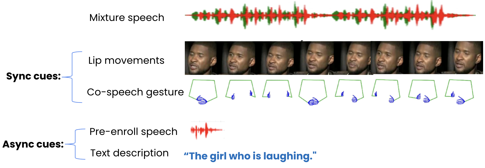
*Fig. 1:Cue types. Cues are either temporally synchronous with the mixture (lip movements, co-speech gestures) or temporally asynchronous (pre-recorded audio, text).*

*Fig. 2:Self-enrollment compensation: historical predicted target-speech semantic tokens are fed back as a running enrollment cue. This self-loop is inherent to AR decoding. TSE-Omni is the first to exploit it to compensate for corrupted visual cues without a corruption-matched training stage in AR LLM framework.*

![Fig. 3:Overview of the TSE-Omni training framework. (a) AR Stage: predicts target speech semantic tokens from the mixture, conditioned on a pre-recorded audio clip or temporally synchronized visual cues. A short initial visual segment (default 2 s) goes to the cue encoder for recognition. The visual integration module is used only for visual-cue TSE. After 
𝑎
sos
, visual tokens start at 
𝑣
2
: each 
𝑎
^
𝑡
 (
𝑡
≥
2
) is conditioned on 
𝑒
𝑡
−
1
=
𝑓
𝑎
​
𝑣
​
(
𝑎
^
𝑡
−
1
,
𝑣
𝑡
)
. (b) NAR Stage: reconstructs the waveform from the predicted semantic tokens, the mixture, and the cue.](../images/2026-09-26/2609.29238/2609.29238_fig2.png)
*Fig. 3:Overview of the TSE-Omni training framework. (a) AR Stage: predicts target speech semantic tokens from the mixture, conditioned on a pre-recorded audio clip or temporally synchronized visual cues. A short initial visual segment (default 2 s) goes to the cue encoder for recognition. The visual integration module is used only for visual-cue TSE. After 
𝑎
sos
, visual tokens start at 
𝑣
2
: each 
𝑎
^
𝑡
 (
𝑡
≥
2
) is conditioned on 
𝑒
𝑡
−
1
=
𝑓
𝑎
​
𝑣
​
(
𝑎
^
𝑡
−
1
,
𝑣
𝑡
)
. (b) NAR Stage: reconstructs the waveform from the predicted semantic tokens, the mixture, and the cue.*

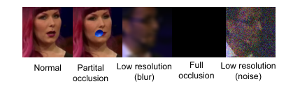
*Fig. 4:Visual frame corruption on the VoxCeleb2 evaluation protocol: full missing, partial occlusion, and low resolution. The first 2 s stay clean; later corrupted or missing frames are zeros.*

*Fig. 5:Speech semantic token compensation. Only the first 2 s of visual cues are available; later visual frames are zeros. TSE-Omni continues extraction from the historical predicted speech semantic tokens (self-enrollment), with the visual module still enabled.*

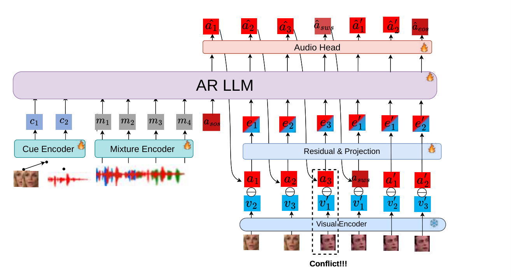
*Fig. 7:Target-speaker switch on a visual cue: a switch token (SWS) is added to the vocabulary. The LLM detects a conflict between the new visual cue and the self-enrolled speech history, resets the AR context, and follows the new target.*

*Fig. 8:Multi-cue fusion: each encoder is mapped by a linear layer into the shared 
𝐷
-dimensional space; a missing cue is a zero tensor. Used for Table VII.*

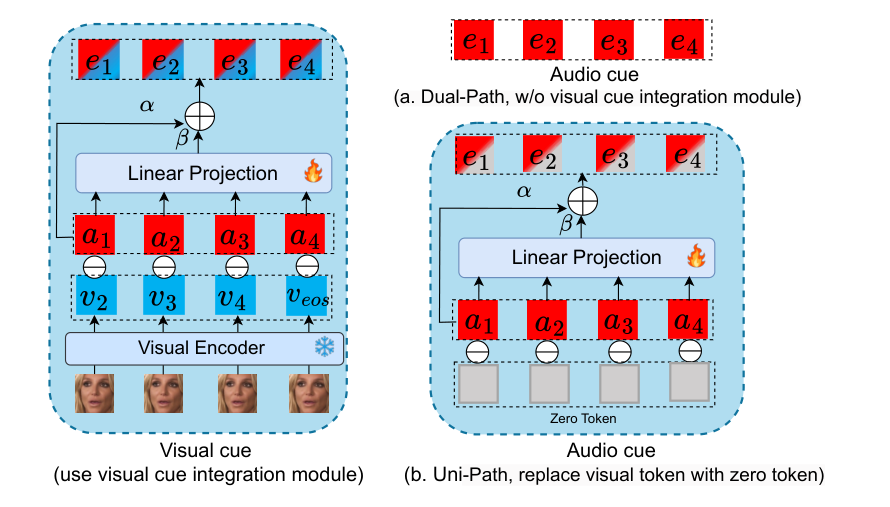
*Fig. 9:Token integration. Dual-Path: the visual module is used only with a visual cue. Uni-Path: one module for both cues, with zeros in place of visual tokens for audio-cue TSE.*

---
**Usage Info**: 5436 tokens used.
**Generated at**: 2026-09-26 17:39:35

---

# 📚 Relative Mismatch: Local-Reference Calibration of Feature-Space Flows for Anomalous Sound Detection

🚀 URL: https://arxiv.org/html/2609.29746

## 🌏 Abstract (원문)
Anomalous sound detection (ASD) has long been dominated bykk-nearest-neighbor (KNN) based detectors, which essentially perform implicit likelihood estimation over normal samples. In this work, we investigate whether generative models can better serve this role. We propose Relative Mismatch, a generative ASD backend powered by flow matching, which learns a velocity field that transports Gaussian noise to a representative feature space of normality. During inference, it measures the mismatch between the oracle and predicted path velocities and aggregates them through a two-level design. To mitigate the inherent mismatch offsets incurred by domain shift, each query is further calibrated with the mismatch of its local normal reference, thereby exposing only its deviation beyond normality. Extensive experiments on DCASE 2020–2025 demonstrate that Relative Mismatch outperforms state-of-the-art backends with the highest score of 71.01, along with strong robustness and training stability. Furthermore, we show that curating a compact and discriminative feature space is the key to unleash the power of generative models for ASD.
## 🌏 Abstract (번역)
이상 음향 탐지(ASD)는 오랫동안 정상 샘플에 대한 암묵적인 우도 추정을 수행하는 k-최근접 이웃(KNN) 기반 탐지기가 지배해왔습니다. 본 연구에서는 생성 모델이 이 역할을 더 잘 수행할 수 있는지 조사합니다. 우리는 플로우 매칭(flow matching)을 기반으로 하는 생성형 ASD 백엔드인 Relative Mismatch를 제안하며, 이는 가우시안 노이즈를 정상성의 대표적인 특징 공간으로 전달하는 속도 필드를 학습합니다. 추론 과정에서, 이는 오라클(oracle)과 예측된 경로 속도 간의 불일치를 측정하고 이를 2단계 설계를 통해 집계합니다. 도메인 이동으로 인해 발생하는 내재된 불일치 오프셋을 완화하기 위해, 각 쿼리는 해당 로컬 정상 참조의 불일치로 추가 보정되어 정상성을 벗어나는 편차만을 드러냅니다. DCASE 2020–2025에 대한 광범위한 실험은 Relative Mismatch가 71.01의 최고 점수로 최첨단 백엔드를 능가하며, 강력한 견고성과 훈련 안정성을 보여줍니다. 또한, 우리는 압축적이고 판별적인 특징 공간을 큐레이션하는 것이 ASD를 위한 생성 모델의 힘을 발휘하는 핵심임을 보여줍니다.

## 🔍 Methods & Results
- 생성 모델이 이상 음향 탐지(ASD)에서 KNN 기반 탐지기보다 더 나은 역할을 할 수 있는지 연구하였다.
- 플로우 매칭 기반의 생성형 ASD 백엔드인 'Relative Mismatch'를 제안하였다.
- Relative Mismatch는 가우시안 노이즈를 정상성의 특징 공간으로 변환하는 속도 필드를 학습한다.
- 추론 시, 오라클과 예측된 경로 속도 간의 불일치를 2단계 설계를 통해 측정하고 집계한다.
- 도메인 이동으로 인한 불일치 오프셋을 완화하기 위해 각 쿼리를 로컬 정상 참조의 불일치로 보정한다.
- DCASE 2020–2025 데이터셋에서 실험 결과, Relative Mismatch는 71.01점으로 최첨단 백엔드를 능가하는 성능을 달성했다.
- 제안된 방법은 강력한 견고성과 훈련 안정성을 보였다.
- 압축적이고 판별적인 특징 공간을 구축하는 것이 ASD를 위한 생성 모델의 성능을 극대화하는 핵심임을 확인했다.

## 🖼 Figures

*(a)Selection of 
𝐾
 and 
𝑇*

*(a)Selection of 
𝐾
 and 
𝑇*

---
**Usage Info**: 1459 tokens used.
**Generated at**: 2026-09-26 17:39:42

---

# 📚 YODAS v3: Over 1 Million Hours of High-Bandwidth, Stereophonic, Multilingual Speech

🚀 URL: https://arxiv.org/html/2609.29448

## 🌏 Abstract (원문)
We present YODAS v3, a weakly-labeled speech corpus containing over 1.1 million hours111After acceptance, we identified and removed duplicated videos, reducing the total from 1.4M to 1.1M hours. The distribution figures and counts reflect the corrected dataset; the paper’s findings are unchanged.of 48kHz multi-channel audio in 147 languages, released under a CC BY 3.0 license. YODAS v3 is not only the largest open speech dataset to date, but also the first truly large-scale speech corpus with high-fidelity stereo audio. We first provide the collection methodology for the corpus, where we introduce new techniques for gathering language-balanced speech data. The effectiveness of our approach is shown by the language distribution of the crawled data: 22 languages in YODAS v3 have over 10K hours and 73 languages have over 5K hours of data. We then conduct extensive analyses on the composition of the data, such as the distribution of languages, audio quality, and transcription quality. Finally, we train baseline speech recognition and neural codec models to show the effectiveness of the dataset. Download athttps://huggingface.co/datasets/espnet/yodas3.
## 🌏 Abstract (번역)
저희는 CC BY 3.0 라이선스로 공개된, 147개 언어로 된 110만 시간 이상의 48kHz 다채널 오디오를 포함하는 약한 레이블링 음성 코퍼스인 YODAS v3를 소개합니다. (111승인 후, 중복 비디오를 식별하고 제거하여 총 시간을 140만 시간에서 110만 시간으로 줄였습니다. 분포 수치와 개수는 수정된 데이터셋을 반영하며, 논문의 결과는 변경되지 않았습니다.) YODAS v3는 현재까지 가장 큰 공개 음성 데이터셋일 뿐만 아니라, 고음질 스테레오 오디오를 갖춘 최초의 진정한 대규모 음성 코퍼스입니다. 먼저, 언어 균형 잡힌 음성 데이터를 수집하기 위한 새로운 기술을 도입한 코퍼스 수집 방법론을 제시합니다. 저희 접근 방식의 효과는 크롤링된 데이터의 언어 분포에서 나타납니다: YODAS v3의 22개 언어는 1만 시간 이상, 73개 언어는 5천 시간 이상의 데이터를 보유하고 있습니다. 다음으로, 언어 분포, 오디오 품질, 전사 품질 등 데이터 구성에 대한 광범위한 분석을 수행합니다. 마지막으로, 데이터셋의 효과를 보여주기 위해 기준 음성 인식 및 신경 코덱 모델을 훈련합니다. 다운로드는 https://huggingface.co/datasets/espnet/yodas3 에서 가능합니다.

## 🔍 Methods & Results
- YODAS v3는 147개 언어에 걸쳐 110만 시간 이상의 48kHz 다채널 오디오를 포함하는 약한 레이블링 음성 코퍼스이다.
- 언어 균형 잡힌 음성 데이터 수집을 위한 새로운 기술을 도입한 코퍼스 수집 방법론을 제시했다.
- 수집된 데이터의 언어 분포 분석 결과, YODAS v3의 22개 언어는 1만 시간 이상, 73개 언어는 5천 시간 이상의 데이터를 보유하여 접근 방식의 효과를 입증했다.
- 데이터의 구성(언어 분포, 오디오 품질, 전사 품질)에 대한 광범위한 분석을 수행했다.
- 데이터셋의 효과를 입증하기 위해 기준 음성 인식 및 신경 코덱 모델을 훈련했다.

## 🖼 Figures
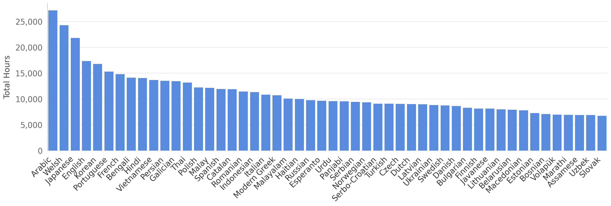
*Figure 2:Data distribution of the top 50 languages in YODAS v3.*

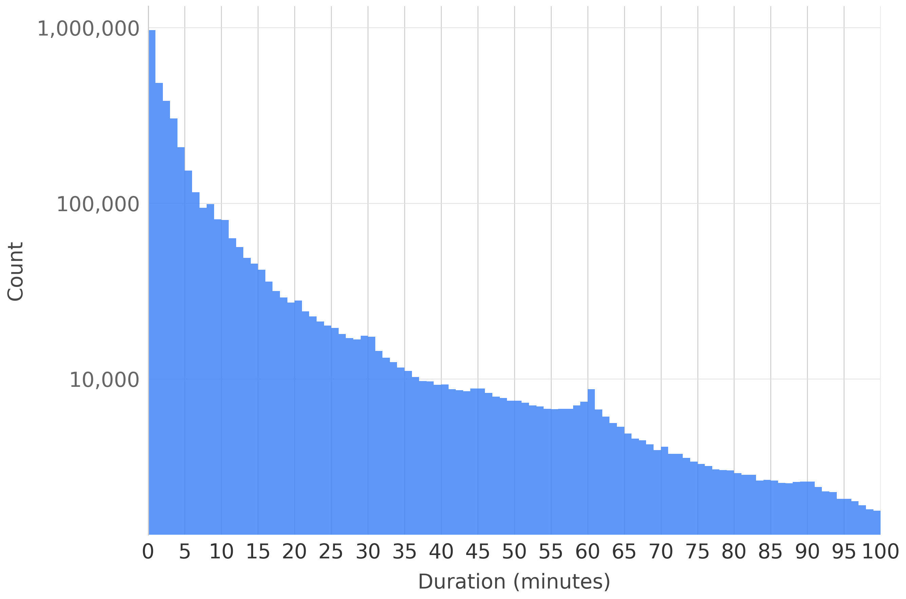
*Figure 3:Distribution of videos by total length (log scale), bucketed into groups by minute.*

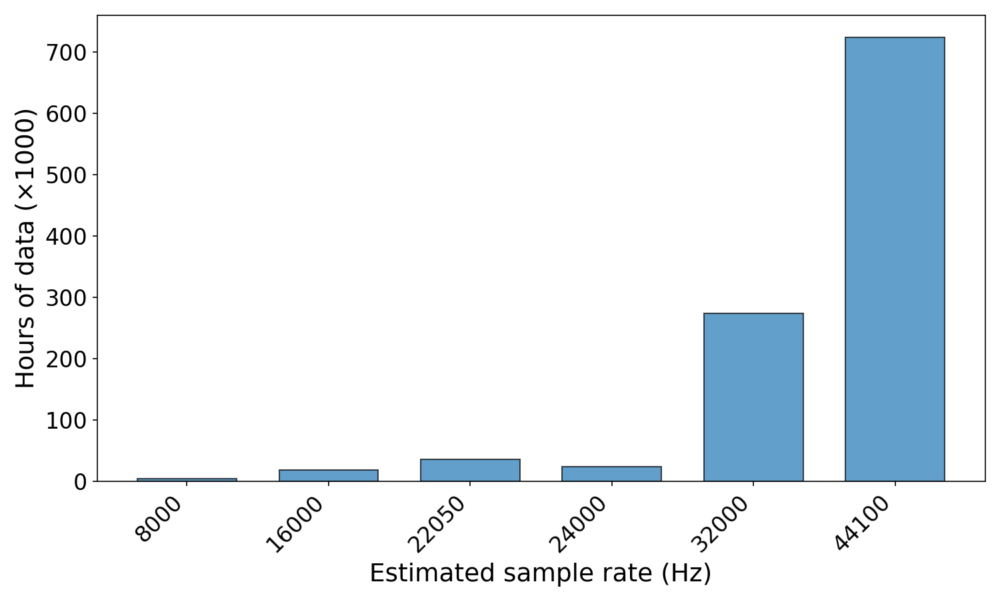
*Figure 4:YODAS v3 data distribution by estimated effective bandwidth; over 92% of recordings exceed 32 kHz.*

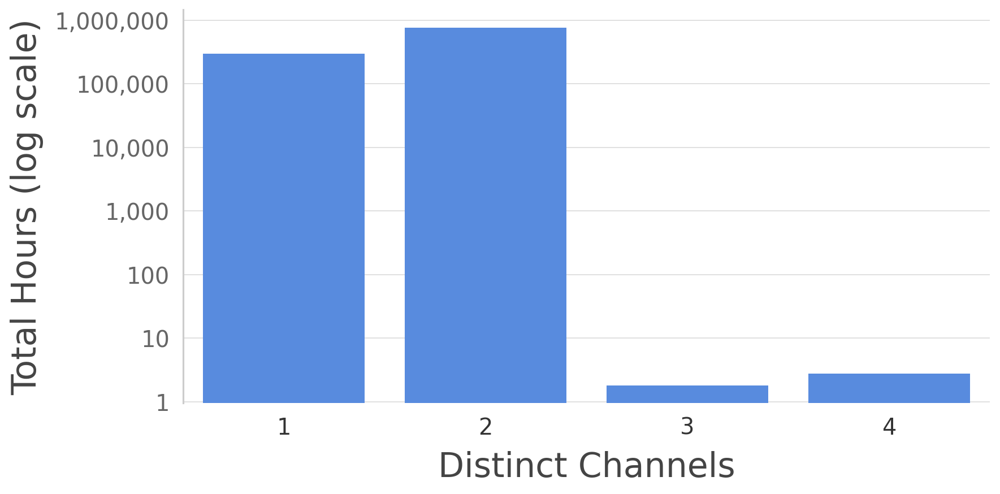
*Figure 5:Log-scale distribution of data by effective number of channels in each audio file*

---
**Usage Info**: 1519 tokens used.
**Generated at**: 2026-09-26 17:39:48

---

# 📚 Beyond Model Size: Redesigning LiSenNet for embedded speech enhancement

🚀 URL: https://arxiv.org/html/2609.29866

## 🌏 Abstract (원문)
Deploying real-time speech enhancement on resource-constrained devices requires meeting strict latency, memory, and energy constraints. Microcontroller NPUs can accelerate neural inference under these constraints, but only through a restricted set of operators in static, integer-quantized graphs. Recent speech-enhancement networks have reduced parameter counts and MACs to levels nominally suitable for microcontrollers, but their operators and execution patterns often remain incompatible with restricted NPUs. We address this gap by redesigning LiSenNet, a37\k37\mathrm{k}parameter sub-band dual-path model, for the STM32N6570-DK Neural-ART accelerator. We replace its recurrent bottleneck with convolutional frequency and temporal mixers, reformulate unsupported operations as static int8-compatible primitives, and use bounded decoder activations to preserve quality after quantization. On VoiceBank-DEMAND, the final NPU-compatible model matches or exceeds the recurrent LiSenNet baseline, reaching PESQ3.083.08versus3.013.01in FP32 and3.013.01versus2.932.93in int8. Deployed on a microcontroller, it processes each1616ms input hop in4.834.83ms, corresponding to a real-time factor of0.300.30. Stateless receptive-field recomputation is an order of magnitude slower at the same frame rate despite higher accelerator utilization. These results show that parameter count and operator compatibility, quantization range, and persistent streaming state must be co-designed to achieve efficient real-time speech enhancement on restricted NPUs.
## 🌏 Abstract (번역)
자원 제약이 있는 장치에 실시간 음성 향상을 배포하려면 엄격한 지연 시간, 메모리 및 에너지 제약을 충족해야 합니다. 마이크로컨트롤러 NPU는 이러한 제약 하에서 신경망 추론을 가속화할 수 있지만, 정적이고 정수 양자화된 그래프 내의 제한된 연산자 집합을 통해서만 가능합니다. 최근 음성 향상 네트워크는 매개변수 수와 MAC(곱셈-누적 연산) 수를 마이크로컨트롤러에 명목상 적합한 수준으로 줄였지만, 해당 연산자와 실행 패턴은 종종 제한된 NPU와 호환되지 않습니다. 우리는 STM32N6570-DK Neural-ART 가속기를 위해 37k 매개변수 서브밴드 듀얼 패스 모델인 LiSenNet을 재설계하여 이 격차를 해소합니다. 우리는 LiSenNet의 순환 병목을 컨볼루션 주파수 및 시간 믹서로 대체하고, 지원되지 않는 연산을 정적 int8 호환 기본 연산으로 재구성하며, 양자화 후 품질을 보존하기 위해 경계가 있는 디코더 활성화 함수를 사용합니다. VoiceBank-DEMAND 데이터셋에서 최종 NPU 호환 모델은 순환 LiSenNet 기준 모델과 일치하거나 이를 능가하며, FP32에서 PESQ 3.08 대 3.01, int8에서 3.01 대 2.93을 달성했습니다. 마이크로컨트롤러에 배포했을 때, 각 16ms 입력 홉을 4.83ms에 처리하여 실시간 계수 0.30에 해당합니다. 상태 비저장 수용 필드 재계산은 더 높은 가속기 활용률에도 불구하고 동일한 프레임 속도에서 한 자릿수 더 느립니다. 이러한 결과는 제한된 NPU에서 효율적인 실시간 음성 향상을 달성하기 위해 매개변수 수와 연산자 호환성, 양자화 범위, 그리고 영구적인 스트리밍 상태가 함께 설계되어야 함을 보여줍니다.

## 🔍 Methods & Results
- 기존 LiSenNet은 37k 매개변수의 경량 모델이지만, STM32N6 Neural-ART NPU에 배포 시 주파수 축 양방향 GRU, 다차원 LayerNorm, PReLU, Mish 활성화 함수, 서브픽셀 업샘플링 등 여러 연산자가 호환되지 않아 호스트 CPU 실행 및 오버헤드 발생.
- NPU 호환성을 위해 주파수 축 양방향 GRU를 깊이별 분리 가능한 컨볼루션 믹서(대칭 깊이별 컨볼루션 + 포인트별 컨볼루션)로 대체하고, 최적의 성능을 위해 11 크기의 주파수 커널을 사용.
- 비호환 연산자(다차원 LayerNorm, PReLU, Mish, 서브픽셀 업샘플링)를 각각 채널별 BatchNorm, ReLU6, 1x3 전치 컨볼루션(스트라이드 3)으로 대체하여 NPU 지원 연산자로 변환. ReLU6은 활성화 범위 제한으로 양자화 견고성 향상.
- 순환 상태 드리프트 및 양자화 오류 누적 문제를 해결하기 위해 시간 축 GRU를 인과적 시간 컨볼루션 네트워크(TCN)로 대체.
- VoiceBank-DEMAND 데이터셋에서 재설계된 NPU 호환 모델은 기존 순환 LiSenNet 기준 모델과 동등하거나 더 우수한 성능을 보였으며, FP32에서 PESQ 3.08 대 3.01, int8에서 3.01 대 2.93을 달성.
- 마이크로컨트롤러에 배포 시, 16ms 입력 홉을 4.83ms에 처리하여 실시간 계수 0.30을 달성했으며, 이는 효율적인 실시간 음성 향상을 위해 매개변수 수, 연산자 호환성, 양자화 범위, 영구 스트리밍 상태의 공동 설계가 중요함을 시사.

---
**Usage Info**: 4707 tokens used.
**Generated at**: 2026-09-26 17:40:04

---

# 📚 IS BROADER BETTER? A CONTROLLED STUDY OF MULTILINGUAL COVERAGE AND PRETRAINING OBJECTIVE IN FROZEN SSL ENCODERS FOR SPEECH DEEPFAKE DETECTION

🚀 URL: https://arxiv.org/html/2609.29138

## 🌏 Abstract (원문)
Frozen self-supervised (SSL) speech encoders are strong, low-cost front ends for audio deepfake detection, and recent comparisons agree that large, multilingual, discriminative encoders generalize best out of domain. These comparisons fail to control for encoder capacity, pretraining objective, and multilingual coverage together, identifyingwhichencoder wins without isolatingwhy. We present a controlled decomposition with a fixed pipeline and trainable capacity. We vary multilingual coverage on four wav2vec2-family encoders, matched to~315M parameters. We isolate the pretraining objective on two encoders matched on identical data. Coverage does not help monotonically, as out-of-domain error drops sharply at the~100-language scale (XLS-R) but does not improve further at the 1406-language extreme (MMS). We find that a mid-coverage encoder is strongest on farther out-of-domain sets, matching or surpassing a 577M-parameter model at 315M. Its lead on these far sets, statistically significant under paired bootstrap, and on the official ASVspoof 5 cost metric holds under two backends. Separately, masked-prediction pretraining generalizes better than contrastive on identical data (In-the-Wild EER 26.5% vs. 46.8%). Within this fixed frozen-encoder recipe, we find that broader and larger models are not reliably better.
## 🌏 Abstract (번역)
동결된 자기 지도(SSL) 음성 인코더는 오디오 딥페이크 탐지를 위한 강력하고 저비용의 프런트 엔드이며, 최근 비교 연구들은 크고 다국어이며 판별적인 인코더가 도메인 외부에서 가장 잘 일반화된다는 데 동의합니다. 이러한 비교 연구들은 인코더 용량, 사전 학습 목표, 다국어 커버리지를 함께 제어하지 못하여, 어떤 인코더가 우수한지는 식별하지만 그 이유를 분리하지 못했습니다. 본 연구는 고정된 파이프라인과 훈련 가능한 용량을 가진 제어된 분해를 제시합니다. 우리는 약 315M 파라미터에 맞춰진 4개의 wav2vec2 계열 인코더에서 다국어 커버리지를 다양하게 변경했습니다. 동일한 데이터에 맞춰진 두 인코더에서 사전 학습 목표를 분리했습니다. 커버리지는 단조롭게 도움이 되지 않았는데, 도메인 외부 오류는 약 100개 언어 규모(XLS-R)에서 급격히 감소했지만, 1406개 언어 극단(MMS)에서는 더 이상 개선되지 않았습니다. 우리는 중간 커버리지 인코더가 더 먼 도메인 외부 세트에서 가장 강력하며, 315M 파라미터에서 577M 파라미터 모델과 일치하거나 능가함을 발견했습니다. 이러한 먼 세트에서의 우위는 쌍 부트스트랩 하에서 통계적으로 유의미했으며, 공식 ASVspoof 5 비용 측정에서도 두 백엔드 모두에서 유지되었습니다. 별도로, 마스크 예측 사전 학습은 동일한 데이터에서 대조 학습보다 더 잘 일반화됩니다(In-the-Wild EER 26.5% 대 46.8%). 이 고정된 동결 인코더 레시피 내에서, 우리는 더 광범위하고 더 큰 모델이 항상 더 나은 것은 아니라는 것을 발견했습니다.

## 🔍 Methods & Results
- 오디오 딥페이크 탐지를 위해 동결된 SSL 인코더와 CQCC(Constant-Q Cepstral) 분기를 결합한 고정된 탐지 파이프라인을 사용했으며, 인코더의 마지막 4개 트랜스포머 레이어의 평균을 프레임 수준 표현으로 사용했습니다.
- SSL 및 CQCC 스트림은 각각 D=128로 투영된 후 교차 어텐션 레시피를 통해 융합되며, MHFA 또는 AASIST 백엔드와 선형 분류기가 뒤따릅니다. 인코더는 훈련 내내 동결됩니다.
- 인코더 간의 입력 스케일 차이를 제어하기 위해, 동결된 SSL 특징에 비선형 LayerNorm과 고정 스칼라 s=700을 적용하는 스케일 매칭 정규화를 수행했습니다.
- 다국어 커버리지 영향을 조사하기 위해, 약 315M 파라미터, 동일한 대조 학습 목표 및 아키텍처를 가진 4개의 wav2vec2 계열 인코더(wav2vec2-LV60, XLSR-53, XLS-R, MMS-300M)를 비교했습니다.
- 사전 학습 목표 영향을 분리하기 위해, 동일한 Libri-Light-60k 데이터에 대해 약 315M 파라미터로 사전 학습된 wav2vec2-LV60(대조 학습)과 HuBERT-LARGE(마스크 예측)를 비교했습니다.
- 참조 모델로 577M 파라미터의 대규모 다국어 XEUS를 포함했으며, LA19, LA21, DF21, In-the-Wild(ITW), ASVspoof 5(ASV5) 벤치마크에서 MHFA 및 AASIST 백엔드를 사용하여 평가했습니다.
- 결과적으로, 도메인 외부 오류는 약 100개 언어 규모(XLS-R)에서 급격히 감소했지만, 1406개 언어(MMS)에서는 더 이상 개선되지 않았으며, 중간 커버리지 인코더(XLS-R)가 315M 파라미터에서 577M 파라미터 모델(XEUS)과 동등하거나 능가하는 성능을 보였습니다.
- 마스크 예측 사전 학습(HuBERT-LARGE)이 동일한 데이터에서 대조 학습(wav2vec2-LV60)보다 더 나은 일반화 성능을 보였습니다 (In-the-Wild EER 26.5% 대 46.8%).
- 결론적으로, 고정된 동결 인코더 설정 내에서는 더 광범위하고 더 큰 모델이 항상 더 나은 성능을 보장하지는 않는다는 것을 발견했습니다.

---
**Usage Info**: 4110 tokens used.
**Generated at**: 2026-09-26 17:40:14

---

# 📚 The Vulnerability of Neural Audio Watermarks under Speech Enhancement

🚀 URL: https://arxiv.org/html/2609.29040

## 🌏 Abstract (원문)
Neural audio watermarks are increasingly deployed in commercial speech generation systems to make AI-generated speech traceable, yet their robustness has been studied mainly under conventional signal distortions. Since a watermark can be regarded as imperceptible noise added to the speech signal, a natural question is whether speech enhancement (SE), as a denoising model, can remove it. In this paper, we cascade Gaussian noise with SE models as a black-box watermark removal attack, covering both discriminative and generative SE paradigms, against six neural watermarks: AudioSeal, WavMark, SilentCipher, Timbre, Perth, and AlignMark. Experimental results show that the proposed attack significantly outperforms existing neural re-synthesis methods in watermark removal. In particular, we find that generative SE, which reconstructs the harmonic regions of speech while denoising, is highly destructive to watermarks. These findings show that SE poses a serious threat to current audio watermarking methods, and we call for SE-aware robustness evaluation in watermark design.
## 🌏 Abstract (번역)
신경 오디오 워터마크는 AI 생성 음성을 추적 가능하게 만들기 위해 상업용 음성 생성 시스템에 점점 더 많이 배포되고 있지만, 그 견고성은 주로 기존 신호 왜곡 하에서 연구되어 왔다. 워터마크는 음성 신호에 추가된 인지 불가능한 노이즈로 간주될 수 있으므로, 노이즈 제거 모델로서 음성 향상(SE)이 이를 제거할 수 있는지에 대한 자연스러운 의문이 제기된다. 본 논문에서는 AudioSeal, WavMark, SilentCipher, Timbre, Perth, AlignMark 등 6가지 신경 워터마크에 대해 판별형 및 생성형 SE 패러다임을 모두 포함하는 블랙박스 워터마크 제거 공격으로 가우시안 노이즈와 SE 모델을 연쇄적으로 적용한다. 실험 결과, 제안된 공격이 워터마크 제거에서 기존 신경 재합성 방법보다 훨씬 우수함을 보여준다. 특히, 노이즈 제거 중 음성의 고조파 영역을 재구성하는 생성형 SE가 워터마크에 매우 파괴적임을 발견했다. 이러한 발견은 SE가 현재 오디오 워터마킹 방법에 심각한 위협이 됨을 보여주며, 워터마크 설계 시 SE를 고려한 견고성 평가를 촉구한다.

## 🔍 Methods & Results
- AudioSeal, WavMark, SilentCipher, Timbre, Perth, AlignMark 등 6가지 신경 워터마크가 각기 다른 임베딩 메커니즘을 가지고 평가되었다.
- 워터마크 제거를 위해 판별형(Demucs, DeepFilterNet3) 및 생성형(스펙트로그램 도메인용 SGMSE, FlowSE; 언어 모델 기반용 GenSE, UniSE)으로 분류된 6가지 음성 향상(SE) 모델이 사용되었다.
- 공격자는 워터마크 방식에 대한 지식 없이 단일 워터마크 오디오 파일에만 접근하여 음질을 유지하면서 워터마크를 감지 불가능하게 만드는 블랙박스 공격 모델이 채택되었다.
- 공격 절차는 두 단계로 구성된다: 첫째, 워터마크된 오디오에 20dB 또는 10dB SNR의 가우시안 노이즈(GN)를 추가하고, 둘째, 사전 훈련된 SE 모델을 사용하여 노이즈가 있는 신호를 향상시킨다.
- 실험 결과, 제안된 공격, 특히 생성형 SE 모델을 사용한 공격이 워터마크 제거에서 기존 신경 재합성 방법보다 훨씬 우수한 성능을 보였다.
- 노이즈 제거 중 음성의 고조파 영역을 재구성하는 생성형 SE 모델이 워터마크에 매우 파괴적이라는 사실이 밝혀졌다.

---
**Usage Info**: 3476 tokens used.
**Generated at**: 2026-09-26 17:40:25

---

# 📚 WST-Graph: Topology-Preserving Wavelet Scattering Front-End for Speech Deepfake Detection

🚀 URL: https://arxiv.org/html/2609.29372

## 🌏 Abstract (원문)
The acoustic front-end determines which forensic cues a speech deepfake detector can exploit. The wavelet scattering transform (WST) provides stable multiscale coefficients with explicit coordinates, yet direct flattening obscures the parent relation between paths. We introduce WST-Graph, reconstructing these paths as a sparse modulation-carrier grid for an AASIST graph backend. Modulation-level normalization and length-aware adaptive local attention pooling produce fixed relative-time representations while retaining the acoustic axes before learned adaptation. This yields a waveform-to-graph interface with a fixed, parameter-free WST.Our configurations remain competitive with AASIST while using approximately 60% fewer trainable parameters and show clear gains on selected out-of-domain benchmarks.These results underscore the value of preserving parent-child relations within the carrier–modulation topology when constructing a compact, physically grounded interface for graph-based speech deepfake detection. Code will be released atGitHub.
## 🌏 Abstract (번역)
음향 프런트엔드는 음성 딥페이크 탐지기가 활용할 수 있는 포렌식 단서를 결정합니다. 웨이블릿 산란 변환(WST)은 명시적인 좌표를 가진 안정적인 다중 스케일 계수를 제공하지만, 직접적인 평탄화는 경로 간의 부모 관계를 모호하게 합니다. 우리는 WST-Graph를 소개하며, 이 경로들을 AASIST 그래프 백엔드를 위한 희소 변조-캐리어 그리드로 재구성합니다. 변조 수준 정규화 및 길이 인식 적응형 지역 어텐션 풀링은 학습된 적응 전에 음향 축을 유지하면서 고정된 상대 시간 표현을 생성합니다. 이는 고정되고 매개변수 없는 WST를 갖춘 파형-그래프 인터페이스를 제공합니다. 우리의 구성은 AASIST와 경쟁력을 유지하면서 약 60% 더 적은 학습 가능한 매개변수를 사용하며, 선택된 도메인 외 벤치마크에서 명확한 성능 향상을 보여줍니다. 이러한 결과는 그래프 기반 음성 딥페이크 탐지를 위한 작고 물리적으로 기반을 둔 인터페이스를 구축할 때 캐리어-변조 토폴로지 내에서 부모-자식 관계를 보존하는 것의 가치를 강조합니다. 코드는 GitHub에 공개될 예정입니다.

## 🔍 Methods & Results
- WST-Graph는 웨이블릿 산란 변환(WST) 경로를 AASIST 그래프 백엔드를 위한 희소 변조-캐리어 그리드로 재구성하여 음성 딥페이크 탐지기의 음향 프런트엔드를 개선합니다.
- PathNorm은 WST 계수를 로그 도메인으로 변환하고, 'log_modulation' 정책을 포함한 그룹별 정규화를 적용하여 동적 범위를 압축하고 캐리어 종속적 변동을 보존합니다.
- OrderGrid는 WST의 내재된 희소성을 고려하여, 이산 키를 사용하여 캐리어-변조 토폴로지를 재구성하고, 1차 및 2차 산란 경로를 구조화된 변조-캐리어 텐서 'G'에 임베딩하며, 고정된 구조적 이진 마스크 'M'을 통해 구조적 공백을 관리합니다.
- 채널별 적응형 지역 어텐션 풀링(ALAP) 레이어를 도입하여 동적으로 분할된 상대 시간 간격 내에서 시간적 특징을 집계하고, 가변적인 시간 차원을 고정된 그리드 크기 'K'로 축소합니다.
- WST-Graph는 어댑터 및 잠재 블록을 거쳐 AASIST의 그래프 백엔드와 통합되며, 스펙트럼 및 시간 노드를 형성하고 다양한 풀링 연산자를 적용합니다. 이 구성은 AASIST와 경쟁력을 유지하면서 약 60% 더 적은 학습 가능한 매개변수를 사용하며, 도메인 외 벤치마크에서 명확한 성능 향상을 보였습니다.
- 이 연구는 캐리어-변조 토폴로지 내에서 부모-자식 관계를 보존하는 것이 그래프 기반 음성 딥페이크 탐지를 위한 효율적인 인터페이스 구축에 중요함을 입증했습니다.

---
**Usage Info**: 6450 tokens used.
**Generated at**: 2026-09-26 17:40:39

---

# 📚 BanglaKontho: Closing the Long-Form Gap in Bangla Text-to-Speech

🚀 URL: https://arxiv.org/html/2609.29146

## 🌏 Abstract (원문)
Bangla, the seventh most spoken language in the world, remains under-resourced for neural text-to-speech. Public Bangla speech corpora are dominated by short read-prompt utterances collected for speech recognition, leaving long-form prosody and consistent single-speaker narration uncovered. We present BanglaKontho, a single-speaker Bangla TTS corpus of 20 hours derived from professional audiobook recordings: 7,050 segmented utterances with verified transcripts at 24 kHz. We also release a reusable Bangla text normalizer covering Bangladeshi-style digit grouping, currency and date expressions, Danda punctuation and Unicode normalization, together with the full preprocessing pipeline. An MB-iSTFT-VITS baseline trained from scratch reaches 9.5% WER and 4.46 naturalness MOS, against 16.0% and 3.16 for the same architecture retrained on the 12-hour IndicTTS-Bn corpus. The corpus is released openly under CC BY-NC 4.0.
## 🌏 Abstract (번역)
세계에서 일곱 번째로 많이 사용되는 언어인 벵골어는 신경망 기반 음성 합성(TTS)을 위한 자원이 부족합니다. 공개된 벵골어 음성 코퍼스는 음성 인식을 위해 수집된 짧은 읽기 프롬프트 발화가 대부분이며, 긴 형식의 운율과 일관된 단일 화자 내레이션은 다루지 못하고 있습니다. 본 연구에서는 전문 오디오북 녹음에서 파생된 20시간 분량의 단일 화자 벵골어 TTS 코퍼스인 BanglaKontho를 소개합니다. 이 코퍼스는 24kHz로 녹음된 7,050개의 분할된 발화와 검증된 전사본을 포함합니다. 또한 방글라데시 스타일의 숫자 그룹화, 통화 및 날짜 표현, 단다(Danda) 구두점, 유니코드 정규화를 포함하는 재사용 가능한 벵골어 텍스트 정규화 도구와 전체 전처리 파이프라인을 공개합니다. MB-iSTFT-VITS 베이스라인 모델을 처음부터 훈련했을 때 9.5%의 WER과 4.46의 자연성 MOS를 달성했으며, 이는 12시간 분량의 IndicTTS-Bn 코퍼스로 재훈련된 동일한 아키텍처의 16.0% WER과 3.16 MOS에 비해 우수한 성능입니다. 이 코퍼스는 CC BY-NC 4.0 라이선스 하에 공개됩니다.

## 🔍 Methods & Results
- BanglaKontho는 전문 오디오북 녹음에서 파생된 20시간 분량의 단일 화자 벵골어 TTS 코퍼스로, 24kHz로 녹음된 7,050개의 분할된 발화와 검증된 전사본을 포함합니다.
- 방글라데시 스타일의 숫자 그룹화, 통화 및 날짜 표현, 단다(Danda) 구두점, 유니코드 정규화를 포함하는 재사용 가능한 벵골어 텍스트 정규화 도구와 전체 전처리 파이프라인을 개발하여 공개했습니다.
- MB-iSTFT-VITS 베이스라인 모델을 BanglaKontho 코퍼스로 처음부터 훈련했을 때 9.5%의 WER과 4.46의 자연성 MOS를 달성했습니다.
- 동일한 MB-iSTFT-VITS 아키텍처를 12시간 분량의 IndicTTS-Bn 코퍼스로 재훈련했을 때의 성능(16.0% WER, 3.16 MOS)과 비교하여 BanglaKontho 코퍼스의 우수성을 입증했습니다.
- BanglaKontho 코퍼스는 CC BY-NC 4.0 라이선스 하에 공개됩니다.

---
**Usage Info**: 1543 tokens used.
**Generated at**: 2026-09-26 17:40:45

---

# 📚 BranchShine-CR: Compact Multilingual IPA Transcription with Self-Conditioned CTC and Consistency Regularization

🚀 URL: https://arxiv.org/html/2609.29069

## 🌏 Abstract (원문)
We introduce BranchShine-CR, a 25M-parameter model for multilingual transcription into the International Phonetic Alphabet (IPA). It combines log-mel features, a rotary-position E-Branchformer encoder, intermediate self-conditioned connectionist temporal classification (CTC), and consistency regularization across augmented views. On 16,646 shared IPApack++ test utterances, it achieves 4.47% IPA character error rate, a 22.3% relative reduction from ZIPA-CTC-NS, with approximately one-twelfth as many parameters while being trained from scratch. BranchShine-CR also outperforms a similarly sized NeMo Conformer baseline across all 41 dataset language labels. Ablation studies indicate the individual components synergetically acting in model performance contribution. These findings support compact IPA recognition capabilities under limited compute budget, for applications in low-resource on-device pronunciation assessment.
## 🌏 Abstract (번역)
본 논문은 국제 음성 기호(IPA)로의 다국어 전사를 위한 2,500만 개 파라미터 모델인 BranchShine-CR을 소개한다. 이 모델은 로그-멜 특징, 회전 위치 E-Branchformer 인코더, 중간 자체 조건부 연결 시간 분류(CTC), 그리고 증강된 뷰 전반에 걸친 일관성 정규화를 결합한다. 16,646개의 공유 IPApack++ 테스트 발화에서, BranchShine-CR은 4.47%의 IPA 문자 오류율을 달성했으며, 이는 ZIPA-CTC-NS 대비 22.3%의 상대적 감소를 보여준다. 또한, ZIPA-CTC-NS의 약 12분의 1에 해당하는 파라미터 수로 처음부터 훈련되었다. BranchShine-CR은 41개 데이터셋 언어 레이블 전체에서 유사한 크기의 NeMo Conformer 기준 모델보다 우수한 성능을 보인다. 제거 연구(ablation studies)는 개별 구성 요소들이 모델 성능 기여에 시너지 효과를 낸다는 것을 나타낸다. 이러한 결과는 제한된 컴퓨팅 예산 하에서 저자원 온디바이스 발음 평가 애플리케이션을 위한 소형 IPA 인식 능력을 뒷받침한다.

## 🔍 Methods & Results
- BranchShine-CR은 16kHz 모노 오디오를 입력받아 80-bin 로그-멜 특징을 추출하며, 12개의 RoPE E-Branchformer 블록으로 구성된 인코더를 사용한다. 이 인코더는 병렬 4-헤드 어텐션과 컨볼루션 게이팅 브랜치를 포함한다.
- 모델은 6번째, 10번째, 그리고 최종 12번째 블록 이후에 중간 자체 조건부 연결 시간 분류(CTC) 투영을 적용하여 학습을 강화한다.
- 지도 학습 CTC 손실과 증강된 두 가지 뷰(view) 간의 일관성 정규화(consistency regularization)를 결합한 손실 함수를 사용하여 훈련되며, 일관성 손실은 KL 발산(Kullback–Leibler divergence)을 기반으로 한다.
- 훈련 시 속도 조절(0.9, 1.0, 1.1), 드롭아웃(0.1), 그리고 SpecAugment(주파수 마스크, 시간 마스크)를 독립적으로 적용하여 데이터 다양성을 확보한다.
- AdamW 옵티마이저를 사용하며, 4,000 스텝 웜업 후 코사인 학습률 감소 스케줄을 따른다. 총 350,000 업데이트를 4.7일 동안 수행했다.
- 16,646개의 IPApack++ 테스트 발화에서 4.47%의 IPA 문자 오류율(CER)을 달성하여, 기존 ZIPA-CTC-NS 대비 22.3%의 상대적 오류 감소를 보였다.
- 2,500만 개의 파라미터로 ZIPA-CTC-NS의 약 12분의 1 수준의 파라미터 수를 가지면서도 우수한 성능을 달성했다.
- 41개 데이터셋 언어 레이블 전체에서 유사한 크기의 NeMo Conformer 기준 모델보다 뛰어난 성능을 입증했다.

## 🖼 Figures

*Figure 1:BranchShine-CR architecture. Shared 
(
𝑊
,
𝑏
)
 produce the logits; shared 
𝐴
 projects posteriors into the 
+
 nodes during training and inference. The inset uses two views of network 
𝐹
𝜃
: 
𝐶
 combines final and auxiliary CTC; 
𝐷
 is symmetric stopped-target KL.*

---
**Usage Info**: 4134 tokens used.
**Generated at**: 2026-09-26 17:40:58

---

# 📚 Self-Play Pretraining with Zero Data

🚀 URL: https://arxiv.org/html/2609.30063

## 🌏 Abstract (원문)
Advances in language modeling have been driven by scaling pretraining on ever more data. Yet, the training data is still largely curated on the model’s behalf. A more general approach to pretraining would let the model learn to generate the data most useful for its own improvement. This would provide an effectively unbounded source of training data, limited by compute rather than human knowledge. We introduceSelf-Play Pretraining with Zero Data, an initial proof-of-concept towards realizing this vision. Our procedure casts synthetic data generation as a search over the space of all computable structure, taking inspiration from Solomonoff induction. Starting from random initialization, two models learn in tandem: a generator proposes programs interpreted by a universal Turing machine, generating byte sequences, while a learner autoregressively predicts these byte sequences. The learner is trained with standard cross-entropy, while the generator is trained with reinforcement learning to produce sequences at the frontier of the learner’s capabilities, yielding an adaptive curriculum. A universal Turing machine gives us a search space over all computable data-generating processes, imposing little domain-specific structure, and self-play searches over this space for useful training data. We test whether zero-shot performance on natural data improves predictably with self-play compute; this is a clean test of transfer since neither generator nor learner is trained on natural data. Across several natural datasets, zero-shot loss exhibits predictable scaling in compute. The models also exhibit in-context learning, and discover recognizable mathematical sequences during training.
## 🌏 Abstract (번역)
언어 모델링의 발전은 점점 더 많은 데이터에 대한 사전 학습 규모를 확장함으로써 이루어졌습니다. 그러나 훈련 데이터는 여전히 모델을 위해 주로 큐레이션됩니다. 사전 학습에 대한 보다 일반적인 접근 방식은 모델이 자체 개선에 가장 유용한 데이터를 생성하는 방법을 학습하도록 하는 것입니다. 이는 인간의 지식이 아닌 컴퓨팅 능력에 의해 제한되는, 사실상 무한한 훈련 데이터 소스를 제공할 것입니다. 우리는 이러한 비전을 실현하기 위한 초기 개념 증명으로 '제로 데이터 자기 학습 사전 학습(Self-Play Pretraining with Zero Data)'을 소개합니다. 우리의 절차는 솔로모노프 귀납법(Solomonoff induction)에서 영감을 받아 합성 데이터 생성을 모든 계산 가능한 구조 공간에 대한 탐색으로 간주합니다. 무작위 초기화부터 시작하여 두 모델이 함께 학습합니다. 생성기(generator)는 범용 튜링 머신에 의해 해석되어 바이트 시퀀스를 생성하는 프로그램을 제안하고, 학습기(learner)는 이 바이트 시퀀스를 자기회귀적으로 예측합니다. 학습기는 표준 교차 엔트로피로 훈련되는 반면, 생성기는 학습기의 능력 한계에 있는 시퀀스를 생성하도록 강화 학습으로 훈련되어 적응형 커리큘럼을 제공합니다. 범용 튜링 머신은 도메인별 구조를 거의 부과하지 않으면서 모든 계산 가능한 데이터 생성 프로세스에 대한 탐색 공간을 제공하며, 자기 학습은 이 공간에서 유용한 훈련 데이터를 탐색합니다. 우리는 자연 데이터에 대한 제로샷 성능이 자기 학습 컴퓨팅 능력에 따라 예측 가능하게 향상되는지 테스트합니다. 이는 생성기와 학습기 모두 자연 데이터로 훈련되지 않았기 때문에 전이 학습에 대한 깨끗한 테스트입니다. 여러 자연 데이터셋에서 제로샷 손실은 컴퓨팅 능력에 따라 예측 가능한 스케일링을 보입니다. 또한 모델은 문맥 내 학습(in-context learning)을 보이며 훈련 중에 인식 가능한 수학적 시퀀스를 발견합니다.

## 🔍 Methods & Results
- "Self-Play Pretraining with Zero Data"라는 새로운 사전 학습 접근 방식을 제안하며, 이는 모델이 자체 개선에 가장 유용한 데이터를 생성하도록 학습하는 것을 목표로 합니다.
- 합성 데이터 생성은 솔로모노프 귀납법에서 영감을 받아 모든 계산 가능한 구조 공간에 대한 탐색으로 간주됩니다.
- 생성기(generator)와 학습기(learner) 두 모델이 함께 학습합니다. 생성기는 범용 튜링 머신이 해석하여 바이트 시퀀스를 생성하는 프로그램을 제안하고, 학습기는 이 시퀀스를 예측합니다.
- 학습기는 표준 교차 엔트로피로 훈련되며, 생성기는 학습기의 능력 한계에 있는 시퀀스를 생성하도록 강화 학습으로 훈련되어 적응형 커리큘럼을 제공합니다.
- 범용 튜링 머신을 사용하여 모든 계산 가능한 데이터 생성 프로세스에 대한 탐색 공간을 제공하며, 자기 학습을 통해 유용한 훈련 데이터를 탐색합니다.
- 자연 데이터에 대한 제로샷 성능이 자기 학습 컴퓨팅 능력에 따라 예측 가능하게 향상되는지 테스트했으며, 생성기와 학습기 모두 자연 데이터로 훈련되지 않았음에도 불구하고 여러 자연 데이터셋에서 제로샷 손실이 컴퓨팅 능력에 따라 예측 가능한 스케일링을 보였습니다.
- 모델은 문맥 내 학습(in-context learning) 능력을 보였으며, 훈련 중에 인식 가능한 수학적 시퀀스를 발견했습니다.

## 🖼 Figures
![Figure 1: Self-Play Pretraining with Zero Data. Starting from randomly initialized models and using only synthetically generated data, self-play produces predictable scaling on held-out natural data. (Top) Our procedure casts synthetic data generation as search over the space of computable structure. A generator proposes programs, which are executed to produce byte sequences used to train a learner by next-token prediction. The generator is trained via reinforcement learning to propose programs near the frontier of the learner’s capabilities, measured by how strongly the learner’s gradients align with the learner’s recent learning trajectory with respect to an AdamW-preconditioned inner product. (Lower left) Self-play produces predictable improvements in validation loss with compute across natural datasets. We show the compute-optimal frontier over model sizes, number of self-play rounds, and ensemble sizes. (Lower right) The resulting learner exhibits in-context learning on held-out tasks without any gradient updates. We report empirical success under greedy decoding as a function of the number of in-context examples 
𝑚
, averaged over independently sampled task instances.](../images/2026-09-26/2609.30063/2609.30063_fig0.png)
*Figure 1: Self-Play Pretraining with Zero Data. Starting from randomly initialized models and using only synthetically generated data, self-play produces predictable scaling on held-out natural data. (Top) Our procedure casts synthetic data generation as search over the space of computable structure. A generator proposes programs, which are executed to produce byte sequences used to train a learner by next-token prediction. The generator is trained via reinforcement learning to propose programs near the frontier of the learner’s capabilities, measured by how strongly the learner’s gradients align with the learner’s recent learning trajectory with respect to an AdamW-preconditioned inner product. (Lower left) Self-play produces predictable improvements in validation loss with compute across natural datasets. We show the compute-optimal frontier over model sizes, number of self-play rounds, and ensemble sizes. (Lower right) The resulting learner exhibits in-context learning on held-out tasks without any gradient updates. We report empirical success under greedy decoding as a function of the number of in-context examples 
𝑚
, averaged over independently sampled task instances.*

---
**Usage Info**: 1929 tokens used.
**Generated at**: 2026-09-26 17:41:06

---

