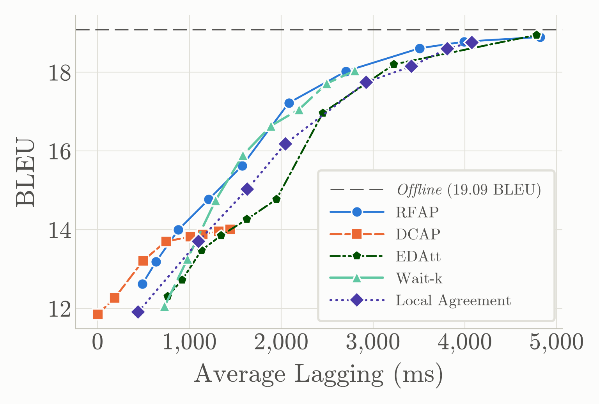
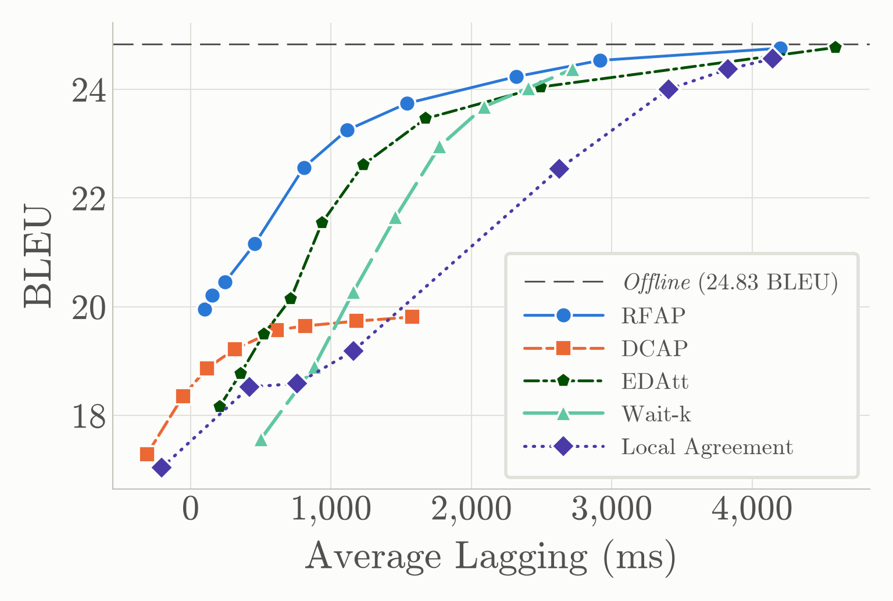
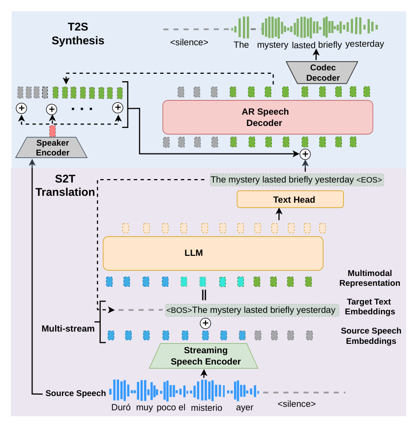

# 🚩 (2026-09-28) Scholar Inbox 추천 논문 

# 📚 TinyAudio: Compact and Efficient Text-to-Audio Generation for Low-Resource Deployment

🚀 URL: https://arxiv.org/html/2609.31525

## 🌏 Abstract (원문)
Text-to-audio (TTA) generation has advanced rapidly in generation quality and instruction following. However, representative systems often require around a billion parameters, limiting deployment on resource-constrained devices. This paper introducesTinyAudio, a compact flow-matching-based TTA model for low-resource deployment. At its core, TinyAudio uses TA-DiT, a 35M single-stream flow-matching Transformer. TinyAudio also includes TA-CLAP, a 32M audio-aligned text encoder, and TA-VAE, whose 20M decoder reconstructs 44.1
		kHz audio from compressed latents. TinyAudio has only87Mparameters in total, over 90% fewer than representative billion-parameter pipelines, and uses 0.48
		GB peak GPU memory. TinyAudio achieves competitive generation quality on AudioCaps and TTA-Bench.We further introduce TinyAudio-MF, a MeanFlow-accelerated model that enables real-time generation with a four-core CPU quota.Our results demonstrate a practical quality--footprint trade-off for low-resource TTA deployment.111Demo:https://tinyaudio-project.github.io/. Code:https://github.com/junxi25liu/TinyAudio.
## 🌏 Abstract (번역)
텍스트-오디오(TTA) 생성은 생성 품질과 지시 따르기 측면에서 빠르게 발전했습니다. 그러나 대표적인 시스템들은 종종 약 10억 개의 매개변수를 필요로 하여, 자원 제약이 있는 장치에 배포하는 데 한계가 있습니다. 본 논문은 저자원 배포를 위한 소형 플로우 매칭 기반 TTA 모델인 TinyAudio를 소개합니다. TinyAudio의 핵심은 3,500만 개의 매개변수를 가진 단일 스트림 플로우 매칭 트랜스포머인 TA-DiT를 사용합니다. TinyAudio는 또한 3,200만 개의 매개변수를 가진 오디오 정렬 텍스트 인코더인 TA-CLAP과, 압축된 잠재 공간에서 44.1kHz 오디오를 재구성하는 2,000만 개의 매개변수를 가진 디코더인 TA-VAE를 포함합니다. TinyAudio는 총 8,700만 개의 매개변수만을 가지며, 이는 대표적인 10억 개 매개변수 파이프라인보다 90% 이상 적고, 최대 0.48GB의 GPU 메모리를 사용합니다. TinyAudio는 AudioCaps 및 TTA-Bench에서 경쟁력 있는 생성 품질을 달성합니다. 우리는 또한 4코어 CPU 할당으로 실시간 생성을 가능하게 하는 MeanFlow 가속 모델인 TinyAudio-MF를 소개합니다. 우리의 결과는 저자원 TTA 배포를 위한 실용적인 품질-점유 공간 트레이드오프를 보여줍니다. 데모: https://tinyaudio-project.github.io/. 코드: https://github.com/junxi25liu/TinyAudio.

## 🔍 Methods & Results
- TinyAudio는 TA-CLAP(32M 텍스트 인코더), TA-DiT(35M 오디오 잠재 공간 생성 트랜스포머), TA-VAE(20M 44.1kHz 파형 재구성 디코더)의 세 가지 핵심 구성 요소로 이루어져 총 87M 매개변수를 가집니다.
- TA-VAE는 DAC 스타일의 인코더와 AMP 블록으로 구성된 경량 디코더를 결합하여 44.1kHz 파형을 1024배 압축하여 64채널, 43Hz의 잠재 시퀀스를 생성합니다.
- TA-CLAP은 32M 텍스트 인코더로, Ettin-encoder-32m에서 초기화되고 사전 훈련된 HTSAT 오디오 인코더와 짝을 이루어 오디오-텍스트 대조 학습을 통해 음향-의미론적 표현을 강화합니다.
- TA-DiT는 단일 스트림 오디오-텍스트 모델링과 레이어 공유 조건부 변조를 통해 별도의 양식 융합 모듈과 블록별 조건부 변조 네트워크에서 발생하는 반복 매개변수를 제거합니다.
- TA-DiT는 오디오 및 텍스트 토큰을 단일 시퀀스로 연결하고, 독립적으로 인덱싱된 회전 위치 임베딩을 적용하여 양식 간에 공유된 어텐션 매개변수를 사용합니다.
- TA-DiT는 모든 트랜스포머 블록에 걸쳐 조건부 변조 네트워크를 공유하고, 경량 블록별 임베딩을 사용하여 깊이 의존적 동작을 유지함으로써 매개변수 오버헤드를 줄입니다.
- TinyAudio-MF는 TinyAudio 체크포인트에서 초기화된 후 품질 인식 SFT(Supervised Fine-Tuning) 서브셋에서 Improved Mean Flows 목표로 추가 훈련되어 단일 함수 평가로 실시간 생성을 가능하게 합니다.
- TinyAudio는 총 87M 매개변수로, 대표적인 10억 매개변수 파이프라인보다 90% 이상 적은 매개변수를 사용하며, 최대 0.48GB의 GPU 메모리를 사용합니다.
- TinyAudio는 AudioCaps 및 TTA-Bench에서 경쟁력 있는 생성 품질을 달성하며, 저자원 TTA 배포를 위한 실용적인 품질-점유 공간 트레이드오프를 입증합니다.

## 🖼 Figures

*Figure 1:AudioCaps quality versus generator size. Bubble labels indicate generator parameters, and lower FD is better. TinyAudio operates in a substantially smaller parameter regime while retaining competitive distributional quality.*

*Figure 2:Single-stream TA-DiT. Projected text tokens and noised audio latents are concatenated for joint self-attention. The right panel shows layer-shared conditional modulation: shared MLPs combine text, timestep, and block embeddings to produce shift–scale and gate parameters. Only audio tokens predict latent velocity.*

---
**Usage Info**: 3000 tokens used.
**Generated at**: 2026-09-28 20:38:57

---

# 📚 A Comprehensive Study of Content Representations for Speech Synthesis

🚀 URL: https://arxiv.org/html/2609.30975

## 🌏 Abstract (원문)
Speech content representations are central to voice conversion, speech-to-speech translation, and multimodal language models, yet they are rarely compared under a common generative framework that directly measures what each representation contains. We address this by training a generative model conditioned solely on each representation and evaluating the generated audio along the content, speaker identity, and prosody axes. Across SSL features, supervised tokens, posteriorgrams, and neural audio codecs, we find two distinct regimes: representations that nearly reconstruct the original audio, and representations that effectively disentangle speaker identity. These results show that disentanglement depends not on supervision alone, but on the interaction between the training objective and the representation’s information capacity: supervised representations only disentangle speaker identity when their capacity is sufficiently constrained.
## 🌏 Abstract (번역)
음성 내용 표현은 음성 변환, 음성-음성 번역, 다중 모달 언어 모델의 핵심이지만, 각 표현이 무엇을 포함하는지 직접 측정하는 공통 생성 프레임워크 하에서 비교되는 경우는 드뭅니다. 우리는 각 표현에만 조건화된 생성 모델을 훈련하고 생성된 오디오를 내용, 화자 신원, 운율 축을 따라 평가함으로써 이 문제를 해결합니다. SSL 특징, 지도 토큰, 포스테리어그램, 신경 오디오 코덱 전반에 걸쳐 두 가지 뚜렷한 체제를 발견했습니다: 원본 오디오를 거의 재구성하는 표현과 화자 신원을 효과적으로 분리하는 표현입니다. 이러한 결과는 분리가 감독(supervision)에만 의존하는 것이 아니라 훈련 목표와 표현의 정보 용량 간의 상호작용에 달려 있음을 보여줍니다. 즉, 지도 표현은 용량이 충분히 제한될 때만 화자 신원을 분리합니다.

## 🔍 Methods & Results
- 연구 방법론은 주어진 표현(r)으로부터 음성을 합성하도록 생성 모델(x_gen ~ p(x|r))을 훈련하고, 생성된 오디오를 내용, 화자 신원, 운율 축을 따라 평가합니다.
- 생성 모델은 화자 ID나 참조 오디오와 같은 화자 신원 정보에 접근할 수 없도록 설계되어, 생성된 오디오에 포함된 모든 화자 정보가 오직 표현 자체에서만 유래하도록 하여 화자 분리 정도를 신뢰성 있게 측정합니다.
- 내용 평가는 원본 오디오와 생성된 오디오의 ASR 전사 간의 차등 단어 오류율(dWER)을 사용하여 측정하며, 실제 오디오에서 ASR이 올바르게 전사한 발화에 한정하여 평가합니다.
- 화자 신원 평가는 VoicePrivacy 프로토콜의 화자 검증 시스템의 등 오류율(EER)을 사용하며, EER 50%는 화자 정보가 없음을 의미합니다. 또한, 화자 임베딩에서 성별을 예측하는 로지스틱 프로브의 정확도를 계산합니다.
- 운율 평가는 원본 및 생성된 오디오의 F0 윤곽(센트 단위) 간의 MSE 오류를 평균 F0 차이(Δμ, 레지스터 오류), F0 표준 편차 차이(Δσ, 범위 오류), 그리고 두 윤곽 간의 상관관계(ρ)로 분해하여 측정합니다.
- 전사에는 Parakeet, 화자 임베딩에는 ECAPA-TDNN, F0 추출에는 PENN이 사용되었으며, 생성된 오디오의 전반적인 품질 확인을 위해 UTMOS도 보고됩니다.
- 주요 결과로, 원본 오디오를 거의 재구성하는 표현과 화자 신원을 효과적으로 분리하는 표현이라는 두 가지 뚜렷한 체제가 발견되었습니다.
- 화자 분리는 감독(supervision)뿐만 아니라 훈련 목표와 표현의 정보 용량 간의 상호작용에 달려 있으며, 지도 표현은 용량이 충분히 제한될 때만 화자 신원을 분리한다는 결론을 도출했습니다.

## 🖼 Figures

*Figure 1:Diagram of the evaluation methodology.*

---
**Usage Info**: 4085 tokens used.
**Generated at**: 2026-09-28 20:39:11

---

# 📚 MuseTimbre: Zero-Shot Timbre Transfer by Controlling a Frozen Music Generator

🚀 URL: https://arxiv.org/html/2609.30548

## 🌏 Abstract (원문)
Instrument timbre transfer re-voices a performance using the timbre of another instrument. Extracting the target timbre from an audio reference capture more nuances than inferring it from a text prompt. Systems that read timbre from such a clip train a dedicated model for the task, which captures the timbre cleanly but stays a narrow, single-purpose system. More versatile approaches add control to a pretrained music generator, yet a reference clip entangles timbre with genre and melody, so these systems fall back on text to name the timbre. We present MuseTimbre, the first system, to our best knowledge, that transfers timbre from an audio reference to a polyphonic source through conditioning a pretrained music generator. This system employs a multi-pitch estimator to extract pitch information from the source and finetune a CLAP encoder to extract timbre information from the reference audio. Experiments show that across four datasets of real polyphonic recordings, MuseTimbre achieves pitch alignment on par with the baselines while matching the reference timbre far more closely. Results also show that the finetuned CLAP-based timbre extractor is robust to pitch variations, making it useful in timbre similarity measures.
## 🌏 Abstract (번역)
악기 음색 전이(timbre transfer)는 다른 악기의 음색을 사용하여 연주를 재음성화합니다. 오디오 참조에서 목표 음색을 추출하는 것이 텍스트 프롬프트에서 추론하는 것보다 더 많은 뉘앙스를 포착합니다. 이러한 클립에서 음색을 읽는 시스템은 해당 작업을 위한 전용 모델을 훈련하여 음색을 깨끗하게 포착하지만, 좁고 단일 목적의 시스템으로 남아있습니다. 더 다재다능한 접근 방식은 사전 훈련된 음악 생성기에 제어를 추가하지만, 참조 클립은 음색을 장르 및 멜로디와 얽히게 하므로 이러한 시스템은 음색을 명명하기 위해 텍스트에 의존합니다. 우리는 사전 훈련된 음악 생성기를 조건화하여 오디오 참조로부터 다성 소스(polyphonic source)로 음색을 전이하는, 우리가 아는 한 최초의 시스템인 MuseTimbre를 제시합니다. 이 시스템은 소스에서 피치 정보를 추출하기 위해 다중 피치 추정기(multi-pitch estimator)를 사용하고, 참조 오디오에서 음색 정보를 추출하기 위해 CLAP 인코더를 미세 조정합니다. 실험 결과, 실제 다성 녹음의 네 가지 데이터셋에서 MuseTimbre는 기준선과 동등한 피치 정렬을 달성하면서 참조 음색에 훨씬 더 가깝게 일치하는 것으로 나타났습니다. 또한 결과는 미세 조정된 CLAP 기반 음색 추출기가 피치 변화에 강건하여 음색 유사성 측정에 유용하다는 것을 보여줍니다.

## 🔍 Methods & Results
- MuseTimbre는 사전 훈련된 음악 생성기(Stable Audio 3 Medium)를 조건화하여 오디오 참조로부터 다성 소스로 음색을 전이하는 시스템이다.
- 소스 오디오에서 피치 정보를 추출하기 위해 Basic Pitch 기반의 다중 피치 추정기를 사용하고, 참조 오디오에서 음색 정보를 추출하기 위해 미세 조정된 CLAP 인코더를 사용한다.
- 피치 조건화는 이진 피아노 롤 표현을 교차 어텐션으로 주입하고, 음색 조건화는 시간 불변 임베딩을 적응형 레이어 정규화(AdaLN)를 통해 주입한다.
- 합성 오디오(Slakh MIDI)와 실제 오디오(MoisesDB, URMP)의 50/50 혼합 데이터셋에서 정류 흐름(rectified-flow) 목표로 훈련되었다.
- 실험 결과, MuseTimbre는 기준선과 동등한 피치 정렬을 달성하면서 참조 음색에 훨씬 더 가깝게 일치하는 성능을 보였다.
- 미세 조정된 CLAP 기반 음색 추출기는 피치 변화에 강건하며, 음색 유사성 측정에 유용함을 입증했다.
- 이 시스템은 악보 피아노 롤을 입력으로 받아 참조 클립의 음색으로 렌더링할 수 있으며, 기존의 텍스트 제어 기능도 유지한다.

---
**Usage Info**: 4147 tokens used.
**Generated at**: 2026-09-28 20:39:21

---

# 📚 Training-Free Pronunciation Transcription via Text-Constrained Acoustic Rescoring

🚀 URL: https://arxiv.org/html/2609.30924

## 🌏 Abstract (원문)
Accurate and efficient pronunciation transcription is essential for preparing text-to-speech training data at scale. Existing approaches have different limitations: grapheme-to-pronunciation (G2P) and speech-to-pronunciation (S2P) methods each capture only partial information, using only text or only speech, while speech-and-text-to-pronunciation (ST2P) methods use both but require costly pronunciation-annotated data. To address this problem, we propose a training-free ST2P pipeline that integrates both lexical and acoustic information at inference time. Lexical resources and G2P tools generate text-constrained candidates, and a left-to-right greedy search selects the best one using whole-sequence negative log-likelihoods from frozen pretrained S2P models. On three Japanese corpora, our method reduces Character Error Rate (CER) from 0.60–1.40% (text-only baseline) to 0.04–0.17% with reference transcripts, and 0.64–1.58% with ASR transcripts. It outperforms all baselines, including a trained ST2P model and commercial multimodal LLMs. Our greedy search method is 3–3.5×faster than beam search at similar CER, and the cascade is 2×faster than direct decoding ensuring the efficiency and accuracy. In Spanish, French, and preliminary English, it also surpasses four open multimodal LLMs and the best traditional methods.
## 🌏 Abstract (번역)
정확하고 효율적인 발음 전사는 대규모 텍스트-음성 변환(TTS) 훈련 데이터를 준비하는 데 필수적입니다. 기존 접근 방식들은 각기 다른 한계를 가집니다: G2P(철자-발음 변환) 및 S2P(음성-발음 변환) 방법은 각각 텍스트 또는 음성만을 사용하여 부분적인 정보만을 포착하며, ST2P(음성-텍스트-발음 변환) 방법은 둘 다 사용하지만 비용이 많이 드는 발음 주석 데이터가 필요합니다. 이 문제를 해결하기 위해, 본 연구는 추론 시점에 어휘 및 음향 정보를 모두 통합하는 훈련 없는 ST2P 파이프라인을 제안합니다. 어휘 자원과 G2P 도구가 텍스트 제약 후보를 생성하고, 사전 훈련된 S2P 모델의 전체 시퀀스 음의 로그 가능도(negative log-likelihoods)를 사용하여 왼쪽에서 오른쪽으로 진행하는 탐욕적 탐색(greedy search)이 최적의 후보를 선택합니다. 세 가지 일본어 코퍼스에서, 본 방법은 참조 전사본 사용 시 문자 오류율(CER)을 0.60–1.40% (텍스트 전용 기준선)에서 0.04–0.17%로, ASR 전사본 사용 시 0.64–1.58%로 감소시켰습니다. 이는 훈련된 ST2P 모델 및 상용 멀티모달 LLM을 포함한 모든 기준선보다 우수한 성능을 보였습니다. 본 연구의 탐욕적 탐색 방법은 유사한 CER에서 빔 탐색보다 3–3.5배 빠르며, 캐스케이드 방식은 직접 디코딩보다 2배 빨라 효율성과 정확성을 보장합니다. 스페인어, 프랑스어 및 예비 영어에서도 네 가지 공개 멀티모달 LLM과 최고의 전통적인 방법을 능가했습니다.

## 🔍 Methods & Results
- 훈련 없는 ST2P 파이프라인은 추론 시 어휘 및 음향 정보를 통합하여 발음 전사를 수행합니다.
- 텍스트 전사는 N개의 스팬으로 분할되며, 각 스팬에 대해 사전, G2P, 규칙 등 어휘 자원에서 후보 발음을 생성합니다.
- 고정된 사전 훈련 S2P 모델을 사용하여 전체 시퀀스 후보 발음의 음의 로그 가능도(NLL)를 계산하여 음향 점수를 매깁니다.
- 최적의 발음 후보 조합은 왼쪽에서 오른쪽으로 진행하는 탐욕적 탐색(greedy search)을 통해 NLL을 최소화하여 선택합니다.
- 견고성을 위해 두 개의 S2P 모델을 융합된 점수(S = L1 + λL2)로 결합하고, 계산 효율성을 위해 캐스케이드 방식을 사용합니다.
- 캐스케이드 방식은 L1으로 초기 탐색 후, 기본 읽기가 변경된 경우에만 융합된 점수로 재탐색합니다.
- 마진 검사를 통해 변경된 스팬을 재검토하고, 기본값에 대한 점수 이점이 길이 스케일링된 임계값(τ)을 충족하지 못하면 해당 스팬을 기본값으로 되돌립니다.
- 일본어 코퍼스에서 참조 전사본 사용 시 CER을 0.60–1.40%에서 0.04–0.17%로, ASR 전사본 사용 시 0.64–1.58%로 감소시켰습니다.
- 훈련된 ST2P 모델 및 상용 멀티모달 LLM을 포함한 모든 기준선보다 우수한 성능을 보였습니다.
- 탐욕적 탐색은 유사한 CER에서 빔 탐색보다 3–3.5배 빠르며, 캐스케이드 방식은 직접 디코딩보다 2배 빨라 효율성과 정확성을 동시에 확보했습니다.
- 스페인어, 프랑스어 및 예비 영어에서도 네 가지 공개 멀티모달 LLM과 최고의 전통적인 방법을 능가했습니다.

## 🖼 Figures
![Figure 2:Training-free pronunciation transcription. (a) Dictionaries, G2P, and rules generate readings for transcript spans. Complete pronunciations 
𝑦
⁡
(
𝐫
)
 are converted to model-specific tokens and evaluated by a frozen S2P model given speech 
𝑥
, combining lexical constraints and acoustic evidence through negative log-likelihood (NLL). (b) Left-to-right greedy search for “read the record” (
𝑃
=
0
; illustrative NLLs). Each node represents a complete pronunciation with earlier choices fixed and later spans at their defaults. The lowest-NLL candidate (green) is committed; gray nodes are rejected, and dashed outlines mark span defaults. The final node is the search output; cascade rescoring and the subsequent margin check are not shown.](../images/2026-09-28/2609.30924/2609.30924_fig1.png)
*Figure 2:Training-free pronunciation transcription. (a) Dictionaries, G2P, and rules generate readings for transcript spans. Complete pronunciations 
𝑦
⁡
(
𝐫
)
 are converted to model-specific tokens and evaluated by a frozen S2P model given speech 
𝑥
, combining lexical constraints and acoustic evidence through negative log-likelihood (NLL). (b) Left-to-right greedy search for “read the record” (
𝑃
=
0
; illustrative NLLs). Each node represents a complete pronunciation with earlier choices fixed and later spans at their defaults. The lowest-NLL candidate (green) is committed; gray nodes are rejected, and dashed outlines mark span defaults. The final node is the search output; cascade rescoring and the subsequent margin check are not shown.*

---
**Usage Info**: 5138 tokens used.
**Generated at**: 2026-09-28 20:39:38

---

# 📚 Attention-Based Adaptive Policies for Simultaneous Speech-to-Text Translation

🚀 URL: https://arxiv.org/html/2609.30839

## 🌏 Abstract (원문)
Simultaneous speech-to-text translation (Simul-S2TT) consists of generating partial translations while the incoming audio frames are processed by the system. However, the streaming nature of this setup creates the challenge of deciding the best moment to perform an accurate translation while minimizing the delay. To address this challenge, we utilize the cross-attention mechanism of the encoder-decoder architecture to find the right alignment between the input speech frames and the target text tokens. In this paper, we propose theRecent Frame Attention Policy (RFAP)and theDual-Condition Attention Policy (DCAP)that allow offline trained speech-to-text translation models to be used in streaming scenarios without requiring additional training. Results on three different language translation pairs over the CVSS-C corpus show that the RFAP is able to surpass other policies with gains of up to 4.0 BLEU while reducing the translation delay by almost 1 second. Moreover, the DCAP is able to preserve a high translation quality when the latency is very low.
## 🌏 Abstract (번역)
동시 음성-텍스트 번역(Simul-S2TT)은 시스템이 들어오는 오디오 프레임을 처리하는 동안 부분적인 번역을 생성하는 것을 포함합니다. 그러나 이러한 설정의 스트리밍 특성은 지연을 최소화하면서 정확한 번역을 수행할 최적의 순간을 결정하는 문제를 야기합니다. 이 문제를 해결하기 위해 우리는 인코더-디코더 아키텍처의 교차 어텐션 메커니즘을 활용하여 입력 음성 프레임과 목표 텍스트 토큰 간의 올바른 정렬을 찾습니다. 본 논문에서는 추가 훈련 없이 오프라인으로 훈련된 음성-텍스트 번역 모델을 스트리밍 시나리오에서 사용할 수 있도록 하는 Recent Frame Attention Policy (RFAP)와 Dual-Condition Attention Policy (DCAP)를 제안합니다. CVSS-C 코퍼스에 대한 세 가지 다른 언어 번역 쌍에 대한 결과는 RFAP가 번역 지연을 거의 1초 단축하면서 최대 4.0 BLEU의 성능 향상으로 다른 정책들을 능가할 수 있음을 보여줍니다. 또한, DCAP는 지연 시간이 매우 낮을 때 높은 번역 품질을 유지할 수 있습니다.

## 🔍 Methods & Results
- Recent Frame Attention Policy (RFAP): 교차 어텐션 메커니즘이 충분한 정보를 수집한 후 가장 최근 오디오 프레임에서 초점을 이동한다는 가설에 기반하여, 가장 최근 프레임의 어텐션 가중치 합(`λrecentt`)을 임계값(`α`)과 비교하여 번역 시점(READ/WRITE)을 결정합니다. 이는 번역 품질을 향상시키지만 지연을 증가시킬 수 있습니다.
- Dual-Condition Attention Policy (DCAP): RFAP의 지연 문제를 완화하기 위해 제안된 정책으로, 음성 프레임과 번역 토큰 간의 상관관계뿐만 아니라 가장 최근 프레임에 대한 어텐션 초점의 변화율도 고려합니다. '발견 단계'에서는 어텐션 초점의 양의 변화율을 통해 새로운 정보 발견 시 즉시 번역을 시작하고, '완료 단계'에서는 최근 어텐션 점수가 임계값 이하로 떨어질 때 번역을 트리거합니다.
- 실험 결과: CVSS-C 코퍼스에서 RFAP는 다른 정책 대비 최대 4.0 BLEU 성능 향상 및 약 1초의 번역 지연 감소를 달성했습니다. DCAP는 매우 낮은 지연 시간에서도 높은 번역 품질을 유지하는 능력을 보였습니다.

## 🖼 Figures

*Figure 1:READ Decision: High recent attention score (
𝜆
recent
𝑡
=
0.55
>
𝛼
,
𝛼
=
0.2
) indicates the model requires more source context. Recent frames are denoted in red, previous frames with lambda over threshold in blue and previous frames that invoked WRITE decision in black. Future source frames in light gray. Next target token prediction marked with *.*

*Figure 2:WRITE Decision: Focus shifts to earlier context (
𝜆
recent
𝑡
=
0.15
<
𝛼
,
𝛼
=
0.2
), signaling sufficient information to emit the target text token ’monte’.*

*(a)FR-EN*

*(a)FR-EN*

*(b)DE-EN*

*(c)ES-EN*

---
**Usage Info**: 4619 tokens used.
**Generated at**: 2026-09-28 20:39:54

---

# 📚 All In Good Time: Causality-Aware Framework for LLM-Based Simultaneous Speech-to-Speech Translation

🚀 URL: https://arxiv.org/html/2609.30416

## 🌏 Abstract (원문)
Large Language Models (LLMs) have shown strong performance in low-resource offline translation; however, extending them to simultaneous speech-to-speech translation (Simul-S2ST) remains challenging due to the scarcity of causally aligned training data with high cross-lingual speaker fidelity. In addition, existing approaches rely on fixed translation policy or confidence heuristics, leading to suboptimal quality and higher latency. We propose a causality-aware Simul-S2ST framework with a novel data pipeline that generates high-fidelity, causally aligned segments with improved voice transfer. The framework introduces (i) a factorized S2ST architecture (FAST), (ii) a causality-aware adaptive policy (CAP), and (iii) causality-aware latency metric. Experiments on CVSS Spanish, German, and French show that FAST-CAP consistently improves the quality–latency trade-off, achieving up to +1.2 BLEU and a 26% relative latency reduction over a fixed policy. Despite using substantially less training data than existing systems, FAST-CAP achieves state-of-the-art results in speech translation quality and speaker fidelity while yielding up to a 38.8% relative reduction in latency.
## 🌏 Abstract (번역)
대규모 언어 모델(LLM)은 저자원 오프라인 번역에서 강력한 성능을 보여주었지만, 인과적으로 정렬된 고품질 교차 언어 화자 충실도 훈련 데이터의 부족으로 인해 동시 음성-음성 번역(Simul-S2ST)으로 확장하는 데 어려움이 있습니다. 또한, 기존 접근 방식은 고정된 번역 정책 또는 신뢰도 휴리스틱에 의존하여 최적화되지 않은 품질과 더 높은 지연 시간을 초래합니다. 본 연구에서는 향상된 음성 전송을 통해 고품질의 인과적으로 정렬된 세그먼트를 생성하는 새로운 데이터 파이프라인을 갖춘 인과성 인식 Simul-S2ST 프레임워크를 제안합니다. 이 프레임워크는 (i) 분해된 S2ST 아키텍처(FAST), (ii) 인과성 인식 적응형 정책(CAP), 그리고 (iii) 인과성 인식 지연 시간 측정 지표를 도입합니다. CVSS 스페인어, 독일어, 프랑스어에 대한 실험 결과, FAST-CAP은 고정 정책 대비 최대 +1.2 BLEU와 26%의 상대적 지연 시간 감소를 달성하며 품질-지연 시간 균형을 일관되게 개선함을 보여주었습니다. 기존 시스템보다 훨씬 적은 훈련 데이터를 사용했음에도 불구하고, FAST-CAP은 음성 번역 품질 및 화자 충실도에서 최첨단 결과를 달성하는 동시에 최대 38.8%의 상대적 지연 시간 감소를 가져왔습니다.

## 🔍 Methods & Results
- 제안된 FAST(Factorized Simultaneous Speech-to-Speech Translation) 모델은 LLM을 번역 백본으로 사용하며, 실시간으로 다양한 양식과 겹치는 음성을 처리할 수 있는 멀티스트림 전이중(full-duplex) 설계를 채택합니다.
- 고품질 교차 언어 화자 충실도를 위해, CVSS-T 데이터를 A2Flow TTS 모델을 사용하여 재합성하여 평균 화자 유사도를 0.24에서 0.61로 향상시켰습니다.
- 인과적 정렬 데이터 생성을 위해, Montreal Forced Aligner(MFA)로 원본 음성과 전사본을 정렬하고, Awesome-align과 다국어 BERT를 사용하여 전사본과 목표 번역 간의 단어 정렬을 수행합니다.
- CAP(Causality-Aware Adaptive Policy)는 원시 텍스트-텍스트 정렬을 `MonotonicAlign` 함수를 통해 단조 정렬로 변환하여 단어 순서 차이, 다대일 정렬 및 생략된 단어를 처리합니다.
- `MonotonicAlign`은 인과적 세그먼트화를 위한 피벗 정렬을 생성하며, `CausalPairedChunks`는 이 피벗을 중심으로 인과적 원본-목표 청크를 구성하여 각 목표 토큰이 필요한 원본 증거가 관찰된 후에만 방출되도록 합니다.
- FAST 아키텍처는 어휘(ASR 인코더를 LLM에) 및 음향(코덱 토큰을 사용하는 자동회귀 TTS 모듈) 표현을 분리하는 멀티스트림 설계를 통해 번역 정확도를 높이고 고품질 음성 합성을 유지합니다.
- 교차 언어 음성 전송을 위해 TitaNet 화자 임베딩을 사용하며, 음성은 스트리밍 NanoCodec(FSQ 사용)으로 토큰화됩니다.
- FAST는 공동 조건부 분포 P(Q,e|s)를 P(e|s) (Simul-S2T)와 P(Q|e,s) (Simul-T2S)로 분해하며, Simul-S2T는 ASR 사전 훈련된 스트리밍 음성 인코더와 사전 훈련된 LLM을 사용하고, Simul-T2S는 디코더 전용 아키텍처로 다음 코덱 토큰을 예측합니다.
- 기존 지연 시간 측정 지표(예: LAAL)의 한계를 해결하기 위해, 번역 정렬을 고려하는 CAAL(Causality-Aware Latency Metric)을 제안하며, 이는 시스템이 이상적인 인과적 정책을 넘어 추가로 도입하는 평균 대기 시간을 측정합니다.
- CVSS 스페인어, 독일어, 프랑스어에 대한 실험에서 FAST-CAP은 고정 정책 대비 최대 +1.2 BLEU와 26%의 상대적 지연 시간 감소를 달성하여 품질-지연 시간 균형을 일관되게 개선했습니다.
- FAST-CAP은 기존 시스템보다 훨씬 적은 훈련 데이터를 사용했음에도 불구하고, 음성 번역 품질 및 화자 충실도에서 최첨단 결과를 달성하며 최대 38.8%의 상대적 지연 시간 감소를 보였습니다.

## 🖼 Figures

*Fig. 2:Overview of the proposed FAST architecture with multistream joint sequence modeling.*

---
**Usage Info**: 6105 tokens used.
**Generated at**: 2026-09-28 20:40:07

---

# 📚 LEARNING NATURAL CONVERSATIONAL BEHAVIOR IN TANDEM SPEECH-TO-SPEECH MODELS WITH RANDOMIZED GUIDANCE

🚀 URL: https://arxiv.org/html/2609.30773

## 🌏 Abstract (원문)
Tandem speech-to-speech architectures couple a responsive speech frontend with an asynchronous text backend. In KAME, a large language model (LLM) serves as the backend, supplying candidate responses as guidance to the speech frontend while the user is still speaking. Ordinary conversation recordings capture the eventual response but not the guidance the backend would supply during the user’s utterance. Generating the missing guidance with a simulator LLM adds substantial data-preparation overhead when training on real conversations. We propose randomized intermediate guidance, which derives guidance directly from the conversation corpus rather than simulating backend LLM behavior. During training, target responses provide informative guidance, while randomly sampled responses provide potentially irrelevant updates during the utterance. This combination aims to teach the frontend to use backend information selectively. On synthetic dialogues, KAME trained with this recipe achieves response quality comparable to that of the LLM-generated and similarity-based baselines. Training on 3.8k hours of real conversations improves smooth turn-taking and audio-judge naturalness over synthetic-data KAME while retaining a response-quality advantage over Moshi. These results show that randomized guidance offers a practical route to combining the response-quality benefits of tandem models with natural conversational behavior learned from real speech.
## 🌏 Abstract (번역)
탠덤 음성-음성 아키텍처는 반응형 음성 프론트엔드와 비동기 텍스트 백엔드를 결합합니다. KAME에서는 대규모 언어 모델(LLM)이 백엔드 역할을 하며, 사용자가 말하는 동안 음성 프론트엔드에 지침으로 후보 응답을 제공합니다. 일반적인 대화 녹음은 최종 응답을 포착하지만, 사용자의 발화 중에 백엔드가 제공할 지침은 포착하지 못합니다. 시뮬레이터 LLM으로 누락된 지침을 생성하는 것은 실제 대화로 훈련할 때 상당한 데이터 준비 오버헤드를 추가합니다. 우리는 백엔드 LLM 동작을 시뮬레이션하는 대신 대화 코퍼스에서 직접 지침을 도출하는 무작위 중간 지침(randomized intermediate guidance)을 제안합니다. 훈련 중에는 목표 응답이 유익한 지침을 제공하고, 무작위로 샘플링된 응답은 발화 중에 잠재적으로 관련 없는 업데이트를 제공합니다. 이 조합은 프론트엔드가 백엔드 정보를 선택적으로 사용하도록 가르치는 것을 목표로 합니다. 합성 대화에서 이 방식으로 훈련된 KAME는 LLM 생성 및 유사성 기반 기준선과 비교할 수 있는 응답 품질을 달성합니다. 3.8천 시간의 실제 대화로 훈련하면 합성 데이터 KAME보다 부드러운 턴 전환과 오디오 심사관의 자연스러움이 향상되며, Moshi에 비해 응답 품질 이점을 유지합니다. 이러한 결과는 무작위 지침이 탠덤 모델의 응답 품질 이점과 실제 음성에서 학습된 자연스러운 대화 행동을 결합하는 실용적인 경로를 제공함을 보여줍니다.

## 🔍 Methods & Results
- KAME는 반응형 음성 프론트엔드와 LLM 백엔드를 결합한 탠덤 음성-음성 아키텍처로, LLM은 사용자가 말하는 동안 프론트엔드에 후보 응답을 지침으로 제공한다.
- 기존 방식의 데이터 준비 오버헤드(시뮬레이터 LLM을 통한 지침 생성) 문제를 해결하기 위해, 백엔드 LLM 동작 시뮬레이션 대신 대화 코퍼스에서 직접 지침을 도출하는 '무작위 중간 지침(randomized intermediate guidance)'을 제안한다.
- 훈련 시, 목표 응답은 유익한 지침을 제공하고, 무작위 샘플링된 응답은 발화 중 잠재적으로 관련 없는 업데이트를 제공하여 프론트엔드가 백엔드 정보를 선택적으로 사용하도록 학습시킨다.
- 합성 대화에서, 제안된 방식으로 훈련된 KAME는 LLM 생성 및 유사성 기반 기준선과 비교할 수 있는 응답 품질을 달성했다.
- 3.8천 시간의 실제 대화로 훈련했을 때, 합성 데이터 KAME보다 부드러운 턴 전환과 오디오 심사관의 자연스러움이 향상되었으며, Moshi에 비해 응답 품질 이점을 유지했다.
- 무작위 지침은 탠덤 모델의 응답 품질 이점과 실제 음성에서 학습된 자연스러운 대화 행동을 결합하는 실용적인 방법을 제공한다.

---
**Usage Info**: 3005 tokens used.
**Generated at**: 2026-09-28 20:40:19

---

# 📚 Asymmetric Classifier-Free Guidance for Target-Speaker ASR

🚀 URL: https://arxiv.org/html/2609.30476

## 🌏 Abstract (원문)
Target-speaker automatic speech recognition (TS-ASR) must identify and transcribe a desired speaker under varying overlap and noise conditions. These changes alter the acoustic evidence for the target speaker in the speech mixture, motivating inference-time calibration of speaker conditioning. We introduce asymmetric classifier-free guidance (CFG) for TS-ASR using Whisper: the speaker-conditioned branch predicts the target transcript, while the speaker-unconditioned branch predicts serialized multi-speaker transcripts. CFG adjusts the contribution of speaker conditioning during decoding through a single guidance scale. We select a global guidance scale on target-domain development data and train a lightweight encoder-based predictor to adjust it for each utterance, keeping the recognition model fixed. Under domain shifts, our full system achieves relative word error rate (WER) reductions of up to 21.8% over the condition-only baseline, and 5.6% over standard conditional decoding of the same CFG-trained model. Oracle analysis shows that substantially larger WER reductions are possible through utterance-level scale selection and identifies how beneficial adjustments vary with domain shifts.
## 🌏 Abstract (번역)
타겟 화자 자동 음성 인식(TS-ASR)은 다양한 중첩 및 노이즈 조건에서 원하는 화자를 식별하고 전사해야 합니다. 이러한 변화는 음성 혼합물에서 타겟 화자에 대한 음향 증거를 변경하며, 이는 추론 시 화자 조건화의 보정을 필요로 합니다. 저희는 Whisper를 사용하여 TS-ASR을 위한 비대칭 분류기-자유 안내(CFG)를 도입합니다. 여기서 화자 조건부 브랜치는 타겟 전사를 예측하고, 화자 비조건부 브랜치는 직렬화된 다중 화자 전사를 예측합니다. CFG는 단일 안내 스케일을 통해 디코딩 중 화자 조건화의 기여도를 조정합니다. 저희는 타겟 도메인 개발 데이터에서 전역 안내 스케일을 선택하고, 인식 모델을 고정한 채 각 발화에 대해 이를 조정하기 위한 경량 인코더 기반 예측기를 훈련합니다. 도메인 변화 조건에서, 저희의 전체 시스템은 조건부 전용 기준선 대비 최대 21.8%, 동일한 CFG 훈련 모델의 표준 조건부 디코딩 대비 5.6%의 상대적 단어 오류율(WER) 감소를 달성합니다. 오라클 분석은 발화 수준 스케일 선택을 통해 훨씬 더 큰 WER 감소가 가능하며, 유익한 조정이 도메인 변화에 따라 어떻게 달라지는지 보여줍니다.

## 🔍 Methods & Results
- TS-ASR 모델은 Whisper 기반으로 구축되었으며, 타겟 화자 정보를 통합하기 위해 선택된 Whisper 인코더 레이어에 0으로 초기화된 교차-어텐션 어댑터를 삽입했습니다.
- 화자 조건부 브랜치(타겟 전사 예측)와 화자 비조건부 브랜치(직렬화된 다중 화자 전사 예측)를 사용하며, 두 브랜치는 모든 모델 파라미터를 공유합니다.
- 비대칭 분류기-자유 안내(CFG) 훈련을 도입했습니다. 조건부 브랜치는 하이브리드 CTC/어텐션 손실로 TS-ASR 작업을 훈련하고, 비조건부 브랜치는 화자 변경 토큰(<sc>)을 포함한 직렬화된 다중 화자 전사(SOT)를 목표로 훈련합니다.
- 추론 시에는 단일 안내 스케일(w)을 사용하여 조건부 및 비조건부 예측을 결합하여 디코딩 중 화자 조건화의 영향을 조정합니다.
- 안내 스케일은 타겟 도메인 개발 데이터에서 전역적으로 보정(wg)되며, 각 발화에 대해 이를 조정하기 위해 경량 인코더 기반 예측기를 훈련하여 발화 수준 적응을 수행합니다.
- 도메인 변화 조건에서, 제안된 시스템은 조건부 전용 기준선 대비 최대 21.8%, 동일한 CFG 훈련 모델의 표준 조건부 디코딩 대비 5.6%의 상대적 단어 오류율(WER) 감소를 달성했습니다.
- 오라클 분석 결과, 발화 수준 스케일 선택을 통해 훨씬 더 큰 WER 감소가 가능하며, 유익한 조정이 도메인 변화에 따라 달라짐을 확인했습니다.

## 🖼 Figures

*Figure 1:Overview of the proposed framework. (a) A shared Whisper model is trained for TS-ASR with target enrollment and multi-speaker ASR without enrollment. (b) A global guidance scale 
𝑤
𝑔
 is calibrated on target-domain development data (DEV) with the ASR model frozen. (c) A lightweight predictor performs utterance-level guidance adaptation around 
𝑤
𝑔
, and the selected scale is applied to CFG decoding.*

*Figure 2:An example of CFG global calibration and utterance-level adaptation improving upon standard conditional decoding (
𝑤
=1). The wrong words are marked red, and the correct words/tokens are marked green. The tables under global 
𝑤
𝑔
=2.0 and adaptive 
𝑤
𝑎
​
𝑑
=2.4 display the top logits predicted by the conditional (Cond), unconditional (Unc), and the computed 
CFG
=
Unc
+
𝑤
⋅
(
Cond
−
Unc
)
 at a specific decoding time step 
𝑡
.*

---
**Usage Info**: 4363 tokens used.
**Generated at**: 2026-09-28 20:40:32

---

# 📚 Tracing and Relearning Detection Evidence in Text-to-Speech Systems

🚀 URL: https://arxiv.org/html/2609.30983

## 🌏 Abstract (원문)
Recent audio deepfake detectors separate bona fide speech from synthetic speech, yet it remains unclear which stage of a text-to-speech system supplies the detection evidence. We address this with controlled resynthesis and detector adaptation in an F5-TTS–BigVGAN pipeline. Since vocoder reconstruction of a real mel can itself be separable from the source utterance, we fix the vocoder and trace the larger change in detector separation to acoustic generation. Adversarially fine-tuning the acoustic model, with no detector in its objective, raises EER against fixed detectors at comparable quality. However, adapting a detector only on the tuned model’s VCTK outputs lowers its LibriSpeech EER from 19.42% to 7.46% and improves detection of unseen base F5-TTS outputs. These results suggest that acoustic-model updates can reduce the detection evidence available to fixed detectors, while detector adaptation keeps the updated outputs detectable in this pipeline.
## 🌏 Abstract (번역)
최근 오디오 딥페이크 탐지기는 실제 음성과 합성 음성을 구분하지만, 텍스트-음성 변환(TTS) 시스템의 어느 단계에서 탐지 증거가 제공되는지는 불분명합니다. 우리는 F5-TTS–BigVGAN 파이프라인에서 제어된 재합성 및 탐지기 적응을 통해 이 문제를 다룹니다. 실제 멜 스펙트로그램의 보코더 재구성이 원본 발화와 분리될 수 있으므로, 우리는 보코더를 고정하고 탐지기 분리에서 더 큰 변화를 음향 생성으로 추적합니다. 탐지기를 목표 함수에 포함하지 않고 음향 모델을 적대적으로 미세 조정하면, 유사한 품질에서 고정된 탐지기에 대한 EER(Equal Error Rate)이 증가합니다. 그러나 조정된 모델의 VCTK 출력에만 탐지기를 적응시키면 LibriSpeech EER이 19.42%에서 7.46%로 낮아지고, 이전에 보지 못한 기본 F5-TTS 출력의 탐지 성능이 향상됩니다. 이러한 결과는 음향 모델 업데이트가 고정된 탐지기가 활용할 수 있는 탐지 증거를 줄일 수 있지만, 탐지기 적응은 이 파이프라인에서 업데이트된 출력을 계속 탐지 가능하게 유지한다는 것을 시사합니다.

## 🔍 Methods & Results
- F5-TTS–BigVGAN 파이프라인을 사용하여 오디오 딥페이크 탐지 증거를 분석하기 위한 제어된 재합성 및 미세 조정 실험을 수행했습니다.
- 동일한 원본 발화 및 대상 전사에 대해 R (재샘플링), V (보코더 재구성), T (기본 F5-TTS DiT), FT (미세 조정된 DiT), TG (T에 RMS 진폭 일치 게인 적용)의 다섯 가지 조건을 정의했습니다.
- R–V 차이는 BigVGAN 재구성에 기인하며, V–T 차이는 DiT가 텍스트에서 생성한 멜 스펙트로그램과 원본 멜 스펙트로그램 간의 차이(운율, 음향 구현, 생성 증거 포함)를 나타냅니다.
- DiT(3억 3,710만 개 매개변수)를 미세 조정했으며, BigVGAN 및 기타 TTS 구성 요소는 고정했습니다. 이 과정에서 탐지기는 목표 함수에 포함되지 않았습니다.
- 공동 훈련된 판별자는 5개의 다중 주기 판별자(2, 3, 5, 7, 11 주기)와 3개의 다중 해상도 판별자(푸리에 크기 2048, 1024, 512)를 결합하여 사용했습니다.
- 판별자 훈련에는 HiFi-GAN의 최소 제곱 적대적 손실 및 특징 매칭 손실을 사용했으며, 멜 재구성 손실은 사용하지 않았습니다.
- 고정된 탐지기에 대한 EER 증가는 튜닝된 출력이 탐지 증거를 가지고 있지 않거나, 탐지기가 보지 못한 증거를 가지고 있을 수 있음을 시사합니다.
- 이러한 가능성을 구분하기 위해, 기존 XLS-R SLS 탐지기를 FT(미세 조정된 모델 출력)를 합성으로 레이블링하여 추가 훈련(적응)시켰습니다.
- 적응된 탐지기는 LibriSpeech EER을 19.42%에서 7.46%로 낮추고, 이전에 보지 못한 기본 F5-TTS 출력의 탐지 성능을 향상시켰습니다.
- 이는 음향 모델 업데이트가 고정된 탐지기가 활용할 수 있는 탐지 증거를 줄일 수 있지만, 탐지기 적응은 업데이트된 출력을 계속 탐지 가능하게 유지함을 보여줍니다.

## 🖼 Figures

*Figure 1:Isolating which TTS stage supplies the detection evidence, with the source corpus and channel condition fixed.*

*Figure 2:Overview of the experimental framework, with conditions defined in Sec. 2.1. (a) 
ℒ
𝑎
 and 
ℒ
𝑓
 denote the adversarial and feature matching losses. When R itself is evaluated, the original source serves as bona fide. (b) XLS-R SLS is adapted on bona fide utterances paired with their tuned F5-TTS resyntheses.*

---
**Usage Info**: 3856 tokens used.
**Generated at**: 2026-09-28 20:40:46

---

# 📚 Acoustic-to-Text KV Compression for Full-Duplex Speech Models

🚀 URL: https://arxiv.org/html/2609.31224

## 🌏 Abstract (원문)
Full-duplex speech language models continuously accumulate acoustic key–value (KV) states, making long-running interactions memory-intensive.During listening, the model can finish processing an audio unit before the next arrives; we term the remaining interval listening-time slack.We propose acoustic-to-text KV compression, which introduces a transcription side channel to convert incoming speech into compact textual memory within this interval.When the cache exceeds a target budget during inference, older acoustic states are evicted while transcripts and recent acoustic context remain.We train the side channel with LoRA using cross-entropy on transcription segments.To preserve listening and speaking behavior, we apply knowledge distillation to the original model’s token-level output distributions at native prediction positions.On ten-minute LongSpeech sessions, our MiniCPM-o 4.5 implementation reduces peak streaming KV-cache size by 64.6% compared with the same model without eviction.The proposed method also improves transcription, temporal question answering, and summarization over the baseline.Full-Duplex-Bench evaluations further show comparable pause-handling, turn-taking, and interruption performance.
## 🌏 Abstract (번역)
전이중 음성 언어 모델은 음향 키-값(KV) 상태를 지속적으로 축적하여 장시간 상호작용 시 메모리 집약적입니다. 청취 중 모델은 다음 오디오 단위가 도착하기 전에 현재 오디오 단위 처리를 완료할 수 있으며, 우리는 이 남은 시간을 청취 시간 여유(listening-time slack)라고 부릅니다. 본 논문에서는 이 시간 여유 내에서 들어오는 음성을 압축된 텍스트 메모리로 변환하기 위해 전사(transcription) 측면 채널을 도입하는 음향-텍스트 KV 압축을 제안합니다. 추론 중 캐시가 목표 예산을 초과하면, 오래된 음향 상태는 제거되고 전사 내용과 최근 음향 컨텍스트는 유지됩니다. 우리는 전사 세그먼트에 대한 교차 엔트로피를 사용하여 LoRA로 측면 채널을 훈련합니다. 청취 및 발화 행동을 보존하기 위해, 원래 모델의 토큰 수준 출력 분포에 대해 고유 예측 위치에서 지식 증류(knowledge distillation)를 적용합니다. 10분 길이의 LongSpeech 세션에서, 우리의 MiniCPM-o 4.5 구현은 제거 기능이 없는 동일 모델에 비해 피크 스트리밍 KV-캐시 크기를 64.6% 감소시킵니다. 제안된 방법은 또한 기준선 대비 전사, 시간적 질문 응답 및 요약 성능을 향상시킵니다. Full-Duplex-Bench 평가는 또한 유사한 일시 정지 처리, 차례 주고받기 및 중단 성능을 보여줍니다.

## 🔍 Methods & Results
- 전이중 음성 언어 모델의 메모리 집약적인 문제를 해결하기 위해 '음향-텍스트 KV 압축' 방법을 제안한다.
- 이 방법은 '청취 시간 여유(listening-time slack)' 동안 들어오는 음성을 압축된 텍스트 메모리로 변환하는 전사 측면 채널을 도입한다.
- 추론 시 캐시가 예산을 초과하면 오래된 음향 상태는 제거하고 전사 내용과 최근 음향 컨텍스트는 유지한다.
- 측면 채널은 전사 세그먼트에 대한 교차 엔트로피를 사용하여 LoRA로 훈련되었으며, 청취 및 발화 행동 보존을 위해 지식 증류가 적용되었다.
- MiniCPM-o 4.5 구현을 10분 LongSpeech 세션에 적용한 결과, 피크 스트리밍 KV-캐시 크기가 제거 기능이 없는 모델 대비 64.6% 감소했다.
- 제안된 방법은 전사, 시간적 질문 응답, 요약 성능을 기준선보다 향상시켰다.
- Full-Duplex-Bench 평가에서 일시 정지 처리, 차례 주고받기, 중단 성능이 기존 모델과 유사함을 확인했다.

## 🖼 Figures

*Figure 1: Overview of acoustic-to-text KV compression: native streaming (top) and the proposed method (lower rows). The added transcription side channel uses listening-time slack to generate transcript tokens that remain in context but are excluded from spoken output. When the KV cache exceeds a target budget, older acoustic states are evicted while transcripts and recent acoustic context are retained.*

---
**Usage Info**: 1561 tokens used.
**Generated at**: 2026-09-28 20:40:52

---

