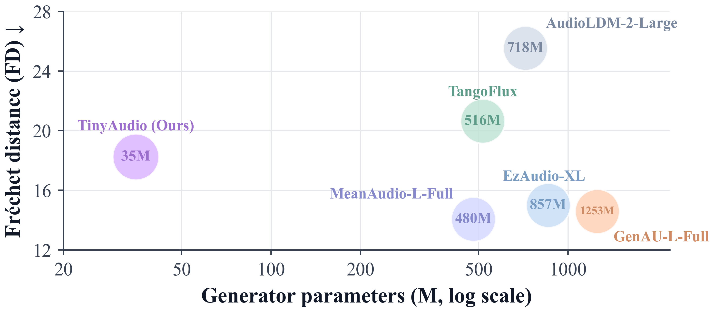
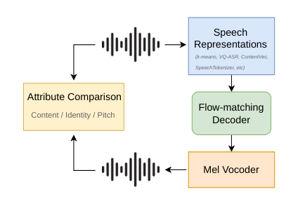
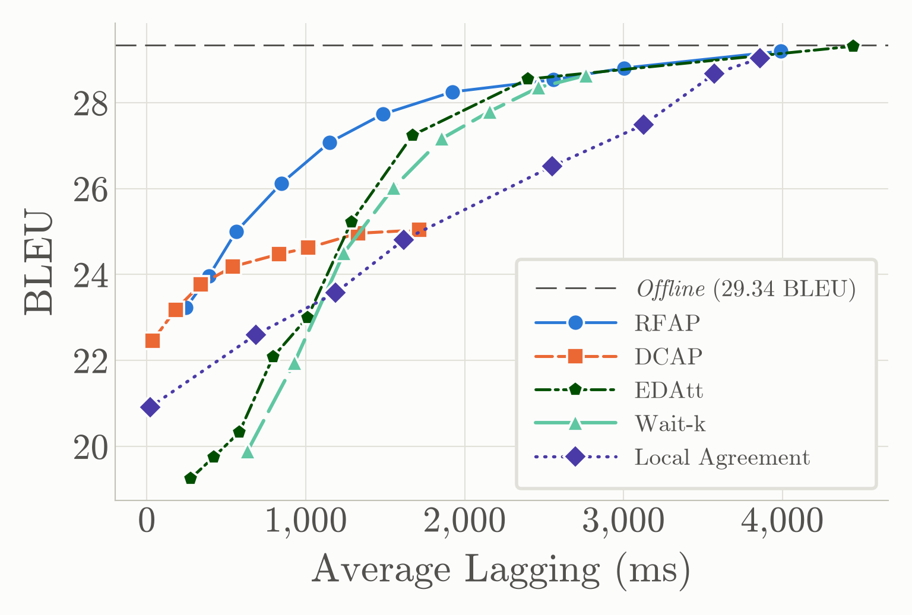
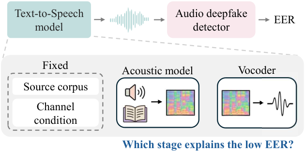
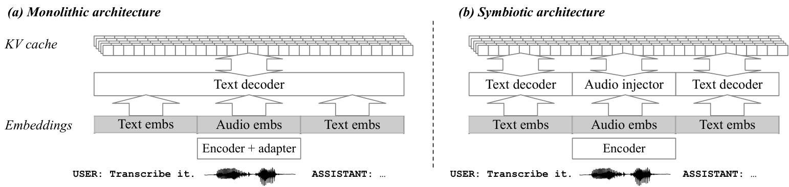
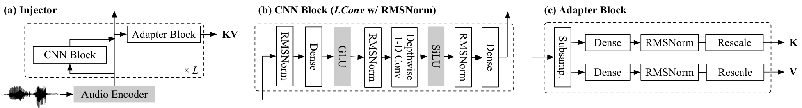
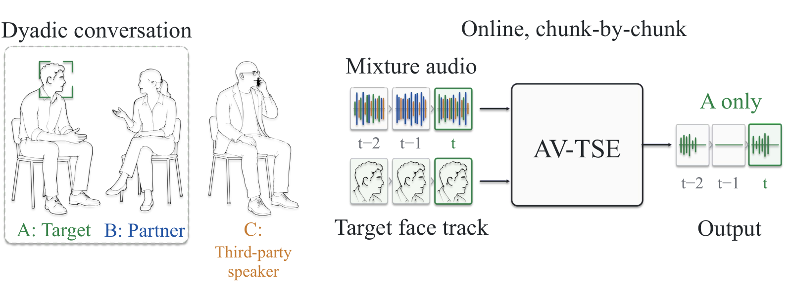
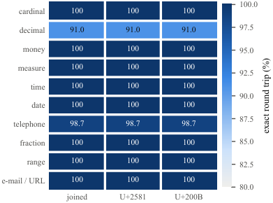
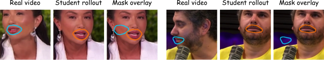
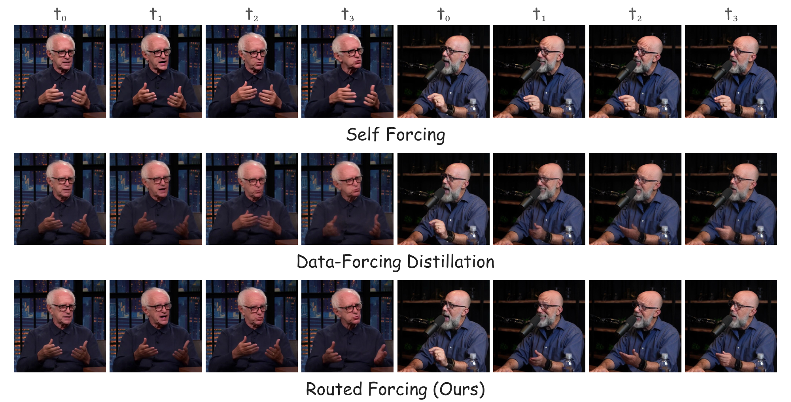

# 🚩 (2026-09-29) Scholar Inbox 추천 논문 

# 📚 TinyAudio: Compact and Efficient Text-to-Audio Generation for Low-Resource Deployment

🚀 URL: https://arxiv.org/html/2609.31525

## 🌏 Abstract (원문)
Text-to-audio (TTA) generation has advanced rapidly in generation quality and instruction following. However, representative systems often require around a billion parameters, limiting deployment on resource-constrained devices. This paper introducesTinyAudio, a compact flow-matching-based TTA model for low-resource deployment. At its core, TinyAudio uses TA-DiT, a 35M single-stream flow-matching Transformer. TinyAudio also includes TA-CLAP, a 32M audio-aligned text encoder, and TA-VAE, whose 20M decoder reconstructs 44.1	kHz audio from compressed latents. TinyAudio has only87Mparameters in total, over 90% fewer than representative billion-parameter pipelines, and uses 0.48	GB peak GPU memory. TinyAudio achieves competitive generation quality on AudioCaps and TTA-Bench.We further introduce TinyAudio-MF, a MeanFlow-accelerated model that enables real-time generation with a four-core CPU quota.Our results demonstrate a practical quality--footprint trade-off for low-resource TTA deployment.111Demo:https://tinyaudio-project.github.io/. Code:https://github.com/junxi25liu/TinyAudio.
## 🌏 Abstract (번역)
텍스트-오디오(TTA) 생성은 생성 품질과 지시 따르기 측면에서 빠르게 발전했습니다. 그러나 대표적인 시스템들은 종종 약 10억 개의 매개변수를 필요로 하여, 자원 제약이 있는 장치에 배포하는 데 한계가 있습니다. 본 논문은 저자원 배포를 위한 소형 플로우 매칭 기반 TTA 모델인 TinyAudio를 소개합니다. TinyAudio의 핵심은 3,500만 개의 매개변수를 가진 단일 스트림 플로우 매칭 트랜스포머인 TA-DiT를 사용합니다. TinyAudio는 또한 3,200만 개의 매개변수를 가진 오디오 정렬 텍스트 인코더인 TA-CLAP과, 압축된 잠재 공간에서 44.1 kHz 오디오를 재구성하는 2,000만 개의 매개변수를 가진 디코더인 TA-VAE를 포함합니다. TinyAudio는 총 8,700만 개의 매개변수만을 가지며, 이는 대표적인 10억 개 매개변수 파이프라인보다 90% 이상 적고, 최대 0.48 GB의 GPU 메모리를 사용합니다. TinyAudio는 AudioCaps 및 TTA-Bench에서 경쟁력 있는 생성 품질을 달성합니다. 우리는 또한 4코어 CPU 할당으로 실시간 생성을 가능하게 하는 MeanFlow 가속 모델인 TinyAudio-MF를 소개합니다. 우리의 결과는 저자원 TTA 배포를 위한 실용적인 품질-점유 공간 트레이드오프를 보여줍니다. 데모: https://tinyaudio-project.github.io/. 코드: https://github.com/junxi25liu/TinyAudio.

## 🔍 Methods & Results
- TinyAudio는 TA-CLAP(3,200만 매개변수 텍스트 인코더), TA-DiT(3,500만 매개변수 생성 트랜스포머), TA-VAE(2,000만 매개변수 디코더)의 세 가지 핵심 구성 요소로 이루어져 총 8,700만 개의 매개변수를 가집니다.
- TA-VAE는 DAC 스타일 인코더와 AMP 블록으로 구성된 경량 디코더를 결합하며, 44.1 kHz 파형을 1024배 압축하여 43 Hz의 64채널 잠재 시퀀스를 생성합니다. 추론 시에는 약 2,000만 매개변수의 디코더만 사용됩니다.
- TA-CLAP은 Ettin-encoder-32m에서 초기화된 3,200만 매개변수 텍스트 인코더로, HTSAT 오디오 인코더와 함께 오디오-텍스트 대조 학습을 통해 적응되며 SigLIP의 쌍별 시그모이드 손실로 최적화됩니다. 배포 시에는 텍스트 브랜치만 유지됩니다.
- TA-DiT는 단일 스트림 오디오-텍스트 모델링과 레이어 공유 조건부 변조를 통해 매개변수 중복을 줄인 소형 생성 백본입니다. 오디오 및 텍스트 토큰을 연결하여 공유된 어텐션 매개변수를 사용하고, 독립적으로 인덱싱된 회전 위치 임베딩과 QK-Norm을 적용합니다.
- TA-DiT는 모든 트랜스포머 블록에 걸쳐 조건부 변조 네트워크를 공유하며, 경량 블록별 임베딩을 사용하여 깊이 의존적 동작을 유지합니다. 최종적으로 오디오 토큰 출력을 잠재 속도 예측으로 변환하여 플로우 매칭 목표에 사용합니다.
- 훈련 데이터셋은 AudioBox Aesthetics 점수(PQ≥5.5, CE≥3.5, CU≥4.5)를 기준으로 선별된 SFT(Supervised Fine-Tuning) 서브셋으로, 음악, 음성, 일반 사운드를 1:1:3 비율로 구성하며 약 417K 쌍의 오디오-텍스트 샘플을 포함합니다.
- TinyAudio-MF는 TinyAudio 체크포인트로 500K 스텝 사전 훈련 후 SFT 서브셋에서 Improved Mean Flows 목표로 추가 훈련된 MeanFlow 가속 모델로, 단일 함수 평가로 실시간 생성을 가능하게 합니다.
- TinyAudio는 총 8,700만 개의 매개변수와 0.48 GB의 최대 GPU 메모리를 사용하여, 10억 개 매개변수 파이프라인보다 90% 이상 적은 자원으로 AudioCaps 및 TTA-Bench에서 경쟁력 있는 생성 품질을 달성합니다.

## 🖼 Figures

*Figure 1:AudioCaps quality versus generator size. Bubble labels indicate generator parameters, and lower FD is better. TinyAudio operates in a substantially smaller parameter regime while retaining competitive distributional quality.*

*Figure 2:Single-stream TA-DiT. Projected text tokens and noised audio latents are concatenated for joint self-attention. The right panel shows layer-shared conditional modulation: shared MLPs combine text, timestep, and block embeddings to produce shift–scale and gate parameters. Only audio tokens predict latent velocity.*

---
**Usage Info**: 3737 tokens used.
**Generated at**: 2026-09-29 19:06:48

---

# 📚 A Comprehensive Study of Content Representations for Speech Synthesis

🚀 URL: https://arxiv.org/html/2609.30975

## 🌏 Abstract (원문)
Speech content representations are central to voice conversion, speech-to-speech translation, and multimodal language models, yet they are rarely compared under a common generative framework that directly measures what each representation contains. We address this by training a generative model conditioned solely on each representation and evaluating the generated audio along the content, speaker identity, and prosody axes. Across SSL features, supervised tokens, posteriorgrams, and neural audio codecs, we find two distinct regimes: representations that nearly reconstruct the original audio, and representations that effectively disentangle speaker identity. These results show that disentanglement depends not on supervision alone, but on the interaction between the training objective and the representation’s information capacity: supervised representations only disentangle speaker identity when their capacity is sufficiently constrained.
## 🌏 Abstract (번역)
음성 콘텐츠 표현은 음성 변환, 음성-음성 번역 및 다중 모달 언어 모델에서 핵심적인 역할을 하지만, 각 표현이 무엇을 포함하는지 직접 측정하는 공통 생성 프레임워크 하에서 비교되는 경우는 드뭅니다. 우리는 각 표현에만 조건화된 생성 모델을 훈련하고 생성된 오디오를 콘텐츠, 화자 신원 및 운율 축을 따라 평가함으로써 이 문제를 해결합니다. SSL 특징, 지도 토큰, 포스테리어그램 및 신경 오디오 코덱 전반에 걸쳐 두 가지 뚜렷한 체제를 발견했습니다. 하나는 원본 오디오를 거의 재구성하는 표현이고, 다른 하나는 화자 신원을 효과적으로 분리하는 표현입니다. 이러한 결과는 분리가 감독(supervision)에만 의존하는 것이 아니라 훈련 목표와 표현의 정보 용량 간의 상호작용에 달려 있음을 보여줍니다. 즉, 지도 학습된 표현은 용량이 충분히 제한될 때만 화자 신원을 분리합니다.

## 🔍 Methods & Results
- 생성 모델(x_gen ~ p(x|r))은 주어진 표현(r)으로부터 음성을 합성하도록 훈련됩니다.
- 생성 모델은 화자 신원 정보(화자 ID 또는 참조 오디오)에 접근할 수 없도록 설계되어, 생성된 오디오에 존재하는 모든 화자 정보가 오직 표현(r)에서만 유래하도록 보장합니다.
- 생성된 오디오는 언어 콘텐츠, 화자 신원, 운율의 세 가지 축을 따라 평가됩니다.
- 언어 콘텐츠는 원본 오디오와 생성된 오디오의 ASR 전사 간의 차등 단어 오류율(dWER)을 사용하여 측정됩니다.
- 화자 신원은 VoicePrivacy 프로토콜(화자 검증 시스템의 등 오류율, EER)과 성별 예측을 위한 로지스틱 프로브를 사용하여 평가됩니다. EER이 50%인 경우 화자 정보가 없음을 의미합니다.
- 운율은 F0 윤곽(센트 단위)의 평균 제곱 오차(MSE)를 레지스터 오류(Δμ), 범위 오류(Δσ) 및 상관 관계(ρ)로 분해하여 평가됩니다.
- 평가에는 ASR을 위한 Parakeet, 화자 임베딩을 위한 ECAPA-TDNN, F0 추출을 위한 PENN이 사용되었으며, UTMOS는 오디오 품질 확인에 활용되었습니다.
- 연구 결과, 원본 오디오를 거의 재구성하는 표현과 화자 신원을 효과적으로 분리하는 표현이라는 두 가지 뚜렷한 체제가 발견되었습니다.
- 화자 분리는 감독(supervision)에만 의존하는 것이 아니라 훈련 목표와 표현의 정보 용량 간의 상호작용에 달려 있음이 밝혀졌습니다.
- 지도 학습된 표현은 정보 용량이 충분히 제한될 때만 화자 신원을 성공적으로 분리합니다.

## 🖼 Figures

*Figure 1:Diagram of the evaluation methodology.*

---
**Usage Info**: 3102 tokens used.
**Generated at**: 2026-09-29 19:06:57

---

# 📚 MuseTimbre: Zero-Shot Timbre Transfer by Controlling a Frozen Music Generator

🚀 URL: https://arxiv.org/html/2609.30548

## 🌏 Abstract (원문)
Instrument timbre transfer re-voices a performance using the timbre of another instrument. Extracting the target timbre from an audio reference capture more nuances than inferring it from a text prompt. Systems that read timbre from such a clip train a dedicated model for the task, which captures the timbre cleanly but stays a narrow, single-purpose system. More versatile approaches add control to a pretrained music generator, yet a reference clip entangles timbre with genre and melody, so these systems fall back on text to name the timbre. We present MuseTimbre, the first system, to our best knowledge, that transfers timbre from an audio reference to a polyphonic source through conditioning a pretrained music generator. This system employs a multi-pitch estimator to extract pitch information from the source and finetune a CLAP encoder to extract timbre information from the reference audio. Experiments show that across four datasets of real polyphonic recordings, MuseTimbre achieves pitch alignment on par with the baselines while matching the reference timbre far more closely. Results also show that the finetuned CLAP-based timbre extractor is robust to pitch variations, making it useful in timbre similarity measures.
## 🌏 Abstract (번역)
악기 음색 전이(Instrument timbre transfer)는 다른 악기의 음색을 사용하여 연주를 재구성하는 것입니다. 오디오 참조 클립에서 목표 음색을 추출하는 것은 텍스트 프롬프트에서 추론하는 것보다 더 많은 뉘앙스를 포착합니다. 이러한 클립에서 음색을 읽는 시스템은 해당 작업을 위해 전용 모델을 훈련하며, 이는 음색을 깨끗하게 포착하지만 좁고 단일 목적의 시스템으로 남습니다. 더 다재다능한 접근 방식은 사전 훈련된 음악 생성기에 제어를 추가하지만, 참조 클립은 음색을 장르 및 멜로디와 얽히게 하므로 이러한 시스템은 음색을 명명하기 위해 텍스트에 의존합니다. 우리는 사전 훈련된 음악 생성기를 조건화하여 오디오 참조에서 다성 소스로 음색을 전이하는 최초의 시스템인 MuseTimbre를 제시합니다. 이 시스템은 다중 피치 추정기를 사용하여 소스에서 피치 정보를 추출하고, CLAP 인코더를 미세 조정하여 참조 오디오에서 음색 정보를 추출합니다. 실험 결과, 네 가지 실제 다성 녹음 데이터셋에서 MuseTimbre는 기준선과 동등한 피치 정렬을 달성하면서 참조 음색과 훨씬 더 가깝게 일치함을 보여줍니다. 또한 미세 조정된 CLAP 기반 음색 추출기가 피치 변화에 강건하여 음색 유사성 측정에 유용하다는 것을 보여줍니다.

## 🔍 Methods & Results
- 악기 음색 전이는 소스 녹음의 음악 콘텐츠가 다른 악기의 음색으로 연주될 때 발생하는 현상을 시뮬레이션하는 작업으로, 다성 음악의 콘텐츠는 피아노 롤로 표현될 수 있으며, 음색은 음의 음향적 정체성으로 스펙트럼 엔벨로프와 관련됩니다.
- MuseTimbre는 사전 훈련된 음악 생성기(Stable Audio 3 Medium)에 두 가지 조건화 경로를 추가하여 피치와 음색을 분리하여 제어합니다.
- 피치 조건화 경로는 Basic Pitch를 사용하여 소스 오디오에서 이진 피아노 롤(88개 음표 및 88개 온셋 채널)을 추출하고, 이를 1D CNN으로 인코딩한 후 DiT(Diffusion Transformer)에 교차 어텐션을 통해 주입합니다.
- 음색 조건화 경로는 LAION-CLAP의 오디오 브랜치를 미세 조정하여 참조 오디오에서 단일 시간 불변 512차원 임베딩을 추출하고, 이를 적응형 레이어 정규화(AdaLN)를 통해 DiT 특징을 변조하는 데 사용합니다.
- 시스템은 정류 흐름(rectified-flow) 목표로 훈련되며, 합성 오디오(Slakh MIDI 스템)와 실제 오디오(MoisesDB, URMP)를 50/50으로 혼합한 데이터셋을 사용하고, AdamW 최적화 및 다중 조건 분류기 없는 안내(CFG) 드롭아웃을 적용합니다.
- 추론은 노이즈에서 시작하여 25단계 Euler 스텝으로 진행되며, 피치 및 음색 조건에 CFG(λpitch=λtimbre=2)를 적용하여 높은 일치도를 유지합니다.
- MuseTimbre는 네 가지 실제 다성 녹음 데이터셋에서 기준선과 동등한 피치 정렬을 달성하면서 참조 음색과 훨씬 더 가깝게 일치하는 결과를 보였습니다.
- 미세 조정된 CLAP 기반 음색 추출기는 피치 변화에 강건하여 음색 유사성 측정에 유용함을 입증했습니다.
- 시스템은 악보 피아노 롤을 피치 조건화 모듈의 입력으로 받아 참조 클립의 음색으로 렌더링할 수 있으며, 사전 훈련된 텍스트 제어 기능도 피치 및 음색 조건화와 함께 작동하여 음향 환경(예: 방, 잔향)을 제어할 수 있습니다.

---
**Usage Info**: 3339 tokens used.
**Generated at**: 2026-09-29 19:07:06

---

# 📚 Training-Free Pronunciation Transcription via Text-Constrained Acoustic Rescoring

🚀 URL: https://arxiv.org/html/2609.30924

## 🌏 Abstract (원문)
Accurate and efficient pronunciation transcription is essential for preparing text-to-speech training data at scale. Existing approaches have different limitations: grapheme-to-pronunciation (G2P) and speech-to-pronunciation (S2P) methods each capture only partial information, using only text or only speech, while speech-and-text-to-pronunciation (ST2P) methods use both but require costly pronunciation-annotated data. To address this problem, we propose a training-free ST2P pipeline that integrates both lexical and acoustic information at inference time. Lexical resources and G2P tools generate text-constrained candidates, and a left-to-right greedy search selects the best one using whole-sequence negative log-likelihoods from frozen pretrained S2P models. On three Japanese corpora, our method reduces Character Error Rate (CER) from 0.60–1.40% (text-only baseline) to 0.04–0.17% with reference transcripts, and 0.64–1.58% with ASR transcripts. It outperforms all baselines, including a trained ST2P model and commercial multimodal LLMs. Our greedy search method is 3–3.5×faster than beam search at similar CER, and the cascade is 2×faster than direct decoding ensuring the efficiency and accuracy. In Spanish, French, and preliminary English, it also surpasses four open multimodal LLMs and the best traditional methods.
## 🌏 Abstract (번역)
정확하고 효율적인 발음 전사는 대규모 텍스트 음성 변환(TTS) 훈련 데이터를 준비하는 데 필수적입니다. 기존 접근 방식은 각기 다른 한계를 가지고 있습니다. G2P(문자-발음 변환) 및 S2P(음성-발음 변환) 방법은 각각 텍스트 또는 음성만을 사용하여 부분적인 정보만 포착하며, ST2P(음성 및 텍스트-발음 변환) 방법은 둘 다 사용하지만 비용이 많이 드는 발음 주석 데이터가 필요합니다. 이 문제를 해결하기 위해, 본 논문에서는 추론 시 어휘 정보와 음향 정보를 모두 통합하는 훈련 없는 ST2P 파이프라인을 제안합니다. 어휘 자원과 G2P 도구가 텍스트 제약이 있는 후보를 생성하고, 고정된 사전 훈련된 S2P 모델에서 얻은 전체 시퀀스 음의 로그 가능도(negative log-likelihood)를 사용하여 좌-우 탐욕적 탐색(greedy search)이 최적의 후보를 선택합니다. 세 가지 일본어 코퍼스에서, 본 연구의 방법은 참조 전사(reference transcripts)를 사용할 때 문자 오류율(CER)을 0.60–1.40% (텍스트 전용 기준선)에서 0.04–0.17%로, ASR 전사(ASR transcripts)를 사용할 때 0.64–1.58%로 감소시켰습니다. 이는 훈련된 ST2P 모델 및 상업용 멀티모달 LLM을 포함한 모든 기준선보다 우수한 성능을 보였습니다. 본 연구의 탐욕적 탐색 방법은 유사한 CER에서 빔 탐색(beam search)보다 3–3.5배 빠르며, 캐스케이드(cascade) 방식은 직접 디코딩보다 2배 빨라 효율성과 정확성을 보장합니다. 스페인어, 프랑스어 및 예비 영어에서도 네 가지 공개 멀티모달 LLM과 최고의 전통적인 방법을 능가했습니다.

## 🔍 Methods & Results
- 훈련 없는 ST2P(Speech-and-Text-to-Pronunciation) 파이프라인을 제안하며, 추론 시 어휘 정보와 음향 정보를 통합합니다.
- 전사(transcript)에 대해 어휘 자원(사전, G2P, 규칙)을 사용하여 텍스트 제약이 있는 발음 후보를 생성합니다.
- 고정된 사전 훈련된 S2P(Speech-to-Pronunciation) 모델에서 얻은 전체 시퀀스 음의 로그 가능도(NLL)를 최소화하는 좌-우 탐욕적 탐색(greedy search)을 통해 최적의 발음 시퀀스를 선택합니다.
- 강건성을 높이기 위해 두 개의 고정된 S2P 모델을 융합된 점수(S = L1 + λL2)와 캐스케이드(cascade) 방식을 사용하여 결합할 수 있습니다.
- 마진 검사(margin check)를 통해 약한 증거로 인해 변경된 기본 발음을 되돌릴 수 있도록 하이퍼파라미터 τ를 사용합니다.
- 세 가지 일본어 코퍼스에서 참조 전사를 사용할 때 문자 오류율(CER)을 0.60–1.40%에서 0.04–0.17%로, ASR 전사를 사용할 때 0.64–1.58%로 감소시켰습니다.
- 훈련된 ST2P 모델 및 상업용 멀티모달 LLM을 포함한 모든 기준선보다 우수한 성능을 보였습니다.
- 탐욕적 탐색 방법은 유사한 CER에서 빔 탐색보다 3–3.5배 빠르며, 캐스케이드 방식은 직접 디코딩보다 2배 빨라 효율성과 정확성을 동시에 달성했습니다.
- 스페인어, 프랑스어 및 예비 영어에서도 네 가지 공개 멀티모달 LLM과 최고의 전통적인 방법을 능가하는 성능을 입증했습니다.

## 🖼 Figures
![Figure 2:Training-free pronunciation transcription. (a) Dictionaries, G2P, and rules generate readings for transcript spans. Complete pronunciations 
𝑦
⁡
(
𝐫
)
 are converted to model-specific tokens and evaluated by a frozen S2P model given speech 
𝑥
, combining lexical constraints and acoustic evidence through negative log-likelihood (NLL). (b) Left-to-right greedy search for “read the record” (
𝑃
=
0
; illustrative NLLs). Each node represents a complete pronunciation with earlier choices fixed and later spans at their defaults. The lowest-NLL candidate (green) is committed; gray nodes are rejected, and dashed outlines mark span defaults. The final node is the search output; cascade rescoring and the subsequent margin check are not shown.](../images/2026-09-29/2609.30924/2609.30924_fig1.png)
*Figure 2:Training-free pronunciation transcription. (a) Dictionaries, G2P, and rules generate readings for transcript spans. Complete pronunciations 
𝑦
⁡
(
𝐫
)
 are converted to model-specific tokens and evaluated by a frozen S2P model given speech 
𝑥
, combining lexical constraints and acoustic evidence through negative log-likelihood (NLL). (b) Left-to-right greedy search for “read the record” (
𝑃
=
0
; illustrative NLLs). Each node represents a complete pronunciation with earlier choices fixed and later spans at their defaults. The lowest-NLL candidate (green) is committed; gray nodes are rejected, and dashed outlines mark span defaults. The final node is the search output; cascade rescoring and the subsequent margin check are not shown.*

---
**Usage Info**: 3202 tokens used.
**Generated at**: 2026-09-29 19:07:15

---

# 📚 Attention-Based Adaptive Policies for Simultaneous Speech-to-Text Translation

🚀 URL: https://arxiv.org/html/2609.30839

## 🌏 Abstract (원문)
Simultaneous speech-to-text translation (Simul-S2TT) consists of generating partial translations while the incoming audio frames are processed by the system. However, the streaming nature of this setup creates the challenge of deciding the best moment to perform an accurate translation while minimizing the delay. To address this challenge, we utilize the cross-attention mechanism of the encoder-decoder architecture to find the right alignment between the input speech frames and the target text tokens. In this paper, we propose theRecent Frame Attention Policy (RFAP)and theDual-Condition Attention Policy (DCAP)that allow offline trained speech-to-text translation models to be used in streaming scenarios without requiring additional training. Results on three different language translation pairs over the CVSS-C corpus show that the RFAP is able to surpass other policies with gains of up to 4.0 BLEU while reducing the translation delay by almost 1 second. Moreover, the DCAP is able to preserve a high translation quality when the latency is very low.
## 🌏 Abstract (번역)
동시 음성-텍스트 번역(Simul-S2TT)은 시스템이 들어오는 오디오 프레임을 처리하는 동안 부분적인 번역을 생성하는 것을 포함합니다. 그러나 이러한 설정의 스트리밍 특성은 지연을 최소화하면서 정확한 번역을 수행할 최적의 순간을 결정하는 과제를 야기합니다. 이 과제를 해결하기 위해 우리는 인코더-디코더 아키텍처의 교차 어텐션 메커니즘을 활용하여 입력 음성 프레임과 목표 텍스트 토큰 간의 올바른 정렬을 찾습니다. 본 논문에서는 추가 훈련 없이 오프라인으로 훈련된 음성-텍스트 번역 모델을 스트리밍 시나리오에서 사용할 수 있도록 하는 Recent Frame Attention Policy (RFAP)와 Dual-Condition Attention Policy (DCAP)를 제안합니다. CVSS-C 코퍼스에 대한 세 가지 다른 언어 번역 쌍에 대한 결과는 RFAP가 최대 4.0 BLEU의 이득으로 다른 정책들을 능가하며 번역 지연을 거의 1초 단축할 수 있음을 보여줍니다. 또한 DCAP는 지연 시간이 매우 낮을 때 높은 번역 품질을 유지할 수 있습니다.

## 🔍 Methods & Results
- Recent Frame Attention Policy (RFAP)는 교차 어텐션 메커니즘이 충분한 정보를 수집하면 가장 최근 오디오 프레임에서 초점을 이동한다는 가설에 기반합니다.
- RFAP는 생성된 텍스트 토큰에 대해 가장 최근에 수신된 프레임의 어텐션 가중치 합계(λrecentt)를 고정된 임계값(α)과 비교합니다. λrecentt가 α보다 높으면 'READ' 동작을, 낮으면 'WRITE' 동작을 수행하여 번역 품질과 지연 시간의 균형을 맞춥니다.
- RFAP는 다음 출력 토큰과 가장 최근 음성 프레임 간의 교차 어텐션 점수만 계산하여 'WRITE' 동작을 내보내기 전에 과도한 음성 프레임 축적의 필요성을 제거합니다.
- RFAP는 어텐션 점수가 안정화될 때까지 기다린 후 'WRITE' 동작을 트리거하여 번역 품질을 향상시키지만 지연 시간을 증가시킵니다.
- Dual-Condition Attention Policy (DCAP)는 RFAP를 확장하여 지연 문제를 완화합니다. 이는 음성 프레임과 생성된 번역 토큰 간의 상관관계뿐만 아니라 가장 최근 프레임에 대한 어텐션 초점의 변화율(Δλrecent)도 고려합니다.
- DCAP는 두 가지 조건(발견 단계 및 완료 단계)을 사용하여 'WRITE' 동작을 트리거합니다. 변화율 조건(Δλrecent ≥ 0)은 모델이 새로운 관련 정보를 찾을 때 즉시 번역을 생성하도록 하는 '발견 단계'의 트리거 역할을 합니다.
- 최근 어텐션 조건(λrecentt < α)은 디코더가 가장 최근 프레임에서 초점을 이동할 때 번역이 트리거되도록 하는 '완료 단계'의 트리거 역할을 합니다.
- CVSS-C 코퍼스에서 RFAP는 다른 정책보다 최대 4.0 BLEU 향상과 거의 1초의 번역 지연 감소를 달성했습니다.
- DCAP는 지연 시간이 매우 낮을 때 높은 번역 품질을 유지하는 능력을 보여주었습니다.

## 🖼 Figures

*Figure 1:READ Decision: High recent attention score (
𝜆
recent
𝑡
=
0.55
>
𝛼
,
𝛼
=
0.2
) indicates the model requires more source context. Recent frames are denoted in red, previous frames with lambda over threshold in blue and previous frames that invoked WRITE decision in black. Future source frames in light gray. Next target token prediction marked with *.*

*Figure 2:WRITE Decision: Focus shifts to earlier context (
𝜆
recent
𝑡
=
0.15
<
𝛼
,
𝛼
=
0.2
), signaling sufficient information to emit the target text token ’monte’.*

*(a)FR-EN*

*(a)FR-EN*

*(b)DE-EN*

*(c)ES-EN*

---
**Usage Info**: 2603 tokens used.
**Generated at**: 2026-09-29 19:07:24

---

# 📚 All In Good Time: Causality-Aware Framework for LLM-Based Simultaneous Speech-to-Speech Translation

🚀 URL: https://arxiv.org/html/2609.30416

## 🌏 Abstract (원문)
Large Language Models (LLMs) have shown strong performance in low-resource offline translation; however, extending them to simultaneous speech-to-speech translation (Simul-S2ST) remains challenging due to the scarcity of causally aligned training data with high cross-lingual speaker fidelity. In addition, existing approaches rely on fixed translation policy or confidence heuristics, leading to suboptimal quality and higher latency. We propose a causality-aware Simul-S2ST framework with a novel data pipeline that generates high-fidelity, causally aligned segments with improved voice transfer. The framework introduces (i) a factorized S2ST architecture (FAST), (ii) a causality-aware adaptive policy (CAP), and (iii) causality-aware latency metric. Experiments on CVSS Spanish, German, and French show that FAST-CAP consistently improves the quality–latency trade-off, achieving up to +1.2 BLEU and a 26% relative latency reduction over a fixed policy. Despite using substantially less training data than existing systems, FAST-CAP achieves state-of-the-art results in speech translation quality and speaker fidelity while yielding up to a 38.8% relative reduction in latency.
## 🌏 Abstract (번역)
대규모 언어 모델(LLM)은 저자원 오프라인 번역에서 강력한 성능을 보여주었지만, 높은 교차 언어 화자 충실도를 가진 인과적으로 정렬된 훈련 데이터의 부족으로 인해 동시 음성-음성 번역(Simul-S2ST)으로 확장하는 것은 여전히 어렵습니다. 또한, 기존 접근 방식은 고정된 번역 정책 또는 신뢰도 휴리스틱에 의존하여 최적화되지 않은 품질과 더 높은 지연 시간을 초래합니다. 본 연구에서는 향상된 음성 전송을 통해 고충실도, 인과적으로 정렬된 세그먼트를 생성하는 새로운 데이터 파이프라인을 갖춘 인과성 인식 Simul-S2ST 프레임워크를 제안합니다. 이 프레임워크는 (i) 분해된 S2ST 아키텍처(FAST), (ii) 인과성 인식 적응형 정책(CAP), 그리고 (iii) 인과성 인식 지연 시간 측정 지표를 도입합니다. CVSS 스페인어, 독일어, 프랑스어에 대한 실험 결과, FAST-CAP은 품질-지연 시간 균형을 일관되게 개선하여 고정 정책 대비 최대 +1.2 BLEU 및 26%의 상대적 지연 시간 감소를 달성했습니다. 기존 시스템보다 훨씬 적은 훈련 데이터를 사용했음에도 불구하고, FAST-CAP은 음성 번역 품질 및 화자 충실도에서 최첨단 결과를 달성하는 동시에 최대 38.8%의 상대적 지연 시간 감소를 보였습니다.

## 🔍 Methods & Results
- 제안된 FAST(Factorized Simultaneous Speech-to-Speech Translation) 모델은 LLM을 번역 백본으로 사용하며, 실시간으로 다양한 모달리티와 겹치는 음성을 처리하기 위한 멀티스트림 전이중(full-duplex) 설계를 채택합니다.
- 교차 언어 화자 충실도를 개선하기 위해, CVSS-T 데이터를 A2Flow 제로샷 TTS 모델을 사용하여 재합성하여 평균 화자 유사도를 0.24에서 0.61로 크게 향상시켰습니다.
- 인과적으로 정렬된 훈련 데이터를 생성하기 위해, Montreal Forced Aligner(MFA)로 원본 음성과 전사본을 정렬하고, Awesome-align과 다국어 BERT를 사용하여 전사본과 목표 번역 간의 단어 정렬을 수행합니다.
- CAP(Causality-Aware Adaptive Policy)는 `MonotonicAlign` 함수를 통해 원시 텍스트-텍스트 정렬을 단조 정렬로 변환하여 단어 순서 차이, 다대일 정렬, 생략된 단어를 처리하고, `CausalPairedChunks`를 사용하여 인과적 소스-타겟 청크를 구성하여 필요한 소스 증거가 관찰된 후에만 타겟 토큰이 방출되도록 합니다.
- FAST 아키텍처는 어휘 정보(ASR 인코더를 통해 LLM에 제공)와 음향 정보(코덱 토큰을 사용하는 자동회귀 TTS 모듈)를 분리하며, TitaNet을 사용하여 원본 화자 임베딩을 추출하고 스트리밍 NanoCodec(FSQ 사용)으로 음성을 토큰화합니다.
- 공동 조건부 분포 P(Q,e|s)를 음성-텍스트 번역(Simul-S2T, P(e|s)) 모듈과 텍스트-음성 합성(Simul-T2S, P(Q|e,s)) 모듈로 분해하여 모델링합니다.
- 훈련은 두 모듈의 자동회귀 음의 로그 우도(negative log-likelihood)를 가중 합산한 다중 작업 목표(multitask objective)를 사용하며, 추론 시에는 탐욕적 디코딩(greedy decoding)을 통해 LLM 예측에 기반하여 디코딩합니다.
- CAAL(Causality-Aware Latency) 측정 지표를 제안하여 기존 지연 시간 측정 지표(예: LAAL)의 한계를 해결합니다. CAAL은 번역 정렬을 통합하여 언어적으로 필요한 대기를 페널티로 간주하지 않고, 이상적인 인과적 정책을 넘어 시스템에 의해 도입된 추가 대기 시간을 측정합니다.
- CVSS 스페인어, 독일어, 프랑스어에 대한 실험에서 FAST-CAP은 고정 정책 대비 최대 +1.2 BLEU 점수 향상과 26%의 상대적 지연 시간 감소를 달성하여 품질-지연 시간 균형을 일관되게 개선했습니다.
- FAST-CAP은 기존 시스템보다 훨씬 적은 훈련 데이터를 사용했음에도 불구하고 음성 번역 품질 및 화자 충실도에서 최첨단 결과를 달성했으며, 최대 38.8%의 상대적 지연 시간 감소를 보였습니다.

## 🖼 Figures

*Fig. 2:Overview of the proposed FAST architecture with multistream joint sequence modeling.*

---
**Usage Info**: 6086 tokens used.
**Generated at**: 2026-09-29 19:07:37

---

# 📚 LEARNING NATURAL CONVERSATIONAL BEHAVIOR IN TANDEM SPEECH-TO-SPEECH MODELS WITH RANDOMIZED GUIDANCE

🚀 URL: https://arxiv.org/html/2609.30773

## 🌏 Abstract (원문)
Tandem speech-to-speech architectures couple a responsive speech frontend with an asynchronous text backend. In KAME, a large language model (LLM) serves as the backend, supplying candidate responses as guidance to the speech frontend while the user is still speaking. Ordinary conversation recordings capture the eventual response but not the guidance the backend would supply during the user’s utterance. Generating the missing guidance with a simulator LLM adds substantial data-preparation overhead when training on real conversations. We propose randomized intermediate guidance, which derives guidance directly from the conversation corpus rather than simulating backend LLM behavior. During training, target responses provide informative guidance, while randomly sampled responses provide potentially irrelevant updates during the utterance. This combination aims to teach the frontend to use backend information selectively. On synthetic dialogues, KAME trained with this recipe achieves response quality comparable to that of the LLM-generated and similarity-based baselines. Training on 3.8k hours of real conversations improves smooth turn-taking and audio-judge naturalness over synthetic-data KAME while retaining a response-quality advantage over Moshi. These results show that randomized guidance offers a practical route to combining the response-quality benefits of tandem models with natural conversational behavior learned from real speech.
## 🌏 Abstract (번역)
탠덤 음성-음성 아키텍처는 반응형 음성 프런트엔드와 비동기 텍스트 백엔드를 결합합니다. KAME에서는 대규모 언어 모델(LLM)이 백엔드 역할을 하여 사용자가 아직 말하는 동안 음성 프런트엔드에 지침으로 후보 응답을 제공합니다. 일반적인 대화 녹음은 최종 응답을 포착하지만, 사용자의 발화 중에 백엔드가 제공했을 지침은 포착하지 못합니다. 시뮬레이터 LLM으로 누락된 지침을 생성하는 것은 실제 대화로 훈련할 때 상당한 데이터 준비 오버헤드를 추가합니다. 우리는 백엔드 LLM 동작을 시뮬레이션하는 대신 대화 코퍼스에서 직접 지침을 도출하는 무작위 중간 지침(randomized intermediate guidance)을 제안합니다. 훈련 중에는 목표 응답이 유익한 지침을 제공하는 반면, 무작위로 샘플링된 응답은 발화 중에 잠재적으로 관련 없는 업데이트를 제공합니다. 이 조합은 프런트엔드가 백엔드 정보를 선택적으로 사용하도록 가르치는 것을 목표로 합니다. 합성 대화에서 이 방식으로 훈련된 KAME는 LLM 생성 및 유사성 기반 기준선과 유사한 응답 품질을 달성합니다. 3.8천 시간의 실제 대화로 훈련한 결과, 합성 데이터 KAME보다 부드러운 턴-테이킹과 오디오 심사관의 자연스러움이 향상되었으며, Moshi에 비해 응답 품질 우위를 유지했습니다. 이러한 결과는 무작위 지침이 탠덤 모델의 응답 품질 이점과 실제 음성에서 학습된 자연스러운 대화 행동을 결합하는 실용적인 경로를 제공함을 보여줍니다.

## 🔍 Methods & Results
- KAME는 반응형 음성 프런트엔드와 LLM 백엔드를 결합한 탠덤 음성-음성 아키텍처를 사용하며, LLM은 사용자가 말하는 동안 프런트엔드에 후보 응답을 지침으로 제공한다.
- 실제 대화 데이터로 훈련 시, 백엔드 LLM의 지침을 시뮬레이션하는 것은 상당한 데이터 준비 오버헤드를 발생시키는 문제를 해결하기 위해 '무작위 중간 지침(randomized intermediate guidance)'을 제안한다.
- 무작위 중간 지침은 백엔드 LLM 동작을 시뮬레이션하는 대신 대화 코퍼스에서 직접 지침을 도출한다.
- 훈련 과정에서 목표 응답은 유익한 지침을 제공하고, 무작위로 샘플링된 응답은 발화 중에 잠재적으로 관련 없는 업데이트를 제공하여 프런트엔드가 백엔드 정보를 선택적으로 사용하도록 학습시킨다.
- 합성 대화에서, 이 방식으로 훈련된 KAME는 LLM 생성 및 유사성 기반 기준선과 비교할 만한 응답 품질을 달성했다.
- 3.8천 시간의 실제 대화로 훈련했을 때, 합성 데이터 KAME보다 부드러운 턴-테이킹과 오디오 심사관의 자연스러움이 향상되었으며, Moshi에 비해 응답 품질에서 우위를 유지했다.
- 무작위 지침은 탠덤 모델의 응답 품질 이점과 실제 음성에서 학습된 자연스러운 대화 행동을 결합하는 실용적인 방법을 제공한다.

---
**Usage Info**: 1809 tokens used.
**Generated at**: 2026-09-29 19:07:45

---

# 📚 Asymmetric Classifier-Free Guidance for Target-Speaker ASR

🚀 URL: https://arxiv.org/html/2609.30476

## 🌏 Abstract (원문)
Target-speaker automatic speech recognition (TS-ASR) must identify and transcribe a desired speaker under varying overlap and noise conditions. These changes alter the acoustic evidence for the target speaker in the speech mixture, motivating inference-time calibration of speaker conditioning. We introduce asymmetric classifier-free guidance (CFG) for TS-ASR using Whisper: the speaker-conditioned branch predicts the target transcript, while the speaker-unconditioned branch predicts serialized multi-speaker transcripts. CFG adjusts the contribution of speaker conditioning during decoding through a single guidance scale. We select a global guidance scale on target-domain development data and train a lightweight encoder-based predictor to adjust it for each utterance, keeping the recognition model fixed. Under domain shifts, our full system achieves relative word error rate (WER) reductions of up to 21.8% over the condition-only baseline, and 5.6% over standard conditional decoding of the same CFG-trained model. Oracle analysis shows that substantially larger WER reductions are possible through utterance-level scale selection and identifies how beneficial adjustments vary with domain shifts.
## 🌏 Abstract (번역)
화자 분리 자동 음성 인식(TS-ASR)은 다양한 중첩 및 노이즈 조건에서 원하는 화자를 식별하고 전사해야 합니다. 이러한 변화는 음성 혼합물에서 대상 화자에 대한 음향 증거를 변경하며, 이는 추론 시 화자 조건화의 보정을 필요로 합니다. 우리는 Whisper를 사용하여 TS-ASR을 위한 비대칭 분류기 없는 안내(CFG)를 도입합니다. 여기서 화자 조건부 브랜치는 대상 전사를 예측하고, 화자 비조건부 브랜치는 직렬화된 다중 화자 전사를 예측합니다. CFG는 단일 안내 스케일을 통해 디코딩 중 화자 조건화의 기여도를 조정합니다. 우리는 대상 도메인 개발 데이터에서 전역 안내 스케일을 선택하고, 인식 모델을 고정한 채 각 발화에 대해 이를 조정하기 위한 경량 인코더 기반 예측기를 훈련합니다. 도메인 변화 상황에서, 우리의 전체 시스템은 조건부 전용 기준선 대비 최대 21.8%의 상대적 단어 오류율(WER) 감소를 달성했으며, 동일한 CFG 훈련 모델의 표준 조건부 디코딩 대비 5.6%의 감소를 달성했습니다. 오라클 분석은 발화 수준 스케일 선택을 통해 훨씬 더 큰 WER 감소가 가능하며, 유익한 조정이 도메인 변화에 따라 어떻게 달라지는지 보여줍니다.

## 🔍 Methods & Results
- TS-ASR 모델은 Whisper를 기반으로 구축되었으며, 대상 화자 정보를 통합하기 위해 선택된 Whisper 인코더 레이어에 0으로 초기화된 교차 어텐션 어댑터가 삽입되었습니다.
- 조건부(화자 조건부) 및 비조건부(화자 비조건부) 인코더 표현이 정의되며, 프레임 수준 정렬 감독을 위해 선형 CTC 헤드가 최종 인코더 표현에 연결됩니다.
- 분류기 없는 안내(CFG)는 디코딩 중 대상 화자 조건화의 영향을 조정하는 데 사용됩니다.
- 비대칭 CFG 훈련 방식이 도입되었는데, 조건부 브랜치는 TS-ASR 작업에 대해 훈련되고, 비조건부 브랜치는 화자 변경 토큰을 포함하는 직렬화된 다중 화자 전사(SOT)에 대해 훈련됩니다.
- 추론 시, CFG는 모든 AR 디코딩 단계에서 예측을 결합하며, 안내 스케일 'w'를 사용하여 조건화 강도를 조절합니다.
- 전역 보정은 대상 도메인 개발 데이터에서 코퍼스 WER을 최소화하는 전역 안내 스케일 'wg'를 선택하여 수행됩니다.
- 발화 수준 적응을 위해 경량 인코더 기반 예측기가 훈련되어 각 발화에 대해 'wg'를 조정하며, 예측기는 예측된 WER 변화와 이점 확률을 출력합니다.
- 도메인 변화 상황에서, 전체 시스템은 조건부 전용 기준선 대비 최대 21.8%의 상대적 WER 감소를 달성했습니다.
- 동일한 CFG 훈련 모델의 표준 조건부 디코딩 대비 5.6%의 상대적 WER 감소를 달성했습니다.
- 오라클 분석 결과, 발화 수준 스케일 선택을 통해 훨씬 더 큰 WER 감소가 가능하며, 유익한 조정이 도메인 변화에 따라 달라짐을 확인했습니다.

## 🖼 Figures

*Figure 1:Overview of the proposed framework. (a) A shared Whisper model is trained for TS-ASR with target enrollment and multi-speaker ASR without enrollment. (b) A global guidance scale 
𝑤
𝑔
 is calibrated on target-domain development data (DEV) with the ASR model frozen. (c) A lightweight predictor performs utterance-level guidance adaptation around 
𝑤
𝑔
, and the selected scale is applied to CFG decoding.*

*Figure 2:An example of CFG global calibration and utterance-level adaptation improving upon standard conditional decoding (
𝑤
=1). The wrong words are marked red, and the correct words/tokens are marked green. The tables under global 
𝑤
𝑔
=2.0 and adaptive 
𝑤
𝑎
​
𝑑
=2.4 display the top logits predicted by the conditional (Cond), unconditional (Unc), and the computed 
CFG
=
Unc
+
𝑤
⋅
(
Cond
−
Unc
)
 at a specific decoding time step 
𝑡
.*

---
**Usage Info**: 3189 tokens used.
**Generated at**: 2026-09-29 19:07:54

---

# 📚 Tracing and Relearning Detection Evidence in Text-to-Speech Systems

🚀 URL: https://arxiv.org/html/2609.30983

## 🌏 Abstract (원문)
Recent audio deepfake detectors separate bona fide speech from synthetic speech, yet it remains unclear which stage of a text-to-speech system supplies the detection evidence. We address this with controlled resynthesis and detector adaptation in an F5-TTS–BigVGAN pipeline. Since vocoder reconstruction of a real mel can itself be separable from the source utterance, we fix the vocoder and trace the larger change in detector separation to acoustic generation. Adversarially fine-tuning the acoustic model, with no detector in its objective, raises EER against fixed detectors at comparable quality. However, adapting a detector only on the tuned model’s VCTK outputs lowers its LibriSpeech EER from 19.42% to 7.46% and improves detection of unseen base F5-TTS outputs. These results suggest that acoustic-model updates can reduce the detection evidence available to fixed detectors, while detector adaptation keeps the updated outputs detectable in this pipeline.
## 🌏 Abstract (번역)
최근 오디오 딥페이크 탐지기는 실제 음성과 합성 음성을 구분하지만, 텍스트-음성 변환(TTS) 시스템의 어느 단계에서 탐지 증거가 제공되는지는 불분명합니다. 우리는 F5-TTS–BigVGAN 파이프라인에서 제어된 재합성 및 탐지기 적응을 통해 이 문제를 다룹니다. 실제 멜 스펙트로그램의 보코더 재구성이 원본 발화와 분리될 수 있으므로, 우리는 보코더를 고정하고 탐지기 분리의 더 큰 변화를 음향 생성으로 추적합니다. 목적 함수에 탐지기를 포함하지 않고 음향 모델을 적대적으로 미세 조정하면, 유사한 품질에서 고정된 탐지기에 대한 EER이 증가합니다. 그러나 조정된 모델의 VCTK 출력에만 탐지기를 적응시키면 LibriSpeech EER이 19.42%에서 7.46%로 낮아지고, 이전에 보지 못한 기본 F5-TTS 출력에 대한 탐지 성능이 향상됩니다. 이러한 결과는 음향 모델 업데이트가 고정된 탐지기가 활용할 수 있는 탐지 증거를 줄일 수 있지만, 탐지기 적응은 이 파이프라인에서 업데이트된 출력을 계속 탐지 가능하게 유지함을 시사합니다.

## 🔍 Methods & Results
- F5-TTS DiT (음향 모델)와 BigVGAN (보코더) 파이프라인을 사용하여 오디오 딥페이크 탐지 증거를 분석했습니다.
- 제어된 재합성(R, V, T, FT, TG)을 통해 보코더 재구성, 음향 모델 생성, 그리고 음량 차이가 탐지 증거에 미치는 영향을 분리하여 분석했습니다.
- 음향 모델(DiT)을 적대적으로 미세 조정했으며, 이 과정에서 탐지기는 목적 함수에 포함되지 않았습니다.
- 미세 조정된 음향 모델의 출력은 고정된 탐지기에 대해 EER을 증가시켜 탐지 난이도를 높였으며, 품질은 유사하게 유지되었습니다.
- 조정된 모델의 VCTK 출력으로 탐지기를 적응시킨 결과, LibriSpeech EER이 19.42%에서 7.46%로 크게 감소했으며, 이전에 보지 못한 기본 F5-TTS 출력에 대한 탐지 성능도 향상되었습니다.
- 이러한 결과는 음향 모델 업데이트가 고정된 탐지기의 탐지 증거를 감소시킬 수 있지만, 탐지기 적응을 통해 업데이트된 출력도 탐지 가능하게 유지할 수 있음을 시사합니다.

## 🖼 Figures

*Figure 1:Isolating which TTS stage supplies the detection evidence, with the source corpus and channel condition fixed.*

*Figure 2:Overview of the experimental framework, with conditions defined in Sec. 2.1. (a) 
ℒ
𝑎
 and 
ℒ
𝑓
 denote the adversarial and feature matching losses. When R itself is evaluated, the original source serves as bona fide. (b) XLS-R SLS is adapted on bona fide utterances paired with their tuned F5-TTS resyntheses.*

---
**Usage Info**: 3449 tokens used.
**Generated at**: 2026-09-29 19:08:06

---

# 📚 Acoustic-to-Text KV Compression for Full-Duplex Speech Models

🚀 URL: https://arxiv.org/html/2609.31224

## 🌏 Abstract (원문)
Full-duplex speech language models continuously accumulate acoustic key–value (KV) states, making long-running interactions memory-intensive. During listening, the model can finish processing an audio unit before the next arrives; we term the remaining interval listening-time slack. We propose acoustic-to-text KV compression, which introduces a transcription side channel to convert incoming speech into compact textual memory within this interval. When the cache exceeds a target budget during inference, older acoustic states are evicted while transcripts and recent acoustic context remain. We train the side channel with LoRA using cross-entropy on transcription segments. To preserve listening and speaking behavior, we apply knowledge distillation to the original model’s token-level output distributions at native prediction positions. On ten-minute LongSpeech sessions, our MiniCPM-o 4.5 implementation reduces peak streaming KV-cache size by 64.6% compared with the same model without eviction. The proposed method also improves transcription, temporal question answering, and summarization over the baseline. Full-Duplex-Bench evaluations further show comparable pause-handling, turn-taking, and interruption performance.
## 🌏 Abstract (번역)
전이중 음성 언어 모델은 음향 키-값(KV) 상태를 지속적으로 축적하여 장기적인 상호작용을 메모리 집약적으로 만듭니다. 청취 중 모델은 다음 오디오 단위가 도착하기 전에 오디오 단위 처리를 완료할 수 있으며, 우리는 이 남은 간격을 청취 시간 여유(listening-time slack)라고 부릅니다. 우리는 이 간격 내에서 들어오는 음성을 압축된 텍스트 메모리로 변환하기 위해 전사(transcription) 측면 채널을 도입하는 음향-텍스트 KV 압축을 제안합니다. 추론 중 캐시가 목표 예산을 초과하면, 오래된 음향 상태는 제거되고 전사 및 최근 음향 컨텍스트는 유지됩니다. 우리는 전사 세그먼트에 대한 교차 엔트로피를 사용하여 LoRA로 측면 채널을 훈련합니다. 청취 및 발화 동작을 보존하기 위해, 우리는 원래 모델의 토큰 수준 출력 분포에 대해 고유 예측 위치에서 지식 증류(knowledge distillation)를 적용합니다. 10분 길이의 LongSpeech 세션에서, 우리의 MiniCPM-o 4.5 구현은 제거 기능이 없는 동일 모델과 비교하여 피크 스트리밍 KV-캐시 크기를 64.6% 감소시킵니다. 제안된 방법은 또한 기준선 대비 전사, 시간적 질의 응답 및 요약 성능을 향상시킵니다. Full-Duplex-Bench 평가는 또한 유사한 일시 정지 처리, 차례 주고받기 및 중단 성능을 보여줍니다.

## 🔍 Methods & Results
- 음향-텍스트 KV 압축을 제안하며, 이는 전사 측면 채널을 도입하여 들어오는 음성을 압축된 텍스트 메모리로 변환합니다.
- 추론 중 캐시가 예산을 초과하면 오래된 음향 상태는 제거하고 전사 및 최근 음향 컨텍스트는 유지하는 캐시 제거 전략을 사용합니다.
- 측면 채널은 전사 세그먼트에 대한 교차 엔트로피를 사용하여 LoRA로 훈련됩니다.
- 원래 모델의 청취 및 발화 동작을 보존하기 위해 토큰 수준 출력 분포에 지식 증류를 적용합니다.
- MiniCPM-o 4.5 구현은 10분 LongSpeech 세션에서 피크 스트리밍 KV-캐시 크기를 64.6% 감소시켰습니다.
- 제안된 방법은 기준선 대비 전사, 시간적 질의 응답 및 요약 성능을 향상시켰습니다.
- Full-Duplex-Bench 평가에서 유사한 일시 정지 처리, 차례 주고받기 및 중단 성능을 보였습니다.

## 🖼 Figures

*Figure 1: Overview of acoustic-to-text KV compression: native streaming (top) and the proposed method (lower rows). The added transcription side channel uses listening-time slack to generate transcript tokens that remain in context but are excluded from spoken output. When the KV cache exceeds a target budget, older acoustic states are evicted while transcripts and recent acoustic context are retained.*

---
**Usage Info**: 1738 tokens used.
**Generated at**: 2026-09-29 19:08:14

---

# 📚 Adapting Personalized Speech Enhancement forLow-Latency Audio-Visual Target-Speaker Extraction

🚀 URL: https://arxiv.org/html/2609.30631

## 🌏 Abstract (원문)
Online audio-visual target-speaker extraction aims to remove competing voices while preserving speech quality and bounding lookahead. Existing extractors are built and evaluated for separation on synthetic mixtures, leaving listening quality and meeting behavior largely untested. We introduce Audio-Visual Personalized Voice Quality Enhancement (AV-PVQE), which approaches these requirements from the other direction. We start from a personalized speech enhancement model that reconstructs a requested voice at high quality but confuses the target in 46% of two-speaker mixtures despite clean enrollment. Adding mouth features at its speaker-conditioning input and jointly fine-tuning the visual and reconstruction networks reduces this rate to 1.6%, with no future frames and 20 ms of algorithmic delay. Compared with an online autoregressive audio-visual extractor, AV-PVQE yields separation gains on two synthetic benchmarks and larger gains on recorded meetings, and keeps its advantage on excerpts with more speakers than the fine-tuning mixtures. In personalized P.835 listening tests on two meeting corpora, it improves overall quality over this extractor by 0.57 and 0.63 MOS, with similar mean rating relative to the starting model. Preservation and rejection tests show that it keeps the target intact when no competing voice is present and suppresses competing speech when the target is absent.
## 🌏 Abstract (번역)
온라인 오디오-비주얼 목표 화자 추출은 경쟁 음성을 제거하면서 음성 품질을 보존하고 예측 지연을 제한하는 것을 목표로 합니다. 기존 추출기는 합성 혼합물에 대한 분리 성능을 위해 구축 및 평가되었으며, 청취 품질 및 회의 상황에서의 동작은 대부분 테스트되지 않았습니다. 본 연구에서는 이러한 요구 사항에 다른 방향으로 접근하는 오디오-비주얼 개인화된 음성 품질 향상(AV-PVQE)을 소개합니다. 우리는 고품질로 요청된 음성을 재구성하지만 깨끗한 등록에도 불구하고 두 화자 혼합물의 46%에서 목표를 혼동하는 개인화된 음성 향상 모델에서 시작합니다. 스피커 조건화 입력에 입술 특징을 추가하고 시각 및 재구성 네트워크를 공동으로 미세 조정함으로써, 미래 프레임 없이 20ms의 알고리즘 지연으로 이 오류율을 1.6%로 줄였습니다. 온라인 자기회귀 오디오-비주얼 추출기와 비교했을 때, AV-PVQE는 두 가지 합성 벤치마크에서 분리 성능 향상을 보였고, 녹음된 회의에서는 더 큰 향상을 보였으며, 미세 조정 혼합물보다 더 많은 화자가 있는 발췌문에서도 그 이점을 유지했습니다. 두 회의 코퍼스에 대한 개인화된 P.835 청취 테스트에서, 이 추출기보다 전반적인 품질을 0.57 및 0.63 MOS 향상시켰으며, 시작 모델과 유사한 평균 평점을 보였습니다. 보존 및 거부 테스트는 경쟁 음성이 없을 때 목표 음성을 온전히 유지하고 목표 음성이 없을 때 경쟁 음성을 억제함을 보여줍니다.

## 🔍 Methods & Results
- AV-PVQE는 오디오 혼합물에서 목표 화자의 음성(s[n])을 추정하며, PVQE 모델의 음향 네트워크를 기반으로 초기화됩니다.
- 기존 PVQE의 스피커 조건화 입력에 AV-HuBERT의 컨볼루션 인코더를 사용하여 입술 특징을 추가하고, 이를 176차원으로 투영합니다.
- 시각적 특징(b_t)과 고정된 등록 음성 참조(e)는 게이트된 등록 잔차(gated enrollment residual) 메커니즘을 통해 결합됩니다: c_t = σ(r(e)) ⊙ e + (1 - σ(r(e))) ⊙ b̄_t (여기서 b̄_t는 관찰된 시각적 특징의 평균).
- 온라인 처리를 위해, 시각적 조건화 훈련 후 등록 잔차를 추가하여 시각 및 재구성 네트워크를 공동으로 미세 조정합니다.
- 온라인 작동 시, 전체 발췌문 큐 집계는 실행 평균으로 대체되며, 시각 인코딩은 현재 입술 프레임과 이전 4개 프레임으로 제한됩니다.
- AV-PVQE는 총 12.79백만 개의 파라미터를 가지며, 이 중 0.40백만 개는 새로 추가된 것이고 나머지는 사전 훈련된 AV-HuBERT 인코더와 PVQE에서 가져왔습니다.
- 16kHz 오디오를 20ms STFT 윈도우와 10ms 홉으로 처리하며, 88x88 그레이스케일 입술 이미지를 25fps로 사용합니다.
- 20ms의 알고리즘 및 버퍼링 지연(10ms 오버랩-애드 + 10ms 입력 프레임)을 가지며, 미래 오디오나 비디오 프레임을 사용하지 않습니다.
- 인과적 스트리밍 작동이 검증되었으며, 미래 비디오 프레임 변경이 이전 시각 출력에 영향을 미치지 않고, 청크 및 전체 파형 출력이 128dB SI-SNR 이상으로 일치함을 확인했습니다.

---
**Usage Info**: 2891 tokens used.
**Generated at**: 2026-09-29 19:08:23

---

# 📚 Synth-JEPA: Joint Embedding Prediction for Renderer-Free Synthesizer Parameter Search

🚀 URL: https://arxiv.org/html/2609.31024

## 🌏 Abstract (원문)
Sound matching can be formulated as optimizing synthesizer parameters against an audio-domain objective. However, objectives derived from generic audio representations are often difficult to optimize, while direct search requires rendering every candidate. We introduce Synth-JEPA, which learns mutually predictive audio and parameter representations from paired synthesizer data. At inference, candidate parameters are scored directly in this learned space, yielding a renderer-free objective whose audio geometry is shaped by parameter correspondences rather than generic audio similarity. We evaluate Synth-JEPA on Surge XT using held-out synthesizer sounds and out-of-domain NSynth and FSD50K targets, against inverse models, direct search, and learned proxy objectives. Synth-JEPA outperforms all baselines in-domain and remains competitive out-of-domain. Its matching quality continues to improve with additional test-time search, allowing compute to be traded for match quality. In pairwise listening tests, listeners preferred Synth-JEPA in 85% of trials overall. Together, these results show that an audio representation with a parameter-induced geometry allows synthesizer sound matching to be approached as an effective renderer-free search problem.
## 🌏 Abstract (번역)
사운드 매칭은 오디오 도메인 목표에 대해 신디사이저 파라미터를 최적화하는 것으로 공식화될 수 있습니다. 그러나 일반적인 오디오 표현에서 파생된 목표는 최적화하기 어려운 경우가 많으며, 직접 검색은 모든 후보를 렌더링해야 합니다. 우리는 쌍을 이루는 신디사이저 데이터로부터 상호 예측적인 오디오 및 파라미터 표현을 학습하는 Synth-JEPA를 소개합니다. 추론 시, 후보 파라미터는 이 학습된 공간에서 직접 점수화되어, 일반적인 오디오 유사성보다는 파라미터 대응에 의해 오디오 기하학이 형성되는 렌더러 없는 목표를 생성합니다. 우리는 Synth-JEPA를 Surge XT에서 보유 신디사이저 사운드 및 도메인 외부 NSynth 및 FSD50K 타겟을 사용하여 역 모델, 직접 검색 및 학습된 프록시 목표와 비교하여 평가했습니다. Synth-JEPA는 도메인 내에서 모든 기준선보다 우수한 성능을 보였고, 도메인 외부에서도 경쟁력을 유지했습니다. 추가적인 테스트 시간 검색을 통해 매칭 품질이 계속 향상되어, 계산량과 매칭 품질을 교환할 수 있습니다. 쌍대 청취 테스트에서 청취자들은 전체 시도 중 85%에서 Synth-JEPA를 선호했습니다. 이러한 결과는 파라미터 유도 기하학을 가진 오디오 표현이 신디사이저 사운드 매칭을 효과적인 렌더러 없는 검색 문제로 접근할 수 있게 함을 보여줍니다.

## 🔍 Methods & Results
- Synth-JEPA는 쌍을 이루는 신디사이저 데이터로부터 상호 예측적인 오디오 및 파라미터 표현을 학습합니다.
- 추론 시, 후보 파라미터는 학습된 공간에서 직접 점수화되어 렌더러 없는 목적 함수를 생성하며, 오디오 기하학은 일반적인 오디오 유사성 대신 파라미터 대응에 의해 형성됩니다.
- Synth-JEPA는 Surge XT에서 보유 신디사이저 사운드 및 도메인 외부 NSynth, FSD50K 타겟을 사용하여 역 모델, 직접 검색 및 학습된 프록시 목적 함수와 비교하여 평가되었습니다.
- Synth-JEPA는 도메인 내에서 모든 기준선보다 우수한 성능을 보였고, 도메인 외부에서도 경쟁력을 유지했습니다.
- 추가적인 테스트 시간 검색을 통해 매칭 품질이 계속 향상되어, 계산량과 매칭 품질을 교환할 수 있습니다.
- 쌍대 청취 테스트에서 청취자들은 전체 시도 중 85%에서 Synth-JEPA를 선호했습니다.
- 이러한 결과는 파라미터 유도 기하학을 가진 오디오 표현이 신디사이저 사운드 매칭을 효과적인 렌더러 없는 검색 문제로 접근할 수 있게 함을 보여줍니다.

## 🖼 Figures

*Figure 1:Synth-JEPA training and inference. 
ℰ
𝑎
 and 
ℰ
𝑝
 are audio and parameter encoders, while 
𝑓
𝑎
→
𝑝
 and 
𝑓
𝑝
→
𝑎
 are cross-domain predictors. At inference, target audio is encoded once and candidate parameters are optimized directly against the learned objective, without rendering candidate audio during search.*

---
**Usage Info**: 1955 tokens used.
**Generated at**: 2026-09-29 19:08:31

---

# 📚 SYMBIOTIC ARCHITECTURE FOR POST-HOC AUDIO EXTENSION OF FROZEN LANGUAGE MODELS

🚀 URL: https://arxiv.org/html/2609.30784

## 🌏 Abstract (원문)
This paper proposes an architecture for equipping large language models (LLMs) with audio-understanding capabilities without fine-tuning their weights. The proposed symbiotic architecture employs an injector module that writes audio-conditioned vectors directly into the target LLM’s short-term memory, i.e., the key-value (KV) cache, enabling the LLM to behave as an audio language model (ALM). The architectural advantages are twofold. First, it improves the scalability of ALMs: because the proposed method bypasses the LLM during audio injection, the injection cost is governed by the injector width rather than the backbone width, and can therefore scale more slowly than the cost of full-backbone prefilling. Second, since the training scheme does not update the LLM weights, the original capabilities of the LLM are preserved without the risk of degradation from fine-tuning. The effectiveness of the proposed method is evaluated on both audio-understanding tasks (automatic speech recognition, audio question answering, and acoustic scene classification) and text-only tasks. We confirm that, while activating fewer parameters during audio prefilling, our architecture outperforms the conventional method with a frozen LLM and approaches the performance of a fine-tuned ALM, all while preserving the backbone LLM’s original text-only task performance by construction.
## 🌏 Abstract (번역)
본 논문은 대규모 언어 모델(LLM)의 가중치를 미세 조정하지 않고 오디오 이해 능력을 부여하기 위한 아키텍처를 제안합니다. 제안된 공생 아키텍처는 오디오 조건부 벡터를 대상 LLM의 단기 기억, 즉 키-값(KV) 캐시에 직접 기록하는 인젝터 모듈을 사용하여 LLM이 오디오 언어 모델(ALM)처럼 작동하도록 합니다. 이 아키텍처의 장점은 두 가지입니다. 첫째, ALM의 확장성을 향상시킵니다. 제안된 방법은 오디오 주입 시 LLM을 우회하므로 주입 비용이 백본 너비가 아닌 인젝터 너비에 의해 결정되며, 따라서 전체 백본 사전 채우기 비용보다 느리게 확장될 수 있습니다. 둘째, 훈련 방식이 LLM 가중치를 업데이트하지 않으므로 미세 조정으로 인한 성능 저하 위험 없이 LLM의 원래 기능이 보존됩니다. 제안된 방법의 효과는 오디오 이해 작업(자동 음성 인식, 오디오 질의응답, 음향 장면 분류)과 텍스트 전용 작업 모두에서 평가됩니다. 오디오 사전 채우기 동안 더 적은 수의 매개변수를 활성화하면서도, 우리의 아키텍처는 고정된 LLM을 사용하는 기존 방법을 능가하고 미세 조정된 ALM의 성능에 근접하며, 동시에 백본 LLM의 원래 텍스트 전용 작업 성능을 설계상 보존함을 확인했습니다.

## 🔍 Methods & Results
- 제안된 공생 아키텍처는 인젝터 모듈을 사용하여 오디오 임베딩을 LLM의 키-값(KV) 캐시로 직접 변환하며, 이는 LLM 자체가 오디오 임베딩을 KV 캐시로 변환하는 기존의 모놀리식 아키텍처와 차별화됩니다.
- 인젝터는 백본 LLM보다 훨씬 좁게 설계될 수 있어 오디오 주입 비용이 LLM 너비에 비례하여 증가하지 않으므로, 임의로 큰 LLM을 사용하더라도 주입 비용이 비례적으로 증가하지 않아 확장성이 향상됩니다.
- 이 아키텍처는 LLM 가중치를 변경하지 않고도 임의의 벡터를 KV 캐시에 도입할 수 있어, 텍스트 데이터셋으로만 훈련된 LLM을 미세 조정 없이 ALM으로 효과적으로 변환할 수 있습니다.
- 제안된 방법은 오디오 이해 작업(자동 음성 인식, 오디오 질의응답, 음향 장면 분류) 및 텍스트 전용 작업에서 평가되었으며, 오디오 사전 채우기 시 더 적은 매개변수를 활성화하면서도 고정된 LLM을 사용하는 기존 방법보다 우수한 성능을 보였습니다.
- 이 아키텍처는 미세 조정된 ALM의 성능에 근접하면서도 백본 LLM의 원래 텍스트 전용 작업 성능을 보존합니다.

## 🖼 Figures

*Figure 1: The conventional “monolithic” architecture and the proposed “symbiotic” architecture, which can accommodate both a large decoder and a fast, small injector.*

*Figure 2: Block diagrams of (a) the injector model, (b) the CNN block, and (c) the adapter block.*

---
**Usage Info**: 2005 tokens used.
**Generated at**: 2026-09-29 19:08:38

---

# 📚 Dialogue-Based Streaming Audio-Visual Target Speaker Extraction with Predictive Dialogue Information

🚀 URL: https://arxiv.org/html/2609.30774

## 🌏 Abstract (원문)
In face-to-face, real-time communication, a talking agent must track the target speaker through natural pauses, turn-taking, and backchannels, often amid background cross-talk. Most target speaker extraction (TSE) studies, however, rely on simulated mixtures with full or sparse overlap and ignore the turn-taking of real conversations. We therefore introduce, to our knowledge, the first benchmark for online audio-visual TSE (AV-TSE), built from intact dyadic interactions with independent third-party interference. Observing that anticipating upcoming activity from semantic, acoustic, and facial cues benefits online AV-TSE, we propose an LLM-based target-speaker voice activity projection (TS-VAP) module. Unlike conventional VAP with separated speaker channels, it forecasts the future activity of the target and conversational partner directly from the overlapping mixture, drawing on the linguistic and conversational knowledge of a speech-LLM, and uses this prediction to guide a low-latency separator. We further combine this predictive context with historical and synchronous speaker context. Experiments show that TS-VAP consistently improves streaming extraction across multiple AV-TSE backbones, and that further combining historical, synchronous, and predictive context yields nearly 1 dB gain on real AV conversations. Project page:https://jjjjiaozi.github.io/TS-VAP/.
## 🌏 Abstract (번역)
얼굴을 맞대고 실시간으로 소통할 때, 대화 에이전트는 자연스러운 멈춤, 차례 주고받기, 맞장구 속에서 종종 배경의 교차 대화 속에서도 목표 화자를 추적해야 합니다. 그러나 대부분의 목표 화자 추출(TSE) 연구는 전체 또는 부분적으로 겹치는 시뮬레이션된 혼합물에 의존하며 실제 대화의 차례 주고받기를 무시합니다. 따라서 우리는 독립적인 제3자 간섭이 있는 온전한 두 사람 간의 상호작용으로 구축된, 온라인 오디오-비주얼 TSE(AV-TSE)를 위한 최초의 벤치마크를 소개합니다. 의미론적, 음향적, 얼굴 단서로부터 다가오는 활동을 예측하는 것이 온라인 AV-TSE에 도움이 된다는 것을 관찰하여, 우리는 LLM 기반의 목표 화자 음성 활동 예측(TS-VAP) 모듈을 제안합니다. 분리된 화자 채널을 사용하는 기존 VAP와 달리, 이 모듈은 음성 LLM의 언어 및 대화 지식을 활용하여 겹치는 혼합물에서 목표 화자와 대화 파트너의 미래 활동을 직접 예측하고, 이 예측을 사용하여 저지연 분리기를 안내합니다. 우리는 이 예측 컨텍스트를 과거 및 동기적 화자 컨텍스트와 추가로 결합합니다. 실험 결과 TS-VAP가 여러 AV-TSE 백본에서 스트리밍 추출 성능을 일관되게 향상시키며, 과거, 동기적, 예측 컨텍스트를 추가로 결합하면 실제 AV 대화에서 거의 1dB의 이득을 얻을 수 있음을 보여줍니다. 프로젝트 페이지: https://jjjjiaozi.github.io/TS-VAP/.

## 🔍 Methods & Results
- 온라인 오디오-비주얼 타겟 화자 추출(AV-TSE)을 위한 최초의 벤치마크를 제안하며, 이는 독립적인 제3자 간섭이 있는 실제 두 사람 간의 상호작용 데이터를 기반으로 합니다.
- LLM 기반의 타겟 화자 음성 활동 예측(TS-VAP) 모듈을 제안합니다. 이 모듈은 Mini-Omni2와 Qwen2-0.5B 백본을 기반으로 하며, Whisper와 CLIP을 사용하여 오디오 및 비디오를 인코딩합니다.
- TS-VAP는 겹치는 혼합물에서 타겟 화자와 대화 파트너의 향후 2초간의 공동 활동을 직접 예측하며, 음성 LLM의 언어 및 대화 지식을 활용하여 저지연 분리기를 안내합니다.
- 세 가지 유형의 컨텍스트를 활용합니다: 과거 분리기 잠재 상태를 요약하는 '과거 컨텍스트', ASD 임베딩과 시각적 특징을 결합하는 '동기적 컨텍스트', 그리고 TS-VAP 특징에서 예상되는 타겟-파트너 활동을 인코딩하는 '예측 컨텍스트'입니다.
- 예측 컨텍스트는 TS-VAP 특징(U)을 0.2초 간격으로 평균 풀링하여 최대 10개의 토큰을 생성하고, 이를 현재 오디오 병목 특징과 4-헤드 어텐션을 통해 결합하여 분리기의 AV 융합을 위한 조건부 특징을 생성합니다.
- 두 단계 훈련(Two-pass training) 전략을 사용하며, 첫 번째 단계에서 생성된 TS-VAP 특징 메모리를 두 번째 단계에서 고정하여 사용합니다.
- 타겟 화자가 없는 혼합물 처리를 위해 개인 음성 활동 감지(pVAD) 헤드를 추가하여 프레임 수준의 타겟 화자 활동 확률을 예측하고, 이를 SI-SNR 손실과 함께 최적화합니다.
- 실험 결과, TS-VAP는 여러 AV-TSE 백본에서 스트리밍 추출 성능을 일관되게 향상시켰습니다.
- 과거, 동기적, 예측 컨텍스트를 모두 결합했을 때 실제 AV 대화에서 거의 1dB의 SI-SNR 성능 향상을 달성했습니다.

## 🖼 Figures

*Figure 1:Online AV-TSE under third-party interference. A and B form a natural dyadic conversation, while C is an unrelated speaker. Given the mixture audio and A’s face track, the system extracts only A’s speech, suppressing both B and C.*

*Figure 2:(a) AV-TSE extracts target speech in chunk 
𝑘
. Dashed branches denote alternative context schemes: historical self-enrollment and predictive TS-VAP use information through 
𝑘
−
1
, while synchronous ASD uses chunk 
𝑘
. TS-VAP anticipates target activity in 
𝑘
 and beyond. (b) Color-matched examples of target–partner dialogue with unrelated interference; predicted activity is schematic.*

*Figure 3:Zero-shot online extraction on the 1,000-mixture RealTalk subset. Each configuration is evaluated with and without the LLM-based TS-VAP. TP SI-SNR in dB; AV-SepFormer and TDSE report only the baseline, while USEV also includes sync., history, and their combination.*

---
**Usage Info**: 3785 tokens used.
**Generated at**: 2026-09-29 19:08:50

---

# 📚 Inference-time Target Speaker Unlearning in LLM-based Automatic Speech Recognition

🚀 URL: https://arxiv.org/html/2609.30439

## 🌏 Abstract (원문)
We introduce target-speaker unlearning ASR (TSU-ASR) task in a fully end-to-end framework for multi-speaker ASR and diarization. Given a multi-speaker utterance and a set of opt-out speakers who do not wish to have their speech transcribed, the task requires an ASR system to transcribe all speakers except the opt-out ones, while still indicating when those speakers are active. As a first step towards tackling this task, we introduce a novel, light-weight Enrollment-Conditioned Gating (ECG) module attachable to a frozen dual-stream speech LLM that enables ASR for new opt-out speakers dynamically during inference, even those who were not seen during initial ECG training phase. Our experiments on both AMI (English) and AliMeeting (Mandarin) datasets show that speech transcription accuracy for corresponding opt-out words or characters falls from 72.3% to 48.2% and from 73.6% to 27.3%, respectively, while retained speakers’ transcription error rates maintain more or less the same. Our approach provides a practical solution for modern video conferencing platforms, allowing speakers to dynamically opt-out from automated AI transcriptions without forcefully leaving the meeting sessions, enabling a privacy-preserving interface for potentially millions of online meetings daily.
## 🌏 Abstract (번역)
우리는 다중 화자 ASR 및 화자 분할을 위한 완전한 종단 간 프레임워크에서 목표 화자 망각 ASR (TSU-ASR) 작업을 소개합니다. 다중 화자 발화와 자신의 음성이 전사되는 것을 원치 않는 옵트아웃 화자 집합이 주어졌을 때, 이 작업은 ASR 시스템이 옵트아웃 화자를 제외한 모든 화자를 전사하되, 해당 화자가 활성화된 시점을 여전히 표시하도록 요구합니다. 이 작업을 해결하기 위한 첫 단계로, 우리는 초기 ECG 훈련 단계에서 보지 못했던 새로운 옵트아웃 화자에 대해서도 추론 중에 동적으로 ASR을 가능하게 하는, 고정된 듀얼 스트림 음성 LLM에 부착 가능한 새롭고 경량의 Enrollment-Conditioned Gating (ECG) 모듈을 소개합니다. AMI (영어) 및 AliMeeting (중국어) 데이터셋에 대한 우리의 실험은 해당 옵트아웃 단어 또는 문자에 대한 음성 전사 정확도가 각각 72.3%에서 48.2%로, 그리고 73.6%에서 27.3%로 감소하는 반면, 유지된 화자들의 전사 오류율은 거의 동일하게 유지됨을 보여줍니다. 우리의 접근 방식은 현대 비디오 회의 플랫폼을 위한 실용적인 솔루션을 제공하여, 화자들이 회의 세션을 강제로 떠나지 않고도 자동화된 AI 전사에서 동적으로 옵트아웃할 수 있도록 하며, 잠재적으로 매일 수백만 건의 온라인 회의를 위한 개인 정보 보호 인터페이스를 가능하게 합니다.

## 🔍 Methods & Results
- 다중 화자 발화에서 특정 '옵트아웃' 화자의 음성 전사를 제외하되, 해당 화자의 활동 시점은 유지하며, 나머지 화자의 전사는 보존하는 목표 화자 망각 ASR (TSU-ASR) 작업을 제안함.
- 고정된 듀얼 스트림 음성 LLM에 부착 가능한 새롭고 경량의 Enrollment-Conditioned Gating (ECG) 모듈을 도입하여, 추론 시 동적으로 새로운 옵트아웃 화자에 대한 ASR을 가능하게 함.
- 기반 ASR 모델은 TagSpeech 아키텍처를 사용하며, 음성 콘텐츠를 위한 의미 인코더와 화자 정보를 위한 음성 인코더를 Qwen2.5-7B LLM에 입력하여 텍스트, 화자 레이블 및 발화 시간을 생성함. 모든 기반 모델 파라미터는 고정됨.
- ECG는 각 프레임이 옵트아웃 화자의 음성을 포함하는지 추정하며, 프레임 수준 음성 특징과 등록 임베딩을 사용하여 경량 MLP로 매칭 점수를 계산함. 이 점수를 사용하여 옵트아웃 화자의 의미 스트림을 억제하되, 화자 분할을 위한 화자 스트림은 변경하지 않고 유지함.
- ECG 모듈만 훈련하며, 기반 모델은 고정됨. 훈련 중에는 옵트아웃 화자의 단어를 전사에서 제거하고, 화자 레이블과 발화 시간은 유지함. 손실 함수는 원하는 출력에 대한 다음 토큰 교차 엔트로피와 게이트 로짓에 대한 프레임 수준 이진 교차 엔트로피를 결합함.
- AMI (영어) 데이터셋에서 옵트아웃 단어의 전사 정확도가 72.3%에서 48.2%로, AliMeeting (중국어) 데이터셋에서는 73.6%에서 27.3%로 감소함을 보였으며, 유지된 화자의 전사 오류율은 거의 동일하게 유지됨.
- 이 접근 방식은 화자들이 회의 세션을 떠나지 않고도 자동화된 AI 전사에서 동적으로 옵트아웃할 수 있도록 하여, 현대 비디오 회의 플랫폼을 위한 개인 정보 보호 인터페이스를 제공함.

---
**Usage Info**: 4578 tokens used.
**Generated at**: 2026-09-29 19:09:05

---

# 📚 BAT-CLIP: Trimodal Alignment of Brain, Audio and Text

🚀 URL: https://arxiv.org/html/2609.31180

## 🌏 Abstract (원문)
Decoding and interpreting naturalistic speech from the brain increasingly relies on alignment to pretrained speech and language representation spaces. However, current CLIP-style brain–speech alignment ground neural activity to a single anchor modality—audio or text—despite the brain’s inherently multimodal speech processing. This induces a trade-off: audio anchoring preserves temporal structure but weakens linguistic separability, while text anchoring captures semantics yet discards acoustic detail. We proposeBAT-CLIP, the first CLIP-style trimodal alignment framework for iEEG that jointly aligns neural embeddings to both pretrained audio and text anchors in a shared, frozen audio–text manifold. On the naturalistic Podcast benchmark,BAT-CLIPyields more robust representations than bimodal CLIP baselines. We also highlight the importance of using self-supervised foundation models for CLIP training.
## 🌏 Abstract (번역)
뇌에서 자연어 음성을 해독하고 해석하는 것은 사전 훈련된 음성 및 언어 표현 공간에 대한 정렬에 점점 더 의존하고 있습니다. 그러나 현재 CLIP 스타일의 뇌-음성 정렬은 뇌의 본질적인 다중 모달 음성 처리에도 불구하고 신경 활동을 단일 앵커 모달리티(오디오 또는 텍스트)에 기반합니다. 이는 절충점을 유발합니다: 오디오 앵커링은 시간적 구조를 보존하지만 언어적 분리성을 약화시키는 반면, 텍스트 앵커링은 의미론을 포착하지만 음향적 세부 정보를 버립니다. 우리는 iEEG를 위한 최초의 CLIP 스타일 삼중 모달 정렬 프레임워크인 BAT-CLIP을 제안합니다. 이는 사전 훈련된 오디오 및 텍스트 앵커 모두에 신경 임베딩을 공유되고 고정된 오디오-텍스트 매니폴드에서 공동으로 정렬합니다. 자연어 팟캐스트 벤치마크에서 BAT-CLIP은 이중 모달 CLIP 기준선보다 더 강력한 표현을 생성합니다. 우리는 또한 CLIP 훈련을 위해 자기 지도 학습 기반 모델을 사용하는 것의 중요성을 강조합니다.

## 🔍 Methods & Results
- BAT-CLIP은 사전 훈련된 오디오-텍스트 매니폴드에 자기 지도 학습 기반 뇌 표현을 접지하는 삼중 모달 대조 정렬 프레임워크로 제안되었다.
- 이 프레임워크는 뇌 파운데이션 모델(DIVER-1)로 초기화되며, iEEG-오디오-텍스트 쌍 데이터를 사용하여 삼중 모달 목표로 조정된다.
- 뇌 인코더는 신경 창을 오디오 및 텍스트 표현과 공유되는 공동 임베딩 공간(d=1024)으로 매핑하며, DIVER-1에서 초기화된다.
- 사전 훈련된 AudioCLIP 오디오 및 텍스트 인코더를 사용하여 앵커 임베딩을 얻고, 이들은 훈련 중 고정되어 뇌 인코더가 안정적인 오디오-텍스트 매니폴드에 일치하도록 한다.
- 뇌 임베딩은 대칭적인 뇌-텍스트 및 뇌-오디오 대조 목표를 사용하여 오디오 및 텍스트 앵커 모두에 정렬된다.
- 자연어 팟캐스트 벤치마크에서 BAT-CLIP은 이중 모달 CLIP 기준선보다 더 강력한 표현을 생성한다.
- CLIP 훈련을 위해 자기 지도 학습 기반 모델을 사용하는 것의 중요성을 강조한다.

## 🖼 Figures

*Fig. 1:Overview of BAT-CLIP. A trainable brain encoder 
𝑓
𝜃
, initialized from brain foundation model DIVER-1, maps neural windows to brain embeddings 
𝑧
𝐵
. Frozen AudioCLIP encoders provide audio anchors 
𝑧
𝐴
 and text anchors 
𝑧
𝑇
. BAT-CLIP optimizes a trimodal contrastive objective 
ℒ
𝑇
​
𝑜
​
𝑡
​
𝑎
​
𝑙
 to align neural embeddings with the joint audio–text representation space.*

---
**Usage Info**: 3500 tokens used.
**Generated at**: 2026-09-29 19:09:16

---

# 📚 Tha: Weighted Finite-State Text Normalization andInverse Text Normalization for Khmer

🚀 URL: https://arxiv.org/html/2609.30984

## 🌏 Abstract (원문)
Text-to-speech needs written text in spoken form, and speech recognition output needs the reverse. For Khmer, neither direction has a maintained open-source tool, and the script makes both harder: words are not separated by spaces, and number words occur inside ordinary words. We presentTha, a Khmer text normalization and inverse text normalization toolkit built from weighted finite-state transducers. It segments and classifies a whole line in one shortest-path search, and a second transducer rejects token boundaries inside a Khmer syllable. On Google’s Khmer test suite,Thaagrees with the reference on all 274 cardinals up to one spelling variant, and on 2,906 real TTS prompts, 153 of the 158 sentences it rewrites are correct.Thais open source under the Apache 2.0 license.
## 🌏 Abstract (번역)
텍스트 음성 변환(Text-to-speech)은 음성 형태의 작성된 텍스트를 필요로 하며, 음성 인식(speech recognition) 출력은 그 반대를 필요로 합니다. 크메르어의 경우, 어느 방향으로든 유지 관리되는 오픈 소스 도구가 없으며, 크메르어 스크립트는 두 가지를 모두 더 어렵게 만듭니다. 단어는 공백으로 구분되지 않으며, 숫자 단어가 일반 단어 내부에 나타납니다. 우리는 가중 유한 상태 변환기(weighted finite-state transducers)로 구축된 크메르어 텍스트 정규화 및 역 텍스트 정규화 툴킷인 Tha를 소개합니다. 이 툴킷은 하나의 최단 경로 검색으로 전체 라인을 분할하고 분류하며, 두 번째 변환기는 크메르어 음절 내부의 토큰 경계를 거부합니다. Google의 크메르어 테스트 스위트에서 Tha는 274개의 모든 기수(cardinals)에 대해 하나의 철자 변형을 제외하고 참조와 일치하며, 2,906개의 실제 TTS 프롬프트 중 Tha가 재작성한 158개 문장 중 153개가 정확합니다. Tha는 Apache 2.0 라이선스 하에 오픈 소스로 제공됩니다.

## 🔍 Methods & Results
- Tha는 가중 유한 상태 변환기(WFST)를 기반으로 하는 크메르어 텍스트 정규화(TN) 및 역 텍스트 정규화(ITN) 툴킷으로, 분류기(CC), 필터(F), 음성화기(V)로 구성된 파이프라인을 사용합니다.
- 분류기(CC)는 전체 텍스트 라인을 한 번의 최단 경로 검색으로 세그먼트화하고 분류하며, 공백으로 구분되지 않는 크메르어의 특성을 고려하여 `name` 토큰(일반 텍스트)과 `semiotic` 토큰(의미론적 토큰)을 교대로 처리합니다.
- 필터(F)는 크메르어 음절 내부의 토큰 경계를 거부하거나 유효하지 않은 조합(예: 종속 모음 앞의 의미론적 토큰, 숫자/라틴 문자에 붙은 의미론적 토큰)을 방지하여 정확한 토큰화를 보장합니다.
- Tha는 기수, 소수, 서수, 분수, 통화, 측정, 시간, 날짜, 전화번호, 이메일 주소, URL, 차량 번호판 등 17가지 클래스를 처리하며, 15자리 이상의 숫자는 자릿수별로 읽습니다.
- 텍스트 정규화 전처리 단계로 SIL의 khnormal에서 채택된 텍스트 정리 기능을 포함하여, 각 음절의 문자를 정식 순서로 정렬하고 혼동될 수 있는 모음 시퀀스를 병합합니다.
- 하이픈을 마이너스 부호로 변환하거나, 두 수량 사이의 대시를 범위 또는 점수로 읽는 등 문맥에 따른 규칙을 적용하며, 'ម៉ោង'(시간) 및 'ថ្ងៃទី'(날짜)와 같은 단어는 토큰에 흡수시켜 중복 발화를 방지합니다.
- 반복을 나타내는 'ៗ' 마크의 경우, khmercut을 사용하여 마크 앞의 최대 120자까지 구문 분할하여 반복 범위를 결정합니다.
- ITN 기수 문법은 TN 문법을 역변환하는 대신 음성 형태에서 직접 작성되어 TN 문법이 생성하지 않는 형태도 수용하며, 15자리 숫자를 0으로 채워 구성합니다.
- 크메르어 텍스트의 숫자 단어는 함께 쓰이지만, Tha는 클래스 문법을 조이너 없이 작성하고, 선택적으로 ' ' 또는 U+200B를 삭제하는 변환기(J)와 결합하여 처리합니다.
- 단일 숫자 단어는 일반적으로 구문의 일부로 간주되어 단어로 남겨지지만, 더 큰 토큰(시간, 금액 등)의 일부이거나 특정 접두사 뒤에 오는 경우 숫자로 변환됩니다.
- 'ដក'(빼다)는 숫자 앞에 오면 마이너스 부호로, 두 숫자 사이에 오면 뺄셈으로 해석되며, 'បូក'(더하기), 'គុណ'(곱하기), 'ចែក'(나누기), 'ស្មើ'(같다)와 같은 연산자 단어는 두 숫자 사이에 있을 때 기호로 변환됩니다.
- ITN은 기수, 소수, 통화, 측정, 시간, 날짜, 전화번호, 이메일 주소, URL, 차량 번호판, 분수, 범위 및 점수, 산술, 일련번호 등 13가지 클래스를 다루며, 라틴어 또는 크메르어 숫자, 천 단위 구분 기호와 같은 쓰기 규칙 옵션을 제공합니다.
- Tha는 Pynini 2.1.7 기반의 Python 패키지로 구현되었으며, 문법은 처음 사용 시 TN의 경우 4.7초, ITN의 경우 1.5초 만에 컴파일되고 캐시됩니다.
- Google의 크메르어 테스트 스위트에서 274개의 모든 기수에 대해 하나의 철자 변형을 제외하고 참조와 일치했으며, 2,906개의 실제 TTS 프롬프트 중 158개 문장 중 153개가 정확하게 재작성되었습니다.

## 🖼 Figures

*Figure 6:Round trip accuracy (%) by class and by how the spoken words are joined: glued, with   (U+2581), or with zero-width spaces (U+200B). 300 tokens per class.*

---
**Usage Info**: 6278 tokens used.
**Generated at**: 2026-09-29 19:09:31

---

# 📚 Where and When to Force: Routed Forcing for Streaming Avatars

🚀 URL: https://arxiv.org/html/2609.30963

## 🌏 Abstract (원문)
Audio-driven streaming avatar generation requires real-time synthesis of speech-synchronized videos with dynamic and diverse motion. Self Forcing uses Distribution Matching Distillation (DMD) to distill bidirectional video diffusion models into causal, few-step generators for real-time streaming. However, DMD minimizes a reverse KL divergence, which is inherently mode-seeking: it causes the student to discard high-dynamic modes and collapse onto static outputs, compressing both dynamics and diversity of generated videos. We find that this collapse isregion-heterogeneous: person regions involving pose and gesture variations suffer the largest diversity loss, the audio-driven mouth region shows a small loss, and the background remains nearly stable. Based on this observation, we proposeRouted Forcing, which routes the distillation objective by semantic region and noise stage to improve dynamics and diversity while preserving visual quality. Specifically, (1)Where to Force: Semantic-Region Routingapplies Data-Forcing Distillation (DFD), which supervises the student with real videos, to the person region where diversity collapse is most severe, while retaining DMD for the mouth and background to preserve lip synchronization and scene stability. (2)When to Force: Noise-Stage Routingactivates DFD at high noise stages, where real video serves as effective supervision to inject diverse and dynamic motion patterns. At low noise stages, DMD is used to refine details, avoiding blur and artifacts from spatial differences between real video and student-generated video. Experiments show that Routed Forcing improves dynamics by up to 45% and diversity by 7–25% over Self Forcing, while preserving video quality and lip synchronization.
## 🌏 Abstract (번역)
오디오 기반 스트리밍 아바타 생성은 동적이고 다양한 움직임을 가진 음성 동기화 비디오를 실시간으로 합성해야 합니다. Self Forcing은 양방향 비디오 확산 모델을 실시간 스트리밍을 위한 인과적, 소수 단계 생성기로 증류하기 위해 분포 일치 증류(DMD)를 사용합니다. 그러나 DMD는 역 KL 발산을 최소화하는데, 이는 본질적으로 모드 탐색적입니다. 이로 인해 학생 모델이 고동적인 모드를 버리고 정적인 출력으로 붕괴하여 생성된 비디오의 동역학과 다양성을 모두 압축합니다. 우리는 이러한 붕괴가 영역별로 이질적이라는 것을 발견했습니다. 포즈 및 제스처 변화를 포함하는 인물 영역에서 가장 큰 다양성 손실이 발생하고, 오디오 기반 입술 영역에서는 작은 손실이 나타나며, 배경은 거의 안정적으로 유지됩니다. 이러한 관찰을 바탕으로 우리는 시각적 품질을 유지하면서 동역학과 다양성을 개선하기 위해 의미론적 영역과 노이즈 단계별로 증류 목표를 라우팅하는 Routed Forcing을 제안합니다. 구체적으로, (1)어디에 강제할 것인가: 의미론적 영역 라우팅은 다양성 붕괴가 가장 심각한 인물 영역에 실제 비디오로 학생 모델을 감독하는 데이터 강제 증류(DFD)를 적용하는 반면, 입술 동기화 및 장면 안정성을 보존하기 위해 입술과 배경에는 DMD를 유지합니다. (2)언제 강제할 것인가: 노이즈 단계 라우팅은 실제 비디오가 다양하고 동적인 움직임 패턴을 주입하는 효과적인 감독 역할을 하는 높은 노이즈 단계에서 DFD를 활성화합니다. 낮은 노이즈 단계에서는 실제 비디오와 학생 모델이 생성한 비디오 간의 공간적 차이로 인한 흐림 및 아티팩트를 피하기 위해 DMD를 사용하여 세부 사항을 정제합니다. 실험 결과 Routed Forcing은 Self Forcing에 비해 동역학을 최대 45%, 다양성을 7~25% 향상시키면서 비디오 품질과 입술 동기화를 보존하는 것으로 나타났습니다.

## 🔍 Methods & Results
- Self Forcing은 양방향 비디오 확산 모델을 실시간 스트리밍을 위한 인과적, 소수 단계 생성기로 증류하기 위해 분포 일치 증류(DMD)를 사용하지만, 역 KL 발산 최소화로 인해 동역학과 다양성이 붕괴되는 문제가 발생합니다.
- 다양성 붕괴는 인물 영역에서 가장 심각하며, 입술 영역은 작은 손실, 배경은 안정적으로 유지되는 영역별 이질성을 보였습니다.
- 제안된 Routed Forcing은 증류 목표를 의미론적 영역과 노이즈 단계별로 라우팅하여 동역학과 다양성을 개선하고 시각적 품질을 보존합니다.
- 의미론적 영역 라우팅(Semantic-Region Routing)은 다양성 붕괴가 심한 인물 영역에 실제 비디오로 학생 모델을 감독하는 데이터 강제 증류(DFD)를 적용하고, 입술과 배경에는 DMD를 유지하여 입술 동기화와 장면 안정성을 보존합니다.
- 노이즈 단계 라우팅(Noise-Stage Routing)은 높은 노이즈 단계에서 DFD를 활성화하여 실제 비디오를 통해 다양하고 동적인 움직임 패턴을 주입하며, 낮은 노이즈 단계에서는 DMD를 사용하여 세부 사항을 정제하고 흐림 및 아티팩트를 방지합니다.
- 실험 결과 Routed Forcing은 Self Forcing 대비 동역학을 최대 45%, 다양성을 7~25% 향상시키면서 비디오 품질과 입술 동기화를 성공적으로 보존했습니다.

## 🖼 Figures
![Figure 1:DMD compresses dynamics and diversity, and the collapse is region-heterogeneous. We use OmniAvatar as teacher model and LiveTalk, distilled from OmniAvatar via DMD, as student model. (a) Given the same first frame and audio, the teacher produces diverse expressions and dynamic gestures across two seeds, while the student generates similar static trajectories. (b) Regional diversity (mean pairwise LPIPS across four seeds over 100 first-frame-and-audio pairs from SpeakerVid) reveals that the non-mouth person region suffers the largest drop, the mouth region shows a small drop, and the background remains nearly stable.](../images/2026-09-29/2609.30963/2609.30963_fig0.png)
*Figure 1:DMD compresses dynamics and diversity, and the collapse is region-heterogeneous. We use OmniAvatar as teacher model and LiveTalk, distilled from OmniAvatar via DMD, as student model. (a) Given the same first frame and audio, the teacher produces diverse expressions and dynamic gestures across two seeds, while the student generates similar static trajectories. (b) Regional diversity (mean pairwise LPIPS across four seeds over 100 first-frame-and-audio pairs from SpeakerVid) reveals that the non-mouth person region suffers the largest drop, the mouth region shows a small drop, and the background remains nearly stable.*

*Figure 2:Routed Forcing routes distillation by semantic region and noise stage. The causal student generates streaming video from a first frame, audio, and text prompt. DMD queries both the fake score and real score on the student rollout video, while DFD queries the real score on real video with the same condition to inject diverse and dynamic motion patterns from real data. The router selects DFD only for the non-mouth person region at high noise stages and DMD elsewhere.*

*Figure 3:Qualitative comparison of different training strategies. All methods are conditioned on the same first frame and audio, and each column shows frames at the same timestep. Routed Forcing produces richer dynamics (e.g., diverse gestures) than Self Forcing and better video quality (e.g., clearer hands) than DFD. More examples are provided in Figure 8 in the appendix.*

*Figure 5:Comparison of mouth masks between real video and student rollout video.*

*Figure 8:Additional qualitative comparison of training strategies. Each column shows frames at the same timestep across methods. Routed Forcing produces more dynamic and diverse motion than Self Forcing while maintaining better visual quality than DFD.*

---
**Usage Info**: 1836 tokens used.
**Generated at**: 2026-09-29 19:09:40

---

