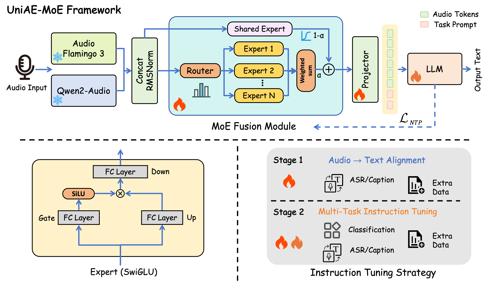
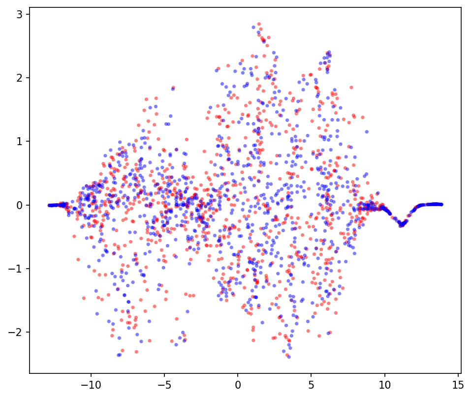
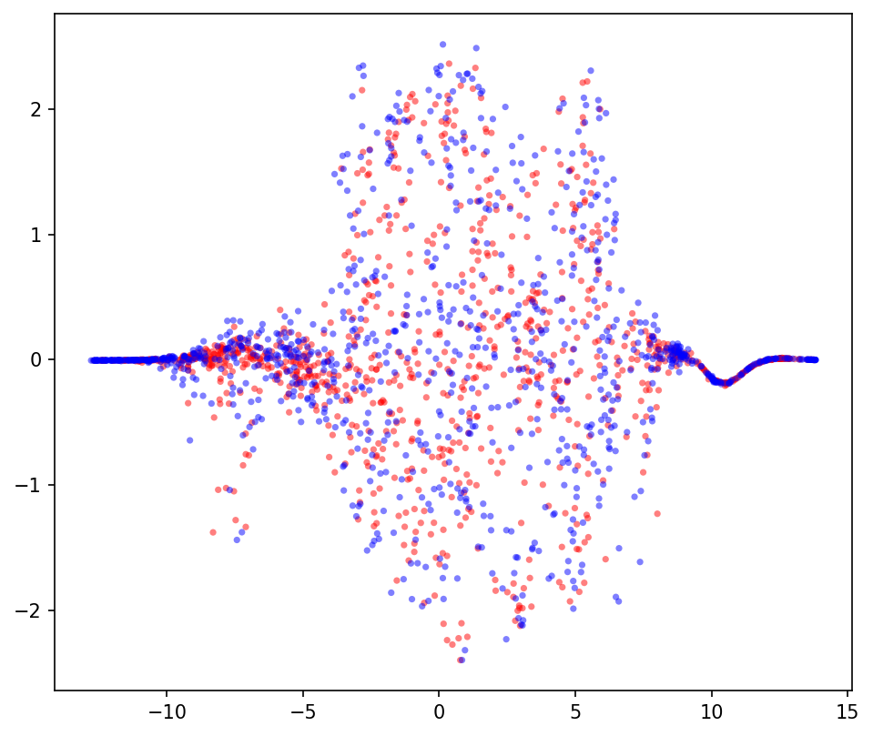
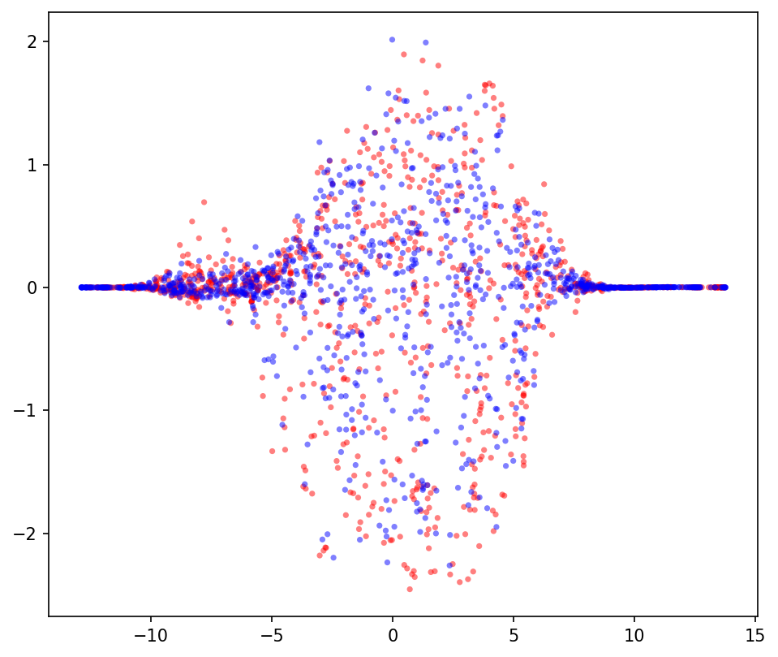
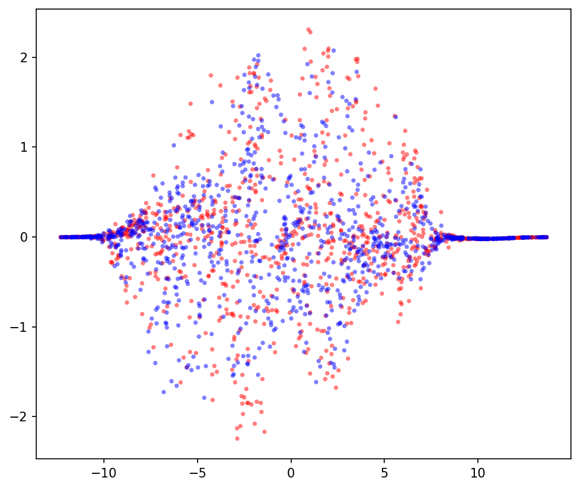
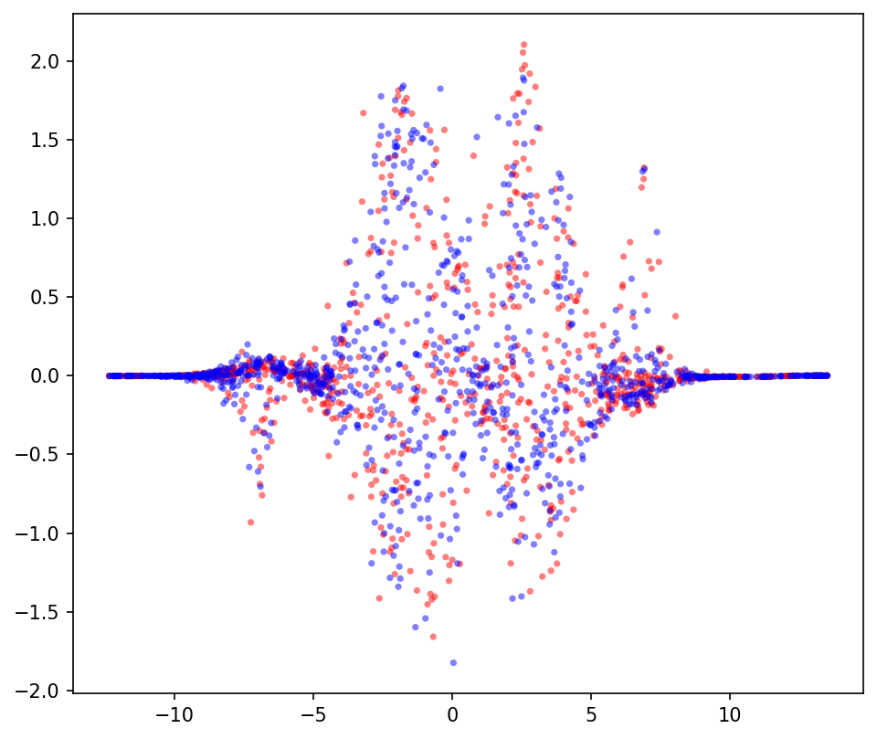
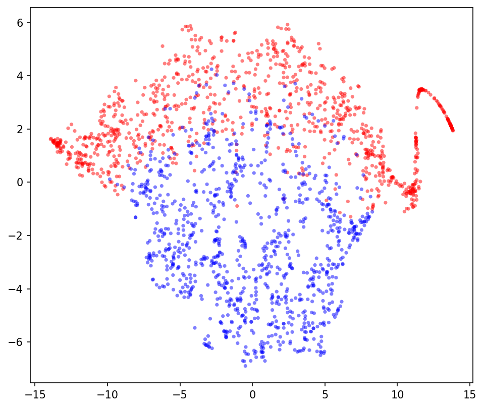

# 🚩 (2026-10-01) Scholar Inbox 추천 논문 

# 📚 MeanVoiceFlow2: Joint Optimization of Mean Flow and Content Encoderfor Fast One-Step Zero-Shot Voice Conversion

🚀 URL: https://arxiv.org/html/2609.40087

## 🌏 Abstract (원문)
Flow-matching approaches to voice conversion (VC) have gained attention owing to their high speech quality and strong speaker similarity. Among them, one-step models such as MeanVoiceFlow are particularly attractive because they enable efficient inference; however, their reliance on a computationally intensive content encoder remains a bottleneck. We therefore proposeMeanVoiceFlow2, a framework that jointly optimizes a flow-based conversion module and a computationally efficient content encoder. The model is trained through conversion distillation using MeanVoiceFlow and the reconstruction of real data. We further incorporate diffusion-GAN training with sample mixing and teacher-guided conditioning augmentation to enhance realism and disentanglement. Experiments on zero-shot VC showed thatMeanVoiceFlow2achieved higher perceptual quality and approximately9×9\timesfaster inference than MeanVoiceFlow while maintaining comparable speaker similarity.111Audio samples are available athttps://www.kecl.ntt.co.jp/people/kaneko.takuhiro/projects/meanvoiceflow2/.
## 🌏 Abstract (번역)
음성 변환(VC)에 대한 플로우 매칭 접근 방식은 높은 음성 품질과 강력한 화자 유사성으로 인해 주목받고 있습니다. 그중 MeanVoiceFlow와 같은 원스텝 모델은 효율적인 추론을 가능하게 하여 특히 매력적이지만, 계산 집약적인 콘텐츠 인코더에 대한 의존성은 여전히 병목 현상으로 남아 있습니다. 따라서 우리는 플로우 기반 변환 모듈과 계산 효율적인 콘텐츠 인코더를 공동으로 최적화하는 프레임워크인 MeanVoiceFlow2를 제안합니다. 이 모델은 MeanVoiceFlow를 사용한 변환 증류와 실제 데이터 재구성을 통해 훈련됩니다. 우리는 현실감과 분리성을 향상시키기 위해 샘플 믹싱 및 교사 안내 조건부 증강을 포함하는 확산-GAN 훈련을 추가로 통합합니다. 제로샷 VC 실험 결과, MeanVoiceFlow2는 MeanVoiceFlow보다 더 높은 지각 품질과 약 9배 빠른 추론 속도를 달성하면서도 유사한 화자 유사성을 유지했습니다. 오디오 샘플은 https://www.kecl.ntt.co.jp/people/kaneko.takuhiro/projects/meanvoiceflow2/에서 확인할 수 있습니다.

## 🔍 Methods & Results
- MeanVoiceFlow2는 플로우 기반 변환 모듈과 계산 효율적인 콘텐츠 인코더를 공동으로 최적화하는 프레임워크로 제안되었습니다.
- 모델은 MeanVoiceFlow를 사용한 변환 증류와 실제 데이터 재구성을 통해 훈련됩니다.
- 현실감과 분리성 향상을 위해 샘플 믹싱 및 교사 안내 조건부 증강을 포함하는 확산-GAN 훈련이 통합되었습니다.
- 제로샷 VC 실험에서 MeanVoiceFlow2는 MeanVoiceFlow보다 더 높은 지각 품질을 달성했습니다.
- MeanVoiceFlow2는 MeanVoiceFlow보다 약 9배 빠른 추론 속도를 보였습니다.
- MeanVoiceFlow2는 MeanVoiceFlow와 유사한 화자 유사성을 유지했습니다.

---
**Usage Info**: 1245 tokens used.
**Generated at**: 2026-10-01 20:00:49

---

# 📚 Tacit-TTS: From Autoregressive Decoding to Masked Prediction for Efficient Transcript-Free Voice Cloning

🚀 URL: https://arxiv.org/html/2609.38658

## 🌏 Abstract (원문)
TTS systems with autoregressive semantic modeling have demonstrated strong zero-shot voice cloning performance and rich expressive variation, but their sequential decoding incurs substantial latency. Non-autoregressive alternatives offer much faster generation, yet often rely on more restrictive reference conditioning, such as requiring transcripts of the reference speech during inference. We present Tacit-TTS, an efficient transcript-free zero-shot voice cloning system distilled from IndexTTS2. Tacit-TTS replaces autoregressive text-to-semantic decoding with masked non-autoregressive generation, introduces training-free acoustic length estimation, and accelerates the flow-matching renderer through ReFlow distillation. Across two English and two Mandarin datasets, Tacit-TTS achieves competitive zero-shot quality while generating speech over 10×faster than IndexTTS2 for utterances longer than 5 seconds. Its transcript-free conditioning further supports cross-lingual and non-lexical references. We validate this capability using references from eight other languages, infant babble, and synthetic gibberish, where transcript-dependent systems often degrade or fail due to unreliable ASR transcripts.
## 🌏 Abstract (번역)
자동회귀 의미론적 모델링을 사용하는 TTS 시스템은 강력한 제로샷 음성 복제 성능과 풍부한 표현 다양성을 보여주었지만, 순차적 디코딩으로 인해 상당한 지연이 발생합니다. 비자동회귀 대안은 훨씬 빠른 생성을 제공하지만, 추론 시 참조 음성의 전사본을 요구하는 등 더 제한적인 참조 조건화에 의존하는 경우가 많습니다. 본 논문에서는 IndexTTS2로부터 증류된 효율적인 전사본 없는 제로샷 음성 복제 시스템인 Tacit-TTS를 소개합니다. Tacit-TTS는 자동회귀 텍스트-의미론적 디코딩을 마스킹된 비자동회귀 생성으로 대체하고, 학습 없는 음향 길이 추정을 도입하며, ReFlow 증류를 통해 플로우 매칭 렌더러를 가속화합니다. 두 개의 영어 및 두 개의 중국어 데이터셋에서 Tacit-TTS는 5초 이상의 발화에 대해 IndexTTS2보다 10배 이상 빠르게 음성을 생성하면서도 경쟁력 있는 제로샷 품질을 달성합니다. 전사본 없는 조건화는 교차 언어 및 비어휘적 참조를 추가로 지원합니다. 우리는 8개 다른 언어의 참조, 영아 옹알이, 합성된 의미 없는 소리를 사용하여 이 기능을 검증했으며, 전사본에 의존하는 시스템은 신뢰할 수 없는 ASR 전사본으로 인해 성능이 저하되거나 실패하는 경우가 많습니다.

## 🔍 Methods & Results
- Tacit-TTS는 IndexTTS2에서 증류된 효율적인 전사본 없는 제로샷 음성 복제 시스템으로, 텍스트-의미론적(T2S) 및 의미론적-오디오(S2A)의 두 단계 생성 패러다임을 따릅니다.
- T2S 모듈은 IndexTTS2의 자동회귀(AR) 의미론적 디코더를 마스킹된 비자동회귀(NAR) 트랜스포머로 대체하여 참조 음성의 전사본 없이 작동합니다.
- NAR T2S 모델은 학습 없이 참조 오디오에서 음향 음절 수를, 대상 텍스트에서 텍스트 음절 수를 사용하여 음향 길이를 추정합니다.
- T2S 모델은 IndexTTS2 교사 모델로부터 지식 증류를 통해 훈련되며, 의미론적 코드 생성을 위한 마스킹 예측 헤드와 연속 표현 재구성을 위한 잔차 복구 헤드를 공동으로 최적화합니다.
- S2A 모듈은 IndexTTS2의 플로우 매칭 음성 렌더러를 채택하고 ReFlow 증류를 통해 추론 비용을 절감하여, Euler 스텝 수를 약 25단계에서 4-8단계로 줄여 합성 품질을 유지하면서 효율성을 향상시킵니다.
- Tacit-TTS는 5초 이상의 발화에 대해 IndexTTS2보다 10배 이상 빠르게 음성을 생성하면서 경쟁력 있는 제로샷 품질을 달성합니다.
- 전사본 없는 조건화는 8개 다른 언어, 영아 옹알이, 합성된 의미 없는 소리 등 교차 언어 및 비어휘적 참조를 지원하며, 이는 전사본 의존 시스템이 실패하는 시나리오에서 강점을 보입니다.
- IndexTTS2보다 훨씬 적은 증류 데이터(T2S 22k 시간, S2A 36시간)를 사용했음에도 불구하고, Tacit-TTS는 여러 기준선보다 우수한 성능을 보이며 영어 음성에서 IndexTTS2와 유사한 화자 유사성을 달성합니다.

## 🖼 Figures

*Figure 2:Overview of the Tacit-TTS pipeline. Given a reference audio and target text, the encoders extract the conditioning representations, the text-to-semantic model generates semantic tokens via masked-LM generation, and the semantic-to-mel model converts them into a mel spectrogram for waveform synthesis by the vocoder.*

*Figure F.1:Generated vs. ground-truth speech duration across the four zero-shot test sets. Each panel reports the pooled Pearson correlation 
𝑟
 for one model.*

---
**Usage Info**: 4559 tokens used.
**Generated at**: 2026-10-01 20:00:58

---

# 📚 SCIC: SCOPE- AND CODEBOOK-AWARE INSTRUCTIONCONDITIONING FOR SPEAKER-ADAPTED EXPRESSIVE TTS

🚀 URL: https://arxiv.org/html/2609.39088

## 🌏 Abstract (원문)
Long-form live-streaming TTS requires context-dependent prosody and paragraph-level coherence. However, many existing instruction-based TTS systems use global or uniform conditions, providing limited explicit control over clause-level relative prosodic changes. We introduce Speaker-Relative Inline Prosody Control, where each Pitch, Energy, or Speed instruction targets a clause relative to the preceding clause from the same speaker, while Pause uses an absolute duration interval. In codec-based TTS, Speed and Pause affect sequence length, whereas Pitch and Energy rely on residual codebooks. By analyzing Qwen3-TTS RVQ codebooks, we find that Energy concentrates in early residual codebooks, whereas Pitch accumulates across a deeper prefix. We therefore propose Scope- and Codebook-Aware Instruction Conditioning (SCIC), combining a Temporal Instruction Router for frame-level tag activation with Tag-Specific Codebook Weighting over residual codebooks. SCIC improves speaker-relative Pitch and Energy control over standard instruction fine-tuning using text-token tags. We further apply multi-reward GDPO post-training to jointly optimize control and quality, improving control accuracy while preserving CER and speaker similarity. In long-form synthesis, SCIC produces a more distinct paragraph-level expressive hierarchy than speaker-adapted SFT without instructions. Audio demos are available at:https://taoliveaigc.github.io/SCIC/.
## 🌏 Abstract (번역)
장문 라이브 스트리밍 TTS는 문맥 의존적인 운율과 문단 수준의 일관성을 요구합니다. 그러나 많은 기존 지시 기반 TTS 시스템은 전역 또는 균일한 조건을 사용하여 절 수준의 상대적인 운율 변화에 대한 명시적인 제어가 제한적입니다. 본 연구에서는 화자 상대 인라인 운율 제어(Speaker-Relative Inline Prosody Control)를 소개합니다. 이는 각 피치, 에너지 또는 속도 지시가 동일 화자의 이전 절에 상대적인 절을 대상으로 하며, 일시 정지는 절대 지속 시간 간격을 사용합니다. 코덱 기반 TTS에서 속도와 일시 정지는 시퀀스 길이에 영향을 미치는 반면, 피치와 에너지는 잔여 코드북에 의존합니다. Qwen3-TTS RVQ 코드북을 분석한 결과, 에너지는 초기 잔여 코드북에 집중되는 반면, 피치는 더 깊은 프리픽스에 걸쳐 축적됨을 발견했습니다. 따라서 우리는 프레임 수준 태그 활성화를 위한 시간적 지시 라우터(Temporal Instruction Router)와 잔여 코드북에 대한 태그별 코드북 가중치(Tag-Specific Codebook Weighting)를 결합한 범위 및 코드북 인식 지시 조건화(Scope- and Codebook-Aware Instruction Conditioning, SCIC)를 제안합니다. SCIC는 텍스트 토큰 태그를 사용하는 표준 지시 미세 조정보다 화자 상대 피치 및 에너지 제어를 향상시킵니다. 또한 제어와 품질을 공동으로 최적화하기 위해 다중 보상 GDPO 사후 학습을 적용하여 CER 및 화자 유사성을 유지하면서 제어 정확도를 향상시켰습니다. 장문 합성에서 SCIC는 지시가 없는 화자 적응형 SFT보다 더 명확한 문단 수준의 표현 계층을 생성합니다. 오디오 데모는 https://taoliveaigc.github.io/SCIC/ 에서 확인할 수 있습니다.

## 🔍 Methods & Results
- SCIC(Scope- and Codebook-Aware Instruction Conditioning)는 메인 토커(Main Talker)의 프레임 수준 상태(ht)를 받아 태그 임베딩, 존재 지표, 라우터 출력, 코드북 가중치를 결합하여 조건화 신호(st,k)를 생성하고, 이를 이전 코드북 토큰 임베딩에 추가하여 MTP(Main Talker Predictor)의 입력(ut,k)을 형성합니다.
- 인라인 지시는 피치, 에너지, 속도에 대해 동일 화자의 이전 절에 대한 상대적 변화를, 일시 정지에 대해서는 절대 지속 시간 간격(L1: [0.50, 0.75]초, L2: [0.75, 1.00]초, L3: [1.00, 1.25]초)을 지정합니다.
- 피치와 에너지의 상대적 변화는 로그 정의를 사용하여 방향 정규화된 변화(mi^a)로 공식화되어 대칭적인 표현을 제공하고 절대적인 음향 목표를 피합니다.
- 코덱 기반 분석 결과, 에너지는 초기 잔여 코드북(q1-q3)에서 빠르게 포화되는 반면, 피치는 더 깊은 프리픽스(q1-q10)에 걸쳐 축적되어 태그별 코드북 가중치의 필요성을 시사합니다.
- SCIC는 시간적 지시 라우터(Temporal Instruction Router)를 통해 프레임 수준 태그 활성화 강도(ρt,τ)를 예측하고, 태그별 코드북 가중치(Tag-Specific Codebook Weighting)를 통해 각 태그에 대해 잔여 코드북(k=1,...,15)에 걸쳐 가중치(ωτ,k)를 할당하여 조건화 신호를 생성합니다.
- SCIC 훈련은 생성 손실과 균형 잡힌 프레임 수준 라우터 손실을 결합하며, 라우터는 시간적 범위를, 코드북 가중치는 코드북 전반의 강도를 제어합니다.
- SCIC-SFT는 다중 보상 GDPO(Gradient-based Differentiable Policy Optimization) 사후 학습을 통해 제어 정확도, 음성 명료도(CER), 화자 유사성을 공동으로 최적화합니다.
- GDPO는 요청된 방향으로의 변화에 보상하고 잘못되거나 과도한 반응을 페널티하는 제어 보상, 목표 일시 정지 간격과의 거리에 따른 일시 정지 보상, 그리고 음성 명료도 및 화자 유사성 보상을 사용하며, 각 목표는 가중치 합산 전에 표준화됩니다.
- SCIC는 텍스트 토큰 태그를 사용하는 표준 지시 미세 조정보다 화자 상대 피치 및 에너지 제어를 향상시키고, GDPO 사후 학습을 통해 CER 및 화자 유사성을 유지하면서 제어 정확도를 개선합니다.
- 장문 합성에서 SCIC는 지시가 없는 화자 적응형 SFT보다 더 명확한 문단 수준의 표현 계층을 생성합니다.

## 🖼 Figures

*Figure 1:SCIC in Qwen3-TTS. The Main Talker predicts 
𝑞
0
 and provides 
ℎ
𝑡
. For each Pitch/Energy tag, its tag embedding is scaled by the Temporal Instruction Router output and the tag-specific codebook weight to form 
𝑠
𝑡
,
𝑘
, which conditions MTP prediction of 
𝑞
1
–
𝑞
15
.*

---
**Usage Info**: 4905 tokens used.
**Generated at**: 2026-10-01 20:01:12

---

# 📚 VOSSA: Voiceprint Optimization for Streaming Speech Architectures

🚀 URL: https://arxiv.org/html/2609.38887

## 🌏 Abstract (원문)
Real-time voice conversion (VC) systems commonly rely on pretrained speaker embeddings from automatic speaker verification (ASV) models. While effective for speaker discrimination, these embeddings are trained to remain stable across phonetic and prosodic variations within-speaker, which may conflict with frame-level acoustic generation in streaming constraints. To address this issue, we propose VOSSA (Voiceprint Optimization for Streaming Speech Architectures), a speaker representation framework that extracts speaker information from intermediate content encoder layers and aggregates using attentive statistics pooling. The embedding is trained jointly with VC objectives, removing the need for a separate speaker encoder. Across six datasets, VOSSA improves F0 dynamics and vowel-discriminative acoustic cues while maintaining comparable NISQA-MOS, WER, and speaker similarity. Perceptual tests further indicate improvements in naturalness, speaker similarity, intelligibility, and vibrancy.
## 🌏 Abstract (번역)
실시간 음성 변환(VC) 시스템은 일반적으로 자동 화자 확인(ASV) 모델의 사전 학습된 화자 임베딩에 의존합니다. 이러한 임베딩은 화자 식별에는 효과적이지만, 화자 내 음성학적 및 운율적 변화에 걸쳐 안정적으로 유지되도록 훈련되어 스트리밍 제약 조건에서 프레임 수준의 음향 생성과 충돌할 수 있습니다. 이 문제를 해결하기 위해, 우리는 중간 콘텐츠 인코더 레이어에서 화자 정보를 추출하고 주의 통계 풀링을 사용하여 집계하는 화자 표현 프레임워크인 VOSSA(Voiceprint Optimization for Streaming Speech Architectures)를 제안합니다. 이 임베딩은 VC 목표와 함께 공동으로 훈련되어 별도의 화자 인코더가 필요 없습니다. 6개의 데이터셋에서 VOSSA는 NISQA-MOS, WER 및 화자 유사성을 유사하게 유지하면서 F0 다이내믹스와 모음 식별 음향 단서를 개선합니다. 지각 테스트는 또한 자연스러움, 화자 유사성, 명료성 및 생동감의 개선을 보여줍니다.

## 🔍 Methods & Results
- VOSSA는 실시간 음성 변환(VC) 시스템을 위해 제안된 화자 표현 프레임워크로, 기존 ASV 모델의 사전 학습된 화자 임베딩이 스트리밍 환경에서 프레임 수준 음향 생성과 충돌할 수 있는 문제를 해결합니다.
- VOSSA는 TVTSyn을 백본으로 사용하며, 외부 화자 인코더 대신 콘텐츠 인코더의 중간 레이어에서 화자 정보를 추출합니다.
- 화자 정보는 TVTSyn의 고정된 스트리밍 콘텐츠 인코더의 마지막 CNN 레이어와 8개 MHSA 스택의 격층 레이어에서 다중 레이어 특징으로 추출됩니다.
- 추출된 특징 시퀀스는 주의 통계 풀링(ASP)을 통해 집계되어 주의 가중 평균 및 분산을 계산하고, 이를 전역 화자 임베딩으로 투영합니다. 이 방식은 발화 수준의 화자 특성을 포착하면서 프레임 수준의 가변성을 적응적으로 가중합니다.
- 훈련 프로토콜은 자기 재구성 경로와 음성 변환 경로의 두 가지 병렬 경로를 사용하며, 안정적인 화자 정체성 목표를 위해 평균 화자 임베딩을 활용합니다.
- 재합성 후 화자 내 일관성을 강화하기 위해 원본 및 재구성된 화자 임베딩 간의 코사인 거리를 최소화하는 손실 항(L_spk)을 추가합니다.
- 또한, 다른 발화에 걸쳐 동일 화자의 임베딩이 일관성을 유지하도록 대칭 NT-Xent(InfoNCE) 목적 함수(L_con)를 보조 정규화 항으로 채택합니다.
- 전체 훈련 목표는 L1 재구성 손실, 적대적 손실, 특징 매칭 손실, 화자 일관성 손실 및 지도 대조 정규화 손실을 결합하며, 화자 인코더, TVT 모듈 및 디코더를 통해 기울기가 전파됩니다.
- VOSSA는 6개 데이터셋에서 F0 다이내믹스와 모음 식별 음향 단서를 개선했으며, NISQA-MOS, WER 및 화자 유사성은 유사하게 유지했습니다.
- 지각 테스트 결과, 자연스러움, 화자 유사성, 명료성 및 생동감 측면에서 개선을 보였습니다.
- VOSSA는 별도의 화자 인코더 없이 VC 목표와 함께 임베딩을 공동으로 훈련합니다.

## 🖼 Figures
![Figure 1:Training workflow for the TVTSyn backbone. (a) content encoder trained against HuBERT k-means pseudo-labels, and (b) decoder conditioned on speaker embedding trained with self-supervision and discriminator objectives. (c) Overview of the training protocol in VOSSA. The self-reconstruction path (bottom, purple) uses segments from the same LibriTTS speaker to provide fully supervised training, while the non-parallel VC path (top, orange) uses VoxCeleb targets to condition conversion. (d) Speaker embedding extraction from the frozen content encoder. We collect features from the last CNN layer and every other layer of the MHSA stack, concatenate them to form 
𝐇
∈
ℝ
𝑇
×
𝐿
​
𝑑
, and apply attentive statistics pooling and an MLP to obtain a global speaker embedding.](../images/2026-10-01/2609.38887/2609.38887_fig0.png)
*Figure 1:Training workflow for the TVTSyn backbone. (a) content encoder trained against HuBERT k-means pseudo-labels, and (b) decoder conditioned on speaker embedding trained with self-supervision and discriminator objectives. (c) Overview of the training protocol in VOSSA. The self-reconstruction path (bottom, purple) uses segments from the same LibriTTS speaker to provide fully supervised training, while the non-parallel VC path (top, orange) uses VoxCeleb targets to condition conversion. (d) Speaker embedding extraction from the frozen content encoder. We collect features from the last CNN layer and every other layer of the MHSA stack, concatenate them to form 
𝐇
∈
ℝ
𝑇
×
𝐿
​
𝑑
, and apply attentive statistics pooling and an MLP to obtain a global speaker embedding.*

---
**Usage Info**: 4550 tokens used.
**Generated at**: 2026-10-01 20:01:25

---

# 📚 Monotonicity-Guided Semantic Alignment for Zero-shot Multispeaker Image-to-Speech Synthesis

🚀 URL: https://arxiv.org/html/2609.38440

## 🌏 Abstract (원문)
Direct image-to-speech (Img2Sp) poses an alignment challenge in mapping visual content to ordered speech sequences, as images permit multiple spoken descriptions and lack monotonic correspondence with speech sequences. We propose Monotonicity-Guided Semantic Alignment (MGSA), to the best of our knowledge, the first framework for zero-shot multispeaker Img2Sp synthesis. We use semantic speech units to provide shared content targets across speakers with reference speech for speaker conditioning. A query aligner maps semantic memory learned from visual content to speech unit positions via a soft monotonic prior, which yields position-specific conditioning states. A blockwise masked diffusion generator is employed for the speech unit generation conditioning on these states. Experiments on Flickr8k-Audio show competitive captioning performance against single-speaker baselines, while evaluation with LibriTTS-R references supports zero-shot synthesis for unseen speakers. Ablations validate the effectiveness of aligner and block diffusion. Audio samples are available athttps://alizeded.github.io/mgsa-demo.
## 🌏 Abstract (번역)
이미지-음성 직접 변환(Img2Sp)은 시각적 콘텐츠를 순서화된 음성 시퀀스에 매핑하는 데 정렬 문제를 야기합니다. 이는 이미지가 여러 음성 설명을 허용하고 음성 시퀀스와 단조로운 대응 관계가 부족하기 때문입니다. 우리는 제로샷 다중 화자 Img2Sp 합성을 위한 최초의 프레임워크인 단조성 유도 의미 정렬(Monotonicity-Guided Semantic Alignment, MGSA)을 제안합니다. 우리는 화자 조건화를 위해 참조 음성과 함께 화자 간에 공유되는 콘텐츠 목표를 제공하기 위해 의미론적 음성 단위를 사용합니다. 쿼리 정렬기는 시각적 콘텐츠로부터 학습된 의미론적 메모리를 부드러운 단조 사전(prior)을 통해 음성 단위 위치에 매핑하여 위치별 조건화 상태를 생성합니다. 이러한 상태에 조건화된 음성 단위 생성을 위해 블록 단위 마스크 확산 생성기가 사용됩니다. Flickr8k-Audio에 대한 실험은 단일 화자 기준선에 비해 경쟁력 있는 캡셔닝 성능을 보여주었으며, LibriTTS-R 참조를 사용한 평가는 보지 못한 화자에 대한 제로샷 합성을 지원합니다. 어블레이션 연구는 정렬기 및 블록 확산의 효과를 검증합니다. 오디오 샘플은 https://alizeded.github.io/mgsa-demo 에서 확인할 수 있습니다.

## 🔍 Methods & Results
- MGSA(Monotonicity-Guided Semantic Alignment)는 이미지(I), 참조 음성(a_ref), 선택적 접두사 프롬프트(x_<P)를 입력으로 받아 음성(y_hat)을 합성하는 제로샷 다중 화자 Img2Sp 합성 프레임워크를 제안합니다.
- 음성 토크나이저(E_tok)는 목표 음성을 이산 음성 단위(x)로 변환하고, 참조 조건화 U2S 모델(D_tok)은 파형을 재구성합니다.
- 의미론적 콘텐츠 인코딩을 위해, 고정된 시각 인코더(V)가 이미지 표현을 추출하고, 의미론적 인코더(f_gamma)가 시각 특징과 화자 조건화(s)를 고정 용량 메모리(M)에 인코딩합니다. M은 인덱싱된 슬롯에 의미론적 콘텐츠를 저장하며, 평균 풀링 및 정규화를 통해 전역 의미론적 조건화(c_sem)를 제공합니다.
- 단조 쿼리 정렬(MQA, g_phi)은 부드러운 단조 사전(prior)을 통해 M에 주의를 기울여 위치별 조건화 상태(H)를 생성하며, 이는 시각적 콘텐츠를 순서화된 음성 단위 시퀀스와 정렬하는 데 핵심적인 역할을 합니다.
- MQA는 블록 단위로 생성되며, 공유 학습 가능 쿼리 토큰과 위치 정보를 사용하여 현재 블록에 대한 조건화 상태(H_b)를 생성합니다. 화자 토큰(W_s*s)은 M에 추가됩니다.
- 훈련 시 MQA는 단일 전달로 모든 상태를 계산하고, 추론 시에는 각 새 블록에 대해 상태를 재계산하지만 완료된 블록의 상태는 변경되지 않습니다.
- 블록 마스크 확산 생성기(G_theta)는 마스크 확산을 사용하여 각 블록을 학습하며, 마스크된 위치의 단위 분포(p_theta)를 예측합니다. 추론 시에는 각 블록이 완전히 마스크된 상태로 초기화되고 반복적으로 개선됩니다.
- 손실 함수는 MQA의 단조성 유도 정렬을 학습하기 위해 단위 예측 손실(L_unit)과 점유 예측 손실(L_occ)을 포함하는 L_MQA와, 생성기(G_theta)의 마스크 예측 손실(L_mask)을 결합한 총 손실 L_MGSA = L_mask + L_unit + L_occ를 사용합니다.
- 모델 아키텍처는 BLIP2 Q-former 기반의 의미론적 인코더(12-레이어 트랜스포머 디코더), ECAPA-TDNN 및 FACodec 기반의 화자 조건화, 2-레이어 트랜스포머 디코더 기반의 MQA(블록-인과적 자기-주의 마스크 및 부드러운 단조 바이어스 포함), 8-레이어 Diffusion Transformer(DiT) 기반의 블록 마스크 확산 생성기로 구성됩니다.
- 실험 결과, Flickr8k-Audio에서 단일 화자 기준선 대비 경쟁력 있는 캡셔닝 성능을 달성했으며, LibriTTS-R 참조를 통해 보지 못한 화자에 대한 제로샷 합성을 지원합니다. 어블레이션 연구를 통해 정렬기 및 블록 확산의 효과가 검증되었습니다.

---
**Usage Info**: 5228 tokens used.
**Generated at**: 2026-10-01 20:01:39

---

# 📚 Multi-Rate Bandwidth Extension by Token Completionin Neural Audio Codecs

🚀 URL: https://arxiv.org/html/2609.38502

## 🌏 Abstract (원문)
Bandwidth extension aims to reconstruct the high-frequency content missing from a band-limited signal. In this work, we focus on signals processed by a neural audio codec, where the decoder receives band-limited codes and already retains the low-frequency band. The missing content is confined to frequencies above the input’s cutoff, transforming bandwidth extension into a token completion task.The codec ingests a fixed 48 kHz representation, regardless of the input bandwidth. Thus, the predictor is the only rate-dependent component, and a single model supports input rates of 8, 16, 24, and 32 kHz without explicit bandwidth conditioning, as the latter is recoverable from the codes themselves.Applied to both a waveform-domain codec (DAC) and a spectral-domain codec (SpectroStream), this method outperforms, on objective metrics, two recent systems on the MUSDB18 dataset across all rates, while operating on a 12 kbit/s token stream. The subjective evaluation of the 8 kHz input rate further shows it performs comparably to the stronger of the two baseline systems.
## 🌏 Abstract (번역)
대역폭 확장(Bandwidth extension)은 대역 제한된 신호에서 누락된 고주파수 콘텐츠를 재구성하는 것을 목표로 합니다. 본 연구에서는 신경 오디오 코덱으로 처리된 신호에 초점을 맞춥니다. 이 코덱에서 디코더는 대역 제한된 코드를 수신하며 이미 저주파수 대역을 유지하고 있습니다. 누락된 콘텐츠는 입력의 차단 주파수 이상으로 제한되어, 대역폭 확장을 토큰 완성(token completion) 작업으로 전환합니다.코덱은 입력 대역폭과 관계없이 고정된 48kHz 표현을 수용합니다. 따라서 예측기는 유일한 속도 의존적 구성 요소이며, 단일 모델이 8, 16, 24, 32kHz의 입력 속도를 명시적인 대역폭 조건 없이 지원합니다. 이는 대역폭 정보가 코드 자체에서 복구 가능하기 때문입니다.파형 도메인 코덱(DAC)과 스펙트럼 도메인 코덱(SpectroStream) 모두에 적용된 이 방법은 12kbit/s 토큰 스트림으로 작동하면서 MUSDB18 데이터셋에서 모든 속도에 걸쳐 두 가지 최신 시스템보다 객관적 지표에서 우수한 성능을 보였습니다. 8kHz 입력 속도에 대한 주관적 평가에서는 두 기준 시스템 중 더 강력한 시스템과 비교할 만한 성능을 보였습니다.

## 🔍 Methods & Results
- 대역폭 확장 문제를 토큰 완성(token completion) 작업으로 재정의하여, 신경 오디오 코덱에서 누락된 고주파수 콘텐츠를 재구성하는 데 집중했습니다.
- 코덱은 입력 대역폭과 무관하게 고정된 48kHz 표현을 사용하며, 단일 모델이 8, 16, 24, 32kHz의 다양한 입력 속도를 명시적인 대역폭 조건 없이 지원하도록 설계되었습니다.
- 제안된 방법은 파형 도메인 코덱(DAC)과 스펙트럼 도메인 코덱(SpectroStream)에 적용되었습니다.
- MUSDB18 데이터셋에서 객관적 지표를 기준으로 12kbit/s 토큰 스트림으로 작동하며 모든 속도에서 두 가지 최신 시스템보다 우수한 성능을 달성했습니다.
- 8kHz 입력 속도에 대한 주관적 평가 결과, 두 기준 시스템 중 더 강력한 시스템과 비교할 만한 성능을 보였습니다.

---
**Usage Info**: 1802 tokens used.
**Generated at**: 2026-10-01 20:01:47

---

# 📚 UniAE-MoE: A Unified Audio Encoder via Mixture of Experts

🚀 URL: https://arxiv.org/html/2609.39199

## 🌏 Abstract (원문)
Large Audio Language Models (LALMs) rely on effective audio encoders for multi-task performance. We introduceUniAE-MoE, a unified audio encoder designed to model cross-domain audio representations and achieve outstanding downstream understanding performance via a Mixture-of-Experts (MoE) architecture.Specifically, we explore mainstream audio encoders and integrate those from Qwen2-Audio and Audio-Flamingo 3, which demonstrate superior downstream capabilities. To facilitate effective model fusion, we improve our encoder using SwiGLU with shared experts to decouple encoder networks, and we further introduce a two-stage instruction-tuning strategy to better adapt the model to diverse downstream tasks. Moreover, we propose the task-specific data scaling (TSDS) technique to enhance UniAE-MoE’s understanding capabilities.On the XARES-LLM benchmark, UniAE-MoE attains a score of0.802, achieving state-of-the-art performance. It also delivers top-tier performance in the official Interspeech 2026 Audio Encoder Capability Challenge, further demonstrating robust generalization across diverse audio tasks. Together, these results validate the effectiveness of UniAE-MoE for unified audio understanding across speech, music, and general audio domains.
## 🌏 Abstract (번역)
대규모 오디오 언어 모델(LALMs)은 다중 작업 성능을 위해 효과적인 오디오 인코더에 의존합니다. 본 연구에서는 교차 도메인 오디오 표현을 모델링하고 Mixture-of-Experts(MoE) 아키텍처를 통해 뛰어난 다운스트림 이해 성능을 달성하도록 설계된 통합 오디오 인코더인 UniAE-MoE를 소개합니다. 구체적으로, 우리는 주류 오디오 인코더를 탐색하고 우수한 다운스트림 기능을 보여준 Qwen2-Audio 및 Audio-Flamingo 3의 인코더를 통합합니다. 효과적인 모델 융합을 촉진하기 위해 공유 전문가를 갖춘 SwiGLU를 사용하여 인코더 네트워크를 분리하고, 다양한 다운스트림 작업에 모델을 더 잘 적응시키기 위해 2단계 명령어 튜닝 전략을 추가로 도입하여 인코더를 개선했습니다. 또한, UniAE-MoE의 이해 능력을 향상시키기 위해 작업별 데이터 스케일링(TSDS) 기술을 제안합니다. XARES-LLM 벤치마크에서 UniAE-MoE는 0.802점을 달성하여 최첨단 성능을 기록했습니다. 또한 공식 Interspeech 2026 오디오 인코더 역량 챌린지에서 최고 수준의 성능을 제공하여 다양한 오디오 작업 전반에 걸쳐 강력한 일반화 능력을 입증했습니다. 이러한 결과들은 음성, 음악 및 일반 오디오 도메인 전반에 걸친 통합 오디오 이해를 위한 UniAE-MoE의 효과를 검증합니다.

## 🔍 Methods & Results
- Dasheng-base를 기준으로 Qwen2-Audio(0.737점)와 Audio-Flamingo 3(0.767점)가 가장 높은 점수를 기록했으며, 이들의 상호 보완적인 강점(Qwen2-Audio는 음성/음악, Audio-Flamingo 3는 장문 오디오/환경음)을 활용하여 듀얼 모델 백본으로 결합했습니다.
- Qwen2-Audio와 Audio-Flamingo 3의 이질적인 특징을 통합하고 보편적인 오디오 표현을 도출하기 위해 Mixture-of-Experts(MoE) 프레임워크를 도입했습니다.
- 각 전문가는 SwiGLU를 사용하여 구현되었으며, 특징별 게이팅 및 곱셈 상호작용을 통해 두 인코더의 이질적인 표현을 효과적으로 통합합니다.
- MLP 기반 라우터는 각 토큰에 대해 상위 K개 전문가를 동적으로 선택하고, 정규화된 라우팅 가중치를 사용하여 출력을 결합합니다.
- 모델링 견고성을 높이기 위해 모든 토큰을 처리하는 공유 전문가(Shared Expert) 메커니즘을 통합하여 다양한 작업에 걸쳐 불변하는 음향 특징을 포착하고 전문가 붕괴 문제를 완화했습니다.
- 20가지 다운스트림 작업을 통합된 명령어 추종 패러다임으로 재구성하고, LLM의 표준 Next Token Prediction(NTP) 목표를 사용하여 종단 간 학습을 수행했습니다.
- 오디오-언어 정렬을 위한 2단계 학습 전략을 사용했습니다: 1단계에서는 ASR 및 오디오 캡셔닝 데이터를 사용하여 MoE 모듈과 프로젝터를 최적화하고, 2단계에서는 모든 20가지 작업을 포괄하는 다양한 명령어 추종 데이터를 사용하여 나머지 구성 요소를 공동으로 미세 조정했습니다.
- 작업 간 불균형을 완화하기 위해 작업별 데이터 스케일링(TSDS) 기술을 제안하여, 저자원 작업(예: 캡셔닝, 분류)에 MusicBench, MusicCaps, AudioSetCaps, Free Music Archive, IEMOCAP과 같은 관련 공개 데이터셋을 선택적으로 증강했습니다.
- UniAE-MoE는 XARES-LLM 벤치마크에서 0.802점을 달성하여 최첨단 성능을 기록했으며, Interspeech 2026 오디오 인코더 역량 챌린지에서도 최고 수준의 성능을 보였습니다.
- 경량 135M 매개변수 LLM을 사용했음에도 불구하고, 음성, 음악 및 일반 오디오 도메인 전반에 걸쳐 통합 오디오 이해를 위한 강력한 교차 작업 일반화 능력을 입증했습니다.

## 🖼 Figures

*Figure 1:The UniAE-MoE framework comprises the overall architecture (top), the SwiGLU-based expert network (bottom left), and the two-stage instruction-tuning strategy (bottom right).*

---
**Usage Info**: 3856 tokens used.
**Generated at**: 2026-10-01 20:02:00

---

# 📚 Game Sound-Effect Completion with Event-Level Transformation Hints

🚀 URL: https://arxiv.org/html/2609.39044

## 🌏 Abstract (원문)
Creating sound effects for a new game-character skin requires a distinct acoustic identity while preserving gameplay-event roles. The challenge is to complete a coherent set of related sounds whose required degrees of redesign differ. We formulate this task as completion conditioned on base-skin audio, completed target assets, and a textual design description. We develop a pipeline to collect, process, and align corresponding events across League of Legends skins. Building on Stable Audio 3’s pretrained audio prior, we fine-tune a latent inpainting model to jointly complete missing events. A signed soft retention mask encodes available audio and an adjustable transformation hint for each missing event, specifying the requested balance between retention and redesign. Experiments on held-out skins show improved reconstruction over the evaluated general-purpose audio editors. Target-derived hints further improve paired similarity, with three-level hints retaining most ofthe benefit of continuous guidance.
## 🌏 Abstract (번역)
새로운 게임 캐릭터 스킨을 위한 음향 효과를 생성하는 것은 게임 플레이 이벤트의 역할을 유지하면서도 독특한 음향적 정체성을 요구합니다. 이 과제의 핵심은 필요한 재설계 정도가 다른 관련 사운드의 일관된 세트를 완성하는 것입니다. 우리는 이 작업을 기본 스킨 오디오, 완성된 타겟 애셋, 그리고 텍스트 디자인 설명을 조건으로 하는 완성 작업으로 공식화합니다. 우리는 리그 오브 레전드 스킨 전반에 걸쳐 해당 이벤트를 수집, 처리 및 정렬하는 파이프라인을 개발합니다. Stable Audio 3의 사전 학습된 오디오 프라이어를 기반으로, 누락된 이벤트를 공동으로 완성하기 위해 잠재 공간 인페인팅 모델을 미세 조정합니다. 서명된 소프트 유지 마스크는 사용 가능한 오디오와 각 누락된 이벤트에 대한 조정 가능한 변환 힌트를 인코딩하여 유지와 재설계 사이의 요청된 균형을 지정합니다. 보류된 스킨에 대한 실험은 평가된 범용 오디오 편집기보다 향상된 재구성을 보여줍니다. 타겟에서 파생된 힌트는 쌍별 유사성을 더욱 향상시키며, 3단계 힌트는 연속적인 가이드의 이점 대부분을 유지합니다.

## 🔍 Methods & Results
- 리그 오브 레전드 스킨의 Wwise 뱅크와 CommunityDragon 메타데이터를 활용하여 게임 이벤트 오디오를 수집, 처리하고 기본-타겟 이벤트 간의 정렬된 데이터셋을 구축했습니다. 최종 데이터셋은 5,633개의 타겟 능력 시퀀스를 포함하며, 4,428개의 훈련, 259개의 검증, 256개의 테스트 시퀀스로 구성됩니다.
- Gemini 3.1 Pro Preview를 사용하여 기본 오디오, 아트워크, 공식 설명 등을 기반으로 최대 40단어의 텍스트 디자인 설명을 생성했습니다.
- Stable Audio 3의 사전 학습된 오디오 프라이어를 기반으로 잠재 공간 인페인팅 모델을 미세 조정하여 누락된 이벤트를 공동으로 완성합니다. 모델은 기본 오디오, 관찰된 타겟 이벤트, 텍스트 설명 및 누락된 이벤트에 대한 힌트를 조건으로 하여 오디오를 생성합니다.
- 서명된 소프트 유지 마스크(signed soft retention mask)는 사용 가능한 오디오를 인코딩하며, 조정 가능한 변환 힌트(adjustable transformation hint)는 각 누락된 이벤트에 대해 유지와 재설계 사이의 균형을 지정합니다. 이 힌트는 BEATs 임베딩 거리에서 파생되며 [0,1] 범위로 정규화됩니다.
- 모델은 SAME 인코더를 사용하여 오디오를 잠재 공간으로 변환하고, DiT(Diffusion Transformer) 백본에 마스크와 인코딩된 오디오를 주입합니다. T5Gemma 텍스트 임베딩은 교차 어텐션을 통해 입력됩니다.
- 훈련은 흐름 매칭(flow matching)과 가중 MSE 손실을 사용하며, 40,000번의 업데이트 동안 AdamW 최적화 도구와 3e-5의 학습률로 Stable Audio 3 medium-base DiT(1.4B 파라미터)를 미세 조정했습니다.
- 텍스트 및 참조 조건에 대한 이축 분류기 없는 안내(two-axis classifier-free guidance, CFG)를 사용하여 생성 품질을 향상시켰습니다. 검증을 통해 (sT, sR) = (2,1)의 안내 강도가 선택되었습니다.
- 보류된 스킨에 대한 실험 결과, 제안된 방법이 평가된 범용 오디오 편집기보다 향상된 재구성 성능을 보였습니다.
- 타겟에서 파생된 힌트는 쌍별 유사성을 더욱 향상시켰으며, 3단계 힌트({0, 0.5, 1})가 연속적인 안내의 이점 대부분을 유지하는 것으로 나타났습니다.

## 🖼 Figures
![Figure 1:Overview. (a) Structured text-condition construction. Gemini uses paired splash art, muted ability VFX clips, metadata, and base-skin SFX to produce a sound-design description. Skin-level cues and fixed-vocabulary event analyses are auxiliary reasoning; only the final one-sentence condition is used for model training and inference. Target-skin audio is never supplied to Gemini. (b) Retention-controlled latent inpainting. Full base audio, a known target prefix, and a silent target suffix form the waveform canvas, encoded by frozen SAME. Its latent 
𝑧
 is aligned with retention mask 
𝑀
∈
ℝ
1
×
𝑇
: 
+
1
 marks supplied audio; unknown event 
𝑗
 receives 
𝑚
𝑗
=
−
ℎ
𝑗
∈
[
−
1
,
0
]
, expressing a requested change from retention (
0
) to full redesign (
−
1
). Existing per-block MLPs project the channel-concatenated 
[
𝑧
;
𝑀
]
 into every DiT block’s residual stream; text enters through cross-attention. Sampling starts from Gaussian noise. After decoding and cropping to the target region, supplied target audio is reinserted unchanged. League of Legends artwork and gameplay imagery © Riot Games, Inc.](../images/2026-10-01/2609.39044/2609.39044_fig0.png)
*Figure 1:Overview. (a) Structured text-condition construction. Gemini uses paired splash art, muted ability VFX clips, metadata, and base-skin SFX to produce a sound-design description. Skin-level cues and fixed-vocabulary event analyses are auxiliary reasoning; only the final one-sentence condition is used for model training and inference. Target-skin audio is never supplied to Gemini. (b) Retention-controlled latent inpainting. Full base audio, a known target prefix, and a silent target suffix form the waveform canvas, encoded by frozen SAME. Its latent 
𝑧
 is aligned with retention mask 
𝑀
∈
ℝ
1
×
𝑇
: 
+
1
 marks supplied audio; unknown event 
𝑗
 receives 
𝑚
𝑗
=
−
ℎ
𝑗
∈
[
−
1
,
0
]
, expressing a requested change from retention (
0
) to full redesign (
−
1
). Existing per-block MLPs project the channel-concatenated 
[
𝑧
;
𝑀
]
 into every DiT block’s residual stream; text enters through cross-attention. Sampling starts from Gaussian noise. After decoding and cropping to the target region, supplied target audio is reinserted unchanged. League of Legends artwork and gameplay imagery © Riot Games, Inc.*

---
**Usage Info**: 3890 tokens used.
**Generated at**: 2026-10-01 20:02:12

---

# 📚 Wavelet Flow Matching for Time Series

🚀 URL: https://arxiv.org/html/2609.39374

## 🌏 Abstract (원문)
Synthetic time series are increasingly used for data augmentation, privacy-preserving data sharing, and downstream model development, yet faithfully reproducing both multi-scale temporal structure and cross-channel dependencies remains challenging. We study multivariate time-series generation through flow matching in the wavelet domain. By operating on multilevel discrete wavelet coefficients rather than directly in the time domain, the model represents coarse structure and progressively finer details at separate scales. Their naturally different variances further induce an implicit coarse-to-fine generative process without requiring an explicit multi-scale schedule. Since the transform acts independently on each channel, we pair it with a channel-token transformer whose attention directly models cross-channel dependencies. Across seven benchmark datasets and four sequence lengths, our method is best or tied on a majority of dataset–metric combinations, with the largest and most consistent improvements in Context-FID and discriminative score.
## 🌏 Abstract (번역)
합성 시계열은 데이터 증강, 프라이버시 보호 데이터 공유 및 다운스트림 모델 개발에 점점 더 많이 사용되지만, 다중 스케일 시간 구조와 채널 간 의존성을 모두 충실하게 재현하는 것은 여전히 어렵습니다. 본 연구에서는 웨이블릿 도메인에서 플로우 매칭을 통해 다변량 시계열 생성을 연구합니다. 시간 도메인에서 직접 작업하는 대신 다단계 이산 웨이블릿 계수에서 작동함으로써, 모델은 거친 구조와 점진적으로 더 미세한 세부 사항을 별도의 스케일에서 표현합니다. 이들의 자연스럽게 다른 분산은 명시적인 다중 스케일 스케줄 없이도 암묵적인 거친-세밀 생성 프로세스를 유도합니다. 변환은 각 채널에서 독립적으로 작동하므로, 채널 간 의존성을 직접 모델링하는 채널-토큰 트랜스포머와 결합합니다. 7개의 벤치마크 데이터셋과 4가지 시퀀스 길이에 걸쳐, 우리의 방법은 대부분의 데이터셋-메트릭 조합에서 최고 성능을 보이거나 동등한 성능을 보였으며, Context-FID 및 판별 점수에서 가장 크고 일관된 개선을 보였습니다.

## 🔍 Methods & Results
- 다변량 시계열의 비조건부 생성을 위해 채널별 웨이블릿 변환과 채널-토큰 트랜스포머를 결합한 플로우 매칭 접근 방식을 제안한다.
- J-레벨 이산 웨이블릿 변환(DWT)을 각 채널에 독립적으로 적용하여 다중 스케일 시간 구조를 노출하고, 시간 도메인 대신 웨이블릿 계수 분포를 모델링한다.
- 웨이블릿 변환은 입력의 차원성을 보존하며, 생성 모델과 함께 웨이블릿 변환 자체를 학습할 수도 있다.
- 플로우 매칭을 사용하여 가우시안 노이즈를 웨이블릿 계수 분포로 변환하는 속도장(velocity field)을 학습하며, 선형 경로를 통해 노이즈와 데이터 간의 연결을 설정하고 제곱 손실을 최소화한다.
- 웨이블릿 계수의 스케일별 분산 차이로 인해, 명시적인 스케줄 없이도 암묵적인 거친-세밀(coarse-to-fine) 생성 과정이 유도된다. (거친 스케일 계수가 더 큰 분산을 가져 데이터 지배적인 상태에 더 일찍 도달)
- 웨이블릿 변환이 채널 간 정보를 혼합하지 않으므로, 채널-토큰 트랜스포머를 도입하여 채널 간 의존성을 모델링한다.
- 트랜스포머는 각 채널 토큰이 다단계 웨이블릿 분해의 스케일별 임베딩을 집계하도록 토큰화되며, 셀프 어텐션은 채널 간에만 작동한다.
- 플로우 시간(t)은 사인파 임베딩으로 인코딩되어 AdaLN-Zero 컨디셔닝을 통해 각 트랜스포머 블록에 주입된다.
- 추론 시에는 학습된 ODE를 명시적 오일러 방식(N=100 스텝)으로 통합하여 웨이블릿 계수를 생성한 후, 역 웨이블릿 변환을 통해 시간 도메인 시계열을 복원한다.
- 7개의 벤치마크 데이터셋과 4가지 시퀀스 길이에 걸쳐, 제안된 방법은 대부분의 데이터셋-메트릭 조합에서 최고 성능을 보이거나 동등한 성능을 달성했으며, 특히 Context-FID 및 판별 점수에서 가장 크고 일관된 개선을 보였다.

## 🖼 Figures

*Figure 1: Wavelet-domain flow matching. Each channel is mapped to multilevel DWT coefficients, and a single learned flow 
𝑣
𝜃
 transports Gaussian noise 
𝑧
0
 jointly across all levels and channels. The inverse DWT maps the final coefficients 
𝑧
1
 back to the time domain.*

*Figure 2:Level-wise SNR along the linear probability path on ETTh1. Coarse levels cross 
SNR
=
1
 earlier than fine levels.*

*Figure 3: Velocity-network architecture. (a) The network maps wavelet coefficients to a velocity field of the same shape. (b) Each channel forms one token by combining level-specific embeddings of its wavelet coefficients with a learned channel identity. (c) Transformer blocks apply self-attention across channels with AdaLN-Zero time conditioning; level-specific heads map the resulting tokens back to wavelet coefficients.*

*(a)Ours*

*(a)Ours*

*(b)WaveletDiff*

*(c)FlowTS*

*(d)FourierDiffusion*

*(e)Diffusion-TS*

*(f)SigDiffusion*

*(a)ETTh2*

*(a)ETTh2*

*(b)Stocks*

*(c)Exchange Rate*

*(d)EEG*

*(e)Energy*

*(f)MuJoCo*

*Figure 9:t-SNE embeddings of real (red) and generated (blue) windows for all methods and datasets at 
𝑇
=
24
.*

*Figure 10:Probability distributions of real (red) and generated (blue) data for all methods and datasets at 
𝑇
=
24
.*

*Figure 11:Deviation of the lattice angles from their db2 initialization during training at 
𝑇
=
24
.*

---
**Usage Info**: 4146 tokens used.
**Generated at**: 2026-10-01 20:02:25

---

# 📚 SkillFM: Generating Skills for LLM Agentsvia Latent Flow Matching

🚀 URL: https://arxiv.org/html/2609.39382

## 🌏 Abstract (원문)
Textual skills provide reusable guidance for large language model agents, but existing approaches often rely on manually curated skill banks or reinforcement learning with indirect and delayed feedback. We introduce SkillFM (SkillFlowMatching), a generative framework that synthesizes task-conditioned textual skills directly without test-time skill retrieval. Our framework combines a codec for encoding and reconstructing textual skills in a continuous latent space with a conditional flow model trained using improved MeanFlow. At inference time, the learned velocity field enables single-step latent sampling, and an LLM-based decoder converts the sampled representation into textual guidance for a frozen downstream agent. We evaluate the framework on embodied tasks, question answering, and web shopping. On ALFWorld and Search-QA, our method achieves the best overall performance among the compared vector-based skill approaches. Our analyses further demonstrate that latent skill generation is an effective alternative to retrieval-based skill augmentation. Our code and training skill libraries are available athttps://github.com/lulushang999/SkillFM.
## 🌏 Abstract (번역)
텍스트 스킬은 대규모 언어 모델 에이전트에게 재사용 가능한 지침을 제공하지만, 기존 접근 방식은 수동으로 큐레이션된 스킬 뱅크나 간접적이고 지연된 피드백을 사용하는 강화 학습에 의존하는 경우가 많습니다. 우리는 테스트 시 스킬 검색 없이 작업 조건부 텍스트 스킬을 직접 합성하는 생성 프레임워크인 SkillFM (SkillFlowMatching)을 소개합니다. 우리의 프레임워크는 연속적인 잠재 공간에서 텍스트 스킬을 인코딩하고 재구성하는 코덱과 개선된 MeanFlow를 사용하여 훈련된 조건부 흐름 모델을 결합합니다. 추론 시, 학습된 속도 필드는 단일 단계 잠재 샘플링을 가능하게 하며, LLM 기반 디코더는 샘플링된 표현을 고정된 다운스트림 에이전트를 위한 텍스트 지침으로 변환합니다. 우리는 이 프레임워크를 구체화된 작업, 질문 답변, 웹 쇼핑에 대해 평가합니다. ALFWorld 및 Search-QA에서 우리 방법은 비교된 벡터 기반 스킬 접근 방식 중 전반적으로 최고의 성능을 달성합니다. 우리의 분석은 잠재 스킬 생성이 검색 기반 스킬 증강에 대한 효과적인 대안임을 추가로 보여줍니다. 우리의 코드와 훈련 스킬 라이브러리는 https://github.com/lulushang999/SkillFM에서 확인할 수 있습니다.

## 🔍 Methods & Results
- SkillFM은 작업에 대한 텍스트 스킬을 생성하여 고정된 실행기에 제공하며, 작업 유형과 원래 지침/질문을 조건으로 사용합니다.
- 스킬 뱅크는 훈련 작업에 대한 반복적인 실행 및 요약을 통해 구축되며, 성공적인 시도에서 재사용 가능한 절차를 추출하고 중복을 제거하여 고정된 (조건, 스킬) 훈련 쌍을 형성합니다.
- 스킬 코덱은 스킬을 연속적인 잠재 공간(z)으로 인코딩하고, LayerNorm-linear 프로젝터와 작업 조건부 자기회귀 디코더를 사용하여 재구성합니다. 이는 구형 섭동(spherical perturbations)을 통해 훈련됩니다.
- 조건부 흐름 모델은 코덱의 잠재 공간에 대한 조건부 흐름을 학습하며, 작업 조건을 인코딩하는 쿼리 인코더(q)를 사용하고 개선된 MeanFlow 목적 함수로 훈련됩니다.
- 추론 시, 쿼리(q)를 계산한 후 단일 흐름 네트워크 평가를 통해 스킬 상태(z^)를 예측하고, 이를 정규화한 뒤 고정된 디코더가 텍스트 스킬(s^)을 생성합니다.
- 생성된 스킬(s^)은 고정된 액터가 상호작용 기록, 관찰 및 증거를 바탕으로 행동을 선택하는 데 사용되며, 테스트 시 스킬 뱅크 조회 없이 작업당 하나의 스킬이 생성됩니다.
- ALFWorld 및 Search-QA 벤치마크에서 비교된 벡터 기반 스킬 접근 방식 중 전반적으로 최고의 성능을 달성했습니다.
- 잠재 스킬 생성이 검색 기반 스킬 증강에 대한 효과적인 대안임을 입증했습니다.

## 🖼 Figures

*Figure 1:Motivation for SkillFM. (a) External skill reuse requires retrieval and bank maintenance, with ambiguous matches and delayed feedback. (b) SkillFM learns from a skill bank offline and generates readable guidance through one-step latent sampling and decoding, supporting reuse across frozen actors without test-time bank lookup.*

*Figure 2:Training and inference pipeline. We train the framework in two stages: the codec learns to encode and decode skills, and conditional flow matching learns to generate latent skills for the decoder. At inference, we reuse the trained flow model and codec to produce textual skill guidance for the agent with one flow evaluation.*

*Figure 6:Latent-to-prefix reconstruction on ALFWorld. The supplied learning curves show training cross-entropy and clean/full-noise validation cross-entropy on a logarithmic scale. Shading marks the noise ramp through epoch 8, and stars mark selected checkpoints. The plot’s 
𝐿
 denotes prefix length, written as 
𝐾
 in this paper. These are reconstruction diagnostics, not downstream success curves.*

---
**Usage Info**: 2917 tokens used.
**Generated at**: 2026-10-01 20:02:34

---

