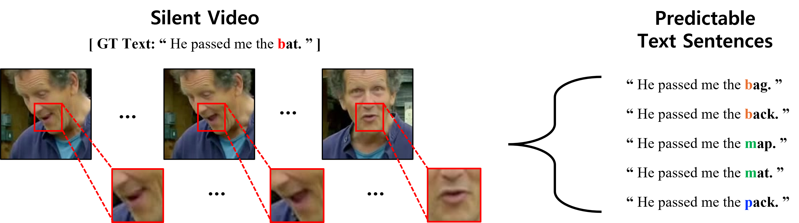
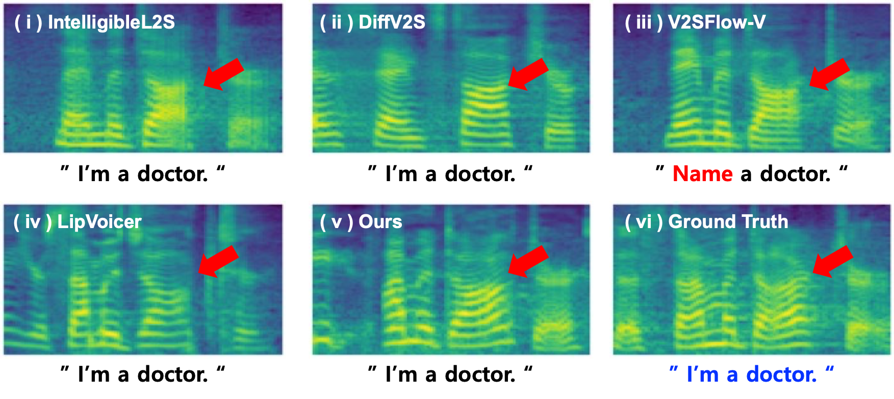
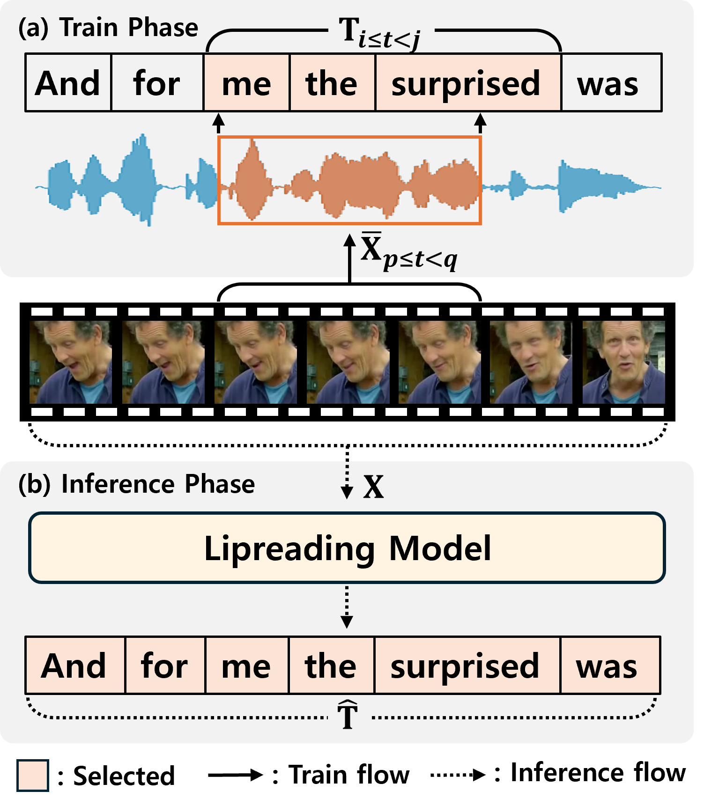
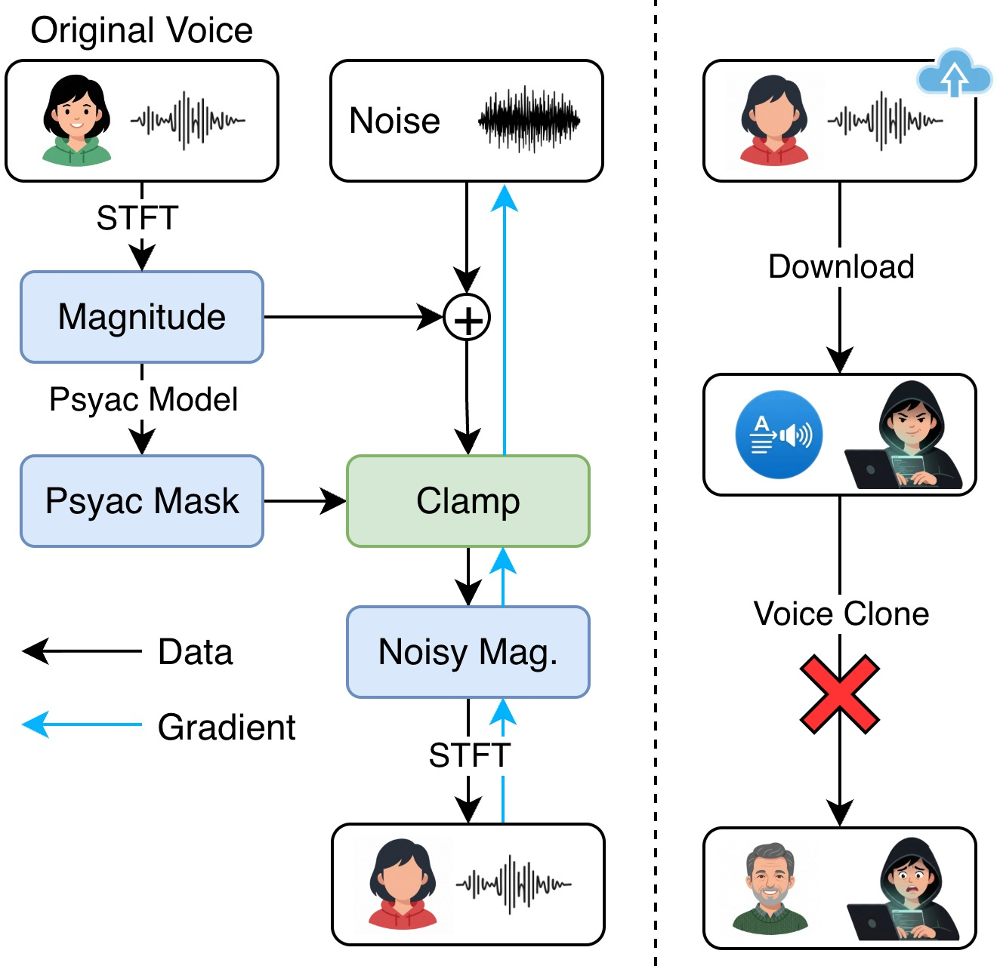
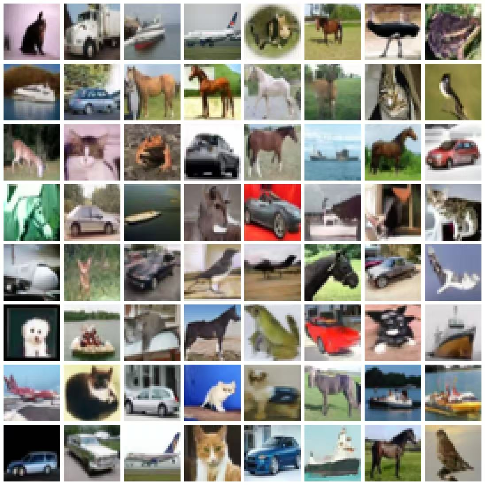
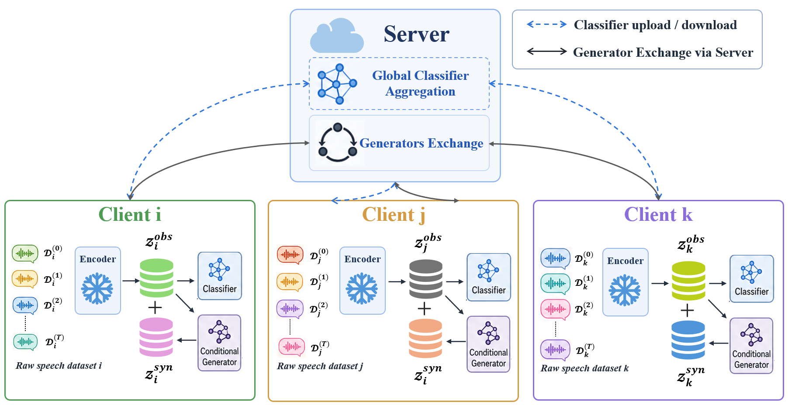
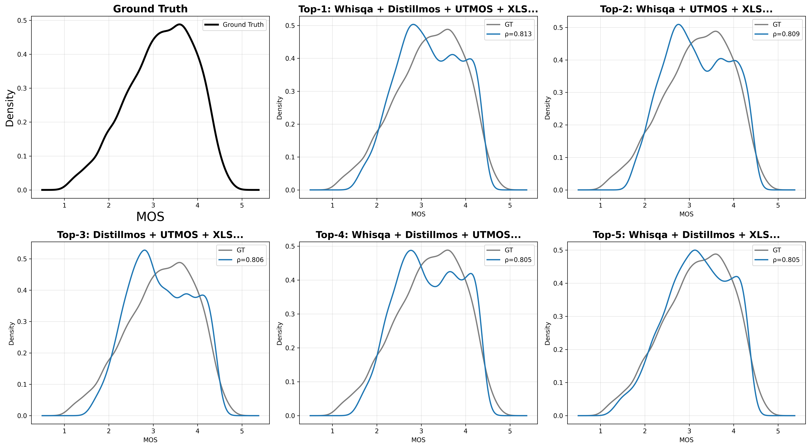
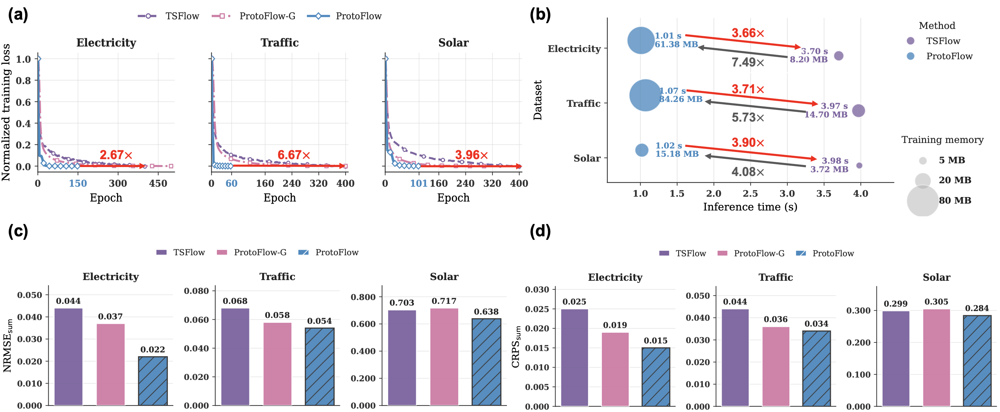
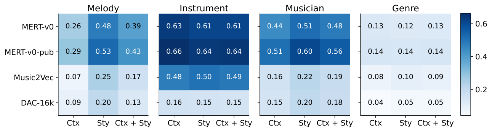

# 🚩 (2026-10-02) Scholar Inbox 추천 논문 

# 📚 Articulatory Source-Filter TTS: Physically Grounded Control through Vocal Tract Kinematics

🚀 URL: https://arxiv.org/html/2610.00735

## 🌏 Abstract (원문)
Modern neural text-to-speech (TTS) systems achieve remarkable acoustic fidelity but operate as opaque black boxes, offering limited interpretable control over the physical speech production process. While some models allow prosodic manipulation, explicit control over the vocal tract filter remains largely inaccessible. In this paper, we propose a novel, controllable source-filter TTS architecture that grounds the synthesis process in physical articulatory kinematics. Our approach utilises an Acoustic-to-Articulatory Inversion (AAI) model, enhanced by large-scale pretrained representations, to generate kinematic pseudo-trajectories for a large TTS corpus. These trajectories explicitly condition the filter response, while predicted pitch and energy contours parameterise the glottal source. The source and filter are predicted independently, and the source is refined by an Optimal Transport Conditional Flow Matching (OT-CFM) module before recombination with the filter to form the final spectrogram. Experimental results demonstrate that our model achieves intelligibility and naturalness competitive with similarly sized baselines, incurring only a modest spectral fidelity cost from constraining the output to an explicit source-filter decomposition, in exchange for control unavailable to black-box systems. Furthermore, quantitative and qualitative evaluations reveal explicit source-filter disentanglement, allowing for stable prosodic scaling and cross-speaker source/filter recombination. In this recombination, prosodic source attributes, notably F0, remain tied to the source speaker while vocal-tract spectral characteristics consistently follow the filter speaker. Finally, we demonstrate that the model enables explicit, fine-grained articulatory control, such as accent modification through direct spatial manipulation of articulatory trajectories, offering a new direction for interpretable speech synthesis. Audio samples are available athttps://coding-phoenix-12.github.io/ArticulatorySFTTS/.
## 🌏 Abstract (번역)
현대 신경망 텍스트-음성 변환(TTS) 시스템은 놀라운 음향 충실도를 달성하지만, 불투명한 블랙박스로 작동하여 물리적인 음성 생성 과정에 대한 해석 가능한 제어가 제한적입니다. 일부 모델은 운율 조작을 허용하지만, 성도 필터에 대한 명시적인 제어는 여전히 대부분 접근하기 어렵습니다. 본 논문에서는 음성 합성 과정을 물리적 조음 운동학에 기반을 둔 새롭고 제어 가능한 소스-필터 TTS 아키텍처를 제안합니다. 우리의 접근 방식은 대규모 사전 학습된 표현으로 강화된 음향-조음 역변환(AAI) 모델을 활용하여 대규모 TTS 코퍼스에 대한 운동학적 의사 궤적을 생성합니다. 이 궤적들은 필터 응답을 명시적으로 조건화하며, 예측된 피치 및 에너지 윤곽은 성문 소스를 매개변수화합니다. 소스와 필터는 독립적으로 예측되며, 소스는 최적 수송 조건부 흐름 매칭(OT-CFM) 모듈에 의해 개선된 후 필터와 재결합하여 최종 스펙트로그램을 형성합니다. 실험 결과는 우리 모델이 유사한 크기의 기준선과 경쟁할 만한 명료도와 자연스러움을 달성하며, 블랙박스 시스템에서는 불가능한 제어 기능을 얻는 대가로 명시적인 소스-필터 분해로 출력을 제한함으로써 단지 미미한 스펙트럼 충실도 손실만 발생함을 보여줍니다. 또한, 정량적 및 정성적 평가는 명시적인 소스-필터 분리를 밝혀내어 안정적인 운율 스케일링 및 화자 간 소스/필터 재결합을 가능하게 합니다. 이 재결합에서 운율적 소스 속성, 특히 F0는 소스 화자에 묶여 있는 반면, 성도 스펙트럼 특성은 일관되게 필터 화자를 따릅니다. 마지막으로, 우리는 이 모델이 조음 궤적의 직접적인 공간 조작을 통한 억양 변경과 같은 명시적이고 세밀한 조음 제어를 가능하게 하여 해석 가능한 음성 합성의 새로운 방향을 제시함을 입증합니다. 오디오 샘플은 https://coding-phoenix-12.github.io/ArticulatorySFTTS/에서 확인할 수 있습니다.

## 🔍 Methods & Results
- 본 연구는 두 단계로 구성됩니다: 첫째, 음향-조음 역변환(AAI) 모델은 EMA-음성 데이터로 훈련되어 음향을 성도 조음기관의 물리적 운동학으로 매핑합니다. 둘째, 이 모델은 대규모 TTS 코퍼스에 대한 조음 의사 궤적을 생성하며, 이는 소스-필터 명시적 제어 TTS 모델 훈련을 위한 정답으로 사용됩니다.
- AAI 모델은 Transformer 기반 아키텍처를 채택하며, 대규모 사전 학습된 MMS-1B 모델(레이어 6, 24, 36)의 표현을 활용하여 AAI 성능을 크게 향상시킵니다. 이 모델은 MSE 및 Pearson 상관 계수(PCC) 손실을 사용하여 최적화됩니다.
- 핵심 TTS 아키텍처는 FastPitchFormant 프레임워크를 기반으로 하며, 발화당 전역 화자 벡터를 추출하여 모든 블록에 주입하여 일관된 화자 정체성을 제공합니다.
- 음소 인코더는 언어적 은닉 표현을 예측하며, 이는 조음 임베딩 예측기(AEP), 소스 임베딩 예측기(SEP), 평균 스펙트로그램 투영(ASP)의 세 가지 독립적인 스트림으로 투영됩니다. 길이 불일치는 단조 정렬 검색(MAS) 및 지속 시간 예측기를 통해 해결됩니다.
- 피치 및 에너지 예측기(PEP)는 기본 주파수(F0) 및 에너지 윤곽을 추정하여 성문 소스를 직접 제어 가능한 신호로 노출하며, MSE 및 PCC 목표로 감독됩니다.
- 조음 궤적 예측기(ATP)는 AAI 모델에서 파생된 의사 조음 목표에 대해 예측된 운동학적 시퀀스를 감독하며, MSE 및 PCC 손실을 사용합니다.
- 명시적인 소스-필터 분리는 로그-멜 스펙트로그램 생성 단계에서 달성됩니다. 소스 로그-멜 예측기(SLP)는 정답 피치 및 에너지를 사용하여 성문 여기 로그-멜 스펙트로그램을 예측하고, 필터 로그-멜 예측기(FLP)는 AAI 생성 의사 조음 궤적을 사용하여 성도 필터 스펙트로그램을 예측합니다.
- 최종 합성된 오디오 로그-멜 스펙트로그램은 소스 및 필터 구성 요소의 직접적인 합으로 계산되며, MSE 손실로 최적화됩니다.
- 성문 여기의 스펙트럼 해상도 및 시간적 동역학을 더욱 개선하기 위해 최적 수송 조건부 흐름 매칭(OT-CFM) 모듈이 통합되어 소스 여기의 생성적 개선을 학습합니다.
- 전체 제어 가능한 TTS 아키텍처는 모든 개별 구성 요소 페널티의 직접적인 합으로 구성된 최종 다중 작업 훈련 목표를 사용하여 종단 간 최적화됩니다.
- 추론 시, 모델은 예측 모드로 작동하며, 예측된 지속 시간, 피치/에너지, 조음 운동학을 사용하여 소스 및 필터 구성 요소를 생성하고, OT-CFM 모듈로 소스를 정제한 후 결합하여 최종 스펙트로그램을 생성합니다.
- 실험 결과, 제안된 모델은 유사한 크기의 기준선과 경쟁할 만한 명료도와 자연스러움을 달성하며, 명시적인 소스-필터 분리를 통해 안정적인 운율 스케일링 및 화자 간 소스/필터 재결합을 가능하게 합니다. 특히, F0는 소스 화자를 따르고 성도 스펙트럼 특성은 필터 화자를 따릅니다.
- 또한, 모델은 조음 궤적의 직접적인 공간 조작을 통한 억양 변경과 같은 명시적이고 세밀한 조음 제어를 가능하게 하여 해석 가능한 음성 합성의 새로운 방향을 제시합니다.

## 🖼 Figures

*Fig. 1:Overview of the proposed controllable source-filter TTS architecture. Solid lines denote data flow active during both training and inference. Green dashed lines indicate paths exclusive to the training phase (e.g., MAS alignment, AAI pseudo-target supervision), while red dashed lines represent the inference-only generative paths. Optimisation pathways for the multi-task objective are highlighted in yellow.*

---
**Usage Info**: 8310 tokens used.
**Generated at**: 2026-10-02 18:56:02

---

# 📚 Multi-sample Synthetic Supervision for Accent Conversion

🚀 URL: https://arxiv.org/html/2610.01961

## 🌏 Abstract (원문)
Accent conversion (AC) requires changing accent while preserving speaker identity and linguistic content, yet parallel recordings are scarce. Speech synthesis provides an alternative source of supervision, but generated targets vary in accent realization and source preservation. We propose a multi-sample synthetic supervision framework that constructs conversion targets by jointly assessing these properties across candidate waveforms for each source–accent condition. Selected candidates provide associated discrete speech codes, representing linguistic content, prosody, and speaking style, as targets for accent-conditioned autoregressive adaptation. Compared with using one generated target per training example, our method improves target-accent classification accuracy by 2.49 percentage points, while speaker similarity remains nearly unchanged, and word error rate increases by 0.29 percentage points. Across six target accents, our method achieves 7.81% WER and the highest mean listening ratings among evaluated systems.
## 🌏 Abstract (번역)
악센트 변환(AC)은 화자 정체성과 언어적 내용을 보존하면서 악센트를 변경해야 하지만, 병렬 녹음 데이터는 부족합니다. 음성 합성은 대안적인 감독 소스를 제공하지만, 생성된 목표 음성은 악센트 구현 및 원본 보존 측면에서 다양합니다. 우리는 각 원본-악센트 조건에 대해 후보 파형 전반에 걸쳐 이러한 속성들을 공동으로 평가하여 변환 목표를 구성하는 다중 샘플 합성 감독 프레임워크를 제안합니다. 선택된 후보들은 언어적 내용, 운율, 말하기 스타일을 나타내는 관련 이산 음성 코드를 악센트 조건부 자기회귀 적응을 위한 목표로 제공합니다. 훈련 예제당 하나의 생성된 목표를 사용하는 것과 비교하여, 우리 방법은 목표 악센트 분류 정확도를 2.49% 포인트 향상시켰고, 화자 유사성은 거의 변하지 않았으며, 단어 오류율은 0.29% 포인트 증가했습니다. 6가지 목표 악센트 전반에 걸쳐 우리 방법은 7.81%의 WER을 달성했으며 평가된 시스템 중 가장 높은 평균 청취 평가를 받았습니다.

## 🔍 Methods & Results
- 병렬 녹음 데이터 부족 문제를 해결하기 위해 다중 샘플 합성 감독 프레임워크를 제안하여 악센트 변환(AC)의 목표를 구성합니다.
- 악센트 조건부 후보 생성기(Gϕ)는 두 단계로 구성됩니다: 먼저, Vevo2 모델을 사용하여 토큰 수준 훈련 목표를 생성하고, 다음으로 이 토큰 목표를 사용하여 Gϕ를 훈련하여 원본 스크립트와 목표 악센트 레이블로부터 직접 내용-스타일 토큰을 생성합니다.
- Gϕ는 학습 가능한 악센트 임베딩과 공유 LoRA 모듈을 사용하여 쿼리, 키, 값, 출력 투영을 적응시키며, 악센트 임베딩을 먼저 최적화한 후 LoRA 파라미터와 함께 자기회귀 토큰 교차 엔트로피를 사용하여 공동으로 최적화합니다.
- 고정된 Gϕ는 주어진 원본-악센트 조건에 대해 여러 내용-스타일 토큰 시퀀스(zi)를 샘플링하고, Flow Matching 및 Vocos를 사용하여 해당 후보 파형(x~i)을 합성합니다.
- 각 후보 파형(x~i)은 목표 악센트 구현, 내용 보존, 화자 보존 및 지속 시간 일관성을 기준으로 평가되며, 실현 가능한 후보 중 가장 높은 순위의 파형-토큰 쌍이 최종 모델 훈련을 위한 의사 목표(z*)로 선택됩니다.
- 최종 변환기(pθ)는 Gϕ와 동일한 자기회귀 아키텍처를 사용하며, Gϕ에서 파생된 시드별 웜 스타트로 초기화된 후 선택된 토큰 목표(z*)를 사용하여 추가로 적응됩니다.
- pθ 훈련 중에는 악센트 임베딩과 공유 LoRA 파라미터만 최적화되며, 인과 토큰 음의 로그 우도 손실 함수가 사용되고 추가적인 악센트, 내용, 화자 또는 선호도 손실은 사용되지 않습니다.
- 추론 시, 훈련된 pθ는 원본 스크립트와 목표 악센트 레이블로부터 단일 내용-스타일 토큰 시퀀스를 생성하고, 원본 파형은 음향 합성 단계에서 음색 참조로 사용되어 변환된 파형을 생성합니다.
- 단일 생성 목표를 사용하는 것과 비교하여, 제안된 방법은 목표 악센트 분류 정확도를 2.49% 포인트 향상시켰고, 화자 유사성은 거의 변하지 않았으며, 단어 오류율(WER)은 0.29% 포인트 증가했습니다.
- 6가지 목표 악센트 전반에 걸쳐 7.81%의 WER을 달성했으며, 평가된 시스템 중 가장 높은 평균 청취 평가를 받았습니다.

## 🖼 Figures
![Figure 1: Overview of multi-sample synthetic supervision and accent conversion. A reference-conditioned generation stage first provides token targets for adapting the categorical candidate generator 
𝐺
𝜙
. The fixed 
𝐺
𝜙
 then samples 
𝑁
 token sequences from the source transcript 
𝑡
 and target-accent label 
𝑎
, while frozen acoustic synthesis uses the source waveform 
𝑥
 to produce the paired candidate waveforms. Waveform-level accent and preservation assessment selects a candidate whose paired token sequence 
𝑧
∗
 supervises the final converter 
𝑝
𝜃
. At inference, 
𝑝
𝜃
 generates one token sequence from 
(
𝑡
,
𝑎
)
 and frozen synthesis combines it with 
𝑥
, without target-accent reference speech or candidate selection.](../images/2026-10-02/2610.01961/2610.01961_fig0.png)
*Figure 1: Overview of multi-sample synthetic supervision and accent conversion. A reference-conditioned generation stage first provides token targets for adapting the categorical candidate generator 
𝐺
𝜙
. The fixed 
𝐺
𝜙
 then samples 
𝑁
 token sequences from the source transcript 
𝑡
 and target-accent label 
𝑎
, while frozen acoustic synthesis uses the source waveform 
𝑥
 to produce the paired candidate waveforms. Waveform-level accent and preservation assessment selects a candidate whose paired token sequence 
𝑧
∗
 supervises the final converter 
𝑝
𝜃
. At inference, 
𝑝
𝜃
 generates one token sequence from 
(
𝑡
,
𝑎
)
 and frozen synthesis combines it with 
𝑥
, without target-accent reference speech or candidate selection.*

---
**Usage Info**: 3787 tokens used.
**Generated at**: 2026-10-02 18:56:11

---

# 📚 Watch Your Speech: Text-aware Video-to-Speech Synthesis with Textual Conditioning

🚀 URL: https://arxiv.org/html/2610.01012

## 🌏 Abstract (원문)
Video-to-speech synthesis aims to generate natural-sounding speech from silent talking-face videos while ensuring phonetic accuracy. A fundamental challenge in this task is the inherent one-to-many mapping problem, where visual dynamics often lack sufficient information to uniquely determine the corresponding utterance. To address this, we proposeWatch Your Speech(WYS), a video-to-speech synthesis framework that incorporates textual conditioning as an explicit linguistic cue to mitigate visual ambiguity.Our framework features an attention-based embedding fusion module that synergistically integrates textual context with video sequences, coupled with a conditional flow matching objective for high-fidelity speech generation. Extensive experiments on the LRS2 and LRS3 datasets demonstrate that WYS achieves superior performance, establishing new state-of-the-art results in audio-visual synchronization (LSE-C/D) while maintaining highly competitive textual accuracy (WER). Subjective evaluations further confirm that our model generates speech with near-human naturalness, validating the effectiveness of textual conditioning in content-controlled video-to-speech synthesis.Project page:https://github.com/gunwoo5034/Watch-your-Speech
## 🌏 Abstract (번역)
비디오-음성 합성(Video-to-speech synthesis)은 무음의 말하는 얼굴 비디오로부터 자연스러운 음성을 생성하는 동시에 음성학적 정확성을 보장하는 것을 목표로 합니다. 이 작업의 근본적인 과제는 시각적 역동성이 해당 발화를 고유하게 결정하기에 충분한 정보가 부족한 내재적인 일대다 매핑 문제입니다. 이를 해결하기 위해 우리는 시각적 모호성을 완화하기 위한 명시적인 언어적 단서로 텍스트 조건을 통합하는 비디오-음성 합성 프레임워크인 Watch Your Speech(WYS)를 제안합니다. 우리 프레임워크는 텍스트 컨텍스트를 비디오 시퀀스와 시너지 효과를 내며 통합하는 주의 기반 임베딩 융합 모듈과 고음질 음성 생성을 위한 조건부 플로우 매칭 목표를 특징으로 합니다. LRS2 및 LRS3 데이터셋에 대한 광범위한 실험은 WYS가 우수한 성능을 달성하여 오디오-시각 동기화(LSE-C/D)에서 새로운 최첨단 결과를 확립하는 동시에 매우 경쟁력 있는 텍스트 정확도(WER)를 유지함을 보여줍니다. 주관적 평가는 우리 모델이 거의 인간과 같은 자연스러움으로 음성을 생성함을 추가로 확인하여, 콘텐츠 제어 비디오-음성 합성에서 텍스트 조건화의 효과를 입증합니다.

## 🔍 Methods & Results
- WYS(Watch Your Speech)는 비디오-음성 합성(V2S)에서 시각적 모호성으로 인한 일대다 매핑 문제를 해결하기 위해 텍스트 조건화와 임베딩 융합 모듈을 활용하여 고음질 멜-스펙트로그램을 생성하는 프레임워크를 제안한다.
- 프레임워크는 립리딩 모듈(텍스트 조건화), 특징 추출 모듈(다중 모달 표현), 주의 기반 임베딩 융합 모듈(교차 모달 정렬), 플로우 매칭 기반 음성 합성 모듈의 네 가지 핵심 구성 요소로 이루어져 있다.
- 텍스트 조건화는 학습 시에는 GT(Ground Truth) 텍스트를 사용하고, 추론 시에는 사전 학습된 립리딩 모델(G)을 사용하여 무음 비디오에서 텍스트를 추정한다. 텍스트 인코더는 BERT 백본과 LoRA(Low-Rank Adaptation)를 사용하여 텍스트 임베딩(e_txt)을 생성한다.
- 특징 추출을 위해 이미지 인코더(ResNet18)는 참조 얼굴 프레임에서 화자 신원 임베딩(e_img)을 추출하고, 비디오 인코더(3D CNN, ShuffleNet, TCN 기반)는 입술 영역 시퀀스에서 시공간 특징(e_vid)을 추출한다.
- 주의 기반 융합 모듈은 비디오-텍스트 정렬 모듈과 화자 신원 주입 모듈로 구성된다. 비디오-텍스트 정렬 모듈은 이중 단계 주의 메커니즘(셀프-어텐션 및 교차-어텐션)을 통해 비디오 역동성(e_vid)과 텍스트 컨텍스트(e_txt)를 통합하여 동기화된 임베딩(e_syn)을 생성한다.
- 화자 신원 주입 모듈은 화자 신원 임베딩(e_img)을 시간적으로 확장하여 동기화된 임베딩(e_syn)과 연결하여 최종 융합 임베딩(e_fus)을 생성한다.
- 음성 합성을 위해 조건부 플로우 매칭(CFM) 프레임워크를 사용하며, DiffWave를 백본으로 하여 속도 필드를 추정한다. Classifier-Free Guidance(CFG)를 통합하여 텍스트 및 시각적 제약에 대한 모델의 준수도를 높인다.
- 생성된 멜-스펙트로그램은 사전 학습된 HiFi-GAN 보코더를 사용하여 음성 파형으로 변환된다.
- LRS2 및 LRS3 데이터셋에 대한 실험 결과, WYS는 오디오-시각 동기화(LSE-C/D)에서 최첨단 성능을 달성하고, 텍스트 정확도(WER)에서 경쟁력 있는 결과를 보였다. 주관적 평가에서도 거의 인간과 같은 자연스러운 음성을 생성함을 확인했다.

## 🖼 Figures

*Figure 1:The one-to-many mapping problem: visually similar lip movements for bilabial phonemes (/b/, /m/, /p/) lead to ambiguous speech predictions.*

*Figure 2:Overview of the proposed WYS framework: (a) training front-end using GT text 
𝐓
, (b) inference front-end predicting text 
𝐓
^
 via a lip-reading model, and (c) shared back-end that encodes and fuses text, video, and speaker identity features to guide flow-based speech synthesis.*

*Figure 3:Details of the back-end components: (a) Text Encoder, (b) Image Encoder for speaker identity, (c) Video Encoder for lip movements, (d) embedding fusion module that aligns video and text features via attention and injects speaker identity to produce 
𝐞
fus
, and (e) legend.*

*Figure 4:Qualitative comparison of mel-spectrograms on LRS2. The text below each spectrogram is predicted by an ASR model, where GT text is shown in blue and incorrectly predicted words are highlighted in red.*

*Figure S1:Illustration of video–text synchronization using word-level timestamps. During training, text segments aligned with the video frames are selected with a small temporal margin. During inference, the full transcript is used as input.*

*Figure S2:Qualitative comparison of mel spectrograms for LRS2 dataset. The scripts below each mel spectrogram represent the ASR-predicted text in black, while the ground-truth (GT) text is shown beneath the GT mel spectrogram in blue. Incorrectly predicted words are highlighted in red.*

*Figure S3:Qualitative comparison of mel spectrograms for LRS3 dataset. The scripts below each mel spectrogram represent the ASR-predicted text in black, while the ground-truth (GT) text is shown beneath the GT mel spectrogram in blue. Incorrectly predicted words are highlighted in red.*

*Figure S4:Failure cases in mel spectrogram generation with incorrect text predictions on (a) LRS2 and (b) LRS3. The scripts below each mel spectrogram represent the ASR-predicted text in black, while the ground-truth (GT) text is shown beneath the GT mel spectrogram in blue. Incorrectly predicted words are highlighted in red.*

*Figure S5:Qualitative comparison of mel spectrograms based on different embedding combinations in the attention mechanism for the LRS2 Dataset. The scripts below each mel spectrogram represent the ASR-predicted text in black, while the ground-truth (GT) text is shown beneath the GT mel spectrogram in blue. Incorrectly predicted words are highlighted in red.*

*Figure S5:Qualitative comparison of mel spectrograms based on different embedding combinations in the attention mechanism for the LRS2 Dataset. The scripts below each mel spectrogram represent the ASR-predicted text in black, while the ground-truth (GT) text is shown beneath the GT mel spectrogram in blue. Incorrectly predicted words are highlighted in red.*

*Figure S6:Mel spectrogram comparison on LRS2 using different guiding texts during inference: (i) Lipreading Text, (ii) Ground-Truth Text. The scripts below each mel spectrogram represent the ASR-predicted text in black, while the ground-truth (GT) text is shown beneath the GT mel spectrogram in blue. Incorrectly predicted words are highlighted in red.*

*Figure S7:Mel spectrogram comparison on LRS2 with different values of the guidance scaling factor 
𝜔
. The scripts below each mel spectrogram represent the ASR-predicted text in black, while the ground-truth (GT) text is shown beneath the GT mel spectrogram in blue. Incorrectly predicted words are highlighted in red.*

*Figure S8:Mel spectrogram comparison on LRS2 using different sampling steps: (i) 10 steps, (ii) 100 steps, (iii) 1000 steps, and (iv) Ground-Truth. The scripts below each mel spectrogram represent the ASR-predicted text in black, while the ground-truth (GT) text is shown beneath the GT mel spectrogram in blue.*

![Figure S9:MOS evaluations. Participants evaluated samples from IntelligibleL2S [Choi et al.(2023b)Choi, Kim, and Ro], DiffV2S [Choi et al.(2023a)Choi, Hong, and Ro], LipVoicer [Yemini et al.(2024)Yemini, Shamsian, Bracha, Gannot, and Fetaya], V2SFlow-V [Choi et al.(2025a)Choi, Kim, Li, Chung, and Liu], WYS (Ours), and the ground-truth based on five criteria, with randomized sample.](../images/2026-10-02/2610.01012/2610.01012_fig13.png)
*Figure S9:MOS evaluations. Participants evaluated samples from IntelligibleL2S [Choi et al.(2023b)Choi, Kim, and Ro], DiffV2S [Choi et al.(2023a)Choi, Hong, and Ro], LipVoicer [Yemini et al.(2024)Yemini, Shamsian, Bracha, Gannot, and Fetaya], V2SFlow-V [Choi et al.(2025a)Choi, Kim, Li, Chung, and Liu], WYS (Ours), and the ground-truth based on five criteria, with randomized sample.*

---
**Usage Info**: 5318 tokens used.
**Generated at**: 2026-10-02 18:56:25

---

# 📚 Balalaika-Longform: A Russian Speech Corpusfor Continuous Long-Form Text-to-Speech

🚀 URL: https://arxiv.org/html/2610.00658

## 🌏 Abstract (원문)
Long-form text-to-speech must retain requested words over extended generations, yet sentence-level training and evaluation can hide omissions and early stops. We introduce Balalaika-Longform, an open Russian corpus of 189 hours in continuous units of 30 seconds to 15 minutes. Long units and matched short windows support fine-tuning comparisons on the same source recordings, and the accompanying evaluation retains every synthesis attempt. We fine-tune CosyVoice3, Qwen3-TTS, VoxCPM2 and F5-TTS on either view and test continuous synthesis on 50 text–voice pairs with voices unseen in fine-tuning, at about 75, 300 and 1,200 words. At 1,200 words, CosyVoice3 WER falls from 99.9% after short-window fine-tuning to 47.3% with long targets, and to 16.6% with punctuated, format-matched transcripts; paired intervals favor long targets for Qwen3-TTS and VoxCPM2, and by a small margin for F5-TTS, whose absolute WER stays above 90%. The results isolate the effect of training sequence length under a fixed continuous-generation protocol.
## 🌏 Abstract (번역)
장문 텍스트 음성 변환(TTS)은 확장된 생성 과정에서 요청된 단어를 유지해야 하지만, 문장 수준의 훈련 및 평가는 누락과 조기 중단을 숨길 수 있습니다. 우리는 30초에서 15분까지의 연속적인 단위로 구성된 189시간 분량의 공개 러시아어 코퍼스인 Balalaika-Longform을 소개합니다. 긴 단위와 일치하는 짧은 창은 동일한 원본 녹음에서 미세 조정 비교를 지원하며, 함께 제공되는 평가는 모든 합성 시도를 보존합니다. 우리는 CosyVoice3, Qwen3-TTS, VoxCPM2 및 F5-TTS를 두 가지 관점(긴 단위 또는 짧은 창)으로 미세 조정하고, 미세 조정에서 사용되지 않은 음성을 포함하는 50개의 텍스트-음성 쌍에 대해 약 75, 300, 1,200 단어 길이로 연속 합성을 테스트합니다. 1,200 단어에서 CosyVoice3의 WER(단어 오류율)은 짧은 창 미세 조정 후 99.9%에서 긴 목표를 사용했을 때 47.3%로, 그리고 구두점과 형식이 일치하는 전사본을 사용했을 때 16.6%로 감소했습니다. 쌍을 이룬 구간은 Qwen3-TTS와 VoxCPM2의 경우 긴 목표에 유리했으며, F5-TTS의 경우 작은 차이로 긴 목표에 유리했지만, F5-TTS의 절대 WER은 90% 이상을 유지했습니다. 이 결과는 고정된 연속 생성 프로토콜 하에서 훈련 시퀀스 길이의 효과를 분리하여 보여줍니다.

## 🔍 Methods & Results
- Balalaika-Longform v3.1은 30초에서 15분 길이의 6,380개 단일 화자 러시아어 세그먼트(총 189.13시간)로 구성된 공개 코퍼스이며, YouTube 영상에서 수집되었고 문맥 인식 분할, 다중 ASR ROVER 전사 및 음성 향상 처리를 거쳤다.
- 훈련 데이터는 동일한 원본 녹음을 기반으로 하는 6,043개의 긴 단위 또는 이를 타일링한 28,532개의 짧은 창(최대 30초) 두 가지 형태로 제공된다.
- CosyVoice3, Qwen3-TTS, VoxCPM2, F5-TTS 모델을 미세 조정했으며, CosyVoice3는 짧은 창(Short-SFT), 긴 단위(Long-SFT), 구두점 포함 긴 단위(Long-SFT-Punct)의 세 가지 방식으로, 다른 모델들은 짧은 창과 구두점 포함 긴 단위 방식으로 훈련되었다.
- 평가는 외부 분할이나 상태 재설정 없이 연속 합성을 수행했으며, 미세 조정에 사용되지 않은 음성을 포함하는 50개의 텍스트-음성 쌍(75, 300, 1,200 단어 길이)과 2개의 미사용 음성 세트를 사용하여 평가했다.
- 1,200 단어 길이에서 CosyVoice3의 WER은 짧은 창 미세 조정 후 99.9%에서 긴 목표를 사용했을 때 47.3%로, 구두점 및 형식 일치 전사본을 사용했을 때 16.6%로 크게 감소했다.
- Qwen3-TTS와 VoxCPM2는 긴 목표에서 더 나은 성능을 보였으며, F5-TTS는 긴 목표에서 약간의 이점을 보였으나 절대 WER은 90% 이상으로 높게 유지되었다.
- 이 연구는 고정된 연속 생성 프로토콜 하에서 훈련 시퀀스 길이의 효과를 명확히 분리하여 보여주었다.

---
**Usage Info**: 5900 tokens used.
**Generated at**: 2026-10-02 18:56:42

---

# 📚 Shared-State Local Translations for Training-Free Voice Conversion

🚀 URL: https://arxiv.org/html/2610.01952

## 🌏 Abstract (원문)
In one-shot training-free voice conversion (VC), the source and reference utterances may contain different linguistic content, so reliable frame-level correspondence between them cannot be assumed. We propose StateVC, which jointly defines a common set of local regions from pooled frame-level WavLM representations of the source and reference utterances; we refer to these regions asstates. These shared states are obtained by fitting a pair-specific Gaussian mixture model to the pooled representations, without explicit source–reference frame matching. Within each state, StateVC estimates a source-to-reference mean shift in the original WavLM space. Source-frame posterior probabilities then combine the state-specific shifts so that different frames can receive different local updates. For the LibriSpeech one-shot protocol, StateVC achieves the lowest word error rate (WER) and character error rate (CER) among the evaluated systems, at 8.01% and 3.22%, respectively, with a speaker similarity (SIM) of 0.9512. It also achieves the highest mean perceived speaker similarity among the evaluated systems and the highest mean naturalness among the evaluated training-free systems.
## 🌏 Abstract (번역)
원샷 학습 없는 음성 변환(VC)에서, 원본 및 참조 발화는 서로 다른 언어적 내용을 포함할 수 있으므로, 이들 간의 신뢰할 수 있는 프레임 수준 대응 관계를 가정할 수 없습니다. 우리는 원본 및 참조 발화의 풀링된 프레임 수준 WavLM 표현에서 공통된 지역 집합을 공동으로 정의하는 StateVC를 제안합니다. 우리는 이 지역들을 '상태'라고 부릅니다. 이 공유 상태들은 명시적인 원본-참조 프레임 매칭 없이 풀링된 표현에 쌍별 가우시안 혼합 모델을 피팅하여 얻어집니다. 각 상태 내에서 StateVC는 원본 WavLM 공간에서 원본-참조 평균 이동을 추정합니다. 그런 다음 원본 프레임 사후 확률이 상태별 이동을 결합하여 다른 프레임이 다른 지역 업데이트를 받을 수 있도록 합니다. LibriSpeech 원샷 프로토콜에서 StateVC는 평가된 시스템 중 가장 낮은 단어 오류율(WER) 8.01%와 문자 오류율(CER) 3.22%를 달성했으며, 화자 유사도(SIM)는 0.9512였습니다. 또한 평가된 시스템 중 가장 높은 평균 인지 화자 유사도와 평가된 학습 없는 시스템 중 가장 높은 평균 자연스러움을 달성했습니다.

## 🔍 Methods & Results
- StateVC는 고정된 WavLM 인코더를 사용하여 원본 및 참조 발화에서 프레임 수준 표현을 추출합니다.
- 명시적인 원본-참조 프레임 매칭 없이, 원본 및 참조 발화의 풀링된 WavLM 표현에 쌍별 가우시안 혼합 모델(GMM)을 피팅하여 공유 '상태'를 공동으로 정의합니다.
- GMM 피팅 시, WavLM 특징 차원 중 시간적 표준 편차가 가장 큰 차원들을 사용하여 차원 축소를 수행하며, 모든 상태 통계 및 변환 이동은 원래의 D-차원 WavLM 공간에서 추정됩니다.
- 단일 GMM을 원본 및 참조 프레임을 연결한 풀링된 표현에 피팅하여 공유 상태를 정의하고, 베이즈 정보 기준(BIC)을 사용하여 모델을 선택합니다.
- 각 프레임에 대해 상태 집합에 대한 사후 확률을 계산하고, 이 라우팅 확률은 시간적 평활화를 통해 프레임 간 변동을 줄입니다.
- 각 상태 내에서 StateVC는 원본 WavLM 공간에서 원본-참조 평균 이동을 추정하며, 상태의 사후 질량이 충분하지 않을 경우 발화 수준 평균 차이를 대체 값으로 사용합니다.
- 원본 프레임은 상태별 이동의 사후 확률 가중 조합(소프트 라우팅)을 통해 업데이트되며, 변환 강도 파라미터(λ)로 제어됩니다.
- 변환된 파형은 고정된 WavLM 조건부 HiFi-GAN 보코더를 사용하여 재구성됩니다.
- LibriSpeech 원샷 프로토콜에서 StateVC는 평가된 시스템 중 가장 낮은 단어 오류율(WER) 8.01%와 문자 오류율(CER) 3.22%를 달성했습니다.
- StateVC는 0.9512의 화자 유사도(SIM)를 기록했습니다.
- StateVC는 평가된 시스템 중 가장 높은 평균 인지 화자 유사도를 달성했습니다.
- StateVC는 평가된 학습 없는 시스템 중 가장 높은 평균 자연스러움을 달성했습니다.

## 🖼 Figures

*Figure 1: Overview of StateVC. Source and reference representations jointly define a common set of shared states through a pair-specific GMM in a compact routing space. Source and reference means within each state define full-dimensional local shifts. Source-frame posterior probabilities combine these shifts before frozen HiFi-GAN synthesis.*

---
**Usage Info**: 3148 tokens used.
**Generated at**: 2026-10-02 18:56:50

---

# 📚 Silence-the-Mimic: Accelerating Imperceptible Perturbation Generation Against Voice Cloning

🚀 URL: https://arxiv.org/html/2610.00662

## 🌏 Abstract (원문)
Deep neural network–based Voice Conversion (VC) and Text-to-Speech (TTS) models have rapidly advanced, enabling realistic voice cloning with minimal input data. Such capabilities raise serious concerns over unauthorized cloning of speaker identities and the associated privacy and security risks. Current imperceptible adversarial protection methods rely on quality control losses that are highly sensitive to hyperparameter tuning and computationally expensive due to lengthy optimization. To address these limitations, we propose a fast protection method that generates perceptually constrained perturbations in the frequency domain under a psychoacoustic masking–based constraint. Our approach strictly enforces perceptibility bounds during adversarial training, eliminating the need for iterative quality balancing and significantly reducing computational cost. Experiments on multiple state-of-the-art VC and TTS models show that STM achieves competitive or superior protection performance with substantially better perceptual quality and up to 45.3× speedup over existing white-box baselines. These results demonstrate the effectiveness of frequency-domain perturbations with perceptual constraints as a practical paradigm for protecting against voice cloning.
## 🌏 Abstract (번역)
심층 신경망 기반의 음성 변환(VC) 및 텍스트 음성 변환(TTS) 모델은 빠르게 발전하여 최소한의 입력 데이터로 사실적인 음성 복제를 가능하게 했습니다. 이러한 기능은 화자 신원의 무단 복제와 관련된 개인 정보 보호 및 보안 위험에 대한 심각한 우려를 제기합니다. 현재의 지각 불가능한 적대적 보호 방법은 하이퍼파라미터 튜닝에 매우 민감하고 긴 최적화로 인해 계산 비용이 많이 드는 품질 제어 손실에 의존합니다. 이러한 한계를 해결하기 위해, 우리는 심리 음향 마스킹 기반 제약 조건 하에 주파수 영역에서 지각적으로 제약된 교란을 생성하는 빠른 보호 방법을 제안합니다. 우리의 접근 방식은 적대적 훈련 중에 지각 가능성 경계를 엄격하게 적용하여 반복적인 품질 균형 조정의 필요성을 없애고 계산 비용을 크게 줄입니다. 여러 최첨단 VC 및 TTS 모델에 대한 실험 결과, STM은 기존 화이트박스 기준선에 비해 훨씬 더 나은 지각 품질과 최대 45.3배 빠른 속도로 경쟁력 있거나 우수한 보호 성능을 달성함을 보여줍니다. 이러한 결과는 음성 복제로부터 보호하기 위한 실용적인 패러다임으로서 지각적 제약이 있는 주파수 영역 교란의 효과를 입증합니다.

## 🔍 Methods & Results
- 제안된 보호 알고리즘인 Silence-the-Mimic (STM)은 주파수 영역에서 심리 음향 기반의 하드 클램핑 전략을 사용하여 지각 왜곡을 엄격하게 제어하며, 이는 교란 과정의 속도를 높입니다.
- 보호 문제는 공격자의 음성 합성 모델(G)에 의해 생성된 딥페이크 오디오로부터 피해자의 음성 신원을 보호하는 것으로, 보호된 음성(x + Δx)으로 복제된 음성이 화자 검증(SV) 모델에 의해 거부되도록 하면서도 교란(Δx)은 지각적으로 눈에 띄지 않게 유지하는 것을 목표로 합니다.
- STM은 원본 음성 오디오를 STFT를 사용하여 주파수 영역 표현(스펙트로그램)으로 변환하고, 주파수 영역에서 교란(Δspec)을 도입한 후 iSTFT를 통해 시간 영역 파형으로 재구성합니다.
- 심리 음향 모델(Psyac)을 사용하여 마스킹 임계값(Y_mask)을 추정하고, 이를 기반으로 가청 및 비가청 시간-주파수 빈에 대한 허용 오차(H_head, H_floor)를 설정하여 지각 가능성 제약을 근사화합니다.
- 각 훈련 반복의 끝에서 스펙트로그램의 과도한 값을 헤드룸 및 플로어룸 허용 오차 내로 하드 클램핑하여 지각 가능성 제약을 엄격하게 적용합니다.
- 화자 검증 모델의 신뢰도 점수를 낮추기 위해 화자 인코더의 출력을 변경하도록 Δspec을 최적화하며, 보호된 출력의 오디오 품질을 높이기 위해 다른 화자의 임베딩과 유사하도록 교란을 유도하는 '타겟 기반' 접근 방식을 채택합니다.
- 교란의 시간적 부드러움을 향상시키고 오디오 품질을 개선하기 위해 다양한 시간 스케일에 걸친 변화를 고려하는 다단계 1차원 총 변동(TV) 손실을 최적화 목표에 통합합니다.
- 최첨단 VC 및 TTS 모델에 대한 실험 결과, STM은 기존 화이트박스 기준선에 비해 훨씬 더 나은 지각 품질과 최대 45.3배 빠른 속도로 경쟁력 있거나 우수한 보호 성능을 달성했습니다.

## 🖼 Figures

*Fig. 1:Pipeline of STM.*

---
**Usage Info**: 4869 tokens used.
**Generated at**: 2026-10-02 18:56:59

---

# 📚 1Introduction

🚀 URL: https://arxiv.org/html/2610.00026

## 🌏 Abstract (원문)
Compact speech models are attractive when sensitive audio should remain local, yet specialization is constrained by scarce redistributable data. Japanese care handoffs are a demanding case: the input is compressed spoken language and the output must separate observations, assessment, actions, and plans. Prior work has studied speech recognition and information extraction for nursing shift changes[9]and synthetic clinical speech for augmentation[5,8]. We ask a narrower question: can a compact audio-native model acquire an end-to-end speech-to-structure capability from a few hundred designed synthetic examples?
Our unit of supervision is not only a waveform–label pair. Each item links a scenario seed, fact requirements, a Japanese spoken realization, rendered audio, a structured target, and quality metadata. Teacher-generated responses can transfer behavior into audio models[2], while concise definitions can seed learning under weak supervision[7,4]. These results motivate investing in the specification and audit trail around each example rather than assuming that parameter scale alone solves a narrow private task.
We compare the same 1.47B backbone unadapted, fully tuned, and adapted with rank-16 LoRA. Our contributions are: (i) a provenance-linked synthetic supervision object; (ii) a same-backbone, seed-disjoint capability-acquisition result with paired uncertainty; and (iii) a descriptive parameter-efficiency result with an explicit boundary around unmeasured device execution. The last point matters for on-device research: reducing trainable parameters can make adaptation more practical, but a local-capable architecture and an export path are not measurements of latency, memory, energy, or reliability.
## 🌏 Abstract (번역)
민감한 오디오가 로컬에 유지되어야 할 때 소형 음성 모델은 매력적이지만, 전문화는 희소한 재배포 가능 데이터에 의해 제약됩니다. 일본의 간병 인계는 까다로운 사례입니다. 입력은 압축된 음성 언어이며, 출력은 관찰, 평가, 행동 및 계획을 분리해야 합니다. 이전 연구에서는 간호 교대 근무를 위한 음성 인식 및 정보 추출[9], 그리고 증강을 위한 합성 임상 음성[5,8]을 연구했습니다. 우리는 더 좁은 질문을 던집니다. 소형 오디오 네이티브 모델이 수백 개의 설계된 합성 예제로부터 종단 간 음성-구조 변환 기능을 습득할 수 있을까요?
우리의 감독 단위는 단순히 파형-레이블 쌍만이 아닙니다. 각 항목은 시나리오 시드, 사실 요구 사항, 일본어 음성 구현, 렌더링된 오디오, 구조화된 목표 및 품질 메타데이터를 연결합니다. 교사가 생성한 응답은 오디오 모델로 동작을 전이할 수 있으며[2], 간결한 정의는 약한 감독 하에서 학습을 시드할 수 있습니다[7,4]. 이러한 결과는 매개변수 규모만으로 좁은 사적 작업을 해결한다고 가정하기보다는 각 예제 주변의 사양 및 감사 추적에 투자하는 것을 동기 부여합니다.
우리는 동일한 1.47B 백본을 미적응 상태, 완전히 튜닝된 상태, 그리고 랭크-16 LoRA로 적응된 상태로 비교합니다. 우리의 기여는 다음과 같습니다: (i) 출처가 연결된 합성 감독 객체; (ii) 동일 백본, 시드 분리된 능력 습득 결과와 쌍을 이루는 불확실성; 그리고 (iii) 측정되지 않은 장치 실행에 대한 명시적인 경계를 가진 기술적 매개변수 효율성 결과입니다. 마지막 요점은 온디바이스 연구에 중요합니다. 훈련 가능한 매개변수를 줄이면 적응이 더 실용적일 수 있지만, 로컬 기능 아키텍처와 내보내기 경로는 지연 시간, 메모리, 에너지 또는 신뢰성의 측정치가 아닙니다.

## 🔍 Methods & Results
- 소형 오디오 네이티브 모델이 수백 개의 설계된 합성 예제로부터 종단 간 음성-구조 변환 기능을 습득할 수 있는지 여부를 탐구했습니다.
- 감독 단위는 시나리오 시드, 사실 요구 사항, 일본어 음성 구현, 렌더링된 오디오, 구조화된 목표 및 품질 메타데이터를 포함하는 다차원 객체로 구성되었습니다.
- 동일한 1.47B 백본 모델을 미적응, 완전 튜닝, 랭크-16 LoRA로 적응된 세 가지 조건에서 비교했습니다.
- 주요 기여는 다음과 같습니다: (i) 출처가 연결된 합성 감독 객체 개발; (ii) 동일 백본 및 시드 분리 조건에서 쌍을 이루는 불확실성을 포함한 능력 습득 결과 제시; (iii) 측정되지 않은 장치 실행에 대한 명시적 경계를 가진 기술적 매개변수 효율성 결과 도출.
- 훈련 가능한 매개변수를 줄이는 것이 온디바이스 적응에 실용적일 수 있음을 시사하지만, 아키텍처 및 내보내기 경로만으로는 지연 시간, 메모리, 에너지 또는 신뢰성을 측정할 수 없음을 강조했습니다.

---
**Usage Info**: 2180 tokens used.
**Generated at**: 2026-10-02 18:57:08

---

# 📚 Teaching LLMs to Hear Who Spoke What:Metadata-Supervised Pretraining for Encoder-Free Speech-LLMs

🚀 URL: https://arxiv.org/html/2610.01695

## 🌏 Abstract (원문)
Encoder-based speech large language models (Speech-LLMs) commonly employ pretrained speech encoders that prioritize linguistic content but may discard fine-grained acoustic cues essential for speaker discrimination and paralinguistic understanding. Encoder-free Speech-LLMs instead map Mel-spectrogram features directly into the LLM input space through lightweight embedding layers, enabling the LLM to learn from low-level acoustic features. However, systematic pretraining strategies for encoder-free Speech-LLMs remain underexplored, limiting their ability to compensate for the absence of large-scale pretrained speech encoders. We propose metadata-supervised pretraining (MSP), which leverages speech attributes such as speaker identity and emotion to develop speaker-discriminative and paralinguistic capabilities. We further introduce speaker-aware utterance composition (SAUC) to strengthen speaker discrimination and apply random span masking to regularize pretraining. We primarily evaluate our approach on joint ASR and speaker diarization in multi-speaker conversations, complemented by experiments on paralinguistic speech-understanding tasks. Under matched training-data conditions, our encoder-free model outperforms its randomly initialized encoder-based counterpart. With limited metadata-annotated data, it is competitive with models using speech encoders pretrained on substantially larger corpora, outperforming them in several settings. These results demonstrate the potential of encoder-free architectures for building native multimodal LLMs that acquire diverse speech capabilities.
## 🌏 Abstract (번역)
인코더 기반 음성 대규모 언어 모델(Speech-LLM)은 일반적으로 언어 콘텐츠를 우선시하지만 화자 식별 및 비언어적 이해에 필수적인 미세한 음향 단서를 버릴 수 있는 사전 훈련된 음성 인코더를 사용합니다. 반면 인코더 없는 Speech-LLM은 멜-스펙트로그램 특징을 경량 임베딩 레이어를 통해 LLM 입력 공간으로 직접 매핑하여 LLM이 저수준 음향 특징으로부터 학습할 수 있도록 합니다. 그러나 인코더 없는 Speech-LLM을 위한 체계적인 사전 훈련 전략은 아직 충분히 탐구되지 않아 대규모 사전 훈련된 음성 인코더의 부재를 보완하는 능력이 제한적입니다. 우리는 화자 식별 및 비언어적 능력을 개발하기 위해 화자 신원 및 감정과 같은 음성 속성을 활용하는 메타데이터 기반 사전 훈련(MSP)을 제안합니다. 또한 화자 식별을 강화하기 위해 화자 인식 발화 구성(SAUC)을 도입하고 사전 훈련을 정규화하기 위해 무작위 스팬 마스킹을 적용합니다. 우리는 주로 다중 화자 대화에서 공동 ASR 및 화자 분리 작업에 대한 접근 방식을 평가했으며, 비언어적 음성 이해 작업에 대한 실험으로 보완했습니다. 동일한 훈련 데이터 조건에서 우리의 인코더 없는 모델은 무작위로 초기화된 인코더 기반 모델보다 우수한 성능을 보였습니다. 제한된 메타데이터 주석 데이터로도 훨씬 더 큰 코퍼스에서 사전 훈련된 음성 인코더를 사용하는 모델과 경쟁하며, 여러 설정에서 이들을 능가했습니다. 이러한 결과는 다양한 음성 능력을 습득하는 네이티브 다중 모달 LLM을 구축하기 위한 인코더 없는 아키텍처의 잠재력을 보여줍니다.

## 🔍 Methods & Results
- 인코더 없는 Mel-LLM 백본을 유지하고 사전 훈련 전략에 중점을 두며, 메타데이터 기반 사전 훈련(MSP)을 먼저 수행한 후 공동 ASR 및 화자 분리, 비언어적 음성 이해를 위해 미세 조정합니다.
- 발화 파형에서 80차원 로그-멜 스펙트로그램을 추출하고 경량 컨볼루션 레이어를 통해 r=8로 다운샘플링한 후, 선형 투영을 통해 LLM 임베딩 공간으로 매핑합니다. 이 과정에서 음성 인코더 블록은 사용되지 않으며, LLM은 LoRA로 고정 및 적응됩니다.
- 인코더를 제거하여 LLM이 저수준 음향 세부 정보를 유지하는 멜 스펙트로그램에 직접 노출되도록 하며, 전사 외에 화자 신원, 감정 등 비언어적 속성을 학습하도록 직접적인 감독을 제공합니다.
- 각 발화에 대해 성별, 감정, 언어, 화자 신원 및 내용(전사)을 포함하는 메타데이터 레코드를 정의하고, 이를 고정된 순서의 JSON 라인으로 직렬화하여 비언어적 속성이 어휘 콘텐츠보다 앞에 오도록 합니다.
- 화자 인식 발화 구성(SAUC)을 제안하여 훈련 배치 내 발화들을 공유 타임라인에 순차적으로 연결하고 단일 오디오 스트림으로 혼합하여 다중 화자, 장문 형태의 훈련 예시를 즉석에서 구성합니다.
- SAUC는 발화 간에 최대 절반 길이의 중첩 또는 최대 2초의 침묵 간격을 무작위로 삽입하여 세그먼트 경계를 모호하게 하며, 서로 다른 화자 간에만 중첩을 허용하고 한 번에 최대 두 명의 화자만 활성화되도록 합니다.
- 메타데이터 기반 사전 훈련을 정규화하기 위해 사전 훈련 중 입력 특징에 스팬 마스킹을 적용합니다. 마스킹된 스팬은 로그-멜 프레임에 매핑되며, 해당 프레임은 채널별 평균과 가우시안 노이즈로 대체됩니다.
- 평가는 다중 화자 대화에서의 공동 ASR 및 화자 분리, 그리고 비언어적 음성 이해 작업에서 이루어졌습니다.
- 동일한 훈련 데이터 조건에서 인코더 없는 모델이 무작위로 초기화된 인코더 기반 모델보다 우수한 성능을 보였으며, 제한된 메타데이터 주석 데이터로도 훨씬 큰 코퍼스에서 사전 훈련된 음성 인코더를 사용하는 모델과 경쟁하여 여러 설정에서 더 나은 성능을 달성했습니다.

## 🖼 Figures

*Figure 1:Proposed Metadata-supervised pretraining (MSP) of the encoder-free Speech-LLM.*

---
**Usage Info**: 2998 tokens used.
**Generated at**: 2026-10-02 18:57:18

---

# 📚 Interpretable Destination-Aware synthesizer Modulation Recovery

🚀 URL: https://arxiv.org/html/2610.00642

## 🌏 Abstract (원문)
Synthesizer programming is a challenging task, particularly in configuring modulation: the time-varying control of parameters such as pitch, filter cutoff, and oscillator level by modulators such as Low-Frequency Oscillators (LFOs). Prior work has shown that modulation can be reconstructed from the clean audio through curve matching, yet the recovered parameters are often untransferable to modern synthesizers. We present an interpretable destination-aware modulation and waveform recovery pipeline that mirrors how musicians often recreate sounds on a synthesizer. First, the system identifies the modulated destinations; then it recovers the LFO shape associated with each destination, and estimates the oscillator waveform to match the source timbre. The training is supported by a differentiable synthesizer that incorporates a noise oscillator, and more modulation options than previous work. We carefully train the models for optimal perceptual quality, with extensive exploration of perceptual losses and adversarial training. Through objective and subjective evaluation, we show that predicting the destinations correctly is essential, our model excels in the modulation focused inverse synthesis tasks, and our Gammatone loss and CQT discriminator significantly outperform the traditionally-used MSS loss in improving perceptual quality. We provide audio samples from the subjective test111https://dolby.box.com/v/dest-aware-MUSHRA.
## 🌏 Abstract (번역)
신시사이저 프로그래밍은 특히 변조(modulation)를 구성하는 데 있어 어려운 작업입니다. 변조는 저주파 발진기(LFO)와 같은 변조기를 통해 피치, 필터 컷오프, 발진기 레벨과 같은 매개변수를 시간적으로 변화시키며 제어하는 것을 의미합니다. 이전 연구에서는 곡선 매칭을 통해 깨끗한 오디오에서 변조를 재구성할 수 있음을 보여주었지만, 복구된 매개변수는 종종 최신 신시사이저로 전송할 수 없습니다. 본 연구에서는 음악가들이 신시사이저에서 소리를 재현하는 방식을 반영하는 해석 가능한 목적지 인식 변조 및 파형 복구 파이프라인을 제시합니다. 먼저, 시스템은 변조된 목적지를 식별한 다음, 각 목적지와 관련된 LFO 모양을 복구하고, 소스 음색과 일치하도록 발진기 파형을 추정합니다. 훈련은 노이즈 발진기와 이전 연구보다 더 많은 변조 옵션을 통합한 미분 가능한 신시사이저를 통해 지원됩니다. 우리는 최적의 지각적 품질을 위해 모델을 신중하게 훈련했으며, 지각적 손실 및 적대적 훈련에 대한 광범위한 탐색을 수행했습니다. 객관적 및 주관적 평가를 통해, 목적지를 올바르게 예측하는 것이 필수적이며, 우리 모델이 변조 중심의 역합성 작업에서 탁월하며, 우리의 감마톤 손실(Gammatone loss)과 CQT 판별자(CQT discriminator)가 지각적 품질을 향상시키는 데 전통적으로 사용되는 MSS 손실보다 훨씬 우수함을 보여줍니다. 우리는 주관적 테스트111https://dolby.box.com/v/dest-aware-MUSHRA에서 얻은 오디오 샘플을 제공합니다.

## 🔍 Methods & Results
- 미분 가능한 감산형 신시사이저 아키텍처를 사용하여 오디오 출력에서 모든 구성 요소로 그래디언트 흐름을 지원하며, 오실레이터/노이즈 소스, 필터, 엔벨로프, 데시메이션, RMS 정규화를 포함하는 신호 경로를 가집니다.
- 변조는 오실레이터 레벨, 오실레이터 피치, 노이즈 레벨, 고역 통과 필터 컷오프, 저역 통과 필터 컷오프의 5가지 목적지로 라우팅됩니다.
- 1단계: 목적지 분류는 입력 오디오 신호에서 활성 변조 목적지를 식별하는 다중 레이블 분류 모델(AST 스타일 분류기 기반)을 사용하며, 이 모델은 이진 교차 엔트로피 손실로 독립적으로 훈련됩니다.
- 2단계: 목적지 조건부 LFO 회귀는 SpectralCNN2D 아키텍처를 사용하여 각 목적지에 대한 LFO 모양을 복구하며, 대상 목적지 임베딩과 f0 컨디셔닝을 입력 스펙트로그램에 통합하고 MSE 손실로 훈련됩니다.
- 3단계: 파형 모델링은 기본 오실레이터 파형을 모델링하여 음색 특성을 포착하며, LFO 복구 모델과 동일한 아키텍처를 사용하지만 컨디셔닝은 없으며, 위상 불변 손실(FFT 크기 간 MSE)을 통합합니다.
- 피치 변조의 복잡성(파형 스트레칭/압축, LFO 곡선의 수직 오프셋)은 CREPE에서 파생된 f0에 LFO 곡선의 평균을 정렬하고 파형 모델 크기를 늘려 해결했습니다.
- 지각적 품질 향상을 위해 다중 스케일 스펙트럼(MSS) 손실 대신 하모닉 손실, 다중 스케일 멜-스펙트로그램 손실, 감마톤 손실 및 적대적 훈련을 탐색했습니다.
- 감마톤 손실은 ERB 간격 감마톤 필터뱅크(64개 FIR 필터) 도메인에서 재구성 오류를 계산하며, 선형 및 로그 도메인 L1 항을 결합합니다.
- 적대적 훈련을 위해 Multi-Period Discriminator (MPD), Multi-Scale Discriminator (MSD), Multi-Resolution Discriminator (MRD) 및 음악 신호에 더 적합한 로그 스케일 시간-주파수 표현에서 작동하는 Constant-Q Transform (CQT) 판별자를 평가했습니다.
- 객관적 및 주관적 평가 결과, 목적지를 올바르게 예측하는 것이 필수적이며, 모델이 변조 중심 역합성 작업에서 우수하고, 감마톤 손실과 CQT 판별자가 지각적 품질 향상에 있어 기존 MSS 손실보다 훨씬 뛰어남을 입증했습니다.

## 🖼 Figures

*Figure 1:An interpretable inverse synthesis system featuring three major modules, which are connected by the differentiable synthesizer and trained with advanced techniques. Dotted lines indicate conditioning.*

*Figure 2:MUSHRA results. Gray boxes refer to the anchors, and the hidden reference are all located at 100, except for one outlier that is above 90.*

---
**Usage Info**: 4153 tokens used.
**Generated at**: 2026-10-02 18:57:28

---

# 📚 VTV-FM: Flow Matching through Variational Terminal-Velocity Closure

🚀 URL: https://arxiv.org/html/2610.00785

## 🌏 Abstract (원문)
Flow matching (FM) learns generative transport by fitting continuous-time motion from a simple source distribution to the data distribution. Most existing methods use first-order bridges: once a source and a target sample are paired, the path is a straight motion with constant velocity. FM with optimal transport (OT) improves the pairing, but the bridge itself remains linear, limiting its ability to model curved motion, acceleration, and changing directions. A natural remedy is to use second-order phase-space dynamics; however, learning the bridge requires target-side terminal-velocity information that static datasets do not provide. We propose Variational Terminal-Velocity Flow Matching (VTV-FM), a second-order FM framework that derives the missing velocity by minimizing acceleration energy, yielding a closed-form closure for static data. The same minimum-acceleration variational construction also defines the OT pairing cost and the acceleration targets used for training. Experiments on low-dimensional datasets, PDE-governed physical fields, and CIFAR-10 show that VTV-FM improves transport geometry and generation quality over first-order and high-order FM baselines. Our code is available at https://github.com/HaoyangJiang-WM/VTV-FM.
## 🌏 Abstract (번역)
플로우 매칭(FM)은 단순한 소스 분포에서 데이터 분포로의 연속 시간 움직임을 피팅하여 생성적 전송을 학습합니다. 대부분의 기존 방법은 1차 브릿지를 사용합니다. 즉, 소스 샘플과 타겟 샘플이 페어링되면 경로는 일정한 속도를 가진 직선 움직임이 됩니다. 최적 운송(OT)을 사용하는 FM은 페어링을 개선하지만, 브릿지 자체는 선형으로 유지되어 곡선 움직임, 가속도, 방향 변화를 모델링하는 능력이 제한됩니다. 자연스러운 해결책은 2차 위상 공간 역학을 사용하는 것이지만, 브릿지를 학습하려면 정적 데이터셋이 제공하지 않는 타겟 측 종단 속도 정보가 필요합니다. 우리는 가속도 에너지를 최소화하여 누락된 속도를 도출하고 정적 데이터에 대한 폐쇄형 종단 속도 해법을 제공하는 2차 FM 프레임워크인 Variational Terminal-Velocity Flow Matching (VTV-FM)을 제안합니다. 동일한 최소 가속도 변분 구성은 OT 페어링 비용과 훈련에 사용되는 가속도 타겟도 정의합니다. 저차원 데이터셋, PDE 기반 물리장, CIFAR-10에 대한 실험은 VTV-FM이 1차 및 고차 FM 기준선보다 전송 기하학과 생성 품질을 향상시킨다는 것을 보여줍니다. 저희 코드는 https://github.com/HaoyangJiang-WM/VTV-FM에서 확인할 수 있습니다.

## 🔍 Methods & Results
- VTV-FM은 위상 공간에서 2차 플로우 매칭 프레임워크로, 운송 브릿지, 종단 속도 폐쇄, OT 페어링 비용을 단일 최소 가속도 변분 원리에서 도출합니다.
- 완전한 경계 상태 (x0, v0, x1, v1)가 주어진 경우, 각 궤적은 제곱 가속도 액션으로 측정되며, 최소 액션 값이 운송 비용이 됩니다.
- Proposition 3.1에 따라, 완전한 경계 상태에 대한 변분 브릿지는 유일한 해인 3차 Hermite 곡선으로, 속도, 가속도, 비용에 대한 폐쇄형 해법을 제공합니다.
- 관측되지 않은 종단 속도 v1이 있는 경우 (x0, v0, x1), Theorem 3.2는 잠재 종단 속도 v1에 대해 완전 경계 비용 CT를 최소화하여 폐쇄형 종단 속도 v1*와 투영된 비용 CT*를 얻는 방법을 제시합니다.
- 미니배치 페어링을 위해, 관측된 v1에 대해서는 CT를, 잠재 v1에 대해서는 CT*를 사용하여 비용 행렬을 구성하고 Sinkhorn 반복을 통해 엔트로피 OT 문제를 해결하여 매칭된 쌍을 선택합니다.
- 선택된 각 쌍에 대해 종단 속도를 완성(관측된 v1 또는 변분 폐쇄 v1* 사용)하고, Proposition 3.1의 완전 경계 브릿지를 인스턴스화하여 궤적 수준의 감독 (xt*, vt*, t/T, at*)을 생성합니다.
- 훈련 목표는 주로 변분 브릿지에서 유도된 가속도 타겟 at*를 회귀하는 가속도 매칭(acceleration matching)입니다.
- 선택적으로 학습된 역학이 동일한 변분 브릿지의 단시간 진화를 재현하도록 장려하는 국소 위상 공간 일관성(local phase-space consistency) 손실 (L_va, L_xv)을 추가합니다.
- 가속도-발산 매칭(Acceleration-Divergence Matching, ADM)을 도입하여 학습된 가속도 역학의 발산을 정규화하고 브릿지 유도 발산 타겟에 매칭시킵니다.
- 샘플링은 학습된 2차 역학 (x_dot = v, v_dot = a_theta)을 초기 위상 공간 샘플 (x0, v0)에서 통합하여 수행하며, Heun, Taylor2, Velocity Verlet과 같은 고정 단계 솔버를 사용합니다.

## 🖼 Figures
![Figure 1: Effect of terminal-velocity choices on second-order bridge supervision. All curves in (a,b) use the same observable boundary information 
(
𝑥
0
,
𝑣
0
,
𝑥
1
)
, but different terminal velocities 
𝑣
1
. In (a,b), the horizontal axis is normalized time 
𝑡
/
𝑇
, and colors denote the same terminal-velocity choices: 
𝑣
1
⋆
, 
𝑣
1
=
0
, chord velocity 
(
𝑥
1
−
𝑥
0
)
/
𝑇
, random velocity, and 
𝑣
1
=
𝑣
0
. (a) The position bridges show the evolution of 
𝑥
⁡
(
𝑡
)
 under different terminal-velocity choices. (b) The velocity bridges show the corresponding evolution of 
𝑣
⁡
(
𝑡
)
. (c) The bars show the acceleration-energy cost for each terminal-velocity choice. Lower cost corresponds to smoother supervision, while externally specified terminal velocities may induce biased supervision.](../images/2026-10-02/2610.00785/2610.00785_fig0.png)
*Figure 1: Effect of terminal-velocity choices on second-order bridge supervision. All curves in (a,b) use the same observable boundary information 
(
𝑥
0
,
𝑣
0
,
𝑥
1
)
, but different terminal velocities 
𝑣
1
. In (a,b), the horizontal axis is normalized time 
𝑡
/
𝑇
, and colors denote the same terminal-velocity choices: 
𝑣
1
⋆
, 
𝑣
1
=
0
, chord velocity 
(
𝑥
1
−
𝑥
0
)
/
𝑇
, random velocity, and 
𝑣
1
=
𝑣
0
. (a) The position bridges show the evolution of 
𝑥
⁡
(
𝑡
)
 under different terminal-velocity choices. (b) The velocity bridges show the corresponding evolution of 
𝑣
⁡
(
𝑡
)
. (c) The bars show the acceleration-energy cost for each terminal-velocity choice. Lower cost corresponds to smoother supervision, while externally specified terminal velocities may induce biased supervision.*

*Figure 2:Transport trajectories on six low-dimensional datasets. Each panel compares CFM, OT-CFM, HOFM, and VTV-FM.*

*Figure 3:NS2D and KS2D generation examples. Within each example, the top, middle, and bottom rows show real, VTV-FM, and OT-CFM samples, respectively.*

*Figure 4:Qualitative CIFAR-10 samples generated by VTV-FM.*

*Figure 5:Qualitative temporal examples from KTH, BAIR, and Navier–Stokes sequences.*

---
**Usage Info**: 5062 tokens used.
**Generated at**: 2026-10-02 18:57:40

---

# 📚 Pushing CPU Speech Synthesis to the Wall:Extreme Inference Tuning under Serverless Architecture & Billing

🚀 URL: https://arxiv.org/html/2610.00063

## 🌏 Abstract (원문)
Instance-billed serverless platforms charge not only for active computation but also for CPU and memory held across the lifetime of a warm instance, turning idle inference state into a direct serving cost. We present billing-aware serving for neural text-to-speech (TTS) on serverless CPUs, where the optimization objective is therefore the CPU-seconds and GB-seconds accumulated over an instance lifetime rather than throughput or latency in isolation. Existing inference runtimes are poorly matched to this setting in two ways: machine-wide per-request parallelism causes CPU contention when independent utterances execute concurrently, while warm instances retain gigabytes of billable inference state and page-cache memory during idle periods. Scaling to zero removes the idle-memory charge, but replaces it with a multi-second process cold start. We address these two costs with request-sized concurrent inference and a reclaimable instance lifecycle. The former bounds per-request CPU parallelism so independent requests efficiently share a fixed execution budget. The latter releases compiled inference state and billable page-cache memory after a quiet period while retaining the server process and compile cache for faster restoration. On Kokoro-82M, the resulting system sustains 2.71 audio-seconds per CPU-second, compared with 0.89 for ONNX Runtime defaults, and reduces cost per audio-hour from $0.0631 for PyTorch to $0.0153, a 4.1× reduction relative to PyTorch and 3.1× relative to ONNX Runtime defaults. It reduces idle billed memory from 8.7 GB for PyTorch to 1.33 GB, a 6.5× reduction, and restores a released instance to first audio in 2.2 s, against 7.7 s for a PyTorch process cold start, while preserving reference output. Under bursty traffic, request sizing alone can increase total cost because idle memory dominates the bill; the reclaimable lifecycle is what converts busy-time inference efficiency into lower serverless cost. These results show that serverless CPU inference should be organized around the billed instance lifetime rather than the always-on execution model assumed by conventional inference runtimes.
## 🌏 Abstract (번역)
인스턴스 기반으로 요금이 청구되는 서버리스 플랫폼은 활성 컴퓨팅뿐만 아니라 웜 인스턴스의 수명 동안 유지되는 CPU 및 메모리에 대해서도 요금을 부과하여 유휴 추론 상태가 직접적인 서비스 비용으로 전환됩니다. 본 논문에서는 서버리스 CPU에서 신경망 텍스트 음성 변환(TTS)을 위한 요금 청구 인식 서비스를 제시하며, 여기서 최적화 목표는 처리량이나 지연 시간만을 고려하는 것이 아니라 인스턴스 수명 동안 누적되는 CPU-초 및 GB-초입니다. 기존 추론 런타임은 두 가지 측면에서 이 설정에 잘 맞지 않습니다. 즉, 머신 전체의 요청당 병렬 처리로 인해 독립적인 발화가 동시에 실행될 때 CPU 경합이 발생하고, 웜 인스턴스는 유휴 기간 동안 수 기가바이트의 요금 청구 가능한 추론 상태 및 페이지 캐시 메모리를 유지합니다. 스케일링 투 제로(scaling to zero)는 유휴 메모리 요금을 제거하지만, 수 초가 걸리는 프로세스 콜드 스타트로 대체됩니다. 우리는 요청 크기 기반 동시 추론과 회수 가능한 인스턴스 수명 주기를 통해 이 두 가지 비용 문제를 해결합니다. 전자는 요청당 CPU 병렬 처리를 제한하여 독립적인 요청이 고정된 실행 예산을 효율적으로 공유하도록 합니다. 후자는 유휴 기간 후 컴파일된 추론 상태와 요금 청구 가능한 페이지 캐시 메모리를 해제하면서도 서버 프로세스와 컴파일 캐시를 유지하여 더 빠른 복원을 가능하게 합니다. Kokoro-82M에서, 결과 시스템은 ONNX 런타임 기본값의 0.89 오디오-초/CPU-초와 비교하여 2.71 오디오-초/CPU-초를 유지하며, PyTorch의 오디오 시간당 $0.0631에서 $0.0153으로 비용을 절감하여 PyTorch 대비 4.1배, ONNX 런타임 기본값 대비 3.1배의 절감 효과를 보였습니다. 또한 PyTorch의 8.7GB에서 1.33GB로 유휴 청구 메모리를 6.5배 줄였으며, PyTorch 프로세스 콜드 스타트의 7.7초에 비해 해제된 인스턴스를 2.2초 만에 첫 오디오까지 복원하면서도 참조 출력을 보존합니다. 버스트 트래픽 상황에서는 유휴 메모리가 요금의 대부분을 차지하므로 요청 크기 조정만으로는 총 비용이 증가할 수 있습니다. 회수 가능한 수명 주기가 바쁜 시간의 추론 효율성을 더 낮은 서버리스 비용으로 전환하는 핵심입니다. 이러한 결과는 서버리스 CPU 추론이 기존 추론 런타임이 가정하는 항상 켜져 있는 실행 모델보다는 청구되는 인스턴스 수명 주기를 중심으로 구성되어야 함을 보여줍니다.

## 🔍 Methods & Results
- 서버리스 환경에서 인스턴스 기반 요금 청구는 처리량이나 지연 시간 최적화 대신 인스턴스 수명 동안 누적되는 CPU 및 메모리 사용량을 최소화하는 것을 목표로 합니다.
- 기존 추론 런타임의 문제점은 다음과 같습니다: 1) ONNX Runtime 및 OpenVINO는 요청당 스레드 풀을 머신의 물리적 코어에 맞춰 동시 요청 시 CPU 경합을 유발합니다. 2) 유휴 상태에서 PyTorch는 8.7GB, ONNX Runtime은 4.0GB, OpenVINO는 5.2GB의 메모리를 유지하여 비용이 발생합니다. 3) 스케일링 투 제로는 메모리 비용을 없애지만, PyTorch의 경우 7.7초와 같은 긴 콜드 스타트 시간을 초래합니다.
- 제안된 방법론은 두 가지 메커니즘으로 구성됩니다: 1) 요청 크기 기반 동시 추론 (request-sized concurrent inference): 각 요청에 머신 전체의 스레드 풀을 할당하는 대신, 요청당 CPU 병렬 처리를 제한하고 고정된 추론 스트림 풀(예: 32-vCPU 컨테이너에서 각 2개 스레드를 가진 8개 스트림)을 통해 요청을 처리하여 CPU 예산을 효율적으로 공유합니다. 2) 회수 가능한 인스턴스 수명 주기 (reclaimable instance lifecycle): 유휴 기간 후 컴파일된 모델, 요청 풀 상태, 할당자 메모리, 페이지 캐시의 컴파일 캐시 파일을 해제하지만, 서버 프로세스와 디스크상의 컴파일 캐시는 유지하여 프로세스 재시작보다 훨씬 빠른 복원 경로를 제공합니다.
- Kokoro-82M 벤치마크에서, 제안된 시스템은 ONNX Runtime 기본값(0.89 오디오-초/CPU-초) 대비 2.71 오디오-초/CPU-초의 처리량을 달성했습니다.
- 비용 측면에서, PyTorch의 오디오 시간당 $0.0631에서 $0.0153으로 비용을 절감하여 PyTorch 대비 4.1배, ONNX Runtime 기본값 대비 3.1배의 비용 절감 효과를 보였습니다.
- 유휴 청구 메모리는 PyTorch의 8.7GB에서 1.33GB로 6.5배 감소했습니다.
- 해제된 인스턴스의 첫 오디오까지의 복원 시간은 2.2초로, PyTorch 프로세스 콜드 스타트의 7.7초보다 훨씬 빠릅니다.
- 버스트 트래픽 환경에서는 유휴 메모리가 비용의 대부분을 차지하므로, 요청 크기 조정만으로는 총 비용이 증가할 수 있으며, 회수 가능한 수명 주기가 바쁜 시간의 추론 효율성을 낮은 서버리스 비용으로 전환하는 데 결정적인 역할을 합니다.

---
**Usage Info**: 4013 tokens used.
**Generated at**: 2026-10-02 18:57:52

---

# 📚 Gumbel Straight Flow: Distilling Autoregressive Models into One-step Flow Maps

🚀 URL: https://arxiv.org/html/2610.00497

## 🌏 Abstract (원문)
We present Gumbel Straight Flow (GSF), a continuous flow map language model that leverages the noise-data coupling of a pretrained autoregressive language (AR) model. We theoretically demonstrate that the coupling between Gumbel noise and one-hot token sequences induced by an autoregressive model yields non-intersecting linear paths connecting the noise to the sequence representations. To further enhance high-quality few-step path sampling, we use a flow map semigroup objective where the tangent (velocity) condition is guided directly by the AR teacher. Across various benchmarks, including pretraining and downstream tasks, GSF can outperform current few-step language generation baselines.
## 🌏 Abstract (번역)
저희는 사전 학습된 자기회귀 언어(AR) 모델의 노이즈-데이터 결합을 활용하는 연속 흐름 맵 언어 모델인 Gumbel Straight Flow (GSF)를 제시합니다. 자기회귀 모델에 의해 유도된 Gumbel 노이즈와 원-핫 토큰 시퀀스 간의 결합이 노이즈를 시퀀스 표현에 연결하는 교차하지 않는 선형 경로를 생성함을 이론적으로 입증합니다. 고품질의 소수 단계 경로 샘플링을 더욱 향상시키기 위해, 접선(속도) 조건이 AR 교사 모델에 의해 직접 안내되는 흐름 맵 반군 목적 함수를 사용합니다. 사전 학습 및 다운스트림 작업을 포함한 다양한 벤치마크에서 GSF는 현재의 소수 단계 언어 생성 기준선보다 뛰어난 성능을 보일 수 있습니다.

## 🔍 Methods & Results
- Gumbel Straight Flow (GSF)는 사전 학습된 자기회귀(AR) 교사 모델을 흐름 맵으로 증류하는 방법론으로, AR 모델이 유도하는 Gumbel 노이즈와 원-핫 토큰 시퀀스 간의 결합이 노이즈에서 시퀀스 표현으로 이어지는 교차하지 않는 선형 경로를 생성함을 이론적으로 입증했습니다.
- GSF-FM(Gumbel Straight Flow with Flow Matching)은 생성 프로세스와 훈련 목표를 정의하며, 학습된 최적의 경로가 교차하지 않는다는 속성에 기반하여 직선임을 보장합니다.
- Gumbel 사전 분포의 치우침 문제를 해결하기 위해, Gumbel 분포를 가우시안 분포로 변환하는 스칼라 변환 f를 도입했으며, 이 변환 하에서도 경로의 직선성이 유지됨을 증명했습니다.
- 기존 FLM(Flow-based Language Model)에서 디코딩 오류가 특정 시점에 집중되는 문제를 GSF는 Gumbel 노이즈와 argmax 인덱스 간의 상관관계를 통해 해결하여, 오류를 더 높은 노이즈 스케일로 분산시키고 시간 재매개변수화의 필요성을 완화했습니다.
- GSF-FM은 낮은 NFE(Number of Function Evaluations) 환경에서 우수한 경험적 직선성을 달성하여 생성 성능을 향상시켰지만, 소수 단계와 다수 단계 성능 간의 격차를 줄이기 위해 흐름 맵 매개변수화를 채택했습니다.
- 흐름 맵 매개변수화는 AR 교사 모델로부터 직접적인 정확한 속도 감독을 받아 FMLM(Flow Matching Language Model) 대비 성능 향상을 기대하며, 이는 더 나은 교사 모델, 더 직선적이고 학습하기 쉬운 경로, 그리고 선형화된 디코딩 오류 기반 시간 스케줄링 덕분입니다.
- 결과적으로 GSF는 사전 학습 및 다운스트림 작업을 포함한 다양한 벤치마크에서 기존 소수 단계 언어 생성 기준선보다 뛰어난 성능을 보였습니다.

## 🖼 Figures

*Figure 3:Overview of GSF: distilling AR-induced straight paths into a flow map student.*

---
**Usage Info**: 5101 tokens used.
**Generated at**: 2026-10-02 18:58:05

---

# 📚 FedCFM: Federated Continual Domain Generalization for Fake Speech Detection via Conditional Flow Matching

🚀 URL: https://arxiv.org/html/2610.01242

## 🌏 Abstract (원문)
The generalization ability of Fake Speech Detection (FSD) models is crucial for real-world deployment. Existing multi-dataset co-training methods rely on fixed training sets and cannot adapt to emerging spoofing types. Although continual learning has been explored, many approaches overlook limited data storage at individual devices, thereby restricting practical applicability. To address this, we propose FedCFM, a Federated continual domain generalization framework via Conditional Flow Matching (CFM) for collaboration without sharing raw speech data across distributed clients facing diverse and evolving spoofing attacks. Each client trains a CFM-based generator to model spoof-type-specific embedding distributions, and cross-client generator exchange enables synthesis of unseen spoof-type embeddings for continual classifier updating through generative replay and knowledge distillation. With the same training datasets, FedCFM achieves lower EER than the evaluated centralized and federated domain generalization baselines, demonstrating strong cross-domain generalization. Code will be released on https://github.com/jspycpp/FedCFM.
## 🌏 Abstract (번역)
실제 배포를 위해 가짜 음성 탐지(FSD) 모델의 일반화 능력은 매우 중요합니다. 기존의 다중 데이터셋 공동 훈련 방법은 고정된 훈련 세트에 의존하며 새로운 스푸핑 유형에 적응할 수 없습니다. 지속 학습이 탐구되었지만, 많은 접근 방식은 개별 장치의 제한된 데이터 저장 공간을 간과하여 실제 적용 가능성을 제한합니다. 이를 해결하기 위해, 우리는 다양하고 진화하는 스푸핑 공격에 직면한 분산 클라이언트 간에 원시 음성 데이터를 공유하지 않고 협업하기 위한 조건부 플로우 매칭(CFM) 기반의 연합 지속 도메인 일반화 프레임워크인 FedCFM을 제안합니다. 각 클라이언트는 스푸핑 유형별 임베딩 분포를 모델링하기 위해 CFM 기반 생성기를 훈련하며, 클라이언트 간 생성기 교환은 생성적 리플레이 및 지식 증류를 통해 지속적인 분류기 업데이트를 위한 보지 못한 스푸핑 유형 임베딩 합성을 가능하게 합니다. 동일한 훈련 데이터셋을 사용하여 FedCFM은 평가된 중앙 집중식 및 연합 도메인 일반화 기준선보다 낮은 EER을 달성하여 강력한 교차 도메인 일반화 능력을 보여줍니다. 코드는 https://github.com/jspycpp/FedCFM에 공개될 예정입니다.

## 🔍 Methods & Results
- FedCFM은 중앙 서버와 K개의 분산 클라이언트로 구성된 연합 학습 프로토콜을 따르며, 각 클라이언트는 FSD 모델(사전 훈련된 특징 추출기 및 분류기)과 클라이언트 전용 CFM 기반 생성 모델을 유지합니다.
- 각 클라이언트는 로컬 음성 데이터에서 임베딩을 얻고, 스푸핑 유형별 임베딩 분포를 포착하기 위해 CFM 기반 생성기를 업데이트합니다. 이 생성기는 계산 효율성을 위해 선형 어텐션 모듈을 사용하는 경량 CFM 변형을 사용합니다.
- CFM 훈련은 가우시안 노이즈와 대상 조건부 임베딩 사이를 보간하는 플로우 매칭 공식을 따르며, 예측된 속도와 목표 속도 간의 평균 제곱 오차를 최소화합니다.
- 생성기의 판별 능력을 높이고 조건 구조화된 임베딩 공간을 장려하기 위해, 동일한 스푸핑 조건의 임베딩은 가깝게, 다른 조건의 임베딩은 멀리 떨어뜨리는 지도형 대조 손실(supervised contrastive loss)이 적용됩니다.
- 클라이언트 측 CFM 훈련 후, 각 클라이언트는 로컬에서 훈련된 생성기를 서버에 업로드하고, 서버는 이를 다른 클라이언트에 재분배하여 클라이언트 간 생성기 교환을 가능하게 합니다. 이를 통해 각 클라이언트는 로컬 데이터셋에 없는 공격 유형에 대한 임베딩을 합성할 수 있습니다.
- 개인 정보 보호 및 제한된 저장 공간으로 인해 클라이언트는 원시 데이터를 보관하지 않으며, 이전 통신 라운드에서 보존된 CFM 기반 생성기를 사용하여 이전에 관찰된 공격 유형에 대한 리플레이 임베딩을 합성하여 지속 학습을 수행합니다.
- 로컬 분류기는 로컬에서 관찰된 임베딩과 합성된 임베딩(리플레이 및 보지 못한 유형 포함)을 사용하여 훈련되며, 치명적인 망각을 완화하기 위해 이전 라운드의 분류기와 정렬하는 지식 증류 손실이 추가됩니다.
- 서버는 연합 평균화를 통해 로컬 분류기 파라미터를 집계하고, M(본 논문에서는 10) 라운드마다 업데이트된 생성기를 클라이언트에 재분배하여 원시 음성 신호 공유 없이 분포 수준의 지식 전송을 가능하게 합니다.
- FedCFM은 원시 음성 및 XLSR 임베딩을 로컬에 유지하며, 5번째 레이어 XLSR 임베딩에서 파형 재구성이 어렵다는 점을 활용하여 개인 정보 보호 위험을 완화합니다.
- FedCFM은 동일한 훈련 데이터셋으로 평가된 중앙 집중식 및 연합 도메인 일반화 기준선보다 낮은 EER을 달성하여 강력한 교차 도메인 일반화 능력을 입증했습니다.

## 🖼 Figures

*Fig. 1:Overview of the proposed FedCFM framework.*

---
**Usage Info**: 5653 tokens used.
**Generated at**: 2026-10-02 18:58:22

---

# 📚 ProxyMOS: Label-Free Speech Quality Assessment byMulti-Teacher Distillation with Adaptive Routing

🚀 URL: https://arxiv.org/html/2610.00419

## 🌏 Abstract (원문)
Human mean opinion scores (MOS) are costly to collect, and non-intrusive MOS predictors degrade sharply outside their training domain. ProxyMOS turns a pool of public MOS predictors into a single stronger model without new human labels. Eight predictors are benchmarked against human ratings; the five most informative enter a subset search under uniform, correlation-weighted, error-weighted, MSE-optimised and adaptive per-utterance routing; and the best routed four-model ensemble labels 807k unlabeled utterances that train a wav2vec 2.0 student. On URGENT the student reaches Spearmanρ=0.802against0.773for the best teacher. On mos260, a new Russian TTS benchmark of 4,600 utterances from 38 synthesis conditions, it reachesρ=0.636against0.613per utterance and0.950.95per condition, matching its own routed ensemble in one forward pass. Adaptive routing is the only rule that does not degrade when weak predictors are added. Model, ONNX exports and mos260 are released.
## 🌏 Abstract (번역)
인간 평균 의견 점수(MOS)는 수집 비용이 많이 들고, 비침습적 MOS 예측기는 훈련 도메인 밖에서 성능이 급격히 저하됩니다. ProxyMOS는 새로운 인간 레이블 없이 공개 MOS 예측기 풀을 단일의 더 강력한 모델로 전환합니다. 8개의 예측기가 인간 평가와 비교 벤치마킹되었고; 가장 유용한 5개가 균일, 상관관계 가중, 오류 가중, MSE 최적화 및 발화별 적응형 라우팅 방식의 부분집합 탐색에 사용되었으며; 최적의 라우팅된 4개 모델 앙상블은 807k개의 레이블 없는 발화에 레이블을 지정하여 wav2vec 2.0 학생 모델을 훈련시켰습니다. URGENT 데이터셋에서 학생 모델은 최고의 교사 모델의 0.773에 비해 Spearman ρ=0.802에 도달했습니다. 38가지 합성 조건에서 4,600개의 발화로 구성된 새로운 러시아어 TTS 벤치마크인 mos260에서, 학생 모델은 발화당 0.613에 비해 ρ=0.636에 도달했으며, 조건당 0.95에 도달하여 자체 라우팅된 앙상블과 한 번의 순방향 패스에서 일치하는 성능을 보였습니다. 적응형 라우팅은 약한 예측기가 추가될 때 성능이 저하되지 않는 유일한 규칙입니다. 모델, ONNX 내보내기 및 mos260이 공개되었습니다.

## 🔍 Methods & Results
- ProxyMOS는 공개 MOS 예측기 풀을 활용하여 새로운 인간 레이블 없이 더 강력한 단일 MOS 예측 모델을 구축하는 4단계 방법론을 제안합니다.
- 8개의 비침습적 공개 예측기를 벤치마킹하고, URGENT 데이터셋에서 Spearman ρ를 기준으로 상위 5개(WhiSQA, Distill-MOS, UTMOSv2, XLS-R, MOSNet)를 앙상블 교사 모델로 선정했습니다.
- 앙상블 교사 모델의 점수를 통합하기 위해 균일 가중, 상관관계 가중, 오류 가중, MSE 최적화 가중, 그리고 발화별 적응형 라우팅(2계층 MLP)의 5가지 가중치 규칙을 비교했습니다.
- 최적의 라우팅된 4개 모델 앙상블을 사용하여 807k개의 레이블 없는 발화에 MOS 레이블을 지정하고, 이를 wav2vec 2.0 기반의 학생 모델(OmniASR-W2V-300M 인코더 + Attentive Statistics Pooling + 2계층 헤드) 훈련에 활용했습니다.
- URGENT 데이터셋에서 학생 모델은 Spearman ρ=0.802를 달성하여 최고의 교사 모델(0.773)을 능가했습니다.
- 새로운 러시아어 TTS 벤치마크인 mos260에서 학생 모델은 발화당 ρ=0.636 (최고 교사 0.613) 및 조건당 0.95를 달성하며, 자체 라우팅된 앙상블과 동등한 성능을 보였습니다.
- 적응형 라우팅은 약한 예측기가 추가되어도 성능 저하가 없는 유일한 규칙으로 나타났습니다.
- 훈련된 모델, ONNX 내보내기 및 mos260 데이터셋이 공개되었습니다.

## 🖼 Figures

*Figure S5:Kernel density of z-score-aligned predictions of every model against the human MOS distribution (black) on URGENT (left) and mos260 (right).*

*Figure S6:Kernel density of raw (unaligned) predictions of every model on URGENT and mos260. Several models (HuBERT-MOS, DNSMOS, MOSNet) collapse to a narrow band, which explains their near-zero correlation.*

*Figure S7:URGENT: score distributions of the five best uniform-mean ensembles after z-score alignment (blue) against human MOS (grey).*

*Figure S8:mos260: score distributions of the five best uniform-mean ensembles after z-score alignment against human MOS.*

---
**Usage Info**: 4362 tokens used.
**Generated at**: 2026-10-02 18:58:36

---

# 📚 LAST: Looped Audio Spectrogram Transformer

🚀 URL: https://arxiv.org/html/2610.01926

## 🌏 Abstract (원문)
Increasing depth of transformer models improves recognition, but it comes at a substantial cost. Each additional layer requires more parameters which makes the process computationally inefficient. We ask whether additional processing can focus on integrating features already computed. Looped Audio Spectrogram Transformer (LAST) first processes all tokens, then reuses the same blocks to refine only the class token over fixed audio features, thereby making later passes inexpensive. On AudioSet, ten-pass LAST achieves 0.345 mean average precision, exceeding a twelve-layer sequential transformer by 2.1% relative with 49.4% fewer parameters, 42% fewer multiply-accumulate operations, and 9.8% higher measured throughput. Across separately trained models, increasing the pass count from two to ten improves accuracy while adding only 1.2% computation. Further evaluations show improved robustness to temporal masking and various other auditory augmentations, with better generalization on classification tasks with music, environmental, and events sounds.
## 🌏 Abstract (번역)
트랜스포머 모델의 깊이를 늘리는 것은 인식률을 향상시키지만, 상당한 비용이 따릅니다. 각 추가 레이어는 더 많은 매개변수를 필요로 하여 계산적으로 비효율적입니다. 우리는 추가적인 처리가 이미 계산된 특징들을 통합하는 데 집중할 수 있는지 질문합니다. Looped Audio Spectrogram Transformer (LAST)는 먼저 모든 토큰을 처리한 다음, 동일한 블록을 재사용하여 고정된 오디오 특징에 대해 클래스 토큰만 정제함으로써 후속 패스를 저렴하게 만듭니다. AudioSet에서 10-패스 LAST는 0.345의 평균 정밀도(mAP)를 달성했으며, 이는 12-레이어 순차 트랜스포머를 상대적으로 2.1% 초과하고, 매개변수는 49.4% 적게 사용하며, 곱셈-누적 연산은 42% 적고, 측정된 처리량은 9.8% 더 높습니다. 개별적으로 훈련된 모델들에서, 패스 횟수를 2회에서 10회로 늘리면 정확도가 향상되면서도 계산량은 1.2%만 추가됩니다. 추가 평가는 시간 마스킹 및 다양한 다른 청각 증강에 대한 향상된 견고성을 보여주며, 음악, 환경 및 이벤트 사운드 분류 작업에서 더 나은 일반화 성능을 보입니다.

## 🔍 Methods & Results
- LAST는 처음에 모든 토큰을 처리한 다음, 동일한 블록을 재사용하여 고정된 오디오 특징에 대해 클래스 토큰만 정제하여 후속 패스의 계산 비용을 절감합니다.
- 인코더는 로그-멜 스펙트로그램 토큰과 학습된 클래스(CLS) 토큰을 입력으로 받으며, 선형 헤드가 최종 클래스 토큰으로부터 클립 레이블을 예측합니다.
- 순차 인코더는 D개의 고유한 블록을 한 번 적용하는 반면, 루프형 인코더는 동일한 D개의 블록을 R번 재사용하여 D개의 가중치 세트로부터 D*R번의 블록 적용을 수행합니다.
- 매개변수는 D에 의해서만 고정되지만, 전체 토큰 재귀에서는 모든 패스에서 모든 토큰이 업데이트되며 계산량은 여전히 R에 비례합니다.
- LAST는 첫 번째 패스에서 모든 토큰을 업데이트한 다음 오디오 토큰을 고정하고, 이후 패스에서는 클래스 토큰에만 어텐션과 MLP(Feed-Forward Layer)를 적용합니다.
- 각 블록은 두 번째 패스 동안 오디오 키와 값을 계산하고 재사용을 위해 캐시하며, 어텐션 및 MLP 가중치는 공유됩니다.
- 전체 패스의 계산 비용은 O(D(NC^2 + N^2C))인 반면, 캐시된 클래스 토큰 패스의 비용은 O(D(C^2 + NC))로, N에 대한 2차 항이 사라지고 투영 항이 단일 쿼리로 줄어들어 비용 비대칭이 발생합니다.
- AudioSet에서 10-패스 LAST는 0.345의 평균 정밀도(mAP)를 달성하여, 12-레이어 순차 트랜스포머보다 상대적으로 2.1% 높은 성능을 보였습니다.
- LAST는 12-레이어 순차 트랜스포머 대비 49.4% 적은 매개변수, 42% 적은 곱셈-누적 연산(MACs)을 사용하며, 측정된 처리량은 9.8% 더 높습니다.
- 패스 횟수를 2회에서 10회로 늘리면 정확도가 향상되면서도 계산량은 1.2%만 추가됩니다.
- LAST는 시간 마스킹 및 다양한 청각 증강에 대한 향상된 견고성을 보였으며, 음악, 환경 및 이벤트 사운드 분류 작업에서 더 나은 일반화 성능을 입증했습니다.

---
**Usage Info**: 2315 tokens used.
**Generated at**: 2026-10-02 18:58:45

---

# 📚 ProtoFlow: Prototype-Guided Flow Matching for Multivariate Time Series Forecasting

🚀 URL: https://arxiv.org/html/2610.01320

## 🌏 Abstract (원문)
Generative modeling has shown strong promise for multivariate time mseries (MTS) forecasting, especially scale to high-dimensional settings. Diffusion-based methods achieve competitive performance but typically require many sampling steps at inference. VAE-based non-iterative forecasting frameworks have therefore emerged as an efficient alternative. Within this line of work, vector quantization (VQ) enables controllable latent space modeling by mapping multivariate series into compact discrete representations. Existing VQ-based forecasting methods, however, typically rely on autoregressive (AR) token generation, which suffers from exposure bias and training-inference mismatch. Flow matching provides an efficient non-autoregressive alternative for latent forecasting, but existing formulations usually initialize transport from a generic Gaussian prior. We instead observe that the trained VQ codebook already captures representative latent prototypes and can thus serve as a more informative prior for flow matching. Based on this insight, we proposeProtoFlow, a forecasting framework that combines vector-quantized autoencoding withPrototype-priorFlowmatching. Our method first maps multivariate sequences into a discrete latent space, then constructs a structured prior from the learned codebook, and finally learns a DiT-based rectified flow to transport samples from this prior to future latent representations conditioned on historical observations. By replacing generic noise initialization with a learned prototype prior, ProtoFlow avoids the rollout mismatch of AR token prediction and promotes faster training convergence. Extensive experiments on benchmark datasets show that it consistently achieves superior forecasting performance with efficient inference.
## 🌏 Abstract (번역)
생성 모델링은 다변량 시계열(MTS) 예측, 특히 고차원 설정으로의 확장에 있어 강력한 가능성을 보여주었습니다. 확산 기반 방법은 경쟁력 있는 성능을 달성하지만 일반적으로 추론 시 많은 샘플링 단계를 필요로 합니다. 따라서 VAE 기반의 비반복적 예측 프레임워크가 효율적인 대안으로 부상했습니다. 이 연구 분야에서 벡터 양자화(VQ)는 다변량 시계열을 압축된 이산 표현으로 매핑하여 제어 가능한 잠재 공간 모델링을 가능하게 합니다. 그러나 기존 VQ 기반 예측 방법은 일반적으로 자기회귀(AR) 토큰 생성에 의존하며, 이는 노출 편향 및 훈련-추론 불일치 문제를 겪습니다. 플로우 매칭은 잠재 예측을 위한 효율적인 비자기회귀 대안을 제공하지만, 기존 공식은 일반적으로 일반적인 가우시안 사전 분포에서 전송을 초기화합니다. 우리는 대신 훈련된 VQ 코드북이 이미 대표적인 잠재 프로토타입을 포착하고 있으므로 플로우 매칭을 위한 더 유익한 사전 분포 역할을 할 수 있음을 관찰했습니다. 이 통찰력을 바탕으로 우리는 벡터 양자화된 오토인코딩과 프로토타입-사전 플로우 매칭을 결합한 예측 프레임워크인 ProtoFlow를 제안합니다. 우리 방법은 먼저 다변량 시퀀스를 이산 잠재 공간으로 매핑한 다음, 학습된 코드북에서 구조화된 사전 분포를 구성하고, 마지막으로 DiT 기반의 정류된 플로우를 학습하여 이 사전 분포에서 과거 관측치에 조건화된 미래 잠재 표현으로 샘플을 전송합니다. 일반적인 노이즈 초기화를 학습된 프로토타입 사전 분포로 대체함으로써 ProtoFlow는 AR 토큰 예측의 롤아웃 불일치를 피하고 더 빠른 훈련 수렴을 촉진합니다. 벤치마크 데이터셋에 대한 광범위한 실험은 ProtoFlow가 효율적인 추론으로 일관되게 우수한 예측 성능을 달성함을 보여줍니다.

## 🔍 Methods & Results
- ProtoFlow는 다변량 시계열 예측을 위한 프로토타입-사전 플로우 매칭 프레임워크로, 벡터 양자화된 오토인코딩과 프로토타입-사전 플로우 매칭을 결합합니다.
- 방법론은 두 단계로 구성됩니다: 1단계에서는 미래 시퀀스를 압축된 이산 잠재 공간으로 매핑하는 벡터 양자화된 토크나이저를 학습하고, 2단계에서는 학습된 코드북 사전 분포에서 초기화된 조건부 정류 플로우 매칭을 수행합니다.
- 1단계 토크나이저는 인코더, 디코더, 학습된 코드북을 사용하여 미래 시퀀스를 잠재 표현으로 변환하며, 유사성 기반 벡터 양자화를 채택하고 재구성 손실 및 코사인 기반 커밋먼트 손실로 훈련됩니다.
- 핵심 설계는 잠재 전송을 구조화된 코드북 사전 분포에서 초기화하는 것입니다. 이 사전 분포는 학습된 코드북과 훈련 잠재 통계에서 구성되며, 일반적인 등방성 분포 대신 학습된 잠재 프로토타입과 그 지역 이웃에 중심을 둡니다.
- 조건부 정류 플로우 매칭은 DiT 기반 벡터 필드를 사용하여 소스 잠재 표현에서 타겟 잠재 표현으로의 선형 보간의 타겟 속도를 예측하도록 학습되며, 과거 컨텍스트와 미래 시간적 특징에 조건화됩니다.
- 추론 시, 코드북 사전 분포에서 샘플을 추출하고 학습된 벡터 필드를 오일러 업데이트를 통해 통합하여 비자기회귀 방식으로 미래 잠재 시퀀스를 생성한 후 디코더를 통해 최종 예측을 얻습니다.
- ProtoFlow는 일반적인 가우시안 초기화 대신 학습된 프로토타입 사전 분포를 사용하여 최적의 정류 전송 비용을 줄일 수 있다는 기하학적 동기를 가집니다.
- 실험 결과(Figure 4)는 ProtoFlow가 생성된 예측과 관측된 타겟 간의 낮은 경험적 Wasserstein 거리를 달성하고 강력한 소수 단계 예측 성능을 보여주어 프로토타입 기반 초기화의 실질적인 이점을 입증합니다.

## 🖼 Figures
![Figure 1:Illustration of our ProtoFlow. Stage 1 discretizes the future target sequence into compact latent tokens via similarity-based VQ latent modeling. Stage 2 compares three latent-generation paradigms under the same tokenized space: (a) Autoregressive rollout, which suffers from training–inference mismatch; (b) Gaussian-initialized flow matching, which starts transport from an unstructured prior; and (c) The proposed ProtoFlow, which initializes conditional rectified flow from a learned codebook prior for latent flow matching generation. The future time features 
y
𝑐
 is omitted here.](../images/2026-10-02/2610.01320/2610.01320_fig0.png)
*Figure 1:Illustration of our ProtoFlow. Stage 1 discretizes the future target sequence into compact latent tokens via similarity-based VQ latent modeling. Stage 2 compares three latent-generation paradigms under the same tokenized space: (a) Autoregressive rollout, which suffers from training–inference mismatch; (b) Gaussian-initialized flow matching, which starts transport from an unstructured prior; and (c) The proposed ProtoFlow, which initializes conditional rectified flow from a learned codebook prior for latent flow matching generation. The future time features 
y
𝑐
 is omitted here.*

*Figure 2:Comparison of training convergence (a), inference efficiency, training memory (b), and forecasting performance (c-d) on Electricity, Traffic, and Solar with a prediction length of 96.*

*Figure 3:Effects of codebook size on ProtoFlow at the 96-step prediction length.*

*Figure 5:Illustration of model architecture of 
DiT
𝜃
 of Stage2.*

*Figure 6:ProtoFlow forecasts with a prediction horizon of 96. Rows show Electricity (370 dimensions), Traffic (963 dimensions), Solar (137 dimensions), Taxi (1214 dimensions), and Wikipedia (2000 dimensions) from top to bottom, with four examples per dataset.*

---
**Usage Info**: 4386 tokens used.
**Generated at**: 2026-10-02 18:58:54

---

# 📚 Q-SPT: Learnable Query-Based Compression for Low-Frame-Rate Speech Tokenization

🚀 URL: https://arxiv.org/html/2610.01492

## 🌏 Abstract (원문)
Neural speech codecs increasingly serve as tokenizers for speech language models (SLMs). Lowering the frame rate reduces the computational and memory costs of SLMs, but makes it difficult to preserve both linguistic information and acoustic detail. Existing approaches rely on rule-based compression: average pooling can discard linguistic information, whereas similarity-based merging uses a fixed threshold on adjacent-frame similarity and applies the resulting boundaries to the acoustic stream. We propose Q-SPT, a low-frame-rate dual-stream speech tokenizer with separate, context-aware, learnable query-based compressors specialized for semantic and acoustic representations. In particular, queries at a fixed rate independently attend to the semantic and acoustic streams as separate key–value sources, enabling stream-specific, context-aware aggregation through two separately learned compressors. In addition, an autoregressive text loss explicitly supervises the semantic compressor to preserve linguistic information. Experimental results show that Q-SPT achieves the best reconstruction among the evaluated codecs at the same frame rate. In downstream SLMs, it yields the best speech recognition accuracy and text-to-speech perceptual quality with competitive intelligibility.
## 🌏 Abstract (번역)
신경망 음성 코덱은 음성 언어 모델(SLM)의 토크나이저로 점점 더 많이 사용되고 있습니다. 프레임 속도를 낮추면 SLM의 계산 및 메모리 비용이 절감되지만, 언어 정보와 음향 세부 정보를 모두 보존하기 어렵습니다. 기존 접근 방식은 규칙 기반 압축에 의존합니다. 평균 풀링은 언어 정보를 버릴 수 있으며, 유사성 기반 병합은 인접 프레임 유사성에 고정된 임계값을 사용하여 결과 경계를 음향 스트림에 적용합니다. 우리는 의미론적 및 음향 표현에 특화된 별도의 상황 인식 학습 가능한 쿼리 기반 압축기를 갖춘 저프레임 속도 듀얼 스트림 음성 토크나이저인 Q-SPT를 제안합니다. 특히, 고정된 속도의 쿼리는 의미론적 및 음향 스트림에 독립적으로 별도의 키-값 소스로 어텐션하여, 두 개의 개별적으로 학습된 압축기를 통해 스트림별 상황 인식 집계를 가능하게 합니다. 또한, 자기회귀 텍스트 손실은 언어 정보를 보존하기 위해 의미론적 압축기를 명시적으로 감독합니다. 실험 결과에 따르면 Q-SPT는 동일한 프레임 속도에서 평가된 코덱 중 최고의 재구성을 달성합니다. 다운스트림 SLM에서는 최고의 음성 인식 정확도와 경쟁력 있는 명료도로 텍스트-음성 변환 지각 품질을 제공합니다.

## 🔍 Methods & Results
- Q-SPT는 음성에서 의미론적 및 음향 특징을 추출하기 위해 각각 고정된 ASR 인코더와 DAC 기반 코덱 인코더를 사용하는 듀얼 스트림 아키텍처를 가집니다.
- 별도의 학습 가능한 쿼리 기반 압축기는 의미론적 및 음향 특징 시퀀스를 모두 6.25 Hz로 압축합니다.
- 의미론적 토큰은 FSQ(Finite Scalar Quantization)를 통해 얻어지며, 음향 토큰은 음향 및 양자화된 의미론적 표현 간의 잔차에 RVQ(Residual Vector Quantization)를 적용하여 얻어집니다.
- 재구성을 위해, 두 양자화된 표현의 합은 마스크 토큰을 가진 트랜스포머에 의해 업샘플링되고, DAC 기반 코덱 디코더가 업샘플링된 표현으로부터 음성을 재구성합니다.
- 훈련 중에는 자기회귀 텍스트 손실이 전사 예측을 통해 의미론적 압축기를 추가적으로 감독하여 언어 정보 보존을 강화합니다.
- 의미론적 압축기는 넓은 윈도우(약 0.96초)와 인과적 어텐션을 사용하여 광범위한 시간적 맥락에서 언어 정보를 포착하며, 쿼리 시퀀스에 대한 인과적 셀프 어텐션과 RoPE(Rotary Position Embeddings)를 활용합니다.
- 음향 압축기는 미세한 음향 세부 정보를 유지하기 위해 좁은 윈도우(약 0.24초)를 사용합니다.
- Q-SPT는 파형 재구성, 적대적 학습, 양자화 손실 외에도 언어적 내용을 명시적으로 감독하는 자기회귀 텍스트 손실과 ASR 특징의 언어 정보를 암묵적으로 안내하는 의미론적 재구성 손실(쿼리 재구성 손실 및 ASR 특징 재구성 손실)을 포함하는 종합적인 목적 함수로 종단 간 훈련됩니다.
- 실험 결과, Q-SPT는 동일한 프레임 속도에서 평가된 코덱 중 최고의 재구성 성능을 달성했습니다.
- 다운스트림 SLM에서 Q-SPT는 최고의 음성 인식 정확도와 텍스트-음성 변환 지각 품질을 제공하며, 경쟁력 있는 명료도를 보였습니다.

## 🖼 Figures
![Figure 1:Comparison of temporal compression strategies for low-frame-rate speech tokenization: (a) average pooling in DualCodec [22], (b) similarity-based merging in FlexiCodec [23], and (c) learnable query-based compression in Q-SPT. (d) Detailed architecture and training objectives of Q-SPT. Dashed elements indicate components and connections used only during training.](../images/2026-10-02/2610.01492/2610.01492_fig0.png)
*Figure 1:Comparison of temporal compression strategies for low-frame-rate speech tokenization: (a) average pooling in DualCodec [22], (b) similarity-based merging in FlexiCodec [23], and (c) learnable query-based compression in Q-SPT. (d) Detailed architecture and training objectives of Q-SPT. Dashed elements indicate components and connections used only during training.*

---
**Usage Info**: 4127 tokens used.
**Generated at**: 2026-10-02 18:59:04

---

# 📚 PLACE: Positional Latent Adaptation via Conditioned Embeddings for Binaural Audio Generation

🚀 URL: https://arxiv.org/html/2610.00630

## 🌏 Abstract (원문)
We present PLACE, a method that extends the pretrained any-to-audio model AudioX for binaural generation from arbitrary combinations of text, video, and optional audio prompts. PLACE augments video conditioning with Perception Encoder Core features, aligns text and video representations to derive spatial cues, and applies a conditioning-dependent low-rank transformation to the generated latent. The adapter is supervised via decoded-audio interaural level and time difference objectives. Trained on MRSAudio, PLACE improves most metrics over ViSAGe on FAIR-Play and achieves an improved SpatialCLAP score over SpatialSonic on the BEWO-1M Single Static test split. Listener evaluations favor PLACE for video-to-audio and out-of-distribution text-to-audio generation, demonstrating flexible multimodal control and improved spatial consistency.
## 🌏 Abstract (번역)
저희는 사전 학습된 임의 오디오 모델 AudioX를 확장하여 텍스트, 비디오 및 선택적 오디오 프롬프트의 임의 조합으로부터 바이노럴 오디오를 생성하는 방법인 PLACE를 소개합니다. PLACE는 비디오 컨디셔닝을 Perception Encoder Core(PE-Core) 특징으로 증강하고, 텍스트 및 비디오 표현을 정렬하여 공간 단서를 도출하며, 생성된 잠재 공간에 컨디셔닝 의존적인 저랭크 변환을 적용합니다. 이 어댑터는 디코딩된 오디오의 양이간 레벨 및 시간 차이 목표를 통해 감독됩니다. MRSAudio로 학습된 PLACE는 FAIR-Play에서 ViSAGe보다 대부분의 지표를 개선했으며, BEWO-1M Single Static 테스트 분할에서 SpatialSonic보다 향상된 SpatialCLAP 점수를 달성했습니다. 청취자 평가는 비디오-오디오 및 분포 외 텍스트-오디오 생성에서 PLACE를 선호하여 유연한 다중 모달 제어와 향상된 공간 일관성을 입증했습니다.

## 🔍 Methods & Results
- PLACE는 사전 학습된 AudioX 모델을 확장하여 텍스트, 비디오, 오디오 프롬프트의 임의 조합으로부터 바이노럴 오디오를 생성합니다.
- 주요 기여는 PE-Core 특징으로 비디오 컨디셔닝을 증강하고, 텍스트와 비디오 표현을 정렬하여 공간 단서를 도출하며, 생성된 잠재 공간에 컨디셔닝 의존적인 저랭크 변환을 적용하고, 양이간 레벨 및 시간 차이 손실을 사용하여 공간 모듈을 훈련하는 것입니다.
- AudioX의 SAO(Stable Audio Open) 오토인코더는 스테레오 오디오에서 작동하며 바이노럴 공간 단서를 어느 정도 보존하여, 이를 다중 모달 입력과 정렬하고 강화할 수 있음을 확인했습니다.
- 기존 AudioX의 비디오 경로 인코더(Synchformer, CLIP-ViT-B/32)가 공간 정보를 부족하게 포착하는 문제를 해결하기 위해, Meta의 Perception Encoder(PE) 계열의 PE-Core-G14-448 특징을 비디오 경로에 추가하여 공간 관련 작업을 지원하도록 했습니다.
- PLACE는 공간 특징 정렬 후 MLP를 통해 입력 프롬프트에 내재된 공간 단서로부터 파생된 변환을 학습하며, 이는 잠재 공간에 위치 의존적인 저랭크 요인과 채널별 게이트를 적용합니다.
- 바이노럴 오디오 생성을 유도하기 위해, 디코딩된 오디오에 대해 양이간 레벨 차이(ILD) 손실과 양이간 시간 차이(ITD) 손실을 도입하여 공간 인식을 직접적으로 감독합니다.
- 훈련은 두 단계로 진행됩니다: 첫 10 에포크 동안은 AudioX를 잠재 공간 매칭 목표(L_lat)만으로 미세 조정하고, 다음 10 에포크 동안은 공간 모듈을 추가하여 ILD 및 ITD 손실을 포함한 전체 목표(L)로 훈련합니다.
- MRSAudio 데이터셋으로 훈련된 PLACE는 FAIR-Play 벤치마크에서 ViSAGe보다 대부분의 지표에서 우수한 성능을 보였으며, BEWO-1M Single Static 테스트 분할에서 SpatialSonic보다 향상된 SpatialCLAP 점수를 달성했습니다.
- 청취자 평가는 PLACE가 비디오-오디오 및 분포 외 텍스트-오디오 생성에서 유연한 다중 모달 제어와 향상된 공간 일관성을 제공함을 입증했습니다.

## 🖼 Figures
![Figure 1:Overview of our proposed PLACE framework. We emphasize the video feature path in blue and the text feature path in orange. a. AudioX generates a latent; spatial conditioning drives its transformation before the frozen SAO decoder. All five pretrained encoders and the decoder remain frozen; AudioX fine-tuned via LoRA. b. Projected PE Core features augment CLIP and Synchformer features before the MAF module. c. Text–video cross-attention and joint self-attention yield spatial features 
𝐻
𝑐
​
-
​
sp
.](../images/2026-10-02/2610.00630/2610.00630_fig0.png)
*Figure 1:Overview of our proposed PLACE framework. We emphasize the video feature path in blue and the text feature path in orange. a. AudioX generates a latent; spatial conditioning drives its transformation before the frozen SAO decoder. All five pretrained encoders and the decoder remain frozen; AudioX fine-tuned via LoRA. b. Projected PE Core features augment CLIP and Synchformer features before the MAF module. c. Text–video cross-attention and joint self-attention yield spatial features 
𝐻
𝑐
​
-
​
sp
.*

---
**Usage Info**: 4690 tokens used.
**Generated at**: 2026-10-02 18:59:13

---

# 📚 AudioJev: Direct Audio Decisionswith Order-Calibrated Probabilities

🚀 URL: https://arxiv.org/html/2610.01293

## 🌏 Abstract (원문)
Audio decisions often depend on evidence that a transcript does not preserve, while their probability estimates can depend on how answer options are ordered. AudioJev maps a waveform, question and supplied alternatives directly to a candidate distribution through one shared full-parameter model. We defineorder calibrationas preserving an answer’s probability under meaning-preserving option permutations. Random-derangement SKL training pairs each question with a reordered view in which every alternative changes position, supervises both answers, and aligns the two distributions before applying a symmetric KL penalty. Inference retains a single candidate-scoring forward, with no calibration head or order ensemble.Across three training seeds, AudioJev reaches 68.88%/55.33% mean accuracy on complete MMAU/MMAR and reduces random-order SKL by 43.8%/60.5% relative to the single-view removal ablation.The same model handles intent, environmental sound, note properties, speech activity and conversational transitions. Paired removal ablations and multi-order evaluation measure predictive accuracy and probability stability together, establishing a direct audio interface whose calibration objective acts on candidate meaning rather than presentation position. Inference code and model weights are available athttps://github.com/SihanLv/AudioJev-Inferenceandhttps://huggingface.co/shlv/AudioJev.
## 🌏 Abstract (번역)
오디오 결정은 종종 전사(transcript)가 보존하지 않는 증거에 의존하며, 그 확률 추정치는 답변 옵션이 정렬되는 방식에 따라 달라질 수 있습니다. AudioJev는 파형, 질문 및 제공된 대안을 하나의 공유된 전체 매개변수 모델을 통해 후보 분포에 직접 매핑합니다. 우리는 의미를 보존하는 옵션 순열 하에서 답변의 확률을 유지하는 것을 '순서 보정(order calibration)'으로 정의합니다. 무작위 재배열 SKL 훈련은 각 질문을 모든 대안의 위치가 변경된 재정렬된 보기와 짝지어, 두 답변을 모두 감독하고, 대칭 KL 페널티를 적용하기 전에 두 분포를 정렬합니다. 추론은 보정 헤드나 순서 앙상블 없이 단일 후보 점수 매기기 전방 전달을 유지합니다. 세 가지 훈련 시드를 통해 AudioJev는 완전한 MMAU/MMAR에서 평균 68.88%/55.33%의 정확도를 달성했으며, 단일 보기 제거 절제에 비해 무작위 순서 SKL을 43.8%/60.5% 감소시켰습니다. 동일한 모델은 의도, 환경 소리, 음표 속성, 음성 활동 및 대화 전환을 처리합니다. 쌍을 이룬 제거 절제 및 다중 순서 평가는 예측 정확도와 확률 안정성을 함께 측정하여, 제시 위치가 아닌 후보 의미에 작용하는 보정 목표를 가진 직접적인 오디오 인터페이스를 구축합니다. 추론 코드와 모델 가중치는 https://github.com/SihanLv/AudioJev-Inference 및 https://huggingface.co/shlv/AudioJev에서 확인할 수 있습니다.

## 🔍 Methods & Results
- AudioJev는 파형, 질문, 대안을 하나의 공유된 전체 매개변수 모델을 통해 후보 분포에 직접 매핑하는 방법을 사용합니다.
- 순서 보정(order calibration)은 의미를 보존하는 옵션 순열 하에서 답변의 확률을 유지하는 것으로 정의됩니다.
- 훈련 방법으로 무작위 재배열 SKL(Random-derangement SKL)을 사용하며, 이는 각 질문을 재정렬된 보기와 짝지어 두 답변을 감독하고, 대칭 KL 페널티를 적용하기 전에 두 분포를 정렬합니다.
- 추론 시에는 보정 헤드나 순서 앙상블 없이 단일 후보 점수 매기기 전방 전달 방식을 유지합니다.
- AudioJev는 MMAU/MMAR 데이터셋에서 각각 68.88%/55.33%의 평균 정확도를 달성했습니다.
- 단일 보기 제거 절제(single-view removal ablation)와 비교하여 무작위 순서 SKL을 43.8%/60.5% 감소시켰습니다.
- 이 모델은 의도, 환경 소리, 음표 속성, 음성 활동, 대화 전환 등 다양한 오디오 관련 작업을 처리할 수 있습니다.
- 쌍을 이룬 제거 절제 및 다중 순서 평가를 통해 예측 정확도와 확률 안정성을 함께 측정하여, 후보 의미에 작용하는 보정 목표를 가진 직접적인 오디오 인터페이스를 구축했습니다.

## 🖼 Figures
![Figure 1:AudioJev overview. A waveform, question and caller-supplied alternatives define a decision for one shared audio classifier. Training (top): the original and randomly deranged answer lists receive candidate-only supervision, with identity-aligned symmetric KL encouraging consistent probabilities across presentations. Inference (bottom): one forward pass scores the supplied alternatives and returns their probability distribution, supporting different audio tasks through the same interface.](../images/2026-10-02/2610.01293/2610.01293_fig0.png)
*Figure 1:AudioJev overview. A waveform, question and caller-supplied alternatives define a decision for one shared audio classifier. Training (top): the original and randomly deranged answer lists receive candidate-only supervision, with identity-aligned symmetric KL encouraging consistent probabilities across presentations. Inference (bottom): one forward pass scores the supplied alternatives and returns their probability distribution, supporting different audio tasks through the same interface.*

---
**Usage Info**: 1856 tokens used.
**Generated at**: 2026-10-02 18:59:21

---

# 📚 Child-Adapted Structured Phonological Representations for Interpretable Speech Sound Analysis

🚀 URL: https://arxiv.org/html/2610.00852

## 🌏 Abstract (원문)
Structured phonological representations provide an interpretable alternative to generic speech embeddings, but existing models are largely trained on adult speech. We adapt PhonoQ-2.0 to child speech using CHILDES-Aligned data and compare three alignment-supervision conditions (Adult, Adult+Child, and Child-only) across two initialization strategies (Adult PhonoQ and scratch). Generalization is evaluated against manual child-speech annotations. On 1,352 consonant targets from 58 typically developing children, child-speech adaptation improves voicing recognition across all supervision conditions, from 0.922 macro-F1 for Adult PhonoQ to 0.972–0.987 after adaptation. Manner is more sensitive to alignment supervision: Adult+Child MFA reaches 0.804 and 0.796, compared to approximately 0.70 under Adult MFA supervision. Place remains comparatively strong across systems (0.871–0.902), although per-class performance varies substantially. The velar-fronting contrast is preserved across all seven model variants. Longitudinal UltraPhonix analysis further reveals speaker-specific velar and post-alveolar changes that are largely preserved across models and broadly consistent with reported clinical progress.
## 🌏 Abstract (번역)
구조화된 음운론적 표현은 일반적인 음성 임베딩에 대한 해석 가능한 대안을 제공하지만, 기존 모델들은 주로 성인 음성에 대해 훈련되었습니다. 본 연구에서는 CHILDES-Aligned 데이터를 사용하여 PhonoQ-2.0을 아동 음성에 적응시키고, 두 가지 초기화 전략(성인 PhonoQ 및 스크래치)에 걸쳐 세 가지 정렬-감독 조건(성인, 성인+아동, 아동 전용)을 비교합니다. 일반화는 수동 아동 음성 주석에 대해 평가됩니다. 58명의 정상 발달 아동으로부터 얻은 1,352개의 자음 목표에 대해, 아동 음성 적응은 모든 감독 조건에서 발성 인식률을 성인 PhonoQ의 0.922 매크로-F1에서 적응 후 0.972–0.987로 향상시켰습니다. 조음 방식은 정렬 감독에 더 민감하여, 성인+아동 MFA는 0.804 및 0.796에 도달한 반면, 성인 MFA 감독 하에서는 약 0.70이었습니다. 조음 위치는 시스템 전반에 걸쳐 비교적 강하게 유지되었지만(0.871–0.902), 클래스별 성능은 상당히 다양했습니다. 연구개 전방화 대조는 7가지 모델 변형 모두에서 보존되었습니다. 종단적 UltraPhonix 분석은 또한 모델 전반에 걸쳐 대체로 보존되고 보고된 임상 진행과 대체로 일치하는 화자별 연구개 및 후치경 변화를 추가로 보여줍니다.

## 🔍 Methods & Results
- PhonoQ-2.0은 wav2vec 2.0 XLSR 인코더, 2계층 Conformer, 4개의 구조화된 예측 헤드(조음 방식, 모음 높이/후설성, 조음 위치, 발성)를 결합하여 22차원 프레임 수준 표현을 생성합니다.
- 원래 영어 모델은 약 54시간의 성인 CommonPhone, TIMIT, LibriSpeech 음성으로 훈련되었습니다.
- 아동 음성 적응은 동일한 아키텍처와 인벤토리를 유지하며, 화자 분리된 CHILDES-Aligned 데이터셋(훈련 44.77시간, 개발 2.77시간, 테스트 2.72시간)을 사용했습니다.
- 적응 설계는 3가지 MFA 감독 조건(성인, 성인+아동, 아동 전용)과 2가지 초기화 전략(성인 PhonoQ-2.0 초기화 및 스크래치 초기화)의 3x2 조합으로 구성됩니다.
- MFA 시스템은 각각 사전 훈련된 성인 영어(약 143시간), 혼합 성인-아동(약 143시간), 아동 음성(약 90시간)을 사용하여 프레임 수준 레이블을 제공했습니다.
- 일반화는 언어 치료사(SLT)가 제공한 58명의 UXTD 화자로부터 얻은 1,352개의 수동으로 주석 처리된 자음 랜드마크를 사용하여 평가되었습니다.
- 평가는 조음 방식, 조음 위치, 발성에 대해 매크로-F1 점수를 사용했으며, 불확실성은 20,000개의 화자-클러스터 부트스트랩 재샘플링으로 추정되었습니다.
- 훈련은 클래스 가중 교차 엔트로피 손실 함수와 0.05의 레이블 스무딩을 사용했으며, XLSR의 하위 20개 레이어는 고정되었습니다.
- 모델은 최대 30 에포크 동안 훈련되었으며, XLSR/PhonoQ 구성 요소에 대해 각각 10^-5/10^-3의 학습률, 0.01의 가중치 감소, 유효 배치 크기 16, 혼합 정밀도, 0.5의 기울기 클리핑을 적용했습니다.
- 모델 선택은 개발 매크로-F1 점수와 10 에포크의 조기 종료 인내심을 기준으로 이루어졌습니다.
- 수동으로 지역화된 /k/ 발음 분석은 연구개 전방화를 가진 4명의 UXSSD 아동과 10명의 연령 일치 UXTD 대조군을 비교하여 조음 위치 포스테리어를 평가했습니다.
- 종단적 UltraPhonix 분석은 6명 및 3명의 UltraPhonix 참가자로부터 SLT가 주석 처리한 연구개 및 후치경 전방화 목표를 분석하여 기준선, 치료 중, 치료 후, 유지 단계에 걸친 변화를 추적했습니다.

## 🖼 Figures

*Figure 1:Overview of PhonoQ-2.0 child-speech adaptation and downstream evaluation.*

---
**Usage Info**: 3345 tokens used.
**Generated at**: 2026-10-02 18:59:32

---

# 📚 How Robust Are Neural Audio Codecs for African Speech?A Multi-Task Benchmark and the Limits of Perceptual Quality

🚀 URL: https://arxiv.org/html/2610.00154

## 🌏 Abstract (원문)
Neural audio codecs enable low-bitrate speech compression and tokenization, yet their robustness on accented and multilingual speech remains under-evaluated. We benchmark seven open-source neural codecs (DAC, EnCodec, FocalCodec, LanguageCodec, SemantiCodec, UniCodec, WavTokenizer) on three African speech datasets (afrinames,afrispeech_dialog,afrispeech_multilingual), reporting signal-level quality (NISQA, UTMOS, ViSQOL, STOI, F0-RMSE) alongside two downstream tasks: automatic speech recognition (ASR) and speaker verification (ASV). Our analysis yields four findings. First, signal metrics differ sharply in downstream validity: reference-based structural/intelligibility measures (ViSQOL, STOI) and prosodic error (F0-RMSE) track ASR and ASV degradation far more reliably than neural mean-opinion-score predictors (NISQA, UTMOS). Second, intelligibility and speaker-identity preservation diverge sharply across architectures, and the apparent identity ranking itself depends on the ASV backend. Third, degradation is strongly domain-dependent and largest for conversational dialog. Fourth, the resulting degradation is partly recoverable: parameter-efficientcodecadaptation (LoRA,∼\sim1–3% of parameters) on roughly 35 hours of African speech reduces the compression-induced word-error-rate gap, recovering recognition toward the uncompressed baseline (developed in companion work). These results motivate task-aware, domain-representative, and adaptation-aware evaluation of speech codecs as a prerequisite for inclusive deployment.
## 🌏 Abstract (번역)
신경망 오디오 코덱은 저비트레이트 음성 압축 및 토큰화를 가능하게 하지만, 억양 있는 다국어 음성에 대한 견고성은 아직 충분히 평가되지 않았습니다. 본 연구에서는 7가지 오픈 소스 신경망 코덱(DAC, EnCodec, FocalCodec, LanguageCodec, SemantiCodec, UniCodec, WavTokenizer)을 3가지 아프리카 음성 데이터셋(afrinames, afrispeech_dialog, afrispeech_multilingual)에 대해 벤치마킹하고, 신호 수준 품질(NISQA, UTMOS, ViSQOL, STOI, F0-RMSE)과 함께 두 가지 다운스트림 작업인 자동 음성 인식(ASR) 및 화자 검증(ASV) 성능을 보고합니다. 분석 결과 네 가지 주요 발견 사항이 있습니다. 첫째, 신호 지표는 다운스트림 유효성에서 큰 차이를 보입니다. 참조 기반 구조/명료도 측정(ViSQOL, STOI) 및 운율 오류(F0-RMSE)는 신경망 평균 의견 점수 예측기(NISQA, UTMOS)보다 ASR 및 ASV 성능 저하를 훨씬 더 신뢰성 있게 추적합니다. 둘째, 명료도와 화자 식별 보존은 아키텍처마다 크게 다르며, 명백한 식별 순위 자체는 ASV 백엔드에 따라 달라집니다. 셋째, 성능 저하는 도메인에 따라 크게 달라지며, 대화형 대화에서 가장 크게 나타납니다. 넷째, 결과적인 성능 저하는 부분적으로 복구 가능합니다. 약 35시간 분량의 아프리카 음성 데이터에 대한 파라미터 효율적인 코덱 적응(LoRA, 파라미터의 약 1~3%)은 압축으로 인한 단어 오류율 격차를 줄여, 비압축 기준선 수준으로 인식 성능을 회복시킵니다(동반 연구에서 개발됨). 이러한 결과는 포괄적인 배포를 위한 전제 조건으로서 음성 코덱에 대한 작업 인식, 도메인 대표성, 적응 인식 평가의 필요성을 시사합니다.

## 🔍 Methods & Results
- 7가지 오픈 소스 신경망 오디오 코덱(DAC, EnCodec, FocalCodec, LanguageCodec, SemantiCodec, UniCodec, WavTokenizer)을 벤치마킹했습니다.
- 두 가지 평가 방식을 사용했습니다: (i) 사전 훈련된 체크포인트를 수정 없이 사용하는 제로샷 방식, (ii) 아프리카 음성 데이터로 경량 구성 요소를 미세 조정하는 적응 방식.
- 세 가지 아프리카 음성 데이터셋(afrinames, afrispeech_dialog, afrispeech_multilingual)을 사용하여 음성 압축의 영향을 평가했습니다.
- 신호 수준 품질은 NISQA, UTMOS (신경망 MOS 예측), ViSQOL (구조/스펙트럼 유사성), STOI (명료도), F0-RMSE (운율 보존) 지표로 측정했습니다.
- 다운스트림 작업으로 자동 음성 인식(ASR)은 Whisper-large-v3를 사용하여 WER 및 CER로 평가했으며, 화자 검증(ASV)은 ECAPA-TDNN 및 MFCC–GMM 백엔드를 사용하여 EER 및 minDCF로 평가했습니다.
- 참조 기반 신호 지표(ViSQOL, STOI, F0-RMSE)가 신경망 MOS 예측기(NISQA, UTMOS)보다 ASR 및 ASV 성능 저하를 더 신뢰성 있게 추적함을 발견했습니다.
- 명료도와 화자 식별 보존은 아키텍처마다 크게 다르며, 화자 식별 순위는 ASV 백엔드에 따라 달라지는 것을 확인했습니다.
- 성능 저하는 도메인에 따라 크게 달라지며, 특히 대화형 대화에서 가장 크게 나타났습니다.
- 파라미터 효율적인 미세 조정(LoRA, 파라미터의 약 1-3%)을 통해 약 35시간 분량의 아프리카 음성 데이터로 코덱(특히 DAC)을 적응시켰을 때, 압축으로 인한 단어 오류율(WER) 격차가 감소하고 비압축 기준선 수준으로 인식 성능이 회복됨을 입증했습니다.

## 🖼 Figures

*Fig. 1:Per-variant ASR error on afrispeech_dialog (Whisper-large-v3), sorted by WER. Mid-bitrate RVQ codecs (DAC, EnCodec, LanguageCodec) cluster near the uncompressed baseline (dashed), whereas aggressive semantic and low-token-rate settings degrade severely; CER tracks WER closely.*

---
**Usage Info**: 3458 tokens used.
**Generated at**: 2026-10-02 18:59:42

---

# 📚 TrueMuse: A Benchmark for Data Attribution in Text-to-Music Models

🚀 URL: https://arxiv.org/html/2610.00835

## 🌏 Abstract (원문)
Text-to-music generation models are trained on massive music collections, creating a growing need for data attribution methods that can quantify the contribution of individual training samples. However, existing attribution methods are difficult to rigorously evaluate due to the lack of reliable ground truth, making it challenging to reliably assess their actual effectiveness. To address this gap, we introduceTrueMuse, a controlled dataset and benchmark for text-to-music data attribution.TrueMuseis constructed by fine-tuning three diffusion-based text-to-music models on carefully curated attribution samples, whose known inclusion in fine-tuning provides controlled attribution targets for evaluation. The benchmark covers four attribution settings, spanning melodic structure, timbral characteristics, artist-level stylistic signatures, and genre-level shared patterns, and includes 133 attributes, 648 fine-tuned models, and 95,456 generated samples across two prompt types. UsingTrueMuse, we systematically evaluate existing black-box attribution methods along four dimensions: fine-tuning improvement, prompt-type difficulty, multi-task training, and fine-tuning data size. Our results show that attribution remains challenging, with existing methods exhibiting substantial variation across evaluation settings, highlighting the need for more reliable and generalizable attribution methods for text-to-music generation.Code and Dataset will be released upon acceptance.
## 🌏 Abstract (번역)
텍스트-음악 생성 모델은 방대한 음악 컬렉션으로 훈련되며, 개별 훈련 샘플의 기여도를 정량화할 수 있는 데이터 귀속 방법론에 대한 필요성이 커지고 있습니다. 그러나 기존 귀속 방법론은 신뢰할 수 있는 그라운드 트루스의 부족으로 인해 엄격하게 평가하기 어렵고, 실제 효과를 신뢰성 있게 평가하는 데 어려움이 있습니다. 이러한 격차를 해소하기 위해, 우리는 텍스트-음악 데이터 귀속을 위한 제어된 데이터셋이자 벤치마크인 TrueMuse를 소개합니다. TrueMuse는 세 가지 확산 기반 텍스트-음악 모델을 신중하게 선별된 귀속 샘플로 미세 조정하여 구축되었으며, 미세 조정에 포함된 것으로 알려진 이 샘플들은 평가를 위한 제어된 귀속 대상을 제공합니다. 이 벤치마크는 멜로디 구조, 음색 특성, 아티스트 수준의 스타일 시그니처, 장르 수준의 공유 패턴을 포함하는 네 가지 귀속 설정을 다루며, 133개의 속성, 648개의 미세 조정된 모델, 그리고 두 가지 프롬프트 유형에 걸쳐 95,456개의 생성된 샘플을 포함합니다. TrueMuse를 사용하여 우리는 기존의 블랙박스 귀속 방법론을 미세 조정 개선, 프롬프트 유형 난이도, 다중 작업 훈련, 미세 조정 데이터 크기의 네 가지 차원에서 체계적으로 평가합니다. 우리의 결과는 귀속이 여전히 어렵고, 기존 방법론들이 평가 설정에 따라 상당한 편차를 보이며, 텍스트-음악 생성을 위한 더 신뢰할 수 있고 일반화 가능한 귀속 방법론의 필요성을 강조한다는 것을 보여줍니다. 코드와 데이터셋은 승인 시 공개될 예정입니다.

## 🔍 Methods & Results
- 텍스트-음악 데이터 귀속을 위한 제어된 데이터셋 및 벤치마크인 TrueMuse를 구축했습니다.
- TrueMuse는 세 가지 확산 기반 텍스트-음악 모델을 미세 조정하여 생성되었으며, 미세 조정에 사용된 귀속 샘플은 평가를 위한 제어된 대상을 제공합니다.
- 벤치마크는 멜로디 구조, 음색 특성, 아티스트 스타일, 장르 패턴의 네 가지 귀속 설정을 포함하며, 133개 속성, 648개 미세 조정 모델, 95,456개 생성 샘플로 구성됩니다.
- TrueMuse를 활용하여 기존 블랙박스 귀속 방법론을 미세 조정 개선, 프롬프트 유형 난이도, 다중 작업 훈련, 미세 조정 데이터 크기 네 가지 차원에서 체계적으로 평가했습니다.
- 평가 결과, 귀속 작업은 여전히 어려우며, 기존 방법론들이 평가 설정에 따라 상당한 편차를 보여 더 신뢰할 수 있고 일반화 가능한 귀속 방법론의 필요성을 확인했습니다.

## 🖼 Figures

*Figure 1:Overview of the TrueMuse construction pipeline. For each target attribute, selected source clips are used to fine-tune a pre-trained text-to-music model with an association prompt, and the resulting attribute-specific model generates samples from contextual and style prompts with known fine-tuning sources.*

*Figure 3:Attribution performance under different prompt types. R@10 is reported for mappers trained on contextual prompts only (Ctx), style prompts only (Sty), and contextual plus style prompts (Ctx + Sty).*

*Figure 7:Attribution performance under different prompt types, using 
6
 clips per attribute. R@10 is reported for mappers trained on contextual prompts only (Ctx), style prompts only (Sty), and contextual plus style prompts (Ctx + Sty).*

*Figure 17:Attribution performance under different prompt types broken down by generator, using 3 clips per attribute. Each row corresponds to one generator; each panel corresponds to one attribution set.*

*Figure 18:Attribution performance under different prompt types broken down by generator, using 6 clips per attribute. Each row corresponds to one generator; each panel corresponds to one attribution set.*

---
**Usage Info**: 1513 tokens used.
**Generated at**: 2026-10-02 18:59:49

---

# 📚 NeuroToken: Joint Source and Directional AAD with Envelope Decoding via Conditional Flow Matching

🚀 URL: https://arxiv.org/html/2610.00397

## 🌏 Abstract (원문)
Identifyingwhichspeaker a listener is attending to in a noisy room — the cocktail-party problem — is the missing ingredient for next-generation hearing aids and brain-computer interfaces: it tells the device whose voice to amplify. Auditory attention decoding (AAD) reads this answer from EEG, but the literature splits into disconnected pieces: directional-AAD classifies side but does not map side to stream; regression-based source-AAD ranks candidate streams by a single Pearson correlation that is intrinsically noisy at the 1–5 s windows real devices need; and envelope reconstruction has no native AAD rule. We argue the right object is not any single statistic but the conditional likelihood of the attended envelope given EEG, and we make this practical withNeuroToken: a single network whose three heads share one EEG front-end, with a conditional flow-matching head (AttuneFlow) that scores candidates by an integrated velocity-residual likelihood ratio. Two inference-time ensembles —QuadTrack(four complementary statistics) andEnv-Flow(z-normalisedQuadTrack+AttuneFlow) — absorb per-statistic failure modes for free. On KU Leuven, DTU, and NJU at 5 s,AttuneFlowlifts per-segment source-AAD by 9%–16%  over the strongest non-generative baseline and shrinks across-subject variance by∼3×{\sim}3\times; trial-level fusion exceeds 93% on two of three datasets. In parallel reproductions we show that canonical 95–97% direction-AAD numbers collapse by 17%–45%  under a strict trial-disjoint protocol, clarifying both the true ceiling and why a likelihood-based formulation is needed.
## 🌏 Abstract (번역)
시끄러운 방에서 청취자가 어떤 화자에게 주의를 기울이는지 식별하는 것, 즉 칵테일 파티 문제는 차세대 보청기 및 뇌-컴퓨터 인터페이스에 필요한 핵심 요소입니다. 이는 장치에 어떤 목소리를 증폭해야 할지 알려줍니다. 청각 주의 디코딩(AAD)은 EEG에서 이 답을 읽어내지만, 기존 연구는 서로 단절된 부분으로 나뉩니다. 방향성 AAD는 방향을 분류하지만 방향을 스트림에 매핑하지 못하고, 회귀 기반 소스 AAD는 실제 장치에 필요한 1-5초 창에서 본질적으로 노이즈가 많은 단일 피어슨 상관관계로 후보 스트림의 순위를 매기며, 엔벨로프 재구성은 고유한 AAD 규칙이 없습니다. 우리는 올바른 대상이 단일 통계가 아니라 EEG가 주어졌을 때 주의를 기울인 엔벨로프의 조건부 가능성이라고 주장하며, 이를 NeuroToken으로 실용화합니다. NeuroToken은 하나의 EEG 프런트엔드를 공유하는 세 개의 헤드를 가진 단일 네트워크로, 조건부 흐름 매칭 헤드(AttuneFlow)는 통합된 속도-잔차 가능성 비율로 후보를 평가합니다. 두 가지 추론 시간 앙상블인 QuadTrack(네 가지 보완 통계)과 Env-Flow(z-정규화된 QuadTrack + AttuneFlow)는 각 통계의 실패 모드를 무료로 흡수합니다. KU Leuven, DTU, NJU 데이터셋에서 5초 기준으로 AttuneFlow는 가장 강력한 비생성적 기준선 대비 세그먼트당 소스 AAD를 9%–16% 향상시키고, 피험자 간 분산을 약 3배 감소시킵니다. 시험 수준 융합은 세 데이터셋 중 두 곳에서 93%를 초과합니다. 병렬 재현 실험에서 우리는 엄격한 시험 분리 프로토콜 하에서 기존의 95–97% 방향성 AAD 수치가 17%–45% 감소함을 보여주며, 이는 실제 상한선과 가능성 기반 공식화가 필요한 이유를 모두 명확히 합니다.

## 🔍 Methods & Results
- 기존 청각 주의 디코딩(AAD) 방법론(방향성 AAD, 회귀 기반 소스 AAD, 엔벨로프 재구성)의 한계를 지적하며, 시끄러운 환경에서 청취자가 주의를 기울이는 화자를 EEG를 통해 식별하는 문제 해결의 필요성을 강조.
- 단일 통계가 아닌, EEG가 주어졌을 때 주의를 기울인 엔벨로프의 조건부 가능성을 활용하는 새로운 접근 방식인 NeuroToken을 제안.
- NeuroToken은 하나의 EEG 프런트엔드를 공유하는 세 개의 헤드를 가진 단일 네트워크로 구성되며, 핵심 헤드인 AttuneFlow는 조건부 흐름 매칭을 사용하여 통합된 속도-잔차 가능성 비율로 후보 스트림을 평가.
- 추론 시 QuadTrack(네 가지 보완 통계)과 Env-Flow(z-정규화된 QuadTrack + AttuneFlow) 두 가지 앙상블을 사용하여 각 통계의 실패 모드를 보완.
- KU Leuven, DTU, NJU 데이터셋에서 5초 기준으로 AttuneFlow는 가장 강력한 비생성적 기준선 대비 세그먼트당 소스 AAD 성능을 9%–16% 향상시키고, 피험자 간 분산을 약 3배 감소시킴.
- 시험 수준 융합(trial-level fusion)은 세 데이터셋 중 두 곳에서 93% 이상의 정확도를 달성.
- 병렬 재현 실험을 통해 엄격한 시험 분리 프로토콜 하에서 기존의 95–97% 방향성 AAD 수치가 17%–45% 감소함을 보여주며, 실제 성능 상한선을 명확히 하고 가능성 기반 공식화의 필요성을 강조.

---
**Usage Info**: 3813 tokens used.
**Generated at**: 2026-10-02 19:00:04

---

